# 并行程序设计方法学

汤善江 副教授

天津大学智能与计算学部

tashj@tju.edu.cn

http://cic.tju.edu.cn/faculty/tangshanjiang/

# 大纲

• PCAM方法学

• 划分  
• 通讯   
• 组合  
• 映射

• 并行程序设计模式  
• 并行编程框架

# 大纲

# • PCAM方法学

. 划分  
• 通讯   
• 组合  
• 映射

• 并行程序设计模式  
• 并行编程框架

# PCAM方法学

• 设计并行程序的四个阶段

. 划分(Partitioning)   
• 通讯(Communication)   
• 组合(Agglomeration)   
• 映射(Mapping)

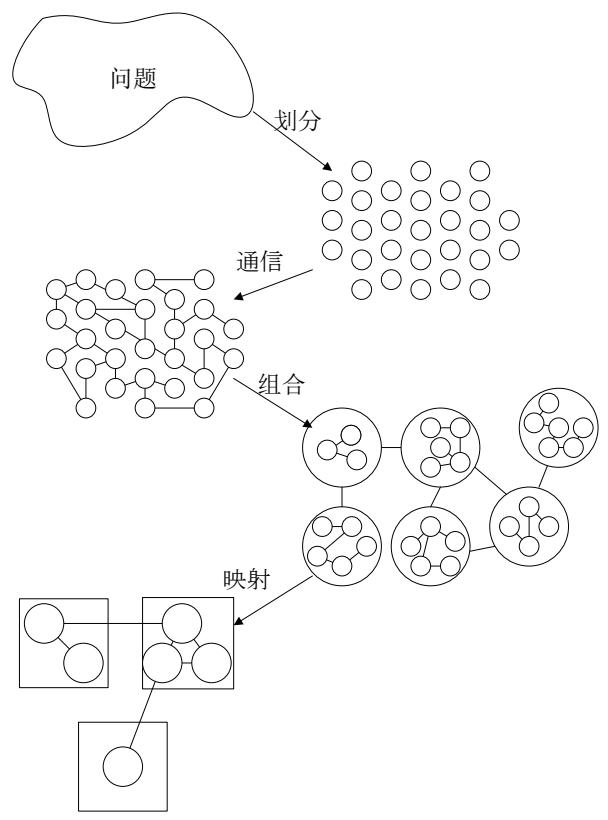

• 划分：分解成小的任务，开拓并发性；  
• 通讯：确定诸任务间的数据交换，监测划分的合理性；  
• 组合：依据任务的局部性，组合成更大的任务；  
• 映射：将每个任务分配到处理器上，提高算法的性能。

# 划分

• 方法描述  
• 域分解  
• 功能分解  
• 划分判据

# 划分方法描述

• 充分开拓算法的并发性和可扩放性；  
• 先进行数据分解(称域分解)，再进行计算功能的分解(称功能分解)；  
• 使数据集和计算集互不相交；  
划分阶段忽略处理器数目和目标机器的体系结构；  
• 主要两类划分：

• 域分解(domain decomposition)   
• 功能分解(functional decomposition)

# 域分解

划分的对象是数据，可以是算法的输入数据、中间处理数据和输出数据；  
• 将数据分解成大致相等的小数据片；  
• 划分时考虑数据上的相应操作；  
• 如果一个任务需要别的任务中的数据，则会产生任务间的通讯。

# 域分解

一维和二维数据分解

1D

2D

  
BLOCK

  
BLOCK, *

  
CYCLIC, *

  
CYCLIC

  
*,BLOCK

  
*, CYCLIC

  
BLOCK,BLOCK

  
CYCLIC,IC

# 域分解

• 三维网格的域分解，各格点上计算都是重复的。

  
1-D

  
2-D

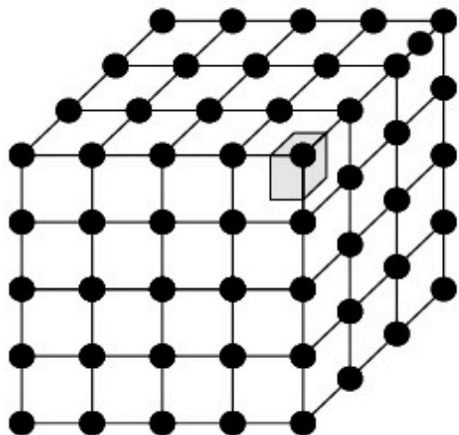  
3-D

# 域分解

. 不规则区域的分解示例：

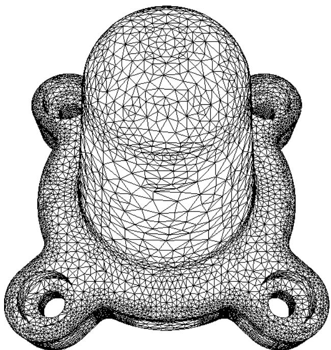

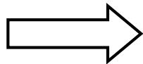

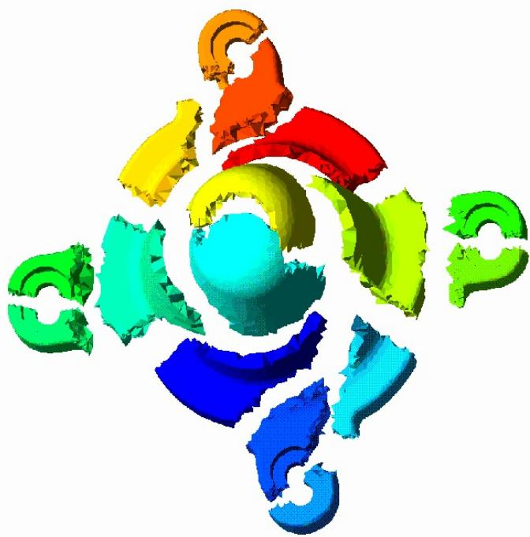

# 域分解 （递归分解）

• 示例：快速排序

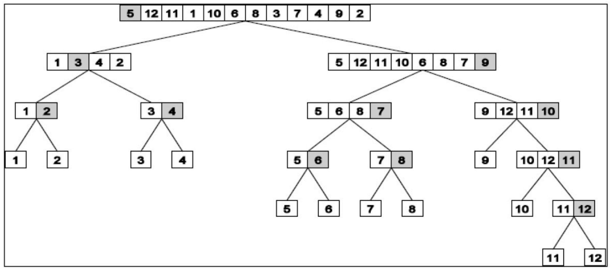

# 功能分解（任务分解）

划分的对象是计算，将计算划分为不同的任务，其出发点不同于域分解  
• 划分后，研究不同任务所需的数据。

如果这些数据不相交，则划分成功；  
• 如果数据有相当的重叠， 意味着要重新进行域分解和功能分解；

• 功能分解是一种更深层次的分解。

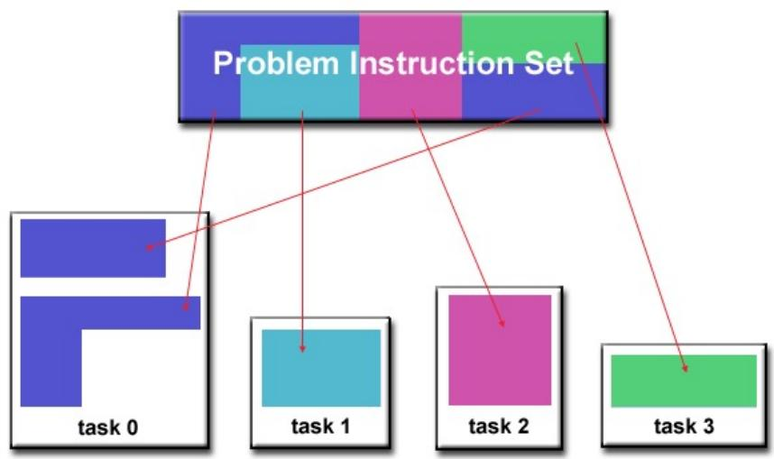

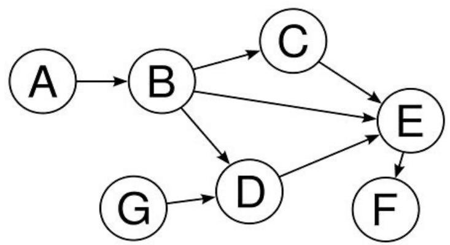

# 功能分解

# • 示例1：搜索树

• 搜索树没有明显的可分解的数据结构，但易于进行细粒度的功能分解：开始时根生成一个任务，对其评价后，如果它不是一个解，就生成若干叶结点，这些叶结点可以分到各个处理器上并行地继续搜索。

# • 示例2：气候模型

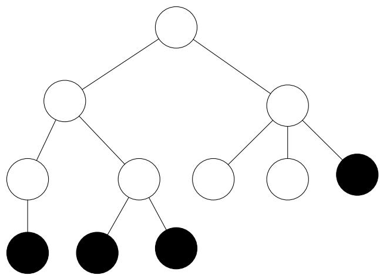

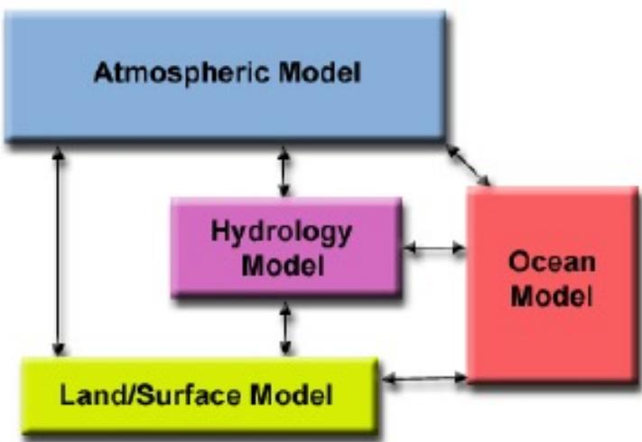

# 划分判据

• 是否具有灵活性？  
• 是否避免了冗余计算和存储？  
• 任务尺寸是否大致相当？  
• 任务数与问题尺寸是否成比例？  
• 功能分解是一种更深层次的分解，是否合理？

# 大纲

# • PCAM方法学

• 划分  
• 通讯   
• 组合  
• 映射

• 并行程序设计模式  
• 并行编程框架

# 通讯

• 方法描述  
• 四种通讯模式  
• 通讯判据

# 通讯方法描述

• 通讯是PCAM设计过程的重要阶段；  
• 划分产生的诸任务，一般不能完全独立执行，需要在任务间进行数据交流，从而产生了通讯；  
• 功能分解确定了诸任务之间的数据流；  
诸任务是并发执行的，通讯则限制了这种并发性；

# 四种通讯模式

• 局部/全局通讯   
• 结构化/非结构化通讯  
• 静态/动态通讯   
• 同步/异步通讯

# 局部通讯

• 通讯限制在一个邻域内

# 全局通讯

• 通讯非局部的  
• 例如：

• All to All   
• Master-Worker

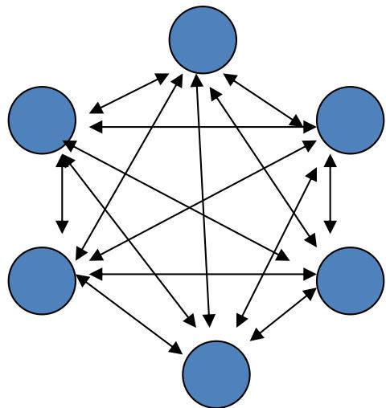

# 结构化通讯

• 每个任务的通讯模式是相同的；  
• 下面是否存在一个相同通 $i \pi$ 模式？

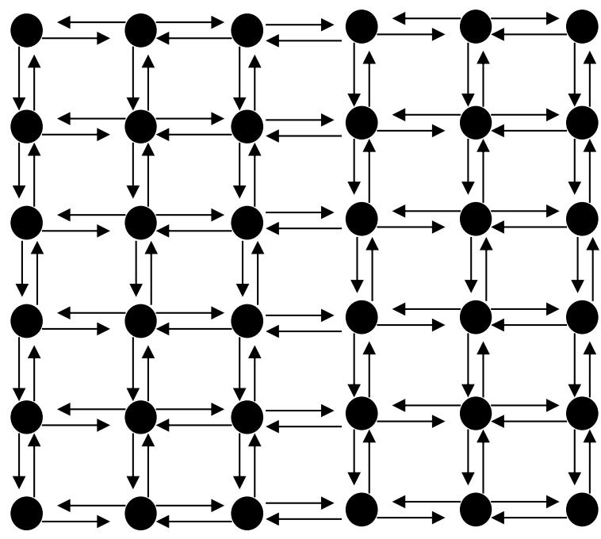

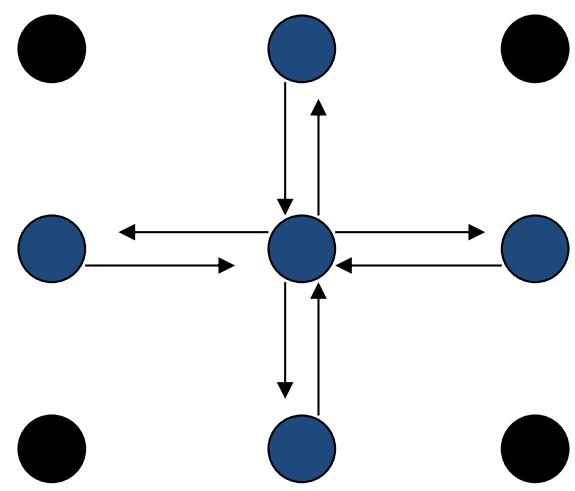

# 非结构化通讯

• 没有一个统一的通讯模式  
• 例如：无结构化网格

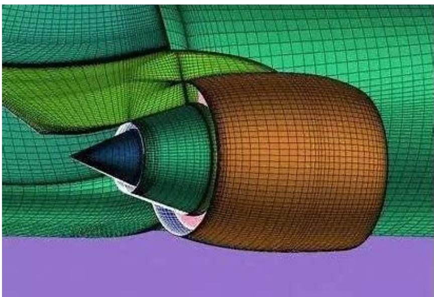

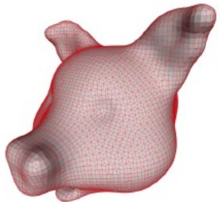

# 通讯判据

• 所有任务是否执行大致相当的通讯?  
是否尽可能的局部通讯？  
• 通讯操作是否能并行执行?  
• 同步任务的计算能否并行执行？

# 大纲

# • PCAM方法学

• 划分  
• 通讯   
. 组合  
• 映射

• 并行程序设计模式  
• 并行编程框架

# 组合

• 方法描述  
• 表面-容积效应  
• 重复计算  
• 组合判据

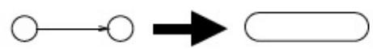  
提升数据本地性

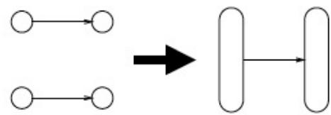  
优化通信

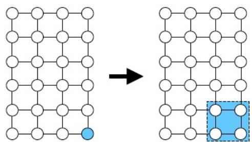  
增加任务粒度

# 方法描述

• 组合是由抽象到具体的过程  
• 将组合的任务能在一类并行机上有效的执行  
• 合并小尺寸任务，减少任务数  
• 如果任务数恰好等于处理器数，则也完成了映射过程  
• 增加任务的粒度和重复计算，可以减少通讯成本  
• 保持映射和扩展的灵活性，降低软件工程成本

# 表面-容积效应

• 通讯量与任务子集的表面成正比，计算量与任务子集的体积成正比

# 重复计算

• 重复计算减少通讯量，但增加了计算量，应保持恰当的平衡；  
• 重复计算的目标应减少算法的总运算时间；

# 重复计算

• 示例：二叉树上N个处理器求N个数的全和，要求每个处理器均保持全和。

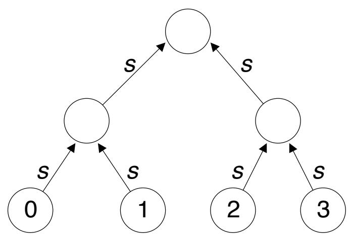

  
二叉树上求和，共需2logN步

# 重复计算

• 示例：二叉树上N个处理器求N个数的全和，要求每个处理器均保持全和。

  
蝶式结构求和，使用了重复计算，共需logN步

# Replication of Work

# ·Tradeoff replicated computation for reduced communication

Serialalgorithm:

# 组合判据

• 增加粒度是否减少了通讯成本？  
• 重复计算是否已权衡了其得益？  
• 是否保持了灵活性和可扩放性？  
• 组合的任务数是否与问题尺寸成比例?  
• 是否保持了类似的计算和通讯？  
• 有没有减少并行执行的机会？

# 大纲

# • PCAM方法学

• 划分  
• 通讯   
• 组合  
• 映射

• 并行程序设计模式  
• 并行编程框架

# 映射

• 方法描述  
• 映射需要考虑的因素  
• 映射模式  
• 映射判据

# 方法描述

每个任务要映射到具体的处理器（计算资源），定位到运行机器上；  
• 任务数大于处理器数时，存在负载平衡和任务调度问题；  
• 映射的目标：减少算法的执行时间

• 并发的任务 不同的处理器  
• 任务之间存在高通讯的 à 同一处理器

• 映射实际是一种权衡，属于NP完全问题

# 任务映射的考虑因素：计算量

Scheduleasetof tasksunderone of thefollowingassumptions:

Easy:The tasks all have equal (unit) cost.

n items

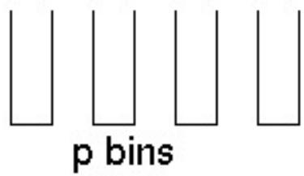

branch-free loops

Harder:The tasks have different,but known, times.

n items

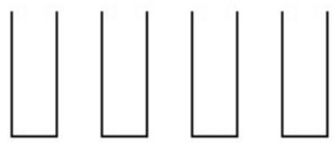

p bins

sparse matrixvector multiply

Hardest:The task costs unknown until after execution.

, search

# 任务映射的考虑因素：依赖关系

Scheduleagraph of tasks under one of thefollowingassumptions:

Easy: The tasks can execute in any order.

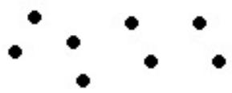

dependence free loops

Harder:The tasks have a predictable structure.

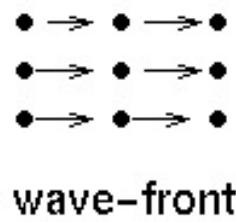

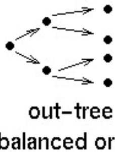

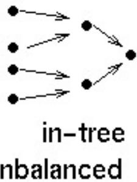

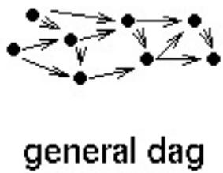

matrix computations (dense,and some sparse,Cholesky)

Hardest:The structure changes dynamically (slowly or quickly) search, sparse LU

# 任务映射的考虑因素：通信关系

Scheduleasetof tasksunderone of thefolowingassumptions:

Easy: The tasks, once created, do not communicate.

Harder:The tasks communicate in apredictable pattern.

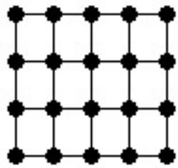  
regular

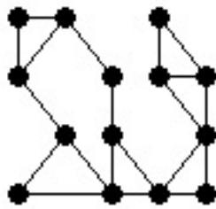  
irregular

embarrassingly parallel

PDE solver

Hardest: The communication pattern is unpredictable.

discrete event simulation

# 最小化空闲的映射技术

• 静态和动态的映射技术  
• 静态映射：

• 任务预先映射到计算资源。必须对每个任务的大小有很好的估计，即使在这种情况下，这个问题也是NP完全的

• 动态映射

• 任务在运行时映射计算资源。例 $\frac { 4 } { 3 } \sigma$ ，当部分计算任务产生于运行过程中（事先不能确定），或者任务的计算量不可预知。

# 静态映射模式

• 基于数据划分的映射  
• 基于任务图划分的映射   
• 复合的映射

# 基于数据划分的映射

• 我们可以合并数据划分和计算划分为任务，计算划分依照“拥有者进行计算”原则进行. 对稠密矩阵简单的数据分解模式是1-D按块分布模式.

row-wise distribution   

<table><tr><td>P0</td></tr><tr><td>P1</td></tr><tr><td>P2</td></tr><tr><td>P3</td></tr><tr><td>P4</td></tr><tr><td>P5</td></tr><tr><td>P6</td></tr><tr><td>P7</td></tr></table>

column-wise distribution   

<table><tr><td>P0</td><td>P1</td><td>P2</td><td>P3</td><td>P4</td><td>P5</td><td>P6</td><td>P7</td></tr></table>

# 按块数组分布模式

• 块数组分布模式也可推广到高维.

<table><tr><td>P0</td><td>P1</td><td>P2</td><td>P3</td></tr><tr><td>P4</td><td>P5</td><td>P6</td><td>P7</td></tr><tr><td>P8</td><td>P9</td><td>P10</td><td>P11</td></tr><tr><td>P12</td><td>P13</td><td>P14</td><td>P15</td></tr></table>

(a)

<table><tr><td>P0</td><td>P1</td><td>P2</td><td>P3</td><td>P4</td><td>P5</td><td>P6</td><td>P7</td></tr><tr><td>P8</td><td>P9</td><td>P10</td><td>P11</td><td>P12</td><td>P13</td><td>P14</td><td>P15</td></tr></table>

(b)

# 循环映射模式

• 96个任务映射到6个处理器（计算资源）  
• 任意两个相邻的任务都不在同一计算资源

# 基于不规则数据分解的映射

尽量将等量节点给每个计算资源,从而最小化图划分中边的计数

  
随机划分

  
按最小割划分

# 基于任务划分的映射

• 根据任务依赖图将各个任务映射到计算资源  
• 确定一个通用任务依赖图的优化映射是一个NP完全问题  
• 对结构化图有好的启发式方法存在

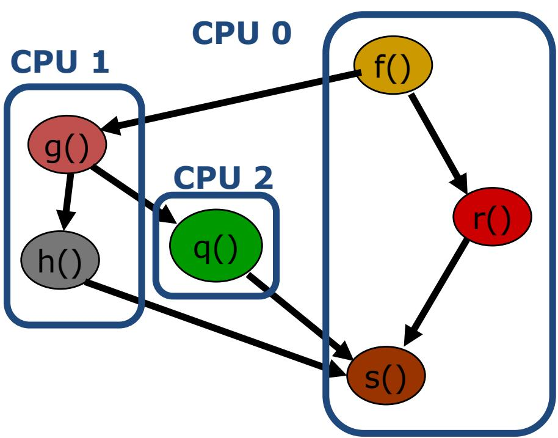

# 动态映射模式

动态映射也称为动态负载均衡，因为负载均衡是动态调度的主要动机  
. 动态映射模式可以是集中式的和分布式的。

# 集中式动态映射

• 进程被设定为主和从   
• 当一个从进程完成工作完便向主进程请求新工作  
• 当从进程增加时，主进程可能成为瓶颈  
为了缓和此问题，从进程可以每一次拿多个任务（块调度）  
• 选取大的块尺寸也可能导致显著的负载不均衡  
• 有一些模式用于随着计算进行而逐渐减小块尺寸

# 分布式动态映射

• 每个进程可以发送任务给其它任务或从其它接收任务

• P2P方式（每个任务地位相同，调度方案需各任务协商）  
. 与应用或硬件匹配的调度模式

• 减轻了集中式模式的瓶颈  
四方面关键问题（与应用相关）：

• 发送和接收的进程 $\frac { 4 } { 3 } \sigma$ 何配对；  
• 哪个进程初始化传输；  
• 传多少数据；  
• 何时启动传输

# 映射的原则：最小化交互开销

• 最大化数据局部性

只要可能就复用中间数据，重建计算以使数据在较小的窗口内得到重用

• 最小化数据交换量  
• 最小化交互的频度  
• 最小化竞争和热点  
• 计算与通信重叠：

• 使用非阻塞式通信；  
多线程；  
• 预取以隐藏时延

• 使用成组通信而非点对点通信

# 映射判据

• 采用集中式负载平衡方案，是否存在通讯瓶颈？  
• 采用动态负载平衡方案，调度策略的成本如何？

# PCAM小结

• 划分  
• 分解为可并行执行的任务（域分解和功能分解）  
• 通讯   
• 任务间的数据交换  
• 组合  
• 合并部分任务使得计算过程更高效  
• 映射   
• 将任务分配到处理器，并保持负载平衡

# 大纲

• PCAM方法学

• 划分  
• 通讯   
• 组合  
• 映射

• 并行程序设计模式  
• 并行编程框架

# 并行程序设计模式

# §设计模式

–设计模式描述了在特定条件下解决重复出现问题的有效方法，能够将成功的经验记录下来，供面临相似问题的研发人员参考。每一个模式都包括模式名称、问题、解决方案、效果四个基本要素。

§ 专门针对并行程序设计的模式则是并行程序设计模式

# 并行程序设计模式

• 分析并发性  
• 算法结构  
• 支持结构  
• 实现机制

# 分析并发性

§ 关注应用问题的宏观分析，完成问题的分解

# 算法结构

§ 细化设计方案，使得设计更接近能够并行执行的程序

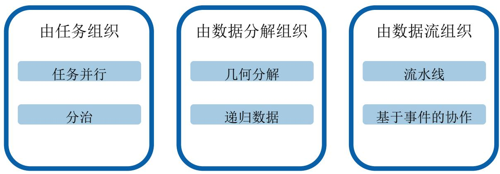

# 支持结构

# 算法转换为程序

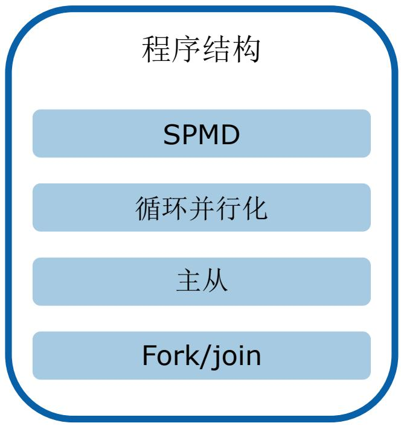

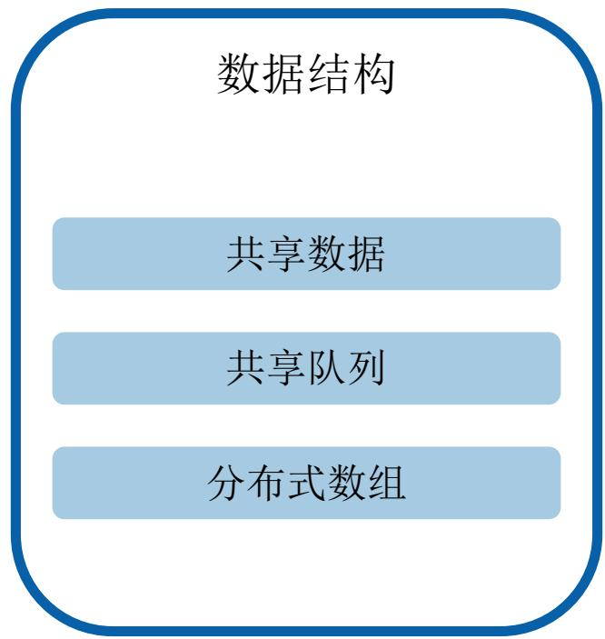

# 实现机制

将高层次空间中的模式映射到具体的并行计算环境，用于描述进程及线程的管理和数据交换等，一般不直接表现为模式。

执行单元（UE）管理

线程控制

进程控制

同步

Memory sync/fences

互斥锁

路障

通信

消息传递

组通信

其他通信方式

# 大纲

• PCAM方法学

• 划分  
• 通讯   
• 组合  
• 映射

• 并行程序设计模式  
• 并行编程框架

# 并行编程框架

• 出发点

. 简化一类问题的并行编程难度和复杂度

• 实现方式

• 对并行算法的抽象描述  
. 提供编程API  
• 兼容多种并行计算平台的运行时环境

• 自动任务分配和调度  
• 运行期监控和容错

# 结束语

• 从应用问题出发，分析设计并行算法，有一定章法可循  
• 但并行计算平台的多样性，致使并行程序设计开发的复用性不足，性能优化困难  
• 并行编程框架是并行计算方法与技术的集成  
• 我国高性能计算基础软件亟需：

• 并行编程框架   
• 高性能算法库  
• 编译器与编译环境