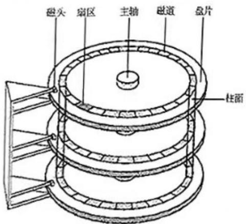
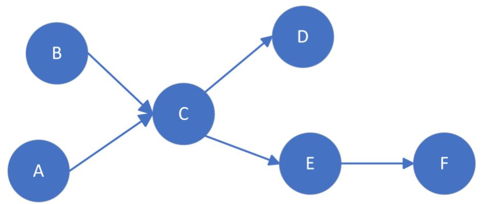

本资料为个人整理，禁止广泛传播

本资料为往年考试真题回忆版，可能与实际真题有出入，也不一定反映了您使用该资料当年试题的题型、难度、知识点覆盖范围。

务必不要直接拿该资料向任课老师询问 wby 每年都会挂一些这样的例子，因为你问了那老师肯定会改题的。

在正文部分中，正常字体为黑色，加红的字体是本人做出的额外声明。

1.关于虚拟文件系统，下列说法正确的是( )
A.虚拟文件系统是运行在虚拟内存的文件系统
B.VFS 可以加快文件系统的访问速度
C.VFS 定义了可访问不同文件系统的统一接口
D.VFS 只能访问本地文件系统，不能访问网络文件系统

2. 某进程的段表内容如下所示

<table><tr><td>段号</td><td>段长</td><td>内存起始地址</td><td>权限</td><td>状态</td></tr><tr><td>0</td><td>100</td><td>6000</td><td>只读</td><td>在内存中</td></tr><tr><td>1</td><td>200</td><td>——</td><td>读写</td><td>不在内存中</td></tr><tr><td>2</td><td>100</td><td>4000</td><td>读写</td><td>在内存中</td></tr></table>

当访问段号为 2，段内地址为 400 的逻辑地址时，进行地址转换的结果是( )
A.段缺失异常
B.得到内存地址 4400
C.越权异常
D.越界异常

3.某文件系统采用索引节点方式。用户在目录中新建文件 F 时，文件系统不会做的是( )
A. 初始化文件 F 的索引节点
B. 在目录文件中写入 F 的索引节点号
C. 在目录文件中写入 F 的访问权限信息
D. 在目录文件中增加一条文件 F 对应的目录项

4. 下列选项中，文件系统能为机械硬盘和固态硬盘提供的功能是( )
A. 划分扇区
B. 确定盘块大小
C. 降低导道时间
D. 实现均衡磨损

5.下面关于中断和异常的说法中，错误的是()

A.中断或异常发生时，CPU处于内核态  
B.每个系统调用都有对应的内核服务  
C.中断处理程序开始执行时，CPU处于内核态  
D.系统添加新类型设备时，需注册相应的中断服务例程

6.下列选项中，操作系统在终止进程时不一定执行的是( )。
A.终止子进程
B.回收分配的内存资源
C.撤销进程 PCB
D.回收进程占用的共享资源

7.在采用页式虚拟存储管理方式的系统中, 当发生上下文切换时, 下列寄存器中操作系统不会更新的是( )
A.通用寄存器
B.页表基址寄存器
C.程序计数器
D.内核中断向量表基址寄存器

8. 若进程 P 中有一个线程 T，打开文件后获得 fd，再创建线程 Ta、Tb，则线程 Ta、Tb 可共享的资源是()。I. 进程 P 的地址空间 II. 线程 T 的栈 III. fd
A. 仅 I
B. 仅 I、III
C. 仅 II、III
D. I、II、III

9.以下系统调用中，包含文件按名查找功能的系统调用是( )
A. open( )
B. read( )
C. write( )
D. close( )

10.RR(时间片轮转调度算法)调度，时间片为 5ms，有 10 个进程，初始状态均处于就绪队列，执行结束前仅处于执行态或就绪态，队尾进程 P 所需 CPU 时间最短，为

25ms，不考虑系统开销。则 P 的周转时间为()。
A.250ms
B.200ms
C.205ms
D.295ms

11.磁道数 400(号为 0\~399)，用循环扫描算法(CSCAN)进行调度。完成对 200 号磁道的请求后，磁头向磁道号减小的方向移动，并且仅在此方向移动时才响应请求，若还有 7 个请求，磁道号分别为 300,120,110,0,160,210,399,则完成上述请求后磁头移动的距离是()
A.599
B.619
C.788
D.799

12.下列选项中, 支持文件长度可变、随机访问的最合适的磁盘存储空间分配方式是( )
A.索引分配
B.链接分配
C.连续分配
D.动态分区分配

13.下列关于父进程与子进程的叙述中，错误的是( )
A.父进程与子进程可以并发执行
B.父进程与子进程共享虚拟地址空间
C.父进程与子进程有不同的进程控制块
D.父进程与子进程不能同时使用同一临界资源

14.下列准则中，实现临界区互斥机制必须遵循的是( )
I、两个进程不能同时进入临界区
II、允许进程访问空闲的临界资源.
III、进程等待进入临界区的时间是有限的
IV、不能进入临界区的执行态进程立即放弃 CPU

A.仅1、4  
B.仅2、3  
C.仅1、2、3  
D.仅1、3、4

15.下列选项中，通过系统调用完成的操作是( )
A.页置换
B.进程调度
C.创建新进程
D.生成随机整数

16.在采用二级页表的分页系统中，CPU 页表基址寄存器中的内容是( )
A.当前进程的一级页表的起始虚拟地址
B.当前进程的一级页表的起始物理地址
C.当前进程的二级页表的起始虚拟地址
D.当前进程的二级页表的起始物理地址

17.假定下列指令已装入指令寄存器, 则执行时不可能导致 CPU 从用户态变为内核态 (系统态)的是()。

A. DIV R0、RI; (R0)/(R1)→R0

B.INT n; 产生软中断

CNOT R0; 寄存器 R0 的内容取非

D. MOV R0、addr; 把地址 addr 的内存数据放入寄存器 R0 中

18.系统为某进程分配了 4 个页框，该进程已访问的页号序列为 2,0.2,9,3,4,2,8,2,4,8,4,5.若进程要访问的下一页的页号为 7，依据 LRU 算法，应淘汰页的页号是()。
A.2
B.3
C.4
D.8

19. 文件系统用位图法表示磁盘空间的分配情况位图存于磁盘的 32\~127 号连续磁盘块中，每个盘块占 1024 个字节，盘块和块内字节均从 0 开始编号，设要释放的盘块号为 409612，则位图中要修改的位所在的盘块号和块内字节序号分别是( )
A.81、1
B.81、2
C.82、1
D.82、2

20. 设系统缓冲区和用户工作区均采用单缓冲, 从外设读入 1 个数据块到系统缓冲区的时间为 $100 \mathrm{~ms}$ , 从系统缓冲区读入 1 个数据块到用户工作区的时间为 $5 \mathrm{~ms}$ , 对用户工作区中的 1 个数据块进行分析的时间为 $90 \mathrm{~ms}$ , 进程从外设读入并分析 2 个数据块的最短时间是( )
A.300 ms
B. 200 ms
C.295 ms
D390 ms

21.某系统有 n 台互斥使用的同类设备，3 个并发进程分别需要 x、y、z 台设备，可确保系统不发生死锁的设备数 n 最小为()
A. $x + y + z - 3$ B. $x + y + z - 2$ C. $x + y + z - 1$ D. $x + y + z$

22.对于采用虚拟内存管理方式的系统，下列关于进程虚拟地址空间的叙述中，错误的是()。
A.每个进程都有自己独立的虚拟地址空间
B.C 语言中 malloc()函数返回的是虚拟地址
C.进程对数据段和代码段可以有不同的访问权限
D.虚拟地址的大小由主存和硬盘的大小决定

23.系统采用二级反馈队列调度算法进行进程调度，就绪队列 Q1 采用时间片轮转调度算法，时间片为 10ms；就绪队列 Q2 采用短进程优先调度算法，系统优先调度 Q1 队列中的进程，当 Q1 为空时系统才会调度 Q2 中的进程，新创建的进程首先进入 Q1，Q1 中的进程执行一个时间片后，若未结束，则转入 Q2。若当前 Q1，Q2 为空，系统依次创建进程 P1, P2 后立即开始调度, P1, P2 需要的时间分别为 30ms 和 20ms, 则进程 P1, P2 在系统中的平均等待时间为
A.25ms.
B.20ms.
C.15ms
D.10ms

24. 假设 3 个作业到达系统的时刻和运行时间如下表所示，

<table><tr><td>作业</td><td>到达时间</td><td>运行时间</td></tr><tr><td>J1</td><td>0</td><td>5</td></tr><tr><td>J2</td><td>2</td><td>3</td></tr><tr><td>J3</td><td>4</td><td>2</td></tr></table>

若分别采用高响应比优先和短作业优先调度算法，则作业的执行顺序分别是( )。
A. 高响应比优先: J1、J3、J2; 短作业优先: J1、J2、J3
B. 高响应比优先: J1、J3、J2; 短作业优先: J1、J3、J2
C. 高响应比优先: J3、J1、J2; 短作业优先: J3、J2、J1
D. 高响应比优先: J1、J2、J3; 短作业优先: J1、J3、J2

25.某计算机按字节编址，其动态分区内存管理采用最佳适应算法，每次分配和回收内存后都对空闲分区链按分区大小从小到大重新排序，当前空闲分区信息如下表所示

<table><tr><td>分区起始地址</td><td>20K</td><td>500K</td><td>1000K</td><td>200K</td></tr><tr><td>分区大小</td><td>40KB</td><td>80KB</td><td>100KB</td><td>200KB</td></tr></table>

回收起始地址为 60K、大小为 140KB 的分区后，系统中空闲分区的数量、空闲分区链第一个分区的起始地址和大小分别是( )
A. 3、20K、380KB
B. 3、500K、80KB
C. 4、20K、180KB

D.4、500K、80KB

二、(10 分)系统中有三个进程 P1、P2、P3 及三类资源 A.B.C，资源的总数量为(3,4,4). 若某时刻系统分配资源的情况如下表所示。

<table><tr><td></td><td colspan="3">已分配资源</td><td colspan="3">最大资源需求</td></tr><tr><td></td><td>A</td><td>B</td><td>C</td><td>A</td><td>B</td><td>C</td></tr><tr><td>P1</td><td>1</td><td>0</td><td>1</td><td>1</td><td>0</td><td>2</td></tr><tr><td>P2</td><td>0</td><td>2</td><td>0</td><td>2</td><td>4</td><td>3</td></tr><tr><td>P3</td><td>1</td><td>0</td><td>1</td><td>1</td><td>2</td><td>3</td></tr></table>

(1)此时系统是否安全?若安全，请列出所有的安全序列。(4分)

(2)此时，P2 和 P3 均提出申请 1 个资源 B，根据银行家算法，请判断是否可以分别满足他们的请求吗?可以同时满足他们的请求么?需要给出详细的理由(6 分)

## 三、(10 分)在某 UNIX 文件系统中

(1)该文件系统的目录项由文件名和索引结点号构成，若每个目录项长度为 64 字节，其中 4 字节存放索引结点号，60 字节存放文件名，则该文件系统能创建的文件数量的上限是()(2 分)

(2)在某个目录下有三个文件

<table><tr><td>inode 号</td><td>文件名</td><td>文件类型</td><td>链接数</td><td>符号链接内容</td></tr><tr><td>1234</td><td>a</td><td>普通文件</td><td>2</td><td>——</td></tr><tr><td>1234</td><td>b</td><td>普通文件</td><td>2</td><td>——</td></tr><tr><td>1218</td><td>c</td><td>符号链接</td><td>1</td><td>c-&gt;a</td></tr></table>

根据该表格中的信息可知，inode 1234 的链接数是多少?如果删除文件 a 成功之后，inode 1234 的链接数是多少?此时访问文件 c 的结果是什么?(3 分)

(3)在索引节点中存放直接索引指针 10 个, 一级、二级、三级索引指针各 1 个。磁盘块大小为 $1 \mathrm{KB}$ , 每个索引指针占 4 个字节。则该文件系统支持的文件最多可以包含多少个数据块? (结果中不包含间接指针块, 结果要求表达为一个十进制整数, 要求有完整的计算过程)(3 分)

四、(10 分)某计算机按字节编址，采用页式虚拟存储管理方式，虚拟地址和物理地址的地址空间均为 32 位。页表项的大小为 4. 字节，页大小为 64KB、进程 P 的页表被装载到从物理地址：65400000H 开始的连续主存空间中。请回答下列问题。

(1)若 CPU 在执行进程 P 的过程中，访问虚拟地址 12345678H 时，TLB 快表未命中，访问页表时发现该页面未在内存中，经过缺页异常处理和 MME 地址转换后得到的物理地址是 BAB45678H。若访问 TLB 时间为 10ns，访问内存时间为 100ns，处理缺页中断（含同步更新 TLB 和页表）的时间为 100ms，则从开始访问此虚拟地址直到最后取出该地址中的数据的总时间为多少？（最终结果单位要求为 ns,给出详细的计算过程和说明）（4 分）

(2)在此次缺页异常处理过程中：需要为所缺页分配页框并更新相应的页表项，则该页表项的物理地址是什么？该页表项中的页框号更新后的值是什么？（要求答案用十六进制表示，给出详细的计算过程）（6分）

五、(10 分)磁盘存储器是一种高速、大容量的随机存储设备。磁盘由一张或多张盘片组成，每张盘片分正反两面，每面可划分成若干磁道，每条磁道又分为若干个扇区。

每个盘面配有一个读/写磁头，所有的读/写磁头被固定在移动臂上同时移动。将磁头按从上到下次序编号，称为磁头号。磁头位置下各个盘面上的磁道处于同一个圆柱面上，这些磁道组成了一个柱面。柱面号、磁头号和扇区号均从0开始编号。磁盘在写入时按柱面顺序存放，优先从最外侧的柱面0开始使用，填满一个柱面后再使用下一个柱面。同一个柱面内的各个磁道，则从上向下依次使用，填满一个磁道再填入下一个磁道。以下是磁盘的示意图（仅示意磁盘的基本结构，与本题后面的具体参数无关）

某计算机系统中的磁盘有 300 个柱面，每个柱面有 10 个磁道，每个磁道有 200 个扇区，扇区大小为 512B，文件系统的每个簇包含 2 个扇区。请回答下列问题，每步均要求给出详细的计算过程。

(1) 磁盘的容量是多少(结果单位 KB, 其中 K=1024)? (2 分)

(2) 假设磁头在 85 号柱面上, 此时有 4 个磁盘访问请求, 簇号分别为 100260、60005、10,1660 和 119560, 若采用最短寻道时间优先(SSTF)调度算法, 则系统访问簇的先后次序是什么; 访问过程中磁盘臂共移动了多少个柱面? (4 分)

(3)设磁盘以 6000 转/分的速度匀速旋转, 磁盘臂带动磁头移动的速度为 $1 \mathrm{~ms} / \text { 柱面 }$ 。则读取上述 4 个簇的数据共需要多少时间? 可忽略具体扇区在磁道中分布的位置, 假设为访问磁道中一个随机扇区即可。(4 分)

六、某进程的两个线程 T1 和 T2 并发执行 A、B、C、D、E 和 F 共 6 个操作，其中，T1 执行 A、E 和 F，T2 执行 B、C 和 D。下图表示上述 6 个操作的执行顺序所必须满足的约束：C 在 A 和 B 完成后执行，D 和 E 在 C 完成后执行，F 在 E 完成后执行。请补充完整信号量的 P、V 操作描述 T1 和 T2 之间的同步关系，并说明所用信号量的初值。

Semaphore S1=\_\_\_\_(1)

Semaphone S2=\_\_\_\_(2)

说明：在横线(1)(2)上填写信号量的初值，在横线(3)\~(10)上必要的位置上填写 P、V 操作，不是每条线上都需要填写 P、V 操作，不需要填写的在横线上划“\”，需要的话一条横线上也可以填写多条 P、V 操作。(这里的代码没有 while 无限循环，因此不用考虑这个情况)