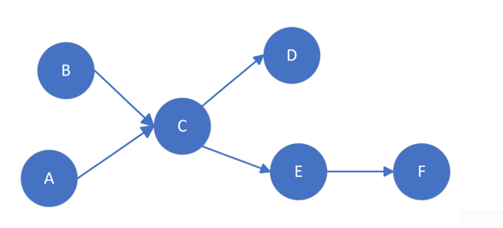

# 进程管理

## 进程控制

### 24252 - 第6题

下列选项中，操作系统在终止进程时不一定执行的是( )。
A. 终止子进程
B. 回收分配的内存资源
C. 撤销进程 PCB
D. 回收进程占用的共享资源

> [!NOTE] 进程终止
> 进程终止时操作系统需要回收该进程占用的所有资源，包括内存、文件、I/O设备等，并撤销其PCB。
> 子进程是否随父进程终止而终止取决于系统设计——某些系统中子进程成为孤儿进程，由 init 进程接管。

### 解析：

操作系统终止进程时的**必然操作**：
- **回收内存资源**（B）—— 必须回收进程占用的内存，否则造成内存泄漏
- **撤销 PCB**（C）—— 进程存在的唯一标识，进程终止后必须撤销
- **回收共享资源**（D）—— 释放进程占用的共享资源（如文件锁、共享内存），否则其他进程无法获取

**不一定执行的操作**：
- **终止子进程**（A）—— 某些操作系统（如 UNIX）中父进程终止后，子进程变为孤儿进程，由 init 进程接管，并不随父进程终止。子进程终止是选择性的，并非必须

**答案：A**

---

### 24252 - 第13题

下列关于父进程与子进程的叙述中，错误的是( )
A. 父进程与子进程可以并发执行
B. 父进程与子进程共享虚拟地址空间
C. 父进程与子进程有不同的进程控制块
D. 父进程与子进程不能同时使用同一临界资源

> [!NOTE] fork() 语义
> 父进程通过 fork() 创建子进程后，子进程获得父进程地址空间的**副本**（写时拷贝 COW 优化），但拥有独立的虚拟地址空间和独立的 PCB。

> [!NOTE] 临界资源
> 任何两个进程（包括父子进程）都不能同时进入同一临界资源的临界区，这是互斥的基本要求。

### 解析：

逐项分析：
- **A** ✓——父进程与子进程可以并发执行（在多CPU系统或分时系统中）
- **B** ✗——错误。父进程与子进程拥有**独立的虚拟地址空间**。虽然 fork() 后内容相同，但它们是不同的地址空间副本
- **C** ✓——每个进程有唯一的 PCB，父进程与子进程 PCB 不同
- **D** ✓——父子进程也不能同时使用同一临界资源，互斥适用于所有进程

**答案：B**

---

## 线程

### 24252 - 第8题

若进程 P 中有一个线程 T，打开文件后获得 fd，再创建线程 Ta、Tb，则线程 Ta、Tb 可共享的资源是( )。
I. 进程 P 的地址空间
II. 线程 T 的栈
III. fd
A. 仅 I
B. 仅 I、III
C. 仅 II、III
D. I、II、III

> [!NOTE] 线程共享资源
> 同一进程内的线程共享：进程地址空间、文件描述符表、信号处理函数、当前工作目录等。
> 每个线程独享：线程栈（包括栈指针和栈内容）、寄存器上下文、线程 ID、错误码（errno）、信号掩码。

### 解析：

- **I** ✓——同一进程的所有线程共享进程的地址空间（包括代码段、数据段、堆）
- **II** ✗——每个线程有**独立的栈空间**，线程 T 的栈属于 T 独有，Ta、Tb 不能访问
- **III** ✓——文件描述符属于进程级资源，同一进程内的所有线程共享文件描述符表，故 fd 可共享

可共享的是 I 和 III。

**答案：B（仅 I、III）**

---

## 进程调度

### 24252 - 第10题

RR（时间片轮转调度算法）调度，时间片为 5ms，有 10 个进程，初始状态均处于就绪队列，执行结束前仅处于执行态或就绪态，队尾进程 P 所需 CPU 时间最短，为 25ms，不考虑系统开销。则 P 的周转时间为( )。
A. 250ms
B. 200ms
C. 205ms
D. 295ms

> [!NOTE] 时间片轮转（RR）调度
> 系统将就绪进程按 FCFS 排成就绪队列，每次从队首取进程运行一个时间片。若进程未完成则放回队尾。周转时间 = 完成时间 − 到达时间。

> [!NOTE] 本题要点
> P 所需时间最短（25ms），其他 9 个进程各需 >25ms。因此前 4 轮（每轮所有进程各执行 5ms）中没有任何其他进程完成。

### 解析：

P 需要 25ms，时间片 5ms，故需要 5 个时间片。

**每轮时间**：10 个进程 × 5ms = 50ms

**完成过程**：
- 第 1 轮（0–50ms）：P 在第 10 个位置执行 5ms，剩余 20ms
- 第 2 轮（50–100ms）：P 执行 5ms，剩余 15ms
- 第 3 轮（100–150ms）：P 执行 5ms，剩余 10ms
- 第 4 轮（150–200ms）：P 执行 5ms，剩余 5ms
- 第 5 轮（200–250ms）：前 9 个进程各执行 5ms（225ms），P 最后执行 5ms 后完成（250ms）

**P 的周转时间** = 250ms − 0 = **250ms**

**答案：A**

---

### 24252 - 第23题

系统采用二级反馈队列调度算法进行进程调度，就绪队列 Q1 采用时间片轮转调度算法，时间片为 10ms；就绪队列 Q2 采用短进程优先调度算法，系统优先调度 Q1 队列中的进程，当 Q1 为空时系统才会调度 Q2 中的进程，新创建的进程首先进入 Q1，Q1 中的进程执行一个时间片后，若未结束，则转入 Q2。若当前 Q1、Q2 为空，系统依次创建进程 P1、P2 后立即开始调度，P1、P2 需要的时间分别为 30ms 和 20ms，则进程 P1、P2 在系统中的平均等待时间为( )。
A. 25ms
B. 20ms
C. 15ms
D. 10ms

> [!NOTE] 多级反馈队列调度
> - 新进程进入最高优先级队列 Q1（RR，时间片 10ms）
> - Q1 中执行一个时间片未完成的进程降级到 Q2
> - Q2 采用短进程优先（SPF）
> - 仅当 Q1 为空时才调度 Q2

### 解析：

**调度过程：**

| 时间 | 事件 | 说明 |
|:---:|:----|:----|
| 0ms | P1 进入 Q1，开始执行 | P1 先被创建，在 Q1 队首 |
| 0–10ms | P1 在 Q1 执行 | 剩余 20ms，未完成 → 进入 Q2 |
| 10–20ms | P2 在 Q1 执行 | 剩余 10ms，未完成 → 进入 Q2 |
| 20ms | Q1 为空，调度 Q2 | Q2 中有 P1（需 20ms）、P2（需 10ms） |
| 20–30ms | P2 在 Q2 执行（SPF） | P2 剩余 10ms < P1 剩余 20ms，先执行 P2，完成 |
| 30–50ms | P1 在 Q2 执行 | P1 剩余 20ms 执行完毕 |

**等待时间计算：**
- **P1**：到达 0ms → 执行 0–10ms → 等待 10–30ms（共 20ms）→ 执行 30–50ms。等待时间 = **20ms**
- **P2**：到达 0ms → 等待 P1 执行 0–10ms（共 10ms）→ 执行 10–20ms → 立即进入 Q2 执行 20–30ms。等待时间 = **10ms**

**平均等待时间** = (20 + 10) / 2 = **15ms**

**答案：C**

---

### 24252 - 第24题

假设 3 个作业到达系统的时刻和运行时间如下表所示，

| 作业 | 到达时间 | 运行时间 |
|:---:|:--------:|:--------:|
| J1  | 0        | 5        |
| J2  | 2        | 3        |
| J3  | 4        | 2        |

若分别采用高响应比优先和短作业优先调度算法，则作业的执行顺序分别是( )。
A. 高响应比优先：J1、J3、J2；短作业优先：J1、J2、J3
B. 高响应比优先：J1、J3、J2；短作业优先：J1、J3、J2
C. 高响应比优先：J3、J1、J2；短作业优先：J3、J2、J1
D. 高响应比优先：J1、J2、J3；短作业优先：J1、J3、J2

> [!NOTE] 高响应比优先（HRRN）
> 响应比 $R_p = 1 + \dfrac{\text{等待时间}}{\text{运行时间}}$。每次调度时选择响应比最高的作业执行。

> [!NOTE] 短作业优先（SJF）
> 每次调度时选择运行时间最短的作业执行（非抢占式）。

### 解析：

**高响应比优先（HRRN）：**

| 时刻 | 就绪作业 | 响应比计算 | 选中 |
|:---:|:--------|:-----------|:----:|
| 0 | J1 | 仅 J1 到达 | **J1** |
| 5 | J2, J3 | J2: $1 + (5-2)/3 = 2$；J3: $1 + (5-4)/2 = 1.5$ | **J2** |
| 8 | J3 | 仅 J3 | **J3** |

HRRN 执行顺序：**J1 → J2 → J3**

**短作业优先（SJF，非抢占式）：**

| 时刻 | 就绪作业 | 运行时间 | 选中 |
|:---:|:--------|:--------:|:----:|
| 0 | J1 | 仅 J1 到达 | **J1** |
| 5 | J2(3ms), J3(2ms) | J3 最短 | **J3** |
| 7 | J2 | 仅 J2 | **J2** |

SJF 执行顺序：**J1 → J3 → J2**

**答案：D**（HRRN: J1、J2、J3；SJF: J1、J3、J2）

---

## 同步与互斥

### 24252 - 第14题

下列准则中，实现临界区互斥机制必须遵循的是( )。
I. 两个进程不能同时进入临界区
II. 允许进程访问空闲的临界资源
III. 进程等待进入临界区的时间是有限的
IV. 不能进入临界区的执行态进程立即放弃 CPU

A. 仅 I、IV
B. 仅 II、III
C. 仅 I、II、III
D. 仅 I、III、IV

> [!NOTE] 临界区互斥的四个准则
> 1. **忙则等待（互斥）**：同一时间最多一个进程在临界区中
> 2. **空闲让进**：临界资源空闲时，应允许一个进程进入
> 3. **有限等待**：进程从申请到进入临界区的时间有限，不会无限等待
> 4. **让权等待（可选）**：不能进入临界区的进程应释放 CPU（非必须，某些方案如自旋锁不满足）

### 解析：

- **I** ✓ ——忙则等待，互斥的基本要求
- **II** ✓ ——空闲让进
- **III** ✓——有限等待，避免饥饿
- **IV** ✗ ——让权等待是推荐的但不是必须的（例如自旋锁就不释放 CPU）

必须遵循的是 I、II、III。

**答案：C**

---

### 24252 - 第六题

某进程的两个线程 T1 和 T2 并发执行 A、B、C、D、E 和 F 共 6 个操作，其中，T1 执行 A、E 和 F，T2 执行 B、C 和 D。下图表示上述 6 个操作的执行顺序所必须满足的约束：C 在 A 和 B 完成后执行，D 和 E 在 C 完成后执行，F 在 E 完成后执行。请补充完整信号量的 P、V 操作描述 T1 和 T2 之间的同步关系，并说明所用信号量的初值。

```
Semaphore S1=____(1)
Semaphore S2=____(2)
```

```
Thread T1:                    Thread T2:
A;                            B;
____(3)                       ____(4)
____(5)                       C;
E;                            ____(6)
____(7)                       D;
____(8)
F;
```

> [!NOTE] P/V 操作
> - **P(S)**：wait 操作，S = S − 1；若 S < 0 则进程阻塞
> - **V(S)**：signal 操作，S = S + 1；若 S ≤ 0 则唤醒一个阻塞进程

> [!NOTE] 同步关系
> 前驱关系：A → C, B → C, C → D, C → E, E → F。其中 T1 执行 A→E→F，T2 执行 B→C→D。

### 解析：

前驱图分析：
- A（T1) 和 B（T2）完成后才能执行 C（T2）→ T1 执行完 A 后通知 T2 可以执行 C
- C（T2）完成后才能执行 D（T2）和 E（T1）→ T2 执行完 C 后通知 T1 可以执行 E
- E（T1）完成后才能执行 F（T1）→ T1 内部顺序执行

需要两个信号量：
- **S1**：控制 A 完成后 C 才能开始（T1 → T2）。初值 = 0
- **S2**：控制 C 完成后 E 才能开始（T2 → T1）。初值 = 0

**信号量初值：**
- (1) **S1 = 0**
- (2) **S2 = 0**

**P/V 操作位置：**
- (3) **V(S1)** ——A 执行完后通知 T2：C 可以开始了
- (4) **P(S1)** ——T2 等待 C 的条件（A 完成且 B 完成）
- (5) **\**——不需要（B 完成后已经可以执行 C，无需额外同步）
- (6) **V(S2)** ——C 执行完后通知 T1：E 可以开始了
- (7) **P(S2)** ——T1 等待 E 的条件（C 完成）
- (8) **\**——E 完成后顺序执行 F，无需同步

---

# 内存管理

## 分段存储管理

### 24252 - 第2题

某进程的段表内容如下所示

| 段号 | 段长 | 内存起始地址 | 权限 | 状态 |
|:---:|:----:|:-----------:|:---:|:----:|
| 0   | 100  | 6000        | 只读 | 在内存中 |
| 1   | 200  | ——          | 读写 | 不在内存中 |
| 2   | 100  | 4000        | 读写 | 在内存中 |

当访问段号为 2，段内地址为 400 的逻辑地址时，进行地址转换的结果是( )
A. 段缺失异常
B. 得到内存地址 4400
C. 越权异常
D. 越界异常

> [!NOTE] 分段地址转换
> 逻辑地址 = (段号, 段内偏移)。地址转换步骤：
> 1. 检查段号是否越界
> 2. 检查段是否在内存（状态）
> 3. 检查段内偏移是否超过段长（越界检查）
> 4. 检查权限是否匹配
> 5. 计算物理地址 = 段起始地址 + 段内偏移

### 解析：

访问 `(段号=2, 段内地址=400)`：

1. **段号检查**：段号 2 在段表范围内 ✓
2. **状态检查**：状态为"在内存中" ✓
3. **越界检查**：段 2 的段长为 100，段内地址 400 > 100 → **越界异常** ✗
4. 越界异常后不再继续检查权限和计算地址

**答案：D（越界异常）**

---

## 分页存储管理

### 24252 - 第7题

在采用页式虚拟存储管理方式的系统中，当发生上下文切换时，下列寄存器中操作系统不会更新的是( )。
A. 通用寄存器
B. 页表基址寄存器
C. 程序计数器
D. 内核中断向量表基址寄存器

> [!NOTE] 上下文切换
> 上下文切换时，操作系统保存当前进程的 CPU 状态（包括通用寄存器、PC、页表基址等），恢复新进程的 CPU 状态。

> [!NOTE] 内核中断向量表
> 中断向量表（IDT）是全局的内核数据结构，记录中断号与中断处理程序的映射，所有进程共享，不随进程切换而改变。

### 解析：

- **A** ✓——通用寄存器保存进程的运算上下文，切换时必须更新
- **B** ✓——每个进程有独立的页表，切换进程必须更新页表基址寄存器（如 CR3）
- **C** ✓——程序计数器指向下一条指令，多道程序切换时必须更新
- **D** ✗——内核中断向量表（IDT）是系统全局的，不因进程切换而改变

**答案：D**

---

### 24252 - 第16题

在采用二级页表的分页系统中，CPU 页表基址寄存器中的内容是( )。
A. 当前进程的一级页表的起始虚拟地址
B. 当前进程的一级页表的起始物理地址
C. 当前进程的二级页表的起始虚拟地址
D. 当前进程的二级页表的起始物理地址

> [!NOTE] 页表基址寄存器
> CPU 中的页表基址寄存器（如 x86 的 CR3）存放**一级页表的物理地址**，因为 MMU 在地址转换时需要直接通过物理地址访问页表，不能依赖虚拟地址（否则会导致递归翻译问题）。

### 解析：

页表基址寄存器存放的是**一级页表（页目录）的物理地址**。MMU 在地址转换时使用该物理地址直接访问一级页表，无需经过虚实地址翻译。若存放虚拟地址，则访问页表本身需要再次地址转换，陷入无限递归。

**答案：B**

---

### 24252 - 第22题

对于采用虚拟内存管理方式的系统，下列关于进程虚拟地址空间的叙述中，错误的是( )。
A. 每个进程都有自己独立的虚拟地址空间
B. C 语言中 malloc() 函数返回的是虚拟地址
C. 进程对数据段和代码段可以有不同的访问权限
D. 虚拟地址的大小由主存和硬盘的大小决定

> [!NOTE] 虚拟地址空间
> 虚拟地址空间的大小由**计算机的地址总线宽度**（或 CPU 支持的最大寻址范围）决定，与物理内存大小和硬盘大小无关。例如 32 位系统虚拟地址空间为 4GB，64 位系统为 $2^{64}$ 字节。

### 解析：

- **A** ✓——每个进程有独立的虚拟地址空间，进程间隔离
- **B** ✓——malloc 返回虚拟地址，程序访问时通过 MMU 转换为物理地址
- **C** ✓——代码段通常只读可执行，数据段可读写，权限可不同
- **D** ✗——虚拟地址空间大小由**地址结构（地址位数）决定**，与物理内存或磁盘无关。物理内存和磁盘大小仅影响能同时驻留的量

**答案：D**

---

## 页面置换算法

### 24252 - 第18题

系统为某进程分配了 4 个页框，该进程已访问的页号序列为 2,0,2,9,3,4,2,8,2,4,8,4,5。若进程要访问的下一页的页号为 7，依据 LRU 算法，应淘汰页的页号是( )。
A. 2
B. 3
C. 4
D. 8

> [!NOTE] LRU（最近最久未使用）置换算法
> 选择最近最长时间未被访问的页面予以淘汰。维护页面的访问顺序，每次淘汰队首（最久未用）页面。

### 解析：

模拟 LRU 算法，记录每个页框中的页面及其最近使用情况（队首 = 最久未用，队尾 = 最近使用）：

| 访问 | 页框状态（左→右：LRU→MRU） | 缺页 |
|:---:|:--------------------------|:---:|
| 2   | [2]                      | ✓   |
| 0   | [2, 0]                   | ✓   |
| 2   | [0, 2]                   |     |
| 9   | [0, 2, 9]                | ✓   |
| 3   | [0, 2, 9, 3]             | ✓   |
| 4   | [2, 9, 3, 4]             | ✓ 淘汰 0 |
| 2   | [9, 3, 4, 2]             |     |
| 8   | [3, 4, 2, 8]             | ✓ 淘汰 9 |
| 2   | [3, 4, 8, 2]             |     |
| 4   | [3, 8, 2, 4]             |     |
| 8   | [3, 2, 4, 8]             |     |
| 4   | [3, 2, 8, 4]             |     |
| 5   | [2, 8, 4, 5]             | ✓ 淘汰 3 |

序列结束后页框中页面为 [2, 8, 4, 5]，LRU 顺序为 **2（最久未用）→ 8 → 4 → 5（最近使用）**。

下一页 7 缺页，淘汰 LRU 页面：**2**。

**答案：A**

---

## 动态分区分配

### 24252 - 第25题

某计算机按字节编址，其动态分区内存管理采用最佳适应算法，每次分配和回收内存后都对空闲分区链按分区大小从小到大重新排序，当前空闲分区信息如下表所示

| 分区起始地址 | 20K  | 500K  | 1000K | 200K  |
|:----------:|:----:|:-----:|:-----:|:-----:|
| 分区大小    | 40KB | 80KB  | 100KB | 200KB |

回收起始地址为 60K、大小为 140KB 的分区后，系统中空闲分区的数量、空闲分区链第一个分区的起始地址和大小分别是( )。
A. 3、20K、380KB
B. 3、500K、80KB
C. 4、20K、180KB
D. 4、500K、80KB

> [!NOTE] 动态分区分配与回收
> 回收分区时需要检查是否有相邻空闲分区，若有则合并（合并前邻、后邻或前后邻）。
> 最佳适应算法每次分配/回收后对空闲分区按**大小从小到大**排序。

### 解析：

**当前空闲分区**（已按大小排序）：
1. 20K，40KB
2. 500K，80KB
3. 1000K，100KB
4. 200K，200KB

**回收分区**：起始 60K，大小 140KB

**检查相邻合并：**
- 前邻：20K(40KB) → 结束地址 = 20K + 40K = **60K**。回收区起始 = 60K → **相邻！合并为** 20K(40KB + 140KB = 180KB)
- 后邻：合并后的 20K(180KB) → 结束地址 = 20K + 180K = **200K**。200K(200KB)起始 = 200K → **相邻！合并为** 20K(180KB + 200KB = 380KB)

**合并后空闲分区：**
1. 20K，380KB
2. 500K，80KB
3. 1000K，100KB

共 **3** 个空闲分区。

**按大小从小到大排序：**
1. 500K，80KB ← **第一个分区**
2. 1000K，100KB
3. 20K，380KB

**答案：B（3、500K、80KB）**

---

## 虚拟内存

### 24252 - 第四题

某计算机按字节编址，采用页式虚拟存储管理方式，虚拟地址和物理地址的地址空间均为 32 位。页表项的大小为 4 字节，页大小为 64KB，进程 P 的页表被装载到从物理地址 65400000H 开始的连续主存空间中。请回答下列问题。

(1) 若 CPU 在执行进程 P 的过程中，访问虚拟地址 12345678H 时，TLB 快表未命中，访问页表时发现该页面未在内存中，经过缺页异常处理和 MMU 地址转换后得到的物理地址是 BAB45678H。若访问 TLB 时间为 10ns，访问内存时间为 100ns，处理缺页中断（含同步更新 TLB 和页表）的时间为 100ms，则从开始访问此虚拟地址直到最后取出该地址中的数据的总时间为多少？（最终结果单位要求为 ns，给出详细的计算过程和说明）（4 分）

(2) 在此次缺页异常处理过程中：需要为所缺页分配页框并更新相应的页表项，则该页表项的物理地址是什么？该页表项中的页框号更新后的值是什么？（要求答案用十六进制表示，给出详细的计算过程）（6 分）

> [!NOTE] 页式地址转换
> 32 位虚拟地址，页大小 64KB = $2^{16}$B，故：
> - 页内偏移：**16 位**
> - 虚页号（VPN）：**32 − 16 = 16 位**

> [!NOTE] 地址结构
> | 31 ... 16 | 15 ... 0 |
> |:---------:|:--------:|
> | 虚页号(16位) | 页内偏移(16位) |

### 解析：

**(1) 总访问时间：**

地址转换过程的时间开销：

| 步骤 | 操作 | 时间 | 说明 |
|:---:|:----|:---:|:----|
| ① | 访问 TLB 查找 | 10ns | TLB 未命中 |
| ② | 访问页表（内存） | 100ns | 发现页面不在内存 |
| ③ | 处理缺页中断 | 100ms = 100,000,000ns | 从磁盘读入页面，更新页表和 TLB |
| ④ | 再次访问 TLB | 10ns | 此时 TLB 已更新，命中 |
| ⑤ | 访问内存读取数据 | 100ns | 取出数据 |

**总时间** = 10 + 100 + 100,000,000 + 10 + 100 = **100,000,220ns**

**(2) 页表项的物理地址和页框号：**

**页表项的物理地址：**

虚拟地址 12345678H，页大小 64KB = $2^{16}$B = 10000H。

虚页号（VPN）= 12345678H >> 16 = **1234H**（高 16 位）

页表项大小 = 4 字节
页表项在页表中的偏移 = VPN × 页表项大小 = 1234H × 4 = **48D0H**

页表基址（物理地址）= **65400000H**

该页表项的物理地址 = 65400000H + 48D0H = **654048D0H**

**页框号：**

缺页处理后得到的物理地址为 BAB45678H。
物理地址空间 32 位，页大小 64KB = $2^{16}$B。
物理地址的**高 16 位**为页框号（PFN），**低 16 位**为页内偏移。

物理地址 BAB45678H:
- 低 16 位（页内偏移）= **5678H**
- 高 16 位（页框号）= **BAB4H**

---
验证：BAB4H × 10000H + 5678H = BAB40000H + 5678H = BAB45678H ✓

**答案：**
- (1) **100,000,220ns**
- (2) 页表项物理地址 = **654048D0H**，页框号 = **BAB4H**

---

# 文件系统

## 虚拟文件系统

### 24252 - 第1题

关于虚拟文件系统，下列说法正确的是( )。
A. 虚拟文件系统是运行在虚拟内存的文件系统
B. VFS 可以加快文件系统的访问速度
C. VFS 定义了可访问不同文件系统的统一接口
D. VFS 只能访问本地文件系统，不能访问网络文件系统

> [!NOTE] 虚拟文件系统（VFS）
> VFS 为不同类型的文件系统（ext4、NTFS、NFS 等）提供统一的访问接口（如 open/read/write）。它位于用户和具体文件系统之间，是一种**抽象层**，不存储实际数据。

### 解析：

- **A** ✗——VFS 不是运行在虚拟内存中的文件系统（那是 tmpfs 之类的虚拟文件系统），而是文件系统抽象层
- **B** ✗——VFS 增加了一层间接调用，不会加快访问速度，反而有微小开销
- **C** ✓——VFS 的核心功能就是定义统一接口（如 file_operations），屏蔽底层不同文件系统的差异
- **D** ✗——VFS 支持网络文件系统（如 NFS），通过 VFS 接口可透明访问远程文件系统

**答案：C**

---

## 文件创建与目录

### 24252 - 第3题

某文件系统采用索引节点方式。用户在目录中新建文件 F 时，文件系统不会做的是( )。
A. 初始化文件 F 的索引节点
B. 在目录文件中写入 F 的索引节点号
C. 在目录文件中写入 F 的访问权限信息
D. 在目录文件中增加一条文件 F 对应的目录项

> [!NOTE] 索引节点（inode）与目录项
> - **inode**：存储文件的元数据（权限、大小、时间戳、数据块指针等），每个文件有唯一的 inode 号
> - **目录项**：存储在目录文件中，每个目录项包含**文件名**和对应的**inode 号**
> - 访问权限信息存储在**inode**中，而非目录项中

### 解析：

创建文件 F 的操作：
1. **初始化 inode**（A ✓）——分配并初始化索引节点
2. **在目录文件中增加目录项**（D ✓）——添加文件名→inode 号映射
3. **在目录文件中写入 inode 号**（B ✓）——目录项中包含 inode 号

不会做的：
- **C** ✗——访问权限信息存放在 inode 中，不写入目录文件。目录项只存储文件名和 inode 号

**答案：C**

---

## 文件系统功能

### 24252 - 第4题

下列选项中，文件系统能为机械硬盘和固态硬盘提供的功能是( )。
A. 划分扇区
B. 确定盘块大小
C. 降低寻道时间
D. 实现均衡磨损

> [!NOTE] 文件系统与设备特性
> - **划分扇区**：磁盘低级格式化时由硬件/固件完成，文件系统在扇区之上组织
> - **盘块大小**：由文件系统在格式化时确定（如 4KB 块大小）
> - **降低寻道时间**：机械硬盘的物理特性，文件系统可通过调度算法优化，但 SSD 无需寻道
> - **均衡磨损**：SSD 的特性，由 FTL（闪存转换层）实现，机械硬盘不需要

### 解析：

- **A** ✗——扇区划分是磁盘物理格式化（低级格式化）的功能，由磁盘固件或厂商完成
- **B** ✓——文件系统可以确定盘块大小（如 4KB/8KB 等），这是文件系统格式化时的参数，与底层介质无关
- **C** ✗——寻道是机械硬盘特有的物理操作，固态硬盘没有寻道时间；此功能不适用于 SSD
- **D** ✗——均衡磨损是 SSD 特有的功能，机械硬盘不需要

**答案：B**

---

## 磁盘空间分配方式

### 24252 - 第12题

下列选项中，支持文件长度可变、随机访问的最合适的磁盘存储空间分配方式是( )。
A. 索引分配
B. 链接分配
C. 连续分配
D. 动态分区分配

> [!NOTE] 分配方式对比
> | 特性 | 连续分配 | 链接分配 | 索引分配 |
> |:----|:--------:|:--------:|:--------:|
> | 文件长度可变 | ✗ 需预分配 | ✓ 可动态增长 | ✓ 可动态增长 |
> | 随机访问 | ✓ 直接计算地址 | ✗ 需要顺序查找 | ✓ 通过索引块直接访问 |

### 解析：

- **A** ✓——索引分配通过索引块存放所有数据块指针，既支持文件动态增长（添加新数据块和索引项），又支持随机访问（通过索引直接找到任意数据块）
- **B** ✗——链接分配支持文件动态增长，但随机访问需要从文件头逐个遍历链接，效率极低
- **C** ✗——连续分配支持随机访问，但文件长度固定，不易扩展（需移动数据）
- **D** ✗——动态分区分配是内存管理方式，不是磁盘空间分配方式

**答案：A**

---

## 空闲空间管理（位图法）

### 24252 - 第19题

文件系统用位图法表示磁盘空间的分配情况，位图存于磁盘的 32~127 号连续磁盘块中，每个盘块占 1024 个字节，盘块和块内字节均从 0 开始编号，设要释放的盘块号为 409612，则位图中要修改的位所在的盘块号和块内字节序号分别是( )。
A. 81、1
B. 81、2
C. 82、1
D. 82、2

> [!NOTE] 位图法
> 每个磁盘块对应位图中的一个二进制位。位图存放于连续的磁盘块中，每个盘块可表示的块数 = 1024 字节 × 8 位/字节 = 8192 块。

> [!NOTE] 计算公式
> - 盘块在位图中的**位号** = 盘块号
> - 在位图中的**块内偏移（按位）** = 位号 % (1024 × 8)
> - 所在位图盘块序号 = 位图起始盘块号 + 位号 / (1024 × 8)
> - 块内字节序号 = 块内偏移（按位） / 8

### 解析：

每个盘块 1024 字节，可表示 $1024 \times 8 = 8192$ 个磁盘块。

释放盘块号 = 409612

位图块内偏移（按位）：
$$409612 \div 8192 = 50 \text{（商）}$$

$$409612 \bmod 8192 = 12 \text{（余数，即块内偏移的位序号）}$$

**位图所在盘块号** = 32 + 50 = **82**

**块内字节序号** = $\lfloor 12 / 8 \rfloor$ = **1**

**答案：C（82、1）**

---

## UNIX 文件系统

### 24252 - 第三题

**(1)** 该文件系统的目录项由文件名和索引结点号构成，若每个目录项长度为 64 字节，其中 4 字节存放索引结点号，60 字节存放文件名，则该文件系统能创建的文件数量的上限是( )（2 分）

**(2)** 在某个目录下有三个文件

| inode 号 | 文件名 | 文件类型 | 链接数 | 符号链接内容 |
|:-------:|:-----:|:-------:|:-----:|:-----------:|
| 1234    | a     | 普通文件 | 2     | ——          |
| 1234    | b     | 普通文件 | 2     | ——          |
| 1218    | c     | 符号链接 | 1     | c→a         |

根据该表格中的信息可知，inode 1234 的链接数是多少？如果删除文件 a 成功之后，inode 1234 的链接数是多少？此时访问文件 c 的结果是什么？（3 分）

**(3)** 在索引节点中存放直接索引指针 10 个，一级、二级、三级索引指针各 1 个。磁盘块大小为 1KB，每个索引指针占 4 个字节。则该文件系统支持的文件最多可以包含多少个数据块？（结果中不包含间接指针块，结果要求表达为一个十进制整数，要求有完整的计算过程）（3 分）

> [!NOTE] 硬链接与软链接
> - **硬链接**：多个目录项指向同一个 inode，inode 的链接数 = 指向它的目录项数。删除一个硬链接只是减少链接数，inode 和数据块在链接数归零时才释放
> - **符号链接（软链接）**：特殊类型的文件，内容为另一个文件的路径。访问软链接时自动重定向到目标文件。链接数的变化不影响目标文件

> [!NOTE] UNIX 索引节点结构
> | 索引类型 | 数量 | 说明 |
> |:--------|:----:|:-----|
> | 直接索引 | 10 | 直接指向数据块 |
> | 一级间接 | 1 | 指向一个索引块，每个索引块含 1KB/4B = 256 个指针 |
> | 二级间接 | 1 | 指向一级索引块，每块含 256 个一级索引指针 |
> | 三级间接 | 1 | 指向二级索引块 |

### 解析：

**(1) 文件数量上限：**

索引结点号占 4 字节 = 32 位，可表示的 inode 编号范围 0~$2^{32}-1$。

文件数量上限 = **$2^{32}$ = 4,294,967,296**

（目录项长度和文件名长度不影响文件数量上限，文件数量上限由 inode 号的表示范围决定）

**(2) 链接数分析：**

**当前 inode 1234 的链接数：**
- a 和 b 都是普通文件，且 inode 号均为 1234 → 它们是**硬链接关系**
- 表中显示的链接数为 2，表明有 2 个目录项指向 inode 1234（即 a 和 b）
- 当前链接数 = **2**

**删除文件 a 后：**
- 删除 a 只是移除 a 对应的目录项，inode 1234 的链接数减 1
- inode 1234 的链接数变为 **1**

**删除 a 后访问文件 c：**
- c 是符号链接，内容为 "c→a"（指向 a）
- 访问 c 时，系统重定向到 a
- 虽然 a 已被删除（目录项移除），但 inode 1234 链接数未归零（仍有 b 指向它），数据仍然存在
- 通过符号链接 c 访问时，按路径 "a" 查找，但目录中 a 的目录项已删除，故**找不到 a**
- 结果：**访问失败**（文件未找到 / 无法解析符号链接）


**(3) 最大数据块数：**

磁盘块大小 = 1KB = 1024B
每个索引指针 = 4B
每个索引块含指针数 = 1024 / 4 = **256** 个

| 索引类型 | 计算方式 | 数据块数 |
|:--------|:--------|:--------:|
| 直接索引 | 10 | $10$ |
| 一级间接 | $1 \times 256$ | $256$ |
| 二级间接 | $1 \times 256 \times 256$ | $65,536$ |
| 三级间接 | $1 \times 256 \times 256 \times 256$ | $16,777,216$ |

**最大数据块数** = $10 + 256 + 65,536 + 16,777,216$ = **16,843,018**

---

# 中断与异常

### 24252 - 第5题

下面关于中断和异常的说法中，错误的是( )。

A. 中断或异常发生时，CPU 处于内核态
B. 每个系统调用都有对应的内核服务
C. 中断处理程序开始执行时，CPU 处于内核态
D. 系统添加新类型设备时，需注册相应的中断服务例程

> [!NOTE] 中断与异常
> - **中断**：由外部硬件设备产生（如 I/O 设备），异步
> - **异常**：由 CPU 执行指令时产生（如缺页、除零），同步
> - 两者都会触发 CPU 从用户态切换到内核态进行处理

### 解析：

- **A** ✗——当外部中断或异常发生时，CPU 正在执行用户态程序，此时 CPU 处于**用户态**，通过中断/异常机制**切换到内核态**处理。说"发生时 CPU 处于内核态"不准确
- **B** ✓——系统调用是用户程序请求内核服务的唯一接口，每个系统调用都有对应的内核处理函数
- **C** ✓——中断处理程序运行在内核态，拥有最高权限
- **D** ✓——新设备加入系统时，需要向中断控制器注册其 ISR，以便设备发起中断时正确响应

**答案：A**

---

### 24252 - 第17题

假定下列指令已装入指令寄存器，则执行时不可能导致 CPU 从用户态变为内核态（系统态）的是( )。

A. DIV R0, R1; (R0)/(R1)→R0
B. INT n; 产生软中断
C. NOT R0; 寄存器 R0 的内容取非
D. MOV R0, addr; 把地址 addr 的内存数据放入寄存器 R0 中

> [!NOTE] CPU 模式切换触发条件
> CPU 从用户态切换到内核态的三种方式：
> 1. **系统调用**（如 INT 指令主动请求）
> 2. **异常**（如缺页、除零、越界等指令执行中产生的错误）
> 3. **外部中断**（如 I/O 设备请求）

### 解析：

- **A** ✓——DIV 指令可能产生**除零异常**，若 R1 = 0 则触发异常，切换到内核态处理
- **B** ✓——INT n 是**软中断指令**，主动产生中断，切换到内核态执行系统调用
- **C** ✗——NOT 是寄存器取反操作，**纯寄存器运算**，不访问内存、不会产生任何异常，不可能触发模式切换
- **D** ✓——MOV 访问内存地址，若该地址导致**缺页异常**，则切换到内核态处理

**答案：C**

---

# 系统调用

### 24252 - 第9题

以下系统调用中，包含文件按名查找功能的系统调用是( )。
A. open()
B. read()
C. write()
D. close()

> [!NOTE] 文件操作系统调用
> - **open()**：打开文件。需要根据文件名在目录中查找文件（按名查找），获取文件句柄
> - **read()**：从已打开的文件描述符读取数据，使用 fd 而非文件名
> - **write()**：向已打开的文件描述符写入数据，使用 fd 而非文件名
> - **close()**：关闭文件描述符，使用 fd

### 解析：

只有 open() 系统调用需要根据文件名在文件目录树中逐级查找，定位文件对应的 inode，完成路径解析（按名查找）。read/write/close 都基于已返回的文件描述符（fd）操作。

**答案：A**

---

### 24252 - 第15题

下列选项中，通过系统调用完成的操作是( )。
A. 页置换
B. 进程调度
C. 创建新进程
D. 生成随机整数

> [!NOTE] 系统调用与内核功能
> 系统调用是用户程序请求内核服务的接口，而某些内核操作（如调度、页置换）由内核内部自发完成，不通过系统调用暴露给用户。

### 解析：

- **A** ✗——页置换是内核缺页异常处理中的内部操作，由内核自动完成
- **B** ✗——进程调度是内核根据调度算法选择下一个运行进程，属于内核内部功能
- **C** ✓——创建新进程（如 UNIX 的 fork()）需要内核分配 PCB、地址空间等，必须通过系统调用
- **D** ✗——生成随机整数通常在用户态库函数（如 rand()）中实现，不涉及系统调用

**答案：C**

---

# 死锁

## 死锁预防

### 24252 - 第21题

某系统有 n 台互斥使用的同类设备，3 个并发进程分别需要 x、y、z 台设备，可确保系统不发生死锁的设备数 n 最小为( )。
A. $x + y + z - 3$
B. $x + y + z - 2$
C. $x + y + z - 1$
D. $x + y + z$

> [!NOTE] 死锁预防——资源分配
> 系统不发生死锁的充分条件：至少有一个进程能获得其所需的全部资源。
> 最坏情况：每个进程都已分配（所需资源数-1），等待最后 1 个资源。

### 解析：

最坏情况下，每个进程都占用了其最大需求减 1 个资源，即：
- 进程 1 已分配 $x - 1$ 个，还需要 1 个
- 进程 2 已分配 $y - 1$ 个，还需要 1 个
- 进程 3 已分配 $z - 1$ 个，还需要 1 个

已分配总资源数 = $(x-1) + (y-1) + (z-1) = x + y + z - 3$

若此时系统还有 **1 个空闲资源**，任一进程获得该资源后即可完成任务并释放所有资源，系统不会死锁。

因此：$n_{\min} = (x + y + z - 3) + 1 = x + y + z - 2$

**答案：B**

---

## 银行家算法

### 24252 - 第二题

系统中有三个进程 P1、P2、P3 及三类资源 A、B、C，资源的总数量为(3,4,4)。若某时刻系统分配资源的情况如下表所示。

|      | 已分配资源 |      |      | 最大资源需求 |      |      |
|:----:|:--------:|:----:|:----:|:----------:|:----:|:----:|
|      | A | B | C | A | B | C |
| P1   | 1 | 0 | 1 | 1 | 0 | 2 |
| P2   | 0 | 2 | 0 | 2 | 4 | 3 |
| P3   | 1 | 0 | 1 | 1 | 2 | 3 |

(1) 此时系统是否安全？若安全，请列出所有的安全序列。（4分）
(2) 此时，P2 和 P3 均提出申请 1 个资源 B，根据银行家算法，请判断是否可以分别满足他们的请求？可以同时满足他们的请求么？需要给出详细的理由（6分）

> [!NOTE] 银行家算法
> 系统在分配资源前先计算分配后是否处于安全状态。安全状态指存在一个安全序列，使得所有进程按该顺序执行可以完成。
>
> **Need（需求）矩阵** = Max（最大需求）− Allocation（已分配）

### 解析：

**(1) 安全性检查：**

**Available（可用资源）** = Total − Allocation 之和

Total = (3, 4, 4)

Allocation 之和：
- P1: (1, 0, 1)
- P2: (0, 2, 0)
- P3: (1, 0, 1)
- 合计: (2, 2, 2)

**Available = (3, 4, 4) − (2, 2, 2) = (1, 2, 2)**

**Need（尚需资源）** = Max − Allocation：

| 进程 | Need |
|:---:|:----:|
| P1 | (1,0,2) − (1,0,1) = **(0,0,1)** |
| P2 | (2,4,3) − (0,2,0) = **(2,2,3)** |
| P3 | (1,2,3) − (1,0,1) = **(0,2,2)** |

**安全性检查过程：**

| 步骤 | Work | 可满足的进程 | 选中 | Allocation | 新 Work |
|:---:|:----:|:-----------:|:---:|:----------:|:-------:|
| ① | (1,2,2) | P1（Need (0,0,1) ≤ Work ✓） | **P1** | (1,0,1) | (2,2,3) |
| ② | (2,2,3) | P3（Need (0,2,2) ≤ Work ✓） | **P3** | (1,0,1) | (3,2,4) |
| ③ | (3,2,4) | P2（Need (2,2,3) ≤ Work ✓） | **P2** | (0,2,0) | (3,4,4) |

检查也可选择 P2 在 P3 之前：

| 步骤 | Work | 可满足的进程 | 选中 | Allocation | 新 Work |
|:---:|:----:|:-----------:|:---:|:----------:|:-------:|
| ① | (1,2,2) | P1 | **P1** | (1,0,1) | (2,2,3) |
| ② | (2,2,3) | P2（Need (2,2,3) ≤ Work ✓）、P3 | **P2** | (0,2,0) | (2,4,3) |
| ③ | (2,4,3) | P3（Need (0,2,2) ≤ Work ✓） | **P3** | (1,0,1) | (3,4,4) |

**安全序列：** P1 → P3 → P2 和 P1 → P2 → P3

所以系统是**安全**的。

**(2) 请求判断：**

**P2 请求 1 个 B：Request₂ = (0, 1, 0)**

① Request₂(0,1,0) ≤ Need₂(2,2,3) ✓
② Request₂(0,1,0) ≤ Available(1,2,2) ✓
③ 尝试分配后：

| 进程 | Allocation | Need | Available |
|:---:|:---------:|:----:|:---------:|
| P1 | (1,0,1) | (0,0,1) | |
| P2 | **(0,3,0)** | (2,1,3) | |
| P3 | (1,0,1) | (0,2,2) | |
| 剩余 | | | **(1,1,2)** |

安全性检查：
- Work = (1,1,2)：P1 Need(0,0,1) ≤ Work ✓ → 新 Work = (2,1,3)
- Work = (2,1,3)：P3 Need(0,2,2) ≤ Work ✗（A=2≥0✓, B=1<2✗）→ P2 Need(2,1,3) ≤ Work ✓ → 新 Work = (2,4,3)
- Work = (2,4,3)：P3 Need(0,2,2) ≤ Work ✓ → 新 Work = (3,4,4)

存在安全序列 P1 → P2 → P3。**可以满足 P2 的请求。**

**P3 请求 1 个 B：Request₃ = (0, 1, 0)**

① Request₃(0,1,0) ≤ Need₃(0,2,2) ✓
② Request₃(0,1,0) ≤ Available(1,2,2) ✓
③ 尝试分配后：

| 进程 | Allocation | Need | Available |
|:---:|:---------:|:----:|:---------:|
| P1 | (1,0,1) | (0,0,1) | |
| P2 | (0,2,0) | (2,2,3) | |
| P3 | **(1,1,1)** | (0,1,2) | |
| 剩余 | | | **(1,1,2)** |

安全性检查：
- Work = (1,1,2)：P1 Need(0,0,1) ≤ Work ✓ → 新 Work = (2,1,3)
- Work = (2,1,3)：P3 Need(0,1,2) ≤ Work ✓ → 新 Work = (3,1,4)
- Work = (3,1,4)：P2 Need(2,2,3) ≤ Work ✓

存在安全序列 P1 → P3 → P2。**可以满足 P3 的请求。**

**同时满足 P2 和 P3 的请求：**

Request₂ + Request₃ = (0, 2, 0)

① ≤ Need₂ + Need₃？需要分别检查（每个进程请求不超过自己的 Need）✓
② (0,2,0) ≤ Available(1,2,2) ✓
③ 尝试分配后：

| 进程 | Allocation | Need | Available |
|:---:|:---------:|:----:|:---------:|
| P1 | (1,0,1) | (0,0,1) | |
| P2 | (0,3,0) | (2,1,3) | |
| P3 | (1,1,1) | (0,1,2) | |
| 剩余 | | | **(1,0,2)** |

安全性检查：
- Work = (1,0,2)：P1 Need(0,0,1) ≤ Work ✓ → 新 Work = (2,0,3)
- Work = (2,0,3)：P3 Need(0,1,2) ≤ Work ✗（B=0<1）→ P2 Need(2,1,3) ≤ Work ✗（B=0<1）
- **无可满足的进程，系统进入不安全状态！**

**结论：** 不可以同时满足 P2 和 P3 的请求。

---

# 设备管理

## I/O 缓冲

### 24252 - 第20题

设系统缓冲区和用户工作区均采用单缓冲，从外设读入 1 个数据块到系统缓冲区的时间为 100ms，从系统缓冲区读入 1 个数据块到用户工作区的时间为 5ms，对用户工作区中的 1 个数据块进行分析的时间为 90ms，进程从外设读入并分析 2 个数据块的最短时间是( )。
A. 300ms
B. 200ms
C. 295ms
D. 390ms

> [!NOTE] 单缓冲
> 系统缓冲区（SysBuf）和用户工作区（UserBuf）各一个。读入操作（设备→SysBuf）使用系统缓冲区，传输（SysBuf→UserBuf）从系统缓冲区读取，分析使用用户缓冲区。
>
> 读入和传输不能同时进行（使用同一系统缓冲区），但分析（使用 UserBuf）可以与下一块的读入（使用 SysBuf）重叠。

### 解析：

**最优调度时间线：**

```
时间(ms)  | Block 1                | Block 2
0         | R1开始（设备→SysBuf）   |
100       | R1完成，T1开始（SysBuf→UserBuf）
105       | T1完成，A1开始（分析）   | R2开始（设备→SysBuf）
195       | A1完成                  | R2还在进行中
205       |                         | R2完成，T2开始（SysBuf→UserBuf）
210       |                         | T2完成，A2开始（分析）
300       |                         | A2完成
```

各阶段时间：
- **R1**（0–100ms）：100ms
- **T1**（100–105ms）：5ms
- **A1**（105–195ms）**与 R2**（105–205ms）**重叠**：max(90, 100) = 100ms
- **T2**（205–210ms）：5ms
- **A2**（210–300ms）：90ms

**总时间** = 100 + 5 + 100 + 5 + 90 = **300ms**

**答案：A**

---

## 磁盘调度

### 24252 - 第11题

磁道数 400（号为 0~399），用循环扫描算法（CSCAN）进行调度。完成对 200 号磁道的请求后，磁头向磁道号减小的方向移动，并且仅在此方向移动时才响应请求，若还有 7 个请求，磁道号分别为 300, 120, 110, 0, 160, 210, 399，则完成上述请求后磁头移动的距离是( )。
A. 599
B. 619
C. 788
D. 799

> [!NOTE] 循环扫描（C-SCAN）算法
> 磁头从当前位置向一个方向移动，服务该方向上所有请求，到达端点后直接回到起始端，然后继续同方向移动。C-SCAN 仅在一个方向上服务请求。
>
> 本题规则：向磁道号**减小**的方向移动，**仅在此方向移动时响应请求**。

### 解析：

**当前磁头位置**：200（已完成请求），方向：减小

**待响应请求**：300, 120, 110, 0, 160, 210, 399

**按减小方向排序**：160, 120, 110, 0（这些在当前方向的前方）
**增大方向的请求**：210, 300, 399（这些不在当前方向上，等磁头绕回后再服务）

**移动过程：**

| 移动区间 | 距离 | 说明 |
|:--------|:----:|:-----|
| 200 → 160 | 40 | 服务 160 |
| 160 → 120 | 40 | 服务 120 |
| 120 → 110 | 10 | 服务 110 |
| 110 → 0   | 110 | 服务 0（端点） |
| 0 → 399   | 399 | 直接跳到最大端（循环），途中 210,300,399 在减小方向前方 |
| 399 → 300 | 99  | 服务 300 |
| 300 → 210 | 90  | 服务 210（399 已在端点完成时服务） |

**总移动距离** = 40 + 40 + 10 + 110 + 399 + 99 + 90 = **788**

**答案：C**

---

### 24252 - 第五题

磁盘存储器是一种高速、大容量的随机存储设备。磁盘由一张或多张盘片组成，每张盘片分正反两面，每面可划分成若干磁道，每条磁道又分为若干个扇区。

每个盘面配有一个读/写磁头，所有的读/写磁头被固定在移动臂上同时移动。将磁头按从上到下次序编号，称为磁头号。磁头位置下各个盘面上的磁道处于同一个圆柱面上，这些磁道组成了一个柱面。柱面号、磁头号和扇区号均从 0 开始编号。磁盘在写入时按柱面顺序存放，优先从最外侧的柱面 0 开始使用，填满一个柱面后再使用下一个柱面。同一个柱面内的各个磁道，则从上向下依次使用，填满一个磁道再填入下一个磁道。

某计算机系统中的磁盘有 300 个柱面，每个柱面有 10 个磁道，每个磁道有 200 个扇区，扇区大小为 512B，文件系统的每个簇包含 2 个扇区。请回答下列问题，每步均要求给出详细的计算过程。

(1) 磁盘的容量是多少（结果单位 KB，其中 K=1024）？（2 分）
(2) 假设磁头在 85 号柱面上，此时有 4 个磁盘访问请求，簇号分别为 100260、60005、101660 和 119560，若采用最短寻道时间优先（SSTF）调度算法，则系统访问簇的先后次序是什么；访问过程中磁盘臂共移动了多少个柱面？（4 分）
(3) 设磁盘以 6000 转/分的速度匀速旋转，磁盘臂带动磁头移动的速度为 1ms/柱面。则读取上述 4 个簇的数据共需要多少时间？可忽略具体扇区在磁道中分布的位置，假设为访问磁道中一个随机扇区即可。（4 分）

> [!NOTE] 磁盘结构计算
> - 扇区大小 = 512B
> - 每磁道扇区数 = 200
> - 每柱面磁道数 = 10
> - 柱面数 = 300

> [!NOTE] 簇号 → 物理位置转换
> 按柱面→磁头→扇区顺序编址（先柱面、再磁头、再扇区）：
> - 每柱面扇区数 = 磁道数 × 每磁道扇区数 = 10 × 200 = 2000
> - 柱面号 = 簇号 × 每簇扇区数 / 每柱面扇区数 = 簇号 × 2 / 2000
> - 簇的物理位置用（柱面号, 磁头号, 起始扇区号）表示

> [!NOTE] 磁盘访问时间
> 磁盘访问时间 = 寻道时间 + 旋转延迟 + 传输时间
> - **寻道时间**：磁头移动柱面数 × 每柱面移动时间
> - **旋转延迟**：平均半圈旋转时间（访问随机扇区）
> - **传输时间**：旋转通过一个簇所需时间

### 解析：

**(1) 磁盘容量：**

$$ \text{磁盘容量} = 300 \text{ 柱面} \times 10 \text{ 磁道/柱面} \times 200 \text{ 扇区/磁道} \times 512\text{B/扇区} $$

$$ = 300 \times 10 \times 200 \times 512 $$

$$ = 300 \times 10 \times 200 \times 0.5\text{KB} $$

$$ = 300 \times 10 \times 100\text{KB} $$

$$ = \textbf{300,000KB} $$

**(2) SSTF 调度：**

**簇号 → 柱面号转换：**

每簇 = 2 扇区，每柱面 = 10 × 200 = 2000 扇区
每柱面含簇数 = 2000 / 2 = **1000 簇**

$$ \text{柱面号} = \left\lfloor \frac{\text{簇号}}{1000} \right\rfloor $$

| 簇号 | 柱面号计算 | 柱面号 |
|:---:|:----------:|:-----:|
| 100260 | ⌊100260/1000⌋ | **100** |
| 60005  | ⌊60005/1000⌋   | **60** |
| 101660 | ⌊101660/1000⌋  | **101** |
| 119560 | ⌊119560/1000⌋  | **119** |

**当前磁头位置**：柱面 85

**SSTF 调度过程：**

| 步骤 | 当前位置 | 待服务柱面 | 最短距离 | 选中柱面 | 移动距离 |
|:---:|:-------:|:----------:|:--------:|:--------:|:--------:|
| ① | 85 | 100, 60, 101, 119 | |85−60=25←min<br>100−85=15←min| **100** | 15 |
| ② | 100 | 60, 101, 119 | 101−100=1←min<br>100−60=40| **101** | 1 |
| ③ | 101 | 60, 119 | 101−60=41<br>119−101=18←min| **119** | 18 |
| ④ | 119 | 60 | 119−60=59| **60** | 59 |

**访问次序**：**100260 → 101660 → 119560 → 60005**

**总移动柱面数**：15 + 1 + 18 + 59 = **93 个柱面**

**(3) 读取时间计算：**

**寻道时间**：93 柱面 × 1ms/柱面 = **93ms**

**旋转延迟**：6000 转/分 = 100 转/秒，每圈 = 10ms
平均旋转延迟（半圈）= 10ms / 2 = **5ms**（每次访问）
4 次访问共：4 × 5ms = **20ms**

**传输时间**：每簇 2 个扇区
每磁道 200 扇区，通过 2 个扇区的时间 = 10ms × 2/200 = **0.1ms**（每次访问）
4 次访问共：4 × 0.1ms = **0.4ms**

**总时间** = 93 + 20 + 0.4 = **113.4ms**

---
**答案：**
- (1) **300,000KB**
- (2) 访问次序：**100260 → 101660 → 119560 → 60005**；移动 **93** 个柱面
- (3) 总时间：**113.4ms**
