# Lecture 2

# Relational Database

# Language

Part 1

关系数据库语言

第1部分

# Outline

• Relational Algebra 关系代数  
• SQL

结构化查询语言

# Relational Algebra

# Relational Algebra 关系代数

• Data-manipulation aspect of the relational model

• Querying the data   
• Modifying the data

• An algebra on relations

• Input and output are all relations

• SQL

• Incorporates relational algebra at its center

# Why a Special Query Language?

• Relational Algebra is useful

• Because it is less powerful than C or Java   
• Computations relational algebra cannot perform   
• Whether the number of tuples in a relation is even or odd?

• Two huge rewards

• Ease of programming   
• The ability of the compiler to produce highly optimized code

# What is an Algebra?

# • An algebra

• Consists of operators and atomic operands

运算符

操作数

• Example

• Algebra of arithmetic   
• Atomic operands

• variables like x and constants like 15

• Operators   
• Addition, subtraction, multiplication, and division

# What is an Algebra? (Cont’d)

# • An algebra

• Expressions

# 表达式

• Applying operators to atomic operands and/or other expressions of the algebra

• Example

• In arithmetic   
• (x + y) * z   
• ((x + 7) / (y - 3)) + x

# Overview of Relational Algebra

• Relational algebra

• Atomic operands

Variables   
• Stand for relations   
• Constants   
• Are finite relations

# Overview of Relational Algebra (Cont’d)

# Relational algebra

# • Operations

1. Set operations   
Union, intersection, and difference   
2. Operations that remove parts of a relation   
Selection, projection   
3. Operations that combine the tuples of two relations   
Cartesian product, join   
Operation “renaming”

# • Queries

Expressions of relational algebra

# SQL

SQL的标准读音：S-Q-L（/eskju:'el/）习惯读音：sequel（/'si:kwәl/）

• SQL

• Structured Query Language

结构化查询语言

• DML & DDL

• Standardization

• ANSI SQL1986   
• SQL-92 SQL2   
• SQL-99 SQL3   
• SQL:2003

# Set operations on Relations

# • Set operations

Union

并

• R∪S

• In R or S or both   
• Only once in the union if in both R and S

Intersection

交

• R∩S  
• In both R and S

Difference

差

• R－S

• In R but not in S

# Set operations on Relations (Cont’d)

# • Conditions on R and S

• R and S must have schemas with identical sets of attributes, and the types (domains) for each attribute must be the same in R and S   
• The columns of R and S must be ordered so that the order of attributes is the same for both relations

# Set operations on Relations (Cont’d)

# • Example

<table><tr><td rowspan="2">name</td><td colspan="3">Relation R</td></tr><tr><td>address</td><td>gender</td><td>birthdate</td></tr><tr><td>Carrie Fisher</td><td>123 Maple St., Hollywood</td><td>F</td><td>9/9/99</td></tr><tr><td>Mark Hamill</td><td>456 Oak Rd., Brentwood</td><td>M</td><td>8/8/88</td></tr></table>

<table><tr><td colspan="4">Relation S</td></tr><tr><td>name</td><td>address</td><td>gender</td><td>birthdate</td></tr><tr><td>Carrie Fisher</td><td>123 Maple St., Hollywood</td><td>F</td><td>9/9/99</td></tr><tr><td>Harrison Ford</td><td>789 Palm Dr., Beverly Hills</td><td>M</td><td>7/7/77</td></tr></table>

<table><tr><td colspan="4">Relation R∪S</td></tr><tr><td>name</td><td>address</td><td>gender</td><td>birthdate</td></tr><tr><td>Carrie Fisher</td><td>123 Maple St., Hollywood</td><td>F</td><td>9/9/99</td></tr><tr><td>Mark Hamill</td><td>456 Oak Rd., Brentwood</td><td>M</td><td>8/8/88</td></tr><tr><td>Harrison Ford</td><td>789 Palm Dr., Beverly Hills</td><td>M</td><td>7/7/77</td></tr></table>

# Set operations on Relations (Cont’d)

RA

Relation R

name address gender birthdate

Carrie Fisher 123 Maple St., Hollywood F 9/9/99

Mark Hamill 456 Oak Rd., Brentwood M 8/8/88

Relation S

name address gender birthdate

Carrie Fisher 123 Maple St., Hollywood F 9/9/99

Harrison Ford 789 Palm Dr., Beverly Hills M 7/7/77

Relation R∪S

SQL

(SELECT * FROM R) UNION (SELECT * FROM S);

# Set operations on Relations (Cont’d)

# • Example

<table><tr><td rowspan="2">name</td><td colspan="3">Relation R</td></tr><tr><td>address</td><td>gender</td><td>birthdate</td></tr><tr><td>Carrie Fisher</td><td>123 Maple St., Hollywood</td><td>F</td><td>9/9/99</td></tr><tr><td>Mark Hamill</td><td>456 Oak Rd., Brentwood</td><td>M</td><td>8/8/88</td></tr></table>

<table><tr><td rowspan="2">name</td><td colspan="3">Relation S</td></tr><tr><td>address</td><td>gender</td><td>birthdate</td></tr><tr><td>Carrie Fisher</td><td>123 Maple St., Hollywood</td><td>F</td><td>9/9/99</td></tr><tr><td>Harrison Ford</td><td>789 Palm Dr., Beverly Hills</td><td>M</td><td>7/7/77</td></tr></table>

<table><tr><td colspan="4">Relation R∩S</td></tr><tr><td>name</td><td>address</td><td>gender</td><td>birthdate</td></tr><tr><td>Carrie Fisher</td><td>123 Maple St., Hollywood</td><td>F</td><td>9/9/99</td></tr></table>

# Set operations on Relations (Cont’d)

RA

Relation R

<table><tr><td>name</td><td>address</td><td>gender</td><td>birthdate</td></tr><tr><td>Carrie Fisher</td><td>123 Maple St., Hollywood</td><td>F</td><td>9/9/99</td></tr><tr><td>Mark Hamill</td><td>456 Oak Rd., Brentwood</td><td>M</td><td>8/8/88</td></tr></table>

Relation S

<table><tr><td>name</td><td>address</td><td>gender</td><td>birthdate</td></tr><tr><td>Carrie Fisher</td><td>123 Maple St., Hollywood</td><td>F</td><td>9/9/99</td></tr><tr><td>Harrison Ford</td><td>789 Palm Dr., Beverly Hills</td><td>M</td><td>7/7/77</td></tr></table>

Relation R∩S

SQL

(SELECT * FROM R) INTERSECT (SELECT * FROM S);

# Set operations on Relations (Cont’d)

# • Example

<table><tr><td rowspan="2">name</td><td colspan="3">Relation R</td></tr><tr><td>address</td><td>gender</td><td>birthdate</td></tr><tr><td>Carrie Fisher</td><td>123 Maple St., Hollywood</td><td>F</td><td>9/9/99</td></tr><tr><td>Mark Hamill</td><td>456 Oak Rd., Brentwood</td><td>M</td><td>8/8/88</td></tr></table>

<table><tr><td rowspan="2">name</td><td colspan="3">Relation S</td></tr><tr><td>address</td><td>gender</td><td>birthdate</td></tr><tr><td>Carrie Fisher</td><td>123 Maple St., Hollywood</td><td>F</td><td>9/9/99</td></tr><tr><td>Harrison Ford</td><td>789 Palm Dr., Beverly Hills</td><td>M</td><td>7/7/77</td></tr></table>

<table><tr><td colspan="4">Relation R-S</td></tr><tr><td>name</td><td>address</td><td>gender</td><td>birthdate</td></tr><tr><td>Mark Hamill</td><td>456 Oak Rd., Brentwood</td><td>M</td><td>8/8/88</td></tr></table>

# Set operations on Relations (Cont’d)

RA

Relation R

<table><tr><td>name</td><td>address</td><td>gender</td><td>birthdate</td></tr><tr><td>Carrie Fisher</td><td>123 Maple St., Hollywood</td><td>F</td><td>9/9/99</td></tr><tr><td>Mark Hamill</td><td>456 Oak Rd., Brentwood</td><td>M</td><td>8/8/88</td></tr></table>

Relation S

<table><tr><td>name</td><td>address</td><td>gender</td><td>birthdate</td></tr><tr><td>Carrie Fisher</td><td>123 Maple St., Hollywood</td><td>F</td><td>9/9/99</td></tr><tr><td>Harrison Ford</td><td>789 Palm Dr., Beverly Hills</td><td>M</td><td>7/7/77</td></tr></table>

Relation R－S

SQL

(SELECT * FROM R) EXCEPT (SELECT * FROM S);

# Projection

# • Projection 投影

• To produce from a relation R a new relation that has only some of R’s columns   
$\pi _ { A _ { 1 } , A _ { 2 } , . . . , A _ { n } } ( R )$

• A relation that has only the columns for attributes $\{ A _ { 1 } , A _ { 2 } , . . . , A _ { n } \}$ of R

# Projection (Cont’d)

• Example

Relation Movies   

<table><tr><td>title</td><td>year</td><td>length</td><td>genre</td><td>studioName</td><td>producerC#</td></tr><tr><td>Star Wars</td><td>1977</td><td>124</td><td>sciFi</td><td>Fox</td><td>12345</td></tr><tr><td>Galaxy Quest</td><td>1999</td><td>104</td><td>comedy</td><td>DreamWorks</td><td>67890</td></tr><tr><td>Wayne’s World</td><td>1992</td><td>95</td><td>comedy</td><td>Paramount</td><td>99999</td></tr></table>

RA

Ttite,year,ength (Movies)

<table><tr><td>title</td><td>year</td><td>length</td></tr><tr><td>Star Wars</td><td>1977</td><td>124</td></tr><tr><td>Galaxy Quest</td><td>1999</td><td>104</td></tr><tr><td>Wayne’s World</td><td>1992</td><td>95</td></tr></table>

SQL

SELECT title, year, length

FROM movies;

# Projection (Cont’d)

• Example

Relation Movies   

<table><tr><td>title</td><td>year</td><td>length</td><td>genre</td><td>studioName</td><td>producerC#</td></tr><tr><td>Star Wars</td><td>1977</td><td>124</td><td>sciFi</td><td>Fox</td><td>12345</td></tr><tr><td>Galaxy Quest</td><td>1999</td><td>104</td><td>comedy</td><td>DreamWorks</td><td>67890</td></tr><tr><td>Wayne’s World</td><td>1992</td><td>95</td><td>comedy</td><td>Paramount</td><td>99999</td></tr></table>

RA

π genre(Movies)

genre

sciFi

comedy

SQL

SELECT genre

FROM movies;

SELECT DISTINCT genre

FROM movies;

In the relational algebra of sets, duplicate tuples are always eliminated

# Selection

# • Selection 选择

• To produce a new relation with a subset of R’s tuples.

$$
\sigma_ {C} (R)
$$

• Tuples in the resulting relation are those that satisfy condition C that involves the attributes of R   
• The schema for the resulting relation is the same as R’s schema

$$
\sigma_ {C} (R) = \{t \mid t \in R \land C (t) = \mathrm {t r u e} \}
$$

# Selection (Cont’d)

Relation Movies   

<table><tr><td>title</td><td>year</td><td>length</td><td>genre</td><td>studioName</td><td>producerC#</td></tr><tr><td>Star Wars</td><td>1977</td><td>124</td><td>sciFi</td><td>Fox</td><td>12345</td></tr><tr><td>Galaxy Quest</td><td>1999</td><td>104</td><td>comedy</td><td>DreamWorks</td><td>67890</td></tr><tr><td>Wayne’s World</td><td>1992</td><td>95</td><td>comedy</td><td>Paramount</td><td>99999</td></tr></table>

RA

$$
\sigma_ {\mathrm {l e n g t h} \geq 1 0 0} (\mathrm {M o v i e s})
$$

SQL

SELECT *

FROM movies

WHERE length $> = 1 0 0$ ;

<table><tr><td>title</td><td>year</td><td>length</td><td>genre</td><td>studioName</td><td>producerC#</td></tr><tr><td>Star Wars</td><td>1977</td><td>124</td><td>sciFi</td><td>Fox</td><td>12345</td></tr><tr><td>Galaxy Quest</td><td>1999</td><td>104</td><td>comedy</td><td>DreamWorks</td><td>67890</td></tr></table>

# Selection (Cont’d)

Relation Movies   

<table><tr><td>title</td><td>year</td><td>length</td><td>genre</td><td>studioName</td><td>producerC#</td></tr><tr><td>Star Wars</td><td>1977</td><td>124</td><td>sciFi</td><td>Fox</td><td>12345</td></tr><tr><td>Galaxy Quest</td><td>1999</td><td>104</td><td>comedy</td><td>DreamWorks</td><td>67890</td></tr><tr><td>Wayne’s World</td><td>1992</td><td>95</td><td>comedy</td><td>Paramount</td><td>99999</td></tr></table>

RA

$$
\sigma_ {\text {l e n g t h} \geq 1 0 0 \text {A N D s t u d i o N a m e} = ^ {\prime} F o x ^ {\prime}} (\text {M o v i e s})
$$

SQL

SELECT * FROM movies WHERE length $> = 1 0 0$ AND studioName='Fox';

<table><tr><td>title</td><td>year</td><td>length</td><td>genre</td><td>studioName</td><td>producerC#</td></tr><tr><td>Star Wars</td><td>1977</td><td>124</td><td>sciFi</td><td>Fox</td><td>12345</td></tr></table>

# Cartesian Product

# Cartesian Product

# 笛卡尔积

• $R { \times } S$

• The set of pairs that can be formed by

• Choosing the first element of the pair to be any element of R   
• And the second any element of S

• The relation schema for the resulting relation is

• The union of the schemas for R and S

• Cross product, product

# Cartesian Product (Cont’d)

Relation R

Relation S

• Example

<table><tr><td>A</td><td>B</td></tr><tr><td>1</td><td>2</td></tr><tr><td>3</td><td>4</td></tr></table>

<table><tr><td>B</td><td>C</td><td>D</td></tr><tr><td>2</td><td>5</td><td>6</td></tr><tr><td>4</td><td>7</td><td>8</td></tr><tr><td>9</td><td>10</td><td>11</td></tr></table>

RA

R×S

<table><tr><td>A</td><td>R.B</td><td>S.B</td><td>C</td><td>D</td></tr><tr><td>1</td><td>2</td><td>2</td><td>5</td><td>6</td></tr><tr><td>1</td><td>2</td><td>4</td><td>7</td><td>8</td></tr><tr><td>1</td><td>2</td><td>9</td><td>10</td><td>11</td></tr><tr><td>3</td><td>4</td><td>2</td><td>5</td><td>6</td></tr><tr><td>3</td><td>4</td><td>4</td><td>7</td><td>8</td></tr><tr><td>3</td><td>4</td><td>9</td><td>10</td><td>11</td></tr></table>

SQL

SELECT *

FROM R CROSS JOIN S;

SELECT *

FROM R, S;

# Natural Joins

# Natural join

# 自然连接

$$
R \bowtie S
$$

• Let $A _ { 1 } , A _ { 2 } , . . . , A _ { n }$ be all the attributes in both R and S   
• A tuple $r$ from R and a tuple s from S are

• Successfully paired if and only if $r$ and s agree on each of the attributes $A _ { 1 } , A _ { 2 } , . . . , A _ { n }$

• Joined tuple

• The result of the pairing is a tuple   
• With one component for each of the attributes in the union of the schemas of $R$ and S

# Natural Joins (Cont’d)

• The construction of the joined tuple

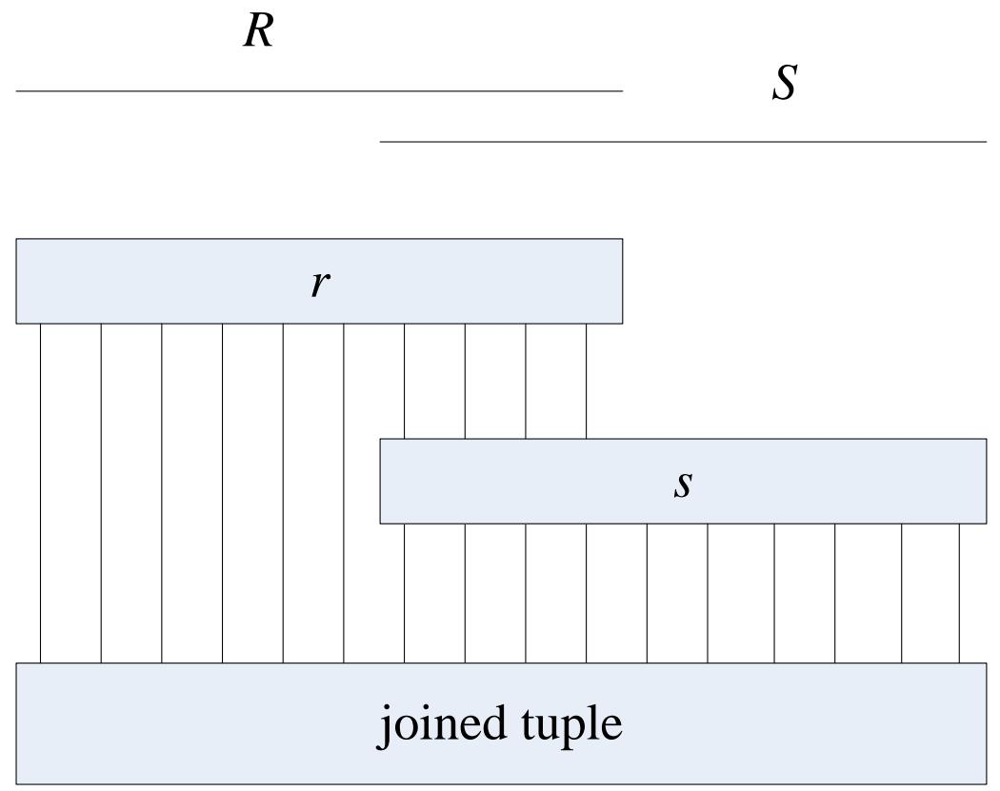

# Natural Joins (Cont’d)

Relation R

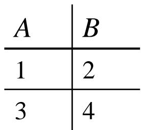

Relation S

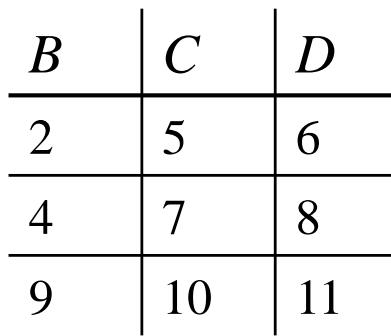

RA

R S

<table><tr><td>A</td><td>B</td><td>C</td><td>D</td></tr><tr><td>1</td><td>2</td><td>5</td><td>6</td></tr><tr><td>3</td><td>4</td><td>7</td><td>8</td></tr></table>

SQL

SELECT *

FROM R NATURAL JOIN S;

• Dangling tuple

• A tuple that fails to pair with any tuple of the other relation in a join

# Natural Joins (Cont’d)

• Example

Relation U

<table><tr><td>A</td><td>B</td><td>C</td></tr><tr><td>1</td><td>2</td><td>3</td></tr><tr><td>6</td><td>7</td><td>8</td></tr><tr><td>9</td><td>7</td><td>8</td></tr></table>

Relation V

<table><tr><td>B</td><td>C</td><td>D</td></tr><tr><td>2</td><td>3</td><td>4</td></tr><tr><td>2</td><td>3</td><td>5</td></tr><tr><td>7</td><td>8</td><td>10</td></tr></table>

RA

U V

SQL

SELECT * FROM U NATURAL INNER JOIN V;

<table><tr><td>A</td><td>B</td><td>C</td><td>D</td></tr><tr><td>1</td><td>2</td><td>3</td><td>4</td></tr><tr><td>1</td><td>2</td><td>3</td><td>5</td></tr><tr><td>6</td><td>7</td><td>8</td><td>10</td></tr><tr><td>9</td><td>7</td><td>8</td><td>10</td></tr></table>

# Theta-Joins

• Theta-Joins θ-连接

Historically, the “theta” refers to an arbitrary condition, which we shall represent by C rather than θ   
R C

1. Take the product of R and S   
2. Select from the product only those tuples that satisfy the condition C

# Theta-Joins (Cont’d)

Relation U

Relation V

• Example

<table><tr><td>A</td><td>B</td><td>C</td></tr><tr><td>1</td><td>2</td><td>3</td></tr><tr><td>6</td><td>7</td><td>8</td></tr><tr><td>9</td><td>7</td><td>8</td></tr></table>

<table><tr><td>B</td><td>C</td><td>D</td></tr><tr><td>2</td><td>3</td><td>4</td></tr><tr><td>2</td><td>3</td><td>5</td></tr><tr><td>7</td><td>8</td><td>10</td></tr></table>

RA

$$
U \bowtie_ {A <   D} V
$$

SQL

SELECT * FROM U INNER JOIN V ON A < D;

<table><tr><td>A</td><td>U.B</td><td>U.C</td><td>V.B</td><td>V.C</td><td>D</td></tr><tr><td>1</td><td>2</td><td>3</td><td>2</td><td>3</td><td>4</td></tr><tr><td>1</td><td>2</td><td>3</td><td>2</td><td>3</td><td>5</td></tr><tr><td>1</td><td>2</td><td>3</td><td>7</td><td>8</td><td>10</td></tr><tr><td>6</td><td>7</td><td>8</td><td>7</td><td>8</td><td>10</td></tr><tr><td>9</td><td>7</td><td>8</td><td>7</td><td>8</td><td>10</td></tr></table>

# Theta-Joins (Cont’d)

Relation U

Relation V

• Example

<table><tr><td>A</td><td>B</td><td>C</td></tr><tr><td>1</td><td>2</td><td>3</td></tr><tr><td>6</td><td>7</td><td>8</td></tr><tr><td>9</td><td>7</td><td>8</td></tr></table>

<table><tr><td>B</td><td>C</td><td>D</td></tr><tr><td>2</td><td>3</td><td>4</td></tr><tr><td>2</td><td>3</td><td>5</td></tr><tr><td>7</td><td>8</td><td>10</td></tr></table>

RA

U  A<D AND U.B≠V.B V

SQL

SELECT * FROM U INNER JOIN V ON A < D WHERE U.B <> V.B;

<table><tr><td>A</td><td>U.B</td><td>U.C</td><td>V.B</td><td>V.C</td><td>D</td></tr><tr><td>1</td><td>2</td><td>3</td><td>7</td><td>8</td><td>10</td></tr></table>

# Combining Operations to Form Queries

# • Expressions

• Applying operations to the result of other operations   
• Example

• What are the titles and years of movies made by Fox that are at least 100 minutes long?

1. Select those Movies tuples that have 1ength≥100   
2. Select those Movies tuples that have studioName=‘Fox’   
3. Compute the intersection of (1) and (2)   
4. Project the relation from (3) onto attribute title and year

# Combining Operations to Form Queries (Cont’d)

• Expression tree

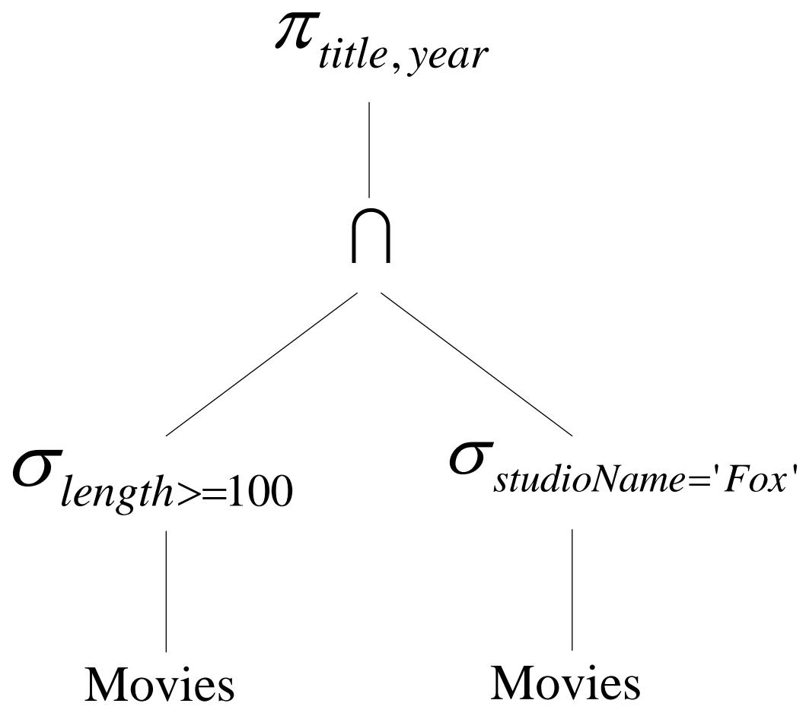

# Combining Operations to Form Queries (Cont’d)

• Expression

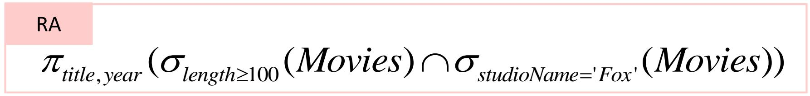

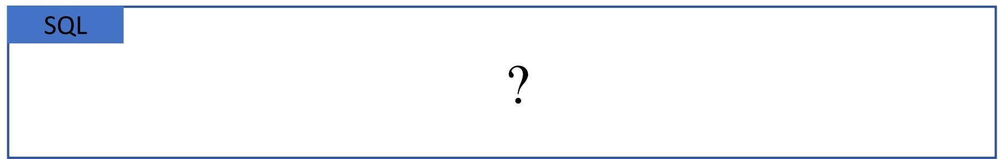

• An equivalent expression

$$
\pi_ {t i t l e, y e a r} \left(\sigma_ {l e n g t h \geq 1 0 0 A N D s t u d i o N a m e = ^ {\prime} F o x ^ {\prime}} (M o v i e s)\right)
$$

SQL ?

# Renaming

# Renaming 重命名

$$
\rho_ {S \left(A _ {1}, A _ {2}, \dots , A _ {n}\right)} (R)
$$

• To rename a relation R   
• The resulting relation has exactly the same tuples as R   
• But the name of the relation is S   
• The attributes of the result relation S are named $A _ { 1 } , A _ { 2 } , . . . , A _ { n }$

$$
\rho_ {s} (R)
$$

only change the name of the relation to S

# Renaming (Cont’d)

• Example

Relation R

Relation S

RA

$$
R \times \rho_ {S (X, C, D)} (S)
$$

<table><tr><td>A</td><td>B</td></tr><tr><td>1</td><td>2</td></tr><tr><td>3</td><td>4</td></tr></table>

<table><tr><td>B</td><td>C</td><td>D</td></tr><tr><td>2</td><td>5</td><td>6</td></tr><tr><td>4</td><td>7</td><td>8</td></tr><tr><td>9</td><td>10</td><td>11</td></tr></table>

SQL SELECT * FROM R CROSS JOIN (SELECT B AS X, C, D FROM S) AS SS;

As a alternative

$$
\rho_ {R S (A, B, X, C, D)} (R \times S)
$$

SQL ?

<table><tr><td>A</td><td>B</td><td>X</td><td>C</td><td>D</td></tr><tr><td>1</td><td>2</td><td>2</td><td>5</td><td>6</td></tr><tr><td>1</td><td>2</td><td>4</td><td>7</td><td>8</td></tr><tr><td>1</td><td>2</td><td>9</td><td>10</td><td>11</td></tr><tr><td>3</td><td>4</td><td>2</td><td>5</td><td>6</td></tr><tr><td>3</td><td>4</td><td>4</td><td>7</td><td>8</td></tr><tr><td>3</td><td>4</td><td>9</td><td>10</td><td>11</td></tr></table>

# Relationships Among Operations

• Some of the operations   
• Can be expressed in terms of other operations   
• Examples

$$
R \cap S = R - (R - S)
$$

$R \boxtimes _ { C } S = \sigma _ { c } ( R \times S )$

$$
R \bowtie S = \pi_ {L} (\sigma_ {C} (R \times S))
$$

$C = ( R . A _ { 1 } = S . A _ { 1 }$ AND $R . A _ { 2 } = S . A _ { 2 }$ AND .. AND R.A, = S.An $L$ be the list of attributes in the schema of $R$ followed by those attributes in the schema of $S$ that are not also in the schema of $R$

# Relationships Among Operations (Cont’d) Relation U Relation V

• Examples

<table><tr><td>A</td><td>B</td><td>C</td></tr><tr><td>1</td><td>2</td><td>3</td></tr><tr><td>6</td><td>7</td><td>8</td></tr><tr><td>9</td><td>7</td><td>8</td></tr></table>

<table><tr><td>B</td><td>C</td><td>D</td></tr><tr><td>2</td><td>3</td><td>4</td></tr><tr><td>2</td><td>3</td><td>5</td></tr><tr><td>7</td><td>8</td><td>10</td></tr></table>

$$
U \bowtie V = \pi_ {A, U. B, U. C, D} (\sigma_ {U. B = V. B A N D U. C = V. C} (U \times V))
$$

$$
{U \bowtie_ {A <   D \mathrm {A N D} U. B \neq V. B} V} {= \sigma_ {A <   D \mathrm {A N D} U. B \neq V. B} (U \times V)}
$$

# Relationships Among Operations (Cont’d)

• The rewriting rules mentioned are the only “redundancies” among the operations that we have introduced   
• The six remaining operations form an independent set

• Union   
• Difference   
. Selection   
• Projection   
• Product   
• Renaming

• None of which can be written in terms of the other five

# A Linear Notation for Algebraic Expressions

# • Examples

$$
\begin{array}{l} R (t, y, l, i, s, p) := \sigma_ {\text {l e n g t h} \geq 1 0 0} (\text {M o v i e s}) \\ S (t, y, l, i, s, p) := \sigma_ {\text {s t u d i o N a m e} = ^ {\prime} F o x ^ {\prime}} (\text {M o v i e s}) \\ T (t, y, l, i, s, p) := R \cap S \\ \text {A n s w e r} (t i t l e, \text {y e a r}) := \pi_ {t, y} (T) \\ \end{array}
$$

$$
\begin{array}{l} R (t, y, l, i, s, p) := \sigma_ {l e n g t h \geq 1 0 0} (M o v i e s) \\ S (t, y, l, i, s, p) := \sigma_ {s t u d i o N a m e = ^ {\prime} F o x ^ {\prime}} (M o v i e s) \\ \text {A n s w e r} (t i t l e, \text {y e a r}) := \pi_ {t, y} (R \cap S) \\ \end{array}
$$

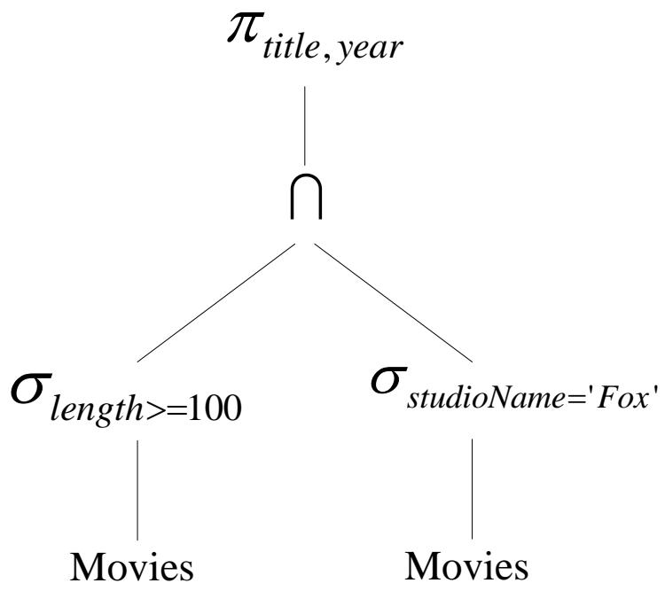

# Summary

Relational Algebra & SQL   
• Query languages for the relational model   
Selection and Projection   
• Joins

# Lecture 2 Relational Database Language Part 2

关系数据库语言

第2部分

# Outline

• More SQL 更多SQL知识   
• Subquery 子查询   
• Group and Aggregation 分组与聚合  
• Modification 更新

# Outline

• More SQL 更多SQL知识   
• Subquery 子查询   
• Group and Aggregation 分组与聚合  
• Modification 更新

# Movie Database

Movies (title, year, length, genre, studioName, producerC#)

MovieStar (name, address, gender, birthdate)

StarsIn (movieTitle, movieYear, starName)

MovieExec (name, address, cert#, netWorth)

Studio (name, address, presC#)

# SELECT-FROM-WHERE

SELECT *

FROM Movies

WHERE studioName $= ^ { 1 }$ Disney' AND year=1990;

FROM

• Relation(s) to which the query refers

WHERE

• A condition   
• Tuples must satisfy the condition in order to match the query

• SELECT

• Tells which attributes of the tuples matching the condition are produced as part of the answer

# SQL Queries and Relational Algebra

SELECT L

FROM R

WHERE C

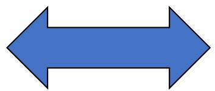

$$
\pi_ {L} (\sigma_ {C} (R))
$$

• L is a list of expressions   
• R is a relation   
• C is a condition

# Pattern Matching in SQL (Cont’d)

# • Example

SELECT title

FROM Movies

WHERE title LIKE 'Star

• We remember a movie “Star something”,   
• And we remember that the something has four letters.   
• What could this movie be?

# Pattern Matching in SQL (Cont’d)

# • Example

SELECT title

FROM Movies

WHERE title LIKE '%''s%';

• Search for all movies with a possessive ('s) in their titles   
• Any title with 's as a substring will match the pattern

# Pattern Matching in SQL (Cont’d)

# • Escape characters in LIKE expressions

s LIKE 'x%%x%' ESCAPE 'x'

• What if the pattern we wish to use in a LIKE expression involves the character % or _ ?   
• SQL allows us to specify any one character we like as the escape character for a single pattern   
• Matches any string that begins and ends with the character %

# Dates and Times 不同DBMS语法差异较大

• Date constant

• DATE '1984-05-14'

• Time constant

• TIME '15:00:02.5'   
• TIME '12:00:00-8:00'

• Noon in Pacific Standard Time, eight hours behind GMT

• Combine dates and times

• TIMESTAMP '1984-05-14 12:00:00'

• Compare dates and times using <

# Null Values

# • Null valuesNULL

• Value unknown

• An unknown birthdate

• Value inapplicable

• If we had a spouse attribute for the MovieStar relation, then an unmarried star might have NULL

• Value withheld

• An unlisted phone number might appear as NULL in the component for a phone attribute

# Comparisons Involving NULL

• Two rules   
• Operate on a NULL and any value, using an arithmetic operator like * or +, the result is NULL   
• Compare a NULL and any value, using a comparison operator like = or >, the result is UNKNOWN   
• NULL is not a constant   
• Cannot use NULL as an operand

# Comparisons Involving NULL (Cont’d)

# • Example

• Let $x$ have the value NULL   
• The value of $x + 3$ is also NULL   
NULL + 3 is not a legal SQL expression   
• The value of $x = 3$ is UNKNOWN   
$\bullet \mathsf { N U L L } = 3$ is not correct SQL

# Comparisons Involving NULL (Cont’d)

• IS NULL

• The correct way to ask if x has the value NULL x IS NULL

• TRUE if x has the value NULL, FALSE otherwise

IS NOT NULL

x IS NOT NULL

• TRUE unless the value of x is NULL

# The Truth-Value UNKNOWN

Three truth-values

• TRUE as 1, FALSE as 0, and UNKNOWN as ½   
The rules

1. The AND of two truth-values is the minimum of those values   
2. The OR of two truth-values is the maximum of those values   
3. The negation of truth-value v is 1 - v

# The Truth-Value UNKNOWN (Cont’d)

• Truth table for three-valued logic   

<table><tr><td>x</td><td>y</td><td>x AND y</td><td>x OR y</td><td>NOT x</td></tr><tr><td>TRUE</td><td>TRUE</td><td>TRUE</td><td>TRUE</td><td>FALSE</td></tr><tr><td>TRUE</td><td>UNKNOWN</td><td>UNKNOWN</td><td>TRUE</td><td>FALSE</td></tr><tr><td>TRUE</td><td>FALSE</td><td>FALSE</td><td>TRUE</td><td>FALSE</td></tr><tr><td>UNKNOWN</td><td>TRUE</td><td>UNKNOWN</td><td>TRUE</td><td>UNKNOWN</td></tr><tr><td>UNKNOWN</td><td>UNKNOWN</td><td>UNKNOWN</td><td>UNKNOWN</td><td>UNKNOWN</td></tr><tr><td>UNKNOWN</td><td>FALSE</td><td>FALSE</td><td>UNKNOWN</td><td>UNKNOWN</td></tr><tr><td>FALSE</td><td>TRUE</td><td>FALSE</td><td>TRUE</td><td>TRUE</td></tr><tr><td>FALSE</td><td>UNKNOWN</td><td>FALSE</td><td>UNKNOWN</td><td>TRUE</td></tr><tr><td>FALSE</td><td>FALSE</td><td>FALSE</td><td>FALSE</td><td>TRUE</td></tr></table>

# The Truth-Value UNKNOWN (Cont’d)

# • Surprising behavior

Movies (title, year, length, genre, studioName, producerC#)

SELECT *

FROM Movies

WHERE length <= 120 OR length $>$ 120;

• Movies tuples with NULL in the length component   
• length <= 120 OR length $>$ 120 evaluate to UNKNOWN   
• Such a tuple is not returned as part of the answer to the query   
• “Find all the Movies tuples with non-NULL lengths”

# Ordering the Output

• The ORDER BY clause

ORDER BY <list of attributes>

• The order is by default ascending   
• The keyword DESC for descending   
• The keyword ASC for ascending (unnecessary)

• The ordering is performed on the result of the FROM, WHERE, and other clauses, just before we apply the SELECT clause

# Ordering the Output (Cont’d)

# • Example

SELECT *

FROM Movies

WHERE studioName='Disney' AND year=1990

ORDER BY length, title;

• All the attributes of Movies are available at the time of sorting, even if they are not part of the SELECT clause

# Products and Joins in SQL

# • Example

• Want to know the name of the producer of Star Wars

• Relations we need

Movies (title, year, length, genre, studioName, producerC#)

MovieExec (name, address, cert#, netWorth)

• The query

SELECT name

FROM Movies, MovieExec

WHERE title= 'Star Wars' AND producerC# $=$ cert#;

# Products and Joins in SQL (Cont’d)

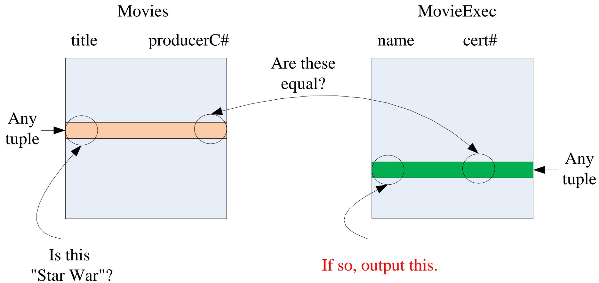

• To pair every tuple of Movies with every tuple of MovieExec and test two conditions

# Tuple Variables

• Tuple variables

• Disambiguate more than one occurrences of the same relation

• Example

• Want to know about two stars who share an address SELECT Star1.name, Star2.name FROM MovieStar Star1, MovieStar Star2 WHERE Star1.address $=$ Star2.address AND Star1.name $<$ Star2.name

# Interpreting Multirelation Queries (Cont’d)

• Conversion to Relational Algebra

• FROM clause → Cartesian product   
• WHERE clause → selection   
• SELECT clause → projection

# Interpreting Multirelation Queries (Cont’d)

# • Conversion to Relational Algebra

• Example

SELECT Star1.name, Star2.name

FROM MovieStar Star1, MovieStar Star2

WHERE Star1.address $=$ Star2.address

AND Star1.name $<$ Star2.name

$$
\begin{array}{l} \pi_ {A 1, A 5} \left(\sigma_ {A 2 = A 6 \text {A N D} A 1 <   A 5} \left(\rho_ {M (A 1, A 2, A 3, A 4)} (\text {M o v i e S t a r}) \times \right. \right. \\ \rho_ {N (A 5, A 6, A 7, A 8)} \left(M o v i e S t a r)\right)) \\ \end{array}
$$

# Outline

• More SQL 更多SQL知识   
• Subquery 子查询   
• Group and Aggregation 分组与聚合  
• Modification 更新

# Subquery

• Subquery

• A query that is part of another   
• Subqueries can have subqueries, and so on

• Subquery

• Can return a single constant, used in WHERE   
• Can return relations, used in WHERE   
• Can appear in FROM, followed by a tuple variable

# Subqueries that Produce Scalar Values

Scalar

• An atomic value that can appear as one component of a tuple

• Example

Movies (title, year, length, genre, studioName, producerC#) MovieExec (name, address, cert#, netWorth)

SELECT name FROM Movies, MovieExec WHERE title= 'Star Wars' AND producerC# $=$ cert#;

# Subqueries that Produce Scalar Values: Example

# • Example

SELECT name

FROM MovieExec

WHERE cert# =

(SELECT producerC#

FROM Movies

WHERE title $=$ 'Star Wars'

);

# Subqueries that Produce Scalar Values: Example

# • Example

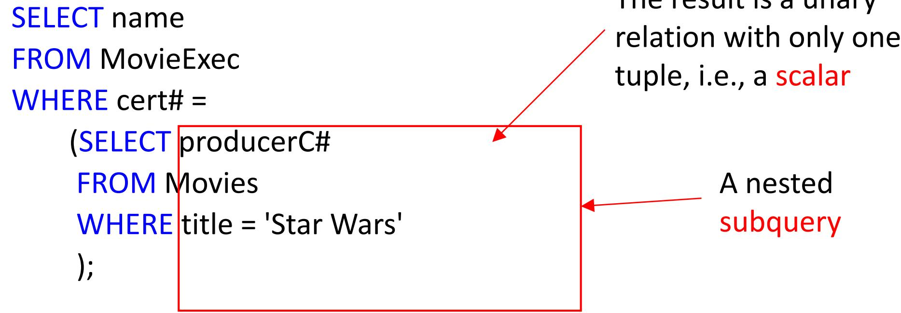

# Subqueries that Produce Scalar Values: Example

# • Example

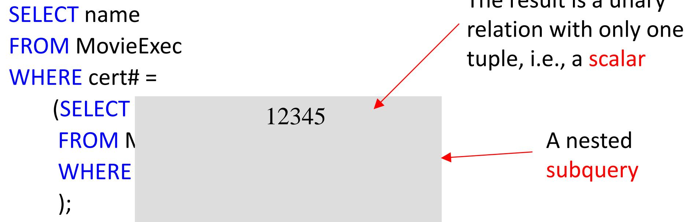

# Subqueries that Produce Scalar Values: Example

# • Example

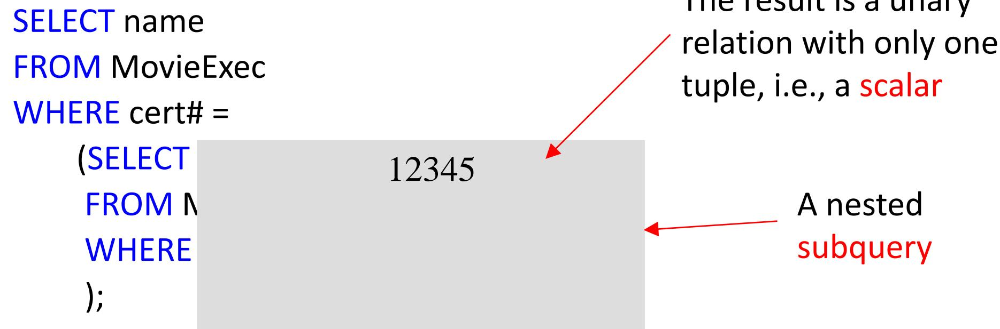

name

George Lucas

# Conditions Involving Relations

# • SQL operators

• Apply to a relation R   
• Produce a Boolean result   
• R must be expressed as a subquery

# 1. EXISTS R

is a condition that is true if and only if R is not empty

# Conditions Involving Relations

# • SQL operators

• Apply to a relation R   
• Produce a Boolean result   
• R must be expressed as a subquery

# 2. s IN R

is true if and only if s is equal to one of the values in R. Assume R is a unary relation

# Conditions Involving Relations

# • SQL operators

• Apply to a relation R   
• Produce a Boolean result   
• R must be expressed as a subquery

# 3. s >ALL R

is true if and only if s is greater than every value in unary relation R.

s <ALL R, s <=ALL R, s >=ALL R, s =ALL R, s <> ALL R is the same as s NOT IN R

# Conditions Involving Relations

# • SQL operators

• Apply to a relation R   
• Produce a Boolean result   
• R must be expressed as a subquery

# 4. s >ANY R

is true if and only if s is greater than at least one value in unary relation R.

$$
\begin{array}{l} s <   \text {A N Y} R, s <   = \text {A N Y} R, s > = \text {A N Y} R, s <   > \text {A N Y} R, \\ s = \text {A N Y} R \quad \text {i s t h e s a m e a s} \quad s \text {I N} R \end{array}
$$

# Conditions Involving Relations

# • SQL operators

EXISTS, ALL and ANY can be negated by putting NOT in front of the entire expression.

NOT EXISTS is true iff R is empty

NOT s >= ALL R is true iff s is not the maximum value in R

NOT s > ANY R is true iff s is the minimum value in R

# ANY或ALL谓词

• 等价关系

• ANY和ALL谓词、聚合函数、IN谓词

<table><tr><td></td><td>=</td><td>&lt;&gt;</td><td>&lt;</td><td>&lt;=</td><td>&gt;</td><td>&gt;=</td></tr><tr><td>ANY</td><td>IN</td><td>--</td><td>&lt;MAX</td><td>&lt;=MAX</td><td>&gt;MIN</td><td>&gt;=MIN</td></tr><tr><td>ALL</td><td>--</td><td>NOT IN</td><td>&lt;MIN</td><td>&lt;=MIN</td><td>&gt;MAX</td><td>&gt;=MAX</td></tr></table>

# Conditions Involving Tuples

# • Example

```sql
SELECT name   
FROM MovieExec   
WHERE cert# IN   
(SELECT producerC#   
FROM Movies   
WHERE (title, year) IN   
(SELECT movieTitle, movieYear FROM StarsIn   
WHERE starName = 'Harrison Ford'   
); 
```

# Conditions Involving Tuples

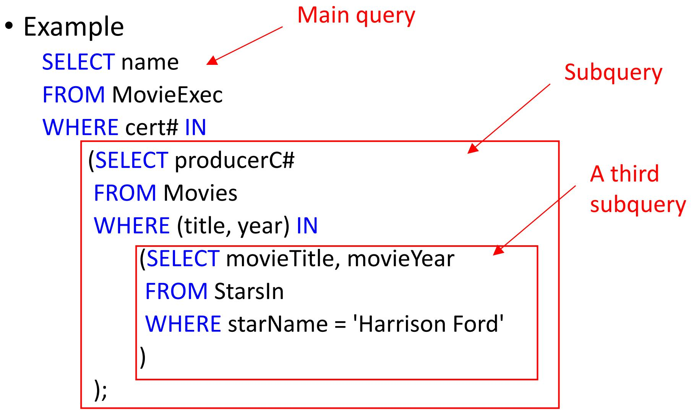

# Conditions Involving Tuples

# • Example

SELECT name

FROM MovieExec

WHERE cert# IN

(SELECT producerC#

FROM Movies

WHERE (title, year) IN

<table><tr><td>title</td><td>year</td></tr><tr><td>Star Wars</td><td>1977</td></tr><tr><td>Raiders of the Lost Ark</td><td>1981</td></tr><tr><td>The Fugitive</td><td>1993</td></tr><tr><td>…</td><td>…</td></tr></table>

);

# Conditions Involving Tuples

# • Example

SELECT name

FROM MovieExec

WHERE cert# IN

<table><tr><td>producerC#</td></tr><tr><td>12345</td></tr><tr><td>23456</td></tr><tr><td>34567</td></tr><tr><td>…</td></tr></table>

);

<table><tr><td>title</td><td>year</td></tr><tr><td>Star Wars</td><td>1977</td></tr><tr><td>Raiders of the Lost Ark</td><td>1981</td></tr><tr><td>The Fugitive</td><td>1993</td></tr><tr><td>…</td><td>…</td></tr></table>

# Conditions Involving Tuples (Cont’d)

# • Example

• A single select-from-where expression

```sql
SELECT name
FROM MovieExec, Movies, StarsIn
WHERE cert# = producerC# AND
title = movieTitle AND
year = movieYear AND
starName = 'Harrison Ford'; 
```

# Correlated Subqueries

Correlated subquery 相关子查询

• Requires the subquery to be evaluated many times

• Once for each assignment of a value to some term in the subquery that comes from a tuple variable outside the subquery

# Correlated Subqueries: Example

# • Example

• Find the titles that have been used for two or more movies SELECT title FROM Movies Old WHERE year $<$ ANY A movie made twice will be listed once, a movie made (SELECT year three times will be listed twice, FROM Movies and so on. WHERE title $=$ Old.title );

• For each such tuple, we ask in the subquery whether there is a movie with the same title and a greater year

# Subqueries in FROM Clauses

# • Example

SELECT name   
FROM MovieExec, (SELECT producerC# FROM Movies, StarsIn WHERE title $=$ movieTitle AND year $=$ movieYear AND starName $=$ 'Harrison Ford' ）Prod   
WHERE cert# $=$ Prod.producerC#;

# Subqueries in FROM Clauses

# • Example

```sql
SELECT name FROM MovieExec, (SELECT producerC# FROM Movies, StarsIn WHERE title = movieTitle AND year = movieYear AND starName = 'Harrison Ford') Prod 
```

WHERE cert# $=$ Prod.producerC#;

Subquery

# Outline

• More SQL 更多SQL知识   
• Subquery 子查询   
• Group and Aggregation 分组与聚合   
• Modification 更新

# Full-Relation Operations

• Eliminating Duplicates: DISTINCT   
• Grouping   
• Aggregation   
• HAVING Clauses

# Grouping and Aggregation

# Grouping

• Partition the tuples of a relation into “groups”,   
• based on the values of tuples in one or more attributes

# Aggregation

• Aggregate certain other columns of the relation by applying “aggregation” operators to those columns   
• The aggregation is done separately for each group

# Aggregation Operators

• Five aggregation operators in SQL

SUM Sum of a column with numerical values

AVG Average of a column with numerical values

MIN Smallest value of a column with numerical values

MAX Largest value of a column with numerical values

COUNT Number of (not necessarily distinct) values in a column

# Aggregation Operators

• Five aggregation operators in SQL • NULL value

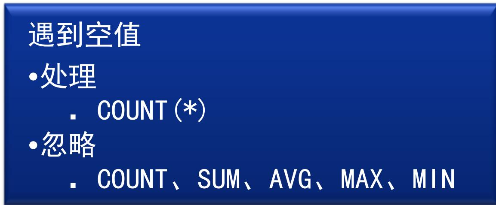

# Aggregation Operators: Example

# • Example

• Finds the average net worth of all movie executives MovieExec (name, address, cert#, netWorth)

SELECT AVG(netWorth) FROM MovieExec;

# Aggregation Operators: Example

# • Example

• Counts the number of tuples in the StarsIn StarsIn (movieTitle, movieYear, starName)   
SELECT COUNT(*) FROM StarsIn;   
• The similar query

SELECT COUNT(starName) FROM StarsIn;

Do these two queries have the same result?

# Aggregation Operators: Example

# • Example

• Counts the number of tuples in the StarsIn StarsIn (movieTitle, movieYear, starName)

SELECT COUNT(*)

FROM StarsIn;

• The similar query

SELECT COUNT(DISTINCT starName) FROM StarsIn;

Duplicate values are eliminated before we count.

# Grouping

• The GROUP BY clause

• Followed by a list of grouping attributes   
• Has tuples grouped according to their values in the grouping attributes   
• Whatever aggregation operators are used in the SELECT clause are applied only within groups

# Grouping: Example

# • Example

Movies (title, year, length, genre, studioName, producerC#)   
• Finds the sum of the lengths of all movies for each studio

SELECT studioName, SUM(length)

FROM Movies

GROUP BY studioName;

# Grouping: Example

• Example

SELECT studioName, SUM(length)

FROM Movies

GROUP BY studioName;

<table><tr><td></td><td></td><td></td><td></td><td>studioName</td><td></td></tr><tr><td></td><td></td><td></td><td></td><td>Disney</td><td></td></tr><tr><td></td><td></td><td></td><td></td><td>Disney</td><td></td></tr><tr><td></td><td></td><td></td><td></td><td>Disney</td><td></td></tr><tr><td></td><td></td><td></td><td></td><td>MGM</td><td></td></tr><tr><td></td><td></td><td></td><td></td><td>MGM</td><td></td></tr><tr><td></td><td></td><td></td><td></td><td>0</td><td></td></tr><tr><td></td><td></td><td></td><td></td><td>0</td><td></td></tr></table>

# Grouping: The SELECT Clause

SELECT studioName, SUM(length)

FROM Movies

GROUP BY studioName;

• Two kinds of terms in the SELECT clause

Aggregations

• An aggregate operator is applied to an attribute   
• These terms are evaluated on a per-group basis

• Attributes in the GROUP BY clause

• Only those attributes may appear unaggregated in the SELECT clause

# Grouping: The SELECT Clause

SELECT studioName, SUM(length)

FROM Movies

GROUP BY studioName;

• Two kinds of terms in the SELECT clause

# 规律

出现在SELECT后面的列，  
要么是GROUP BY后面的分组列，  
要么是对其他列应用聚合函数

# Grouping (Cont’d)

• No aggregations

SELECT studioName

FROM Movies

GROUP BY studioName;

• Has the same effect as

SELECT DISTINCT studioName

FROM Movies;

# HAVING Clauses

# • WHERE clause

• Restrict the tuples prior to grouping   
• Only wanted the total length of movies for producers with a net worth of more than $10,000,000

SELECT name, SUM(length)

FROM MovieExec, Movies

WHERE producerC# $=$ cert# AND netWorth $>$ 10000000

GROUP BY name;

# HAVING Clauses (Cont’d)

# HAVING clause

• We want to choose groups based on some aggregrate property of the group itself

GROUP BY <grouping attributes>

HAVING <condition about the group>

# HAVING Clauses (Cont’d)

# • Example

• Print the total film length for only those producers who made at least one film prior to 1930

SELECT name, SUM(length) FROM MovieExec, Movies WHERE producerC# $=$ cert# GROUP BY name HAVING MIN(year) < 1930

The resulting query would remove from the grouped relation all those groups in which every tuple had a year component 1930 or higher.

# HAVING Clauses (Cont’d)

• Two rules about HAVING clauses

1. An aggregation in a HAVING clause applies only to the tuples of the group being tested   
2. Any attribute of relations in the FROM clause may be aggregated in the HAVING clause, but only those attributes that are in the GROUP BY list may appear unaggregated in the HAVING clause

• The same rule as for the SELECT clause

# Outline

• More SQL 更多SQL知识   
• Subquery 子查询   
• Group and Aggregation 分组与聚合  
Modification 更新

# Database Modifications

# Three types

1. Insert tuples into a relation   
2. Delete certain tuples from a relation   
3. Update values of certain components of certain existing tuples

# Insertion

# • Basic form

INSERT INTO $R ( A _ { 1 } , . . . , A _ { n } )$ VALUES (v1, …, vn);

• A tuple is created using the value $v _ { i }$ for attribute $A _ { j } ,$ for i = 1, 2, …,n

• If the list of attributes does not include all attributes of the relation $R _ { ☉ }$ , then the tuple created has default values for all missing attributes

# Insertion: Example

# • Example

INSERT INTO StarsIn(movieTitle, movieYear, starName)

VALUES('The Maltese Falcon', 1942, 'Sydney Greenstreet');

• If we provide values for all attributes of the relation, then we may omit the list of attributes that follows the relation name.

INSERT INTO StarsIn

VALUES('The Maltese Falcon', 1942, 'Sydney Greenstreet');

# Insertion: Subquery

# • Example

• Add to the relation Studio all movie studios that are mentioned in the relation Movies, but do not appear in Studio

INSERT INTO Studio(name) SELECT DISTINCT studioName FROM Movies WHERE studioName NOT IN (SELECT name FROM Studio);

# Deletion

• Form

DELETE FROM R WHERE <condition>;

• Every tuple satisfying the condition will be deleted from relation R

# Deletion: Example

# • Example

StarsIn (movieTitle, movieYear, starName)

• Delete the fact that Sydney Greenstreet was a star in The Maltese Falcon

DELETE FROM StarsIn

WHERE movieTitle $=$ 'The Maltese Falcon' AND

movieYear $=$ 1942 AND

starName $=$ 'Sydney Greenstreet';

# Deletion: Example

• Example

StarsIn (movieTitle, movieYear, starName)

• Delete all tuples in the relation StarsIn   
• Make the relation StarsIn empty

DELETE FROM StarsIn;

# Updates

• Updates in SQL

• One or more tuples that already exist in the database have some of their components changed

• Form

UPDATE R SET <new-value assignments> WHERE <condition>;

# Updates: Example

# • Example

• Modify the relation

MovieExec (name, address, cert#, netWorth)

• by attaching the title Pres. In front of the name of every movie executive who is the president of a studio

UPDATE MovieExec

SET name $=$ 'Pres. ' || name

WHERE cert# IN (SELECT presC# FROM Studio);

# The End of This Lecture…