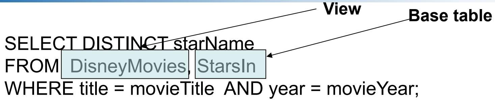
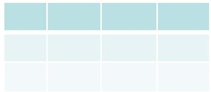
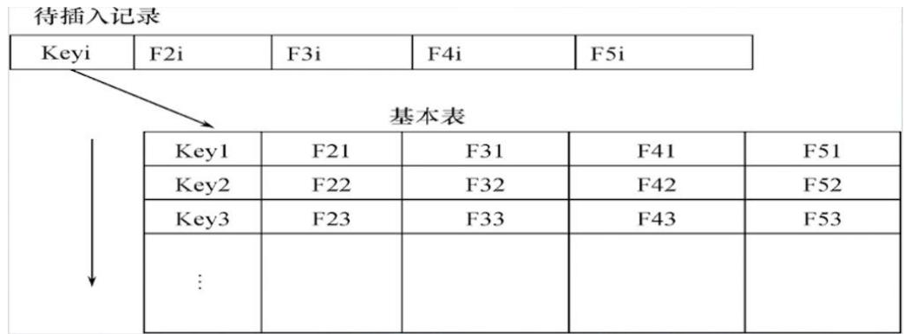
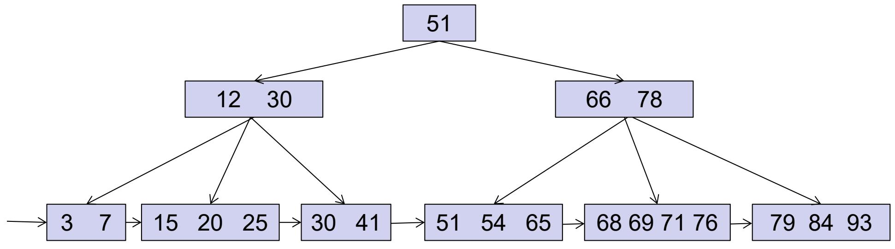

# CHAPTER 7

# CONSTRAINTS & TRIGGERS

约束与触发器


# 数据库完整性概述

# 数据库的完整性

# –数据的正确性

• 是指数据是符合现实世界语义,反映了当前实际状况的例如:  
学生的学号必须唯一  
性别只能是男或女  
• 成绩的取值范围为0~100

# 数据库完整性概述

# 数据库的完整性

# –数据的相容性

• 是指数据库同一对象在不同关系表中的数据是符合逻辑的

例如:

• 学生所选的课程必须是学校开设的课程  
• 学生所在的院系必须是学校已成立的院系

# 数据库完整性概述

• 为维护数据库的完整性,数据库管理系统必须:

– 提供定义完整性约束条件的机制

• 完整性约束条件也称为完整性规则,是数据库中的数据必须满足的语义约束条件  
• SQL标准使用了一系列概念来描述完整性,包括关系模型的实体完整性、参照完整性和用户定义完整性  
• 这些完整性一般由SQL的数据定义语言语句来实现

# 约束(Constraints)

约束 (Constraint)：是 DBMS（数据库管理系统）必须强制执行的数据元素之间的关联关系。

–例如： 键约束。

# 约束的种类 (Kinds of Constraints)

• 键 (Keys)：（主键 Primary key，唯一键 Unique Key）

– 要求特定属性或属性组合的值具有唯一性。

• 外键 (Foreign-key)，或称参照完整性 (referential-integrity)。

基于属性的约束 (Attribute-based constraints)

– 针对特定属性的值施加约束。

– 例如：非空约束 (Not-Null Constraints)

基于元组的约束 (Tuple-based constraints)

– 定义元组中各分量（属性）之间的关系

断言 (Assertions)：基于任何 SQL 布尔表达式的全局约束

键与外键 (Keys and Foreign Keys) 属性与元组上的约束 (Constraints on Atributes and Tuples) 7.3 约束的修改 (Modification of Constraints) 4 触发器(Triggers)

# 回顾： 单属性键

# (Review: Single-Attribute Keys)

在属性声明中的数据类型之后直接放置

PRIMARY KEY（主键）或 UNIQUE（唯一

键） 关键字。

示例:

CREATE TABLE movieexec (

name

CHAR(30),

列级约束条件

address

VARCHAR(255),

cert

INT

netWorth

INT

);

• 对于 movies（电影）表，title（片名）和 year（年份）结合在一起构成该表的键:

CREATE TABLE movies (

title CHAR(100),

year INT,

length INT,

genre CHAR(10),

studioName CHAR(30),

producerC INT,

PRIMARY KEY (title, year)

表级约束条件

);

# 外键 (Foreign Keys)

• 出现于某一个关系（表）S的特定属性中p的值，必须同样存在于另一个关系（表）R的特定属性c之中。  
• 示例：在 studio(name, address, presC) 表中，我们期望其 presC（总裁编号）属性中的值，也必然存在于 movieexec（电影高管）表的cert（证书编号）属性中。

# (Expressing Foreign Keys)

声明外键需使用关键字 REFERENCES。有两种定义方式：

列及定义：依附于属性声明（适用于单属性外键）：在属性定义之后添加。

REFERENCES <关系名> (<属性名>)

表及定义：作为独立的模式元素声明:

FOREIGN KEY (<属性列表>)

REFERENCES <关系名> (<属性名>)

被参照的目标属性必须已被声明为 PRIMARYKEY（主键）或 UNIQUE（唯一键）

# 示例：依附于属性的外键声明

# CREATE TABLE movieexec (

name CHAR(30),

address VARCHAR(255),

cert INT PRIMARY KEY,

netWorth INT

);

# CREATE TABLE studio (

name CHAR(50) PRIMARY KEY,

address VARCHAR(255),

presC INT REFERENCES movieexec(cert)

);

# 示例：作为模式元素的外键声明

# CREATE TABLE movieexec (

name CHAR(30),

address VARCHAR(255),

cert INT PRIMARY KEY,

netWorth INT

);

# CREATE TABLE studio (

name CHAR(50) PRIMARY KEY,

address VARCHAR(255),

presC INT,

FOREIGN KEY(presC) REFERENCES movieexec(cert)

# 外键背后的本质

studio movieexec

• 出现于 studio.presC（制片厂总裁）属性中的值，必须存在于 movieexec.cert（高管证书编号）中。  
形式化表达：

[studio.presC]⊆[movieexec.cert]+NULL

DBMS什么时候需要进行参照完整性检查？

# 外键背后的本质

studio movieexec

• 出现于 studio.presC（制片厂总裁）属性中的值，必须存在于 movieexec.cert（高管证书编号）中。  
形式化表达：

[studio.presC]⊆[movieexec.cert]+NULL

对 studio 和 movieexec 表的修改操作

<table><tr><td></td><td>studio</td><td>movieexec</td></tr><tr><td>Delete</td><td>OK!</td><td>?</td></tr><tr><td>Insert</td><td>?</td><td>OK!</td></tr><tr><td>Update</td><td>?</td><td>?</td></tr></table>

# 强制执行外键约束

如果存在从关系 studio（参照方）到关系movieexec（被参照方）的外键约束，可能会发生以下两种违规情况：

1. 对 studio 的插入或更新操作，引入了在movieexec 表中找不到的值。  
2. 对 movieexec 的删除或更新操作，导致了studio 中的某些元组处于“悬空 (dangle)”状态（即引用的主键消失了）。

# 参照完整性违约处理 --- (1)

• 对 studio 进行插入或更新时，如果试图引入一个在 movieexec 中不存在的“执行人员”，该操作必须被：

# 拒绝!

<table><tr><td></td><td>studio</td><td>movieexec</td></tr><tr><td>Delete</td><td>OK!</td><td>?</td></tr><tr><td>Insert</td><td>Reject</td><td>OK!</td></tr><tr><td>Update</td><td>Reject</td><td>?</td></tr></table>

# 参照完整性违约处理 --- (2)

对 movieexec 进行的删除或更新操作，如果移除了已被 studio 中的某些元组所引用的 presC 值，系统可以通过以下三种方式处理：

1 默认策略 (Default)：拒绝 (Reject) 此次修改操作。  
2. 级联策略 (Cascade)：在 studio 表中做出同步更改。

若movie executive被删除：级联删除 studio 中对应的元组。  
若movie executive主键被更新：级联更新 studio 中相应的外键值。

3. 置空策略 (Set NULL)：将 studio 表中的 presC 字段值更改为NULL。

# 参照完整性违约处理 --- (2)

对 movieexec 进行的删除或更新操作，如果移除了已被 studio 中的某些元组所引用的 presC 值，系统可以通过以下三种方式处理：

# 拒绝， 级联策略， 置空策略

<table><tr><td></td><td>studio</td><td>movieexec</td></tr><tr><td>Delete</td><td>OK!</td><td>拒绝，级联，置空</td></tr><tr><td>Insert</td><td>Reject</td><td>OK!</td></tr><tr><td>Update</td><td>Reject</td><td>拒绝，级联，置空</td></tr></table>

# 示例：级联策略

• 从 movieexec 中删除 cert=123 的元组：

– 系统会随后自动删除 studio 表中所有presC=123 的元组。

• 将 cert=345 的元组更新为 346

– 系统会随后自动将 studio 表中所有带有presC=345 的元组更改为 presC=346。

# 示例：置空策略(Set NULL)

• 从 movieexec 中删除 cert=123 的元组:

– 系统会将 studio 表中所有 presC=123 的元组更改为 presC=NULL。

• 将 cert=345 的元组更新为 346：

– 系统会将 studio 表中所有 presC=345 的元组更改为 presC=NULL。

# 选择违约处理策略

• 当我们声明外键时，可以针对删除和更新操作独立选择 SET NULL 或 CASCADE 策略。  
• 在声明外键之后追加如下语句:

ON [UPDATE, DELETE]

[SET NULL, CASCADE]

可以组合使用这两个子句  
• 如果不进行指定，则采用default策略 (Reject)。

# 示例：策略设置

# CREATE TABLE studio (

name CHAR(50) PRIMARY KEY,

address VARCHAR(255),

presC INT

REFERENCES movieexec(cert)

ON DELETE SET NULL

ON UPDATE CASCADE

# 约束的延迟检查

面临的窘境场景:

– 施瓦辛格决定创立一家名为“La Vista”的电影制片厂，并由他亲自担任该制片厂的总裁。  
–执行插入：

INSERT INTO studio

VALUES ('La Vista' , 'New York' , 23456) 会违反外键约束！

因为此时 movieexec 表中还没有证书编号为 23456的元组。

# 解决方案

1) 首先插入 'La Vista' 制片厂的元组，但暂且不填写总裁证书编号（设为 NULL）。

INSERT INTO studio(name, address)

Set presC 1 as Null

VALUES ('La Vista','New York') ;

2) 接着，将施瓦辛格的元组插入到 movieexec 表中（获得编号 23456） 该解决方案存在什么问题？ 解决方案存在什么问题？  
3) 最后更新 Studio 表  
  
1、如果要求 studio.presC 必须是主键 (PK) ，它就不能暂时为空。

UPDATE Studio

SET presC# = 23456

WHERE name = 'La Vista';

2、如果 Studio.presC 上设定了非空约束 (Not-Null Constraint)，此方案也行不通。

# 循环约束 (Circular Constraints)

• 存在更棘手的“循环约束”情况

– 在这些情况下，仅仅通过巧妙地调整数据库修改步骤的先后顺序是无法解决问题的。  
– 比如“互为外键”的情况，导致不可能插入一位带有新总裁的新制片厂：

• 我们无法在 studio 中插入带有新 presC 值的元组 这会违反 presCmovieexec(cert)的外键约束  
• 我们也无法在 movieexec 中插入带有新 cert 值的元组这会违反 certstudio(presC)的外键约束

# 延迟检查 (Deferred Checking)

• 首先，将多个相关的 SQL 语句（即向 studio 插入和向movieexec 插入的操作）组合捆绑成一个单一的 事务(transaction)。  
• 然后，告知 DBMS 不要急着检查约束，直到整个事务完成了它的所有动作并准备提交 (commit) 时再统一进行检查。

```sql
CREATE TABLE Studio (
name CHAR(30) PRIMARY KEY,
addressVARCHAR(255),
presC# INT REFERENCES MovieExec (cert#)
DEFERRABLE INITIALLY DEFERRED 
```

# 延迟检查 (Deferred Checking)

为了通知 DBMS 上述机制：

– 任何约束的声明之后都可以跟随 DEFERRABLE 或 NOTDEFERRABLE（默认）修饰符。

NOT DEFERRABLE

• 每次执行数据库修改语句后，立即检查约束。

DEFERRABLE

• 我们有权选择让系统等待到事务完成后再进行约束检查。  
： DEFERRABLE INITIALLY DEFERRED（可延迟，且初始为延迟状态）：检查将被推迟到每个事务即将提交之前进行。  
DEFERRABLE INITIALLY IMMEDIATE（可延迟，但初始为立即状态）：检查将在每条语句执行后立即进行（但后续可在事务内临时改为延迟）。

# 延迟检查 (Deferred Checking)

关于延迟约束的另外两点说明：

– 任何类型的约束都可以被赋予一个名称。  
– 如果某个可延迟约束有了名字（e.g., MyConstraint），我们就可以通过 SQL 语句将其状态从立即检查更改为延迟检查：

SET CONSTRAINTS MyConstraint DEFERRED;

• 同样地，我们也可以将上述语句中的 DEFERRED 替换为IMMEDIATE，以此来反转该过程。

键与外键 (Keys and Foreign Keys)   
属性与元组上的约束(Constraints on Attributes and Tuples)  
约束的修改 (Modification of Constraints)   
7.4 触发器(Triggers)

# 用户定义的完整性

• 用户定义的完整性是:针对某一具体应用的数据必须满足的语义要求  
• 关系数据库管理系统提供了定义和检验用户定义完整性的机制,不必由应用程序承担

# 用户定义的完整性

属性上约束条件的定义

– CREATE TABLE时定义属性上的约束条件

• 列值非空(NOT NULL)  
• 列值唯一(UNIQUE)  
• 检查列值是否满足一个条件表达式(CHECK)

• 针对特定属性值的约束：NOT NULL。

– 它将禁止插入/存在该属性值为 NULL 的元组。

CREATE TABLE studio (

name

CHAR(50)

PRIMARY KEY,

address

VARCHAR(255),

presC

INT

REFERENCES

movieexec(cert) NOT NULL

不必定义NOT NULL

设置 NOT NULL 会带来两个影响：

– 我们无法通过只提供制片厂名称 (name) 和地址 (address)的方式向 Studio 插入元组

INSERT INTO studio(name, address) VALUES ('La Vista','New York');

– 我们将不能再使用 SET NULL策略（i.e., 通过将 presC 置为空来修复外键违规），因为这与非空约束相冲突。

# 值唯一约束 (Unique Constraints)

• 针对特定属性值的约束：UNIQUE。

– 它将禁止插入相同的属性值。

CREATE TABLE studio (

name

CHAR(50)

PRIMARY KEY,

address

VARCHAR(255),

presC

INT

REFERENCES

movieexec(cert) UNIQUE

不必定义unique

• 对特定属性的值施加复杂的自定义约束。  
• 在属性的声明末尾添加 CHECK(<condition>)

<condition>可以是任何通常跟在 SQL 查询WHERE 子句后面的合法表达式。也就是，只要你平时写 SELECT 语句时能在 WHERE 后面使用的逻辑操作符，全都可以原封不动地塞进 CHECK 里。

– 例如：1、规定性别只能是男、女或未知。

$$
\mathrm {g e n d e r C H A R (1) C H E C K (g e n d e r I N \left(^ {\prime} M ^ {\prime} , ^ {\prime} F ^ {\prime} , ^ {\prime} U ^ {\prime}\right))}
$$

2、规定年龄必须在 18 到 65 岁之间。

$$
\mathrm {a g e I N T C H E C K} (\mathrm {a g e B E T W E E N 1 8 A N D 6 5})
$$

• 对特定属性的值施加复杂的自定义约束。  
• 在属性的声明末尾添加 CHECK(<condition>)

– 二、其中，<condition>可以使用本属性的名称。

但如果要引用任何其他关系表名或属性名，则必须将它们放在子查询中（注意：PostgreSQL 等部分数据库不支持在 CHECK 中使用子查询）

– 例如：1、在定义 salary 时，写：CHECK(salary > 0)  
– 2、在定义studio表中 presC 属性时，写：

CHECK (presc IN (SELECT cert FROMmovieexec))

# 示例：基于属性的检查

CREATE TABLE studio (   
```sql
name CHAR(50) PRIMARY KEY,  
addressVARCHAR(255),  
presc INT REFERENCES movieexec (cert)  
CHECK (presc >= 100000)  
ATE TABLE moviestar (
name CHAR(30) PRIMARY KEY,  
addressVARCHAR(255),  
gender CHAR(1) CHECK (gender IN ('F', 'M')),  
birthdate CHAR(10) 
```

# 基于属性的检查触发时机

• 基于属性的检查，仅仅在该属性的值发生插入(inserted) 或更新 (updated) 操作时才会执行检查。

– 示例: CHECK (presc >= 100000) 会检查每一个新的 presc 值；如果插入/更新后的值 < 100000，则会针对该元组拒绝此次插入/更新操作。

# 基于属性的检查 VS 外键约束

CREATE TABLE studio (   
```txt
name CHAR(50) PRIMARY KEY, 
```

```txt
address VARCHAR(255), 
```

```txt
presc INT, 
```

```sql
CHECK (presc IN (SELECT cert FROM movieexec)) 
```

```txt
）；
```

1、修改 studio.presc 的值，使其不在 movieexec.cert 中：被拒绝！(这起到了类似外键的作用)  
2、将 studio.presc 修改为 NULL（前提是 movieexec.cert 因为是主键不允许 NULL）：被拒绝！(这与外键默认允许 NULL的机制不同)  
3、对 movieexec 表进行的修改（如删除或更新操作），对 studio 表中的 CHECK 约束来说是不可见的（无法感知的）。它无法发挥像真实外键那样的联动保护作用。这最终会导致 CHECK 约束遭到破坏（即表中悄无声息地出现了违规数据）。

元组上约束条件的定义

– 属性上的约束条件:只涉及单个属性  
– 元组级的限制:可以设置不同属性之间的取值的相互约束条件

# (Tuple-Based Checks)

CHECK (<条件>) 可以作为关系模式级别的元素（即与列定义平级）被添加。  
• 该条件可以引用所属关系表中的 任何 属性– 如果需要引用其他关系表，需要使用子查询（部分数据库不支持）。

# 示例： 基于元组的检查

• 约束要求：电影明星的性别是男时，其名字不能以'Ms.' 开头。

CREATE TABLE moviestar (   
```txt
name CHAR(30) PRIMARY KEY, address VARCHAR(255), gender CHAR(1), birthdate CHAR(10), 
```

```txt
CHECK (gender = 'F' OR name NOT LIKE 'Ms.%') 
```

# 基于元组检查的触发时机

• 每次向关系 R 插入元组，以及每次更新 R 中的元组时，都会触发检查。

– 如果检查条件对该元组判断为 false（约束被违反），则插入或更新操作将被拒绝！  
– 就像基于属性的 CHECK 一样，基于元组的 CHECK 对于其他关系表的变更是不可见的。

• 如果 R 中的约束通过子查询涉及了其他表，甚至对其他表的删除操作也会导致原本合法的 R 变相违反条件。  
• 如果一个基于元组的检查 不包含 子查询，我们就可以确信该约束在当前表内总是成立的。

# 属性约束与元组约束的对比

<table><tr><td>Type of Constraint</td><td>Where Declared</td><td>When Activated</td><td>Guaranteed to Hold?</td></tr><tr><td>Attribute-based CHECK</td><td>With attribute</td><td>On insertion to relation or attribute update</td><td>Not if subqueries</td></tr><tr><td>Tuple-based CHECK</td><td>Element of relation schema</td><td>On insertion to relation or tuple update</td><td>Not if subqueries</td></tr></table>

• 如果针对某个元组的约束涉及到该元组的 多个 属性，那么必须将其写为基于元组的约束。  
• 如果约束仅涉及元组的 一个 属性，那么既可以写成基于元组的，也可以写成基于属性的约束。

– 但是，基于元组的约束会被检查得比基于属性的约束更频繁（该行任何变动都会触发），这可能会造成效率较低。

# 如何指定更具一般性的用户定义约束？

# 断言 (Assertions)

• 可以通过断言定义涉及多个表的比较复杂的完整性约束。其是数据库级别的模式元素，地位等同于关系表或视图。  
定义语法:

CREATE ASSERTION <名称>

CHECK (<条件>);

• 其中的条件可以引用数据库模式中的 任何 关系或属性。  
. 断言是一个 SQL 布尔值表达式，它必须 在所有时刻 都为真。  
DROP ASSERTION <name>

# 示例：断言

MovieExec (name, address, cert#, networth)

Studio(name, address, presC#)

业务规则：除非个人净资产至少为 10,000,000 美元，否则任何人都不得成为movie studio的总裁

# CREATE ASSERTION RichPres CHECK

(NOT EXISTS

(SELECT * FROM studio, movieexec

WHERE presc = cert AND networth < 10000000)

);

# 断言检查的时机

# (Timing of Assertion Checks)

• 在原则上，对数据库的任何关系进行每次修改之后，我们都必须检查每一个断言。这显然代价极高。  
• 但一个聪明的数据库系统能够识别并优化：只有针对特定表的某些特定的更改，才有可能导致给定的断言被违反。

# 各种约束类型的对比总结

<table><tr><td>Type of Constraint</td><td>Where Declared</td><td>When Activated</td><td>Guaranteed to Hold?</td></tr><tr><td>Attribute-based CHECK</td><td>With attribute</td><td>On insertion to relation or attribute update</td><td>Not if subqueries</td></tr><tr><td>Tuple-based CHECK</td><td>Element of relation schema</td><td>On insertion to relation or tuple update</td><td>Not if subqueries</td></tr><tr><td>Assertion</td><td>Element of database schema</td><td>On any change to any mentioned relation</td><td>Yes</td></tr></table>

同样是check, why？

键与外键 (Keys and Foreign Keys)   
属性与元组上的约束(Constraints on Attributes and Tuples)  
约束的修改 (Modification of Constraints)   
7.4 触发器(Triggers)

# 约束的修改

# 命名约束 (Giving name)

CREATE TABLE moviestar (

name CHAR(30) CONSTRAINT nameiskey PRIMARY KEY,

address VARCHAR(255),

gender CHAR(1) CONSTRAINT noandro

CHECK (gender IN ('F', 'M')),

birthdate CHAR(10),

CONSTRAINT righttitle CHECK (gender = 'F' OR name NOT LIKE 'Ms.%') );

# 约束的修改

• 修改表上的约束 (Altering constraints on tables)  
语法：

设置约束的延迟状态：SET CONSTRAINT constraintName DEFERRED(or IMMEDIATE);  
删除约束：ALTER TABLE relationName DROP CONSTRAINT constraintName   
添加约束：ALTER TABLE relationName ADD CONSTRAINTconstraintName CHECK(…)

注意

– 约束类型的限制 (Type of Constraints)：动态添加的约束类型必须是能够与元组关联的类型（如基于元组的约束、主键或外键）。  
– 存量数据的合规性校验 (The “Hold for Every Tuple” Rule)：除非表中的每一行都满足你此时添加的约束条件，否则无法将该新的约束添加到表中。

键与外键 (Keys and Foreign Keys) C 属性与元组上的约束 7.2 (Constraints on Attributes and Tuples) 7.3 约束的修改 (Modification of Constraints) 4 触发器(Triggers)

# 触发器 (Triggers)

上述完整性约束检查：DBMS自动检查  
触发器(Triggers)

– 仅在数据库程序员指定的特定事件发生时才会被“唤醒(awakened)”检查操作。

• 这些事件包括：对特定关系表的插入 (Insert)、删除 (Delete) 或更新 (Update) 操作。

– 一旦被其触发事件唤醒，触发器会测试一个条件。  
• 如果该条件不成立，那么与该触发器关联的任何动作都不会执行  
– 如果触发器的条件被满足，DBMS 将执行与该触发器关联 的操作/动作。

# 事件-条件-动作规则

# (Event-Condition-Action Rules)

“触发器”的学术别称是 ECA 规则，即 事件-条件-动作 (event-condition-action) 规则。  
. 事件 (Event)：通常指的是一种数据库的修改(插入/删除/更新) 操作。  
条件 (Condition)： 任何返回 SQL 布尔值的表达式。  
. 动作 (Action)： 任意序列的 SQL 语句。

# SQL 中的触发器 (Triggers in SQL)

• 触发器“条件”的检查以及其“动作”的执行，有两个时机：

– 在“动作”执行之前 (before) 存在的数据库状态上。  
– 在“动作”执行之后 (after) 存在的数据库状态上。

# 触发器(Triggers)

如果触发器在事件 BEFORE 时激发：

– 触发器可以选择跳过对当前行将要执行的动作  
– 或者动态修改即将被插入/更新的行数据。

• 如果触发器在事件 AFTER 时激发：

– 所有的数据库变更（包括其他触发器执行所造成的影响），对于该触发器而言都已经生效且“可见 (visible)”。

# SQL 中的触发器 (Triggers in SQL)

• 触发器的条件和动作，均可以引用 触发事件中被更新的元组的 旧值 (old values) 和/或 新值 (new values)。  
某些商用数据库：

–可以定义约束粒度更细的更新触发器：例如仅限于特定的一个或一组属性被更新时，才触发相应的动作。

# SQL 中的触发器 (Triggers in SQL)

程序员可以选择指定触发器的执行粒度：

– 针对每一个被修改的元组执行一次

• 行级触发器 (Row-level trigger)

– 将一条 SQL 语句所改变的所有元组视为一个整体，仅执行一次

• 语句级触发器 (Statement-level trigger)

# 触发器(Triggers)

• 在 FOR EACH ROW（行级）触发器中

WHEN 条件可以通过写 OLD.列名 或 NEW.列名，分别去引用旧行与新行的列值。  
– INSERT（插入）触发器不能引用 OLD 值。  
– DELETE（删除）触发器不能引用 NEW 值。

# 示例： 触发器定义

目标：防止table更新后导致高管的净资产变小。

CREATE TRIGGER NetWorthTrigger   
```sql
AFTER UPDATE OF netWorth ON MovieExec-- 事件  
REFERENCING
```

OLD ROW AS OldTuple,-- 命名旧行  
```txt
NEW ROW AS NewTuple-- 命名新行
```

FOR EACH ROW 行级触发器

WHEN (OldTuple.netWorth >   
NewTuple.netWorth)-- 条件  
UPDATE MovieExec-- 动作  
WHERE cert = NewTuple.cert;   
```objectivec
SET netWorth = OldTuple.netWorth 
```

# MovieExec(name, address, cert#, networth)

CREATE TRIGGER AvgNetWorthTrigger

AFTER UPDATE OF networth ON MovieExec

REFERENCING

OLD TABLE AS OldStuff,-- 收集被更新行的旧状态集合

NEW TABLE AS NewStuff-- 收集被更新行的新状态集合

FOR EACH STATEMENT

WHEN (500000>(SELECT AVG (networth) FROM MovieExec))--

若整体平均净资产不达标

BEGIN-- 撤销刚刚引发不达标的新修改

DELETE FROM MovieExec

WHERE (name,address,cert#,networth) IN Newstuff;

INSERT INTO MovieExec

(SELECT * FROM Oldstuff);

END;

# 示例： BEFORE 触发器

业务场景：如果在向 Movies 表插入新电影时，并未提供明确年份，则将其默认设为电影诞生纪元 1915 年。

Movies(title, year, length, genre, studioName, producerC#)

CREATE TRIGGER FixYearTrigger BEFORE INSERT ON Movies REFERENCING

NEW ROW AS NewRow,

NEW TABLE AS NewStuff

FOR EACH ROW

WHEN NewRow.year IS NULL-- 检查插入的年份是否为空

UPDATE NewStuff SET year=1915; -- 在入库前强制修正

# 触发器(Triggers)

触发器可以被指定在以下时机激发执行  
BEFORE（操作尝试进行之前）：

– 在检查各项表约束之前，且在尝试真正的 INSERT、UPDATE 或 DELETE 之前执行。

AFTER（操作完成之后）：

– 在检查完约束，并且 INSERT、UPDATE 或 DELETE 已经完成之后执行。

INSTEAD OF（替代操作）：

– 专门用于拦截针对视图 (view) 的插入、更新或删除操作。

# 触发器(Triggers)

# 被标记的触发器

– 标记为 FOR EACH ROW（行级）的触发器：

• 对于触发操作所修改的 每一行，它都会被分别调用执行一次。

– 标记为 FOR EACH STATEMENT（语句级）的触发器：

• 对于任何给定的操作语句，它只执行 一次，无论该语句实际上修改了多少行数据。  
• 注意：即使一个操作语句修改了 零行 数据，仍然会导致所有适用的 FOR EACH STATEMENT 触发器被执行一次。

# 触发器(Triggers)

• 被指定为在触发事件发生时执行 INSTEAD OF (替代) 操作的触发器：

– 必须被严格标记为 FOR EACH ROW（行级）。  
– 并且只能定义在 视图 (views) 上。

• 定义在视图上的 BEFORE 和 AFTER 触发器：

– 必须被标记为 FOR EACH STATEMENT（语句级）。

# 触发器(Triggers)

• 触发器定义可以指定一个布尔型的 WHEN条件

– 该条件将在运行时被求值，以决定是否应当真正触发执行其关联的动作。  
– 在行级触发器中，WHEN 条件可以直接检查相关行各列的旧值和/或新值。  
– 语句级触发器同样允许包含 WHEN 条件，但该功能对于语句级触发器往往不太有用，因为此时的条件无法引用表中任何具体一行的数值（不能使用 OLD/NEW 变量）

# 触发器(Triggers)

• 在 FOR EACH ROW（行级）触发器中

WHEN 条件可以通过写 OLD.列名 或 NEW.列名，分别去引用旧行与新行的列值。  
– INSERT（插入）触发器不能引用 OLD 值。  
– DELETE（删除）触发器不能引用 NEW 值。  
INSTEAD OF（替代）触发器不支持包含 WHEN 条件。

# 课后作业

7.1.1, 7.1.2   
• 7.2.1, 7.2.3, 7.2.6   
7.3.1   
7.5.4

# 总结

• 参照完整性约束 (Referential-integrity constraints / 外键)  
• 基于属性的检查约束 (Attribute-based check constraints)   
• 基于元组的检查约束 (Tuple-based check constraints)   
• 约束的修改操作 (Modifying constraints)  
断言的使用 (Assertions)  
各类检查调用的时机 (Invoking the checks)  
触发器的机制与应用 (Triggers)

# CHAPTER 8

# 视图 & 索引


  
NIKOND90F3.53e1S0320

# AGENDA

8.1 虚拟视图（Virtual Views）  
8.2 视图修改（Modifying Views）  
8.3 物化视图（Materialized Views）  
8.4 SQL中的索引 (Indexes in SQL)  
8.5 索引选择（Selection of Indexes）

# 视图 (Views)

视图(View) 是由针对已存储的表（基表(base tables)）以及其他视图的查询所定义的一种关系 (Relation)。  
包含以下两种类型：

1. 虚拟视图(Virtual)：不存储在数据库中；它仅仅是用于构造该关系的查询语句。  
2. 物化视图(Materialized)：实际被计算构造出来，并物理存储在数据库中。

# 声明视图（Declaring Views）

通过以下SQL语句声明:

CREATE VIEW <视图名>

AS <SQL 查询语句>;

• Notice: 需辨析以下概念及其差异：

– Relations(Base relations),   
– Tables(Base tables),   
– Views

Example : 假设我们希望创建一个视图，该视图是关系

Movie(title, year, length, incolor, studioName, producerC)

的一部分；

具体而言，即提取由迪士尼制片厂 (Disney Studios) 所制作电影的片名 (titles)和年份 (years)。

CREATE VIEW DisneyMovies AS

SELECT title, year

FROM Movies

WHERE studioName = 'Disney';

# 查询视图（Querying Views）

• 像查询底层基表一样查询视图。

– 此外：如果需对视图的修改操作，可以合理地转化为对底层某个基表的修改，  
– 有限度地支持视图的修改。

查询示例:

SELECT title

FROM DisneyMovies

WHERE year 1979;

Example: 我们的目标是构建一个名为 MovieProd 的关系，该关系包含电影片名(movie title)以及对应制片人的姓名 (name)。

# 方式一：（默认属性名）

```sql
CREATE VIEW MovieProd AS
SELECT title, name
FROM Movies, MovieExec
WHERE producerC# = cert#, 
```

# 方式二（重命名属性）：

```sql
CREATE VIEW MovieProd/movieTitle, prodName) AS
SELECT title, name
FROM Movie, MovieExec
WHERE producerC# = cert#, title重命名为movieTitle;
name重命名为prodName 
```

定义该视图的查询涉及两个关系。

# Querying Views: 示例

# VIEW definitions

CREATE VIEW DisneyMovies AS

SELECT title, year

FROM Movie

WHERE studioName = 'Disney' ;

在视图上执行查询

SELECT title

FROM DisneyMovies WHERE year = 1979;

与在基表上执行以下等效查询具有相同的效果

SELECT title

FROM Movie

WHERE studioName = 'Disney' AND year = 1979;

# Querying Views: 涉及多表的示例



涉及视图和基表的查询

在基表上执行等效查询:

本质上是将虚拟视图作为子查询来解释执行

SELECT DISTINCT starName   
FROM (SELECT title, year FROM Movie WHERE studioName $\equiv$ 'Disney' ) pm, StarsIn   
WHERE pm.title $=$ movieTitle AND pm.year $=$ movieYear;

# AGENDA

8.1 虚拟视图（Virtual Views）  
8.2 视图修改（Modifying Views）  
8.3 物化视图（Materialized Views）  
8.4 SQL中的索引 (Indexes in SQL)  
8.5 索引选择（Selection of Indexes）

# 视图修改 (Modifying Views)

• 在有限的特定条件下，是可以对视图执行插入(Insertion)、删除 (Deletion) 或更新 (Update)操作的  
• 通过视图修改数据 (Modifying Data Through aView)

– 对于可更新视图 (updatable views)，系统会将对视图的修改，转化为对基础表 (base table) 的等效修改。

# 视图修改

移除视图 (View removal)

DROP VIEW ParamountMovies;

DROP TABLE Movies;

删除“基表(base table)”会使得基于它创建的所有视图均失效（无法使用）

# 可更新视图 (updatable views)

• 允许在满足以下条件的视图上进行修改：

– 1、定义视图时，只能使用 SELECT 从关系 R 中选取某些属性，绝不能使用 SELECT DISTINCT。

–为什么？

• 假设基表里有 3 个同名同姓的“JACK” ，你在视图里用DISTINCT 去重后，视图里只剩下 1 个“JACK”。此时，如果你对视图执行 DELETE FROM view_nameWHERE name = 'JACK' ，数据库根本不知道你是想删掉基表里的哪一个“JACK” ，还是把 3 个全删掉。

这种映射断裂导致视图无法更新。

# 可更新视图 (updatable views)

• 允许在满足以下条件的视图上进行修改：

– 2、FROM 子句中只能出现一次关系 R（基表），不能有其他的R（基表）。

–为什么？

• 如果构建的视图是把“movieexec”和“studio” JOIN 在一起拼成的。当试图通过视图去删除某条记录时，数据库会陷入迷茫：“你是想删除movieexec表里的信息，还是想删除studio里的信息？还是两边都要删除？”

为了避免这种复杂的关联歧义，可更新视图必须且只能来源于一张单一的基表。

# 可更新视图 (updatable views)

• 允许在满足以下条件的视图上进行修改：

– 3、在 WHERE 子句中，不能在子查询里再次包含这个关系 R（基表本身）。

–为什么？

• 如果你对基表 R 既做外层查询，又做内层子查询（比如：选出movieexec中资产高于平均资产的movie总裁）。当你要修改某条数据时，这个修改动作可能会引发连环反应，导致子查询的结果瞬间改变，从而陷入逻辑悖论或死锁。

因此，简单的条件过滤可以，但自己引用自己的复杂子查询绝对不行。

# 可更新视图 (updatable views)

• 允许在满足以下条件的视图上进行修改：

– 4、SELECT 选出的列必须足够多。多到什么程度？当你向视图插入一条新数据时，那些没被视图包含的基表列，数据库系统能够自动用 NULL 值或默认值（default）给它们填补上。

. 任何在视图上的修改都会被转换为对基表的等效修改。

# 示例: 插入(Insertion)

CREATE VIEW DisneyMovies AS

SELECT title,year

FROM Movie WHERE studioName = 'Disney' ;

执行插入：

INSERT INTO DisneyMovies

VALUES('Star Trek', 1979);

发生了什么？

新插入的数据在视图中看不到！

因为基表 Movie 实际接收到的数据是

<table><tr><td>title</td><td>year</td><td>length</td><td>inColor</td><td>studioName</td><td>producerC#</td></tr><tr><td>Star Trek</td><td>1979</td><td>0</td><td>NULL</td><td>NULL</td><td>NULL</td></tr></table>

# 示例: 插入(Insertion)

为了修复这个问题，我们需要在视图中“包含足够的属性”：

CREATE VIEW DisneyMovies AS

SELECT title,year, studioName

FROM Movie WHERE studioName = 'Disney' ;

执行插入

INSERT INTO ParamountMovie

VALUES('Star Trek', 1979, 'Disney’);

此时基表接收到的数据是

<table><tr><td>title</td><td>year</td><td>length</td><td>inColor</td><td>studioName</td><td>producerC#</td></tr><tr><td>Star Trek</td><td>1979</td><td>0</td><td>NULL</td><td>Disney</td><td>NULL</td></tr></table>

# 示例: 删除(Deletion)

从可更新的 DisneyMovies 视图中，删除所有标题中包含 "Trek"的电影。

DELETE FROM DisneyMovies WHERE title LIKE '%Trek%’

此删除操作将被转化为对底层 Movie 基表的等效删除：唯一的区别是，选择是“Disney”的条件被追加到了 WHERE 子句中。

DELETE FROM Movies

WHERE title LIKE '%Trek%’

AND studioName = 'Disney' ;

# 示例: 更新(Update)

在可更新视图上的更新操作会传递到基本表中。

对视图执行更新

UPDATE DisneyMovies

SET year = 2013

WHERE title = 'Frozen’;

等效于在基表上执行更新

UPDATE Movies

SET year = 2013

WHERE title = 'Frozen’

AND studioName = 'Disney'

# 视图上的触发器 (Triggers on Views)

• 通常情况下，无法修改虚拟视图，因为它并

不实际存在。

只能“有限” ”

地更改

• 但是，INSTEAD OF 触发器允许我们以一种合理的方式去拦截和处理对视图的修改请求

# 示例

CREATE VIEW DisneyMovies AS

SELECT title,year

FROM Movies WHERE studioName = 'Disney';

这个视图虽然是可更新的，但我们在向其插入元组时存在意外缺陷。

更好的解决方案是在此视图上创建一个 INSTEAD OF 触发器。

CREATE TRIGGER DisneyInsert

INSTEAD OF INSERT ON DisneyMovies

PEFERENCING

NEW ROW AS NewRow

FOR EACH ROW

INSERT INTO Movies(title, year, stdioName)

VALUES(NewRow.title, NewRow.year, 'Disney’);

<table><tr><td>title</td><td>year</td><td>length</td><td>inColor</td><td>studioName</td><td>producerC#</td></tr><tr><td>Star Trek</td><td>1979</td><td>0</td><td>NULL</td><td>Disney</td><td>NULL</td></tr></table>

# AGENDA

8.1 虚拟视图（Virtual Views）  
8.2 视图修改（Modifying Views）  
8.3 物化视图（Materialized Views）  
8.4 SQL中的索引 (Indexes in SQL)  
8.5 索引选择（Selection of Indexes）

# 物化视图 (Materialized Views)

• 如果一个视图被频繁使用，将其“物化 (Materialized)”（实际存储下来）可能会大幅提升效率 (More Efficient!!)  
需要始终维护其数据的一致性。

– 开销代价：每次底层基表发生变化时，都需要重新计算物化视图(Materialized View)。  
– 对物化视图的所有变更都应该是增量式 (incremental) 的。

CREATE MATERIALIZED VIEW MovieProd AS

SELECT title,year,name

FROM Movies, MovieExec

WHERE producerC = cert;

– 1、每次底层基表发生变化时，都完全重新计算物化视图。

– 代价极其高昂，简单粗暴。

2、 只针对基表的变化做相应的增量修改(Incrementalmaintenance)。

从不从头重新构建整个视图。

. 3、定期维护 (Periodic maintenance)

– 定期（通常是每晚）重建一次物化视图。  
– 这意味着白天查询时数据可能不是绝对最新的，但已经“足够好”。

对物化视图的所有修改都是增量的，比重新执行查询更高效。

场景 1) 在基表 Movie(title,year,producerC#)中插入一部新电影:

INSERT INTO Movie

VALUES(“Kill Bill”,2003,23456);

只需要在 MovieExec 表中查找 cert# $=$ 23456 的制片人（因为 cert# 是主键）

SELECT name FROM MovieExec

WHERE cert# = 23456;

假设该查询返回 name = "Quentin" ，随后 DBMS 将相应的元组直接插入物化视图 MovieProd 中：

INSERT INTO MovieProd

VALUES(‘Kill Bill’ ,2003, ‘Quentin’);

场景 2) 从基表 Movie(title,year,producerC#)中删除一部电影:

DELETE FROM Movie WHERE title = ‘Dumb & Dumber’ and year = 1994;

DBMS 将:

DELETE FROM MovieProd WHERE title = ‘Dumb & Dumber’ and year $=$ 1994;

场景 3) 在基表 Movie(title,year,producerC#)中更新一部电影:

UPDATE Movies SET title = ‘Dumb & Dumber 2’

WHERE title=’Dumb & Dumber’ AND year = 1994;

DBMS 将:

UPDATE Moviesprod SET title = ‘Dumb & Dumber 2’

WHERE title=’Dumb & Dumber’ AND year = 1994;

场景 4) 在关联表 MovieExec(cert#,name)中插入一个元组

INSERT INTO MovieExec

VALUES(34567, ”Max Bialystock”);

DBMS 将:

INSERT INTO MovieProd

SELECT title, year, ”Max Bialystock”

FROM Movies WHERE producerC#=34567;

# 定期维护 (Periodic Maintenance)

• 问题：每次基表发生变化时，物化视图都可能需要改变。  
– 系统无法承受随着每一次数据修改都去重新计算视图的开销。  
• 解决方案：定期(Periodic Maintenance)对物化视图进行重新构建。这意味着在两次构建之间，视图数据可能是“过时的”。

# 示例: 数据仓库 (A Data Warehouse)

• 沃尔玛将每家门店的每笔销售记录存储在数据库中。  
• 在夜间，当天的销售数据被用来更新数据仓库 A DataWarehouse（相当于销售数据的物化视图）。  
• 分析师第二天使用该数据仓库来预测趋势，并将货物调配至销量最佳的地区。

# 示例：使用物化视图重写查询

查询目标：选择电影制作人为“Max Bialystock”制作的电影中，出演的明星的名字。

# SELECT starName

FROM starsIn, movie, movieexec

WHERE movieTitle= title AND movieYear $=$ year AND producer# $=$ cert#

AND name=‘Max Bialystock

重写

首先创建一个包含电影及其制片人信息的物化视图

# CREATE MATERIALIZED VIEW movieprod AS

SELECT title, name, year

FROM movie, movieexec

WHERE producer# $=$ cert#

然后基于物化视图进行查询（减少了表的连接数量）

# SELECT starName

FROM starsIn, movieprod

WHERE movieTitle= title AND movieYear = year AND name=‘Max Bialystock’

# 自动创建物化视图

• 为索引设计的那些思路，同样可以应用于物化视图的创建。

– 系统需要建立或近似评估查询的工作负载 (query workload)。  
– 自动的物化视图“选择顾问”程序需要去生成一系列的“候选视图”。  
– 这个过程比生成候选索引要困难得多。  
– 所有的现代查询优化器都知道如何利用索引来加速，但并不是所有的优化器都能识别和利用物化视图。

# AGENDA

8.1 虚拟视图（Virtual Views）  
8.2 视图修改（Modifying Views）  
8.3 物化视图（Materialized Views）  
8.4 SQL中的索引 (Indexes in SQL)  
8.5 索引选择（Selection of Indexes）

# 块设备

抽象，高层

物理，底层

DB level

关系（Relation）



Os level

文件

不同扩展名的特定格式file

FS level

块

固定大小，每个块都有自己的地址。以块为单位的访问

• 检查记录中主码值是否唯一的一种方法是进行全表扫描

– 依次判断表中每一条记录的主码值与将插入记录上的主码值(或者修改的新主码值)是否相同



# 动机

SELECT *

FROM Movies

WHERE studioName = ‘Disney’ AND year = 1990;

当关系（表）中的数据量非常大,

扫描表中的所有元组（全表扫描），仅仅为了寻找那些（可能非常少的）符合特定条件的元组，其代价是非常昂贵的。

# 加速数据访问

举例：就像课本前面的目录或某些书后面的索引一样，索引在概念上提供了“遍历+判断”的捷径。

# 索引 (Indexes)

索引 (Index) = 一种数据结构，用于在给定一个或多个属性值的情况下，加快对关系中元组的访问速度。  
• 使得查询（SELECT）更加高效。  
• 它可以是一个哈希表，但在 DBMS (数据库管理系统) 中，它几乎总是一棵拥有巨大节点（通常一个节点就是一个完整的磁盘页）的平衡搜索树，被称为 B 树 (B-tree)。

计算机科学中经典的空间换时间策略

事先构建并存储Index，查询时通过Index“直接”找到符合条件的元组

# 索引例子

例:新插入记录的主码值是25

新记录的主码值 25 主码的B+树索引



# 索引例子

索引在执行涉及连接 (join) 的查询时也非常有用。  
• 如果在 Movies 表的 title 属性(共有1000个) 和 MovieExec 表的 cert 属性(共有1000个) 上都有索引，下面的查询将如何工作？

SELECT name

FROM Movies, MovieExec

WHERE title = ‘Star Wars’ AND producerC = cert;

# 声明与删除索引

# (Declaring & Deleting Indexes)

声明

– 目前没有统一的 SQL 标准规范！  
–典型的语法如下：

CREATE INDEX YearIndex ON Movies(year);

CREATE INDEX KeyIndex ON Movies(title, year);

删除

DROP INDEX YearIndex;

DROP INDEX KeyIndex;

多属性索引

确定属性的排列顺序

# 使用索引 (Using Indexes)

多属性索引 (Multiattribute index)

– 多属性的“键 (key)”是由这些属性按特定的排列顺序串联而成的。  
– 因此，在设计多属性索引时，列出属性的顺序至关重要！  
– 我们甚至可以使用这个（多属性联合）索引，仅仅去查找那些在‘第一个属性’上具有特定值的所有数据行。那查找‘第二个属性’呢？

CREATE INDEX KeyIndex ON

Movies(title, year);

# 使用索引 (Using Indexes)

• 给定一个值 v，索引会直接将我们带到包含属性值 v 的那些特定元组。  
示例:

– 一个指定了年份的 SQL 查询，可以被 SQL 查询处理器以一种特殊的方式执行：有了索引，系统就只去检查 Movies 表中那些确实具有指定年份的元组。

– 大大减少了回答该查询所需的时间。

# AGENDA

8.1 虚拟视图（Virtual Views）  
8.2 视图修改（Modifying Views）  
8.3 物化视图（Materialized Views）  
8.4 SQL中的索引 (Indexes in SQL)  
8.5 索引选择（Selection of Indexes）

# 索引选择 (Selection of Indexes)

• 选择创建哪些索引，本质上是一种权衡取舍 (trade-off)

– 在一个属性上建立索引，可以极大加速指定了该属性值（或取值范围）的查询操作；同时也能加速涉及该属性的连接查询 (joins)。  
– 索引会使对关系表执行的插入、删除和更新操作变得更加复杂和耗时。

• 数据修改（更新、删除、插入）的代价大约是单纯查询的两倍。  
• 每次对关系表 R 进行修改，都强制系统必须去更新建立在 R 被修改属性上的所有相关索引。

# 一个简单的成本模型

# (A Simple Cost Model)

如何计算回答一个查询所花费的时间？

– 即便仅仅需要检查一个元组，也需要将包含了该元组的整个磁盘页 (page) 读取到主内存中。  
– 一旦页面加载到内存，检查页面上的所有元组所花费的时间，比仅检查一个元组多不了多少。  
– 因此我们假设：系统需要从磁盘检索我们所需的每一个页面。

# 一些有用的索引

# (Some Useful Indexes)

• 我们能为一个关系表建立的最有用的索引，就是建立在其主键 (key) 上的索引。

– 指定键值的查询非常普遍。因此，主键上的索引会被非常频繁地使用。  
– 因为具有特定主键值的元组最多只有一个，所以通过索引检索，要么找不到任何东西，要么直接返回该元组所在的一个位置。因此，最多只需要从磁盘检索一个页面。

示例

SELECT name

FROM Movies, MovieExec

WHERE title = 'Star Wars' AND producerC = cert;

• 如果建立了正确的索引（比如在 title 上建立主键索引，在 cert 上建立主键索引），整个多表连接查询可能仅仅只需要 两次 页面读取就能完成。

# 一些有用的索引

# (Some Useful Indexes)

当索引不是建立在主键上时

– 非主键上的索引，可能提升查询时间，也可能毫无帮助

. 即便不是主键，在以下两种情况下，索引依然能发挥巨大作用：

– 如果该属性“几乎”是一个主键；也就是说，拥有特定属性值的元组相对非常少。  
– 如果元组在该属性上是“聚集的 (clustered)”。我们在某个属性上对关系表进行“聚集” ，指的是将拥有相同属性值的元组物理上分组存放（存放在相同/相邻的磁盘块中o

# 一些有用的索引

# (Some Useful Indexes)

当索引不是建立在主键上时  
– 非主键上的索引，可能提升查询时间，也可能毫无帮助  
示例

SELECT name

FROM Movies, MovieExec

WHERE title = 'Star Wars' AND producerC = cert;

CREATE INDEX TitleIndex ON Movies(title);

这与建立在主键上的索引相比，会发生什么差异？

（可能需要读取少量几个块，而不是只读一个块）

# 一些有用的索引

# (Some Useful Indexes)

当索引不是建立在主键上时

– 非主键上的索引，可能提升查询时间，也可能毫无帮助示例

SELECT * FROM Movies WHERE year = 1990;

– 假设表上唯一的索引是

CREATE INDEX YearIndex ON Movies(year);

• 元组并未按年份聚集存放（比如系统是按电影名字母顺序存储的）。那么要找1990年的电影，系统可能需要在磁盘里跳跃读取几十个不同的块，索引效率大打折扣。  
• 元组是按年份聚集存放的 (clustered on year)。那么1990年的电影都紧挨着存放在两三个连续的块里，索引会非常高效地指引系统把这几个块读出来即可。

# 计算最佳索引

• 在设计索引时，设计者必须非常仔细地估计数据库中最可能发生的“查询操作”与“修改操作”的相对频率。

– 修改操作的代价大约是查询操作的两倍。  
– 要找到最常见的查询形式和修改形式。

# 计算最佳索引

索引选择取决于哪种查询和修改最有可能在数据库上执行。  
• 假设有关系表 StarsIn(movieTitle, movieYear, starName)

Q1：SELECT movieTitle, movieYear

FROM StarsIn

WHERE starName s;

Q2: SELECT starName

FROM StarsIn

WHERE movieTitle = t AND movieYear = y;

I1： INSERT INTO StarsIn VALUES $t \textbf { \textit { y } } s$

基本假设：

StarsIn 关系表总共存储在 10 个磁盘块 (pages) 中。

平均而言，一位明星出演过 3 部电影，一部电影包含 3 位明星。

# 示例

成本矩阵  
• 设：Q1 发生的频率占比为 p1；Q2 的频率占比为 p2；插入操作 I 的频率占比为 (1 - p1 - p2)。

<table><tr><td>Action</td><td>No Index</td><td>Star Index</td><td>Movie Index</td><td>Both Indexes</td></tr><tr><td>Q1</td><td>10</td><td>4</td><td>10</td><td>4</td></tr><tr><td>Q2</td><td>10</td><td>10</td><td>4</td><td>4</td></tr><tr><td>I</td><td>2</td><td>4</td><td>4</td><td>6</td></tr><tr><td></td><td>2 + 8p1 + 8p2</td><td>4 + 6p2</td><td>4 + 6p1</td><td>6 - 2p1 - 2p2</td></tr></table>

• 如果 p1=p2=0.1 (查询少，插入多)，计算出公式 $( 2 + 8 \mathsf { p } 1 + 8 \mathsf { p } 2 )$ 成本最低 $_ { - > }$ 最佳策略：不建索引。  
如果 $\mathsf { p } 1 = \mathsf { p } 2 = 0 . 4$ (查询极为频繁)，计算出公式 (6-2p1-2p2) 成本最低 $_ { - > }$ 最佳策略：建立双索引。  
• 如果 ${ \mathsf p } 1 { = } 0 . 5$ , $\mathsf { p } 2 \mathrm { = } 0$ .1 (明星查询极多)，计算出公式 $( 4 + 6 \mathsf { p } 2 )$ 成本最低 $_ { - > }$ 最佳策略：仅建明星索引。  
如果 $\mathsf { P 1 } = 0 .$ 1, ${ \mathsf { p } } 2 { = } 0 . 5$ (电影查询极多)，计算出公式 (4+6p1) 成本最低 $\mathbf { \delta } _ { - > }$ 最佳策略：仅建电影索引。

# 示例

某电商平台的核心数据库中有一张订单表：Orders(OrderID, CustomerID, OrderDate,Amount)。

目前总共占用了 30 个磁盘块 (pages)。系统目前主要有以下三种高频的数据库操作：

Q1：用户历史订单查询（根据客户ID查询）

– SELECT * FROM Orders WHERE CustomerID = c;

Q2：按日对账查询（根据日期查询当天的所有订单）

– SELECT * FROM Orders WHERE OrderDate $= { \mathsf d }$

I：新订单写入（插入一条新记录）

– INSERT INTO Orders VALUES (o, c, d, a);

假设条件：

无索引查询： 只能进行全表扫描，成本为 30。  
• 每个用户订单分布存储在 3个磁盘块中；每一天的订单量存储在4个磁盘块中。  
Q1 发生的频率占比为 p1；Q2 的频率占比为 p2；插入操作 I 的频率占比为 (1 - p1- p2)。

# 示例

<table><tr><td>Action</td><td>No Index</td><td>Custom Index</td><td>Order Index</td><td>Both Indexes</td></tr><tr><td>Q1</td><td>30</td><td>4</td><td>30</td><td>4</td></tr><tr><td>Q2</td><td>30</td><td>30</td><td>5</td><td>5</td></tr><tr><td>I</td><td>2</td><td>4</td><td>4</td><td>6</td></tr><tr><td></td><td>28P1+28P2+2</td><td>26P2+4</td><td>26P1+P2+4</td><td>-2P1-P2+6</td></tr></table>

# 自动选择要创建的索引

• “调优 (Tuning)”一个数据库是一个复杂的过程。它不仅包括选择索引，还包括众多不同参数的选择。  
自动索引调优顾问的工作原理：

– 建立评估查询工作负载。  
– 设计者可能会获得机会来指定一些约束条件，例如，规定某些索引必须被选中，或者绝对不能被选中。  
– 调优顾问生成一组可能的候选索引集，并对每一个候选进行评估。  
– 最终选出并创建能产生最低总成本的索引组合。

# 自动选择要创建的索引

贪心算法  
• 一种选择索引的“贪心 (greedy)”策略：

– 初始状态下（不选择任何索引），评估各个候选索引的收益。如果至少有一个能提供正向收益，那么选择收益最大的那个索引。  
– 接着，在假设“已经选定了前面那个索引”的前提下，重新评估剩余的各个候选索引的收益。再次选择能提供最大增量收益的索引。  
– 依此类推，在假设所有已选索引都可用的前提下，重复评估剩余候选索引。每次挑选出增量收益最大的一项，直到再也无法获得更多的正向收益为止。

# 调优顾问 (Tuning Advisors)

这在学术界和工业界是一个主要的研究方向 (A majorresearch thrust)。因为手动调优实在是太困难了。  
• 一个调优顾问程序需要获取代表性的“查询负载 (queryload)”，例如

① 从数据库历史上运行过的查询日志中随机抽取查询。  
$\textcircled{2}$ 或者由数据库设计者手动提供一个典型的样本工作负载。

# 调优顾问 (Tuning Advisors)

• 调优顾问生成候选索引，并利用上述的负载测试集对它们进行一一评估。

– 调优顾问生成候选索引，并利用上述的负载测试集对它们进行一一评估。  
– 将每个样本查询“喂”给查询优化器，优化器在假定当前测试索引可用的情况下计算执行计划。  
– 测量并记录这些查询平均运行时间的提升量或下降量(improvement/degradation)。  
– 实际应用案例：微软的数据库引擎优化顾问 (Database Engine Tuning Advisor) http://msdn.microsoft.com/en-us/library/ms166575.aspx

# 课后作业 (Homework)

• 8.1.1 8.1.2   
• 8.2.1 8.2.2   
• 8.5.1 8.5.4   
• 8.4.1   
8.4.2