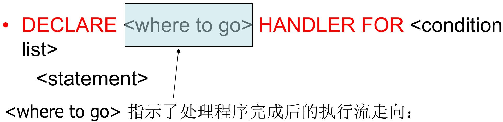
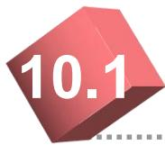
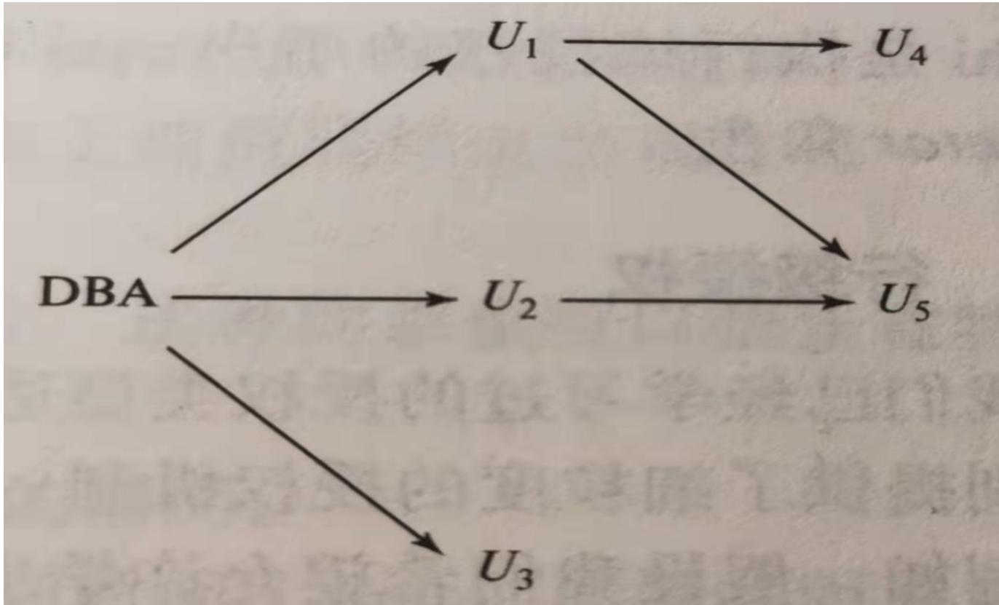
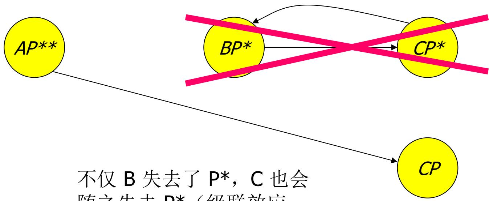
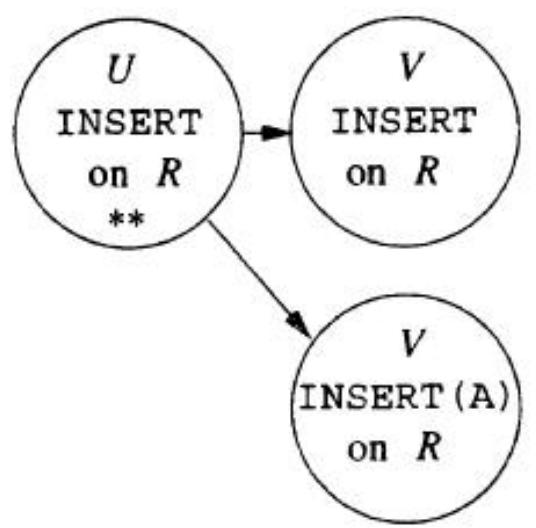
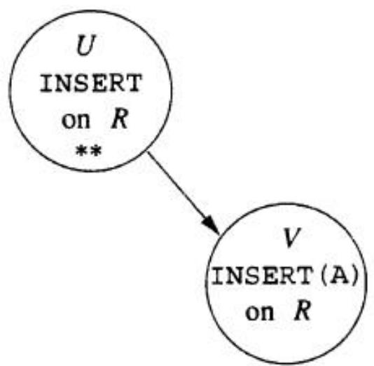
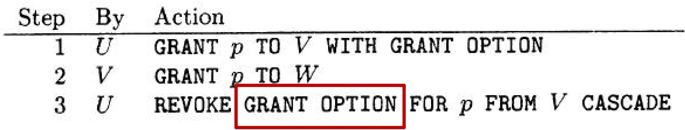
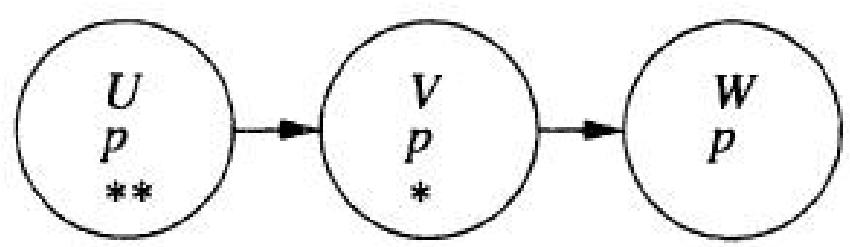
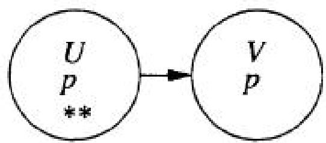

# CHAPTER 9

# Server and Security

# 服务器与安全

(part 1)

  
NIKOND90F3.53s1S0320


  
C-5000ZF2.817800:15050


三层架构 (The Three-Tier Architecture)   
.4 存储过程(Stored Procedures)

三层架构(The Three-Tier Architecture)   
.4 存储过程(Stored Procedures)

# 三层架构 (Three-Tier Architecture)

使用数据库的常见环境通常包含三层处理器 (three tiers of processors)：

1. Web 服务器 (Web servers) — 负责与用户进行交互。  
2. 应用服务器 (Application servers) — 负责执行业务逻辑 (business logic)。  
3. 数据库服务器 (Database servers) 负责从数据库中获取应用服务器所需的数据 （即DBMS 层） 0

# 三层架构 (Three-Tier Architecture)


# 1集中式vs.分布式数据库

集中式数据库

访问速度、扩展性

• 分布式数据库：将原来集中式数据库中的数据分散存储到多个通过网络连接的数据存储节点上，以获取更大的存储容量和更高的并发访问量

更高的数据访问速度  
更强的可扩展性  
更高的并发访问量

# 分布式数据库 (Distributed Database)

• 分布式数据库是由两个或多个文件组成的数据库，这些文件位于不同站点，它们可以处于同一网络中，也可以处于完全不同的网络中  
分类：

– 物理分布，逻辑集中 (DDBS - Distributed Database System)。  
– 物理分布，逻辑同样分布 (FDBS - Federated Database System / 联邦数据库系统)。

• 在之前的学习中，我们仅仅探讨了 SQL 在通用查询接口中的使用方式——即我们坐在终端前，直接向数据库发起查询的环境  
• 然而，现实情况往往截然不同：通常是传统应用程序 (conventional programs) 在与SQL 进行交互。

1. 使用专用语言编写的代码直接存储在数据库内部（例如：PSM, PL/SQL）。  
2. 将 SQL 语句嵌入到 host language 中（例如：C 语言中的嵌入式 SQL）。  
3. 使用连接工具 (Connection tools)，允许传统编程语言通过接口访问数据库（例如：Call-Level Interface (CLI),JDBC, PHP/DB）。

# 嵌入式 SQL 与 CLI 的工作流对比(Embedded vs. CLI)


# JDBC (Java 数据库连接)

Java Database Connectivity (JDBC) 是一个类似于 SQL/CLI 的库，但它的宿主语言是 Java。  
• 它与 CLI 非常相似，但我们需要了解其中存在的一些差异。

# 建立连接 (Making a Connection)


# 语句对象 (Statements)

• JDBC 提供了两个核心类来处理 SQL 语句

1. Statement = 该对象可以接收一个包含 SQL 语句的字符串，并执行该字符串。  
2. PreparedStatement = 预编译语句对象，它关联着一个已经准备好执行的特定 SQL 语句。

# 创建语句对象 (Creating Statements)

Connection 类提供了创建 Statement 和PreparedStatement 对象的方法。

```txt
Statement stat1 = myCon.createStatement();  
PreparedStatement stat2 = myCon.createStatement("SELECT beer, price FROM Sells " + "WHERE bar = 'Joe' 's Bar' "); 
```

无参数的 createStatement 返回一个

Statement 对象；

带有一个 SQL 字符串参数的调用则返回一个

PreparedStatement 对象。

• JDBC 将“查询 (queries)”与“修改 (modifications)”区分开来，并将修改操作统 称为“更新 (updates)”。   
• Statement 和 PreparedStatement 各自都拥有 executeQuery 和 executeUpdate 方法。

– 对于 Statement：方法需要一个参数，即要执行的查询或修改语句字符串。  
– 对于 PreparedStatement：不需要传入参数（因为 SQL 语句在创建时已经绑定）。

# 四个核心执行方法 (Four methods)

用于 Statement 的方法：

– executeQuery(Q)：返回一个 ResultSet 对象，即执行查询 Q 产生的元组集合（严格来说是多重集/bag） 0  
– executeUpdate(U)：接收一个非查询语句 U，执行 U，不返回 ResultSet。

• 用于 PreparedStatement 的方法：

– executeQuery()：基于已预编译的语句执行查询，返回一个 ResultSet 对象。  
– executeUpdate()：执行与该预编译对象关联的 SQL 语句（非查询语句）。

• stat1 是一个 Statement 对象  
• 我们可以使用它来插入一个元组，代码如下：

```javascript
stat1.executeUpdate( "INSERT INTO Sells" + "VALUES('Brass Rail', 'Bud', 3.00)" ); 
```

# 示例：查询操作

• stat2 是一个 PreparedStatement 对象，内部包含了查询语句 “SELECT beer, priceFROM Sells WHERE bar = ’Joe’’s Bar’ ”.  
• 调用 executeQuery 会返回一个 ResultSet类的对象。  
执行查询：

ResultSet menu = stat2.executeQuery();

# 访问结果集 (Accessing the ResultSet)

• ResultSet 类型的对象在概念上类似于一个“游标 (cursor)”。  
. next() 方法将“游标”推进到下一个元组。

– 第一次调用 next() 时，它会获取第一个元组。  
– 如果没有更多元组可供读取，next() 将返回布尔值 false。

• 当 ResultSet 指向某一个元组时，我们可以通过向 ResultSet 应用特定的方法来获取该元组的各个分量。  
• getX(i) 方法：其中 X 代表某种数据类型，i 是分量的索引编号（从 1 开始），该方法返回第 i 个分量的值。

– 注意：数据库中该分量的值必须能够兼容地转换为类型 X。

• Menu 是针对查询 “SELECT beer, price FROM Sells WHERE bar = ’Joe’ ’s Bar’ ”的 ResultSet.   
• 从每个元组中提取 beer 和 price 的方法如下:

```txt
while (menu.next()) { theBeer = Menu.getString(1); thePrice = Menu FLOAT(2); /*something with theBeer and thePrice*/ } 
```

# 参数传递 (Parameter passing)

• 在构建查询字符串时，使用问号 ? 来替代查询中的参数部分。  
• 使用 PreparedStatement 对象的方法setX(i, v)，将变量 v 的值绑定到查询中的第 i 个参数位置。

所使用的 setX 方法类型必须与参数期望的数据类型相匹配。

# 示例：参数传递

# (Example: parameter passing)

PreparedStatement studioStat =

myCon.preparedStatement(

“INSERT INTO Studio(name,address) VALUES(?,?)”)

/* 从用户处获取 studioName='XXX' 和 studioAddr='YYY'

的值 */

studioStat.setString(1, studioName);

studioStat.setString(2, studioAddr);

studioStat.executeUpdate();

三层架构 (The Three-Tier Architecture)   
.4 存储过程(Stored Procedures)

# 存储过程 (Stored Procedures)

• PSM（Persistent Stored Modules，持久化存储模块）允许我们将过程 (procedures) 作为数据库模式元素存储起来。  
• PSM = 传统控制流语句（如 if, while 等）与SQL 语句的混合体。  
• 它使我们能够执行单靠 SQL 无法完成的复杂逻辑操作。

把某些DBMS可执行的代码放到Data Sever端，这样的话所有的客户端都可调用（Reuse）

# 基本 PSM 格式 (Basic PSM Form)

CREATE PROCEDURE <name> (

<parameter list> )

<optional local declarations>

<body>;

函数定义语法 (Function alternative)：

CREATE FUNCTION <name> (

<parameter list> ) RETURNS <type>

<optional local declarations>

<body>;

PROCEDURE 和

FUNCTION 有何区别？

1) 关键字不同  
2) 函数有 RETURNS 声明返回值类型。  
3) 参数列表

注意：教材及PPT上讲到的语法， 不保证能够在你的安装实例和实验环境中正确运行！！

• PSM 中参数使用“模式-名称-类型”三元组(mode-name-type triples)，其中模式(mode) 可以是：

– IN = 仅输入 (input only)，在过程内部不能改变其值，这是默认模式，可以省略。  
– OUT = 仅输出 (output only)。  
– INOUT = 既可输入也可输出 (both)。  
– 注意：函数的参数 (Function Parameters) 只能是 IN 模式。

• 让我们编写一个过程，该过程接收两个参数 oldAddr 和 newAddr，并在 MovieStar表中用newAddr替换所有出现该oldAddr的地方。

# CREATE PROCEDURE Move (

```txt
IN oldAddr VARCHAR(255) IN newAddr VARCHAR(255) 
```

这两个参数都是 IN模式（只读的，不会被过程改变）。

UPDATE MovieStar

SET address = newAddr

WHERE address = oldAddr;

存储过程的主体

(body) 在此仅仅是

一条单一的 UPDATE语句。

# (Invoking Procedures)

• 使用 SQL/PSM 语句 CALL，加上所需的存储过程名称和参数列表来进行调用。

– CALL < 过程名> (<参数列表>)

示例:

CALL Move(’Baldwin Av’,’King St’);

• 至于函数 (Functions)，则可以直接在 SQL 表达式中任何符合其返回类型的地方使用。

# PSM 语句的种类 – (1)

1、RETURN <表达式> 设置函数的返回值  
– 与 C 语言不同，PSM 中的 RETURN 不会 终止函数的执行流程。  
2、DECLARE <变量名> <类型> 用于声明局部变量。  
– 注意声明必须位于可执行语句之前。  
3、BEGIN . . . END 用于将多条语句组合成一个代码块。各条语句之间用分号 (;) 隔开。

# 示例

1) CREATE PROCEDURE MeanVar(   
2) IN s CHAR(15), OUT mean REAL, OUT variance REAL)

6) DECLARE newLength INTEGER;   
7) DECLARE moviecount INTEGER;

# BEGIN

9) SET mean = 0.0; 10) SET variance = 0.0; 11) SET moviecount = 0;   
12) OPEN HovieCursor;

20) SET mean = mean/movieCount;   
21) SET variance = variance/movieCount - mean * mean;   
22) CLOSE Moviecursor;

END

# PSM 语句的种类 – (2)

4、赋值语句 (Assignment statements)

SET <变量名> = <表达式>;

– 示例: SET b = ’Bud’;

5、语句标签 (Statement labels):

名称+冒号+语句”来为语句提供一个标签。

my_loop_label: LOOP

SET counter = counter + 1;

IF… … THEN LEAVE my_loop_label;

END IF;

END LOOP my_loop_label;

# IF 语句 (IF Statements)

最简单形式:

```txt
IF <condition> THEN <statements(s)> END IF; 
```

需要时添加 ELSE 分支：

```txt
IF <condition> THEN <statements(s)> ELSE <statements(s)> END IF; 
```

通过 ELSE IF 添加更多情况：

```sql
IF <condition> THEN <statements(s)>   
ELSEIF <condition>THEN <statements(s)>   
ELSEIF ...   
ELSE <statements(s)>   
END IF; 
```

# IF 语句示例

让我们编写一个函数，接收年份 y 和制片厂 s，如果制片厂 s 在年份 y 制作了至少一部喜剧电影，或者在那一年根本没有制作任何电影，则返回布尔值 TRUE，否则返回 FALSE。

CREATE FUNCTION BandW(y INT, s CHAR(15)) RETURNS BOOLEAN IF NOT EXISTS(

SELECT * FROM Movie WHERE year = y AND studioName = s)

THEN RETURN TRUE;

ELSEIF 1 <=

(SELECT COUNT(*) FROM Movie WHERE year = y AND

studioName = s AND genre = ‘comedy’)

THEN RETURN TRUE;

ELSE RETURN FALSE;

END IF;

# 循环 (Loops)

基本形式:

LOOP

<语句序列>

END LOOP;

带有标签的循环：

```txt
<loop name> : LOOP <statements> END LOOP; 
```

跳出循环使用:

LEAVE <loop name>;

# 示例：退出循环

loop1: LOOP

LEAVE loop1; 执行此语句将导致控制流跳出循环

END LOOP;

控制流将跳转到此处

# 游标 (Cursors)

游标 (cursor) 本质上是一个指向元组的指针，它在某个查询结果集的所有元组之上进行遍历。  
• 声明一个游标 c 的语法:

DECLARE c CURSOR FOR <query>;

# 打开和关闭游标

• 要使用游标 c，我们必须发出以下命令：

OPEN c;

– 此时，游标 c 执行对应的查询(SELECT语句)，把查询结果取到缓冲区中。这时游标处于活动状态，指针指向“返回给你的查询结果集”中的第一条记录。

• 当使用完游标 c 后，发出以下命令将其关闭:

CLOSE c;

# 从游标中提取元组

• 要从游标 c 获取下一个元组，发出以下命令FETCH FROM c INTO x1, x2,…,xn ;  
• 这里的 x 是一个变量列表，分别对应游标 c所指向元组的各个分量。  
• 执行后，c 会被自动移动到下一个元组。

# 打破游标循环 – (1)

使用游标的常见方式是结合 FETCH 语句创建一个循环，并对提取出的每个元组执行某些处理。  
一个棘手的问题是：

– 当游标没有更多的元组可供提取时，我们该如何跳出这个循环？

# 打破游标循环 – (2)

• 每个 SQL 操作都会返回一个状态码status,，这是一个 5 位字符的字符串。

– 例如,

• 00000 = “一切正常 (Everything OK)”   
• 02000 = “找不到元组 (Failed to find a tuple)”

• 在 PSM 中，我们可以从一个名为SQLSTATE 的内置变量中获取这个状态值

# 打破游标循环 – (3)

• 我们可以声明一个条件 (condition)， 这是一个布尔变量，当且仅当 SQLSTATE 具有特定值时，它才为TRUE。

DECLARE <name> CONDITION FOR SQLSTATE <value>;

• 示例：我们可以声明一个名为 Not_Found的条件来代表 02000 状态：

DECLARE Not_Found CONDITION FOR SQLSTATE ’02000’;

# 打破游标循环 – (4)

游标循环的标准结构通常如下:

OPEN c;

cursorLoop: LOOP

FETCH FROM c INTO

IF NotFound THEN LEAVE cursorLoop;

END IF;

END LOOP;

CLOSE c;

# 示例

# 计算某制片厂所制作电影长度的均值和方差：

1) CREATE PROCEDURE MeanVar(   
2) IN s CHAR(15), OUT mean REAL, OUT variance REAL)   
5) DECLARE Not-Found CONDITION FOR SQLSTATE '02000';   
6) DECLARE MovieCursor CURSOR FOR

SELECT length FROM Movie WHERE studioName = s;

7) DECLARE newLength INTEGER;   
8) DECLARE moviecount INTEGER;

# BEGIN

9) SET mean = 0.0; 10) SET variance = 0.0; 11) SET moviecount = 0;   
12) OPEN MovieCursor;   
13) movieLoop: LOOP   
14) FETCH MovieCursor INTO newlength;   
15) IF Not-Found THEN LEAVE movieLoop END IF;   
16) SET moviecount $=$ moviecount + 1;   
17) SET mean $=$ mean + newlength;   
18) SET variance $=$ variance + newLength * newlength;   
19) END LOOP;   
20) SET mean = mean/movieCount;   
21) SET variance = variance/movieCount - mean * mean;   
22) CLOSE Moviecursor;

# 其他循环形式

1、FOR <loop name> AS <cursor name> CURSOR FOR <query> DO FOR 循环遍历游标 <statements> END FOR;   
2、WHILE <condition> DO <statements> WHILE 循环 END WHILE;   
3、REPEAT <statements> UNTIL <condition> REPEAT 循环 END REPEAT;

# 示例：For 循环遍历

1) CREATE PROCEDURE MeanVar(   
2) IN s CHAR(15), 3) OUT mean REAL, 4) OUT variance REAL)   
5) DECLARE moviecount INTEGER; BEGIN   
6) SET mean = 0.0;   
7) SET variance = 0.0;   
8) SET moviecount = 0;   
9) FOR movieLoop AS Moviecursor CURSOR FOR SELECT length FROM Movie WHERE studioNme = s;   
10) DO   
11) SET moviecount = moviecount + 1;   
12) SET mean = mean + length;   
13) SET variance = variance + length * length;   
14) END FOR;   
15) SET mean = mean/movieCount;   
16) SET variance $=$ variance/rnovieCount - mean * mean; END ;

# PSM 中的查询 (Queries in PSM)

在 PSM 中使用 SELECT-FROM-WHERE查询有几种方式：

1. 子查询 (Subqueries) 可以用在条件判断中，或者在 SQL 中任何允许使用子查询的地方。  
2. 生成单个值的查询可以作为赋值语句(assignment statements) 的右值。  
3. 使用单行选择语句：SELECT . . . INTO。  
4. 使用游标 (Cursors)。

零行或者两行以上的数据，程序会当场报错崩溃！

# SELECT INTO

• 单行选择语句 (single-row select) 在 PSM 中是一条合法的语句。  
• 该语句包含一个 INTO 子句，用于指定将返回的单个元组的各个分量存放到哪些变量中

示例:

CREATE PROCEDURE SomeProc(IN studioName CHAR（15））

DECLARE presNetWorth INTEGER;

SELECT netWorth

INTO presNetWorth

FROM Studio，MovieExec

WHERE presC# $\equiv$ cert# AND Studio.name $\bumpeq$ studioName;

# (Exceptions in PSM)

• SQL 系统在 SQLSTATE 变量中指示错误条件 (error conditions)。  
• 我们可以声明一段代码，称为 异常处理程序 (exception handler)。

– 只要 SQLSTATE 中出现了指定错误代码列表中的某一个，该处理程序就会被调用执行。

# PSM 中的异常处理

# (Exceptions in PSM)



1) CONTINUE：继续执行引发异常的语句的下一条语句。  
2) EXIT：离开声明了该处理程序的 BEGIN…END 块，并紧接着执行该代码块之后的语句。  
3) UNDO：与 EXIT 类似，区别在于该代码块会被视为一个事务，并且因为异常而被中止/回滚 (aborted)。

DECLARE <where to go> HANDLER FOR list>

<condition

<statement>

一个异常条件列表，当其中任何一个条件被引发时，就会调用此处理程序。

当相关的异常被引发时要执行的实际处理代码。

# 示例

CREATE FUNCTION GetYear(t VARCHAR(255)) RETURNS INTEGER

DECLARE Not-Found CONDITION FOR SQLSTATE '02000';

DECLARE Too-Many CONDITION FOR SQLSTATE '21000';

BEGIN

-- 声明一个异常处理器：如果没找到或找到太多，则返回 NULL并退出

DECLARE EXIT HANDLER FOR Not-Found, Too-Many RETURN NULL;

RETURN (SELECT year FROM Movie WHERE title = t); END ;

CALL 过程语句可以出现在任何合法 SQL 语句出现的地方。

– 函数语句可以作为表达式的一部分被调用。

INSERT INTO StarsIn(movieTitle, movieyear, starName)

VALUES('Remember the Titans',

GetYear('Remember the Titans'), 'Denzel Washington');

# 课后作业

Exercise 9.4.1

# The End of This Lecture…


# Q&A


# CHAPTER 10

# Server and Security

# 服务器与安全

(part 2)


  
NIKOND90F3.53e1S0320   
C-5000ZF2.817800:15050



# SQL中的安全与用户授权

# (Security and User Authorization in SQL)

# SQL 授权体系 (SQL Authorization)

权限 (Privileges)

授予与撤销 (Grant and Revoke)

授权图 (Grant Diagrams)

# 数据库完整性概述

数据的完整性和安全性是两个不同概念  
数据的完整性

– 防止数据库中存在不符合语义的数据,也就是防止数据库中存在不正确的数据  
– 防范对象:不合语义的、不正确的数据

数据的安全性

– 保护数据库防止恶意的破坏和非法的存取  
– 防范对象:非法用户和非法操作

• 完整性是阻止合法用户通过合法操作向数据库中加入不正确的数据  
• 安全性防范的是非法用户和非法操作存取数据库中的正确数据

# 授权的概念 (Authorization)

文件系统 (A file system) 能够识别针对其所管理的对象（即文件）的某些特定权限。

– 通常包括读 (read)、写 (write)、执行 (execute)

文件系统能够识别可以被授予这些权限的特定参与者。

– 通常包括所有者 (owner)、用户组 (group)、所有用户 (all users)。

# 权限 (Privileges) – (1)

• 相比于典型的数据文件系统，SQL 识别了一套更为详尽精细的、针对数据库对象（如关系表）的权限集合。  
• 总共包含 九种权限，其中某些权限甚至可以被严格限制在某一关系表的单一特定列(column) 上。

# 权限 (Privileges) – (2)

在关系表上的一些重要核心权限:

SELECT [on 关系 | 属性列表] = 查询该关系的权利。如果是SELECT(属性列表)，那么在 SELECT 查询中只有那些指定的属性才允许被查看。  
2. INSERT [on 关系 | 属性列表 $] =$ 插入元组的权利。

可以仅适用于某一个或几个属性

那其他属性呢？

3. DELETE = 删除元组的权利。   
4. UPDATE [on 关系 | 属性列表] = 更新元组的权利。

可以仅适用于部分属性，即只有那些指定的属性才允许被更新。

系统会让其他分量取其默认值 (default value)或 NULL。

# 权限 (Privileges) – (3)

5. REFERENCE [ON 关系 | 属性列表] = 在外键约束等条件中 被引用的权利。  
6. USAGE [关系和断言以外的模式元素]= 在用户自己的声明中 使用该元素 的权利  
7. TRIGGER [on 关系]= 在该关系表上 定义触发器 的权利。  
8. EXECUTE = 执行一段代码的权利，例如执行 PSM（持久化存储模块）的存储过程或函数。  
9. UNDER= 创建给定类型的 子类型 (subtype) 的权利。

# 示例: 权限 (Privileges)

• 对于执行以下 SQL 语句，我们需要哪些权限？

# INSERT INTO Studio(name)

SELECT DISTINCT studioName

FROM Movies

WHERE studioName NOT IN

(SELECT name

FROM Studio);

找出没有出现在

Studio 表中的制片厂。

我们将它们加入到

Studio 中，其他未赋

值的属性将作为 NULL

处理。

• 我们需要 Movies 和 Studio 表上的 SELECT 权限  
• 还需要 Studio 表上的 INSERT 权限，或者至少是Studio 上的 INSERT(name) 权限。 C

# 数据库对象 (Database Objects)

• 存在权限依附的数据库对象包括 存储的基表 (stored tables) 和 视图 (views)。  
• 还有一些权限是关于 创建某种类型的对象的权利，例如创建触发器。  
视图 (Views) 构成了访问控制 (accesscontrol) 的一个极为重要的工具。

# 示例：将视图作为访问控制手段

• 我们可能不希望赋予用户在 Emps(name,addr, salary)表（员工表，含敏感的薪水字段）上全局的 SELECT 权限。  
• 相对而言，赋予在一个剥离了敏感字段的视图上的 SELECT 权限则安全得多:

CREATE VIEW SafeEmps AS

SELECT name, addr FROM Emps;

• 对 SafeEmps 进行的查询操作不需要拥有底层基表 Emps 上的 SELECT 权限，只需要SafeEmps 视图上的权限即可。 11

# 确立权限与所有权 (Creating Privileges)

• 某个对象（如表、视图、触发器等）的owner，自动拥有与该对象相关的所有权限。

– 作为 Owner，天然拥有对这张表的最高统治权：可以查询它（SELECT）、修改它（UPDATE/INSERT）、删掉它（DROP）；  
– 最重要的是，你还有权把这些操作权限“赐予（GRANT）”其他用户。

• 在 SQL 中，所有权 (ownership) 的确立有三个时间点：

– 当创建一个模式 (schema) 时。  
– 当通过带有 AUTHORIZATION userName（指定授权用户名）的 CONNECT 语句发起建立一个会话 (session) 时。  
– 当使用 AUTHORIZATION userName 创建一个模块 (module) 时。模块是存储过程的集合。

# 授权标识符 (Authorization ID’s)

• 用户通过授权 ID (authorization ID) 被系统识别，通常就是他们的登录名。  
• 系统中存在一个特殊的内置authorization ID：PUBLIC。  
• 将某一权限授予 PUBLIC，意味着该权限可供任何授权 ID 使用。

– Current authorization ID（即系统正在使用的权限身份）的判定规则为：

– 优先使用模块的授权 ID（如果该模块设置了的话）。  
– 如果没有，则使用当前“会话的授权 ID (sessionauthorization ID)” 0

# 权限检查过程

# (Privilege-checking process)

. 仅当 当前授权 ID 拥有在涉及的数据库元素上执行该操作所需的全部权限时，SQL 操作才被允许执行。  
获得权限的合法依据：

• Current authorization ID 就是数据的owner。  
• Current authorization ID 已被数据的owner授予了相关权限，或者这些权限被公开授予给了 PUBLIC 用户。  
• The session authorization ID 拥有执行(EXECUTE)某模块的权限，且这个模块的owner拥有这个模块操作的数据的所有权限。  
• The session authorization ID 是“某操作数据”owner或被授权用户，并且在操作一个公开可用的模块操作“该操作数据”。

# 授予权限 (Granting Privileges)

• 对你自己创建的对象（例如关系表），你拥有在其上的所有可能权限（即所有者特权）。  
• 你可以将这些权限授予 (grant) 给其他用户（授权 ID），包括 PUBLIC。  
• 进阶授权：你还可以附加语句“ WITHGRANT OPTION”来授予权限，这允许接收者不仅自己拥有该权限，还可以将该权限进一步转授给其他人。

# 创建与授予权限图示

# (Creating and Granting Privileges)



# 授权语句 (The GRANT Statement)

授权将使用如下语法声明:

GRANT <权限列表>

ON <关系或其他对象>

TO <授权ID列表>;

• 如果你希望接收者能够继续将这些权限转授给其他人，请在语句末尾添加:

WITH GRANT OPTION

# 示例： GRANT

• 假设你是 Studio 表的所有者。你可以执行以下语句授权：

GRANT SELECT, INSERT

ON Studio TO jack;

• 现在，用户 jack 拥有了对 Studio 表发出任何查询的权利，并且可以向 Studio 中插入新的元组。

# 示例: Grant Option

假设我们执行了包含转授选项的授权：

GRANT INSERT ON Studio TO jack

WITH GRANT OPTION;

• 现在，jack 不仅可以向 Studio 中插入元组，还可以将 INSERT ON Studio 的权限转授给其他人。

– 以 jack 的身份登录，他可以执行：

– GRANT INSERT ON Studio TO sisko;   
– 此外，jack 甚至可以授予更为具体的、限制范围更小的权限，例如：INSERT(name) ON Studio.

# 撤销权限 (Revoking Privileges)

REVOKE <权限列表>

ON <关系或其他对象>

FROM <授权ID列表>;

• 执行后，你之前授予给这些用户的权限，将不能再作为他们合法使用该操作的依据。

– 但是注意：他们可能 仍然 拥有该权限，因为他们可能独立地从系统其他来源（例如其他人那里）获得了该权限的授权。

# (REVOKE Options)

我们必须在 REVOKE 语句后附加以下两个选项之一：

1. CASCADE（级联）：现在，由被撤销者(revokee)之前进一步授权的任何权限也都不再有效，无论该权限被向下传递了多深多远，都会在一瞬间全部消失。  
2. RESTRICT（限制）：如果该权限已经被revokee传递给了其他人，那么此时的 REVOKE 操作将直接报错并执行失败 (fails)。这作为一个安全警告，表明在撤销此用户权限之前，必须先采取其他措施去“向下追踪并清理权限”。

# 授权图 (Grant Diagrams)

. 种图形化的用户间权限传递表示方法，好记  
• 节点 (Nodes) = 用户 / 权限 / 是否拥有转授选项(grant option?) /是否是所有者(owner?)。

– UPDATE ON R, UPDATE(a) on R, and UPDATE(b) ON R 是不同的权限，它们存在于授权图的 不同节点 中。  
– SELECT ON R and SELECT ON R WITH GRANT OPTION 也属于 不同的节点

• 有向边 (Edge) X -> Y 表示：节点 X 被用来向节点 Y 授予了权限

# 节点的表示符号 (Notation for Nodes)

• 使用 AP 来表示代表“授权ID A 拥有 权限P”的节点。

$$
\begin{array}{l} - P ^ {*} = \text {带 有 转 授 选 项} (\text {g r a n t o p t i o n}) \text {的 权 限} P 。 \\ - P ^ {* *} = \text {权 限} P \text {的 源 头 ， 即 所 有 者 (O w n e r)} \\ \end{array}
$$

• 意味着 A 是 P 作为权限所依附的对象的所有者。  
• 注意： ** 符号在逻辑上自然蕴含了 * (grant option)

当用户 A 将权限 P 授予用户 B 时，我们在图中画一条从 AP * 或 AP ** 指向 BP 的边。

– 如果该授予包含了 WITH GRANT OPTION，则边指向节点 BP *。

• 如果 A 授予了 P 的一个子权限 Q [例如：P是 UPDATE ON R，而授予的 Q 是

UPDATE(a) on R]，那么这条边将指向 BQ或 BQ 。0

• 根本原则 (Fundamental rule)：只要图中存在一条从任意源头节点 XP ** 指向目标节点CQ、CQ * 或 CQ ** 的路径，并且权限 P是权限 Q 的超权限 (superprivilege)，那么用户 C 就在法律意义上拥有权限 Q。

– 请记住，P 和 Q 可以是同一个权限，X 和 C 也可以是同一个人。

# (Manipulating Edges) – (3)

• 如果 A 使用 CASCADE 选项从 B 那里撤销了权限 P，则从图中删除从 AP 指向 BP（或各自带 * 节点）的边。  
• 但是，如果 A 必须使用 RESTRICT 选项，并且此时图中存在一条从 BP 出发指向任何其他节点的边，那么系统将 拒绝该撤销操作，不对授权图做任何改变。

# (Manipulating Edges) – (3)

• 在对边进行了上述修改（撤销）之后，我们必须执行检查机制：检查每一个存留节点，确保它仍然拥有一条来自某个代表合法所有权的 ** 节点的有向路径。  
• 任何无法追溯到 ** 节点的孤立节点，都代表着一项因丧失合法源头而被撤销的权限，必须从授权图中彻底 删除。

# 示例：授权图演示

# (Example: Grant Diagram)


OPTION。在图中增加边 AP**-> BP*。

B: GRANT P TO C WITH GRANT OPTION。在图 中增加边 BP* - > CP*。 0

A: GRANT P TO C。（普通授予）。在图中增加边 AP** -> CP。

  
A 执行 REVOKE P FROM B CASCADE;

随之失去 P*（级联效应，切断了 BP* -> CP*）。因此删除节点 BP* 和 CP*。

然而，C 依然保留了不带转授选项的权限 P（节点 CP），因为存在一条直接来自 A 的独立授权路径 (AP** -> CP)。

# 示例

设定：用户 Janeway 是 MovieSchema 的所有者 (Owner)，包含表 Movies和 Studio。

Movies(title, year, length, genre, studioName, producerC#)

Studio(name, address, presC#)

Janeway 授予 Kirk 和 Picard 在两张表上的 SELECT 和 Studio 的 INSERT权限，且均带 GRANT OPTION。:

GRANT SELECT,INSERT on Studio TO kirk, picard WITH GRANT OPTION;

GRANT SELECT on Movies TO kirk, picard WITH GRANT OPTION;

Picard 转授这些普通权限给 Sisko:

GRANT SELECT,INSERT on Studio TO sisko;

GRANT SELECT on Movies TO sisko;

Kirk 转授部分权限给 Sisko，并在 Studio 上仅授予了字段级的INSERT(name) 权限:

GRANT SELECT,INSERT(name) on Studio TO sisko;

GRANT SELECT on Movies TO sisko;


设定: Janeway 执行:

REVOKE SELECT,

INSERT on Studio

FROM picard CASCADE

REVOKE SELECT

on Movies

FROM picard CASCADE

设定: Janeway 执行:

REVOKE SELECT, INSERT on Studio FROM picard CASCADE

REVOKE SELECT on Movies FROM picard CASCADE


# 示例

# StepByAction

1U GRANTINSERTONRTOV   
2U GRANT INSERT(A）ON RTOV   
3U REVOKEINSERTONRFROMVRESTRICT

  
（a）After step(2)

  
(b)After step (3)

# 示例

# How about this?



  
(a) After step (2)

  
(b)After step (3)

# 课后作业

10.1.1   
10.1.2   
10.1.3   
10.1.4

# The End of This Lecture…


# Q&A


