# Chapter 17

# 数据库恢复 (Database Recovery)

- 应对系统故障

(Coping with system failures)

# AGENDA

弹性运行的问题和模型

1 (Issues and Models for Resilient Operation) (17.1)   
Undo日志 (Undo Logging) (17.2)   
Redo日志 (Redo Logging) (17.3)   
4 Undo/Redo日志 (Undo/Redo Logging) (17.4)

防范介质故障

5 (Protecting against Media Failures) (17.5)

# 故障模式/类型 (Failure Modes/Types)

• 错误的数据输入

• 有些数据错误的输入（源头，质量）  
• 约束，触发器

• 介质故障

• 局部故障(轻微): 奇偶校验   
• 严重硬件崩溃(严重): RAID(磁盘阵列); 归档; 冗余、分布式副本

• 灾难性故障

• 归档; 冗余、分布式副本

系统故障 (软崩溃， 数据库不一致)

• 在一个独立的、非易失性日志中记录所有数据库的更改，并在必要时结合恢复操作

# 我们的故障模型 (Our failure model)

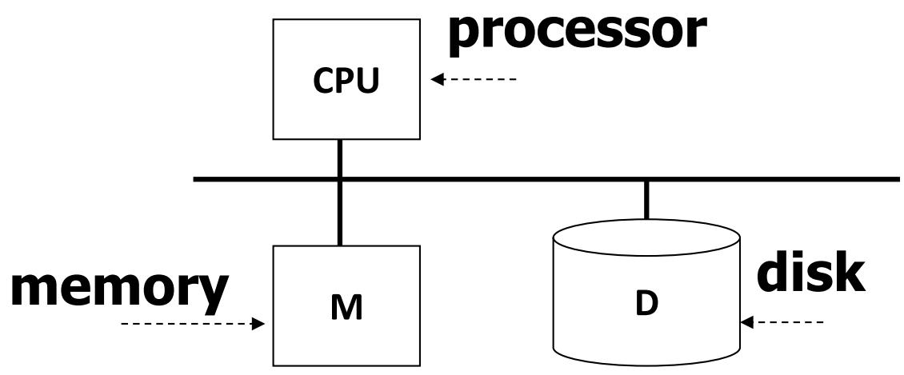

1) 在面临系统故障时必须保护数据 (可恢复性)

日志(undo, redo, undo/redo);

备份(RAID, 异地备份(完全，增量式))

2) 数据绝不能仅仅因为同时进行了几个无错误的查询或数据库修改而损坏（并发）。

# 2、为什么需要事务 (Transactions)？不良的交互

• 数据库系统通常同时被许多用户或进程访问。

• 包括查询和修改。

# 示例1: 不良交互的进程

• 假设常见的 Sells(bar,beer,price) 关系，假设 Joe's Bar 只卖 $2.50的 Bud 和 $3.00 的 Miller。

<table><tr><td>bar</td><td>Menu</td><td>price</td></tr><tr><td>Joe&#x27;s Bar</td><td>Bud</td><td>2.50</td></tr><tr><td>Joe&#x27;s Bar</td><td>Miller</td><td>3.00</td></tr></table>

• Sally 正在查询 Sells 以获取 Joe 收费的最高和最低价格。  
• Joe 决定停止销售 Bud 和 Miller，只以 $3.50 的价格销售 Heineken。

# Sally的程序

• Sally 执行了以下两个称为 (min) 和 (max) 的 SQL 语句，以帮助我们记住它们的作用。

(max) SELECT MAX(price) FROM Sells

WHERE bar = ’Joe’’s Bar’;

(min) SELECT MIN(price) FROM Sells

WHERE bar = ’Joe’’s Bar’;

# Joe的程序

• 大约在同一时间，Joe 执行了以下步骤：(del) 和 (ins)。

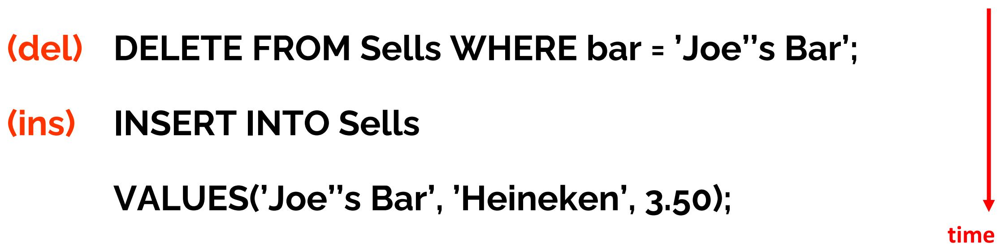

# 示例1: 奇怪的交错-1

• 假设步骤按 (max)(del)(ins)(min) 的顺序执行。

Joe的价格:

语句结果:

Sally 看到

MAX < MIN

?

Strange

# 示例1: 奇怪的交错-2

• 假设步骤按 (max)(min)(del)(ins) 的顺序执行。

Joe的价格:

<table><tr><td>bar</td><td>menu</td><td>price</td><td>bar</td><td>menu</td><td>price</td><td>bar</td><td>menu</td><td>price</td></tr><tr><td>Joe&#x27;s Bar</td><td>Bud</td><td>2.50</td><td></td><td></td><td></td><td>Joe&#x27;s Bar</td><td>Heineken</td><td>3.50</td></tr><tr><td>Joe&#x27;s Bar</td><td>Miller</td><td>3.00</td><td></td><td></td><td></td><td></td><td></td><td></td></tr></table>

语句结果:

(max) (min) (del) (ins)

3.00 2.50

time

Sally 看到 MIN < = MAX

# 示例1: 奇怪的交错-3

• 假设步骤按 (del)(ins)(max)(min) 的顺序执行。

Joe的价格:

<table><tr><td>bar</td><td>menu</td><td>price</td><td>bar</td><td>menu</td><td>price</td><td>bar</td><td>menu</td><td>price</td></tr><tr><td>Joe&#x27;s Bar</td><td>Bud</td><td>2.50</td><td></td><td></td><td></td><td>Joe&#x27;s Bar</td><td>Heineken</td><td>3.50</td></tr><tr><td>Joe&#x27;s Bar</td><td>Miller</td><td>3.00</td><td></td><td></td><td></td><td></td><td></td><td></td></tr></table>

语句结果:

(del)

(max)(ins) (min)

3.50 3.50

time

Sally 看到 MIN <= MAX

# 示例1: 奇怪的交错-4

• 假设步骤按 (del)(max)(ins)(min) 的顺序执行。

Joe的价格:

语句结果:

<table><tr><td>bar</td><td>menu</td><td>price</td></tr><tr><td></td><td></td><td></td></tr><tr><td></td><td></td><td></td></tr></table>

(del) (max)

NULL

<table><tr><td>bar</td><td>menu</td><td>price</td></tr><tr><td>Joe&#x27;s Bar</td><td>Heineken</td><td>3.50</td></tr><tr><td></td><td></td><td></td></tr></table>

(ins)

(min)

3.50

Sally看到不存在max， 但存在min！

# 逐个修复问题？

• 如果 Sally 的语句在 Joe 的语句之前

【(max)(min)】 【 (del) (ins) 】

或者 Sally 的语句在 Joe 的语句之后

【 (del) (ins) 】 【 (max)(min)】

换句话说， 逐个执行,

她就不会看到这种不一致！

• 我们能做到吗?

假设0.5秒钟购买成功1张火车票（查询车次、选定、支付成功），一年 大概2*3600*24*365 不到9千万，按1亿计。

国家铁路局：2020年全国铁路旅客发送量完成22.03亿人。所以……

# 通过使用事务(Transactions)解决问题

• 如果我们将 Sally 的【(max)(min)】和 Joe 的【(del)(ins)】分组到一个事务中。

• 她会在某个固定的时间看到 Joe 的价格。

• 要么在他修改价格之前，要么之后

# 事务 (Transactions)

• 事务 (Transaction) = 涉及数据库查询和/或修改的过程。  
• ACID 是:

原子性 (Atomic) : 整个事务全部完成，或者完全不执行。  
• 致性 (Consistency ): 事务执行前后，数据库的完整性约束和业务逻辑必须是对的。  
• 隔离性 (Isolated ): 对用户而言，似乎一次只有一个进程在执行。  
• 持久性 (Durable): 进程产生的影响在系统崩溃后依然存在。

# 定义事务(Defining Transactions)

# 1） 显式声明

BEGIN TRANSACTION

SQL statement1

SQL statement2

。。。。。

COMMIT

BEGIN TRANSACTION

SQL statement1

SQL statement2

ROLLBACK

# 2） 隐式声明

• 每一条查询或修改语句都是一个事务

# COMMIT vs. ROLLBACK

• SQL 的 COMMIT 导致事务成功完成。

它的数据库修改现在永久保存在数据库中。

• SQL 的 ROLLBACK 也会导致事务结束，但以中止(aborting)的方式。

对数据库没有影响。

# 数据库的正确性

• 示例：希望数据始终是“准确”或“正确”的

<table><tr><td>Name</td><td>Age</td></tr><tr><td>White</td><td>52</td></tr><tr><td>Green</td><td>3421</td></tr><tr><td>Gray</td><td>1</td></tr></table>

• 状态 (State): 数据库有一个状态，这是它每个元素的值  
• 一致状态 (Consistent state): 特定状态满 所有约束Good

# 关于事务的正确性原则

•如果一个事务在没有其他任何事务或系统错误的情况下执行，并且它从一致的数据库状态开始，那么在事务结束时，数据库也处于一致状态。

# 事务 (Transaction): 保证数据库一致性的操作集合

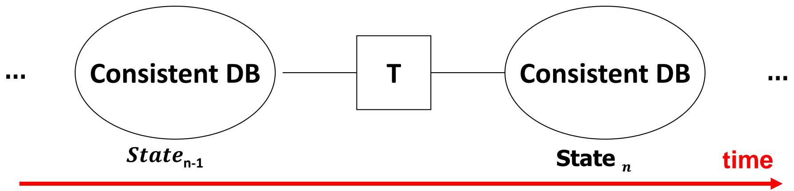

# 正确性原则 (Correctness Principle)

• 每个事务都看到一个一致的数据库 (并发控制)。 [下一章的内容, 多个事务同时执行可能导致状态的不一致，除非进行并发控制]

• 如果我们停止运行事务（完成或中止），数据库仍保持一致

• 事务具有原子性  
Undo日志

# 4、 事务的基本操作

# (Primitive operations of transaction)

# 三个地址空间 (Three address space)

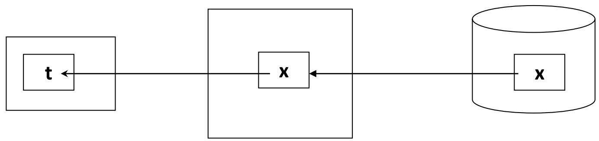

事务的局部地址空间（隔离/独占）

memory

数据库缓冲区

（可能共享）

memory

磁盘块空间

（可能共享）

SSD

# 三个地址空间 (Three address space)

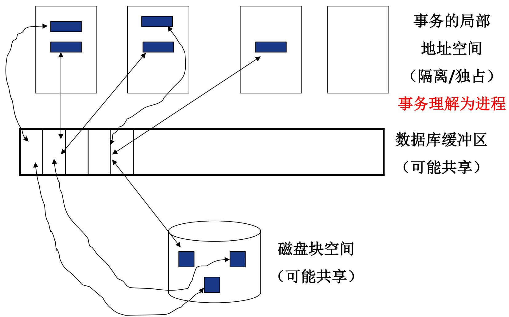

# 事务的四个基本操作

# 三个地址空间 $\&$ 四个基本操作

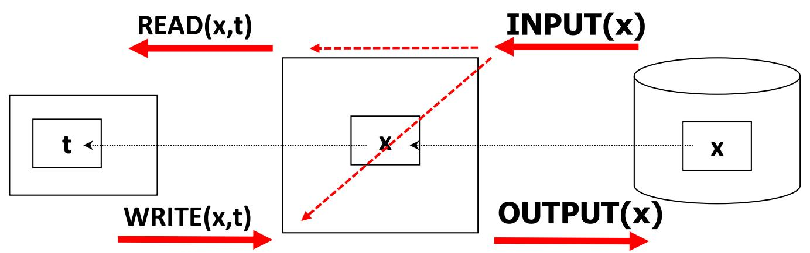

事务的局部地址空间（隔离/独占）

数据库缓冲区（可能共享）

磁盘块空间（可能共享）

# 基本操作

• INPUT(x): 包含 x 的块 从disk→到Buffer/ memory  
• OUTPUT(x): 包含 x 的块 从Buffer → 到disk  
• READ(x,t): 【如果需要，执行 input(x)】

t  Buffer中x的值

WRITE(x,t): 【如果需要，执行 input(x)】

Buffer中x的值  t

一个数据库

元素绝不会

大于一个单

一块!!!

# 示例：事务的基本操作

约束: A=B

T1: A  A  2

B  B  2

T1: Read (A,t); t  t2

Write (A,t);

Read (B,t); t  t2

Write (B,t);

Output (A);

Output (B);

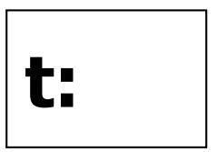  
local

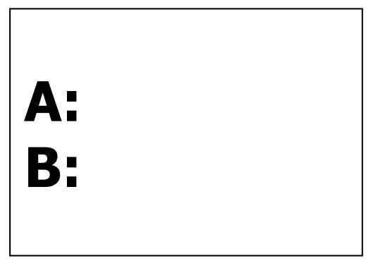  
memory

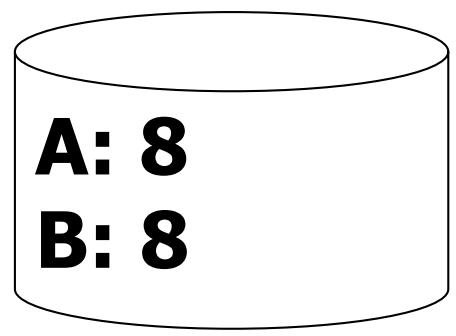  
disk

T1: Read (A,t); t  t2

Write (A,t);

Read (B,t); t  t2

Write (B,t);

Output (A);

Output (B);

local

A: 8

B:

memory

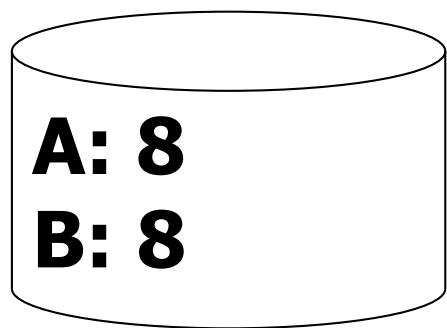

disk

T1: Read (A,t); t  t2

Write (A,t);

Read (B,t); t  t2

Write (B,t);

Output (A);

Output (B);

t: 16

local

A: 8

B:

memory

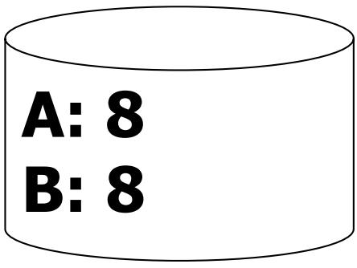

disk

T1: Read (A,t); t  t2

Write (A,t);

Read (B,t); t  t2

Write (B,t);

Output (A);

Output (B);

t: 16

local

A: 8 16

B:

memory

A: 8

B: 8

disk

T1: Read (A,t); t  t2

Write (A,t);

Read (B,t); t  t2

Write (B,t);

Output (A);

Output (B);

t: 8

local

A: 8 16

B: 8

memory

A: 8

B: 8

disk

T1: Read (A,t); t  t2

Write (A,t);

Read (B,t); t  t2

Write (B,t);

Output (A);

Output (B);

t: 16

local

A: 8 16

B: 8

memory

A: 8

B: 8

disk

T1: Read (A,t); t  t2

Write (A,t);

Read (B,t); t  t2

Write (B,t);

Output (A);

Output (B);

time

t: 16

local

A: 8 16

B: 8 16

memory

注意： 到目前为止， Disk上的数据并没有修改！

A: 8

B: 8

disk

T1: Read (A,t); t  t2

Write (A,t);

Read (B,t); t  t2

Write (B,t);

Output (A);

Output (B);

t: 16

local

A: 8 16

B: 8 16

memory

A: 8 16

B: 8

disk

T1:

time

Read (A,t); t  t2   
Write (A,t);   
Read (B,t); t  t2   
Write (B,t);   
Output (A);   
Output (B);

t: 16

local

A: 8 16

B: 8 16

memory

事务执行完成，

A= B

A: 8 16

B: 8 16

disk

T1: Read (A,t); t  t2; Write (A,t);

Read (B,t); t  t2; Write (B,t);

Output (A); Output (B);

<table><tr><td>Action</td><td>t</td><td>Mem A</td><td>Mem B</td><td>Disk A</td><td>Disk B</td></tr><tr><td>READ(A,t)</td><td>8</td><td>8</td><td></td><td>8</td><td>8</td></tr><tr><td>t := t*2</td><td>16</td><td>8</td><td></td><td>8</td><td>8</td></tr><tr><td>WRITE(A,t)</td><td>16</td><td>16</td><td></td><td>8</td><td>8</td></tr><tr><td>READ(B,t)</td><td>8</td><td>16</td><td>8</td><td>8</td><td>8</td></tr><tr><td>t := t*2</td><td>16</td><td>16</td><td>8</td><td>8</td><td>8</td></tr><tr><td>WRITE(B,t)</td><td>16</td><td>16</td><td>16</td><td>8</td><td>8</td></tr><tr><td>OUTPUT(A)</td><td>16</td><td>16</td><td>16</td><td>16</td><td>8</td></tr><tr><td>OUTPUT(B)</td><td>16</td><td>16</td><td>16</td><td>16</td><td>16</td></tr></table>

T1: Read (A,t); t  t2

Write (A,t);   
Read (B,t); t  t2   
Write (B,t);   
Output (A);

Output (B);

failure!

t: 16

local

A: 8 16

B: 8 16

memory

A: 8 16

B: 8

disk

# 原子性 (Atomicity)

• 执行事务的所有操作，或者完全不执行

(要么完全执行，要么完全不执行)

• 解决方案之一：Undo logging (撤销日志)

# AGENDA

弹性运行的问题和模型

(Issues and Models for Resilient Operation) (17.1)   
Undo日志 (Undo Logging) (17.2)   
Redo日志 (Redo Logging) (17.3)   
4 Undo/Redo日志 (Undo/Redo Logging) (17.4)

防范介质故障

(Protecting against Media Failures) (17.5)

# Undo日志 (Undo Logging)

• 日志是由日志记录组成的文件，每条记录说明了某个事务所做的某些事情。  
• 将日志想象成一个仅允许追加写入的文件。  
• Undo logging (撤销日志) — 通过撤销(Undoing)可能在崩溃前未完成的事务影响，来修复数据库状态。

# Undo 日志记录

• 几种形式的日志记录 (log records)

• <START Ti>: 表示事务 Ti 已开始  
• <COMMIT Ti>: 事务 Ti 已成功完成，并且不会再对数据库元素进行任何更改  
• <ABORT Ti>: 事务 Ti 未能成功完成  
• <Ti, X, v>: 事务 Ti 更改了数据库元素 X，其旧值为 v。

# <T, X,v> undo日志/记录

• 事务 Ti 更改了数据库元素 X，其旧值为 v。  
• 更新记录反映的更改通常发生在内存中，而不是磁盘上； 即，日志记录是对 WRITE 操作的响应，而不是对 OUTPUT 操作的响应。

# 注意

• 日志首先写入内存  
• 不会在每个动作上都写入磁盘【块设备的特性，效率】  
• Undo日志不记录数据库元素的新值

• 仅记录旧值

• 恢复管理器将要做的唯一事情  
• 通过恢复旧值来取消事务在磁盘上可能产生的影响

# Undo日志规则 (The Undo-Logging Rules)

• U1: 如果事务 T 修改了数据库元素 X，则必须在将 X 的新值写入磁盘之前，将形如 <T, X, v> 的日志记录写入磁盘。

写入磁盘：先写undo日志， 再写数据

• U2: 如果事务提交，则必须在事务修改的所有数据库元素写入磁盘之后，才将其 COMMIT 日志记录写入磁盘，但此后应尽快写入.

COMMIT：先写数据，再写undo日志Commit

# 按以下顺序写入磁盘

• 与一个事务相关的内容必须按以下顺序写入磁盘  
• a) 记录修改数据库元素的日志  
• b) 更改后的数据库元素本身  
c) commit 日志记录  
• a) 和 b) 的顺序适用于每个单独的数据库元素

HDD：undo日志-> 数据 -> COMMIT记录

• 为了强制将日志记录写入磁盘

– 日志管理器需要一个 flush-log (刷新日志) 命令，该命令告诉缓冲区管理器将以前未复制到磁盘的所有日志块复制到磁盘

– FLUSH LOG

• 事务管理器需要一种方法来告诉缓冲区管理器

– 对数据库元素执行 OUTPUT 操作

# 小结：Undo日志规则

(1) 对于每个 Write 动作，生成 undo 日志记录(记录的是旧值)  
(2) 在磁盘上的 x 被修改之前，关于 x 的 undo 日志记录必须已在磁盘上 (预写式日志: WAL)  
(3) 在 commit flush到日志之前，事务的所有write操作必须已存储在磁盘上。

# Undo logging

T1: Read (A,t); t  t2

Write (A,t);

Read (B,t); t  t2

Write (B,t);

Output (A);

Output (B);

t:8

Local

A:8

B:

memory

A:8

B:8

Data disk

<T1, start>

Log memory

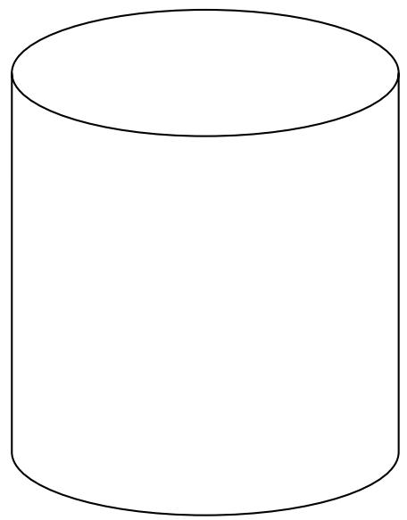

Log disk

# Undo logging

T1: Read (A,t); t  t2

Write (A,t);

Read (B,t); t  t2

Write (B,t);

Output (A);

Output (B);

t:16

Local

A:8

B:

memory

A:8

B:8

Data disk

<T1, start>

Log memory

Log disk

# Undo logging

T1: Read (A,t); t  t2

Write (A,t);

Read (B,t); t  t2

Write (B,t);

Output (A);

Output (B);

t:16

Local

A:8 16

B:8

memory

A:8

B:8

disk

<T1, start>

<T1, A, 8>

Log memory

log

# Undo logging

T1: Read (A,t); t  t2

Write (A,t);

Read (B,t); t  t2

Write (B,t);

Output (A);

Output (B);

t:16

Local

A:8 16

B:8 16

memory

A:8

B:8

disk

<T1, start>

<T1, A, 8>

<T1, B, 8>

Log memory

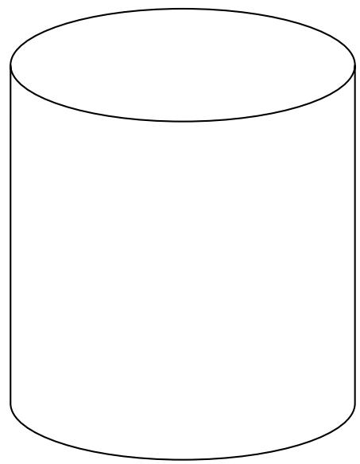

log

# Undo logging

T1: Read (A,t); t  t2

Write (A,t);

Read (B,t); t  t2

Write (B,t); (flush log)

Output (A);

Output (B);

A:8 16

B:8 16

memory

A:8

B:8

disk

Log memory

<T1, start>

<T1, A, 8>

<T1, B, 8>

log

# Undo logging

T1: Read (A,t); t  t2

Write (A,t);

Read (B,t); t  t2

Write (B,t); (flush log)

Output (A);

Output (B);

A:8 16

B:8 16

memory

A:8 16

B:8

disk

  
Log memory

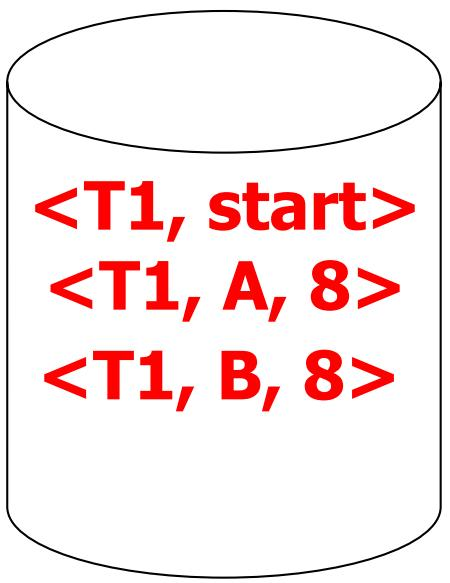

log

# Undo logging

T1: Read (A,t); t  t2

Write (A,t);

Read (B,t); t  t2

Write (B,t); (flush log)

Output (A);

Output (B);

A:8 16

B:8 16

memory

A:8 16

B:8 16

disk

<T1, commit>

Log memory

<T1, start>

<T1, A, 8>

<T1, B, 8>

log

# Undo logging

T1: Read (A,t); t  t2

Write (A,t);

Read (B,t); t  t2

Write (B,t); (flush log)

Output (A);

Output (B);

(flush log)

A:8 16

B:8 16

memory

A:8 16

B:8 16

disk

  
Log memory

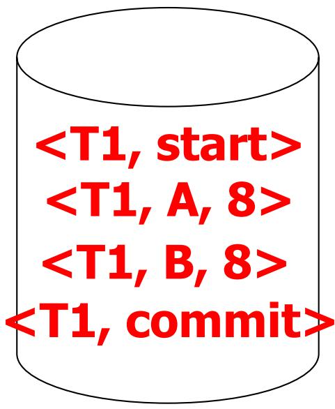

log

# Undo logging

T1: Read (A,t); t  t2; Write (A,t);

Read (B,t); t  t2; Write (B,t);

Output (A); Output (B);

<table><tr><td>Step</td><td>Action</td><td>t</td><td>M-A</td><td>M-B</td><td>D-A</td><td>D-B</td><td>Log</td></tr><tr><td>1)</td><td></td><td></td><td></td><td></td><td></td><td></td><td>&lt;START T&gt;</td></tr><tr><td>2)</td><td>READ(A,t)</td><td>8</td><td>8</td><td></td><td>8</td><td>8</td><td></td></tr><tr><td>3)</td><td>t := t*2</td><td>16</td><td>8</td><td></td><td>8</td><td>8</td><td></td></tr><tr><td>4)</td><td>WRITE(A,t)</td><td>16</td><td>16</td><td></td><td>8</td><td>8</td><td>&lt;T,A,8&gt;</td></tr><tr><td>5)</td><td>READ(B,t)</td><td>8</td><td>16</td><td>8</td><td>8</td><td>8</td><td></td></tr><tr><td>6)</td><td>t := t*2</td><td>16</td><td>16</td><td>8</td><td>8</td><td>8</td><td></td></tr><tr><td>7)</td><td>WRITE(B,t)</td><td>16</td><td>16</td><td>16</td><td>8</td><td>8</td><td>&lt;T,B,8&gt;</td></tr><tr><td>8)</td><td>FLUSH LOG</td><td></td><td></td><td></td><td></td><td></td><td></td></tr><tr><td>9)</td><td>OUTPUT(A)</td><td>16</td><td>16</td><td>16</td><td>16</td><td>8</td><td></td></tr><tr><td>10)</td><td>OUTPUT(B)</td><td>16</td><td>16</td><td>16</td><td>16</td><td>16</td><td></td></tr><tr><td>11)</td><td></td><td></td><td></td><td></td><td></td><td></td><td>&lt;COMMIT T&gt;</td></tr><tr><td>12)</td><td>FLUSH LOG</td><td></td><td></td><td></td><td></td><td></td><td></td></tr></table>

Figure 17.3: Actions and their log entries

# 恢复规则: Undo logging

从尾部扫描 undo 日志:

(1) 设 $\mathsf { \pmb S = }$ 日志中具有 <Ti, start> 但没有 <Ti, commit> (或 <Ti,abort>) 记录的事务集合。  
(2) 对于日志中的每个 ${ \bf < T i , X , v > , }$ ，按逆序 (latest → earliest) 执行:

$$
- \text {如 果} \mathbf {T i} \in \mathbf {S} \text {那 么} \left\{ \begin{array}{l} - \text {w r i t e} (\mathbf {X}, \mathbf {v}) \\ - \text {o u t p u t} (\mathbf {X}) \end{array} \right.
$$

(3) 对于每个 Ti  S 执行后

- 将 <Ti, abort> 写入日志

# 硬盘UNDO日志

<Start T1>   
<T1, A, O>   
<Commit T1>   
<Start T2>   
<T2, B, 10>   
<T2, C,20>

# 黑名单 (集合S)

$$
S = \{\}
$$

# 磁盘物理数据区

变量A10

变量B 50

变量C99

# 硬盘UNDO日志

<Start T1>   
<T1, A, 0>   
<Commit T1>   
<Start T2>   
<T2, B, 10>   
<T2, C, 20>

# 黑名单 (集合S)

$S = \{ \}$

# 磁盘物理数据区

变量A 10

变量B 50

变量C99

# 硬盘UNDO日志

<Start T1>

<T1, A, O>

<Commit T1>

<Start T2>

<T2, B, 10>

<T2, C,20>

# 黑名单(集合S)

$S = \{ \}$

# 磁盘物理数据区

变量A

10

变量B

50

变量c

99

# 硬盘UNDO日志

<Start T1>

<T1, A, O>

<Commit T1>

<Start T2>

<T2, B, 10>

<T2, C,20>

# 黑名单 (集合S)

$S = \{ T 2 \}$

# 磁盘物理数据区

变量A

10

变量B

50

变量C

99

# 硬盘UNDO日志

<Start T1>

<T1, A, 0>

<Commit T1>

<Start T2>

<T2, B, 10>

<T2, C,20>

# 黑名单 (集合S)

$S = \{ T 2 \}$

# 磁盘物理数据区

变量A

10

变量B

50

变量C

99

扫描日志行 2...

# 硬盘UNDO日志

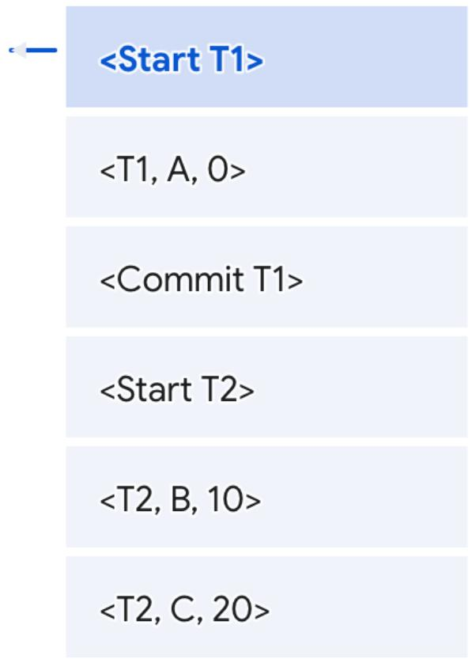

# 黑名单 (集合S)

$S = \{ T 2 \}$ 正在寻找未提交事务.

# 磁盘物理数据区

变量A 10

变量B 50

变量C99

扫描日志行 1...

# 硬盘UNDO日志

<Start T1>

<T1, A, O>

<Commit T1>

<Start T2>

<T2, B, 10>

<T2,C, 20>

# 黑名单 (集合S)

$S = \{ T 2 \}$

# 磁盘物理数据区

变量A

10

变量B

50

变量c

99

第一阶段完成。黑名单 S={T2}。开始第二阶段：逆序回滚数据。

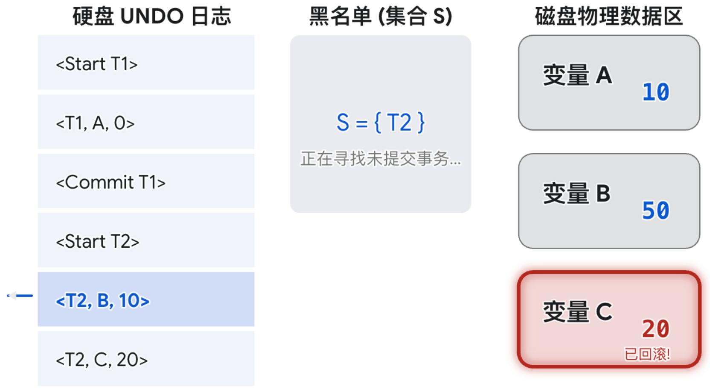

事务T2未提交，将变量 $\mathsf { C }$ 恢复至旧值 20。

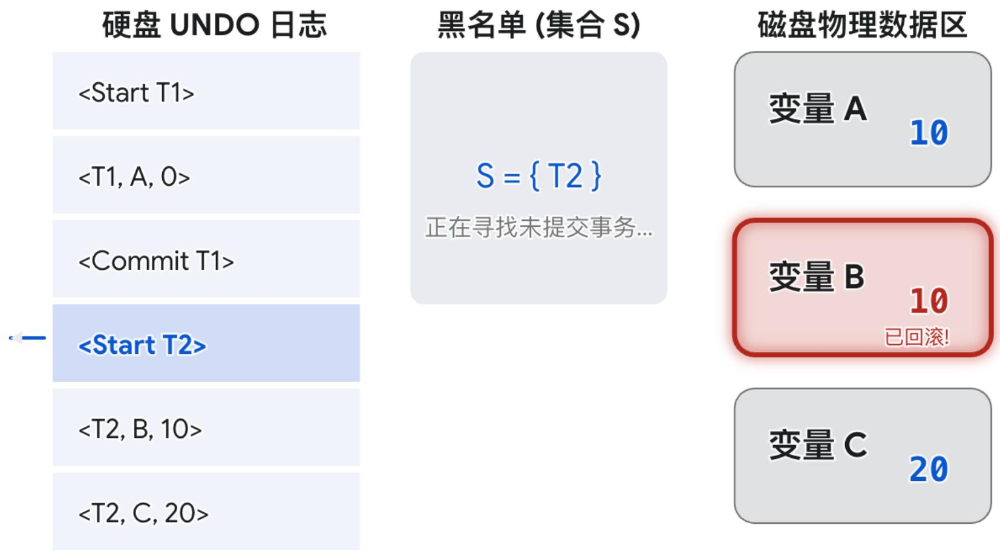

事务 T2未提交，将变量B恢复至旧值10。

# 硬盘UNDO日志

<Start T1>   
<T1, A, 0>   
<Commit T1>   
<Start T2>   
<T2, B, 10>   
<T2, C,20>   
<Abort T2> 追加中止记录

# 黑名单 (集合S)

$S = \{ T 2 \}$

# 磁盘物理数据区

变量A

10

变量B

10

变量C

20

恢复完成!

# 示例 17.3 p856

<table><tr><td>Step</td><td>Action</td><td>t</td><td>M-A</td><td>M-B</td><td>D-A</td><td>D-B</td><td>Log</td></tr><tr><td>1)</td><td></td><td></td><td></td><td></td><td></td><td></td><td>&lt;START T&gt;</td></tr><tr><td>2)</td><td>READ(A,t)</td><td>8</td><td>8</td><td></td><td>8</td><td>8</td><td></td></tr><tr><td>3)</td><td>t := t*2</td><td>16</td><td>8</td><td></td><td>8</td><td>8</td><td></td></tr><tr><td>4)</td><td>WRITE(A,t)</td><td>16</td><td>16</td><td></td><td>8</td><td>8</td><td>&lt;T, A, 8&gt;</td></tr><tr><td>5)</td><td>READ(B,t)</td><td>8</td><td>16</td><td>8</td><td>8</td><td>8</td><td></td></tr><tr><td>6)</td><td>t := t*2</td><td>16</td><td>16</td><td>8</td><td>8</td><td>8</td><td></td></tr><tr><td>7)</td><td>WRITE(B,t)</td><td>16</td><td>16</td><td>16</td><td>8</td><td>8</td><td>&lt;T, B, 8&gt;</td></tr><tr><td>8)</td><td>FLUSH LOG</td><td></td><td></td><td></td><td></td><td></td><td></td></tr><tr><td>9)</td><td>OUTPUT(A)</td><td>16</td><td>16</td><td>16</td><td>16</td><td>8</td><td></td></tr><tr><td>10)</td><td>OUTPUT(B)</td><td>16</td><td>16</td><td>16</td><td>16</td><td>16</td><td></td></tr><tr><td>11)</td><td></td><td></td><td></td><td></td><td></td><td></td><td>&lt;COMMIT T&gt;</td></tr><tr><td>12)</td><td>FLUSH LOG</td><td></td><td></td><td></td><td></td><td></td><td></td></tr></table>

1. 事故发生在步骤（12）之后。  
2. 事故发生在步骤（11）和（12）之间。  
3. 事故发生在步骤（10）和（11）之间。  
4. 事故发生在步骤（8）和（10）之间。  
5. 事故发生在步骤（8）之前。

Figure 17.3: Actions and their log entries

# 开放问题

如果在恢复期间发生故障怎么办？

No problem! Undo 是幂等的 (idempotent)

想象一下：Word文档的覆盖式保存，覆盖一次或覆盖多次没有区别

# 检查点 (Checkpoint)

•为了避免检查整个日志

• 我们可以删除 COMMIT 之前的日志吗？  
• 不行！有关其他活动事务 T 的日志记录可能会丢失

•这个问题的解决方案

• 定期为日志设置检Checkpoint

# 检查点 (Checkpoint)

• 在一个简单的Checkpoint中,

1. 停止接受新事务。  
2. 等待直到所有当前活动的事务提交或中止，并在日志中写入COMMIT 或 ABORT 记录。  
3. 将日志flush到磁盘。  
4. 写入日志记录 <CKPT>，然后再次flush日志。  
5. 恢复接受事务。

# 检查点 (Checkpoint)

# Checkpoint的影响

– 检查点之前执行的任何事务都已经完成  
– 在恢复期间，从尾部扫描日志，当找到 <CKPT> 记录时，所有未完成的事务都已经被看到过了  
– 不需要扫描 <CKPT> 之前的内容，  
– 事实上，该点之前的日志可以安全地删除或覆盖。

# 检查点 (Checkpoint)

示例

$$
\begin{array}{l} <   S T A R T T _ {1} > \\ <   T _ {1}, A, 5 > \\ <   S T A R T T _ {2} > \\ <   T _ {2}, B, 1 0 > \\ \end{array}
$$

设置一个 checkpoint

$$
\begin{array}{l} <   \text {S T A R T} T _ {1} > \\ <   T _ {1}, A, 5 > \\ <   \text {S T A R T} T _ {2} > \\ <   T _ {2}, B, 1 0 > \\ <   T _ {2}, C, 1 5 > \\ <   T _ {1}, D, 2 0 > \\ <   C O M M I T T _ {1} > \\ <   C O M M I T T _ {2} > \\ <   \mathrm {C K P T} > \quad \text {F l u s h 到 磁 盘} \\ <   \text {S T A R T} T _ {3} > \\ <   T _ {3}, E, 2 5 > \\ <   T _ {3}, F, 3 0 > \\ \end{array}
$$

假设此时发生了一次事故

# 非静止检查点

# (Nonquiescent Checkpoint)

简单检查点的问题

– 在设置检查点的同时，相当于必须关闭系统（不接受新的事务）

解决方案：

– 非静止检查点  
– 允许在设置新检查点期间，支持新事务进入系统

# 非静止检查点

# (Nonquiescent Checkpoint)

# 非静止检查点

1. 写入日志记录 <START CKPT (T1, …, TK)> 并flush日志。  
2. 等待直到 T1, …, TK 全部提交或中止，但不禁止其它事务开始  
3. 当 T1, …, TK 全部完成后，写入日志记录 <END CKPT> 并flush日志

# 非静止检查点

# (Nonquiescent Checkpoint)

# 恢复 (Recovery)

# – 两种情况

1. 如果我们首先遇到 <END CKPT>，那么我们知道所有未完成的事务都是在上一个 <START CKPT (T1, …, TK)> 之后开始的向后扫描直到 <START CKPT (T1, …, TK)>

# 非静止检查点

# (Nonquiescent Checkpoint)

一条通用规则:

恢复 (Recovery)

– 两种情况

一旦 <END CKPT> 写入磁盘，我们就可以删除上一个 <START CKPT …> 之前的日志

2. 如果我们首先遇到 <START CKPT (T1, …, TK)>，那么说明崩溃发生在检查点期间

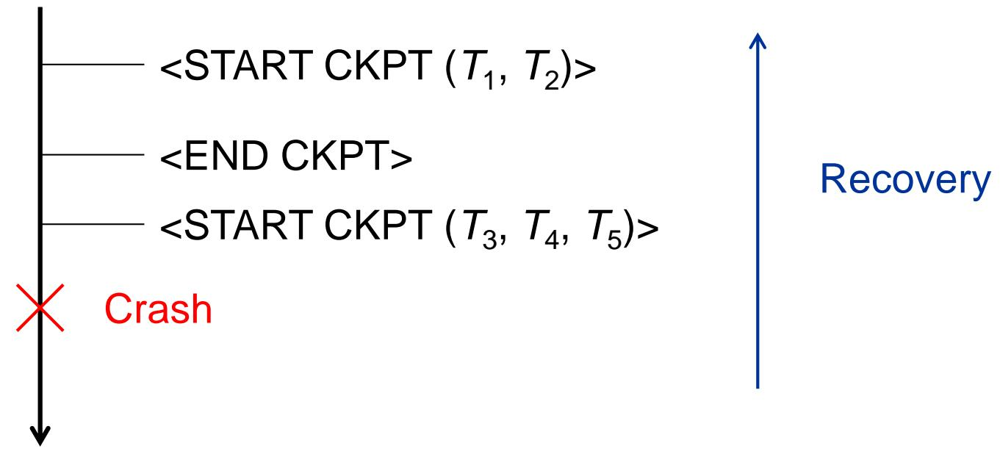

# 非静止检查点

# (Nonquiescent Checkpoint)

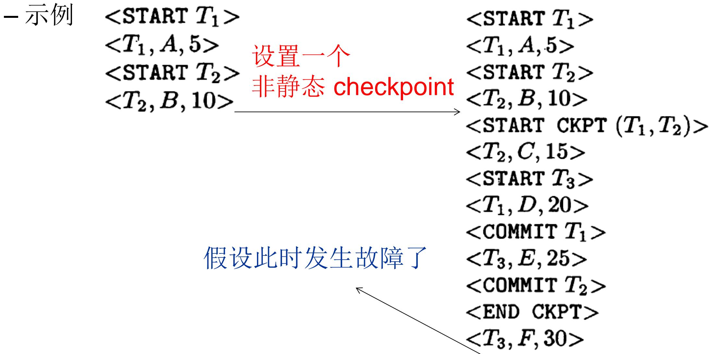

# 非静止检查点

# (Nonquiescent Checkpoint)

# – 示例

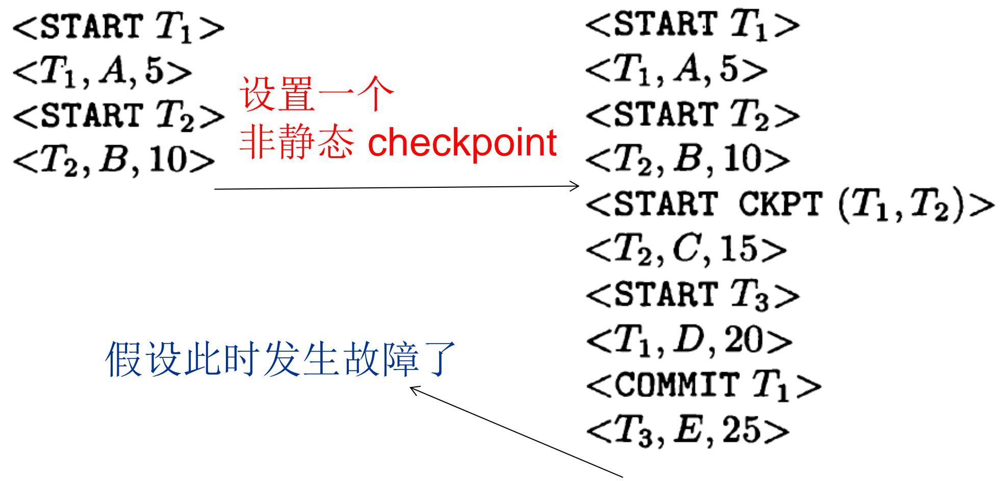

# AGENDA

弹性运行的问题和模型

(Issues and Models for Resilient Operation) (17.1)   
Undo日志 (Undo Logging) (17.2)   
Redo日志 (Redo Logging) (17.3)   
4 Undo/Redo日志 (Undo/Redo Logging) (17.4)

防范介质故障

(Protecting against Media Failures) (17.5)

# 为什么要用 redo 日志？

• Undo 日志的问题

• 必须在事务提交之前将其更改的数据全部写入磁盘→ 磁盘 I/O太多

• 节省磁盘 I/O

• 让更改的数据暂时只驻留在主存中  
• 使用 redo 日志在发生崩溃时进行修复

# Redo 和 Undo 日志的区别

<table><tr><td>Undo 日志</td><td>Redo 日志</td></tr><tr><td>取消未完成事务的影响;在恢复期间忽略已经commit的事务</td><td>忽略未完成事务;重复已经commit事务的更改</td></tr><tr><td>先将更改后的数据库元素flush到磁盘后将 COMMIT 日志记录flush磁盘。</td><td>先将 COMMIT 记录flush到磁盘后将任何更改的数据值flush到磁盘</td></tr><tr><td>记录的是更改的旧值。</td><td>记录的是新值。</td></tr></table>

# Redo日志规则

• R1: 在修改磁盘上的任何数据库元素 X 之前，必须将有关此次 X 修改的所有日志记录（包括更新记录 $\ l < \tilde { \ l } , \times , \lor \ l >$ 和 <COMMIT T> 记录）全部写入磁盘。

• a) 记录修改数据库元素的日志  
• b) COMMIT 日志记录。  
• c) 更改的数据库元素本身。

日志先行！

更新 redo log→COMMIT log→更新 DB

Redo 日志是延迟修改 (deferred modification)!

# Redo logging (deferred modification)

T1: Read(A,t); t t2; write (A,t);

Read(B,t); t t2; write (B,t);

Output(A); Output(B)

A: 8

B: 8

memory

A: 8

B: 8

DB

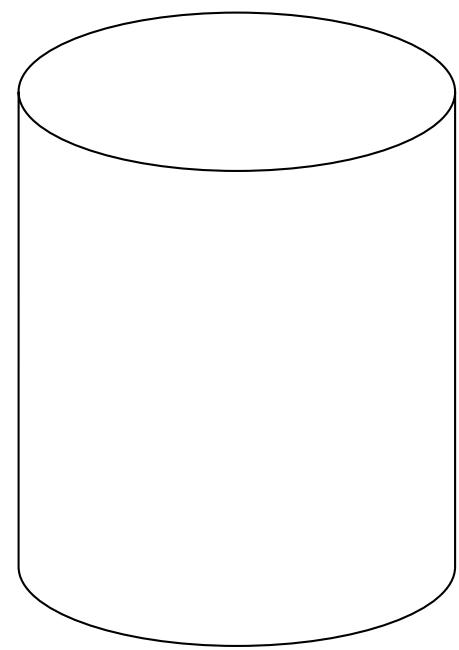  
LOG

# Redo logging (deferred modification)

T1: Read(A,t); t t2; write (A,t);

Read(B,t); t t2; write (B,t); Flush-log;

Output(A); Output(B)

A: 8 16

B: 816

memory

A: 8

B: 8

DB

  
LOG HDD

<T1, start>

<T1, A, 16>

<T1, B, 16>

LOG m

# Redo logging (deferred modification)

T1: Read(A,t); t t2; write (A,t);

Read(B,t); t t2; write (B,t); Flush-log;

Output(A); Output(B)

A: 8 16

B: 816

memory

A: 8

B: 8

DB

<T1, start>

<T1, A, 16>

<T1, B, 16>

LOG HDD

LOG m

# Redo logging (deferred modification)

T1: Read(A,t); t t2; write (A,t);

Read(B,t); t t2; write (B,t); Flush-log; Output(A); Output(B)

A: 8 16

B: 816

memory

A: 8

B: 8

DB

<T1, start>

<T1, A, 16>

<T1, B, 16>

LOG HDD

<T1, commit>

LOG m

# Redo logging (deferred modification)

T1: Read(A,t); t t2; write (A,t);

Read(B,t); t t2; write (B,t); Flush-log;【 Flush-log 】

Output(A); Output(B)

A: 8 16

B: 8 16

memory

A: 8

B: 8

DB

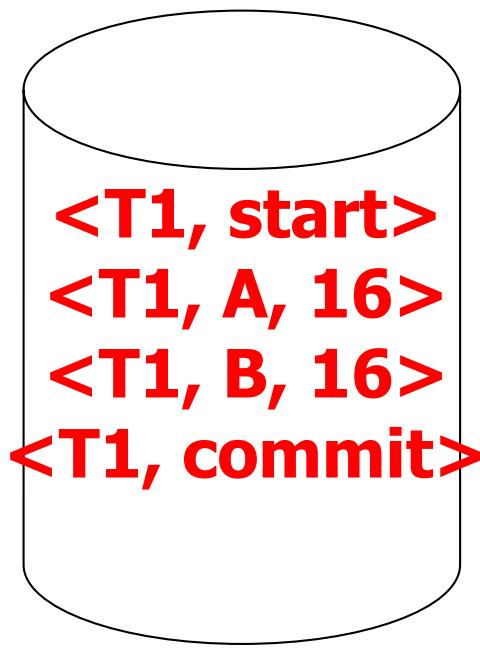  
LOG

LOG m

# Redo logging (deferred modification)

T1: Read(A,t); t t2; write (A,t);

Read(B,t); t t2; write (B,t); Flush-log; Output(A); Output(B)

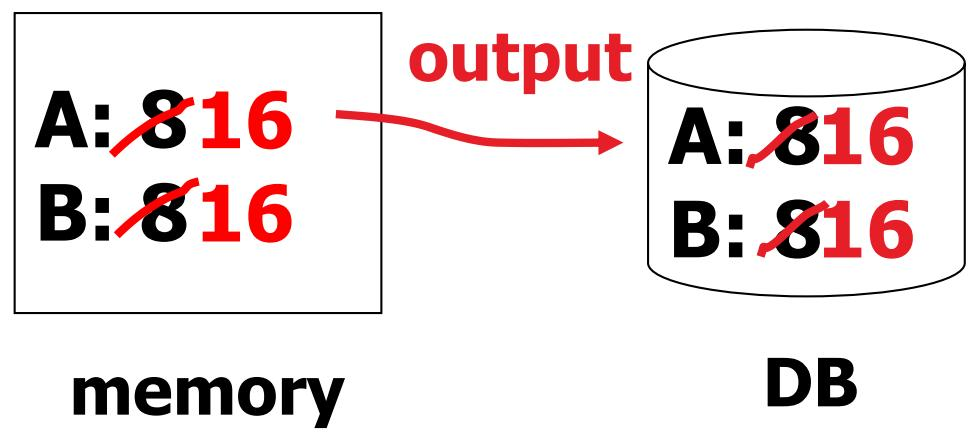

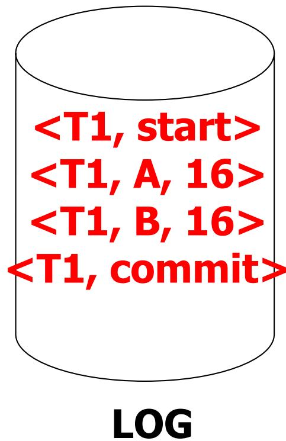

# Redo log

T1: Read(A,t); t:=t2; write (A,t);

Read(B,t); t:=t2; write (B,t); Output(A); Output(B)

<table><tr><td>Step</td><td>Action</td><td>t</td><td>M-A</td><td>M-B</td><td>D-A</td><td>D-B</td><td>Log</td></tr><tr><td>1)</td><td></td><td></td><td></td><td></td><td></td><td></td><td>&lt;START T&gt;</td></tr><tr><td>2)</td><td>READ(A,t)</td><td>8</td><td>8</td><td></td><td>8</td><td>8</td><td></td></tr><tr><td>3)</td><td>t := t*2</td><td>16</td><td>8</td><td></td><td>8</td><td>8</td><td></td></tr><tr><td>4)</td><td>WRITE(A,t)</td><td>16</td><td>16</td><td></td><td>8</td><td>8</td><td>&lt;T, A, 16&gt;</td></tr><tr><td>5)</td><td>READ(B,t)</td><td>8</td><td>16</td><td>8</td><td>8</td><td>8</td><td></td></tr><tr><td>6)</td><td>t := t*2</td><td>16</td><td>16</td><td>8</td><td>8</td><td>8</td><td></td></tr><tr><td>7)</td><td>WRITE(B,t)</td><td>16</td><td>16</td><td>16</td><td>8</td><td>8</td><td>&lt;T, B, 16&gt;</td></tr><tr><td>8)</td><td></td><td></td><td></td><td></td><td></td><td></td><td>&lt;COMMIT T&gt;</td></tr><tr><td>9)</td><td>FLUSH LOG</td><td></td><td></td><td></td><td></td><td></td><td></td></tr><tr><td>10)</td><td>OUTPUT(A)</td><td>16</td><td>16</td><td>16</td><td>16</td><td>8</td><td></td></tr><tr><td>11)</td><td>OUTPUT(B)</td><td>16</td><td>16</td><td>16</td><td>16</td><td>16</td><td></td></tr></table>

Figure 17.7: Actions and their log entries using redo logging

# Redo日志的恢复

R1的推论：除非日志中有一条 <COMMIT T> 记录，否则我们确信事务T 对数据库所做的任何更改都没有写入磁盘。

• 在恢复期间，未完成的事务可以被当作从未发生过一样处理。  
• 对于已完成的事务，将 redo 日志中的新值写入磁盘，无论它们是否已经存储在磁盘中。

# 恢复规则: Redo logging

• 在系统崩溃后，使用 redo 日志进行恢复:

• (1) 识别已提交的事务集合 S (日志中有 <commit , Ti>)。  
• (2) 从头开始扫描日志。对于遇到的每个日志记录 <Ti, X, v>：

• 如果 Ti 不在 S 中，什么也不做。  
• 如果 Ti 在 S 中，则写入数据库元素 X 的新值 v。

• (3) 对于每个未完成的事务 Ti (Ti  S)，向日志写入一条<ABORT Ti> 记录。

# 恢复规则: Redo logging

(1) 设 $\mathbb { S } =$ 日志中包含 <commit , Ti> 的 事务(transactions)集合  
(2) 对于日志中的每个 <Ti，X， $\mathbf { \nabla } \mathbf { v } > \mathbf { \nabla } _ { \mathbf { \eta } ^ { \prime } }$ 按照正向顺序 (最早 → 最新) 执行:

- 如果 Ti  S 那么 Write(X, v)Output(X)

(3) 对于每一个 Ti $\not \in { \mathsf { S } } _ { \prime }$ 写入<ABORT Ti>

# 硬盘 REDO 日志

<Start T1>

<T1，A，10>

<Start T2>

<T2，B，50>

<Commit T1>

# 白名单状态板 (S)

# 磁盘物理数据区

A变量

B变量

# 硬盘 REDO 日志

# 白名单状态板 (S)

# 磁盘物理数据区

<Start T1>

<T1，A，10>

<Start T2>

<T2，B，50>

<Commit T1>

A变量

0

B变量

0

# 硬盘 REDO 日志

<Start T1>

<T1，A，10>

<Start T2>

<T2，B，50>

<Commit T1>

# 白名单状态板 (S)

# 磁盘物理数据区

A变量

B变量

# 硬盘 REDO 日志

<Start T1>

<T1，A，10>

<Start T2>

<T2，B，50>

<Commit T1>

# 白名单状态板 (S)

# 磁盘物理数据区

A变量

0

B变量

# 硬盘REDO日志

<Start T1>

<T1，A,10>

<Start T2>

<T2，B，50>

<commit T1>

# 白名单状态板(S)

# 磁盘物理数据区

A变量

0

B变量

0

# 硬盘 REDO日志

<Start T1>

<T1，A,10>

<Start T2>

<T2，B,50>

<Commit T1>

# 白名单状态板(S)

  
T1

# 磁盘物理数据区

A变量

0

B变量

0

# 硬盘REDO日志

# 白名单状态板(S)

# 磁盘物理数据区

<Start T1>

<T1,A,10>

<Start T2>

<T2,b,50>

<commit T1>

A变量

B变量

# 硬盘REDO日志

<Start T1>

<T1，A,10>

<Start T2>

<T2，b,50>

<commit T1>

# 白名单状态板(S)

  
T1

# 磁盘物理数据区

A变量

10

B变量

0

# 硬盘 REDO 日志

<Start T1>

<T1，A，10>

# <Start T2>

<T2，B，50>

<Commit T1>

# 白名单状态板 (S)

T1

# 磁盘物理数据区

A变量

10

B变量

0

# 硬盘REDO日志

<Start T1>

<T1,A,10>

<Start T2>

<T2,B,50>

<commit T1>

# 白名单状态板(S)

T1

# 磁盘物理数据区

A变量

10

B变量

0

# 硬盘 REDO 日志

<Start T1>

<T1，A，10>

<Start T2>

<T2，B，50>

<Commit T1>

# 白名单状态板 (S)

T1

# 磁盘物理数据区

A变量

10

B变量

0

# 硬盘 REDO日志

<Start T1>

<T1,A,10>

<Start T2>

<T2,b,50>

<Commit T1>

<Abort T2>

# 白名单状态板（S)

  
T1

# 磁盘物理数据区

A变量

10

B变量

0

# 示例 17.7 P865

<table><tr><td>Step</td><td>Action</td><td>t</td><td>M-A</td><td>M-B</td><td>D-A</td><td>D-B</td><td>Log</td></tr><tr><td>1)</td><td></td><td></td><td></td><td></td><td></td><td></td><td>&lt;START T&gt;</td></tr><tr><td>2)</td><td>READ(A,t)</td><td>8</td><td>8</td><td></td><td>8</td><td>8</td><td></td></tr><tr><td>3)</td><td>t := t*2</td><td>16</td><td>8</td><td></td><td>8</td><td>8</td><td></td></tr><tr><td>4)</td><td>WRITE(A,t)</td><td>16</td><td>16</td><td></td><td>8</td><td>8</td><td>&lt;T, A, 16&gt;</td></tr><tr><td>5)</td><td>READ(B,t)</td><td>8</td><td>16</td><td>8</td><td>8</td><td>8</td><td></td></tr><tr><td>6)</td><td>t := t*2</td><td>16</td><td>16</td><td>8</td><td>8</td><td>8</td><td></td></tr><tr><td>7)</td><td>WRITE(B,t)</td><td>16</td><td>16</td><td>16</td><td>8</td><td>8</td><td>&lt;T, B, 16&gt;</td></tr><tr><td>8)</td><td></td><td></td><td></td><td></td><td></td><td></td><td>&lt;COMMIT T&gt;</td></tr><tr><td>9)</td><td>FLUSH LOG</td><td></td><td></td><td></td><td></td><td></td><td></td></tr><tr><td>10)</td><td>OUTPUT(A)</td><td>16</td><td>16</td><td>16</td><td>16</td><td>8</td><td></td></tr><tr><td>11)</td><td>OUTPUT(B)</td><td>16</td><td>16</td><td>16</td><td>16</td><td>16</td><td></td></tr></table>

1、该故障会在步骤（9）之后的任何时间发生。  
2、事故发生在步骤（8）和步骤（9）之间。  
3、事故发生在步骤（8）之前。

FigureI7.7:Actions and their log entries using redo logging

# 基于 Redo 的恢复非常、非常慢！

Redo log:

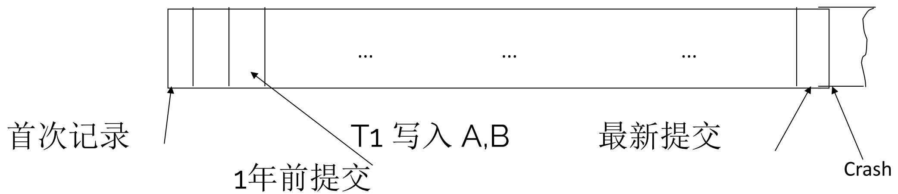

(1 年前) --> 即使是一年前提交的记录，你也无法确定他是否真的flash到磁盘中，仍然需要在系统崩溃后重做！

# 为 Redo 日志设置checkpoint

# • Redo 日志设置checkpoint的issue：

– 已经commit事务对数据库所做的更改可能会在事务提交后的很晚才flush到磁盘  
– 因此不能将关注点局限于创建checkpoint时活动的事务

# 为 Redo 日志设置检查点

• 为 Redo 日志执行非静止检查点的步骤：

1. 写入日志记录 <START CKPT (T1, …, Tk)>，其中 T1, …, Tk 是所有活跃的（未提交的）事务，并刷新日志  
2. 开始把buffer (内存) 里已经在 <START CKPT (T1, …, Tk)>前提交（Committed）的数据，一页一页地搬进物理磁盘里。  
3. 将 <END CKPT> 记录写入日志并刷新日志

# 为 Redo 日志设置检查点

<START $\mathcal { T } _ { 1 } >$   
${ < } T _ { 1 }$ ,A,5>   
<START $\mathbf { \delta } T _ { 2 } >$   
<COMMIT $\pmb { T _ { 1 } > }$   
<T2,B,10>   
<START CKPT $( T _ { 2 } ) >$   
$< T _ { 2 } , C , 1 5 >$   
<START $\mathbf { \delta } T _ { 3 } >$   
<T3,D, $\mathbf { 2 0 > }$   
<END CKPT>   
<COMMIT $\pmb { T _ { 2 } } >$   
<COMMIT $\mathbf { \mathcal { T } _ { 3 } } \mathrm { > }$

示例

– 当我们启动checkpoint时，只有 T2 在运行，但 T1写入的 A 的值可能已经写入了磁盘。  
– 为了确保T1更改得值已经写入磁盘，那么在checkpoint结束之前，我们必须先将 A 复制到磁盘上。

# 带有检查点的 Redo 日志的恢复

# 两种情况:

1. 崩溃前日志中的最后一条检查点记录是 <END CKPT>

a) 在相应的 <START CKPT (T1, …, Tk)> 之前提交的事务所写入的每个值都已经写入了磁盘  
b) 仅将注意力限制在 <START CKPT> 中提到的 Ti 之一，或者在 <START CKPT> 之后开始的事务  
c) 我们不需要向后追溯比最早的 <START Ti> 记录更远的地方。

# 带有检查点的 Redo 日志的恢复

# 两种情况:

2. 崩溃前日志中的最后一条检查点记录是 <START CKPT (S1, …, Sm)>

a) 我们无法确定在此检查点开始之前提交的事务是否已将其更改写入磁盘  
b) 必须向后搜索到上一个 <END CKPT> 记录，找到其匹配的 <START CKPT> 记录  
c) 重做所有在匹配的 <START CKPT> 之后开始或包含在其列表中的已提交事务

# 带有检查点的 Redo 日志的恢复

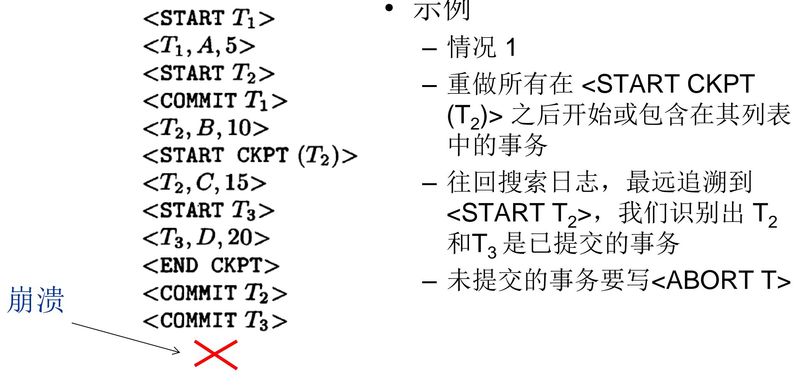

# 带有检查点的 Redo 日志的恢复

<START $T_{1}$ > <T1,A,5> <START $T_{2}$ > <COMMIT $T_{1}$ > <T2,B,10> <START CKPT $(T_{2})>$ <T2,C,15> <START $T_{3}$ > <T3,D,20> <END CKPT> <COMMIT $T_{2}$ > <COMMIT $T_{3}$ >

崩溃

示例

– 情况 2  
– 没有先前的检查点，我们必须一直退回到日志的开头  
– 我们识别出 T 是唯一已提交的事务  
– 未提交的事务要写<ABORT T>

# 带有检查点的 Redo 日志的恢复

• 事务可能在多个检查点期间处于活动状态

– 在 <START CKPT $( \tau _ { 1 } , . . . , \tau _ { \mathrm { k } } ) >$ 中包含指向日志中 T1,…, Tk 开始位置的指针  
– 这样做，我们就知道什么时候可以安全地删除日志的早期部分  
– 当我们写入 <END CKPT> 时，我们知道我们永远不需要回头查看比活动事务 Ti 中最早的 <START Ti> 更早的记录  
– 因此， <START Ti>记录之前的任何内容都可以被删除

# Chapter 17

# 数据库恢复 (Database Recovery)

- 应对系统故障

(Coping with system failures)

# AGENDA

弹性运行的问题和模型

1 (Issues and Models for Resilient Operation) (17.1)   
Undo日志 (Undo Logging) (17.2)   
3 Redo日志 (Redo Logging) (17.3)   
4 Undo/Redo日志 (Undo/Redo Logging) (17.4)

防范介质故障

5 (Protecting against Media Failures) (17.5)

# 主要缺点:

• Undo日志：数据在事务完成后立即写入磁盘，增加了磁盘I/O 的数量。  
• Redo日志：将所有修改的块保留在内存中直到提交，增加了缓冲区的数量。

# 解决方案： undo/redo日志！

提供了更大的灵活性，代价是在日志中维护更多的信息

undo/redo日志记录 ${ < } \mathbb { T } \mathbb { i } , \mathbb { X } , \mathbb { v } , \mathbb { w }$ >

事务 T 更改了数据库元素 X 的值

它的旧值是 v

它的新值是 w

# Undo/redo 规则

• UR1在由于某些事务 Ti所做的更改而修改磁盘上的任何数据库元素 X 之前，更新记录 <Ti, X, v, w> 必须出现在磁盘上

• 日志记录必须在对应的更新页面 X 之前刷新 (WAL)！  
• 页面 X 可以在 Ti 提交之前或之后刷新【<COMMIT T> 日志记录可以出现在对磁盘上数据库元素所做的任何更改之前或之后】

# Undo/redo 日志

Figure 17.9: A possible sequence of actions and their log entries using undo/redo logging   

<table><tr><td>Step</td><td>Action</td><td>t</td><td>M-A</td><td>M-B</td><td>D-A</td><td>D-B</td><td>Log</td></tr><tr><td>1)</td><td></td><td></td><td></td><td></td><td></td><td></td><td>&lt;START T&gt;</td></tr><tr><td>2)</td><td>READ(A,t)</td><td>8</td><td>8</td><td></td><td>8</td><td>8</td><td></td></tr><tr><td>3)</td><td>t := t*2</td><td>16</td><td>8</td><td></td><td>8</td><td>8</td><td></td></tr><tr><td>4)</td><td>WRITE(A,t)</td><td>16</td><td>16</td><td></td><td>8</td><td>8</td><td>&lt;T, A, 8, 16&gt;</td></tr><tr><td>5)</td><td>READ(B,t)</td><td>8</td><td>16</td><td>8</td><td>8</td><td>8</td><td></td></tr><tr><td>6)</td><td>t := t*2</td><td>16</td><td>16</td><td>8</td><td>8</td><td>8</td><td></td></tr><tr><td>7)</td><td>WRITE(B,t)</td><td>16</td><td>16</td><td>16</td><td>8</td><td>8</td><td>&lt;T, B, 8, 16&gt;</td></tr><tr><td>8)</td><td>FLUSH LOG</td><td></td><td></td><td></td><td></td><td></td><td></td></tr><tr><td>9)</td><td>OUTPUT(A)</td><td>16</td><td>16</td><td>16</td><td>16</td><td>8</td><td></td></tr><tr><td>10)</td><td></td><td></td><td></td><td></td><td></td><td></td><td></td></tr><tr><td>11)</td><td>OUTPUT(B)</td><td>16</td><td>16</td><td>16</td><td>16</td><td>16</td><td>&lt;COMMIT T&gt;</td></tr></table>

注意：步骤 (10) 也可以出现在步骤 (8) 或步骤 (9) 之前，或者在步骤 (11) 之后。

# Undo/redo 规则

# 延迟提交的问题

– 一个事务在用户看来似乎已经完成，但因为 <COMMIT T> 记录没有被刷新到磁盘  
– 随后的崩溃会导致该事务被撤销而不是被重做

UR2(额外的规则)

<COMMIT T> 记录一旦出现在日志中，必须尽快刷新至磁盘。

在前一个示例的步骤 (10) 之后添加 FLUSH LOG。

# 使用 Undo/Redo 日志进行恢复

# • undo/redo 恢复策略是:

• 已提交的：按照“最早优先”的顺序重做已提交的事务。  
• 未提交的：按照“最新优先”的顺序撤销未提交的事务。

# 恢复过程

• 反向扫描（日志末尾 → 开头；最新优先）

• 构建已提交事务的集合 S  
• 撤销不在 S 中的事务的操作，设为集合 U

反向扫描，撤销挂起的事务

• 追踪 U 中事务的撤销链

• 正向扫描（开头 日志末尾；最早优先）

• 重做 S 中事务的操作

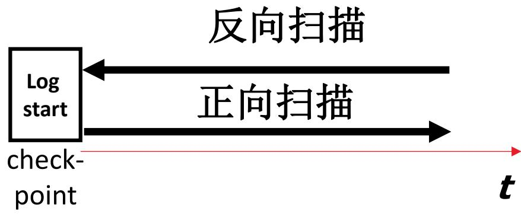

# 恢复过程: 示例

<table><tr><td>Step</td><td>Action</td><td>t</td><td>M-A</td><td>M-B</td><td>D-A</td><td>D-B</td><td>Log</td></tr><tr><td>1)</td><td></td><td></td><td></td><td></td><td></td><td></td><td>&lt;START T&gt;</td></tr><tr><td>2)</td><td>READ(A,t)</td><td>8</td><td>8</td><td></td><td>8</td><td>8</td><td></td></tr><tr><td>3)</td><td>t := t*2</td><td>16</td><td>8</td><td></td><td>8</td><td>8</td><td></td></tr><tr><td>4)</td><td>WRITE(A,t)</td><td>16</td><td>16</td><td></td><td>8</td><td>8</td><td>&lt;T,A,8,16&gt;</td></tr><tr><td>5)</td><td>READ(B,t)</td><td>8</td><td>16</td><td>8</td><td>8</td><td>8</td><td></td></tr><tr><td>6)</td><td>t := t*2</td><td>16</td><td>16</td><td>8</td><td>8</td><td>8</td><td></td></tr><tr><td>7)</td><td>WRITE(B,t)</td><td>16</td><td>16</td><td>16</td><td>8</td><td>8</td><td>&lt;T,B,8,16&gt;</td></tr><tr><td>8)</td><td>FLUSH LOG</td><td></td><td></td><td></td><td></td><td></td><td></td></tr><tr><td>9)</td><td>OUTPUT(A)</td><td>16</td><td>16</td><td>16</td><td>16</td><td>8</td><td></td></tr><tr><td>10)</td><td></td><td></td><td></td><td></td><td></td><td></td><td>&lt;COMMIT T&gt;</td></tr><tr><td>11)</td><td>OUTPUT(B)</td><td>16</td><td>16</td><td>16</td><td>16</td><td>16</td><td></td></tr></table>

1. 崩溃发生在 <COMMIT T> 记录被刷新到磁盘之后  
2.崩溃发生在<COMMIT T> 记录被刷新到磁盘之前

# 为 Undo/Redo 日志设置检查点

• 对于 undo/redo 日志来说，非静止检查点比其他日志方法稍微简单一些

– 写入一条 <START CKPT (T1, …, Tk)> 记录到日志中，其中 T1, …, Tk 是所有活动的事务，并刷新日志  
– 将所有脏(dirty)缓冲区写入磁盘；即，它们包含一个或多个更改过的数据库元素。  
– 与 redo 日志不同，我们要刷新所有脏(dirty)缓冲区，而不仅仅是那些由已提交事务写入的缓冲区  
– 写入一条 <END CKPT> 记录到日志中并刷新日志

# 为 Undo/Redo 日志设置检查点

# 示例

– 在检查点期间，我们肯定会将 A和 B 刷新到磁盘  
– 重做 T2 和 T3 并忽略 T1  
– 当我们重做 T2 时，我们不需要查看 <START CKPT(T2)> 记录之前的内容，即使 T2 当时是活动的。为什么？

$$
\begin{array}{l} <   \text {S T A R T} T _ {1} > \\ <   T _ {1}, A, 4, 5 > \\ <   \text {S T A R T} T _ {2} > \\ <   \text {C O M M I T} T _ {1} > \\ <   T _ {2}, B, 9, 1 0 > \\ <   S T A R T C K P T \left(T _ {2}\right) > \\ <   T _ {2}, C, 1 4, 1 5 > \\ <   S T A R T T _ {3} > \\ <   T _ {3}, D, 1 9, 2 0 > \\ <   E N D C K P T > \\ \end{array}
$$

如何恢复？

发生崩溃

$$
\rightarrow \frac {<   C O M M I T T _ {2} >}{<   C O M M I T T _ {3} >}
$$

发生崩溃

$$
\rightarrow X
$$

# AGENDA

弹性运行的问题和模型

(Issues and Models for Resilient Operation) (17.1)

Undo日志 (Undo Logging) (17.2)

Redo日志 (Redo Logging) (17.3)

4 Undo/Redo日志 (Undo/Redo Logging) (17.4)

防范介质故障

(Protecting against Media Failures) (17.5)

# 介质故障（非易失性存储的丢失）

# Media failure (loss of non-volatile storage)

A: 16

# 介质故障（非易失性存储的丢失）

# Media failure (loss of non-volatile storage)

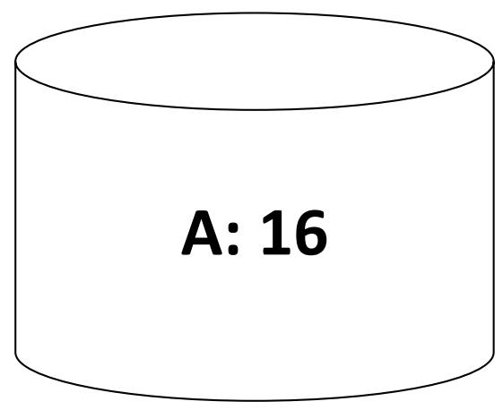

解决方案： 制作数据副本！

# 示例 1 三重模块冗余

• 在独立的磁盘上保留 3 个副本  
• Output(X) --> 三次输出  
• Input(X) --> 三次输入 + 投票

【OS 层面或

者专门硬件】

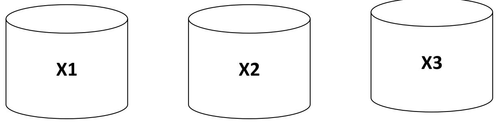

# 示例 2 冗余写入，单一读取

• 在独立的磁盘上保留 N 个副本  
• Output(X) --> N 次输出  
• Input(X) --> 输入一个副本

如果正常则完成否则尝试另一个

前提是假设系统能够检测到不良数据

# 示例 3：数据库转储 + 日志

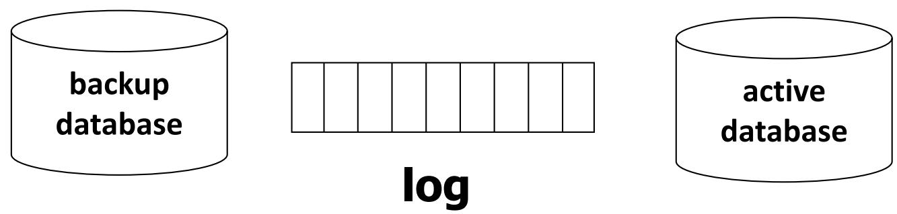

•如果活动数据库丢失，

•从备份中恢复活动数据库  
•使用日志中的 redo 条目使其保持最新状态

什么时候可以丢弃日志？

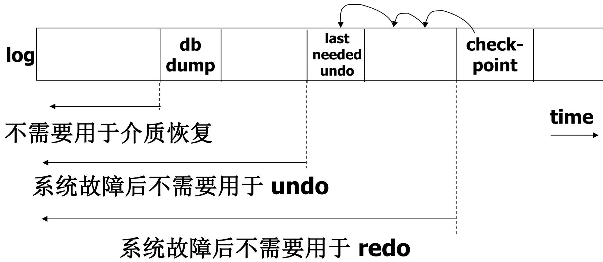

# 作业

# Exercises

（中文书）

6.1.1

6.2.3 + 6.2.4

或者

6.3.4 + 6.3.5

或者

6.4.2 + 6.4.4

# …The End of This Lecture…

# Q&A

