# LECTURE 18

# CONCURRENCY CONTROL

# 并发控制

# (PART 1/2)

  
NIKOND90F3.53e1S0320

  
C-5000ZF2.817800:15050

# AGENDA

18.1 串行与可串行化调度 (Serial and Serializable Schedules)  
18.2 冲突可串行化 (Conflict-Serializability)   
18.3 通过锁强制实现可串行化 (Enforcing Serializablity by Locks)   
18.4 具有多种锁模式的锁系统 (Locking System with Several Lock Modes)

# 并发控制 (Concurrency Control)

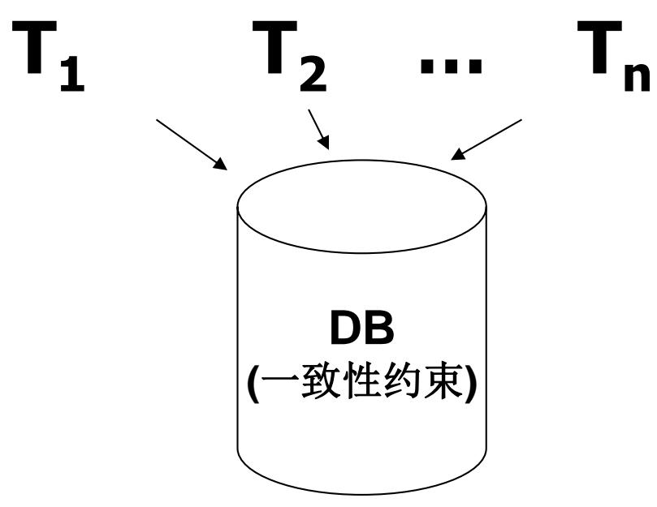

多用户数据库系统, 允许多个用户同时使用

◼飞机定票数据库系统  
◼银行数据库系统

特点：在同一时刻并发 运行的事务数可达数百 个

# 不同的多事务执行方式

# (1)事务串行执行

– 每个时刻只有一个事务运行，其他事务必须等到这个事务结束以后方能运行  
– 不能充分利用系统资源，发挥数据库共享资源的特点

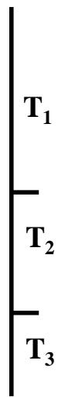  
事务的串行执行方式

串行一定OK！

# (2) 交叉并发方式

# （Interleaved Concurrency）

– 在单处理机系统中，事务的并行执行是这些并行事务的并行操作轮流交叉运行  
– 单处理机系统中的并行事务并没有真正地并行运行，但能够减少处理机的空闲时间，提高系统的效率

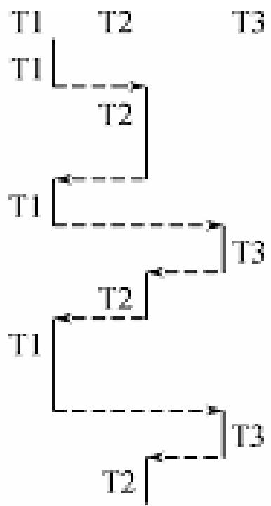  
事务的交叉并发执行方式

# (3)同时并发方式

# （simultaneous concurrency）

– 多处理机系统中，每个处理机可以运行一个事务，多个处理机可以同时运行多个事务，实现多个事务真正的并行运行

并发存不存在潜在的风险/漏洞/非期望的结果？

# 示例:

# Constraint: A=B

T1: Read(A)

A  A+100

Write(A)

Read(B)

B  B+100

Write(B)

T2: Read(A)

A  A2

Write(A)

Read(B)

B B2

Write(B)

# Constraint: A=B

T1 T2

Read(A); A  A+100 Write(A); Read(B); B  B+100; Write(B);

Read(A);A  A2; Write(A); Read(B);B  B2; Write(B);

<table><tr><td>A</td><td>B</td></tr><tr><td>25</td><td>25</td></tr><tr><td>125</td><td>125</td></tr><tr><td>250</td><td>250</td></tr><tr><td>250</td><td>250</td></tr></table>

Constraint: A=B   

<table><tr><td rowspan="2">T1</td><td rowspan="2">T2</td><td>A</td><td>B</td></tr><tr><td>25</td><td>25</td></tr><tr><td></td><td>Read(A);A← A×2;</td><td>50</td><td></td></tr><tr><td></td><td>Write(A);</td><td></td><td></td></tr><tr><td></td><td>Read(B);B← B×2;</td><td></td><td>50</td></tr><tr><td></td><td>Write(B);</td><td></td><td></td></tr><tr><td>Read(A); A← A+100</td><td></td><td>150</td><td></td></tr><tr><td>Write(A);</td><td></td><td></td><td></td></tr><tr><td>Read(B); B← B+100;</td><td></td><td></td><td>150</td></tr><tr><td>Write(B);</td><td></td><td>150</td><td>150</td></tr></table>

1、两种串行方案，哪个是正确的？

2、有T1… Tn 共n个事务，有多少种串行执行方案/调度(Schedule)?

# Constraint: A=B

<table><tr><td rowspan="2">T1</td><td rowspan="2">T2</td><td>A</td><td>B</td></tr><tr><td>25</td><td>25</td></tr><tr><td>Read(A); A← A+100</td><td></td><td>125</td><td></td></tr><tr><td>Write(A);</td><td></td><td></td><td></td></tr><tr><td></td><td>Read(A);A← A×2;</td><td>250</td><td></td></tr><tr><td></td><td>Write(A);</td><td></td><td></td></tr><tr><td>Read(B); B← B+100;</td><td></td><td></td><td></td></tr><tr><td>Write(B);</td><td></td><td></td><td>125</td></tr><tr><td></td><td>Read(B);B← B×2;</td><td></td><td></td></tr><tr><td></td><td>Write(B);</td><td></td><td>250</td></tr><tr><td></td><td></td><td>250</td><td>250</td></tr></table>

# Constraint: A=B

<table><tr><td>T1</td><td>T2</td></tr><tr><td>Read(A); A← A+100</td><td></td></tr><tr><td>Write(A);</td><td>Read(A);A← A×2;</td></tr><tr><td></td><td>Write(A);</td></tr><tr><td></td><td>Read(B);B← B×2;</td></tr><tr><td></td><td>Write(B);</td></tr><tr><td>Read(B); B← B+100;</td><td></td></tr><tr><td>Write(B);</td><td></td></tr></table>

<table><tr><td>A</td><td>B</td></tr><tr><td>25</td><td>25</td></tr><tr><td>125</td><td></td></tr><tr><td>250</td><td></td></tr><tr><td></td><td>50</td></tr><tr><td></td><td>150</td></tr><tr><td>250</td><td>150</td></tr></table>

# Schedule G （交叉并发）

<table><tr><td rowspan="2">T1</td><td rowspan="2">T3</td><td>A</td><td>B</td></tr><tr><td>25</td><td>25</td></tr><tr><td>Read(A); A← A+100</td><td></td><td></td><td></td></tr><tr><td>Write(A);</td><td></td><td>125</td><td></td></tr><tr><td></td><td>Read(A);A← A×1;</td><td></td><td></td></tr><tr><td></td><td>Write(A);</td><td>125</td><td></td></tr><tr><td></td><td>Read(B);B← B×1;</td><td></td><td></td></tr><tr><td></td><td>Write(B);</td><td></td><td>25</td></tr><tr><td>Read(B); B← B+100;</td><td></td><td></td><td></td></tr><tr><td>Write(B);</td><td></td><td></td><td>125</td></tr><tr><td></td><td></td><td>125</td><td>125</td></tr></table>

# Constraint: A=B

# Concurrency Control

事务并发执行带来的问题：

– 会产生多个事务同时存取同一数据的情况  
– 可能会存取和存储不正确的数据，破坏事务一致性和数据库的一致性

有的并发结果等价于某种串行，有的会导致数据库不一致！

有T1… Tn 共n个事务(假设每个事务有m个操作)，有多少种交叉并发Schedule?

# 并发导致的数据异常

# 脏读

读取未提交数据

T1事务读取T2事务尚未提交的数据，此时如果T2事务发生错误并执行回滚操作，那么T1事务读取到的数据就是脏数据。

<table><tr><td>T1</td><td>T2</td></tr><tr><td></td><td>事务开始</td></tr><tr><td>事务开始</td><td></td></tr><tr><td></td><td>查询账户余额为200元</td></tr><tr><td></td><td>取款100元，余额被更改为100元</td></tr><tr><td>查询账户余额为100元（产生脏读）</td><td></td></tr><tr><td></td><td>取款操作发生未知错误，事务回滚，余额变更为200元</td></tr><tr><td>转入200元，余额被更改为300元（脏读的100+200）</td><td></td></tr><tr><td>事务提交</td><td></td></tr></table>

# 并发导致的数据异常

# 不可重复读

前后多次读取，数据内容不一致在T1事务两次读取X期间，T2事务修改X提交了事务，那么T1事务读取到的数据不一样了。

<table><tr><td>T1</td><td>T2</td></tr><tr><td>事务开始</td><td></td></tr><tr><td>第一次查询，张三的成绩是96</td><td></td></tr><tr><td></td><td>事务开始</td></tr><tr><td>…</td><td></td></tr><tr><td></td><td>修改张三成绩为69</td></tr><tr><td></td><td>事务提交</td></tr><tr><td>第二次查询，张三的成绩是69</td><td></td></tr><tr><td>…</td><td></td></tr></table>

# 并发导致的数据异常

# 幻读

一个事务按相同的查询条件重新读取以前检索过的数据，却发现其他事务插入了满足其查询条件的新数据，这种现象就称为幻读。

<table><tr><td>T1</td><td>T2</td></tr><tr><td>事务开始</td><td></td></tr><tr><td>查询计算机1班同学的平均分(假设有25人,78分)</td><td></td></tr><tr><td></td><td>事务开始</td></tr><tr><td></td><td>Insert一行数据,1班的,90分</td></tr><tr><td>查询计算机1班同学的平均分(不是78分,幻觉?!)</td><td></td></tr><tr><td></td><td>提交事务</td></tr><tr><td>...</td><td></td></tr><tr><td></td><td></td></tr></table>

# 事务隔离4种级别

级
别
递
增  

<table><tr><td></td><td>脏读</td><td>不可重复读</td><td>幻读</td></tr><tr><td>READ_UNCOMMITTED</td><td>(会出现)</td><td>√</td><td>√</td></tr><tr><td>READ_COMMITTED</td><td>X(不会)</td><td>√</td><td>√</td></tr><tr><td>REPEATABLE_READ</td><td>X</td><td>X</td><td>√</td></tr><tr><td>SERIALIZABLE</td><td>X</td><td>X</td><td>X</td></tr></table>

READ_COMMITTED 默认事务隔离级别，可以设置

不同商业版本会有不一样的支持/实现

事务串行化会极大降低数据库的效率

# 并发控制 (Concurrency Control)

• 并发控制 (Concurrency Control)

– 确保事务在同时执行时保持一致性的过程。

• 调度器 (The scheduler)

从事务中接收读/写请求，并在缓冲区中执行它们或延迟执行它们

Buffers

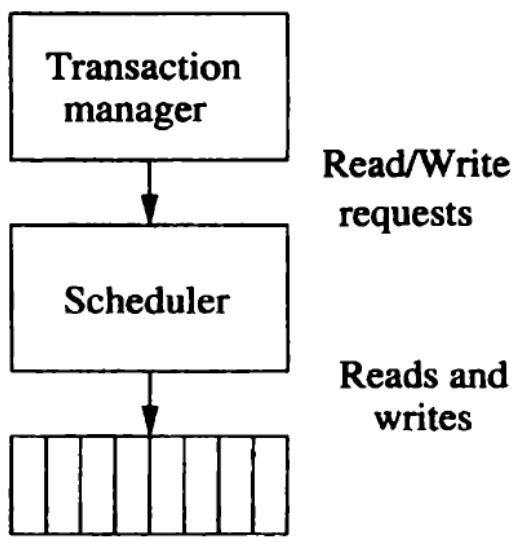

# 并发控制 (Concurrency Control)

# • 并发控制 (Concurrency Control)

– 如何确保并发执行的事务保持数据库状态的正确性  
– 可串行化与冲突可串行化  
– 锁 / 加锁 (Locking)

• 两阶段锁

# 回顾： 正确性原则

• 正确性原则 (Correctness Principle): 如果一个事务在没有任何其他事务或系统错误的情况下执行，并且它在一致的数据库状态下开始，那么在事务结束时，数据库也处于一致状态。  
在实践中

– 事务通常与其他事务并发运行，因此正确性原则不直接适用

# 概念

• 并发控制：确保事务在同时执行时保持一致性  
• 调度(Schedule)：表示操作执行的时间顺序  
• 串行化调度(Serial schedule): 操作或事务没有交叉执行

# 一个或多个事务所采取的一系列重要动作

T1: Read(A)

T2: Read(A)

A  A+100

A  A2

Write(A)

Write(A)

Read(B)

Read(B)

B  B+100

B B2

Write(B)

Write(B)

Constraint: A=B

# 串行调度 (Serial Schedules)

# • 一个调度是串行的 (serial)

– 如果它的操作包含了一个事务的所有操作，然后是另一个事务的所有操作，依此类推。  
– 不允许操作混合/交叉。

# Schedule A (串行执行:T1,T2)

T1

T2

Constraint: A=B

Read(A); A  A+100

Write(A);

Read(B); B  B+100;

Write(B);

Read(A);A  A2;

Write(A);

Read(B);B  B2;

Write(B);

# Schedule A (串行执行:T1,T2)

<table><tr><td>T1</td><td>T2</td></tr><tr><td>Read(A); A← A+100</td><td></td></tr><tr><td>Write(A);</td><td></td></tr><tr><td>Read(B); B← B+100;</td><td></td></tr><tr><td>Write(B);</td><td></td></tr><tr><td></td><td>Read(A);A← A×2;</td></tr><tr><td></td><td>Write(A);</td></tr><tr><td></td><td>Read(B);B← B×2;</td></tr><tr><td></td><td>Write(B);</td></tr></table>

# Constraint: A=B

<table><tr><td>A</td><td>B</td></tr><tr><td>25</td><td>25</td></tr><tr><td>125</td><td>125</td></tr><tr><td>250</td><td>250</td></tr><tr><td>250</td><td>250</td></tr></table>

# Schedule B(串行执行:T2,T1)

T1

T2

Read(A); A  A+100

Read(A);A  A2;

Write(A);

Write(A);

Read(B); B  B+100;

Read(B);B  B2;

Write(B);

Write(B);

# Schedule B(串行执行: T2,T1)

<table><tr><td>T1</td><td>T2</td></tr><tr><td></td><td>Read(A);A← A×2;</td></tr><tr><td></td><td>Write(A);</td></tr><tr><td></td><td>Read(B);B← B×2;</td></tr><tr><td></td><td>Write(B);</td></tr><tr><td>Read(A); A← A+100</td><td></td></tr><tr><td>Write(A);</td><td></td></tr><tr><td>Read(B); B← B+100;</td><td></td></tr><tr><td>Write(B);</td><td></td></tr></table>

# Constraint: A=B

<table><tr><td>A</td><td>B</td></tr><tr><td>25</td><td>25</td></tr><tr><td>50</td><td>50</td></tr><tr><td>150</td><td>150</td></tr><tr><td>150</td><td>150</td></tr></table>

# Schedule C(交叉并发)

T1

T2

Read(A); A  A+100 Write(A);

Read(B); B  B+100;Write(B);

Read(A);A  A2; Write(A);

Read(B);B  B2;Write(B);

# 可串行化调度 (Serializable Schedules)

• 正确性原则告诉我们

– 每个串行调度都会保持数据库状态的一致性。  
– 是否有任何其他调度也能保证保持一致性？

• Serializable schedule(可串行化调度)

– 如果存在一个串行调度 S'，使得对于每个初始数据库状态，S 和 $\bar { \mathbf { s } } ^ { \dagger }$ 的效果相同，那么调度 S 就是可串行化的。

<table><tr><td rowspan="2">T1</td><td rowspan="2">T2</td><td>A</td><td>B</td></tr><tr><td>25</td><td>25</td></tr><tr><td>Read(A); A← A+100</td><td></td><td></td><td></td></tr><tr><td>Write(A);</td><td></td><td>125</td><td></td></tr><tr><td></td><td>Read(A);A← A×2;</td><td></td><td></td></tr><tr><td></td><td>Write(A);</td><td>250</td><td></td></tr><tr><td>Read(B); B← B+100;</td><td></td><td></td><td></td></tr><tr><td>Write(B);</td><td></td><td></td><td>125</td></tr><tr><td></td><td>Read(B);B← B×2;</td><td></td><td></td></tr><tr><td></td><td>Write(B);</td><td></td><td>250</td></tr><tr><td></td><td></td><td>250</td><td>250</td></tr></table>

Serializable schedule (等价串行执行:T1,T2)

# Constraint: A=B

<table><tr><td>T1</td><td>T2</td><td>A</td><td>B</td></tr><tr><td>Read(A); A← A+100</td><td></td><td>25</td><td>25</td></tr><tr><td>Write(A);</td><td></td><td></td><td></td></tr><tr><td></td><td>Read(A);A← A×2;</td><td>125</td><td></td></tr><tr><td></td><td>Write(A);</td><td></td><td></td></tr><tr><td></td><td>Read(B);B← B×2;</td><td>250</td><td></td></tr><tr><td></td><td>Write(B);</td><td></td><td></td></tr><tr><td>Read(B); B← B+100;</td><td></td><td></td><td>50</td></tr><tr><td>Write(B);</td><td></td><td></td><td></td></tr><tr><td colspan="2">NOTSerializable schedule!</td><td>250</td><td>150</td></tr></table>

# 思考？

<table><tr><td>T1</td><td>T2</td><td>A</td><td>B</td></tr><tr><td>Read(A); A← A+100</td><td></td><td>25</td><td>25</td></tr><tr><td>Write(A);</td><td></td><td></td><td></td></tr><tr><td></td><td>Read(A);A← A+200;</td><td>125</td><td></td></tr><tr><td></td><td>Write(A);</td><td></td><td></td></tr><tr><td></td><td>Read(B);B← B+200;</td><td>325</td><td></td></tr><tr><td></td><td>Write(B);</td><td></td><td></td></tr><tr><td>Read(B); B← B+100;</td><td></td><td></td><td>225</td></tr><tr><td>Write(B);</td><td></td><td></td><td>325</td></tr><tr><td></td><td></td><td>325</td><td>325</td></tr></table>

注意：这个结果相同归因于加法交换律

不具有普适性（但对于这个例子的这个调度，是可串行化调度）

# 事务和调度的符号表示

如果我们假设“没有巧合”

– 那么只有事务执行的读和写操作才有意义，只关注读和写的顺序  
– 而不关注涉及的实际值，无论初始状态和事务语义如何

符号

rT(X) 事务 T 读取数据库元素 X

wT(X) 事务 T 写入数据库元素 X

ri(X) 和 $w ( x )$ 是 $r _ { \pi } ( x )$ 和 $w \left( \lambda \right)$ 的同义词

# 事务的符号表示

示例

<table><tr><td>T1</td><td>T2</td></tr><tr><td>READ(A,t)</td><td>READ(A,s)</td></tr><tr><td>t := t+100</td><td>s := s*2</td></tr><tr><td>WRITE(A,t)</td><td>WRITE(A,s)</td></tr><tr><td>READ(B,t)</td><td>READ(B,s)</td></tr><tr><td>t := t+100</td><td>s := s*2</td></tr><tr><td>WRITE(B,t)</td><td>WRITE(B,s)</td></tr></table>

$$
\begin{array}{l} T _ {1}: r _ {1} (A); w _ {1} (A); r _ {1} (B); w _ {1} (B); \\ T _ {2}: r _ {2} (A); w _ {2} (A); r _ {2} (B); w _ {2} (B); \\ \end{array}
$$

# 事务的符号表示

示例

<table><tr><td>T1</td><td>T2</td><td>A</td><td>B</td></tr><tr><td></td><td></td><td>25</td><td>25</td></tr><tr><td>READ(A,t)</td><td></td><td></td><td></td></tr><tr><td>t := t+100</td><td></td><td></td><td></td></tr><tr><td>WRITE(A,t)</td><td></td><td>125</td><td></td></tr><tr><td></td><td>READ(A,s)</td><td></td><td></td></tr><tr><td></td><td>s := s*2</td><td></td><td></td></tr><tr><td></td><td>WRITE(A,s)</td><td>250</td><td></td></tr><tr><td>READ(B,t)</td><td></td><td></td><td></td></tr><tr><td>t := t+100</td><td></td><td></td><td></td></tr><tr><td>WRITE(B,t)</td><td></td><td></td><td>125</td></tr><tr><td></td><td>READ(B,s)</td><td></td><td></td></tr><tr><td></td><td>s := s*2</td><td></td><td></td></tr><tr><td></td><td>WRITE(B,s)</td><td></td><td>250</td></tr></table>

S1: r1(A); w1(A); r2(A); w2(A); r1(B); ω1(B); r2(B); w2(B);

# 事务和调度的符号表示

# • 一组事务?? 的调度 S

– 是一个操作序列  
– 在该序列中，对于 ?? 中的每个事务 T，T 的操作在 S 中出现的顺序与其在 Ti 本身定义中出现的顺序相同

示例: Sc=r1(A)w1(A)r2(A)w2(A)r1(B)w1(B)r2(B)w2(B)

# AGENDA

18.1 串行与可串行化调度 (Serial and Serializable Schedules)  
18.2 冲突可串行化 (Conflict-Serializability)   
18.3 通过锁强制实现可串行化 (Enforcing Serializablity by Locks)   
18.4 具有多种锁模式的锁系统 (Locking System with Several Lock Modes)

# 概念

(x), wi(x) 操作的序列

冲突：调度中的一对连续操作，如果交换它们的顺序，那么至少会改变涉及的其中一个事务的行为。

调度中的一对连续操作，这样，如果它们的顺序互换，那么所涉及的至少一个事务的行为可能被改变。

不冲突:

$$
r _ {i} (X); r _ {j} (Y) \text {不 冲 突 ， 即 使} X = Y
$$

如果 X ≠ Y ， wi(X); rj (Y) 和 ri(X); wj (Y) 不冲突

如果 X ≠ Y ， $w _ { i } ( X ) ; w _ { j } \left( Y \right)$ 不冲突

# 冲突

# • 不能交换操作的顺序

同一事务的两个操作冲突

$$
\cdot r _ {i} (X); r _ {i} (Y), r _ {i} (X); w _ {i} (Y), w _ {i} (X); r _ {i} (Y), w _ {i} (X); w _ {i} (Y)
$$

– 不同事务对同一数据库元素的两次写操作冲突

$$
\cdot w _ {i} (X); w _ {j} (X)
$$

不同事务对同一数据库元素的一读一写操作冲突

$$
\cdot r _ {i} (X); w _ {j} (X), w _ {i} (X); r _ {j} (X)
$$

# 冲突操作 (Conflicting actions)

不同事务的任意两个操作都可以交换，除非

• 它们涉及同一个数据库元素，并且  
• 至少有一个是写操作。

冲突操作: r1(A) w1(A) w1(A) w2(A) r2(A) w 2(A)

# 冲突等价 (Conflict-equivalent)

如果 S1 可以通过一系列相邻不冲突操作的交换转换为 S2，则称调度 S1 和 S2 是冲突等价的

# 定义

# 冲突可串行化 (Conflict-serializable)

如果调度 S 冲突等价于某个串行调度，那么 S 就是冲突可串行化的。

冲突可串行化调度 S 是“好”的！

# 冲突 (Conflicts)

• 冲突可串行化 (Conflict-serializable)

– 冲突可串行化是可串行化的充分条件  
– 冲突可串行化调度也就是可串行化调度

• 冲突可串行化调度是可串行化调度的充分条件，不是必要条件。还有不满足冲突可串行化条件的可串行化调度。

– 一个调度Sc在保证冲突操作的次序不变的情况下，通过交换两个事务不冲突操作的次序得到另一个调度 $\bar { \mathbf { s } } _ { \mathbf { c } ^ { 3 } }$ ，如果 $\mathsf { \pmb { S } } _ { \mathbf { c } } ,$ 是串行的，称调度Sc为冲突可串行化的调度

个调度是冲突可串行化，一定是可串行化的调度

# [例]有3个事务

$$
T _ {1} = W _ {1} (Y) W _ {1} (X), T _ {2} = W _ {2} (Y) W _ {2} (X), T _ {3} = W _ {3} (X)
$$

– 调度L1=W1(Y)W1(X)W2(Y)W2(X) W3(X)是一个串行调度。  
– 调度L2=W1(Y)W2(Y)W2(X)W1(X)W3(X)不满足冲突可串行化。但是调度L2是可串行化的，因为L2执行的结果与调度L1相同，Y的值都等于T2的值，X的值都等于T3的值

调度 (Schedule)

$$
r _ {1} (A); w _ {1} (A); r _ {2} (A); w _ {2} (A); r _ {1} (B); w _ {1} (B); r _ {2} (B); w _ {2} (B);
$$

我们声称此调度是冲突可串行化的。

$$
\begin{array}{l} r _ {1} (A); w _ {1} (A); r _ {2} (A); w _ {2} (A); r _ {1} (B); w _ {1} (B); r _ {2} (B); w _ {2} (B); \\ r _ {1} (A); w _ {1} (A); \underline {{r}} _ {2} (A); \underline {{r}} _ {1} (B); \underline {{w}} _ {2} (A); w _ {1} (B); r _ {2} (B); w _ {2} (B); \\ r _ {1} (A); w _ {1} (A); \overline {{r _ {1} (B)}}; \overline {{r _ {2} (A)}}; \underline {{w _ {2} (A)}}; \underline {{w _ {1} (B)}}; r _ {2} (B); w _ {2} (B); \\ r _ {1} (A); w _ {1} (A); r _ {1} (B); \underline {{r _ {2} (A)}}; \overline {{w _ {1} (B)}}; \overline {{w _ {2} (A)}}; r _ {2} (B); w _ {2} (B); \\ r _ {1} (A); w _ {1} (A); r _ {1} (B); w _ {1} (B); r _ {2} (A); w _ {2} (A); r _ {2} (B); w _ {2} (B); \\ \end{array}
$$

# 优先图 P(S) (S 为调度)

用于检查调度 S 并决定它是否是冲突可串行化的

节点：S 中的事务（Ti 的节点仅标记为整数 i）。

弧/边: Ti → Tj (Ti 优先于Tj ，记为 Ti <s Tj), Ti的操作 A1, Tj的操作 A2:

- 在 S 中 A1 在 A2 之前  
- A1、A2 涉及同一个数据库元素，且 A1 和 A2 中至少有一个是写操作

# 优先图 (Precedence Graphs)

示例

$$
S: r _ {2} (A); r _ {1} (B); w _ {2} (A); r _ {3} (A); w _ {1} (B); w _ {3} (A); r _ {2} (B); w _ {2} (B);
$$

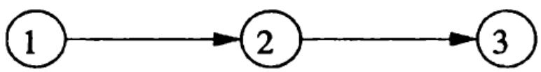

The precedence graph for the schedule S

# 练习:

• 对于下式，P(S) 是什么？

$$
S = w _ {3} (A) w _ {2} (C) r _ {1} (A) w _ {1} (B) r _ {1} (C)
$$

$$
\mathbf {w} _ {2} (\mathbf {A}) \mathbf {r} _ {4} (\mathbf {A}) \mathbf {w} _ {4} (\mathbf {D})
$$

S 是可串行化的吗？

# 练习:

·对于下式，P(S)是什么？

$$
S = w _ {3} (A) w _ {2} (C) r _ {1} (A) w _ {1} (B) r _ {1} (C) w _ {2} (A) r _ {4} (A)
$$

$$
\mathbf {w} _ {4} (\mathbf {D})
$$

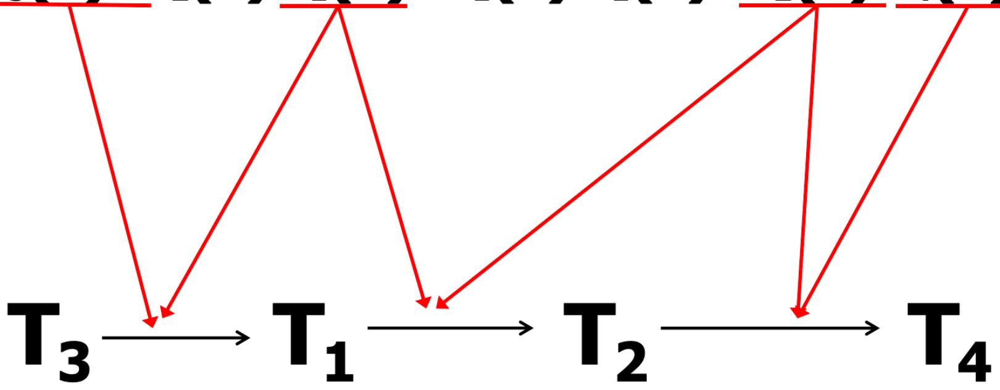

# 练习:

对于下式，P(S) 是什么？

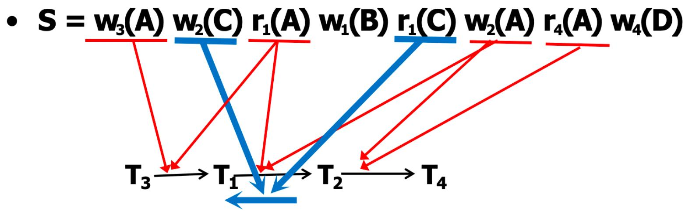

怎样才能预防遗漏？

盯住元素A、 B、 C、 D…

# 额外练习:

• 对于下式，P(S) 是什么？

$$
S = w _ {1} (A) r _ {2} (A) r _ {3} (A) w _ {4} (A)?
$$

判断调度 S 是否冲突可串行化

1. 构造 S 的优先图  
2. 询问是否存在任何循环（环）

• 如果存在，则 S 不是冲突可串行化的  
• 如果不存在，则 S 是冲突可串行化的

– 节点的拓扑排序即为冲突等价的串行顺序

# 冲突可串行化测试

# (Test for Conflict-Serializability)

示例

S: r2(A); r1(B); w2(A); r3(A); ω1(B); w3(A); r2(B); w2(B);

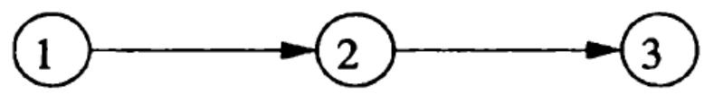

The precedence graph for the schedule S

该优先图是无环的，因此调度 S 是冲突可串行化的

如何交换？

S': r1(B); ω1(B); r2(A); ω2(A); r2(B); ω2(B); r3(A); w3(A);

示例

$$
S _ {1}: r _ {2} (A); r _ {1} (B); w _ {2} (A); r _ {2} (B); r _ {3} (A); w _ {1} (B); w _ {3} (A); w _ {2} (B);
$$

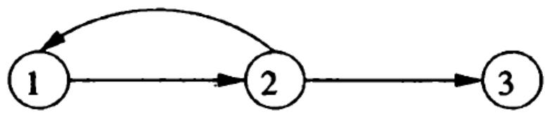

该优先图存在环，因此调度 S1 不是冲突可串行化的

# AGENDA

18.1 串行与可串行化调度 (Serial and Serializable Schedules)  
18.2 冲突可串行化 (Conflict-Serializability)   
18.3 通过锁强制实现可串行化 (Enforcing Serializablity by Locks)   
18.4 具有多种锁模式的锁系统 (Locking System with Several Lock Modes)

# 通过锁（LOCK）来防止优先图 P(S) 中出现环路

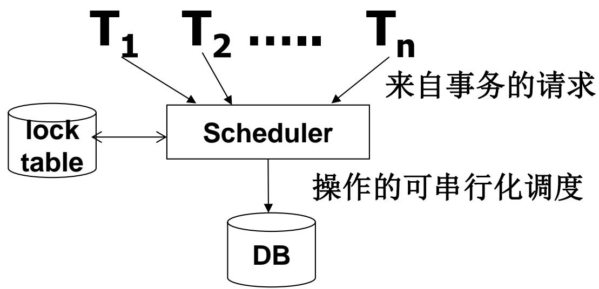

# 锁 (Locks)

# 调度器的职责

# – 接收来自事务的请求

• 要么允许它们对数据库进行操作  
• 要么阻塞事务，直到允许其继续执行是安全的时候为止

锁表将用于指导此决定

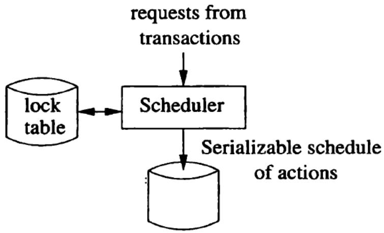

基于锁的调度器 (Locking Scheduler)

强制实现冲突可串行化  
• 这是比可串行化更严格的条件

– 事务必须请求和释放锁

• 事务的结构  
• 调度的结构

# 符号表示 (Notations)

• 加锁和解锁的符号表示（两个新操作）

加锁 (Lock), li(X)

• 事务 $\tau _ { i }$ 请求对数据库元素 X 加锁

解锁 (Unlock), ui(X)

• 事务 $\tau _ { i }$ 释放 （解锁） 其在数据库元素 X 上的锁

# 基于锁的调度器 (Locking Scheduler)

基于锁的调度器 (Locking Scheduler)

事务的一致性 (Consistency of Transactions)  
调度的合法性 (Legality of Schedules)

# 规则 #1: 事务的一致性

操作和锁必须以预期的方式关联:

– 事务只有在先前请求了某个元素的锁且尚未释放该锁的情况下，才能读取或写入该元素。  
– 每当事务Ti 有操作 $r _ { i } ( \boldsymbol { \lambda } )$ 或 $w _ { i } ( X )$ 时，那么在它之前必须有一个没有被 $\cdot$ 隔开的 $\cdot$ 操作，并且在其后必须有一个 $u _ { i } ( X )$ 操作

结构良好的事务

$$
T _ {i}: \dots I _ {i} (A) \dots r _ {i} / w _ {i} (A) \dots u _ {i} (A) \dots
$$

# 规则 #2:调度的合法性

• 锁必须具有其预期含义：如果没有先释放锁，任何两个事务都不能锁定同一个元素。  
• 如果在调度中操作 $l _ { i } ( X )$ 之后跟着 $\cdot$ ，那么在这些操作之间的某处必然存在一个 $\cdot$ 操作

合法的调度器

$$
S = \dots \dots I _ {i} (A) \quad \dots \dots \dots u _ {i} (A) \dots \dots
$$

不存在 lj(A)

# 练习

哪些调度是合法的？  
哪些事务是结构良好的？

$$
\begin{array}{l} S _ {1} = I _ {1} (A) I _ {1} (B) r _ {1} (A) w _ {1} (B) I _ {2} (B) u _ {1} (A) u _ {1} (B) r _ {2} (B) w _ {2} (B) u _ {2} (B) I _ {3} (B) r _ {3} (B) u _ {3} (B) \\ S _ {2} = I _ {1} (A) r _ {1} (A) w _ {1} (B) u _ {1} (A) u _ {1} (B) I _ {2} (B) r _ {2} (B) w _ {2} (B) I _ {3} (B) r _ {3} (B) u _ {3} (B) \\ S _ {3} = I _ {1} (A) r _ {1} (A) u _ {1} (A) I _ {1} (B) w _ {1} (B) u _ {1} (B) I _ {2} (B) r _ {2} (B) w _ {2} (B) u _ {2} (B) I _ {3} (B) r _ {3} (B) u _ {3} (B) \\ \end{array}
$$

# 练习

哪些调度是合法的？  
哪些事务是结构良好的？

$$
\begin{array}{l} S _ {1} = I _ {1} (A) I _ {1} (B) r _ {1} (A) w _ {1} (B) I _ {2} (B) u _ {1} (A) u _ {1} (B) r _ {2} (B) w _ {2} (B) u _ {2} (B) I _ {3} (B) r _ {3} (B) u _ {3} (B) \\ S _ {2} = I _ {1} (A) r _ {1} (A) \overbrace {w _ {1} (B)} u _ {1} (A) u _ {1} (B) I _ {2} (B) r _ {2} (B) w _ {2} (B) I _ {3} (B) r _ {3} (B) u _ {3} (B) \\ S _ {3} = I _ {1} (A) r _ {1} (A) u _ {1} (A) I _ {1} (B) w _ {1} (B) u _ {1} (B) I _ {2} (B) r _ {2} (B) w _ {2} (B) u _ {2} (B) I _ {3} (B) r _ {3} (B) u _ {3} (B) \\ \end{array}
$$

# 调度 F

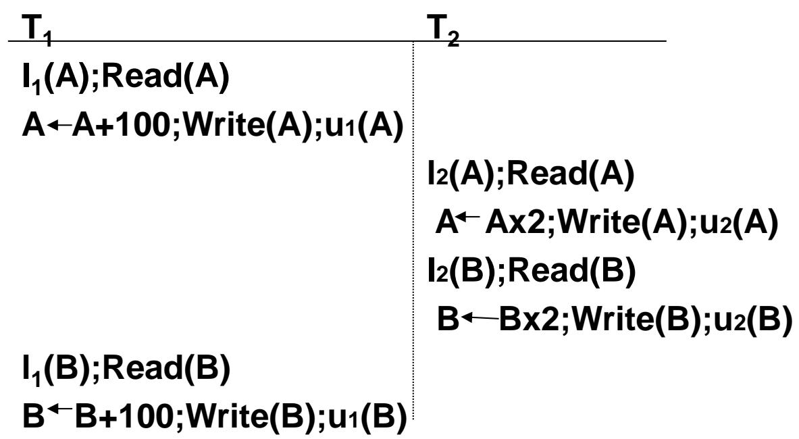

$$
\mathrm {F} = \mathrm {I} _ {1} (\mathrm {A}) \mathrm {r} _ {1} (\mathrm {A}) \mathrm {w} _ {1} (\mathrm {A}) \mathrm {u} _ {1} (\mathrm {A}) \mathrm {I} _ {2} (\mathrm {A}) \mathrm {r} _ {2} (\mathrm {A}) \mathrm {w} _ {2} (\mathrm {A}) \mathrm {u} _ {2} (\mathrm {A})
$$

$$
\mathrm {I} _ {2} (\mathrm {B}) \mathrm {r} _ {2} (\mathrm {B}) \mathrm {w} _ {2} (\mathrm {B}) \mathrm {u} _ {2} (\mathrm {B}) \mathrm {I} _ {1} (\mathrm {B}) \mathrm {r} _ {1} (\mathrm {B}) \mathrm {w} _ {1} (\mathrm {B}) \mathrm {u} _ {1} (\mathrm {B})
$$

合法?

# 调度 F

<table><tr><td>T1</td><td>T2</td><td>25</td><td>25</td></tr><tr><td>l1(A);Read(A)A←A+100;Write(A);u1(A)</td><td>l2(A);Read(A)A←Ax2;Write(A);u2(A)l2(B);Read(B)B←Bx2;Write(B);u2(B)</td><td>125250</td><td>50</td></tr><tr><td>l1(B);Read(B)B←B+100;Write(B);u1(B)</td><td></td><td>250</td><td>150</td></tr></table>

• 白泛调   
然而，它不是可串行化的

# 规则 #3 针对事务的两阶段锁 (2PL)

在每个事务中，所有的加锁请求都必须在所有的解锁操作之前进行。

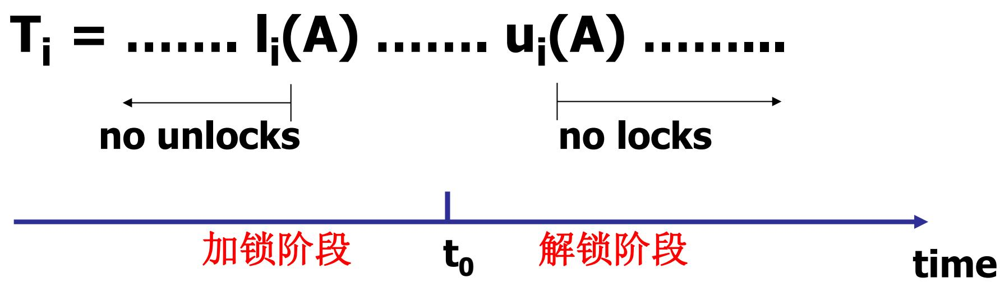

# 两阶段锁 (Two-Phase Locking)

两阶段锁 (2PL)

保证了一致性事务的合法调度是冲突可串行化的

• 2PL

在每个事务中，所有的加锁操作必须在所有的解锁操作之前

“两阶段”

– 第一阶段：获取锁  
– 第二阶段：释放锁

# 示例

# • 这里的事务不遵守两阶段锁规则

<table><tr><td>T1</td><td>T2</td><td>A</td><td>B</td></tr><tr><td></td><td></td><td>25</td><td>25</td></tr><tr><td>l1(A); r1(A);</td><td></td><td></td><td></td></tr><tr><td>A := A+100;</td><td></td><td></td><td></td></tr><tr><td>w1(A); u1(A);</td><td></td><td>125</td><td></td></tr><tr><td></td><td>l2(A); r2(A);</td><td></td><td></td></tr><tr><td></td><td>A := A*2;</td><td></td><td></td></tr><tr><td></td><td>w2(A); u2(A);</td><td>250</td><td></td></tr><tr><td></td><td>l2(B); r2(B);</td><td></td><td></td></tr><tr><td></td><td>B := B*2;</td><td></td><td></td></tr><tr><td></td><td>w2(B); u2(B);</td><td></td><td>50</td></tr><tr><td>l1(B); r1(B);</td><td></td><td></td><td></td></tr><tr><td>B := B+100;</td><td></td><td></td><td></td></tr><tr><td>w1(B); u1(B);</td><td></td><td></td><td>150</td></tr></table>

# 示例

# 这里的事务遵守了2PL条件

<table><tr><td>T1</td><td>T2</td><td>A</td><td>B</td></tr><tr><td></td><td></td><td>25</td><td>25</td></tr><tr><td>l1(A); r1(A);</td><td></td><td></td><td></td></tr><tr><td>A := A+100;</td><td></td><td></td><td></td></tr><tr><td>w1(A); l1(B); u1(A);</td><td></td><td>125</td><td></td></tr><tr><td></td><td>l2(A); r2(A);</td><td></td><td></td></tr><tr><td></td><td>A := A*2;</td><td></td><td></td></tr><tr><td></td><td>w2(A);</td><td>250</td><td></td></tr><tr><td></td><td>l2(B) Denied</td><td></td><td></td></tr><tr><td>r1(B); B := B+100;</td><td></td><td></td><td></td></tr><tr><td>w1(B); u1(B);</td><td></td><td></td><td>125</td></tr><tr><td></td><td>l2(B); u2(A); r2(B);</td><td></td><td></td></tr><tr><td></td><td>B := B*2;</td><td></td><td></td></tr><tr><td></td><td>w2(B); u2(B);</td><td></td><td>250</td></tr></table>

# 为什么两阶段锁有效

# • 直观理解

– 可以认为每个遵循两阶段锁的事务，在它发出第一个解锁请求的瞬间，就整体执行完毕了  
– 对于由 2PL 事务组成的调度 S，总是至少存在一个冲突等价的串行调度

• 这个串行调度中事务出现的顺序，与它们首次进行解锁的顺序相同

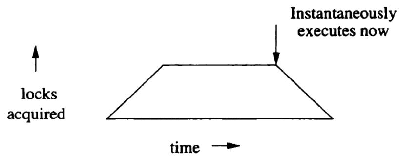

# 为什么两阶段锁有效

• 如何将一致且遵循两阶段锁的事务组成的任何合法调度S 转换为冲突等价的串行调度

– 对 S 中的事务数量进行归纳  
– 冲突等价的问题仅涉及读和写操作

• 当我们交换读和写的顺序时，我们忽略加锁和解锁操作

# 为什么两阶段锁有效

• 对 S 中的事务数量进行归纳

– 基础情况:

• 如果 $n = 1$ ，则无需做任何操作；S 已经是一个串行调度了

# 为什么两阶段锁有效

# • 对 S 中的事务数量进行归纳

# – 归纳步骤:

• 假设 S 涉及 n 个事务 T1, T2, …, Tn, =并设 Ti 是在整个调度 $\cdot$ 中第一个执行解锁操作的事务，比方说是 $u _ { i } ( X )$   
• 我们断言：有可能将 T 的所有读写操作向前移动到调度的开头，而不会越过任何冲突的读写操作

# 为什么两阶段锁有效

• 对 S 中的事务数量进行归纳– 归纳步骤:

• 考虑 Ti的某个操作，比如 $w _ { i } ( Y )$ .   
• 在S 中，它之前是否有某个冲突操作，比如 $W _ { j } ( Y )$ ？  
• 如果有，那么在调度 S中，操作 $u _ { j } ( Y )$ 和 $l _ { i } ( Y )$ 必定会介入在操作序列中

$$
\dots w _ {j} (Y); \dots ; u _ {j} (Y); \dots ; l _ {i} (Y); \dots ; w _ {i} (Y); \dots
$$

# 为什么两阶段锁有效

# – 归纳步骤:

• 如果有，那么在调度 S中，操作 $u _ { j } ( Y )$ 和 $l _ { i } ( Y )$ 必定会介入在操作序列中

$$
\dots w _ {j} (Y); \dots ; u _ {j} (Y); \dots ; l _ {i} (Y); \dots ; w _ {i} (Y); \dots
$$

• 由于 $T _ { j }$ 是第一个解锁的，所以 $u _ { i } ( X )$ 在 S 中必定先于$u _ { j } ( Y )$ ；也就是说，S 看起来可能像这样：

$$
\dots w _ {j} (Y); \dots ; u _ {i} (X); \dots ; u _ {j} (Y); \dots ; l _ {i} (Y); \dots ; w _ {i} (Y); \dots
$$

或者 $u _ { i } ( X )$ 甚至可能出现在 $W _ { j } ( Y )$ 之前。

无论哪种情况， $u _ { i } ( X )$ 出现在 $l _ { i } ( Y )$ 之前,

这意味着 $T _ { j }$ 没有遵循两阶段锁，这与我们的假设矛盾

# 为什么两阶段锁有效

# – 归纳步骤:

• 虽然我们仅论证了不存在写操作对的冲突，但同样的论证也适用于任何潜在冲突操作对（一个来自Ti，另一个来自其他 Tj）  
• 我们得出结论：确实有可能通过交换非冲突的读写操作，将Ti 的所有操作向前移动到 S 的开头，然后恢复T 的加锁和解锁操作。也就是说，S 可以被写成以下形式

(Ti 的操作) (其他 n-1 个事务的操作)

(Actions of Ti) (Actions of the other n-1 transactions)

# 为什么两阶段锁有效

# – 归纳步骤:

(Ti 的操作) (其他 n-1 个事务的操作)

(Actions of Ti) (Actions of the other n-1 transactions)

• 后面的 n-1 个事务仍然是一致且 2PL 事务的合法调度  
因此归纳假设同样适用于它。  
• 我们将尾部转换为冲突等价的串行调度，现在整个 S都被证明是冲突可串行化的

# 调度 G

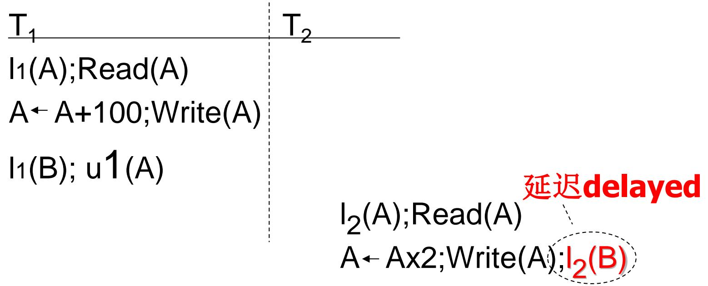

T1 与 T2 执行步骤，遇到冲突的锁被延迟 (delayed)

# 调度 G

T1

l1(A);Read(A)

A A+100;Write(A)

l1(B); u1(A)

Read(B);B B+100

Write(B); u1(B)

T2

延迟 l2(A);Read(A) delayed A Ax2;Write(A);l2(B)

# 调度 G

T 1

l1(A);Read(A)

A A+100;Write(A)

l1(B); u1(A)

Read(B);B B+100

Write(B); u1(B)

T2

l2(A);Read(A)

A Ax2;Write(A);l2(B)

l2(B); u2(A);Read(B)

B Bx2;Write(B);u2(B);

延迟delayed

# 调度 H (死锁风险)

# 死锁的潜在风险

T1

l1(A); Read(A)

A A+100;Write(A)

l1(B)

delayed

T2

l2(B);Read(B)

B Bx2;Write(B)

l2(A)

delayed

# 死锁的潜在风险

两阶段锁无法解决死锁的潜在风险

在这种情况下，几个事务被调度器强迫永远等待另一

个事务持有的锁

# AGENDA

18.1 串行与可串行化调度 (Serial and Serializable Schedules)  
18.2 冲突可串行化 (Conflict-Serializability)   
18.3 通过锁强制实现可串行化 (Enforcing Serializablity by Locks)   
18.4 具有多种锁模式的锁系统 (Locking System with Several Lock Modes)

# 简介

# 2PL 的主要问题

– 一个事务 T 必须在数据库元素 X 上加锁，即使它只是想读取 X 而不是写入它  
– 没有理由

• 只要不允许任何人写入 X，为什么几个事务不能同时读取 X 呢？

• 除了这个简单的 2PL 协议之外，所有的问题都在于提高性能并允许更多并发……

– 具有多种锁模式的锁系统（共享锁、排他锁）(Locking Systems With Several Lock Modes (Shared locks, Exclusive Locks)   
– 多粒度 (Multiple granularity)  
– 插入、删除和幻读 (Inserts, deletes and phantoms)   
– 其他类型的并发控制机制 (Other types of C.C. mechanisms)

# 共享锁和排他锁

动机

– 写入需要的锁比读取需要的锁“更强”

两种类型的锁

共享锁 (Shared lock): 读锁   
排他锁 (Exclusive lock): 写锁

对于任何数据库元素 X

– X 上要么可以有一个排他锁，要么没有排他锁但可以有任意数量的共享锁

# 共享锁和排他锁

# 符号表示

$s l _ { i } ( X )$ ：事务 $T _ { j }$ 请求对 X加共享锁

$x l _ { i } ( X )$ ：事务 Ti 请求对 X加排他锁

$u _ { i } ( X )$ ：事务 $\cdot$ 对 X加解锁; 即，它放弃了对 X拥有的任何锁

# 规则 #1 事务的一致性

• 没有持有排他锁就不能写入；没有持有某种锁就不能读取

• 读操作 ri (X) 之前必须有 sli(X) 或 xli(X), 中间没有 ui(X).  
• 写操作 wi(X) 之前必须有 xli(X) , 中间没有 ui(X).  
• 所有锁之后必须跟着对同一元素的解锁操作

结构良好的事务

$$
\begin{array}{l} T _ {1} = \ldots s l _ {1} (A) \ldots r _ {1} (A) \ldots u _ {1} (A) \ldots \\ T _ {1} = \ldots x I _ {1} (A) \ldots w _ {1} (A) \ldots u _ {1} (A) \ldots \\ \end{array}
$$

读写同一对象的事务怎么办？

选项 1：请求排他锁 (Request exclusive lock)

$$
T _ {1} = \ldots x I _ {1} (A) \ldots r _ {1} (A) \ldots w _ {1} (A) \ldots u _ {1} (A) \ldots
$$

读写同一对象的事务怎么办？

选项 2：锁升级

(E.g., 需要读，但不知道是否会写……)

$$
T _ {1} = \dots s I _ {1} (A) \dots r _ {1} (A) \dots x I _ {1} (A) \dots w _ {1} (A) \dots u _ {1} (A) \dots
$$

想一想

- 在 A 上获得第 2 个锁，或者  
- 放弃 S 锁，获得 X 锁

# 规则 # 2 2PL 事务

加锁必须先于解锁.

• 任何两阶段锁事务 Ti 中，任何 sli(X) 或xli(X) 操作之前都不能有针对任何 Y 的 ui(Y)操作。

除了锁升级之外没有其他变化:

• 如果升级获得了更多的锁 $( \mathsf { e } . \mathsf { g } . , \mathsf { S } \to \{ \mathsf { S } , \mathsf { X } \} )$

- 那么就没有变化！

• 如果升级释放了读（共享）锁 (e.g., S → X)

- 可以允许在加锁阶段进行

一个元素要么被一个事务独占锁定，要么被多个事务以共享模式锁定，但不能两者兼有。

$$
\begin{array}{l} \mathsf {S} = \dots \mathsf {s l} _ {\mathrm {i}} (\mathsf {A}) \dots \dots \mathsf {u} _ {\mathrm {i}} (\mathsf {A}) \dots \\ \mathsf {n o} \mathsf {x l} _ {\mathbf {j}} (\mathbf {A}) \\ \end{array}
$$

$$
\begin{array}{l} \mathsf {S} = \dots \mathsf {x l} _ {\mathsf {i}} (\mathsf {A}) \dots \dots \mathsf {u} _ {\mathsf {i}} (\mathsf {A}) \dots \\ \mathsf {n o} \mathsf {x l} _ {\mathbf {j}} (\mathbf {A}) \\ \mathsf {n o s l} _ {\mathbf {j}} (\mathbf {A}) \\ \end{array}
$$

# 示例

T1: sl1(A); r1(A); xl1(B); r1(B); w1(B); u1(A); u1(B);  
T: sl2(A)； r2(A)； sl2(B); r2(B); u2(A); u2(B);

<table><tr><td>T1</td><td>T2</td></tr><tr><td>sl1(A); r1(A);</td><td></td></tr><tr><td></td><td>sl2(A); r2(A);</td></tr><tr><td></td><td>sl2(B); r2(B);</td></tr><tr><td>x1(B) Denied</td><td></td></tr><tr><td></td><td>u2(A); u2(B)</td></tr><tr><td>x1(B); r1(B); w1(B);</td><td></td></tr><tr><td>u1(A); u1(B);</td><td></td></tr></table>

# 示例

$$
\begin{array}{l l} T _ {1} & T _ {2} \\ \hline s l _ {1} (A); r _ {1} (A); & s l _ {2} (A); r _ {2} (A); \\ & s l _ {2} (B); r _ {2} (B); \\ x l _ {1} (B) \text {D e n i e d} & u _ {2} (A); u _ {2} (B) \\ x l _ {1} (B); r _ {1} (B); w _ {1} (B); \\ u _ {1} (A); u _ {1} (B); \end{array}
$$

一致且 2PL 事务的合法调度是冲突可串行化的，这同样适用于具有共享锁和排他锁的系统

# 相容性矩阵 (Compatibility matrix)

• 相容性矩阵 (Compatibility matrix)

<table><tr><td colspan="2"></td><td colspan="2">Lock requested</td></tr><tr><td colspan="2"></td><td>S</td><td>X</td></tr><tr><td rowspan="2">Lock held in mode</td><td>S</td><td>Yes</td><td>No</td></tr><tr><td>X</td><td>No</td><td>No</td></tr></table>

使用相容性矩阵进行锁授予决策的规则  
• 当且仅当对于每一行 R，如果其他事务已经在 X 上持有 R模式的锁，且对应列 C 中为“Yes”，我们才能以模式 C 授予 X 上的锁

# 锁的升级 (Upgrading Locks)

# 锁的升级 (Upgrading Locks)

T 首先在 X 上获取共享锁  
– 直到后来 T 准备写入新值时，才将锁升级为排他锁

# 示例

T1: sl1(A); r1(A); sl1(B); r1(B); xl1(B); w1(B); u1(A); u1(B);  
T: sl2(A); r2(A)； sl2(B); r2(B); u2(A); u2(B);

T1 读取 A 和B ，对它们执行某些（可能是漫长的）计算，最终使用结果写入 B 的新值

<table><tr><td>T1</td><td>T2</td></tr><tr><td rowspan="2">sl1(A); r1(A);</td><td>sl2(A); r2(A);</td></tr><tr><td>sl2(B); r2(B);</td></tr><tr><td>sl1(B); r1(B);</td><td></td></tr><tr><td>xl1(B) Denied</td><td>u2(A); u2(B)</td></tr><tr><td>xl1(B); w1(B);</td><td></td></tr><tr><td>u1(A); u2(B);</td><td></td></tr></table>

# 示例

• 请注意，如果 T1 最初在读取 B 之前要求对 B 加排他锁，那么该请求将被拒绝  
• 最终导致，如果 T1 仅仅在 B 上使用排他锁，会比使用升级策略更晚完成

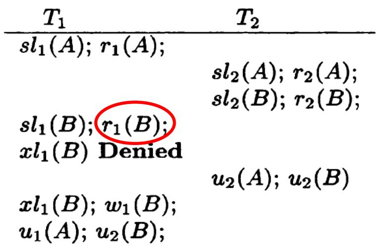

# 示例

• 不幸的是，不加区分地使用升级引入了一个新的、潜在的严重死锁源。  
假设 T1 和 T2 都读取和写入 A  
• 如果两个事务都使用升级方法（会导致互相 Denied 产生死锁）

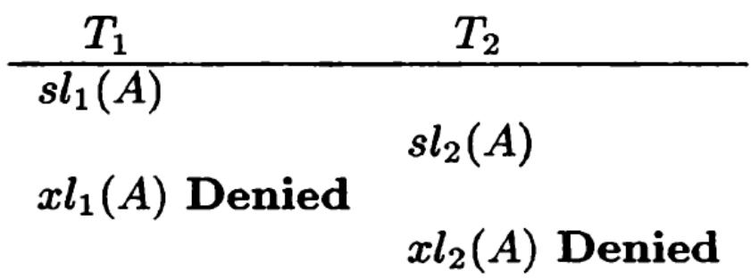

# 更新锁 (Update Locks)

• 我们可以在前面的示例中使用更新锁来避免死锁问题  
一个更新锁 $u l _ { i } ( X )$

– 赋予事务 $T _ { j }$ 只读取 $X$ 而不写入 X 的权限  
然而，只有更新锁可以在稍后升级为写锁；读锁不能被升级

# 更新锁 (Update Locks)

• 非对称的相容性矩阵

– U锁在我们请求它时看起来像一个S锁，并且  
– 在我们已经拥有U锁时看起来像一个排他锁

<table><tr><td></td><td>S</td><td>X</td><td>U</td></tr><tr><td>S</td><td>Yes</td><td>No</td><td>Yes</td></tr><tr><td>X</td><td>No</td><td>No</td><td>No</td></tr><tr><td>U</td><td>No</td><td>No</td><td>No</td></tr></table>

# 示例

$$
\begin{array}{l} T _ {1}: u l _ {1} (A); r _ {1} (A); x l _ {1} (A); w _ {1} (A); u _ {1} (A); \\ T _ {2}: u l _ {2} (A); r _ {2} (A); x l _ {2} (A); w _ {2} (A); u _ {2} (A); \end{array}
$$

$$
\begin{array}{l l} T _ {1} & T _ {2} \\ \hline u l _ {1} (A); r _ {1} (A); & u l _ {2} (A) \text {D e n i e d} \\ x l _ {1} (A); w _ {1} (A); u _ {1} (A); & u l _ {2} (A); r _ {2} (A); \\ & x l _ {2} (A); w _ {2} (A); u _ {2} (A); \end{array}
$$

锁系统有效地阻止了 T1 和 T2 的并发执行

# 解决死锁的方法

# 两类方法

1. 预防死锁   
2. 死锁的诊断与解除

# 1. 死锁的预防

• 产生死锁的原因是两个或多个事务都已封锁了一些数据对象，然后又都请求对已为其他事务封锁的数据对象加锁，从而出现死等待。  
预防死锁的发生就是要破坏产生死锁的条件

# 预防死锁的方法

# • 一次封锁法

– 要求每个事务必须一次将所有要使用的数据全部加锁，否则就不能继续执行  
– 存在的问题

降低系统并发度  
• 难于事先精确确定封锁对象

# 顺序封锁法

– 顺序封锁法是预先对数据对象规定一个封锁顺序，所有事务都按这个顺序实行封锁。  
– 顺序封锁法存在的问题

• 维护成本: 数据库系统中封锁的数据对象极多，并且在不断地变化。  
• 难以实现：很难事先确定每一个事务要封锁哪些对象

# 结论

– 在操作系统中广为采用的预防死锁的策略并不很适合数据库的特点  
– DBMS在解决死锁的问题上更普遍采用的是诊断并解除死锁的方法

# 2. 死锁的诊断与解除

死锁的诊断

超时法  
事务等待图法

# (1) 超时法

• 如果一个事务的等待时间超过了规定的时限，就认为发生了死锁  
优点：实现简单   
缺点

– 有可能误判死锁  
– 时限若设置得太长，死锁发生后不能及时发现

# (2)等待图法

• 用事务等待图动态反映所有事务的等待情况

– 事务等待图是一个有向图G=(T，U)  
– T为结点的集合，每个结点表示正运行的事务  
– U为边的集合，每条边表示事务等待的情况  
– 若T1等待T2，则T1，T2之间划一条有向边，从T1指向T2

# 等待图法（续）

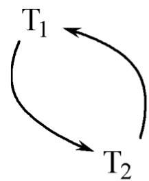  
(a)

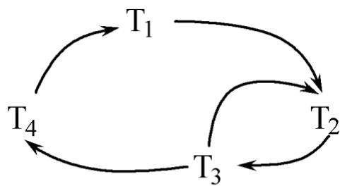  
  
事务等待图

图(a)中，事务T1等待T2，T2等待T1，产生了死锁  
图(b)中，事务T1等待T2，T2等待T3，T3等待T4，T4又等待T ，产生了死锁  
图(b)中，事务T3可能还等待T2，在大回路中又有小的回路

# 等待图法（续）

示例:

T1: S(A), R(A), S(B)   
T2: X(B),W(B)  
T3: S(C), R(C)   
T4: X(B)

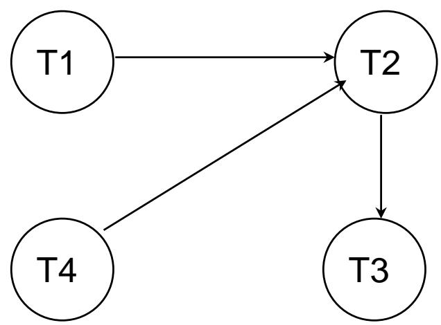

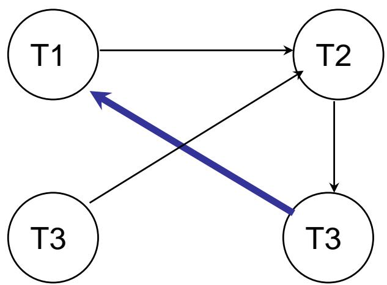

# 等待图法（续）

• 并发控制子系统周期性地（比如每隔数秒）生成事务等待图，检测事务。如果发现图中存在回路，则表示系统中出现了死锁。

# 死锁的诊断与解除（续）

解除死锁

– 选择一个处理死锁代价最小的事务，将其撤消  
– 释放此事务持有的所有的锁，使其它事务能继续运行下去

# 作业

18.2.4   
18.3.1 a) b) c) d)   
18.3.2   
18.3.3   
18.3.4   
18.4.1   
18.4.2

# The End of ThisLecture

