# 第4讲：实体-联系模型（Entity-Relationship Model, Part 1）

> 参考：P.P.S. Chen. The Entity Relationship Model – Towards a Unified View of Data. ACM Transactions on Database Systems, 1(1):9–36, 1976.
>
> 陈品山博士于1976年发明了E/R模型。

---

## 1. E/R模型概述

### 1.1 基本元素

E/R模型包含三个核心概念：

| 概念 | 英文 | 说明 |
|------|------|------|
| 实体 | Entity | 某个抽象对象 |
| 实体集 | Entity Set | 一组相似的实体组成的集合 |
| 属性 | Attributes | 实体集中实体的属性（性质） |
| 联系 | Relationships | 连接两个或多个实体集的关系 |

对应关系：E/R模型中的 **Entity Set** ≈ 面向对象编程中的 **Class**，E/R模型中的 **Entity** ≈ 面向对象编程中的 **Object**。

### 1.2 E/R图（E/R Diagram）

E/R图是用图形表示实体集、属性和联系的工具，图形元素如下：

| 元素 | 图形 | 说明 |
|------|------|------|
| 实体集 | 矩形 (Rectangle) | 表示实体集合 |
| 属性 | 椭圆 (Oval) | 表示实体的属性 |
| 联系 | 菱形 (Diamond) | 表示实体集之间的联系 |
| 边 | 直线 | 连接实体集到其属性，或连接联系到其实体集 |


### 1.3 实体集与属性示例

以**电影数据库**为例：

- **实体**：一部电影、一个明星、一个制片厂
- **实体集**：所有电影的集合、所有明星的集合、所有制片厂的集合
- **属性**：电影实体集可以有片名（title）、片长（length）等属性

> **注意**：属性通常为原始类型，如字符串、整数、实数等。

### 1.4 联系（Relationships）

联系是连接两个或多个实体集的**连接关系**。

**示例**：
- 两个实体集：**Movies**（电影）和 **Stars**（明星）
- 联系：**Stars-in**（出演）
- 含义：电影实体 m 通过 Stars-in 联系与明星实体 s 相关联，当且仅当 s 出演了电影 m

### 1.5 E/R图的实例

实体集 E 的一个**实例**是指该实体集的一个具体有限实体集合。

联系 R 的**联系集**是连接 n 个实体集 E₁, E₂, …, Eₙ 的有限元组集合 $(e_1, e_2, ..., e_n)$，其中 $e_i \in E_i$。

**Stars-in 联系实例示例**：

| Movies | Stars |
|--------|-------|
| Basic Instinct | Sharon Stone |
| Total Recall | Arnold Schwarzenegger |
| Total Recall | Sharon Stone |

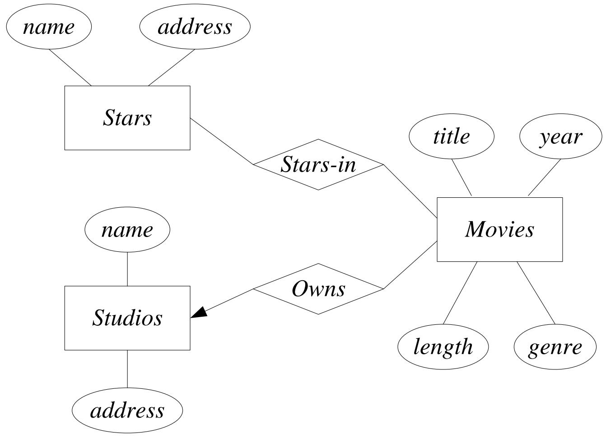

---

## 2. 联系的多重性（Multiplicity of Binary E/R Relationships）

### 2.1 二元联系的多重性

设 R 是连接实体集 E 和 F 的联系。

| 类型 | 英文 | 定义 |
|------|------|------|
| 多对一 | many-one | E 中每个实体最多与 F 中一个实体通过 R 相连 |
| 一对多 | one-many | F 中每个实体最多与 E 中一个实体通过 R 相连（等价于 F→E 的多对一） |
| 一对一 | one-one | R 既是 E→F 的多对一，又是 F→E 的多对一 |
| 多对多 | many-many | R 既不是 E→F 的多对一，也不是 F→E 的多对一 |

**图形表示**：如果联系 R 是 E→F 的多对一，则在指向 F 的边上加一个**箭头**。

| 多重性 | 图示 |
|--------|------|
| 多对一 (many-one) | 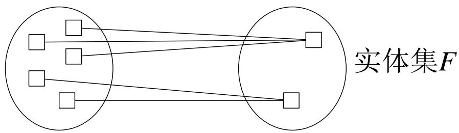 |
| 一对多 (one-many) | 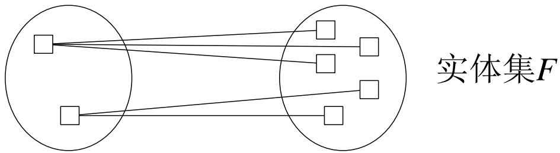 |
| 一对一 (one-one) | 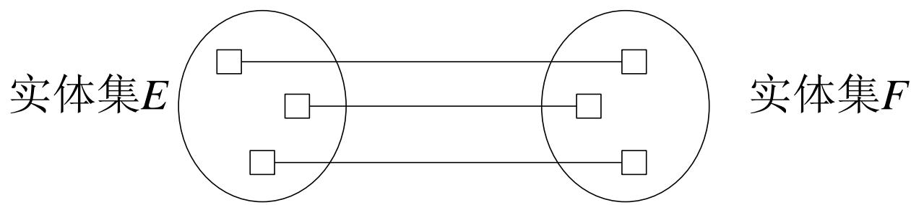 |
| 多对多 (many-many) | 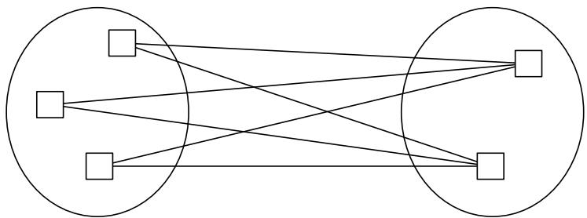 |
| 箭头表示法 | 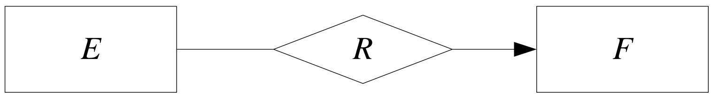 |

**一对一联系示例**：

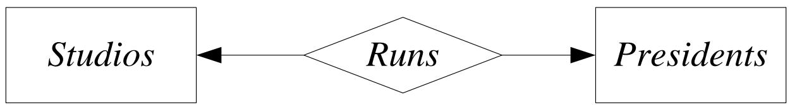

### 2.2 多路联系（Multiway Relationship）

在实践中，三元或更高元的联系较少见，但有时确实需要反映真实情况。

**示例**：**Contracts**（合同）联系

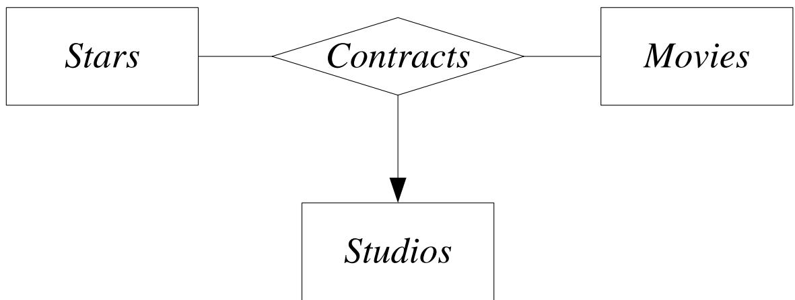

- 如果从其他所有实体集各选一个实体，这些实体最多与 E 中一个实体相关，则画一个指向 E 的箭头
- 这等价于：所有其他实体集 → E 的函数依赖

### 2.3 联系中的角色（Roles in Relationships）

当同一个实体集通过多条边连接到联系时，每条边代表该实体集在联系中扮演的**不同角色**，需要用名称标注。

**示例**：

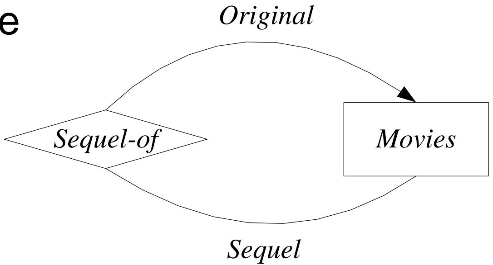

多路联系 + 多重角色示例（studio1, studio2, star, movie）：
- studio2 通过 studio1 使用其明星来为 movie 签订合同
- (studio1, studio2, star, movie)

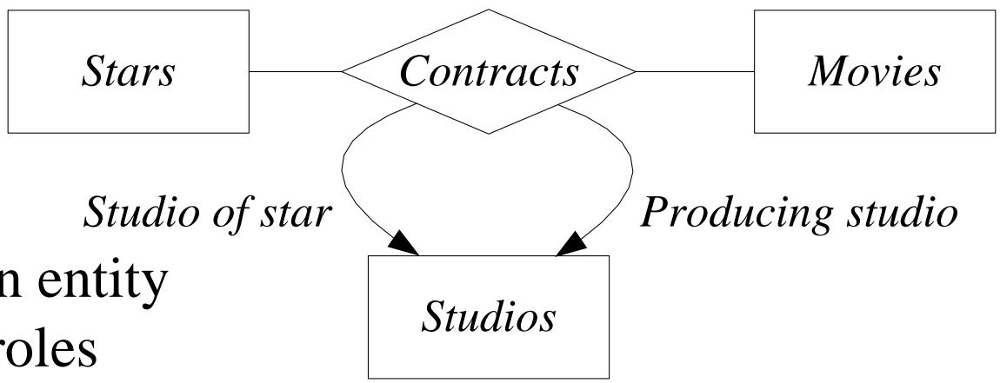

### 2.4 联系的属性（Attributes on Relationships）

有时需要为联系本身关联属性，这既是方便的，有时甚至是必要的。

**示例**：

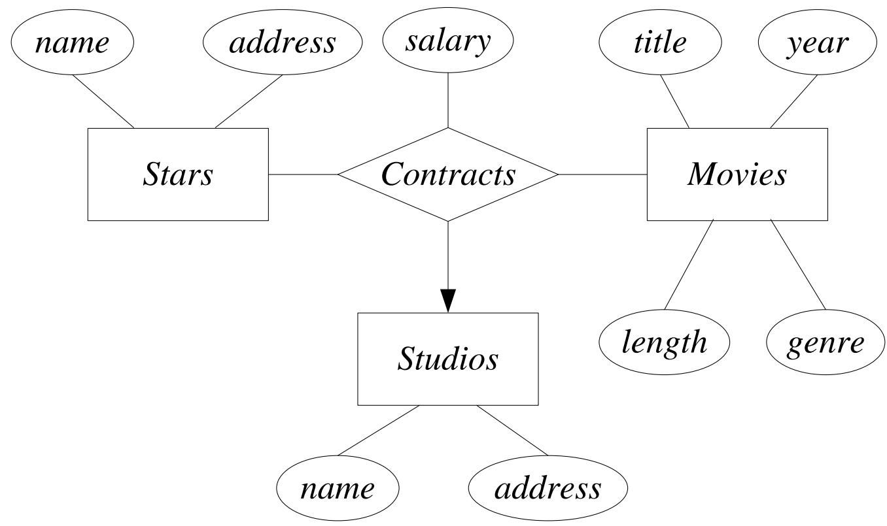

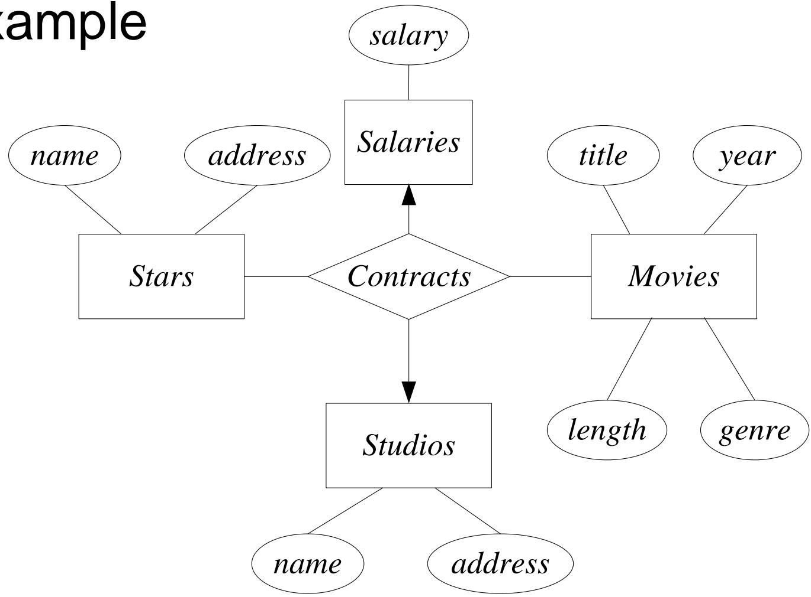

### 2.5 多路联系转换为二元联系

任何多路联系都可以转换为一组二元的多对一联系。

**示例**：

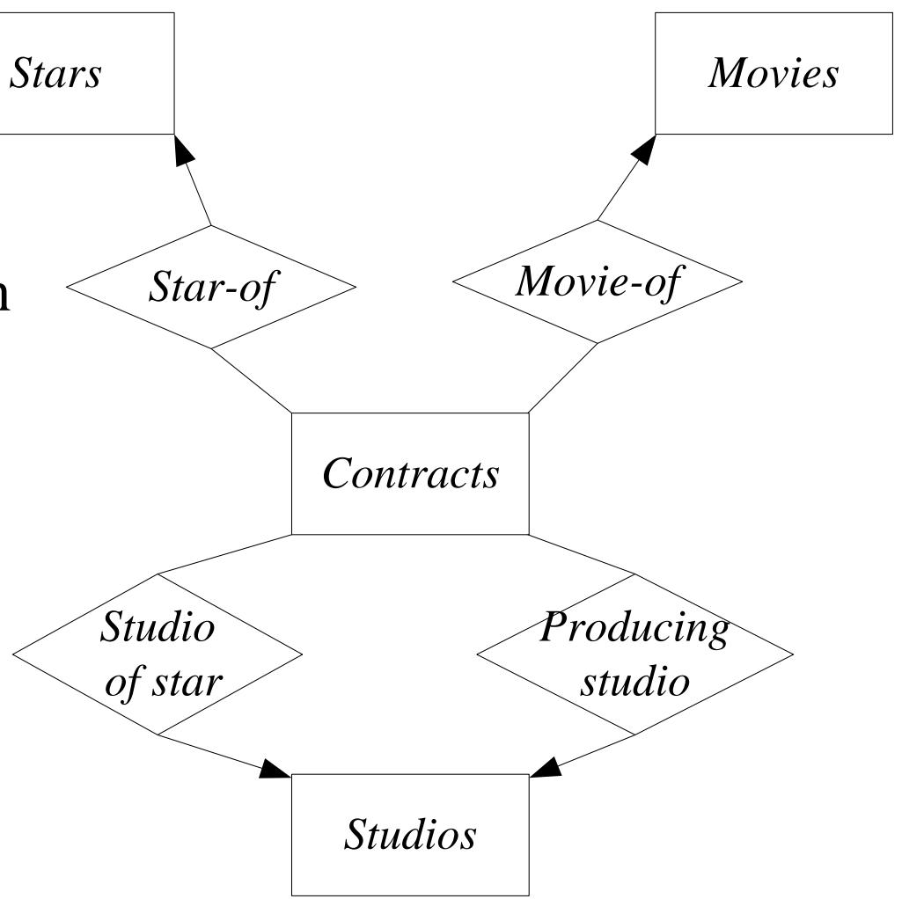

---

## 3. E/R模型中的子类（Subclasses）

### 3.1 子类（Subclasses）

特殊情况的实体集称为**子类**，每个子类有自己的特殊属性和/或联系。

- 使用 **isa** 联系表示
- isa 是一对一联系（通常不画双箭头）
- 含义：子类实体"是一个"父类实体

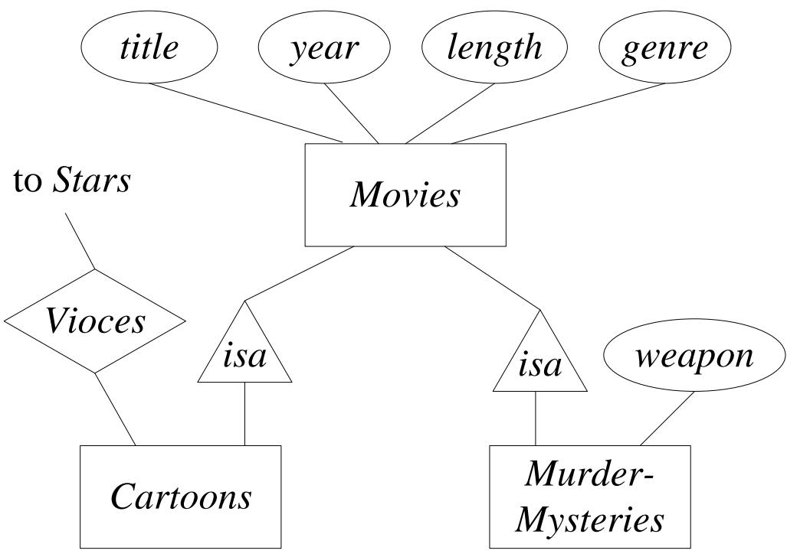

---

## 4. 设计原则（Design Principles）

### 4.1 忠实性（Faithfulness）

设计应忠实于应用的规格说明。

### 4.2 避免冗余（Avoiding Redundancy）

每个信息只说一次。

**反例**：如果已经用 Movies 和 Studios 之间的 **Owns** 联系来表示所有权，就不应再在 Movies 实体集中添加一个 **studioName** 属性——这是冗余的。

### 4.3 简单性（Simplicity Counts）

避免引入不必要的元素。

**反例**：不必要的实体集设计

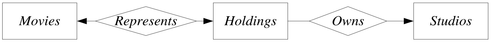

### 4.4 选择正确关系（Choosing the Right Relationship）

同一个场景可能有多种建模方式，应选择最合适的联系。

**示例对比**：

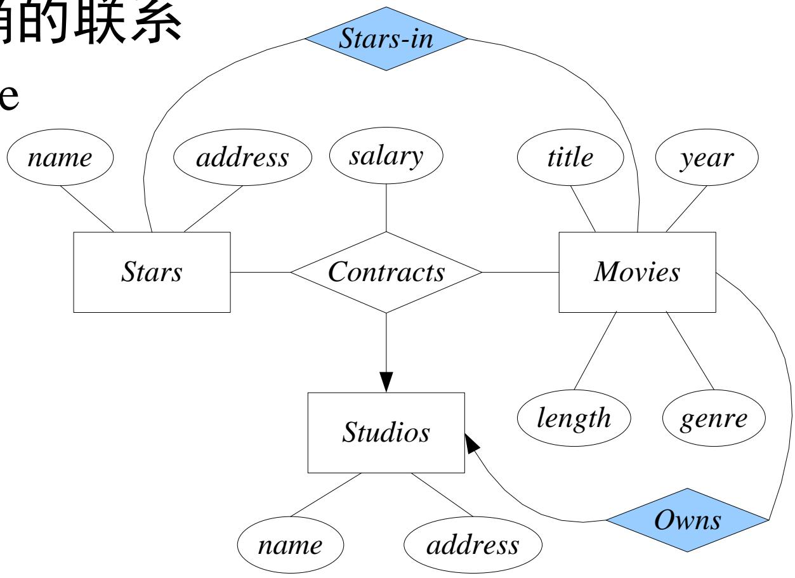

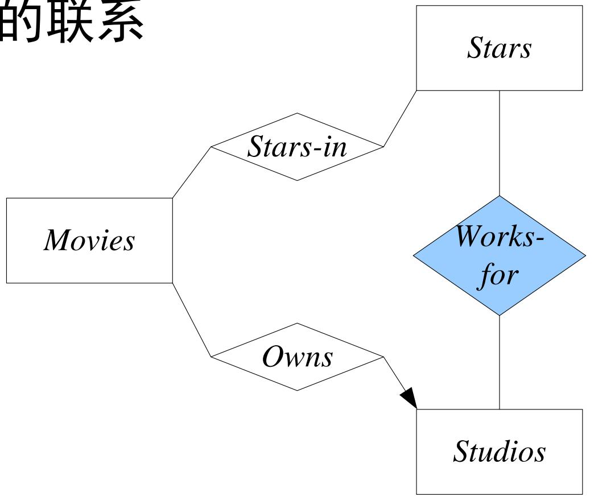

### 4.5 选择正确元素种类（Picking the Right Kind of Element）

通常在"使用属性"和"使用实体集/联系组合"之间做选择。

- **属性**更简单，易于实现
- 但把所有东西都做成属性通常会有问题

**适合用属性而非实体集的条件**（设 E 为实体集）：

1. E 在所有多对一联系中都是"一"方
2. E 的唯一键就是它的所有属性
3. 没有联系涉及 E 超过一次

---

## 5. E/R模型中的约束（Constraints）

### 5.1 键（Keys）

- 每个实体集必须有**键**（Key）
- 一个实体集可能有多个候选键，通常选择一个作为**主键**
- 当实体集参与 isa 层次结构时，要求根实体集拥有键所需的所有属性

**键的表示**：在 E/R 图中，将属于键的属性**加下划线**。

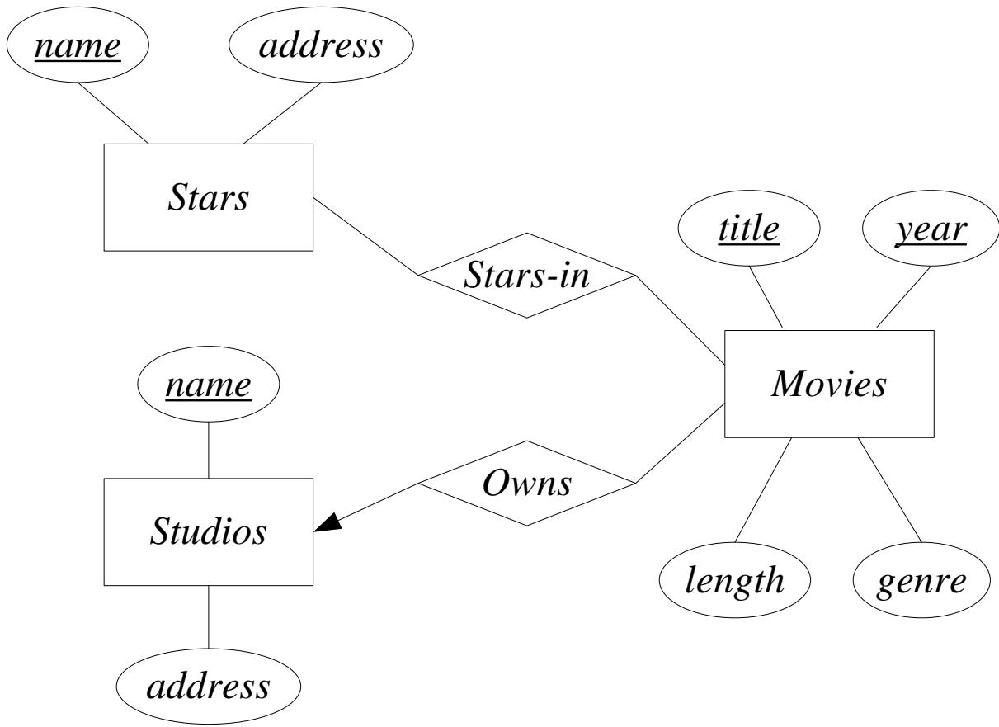

### 5.2 参照完整性（Referential Integrity）

**表示法**：如果从 E 到 F 的联系 R 带有一个**圆箭头**（rounded arrow-head）指向 F，则表示：

1. 联系是 E→F 的多对一
2. E 中每个实体所关联的 F 中实体**必须存在**（不能为空）

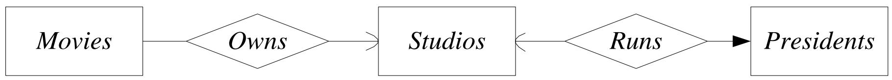

### 5.3 度约束（Degree Constraints）

**表示法**：在边上附加**边界数字**来表示度约束。

**示例**：一部电影通过 Stars-in 联系最多只能与 10 个明星实体相连。

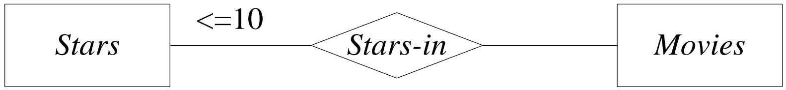

---

## 6. 弱实体集（Weak Entity Sets）

### 6.1 什么是弱实体集

**弱实体集**（Weak Entity Set）：其键由属性组成，其中部分或全部属性属于另一个实体集。

换句话说，弱实体集的键**依赖于**其他实体集的键。

### 6.2 弱实体集的成因

**主要原因一**：E 的实体是 F 中实体的子单元，E 实体的名称本身不唯一，需要加上所属 F 实体的名称才能唯一标识。

**示例**：

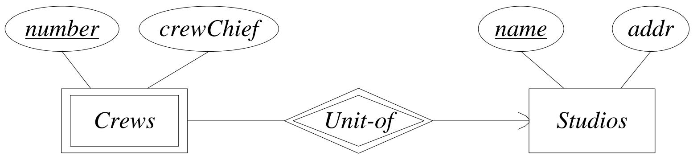

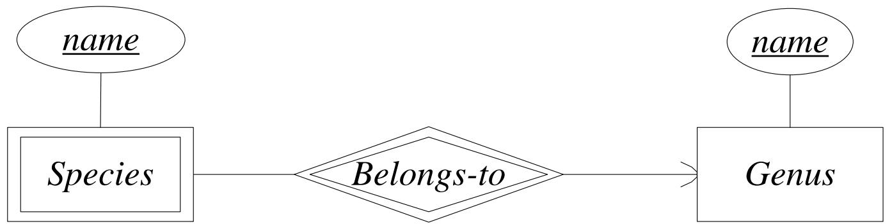

**主要原因二**：为消除多路联系而引入的连接实体集。这些实体集通常没有自己的属性，其键由所连接实体集的键属性构成。

**示例**：将 Contracts 多路联系转换为二元联系后：

```
Contracts (salary)
├── Star-of → Stars (name, address)
├── Studio-of → Studios (name, address)
└── Movie-of → Movies (genre, length, year)
```

### 6.3 弱实体集的要求

设 E 为弱实体集，其键属性包括：

1. E 自身的零个或多个属性
2. 从 E 到其他实体集的某些多对一联系所提供的键属性

这些多对一联系称为 E 的**支持联系**（Supporting Relationships），所到达的实体集称为**支持实体集**（Supporting Entity Sets）。

**支持联系 R（从 E 到 F）必须满足的条件**：

| 条件 | 说明 |
|------|------|
| a) | R 必须是二元的、E→F 的多对一联系 |
| b) | R 必须具有从 E 到 F 的参照完整性 |
| c) | F 提供给 E 的属性必须是 F 的键属性 |
| d) | 若 F 本身也是弱实体集，则 F 的键属性中部分来自 G 的键属性（递归定义） |
| e) | 如果存在多个从 E 到同一实体集 F 的不同支持联系，则每个联系都提供一份 F 的键属性副本 |

> **注意**：E 通过不同的支持联系可能与 F 中不同的实体相关联，因此 E 的键中可能包含 F 中多个不同实体的键属性。

### 6.4 弱实体集的表示法

| 表示规则 | 说明 |
|----------|------|
| 弱实体集 | 用**双边框矩形**表示 |
| 支持联系（多对一） | 用**双边框菱形**表示 |
| 自身键属性 | 在弱实体集中**加下划线** |

**规则总结**：使用双边框的实体集 E 是弱实体集。E 的键 = E 中带下划线的属性 + E 通过双边框多对一联系所连接的实体集的键属性。

---

## 附录：数据库设计流程

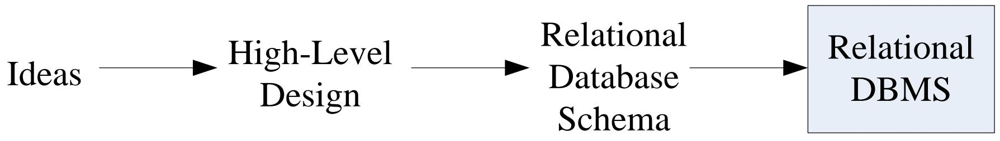
