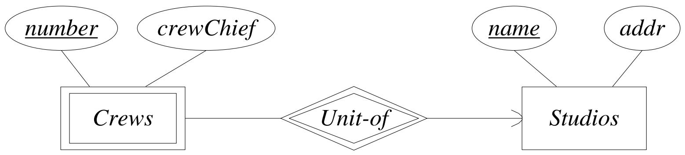
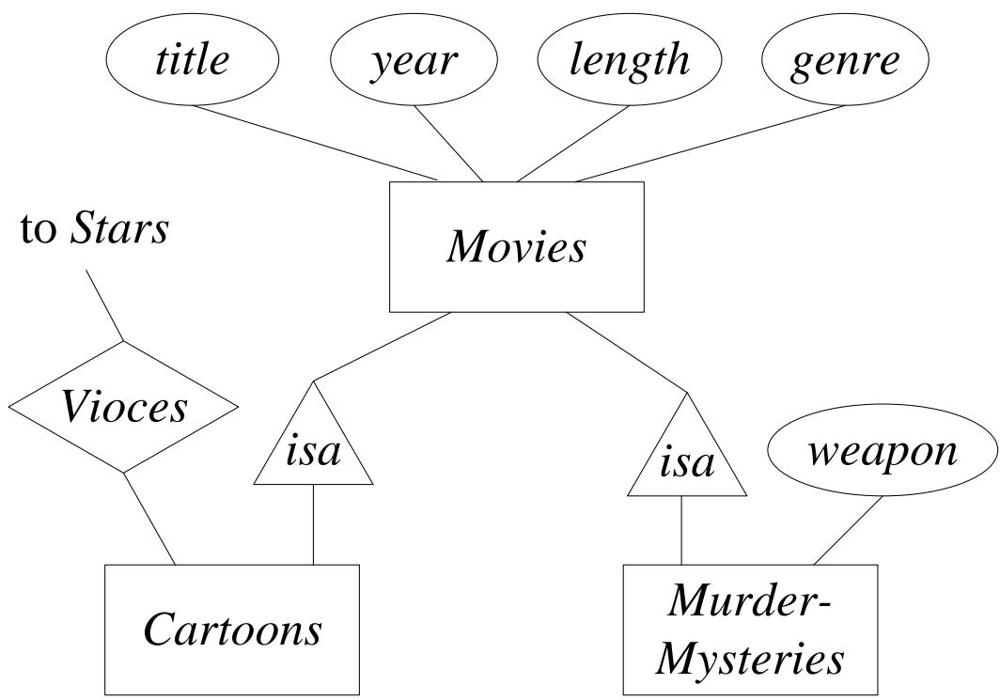
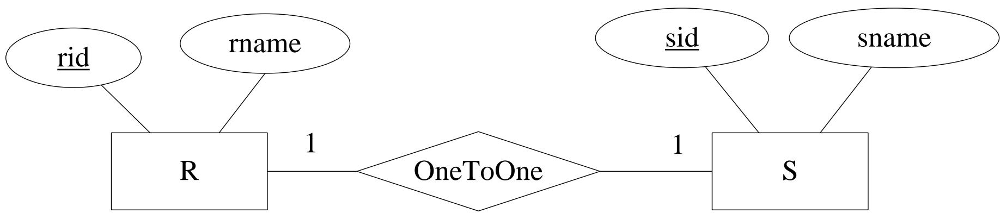
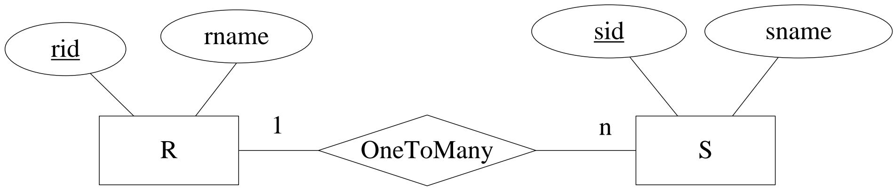
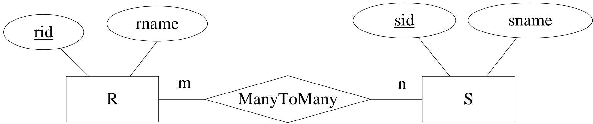

## 1. E/R模型概述

### 1.1 基本元素

E/R模型包含三个核心概念：

| 概念   | 英文          | 说明                       |
| ------ | ------------- | -------------------------- |
| 实体   | Entity        | 某个抽象对象               |
| 实体集 | Entity Set    | 一组相似的实体组成的集合   |
| 属性   | Attributes    | 实体集中实体的属性（性质） |
| 联系   | Relationships | 连接两个或多个实体集的关系 |

对应关系：E/R模型中的 **Entity Set** ≈ 面向对象编程中的 **Class**，E/R模型中的 **Entity** ≈ 面向对象编程中的 **Object**。

### 1.2 E/R图（E/R Diagram）

E/R图是用图形表示实体集、属性和联系的工具，图形元素如下：

| 元素   | 图形             | 说明                                     |
| ------ | ---------------- | ---------------------------------------- |
| 实体集 | 矩形 (Rectangle) | 表示实体集合                             |
| 属性   | 椭圆 (Oval)      | 表示实体的属性                           |
| 联系   | 菱形 (Diamond)   | 表示实体集之间的联系                     |
| 边     | 直线             | 连接实体集到其属性，或连接联系到其实体集 |

### 1.3 实体集与属性示例

以**电影数据库**为例：

- **实体**：一部电影、一个明星、一个制片厂
- **实体集**：所有电影的集合、所有明星的集合、所有制片厂的集合
- **属性**：电影实体集可以有片名（title）、片长（length）等属性

> **注意**：属性通常为原始类型，如字符串、整数、实数等。

### 1.4 联系（Relationships）

联系是连接两个或多个实体集的**连接关系**。

**示例**：

- 两个实体集：**Movies**（电影）和 **Stars**（明星）
- 联系：**Stars-in**（出演）
- 含义：电影实体 m 通过 Stars-in 联系与明星实体 s 相关联，当且仅当 s 出演了电影 m

### 1.5 E/R图的实例

实体集 E 的一个**实例**是指该实体集的一个具体有限实体集合。

联系 R 的**联系集**是连接 n 个实体集 E₁, E₂, …, Eₙ 的有限元组集合 $(e_1, e_2, ..., e_n)$，其中 $e_i \in E_i$。

**Stars-in 联系实例示例**：

| Movies         | Stars                 |
| -------------- | --------------------- |
| Basic Instinct | Sharon Stone          |
| Total Recall   | Arnold Schwarzenegger |
| Total Recall   | Sharon Stone          |


---

## 2. 联系的多重性（Multiplicity of Binary E/R Relationships）

### 2.1 二元联系的多重性

设 R 是连接实体集 E 和 F 的联系。

| 类型   | 英文      | 定义                                                              |
| ------ | --------- | ----------------------------------------------------------------- |
| 多对一 | many-one  | E 中每个实体最多与 F 中一个实体通过 R 相连                        |
| 一对多 | one-many  | F 中每个实体最多与 E 中一个实体通过 R 相连（等价于 F→E 的多对一） |
| 一对一 | one-one   | R 既是 E→F 的多对一，又是 F→E 的多对一                            |
| 多对多 | many-many | R 既不是 E→F 的多对一，也不是 F→E 的多对一                        |

**图形表示**：如果联系 R 是 E→F 的多对一，则在指向 F 的边上加一个**箭头**。

| 多重性             | 图示                                                                             |
| ------------------ | -------------------------------------------------------------------------------- |
| 多对一 (many-one)  |  |
| 一对多 (one-many)  |  |
| 一对一 (one-one)   |  |
| 多对多 (many-many) |  |
| 箭头表示法         |  |

**一对一联系示例**：


### 2.2 多路联系（Multiway Relationship）

在实践中，三元或更高元的联系较少见，但有时确实需要反映真实情况。

**示例**：**Contracts**（合同）联系


- 如果从其他所有实体集各选一个实体，这些实体最多与 E 中一个实体相关，则画一个指向 E 的箭头
- 这等价于：所有其他实体集 → E 的函数依赖

### 2.3 联系中的角色（Roles in Relationships）

当同一个实体集通过多条边连接到联系时，每条边代表该实体集在联系中扮演的**不同角色**，需要用名称标注。

**示例**：


多路联系 + 多重角色示例（studio1, studio2, star, movie）：

- studio2 通过 studio1 使用其明星来为 movie 签订合同
- (studio1, studio2, star, movie)


### 2.4 联系的属性（Attributes on Relationships）

有时需要为联系本身关联属性，这既是方便的，有时甚至是必要的。

**示例**：


### 2.5 多路联系转换为二元联系

任何多路联系都可以转换为一组二元的多对一联系。

**示例**：


---

## 3. E/R模型中的子类（Subclasses）

### 3.1 子类（Subclasses）

特殊情况的实体集称为**子类**，每个子类有自己的特殊属性和/或联系。

- 使用 **isa** 联系表示
- isa 是一对一联系（通常不画双箭头）
- 含义：子类实体"是一个"父类实体


---

## 4. 设计原则（Design Principles）

### 4.1 忠实性（Faithfulness）

设计应忠实于应用的规格说明。

### 4.2 避免冗余（Avoiding Redundancy）

每个信息只说一次。

**反例**：如果已经用 Movies 和 Studios 之间的 **Owns** 联系来表示所有权，就不应再在 Movies 实体集中添加一个 **studioName** 属性——这是冗余的。

### 4.3 简单性（Simplicity Counts）

避免引入不必要的元素。

**反例**：不必要的实体集设计


### 4.4 选择正确关系（Choosing the Right Relationship）

同一个场景可能有多种建模方式，应选择最合适的联系。

**示例对比**：


### 4.5 选择正确元素种类（Picking the Right Kind of Element）

通常在"使用属性"和"使用实体集/联系组合"之间做选择。

- **属性**更简单，易于实现
- 但把所有东西都做成属性通常会有问题

**适合用属性而非实体集的条件**（设 E 为实体集）：

1. E 在所有多对一联系中都是"一"方
2. E 的唯一键就是它的所有属性
3. 没有联系涉及 E 超过一次

---

## 5. E/R模型中的约束（Constraints）

### 5.1 键（Keys）

- 每个实体集必须有**键**（Key）
- 一个实体集可能有多个候选键，通常选择一个作为**主键**
- 当实体集参与 isa 层次结构时，要求根实体集拥有键所需的所有属性

**键的表示**：在 E/R 图中，将属于键的属性**加下划线**。


### 5.2 参照完整性（Referential Integrity）

**表示法**：如果从 E 到 F 的联系 R 带有一个**圆箭头**（rounded arrow-head）指向 F，则表示：

1. 联系是 E→F 的多对一
2. E 中每个实体所关联的 F 中实体**必须存在**（不能为空）


### 5.3 度约束（Degree Constraints）

**表示法**：在边上附加**边界数字**来表示度约束。

**示例**：一部电影通过 Stars-in 联系最多只能与 10 个明星实体相连。


---

## 6. 弱实体集（Weak Entity Sets）

### 6.1 什么是弱实体集

**弱实体集**（Weak Entity Set）：其键由属性组成，其中部分或全部属性属于另一个实体集。

换句话说，弱实体集的键**依赖于**其他实体集的键。

### 6.2 弱实体集的成因

**主要原因一**：E 的实体是 F 中实体的子单元，E 实体的名称本身不唯一，需要加上所属 F 实体的名称才能唯一标识。

**示例**：


**主要原因二**：为消除多路联系而引入的连接实体集。这些实体集通常没有自己的属性，其键由所连接实体集的键属性构成。

**示例**：将 Contracts 多路联系转换为二元联系后：

```
Contracts (salary)
├── Star-of → Stars (name, address)
├── Studio-of → Studios (name, address)
└── Movie-of → Movies (genre, length, year)
```

### 6.3 弱实体集的要求

设 E 为弱实体集，其键属性包括：

1. E 自身的零个或多个属性
2. 从 E 到其他实体集的某些多对一联系所提供的键属性

这些多对一联系称为 E 的**支持联系**（Supporting Relationships），所到达的实体集称为**支持实体集**（Supporting Entity Sets）。

**支持联系 R（从 E 到 F）必须满足的条件**：

| 条件 | 说明                                                                                |
| ---- | ----------------------------------------------------------------------------------- |
| a)   | R 必须是二元的、E→F 的多对一联系                                                    |
| b)   | R 必须具有从 E 到 F 的参照完整性                                                    |
| c)   | F 提供给 E 的属性必须是 F 的键属性                                                  |
| d)   | 若 F 本身也是弱实体集，则 F 的键属性中部分来自 G 的键属性（递归定义）               |
| e)   | 如果存在多个从 E 到同一实体集 F 的不同支持联系，则每个联系都提供一份 F 的键属性副本 |

> **注意**：E 通过不同的支持联系可能与 F 中不同的实体相关联，因此 E 的键中可能包含 F 中多个不同实体的键属性。

### 6.4 弱实体集的表示法

| 表示规则           | 说明                     |
| ------------------ | ------------------------ |
| 弱实体集           | 用**双边框矩形**表示     |
| 支持联系（多对一） | 用**双边框菱形**表示     |
| 自身键属性         | 在弱实体集中**加下划线** |

**规则总结**：使用双边框的实体集 E 是弱实体集。E 的键 = E 中带下划线的属性 + E 通过双边框多对一联系所连接的实体集的键属性。

---

## 附录：数据库设计流程


---

## 7. 从 E/R 图到关系模式设计

### 7.1 基本转换规则

将 E/R 图转换为关系模式的基本方法：

- 每个**实体集**转换为一个同名关系，属性相同
- 每个**联系**转换为一个关系，其属性为参与实体集的键

### 7.2 特殊情况

以下情况需要特殊处理：

- **弱实体集**不能按上述方法直接转换
- **"Isa" 联系**（子类结构）需要仔细处理
- 有时需要**合并两个关系**，特别是实体集 $E$ 到另一个实体集之间存在多对一联系时，可将 $E$ 的关系与该联系的关系合并

---

## 8. 实体集 → 关系

对于每个**非弱实体集**，创建一个同名关系，属性与实体集相同。

**示例：Movies（电影表）**

| title                          | year | length | genre  |
| ------------------------------ | ---- | ------ | ------ |
| Star Wars（星球大战）          | 1977 | 124    | sciFi  |
| Gone With the Wind（乱世佳人） | 1939 | 231    | drama  |
| Wayne's World（韦恩的世界）    | 1992 | 95     | comedy |

**示例：Stars（明星表）**

| name          | address                     |
| ------------- | --------------------------- |
| Carrie Fisher | 123 Maple St., Hollywood    |
| Mark Hamill   | 456 Oak Rd., Brentwood      |
| Harrison Ford | 789 Palm Dr., Beverly Hills |

---

## 9. 联系 → 关系

对于给定联系 R，其对应的关系模式构建方法：

1. 对参与联系 R 的每个实体集，取其**键属性**作为 R 关系模式的属性
2. 如果联系本身有属性，这些属性也成为 R 关系模式的属性

### 9.1 示例：Owns（所属制片厂）

| title              | year | studioName |
| ------------------ | ---- | ---------- |
| Star Wars          | 1977 | Fox        |
| Gone With the Wind | 1939 | MGM        |
| Wayne's World      | 1992 | Paramount  |

### 9.2 示例：StarsIn（参演）

| title              | year | starName      |
| ------------------ | ---- | ------------- |
| Star Wars          | 1977 | Carrie Fisher |
| Star Wars          | 1977 | Mark Hamill   |
| Star Wars          | 1977 | Harrison Ford |
| Gone With the Wind | 1939 | Vivien Leigh  |
| Wayne's World      | 1992 | Dana Carvey   |
| Wayne's World      | 1992 | Mike Meyers   |

### 9.3 示例：Contracts（签约）

Contracts (starName, title, year, studioOfStar, producingStudio)

---

## 10. 关系合并

### 10.1 场景

当实体集 E 与另一个实体集 F 之间存在**多对一**（many-one）联系 R 时，可以将 E 和 R 合并为一个关系。

合并后的关系模式包含：

1. E 的所有属性
2. F 的键属性
3. 联系 R 的任何属性

> 注意：当 E 中的某个实体不关联到任何 F 实体时，第 (2)(3) 类属性在该元组中为 NULL 值。

### 10.2 示例：Movies + Owns 合并

合并前：

- Movies (title, year, length, genre)
- Owns (title, year, studioName)

合并后：

- Movies (title, year, length, genre, studioName)

| title              | year | length | genre  | studioName |
| ------------------ | ---- | ------ | ------ | ---------- |
| Star Wars          | 1977 | 124    | sciFi  | Fox        |
| Gone With the Wind | 1939 | 231    | drama  | MGM        |
| Wayne's World      | 1992 | 95     | comedy | Paramount  |

### 10.3 示例：进一步合并 StarsIn

合并后：Movies (title, year, length, genre, studioName, starName)

| title              | year | length | genre  | studioName | starName      |
| ------------------ | ---- | ------ | ------ | ---------- | ------------- |
| Star Wars          | 1977 | 124    | sciFi  | Fox        | Carrie Fisher |
| Star Wars          | 1977 | 124    | sciFi  | Fox        | Mark Hamill   |
| Star Wars          | 1977 | 124    | sciFi  | Fox        | Harrison Ford |
| Gone With the Wind | 1939 | 231    | drama  | MGM        | Vivien Leigh  |
| Wayne's World      | 1992 | 95     | comedy | Paramount  | Dana Carvey   |
| Wayne's World      | 1992 | 95     | comedy | Paramount  | Mike Meyers   |

> **注意**：这种过度合并会导致数据冗余（如 Star Wars 的信息重复存储了 3 次），实际设计中需权衡。

---

## 11. 弱实体集的处理（转换）

### 11.1 三条规则

1. 弱实体集 W 对应的关系必须包含：W 的所有属性 + **支持实体集的键属性**
2. 涉及弱实体集 W 的联系，其关系中对 W 的键必须使用 W 的**全部键属性**（包括来自其他支持实体集的键）
3. **支持联系**（从 W 到支持实体集的联系）不需要单独转换为关系

### 11.2 修正规则

- 对弱实体集 W，构建关系模式包含：
  1. W 的所有属性
  2. W 的所有支持联系的属性
  3. 对每个支持联系（如从 W 到实体集 $E$ 的多对一联系），$E$ 的所有键属性
- 如有命名冲突，需重命名属性
- **不为支持联系单独构建关系**

### 11.3 示例：Studio + Crews（剧组）



- Studio (name, addr)
- Crews (number, studioName, crewChief)

> Crews 是弱实体集，其键包含自身的 number 和支持实体集 Studio 的键 studioName。支持联系 "Unit-of" 不需要单独建表。

---

## 12. 子类结构的转换

### 12.1 三种主要策略

1. **E/R 风格转换**
2. **面向对象方法**
3. **使用 NULL 值**

---

### 12.2 策略一：E/R 风格转换

**方法：**

1. 为每个实体集创建一个关系（常规方法）
2. 如果实体集 $E$ 不是层次结构的根，则 E 的关系包含：根的键属性（用于标识实体）+ E 的所有属性

**示例：** Movies → MurderMysteries（谋杀悬疑片）、Cartoon（卡通片）



- Movies (title, year, length, genre)
- MurderMysteries (title, year, weapon)
- Cartoon (title, year)
- Voices (title, year, starName) — 卡通片的配音演员

> 每个子类关系都包含根的键（title, year），用于关联回父实体。

---

### 12.3 策略二：面向对象方法

**方法：**

1. 枚举所有包含根的可能子树组合
2. 对每个组合，创建一个关系，表示该组合中恰好有组件的实体
3. 该关系的模式包含子树中任何实体集的所有属性

> 假设每个实体是"对象"，且只属于一个类（单继承）。

**示例：** 四种可能的子树组合


1. **仅 Movies**：Movies (title, year, length, genre)
2. **Movies + Cartoon**：MoviesC (title, year, length, genre)
3. **Movies + MurderMysteries**：MoviesMM (title, year, length, genre, weapon)
4. **三者皆有**：MoviesCMM (title, year, length, genre, weapon)

---

### 12.4 策略三：使用 NULL 值

**方法：**

1. 创建一个关系，包含层次结构中所有实体集的所有属性
2. 每个实体用一个元组表示，该实体没有的属性设为 NULL

**示例：**


- Movies (title, year, length, genre, weapon)

> 普通电影元组的 weapon 字段为 NULL；卡通片还需要额外的配音信息（此处未体现）。

---

### 12.5 三种方法对比

| 方面       | E/R 风格           | 面向对象             | NULL 值法         |
| ---------- | ------------------ | -------------------- | ----------------- |
| 关系数量   | 多个（每类一个）   | 较多（每种子树组合） | 一个（全部合并）  |
| 空间利用   | 较好（无冗余属性） | 较好                 | 较差（大量 NULL） |
| 查询便利性 | 需连接多表         | 直接查询对应子类     | 最简单            |
| 信息重复   | 无                 | 无                   | 有（NULL 填充）   |

> 参考教材 p169 的详细讨论。选择哪种方法取决于具体场景：查询模式、空间开销、是否需要避免信息重复。

---

## 13. 转换规则总结

### 13.1 ER 模型 → 关系模型

| 原模型元素 | 是否需要建表 | 左表属性 | 右表属性 |
| ---------- | ------------ | -------- | -------- |
| 实体       | ✓            | ×        | ×        |
| 一对一联系 | ✓            | ✓        | ✓        |
| 一对多联系 | ✓            | ×        | ✓        |
| 多对多联系 | ✓            | ×        | ×        |

### 13.2 详细规则

1. **实体** → 一张表（所有属性）
2. **一对一联系** → 可合并到任一实体表中（两边都可以）
3. **一对多联系** → 合并到"多"的一方实体表，或单独建关系表
4. **多对多联系** → **必须**单独建关系表，两个实体表的键合起来作为关系表的主键

### 13.3 一对一



两个实体各有自己的表，联系可合并到任意一方（在 R 表中加 sid，或在 S 表中加 rid）。

### 13.4 一对多



将联系合并到"多"的一方（S 表加 rid），或单独建关系表 OneToMany(rid, sid)。

### 13.5 多对多



**必须**单独建关系表 ManyToMany(rid, sid)，rid 和 sid 一起构成主键。

---

_第4讲 完_
