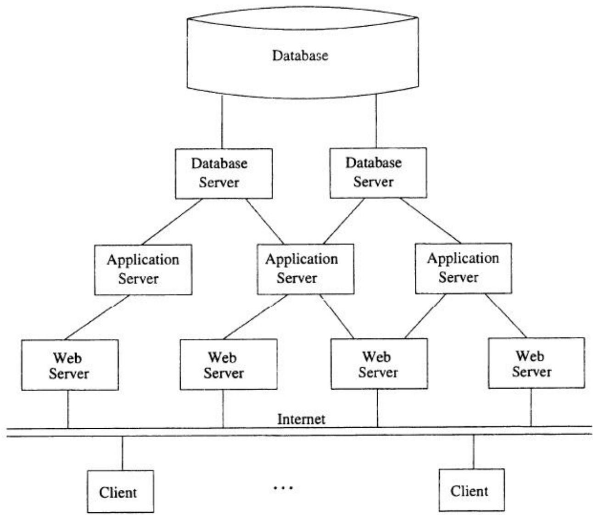
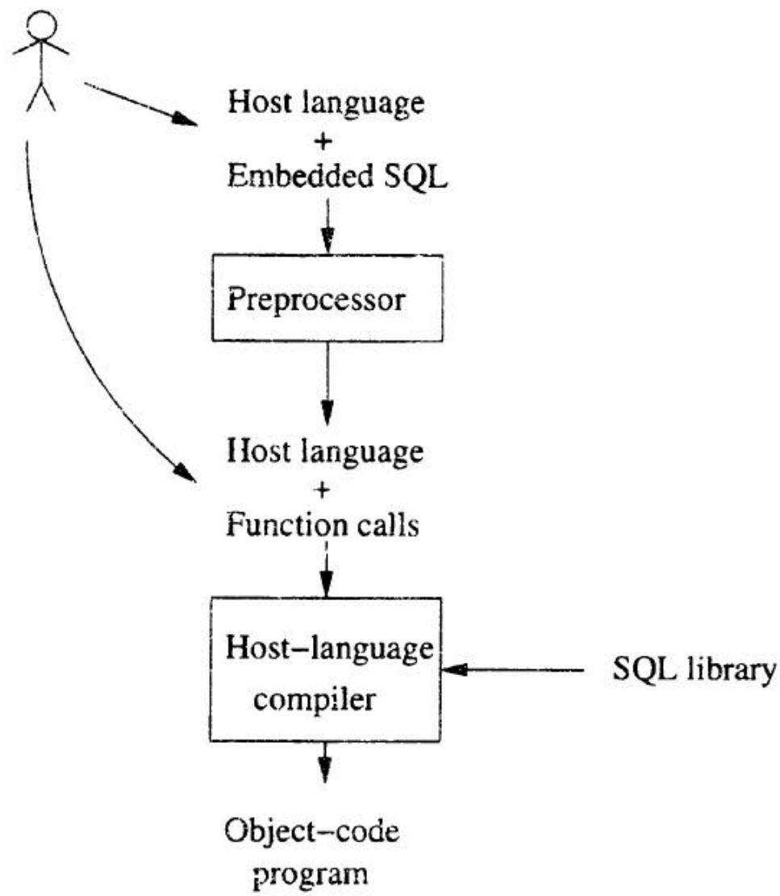
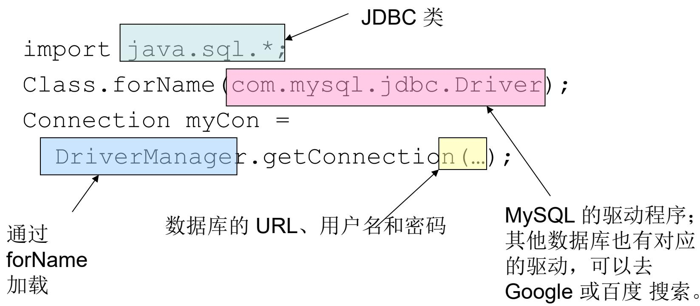
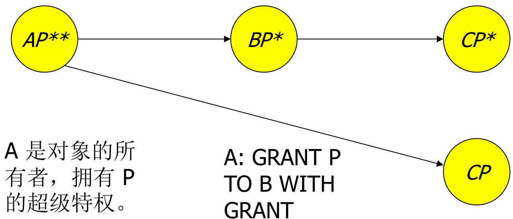
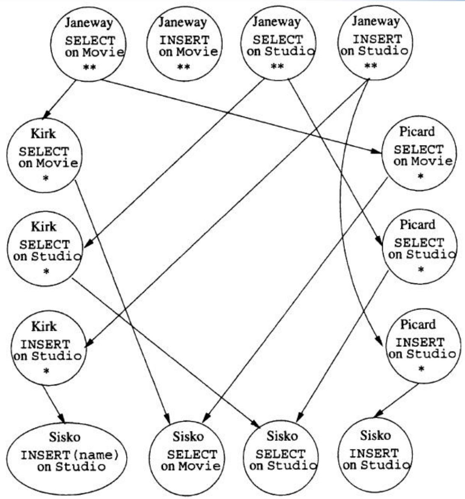
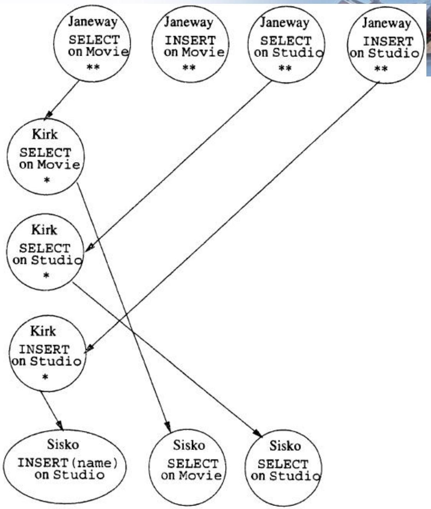

# 第6讲 服务器与安全

## 1. 三层架构 (Three-Tier Architecture)

使用数据库的常见环境通常包含三层处理器（three tiers of processors）：

1. **Web 服务器（Web servers）** — 负责与用户进行交互。
2. **应用服务器（Application servers）** — 负责执行业务逻辑（business logic）。
3. **数据库服务器（Database servers）** — 负责从数据库中获取应用服务器所需的数据（即 DBMS 层）。



---

## 2. 分布式数据库 (Distributed Database)

**集中式数据库**：所有数据存储在一台服务器上，访问速度和扩展性受限于单台机器的性能。

**分布式数据库**：将原来集中式数据库中的数据分散存储到多个通过网络连接的数据存储节点上，以获取更大的存储容量和更高的并发访问量。

- 更高的数据访问速度
- 更强的可扩展性
- 更高的并发访问量

**分类**：

| 类型                          | 说明                                       |
| ----------------------------- | ------------------------------------------ |
| **物理分布，逻辑集中** (DDBS) | Distributed Database System                |
| **物理分布，逻辑分布** (FDBS) | Federated Database System / 联邦数据库系统 |

---

## 3. SQL 服务端环境

在之前的学习中，我们探讨了 SQL 在通用查询接口中的使用方式——即坐在终端前直接向数据库发起查询。然而现实情况往往不同：通常是传统应用程序（conventional programs）在与 SQL 进行交互，主要有三种方式：

1. 使用专用语言编写的代码直接存储在数据库内部（例如：PSM, PL/SQL）。
2. 将 SQL 语句嵌入到宿主语言（host language）中（例如：C 语言中的嵌入式 SQL）。
3. 使用连接工具（Connection tools），允许传统编程语言通过接口访问数据库（例如：Call-Level Interface (CLI), JDBC, PHP/DB）。

### 3.1 嵌入式 SQL 与 CLI 的工作流对比



---

## 4. JDBC (Java 数据库连接)

Java Database Connectivity (JDBC) 是一个类似于 SQL/CLI 的库，但它的宿主语言是 Java。它与 CLI 非常相似，但存在一些差异。

### 4.1 建立连接 (Making a Connection)



### 4.2 语句对象 (Statements)

JDBC 提供了两个核心类来处理 SQL 语句：

| 类                  | 说明                                          |
| ------------------- | --------------------------------------------- |
| `Statement`         | 接收包含 SQL 语句的字符串并执行               |
| `PreparedStatement` | 预编译语句对象，关联着已准备好的特定 SQL 语句 |

`Connection` 类提供了创建 `Statement` 和 `PreparedStatement` 对象的方法：

```java
Statement stat1 = myCon.createStatement();
PreparedStatement stat2 = myCon.prepareStatement(
    "SELECT beer, price FROM Sells WHERE bar = 'Joe''s Bar'"
);
```

- 无参数的 `createStatement` 返回 `Statement` 对象
- 带 SQL 字符串参数的调用返回 `PreparedStatement` 对象

JDBC 将"查询（queries）"与"修改（modifications）"区分开来，并将修改操作统称为"更新（updates）"。

| 对象类型            | 查询方法                             | 修改方法                        |
| ------------------- | ------------------------------------ | ------------------------------- |
| `Statement`         | `executeQuery(Q)` → 返回 `ResultSet` | `executeUpdate(U)` → 不返回结果 |
| `PreparedStatement` | `executeQuery()` → 返回 `ResultSet`  | `executeUpdate()` → 不返回结果  |

### 4.3 访问结果集 (Accessing the ResultSet)

`ResultSet` 类型的对象在概念上类似于一个"游标（cursor）"。`next()` 方法将游标推进到下一个元组：

- 第一次调用 `next()` 时，获取第一个元组
- 如果没有更多元组可供读取，`next()` 将返回 `false`

通过 `getX(i)` 方法获取元组的各个分量，`i` 是分量的索引编号（从 1 开始），`X` 代表数据类型：

```java
ResultSet menu = stat2.executeQuery();
while (menu.next()) {
    theBeer = menu.getString(1);
    thePrice = menu.getFloat(2);
    // something with theBeer and thePrice
}
```

### 4.4 参数传递 (Parameter Passing)

在构建查询字符串时，使用问号 `?` 来替代查询中的参数部分。`PreparedStatement` 对象的方法 `setX(i, v)` 将变量 `v` 的值绑定到查询中的第 `i` 个参数位置。

```java
PreparedStatement studioStat =
    myCon.prepareStatement("INSERT INTO Studio(name, address) VALUES(?,?)");

// 从用户处获取 studioName='XXX' 和 studioAddr='YYY' 的值
studioStat.setString(1, studioName);
studioStat.setString(2, studioAddr);
studioStat.executeUpdate();
```

---

## 5. 存储过程 (Stored Procedures)

**PSM（Persistent Stored Modules，持久化存储模块）** 允许我们将过程（procedures）作为数据库模式元素存储起来。

- PSM = 传统控制流语句（如 `if`, `while` 等）与 SQL 语句的混合体
- 使我们能够执行单靠 SQL 无法完成的复杂逻辑操作
- 把某些 DBMS 可执行的代码放到 Data Server 端，所有客户端都可调用（Reuse）

### 5.1 基本 PSM 格式

**存储过程语法：**

```sql
CREATE PROCEDURE <name> (<parameter list>)
<optional local declarations>
<body>;
```

**函数语法：**

```sql
CREATE FUNCTION <name> (<parameter list>) RETURNS <type>
<optional local declarations>
<body>;
```

**PROCEDURE 和 FUNCTION 的区别：**

| 区别     | PROCEDURE           | FUNCTION                           |
| -------- | ------------------- | ---------------------------------- |
| 关键字   | `CREATE PROCEDURE`  | `CREATE FUNCTION`                  |
| 返回值   | 无返回值声明        | 需 `RETURNS <type>` 声明返回值类型 |
| 参数模式 | 可为 IN、OUT、INOUT | 只能是 IN 模式                     |

> **注意**：教材及 PPT 上讲到的语法，不保证能够在你的安装实例和实验环境中正确运行！！

### 5.2 参数模式 (Parameter Modes)

PSM 中参数使用"模式-名称-类型"三元组（mode-name-type triples）：

| 模式      | 说明                                                           |
| --------- | -------------------------------------------------------------- |
| **IN**    | 仅输入（input only），过程内部不能改变其值（默认模式，可省略） |
| **OUT**   | 仅输出（output only）                                          |
| **INOUT** | 既可输入也可输出（both）                                       |

**示例：**

```sql
CREATE PROCEDURE Move(
    IN oldAddr VARCHAR(255),
    IN newAddr VARCHAR(255)
)
UPDATE MovieStar
SET address = newAddr
WHERE address = oldAddr;
```

**调用存储过程：**

```sql
CALL Move('Baldwin Av', 'King St');
```

函数可以直接在 SQL 表达式中任何符合其返回类型的地方使用。

### 5.3 PSM 语句种类

| 语句                      | 说明                                                   |
| ------------------------- | ------------------------------------------------------ |
| `RETURN <表达式>`         | 设置函数的返回值（PSM 中 RETURN 不会终止函数执行流程） |
| `DECLARE <变量名> <类型>` | 声明局部变量（必须位于可执行语句之前）                 |
| `BEGIN ... END`           | 将多条语句组合成一个代码块，各语句用分号隔开           |
| `SET <变量名> = <表达式>` | 赋值语句                                               |
| `IF ... THEN ... END IF`  | 条件语句                                               |
| `LOOP ... END LOOP`       | 循环语句                                               |

**语句标签（Statement labels）：** 用"名称+冒号+语句"为语句提供标签，可配合 `LEAVE` 跳出循环：

```sql
my_loop_label: LOOP
    SET counter = counter + 1;
    IF ... THEN LEAVE my_loop_label; END IF;
END LOOP my_loop_label;
```

### 5.4 IF 语句

```sql
-- 最简单形式
IF <condition> THEN <statement(s)> END IF;

-- 带 ELSE
IF <condition> THEN <statement(s)>
ELSE <statement(s)> END IF;

-- 多个分支
IF <condition> THEN <statement(s)>
ELSEIF <condition> THEN <statement(s)>
ELSE <statement(s)> END IF;
```

**示例：** 编写函数，接收年份 `y` 和制片厂 `s`，如果该制片厂在年份 `y` 制作了至少一部喜剧电影，或者在那一年根本没有制作任何电影，则返回 `TRUE`，否则返回 `FALSE`。

```sql
CREATE FUNCTION BandW(y INT, s CHAR(15)) RETURNS BOOLEAN
IF NOT EXISTS(SELECT * FROM Movie WHERE year = y AND studioName = s)
THEN RETURN TRUE;
ELSEIF 1 <= (SELECT COUNT(*) FROM Movie WHERE year = y AND studioName = s AND genre = 'comedy')
THEN RETURN TRUE;
ELSE RETURN FALSE;
END IF;
```

### 5.5 循环 (Loops)

| 循环类型    | 语法                                                                           |
| ----------- | ------------------------------------------------------------------------------ |
| 基本循环    | `LOOP <语句序列> END LOOP;`                                                    |
| WHILE 循环  | `WHILE <condition> DO <statements> END WHILE;`                                 |
| REPEAT 循环 | `REPEAT <statements> UNTIL <condition> END REPEAT;`                            |
| FOR 循环    | `FOR <loop name> AS <cursor name> CURSOR FOR <query> DO <statements> END FOR;` |

### 5.6 游标 (Cursors)

游标（cursor）本质上是一个指向元组的指针，在查询结果集的所有元组之上进行遍历。

**声明游标：**

```sql
DECLARE c CURSOR FOR <query>;
```

**打开和关闭游标：**

```sql
OPEN c;    -- 执行查询，将结果取到缓冲区，指针指向第一条记录
CLOSE c;   -- 关闭游标
```

**提取元组：**

```sql
FETCH FROM c INTO x1, x2, ..., xn;
```

执行后，游标 `c` 会被自动移动到下一个元组。

### 5.7 打破游标循环

SQL 操作会返回一个状态码（status），是一个 5 位字符的字符串：

| SQLSTATE | 含义                                 |
| -------- | ------------------------------------ |
| `00000`  | 一切正常（Everything OK）            |
| `02000`  | 找不到元组（Failed to find a tuple） |
| `21000`  | 返回了多行（Cardinality violation）  |

在 PSM 中，可以从内置变量 `SQLSTATE` 获取这个状态值。可以声明条件（condition）来代表特定状态：

```sql
DECLARE Not_Found CONDITION FOR SQLSTATE '02000';
```

**游标循环的标准结构：**

```sql
CREATE PROCEDURE MeanVar(
    IN s CHAR(15),
    OUT mean REAL,
    OUT variance REAL
)
BEGIN
    DECLARE Not_Found CONDITION FOR SQLSTATE '02000';
    DECLARE MovieCursor CURSOR FOR
        SELECT length FROM Movie WHERE studioName = s;
    DECLARE newLength INTEGER;
    DECLARE moviecount INTEGER;

    SET mean = 0.0;
    SET variance = 0.0;
    SET moviecount = 0;

    OPEN MovieCursor;
    movieLoop: LOOP
        FETCH MovieCursor INTO newLength;
        IF Not_Found THEN LEAVE movieLoop; END IF;
        SET moviecount = moviecount + 1;
        SET mean = mean + newLength;
        SET variance = variance + newLength * newLength;
    END LOOP;
    CLOSE MovieCursor;

    SET mean = mean / moviecount;
    SET variance = variance / moviecount - mean * mean;
END;
```

**使用 FOR 循环的简化版本：**

```sql
CREATE PROCEDURE MeanVar(
    IN s CHAR(15),
    OUT mean REAL,
    OUT variance REAL
)
BEGIN
    DECLARE moviecount INTEGER;
    SET mean = 0.0;
    SET variance = 0.0;
    SET moviecount = 0;

    FOR movieLoop AS MovieCursor CURSOR FOR
        SELECT length FROM Movie WHERE studioName = s
    DO
        SET moviecount = moviecount + 1;
        SET mean = mean + length;
        SET variance = variance + length * length;
    END FOR;

    SET mean = mean / moviecount;
    SET variance = variance / moviecount - mean * mean;
END;
```

### 5.8 PSM 中的查询

在 PSM 中使用 SELECT-FROM-WHERE 查询的方式：

1. **子查询**：可以用在条件判断中，或 SQL 中任何允许使用子查询的地方
2. **赋值语句右值**：生成单个值的查询可作为赋值语句的右值
3. **SELECT INTO**：单行选择语句，将返回的单个元组各分量存入变量
4. **游标**：使用游标遍历多行结果

```sql
-- SELECT INTO 示例
CREATE PROCEDURE SomeProc(IN studioName CHAR(15))
BEGIN
    DECLARE presNetWorth INTEGER;
    SELECT netWorth INTO presNetWorth
    FROM Studio, MovieExec
    WHERE presC# = cert# AND Studio.name = studioName;
END;
```

> **注意**：SELECT INTO 只能返回单行！零行或两行以上数据，程序会报错崩溃！

### 5.9 异常处理 (Exception Handling)

SQL 系统在 `SQLSTATE` 变量中指示错误条件。可以声明一段代码作为异常处理器（exception handler）。

**处理程序动作：**

| 动作       | 说明                                                    |
| ---------- | ------------------------------------------------------- |
| `CONTINUE` | 继续执行引发异常的语句的下一条语句                      |
| `EXIT`     | 离开声明了该处理程序的 BEGIN…END 块                     |
| `UNDO`     | 与 EXIT 类似，但该代码块视为一个事务，因异常而中止/回滚 |

**语法：**

```sql
DECLARE <action> HANDLER FOR <condition list> <statement>;
```

**示例：**

```sql
CREATE FUNCTION GetYear(t VARCHAR(255)) RETURNS INTEGER
BEGIN
    DECLARE Not_Found CONDITION FOR SQLSTATE '02000';
    DECLARE Too_Many CONDITION FOR SQLSTATE '21000';
    DECLARE EXIT HANDLER FOR Not_Found, Too_Many RETURN NULL;

    RETURN (SELECT year FROM Movie WHERE title = t);
END;
```

---

## 6. SQL 中的安全与用户授权

### 6.1 完整性与安全性的区别

| 概念           | 说明                                                 | 防范对象                                     |
| -------------- | ---------------------------------------------------- | -------------------------------------------- |
| **数据完整性** | 防止数据库中存在不符合语义的数据，即防止不正确的数据 | 不合语义的、不正确的数据（合法用户的误操作） |
| **数据安全性** | 保护数据库防止恶意的破坏和非法的存取                 | 非法用户和非法操作                           |

### 6.2 权限 (Privileges)

SQL 识别了一套比典型文件系统更为详尽精细的权限集合，共九种：

| 权限                                 | 说明                                                          |
| ------------------------------------ | ------------------------------------------------------------- |
| **SELECT** [ON 关系 \| 属性列表]     | 查询该关系的权利，可限制在指定属性上                          |
| **INSERT** [ON 关系 \| 属性列表]     | 插入元组的权利，可仅适用于部分属性（其他属性取默认值或 NULL） |
| **DELETE**                           | 删除元组的权利                                                |
| **UPDATE** [ON 关系 \| 属性列表]     | 更新元组的权利，可仅适用于部分属性                            |
| **REFERENCES** [ON 关系 \| 属性列表] | 在外键约束等条件中被引用的权利                                |
| **USAGE** [关系和断言以外的模式元素] | 在用户自己的声明中使用该元素的权利                            |
| **TRIGGER** [ON 关系]                | 在该关系表上定义触发器的权利                                  |
| **EXECUTE**                          | 执行代码的权利（如 PSM 存储过程或函数）                       |
| **UNDER**                            | 创建给定类型的子类型（subtype）的权利                         |

**示例：** 执行以下 SQL 需要哪些权限？

```sql
INSERT INTO Studio(name)
SELECT DISTINCT studioName
FROM Movies
WHERE studioName NOT IN (SELECT name FROM Studio);
```

需要：

- `Movies` 表上的 `SELECT` 权限
- `Studio` 表上的 `SELECT` 权限（用于子查询）
- `Studio` 表上的 `INSERT` 权限（或至少是 `INSERT(name)` 权限）

### 6.3 数据库对象与视图访问控制

存在权限依附的数据库对象包括存储的基表（stored tables）和视图（views）。视图构成了访问控制（access control）的重要工具。

**示例：** 不希望用户拥有 `Emps(name, addr, salary)` 表（含敏感薪水字段）上的全局 `SELECT` 权限，可以创建视图：

```sql
CREATE VIEW SafeEmps AS
SELECT name, addr FROM Emps;
```

对 `SafeEmps` 的查询不需要拥有底层基表 `Emps` 上的 `SELECT` 权限，只需要 `SafeEmps` 视图上的权限即可。

### 6.4 所有权 (Ownership)

某个对象（如表、视图、触发器等）的 owner，自动拥有与该对象相关的所有权限。

所有权（ownership）确立的三个时间点：

- 当创建一个模式（schema）时
- 当通过带有 `AUTHORIZATION userName` 的 `CONNECT` 语句发起建立一个会话（session）时
- 当使用 `AUTHORIZATION userName` 创建一个模块（module）时

**授权标识符（Authorization ID）：** 用户通过授权 ID 被系统识别，通常就是登录名。系统中存在一个特殊的内置授权 ID：`PUBLIC`——将权限授予 `PUBLIC` 意味着该权限可供任何授权 ID 使用。

### 6.5 授权图 (Grant Diagrams)

授权图是一种图形化的用户间权限传递表示方法。

**节点（Nodes）：** 代表用户/权限/是否拥有转授选项/是否是所有者。

| 节点表示 | 说明                                 |
| -------- | ------------------------------------ |
| `AP`     | 授权 ID A 拥有权限 P                 |
| `P*`     | 带有转授选项（grant option）的权限 P |
| `P**`    | 权限 P 的源头，即所有者（Owner）     |

> **注意**：`**` 符号在逻辑上自然蕴含了 `*`（grant option）。`UPDATE ON R`、`UPDATE(a) ON R` 和 `UPDATE(b) ON R` 是不同的权限。

**有向边（Edge）：** `X → Y` 表示节点 X 被用来向节点 Y 授予了权限。

**根本原则（Fundamental rule）：** 只要图中存在一条从任意源头节点 `XP**` 指向目标节点 `CQ`、`CQ*` 或 `CQ**` 的路径，并且权限 P 是权限 Q 的超权限（superprivilege），那么用户 C 就拥有权限 Q。

**示例授权图：**



设定：用户 Janeway 是 MovieSchema 的所有者（Owner），包含表 Movies 和 Studio：

```sql
-- Janeway 授予 Kirk 和 Picard 权限（带 GRANT OPTION）
GRANT SELECT, INSERT ON Studio TO kirk, picard WITH GRANT OPTION;
GRANT SELECT ON Movies TO kirk, picard WITH GRANT OPTION;

-- Picard 转授给 Sisko
GRANT SELECT, INSERT ON Studio TO sisko;
GRANT SELECT ON Movies TO sisko;

-- Kirk 转授给 Sisko（部分权限）
GRANT SELECT, INSERT(name) ON Studio TO sisko;
GRANT SELECT ON Movies TO sisko;
```



**撤销权限（REVOKE）：**

```sql
REVOKE <权限列表> ON <关系或其他对象> FROM <授权ID列表>;
```

撤销选项：

| 选项                 | 说明                                                         |
| -------------------- | ------------------------------------------------------------ |
| **CASCADE**（级联）  | 被撤销者之前进一步授权的任何权限也都不再有效，无论传递了多深 |
| **RESTRICT**（限制） | 如果该权限已经被转授给其他人，REVOKE 操作将直接报错并失败    |

**撤销示例：**

```sql
-- Janeway 执行级联撤销
REVOKE SELECT, INSERT ON Studio FROM picard CASCADE;
REVOKE SELECT ON Movies FROM picard CASCADE;
```



撤销后：

- Picard 失去权限（级联效应，切断了 BP* → CP*）
- Sisko 依然保留不带转授选项的 `INSERT(name)` 和 `SELECT` 权限（因为存在来自 Kirk 的独立授权路径）

---

## 课后作业

- 习题 9.4.1
- 习题 10.1.1
- 习题 10.1.2
- 习题 10.1.3
- 习题 10.1.4

---

_第6讲 完_
