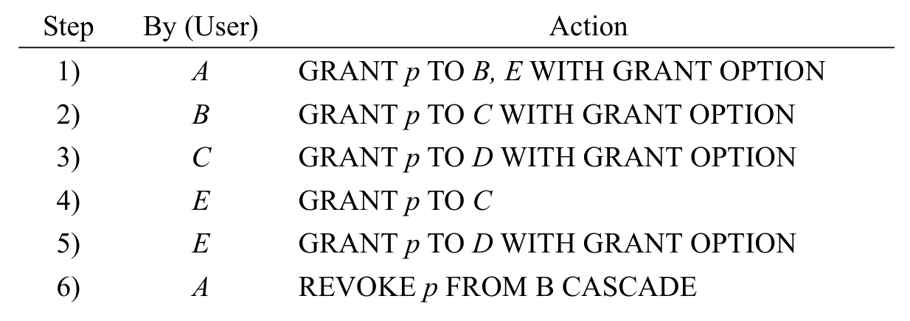
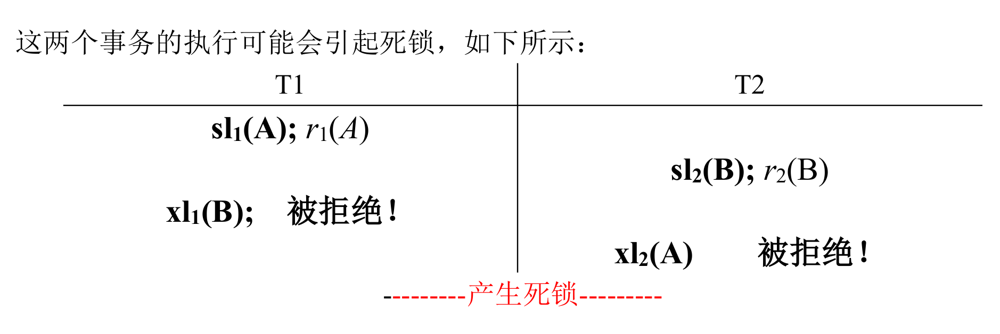
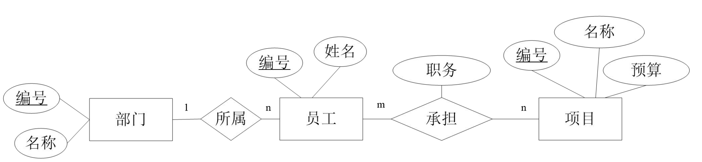
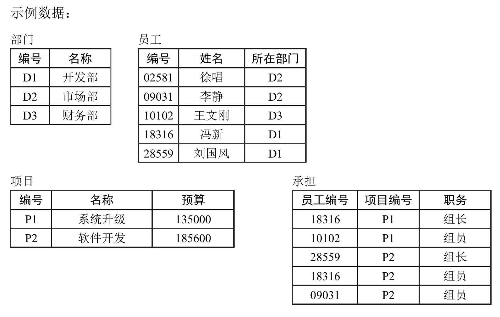

# 二、关系代数（5 分）
11.设“电影”数据库的关系模式如下：

写出完成下列查询的关系代数表达式。
(1) 查询影星“Harrison Ford”所出演的电影的名称。（2 分）
```SQL
SELECT s.movieTitle
FROM StarsIn AS s
WHERE s.starName = 'Harrison Ford'
```

$S:=StartsIn$
$Result:=\pi_{movieTitle}(\sigma_{S.starName='Harrison Ford'}(S))$

(2) 查询出演了两部及两部以上电影的影星的姓名和住址。（3 分）

```SQL
--- 1
SELECT DISTINCT m.name, m.address
FROM MovieStar m, StarsIn s1, StarsIn s2
WHERE m.name = s1.starName 
  AND s1.starName = s2.starName
  AND (s1.movieTitle <> s2.movieTitle OR s1.movieYear <> s2.movieYear);
  
--- 2
SELECT name, address
FROM MovieStar
WHERE name IN (
    SELECT starName
    FROM StarsIn
    GROUP BY starName
    HAVING COUNT(*) >= 2
);
```
$$C:=S1.starName=S2.starName AND (S1.movieTitle \neq S2.movieTitle OR S1.movieYear \neq S2.movieYear$$
$$R_1:=\rho_{S_1}(StarsIn) \bowtie_{C} \rho_{S_2}(StarsIn)$$
$$R_2:=MovieStar \bowtie_{MovieStar.name=R1.starName} R1$$
$$R_3:=\pi_{name,address}(R_2)$$
# 三、SQL (20 分)

12. 设“学校教务管理”数据库中有如下 4 张表:

### 学生表 Student

| sno   | sname | sgender | sbirth     | sdept |
| :---- | :---- | :------ | :--------- | :---- |
| 08001 | 张三  | 男      | 1988-02-19 | CS    |
| 08002 | 李四  | 女      | 1989-01-09 | CS    |
| 08003 | 王五  | 女      | 1990-12-08 | CE    |
| 08004 | 赵六  | 男      | 1989-08-30 | IS    |

### 教师表 Teacher

| tno   | tname  | tdept |
| :---- | :----- | :---- |
| 05001 | 张小明 | CS    |
| 05002 | 王小华 | IS    |
| 05003 | 李小强 | CS    |
| 05004 | 赵小兰 | CE    |

### 课程表 Course

| cno | cname  | ccredit | tno   |
| :-- | :----- | :------ | :---- |
| 1   | 高等数学 | 4       | 05003 |
| 2   | 数据库原理 | 5       | 05003 |
| 3   | 操作系统 | 3       | 05001 |
| 4   | 信息系统 | 4       | 05002 |

### 学生选课表 SC

| sno   | cno | score |
| :---- | :-- | :---- |
| 08001 | 1   | 92    |
| 08001 | 2   | 85    |
| 08001 | 3   | 88    |
| 08002 | 2   | 90    |
| 08002 | 3   | 80    |

### 属性说明如下:

Student 表: sno 学生编号、sname 学生姓名、sgender 性别、sbirth 出生日期、sdept 学生所在系别；
Teacher 表: tno 教师编号、tname 教师姓名、tdept 教师所在系别；
Course 表: cno 课程编号、cname 课程名称、ccredit 课程学分、tno 任课教师编号；
SC 表: sno 学生编号、cno 课程编号、score 课程成绩。

编写 SQL 语句完成下列查询:
### (1) 列出选课人数大于等于 2 的课程的编号及选课人数，并按课程编号的升序排序 (将选课人数列命名为 cnt)。(5 分)

```sql
SELECT cno,cnt
```

**该查询的结果应为：**

| cno | cnt |
| :-- | :-- |
| 2   | 2   |
| 3   | 2   |

---

### (2) 查询选修 “数据库原理” 的学生的学号、姓名和系别。(5 分)


**该查询的结果应为：**

| sno   | sname | sdept |
| :---- | :---- | :---- |
| 08001 | 张三  | CS    |
| 08002 | 李四  | CS    |

---

### (3) 完成下列更新操作: (5 分)

#### a) 开设一门新课程 (5, '高级数据库', 2, '05004')


#### b) 将 “高级数据库” 课程的学分更改为原来的 1.5 倍


#### c) 将 “赵小兰” 为任课教师的课程删除


---

### (4) 查询选修了全部课程的学生的学号和姓名。(5 分)


**该查询的结果应为：**

空

---

# 四 规范化理论
13. Consider a relation R(A, B, C, D) with FD’s B→C and B→D. Decompose R into a set of relations that are all in BCNF. 要求：写出解题过程。（5 分）
1.键AB
2.判断违反BCNF
B->C
B->D
都违反 B不是超键
3.分解B->C
R1 BC 符合BCNF
R2 B U （R-C）= ABD B->D 不符合BCNF
再分解 B->D
R3 BD
R4 AB
都满足BCNF

分解结果 BC BD AB


14. Let a relation R(A, B, C, D) be decomposed into relations with the following three sets of attributes: {A, D}, {A, C}, and {B, C, D}, and the FD’s A→B, B→C and CD→A hold in R. Use the chase test to tell whether the decomposition of R is lossless. 要求：写出解题过程。（5 分）

| 子模式               | A     | B       | C     | D     |
| :---------------- | :---- | :------ | :---- | :---- |
| $S_1 \{A, D\}$    | $a$   | $b_{1}$ | $c_1$ | $d$   |
| $S_2 \{B, C, D\}$ | $a_1$ | $b$     | $c$   | $d$   |
| $S_3 \{A, C\}$    | $a$   | $b_{2}$ | $c$   | $d_1$ |

| 子模式               | A     | B       | C     | D     |
| :---------------- | :---- | :------ | :---- | :---- |
| $S_1 \{A, D\}$    | $a$   | $b_{1}$ | $c_1$ | $d$   |
| $S_2 \{B, C, D\}$ | $a_1$ | $b$     | $c$   | $d$   |
| $S_3 \{A, C\}$    | $a$   | $b_{1}$ | $c$   | $d_1$ |

| 子模式               | A     | B       | C   | D     |
| :---------------- | :---- | :------ | :-- | :---- |
| $S_1 \{A, D\}$    | $a$   | $b_{1}$ | $c$ | $d$   |
| $S_2 \{B, C, D\}$ | $a_1$ | $b$     | $c$ | $d$   |
| $S_3 \{A, C\}$    | $a$   | $b_{1}$ | $c$ | $d_1$ |

| 子模式               | A   | B       | C   | D     |
| :---------------- | :-- | :------ | :-- | :---- |
| $S_1 \{A, D\}$    | $a$ | $b_{1}$ | $c$ | $d$   |
| $S_2 \{B, C, D\}$ | $a$ | $b$     | $c$ | $d$   |
| $S_3 \{A, C\}$    | $a$ | $b_{1}$ | $c$ | $d_1$ |
# 五 问答题（30 分）
## 授权图
假设用户A 是权限p 对应关系的所有者（owner），请给出顺序执行完步骤6) 之后的最终的授权图（grant diagrams）。（6 分）

第5步之后

Ap**->Bp*->Cp*->Dp*
|
Ep*->Cp

Ep*->Dp*

第6步之后

Ap**
|
Ep*->Cp

Ep*->Dp*

## 触发器
在SQL Server 2008 的某数据库中建立表T，其两个属性a 和b 均为INT 类型，表T 只有一行元组，其初始值为：

| a   | b   |
| --- | --- |
| 1   | 1   |

在表T 上定义如下触发器：

```sql
CREATE TRIGGER TR
ON T FOR UPDATE
AS
DECLARE @a INT, @b INT
-- 定义变量@a 和@b
SELECT @a = a, @b = b FROM T
-- 将属性a 的值赋给变量@a
IF @b < 60 UPDATE T SET a = @b, b = @a+@b
```

数据库允许触发器递归调用，即触发器中的语句可以激发该触发器的再次执行。
请问：
(1) 执行SQL 语句UPDATE T SET a = 1 之后，触发器TR 被调用了多少次？
(2) 属性a 和b 的最终值是多少？
要求：写出分析与解题过程。（6 分）

| a   | b   | @a  | @b  |
| --- | --- | --- | --- |
| 1   | 1   | 1   | 1   |
| 1   | 2   | 1   | 1   |
| 2   | 3   | 1   | 2   |
| 3   | 5   | 2   | 3   |
| 5   | 8   | 3   | 5   |
| 8   | 13  | 5   | 8   |
| 13  | 21  | 8   | 13  |
| 21  | 34  | 13  | 21  |
| 34  | 55  | 21  | 34  |
| 55  | 89  | 34  | 55  |
10次
## 并发控制
17. 考虑下面两个事务
T1:r1(A);r1(B);IF A = 1 THEN B:=B+10;w1(B)
T2:r2(B);r2(A);IF B = 2 THEN A:=A * B;w2(A)
给事务T1 和T2 增加加锁（共享锁sli(X)或排他锁xli(X)）和解锁指令ui(X)，使它们遵循两阶段封锁协议。这两个事务的执行会引起死锁吗？（6 分）

T1:sli(A) r1(A); xli(B) r1(B);w1(B) ui(A) ui(B)
T2:sli(B) r2(B); xli(A) r2(A) w2(A) ui(A) ui(B)

会



## 冲突可串行化
18. 对如下调度：
r1(A); r3(B); w3(B); r2(B); r2(A); w2(B); r1(B);w1(A)
回答问题：
调度是冲突可串行化的吗？如果是，给出其等价的串行调度。
要求：写出分析与解题过程。（6 分）

T2->T1
T3->T2
T3->T1

T3->T2->T1

r3(B) w3(B) r2(B) r2(A) w2(B) r1(A) w1(A)

## Undo/Redo日志
19.下面是两个事务T1 和T2 的一系列Undo/Redo 日志记录：
<START T2>
<T2, A, 10, 11>
<START T1>
<T1, B, 20, 21>
<T2, C, 30, 31>
<T1, D, 40, 41>
<COMMIT T1>
请描述DBMS 恢复子系统的行为，包括对磁盘和日志所做的更改。
要求：写出分析与解题过程。（6 分）

DBMS 恢复子系统的行为可概括为:
a) Undo 故障发生时未完成的事务
b) Redo 故障发生时已完成的事务
具体如下：
1）扫描日志文件，识别故障发生前已经提交的事务T1，构建重做(REDO)事务队列；识别故障发生前未提交的事务T2，构建重撤销（UNDO)事务队列
2）正向扫描日志文件，重做T1 涉及的操作：将数据库元素B 写为21，数据库元素D 写为41。
3）反向扫描日志文件，撤销T2 事务涉及的数据库更改：将数据库元素C 写为30，将数据库元素A 写为10。
4）在日志文件中追加<ABORT T2> 记录。
# 六、数据库设计（15 分）
20. 请为某软件公司项目管理系统设计后台数据库，需求如下：
a) 该软件公司有若干部门，部门的属性：编号、名称；
b) 每个部门有若干员工，员工的属性：编号、姓名；
c) 公司执行多个项目，项目的属性：编号、名称、预算；
d) 每个员工只能属于一个部门；
e) 每个项目由若干员工承担，一个员工可承担若干项目；
(1) 根据需求画出该项目管理系统数据库的E/R 图。（5 分）

(2) 将你画的ER 图转换为CREATE TABLE 语句并插入数据。
要求：
a) CREATE TABLE 语句中要求施加表级的主键和外键约束；
b) 约束项目预算属性必须大于0。
c) 编写INSERT INTO 语句将如下示例数据插入到创建的表中。
（5 分）

创建表
```sql
--- 部门表
CREATE TABLE Dept(
	dno VARCHAR(50)
	dname VARCHAR(50) NOT NULL
	
	CONSTRAINT pk_dno
		PRIMARY KEY (dno)
);
--- 员工表
CREATE TABLE employee(
	eno INT
	ename VARCHAR(50) NOT NULL
	dno VARCHAR(50)
	
	CONSTRAINT pk_eno
		PRIMARY KEY (eno)
		
	CONSTRAINT fk_dno
		FOREIGN KEY (dno)
		REFERENCES Dept(dno)
);
--- 项目表
CREATE TABLE project(
	pno VARCHAR(50)
	pname VARCHAR(50) NOT NULL
	pmoney INT NOT NULL
	
	CONSTRAINT pk_pno
		PRIMARY KEY (pno)
)
--- 承担表
CREATE TABLE responsible(
	eno INT
	pno VARCHAR(50)
	zhiwu VARCHAR(50)
	
	CONSTRAINT pk_res
        PRIMARY KEY (eno, pno),
    
    CONSTRAINT fk_eno
        FOREIGN KEY (eno)
        REFERENCES employee(eno),

    CONSTRAINT fk_pno
        FOREIGN KEY (pno)
        REFERENCES project(pno)
)
```
插入数据
```sql
INSERT INTO Dept VALUES ('D1','开发部');
INSERT INTO Dept VALUES ('D2','市场部');
INSERT INTO Dept VALUES ('D3','开发部');

INSERT INTO employee VALUES ('')
...
```
(3) 编写SQL 完成下列任务：（5 分）
a) 创建一个视图。该视图包括：员工编号、姓名、以及该员工所承担的项目的
编号和名称。该视图是可更新的吗？为什么？
b) 在承担表的员工编号上创建一个索引。创建该索引的目的是什么？
```sql
--- 创建视图
CREATE VIEW emprj AS
SELECT 
FROM 
--- 创建索引
```