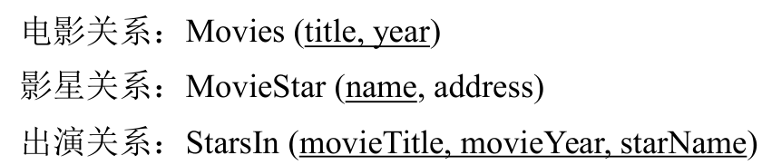

# 二、关系代数（5 分）
11.设“电影”数据库的关系模式如下：

写出完成下列查询的关系代数表达式。
(1) 查询影星“Harrison Ford”所出演的电影的名称。（2 分）
```SQL
SELECT s.movieTitle
FROM StarsIn AS s
WHERE s.starName = 'Harrison Ford'
```

$S:=StartsIn$
$Result:=\pi_{movieTitle}(\sigma_{S.starName='Harrison Ford'}(S))$

(2) 查询出演了两部及两部以上电影的影星的姓名和住址。（3 分）

```SQL
--- 1
SELECT DISTINCT m.name, m.address
FROM MovieStar m, StarsIn s1, StarsIn s2
WHERE m.name = s1.starName 
  AND s1.starName = s2.starName
  AND (s1.movieTitle <> s2.movieTitle OR s1.movieYear <> s2.movieYear);
  
--- 2
SELECT name, address
FROM MovieStar
WHERE name IN (
    SELECT starName
    FROM StarsIn
    GROUP BY starName
    HAVING COUNT(*) >= 2
);
```
$$C:=S1.starName=S2.starName AND (S1.movieTitle \neq S2.movieTitle OR S1.movieYear \neq S2.movieYear$$
$$R_1:=\rho_{S_1}(StarsIn) \bowtie_{C} \rho_{S_2}(StarsIn)$$
$$R_2:=MovieStar \bowtie_{MovieStar.name=R1.starName} R1$$
$$R_3:=\pi_{name,address}(R_2)$$
# 三、SQL (20 分)

12. 设“学校教务管理”数据库中有如下 4 张表:

### 学生表 Student

| sno   | sname | sgender | sbirth     | sdept |
| :---- | :---- | :------ | :--------- | :---- |
| 08001 | 张三  | 男      | 1988-02-19 | CS    |
| 08002 | 李四  | 女      | 1989-01-09 | CS    |
| 08003 | 王五  | 女      | 1990-12-08 | CE    |
| 08004 | 赵六  | 男      | 1989-08-30 | IS    |

### 教师表 Teacher

| tno   | tname  | tdept |
| :---- | :----- | :---- |
| 05001 | 张小明 | CS    |
| 05002 | 王小华 | IS    |
| 05003 | 李小强 | CS    |
| 05004 | 赵小兰 | CE    |

### 课程表 Course

| cno | cname  | ccredit | tno   |
| :-- | :----- | :------ | :---- |
| 1   | 高等数学 | 4       | 05003 |
| 2   | 数据库原理 | 5       | 05003 |
| 3   | 操作系统 | 3       | 05001 |
| 4   | 信息系统 | 4       | 05002 |

### 学生选课表 SC

| sno   | cno | score |
| :---- | :-- | :---- |
| 08001 | 1   | 92    |
| 08001 | 2   | 85    |
| 08001 | 3   | 88    |
| 08002 | 2   | 90    |
| 08002 | 3   | 80    |

### 属性说明如下:

Student 表: sno 学生编号、sname 学生姓名、sgender 性别、sbirth 出生日期、sdept 学生所在系别；
Teacher 表: tno 教师编号、tname 教师姓名、tdept 教师所在系别；
Course 表: cno 课程编号、cname 课程名称、ccredit 课程学分、tno 任课教师编号；
SC 表: sno 学生编号、cno 课程编号、score 课程成绩。

编写 SQL 语句完成下列查询:
### (1) 列出选课人数大于等于 2 的课程的编号及选课人数，并按课程编号的升序排序 (将选课人数列命名为 cnt)。(5 分)

```sql
SELECT cno,cnt
```

**该查询的结果应为：**

| cno | cnt |
| :-- | :-- |
| 2   | 2   |
| 3   | 2   |

---

### (2) 查询选修 “数据库原理” 的学生的学号、姓名和系别。(5 分)


**该查询的结果应为：**

| sno   | sname | sdept |
| :---- | :---- | :---- |
| 08001 | 张三  | CS    |
| 08002 | 李四  | CS    |

---

### (3) 完成下列更新操作: (5 分)

#### a) 开设一门新课程 (5, '高级数据库', 2, '05004')


#### b) 将 “高级数据库” 课程的学分更改为原来的 1.5 倍


#### c) 将 “赵小兰” 为任课教师的课程删除


---

### (4) 查询选修了全部课程的学生的学号和姓名。(5 分)


**该查询的结果应为：**

空

---

# 四 规范化理论
13. Consider a relation R(A, B, C, D) with FD’s B→C and B→D. Decompose R into a set of relations that are all in BCNF. 要求：写出解题过程。（5 分）
键AB

14. Let a relation R(A, B, C, D) be decomposed into relations with the following three sets of attributes: {A, D}, {A, C}, and {B, C, D}, and the FD’s A→B, B→C and CD→A hold in R. Use the chase test to tell whether the decomposition of R is lossless. 要求：写出解题过程。（5 分）