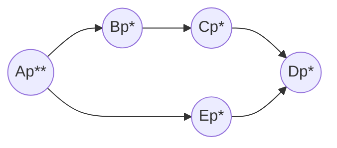
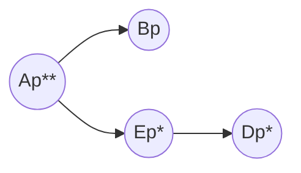
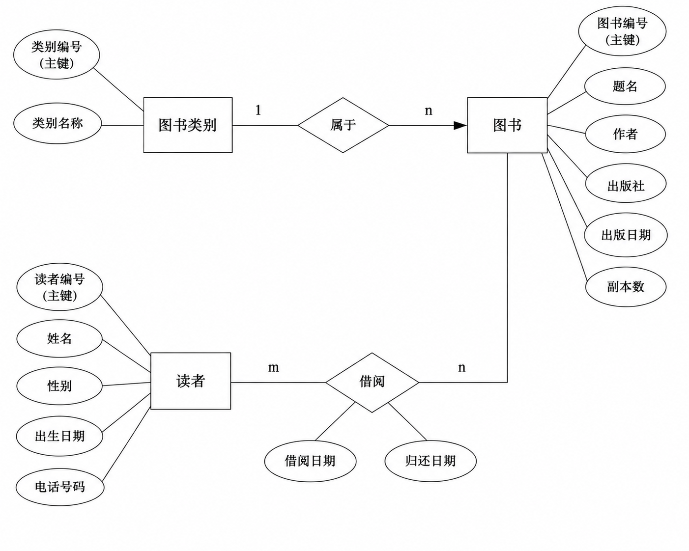

# 二 SQL语句
11.设 “学生 - 选课” 数据库中有如下 4 张表：
### 学生表 student

| **sno** | **sname** | **sgender** | **sbirth** | **sdept** |
| ------- | --------- | ----------- | ---------- | --------- |
| 08001   | 张三        | 男           | 1988-02-19 | CS        |
| 08002   | 李四        | 女           | 1989-01-09 | CS        |
| 08003   | 王五        | 女           | 1990-12-08 | CE        |
| 08004   | 赵六        | 男           | 1989-08-30 | IS        |
sno 学生编号、sname 学生姓名、sgender 性别、sbirth 出生日期、sdept 学生所在系别；

---

### 教师表 teacher

|**tno**|**tname**|**tdept**|
|---|---|---|
|05001|张小明|CS|
|05002|王小华|IS|
|05003|李小强|CS|
|05004|赵小兰|CE|
tno 教师编号、tname 教师姓名、tdept 教师所在系别；

---

### 课程表 course

|**cno**|**cname**|**ccredit**|**tno**|
|---|---|---|---|
|1|高等数学|4|05003|
|2|数据库原理|5|05003|
|3|操作系统|3|05001|
|4|信息系统|4|05002|
cno 课程编号、cname 课程名称、ccredit 课程学分、tno 任课教师编号；

---

### 学生选课表 sc

| **sno** | **cno** | **score** |
| ------- | ------- | --------- |
| 08001   | 1       | 92        |
| 08001   | 2       | 85        |
| 08001   | 3       | 88        |
| 08002   | 2       | 90        |
| 08002   | 3       | 80        |
sno 学生编号、cno 课程编号、score 课程成绩。

--- 

编写 SQL 语句完成下列题目：
(1) 列出最高成绩大于 85 的课程的编号、名称及最高成绩，并按课程编号的降序排序（将最高成绩列命名为 max_score）。(3 分)

```SQL
SELECT course.cno, cname, MAX(score) AS max_score
FROM course JOIN sc ON course.cno = sc.cno
GROUP BY course.cno, cname
HAVING MAX(score) > 85
ORDER BY course.cno DESC;
```

```SQL
SELECT c.cno, c.cname, MAX(s.score) AS max_score
FROM course AS c, sc AS s
WHERE c.cno = s.cno
GROUP BY c.cno, c.cname
HAVING MAX(s.score) > 85
ORDER BY c.cno DESC;
```


(2) 查询选修了 “高等数学” 的学生的学号、姓名和系别，要求使用 INNER
JOIN … ON 关键字构造的连接查询实现。(3 分)

```SQL
SELECT s.sno, s.sname, s.sdept
FROM student AS s
INNER JOIN sc ON s.sno = sc.sno
INNER JOIN course AS c ON sc.cno = c.cno
WHERE c.cname = '高等数学';
```

(3) 查询选修了全部课程的学生的学号和姓名。(4 分)

```SQL
SELECT s.sno, s.sname
FROM student AS s
WHERE NOT EXISTS ( 
-- 1. 找出一门课 
	SELECT * 
	FROM course AS c 
	WHERE NOT EXISTS ( 
	-- 2. 检查这个学生是否选了这门课 
		SELECT * 
		FROM sc 
		WHERE sc.sno = s.sno AND sc.cno = c.cno 
	) 
);
```

# 三 关系代数
12.假设某数据库中有如下关系：
电影关系：Movies (title, year)
影星关系：MovieStar (name, address)
出演关系：StarsIn (movieTitle, movieYear, starName)
用关系代数写出下列查询.
(1) 约束条件：属性 name 是影星关系的主关键词.（4 分）
(2) 写出关系代数表达式：查询出演了两部及以上电影的影星的姓名。（4 分）

---

### (1) 约束条件：name 是主关键词

主键约束要求在 $MovieStar$ 关系中，不能存在 `name` 相同但 `address` 不同的元组。

1. $MS1 := MovieStar$
2. $MS2 := \rho_{MS2(name, address2)}(MovieStar)$
3. $Conflict := \sigma_{MS1.name = MS2.name \wedge MS1.address \neq MS2.address2} (MS1 \times MS2)$
4. **约束：** $Conflict = \emptyset$

---

### (2) 查询出演了两部及以上电影的影星姓名

通过将出演关系与其自身进行连接，筛选出同一影星关联了两部不同电影的情况。

1. $S1 := StarsIn$
2. $S2 := StarsIn$
3. $Joint := S1 \bowtie_{S1.starName = S2.starName} S2$
4. $TwoOrMore := \sigma_{S1.movieTitle \neq S2.movieTitle \vee S1.movieYear \neq S2.movieYear} (Joint)$
5. $Result := \pi_{S1.starName} (TwoOrMore)$

**解析：**

* 在第 4 步中，使用 $\vee$（或）连接电影标题和年份的差异，是因为只有当标题和年份**都相同**时才被视为同一部电影。只要其中一个属性不同，就代表该影星至少出演了两部不同的电影。

# 四、规范化理论（12 分）
## 无损连接与追逐测试
Let a relation $R (A, B, C, D)$ be decomposed into relations with the following three sets of attributes: ${A, D}, {B, C, D}$, and ${A, C}$, and the $FD’s A→B, B→C$, and $CD→A$ hold in $R$. Use the chase test to tell whether the decomposition of $R$ is lossless. 要求：写出解题过程。（6 分）
### 1. 构造初始表格 (Initial Tableau)

根据原关系 $R(A, B, C, D)$ 的属性构造列，根据分解后的子模式 $S_1, S_2, S_3$ 构造行。

- **填充规则**：如果属性在子模式中，填入 $a$ 系列符号（代表已知）；如果不在，填入 $b$ 系列符号（代表未知）。

| 子模式               | A     | B       | C     | D     |
| :---------------- | :---- | :------ | :---- | :---- |
| $S_1 \{A, D\}$    | $a$   | $b_{1}$ | $c_1$ | $d$   |
| $S_2 \{B, C, D\}$ | $a_1$ | $b$     | $c$   | $d$   |
| $S_3 \{A, C\}$    | $a$   | $b_{2}$ | $c$   | $d_1$ |

### 2. 应用函数依赖 (FD) 进行追逐

通过给定的 FD 集 ${A \to B, B \to C, CD \to A}$ 反复更新表格。目标是看能否推导出**全为 $a$ 的一行**。

**第一步：应用 $A \to B$** 检查表格中 $A$ 列值相同的行。第 1 行和第 3 行在 $A$ 列都是 $a$。 根据 $A \to B$，这两行的 $B$ 列值必须相等。我们将 $b_{12}$ 和 $b_{32}$ 统一，记为 $b_1$。

| 子模式   | A       | B         | C       | D       |
| :---- | :------ | :-------- | :------ | :------ |
| $S_1$ | $a$     | **$b_1$** | $c_{1}$ | $d$     |
| $S_2$ | $a_{1}$ | $b$       | $c$     | $d$     |
| $S_3$ | $a$     | **$b_1$** | $c$     | $d_{1}$ |


**第二步：应用 $B \to C$** 检查 $B$ 列。现在第 1 行和第 3 行在 $B$ 列都是 $b_1$。 根据 $B \to C$，这两行的 $C$ 列值必须相等。第 3 行已经是 $a$，所以将第 1 行的 $b_{13}$ 改为 **$a$**。

| 子模式   | A       | B     | C       | D       |
| :---- | :------ | :---- | :------ | :------ |
| $S_1$ | $a$     | $b_1$ | **$c$** | $d$     |
| $S_2$ | $a_{1}$ | $b$   | $c$     | $d$     |
| $S_3$ | $a$     | $b_1$ | $c$     | $d_{1}$ |

**第三步：应用 $CD \to A$** 检查 $C, D$ 两列。第 1 行和第 2 行在 $C, D$ 列上的值都是 $(a, a)$，完全匹配。 根据 $CD \to A$，这两行的 $A$ 列值必须相等。第 1 行已经是 $a$，所以将第 2 行的 $b_{21}$ 修改为 **$a$**。

| 子模式   | A   | B     | C   | D       |
| :---- | :-- | :---- | :-- | :------ |
| $S_1$ | $a$ | $b_1$ | $c$ | $d$     |
| $S_2$ | $a$ | $b$   | $c$ | $d$     |
| $S_3$ | $a$ | $b_1$ | $c$ | $d_{1}$ |

### 3. 结论

在应用 $CD \to A$ 后，表格中的 **第 2 行** 已经变为了 **$(a, b, b, d)$**，即所有属性都变为了 unsubscripted (无下标) 符号。

根据追逐测试规则：如果在追逐过程中出现至少一行全无下标的，则该分解是无损的。 **结论：该关系 $R$ 的分解是无损连接 (Lossless) 的。**

## BCNF

Consider a relation R (A, B, C, D) with FD’s AB→C, C→D, and D→A Decompose R into a set of relations that are all in BCNF. 要求：写出解题过程。（6 分）
### 第一步：找出所有的候选键 (Candidate Keys)

我们需要计算各属性集的闭包，确定哪些集可以决定所有属性：

1. **计算 $(AB)^+$**：
    - ${A, B} \xrightarrow{AB \rightarrow C} {A, B, C} \xrightarrow{C \rightarrow D} {A, B, C, D}$。
    - 因此，$AB$ 是一个候选键。
2. **计算 $(BC)^+$**：
    - ${B, C} \xrightarrow{C \rightarrow D} {B, C, D} \xrightarrow{D \rightarrow A} {B, C, D, A}$。
    - 因此，$BC$ 是一个候选键。
3. **计算 $(BD)^+$**：
    - ${B, D} \xrightarrow{D \rightarrow A} {B, D, A} \xrightarrow{AB \rightarrow C} {B, D, A, C}$。
    - 因此，$BD$ 是一个候选键。

- **候选键集合**：**${AB, BC, BD}$**。

### 第二步：判断 BCNF 冲突 (BCNF Violations)

BCNF 要求关系中所有非平凡函数依赖 $X \rightarrow Y$ 的左侧 $X$ 必须是**超键**。

- $AB \rightarrow C$：左侧 $AB$ 是候选键，满足 BCNF。
- $C \rightarrow D$：左侧 $C$ 不是超键（其闭包为 ${C, D, A}$），**违反 BCNF**。
- $D \rightarrow A$：左侧 $D$ 不是超键（其闭包为 ${D, A}$），**违反 BCNF**。

### 第三步：执行 BCNF 分解

我们选择一个违反项进行分解。设选择 **$C \rightarrow D$** 进行第一次分解：

1. **分解 $R$**：
    - $R_1 = C \cup {D} = {C, D}$。
    - $R_2 = {C} \cup (R - {D}) = {C, A, B}$。
2. **检查子模式 $R_1(C, D)$**：
    - 这是一个二元关系。根据规则，**任何只有两个属性的关系都必然符合 BCNF**。
3. **检查子模式 $R_2(A, B, C)$**：
    - 首先确定 $R_2$ 上的函数依赖：
        - 直接继承的依赖：$AB \rightarrow C$。
        - 隐含的依赖：由于 $C \rightarrow D$ 且 $D \rightarrow A$，根据传递律，$C \rightarrow A$ 成立。
    - 检查 $R_2$ 是否满足 BCNF：
        - $R_2$ 的候选键为 ${AB, BC}$。
        - $C \rightarrow A$ 的左侧 $C$ 不是 $R_2$ 的超键，**违反 BCNF**。
    - **再次分解 $R_2(A, B, C)$**（基于 $C \rightarrow A$）：
        - $R_{2a} = {C, A}$。
        - $R_{2b} = {C} \cup (R_2 - {A}) = {C, B}$。
4. **检查 $R_{2a}$ 和 $R_{2b}$**：
    - 两个子关系均为二元关系，自动满足 BCNF。

### 第四步：得出结论

最终分解得到的关系集合为： **${ (C, D), (A, C), (B, C) }$**

该分解具有无损连接性，且所有关系模式均符合 BCNF 标准。
# 五、问答题 (30 分)
## 授权图
假设用户 A 是权限 p 对应关系的所有者 (owner)，请分别给出顺序执行完步骤 4) 和步骤 5) 之后的授权图 (grant diagrams)。(4 分)

| Step | By (User) | Action                                   |
| ---- | --------- | ---------------------------------------- |
| 1)   | A         | GRANT p TO B, E WITH GRANT OPTION        |
| 2)   | B         | GRANT p TO C WITH GRANT OPTION           |
| 3)   | C         | GRANT p TO D                             |
| 4)   | E         | GRANT p TO D WITH GRANT OPTION           |
| 5)   | A         | REVOKE GRANT OPTION FOR p FROM B CASCADE |

步骤四之后：

步骤五之后：

## 冲突可串行化
对如下调度：
$$S = R1 (A), W1 (A), R2 (A), W2 (B), R3 (B), W3 (C), R4 (C), W4 (A)$$
请问：该调度是否是冲突可串行化的？若是，给出一个等价的串行化调度；若否，说明理由。(要求：写出分析与解题过程。6 分)

优先图 T1->T2 T3->T4 T2->T4 T2->T3 T1->T4 所以无环 所以冲突可串行化
等价调度 T1->T2->T3->T4 恰好与题中调度相同

## 索引
17.考虑如下关系
`StarsIn (movieTitle, movieYear, starName)`
假设在该关系上有如下三种操作:
```SQL
Q1: SELECT movieTitle, movieYear FROM StarsIn WHERE starName=s;
Q2: SELECT starName FROM StarsIn WHERE movieTitle=t;
I: INSERT INTO StarsIn VALUES (t, y, s);
```

其中 s, t, y 都是常量，并存在如下假设：
(1) 关系 StarsIn 在磁盘上占据 200 个块（Block）；
(2) 平均而言，一位电影影星出演 3 部电影，一部电影中有 7 位影星；
(3) 操作 Q1、Q2 和 I 的比率依次为 p1, p2 和 1−p1−p2

请评估：当 p1=0.3、p2=0.4 时，不建立任何索引（No Index）、在 starName 建立索引（StarIndex）、在 movieTitle（Movie Index）建立索引、同时在 starName 和movieTitle 分别建立索引（StarIndex、Movie Index）的最优索引方案？（6 分）

| 操作        | 无索引           | 仅明星索引   | 仅电影索引       | 双索引       |
| --------- | ------------- | ------- | ----------- | --------- |
| Q1: 按明星查询 | 200           | 4       | 200         | 4         |
| Q2: 按电影查询 | 200           | 200     | 8           | 8         |
| I: 插入     | 2             | 4       | 4           | 6         |
| **总成本公式** | 2+198p1+198p2 | 4+196p2 | 4+196p1+4p2 | 6-2p1+2p2 |
| 总成本       | 140.6         | 82.4    | 64.4        | 6.2       |
**双索引方案最优**


> [!NOTE] 总结
> #### 1 无索引
>   - 非插入操作：全表扫描 = 关系占据的磁盘空间
>   - 插入操作：I/O 读取写入各一次 = 2
> #### 2 仅 XX 索引
>   - 非插入操作：1 次 IO + 检索 XX 的平均
>   - 插入操作：I/O 读取写入各一次 + 更新 XX 的索引读取写入各一次 = 4
> #### 3 双索引
>   - 非插入操作：1 次 IO + 检索自己的平均
>   - 插入操作：I/O 读取写入各一次 + 更新 XX 和 XX 的索引读取写入各一次 = 6

## Undo/Redo日志
18.假设某一 DBMS 采用 Undo/Redo 日志，请
1) 以伪代码形式给出故障恢复算法（6 分）；
2) 并讨论如果数据库在恢复的时候再次崩溃，再次恢复的时候数据库可以恢复正常吗？为什么？（2 分）
### 1) Undo/Redo 故障恢复算法（伪代码形式）

Undo/Redo 恢复策略的核心逻辑是：**重做（Redo）所有已提交的事务，撤销（Undo）所有未完成的事务**。以下是基于资料整理的伪代码实现：

```
// 第一步：分析阶段 (扫描日志确定事务状态)
Initialize REDO_LIST = [] // 已提交事务集合 S
Initialize UNDO_LIST = [] // 未完成事务集合 U

Scan log from tail to head (从末尾向开头反向扫描):
    If find <COMMIT T>:
        Add T to REDO_LIST
    If find <START T> and T not in REDO_LIST:
        Add T to UNDO_LIST

// 第二步：Undo 阶段 (撤销未完成事务)
// 目的：按照“最新优先”顺序将未提交事务的影响抹除
Scan log from tail to head (从末尾向开头反向扫描):
    If find log record <T, X, old_v, new_w>:
        If T is in UNDO_LIST:
            Write(X, old_v) // 将数据库元素 X 恢复为旧值
            Output(X)       // 确保写回磁盘

// 第三步：Redo 阶段 (重做已提交事务)
// 目的：按照“最早优先”顺序确保已提交的修改永久生效
Scan log from head to tail (从开头向末尾正向扫描):
    If find log record <T, X, old_v, new_w>:
        If T is in REDO_LIST:
            Write(X, new_w) // 将数据库元素 X 更新为新值
            Output(X)       // 确保写回磁盘

// 第四步：清理阶段
For each T in UNDO_LIST:
    Write <ABORT T> to log and Flush log // 在日志中追加中止记录
```

---
### 2) 恢复期间再次崩溃的讨论
**结论：数据库在再次恢复时可以正常恢复。**
**原因：Undo 和 Redo 操作具有幂等性 (Idempotent)。**
- **幂等性的定义**：来源资料将此特性形象地比喻为“Word 文档的覆盖式保存”，即**执行一次操作与执行多次操作的结果没有区别**。
- **逻辑分析**：
    - **Undo 幂等性**：撤销操作是将数据恢复为日志中记录的“旧值”。如果系统在恢复中途崩溃，再次启动时重新执行 Undo，只是将已经恢复成旧值的属性再次重写一遍同样的旧值，最终状态依然是一致的。
    - **Redo 幂等性**：重做操作是将数据更新为日志中的“新值”。无论该新值是否已经部分或全部写入磁盘，再次执行 Redo 也仅仅是覆盖写入相同的新值，不会导致数据损坏。
- **总结**：由于这些底层操作不依赖于数据的当前状态（只是简单的值覆盖），因此 DBMS 可以在任何故障点重启恢复程序，直到最终成功完成。
## 并发控制
19.考虑下面两个事务
$T1: R1 (A),R1 (B),W1 (B)$
$T2: R2 (B),R2 (A),W2 (A),W2 (B)$
1）给事务 $T1$ 和 $T2$ 增加锁（共享锁 sli (X) 或排他锁 xli (X)）和解锁指令 ui (X)，使它们遵循两阶段封锁协议（3 分）。 
2）这两个事务的执行会引起死锁吗？如果会，请给出产生死锁的调度示意图；如果不会，请解释为什么？（3 分）
针对您提出的关于事务加锁及死锁分析的问题，根据提供的来源资料，详细解答如下：

#### 1） 为事务 $T1$ 和 $T2$ 增加锁指令

根据 2PL 协议和事务的操作序列（读操作前加 $sl$，写操作前加 $xl$），加锁及解锁方案如下：

- **事务 $T1$**： $sl_1(A); R_1(A); xl_1(B); R_1(B); W_1(B); u_1(A); u_1(B)$
- **事务 $T2$**： $sl_2(B); R_2(B); sl_2(A); R_2(A); xl_2(A); W_2(A); xl_2(B); W_2(B); u_2(B); u_2(A)$

**【解析】**：

- 在 $T1$ 中，$R_1(A)$ 需要共享锁，$W_1(B)$ 需要排他锁。所有解锁指令 ($u$) 必须放在最后的操作之后，以符合 2PL 的加锁阶段必须在解锁阶段之前的要求。
- 在 $T2$ 中，由于它既读又写 $A$ 和 $B$，因此在读取阶段先申请共享锁，在写入阶段前必须将锁升级为排他锁（$xl$）。

---

#### 2） 死锁分析及调度示意图

**结论：这两个事务的执行会引起死锁。**

**原因分析**： 当两个事务交叉执行时，可能会出现 $T1$ 持有 $A$ 的锁并请求 $B$ 的锁，而 $T2$ 恰好持有 $B$ 的锁并请求 $A$ 的锁的情况。由于排他锁与任何锁都不相容，双方将进入永久等待状态。

**产生死锁的调度示意图：**

| 时间步骤   | 事务 $T1$            | 事务 $T2$            | 状态说明                                  |
| :----- | :----------------- | :----------------- | :------------------------------------ |
| 1      | $sl_1(A); R_1(A)$  |                    | $T1$ 成功获取 $A$ 的共享锁                    |
| 2      |                    | $sl_2(B); R_2(B)$  | $T2$ 成功获取 $B$ 的共享锁                    |
| 3      | **$xl_1(B)$**      |                    | **被拒绝 (Denied)**！因为 $T2$ 持有 $sl_2(B)$ |
| 4      |                    | **$sl_2(A)$**      | 成功。$sl$ 与 $sl$ 相容                     |
| 5      |                    | **$xl_2(A)$**      | **被拒绝 (Denied)**！因为 $T1$ 持有 $sl_1(A)$ |
| **结果** | **等待 $T2$ 释放 $B$** | **等待 $T1$ 释放 $A$** | **产生死锁！**                             |

**【详细解析】**： 在这种调度序列下，$T1$ 在步骤 3 请求 $B$ 的写锁时被阻塞，因为它必须等待 $T2$ 释放 $B$ 上的读锁。然而，$T2$ 在步骤 5 尝试将 $A$ 的锁升级为写锁时也被阻塞，因为它必须等待 $T1$ 释放 $A$ 上的读锁。根据 2PL 协议，事务在释放锁之前不能获取新锁，因此两个事务都无法继续，形成了典型的循环等待，从而产生死锁。


# 六、数据库设计（共 20 分）
请为某图书馆设计图书管理系统的数据库，需求如下：
a) 图书馆的每种图书有属性：编号、题名、作者、出版社、出版日期、副本数；
b) 图书分为若干类别，图书类别有属性：编号、类别名称；
c) 图书馆的读者有属性：编号、姓名、性别、出生日期、电话号码；
d) 每位读者可以借阅多种图书，但对于每种图书只能借阅一个副本；
e) 每种图书可以被多位读者借阅，因为每种图书有多个副本；
f) 读者借书时应记录该副本的借阅日期，还书时应记录该副本的归还日期。

问题：
(1) 根据需求画出该图书管理系统数据库的 E/R 图。（8 分）

(2) 自主选择将 ER 图中部分关系转换为 CREATE TABLE 语句，满足如下要求
（6 分）：（最好还是把所有的CREATE 写全）
a) CREATE TABLE 语句中要求施加表级的主键和外键约束；
b) 约束性别属性必须取 ' 男' 或 ' 女' 两个值之一。
```SQL
--- 图书类别表
CREATE TABLE BookCategory (
    category_id   INT,
    category_name VARCHAR(50) NOT NULL,

    CONSTRAINT pk_category
        PRIMARY KEY (category_id)
);

--- 图书表
CREATE TABLE Book (
    book_id        INT,
    title          VARCHAR(100) NOT NULL,
    author         VARCHAR(50),
    publisher      VARCHAR(100),
    publish_date   DATE,
    copy_count     INT,
    category_id    INT,

    CONSTRAINT pk_book
        PRIMARY KEY (book_id),

    CONSTRAINT fk_book_category
        FOREIGN KEY (category_id)
        REFERENCES BookCategory(category_id)
);

--- 读者表
CREATE TABLE Reader (
    reader_id      INT,
    reader_name    VARCHAR(50) NOT NULL,
    gender         CHAR(1),
    birth_date     DATE,
    phone          VARCHAR(20),

    CONSTRAINT pk_reader
        PRIMARY KEY (reader_id),

    CONSTRAINT ck_gender
        CHECK (gender IN ('男', '女'))
);

--- 借阅表（一个读者对于同一种图书只能借一个副本，因此可采用(reader_id, book_id)作为联合主键）
CREATE TABLE Borrow (
    reader_id      INT,
    book_id        INT,
    borrow_date    DATE,
    return_date    DATE,

    CONSTRAINT pk_borrow
        PRIMARY KEY (reader_id, book_id),

    CONSTRAINT fk_borrow_reader
        FOREIGN KEY (reader_id)
        REFERENCES Reader(reader_id),

    CONSTRAINT fk_borrow_book
        FOREIGN KEY (book_id)
        REFERENCES Book(book_id)
);
```

(3) 创建一个视图，该视图包括属性：读者编号和姓名，该读者当前借阅的图书编号、题名和借阅日期。并回答：该视图是否是可更新的？并解释你的理由。（6 分）
```SQL
CREATE VIEW CurrentBorrowView AS
SELECT
    r.reader_id,
    r.reader_name,
    b.book_id,
    bk.title,
    b.borrow_date
FROM Reader r
JOIN Borrow b
    ON r.reader_id = b.reader_id
JOIN Book bk
    ON b.book_id = bk.book_id
WHERE b.return_date IS NULL;
```
该视图**不可更新**
**理由：因为视图的定义中涉及到多个表实例**

