# 数据库系统

# Database Systems

天津大学 王 鑫

wangx@tju.edu.cn

# 课程目标和内容

目 标

• 掌握数据库系统的基本理论和基本技术

• 内容

数据库基本概念  
关系数据库系统 （重点）  
数据库系统的设计与开发  
事务处理


# 数据库

• 计算机科学与技术的一个重要领域  
• 研究问题

如何用计算机有效管理数据？

• 信息系统的核心和基础  
• 促进信息系统向各行各业推广

# 人物

  
Turing Award

图灵奖：“计算机界的诺贝尔奖”  
• 数据库领域的四位图灵奖得主

C. W. Bachman 1973   
网状数据库之父

• E. F. Codd 1981   
• 关系数据库之父

• Jim Gray 1998   
• 事务处理奠基者

Michael Stonebraker 2014   
关系数据库奠基者

C. W. Bachman 1924-2017


E. F. Codd 1923-2003


Jim Gray 1944-2007


Michael Stonebraker 1943-

# State-of-the-Art Databases

# 数据库新发展

# Relational Databases (SQL)

– Single-machine DB   
– MPP (Massively Parallel Processing)   
– SQL-on-Hadoop

# NoSQL / NewSQL

– Key-value   
• Berkeley DB, ArangoDB   
– Bigtable   
• HBase, Cassandra   
– Document   
• MongoDB, OrientDB   
Graph   
• Neo4j, JanusGraph

# 数据库与人工智能

# AI4DB 和 DB4AI

# Al for DB

# Database Configuration

Knob Tuning

Index Advisor

View Advisor

SQL Rewriter

# Database Optimization

Cardinality Estimation

Cost Estimation

Join Order Selection

End-to-end Optimizer

# Database Design

Learned Indexes

Learned Data Structures

Transaction Management

# DB for Al

# Model Inference for AI

Operator Support

Operator Selection

Execution Acceleration

# Model Training for AI

Feature Selection

Model Selection

Model Management

Hardware Acceleration

# Data Governance for AI

Data Discovery

Data Cleaning

Data Labeling

Data Lineage

# 案例

DeepSeek第五天开源猛料，3FS并行文件系统榨干SSD！6.6TiB/s吞吐量堪比光速


DeepSeek

@deepseek_ai


Day5of #OpenSourceWeek: 3FS, Thruster for All DeepSeek Data

Access

Fire-Flyer File System (3FS)-a parallel file system that utilizes the full

bandwidth of modern SSDs and RDMA networks.


6.6 TiB/s aggregate read throughput in a 18O-node cluster


3.66 TiB/min throughput on GraySort benchmark in a 25-node

cluster


40+ GiB/s peak throughput per client node for KVCache lookup

Disaggregated architecture with strong consistency semantics


Training data preprocessing,dataset loading, checkpoint

saving/reloading,embedding vector search & KVCache lookups for

inference in V3/R1


3FS→github.com/deepseek-ai/3FS


Smallpond -data processing framework on 3FS→

github.com/deepseek-ai/sm...

9:06 AM·Feb 28,2025·2.7MViews

# 数据库与人工智能

案例： OpenClaw

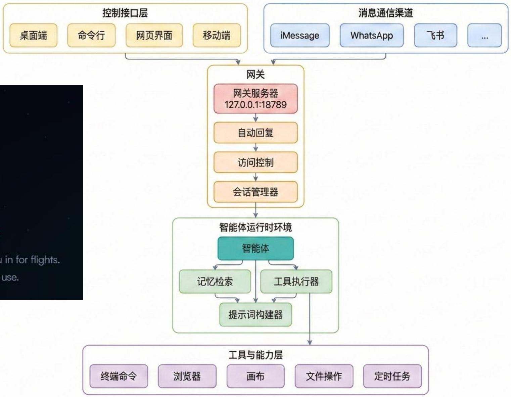  
OpenClaw 整体系统架构


# OpenClaw

THEAI THATACTUALLYDOESTHINGS.

Clearsyourinbox,sendsemails,manages yourcalendar,checksyou

AllfromWhatsApp,Telegram,oranychatappyoualready

# 数据库与人工智能

案例：OpenClaw

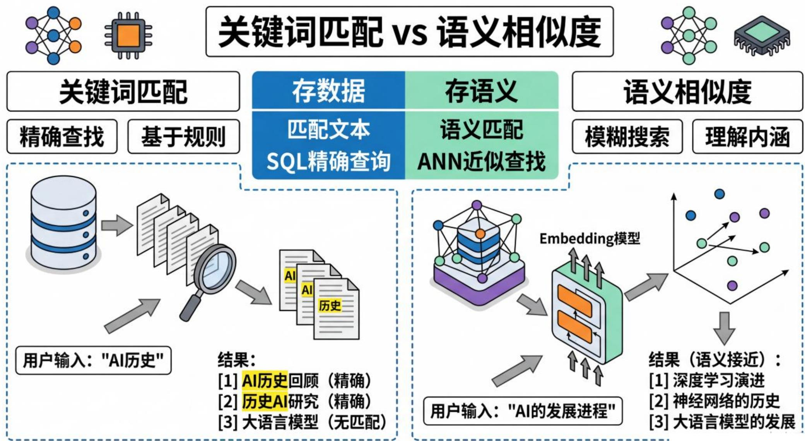

# 数据库与人工智能

案例：OpenClaw 记忆搜索 (Memory Search)

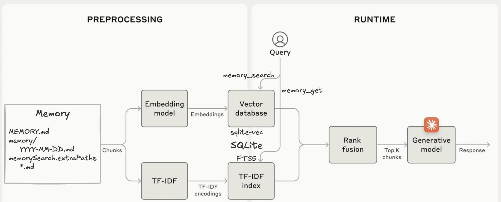

# Textbooks

# 教材

“A First Course in Database Systems, 3rd Edition”, 2007

• 机械工业出版社 影印, 2008

• Stanford University

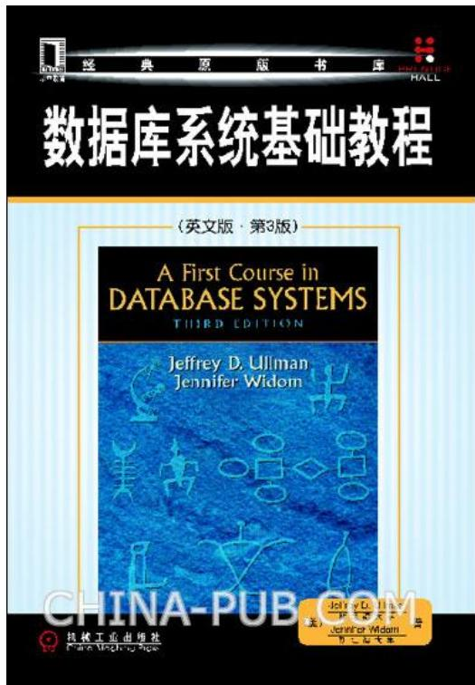

《数据库系统基础教程》（原书第3版）

• Jeffrey D. Ullman,Jennifer Widom 著  
• 岳丽华 等 译   
• 机械工业出版社, 2009

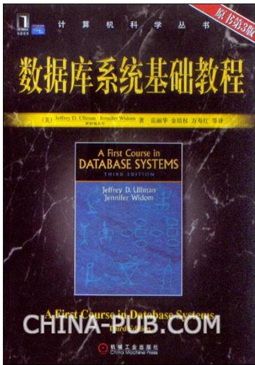

# Textbooks (Cont’d)

“Database System Implementation, 2nd Edition”, 2008 （17, 18.1-18.6）

• 机械工业出版社, 影印, 2010  
• Stanford University

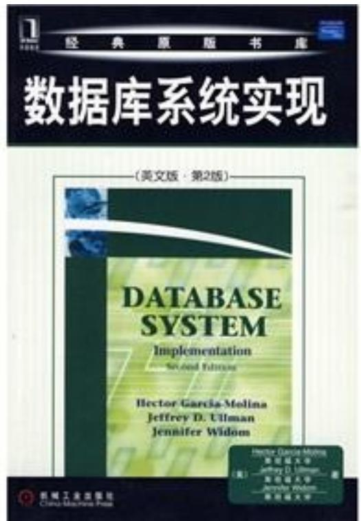

《数据库系统实现》 （原书第2版）

Hector Garcia-Molina, Jeffrey D. Ullman, Jennifer Widom 著   
杨冬青 等 译  
机械工业出版社, 2010

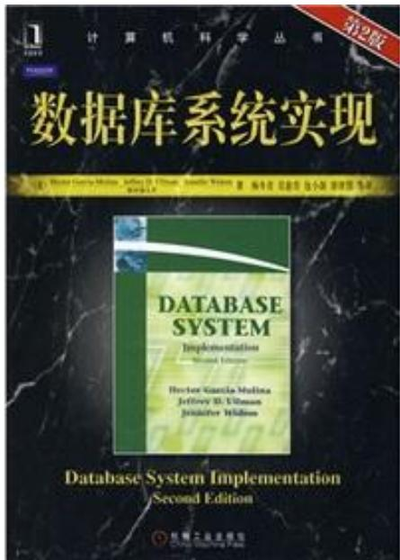

# Textbooks (Cont’d)

“Database Systems: The Complete Book, 2nd Edition”, 2008（全书）

Hector Garcia-Molina, Jeffrey D. Ullman, Jennifer Widom   
“Database System Implementation, 2nd Edition”实际上是全书的后一半

国外只有全书，并无此书

《数据库系统全书》

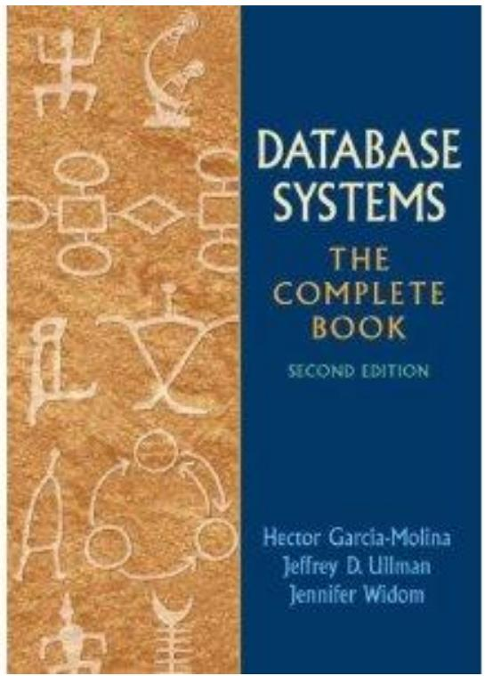

# Textbooks (Cont’d) 实验指导书

• 王鑫 主编.openGauss数据库实验教程. 高等教育出版社, 2025（ISBN:9787040642193）

《openGauss数据库实验教程》

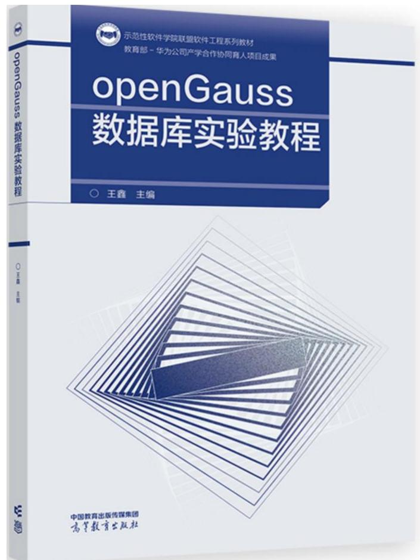

# 参考书

# Reference Books (Cont’d)

“Database Management Systems, 3rd Edition”, 2002

• “奶牛书” （Cow Book）  
• 清华大学出版社 影印, 2003

• MIT   
• University of Wisconsin

《数据库管理系统:原理与设计》（第3版）

Raghu Ramakrishnan, Johannes Gehrke 著   
– 周立柱 等 译  
清华大学出版社, 2004.

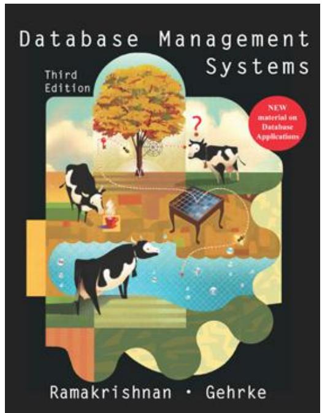

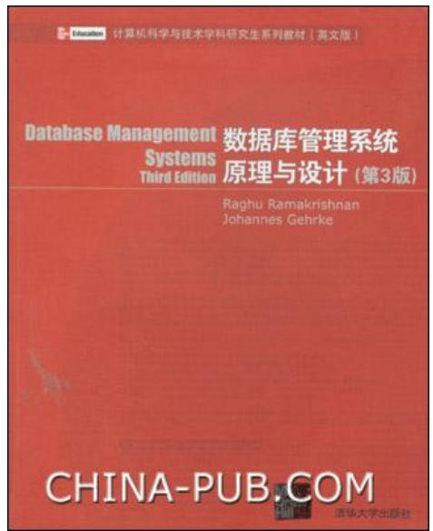

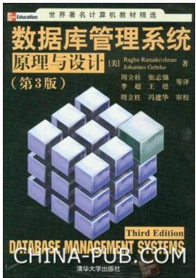

# Reference Books (Cont’d)

“Database System Concepts, 7th Edition”, 2019

• “帆船书” （Sailboat Book）  
• 机械工业出版社 影印(第7版), 2021

《数据库系统概念》第7版

– Avi Silberschatz,

Henry F. Korth,

S. Sudarshan 著

杨冬青 等 译  
机械工业出版社, 2021.

  
  
Database System Concepts

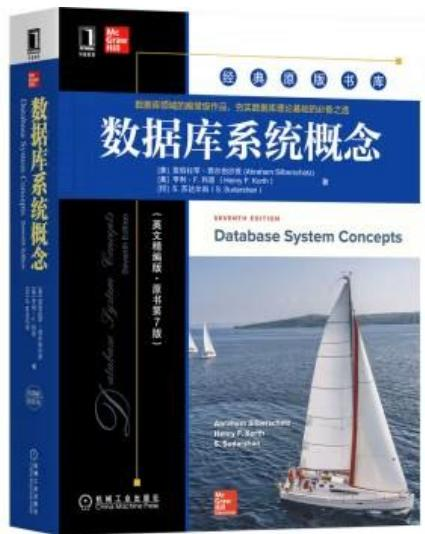


# Reference Books

《数据库系统概论》（第6版）

– 王珊, 萨师煊  
– 高等教育出版社, 2023

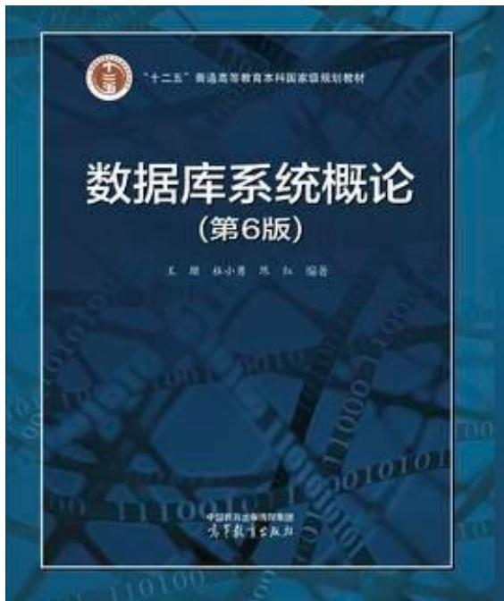

《数据库系统概论（第6版）习题解析与实验指导》

– 高等教育出版社, 2024


# 课程成绩

• 期末考试成绩： 60%   
• 作业：10%  
• 考勤：10%  
• 实验：20%


# Lecture

# Relational Data Model

关系数据模型

# Outline

• Database and DBMS 数据库与DBMS  
• Relational Data Model 关系数据模型

# Outline

• Database and DBMS 数据库与DBMS  
• Relational Data Model 关系数据模型

# 数据 （Data）

• 是数据库存储的基本对象

• 数字（number）  
• 文本（text）  
• 图形（graph）  
• 图像（image）  
• 音频（audio）  
• 视频（video） …


数据的语义

• 93

• 某门课的成绩   
• 某个人的体重  
• 计算机系学生人数  
•

数据与其语义是不可分的

• 信息

带有语义的数据

# 有组织的数据

• 一条记录

• (张三, 男, 20020510, 天津市, 计算机, 2022)

• 语义

学籍系统中的一条学生记录  
• 姓名, 性别, 出生日期, 居住地, 所在系, 入学年份

• 给出这条记录的另一种解释？


# 数据库 （Database）

• 数据库 （Database，简称DB）

• 长期存储在计算机内、  
有组织的、  
• 可共享的  
• 数据的集合。


# 数据库管理系统

• 数据库管理系统

• DataBase Management System，缩写DBMS   
• 位于用户与操作系统之间的一层数据管理软件

• DBMS是系统软件  
• DBMS是大型复杂的软件系统

• 功能

数据定义、数据存储、数据操作、数据控制、事务管理、数据库维护…

应用程序

DBMS

操作系统

硬件

# 数据库系统

# • Database System

• 针对某种应用而开发的信息管理系统Information Management Systems

# • 构成

• 数据库  
• DBMS   
• 应用程序  
数据库管理员 （DBA）

# • 典型的数据库系统

• 银行交易系统  
• 人力资源管理系统  
• 电子购物系统 …

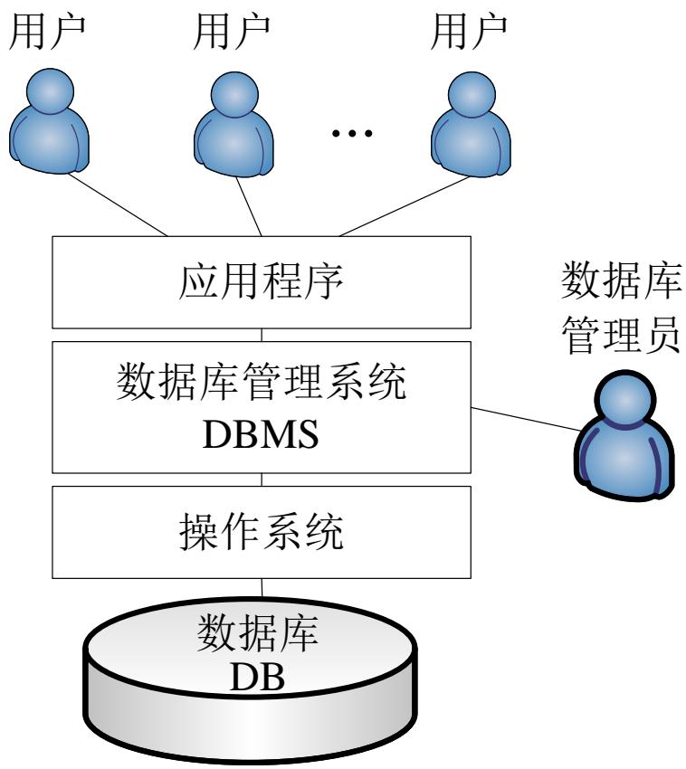

# DBMS的诞生

# 三大标志性事件

• IMS系统 1966   
• 层次数据模型  
• DBTG报告 1969   
• 网状数据模型  
• Codd发表论文 1970   
• 关系数据模型

# IMS系统


• IMS系统：Information Management System

• 1966年IBM公司为阿波罗登月计划设计  
• 挑战

• 如何有效存储和管理土星5号运载火箭和阿波罗太空飞船所产生的大量数据清单？

• 发布：1968年8月14日，IBM 2740终端  
贡献：提出层次数据模型

# DBTG报告

目 的

• 为了给COBOL语言增加数据处理能力

• 行动

• 1969年10月  
• CODASYL下属的数据库任务小组（Data Base Task Group，简称DBTG）发布技术报告

• 贡献

• 提出网状数据模型


# Codd发表论文

# • 论文

“A Relational Model of Data for Large Shared Data Banks”《大型共享数据库的关系数据模型》  
• 1970年IBM公司San Jose实验室研究员E. F. Codd（埃德加·科德）发表著名论文

# • 指出

• 当时流行的层次模型和网状模型的问题• 混淆了

• 信息逻辑结构的描述  
• 物理存取方法的描述

# • 贡献：提出了关系数据模型

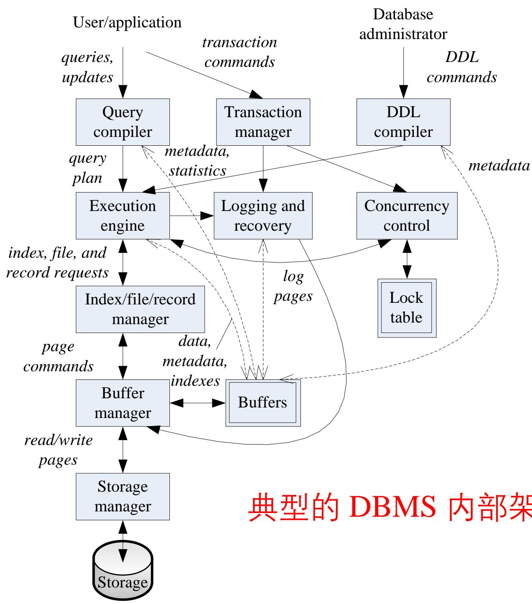  
架构

# 事务处理

# Transaction Processing

# • Transaction

• A group of one or more database operations   
Atomicity

• A unit of work that must be executed atomically (all-or-nothing execution)

Consistency   
• Transactions are expected to preserve the consistency of the database   
Isolation   
• Appear to be executed as if no other transaction is executing as the same time   
Durability   
• The work of a completed transaction will never be lost

# Outline of Our Course

• Relational Database Modeling

• 2. The Relational Model of Data   
• 3. Design Theory of Relational Databases   
• 4. High-Level Database Models

• Relational Database Programming

• 6. The Database Language SQL   
• 7. Constraints and Triggers   
• 8. Views and Indexes   
• 9. SQL in a Server Environment   
• 10.1 Security and User Authorization in SQL

• Transaction Processing

• 17. Coping With System Failures   
• 18. Concurrency Control

• NoSQL

# 创建数据库

# Create Database in DBMS

• Keywords   
• CREATE DATABASE   
• Example

CREATE DATABASE moviedb;

# 删除数据库

# Drop Database in DBMS

• Keywords

DROP DATABASE

• Example

DROP DATABASE moviedb;

# Outline

• Database and DBMS 数据库与DBMS  
• Relational Data Model 关系数据模型

# Codd论文

Information Retrieval

P.BAXENDALE, Editor

# A Relational Model of Data for Large Shared Data Banks

E.F. CoDD

IBM Research Laboratory,San Jose, California

Future users of large data banks must be protected from having to know how the data is organized in the machine (the internal representation). A prompting service which supplies such information is nof α satisfactory solution. Activities of users at terminals and most application programs should remain unaffected when the internal representation of data is changed and even when some aspects of the external represenfation are changed. Changes in data representation will often be needed as α result of changes in query, update, and report traffic and natural growth in the types of stored information.

The relational view (or model） of data described in Section 1 appears to be superior in several respects to the graph or network model [3,4] presently in vogue for noninferential systems.It provides a means of describing data with its natural structure only--that is,without superimposing any additional structure for machine representation purposes.Accordingly,it provides a basis for a high level data Ianguage which will yield maximal independence between programs on the one hand and machine representation and organization of data on the other.

A further advantage of the relational view is that it forms a sound basis for treating derivability,redundancy, and consistency of relations-these are discussed in Section 2.The network model,on the other hand, has spawned a number of confusions,not the least of which is mistaking the derivation of connections for the derivation of relations (see remarks in Section 2 on the “connection trap").

Finally, the relational view permits a clearer evaluation of the scope and logical limitations of present formatted

# Codd论文

# 1. Relational Model and Normal Form

# 1.1．INTRODUCTION

This paper is concerned with the application of elementary relation theory to systems which provide shared access to large banks of formatted data. Except for a paper by Childs [1], the principal application of relations to data systems has been to deductive question-answering systems. Levein and Maron [2] provide numerous references to work in this area.

In contrast,the problems treated here are those of data independence-the independence of application programs and terminal activities from growth in data types and changes in data representation-and certain kinds of data inconsistency which are expected to become troublesome even in nondeductive systems.

still quite limited.Further, the model of data with which users interact is still cluttered with representational properties,particularly in regard to the representation of collections of data (as opposed to individual items).Three of the principal kinds of data dependencies which still need to be removed are:ordering dependence, indexing dependence,and access path dependence.In some systems these dependencies are not clearly separable from one another.

1.2.1. Ordering Dependence. Elements of data in a data bank may be stored in a variety of ways,some involving no concern for ordering,some permitting each element to participate in one ordering only,others permitting each element to participate in several orderings.Let us consider those existing systems which either require or permit data elements to be stored in at least one total ordering which is closely associated with the hardware-determined ordering of addresses.For example, the records of a file concerning parts might be stored in ascending order by part serial number.Such systems normally permit application programs to assume that the order of presentation of records from such a file is identical to (or is a subordering of） the

# What is a Data Model? 数据模型

• A data model

• A notation for describing data or information

• Consists of three parts

• Structure of the data

结构

Operations on the data

操作

• Constraints on the data

约束

# Data Models 数据模型

• Important Data Models

Relation model

关系模型

• Object-relational extensions

Graph data model

• RDF, Property graph

图数据模型

Other Data Models

– Hierarchical data model   
– Network data model   
XML data model   
– Object-oriented model

# 关系模型

# Relational Model in Brief

<table><tr><td>title</td><td>year</td><td>length</td><td>genre</td></tr><tr><td>Gone With the Wind</td><td>1939</td><td>231</td><td>drama</td></tr><tr><td>Star Wars</td><td>1977</td><td>124</td><td>sciFi</td></tr><tr><td>Wayne&#x27;s World</td><td>1992</td><td>95</td><td>comedy</td></tr></table>

# • Structure

• Resemble an array of structs in C

• Column headers

Field names

• Each row

One struct in the array

# Relational Model in Brief (Cont’d)

<table><tr><td>title</td><td>year</td><td>length</td><td>genre</td></tr><tr><td>Gone With the Wind</td><td>1939</td><td>231</td><td>drama</td></tr><tr><td>Star Wars</td><td>1977</td><td>124</td><td>sciFi</td></tr><tr><td>Wayne&#x27;s World</td><td>1992</td><td>95</td><td>comedy</td></tr></table>

# Operations

# • Relational algebra

• Table-oriented   
• Asking for “all the rows where the genre is comedy”?

# Relational Model in Brief (Cont’d)

<table><tr><td>title</td><td>year</td><td>length</td><td>genre</td></tr><tr><td>Gone With the Wind</td><td>1939</td><td>231</td><td>drama</td></tr><tr><td>Star Wars</td><td>1977</td><td>124</td><td>sciFi</td></tr><tr><td>Wayne&#x27;s World</td><td>1992</td><td>95</td><td>comedy</td></tr></table>

# Constraints

• Examples

• A fixed list of genres, genre must have a value in the list   
• No two rows could have the same title

# Relations 关系

# Relation

• Two-dimensional table   
• Example

• The relation Movies

<table><tr><td>title</td><td>year</td><td>length</td><td>genre</td></tr><tr><td>Gone With the Wind</td><td>1939</td><td>231</td><td>drama</td></tr><tr><td>Star Wars</td><td>1977</td><td>124</td><td>sciFi</td></tr><tr><td>Wayne&#x27;s World</td><td>1992</td><td>95</td><td>comedy</td></tr></table>

# Attributes 属性

# Attributes

• The column names of a relation   
• Describing the meaning of entries in the column   
• Example

<table><tr><td>title</td><td>year</td><td>length</td><td>genre</td></tr><tr><td>Gone With the Wind</td><td>1939</td><td>231</td><td>drama</td></tr><tr><td>Star Wars</td><td>1977</td><td>124</td><td>sciFi</td></tr><tr><td>Wayne&#x27;s World</td><td>1992</td><td>95</td><td>comedy</td></tr></table>

# Schemas 模式

# Schemas

• Relation name and its attributes   
• The schema for relation Movies

• Movies(title, year, length, genre)

Relational database schema

• The set of schemas for the relations of a database

# Tuples 元组

# Tuple

• A row of a relation   
• A tuple has one component for each attribute   
Example

• (Gone With the Wind, 1939, 231, drama)

# Domains 域

# Domain

• A particular elementary type   
• Associated with each attribute of a relation

Example

• Movies(title:string, year:integer, length:integer, genre:string)

# Keys of Relations 关系的键

• Key constraints

• One kind of constraints, so fundamental

• Key 键

• A set of attributes of a relation   
• No two tuples in a relation instance have the same values in all the attributes of the key   
• Example

• Movies (title, year, length, genre)

# 电影示例数据库的模式

# An Example Database Schema

• Movies ( title:string, year:integer, length:integer, genre:string, studioName:string, producerC#:integer ) 电影   
• MovieStar name:string, address:string, gender:char, birthdate:date ) 演员

StarsIn ( movieTitle:string, movieYear:integer, starName:string 出演   
• MovieExec ( name:string, address:string, cert#:integer, netWorth:integer ) 导演   
• Studio ( name:string, address:string, presC#:integer 制片厂

# SQL 查询语言

• SQL (pronounced “sequel”)

• The principal language used to describe and manipulate relational databases

• Two aspects of SQL

Data-Definition Language

• Declaring database schemas

Data-Manipulation Language

• Querying and modifying the database

# Table Declarations 表声明

• Keywords   
CREATE TABLE   
• Example

CREATE TABLE movieexec (

name CHAR(30),

address VARCHAR(255),

cert INT PRIMARY KEY, 主键

networth INT

);

# Table Declarations

CREATE TABLE studio (   
```sql
name CHAR(50) PRIMARY KEY, 主键 addressVARCHAR(255),   
presc INT, FOREIGN KEY (presc) REFERENCES movieexec(cert) 外键);
```

# Table Declarations (Cont’d)

# CREATE TABLE movies (

title CHAR(100),

year INT,

length INT,

genre CHAR(10),

studioname CHAR(30),

producerc INT,

PRIMARY KEY (title, year), 实体完整性

FOREIGN KEY (studioname) REFERENCES studio(name),

FOREIGN KEY (producerc) REFERENCES movieexec(cert) 参照完整性 );

# Table Declarations (Cont’d)

# CREATE TABLE moviestar (

```txt
name CHAR(30),   
address VARCHAR(255),   
gender CHAR(1),   
birthdate CHAR(10),   
PRIMARY KEY (name)   
); 
```

# Table Declarations (Cont’d)

# CREATE TABLE starsin (

movietitle CHAR(100),

movieyear INT,

starname CHAR(30),

PRIMARY KEY (movietitle, movieyear, starname),

FOREIGN KEY (movietitle, movieyear) REFERENCES movies(title, year),

FOREIGN KEY (starname) REFERENCES moviestar(name)

);

# Insert Data 插入数据

INSERT INTO movieexec VALUES ('George Lucas', 'Oak Rd.', 555, 200000000);

INSERT INTO movieexec VALUES ('Ted Turner', 'Turner Av.', 333, 125000000);

INSERT INTO movieexec VALUES ('Stephen Spielberg', '123 ET road', 222, 100000000);

INSERT INTO movieexec VALUES ('Merv Griffin', 'Riot Rd.', 199, 112000000);

INSERT INTO movieexec VALUES ('Calvin Coolidge', 'Fast Lane', 123, 20000000);

INSERT INTO movieexec VALUES ('Garry Marshall', 'First Street', 999, 50000000);

INSERT INTO movieexec VALUES ('J.J. Abrams', 'High Road', 345, 45000000);

INSERT INTO movieexec VALUES ('Bryan Singer', 'Downtown', 456, 70000000);

INSERT INTO movieexec VALUES ('George Roy Hill', 'Baldwin Av.', 789, 20000000);

INSERT INTO movieexec VALUES ('Dino De Laurentiis', ' Beverly Hills', 666, 120000000);

# Insert Data

INSERT INTO studio VALUES ('MGM','MGM Boulevard', 123);

INSERT INTO studio VALUES ('Fox', 'Hollywood', 555);

INSERT INTO studio VALUES ('Disney', 'Buena Vista', 999);

INSERT INTO studio VALUES ('Paramount', 'Hollywood', 345);

INSERT INTO studio VALUES ('Universal', 'Hollywood', 789);

# Insert Data

INSERT INTO movies VALUES ('Logan''s run', 1976, NULL, 'sciFi', 'MGM', 123);   
INSERT INTO movies VALUES ('Star Wars', 1977, 124, 'sciFi', 'Fox', 555);   
INSERT INTO movies VALUES ('Empire Strikes Back', 1980, 111, 'fantasy', 'Fox', 555);   
INSERT INTO movies VALUES ('Star Trek', 1979, 132, 'sciFi', 'Paramount', 345);   
INSERT INTO movies VALUES ('Star Trek: Nemesis', 2002, 116, 'sciFi', 'Paramount', 345);   
INSERT INTO movies VALUES ('Terms of Endearment', 1983, 132, 'romance', 'MGM', 123);   
INSERT INTO movies VALUES ('The Usual Suspects', 1995, 106, 'crime', 'MGM', 456);   
INSERT INTO movies VALUES ('Gone With the Wind', 1938, 238, 'drama', 'MGM', 123);   
INSERT INTO movies VALUES ('Wayne''s World', 1992, 95, 'comedy', 'Paramount', 123);   
INSERT INTO movies VALUES ('King Kong', 2005, 187, 'drama', 'Universal', 789);   
INSERT INTO movies VALUES ('King Kong', 1976, 134, 'drama', 'Paramount', 666);   
INSERT INTO movies VALUES ('King Kong', 1933, 100, 'drama', 'Universal', 345);   
INSERT INTO movies VALUES ('Pretty Woman', 1990, 119, 'comedy', 'Disney', 999);

# Insert Data

INSERT INTO moviestar VALUES ('Jane Fonda', 'Turner Av.', 'F', '1977-07-07'); INSERT INTO moviestar VALUES ('Alec Baldwin', 'Baldwin Av.', 'M', '1977-06-07'); INSERT INTO moviestar VALUES ('Kim Basinger', 'Baldwin Av.', 'F', '1979-05-07'); INSERT INTO moviestar VALUES ('Harrison Ford', 'Beverly Hills', 'M', '1977-07-07'); INSERT INTO moviestar VALUES ('Carrie Fisher', '123 Maple St.', 'F', '1999-09-09'); INSERT INTO moviestar VALUES ('Mark Hamill', '456 Oak Rd.', 'M', '1988-08-08'); INSERT INTO moviestar VALUES ('Debra Winger', 'A way', 'F', '1978-05-06'); INSERT INTO moviestar VALUES ('Jack Nicholson', 'X path', 'M', '1949-05-05'); INSERT INTO moviestar VALUES ('Kevin Spacey', 'New York Av.', 'F', '1937-12-21');

# Insert Data

INSERT INTO starsin VALUES ('Star Wars', 1977, 'Carrie Fisher');

INSERT INTO starsin VALUES ('Star Wars', 1977, 'Mark Hamill');

INSERT INTO starsin VALUES ('Star Wars', 1977, 'Harrison Ford');

INSERT INTO starsin VALUES ('Empire Strikes Back', 1980, 'Harrison Ford');

INSERT INTO starsin VALUES ('The Usual Suspects', 1995, 'Kevin Spacey');

INSERT INTO starsin VALUES ('Terms of Endearment', 1983, 'Debra Winger');

INSERT INTO starsin VALUES ('Terms of Endearment', 1983, 'Jack Nicholson');

# A Query Test 一个查询测试

SELECT *

FROM movies

WHERE studioname='Disney' AND year=1990

ORDER BY length, title;

# Data Types 数据类型

• All attributes must have a data type

• Character strings of fixed or varying length

• CHAR(n)   
• ‘foo’   
VARCHAR(n)

• Bit strings of fixed or varying length

• BIT(n)   
• BIT VARYING(n)

# Data Types (Cont’d)

• All attributes must have a data type

• Logical values   
• BOOLEAN   
• TRUE, FALSE, UNKNOWN

• Integer values

• INT or INTEGER   
• SMALLINT

• in book, SHORTINT ?

# Data Types (Cont’d)

• All attributes must have a data type

• Floating-point numbers

• FLOAT or REAL   
• DOUBLE PRECISION   
• DECIMAL(n, d)

• Real numbers with a fixed decimal point   
• n decimal digits  
• Decimal point assumed to be $d$ positions from the right   
0123.45 of type DECIMAL(6, 2)

• NUMERIC synonym for DECIMAL

# Data Types (Cont’d)

• All attributes must have a data type

• Dates and times

• DATE   
• DATE ‘1948-05-14’   
TIME   
. TIME ’15:00:02.5’   
• Essentially character strings of special form

# Modifying Relation Schemas 修改关系模式

• Deleting a relation

• DROP TABLE R;

• Modifying a relation

• ALTER TABLE MovieStar ADD phone CHAR(16);

• Adding an attribute

• ALTER TABLE MovieStar DROP birthdate;

• Deleting an attribute

# Default Values 默认值

• Example gender CHAR(1) DEFAULT ‘?’, birthdate DATE DEFAULT DATE ‘0000-00-00’   
• Example ALTER TABLE MovieStar ADD phone CHAR(16) DEFAULT ‘unlisted’;

# The End of This Lecture…