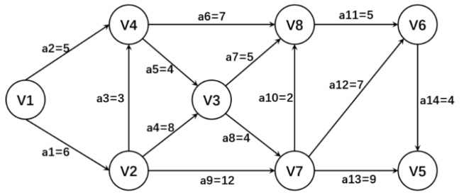

# 1 顺序结构

## 1.1 链表合并操作

### 1.1.1 单链表结点结构体

```C++
struct ListNode {
    int val;
    ListNode *next;
    ListNode(int x) : val(x), next(nullptr) {}
};
```

### 1.1.2 迭代实现

我们使用一个“哑节点”（Dummy Node）来简化头节点的处理逻辑，并用一个指针不断向后连接较小的节点。
**核心思路：**

1. 创建一个伪头节点 `dummy`。
2. 比较两个链表当前节点的值，将较小的节点接在 `tail` 后面。
3. 移动指针，直到其中一个链表为空。
4. 将剩下的非空链表直接连接到末尾。

```C++
LinkedList Union_Easy(LinkedList ha, LinkedList hb) {
    // 1. 定义虚拟头节点(dummy)和尾指针(tail)
    // 使用局部变量分配dummy，省去malloc和free的麻烦，最后返回 dummy.next 即可
    LNode dummy;
    dummy.next = NULL;
    LNode *tail = &dummy;
    LNode *p = ha, *q = hb;

    // 2. 循环比较
    while (p && q) {
        // 临时指针，用来指向当前选中的较小节点
        LNode *selected = NULL;

        // 谁小选谁，相等选p (也可以选q，一样的)
        if (p->data < q->data) {
            selected = p;
            p = p->next;
        } else if (p->data > q->data) {
            selected = q;
            q = q->next;
        } else { // 相等的情况 (p->data == q->data)
            selected = p;
            p = p->next;
            q = q->next; // 既然相等，两个都往后移，相当于这一步就处理了两个
        }

        // 3. 去重并连接 (核心)
        // 只有当 新链表是空的(tail==&dummy) 或者 尾部值不等于当前值 时才连接
        // 注意：如果是严格去重，上面的else里 p和q都移了，这里只需判断是否与tail重复
        if (tail == &dummy || tail->data != selected->data) {
            tail->next = selected; // 挂载
            tail = selected;       // 移动尾指针
        }
    }

    // 4. 扫尾 (处理剩余部分)
    tail->next = p ? p : q;

    return dummy.next; // 返回真正的头节点
}
```

### 1.1.3 递归实现

合并两个链表的结果，等于“较小的头节点”连接上“剩余部分合并后的结果”。
**核心思路：**

- **基准情况：** 如果其中一个链表为空，返回另一个。
- **递归步骤：** 比较头节点，谁小就让谁的 `next` 指向后面部分的合并结果。

```C++
ListNode* mergeTwoListsRecursive(ListNode* l1, ListNode* l2) {
    if (!l1) return l2;
    if (!l2) return l1;
    if (l1->val <= l2->val) {
        l1->next = mergeTwoListsRecursive(l1->next, l2);
        return l1;
    } else {
        l2->next = mergeTwoListsRecursive(l1, l2->next);
        return l2;
    }
}
```

## 1.2 循环链表、双向循环链表操作

### 1.2.1 单向循环链表 (Circular Linked List)

单向循环链表的最后一个节点的 `next` 指向头节点。为了方便操作（尤其是尾部插入），通常使用一个 **`tail` 指针** 而不是 `head` 指针。

#### 结构定

```C++
struct Node {
    int data;
    Node* next;
    Node(int val) : data(val), next(nullptr) {}
};
```

#### 核心操作：插入与遍历

```C++
class CircularList {
public:
    Node* tail = nullptr;

    // 在头部插入
    void insertFirst(int val) {
        Node* newNode = new Node(val);
        if (!tail) {
            tail = newNode;
            tail->next = tail;
        } else {
            newNode->next = tail->next;
            tail->next = newNode;
        }
    }

    // 遍历链表
    void display() {
        if (!tail) return;
        Node* temp = tail->next; // 从头开始
        do {
            std::cout << temp->data << " -> ";
            temp = temp->next;
        } while (temp != tail->next);
        std::cout << "(back to head)" << std::endl;
    }
};
```

### 1.2.2 双向循环链表 (Doubly Circular Linked List)

每个节点有 `prev` 和 `next`，且头节点的 `prev` 指向尾节点，尾节点的 `next` 指向头节点。它的优势是可以**双向搜索**且能快速访问首尾。

#### 结构定义

```C++
struct DNode {
    int data;
    DNode *prev, *next;
    DNode(int val) : data(val), prev(nullptr), next(nullptr) {}
};
```

#### 核心操作：插入与删除

```C++
class DoublyCircularList {
    DNode* head = nullptr;

public:
    // 在末尾插入
    void insertLast(int val) {
        DNode* newNode = new DNode(val);
        if (!head) {
            head = newNode;
            head->next = head;
            head->prev = head;
        } else {
            DNode* tail = head->prev;
            tail->next = newNode;
            newNode->prev = tail;
            newNode->next = head;
            head->prev = newNode;
        }
    }

    // 删除指定值的节点
    void deleteNode(int key) {
        if (!head) return;
        DNode *curr = head, *prev_node = nullptr;
        // 查找节点
        while (curr->data != key) {
            if (curr->next == head) return; // 没找到
            curr = curr->next;
        }

        // 如果是唯一节点
        if (curr->next == head && curr->prev == head) {
            head = nullptr;
            delete curr;
            return;
        }

        // 调整指针
        curr->prev->next = curr->next;
        curr->next->prev = curr->prev;

        if (curr == head) head = curr->next; // 如果删的是头，更新头指针
        delete curr;
    }
};
```

### 1.2.3 关键点总结

| **链表类型** | **判空条件**      | **遍历结束条件**     | **优点**                           |
| ------------ | ----------------- | -------------------- | ---------------------------------- |
| **单向循环** | `tail==nullptr`   | `curr == tail->next` | 节省空间，适合约瑟夫环问题         |
| **双向循环** | `head == nullptr` | `curr->next == head` | 任意位置 $O(1)$ 删除（已知节点时） |

### 1.2.4 注意事项

1. **死循环风险**：在编写 `while` 循环时，必须使用 `do...while` 或者先处理头节点，否则循环条件 `curr != head` 在第一次执行时就会失效。
2. **内存管理**：在析构函数中，务必手动解除循环引用并逐个 `delete`，否则会导致内存泄漏。

## 1.3 利用栈实现表达式求值

### 中缀表达式求值

#### 1. 核心原理：双栈法

为了正确处理运算符的优先级（如乘除先于加减）和括号，我们需要两个辅助空间：

- **操作数栈 (Operand Stack, OPND)**：用于暂存数字（如 3, 4, 15 等）。
- **运算符栈 (Operator Stack, OPTR)**：用于暂存运算符（如 `+`, `-`, `*`, `/`, `(` , `)`）。

#### 2. 算法执行步骤

从左到右扫描表达式中的每一个字符，根据字符类型执行不同操作：

- 遇到数字：直接压入**操作数栈 (OPND)**。
- 遇到运算符：将其与**运算符栈 (OPTR)** 的栈顶元素进行优先级比较：
  1.  **若当前运算符优先级 > 栈顶运算符**：直接将其压入 OPTR 栈。
  2.  **若当前运算符优先级 <= 栈顶运算符**：
      - 从 **OPTR** 弹出栈顶运算符 $theta$。
      - 从 **OPND** 连续弹出两个操作数 $b$（后弹出）和 $a$（先弹出）。
      - 计算 $a \, theta \, b$ 的结果，并将结果压回 **OPND** 栈。
      - 继续用当前运算符与新的栈顶比较。
- 遇到括号
  1.  **左括号 `(`**：优先级最高，直接压入 OPTR 栈。
  2.  **右括号 `)`**：依次弹出 OPTR 栈顶运算符并计算，直到弹出左括号 `(` 为止。

#### 3. 实例演示

这是中缀表达式 `3 + 4 * 2 / ( 1 - 5 )` 求值的详细流程表。

**图例说明：**

- **栈顶**：列表的最右侧元素（例如 `[3, 4]` 中 `4` 是栈顶）。
- **优先级**：`* /` > `+ -` > `(`。

| 步骤     | 扫描字符 | 操作数栈 (底 -> 顶) | 运算符栈 (底 -> 顶) | 详细动作说明                                                                                          |
| :------- | :------: | :------------------ | :------------------ | :---------------------------------------------------------------------------------------------------- |
| 1        |   `3`    | `[3]`               | `[]`                | 数字，直接入栈                                                                                        |
| 2        |   `+`    | `[3]`               | `[+]`               | 栈空，运算符入栈                                                                                      |
| 3        |   `4`    | `[3, 4]`            | `[+]`               | 数字，直接入栈                                                                                        |
| 4        |   `*`    | `[3, 4]`            | `[+, *]`            | `*` 优先级(2) > `+` 优先级(1)，入栈                                                                   |
| 5        |   `2`    | `[3, 4, 2]`         | `[+, *]`            | 数字，直接入栈                                                                                        |
| 6        |   `/`    | `[3, 8]`            | `[+, /]`            | `/` 优先级等于栈顶 `*`。先弹出 `*` 计算：$4 \times 2 = 8$。<br>8 入栈。<br>`/` 优先级 > `+`，`/` 入栈 |
| 7        |   `(`    | `[3, 8]`            | `[+, /, (]`         | 左括号直接入栈                                                                                        |
| 8        |   `1`    | `[3, 8, 1]`         | `[+, /, (]`         | 数字，直接入栈                                                                                        |
| 9        |   `-`    | `[3, 8, 1]`         | `[+, /, (, -]`      | 栈顶是 `(`，运算符直接入栈                                                                            |
| 10       |   `5`    | `[3, 8, 1, 5]`      | `[+, /, (, -]`      | 数字，直接入栈                                                                                        |
| 11       |   `)`    | `[3, 8, -4]`        | `[+, /]`            | 遇到右括号，弹出栈顶 `-` 计算：$1 - 5 = -4$。<br>-4 入栈。<br>弹出并丢弃对应的 `(`                    |
| 12       |  (结束)  | `[3, -2]`           | `[+]`               | 扫描结束。弹出 `/` 计算：$8 \div -4 = -2$。<br>-2 入栈                                                |
| 13       |  (结束)  | `[1]`               | `[]`                | 弹出 `+` 计算：$3 + (-2) = 1$。<br>1 入栈                                                             |
| **结果** |          | **1**               |                     | **最终计算结果**                                                                                      |

#### 4. 易错点提示

- **结合性**：当遇到优先级相同的运算符（如 `+` 和 `-`）时，通常遵循左结合律，即视为当前运算符优先级 $\le$ 栈顶，需要先触发计算。
- **多位数字**：在程序实现时，读取字符需判断是否为连续数字字符，以正确解析出大于 9 的数值。

### 中缀表达式转后缀表达式（Infix to Postfix）

#### 规则

1. **遇到数字**：直接输出。
2. **遇到左括号 `(`**：压入运算符栈。
3. **遇到右括号 `)`**：不断弹出栈顶运算符并输出，直到遇到 `(`，最后弹出 `(`（不输出）。
4. **遇到运算符**：
   - 若栈为空，或栈顶为 `(`，直接压入。
   - 若当前比栈顶优先级**高**，直接压入。
   - 若当前比栈顶优先级**低或相等**，弹出栈顶并输出，直到满足上述条件，再将当前压入。

#### 实例分析：`3 + 4 * 2 / ( 1 - 5 )`

此过程使用一个**运算符栈**。

| **步骤** | **扫描字符** | **运算符栈（底 → 顶）** | **后缀表达式（输出结果）**                       |
| -------- | ------------ | ----------------------- | ------------------------------------------------ |
| 1        | `3`          | `[ ]`                   | `3`                                              |
| 2        | `+`          | `[ + ]`                 | `3`                                              |
| 3        | `4`          | `[ + ]`                 | `3 4`                                            |
| 4        | `*`          | `[ +, * ]`              | `3 4`                                            |
| 5        | `2`          | `[ +, * ]`              | `3 4 2`                                          |
| 6        | `/`          | `[ +, / ]`              | `3 4 2 *` (因为 `/` 等于 `*` 优先级，先弹出 `*`) |
| 7        | `(`          | `[ +, /, ( ]`           | `3 4 2 *`                                        |
| 8        | `1`          | `[ +, /, ( ]`           | `3 4 2 * 1`                                      |
| 9        | `-`          | `[ +, /, (, - ]`        | `3 4 2 * 1`                                      |
| 10       | `5`          | `[ +, /, (, - ]`        | `3 4 2 * 1 5`                                    |
| 11       | `)`          | `[ +, / ]`              | `3 4 2 * 1 5 -` (弹出直到遇到 `(`)               |
| 12       | 结束         | `[ ]`                   | `3 4 2 * 1 5 - / +` (依次清空栈)                 |

### 后缀表达式求值（Evaluate Postfix）

#### 规则

1. **遇到数字**：压入操作数栈。
2. **遇到运算符**：从栈中弹出两个操作数（先弹出的是右操作数，后弹出的是左操作数），进行计算，并将结果压回栈中。

#### 实例分析：对上述结果 `3 4 2 * 1 5 - / +` 求值

此过程使用一个**操作数栈**。

| **步骤** | **扫描字符** | **操作数栈变化（底 → 顶）** | **运算逻辑**                     |
| -------- | ------------ | --------------------------- | -------------------------------- |
| 1        | `3`          | `[ 3 ]`                     | 压入                             |
| 2        | `4`          | `[ 3, 4 ]`                  | 压入                             |
| 3        | `2`          | `[ 3, 4, 2 ]`               | 压入                             |
| 4        | `*`          | `[ 3, 8 ]`                  | 弹出 2, 4，计算 $4 \times 2 = 8$ |
| 5        | `1`          | `[ 3, 8, 1 ]`               | 压入                             |
| 6        | `5`          | `[ 3, 8, 1, 5 ]`            | 压入                             |
| 7        | `-`          | `[ 3, 8, -4 ]`              | 弹出 5, 1，计算 $1 - 5 = -4$     |
| 8        | `/`          | `[ 3, -2 ]`                 | 弹出 -4, 8，计算 $8 / (-4) = -2$ |
| 9        | `+`          | `[ 1 ]`                     | 弹出 -2, 3，计算 $3 + (-2) = 1$  |

# 图

## 邻接表构建算法

```C
struct AdjListNode {
    int dest;
    struct AdjListNode* next;
};

struct AdjList {
    struct AdjListNode* head;
};

struct Graph {
    int V;
    struct AdjList* array;
};

struct AdjListNode* newAdjListNode(int dest) {
    struct AdjListNode* newNode = (struct AdjListNode*)malloc(sizeof(struct AdjListNode));
    newNode->dest = dest;
    newNode->next = NULL;
    return newNode;
}

struct Graph* createGraph(int V) {
    struct Graph* graph = (struct Graph*)malloc(sizeof(struct Graph));
    graph->V = V;
    graph->array = (struct AdjList*)malloc(V * sizeof(struct AdjList));
    for (int i = 0; i < V; ++i)
        graph->array[i].head = NULL;
    return graph;
}

void addEdge(struct Graph* graph, int src, int dest) {
    struct AdjListNode* newNode = newAdjListNode(dest);
    newNode->next = graph->array[src].head;
    graph->array[src].head = newNode;
}
```

## 遍历

### 深度优先遍历

```C
void DFS(int start, int* visited, struct Graph* graph) {
    visited[start] = 1;
    printf("%d ", start);
    struct AdjListNode* currentNode = graph->array[start].head;
    while (currentNode != NULL) {
        int adjacentNode = currentNode->dest;
        if (!visited[adjacentNode]) {
            DFS(adjacentNode, visited, graph);
        }
        currentNode = currentNode->next;
    }
}
```

### 广度优先遍历

```C++
void BFS(int start, vector<bool>& visited, vector<vector<int>>& graph) {
    queue<int> q;
    q.push(start);
    visited[start] = true;
    while(!q.empty()) {
        int current = q.front();
        q.pop();
        cout << current << " ";
        for(auto adjacent : graph[current]) {
            if(!visited[adjacent]) {
                visited[adjacent] = true;
                q.push(adjacent);
            }
        }
    }
}
```

## Prim算法求最小生成树

## 关键路径

用于计算项目中的最长路径及最短完成时间

### 计算步骤

AOE 网 G 如题图，求: (3+4+4+3=14 分)
(1) 写出从 V1 出发的 DFS 序列，并画出相应的 DFS 生成树:
12375(回溯到7)6(回溯到7)8(回溯到7,再回溯到2)4
(2) 计算每个顶点的最早发生时间和最迟发生时间:
(3) 计算每条边的最早开始时间和最迟开始时间:
(4) 给出 G 的所有关键路径。
题(1)和题(2)答题要求: 当有若干个顶点同时可选时, 优先选取序号最小的顶点。


$$
\begin{array}{|l|c|c|c|c|c|c|c|c|}
\hline
\text{各顶点及边的有关时间} & V1 & V2 & V3 & V4 & V5 & V6 & V7 & V8 \\
\hline
\text{顶点最早发生时间 } VE & 0 & 6 & 14 & 9 & 29 & 25 & 18 & 20 \\
\hline
\text{顶点最迟发生时间 } VL & 0 & 6 & 14 &10 & 29 & 25 & 18 & 20\\
\hline
\end{array}
$$

$$
\begin{array}{|l|c|c|c|c|c|c|c|c|c|c|c|c|c|c|}
\hline 各活动的有关时间 & a1 & a2 & a3 & a4 & a5 & a6 & a7 & a8 & a9 & a10 & a11 & a12 & a13 & a14 \\
\hline 活动最早开始时间 e(i) & 0 & 0 & 6 & 6 & 9 & 9 & 14 & 14 & 6 & 18 & 20 & 18 & 18 & 25 \\
\hline 活动最迟开始时间 l(i) & 0 & 5 & 7 & 6 & 10 & 13 & 15 & 14 & 6 & 18 & 20 & 18 & 20 & 25\\
\hline
\end{array}
$$

关键活动：a1 a4 a8 a9 a10 a11 a12 a14
关键路径：
1-4-8-10-11-14
1-4-8-12-14
1-9-10-11-14
1-9-12-14

# 查找

## B树

B树（B-Tree）是一种自平衡的树，广泛用于数据库和文件系统中。它的构建、插入和删除过程都围绕着保持树的**平衡性**和**节点的填充度**展开。
为了方便理解，我们假设这是一棵 **$M$ 阶** 的B树（即每个节点最多有 $M$ 个子节点，最多有 $M-1$ 个关键字）。

### 1. B树的构建与插入过程

B树是从下往上生长的。插入节点时，总是先找到叶子节点。

#### 插入步骤：

1. **查找**：通过关键字比较，找到该关键字应该插入的叶子节点。
2. **直接插入**：如果该叶子节点的关键字个数小于 $M-1$，直接将关键字按顺序插入。
3. **分裂（关键步骤）**：如果插入后关键字个数等于 $M$（超过了限制），则触发**分裂**：
   - 取该节点中间位置的关键字（第 $\lceil M/2 \rceil$ 个）。
   - 将该中间关键字**向上提升**到父节点中。
   - 该关键字左侧和右侧的元素分别**分裂**成两个新的节点。
   - **连锁反应**：如果父节点也满了，则继续向上分裂，直到根节点。如果根节点也分裂，树的高度增加 1。

---

### 2. B树的删除过程

删除比插入复杂，因为要确保删除后节点内的关键字个数不少于 $\lceil M/2 \rceil - 1$（根节点除外）。

#### 删除步骤：

1. **定位**：找到要删除的关键字。
2. **非叶子节点删除**：
   - 如果关键字在非叶子节点，先用其**直接前驱**或**直接后继**（通常是左子树的最大值或右子树的最小值）替换它。
   - 然后转化为删除叶子节点中的对应关键字。
3. **叶子节点删除与调整**：
   - **情况 A：富余借用**。如果被删节点所属的兄弟节点（左或右）很“富裕”（关键字个数 $> \lceil M/2 \rceil - 1$），则通过父节点进行“旋转”借一个关键字过来。
   - **情况 B：合并**。如果左右兄弟都很“贫穷”，则将当前节点、父节点中的对应关键字、以及其中一个兄弟节点**合并**成一个新的节点。
   - **连锁反应**：合并可能导致父节点关键字过少，从而引发父节点的进一步合并，直到根节点。

---

### 总结记忆点

| **操作** | **核心动作**                  | **结果**                                       |
| -------- | ----------------------------- | ---------------------------------------------- |
| **插入** | **分裂 (Split)**              | 节点太满，中间元素“上天”，树可能变高。         |
| **删除** | **借用或合并 (Borrow/Merge)** | 节点太空，向邻居借或与邻居“合体”，树可能变矮。 |

**核心规则**：始终保持每个节点的关键字个数在 $[\lceil M/2 \rceil - 1, M-1]$ 之间。
这里是基于题目要求的哈希表构造过程和 ASL（平均查找长度）的计算步骤。

## 哈希查找

**已知条件：**

- **关键字序列**：{19, 33, 23, 1, 67, 18, 84, 27, 55, 11, 10, 79}
- **哈希函数**：$H(key) = key \pmod{17}$
- **冲突解决**：线性探测法 (Linear Probing)
- **表长**：由于模数是 17，我们假设哈希表地址区间为 0~16（共 17 个位置）。

---

### (1) 构造哈希表的过程

我们需要依次将关键字插入表中，如果位置被占用，则向后查找下一个空位（若到了末尾则回到 0 继续）。

1.  **key = 19**:
    - $H(19) = 19 \pmod{17} = 2$
    - 地址 2 为空，**放入 19**。
    - (比较次数：1)

2.  **key = 33**:
    - $H(33) = 33 \pmod{17} = 16$
    - 地址 16 为空，**放入 33**。
    - (比较次数：1)

3.  **key = 23**:
    - $H(23) = 23 \pmod{17} = 6$
    - 地址 6 为空，**放入 23**。
    - (比较次数：1)

4.  **key = 1**:
    - $H(1) = 1 \pmod{17} = 1$
    - 地址 1 为空，**放入 1**。
    - (比较次数：1)

5.  **key = 67**:
    - $H(67) = 67 \pmod{17} = 16$
    - 地址 16 已有 33 (冲突)。
    - 探测下一位 $(16+1)\%17 = 0$，为空，**放入 67**。
    - (比较次数：2，路径：16->0)

6.  **key = 18**:
    - $H(18) = 18 \pmod{17} = 1$
    - 地址 1 已有 1 (冲突)。
    - 探测下一位 2，已有 19 (冲突)。
    - 探测下一位 3，为空，**放入 18**。
    - (比较次数：3，路径：1->2->3)

7.  **key = 84**:
    - $H(84) = 84 \pmod{17} = 16$
    - 地址 16 已有 33 (冲突)。
    - 探测 0，已有 67 (冲突)。
    - 探测 1，已有 1 (冲突)。
    - 探测 2，已有 19 (冲突)。
    - 探测 3，已有 18 (冲突)。
    - 探测 4，为空，**放入 84**。
    - (比较次数：6，路径：16->0->1->2->3->4)

8.  **key = 27**:
    - $H(27) = 27 \pmod{17} = 10$
    - 地址 10 为空，**放入 27**。
    - (比较次数：1)

9.  **key = 55**:
    - $H(55) = 55 \pmod{17} = 4$
    - 地址 4 已有 84 (冲突)。
    - 探测下一位 5，为空，**放入 55**。
    - (比较次数：2，路径：4->5)

10. **key = 11**:
    - $H(11) = 11 \pmod{17} = 11$
    - 地址 11 为空，**放入 11**。
    - (比较次数：1)

11. **key = 10**:
    - $H(10) = 10 \pmod{17} = 10$
    - 地址 10 已有 27 (冲突)。
    - 探测下一位 11，已有 11 (冲突)。
    - 探测下一位 12，为空，**放入 10**。
    - (比较次数：3，路径：10->11->12)

12. **key = 79**:
    - $H(79) = 79 \pmod{17} = 11$
    - 地址 11 已有 11 (冲突)。
    - 探测下一位 12，已有 10 (冲突)。
    - 探测下一位 13，为空，**放入 79**。
    - (比较次数：3，路径：11->12->13)

---

#### 最终哈希表结果：

|     地址     |   0    |   1   |   2    |   3    |   4    |   5    |   6    |  7  |  8  |  9  |   10   |   11   |   12   |   13   | 14  | 15  |   16   |
| :----------: | :----: | :---: | :----: | :----: | :----: | :----: | :----: | :-: | :-: | :-: | :----: | :----: | :----: | :----: | :-: | :-: | :----: |
|  **关键字**  | **67** | **1** | **19** | **18** | **84** | **55** | **23** |     |     |     | **27** | **11** | **10** | **79** |     |     | **33** |
| **比较次数** |   2    |   1   |   1    |   3    |   6    |   2    |   1    |     |     |     |   1    |   1    |   3    |   3    |     |     |   1    |

---

### (2) 计算 ASL (成功)

$$ASL_{succ} = \frac{\text{查找所有关键字的比较次数之和}}{\text{关键字个数}}$$

由上述过程汇总各关键字的比较次数：

- 19: 1次
- 33: 1次
- 23: 1次
- 1: 1次
- 67: 2次
- 18: 3次
- 84: 6次
- 27: 1次
- 55: 2次
- 11: 1次
- 10: 3次
- 79: 3次

总次数 $= 1+1+1+1+2+3+6+1+2+1+3+3 = 25$

关键字个数 $n = 12$

$$ASL_{succ} = \frac{25}{12} \approx 2.08$$

# 排序

待排序序列为：**(12, 5, 9, 20, 6, 31, 24)**。
以下是六种排序算法每趟（Pass）的具体结果：

## 1. 插入排序 (Insertion Sort)

每一步将一个待排序的记录，按其关键码值的大小插入到前面已经排好序的子序列中。

- **初始状态：** [12], 5, 9, 20, 6, 31, 24
- **第1趟 (插入5)：** (**5, 12**), 9, 20, 6, 31, 24
- **第2趟 (插入9)：** (**5, 9, 12**), 20, 6, 31, 24
- **第3趟 (插入20)：** (**5, 9, 12, 20**), 6, 31, 24
- **第4趟 (插入6)：** (**5, 6, 9, 12, 20**), 31, 24
- **第5趟 (插入31)：** (**5, 6, 9, 12, 20, 31**), 24
- **第6趟 (插入24)：** (**5, 6, 9, 12, 20, 24, 31**)

---

## 2. 起泡排序 (Bubble Sort)

两两比较相邻记录的关键字，如果反序则交换，直到没有反序的记录为止。

- **初始状态：** (12, 5, 9, 20, 6, 31, 24)
- **第1趟：** (5, 9, 12, 6, 20, 24, **31**) —— _31沉底_
- **第2趟：** (5, 9, 6, 12, 20, **24, 31**) —— _24沉底_
- **第3趟：** (5, 6, 9, 12, **20, 24, 31**) —— _20沉底_
- **第4趟：** (5, 6, 9, **12, 20, 24, 31**) —— _已完成排序_

---

## 3. 快速排序 (Quick Sort)

以第一个数 **12** 为基准（Pivot）进行划分。

- **初始状态：** [12, 5, 9, 20, 6, 31, 24]
- **第1趟 (基准12)：** (6, 5, 9) **12** (20, 31, 24)
- **第2趟 (基准6和20)：** (5) **6** (9) **12** [**20** (31, 24)]
- **第3趟 (基准31)：** 5, 6, 9, 12, 20, (24) **31**
- **结果：** (5, 6, 9, 12, 20, 24, 31)

---

## 4. 简单选择排序 (Simple Selection Sort)

每趟从待排序的记录中选出关键字最小的记录，顺序放在已排序序列的末尾。

- **初始状态：** (12, 5, 9, 20, 6, 31, 24)
- **第1趟：** **5**, (12, 9, 20, 6, 31, 24) —— _选出5，与12交换_
- **第2趟：** 5, **6**, (9, 20, 12, 31, 24) —— _选出6，与12交换_
- **第3趟：** 5, 6, **9**, (20, 12, 31, 24) —— _9已在位_
- **第4趟：** 5, 6, 9, **12**, (20, 31, 24) —— _选出12，与20交换_
- **第5趟：** 5, 6, 9, 12, **20**, (31, 24) —— _20已在位_
- **第6趟：** 5, 6, 9, 12, 20, **24**, (31) —— _选出24，与31交换_

---

## 5. 堆排序 (Heap Sort)

以 **大根堆** 为例，首先建堆，然后不断交换堆顶与末尾元素并重建堆。

- **初始建堆结果：** (31, 20, 24, 5, 6, 12, 9)
- **第1趟 (交换31和9并调整)：** (24, 20, 12, 5, 6, 9) **31**
- **第2趟 (交换24和9并调整)：** (20, 9, 12, 5, 6) **24, 31**
- **第3趟 (交换20和6并调整)：** (12, 9, 6, 5) **20, 24, 31**
- **第4趟 (交换12和5并调整)：** (9, 5, 6) **12, 20, 24, 31**
- **第5趟 (交换9和6并调整)：** (6, 5) **9, 12, 20, 24, 31**
- **第6趟 (交换6和5)：** (5, 6, 9, 12, 20, 24, 31)

---

## 6. 二路归并排序 (2-Way Merge Sort)

将序列两两分组合并，再四四合并，直到整个序列有序。

- **初始状态：** (12), (5), (9), (20), (6), (31), (24)
- **第1趟 (两两归并)：** (5, 12), (9, 20), (6, 31), (24)
- **第2趟 (四四归并)：** (5, 9, 12, 20), (6, 24, 31)
- **第3趟 (全归并)：** (5, 6, 9, 12, 20, 24, 31)

---
