# 大学物理 2A 作业题详细解析与前置知识整理

---

## 1.13 质点平面运动分析

### 题目
1.13 一个质点在 $Oxy$ 平面上运动，运动方程 $x=3t+5$，$y=\frac{t^{2}}{2}+3t-4$ (SI 单位)。求：(1) 运动方程；(2) 从 $t=1\text{ s}$ 到 $t=2\text{ s}$ 的位移；(3) 轨道方程；(4) $t=4\text{ s}$ 时的速度； (5) $t=4\text{ s}$ 时的加速度； (6) $t=4\text{ s}$ 时的切向加速度、法向加速度。

### 1. 前置知识讲解
*   **位矢 ($\vec{r}$)**：描述质点在空间位置的矢量，从原点指向质点所在点。在直角坐标系中表示为 $\vec{r} = x\vec{i} + y\vec{j}$。
*   **位移 ($\Delta\vec{r}$)**：描述质点位置的变化，$\Delta\vec{r} = \vec{r}(t_2) - \vec{r}(t_1)$。注意位移是矢量，其大小是两点间的直线距离。
*   **速度 ($\vec{v}$)**：位矢对时间的变化率，即 $\vec{v} = \frac{d\vec{r}}{dt}$。其模 $v$ 称为速率。
*   **加速度 ($\vec{a}$)**：速度对时间的变化率，即 $\vec{a} = \frac{d\vec{v}}{dt}$。
*   **切向加速度 ($a_t$) 与法向加速度 ($a_n$)**：
    *   **切向加速度**：改变速度的大小，$a_t = \frac{dv}{dt}$（速率对时间的导数）。
    *   **法向加速度**：改变速度的方向，$a_n = \sqrt{a^2 - a_t^2}$，也等于 $\frac{v^2}{\rho}$（$\rho$ 为曲率半径）。

### 2. 详细答案解析
已知运动方程：$x = 3t + 5$, $y = \frac{t^2}{2} + 3t - 4$ (SI 单位)。

**(1) 运动方程（矢量形式）**
将标量方程组合为矢量：
$$\vec{r} = (3t+5)\vec{i} + \left(\frac{1}{2}t^2+3t-4\right)\vec{j} \text{ (m)}$$

**(2) 从 $t=1\text{ s}$ 到 $t=2\text{ s}$ 的位移**
分别计算两个时刻的位矢：
$t=1\text{ s}: \vec{r}_1 = (3\times1+5)\vec{i} + (\frac{1}{2}\times1^2+3\times1-4)\vec{j} = 8\vec{i} - 0.5\vec{j} \text{ (m)}$
$t=2\text{ s}: \vec{r}_2 = (3\times2+5)\vec{i} + (\frac{1}{2}\times2^2+3\times2-4)\vec{j} = 11\vec{i} + 4\vec{j} \text{ (m)}$
位移 $\Delta\vec{r} = \vec{r}_2 - \vec{r}_1 = (11-8)\vec{i} + (4 - (-0.5))\vec{j} = 3\vec{i} + 4.5\vec{j} \text{ (m)}$

**(3) 轨道方程**
消去参数 $t$。由 $x=3t+5$ 得 $t = \frac{x-5}{3}$，代入 $y$：
$y = \frac{1}{2}\left(\frac{x-5}{3}\right)^2 + 3\left(\frac{x-5}{3}\right) - 4 = \frac{x^2-10x+25}{18} + x - 5 - 4$
整理得：$18y = x^2 + 8x - 137$

**(4) $t=4\text{ s}$ 时的速度**
$\vec{v} = \frac{d\vec{r}}{dt} = 3\vec{i} + (t+3)\vec{j}$
$t=4\text{ s}$ 时，$\vec{v}_4 = 3\vec{i} + 7\vec{j} \text{ (m/s)}$
速率 $v = \sqrt{3^2 + 7^2} = \sqrt{58} \approx 7.62 \text{ m/s}$
与 $x$ 轴夹角 $\alpha = \arctan(7/3) \approx 66.8^\circ$

**(5) $t=4\text{ s}$ 时的加速度**
$\vec{a} = \frac{d\vec{v}}{dt} = 0\vec{i} + 1\vec{j} = \vec{j} \text{ (m/s}^2\text{)}$
加速度大小为 $1 \text{ m/s}^2$，方向沿 $y$ 轴正向。

**(6) $t=4\text{ s}$ 时的切向与法向加速度**
速率函数 $v(t) = \sqrt{3^2 + (t+3)^2} = (t^2+6t+18)^{1/2}$
切向加速度 $a_t = \frac{dv}{dt} = \frac{1}{2}(t^2+6t+18)^{-1/2} \cdot (2t+6) = \frac{t+3}{\sqrt{t^2+6t+18}}$
$t=4\text{ s}$ 时，$a_{t4} = \frac{7}{\sqrt{16+24+18}} = \frac{7}{\sqrt{58}} \approx 0.919 \text{ m/s}^2$
法向加速度 $a_n = \sqrt{a^2 - a_t^2} = \sqrt{1^2 - (7/\sqrt{58})^2} = \sqrt{9/58} = \frac{3}{\sqrt{58}} \approx 0.394 \text{ m/s}^2$

---

## 1.14 抛物线轨道运动

### 题目
1.14 一粒子沿抛物线轨道 $y=x^2$ 运动，粒子速度沿 $x$ 轴的投影恒为 $v_x=3 \text{ m}\cdot\text{s}^{-1}$，求当坐标 $x=2/3 \text{ m}$ 时，粒子的速度和加速度。

### 1. 前置知识讲解
*   **链式法则 (Chain Rule)**：如果 $y$ 是 $x$ 的函数，$x$ 是 $t$ 的函数，那么 $y$ 对 $t$ 的导数为 $\frac{dy}{dt} = \frac{dy}{dx} \cdot \frac{dx}{dt}$。
*   **速度与加速度的分量**：$\vec{v} = v_x\vec{i} + v_y\vec{j}$，$\vec{a} = a_x\vec{i} + a_y\vec{j}$。其中 $v_x = \frac{dx}{dt}$, $a_x = \frac{dv_x}{dt}$。

### 2. 详细答案解析
已知：一粒子沿抛物线轨道 $y=x^2$ 运动，粒子速度沿 $x$ 轴的投影恒为 $v_x = \frac{dx}{dt} = 3 \text{ m/s}$。求当坐标 $x=2/3 \text{ m}$ 时，粒子的速度和加速度。

**求速度 $\vec{v}$**
$v_x = 3 \text{ m/s}$
$v_y = \frac{dy}{dt} = \frac{dy}{dx} \cdot \frac{dx}{dt} = (2x) \cdot 3 = 6x \text{ (m/s)}$
所以速度矢量 $\vec{v} = 3\vec{i} + 6x\vec{j}$
当 $x = 2/3 \text{ m}$ 时，$v_y = 6 \cdot (2/3) = 4$，故 $\vec{v} = 3\vec{i} + 4\vec{j} \text{ (m/s)}$。

**求加速度 $\vec{a}$**
$a_x = \frac{dv_x}{dt} = 0$（因为 $v_x$ 是常数）
$a_y = \frac{dv_y}{dt} = \frac{d(6x)}{dt} = 6 \cdot \frac{dx}{dt} = 6 \cdot 3 = 18 \text{ m/s}^2$
所以加速度矢量 $\vec{a} = 18\vec{j} \text{ (m/s}^2\text{)}$。

---

## 1.18 由加速度求运动方程

### 题目
1.18 一质点沿直线运动，加速度$a=4-t^{2}$( $\mathrm{m} \cdot \mathrm{s}^{-2}$ ), 如果当 $t=3 \mathrm{~s}$ 时，质点位置为 $x=9 \mathrm{~m}$，速度为 $v=2 \mathrm{~m} \cdot \mathrm{s}^{-1}$，求质点的运动方程。

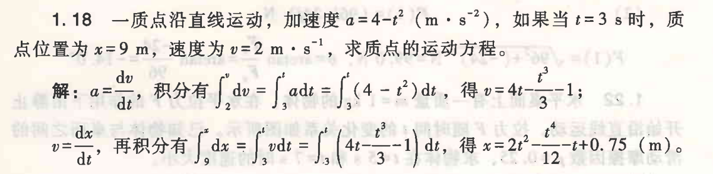

### 1. 前置知识讲解
*   **积分法**：已知加速度 $a(t)$，通过一次积分求速度 $v(t)$，再次积分求位移 $x(t)$。
*   **初始条件**：积分时产生的常数需要利用已知条件（如某时刻的位置或速度）来确定。

### 2. 详细答案解析
已知：一质点沿直线运动，加速度 $a = 4 - t^2 \text{ (m/s}^2\text{)}$；当 $t=3\text{ s}$ 时，$x=9\text{ m}$，$v=2\text{ m/s}$。求质点的运动方程。

**求速度 $v(t)$**
$\frac{dv}{dt} = a = 4 - t^2 \implies dv = (4 - t^2)dt$
积分：$\int dv = \int (4 - t^2)dt \implies v = 4t - \frac{1}{3}t^3 + C_1$
利用初始条件 $t=3, v=2$：
$2 = 4(3) - \frac{1}{3}(3^3) + C_1 \implies 2 = 12 - 9 + C_1 \implies C_1 = -1$
故 $v(t) = 4t - \frac{1}{3}t^3 - 1 \text{ (m/s)}$

**求运动方程 $x(t)$**
$\frac{dx}{dt} = v = 4t - \frac{1}{3}t^3 - 1 \implies dx = (4t - \frac{1}{3}t^3 - 1)dt$
积分：$\int dx = \int (4t - \frac{1}{3}t^3 - 1)dt \implies x = 2t^2 - \frac{1}{12}t^4 - t + C_2$
利用初始条件 $t=3, x=9$：
$9 = 2(3^2) - \frac{1}{12}(3^4) - 3 + C_2 \implies 9 = 18 - 6.75 - 3 + C_2 \implies 9 = 8.25 + C_2 \implies C_2 = 0.75$
故运动方程为：$x = 2t^2 - \frac{1}{12}t^4 - t + 0.75 \text{ (m)}$

---

## 1.25 均质链条下落的冲击力

### 题目
1.25 如图所示，长L的均质链条质量为m，将其一端拉起，使链条自由下垂，并下端触地。若让链条下落，试求出地面对链条作用力的大小是如何随下落高度h改变的? 并求出该作用力的平均值。
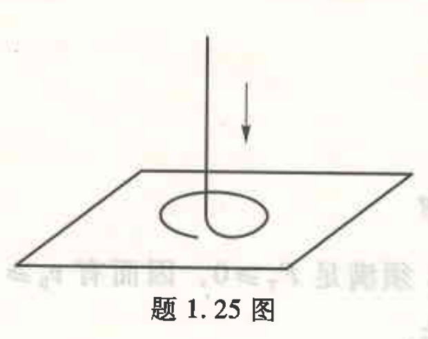

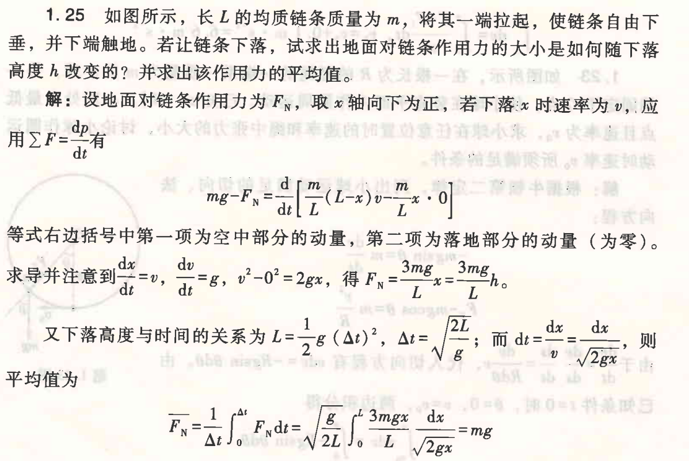

### 1. 前置知识讲解
*   **动量定理的微分形式**：$\vec{F}_{ext} = \frac{d\vec{p}}{dt}$。当物体质量分布随时间变化（如链条堆积在地面）时，必须考虑动量的变化率。
*   **力的组成**：地面对链条的作用力 $F_N$ 包含两部分：支持链条静止部分的力（重力）和阻碍链条运动部分停下的冲击力。

### 2. 详细答案解析
设链条线密度 $\lambda = m/L$。当下落高度为 $x$ 时（即题目中的 $h$）：

**分析受力与动量**
取向下为 $x$ 轴正方向。
空中部分长度 $(L-x)$，其整体速度为 $v = \sqrt{2gx}$，加速度为 $g$。
落地部分长度 $x$，其动量为 $0$。
系统总动量 $p = \lambda(L-x)v + \lambda x \cdot 0 = \lambda(L-x)v$。

**应用动量定理**
系统受外力：总重力 $mg$ 和地面的支持力 $F_N$（向上为负）。
$mg - F_N = \frac{dp}{dt} = \frac{d}{dt} [\lambda(L-x)v]$
$mg - F_N = \lambda \left[ \frac{d(L-x)}{dt} v + (L-x) \frac{dv}{dt} \right]$
由于 $\frac{dx}{dt} = v$，则 $\frac{d(L-x)}{dt} = -v$。又 $\frac{dv}{dt} = g$。
$mg - F_N = \lambda [ -v^2 + (L-x)g ] = \lambda [ -2gx + Lg - xg ] = \lambda Lg - 3\lambda gx = mg - 3\lambda gx$
整理得：$F_N = 3\lambda gx = \frac{3mg}{L}h$

**求平均作用力**
平均值定义：$\bar{F}_N = \frac{1}{\Delta t} \int_0^{\Delta t} F_N dt$。
下落过程 $\Delta t = \sqrt{2L/g}$。利用 $dt = \frac{dx}{v} = \frac{dx}{\sqrt{2gx}}$ 换元积分：
$\bar{F}_N = \frac{1}{\Delta t} \int_0^L \frac{3mgx}{L} \cdot \frac{dx}{\sqrt{2gx}} = \sqrt{\frac{g}{2L}} \cdot \frac{3mg}{L\sqrt{2g}} \int_0^L x^{1/2} dx = \sqrt{\frac{g}{2L}} \cdot \frac{3mg}{L\sqrt{2g}} \cdot \frac{2}{3}L^{3/2} = mg$

---

## 1.35 变力作用下的冲量计算

### 题目
1.35 力 $F$ 作用在质量 $m=2 \text{ kg}$ 的质点上，使之沿 $x$ 轴运动。已知在此力作用下质点的运动方程为 $x=3+5t+6t^2-t^3$，其中时间 $t$ 的单位为 $\text{s}$，$x$ 的单位为 $\text{m}$。求该力在 $t=0$ 至 $t=4 \text{ s}$ 内的冲量。

### 1. 前置知识讲解
*   **冲量 ($I$)**：力对时间的累积效果，$I = \int F dt$。
*   **动量定理**：合外力的冲量等于动量的增量，$I = \Delta p = mv_2 - mv_1$。
*   **物理意义**：本题中位移方程已知，可以直接求出速度的变化，从而规避直接积分力的过程。

### 2. 详细答案解析
已知：$m=2\text{ kg}$，运动方程 $x = 3 + 5t + 6t^2 - t^3$。求该力在 $t=0$ 至 $t=4 \text{ s}$ 内的冲量。

**求速度函数**
$v = \frac{dx}{dt} = 5 + 12t - 3t^2$

**计算起始与末了动量**
$t=0\text{ s}$ 时，$v_0 = 5 + 0 - 0 = 5 \text{ m/s}$
$t=4\text{ s}$ 时，$v_4 = 5 + 12(4) - 3(4^2) = 5 + 48 - 48 = 5 \text{ m/s}$

**应用动量定理求冲量**
$I = \Delta p = m(v_4 - v_0) = 2 \text{ kg} \times (5 \text{ m/s} - 5 \text{ m/s}) = 0 \text{ N}\cdot\text{s}$

---

## 1.36 变力作用下的速度计算

### 题目
1.36 一质量 $m=3 \text{ kg}$ 的质点在力 $F=75-30t \text{ (N)}$ 作用下，从 $t=0$ 时刻由静止出发作直线运动，当 $t=4 \text{ s}$ 时，该力的冲量是多少？质点的速率是多少？

### 1. 前置知识讲解
*   **冲量定义式**：直接对力 $F(t)$ 进行时间积分。
*   **初状态**：由静止出发意味着 $v_0 = 0$。

### 2. 详细答案解析
已知：$m=3\text{ kg}$，力 $F = 75 - 30t \text{ (N)}$，从 $t=0$ 时刻由静止出发。求 $t=4 \text{ s}$ 时的冲量及速率。

**计算 $4\text{ s}$ 内的冲量**
$I = \int_0^4 F dt = \int_0^4 (75 - 30t) dt = [75t - 15t^2]_0^4$
$I = 75(4) - 15(16) = 300 - 240 = 60 \text{ N}\cdot\text{s}$

**求末速率**
由动量定理 $I = mv_4 - mv_0$
$60 = 3 \cdot v_4 - 0 \implies v_4 = 20 \text{ m/s}$

---

## 1.39 角动量与力矩

### 题目
1.39 一个质量为 $m=3.0$ kg 的质点位于 $r=(3i+8j)$ m 处时的速度为 $v=(5i-6j)$ m $\cdot s^{-1}$，此刻一力 $F=-7i$ N 作用在该质点上，求: (1) 质点的角动量； (2) 质点所受的力矩； (3) 质点角动量的时间变化率。

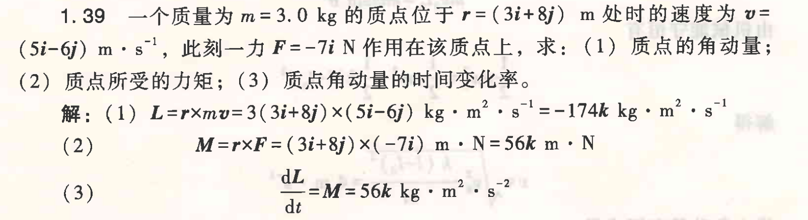

### 1. 前置知识讲解
*   **角动量 ($\vec{L}$)**：质点对某点的转动强度，$\vec{L} = \vec{r} \times \vec{p} = \vec{r} \times (m\vec{v})$。
*   **力矩 ($\vec{\tau}$)**：力对某点的转动效果，$\vec{\tau} = \vec{r} \times \vec{F}$。
*   **转动定律（质点版）**：$\frac{d\vec{L}}{dt} = \vec{\tau}$，即角动量随时间的变化率等于所受的合力矩。
*   **矢量叉乘 ($\times$)**：在直角坐标系中，$\vec{i}\times\vec{j}=\vec{k}$，$\vec{j}\times\vec{i}=-\vec{k}$，同向矢量叉乘为 $0$。

### 2. 详细答案解析
已知：$m=3.0\text{ kg}$，$\vec{r} = (3\vec{i} + 8\vec{j}) \text{ m}$，$v = (5\vec{i} - 6\vec{j}) \text{ m/s}$，力 $\vec{F} = -7\vec{i} \text{ N}$。

**(1) 质点的角动量**
$\vec{L} = \vec{r} \times (m\vec{v}) = (3\vec{i} + 8\vec{j}) \times [3(5\vec{i} - 6\vec{j})] = (3\vec{i} + 8\vec{j}) \times (15\vec{i} - 18\vec{j})$
$\vec{L} = 3\vec{i} \times 15\vec{i} + 3\vec{i} \times (-18\vec{j}) + 8\vec{j} \times 15\vec{i} + 8\vec{j} \times (-18\vec{j})$
$\vec{L} = 0 - 54\vec{k} - 120\vec{k} + 0 = -174\vec{k} \text{ (kg}\cdot\text{m}^2\text{/s)}$

**(2) 质点所受的力矩**
$\vec{\tau} = \vec{r} \times \vec{F} = (3\vec{i} + 8\vec{j}) \times (-7\vec{i})$
$\vec{\tau} = 3\vec{i} \times (-7\vec{i}) + 8\vec{j} \times (-7\vec{i}) = 0 + 56\vec{k} = 56\vec{k} \text{ (N}\cdot\text{m)}$

**(3) 角动量的时间变化率**
根据转动定律：$\frac{d\vec{L}}{dt} = \vec{\tau} = 56\vec{k} \text{ (kg}\cdot\text{m}^2\text{/s}^2\text{)}$

---

## 2.14 组合物体与滑轮的加速度计算

### 题目
2.14 如图所示，在倾角 $\theta = 30^\circ$ 的固定斜面顶端有一质量 $m = 20 \text{ kg}$、半径 $R = 0.2 \text{ m}$ 的定滑轮，滑轮绕其中心轴的转动惯量为 $mR^2/2$，斜面上有质量 $m_1 = 5 \text{ kg}$ 的物体经一不可伸长的轻绳连接跨过滑轮与另一质量 $m_2 = 10 \text{ kg}$ 的物体相连。设斜面与 $m_1$ 之间 的滑动摩擦系数 $\mu = 0.25$，滑轮轴上摩擦可忽略，绳与滑轮之间无相对滑动。求物体运动的加速度 $a$ 及绳中的张力 $F_{T1}$ 与 $F_{T2}$。

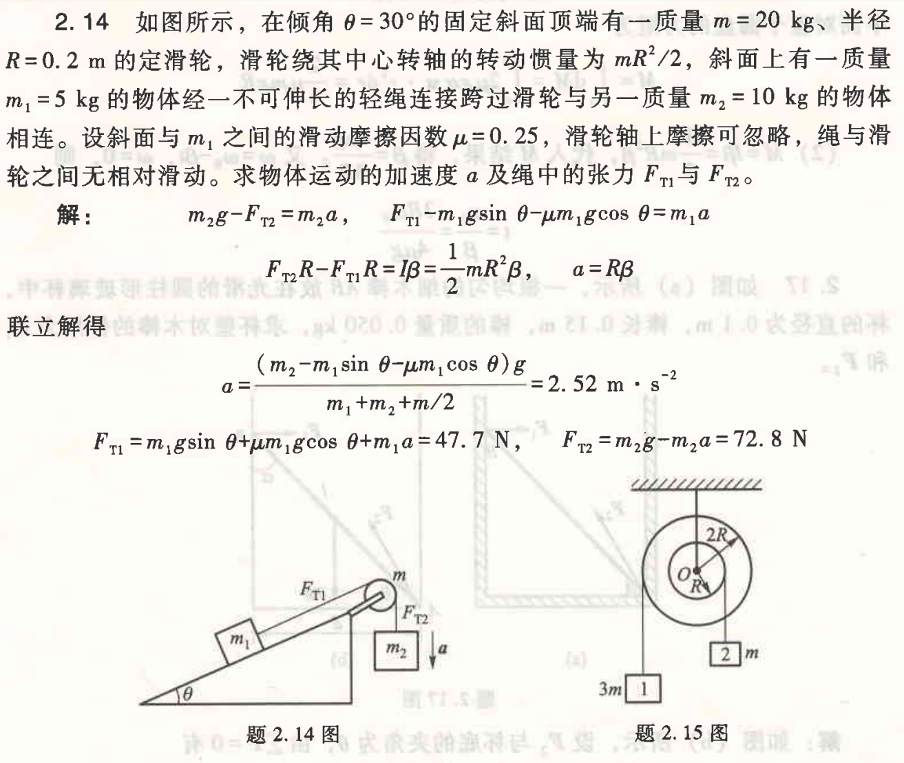

### 1. 前置知识讲解
*   **定轴转动定律**：对于绕固定轴转动的刚体，它所受的合外力矩 $M$ 等于转动惯量 $I$ 与角加速度 $\alpha$ 的乘积，即 $M = I\alpha$。
*   **转动惯量 ($I$)**：描述物体转动惯性大小的物理量，滑轮的 $I = \frac{1}{2}mR^2$。
*   **力矩 ($M$)**：力使物体绕轴转动的趋向，大小等于力 $F$ 乘以力臂 $d$。
*   **角加速度 ($\beta$) 与线加速度 ($a$)**：若绳与滑轮无相对滑动，则 $a = R\beta$。

### 2. 详细答案解析
本题涉及三个研究对象：物体 $m_1$、物体 $m_2$ 和滑轮 $m$。
*   **对 $m_2$（受重力和绳子张力 $F_{T2}$）**：
    由牛顿第二定律：$m_2 g - F_{T2} = m_2 a$ （1）
*   **对 $m_1$（沿斜面受张力 $F_{T1}$、重力分量、摩擦力）**：
    由牛顿第二定律：$F_{T1} - m_1 g \sin \theta - \mu m_1 g \cos \theta = m_1 a$ （2）
*   **对滑轮 $m$（受两边张力的力矩）**：
    由定轴转动定律：$(F_{T2} - F_{T1})R = I \beta = (\frac{1}{2}mR^2) \cdot \frac{a}{R} \implies F_{T2} - F_{T1} = \frac{1}{2}ma$ （3）

**联立方程：**
将（1）和（2）代入（3）：
$(m_2 g - m_2 a) - (m_1 g \sin \theta + \mu m_1 g \cos \theta + m_1 a) = \frac{1}{2}ma$
整理得：$$a = \frac{(m_2 - m_1 \sin \theta - \mu m_1 \cos \theta) g}{m_1 + m_2 + \frac{m}{2}}$$
代入数据得 $a \approx 2.52 \text{ m/s}^2$。
进一步求得 $F_{T1} \approx 47.7 \text{ N}$，$F_{T2} \approx 72.8 \text{ N}$。

---

## 2.15 阶梯鼓轮转动分析

### 题目
2.15 如图所示，安装在固定光滑水平轴上的鼓轮由大小两个圆盘固连组成，两个圆盘上各自绕有绳索，绳端分别挂有一物体。挂在小圆盘上的物体质量 $m=2\text{ kg}$，挂在大圆盘上的物体质量为 $3m$；小圆盘半径 $R=0.05\text{ m}$、质量为 $m$；大圆盘半径为 $2R$、质量为 $2m$。求鼓轮的角加速度与每根绳中的张力。

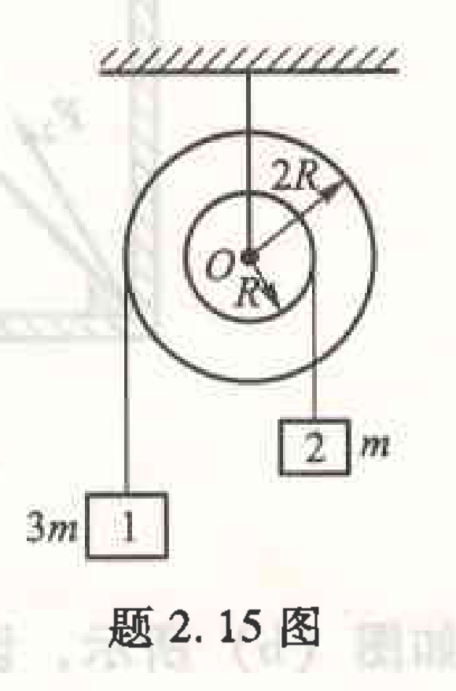
(注：图中标记 1 和 2 分别对应质量 $3m$ 和 $m$)

### 1. 前置知识讲解
*   **组合刚体的转动惯量**：总转动惯量等于各部分之和，$I_{total} = \sum I_i$。
*   **鼓轮（阶梯轴）**：由于两部分半径不同，绳子下落的线加速度也不同。若角加速度为 $\beta$，则半径 $r$ 处的加速度 $a = r\beta$。

### 2. 详细答案解析
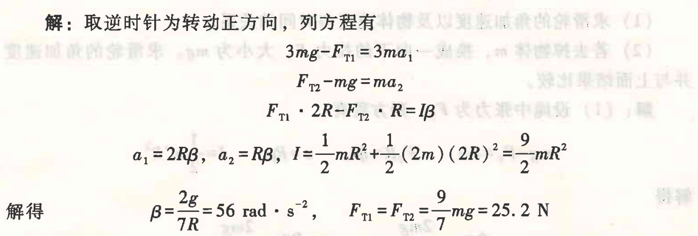

*   **鼓轮的总转动惯量**：
    小盘：$I_1 = \frac{1}{2}mR^2$，大盘：$I_2 = \frac{1}{2}(2m)(2R)^2 = 4mR^2 \implies I = 4.5mR^2$。
*   **物体运动方程**：
    对于 $3m$ 物体（挂在 $2R$）：$3mg - F_{T1} = 3m(2R\beta)$
    对于 $m$ 物体（挂在 $R$）：$F_{T2} - mg = m(R\beta)$
*   **鼓轮转动方程**：
    $F_{T1} \cdot 2R - F_{T2} \cdot R = I\beta = 4.5mR^2\beta$

**联立求解**：
解得 $\beta = \frac{2g}{7R} = 56 \text{ rad/s}^2$，张力 $F_{T1} = F_{T2} = \frac{9}{7}mg = 25.2 \text{ N}$。

---

## 2.19 圆盘受挂物拉动的功与动能

### 题目
2.19 如图所示，一圆盘的质量为 50 kg，半径为 1.80 m，可绕通过圆心垂直盘面的水平光滑轴旋转。一根不可伸长的轻绳一端缠绕在圆盘上，另一端悬挂 一个质量为 2 kg 的物体。求：(1) 绳中张力多大？(2) 从静止开始转动 5 s 后， 张力的力矩对圆盘做了多少功？这时圆盘的动能多大？

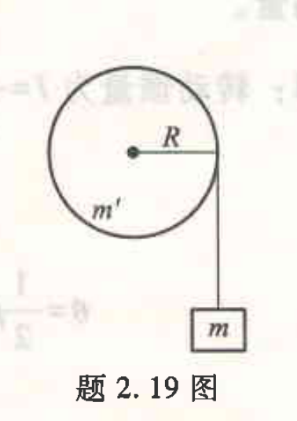

### 1. 前置知识讲解
*   **力矩做功**：恒定力矩下 $W = M\theta$。
*   **转动动能定理**：合外力矩做的功等于转动动能的增量，$W = \Delta E_k$。

### 2. 详细答案解析
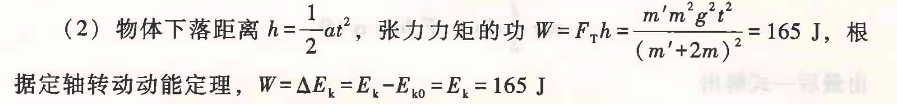

(1) **求张力 $F_T$**：
联立物体 $mg - F_T = ma$ 与圆盘 $F_T R = \frac{1}{2}m'R^2 \beta$。
解得 $a = \frac{2mg}{m'+2m}$，$F_T = \frac{m'mg}{m'+2m} = 18.1 \text{ N}$。

(2) **求功与动能**：
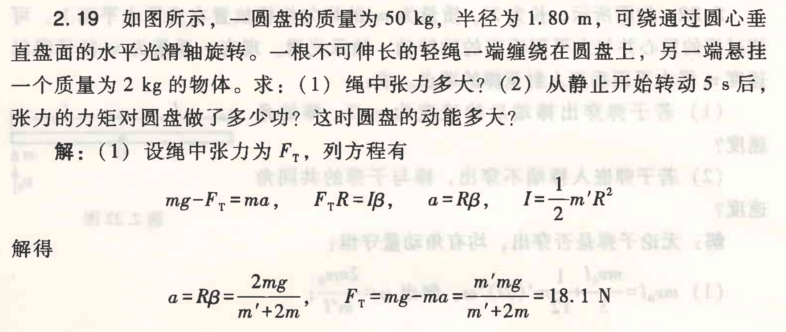
$t=5\text{ s}$ 时，下落高度 $h = \frac{1}{2}at^2 \approx 9.075 \text{ m}$。
功 $W = F_T h \approx 165 \text{ J}$。
由动能定理，$E_k = W = 165 \text{ J}$。

---

## 2.22 子弹击中细棒的角动量守恒

### 题目
2.22 如图所示，长为 $2l$、质量为 $m'$ 的均匀细棒放置在光滑水平面上，可绕过棒的质心并与水平面垂直的轴转动，轴承光滑。现有一质量为 $m$ 的子弹以速度 $v_0$ 沿水平面垂直入射至棒的端点。求：
(1) 若子弹穿出棒端后的速度为 $v_0/3$，棒的角速度？
(2) 若子弹嵌人棒端不穿出，棒与子弹的共同角速度？

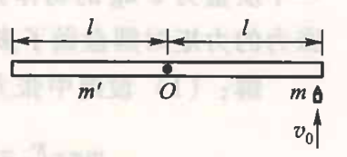

### 1. 前置知识讲解
*   **角动量守恒定律**：合外力矩为零时，系统角动量守恒。
*   **平动转化的角动量**：质点 $mv$ 对轴的角动量为 $mv \cdot d$ ($d$ 为垂距)。

### 2. 详细答案解析
棒长 $2l$，转动惯量 $I_{棒} = \frac{1}{3}m'l^2$。
(1) **子弹穿出**：
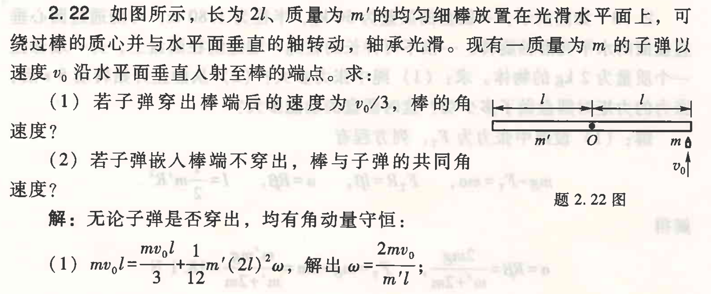
$mv_0l = \frac{1}{3}mv_0l + I_{棒}\omega \implies \omega = \frac{2mv_0}{m'l}$。
(2) **子弹嵌入**：
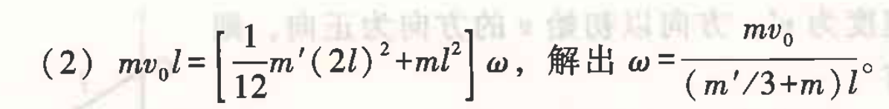
$mv_0l = (I_{棒} + ml^2)\omega \implies \omega = \frac{mv_0}{(\frac{m'}{3} + m)l}$。

---

## 2.23 随时间变化的转动惯量与角动量守恒

### 题目
2.23 如图所示，转台绕中心竖直轴以角速度 $\omega_0$ 匀速转动，转台对该转轴的转动惯量 $I_0 = 5 \times 10^{-5} \text{ kg} \cdot \text{m}^2$。今有沙粒以 $q = 1 \text{ g} \cdot \text{s}^{-1}$ 的速度落入转台，沙粒黏附在转台表面上形成一半径 $r = 0.1 \text{ m}$ 的圆形。当沙粒落到转台上后，转台的角速度要变慢，试求当角速度减到 $\omega_0/2$ 时所需的时间。

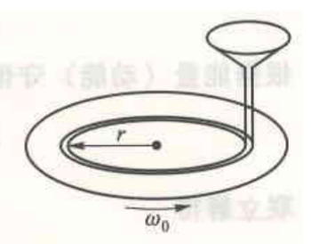

### 1. 前置知识讲解
*   **变质量系统**：沙粒落入系统，导致转动惯量 $I(t)$ 随时间线性增加。

### 2. 详细答案解析
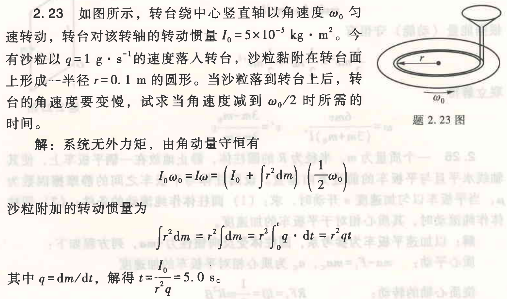

$t$ 秒后，沙粒增加质量 $\Delta m = qt$，增加转动惯量 $\Delta I = qt \cdot r^2$。
由角动量守恒：$I_0 \omega_0 = (I_0 + qr^2 t) \frac{\omega_0}{2} \implies I_0 = qr^2 t$。
解得 $t = \frac{I_0}{r^2 q} = 5.0 \text{ s}$。

---

## 3.20 刚性双原子分子的能量

### 题目
3.20 若某种刚性双原子分子理想气体处于温度为 300 K 的平衡态，求下列各量：
(1) 分子的平均平动动能；
(2) 分子的平均总动能；
(3) 分子的平均总能量；
(4) 1 mol 气体分子的总转动动能；
(5) 1 mol 气体的内能。

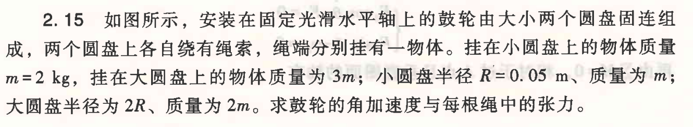

### 1. 前置知识讲解
*   **自由度 ($i$)**：刚性双原子分子 $i=5$。
*   **能均分定理**：每个自由度平均能量 $\frac{1}{2}kT$。

### 2. 详细答案解析
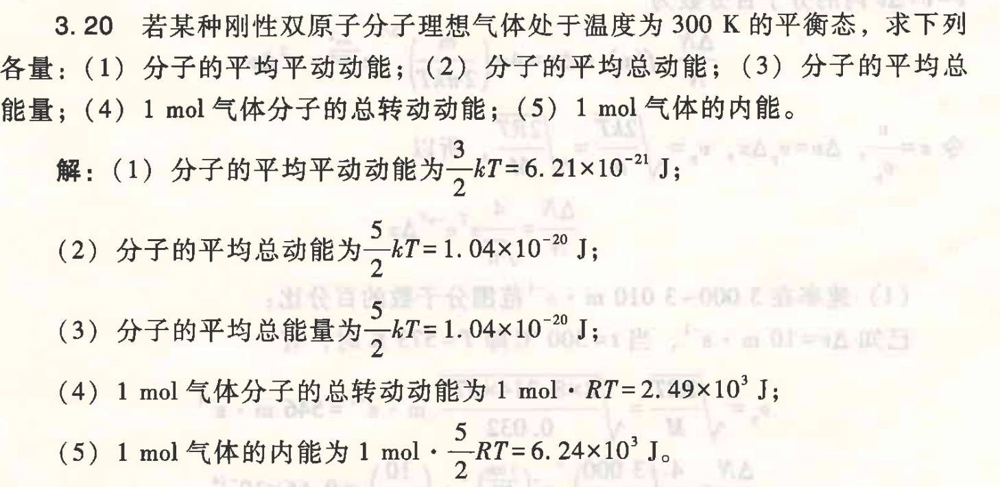

$T=300\text{ K}$。
(1) 平均平动能：$\frac{3}{2}kT = 6.21 \times 10^{-21} \text{ J}$。
(2) 平均总动能：$\frac{5}{2}kT = 1.04 \times 10^{-20} \text{ J}$。
(3) 平均总能量：$1.04 \times 10^{-20} \text{ J}$。
(4) 1 mol 总转动能：$N_A \cdot (\frac{2}{2}kT) = RT = 2.49 \times 10^3 \text{ J}$。
(5) 1 mol 内能：$\frac{5}{2}RT = 6.24 \times 10^3 \text{ J}$。

---

## 3.21 混合气体的能量百分比

### 题目
3.21 在某一温度下，将体积和压强都相同的氦气和氢气 (均视为刚性分子理想气体) 混合，求所有氢气分子所具有的能量在混合气体系统总能量中所占的百分比。

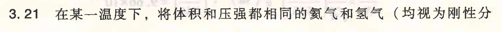

### 1. 前置知识讲解
*   **理想气体状态方程**：$pV=nRT \implies$ 同温同压同体积下 $n$ 相同。

### 2. 详细答案解析
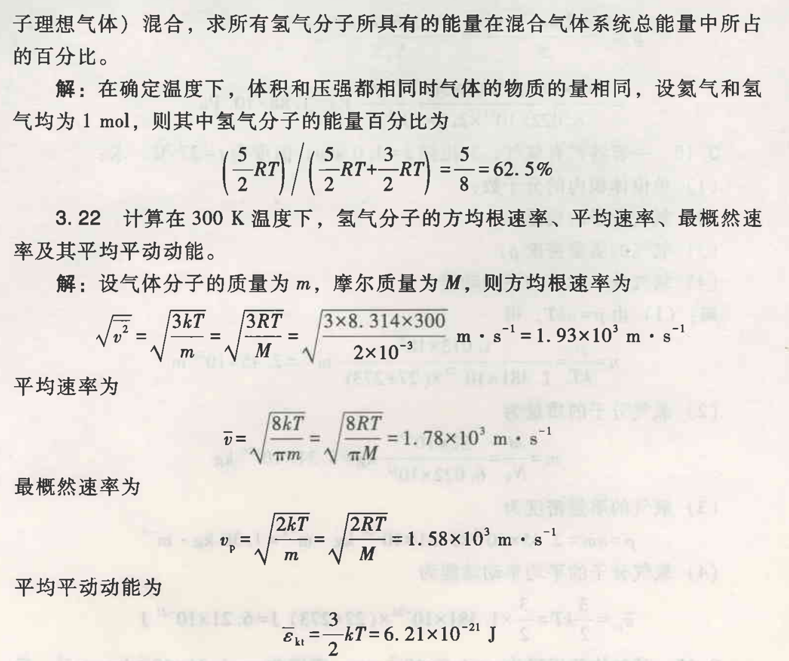

氦气 $i_1=3$，氢气 $i_2=5$。
$$ \text{百分比} = \frac{\frac{5}{2}nRT}{\frac{3}{2}nRT + \frac{5}{2}nRT} = \frac{5}{8} = 62.5\% $$

---

## 3.22 气体的统计速率计算

### 题目
3.22 计算在 300 K 温度下，氢气分子的方均根速率、平均速率、最概然速率及其平均平动动能。

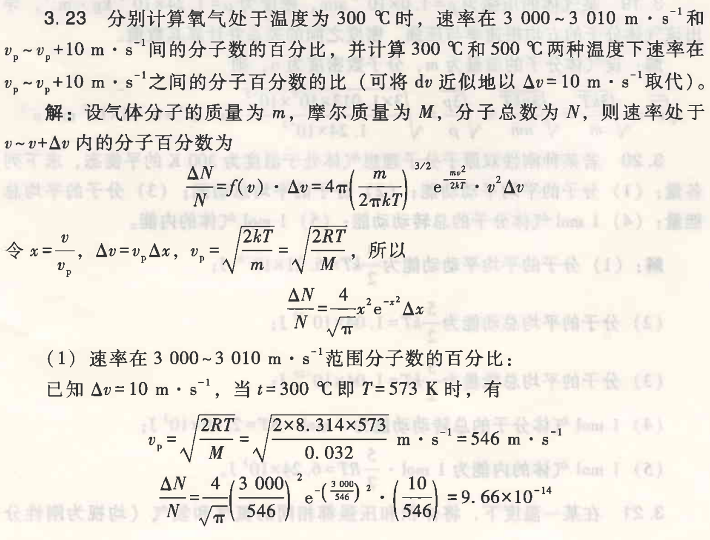

### 1. 前置知识讲解
*   三种速率公式：$v_{rms} = \sqrt{3RT/M}$，$v_{avg} = \sqrt{8RT/\pi M}$，$v_{p} = \sqrt{2RT/M}$。

### 2. 详细答案解析
代入 $T=300\text{ K}$, $H_2 (M=2\times10^{-3})$：
$v_{rms} = 1.93 \times 10^3 \text{ m/s}$， $v_{avg} = 1.78 \times 10^3 \text{ m/s}$， $v_{p} = 1.58 \times 10^3 \text{ m/s}$。
平均平动能：$6.21 \times 10^{-21} \text{ J}$。

---

## 3.23 麦克斯韦速率分布函数应用

### 题目
3.23 分别计算氧气处于温度为 $300 \text{ ℃}$ 时，速率在 $v_p \sim v_p + 10 \text{ m} \cdot \text{s}^{-1}$ 间的分子数的百分比，并计算 $300 \text{ ℃}$ 和 $500 \text{ ℃}$ 两种温度下速率在 $v_p \sim v_p + 10 \text{ m} \cdot \text{s}^{-1}$ 之间的分子百分数的比 (可将 $dv$ 近似地以 $\Delta v = 10 \text{ m} \cdot \text{s}^{-1}$ 取代)。

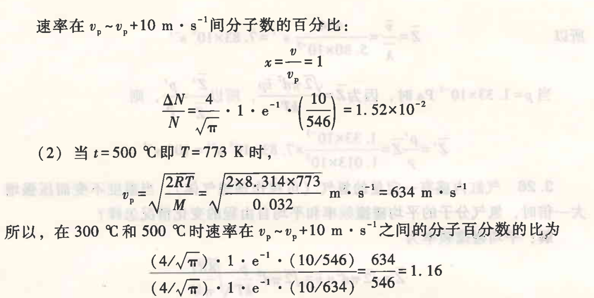

### 1. 前置知识讲解
*   **分子数占比**：$\frac{\Delta N}{N} \approx f(v) \Delta v$。

### 2. 详细答案解析
(1) $300^\circ\text{C}$ 时，$v_p \sim v_p+10$ 占比：
代入 $f(v_p) = \frac{4}{\sqrt{\pi} e v_p}$，$v_p = 546 \text{ m/s}$，得 $1.52 \times 10^{-2} = 1.52\%$。
(2) 比值：
比值 $= \frac{v_{p2}}{v_{p1}} = \frac{634}{546} \approx 1.16$。
