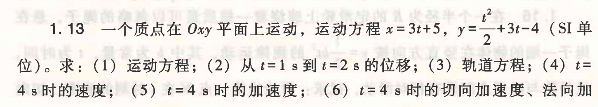
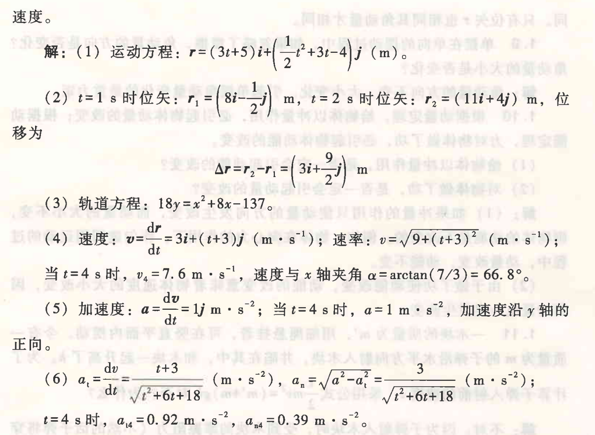
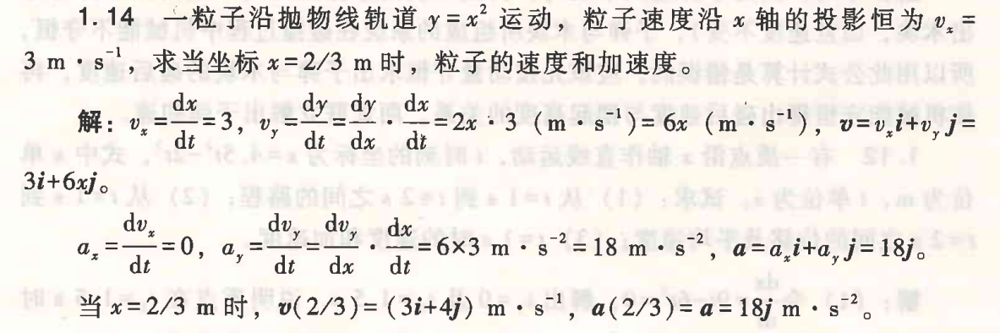
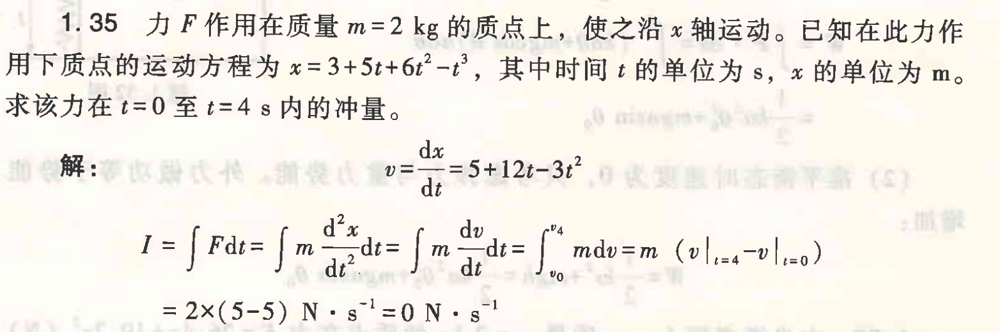
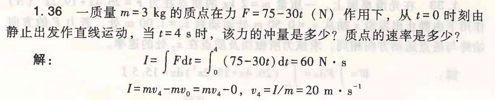

# 1.14

一粒子沿抛物线轨道 $y=x^2$ 运动，粒子速度沿 $x$ 轴的投影恒为 $v_x=3 \text{ m}\cdot\text{s}^{-1}$，求当坐标 $x=2/3 \text{ m}$ 时，粒子的速度和加速度。

## 解：

$v_x = \frac{dy}{dx} = 3$

$v_y = \frac{dy}{dt} = \frac{dy}{dx} \cdot \frac{dx}{dt} = 2x \cdot 3 (\text{m}\cdot\text{s}^{-1}) = 6x (\text{m}\cdot\text{s}^{-1})$

$v = v_x \hat{i} + v_y \hat{j} = 3\hat{i} + 6x\hat{j}$

导数计算：

$a_x = \frac{dv_x}{dt} = 0$

$a_y = \frac{dv_y}{dt} = \frac{dv_y}{dx} \cdot \frac{dx}{dt} = 6 \times 3 \text{ m}\cdot\text{s}^{-2} = 18 \text{ m}\cdot\text{s}^{-2}$

$a = a_x \hat{i} + a_y \hat{j} = 18\hat{j}$

当 $x = \frac{2}{3} \text{ m}$ 时，
$v(2/3) = (3i + 4j) \text{ m}\cdot\text{s}^{-1}$
$a = a = 18j \text{ m}\cdot\text{s}^{-2}$

1.18 一质点沿直线运动，加速度$a=4-t^{2}$( $\mathrm{m} \cdot \mathrm{s}^{-2}$ ), 如果当 $t=3 \mathrm{~s}$ 时，质点位置为 $x=9 \mathrm{~m}$, 速度为 $v=2 \mathrm{~m} \cdot \mathrm{s}^{-1}$, 求质点的运动方程。

解: $a=\frac{\mathrm{dv}}{\mathrm{dt}}$, 积分有 $\int_{2}^{v}$ d $v=\int_{3}^{\mathrm{t}} a d t=\int_{3}^{\mathrm{t}}\left(4-t^{2}\right) d t$, 得 $v=4 t-\frac{t^{3}}{3}-1$;

$$ v=\frac{\mathrm{dx}}{\mathrm{dt}} , \text { 再积分有 } \int_{9}^{x} \mathrm{dx}=\int_{3}^{t} v \mathrm{dt}=\int_{3}^{t}\left(4 t-\frac{t^{3}}{3}-1\right) \mathrm{dt} \text {, 得 } x=2 t^{2}-\frac{t^{4}}{12}-t+0.75 \text { (m)。 } $$
1.25

如图所示, 长L的均质链条质量为m, 将其一端拉起, 使链条自由下垂, 并下端触地。若让链条下落, 试求出地面对链条作用力的大小是如何随下落高度h改变的? 并求出该作用力的平均值。

解: 设地面对链条作用力为$F_{\mathrm{N}}$, 取x轴向下为正, 若下落x时速率为v, 应用∑F=dp/dt有

$$
m g-F_{\mathrm{N}}=\mathrm{d} \quad\left[\frac{m}{L}(L-x) v-\frac{m}{L} x \cdot 0\right]
$$

等式右边括号中第一项为空中部分的动量, 第二项为落地部分的动量 (为零)。求导并注意到dx/dt=v, dv/dt=g,v²-0²=2gx, 得F_{N }=(3mg/L) x=(3mg/L) h 。

又下落高度与时间的关系为L=(1/2)g(Δt)², Δt=√(2L/g); 而dt=dx/v=dx/√(2gx), 则平均值为

$$
\bar{F}_{\mathrm{N}}=\frac{1}{\Delta t} \int_{0}^{\Delta t} F_{\mathrm{N}} \mathrm{dt}=\sqrt{\frac{g}{2 L}} \int_{0}^{L} \frac{3 m g x}{L} \frac{\mathrm{dx}}{\sqrt{2 g x}}=m g
$$

