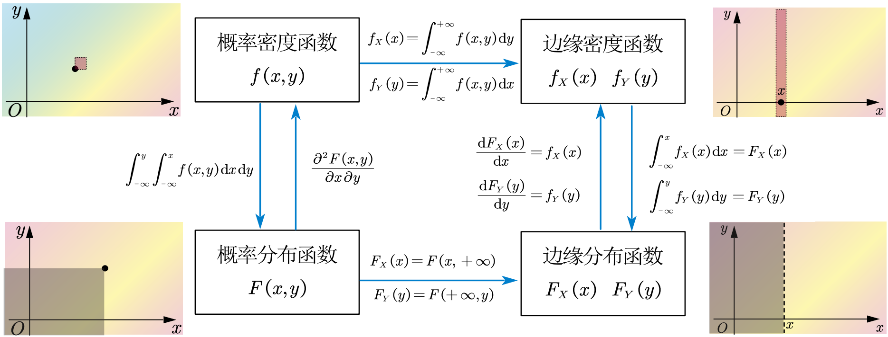
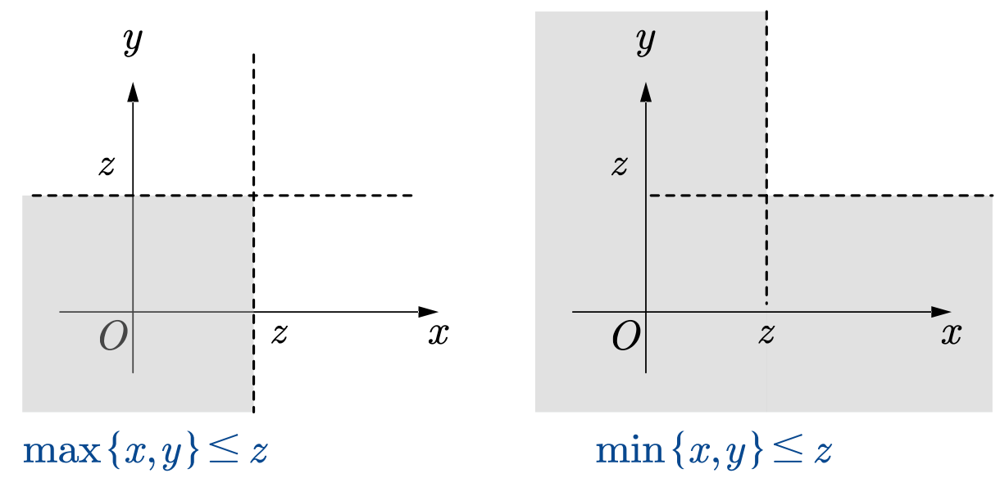
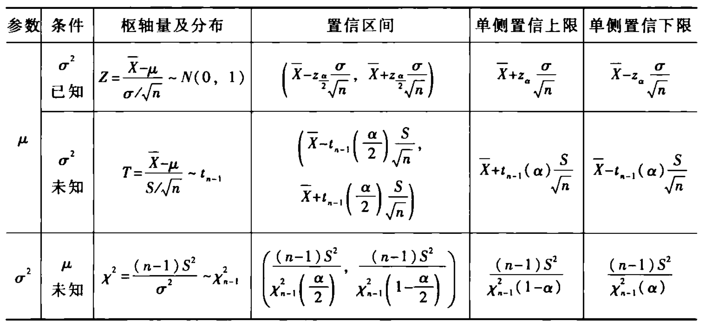
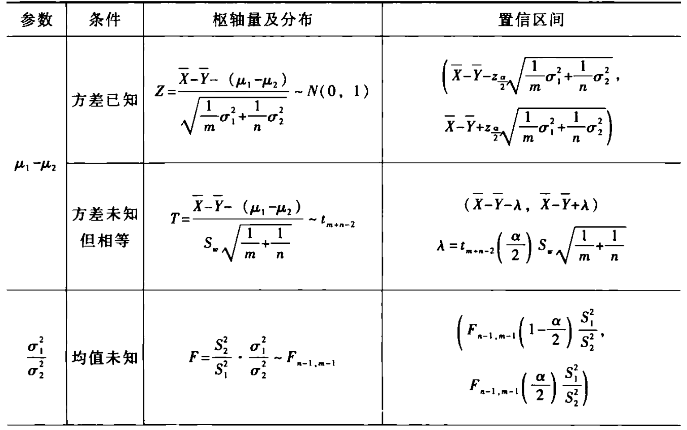
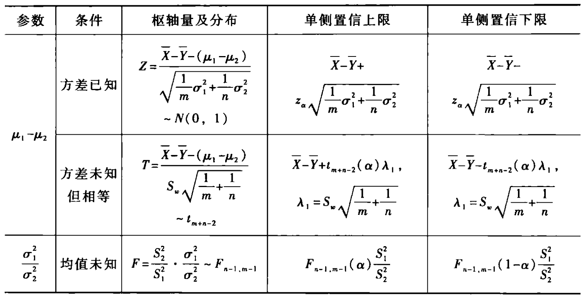
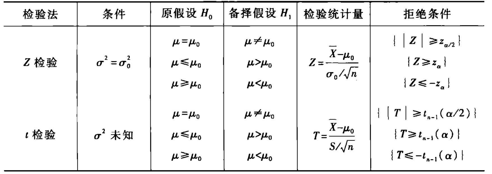
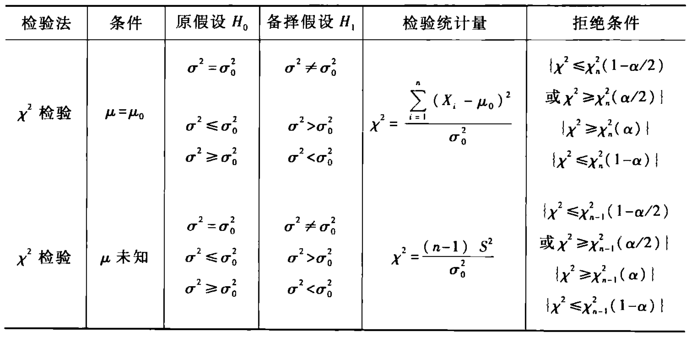
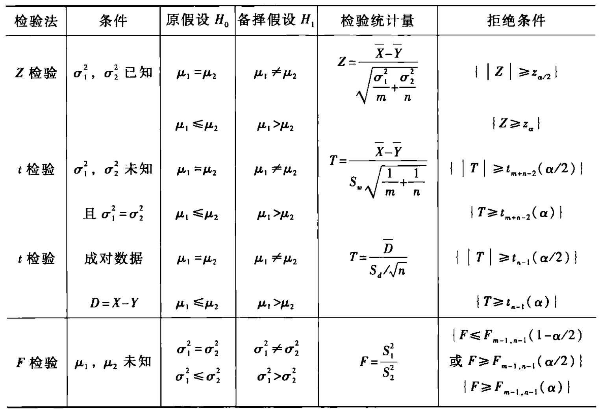

# 一 随机事件与概率

## 1 德摩根率

- **长杠变短杠，符号变方向**

$$
\overline{\bigcup_{i=1}^{n} A_i} = \bigcap_{i=1}^{n} \overline{A_i} \quad \overline{\bigcap_{i=1}^{n} A_i} = \bigcup_{i=1}^{n} \overline{A_i}
$$

## 2 概率加法公式

- $$P(A+B+C)=P(A)+P(B)+P(C)-P(AB)-P(BC)-P(AC)+P(ABC)$$

# 二 多维随机变量及其分布

## 1 四种函数的关系

# 2 一维随机变量的函数

## 3 多维随机变量的函数

### 3.1 极值分布

$\max{(𝑋, 𝑌)} ≤ 𝑧$，即$(𝑋 ≤ 𝑧) ∩ (𝑌 ≤ 𝑧)$，即两者都得比$𝑧$小。

$\min{(𝑋, 𝑌)} ≤ 𝑧$，即$(𝑋 ≤ 𝑧) ∪ (𝑌 ≤ 𝑧)$，即两者不能都比$𝑧$大。

当 $X$ 和 $Y$ 不独立时，如果我们知道了$(𝑋, 𝑌)$的概率分布𝐹(𝑥, 𝑦)，则可很简单地计算𝑍的概率分布：

- $𝑍=\max{(𝑋, 𝑌)}$，则$𝐹_𝑍(𝑧)=F(z,z)$

- $𝑍=\min{(𝑋, 𝑌)}$，则$𝐹_𝑍(𝑧) =  𝐹(𝑧, +∞) + 𝐹(+∞, 𝑧) − 𝐹(𝑧, 𝑧)。$

当 $X$ 和 $Y$ 相互独立时，它们的极大值和极小值分布有非常简洁的表达方式：

- 最大值 $Z = \max(X_1,X_2,\dots,X_n )$  
  $$F_{Z}(z) = P(\max(X_1,X_2,\dots,X_n ) \le z) \\ = P(X_1 \le z,X_2 \le z, \dots ,X_n \le z) \\= P(X_1 \le z)P(X_2 \le z)\dots P(X_n \le z) \\= F_{X_1}(z) F_{X_2}(z)\dots F_{X_n}(z)$$
- 最小值 $Z = \min(X_1,X_2,\dots,X_n )$
  $$F_{Z}(z) = P(\min(X_1,X_2,\dots,X_n ) \le z) \\= 1-P(\min(X_1,X_2,\dots,X_n )>z)\\=1-P(X_1>z,X_2>z,\dots,X_n>z)\\= 1-P(X_1>z)P(X_2>z)\dots P(X_n>z) \\= 1 - [1 - F_{X_1}(z)][1 - F_{X_2}(z)]\dots [1-F_{X_n}(z)]$$

### 3.2 $Z=aX+bY$

已知 $X \sim U(1, 2)$，$Y \sim U(1, 2)$ 且相互独立。求 $Z = 2X - Y$ 的分布函数 $F_Z(z)$

- 边缘密度函数：  
  ​$f_X(x) = 1$ ($1 < x < 2$)，其他为0。  
  ​$f_Y(y) = 1$ ($1 < y < 2$)，其他为0。
- 联合密度函数：  
  ​$f(x, y) = 1$ ($1 < x < 2, 1 < y < 2$)，图形是一个正方形区域。
- $Z$ 的取值范围：  
  ​$Z_{min} = 2(1) - 2 = 0$，$Z_{max} = 2(2) - 1 = 3$，即 $0 < z < 3$。

$F_Z(z) = P\{2X - Y \leq z\} = P\{Y \geq 2X - z\}$。

1. 当 $0 \le z < 1$ 时：$F_Z(z) = \frac{1}{2} \cdot \left(\frac{z}{2}\right) \cdot z = \frac{z^2}{4}$
2. 当 $1 \le z < 2$ 时：$F_Z(z) = \frac{1}{2} \cdot \left(\frac{1}{2} + \frac{z-1}{2} + \frac{1}{2}\right) = \frac{2z - 1}{4}$
3. 当 $2 \le z < 3$ 时：利用补集法：$F_Z(z) = 1 - \frac{(3-z)^2}{4}$

> [!TIP] 💡 计算分布函数的注意点
>
> - 核查联合密度函数的正误
> - 如果联合密度函数是常数，计算积分时，可以利用二重积分的几何意义（面积）
> - 可利用补集思想计算最后一个分类的积分

综上，$Z$的分布函数为

$$
F_Z(z) = \begin{cases} 0, & z < 0 \\ \frac{1}{4}z^2, & 0 \le z < 1 \\ \frac{1}{2}z - \frac{1}{4}, & 1 \le z < 2 \\ 1 - \frac{1}{4}(3-z)^2, & 2 \le z < 3 \\ 1, & z \ge 3 \end{cases}
$$

## 4 二维连续型随机变量

联合概率密度函数为：

$$
f(x, y) = \begin{cases} e^{-y}, & 0 < x < y \\ 0, & \text{其他} \end{cases}
$$

(1) 求 $(X, Y)$ 的联合分布函数 $F(x, y)$

联合分布函数的定义是 $F(x, y) = P(X \le x, Y \le y)$。我们需要在区域 $0 < u < v, u \le x, v \le y$ 上对 $e^{-v}$ 进行积分。
根据 $x, y$ 的取值范围，分情况讨论：

- 当 ​$x \le 0$ 或 $y \le 0$​ 时：$F(x, y) = 0$。
- 当 $0 \le x \le y$ 时（这是最核心的积分区域）：**\*\***

  $$
  F(x, y) = \int_{0}^{x} \int_{u}^{y} e^{-v} dv du = \int_{0}^{x} [-e^{-v}]_{u}^{y} du = \int_{0}^{x} (e^{-u} - e^{-y}) du= [-e^{-u} - u e^{-y}]_{0}^{x} = (-e^{-x} - x e^{-y}) - (-e^0 - 0) = 1 - e^{-x} - x e^{-y}
  $$

- 当 $x \ge y \ge 0$ 时（此时 $X \le x$ 的限制失效，只需满足 $X < Y \le y$）：

$$
F(x, y) = F(y, y) = 1 - e^{-y} - y e^{-y}
$$

(2) 求边缘概率密度 $f_X(x)$ 和 $f_Y(y)$，并判断是否独立

- 求 $f_X(x)$（对 $y$ 积分，注意范围 $y > x$）：

$$
f_X(x) = \int_{x}^{+\infty} e^{-y} dy = [-e^{-y}]_{x}^{+\infty} = e^{-x}, \quad (x > 0)
$$

- 求 $f_Y(y)$（对 $x$ 积分，注意范围 $0 < x < y$）：

$$
f_Y(y) = \int_{0}^{y} e^{-y} dx = x e^{-y} |_{0}^{y} = y e^{-y}, \quad (y > 0)
$$

- 判断独立性：

因为 $f_X(x) \cdot f_Y(y) = e^{-x} \cdot y e^{-y} \neq e^{-y} = f(x, y)$，所以 $X$ 与 $Y$ 不独立。

> [!WARNING] 相关和独立
>
> - 概念辨析
>   - 独立一定不相关
>   - 除了双正态分布，不相干不一定独立
>   - 如果不独立，可能相关可能不相关
>
> - 独立性判断：若$F_X(x)·F_Y(y)=F(x,y)$或$f_X(x)·f_Y(y)=f(x,y)$，则$X,Y$独立
> - 相关性判断：若$\rho_{xy} \ne 0$，则$X,Y$相关，故本质上要计算$cov(X,Y)=E(XY)-E(X)E(Y)$是否为0

(3) 求 $Y$ 的条件概率密度 $f_{Y|X}(y|x)$

$$
f_{Y|X}(y|x) = \frac{f(x, y)}{f_X(x)}= \frac{e^{-y}}{e^{-x}} = e^{-(y-x)}, \quad (y > x)
$$

(4) 求 $P\{Y < 2 | X < 1\}$

$$
P\{Y < 2 | X < 1\} = \frac{P(Y < 2, X < 1)}{P(X < 1)}=\frac{F(1,2)}{\int_{0}^{1} e^{-x} dx}=\frac{1 - e^{-1} - e^{-2}}{1 - e^{-1}}
$$

(5) 求 $P\{Y < 2 | X = 1\}$

这是在点条件下的概率，利用 (3) 问求出的条件密度：

$$
P\{Y < 2 | X = 1\} = \int_{x}^{2} f_{Y|X}(y|1) dy = \int_{1}^{2} e^{-(y-1)} dy\xlongequal{t = y-1} \int_{0}^{1} e^{-t} dt = [-e^{-t}]_{0}^{1} = 1 - e^{-1}
$$

> [!WARNING] 注意
>
> - 第 (4) 问是**区域条件**，用联合分布除以边缘分布；
> - 第 (5) 问是**点条件**，必须先求出条件密度函数再积分。

# 三 **随机变量的数字特征**

## 1 常用分布及其数字特征

### 1.1 离散型随机变量

|  **分布名称**  |          **符号**          | **概率质量函数**                                    |      期望      |     **方差**      | **备注**               |
| :------------: | :------------------------: | :-------------------------------------------------- | :------------: | :---------------: | :--------------------- |
| **伯努利分布** |         $B(1, p)$          | $p^k(1-p)^{1-k}, k \in \{0, 1\}$                    |      $p$       |     $p(1-p)$      | 0-1 分布               |
|  **二项分布**  |         $B(n, p)$          | $\binom{n}{k} p^k (1-p)^{n-k}$                      |      $np$      |     $np(1-p)$     | $n$ 次独立试验         |
|  **泊松分布**  | $P(\lambda)或\pi(\lambda)$ | $\frac{e^{-\lambda} \lambda^k}{k!}, k=0, 1, \dots$  |   $\lambda$    |     $\lambda$     | 单位时间/空间发生次数  |
|  **几何分布**  |           $G(p)$           | $(1-p)^{k-1}p, k=1, 2, \dots$                       | $\frac{1}{p}$  | $\frac{1-p}{p^2}$ | 首次成功所需的试验次数 |
| **超几何分布** |        $H(N, M, n)$        | $\frac{\binom{M}{k}\binom{N-M}{n-k}}{\binom{N}{n}}$ | $n\frac{M}{N}$ |        $-$        | 不放回抽样             |

### 1.2 连续型随机变量

| **分布名称** | **符号**           | **概率密度函数**                                               | **期望**            | **方差**              |
| :----------- | :----------------- | :------------------------------------------------------------- | :------------------ | :-------------------- |
| **均匀分布** | $U(a, b)$          | $\frac{1}{b-a}, a \le x \le b$                                 | $\frac{a+b}{2}$     | $\frac{(b-a)^2}{12}$  |
| **正态分布** | $N(\mu, \sigma^2)$ | $\frac{1}{\sqrt{2\pi}\sigma} e^{-\frac{(x-\mu)^2}{2\sigma^2}}$ | $\mu$               | $\sigma^2$            |
| **指数分布** | $E(\lambda)$       | $\lambda e^{-\lambda x}, x \ge 0$                              | $\frac{1}{\lambda}$ | $\frac{1}{\lambda^2}$ |

## 2 方差

- **通用计算公式**：$D(X) = E(X^2) - [E(X)]^2$
- **离散型**：$D(X) = \sum_{k=1}^{+\infty} [x_k - E(X)]^2 \cdot p_k$
- **连续型**：$D(X) = \int_{-\infty}^{+\infty} [x - E(X)]^2 f(x)dx$

## 3 协方差

### 3.1 公式

$Cov(X,Y)=E\{[X-E(X)][Y-E(Y)]\}=E(XY)-E(X)E(Y)$

### 3.2 性质

- $Cov(X, X) = D(X)$。
- $Cov(X, Y) = Cov(Y, X)$。
- $Cov(aX, bY) = abCov(X, Y)$。
- $Cov(X_1 + X_2, Y) = Cov(X_1, Y) + Cov(X_2, Y)$。

### 3.3 相关系数

- 公式：$\rho_{XY} = \frac{Cov(X, Y)}{\sqrt{D(X)}\sqrt{D(Y)}}$
- 性质
  - **$|\rho_{xy}| \le 1$**
  - **$|\rho_{xy}| = 1 \iff \exists \text{常数 } a, b \text{ 使 } P\{Y = a + bX\} = 1$**
    - 当且仅当 $X$ 和 $Y$ 之间几乎处处（以概率 1）存在**线性函数关系**时，相关系数的绝对值才等于 1。
    - 这意味着 $Y$ 可以完全由 $X$ 的线性组合 $a + bX$ 来表达。

### 3.4 协方差矩阵

$C = \begin{pmatrix} c\_{11} & c\_{12} & \cdots & c\_{1n} \\ c\_{21} & c\_{22} & \cdots & c\_{2n} \\ \cdots & \cdots & \cdots & \cdots \\ c\_{n1} & c\_{n2} & \cdots & c\_{nn} \end{pmatrix}$  
​$c_{ij} = \text{Cov}(X_i, X_j) = E\{[X_i - E(X_i)][X_j - E(X_j)]\},i, j = 1, 2, \dots, n.$

1. **对称性**：由于 $\text{Cov}(X_i, X_j) = \text{Cov}(X_j, X_i)$，所以协方差矩阵 $C$ 是一个**对称矩阵**。
2. **主对角线**：当 $i=j$ 时，$c_{ii} = \text{Cov}(X_i, X_i) = \text{Var}(X_i)$。也就是说，矩阵主对角线上的元素分别是各个分量的方差

## 4 矩

- $X$ 的 $k$ 阶原点矩（$k$ 阶矩）：$\text{E}(X^k), \quad k = 1, 2, \dots$
- $X$ 和 $Y$ 的 $k+l$ 阶混合矩：$\text{E}(X^k Y^l), \quad k, l = 1, 2, \dots$
- $X$ 的 $k$ 阶中心矩：$\text{E}\{[X - \text{E}(X)]^k\}, \quad k = 1, 2, \dots$
- $X$ 和 $Y$ 的 $k+l$ 阶混合中心矩：$\text{E}\{[X - \text{E}(X)]^k [Y - \text{E}(Y)]^l\}, \quad k, l = 1, 2, \dots$

## 5 伽玛函数

$$
\Gamma(z) = \int_{0}^{\infty} t^{z-1} e^{-t} dt=2\int_{0}^{\infty} t^{2z-1} e^{-t^2} dt
$$

性质

- $\Gamma(n) = (n-1)!$
- $\Gamma(z+1) = z\Gamma(z)$
- $\Gamma\left(\frac{1}{2}\right) = \sqrt{\pi}$
- $\Gamma(n+1)=\int_{0}^{+\infty}  x^{n} e^{-x} dx=n!$

# 四 大数定律与中心极限定理

## 1 切比雪夫不等式

设随机变量 $X$ 的数学期望 $E(X) = \mu$，方差 $D(X) = \sigma^2$。则对任意的正数 $\varepsilon$，有：
$$P\{|X - \mu| \ge \varepsilon\} \le \frac{\sigma^2}{\varepsilon^2}$$

$$P\{|X - \mu| < \varepsilon\} \ge 1 - \frac{\sigma^2}{\varepsilon^2}$$

## 2 大数定律

# 五 数理统计的基本概念与抽样分布

## 1 常用统计量

- 样本方差(注意是$n-1$)：$S^2 = \frac{1}{n-1} \sum_{i=1}^{n} (X_i - \bar{X})^2 = \frac{1}{n-1} \left( \sum_{i=1}^{n} X_i^2 - n\bar{X}^2 \right)$
- 次序统计量及其概率密度函数
  - 最小次序统计量$X_{(1)}$：$f_1(x)=n[1-F_X(x)]^{n-1}f(x)$ （相当于n个里面选一个$C_n^1$最小的）
  - 最大次序统计量$X_{(n)}$：$f_n(x)=n[F(x)]^{n-1}f(x)$（相当于n个里面选一个$C_n^1$最大的）

## 2 常用统计量的分布

| **分布**        | 构造                                      | **期望** | **方差** |
| :-------------- | :---------------------------------------- | :------- | :------- |
| $\chi^2(n)$     | $n$ 个$N(0,1)$平方之和                    | $n$      | $2n$     |
| $t(n)$          | $T = \frac{N(0,1)}{\sqrt{\chi(n)/n}}$     |          |          |
| $F(n\_1, n\_2)$ | $F = \frac{\chi(n_1)/n_1}{\chi(n_2)/n_2}$ |          |          |

## 3 正态总体的样本均值与样本方差的分布

设 $X_1, X_2, \dots, X_n$ 是来自正态总体 $X \sim N(\mu, \sigma^2)$ 的样本，则：

- $E(S^2) = \sigma^2$
- **分布关系：**
  - $\bar{X} \sim N(\mu, \frac{\sigma^2}{n})$
  - $\frac{\bar{X} - \mu}{\sigma / \sqrt{n}} \sim N(0, 1)$
  - $\frac{\bar{X} - \mu}{S / \sqrt{n}} \sim t(n-1)$
- **独立性与卡方分布：**
  - $\bar{X}$ 与 $S^2$ 相互**独立**。
  - $\frac{(n-1)S^2}{\sigma^2} \sim \chi^2(n-1)$
  - $\frac{1}{\sigma^2} \sum_{i=1}^{n} (X_i - \bar{X})^2 \sim \chi^2(n-1)$

# 六 参数估计

## 1 点估计

- 矩估计
- 最大似然估计
  - 本质是求未知参数为何值时，似然函数取最大值
  - 需要注意似然函数是否直接单调递增或递减（此时须结合次序统计量判断未知参数取值）

## 2 估计量的优良性准则

设$\hat{\theta}$为$\theta$的估计量

- 无偏性：$E(\hat{\theta})=\theta$
- 有效性：$D(\hat{\theta})$更小的估计量更有效
- 相合性：$\lim_{n \to +\infty} P\{|\hat{\theta}-\theta|\ge \epsilon \}= 0$ 结合切比雪夫不等式

## 3 区间估计

- 一个正态总体参数的区间估计
  
- 两个正态总体参数的区间估计 ​
  
  ​

# 七 假设检验

## 1 基本概念

### 两类假设

- $H_0$原假设：是被检验的假设，通过检验可能被接受，也可能被否定。
- $H_1$备择假设：与$H_0$对应的假设，只有在原假设被否定后才可接受的假设。无充分理由是不能轻率接受的。
  - 拒绝域就是$H_1$成立的条件

### 两类错误

- $α=P\{第一类错误\}=P\{拒绝H|H真\}$
- $β=P\{第二类错误\}=P\{接受H|H伪\}$

### 检验统计量

检验统计量是在假设$H_0$成立的前提下选取的，因此如$\mu_1-\mu_2$由于$H_0$成立抵消变为$0$

## 2 单个正太总体参数假设检验

- **均值**
  
- **方差**
  

## 3 两个正太总体参数假设检验

​
