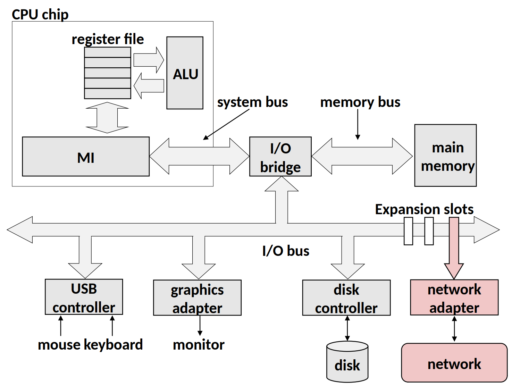
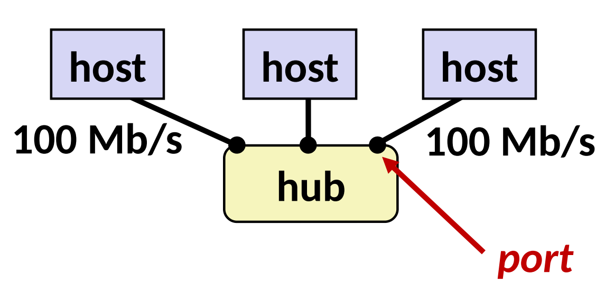
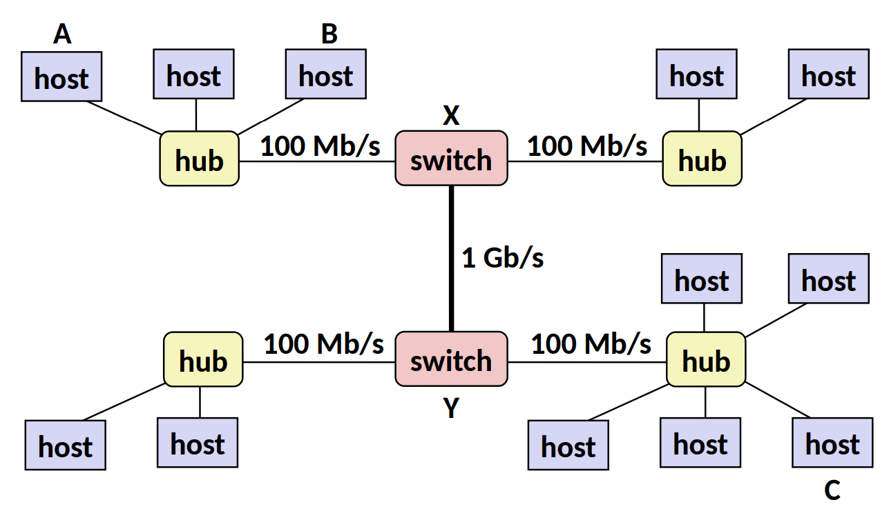
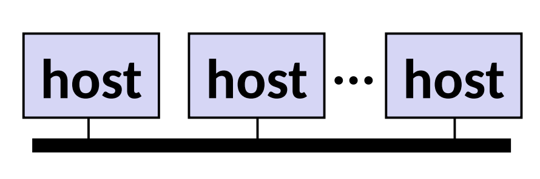
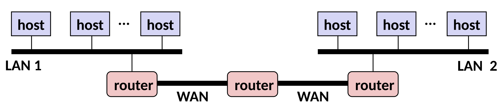
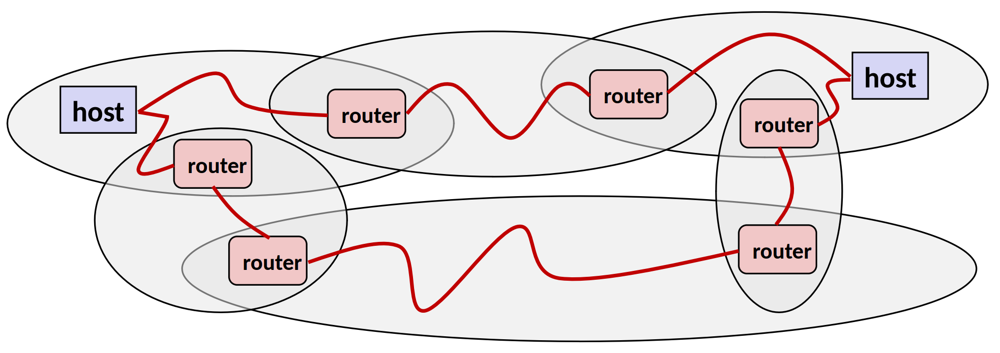
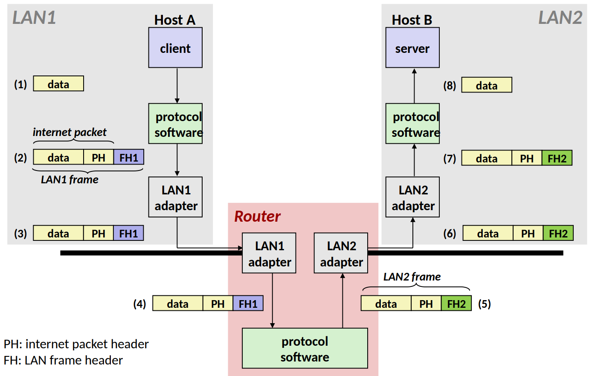
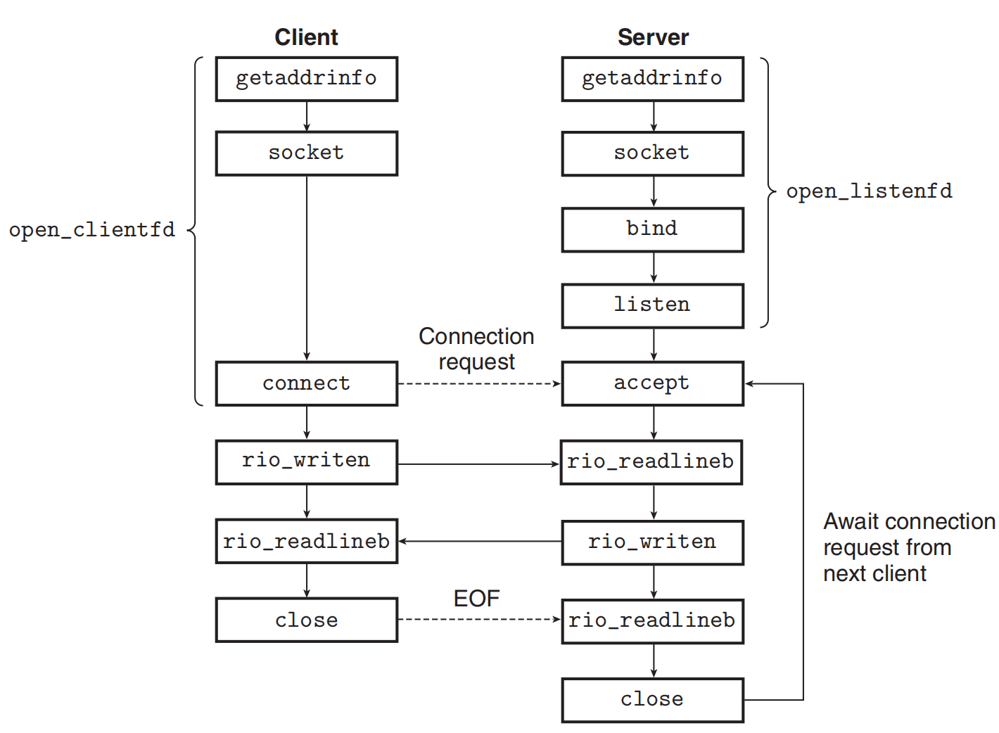

# 第十一章 网络编程

## 网络架构

计算机网络的知识可谓是非常『保值』的，因为这么多基础设备还在运行着，基本机制在短时间内很难改变，关于网络的相关的讲解还有参考链接[1][2]，我觉得也非常不错，大家感兴趣可以看看。

客户端-服务器模型是网络应用最广泛使用的模型，客户端进程发送请求给服务器进程，服务器进程获取所需资源并响应客户端进程的请求，客户端进程收到响应后展示给用户。网络相关的处理，都是通过网络适配器来完成的，具体在硬件上为（右下角）：

根据网络的应用范围和架构层级，可以分成三个部分：

- 系统区域网络 SAN - System Area Network
  - Switched Ethernet（交换以太网）, Quadrics QSW, ...
- 局域网 LAN - Local Area Network
  - Ethernet（以太网）
- 广域网 WAN - Wide Area Network
  - High speed point-to-point phone lines

### 最底层 - 以太网段 Ethernet Segment

由若干 **主机(hosts)** 通过 **交换机(hub)** 连接，通常范围是房间或一层楼，如下图所示：


- 每个 Ethernet 适配器有一个唯一的 48 位的地址（**MAC 地址**），例如`00:16:ea:e3:54:e6`
- 不同主机间发送的数据称为 **帧(frame)**
- Hub 会把每个端口发来的所有数据复制到其他的端口
  - 所有的主机都可以看到所有的数据（注意安全问题）

### 下一层 - 桥接以太网段 Bridged Ethernet Segment

通常范围是一层楼，通过不同的 **桥接器（bridge）** 来连接不同的 **以太网段（ethernet segment）** 。Bridge 知道从某端口出发可达的主机，并有选择的在端口间复制数据。

为了从概念上简化，我们可以认为，所有的 hub, bridge 可以抽象为一条线，如下图所示：


### 下一层 - internets

不同的 LAN（也可能是不兼容的LAN） 可以通过 **路由器（router）** 来进行物理上的连接，这样连接起来的网络称为 internet（注意是小写，大写的 Internet 可以认为是最著名的 internet）


internet 的逻辑结构为：

- 采用**临时互联**的方式组织 **Ad hoc** interconnection of networks
  - 没有特定的拓扑结构
  - 不同的 **路由器（router）** 和 **链路（link）** 差异可能很大
- 通过在不同的网络间跳转来传递 **数据包（packet）**
  - Router 是不同网络间的连接
  - 不同的 packet 可能会走不同的路线

## 网络协议

在不同的 LAN 和 WAN 中传输数据，就要守规矩，这个规矩就是协议。协议负责做的事情有：

- 提供 **命名方案（naming scheme）**
  - 定义 **主机地址（host address）** 格式
  - 每个主机和路由器都至少有一个独立的 internet 地址
- 提供 **传输机制（delivery mechanism）**
  - 定义了标准的传输单元 - **数据包（packet）**
  - Packet 包含 **头部（header）** 和 **有效载荷（payload）**
    - header 包括 packet size, source 和 destination address
    - payload 包括需要传输的数据

### 在互联网中传输协议封装后的数据

- **封装过程**: 数据从Host A 的客户端（1）开始，经过协议软件添加IP 包头（PH）和LAN1 帧头（FH1），形成LAN1 帧（2），然后通过路由器（3、4）。
- **路由转发**: 在路由器中，LAN1 帧头被移除，然后添加LAN2 帧头（FH2），形成LAN2 帧（5），通过LAN2 适配器转发。
- **解封过程**: LAN2 帧到达Host B 的LAN2 适配器（6），帧头被移除（7），数据包进入协议软件，最终将原始数据交付给服务器（8）

  

> 注意：header address 字段以大端字节序存储！

### 全球IP因特网 Global IP Internet（Internet）

- IP (Internet Protocal)
  - Provides **basic naming scheme** and unreliable **delivery capability** of packets (datagrams) from **host-to-host**
- UDP (Unreliable Datagram Protocol)
  - Uses IP to provide **unreliable** datagram delivery from **process-to-process**
- TCP (Transmission Control Protocol)
  - Uses IP to provide **reliable** byte streams from **process-to-process** over **connections**

Accessed via a mix of Unix file I/O and functions from **sockets interface**.

- 主机有 32 位的 IP 地址 - 23.235.46.133
  - IPv4 - 32 位地址，IPv6 - 128 位地址
- IP 地址被映射到域名 - 23.235.46.133 映射到 [www.wdxtub.com](http://www.wdxtub.com/)
- 不同主机之间的进程，可以通过 connection 来交换数据

### IP 地址

我们会用一个叫做 IP address struct 的东西来存储，并且 IP 地址是以 network byte order（也就是大端）来进行存储的

```
// Internet address structure
struct in_addr {
    uint32_t s_addr;    // network byte order (big-endian)
}

```

为了方便读，一般用下面的形式来进行表示：
IP 地址：`0x8002C2F2 = 128.2.194.242`
具体的转换可以使用 `getaddrinfo` 和 `getnameinfo` 函数

### Internet 域名

这里主要需要了解的就是 Domain Naming System(DNS) 的概念，用来做 IP 地址到域名的映射。具体可以用 `nslookup` 命令来查看，下面是一些例子

```
$ hostname
wdxtub.local

$ nslookup www.wdxtub.com
Server:		8.8.8.8
Address:	8.8.8.8#53

Non-authoritative answer:
www.wdxtub.com	canonical name = wdxtub.github.io.
wdxtub.github.io	canonical name = github.map.fastly.net.
Name:	github.map.fastly.net
Address: 23.235.39.133

$ nslookup www.twitter.com
Server:		8.8.8.8
Address:	8.8.8.8#53

Non-authoritative answer:
www.twitter.com	canonical name = twitter.com.
Name:	twitter.com
Address: 199.16.156.6
Name:	twitter.com
Address: 199.16.156.198
Name:	twitter.com
Address: 199.16.156.230
Name:	twitter.com
Address: 199.16.156.70

```

### Internet 连接

客户端和服务器通过连接(connection)来发送字节流，特点是：

- 点对点: 连接一对进程
- 全双工: 数据同时可以在两个方向流动
- 可靠: 字节的发送的顺序和收到的一致

Socket 则可以认为是 connection 的 endpoint，socket 地址是一个 `IPaddress:port` 对。
Port（端口）是一个 16 位的整数，用来标识不同的进程，利用不同的端口来连接不同的服务：

- Ephemeral port: Assigned automatically by client kernel when client makes a connection request
- Well-known port: Associated with some **service** provided by a server（在 linux 系统上可以在 `/etc/services` 中查看具体的信息）
  - echo server: 7/echo
  - ssh server: 22/ssh
  - email server: 25/smtp
  - web servers: 80/http

### Socket 接口

一系列系统级的函数，和 Unix I/O 配合构造网络应用（在所有的现代操作系统上都可用）。
对于 kernel 来说，socket 是 endpoint of communication；对于应用程序来说，socket 是 file descriptor，用来读写（回忆一下，STDIN 和 STDOUT 也是 file descriptor）。客户端和服务器通过读写对应的 socket descriptor 来进行。


## 简单服务器实现

### 架构总览

写服务器，最重要的就是理清思路，上节课我们介绍了诸多概念，尤其是最后提到的 `getaddrinfo` 和 `getnameinfo`，都是我们在搭建过程中必不可少的工具。参考上面的流程图，整个的工作流程有 5 步：

1. 开启服务器（`open\_listenfd` 函数，做好接收请求的准备）
   - `getaddrinfo`: 设置服务器的相关信息，具体可以参见 图1&2
   - `socket`: 创建 socket descriptor，也就是之后用来读写的 file descriptor
     - `int socket(int domain, int type, int protocol)`
     - 例如 `int clientfd = socket(AF\_INET, SOCK\_STREAM, 0);`
     - `AF\_INET` 表示在使用 32 位 IPv4 地址
     - `SOCK\_STREAM` 表示这个 socket 将是 connection 的 endpoint
     - 前面这种写法是协议相关的，建议使用 `getaddrinfo` 生成的参数来进行配置，这样就是协议无关的了
   - `bind`: 请求 kernel 把 socket address 和 socket descriptor 绑定
     - `int bind(int sockfd, SA \*addr, socklen\_t addrlen);`
     - The process can read bytes that arrive on the connection whose endpoint is `addr` by reading from descriptor `sockfd`
     - Similarly, writes to `sockfd` are transferred along connection whose endpoint is `addr`
     - 最好是用 `getaddrinfo` 生成的参数作为 `addr` 和 `addrlen`
   - `listen`: 默认来说，我们从 `socket` 函数中得到的 descriptor 默认是 active socket（也就是客户端的连接），调用 `listen` 函数告诉 kernel 这个 socket 是被服务器使用的
     - `int listen(int sockfd, int backlog);`
     - 把 `sockfd` 从 active socket 转换成 listening socket，用来接收客户端的请求
     - `backlog` 的数值表示 kernel 在接收多少个请求之后（队列缓存起来）开始拒绝请求
   - [\*]`accept`: 调用 `accept` 函数，开始等待客户端请求
     - `int accept(int listenfd, SA \*addr, int \*addrlen);`
     - 等待绑定到 `listenfd` 的连接接收到请求，然后把客户端的 socket address 写入到 `addr`，大小写入到 `addrlen`
     - 返回一个 connected descriptor 用来进行信息传输（类似 Unix I/O）
     - 具体的过程可以参考 图3
2. 开启客户端（`open\_clientfd` 函数，设定访问地址，尝试连接）
   - `getaddrinfo`: 设置客户端的相关信息，具体可以参见 图1&2
   - `socket`: 创建 socket descriptor，也就是之后用来读写的 file descriptor
   - `connect`: 客户端调用 `connect` 来建立和服务器的连接
     - `int connect(int clientfd, SA \*addr, socklen\_t addrlen);`
     - 尝试与在 socker address `addr` 的服务器建立连接
     - 如果成功 `clientfd` 可以进行读写
     - connection 由 socket 对描述 `(x:y, addr.sin\_addr:addr.sin\_port)`
     - `x` 是客户端地址，`y` 是客户端临时端口，后面的两个是服务器的地址和端口
     - 最好是用 `getaddrinfo` 生成的参数作为 `addr` 和 `addrlen`
3. 交换数据（主要是一个流程循环，客户端向服务器写入，就是发送请求；服务器向客户端写入，就是发送响应）
   - [Client]`rio\_writen`: 写入数据，相当于向服务器发送请求
   - [Client]`rio\_readlineb`: 读取数据，相当于从服务器接收响应
   - [Server]`rio\_readlineb`: 读取数据，相当于从客户端接收请求
   - [Server]`rio\_writen`: 写入数据，相当于向客户端发送响应
4. 关闭客户端（主要是 `close`）
   - [Client]`close`: 关闭连接
5. 断开客户端（服务接收到客户端发来的 EOF 消息之后，断开已有的和客户端的连接）
   - [Server]`rio\_readlineb`: 收到客户端发来的关闭连接请求
   - [Server]`close`: 关闭与客户端的连接

### Client open_clientfd

用来建立和服务器的连接，协议无关

```C
int open_clientfd(char *hostname, char *port) {
    int clientfd;
    struct addrinfo hints, *listp, *p;

    // Get a list of potential server address
    memset(&hints, 0, sizeof(struct addrinfo));
    hints.ai_socktype = SOCK_STREAM; // Open a connection
    hints.ai_flags = AI_NUMERICSERV; // using numeric port arguments
    hints.ai_flags |= AI_ADDRCONFIG; // Recommended for connections
    getaddrinfo(hostname, port, &hints, &listp);

    // Walk the list for one that we can successfully connect to
    // 如果全部都失败，才最终返回失败（可能有多个地址）
    for (p = listp; p; p = p->ai_next) {
        // Create a socket descriptor
        // 这里使用从 getaddrinfo 中得到的参数，实现协议无关
        if ((clientfd = socket(p->ai_family, p->ai_socktype,
                               p->ai_protocol)) < 0)
            continue; // Socket failed, try the next

        // Connect to the server
        // 这里使用从 getaddrinfo 中得到的参数，实现协议无关
        if (connect(clientfd, p->ai_addr, p->ai_addrlen) != -1)
            break; // Success

        close(clientfd); // Connect failed, try another
    }

    // Clean up
    freeaddrinfo(listp);
    if (!p) // All connections failed
        return -1;
    else // The last connect succeeded
        return clientfd;
}

```

### Server open_listenfd

创建 listening descriptor，用来接收来自客户端的请求，协议无关

```C
int open_listenfd(char *port){
    struct addrinfo hints, *listp, *p;
    int listenfd, optval=1;

    // Get a list of potential server addresses
    memset(&hints, 0, sizeof(struct addrinfo));
    hints.ai_socktype = SOCK_STREAM; // Accept connection
    hints.ai_flags = AI_PASSIVE | AI_ADDRCONFIG; // on any IP address
    hints.ai_flags |= AI_NUMERICSERV; // using port number
    // 因为服务器不需要连接，所以原来填写地址的地方直接是 NULL
    getaddrinfo(NULL, port, &hints, &listp);

    // Walk the list for one that we can successfully connect to
    // 如果全部都失败，才最终返回失败（可能有多个地址）
    for (p = listp; p; p = p->ai_next) {
        // Create a socket descriptor
        // 这里使用从 getaddrinfo 中得到的参数，实现协议无关
        if ((listenfd = socket(p->ai_family, p->ai_socktype,
                               p->ai_protocol)) < 0)
            continue; // Socket failed, try the next

        // Eliminates "Address already in use" error from bind
        setsockopt(listenfd, SOL_SOCKET, SO_REUSEADDR),
                    (const void *)&optval, sizeof(int));

        // Bind the descriptor to the address
        if (bind(listenfd, p->ai_addr, p->ai_addrlen) == 0)
            break; // Success

        close(listenfd); // Bind failed, try another
    }

    // Clean up
    freeaddrinfo(listp);
    if (!p) // No address worked
        return -1;

    // Make it a listening socket ready to accept connection requests
    if (listen(listenfd, LISTENQ) < 0) {
        close(listenfd);
        return -1;
    }
    return listenfd;
}

```

## 简单的 socket 服务器实例

### 客户端 Echo Client

这个客户端做的事情很简单，就是把一段用户输入的文字发送到服务器，然后再把从服务器接收到的内容显示到输出中，具体可以参见注释

```
// echoclient.c
#include "csapp.h"

int main (int argc, char **argv) {
    int clientfd;
    char *host, *port, buf[MAXLINE];
    rio_t rio;

    host = argv[1];
    port = argv[2];

    // 建立连接（前面已经详细介绍）
    clientfd = Open_clientfd(host, port);
    Rio_readinitb(&rio, clientfd);

    while (Fgets(buf, MAXLINE, stdin) != NULL) {
        // 写入，也就是向服务器发送信息
        Rio_writen(clientfd, buf, strlen(buf));
        // 读取，也就是从服务器接收信息
        Rio_readlineb(&rio, buf, MAXLINE);
        // 把从服务器接收的信息显示在输出中
        Fputs(buf, stdout);
    }
    Close(clientfd);
    exit(0);
}

```

### 服务器 Iterative Echo Server

服务器做的工作也很简单，接收到从客户端发送的信息，然后返回一个一模一样的。具体参加注释。

```
// echoserveri.c
#include "csapp.h"
void echo(int connfd);

int main(int argc, char **argv){
    int listenfd, connfd;
    socklen_t clientlen;
    struct sockaddr_storage clientaddr; // Enough room for any addr
    char client_hostname[MAXLINE], client_port[MAXLINE];

    // 开启监听端口，注意只开这么一次
    listenfd = Open_listenfd(argv[1]);
    while (1) {
        // 需要具体的大小
        clientlen = sizeof(struct sockaddr_storage); // Important!
        // 等待连接
        connfd = Accept(listenfd, (SA *)&clientaddr, &clientlen);
        // 获取客户端相关信息
        Getnameinfo((SA *) &clientaddr, clientlen, client_hostname,
                     MAXLINE, client_port, MAXLINE, 0);
        printf("Connected to (%s, %s)\n", client_hostname, client_port);
        // 服务器具体完成的工作
        echo(coonfd);
        Close(connfd);
    }
    exit(0);
}

void echo(int connfd) {
    size_t n;
    char buf[MAXLINE];
    rio_t rio;

    // 读取从客户端传输过来的数据
    Rio_readinitb(&rio, connfd);
    while((n = Rio_readlineb(&rio, buf, MAXLINE)) != 0) {
        printf("server received %d bytes\n", (int)n);
        // 把从 client 接收到的信息再写回去
        Rio_writen(connfd, buf, n);
    }
}

```

# TINY Web服务器

## 1.TINY的main程序

TINY是一个迭代服务器，监听在命令行中传递来的端口上的连接请求。在通过调用open_listenfd函数打开一个监听套接字以后，TINY执行典型的无限服务器循环，不断地接受连接请求，执行事务，并关闭连接的它那一端。

```
#include "csapp.h"

typedef struct { /* 代表已连接描述符的池 */
    int maxfd;                   /* read_set 中最大的描述符 */
    fd_set read_set;             /* 所有活跃描述符的集合 */
    fd_set ready_set;            /* 准备好读取的描述符子集 */
    int nready;                  /* 从 select 返回的就绪描述符数量 */
    int maxi;                    /* clientfd 数组的高水位索引 */
    int clientfd[FD_SETSIZE];    /* 活跃描述符集合 */
    rio_t clientrio[FD_SETSIZE]; /* 活跃读缓冲区集合 */
} pool;

static pool pool;

int main(int argc, char **argv) {
    int listenfd, connfd;
    socklen_t clientlen;
    struct sockaddr_storage clientaddr;

    if (argc != 2) {
        fprintf(stderr, "usage: %s <port>\n", argv[0]);
        exit(0);
    }
    listenfd = Open_listenfd(argv[1]);
    init_pool(listenfd, &pool); /* 初始化池 */

    while (1) {
        /* 等待监听描述符或已连接描述符准备就绪 */
        pool.ready_set = pool.read_set;
        pool.nready = Select(pool.maxfd+1, &pool.ready_set, NULL, NULL, NULL);

        /* 如果监听描述符就绪，添加新客户端到池中 */
        if (FD_ISSET(listenfd, &pool.ready_set)) {
            clientlen = sizeof(struct sockaddr_storage);
            connfd = Accept(listenfd, (SA *)&clientaddr, &clientlen);
            add_client(connfd, &pool);
        }

        /* 从每个就绪的已连接描述符回送一个文本行 */
        check_clients(&pool);
    }
}

```

## 2.doit函数

doit函数用于处理一个HTTP事务。首先，我们读和解析请求行（第11~14行）。注意，我们使用rioreadlineb函数读取请求行。
TINY只支持GET方法。如果客户端请求其他方法（比如POST），我们发送给它一个错误信息，并返回到主程序（第15～19行），主程序随后关闭连接并等待下一个连接请求。否则，我们读并且（像我们将要看到的那样）忽略任何请求报头（第20行）。
然后，我们将URI解析为一个文件名和一个可能为空的CGI参数字符串，并且设置一个标志，表明请求的是静态内容还是动态内容（第23行）。如果文件在磁盘上不存在，我们立即发送一个错误信息给客户端并返回。
最后，如果请求的是静态内容，我们就验证该文件是一个普通文件，而我们是有读权
限的（第31行）。如果是这样，我们就向客户端提供静态内容（第36行）。相似地，如果请求的是动态内容，我们就验证该文件是可执行文件（第39行），如果是这样，我们就继续，并且提供动态内容（第44行）。

```
void doit(int fd)
{
    int is_static;
    struct stat sbuf;
    char buf[MAXLINE], method[MAXLINE], uri[MAXLINE], version[MAXLINE];
    char filename[MAXLINE], cgiargs[MAXLINE];
    rio_t rio;

    /* Read request line and headers */
    Rio_readinitb(&rio, fd);
    Rio_readlineb(&rio, buf, MAXLINE);
    printf("Request headers:\n");
    printf("%s", buf);
    sscanf(buf, "%s %s %s", method, uri, version);
    if (strcasecmp(method, "GET")) {
        clienterror(fd, method, "501", "Not implemented",
                    "Tiny does not implement this method");
        return;
    }
    read_requesthdrs(&rio);

    /* Parse URI from GET request */
    is_static = parse_uri(uri, filename, cgiargs);
    if (stat(filename, &sbuf) < 0) {
        clienterror(fd, filename, "404", "Not found",
                    "Tiny couldn't find this file");
        return;
    }

    if (is_static) { /* Serve static content */
        if (!(S_ISREG(sbuf.st_mode)) || !(S_IRUSR & sbuf.st_mode)) {
            clienterror(fd, filename, "403", "Forbidden",
                        "Tiny couldn't read the file");
            return;
        }
        serve_static(fd, filename, sbuf.st_size);
    }
    else { /* Serve dynamic content */
        if (!(S_ISREG(sbuf.st_mode)) || !(S_IXUSR & sbuf.st_mode)) {
            clienterror(fd, filename, "403", "Forbidden",
                        "Tiny couldn't run the CGI program");
            return;
        }
        serve_dynamic(fd, filename, cgiargs);
    }
}

```

## 参考资料

[协议森林 - Vamei - 博客园](http://www.cnblogs.com/vamei/archive/2012/12/05/2802811.html)
[[Network\] 计算机网络基础知识总结 - Poll的笔记 - 博客园](http://www.cnblogs.com/maybe2030/p/4781555.html)
