## 1. 知识工程与知识图谱

王 鑫

wangx@tju.edu.cn

天津大学 人工智能学院

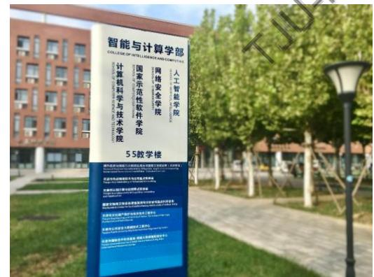

<details>
<summary>text_image</summary>

智能与计算学部
COLLEGE OF INTEL ENGINEERING AND TECHNOLOGY
人工智能学院
网络安全学院
国家示范性软件学院
计算机科学与技术学院
55教学楼
</details>


<details>
<summary>text_image</summary>

55
智能与计算学部
</details>

## 目录

C O N T E N T S

知识工程概述  
02 语义Web  
03 本体与推理  
04 4 知识图谱


<details>
<summary>text_image</summary>

北海紀念亭
</details>

## 目录

C O N T E N T S

01 知识工程概述  
02 语义Web  
03 本体与推理  
04 4 知识图谱


<details>
<summary>text_image</summary>

北洋紀念亭
</details>

## ◼ 人工智能是第四次工业革命的重要推动力

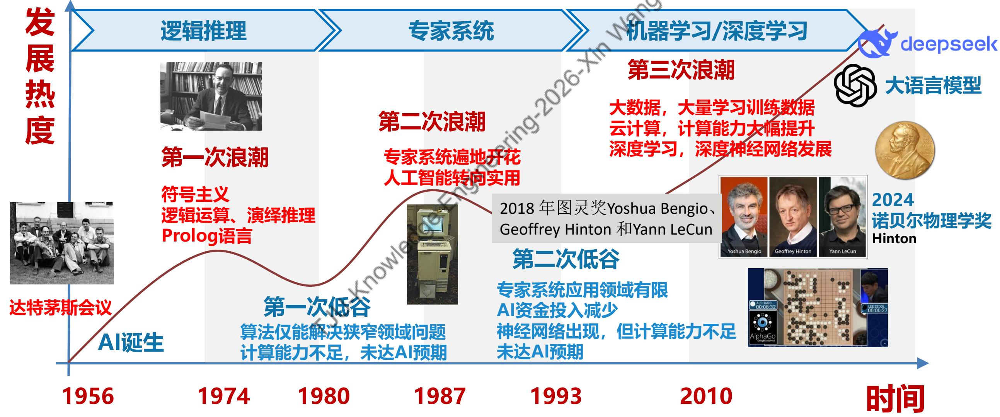

<details>
<summary>flowchart</summary>

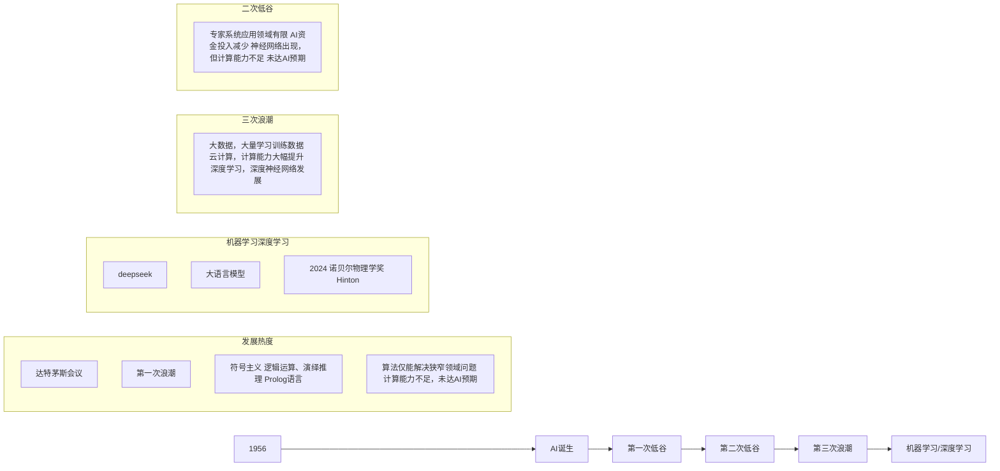
```mermaid
graph LR
  A["1956"] --> B["AI诞生"]
  B --> C["第一次低谷"]
  C --> D["第二次低谷"]
  D --> E["第三次浪潮"]
  E --> F["机器学习/深度学习"]
    
    subgraph sg["发展热度"]
        G["达特茅斯会议"]
        H["第一次浪潮"]
        I["符号主义 逻辑运算、演绎推理 Prolog语言"]
        J["算法仅能解决狭窄领域问题 计算能力不足，未达AI预期"]
    end
    
    subgraph sg_2["机器学习深度学习"]
        K["deepseek"]
        L["大语言模型"]
        M["2024 诺贝尔物理学奖 Hinton"]
    end
    
    subgraph sg_3["三次浪潮"]
        N["大数据，大量学习训练数据 云计算，计算能力大幅提升 深度学习，深度神经网络发展"]
    end
    
    subgraph sg_4["二次低谷"]
        O["专家系统应用领域有限 AI资金投入减少 神经网络出现，但计算能力不足 未达AI预期"]
    end
```
</details>

符号主义学派Symbolicism

模拟心智

联结主义学派Connectionism

模拟神经

行为主义学派Actionism

模拟行为

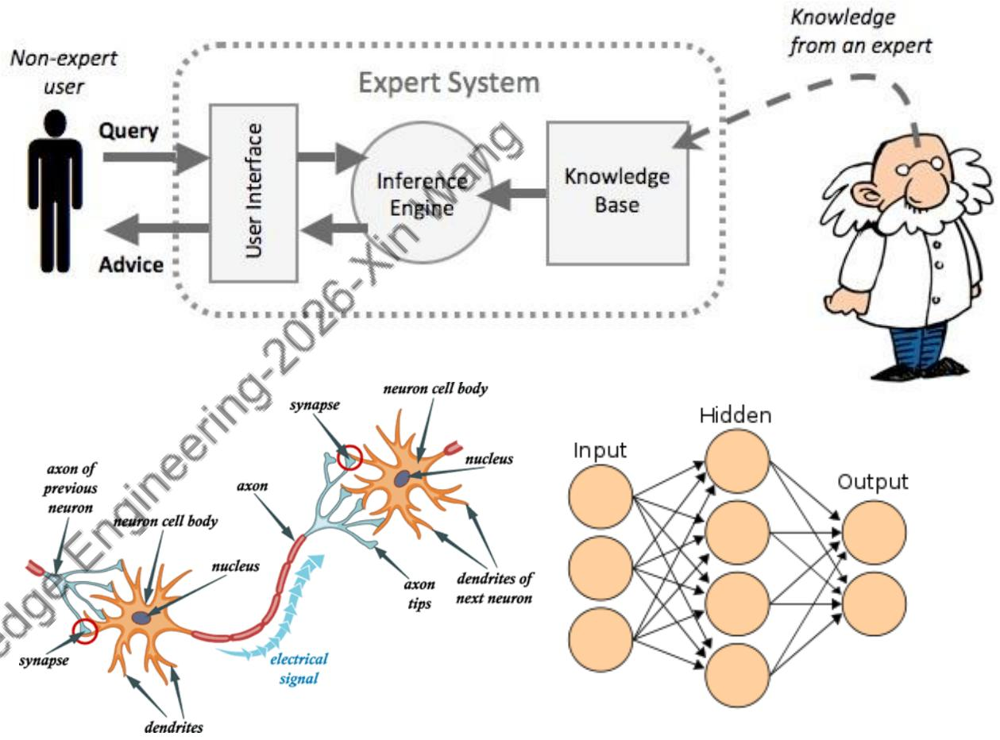

<details>
<summary>flowchart</summary>

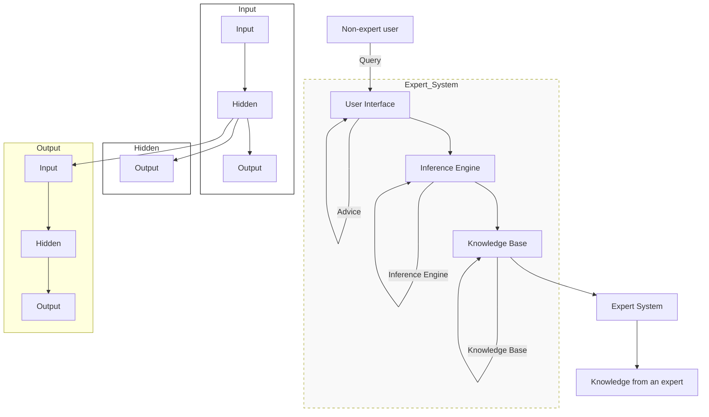
```mermaid
graph TD
  A["Non-expert user"] -->|Query| B["User Interface"]
  B --> C["Inference Engine"]
  C --> D["Knowledge Base"]
  D --> E["Expert System"]
  E --> F["Knowledge from an expert"]
    
    subgraph Expert_System
  B -->|Advice| B
  C -->|Inference Engine| C
  D -->|Knowledge Base| D
    end
    
    subgraph Input
  G["Input"] --> H["Hidden"]
  H --> I["Output"]
    end
    
    subgraph Hidden
  H --> J["Output"]
    end
    
    subgraph Output
  H --> K["Input"]
  K --> L["Hidden"]
  L --> M["Output"]
    end
    
    style Expert_System fill:#f9f9f9,stroke-dasharray: 5 5
    style Input fill:#fff,stroke:#000
    style Hidden fill:#fff,stroke:#000
```
</details>

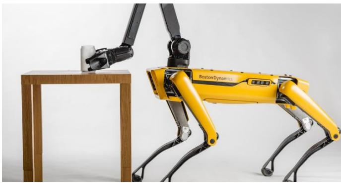

<details>
<summary>natural_image</summary>

Yellow Boston Dynamics robot standing next to a wooden table, no visible text or symbols on the robot or background.
</details>

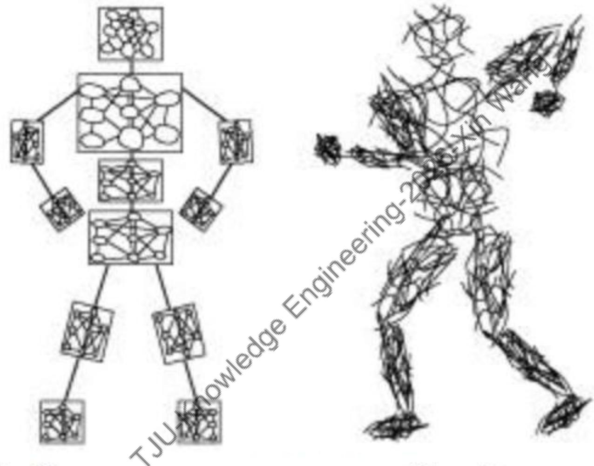

<details>
<summary>text_image</summary>

TJU-knowledge Engineering-2025-Xin Wang
</details>

Connectionist

符号主义：自顶向下 vs. 联结主义：自底向上

## 知识 Knowledge

## 辞海

人类认识的成果或结晶。人的一切知识都是在社会实践中形成的，是对现实的能动反映

## 百科

知识是人类从各个途径中获得的经过提升 总结与凝练的系统的认识

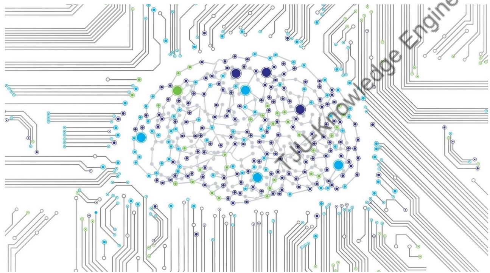

<details>
<summary>text_image</summary>

HUV
Knowledge Engine
</details>

数据  


<details>
<summary>natural_image</summary>

Two bowls on a wooden surface: one with flour and one with eggs, both containing yellow liquid (no text or symbols visible)
</details>

Presentation  
界面  
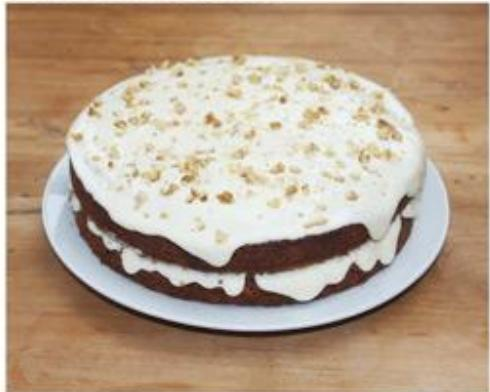

<details>
<summary>natural_image</summary>

Top-down view of a layered cake with white frosting and powdered sugar, served on a white plate (no text or symbols visible)
</details>

Information  
信息  
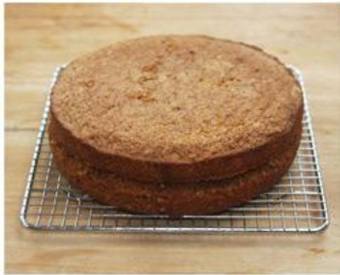

<details>
<summary>natural_image</summary>

Two stacked chocolate cake rolls on a cooling rack, placed on a wooden surface (no text or symbols visible)
</details>

Knowledge  
知识  


<details>
<summary>natural_image</summary>

White plate with scattered brown granular substance on a wooden surface (no text or symbols visible)
</details>

## 知识 Knowledge

## 辞海

人类认识的成果或结晶。人的一切知识都是在社会实践中形成的，是对现实的能动反映

## 百科

知识是人类从各个途径中获得的经过提升 总结与凝练的系统的认识


<details>
<summary>text_image</summary>

HUV
Knowledge Engine
</details>

数据  
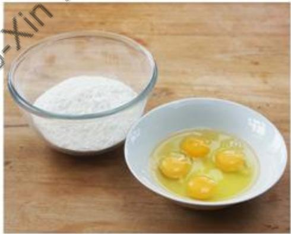

<details>
<summary>natural_image</summary>

Two bowls on a wooden surface: one with flour and one with eggs, both containing yellow liquid (no text or symbols visible)
</details>

Presentation  
界面  


<details>
<summary>natural_image</summary>

Top-down view of a layered cake with white frosting and powdered sugar, served on a white plate (no text or symbols visible)
</details>

Information  
信息  


<details>
<summary>natural_image</summary>

Two stacked chocolate cake rolls on a cooling rack, placed on a wooden surface (no text or symbols visible)
</details>

Knowledge  
知识  
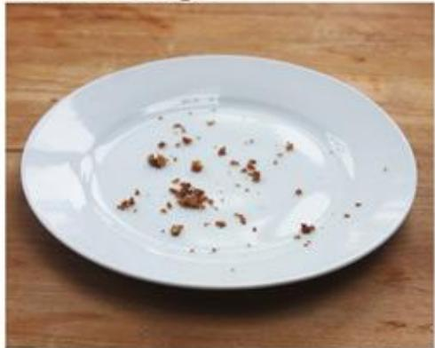

<details>
<summary>natural_image</summary>

White plate with scattered brown granular substance on a wooden surface (no text or symbols visible)
</details>

## 知识 Knowledge 从哲学说起

哲学 “认识论” （epistemology）研究关于知识的各种哲学本质问题

古希腊哲学家柏拉图《泰阿泰德篇》

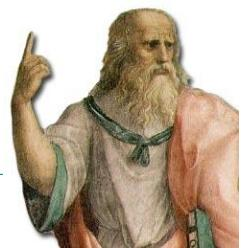

<details>
<summary>natural_image</summary>

Illustration of a bearded man in historical attire with a beard and green belt, gesturing with one hand (no text or symbols present)
</details>

公元前429年—前347年

知识的定义 JTB理论

“真理信念理论” （Justified True Belief）

JTB 理论认为，一个人拥有知识必须满足三个条件：

1. 真理（True）：知识必须基于真实的事实。如，“太阳是由氢和氦组成的”  
2. 信念（Belief）：个体必须真正相信某个命题。如，即使所有科学证据都表明太阳主要由氢和氦构成，如果某人并不相信这一点，那么他就不具备这方面的知识  
3. 正当理由（Justified）：信念必须有充分的理由或证据支持。如，科学家通过光谱分析等方法确定

太阳的成分中有氢和氦

葛梯尔问题（Gettier Problem） “空地上的奶牛”

## 知识 Knowledge 从哲学说起

古希腊哲学家柏拉图《泰阿泰德篇》


<details>
<summary>natural_image</summary>

Illustration of a bearded man in historical attire with a beard and green belt, gesturing with one hand (no text or symbols present)
</details>

信念（Belief)

满足JTB条件的信念但不是知识

真理

(True belief)

知识

(Knowledge)

正当理由

(Justified belief)

## 葛梯尔问题（Gettier Problem） “空地上的奶牛”

“一位农民找不到自己的奶牛，一个送奶工说他看到农民的奶牛在附近的空地上。农民相信了送奶工，但他还是想亲自去看看。他看到了空地上有黑白相间的东西，于是就认为他的奶牛就在那。过了一会，农民走近到那片空地上看，他看到奶牛确实在那，但奶牛躲在树林中；他之前看到黑白相间的东西，是挂在树上的一大张黑白相间的纸。” 'dge"

## 先验与后验

## 先验知识 （A Priori Knowledge）

先验知识是指不依赖于特定经验的知识，可以仅通过理性或逻辑推理得到的知识

先验知识的例子包括：

数学命题：如 $^ { 6 6 } 2 + 2 = 4 ^ { 3 9 }$  
 逻辑命题：如“如果A是真的并且A蕴含B，那么B是真的”  
定义性真理：如“所有有子女的女性是母亲”

## 后验知识（A Posteriori Knowledge）

后验知识是指依赖于特定经验或感觉观察来验证的知识

后验知识的例子包括：

 科学定律和理论：如“水的沸点是 $1 0 0 ^ { \circ }$ °C（在标准大气压下）”  
 历史事实：如“第二次世界大战于1939年开始”  
 个人的感觉经验：如“巧克力的味道很甜”

## 声明性与过程性

## 声明性知识 （Declarative Knowledge）

声明性知识，也称为陈述性知识，是关于世界的事实性陈述。它描述了事物的状态、存在的对象及其属性和之间的关系，即“知道如此”（knowing-that）。  
◼ 声明性知识常用来构建知识库，使系统能够通过查询这些事实来回答问题或进行决策支持

◼ 例如，知道“北京是中国的首都”或者“水在标准大气压下的沸点是 $1 0 0 ^ { \circ }$ C”，都属于声明性知识。声明性知识的特点是可以被直接表述并且通常容易被共享和传递。

## 过程性知识（Procedural Knowledge）

过程性知识，也称为程序性知识，是执行任务或解决问题的具体步骤。它不是简单地知道事物是什么，而是知道如何做事，即“知道如何” （knowing-how）  
过程性知识则可以通过规则或算法来实现，其使系统能够自动执行复杂的操作。

例如，知道如何游泳、如何烹饪一道菜，或者如何在计算机上安装某个软件，这些都是过程性知识。过程性知识往往难以被完全表述，因为它包含了大量的隐性知识，即那些我们知道如何做但很难完全解释给他人的知识。

有效的知识工程解决方案需要合理地结合和利用这两种知识，以提高系统的性能和适应性。

## 知识、 智慧与智能

智慧通常指的是使用知识的能力和效率，涉及判断力、洞察力以及根据情境选择和应用知识的能力  
智能则是更为广泛的概念，描述的是理解、学习、推理、解决问题、思考、记忆和适应环境变化等能力

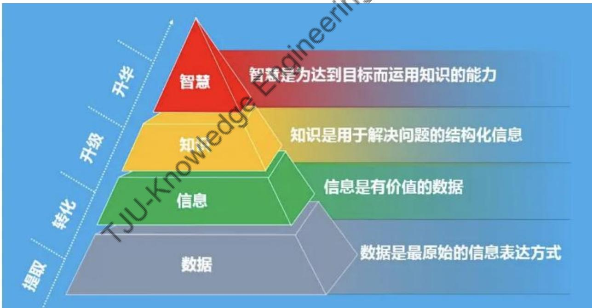

<details>
<summary>flowchart</summary>

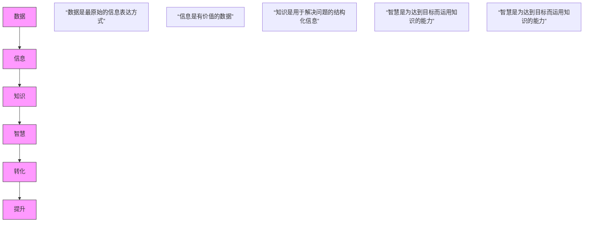
```mermaid
graph TD
  A["数据"] --> B["信息"]
  B --> C["知识"]
  C --> D["智慧"]
  D --> E["转化"]
  E --> F["提升"]
    
    style A fill:#f9f,stroke:#333
    style B fill:#f9f,stroke:#333
    style C fill:#f9f,stroke:#333
    style D fill:#f9f,stroke:#333
    style E fill:#f9f,stroke:#333
    style F fill:#f9f,stroke:#333
    
    note1["“数据是最原始的信息表达方式”"]:::note
    note2["“信息是有价值的数据”"]:::note
    note3["“知识是用于解决问题的结构化信息”"]:::note
    note4["“智慧是为达到目标而运用知识的能力”"]:::note
    note5["“智慧是为达到目标而运用知识的能力”"]:::note
```
</details>

“数据-信息-知识-智慧”体系，即DIKW体系

## ◼ 人工智能的核心任务之一是模拟人类的认知过程

## “感知智能” （perceptual intelligence）

感知智能关注于使机器能够通过传感器和数据输入模拟人类的感官，如视觉和听觉，以识别和处理周围环境的信息

## “认知智能” （cognitive intelligence）

认知智能涉及更高阶的思维功能，如语言理解、逻辑推理、规划、学习、问题解决与决策，这些能力都需要更加丰富和复杂的知识结构


<details>
<summary>flowchart</summary>

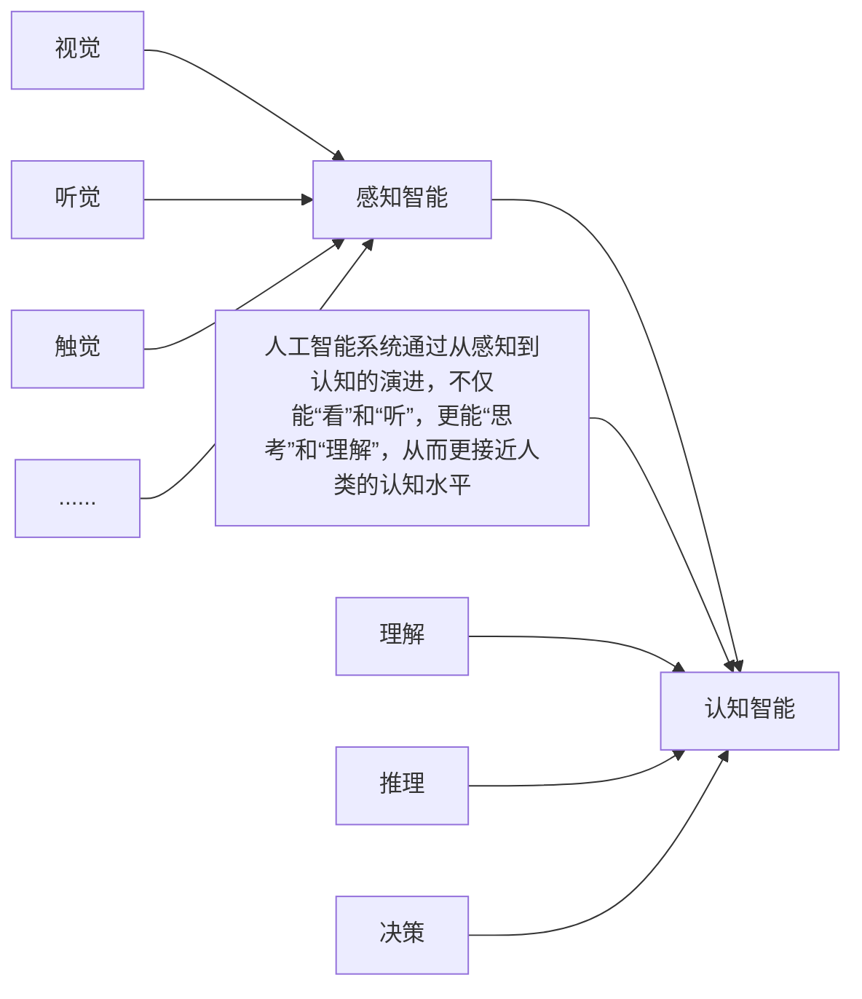
```mermaid
graph LR
  A["感知智能"] --> B["认知智能"]
  C["视觉"] --> A
  D["听觉"] --> A
  E["触觉"] --> A
  F["......"] --> A
  G["人工智能系统通过从感知到认知的演进，不仅能“看”和“听”，更能“思考”和“理解”，从而更接近人类的认知水平"] --> B
  H["理解"] --> B
  I["推理"] --> B
  J["决策"] --> B
```
</details>

## 领域案例

## 自动驾驶汽车

在感知层面，自动驾驶系统利用雷达、摄像头和传感器收集周围环境的数据，如其他车辆的位置、行人、交通标志等

认知智能在此扮演关键角色，它使车辆能够通过预先加载的地图数据和实时交通信息，进行路径规划、预测潜在的危险，并作出复杂的决策，包括何时变道或减速以避免碰撞

这些决策依赖于庞大的知识库和高级的算法来模拟人类司机的判断过程。 W


<details>
<summary>text_image</summary>

100m
48
Self-Driving
</details>

## 健康诊断系统

在医疗领域，知识密集型的认知智能系统，如健康诊断工具，可以分析患者的临床数据，如症状、体检结果和医学影像，以辅助医生进行诊断。

这些系统结合了医学知识库、病例研究和机器学习算法，不仅能识别疾病模式，还能推荐治疗方案。

健康系统能够利用自然语言处理和认知计算技术，解析大量的医学文献和患者信息，提供个性化的治疗建议。

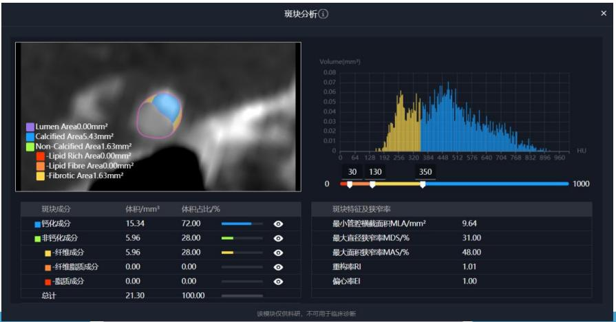

<details>
<summary>bar-line hybrid chart</summary>

| 斑块成分 | 体积/mm³ | 体积占比/% |
| -------- | -------- | ---------- |
| 钙化成分 | 15.34    | 72.00      |
| 非钙化成分 | 5.96     | 28.00      |
| 纤维成分 | 5.96     | 28.00      |
| 纤维脂质成分 | 0.00     | 0.00       |
| 黏质成分 | 0.00     | 0.00       |
| 总计     | 21.30    | 100.00     |
</details>

## 知识工程：人工智能的重要分支 Knowledge Engineering

## 1. 知识获取

如何从系统外部获得知识、充实知识库，包括对外部的数据进行知识化

## 2. 知识表示

怎样对知识进行形式化地描述，以便让计算机能合理地存储和使用知识

## 3. 知识使用

知识处理系统如何组织和利用知识，使用推理方法，达到所希望的目标

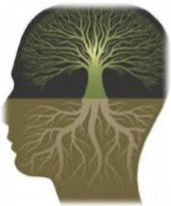

<details>
<summary>natural_image</summary>

Silhouette of a human head profile with tree branches emerging from the brain (no text or symbols)
</details>

语言推理思考

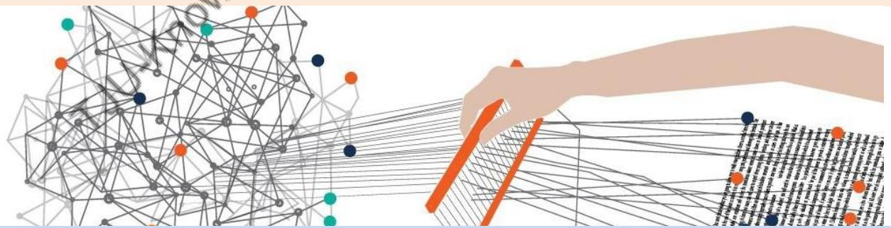

<details>
<summary>natural_image</summary>

Abstract network diagram with interconnected nodes and colored dots, no text or symbols present
</details>

人脑是如何进行知识获取、表示与使用的？

## 亚里士多德 逻辑学《范畴篇》 2000+ 年前

## Aristotle's Logic Categories: 2000+ years ago

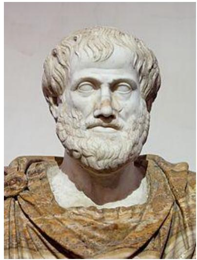

<details>
<summary>natural_image</summary>

Marble bust of a bearded man in classical attire, no visible inscriptions or symbols
</details>

亚里士多德（公元前384-前322）古希腊人世界古代史上伟大的哲学家、科学家和教育家之


<details>
<summary>flowchart</summary>

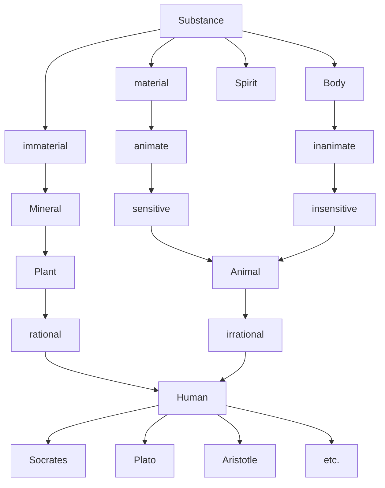
```mermaid
graph TD
  A["Substance"] --> B["material"]
  A --> C["Body"]
  A --> D["immaterial"]
  A --> E["Spirit"]
  B --> F["animate"]
  C --> G["inanimate"]
  D --> H["Mineral"]
  F --> I["sensitive"]
  G --> J["insensitive"]
  H --> K["Plant"]
  I --> L["Animal"]
  J --> L
  K --> M["rational"]
  L --> N["irrational"]
  M --> O["Human"]
  N --> O
  O --> P["Socrates"]
  O --> Q["Plato"]
  O --> R["Aristotle"]
  O --> S["etc."]
```
</details>

## 波菲利之树

## Porphyrian tree

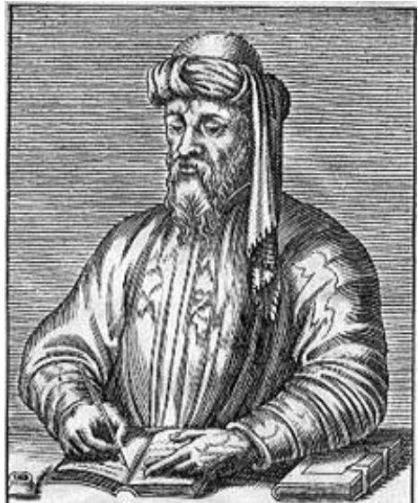

<details>
<summary>natural_image</summary>

Portrait engraving of a bearded man in traditional attire, seated at a desk with books and papers (no visible text or symbols)
</details>

波菲利  
（约234年－约305年）  
古罗马哲学家

## 亚里士多德 逻辑学 《前分析篇》 2000+ 年前

## Aristotle's Logic : 2000+ years ago

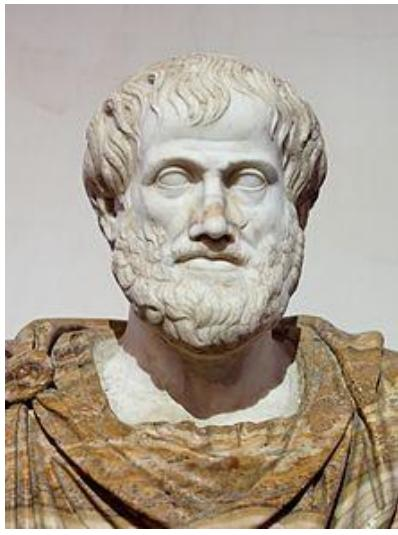

<details>
<summary>natural_image</summary>

Marble bust of a bearded man in classical attire, no visible text or symbols
</details>

## 三段论 Syllogism

1. 所有人都会死  
2. 苏格拉底是人  
3. 所以，苏格拉底是要死的

（大前提）

（小前提）

（结论）Therefore, Socrates is mortal.

All human are mortal.

Socrates is a human.

## 阶谓词逻辑 First-order Logic

1. ∀??(?????????? ?? → ???????????? ?? )  
2. ??????????(????????????????)  
3. ????????????(????????????????)

（大前提）

（小前提）

（结论）

## 莱布尼茨 质数编码 —— 350年前

## Leibniz's Prime Number Encoding: 350 years ago

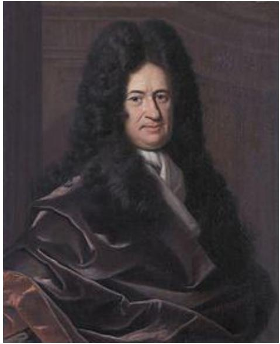

<details>
<summary>natural_image</summary>

Portrait painting of a man with long curly hair and formal attire, seated in a dark robe (no visible text or symbols)
</details>

莱布尼茨

（1646-1716）

德国哲学家、数学家是历史上少见的通才，被誉为十七世纪的亚里士多德

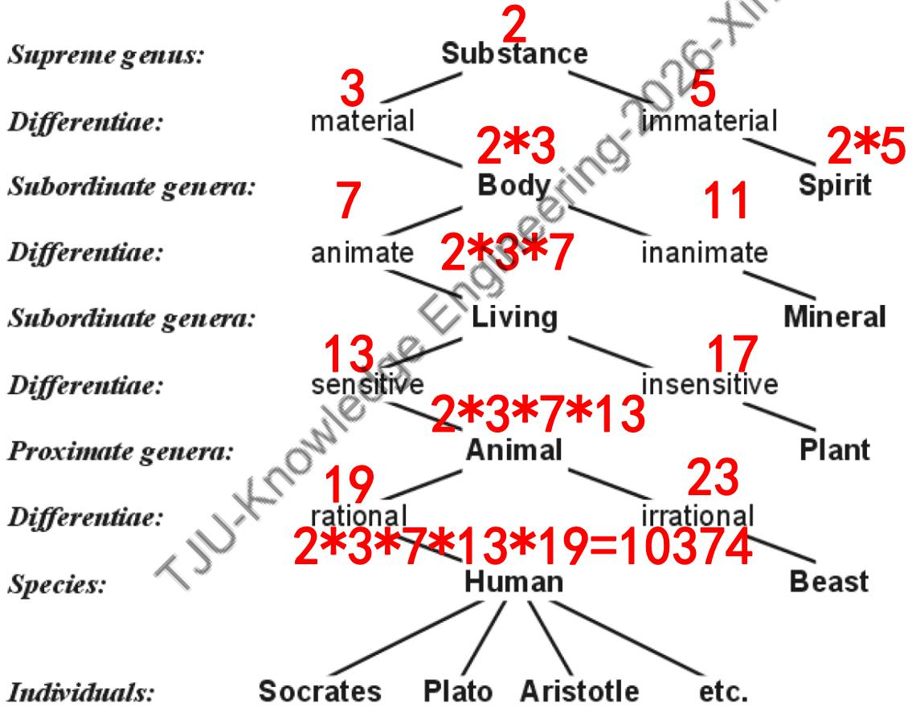

<details>
<summary>flowchart</summary>

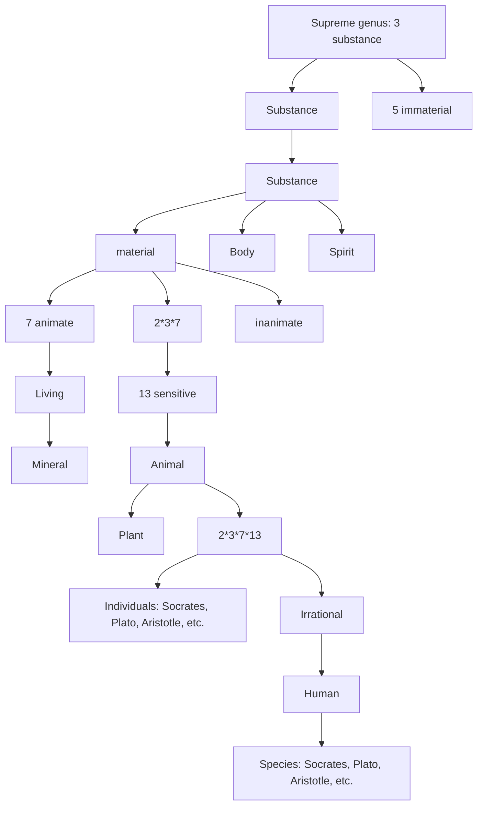
```mermaid
graph TD
  A["Supreme genus: 3 substance"] --> B["Substance"]
  A --> C["5 immaterial"]
  B --> D["Substance"]
  D --> E["material"]
  D --> F["Body"]
  D --> G["Spirit"]
  E --> H["7 animate"]
  E --> I["2*3*7"]
  E --> J["inanimate"]
  H --> K["Living"]
  K --> L["Mineral"]
  I --> M["13 sensitive"]
  M --> N["Animal"]
  N --> O["Plant"]
  N --> P["2*3*7*13"]
  P --> Q["Individuals: Socrates, Plato, Aristotle, etc."]
  P --> R["Irrational"]
  R --> S["Human"]
  S --> T["Species: Socrates, Plato, Aristotle, etc."]
```
</details>

## 是否正确？

## Human是animate的吗？

## Every human animate

## 正确

## 因为表示Human的数可

## 以被表示animate的数

## 乘除

## “逻辑理论家”程序: 1956 达特茅斯会议（Dartmouth Workshop）

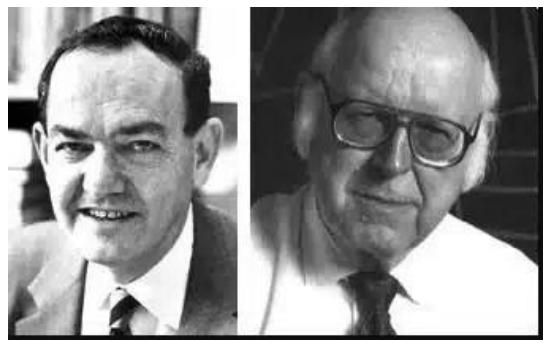

<details>
<summary>natural_image</summary>

Black-and-white portrait of two men, one smiling and the other with glasses (no text or symbols visible)
</details>

赫伯特·西蒙

（Herbert Simon）

1916-2002

艾伦·纽厄尔

（Allen Newell）

1927-1992


<details>
<summary>natural_image</summary>

Portrait of an elderly man with white hair and glasses, wearing a dark suit and tie, hands clasped (no visible text or symbols)
</details>

吴文俊（1919-2017）

中国数学家吴文俊提出了用机器自动证明几何定理的“吴方法”

## “逻辑理论家” （Logic Theorist） “史上首款人工智能程序”自动推理计算机程序

自动证明了《数学原理》（Principia Mathematica，怀特黑德和罗素所著）前38个定理

纽厄尔和西蒙也因此获得了1975年的图灵奖 1978年西蒙获得诺贝尔经济学奖

## “逻辑理论家”程序也是“计算机之父”图灵关于“机器可以具有智能”这一论断的第一个程序实现

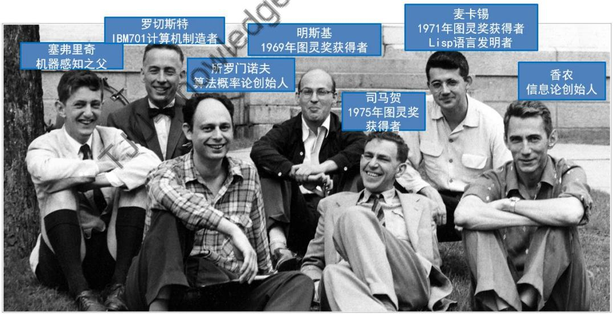

<details>
<summary>text_image</summary>

塞弗里奇
机器感知之父
罗切斯特
IBM701计算机制造者
所罗门诺夫
算法概率论创始人
明斯基
1969年图灵奖获得者
司马贺
1975年图灵奖
获得者
麦卡锡
1971年图灵奖获得者
Lisp语言发明者
香农
信息论创始人
</details>

西蒙的中文名字是司马贺，据说是中国朋友给起的，他70多岁开始学习中文，曾将中国称为“我的中国”，并曾在回忆录里写道：“我十次到访中国，在那里度过的时间比在任何其他外国都要多，总计大约有一年之长。” 1994年当选为中国科学院外籍院士。

## GPS程序: 1957

在“逻辑理论家”程序取得初步成功之后，西蒙、纽厄尔与约翰·肖(John Cliff Shaw)合作，于1957年开发了“通用问题求解系统”（General Problem Solver, 简称 GPS）

◼ GPS提供一个框架，用以表达和解决这些问题，其通过“手段-目的分析”（means–endsanalysis）方法，模拟人类的问题解决策略，进行“状态空间搜索”（state-space search），比较当前状态与目标状态之间的差异，并确定如何逐步减少这种差异来寻找问题的最终解。  
◼ GPS为后续知识工程领域的专家系统和智能决策支持系统的设计提供了重要的理论和技术基础  
启发式搜索” （heuristic search）

GPS程序的问题求解策略实际上是通过“启发式搜索” 机制实现的  
启发式搜索通过使用预先定义的规则或经验判断来引导搜索过程，减小搜索空间，以更快地达到目标状态  
启发式搜索能够帮助系统在庞大且复杂的搜索空间中快速找到有效的解，避免盲目搜索带来的计算开销  
著名的A\*算法就是实现启发式搜索的一种通用框架。

## 简约派和芜杂派

在人工智能领域，“简约派”（the neats）和“芜杂派” （the scruffies）代表了两种截然不同的哲学观点和研究方法。 W

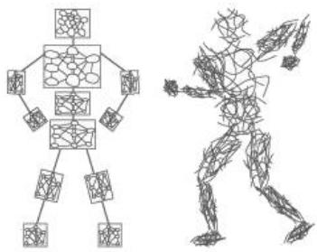

<details>
<summary>natural_image</summary>

Two abstract human-like figures composed of interconnected nodes and lines, no text or symbols present.
</details>

## “简约派” （the neats）

追求采用一种形式化、理论化的方法来解决人工智能问题，认为通过基于数学和逻辑的方法可以构建出能够模拟人类智能的系统  
约翰·麦卡锡（John McCarthy）认为机器不需要模拟人类思考的确切机制，而是可以使用逻辑方法找到问题求解和抽象推理的本质  
麦卡锡创建的斯坦福大学智能实验室（SAIL）专注于使用形式逻辑解决各类问题，包括知识表示、规划和学习 O  
将递归函数 （recursive function）用于符号表达式的计算，从而开发了著名的人工智能程序设计语言Lisp  
两位法国学者柯尔迈伦（Alain Colmerauer）和罗塞尔（Philippe Roussel）在1972年开发了逻辑编程语言Prolog  
麦卡锡获得1971年图灵奖

## “芜杂派”（the scruffies）

认为人工智能的发展需要模拟人类大脑的复杂性和不确定性，因此更倾向于使用模式识别和神经网络等技术以及由专家手工进行规则建立与参数优化  
马文·明斯基（Marvin Minsky）尝试解决计算机视觉与自然语言处理中的AI难题。他们得出的结论是这些问题难以采用以逻辑为基础的单一方法来解决  
其间，他们开发的人工智能程序ELIZA可与人类展开英语对话，尽管它根本没有任何正式的语言学知识  
他们接受系统可能不完全可解释或不完全符合传统逻辑规则，但追求的是功能性和效能，即使系统的内部工作机制可能显得“杂乱无章”  
明斯基获得1969年图灵奖

## 符号主义人工智能 Symbolic AI

在人工智能诞生之初的四五十年间，符号主义方法一直占据着AI领域的主导地位；符号主义人工智能主要采用逻辑符号和规则来表达知识。 WW

## 符号主义人工智能的典型方法

逻辑程序设计（logic programming）  
产生式系统（production rules）  
语义网络（semantic network）  
框架（frame）

## 符号主义人工智能的典型应用

专家系统（expert system）  
符号计算系统（symbolic mathematics）  
自动定理证明器（automated theorem provers）  
自动规划与调度系统（automated planning and scheduling）

符号主义人工智能在早期取得了显著成就，但它面临一个主要问题是缺乏学习能力，符号系统通常需要人工设定和更新，不易适应新的数据或变化的环境

## 专家系统 Expert Systems: 1970s - 1980s


<details>
<summary>natural_image</summary>

Portrait of an older man in a suit and tie, wearing glasses (no text or symbols visible)
</details>

费根鲍姆

（1936年生, 89岁）

专家系统之父

1994年图灵奖得主

内部含有大量的某个领域专家水平的知识与经验  
专家系统 知识库 + 推理机


<details>
<summary>flowchart</summary>

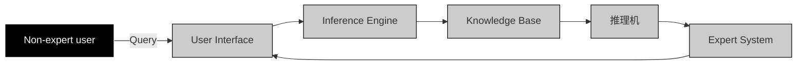
```mermaid
graph LR
  A["Non-expert user"] -->|Query| B["User Interface"]
  B --> C["Inference Engine"]
  C --> D["Knowledge Base"]
  D --> E["推理机"]
  E --> F["Expert System"]
  F --> B
    style A fill:#000,stroke:#fff,color:#fff
    style B fill:#ccc,stroke:#000
    style C fill:#ccc,stroke:#000
    style D fill:#ccc,stroke:#000
    style E fill:#ccc,stroke:#000
    style F fill:#ccc,stroke:#000
```
</details>

Knowledge

fromanexpert  
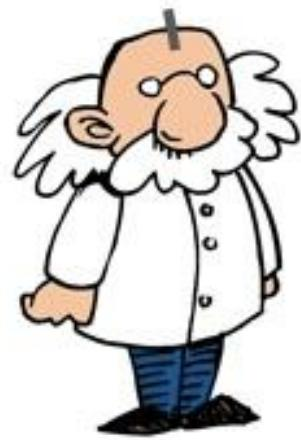

<details>
<summary>natural_image</summary>

Cartoon illustration of a bearded man in a white coat and blue pants, with no visible text or symbols.
</details>

## 医疗诊断专家系统 MYCIN

帮助医生对血液感染患者进行诊断

## RULE047

如果：（1）病原体的鉴别名不确定，且

（2）病原体来自血液，且

（3）病原体的染色是革兰氏阴性，且

（4）病原体的形态是杆状的，且

（5）病原体呈赭色

那么：该病原体的鉴别名是假单胞细菌，可信度为0.4

## ◼ Cyc项目: 1984


<details>
<summary>natural_image</summary>

Portrait of a smiling man with curly hair wearing a dark collared shirt (no text or symbols visible)
</details>

道格拉斯·莱纳特

（Douglas Lenat）

1950-2023

目的是创建一个包含人类的广泛常识性知识（common-sense knowledge）的庞大知识库  
以解决当时的AI系统无法理解人类日常生活中理所当然的事实的问题，即缺乏常识推理（common-sense reasoning）能力

## 常识推理

是指机器能够像人类一样，使用日常生活中普遍的、通常未被明确表达的知识来解决问题和做出决策的能力 ng

对于人类来说，这种能力是无意识且自然发生的，例如，当你看到外面天空变得阴暗并且风也开始增强，你会推断很快会下雨，因此决定出门带伞。

常识推理在知识工程中占有重要地位，因为它允许系统在面对不完整或未明确说明的信息时，能够做出合理的判断和推理。

Cyc项目团队开发了一种新的知识表示语言CycL，这是一种形式逻辑语言，专门设计用于编码复杂的、层次化的知识。CycL能够表达各种知识，从基本的事实如“树木生长需要水分”到更复杂的概念如社会行为和心理状态等。

## 双系统理论 Dual process theory: 2011

## 认知心理学

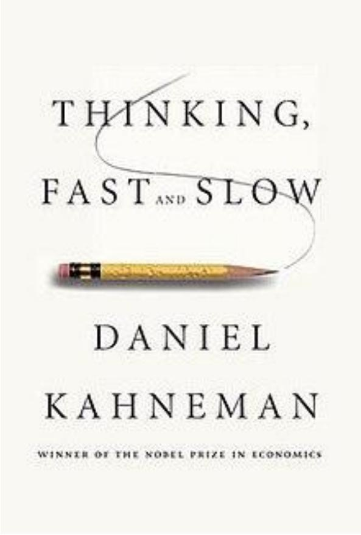

<details>
<summary>text_image</summary>

THINKING,
FAST AND SLOW
DANIEL
KAHNEMAN
WINNER OF THE NOBEL PRIZE IN ECONOMICS
</details>

## 系统1

 Fast  
Automatic  
Intuitive  
 Unconscious

## 系统2

 Slower  
 Deliberative  
 Logical  
 Step-by-step


<details>
<summary>natural_image</summary>

Portrait of an elderly man in a suit and glasses, seated with hands clasped (no visible text or symbols)
</details>

Daniel Kahneman  
(1934—2024)

Thinking, Fast and Slow is a 2011 book by

psychologist Daniel Kahneman 2002年诺贝尔经济学奖获得者

## 大模型时代的知识工程

在当今的大语言模型时代，一种说法是知识工程领域的主要工作包括知识获取、知识表示和知识推理等方面均可以由大语言模型完成。  
在当今的大语言模型时代，知识工程已经被大语言模型取代，这种说法是否正确？你认为在大语言模型时代知识工程的必要性有哪些？

## Retrieval-Augmented Generation （RAG）

RAG允许LLM检索外部数据  
2. RAG提升LLM性能，帮助LLM基于事实，降低 幻觉  
3. RAG降低LLM重新训练的需求

Meta发表的NeurIPS 2020论文，提出RAG概念，基于PLM  
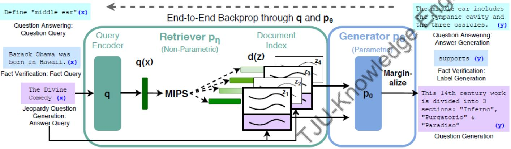

<details>
<summary>flowchart</summary>

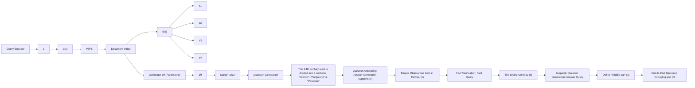
```mermaid
graph LR
  A["Query Encoder"] --> B["q"]
  B --> C["q(x)"]
  C --> D["MIPS"]
  D --> E["Document Index"]
  E --> F["d(z)"]
  F --> G["z1"]
  F --> H["z2"]
  F --> I["z3"]
  F --> J["z4"]
  E --> K["Generator pθ (Parametric)"]
  K --> L["pθ"]
  L --> M["Margin-alize"]
  M --> N["Question Generation"]
  N --> O["This 14th century work is divided into 3 sections: &quot;Inferno&quot;, &quot;Purgatorio&quot; & &quot;Paradiso&quot;"]
  O --> P["Question Answering: Answer Generation supports (y)"]
  P --> Q["Barack Obama was born in Hawaii. (x)"]
  Q --> R["Fact Verification: Fact Query"]
  R --> S["The Divine Comedy (x)"]
  S --> T["Jeopardy Question Generation: Answer Query"]
  T --> U["Define &quot;middle ear&quot; (x)"]
  U --> V["End-to-End Backprop through q and pθ"]
```
</details>

Figure l: Overview of our approach. We combine a pre-trained retriever (Query Encoder + Document Index) with a pre-trained seq2seq model (Generator) and fine-tune end-to-end. For query x, we use Maximum Inner Product Search (MIPS) to find the top-K documents z:. For final prediction y, we treat z as a latent variable and marginalize over seq2seq predictions given different documents.

Lewis, Patrick, et al. “Retrieval-augmented generation for knowledge-intensive NLP tasks.” NeurIPS 2020

LLM使用RAG的流程  
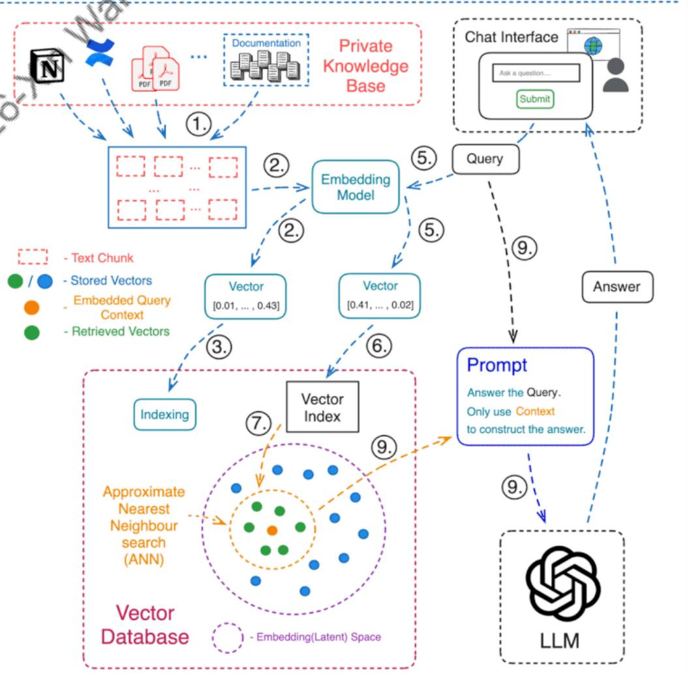

<details>
<summary>flowchart</summary>

```mermaid
graph TD
  A["Input Image"] --> B["Documentation"]
  B --> C["Private Knowledge Base"]
  C --> D["Query"]
  D --> E["Prompt"]
  E --> F["LLM"]
  D --> G["Answer"]
  G --> H["Output"]
    
    subgraph Inputs
  I["Text Chunk"] --> J["Stored Vectors"]
  K["Embedded Query Context"] --> L["Retrieved Vectors"]
    end
    
    subgraph Outputs
  M["Indexing"] --> N["Approximate Nearest Neighbour search (ANN)"]
  O["Vector Database"] --> P["Embedding(Latent) Space"]
    end
    
    subgraph Outputs
  Q["Query [0.01, ..., 0.43"]] --> R["Embedding Model"]
  S["Vector [0.41, ..., 0.02"]] --> R
  T["Vector Index"] --> U["Embedding Model"]
  V["Formula Element"] --> W["Embedding Model"]
  X["Formula Element"] --> Y["Embedding Model"]
  Z["Formula Element"] --> AA["Embedding Model"]
    end
    
    style Inputs fill:#f9f,stroke:#333
    style Outputs fill:#ccf,stroke:#333
```
</details>

## Graph RAG的提出

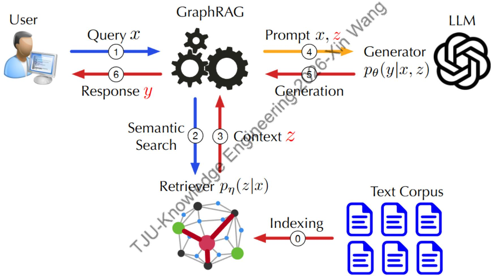

<details>
<summary>flowchart</summary>

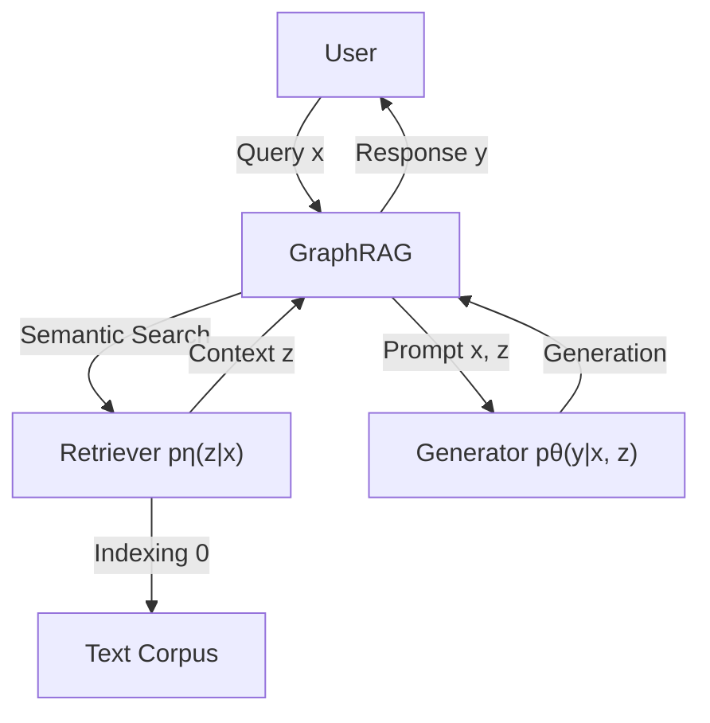
```mermaid
graph TD
  A["User"] -->|Query x| B["GraphRAG"]
  B -->|Response y| A
  B -->|Semantic Search| C["Retriever pη(z|x)"]
  C -->|Context z| B
  B -->|Prompt x, z| D["Generator pθ(y|x, z)"]
  D -->|Generation| B
  C -->|Indexing 0| E["Text Corpus"]
```
</details>

Constructed + Existing Knowledge Graphs

## 目录

C O N T E N T S

知识工程概述  
02 语义Web  
03 本体与推理  
04 4 知识图谱


<details>
<summary>text_image</summary>

北洋紀念亭
</details>

## ◼万维网 （World Wide Web）

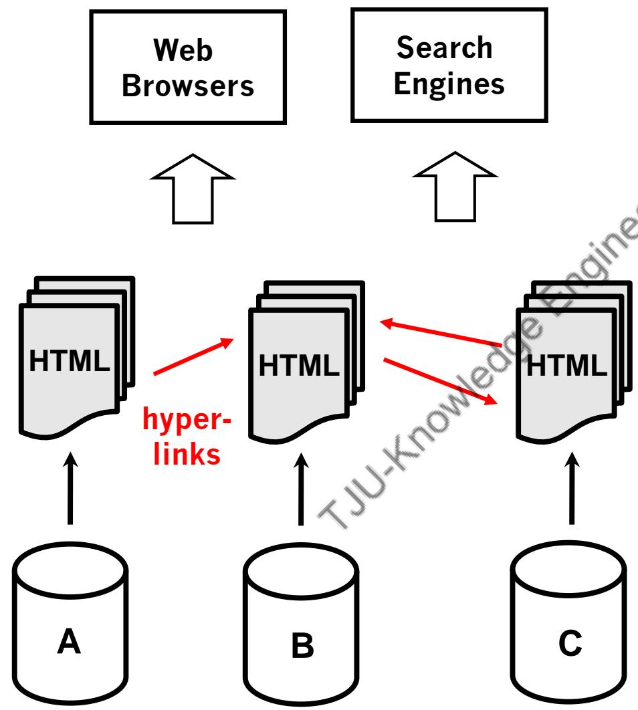

<details>
<summary>flowchart</summary>

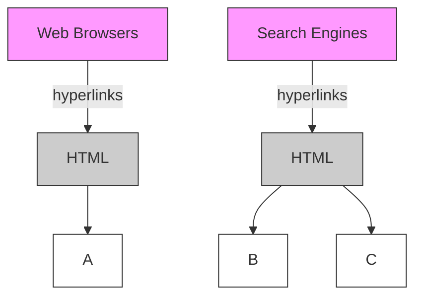
```mermaid
graph TD
  A["Web Browsers"] -->|hyperlinks| B["HTML"]
  C["Search Engines"] -->|hyperlinks| D["HTML"]
  B --> E["A"]
  D --> F["B"]
  D --> G["C"]
    style A fill:#f9f,stroke:#333
    style C fill:#f9f,stroke:#333
    style B fill:#ccc,stroke:#333
    style D fill:#ccc,stroke:#333
    style E fill:#fff,stroke:#333
    style F fill:#fff,stroke:#333
    style G fill:#fff,stroke:#333
```
</details>

Web of documents  
machine-processable, human-readable documents

Problems

machine cannot understand the meaning (semantics) of documents

## ◼ 万维网（Web）➔ 语义万维网（Semantic Web)

• A “Web of Data”

– enables machines to understand the semantics, or meaning, of information on the World Wide Web

Tim Berners-Lee. The Semantic Web. 284(5):34-43, 2001


<details>
<summary>natural_image</summary>

Portrait of a man in a suit sitting on a red sofa, with other people and furniture in the background (no visible text or symbols)
</details>

## ◼Data Web vs. Document Web

Machine-readable data  
Linked Data  
Agents?

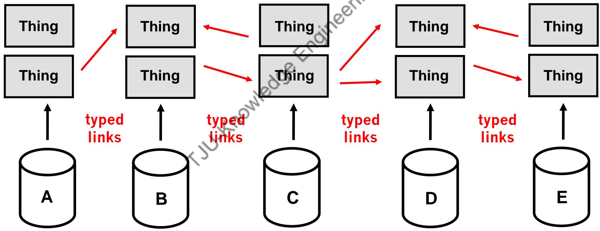

<details>
<summary>flowchart</summary>

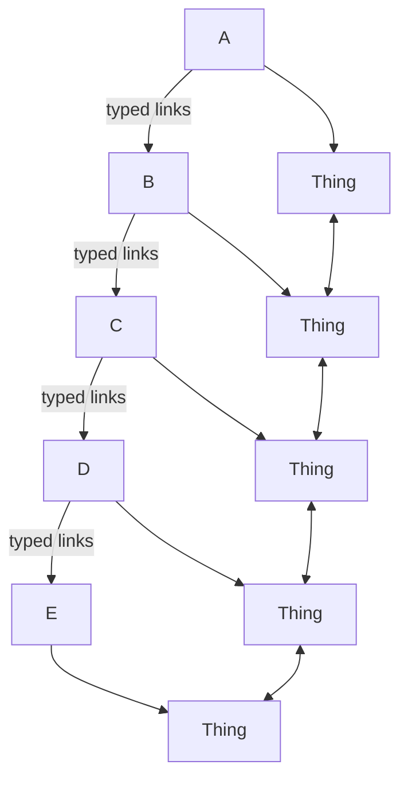
```mermaid
graph TD
  A["A"] -->|typed links| B["B"]
  B -->|typed links| C["C"]
  C -->|typed links| D["D"]
  D -->|typed links| E["E"]
  A --> F["Thing"]
  B --> G["Thing"]
  C --> H["Thing"]
  D --> I["Thing"]
  E --> J["Thing"]
    F <--> G
    G <--> H
    H <--> I
    I <--> J
```
</details>

## ◼Basic Idea of the Semantic Web

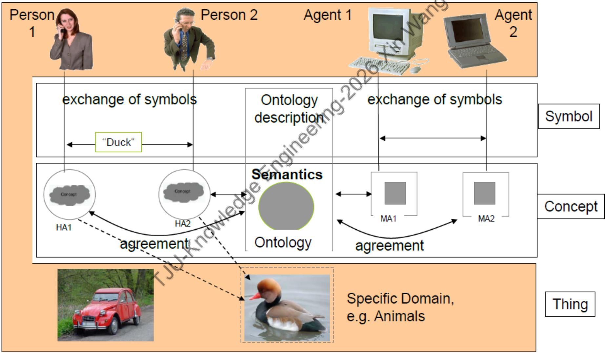

<details>
<summary>flowchart</summary>

Conceptual diagram illustrating the relationship between Person, Agent, Concept, and Specific Domain components with symbols exchange and ontology integration.
</details>


<details>
<summary>flowchart</summary>

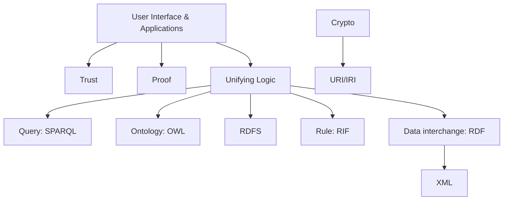
```mermaid
graph TD
  A["User Interface & Applications"] --> B["Trust"]
  A --> C["Proof"]
  A --> D["Unifying Logic"]
  D --> E["Query: SPARQL"]
  D --> F["Ontology: OWL"]
  D --> G["RDFS"]
  D --> H["Rule: RIF"]
  D --> I["Data interchange: RDF"]
  I --> J["XML"]
  K["Crypto"] --> L["URI/IRI"]
```
</details>

SEMANTIC WEB STANDARD STACK

User Interface & Applications  
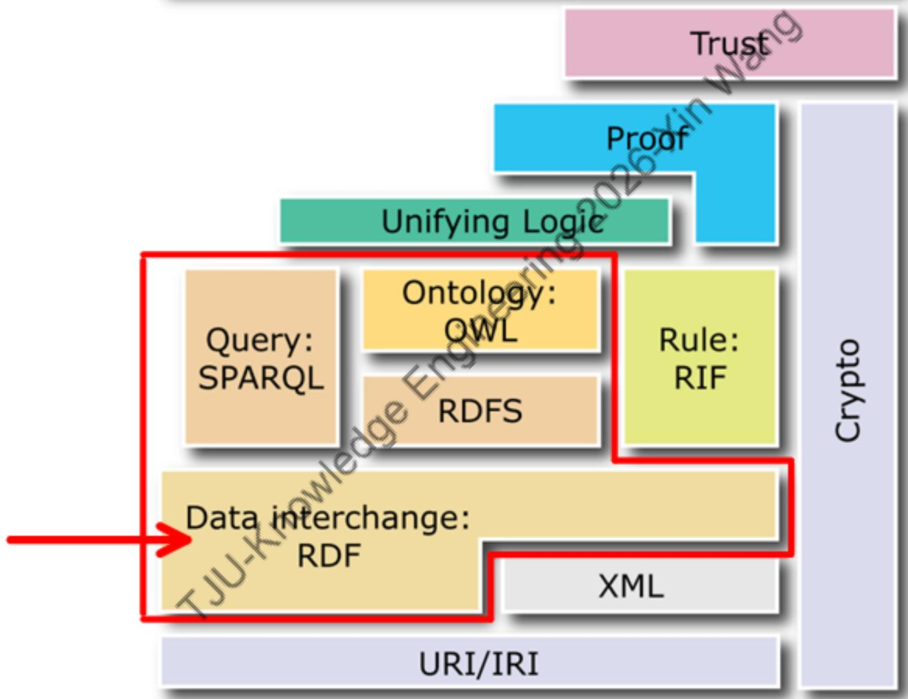

<details>
<summary>flowchart</summary>

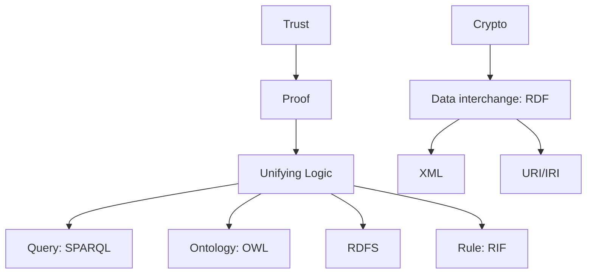
```mermaid
graph TD
  A["Trust"] --> B["Proof"]
  B --> C["Unifying Logic"]
  C --> D["Query: SPARQL"]
  C --> E["Ontology: OWL"]
  C --> F["RDFS"]
  C --> G["Rule: RIF"]
  H["Crypto"] --> I["Data interchange: RDF"]
  I --> J["XML"]
  I --> K["URI/IRI"]
```
</details>

## RDF Terms

URIs

– for referencing resources

Literals

– data values

Blank nodes

– talking about something which doesn’t have a name (or the name of which isn’t known)

## RDF Triple

## Definition (RDF Triple)

An RDF triple is a tuple of the form

$$
(s, p, o) \in U B \times U \times U B L
$$

In this tuple， s is caled the subject; p the predicate, and o the object.

The predicate is also known as property of the triple.

## RDF Triple

An RDF triple consists of

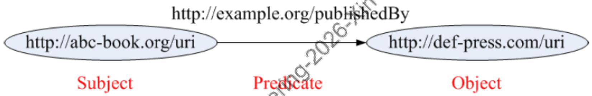

<details>
<summary>flowchart</summary>

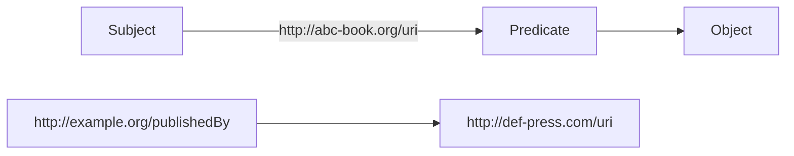
```mermaid
graph LR
  A["Subject"] -->|http://abc-book.org/uri| B["Predicate"]
  B --> C["Object"]
  D["http://example.org/publishedBy"] --> E["http://def-press.com/uri"]
```
</details>

(borrowed from linguistics)

• allowed are:

– In the subject : URIs and blank nodes  
– In the predicate: URIs (usually called properties)  
– In the object: URIs and blank nodes and literals

• Note that the graph can be reconstructed from the list of triples.

## Turtle – Terse RDF Triple Language

simple syntax for RDF triples are directly listed as such

– URIs are in <angle brackets>  
– Literals are "enclosed in quotes"  
– triples end with a full-stop .  
– whitespace (blanks, line feeds) is ignored

```txt
<http://semantic-web-book.org/uri>
    <http://example.org/publishedBy>    <http://crcpress.com/uri>
<http://semantic-web-book.org/uri>
    <http://example.org/title>
    "Foundations of Semantic Web Technologies" .
<http://crcpress.com/uri>
    <http://example.org/name>    "CRC Press" .
```

## Turtle

shortcuts for prefixes

```txt
@prefix book: <http://semantic-web-book.org/>. @prefix ex: <http://example.org/>. @prefix crc: <http://crcpress.com/>. book:uri ex:publishedBy crc:uri. book:uri ex:title "Foundations of Semantic Web Technologies". crc:uri ex:name "CRC Press".
```

## Turtle

```txt
@prefix book: <http://semantic-web-book.org/>. @prefix ex: <http://example.org/>. @prefix crc: <http://crcpress.com/>. book:uri ex:publishedBy crc:uri. book:uri ex:title "Foundations of Semantic Web Technologies". crc:uri ex:name "CRC Press".
```

grouping of triples with the same subject  
grouping of triples with same subject and predicate

```txt
@prefix book: <http://semantic-web-book.org/>. @prefix ex: <http://example.org/>. @prefix crc: <http://crcpress.com/>. book:uri ex:publishedBy crc:uri; ex:title "Foundations of Semantic Web Technologies". crc:uri ex:name "CRC Press", "CRC".
```

## Datatypes in RDF

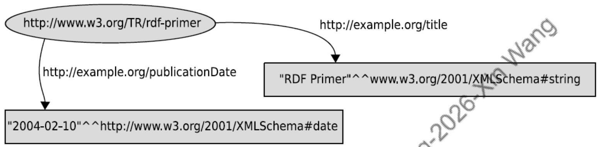

<details>
<summary>flowchart</summary>

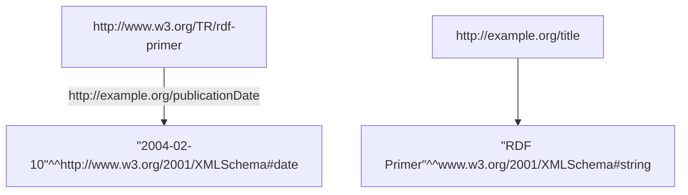
```mermaid
graph TD
  A["http://www.w3.org/TR/rdf-primer"] -->|http://example.org/publicationDate| B["&quot;2004-02-10&quot;^^http://www.w3.org/2001/XMLSchema#date"]
  C["http://example.org/title"] --> D["&quot;RDF Primer&quot;^^www.w3.org/2001/XMLSchema#string"]
```
</details>

```rdf
@prefix xsd: <http://www.w3.org/2001/XMLSchema#> .
<http://www.w3.org/TR/rdf-primer>
    <http://example.org/title> "RDF Primer"^^xsd:string ;
    <http://example.org/publicationDate> "2004-02-10"^^xsd:date .
```

```rdf
<rdf:Description rdf:about="http://www.w3.org/TR/rdf-primer">
    <ex:title rdf:datatype="http://www.w3.org/2001/XMLSchema#string">
    RDF Primer
    </ex:title>
    <ex:publicationDate
    rdf:datatype="http://www.w3.org/2001/XMLSchema#date">
    2004-02-10
    </ex:publicationDate>
</rdf:Description>
```

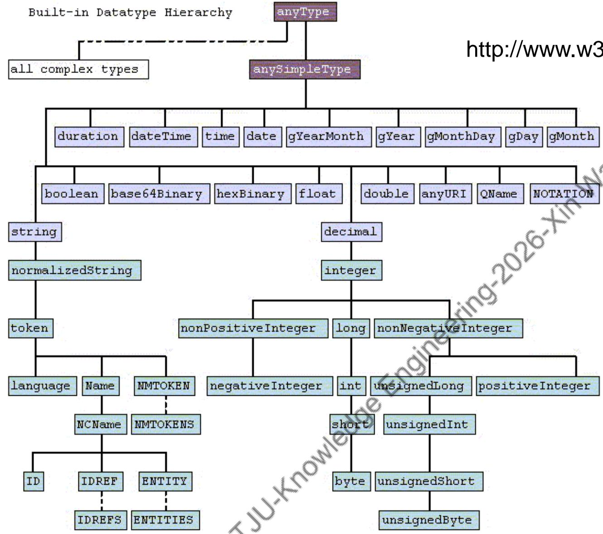

<details>
<summary>flowchart</summary>

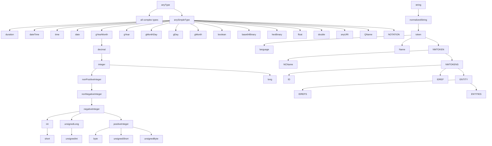
```mermaid
graph TD
  A["anyType"] --> B["all complex types"]
  A --> C["anySimpleType"]
  C --> D["duration"]
  C --> E["dateTime"]
  C --> F["time"]
  C --> G["date"]
  C --> H["gYearMonth"]
  C --> I["gYear"]
  C --> J["gMonthDay"]
  C --> K["gDay"]
  C --> L["gMonth"]
  C --> M["boolean"]
  C --> N["base64Binary"]
  C --> O["hexBinary"]
  C --> P["float"]
  C --> Q["double"]
  C --> R["anyURI"]
  C --> S["QName"]
  C --> T["NOTATION"]
  U["string"] --> V["normalizedString"]
  V --> W["token"]
  W --> X["language"]
  W --> Y["Name"]
  W --> Z["NMTOKEN"]
  Z --> AA["NCName"]
  Z --> AB["NMTOKENS"]
  AB --> AC["ID"]
  AB --> AD["IDREF"]
  AB --> AE["ENTITY"]
  AE --> AF["IDREFS"]
  AE --> AG["ENTITIES"]
  H --> AH["decimal"]
  AH --> AI["integer"]
  AI --> AJ["nonPositiveInteger"]
  AI --> AK["long"]
  AJ --> AL["nonNegativeInteger"]
  AL --> AM["negativeInteger"]
  AM --> AN["int"]
  AM --> AO["unsignedLong"]
  AM --> AP["positiveInteger"]
  AN --> AQ["short"]
  AO --> AR["unsignedInt"]
  AP --> AS["byte"]
  AP --> AT["unsignedShort"]
  AP --> AU["unsignedByte"]
```
</details>

3.org/TR/xmlschema-2/

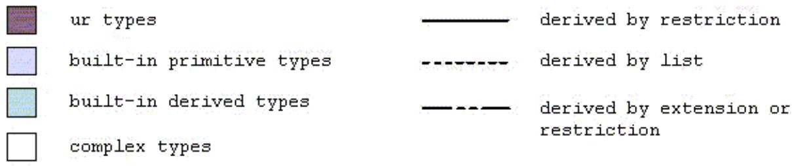

<details>
<summary>text_image</summary>

ur types
built-in primitive types
built-in derived types
complex types
derived by restriction
derived by list
derived by extension or restriction
</details>

## What is wrong with these?

```txt
@prefix ex: <http://example.org/> .
ex:Chutney ex:hasIngredient "1lb green mango", "1tsp. Cayenne pepper".
```

```txt
@prefix ex: <http://example.org/>.  
ex:Chutney ex:ingredient ex:greenMango; ex:amount "1lb";  
ex:ingredient ex:CayennePepper; ex:amount "1tsp."
```

## It’s a ternary relationship!

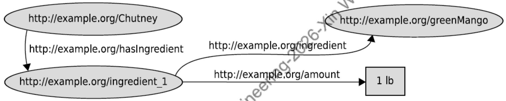

<details>
<summary>flowchart</summary>

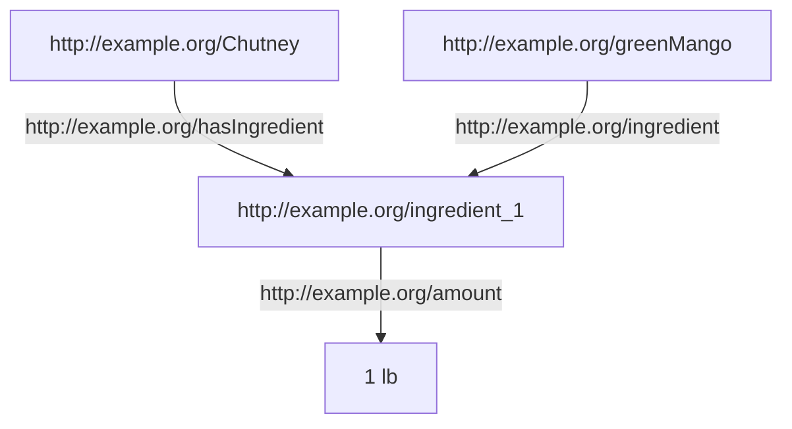
```mermaid
graph TD
  A["http://example.org/Chutney"] -->|http://example.org/hasIngredient| B["http://example.org/ingredient_1"]
  C["http://example.org/greenMango"] -->|http://example.org/ingredient| B
  B -->|http://example.org/amount| D["1 lb"]
```
</details>

```rdf
@prefix ex: <http://example.org/>. @prefix rdf: <http://www.w3.org/1999/02/22-rdf-syntax-ns#>. ex:Chutney ex:hasIngredient ex:ingredient1 . ex:ingredient1 rdf:value ex:greenMango; ex:amount "1lb".
```

## It doesn’t need a name :)

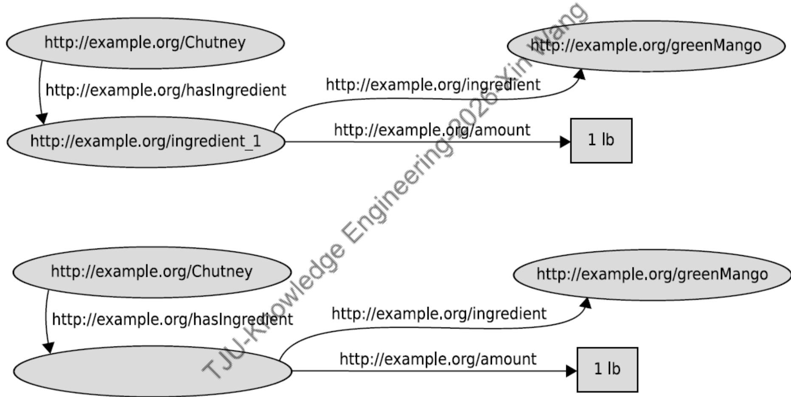

<details>
<summary>flowchart</summary>

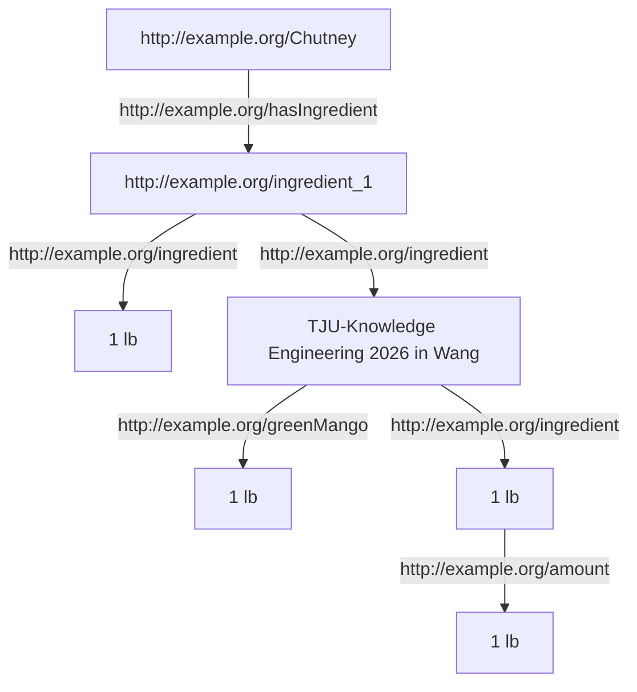
```mermaid
graph TD
  A["http://example.org/Chutney"] -->|http://example.org/hasIngredient| B["http://example.org/ingredient_1"]
  B -->|http://example.org/ingredient| C["1 lb"]
  B -->|http://example.org/ingredient| D["TJU-Knowledge Engineering 2026 in Wang"]
  D -->|http://example.org/greenMango| E["1 lb"]
  D -->|http://example.org/ingredient| F["1 lb"]
  F -->|http://example.org/amount| G["1 lb"]
```
</details>

## Blank nodes syntax

```txt
@prefix ex: <http://example.org/>.  
ex:Chutney ex:hasIngredient _:id1.  
_:id1 ex:ingredient ex:greenMango; ex:amount "1lb".
```

Shortcut:

```txt
@prefix ex: <http://example.org/>.  
ex:Chutney ex:hasIngredient [ex:ingredient ex:greenMango; ex:amount "1lb"] .
```

## question:


<details>
<summary>text_image</summary>

Hand writing on a document with a blue pen, surrounded by handwritten-style square outlines and numbers.
</details>

```rdf
<?xml version="1.0"?>
<rdf:RDF xmlns:rdf="http://www.w3.org/1999/02/22-rdf-syntax-ns#" xmlns:exs="http://example.org/schema#">
    <rdf:Description rdf:about="http://example.org/doc.html">
    <rdf:type rdf:resource="http://example.org/schema#Report"/>
    <exs:theme rdf:resource="http://example.org#Music"/>
    <exs:theme rdf:resource="http://example.org#History"/>
    <exs:nbPages rdf:datatype="http://www.w3.org/2001/XMLSchema#int">23</exs:nbPages>
    </rdf:Description>
</rdf:RDF>
```

## meaning

## question:


<details>
<summary>text_image</summary>

Hand writing on a document with a blue pen, surrounded by handwritten symbols and numbers
</details>

<?xml version="1.0"?>  
```txt
<rdf:RDF xmlns:rdf="http://www.w3.org/1999/02/22-rdf-syntax-ns#" xmlns:exs="http://example.org/schema#">
```

<rdf:Description rdf:about="http://example.org/doc.html">  
```txt
<rdf:type rdf:resource="http://example.org/schema#Report"/>
```

<exs:theme rdf:resource="http://example.org#Music"7>  
```xml
<exs:theme rdf:resource="http://example.org#History"/>
```  
<exs:nbPages rdf:datatype="http://www.w3.org/2001/xMLschema#int">23</exs:nbPages>

```txt
</rdf:Description>
```

```rdf
</rdf:RDF>
```

rdf:type

exs:Report

http://example.org/doc.html

exs:nbPages

exs:theme

"23"^^xsd:int

exs:theme

http://example.org#Music

http://example.org#History

## Types of containers

“open”: new elements can be added.  
rdf:Seq – ordered list  
rdf:Bag – unordered set  
• rdf:Alt – set of alternatives  
• Lists are actually hardly reflected in the formal semantics (more about this later)

## bags = unordered groups

<rdf:Description rdf:about="#">

<author>

<rdf :Bag>

<rdf:li>Ivan Herman</rdf:li>

<rdf:li>Fabien Gandon</rdf:li>

</rdf:Bag>

</author>

</rdf:Description>


<details>
<summary>natural_image</summary>

Solid red downward arrow icon (no text or symbols)
</details>


<details>
<summary>text_image</summary>

66-Xin Wang
</details>

<#> author [

a rdf:Bag ;

rdf:li "Ivan Herman" ;

rdf:li "Fabien Gandon" . ] .


<details>
<summary>natural_image</summary>

Red L-shaped arrow pointing left, no text or symbols present
</details>

<#> author :a

\_:a rdf:\_1 "Ivan Herman"

:a rdf: 2 "Fabien Gandon"

## sequence

ordered group of resources or literals  
<rdf:Description rdf:about="#partition">  
```xml
<contains>
    <rdf:Seq>
    <rdf:li rdf:about="#C"/>
    <rdf:li rdf:about="#C"/>
    <rdf:li rdf:about="#C"/>
    <rdf:li rdf:about="#D"/>
    <rdf:li rdf:about="#E"/>
    </rdf:Seq>
</contains>
</rdf:Description>
```

```txt
<partition>
contains [
    a rdf:Seq ;
    rdf:li "C" ;
    rdf:li "C" ;
    rdf:li "C" ;
    rdf:li "D" ;
    rdf:li "E" .
] .
```

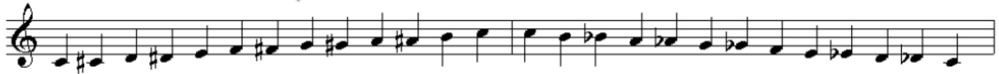

<details>
<summary>text_image</summary>

Musical notation staff with treble and bass clefs, showing notes and rests in 4/4 time signature
</details>

## alternatives

e.g. title of a book in different languages

<rdf:Description rdf:about="#book">

<title>

<rdf:Alt>

<rdf:li xml:lang="fr">l'homme qui prenait sa femme pour unehapeau</rdf:li>

<rdf:li xml:lang="en">the man who mistook his wife fora hat</rdf:li>

```txt
</rdf:Alt>
</title>
</rdf:Description>
```


<#book>

title[

a rdf:Alt

rdf:li "l'homme...@fr;

rdf:li the man..."@en .

】.

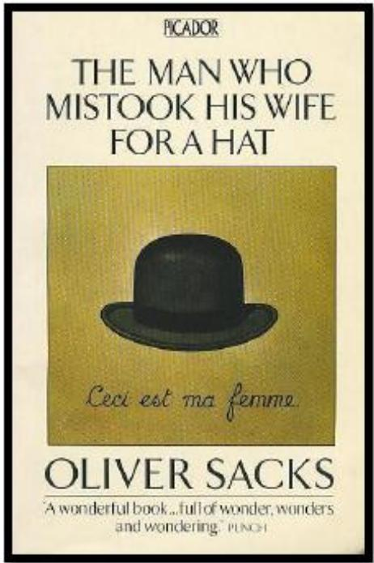

<details>
<summary>text_image</summary>

PICADOR
THE MAN WHO
MISTOOK HIS WIFE
FOR A HAT
Ceci est ma femme.
OLIVER SACKS
"A wonderful book...full of wonder, wonders
and wondering." PUNCH
</details>

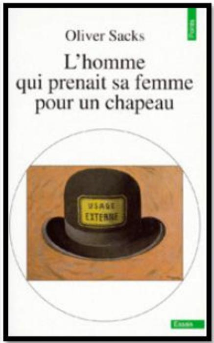

<details>
<summary>text_image</summary>

Oliver Sacks
L'homme
qui prenait sa femme
pour un chapeau
</details>

## collection

## exhaustive and ordered list

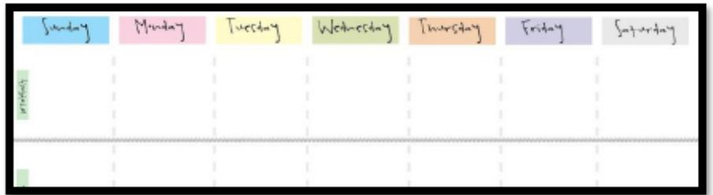

<details>
<summary>text_image</summary>

Sunday
Monday
Tuesday
Wednesday
Thursday
Friday
Saturday
Wednesday
Friday
</details>

<rdf:Description rdf:about="#week">  
<dividedIn rdf:parseType="Collection">
    <rdf:Description rdf:about="#monday"/>
    <rdf:Description rdf:about="#tuesday"/>
    <rdf:Description rdf:about="#wednesday"/>
    <rdf:Description rdf:about="#thursday"/>
    <rdf:Description rdf:about="#friday"/>
    <rdf:Description rdf:about="#saturday"/>
    <rdf:Description rdf:about="#sunday"/>
</devidedIn>
</rdf:Description>

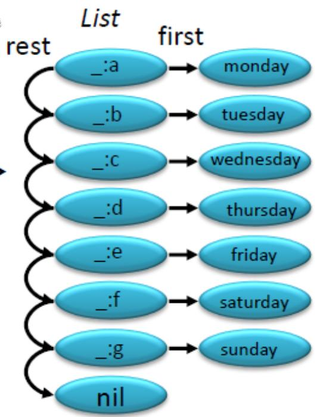

<details>
<summary>flowchart</summary>

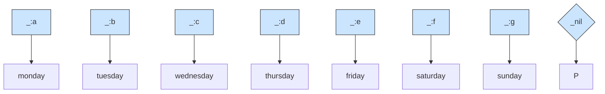
```mermaid
graph TD
  A["_:a"] --> B["monday"]
  C["_:b"] --> D["tuesday"]
  E["_:c"] --> F["wednesday"]
  G["_:d"] --> H["thursday"]
  I["_:e"] --> J["friday"]
  K["_:f"] --> L["saturday"]
  M["_:g"] --> N["sunday"]
  O{_nil} --> P
    style A fill:#cce5ff,stroke:#333
    style C fill:#cce5ff,stroke:#333
    style E fill:#cce5ff,stroke:#333
    style G fill:#cce5ff,stroke:#333
    style I fill:#cce5ff,stroke:#333
    style K fill:#cce5ff,stroke:#333
    style M fill:#cce5ff,stroke:#333
    style O fill:#cce5ff,stroke:#333
```
</details>

<#week> dividedIn
( <#monday> <#tuesday> <#wednesday>
    <#thursday> <#friday> <#saturday> <#sunday>
).

## Comparison

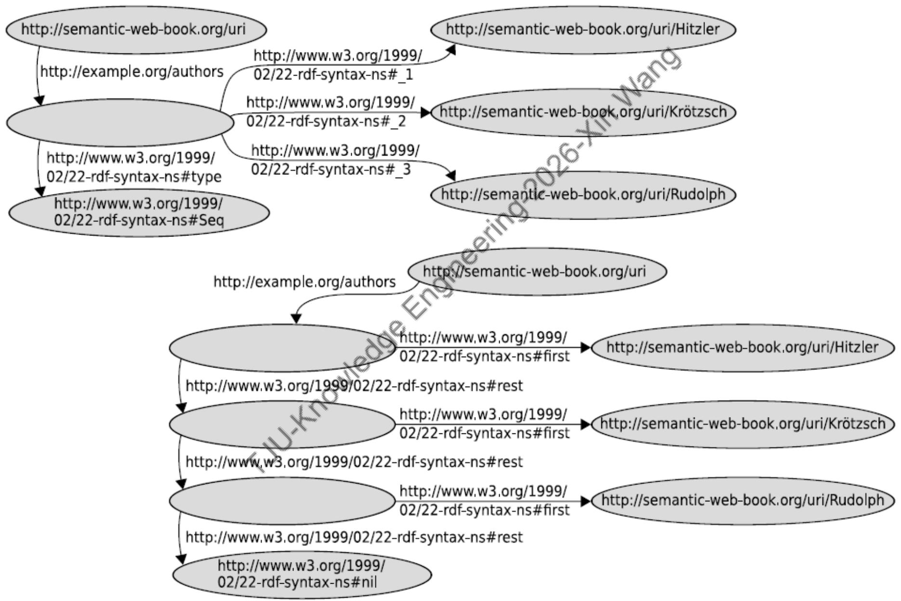

<details>
<summary>flowchart</summary>

```mermaid
graph TD
  A["http://semantic-web-book.org/uri"] -->|http://example.org/authors| B["http://www.w3.org/1999/02/22-rdf-syntax-ns#type"]
  A -->|http://www.w3.org/1999/02/22-rdf-syntax-ns#_1| C["http://www.w3.org/1999/02/22-rdf-syntax-ns#_2"]
  A -->|http://www.w3.org/1999/02/22-rdf-syntax-ns#_3| D["http://www.w3.org/1999/02/22-rdf-syntax-ns#_3"]
  A -->|http://semantic-web-book.org/uri/Hitzler| E["http://semantic-web-book.org/uri/Krötzsch"]
  B --> F["http://www.w3.org/1999/02/22-rdf-syntax-ns#Seq"]
  D --> G["http://semantic-web-book.org/uri/Rudolph"]
  F --> H["http://example.org/authors"]
  G --> I["http://semantic-web-book.org/uri"]
  H --> J["http://www.w3.org/1999/02/22-rdf-syntax-ns#first"]
  I --> K["http://semantic-web-book.org/uri/Hitzler"]
  J --> L["http://www.w3.org/1999/02/22-rdf-syntax-ns#first"]
  K --> M["http://semantic-web-book.org/uri/Krötzsch"]
  L --> N["http://www.w3.org/1999/02/22-rdf-syntax-ns#first"]
  M --> O["http://semantic-web-book.org/uri/Rudolph"]
  N --> P["http://www.w3.org/1999/02/22-rdf-syntax-ns#first"]
  O --> Q["http://semantic-web-book.org/uri/Rudolph"]
  P --> R["http://www.w3.org/1999/02/22-rdf-syntax-ns#first"]
  Q --> S["http://semantic-web-book.org/uri/Rudolph"]
```
</details>

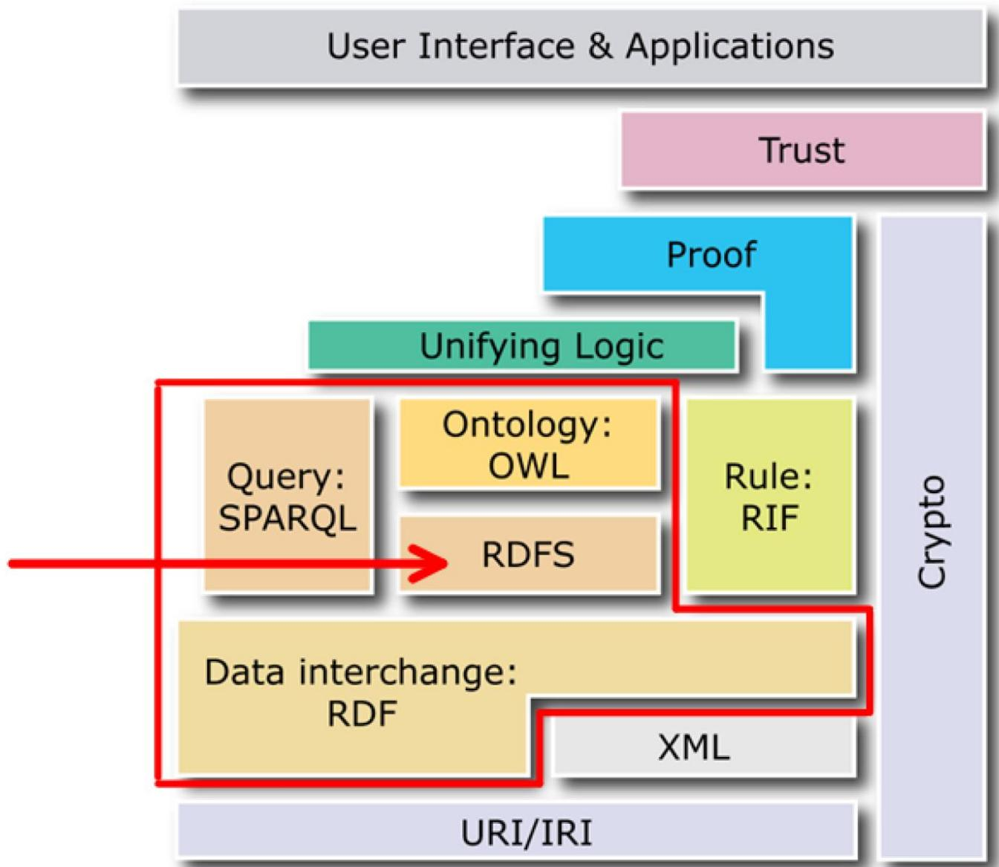

<details>
<summary>flowchart</summary>

```mermaid
graph TD
  A["User Interface & Applications"] --> B["Trust"]
  A --> C["Proof"]
  A --> D["Unifying Logic"]
  D --> E["Query: SPARQL"]
  D --> F["Ontology: OWL"]
  D --> G["RDFS"]
  D --> H["Rule: RIF"]
  D --> I["Data interchange: RDF"]
  I --> J["XML"]
  I --> K["URI/IRI"]
  L["Crypto"] --> M["Red Box"]
  M --> N["Yellow Box"]
  N --> O["Orange Box"]
  O --> P["Light Orange Box"]
  P --> Q["Light Yellow Box"]
  Q --> R["Light Green Box"]
  R --> S["Light Blue Box"]
```
</details>

RDF allows to express facts

Anne is the mother of Merula

But we'd like to be able to express more generic knowledge

Mothers are female  
If somebody has a daughter then that person is a parent

This kind of knowledge isoften called schema knowledge or terminological knowledge.  
RDF Schema allws us to do some schema knowledge modeling.  
· OWL (discussed later) gives even more expressivity.

## RDFS

## Classes

## – rdfs:Resource

• Represents the class of everything. All things described by RDF are resources

## rdfs:Class

• An rdfs:Class declares a resource as a class for other resources.

## – rdfs:Literal

• literal values such as strings and integers.

## – rdfs:Datatype

• the class of datatypes.

## – rdf:Property

• the class of properties.

## RDFS

## Properties

## rdfs:domain

• the rdfs:domain of an rdf:Property declares the class of the subject in a triple whose predicate is that property.

## rdfs:range

• the rdfs:range of an rdf:Property declares the class or datatype of the object in a triple whose predicate is that property. Eng

## rdf:type

• a property used to state that a resource is an instance of a class.

## rdfs:subClassOf

• allows declaration of hierarchies of classes.

## – rdfs:subPropertyOf

• an instance of rdf:Property that is used to state that all resources related by one property are also related by another.

## RDF 1.1 Semantics

W3C Recommendation 25 February 2014

## RDFS Entailment Rules

https://www.w 3.org/TR/rdf11 -mt/#rdfsentailment

<table><tr><td></td><td>If S contains:</td><td>then S RDFS entails recognizing D:</td></tr><tr><td>rdfs1</td><td>any IRI aaa in D</td><td>aaa rdf:type rdfs:Datatype .</td></tr><tr><td>rdfs2</td><td>aaa rdfs:domain xxx.yyy aaa zzz .</td><td>yyy rdf:type xxx .</td></tr><tr><td>rdfs3</td><td>aaa rdfs:range xxx.yyy aaa zzz .</td><td>zzz rdf:type xxx .</td></tr><tr><td>rdfs4a</td><td>xxx aaa yyy .</td><td>xxx rdf:type rdfs:Resource .</td></tr><tr><td>rdfs4b</td><td>xxx aaa yyy .</td><td>yyy rdf:type rdfs:Resource .</td></tr><tr><td>rdfs5</td><td>xxx rdfs:subPropertyOf yyy.yyy rdfs:subPropertyOf zzz .</td><td>xxx rdfs:subPropertyOf zzz .</td></tr><tr><td>rdfs6</td><td>xxx rdf:type rdf:Property .</td><td>xxx rdfs:subPropertyOf xxx .</td></tr><tr><td>rdfs7</td><td>aaa rdfs:subPropertyOf bbb.xxx aaa yyy .</td><td>xxx bbb yyy .</td></tr><tr><td>rdfs8</td><td>xxx rdf:type rdfs:Class .</td><td>xxx rdfs:subClassOf rdfs:Resource .</td></tr><tr><td>rdfs9</td><td>xxx rdfs:subClassOf yyy.zzz rdf:type xxx .</td><td>zzz rdf:type yyy .</td></tr><tr><td>rdfs10</td><td>xxx rdf:type rdfs:Class .</td><td>xxx rdfs:subClassOf xxx .</td></tr><tr><td>rdfs11</td><td>xxx rdfs:subClassOf yyy.yyy rdfs:subClassOf zzz .</td><td>xxx rdfs:subClassOf zzz .</td></tr><tr><td>rdfs12</td><td>xxx rdf:type rdfs:ContainerMembershipProperty .</td><td>xxx rdfs:subPropertyOf rdfs:member .</td></tr><tr><td>rdfs13</td><td>xxx rdf:type rdfs:Datatype .</td><td>xxx rdfs:subClassOf rdfs:Literal .</td></tr></table>

## In English

·Dog1 is an animal  
•Cat1 is a cat  
•Cats are animals  
·Zoos host animals  
·Zoo1 hosts the Cat2

<table><tr><td>In English</td><td>The graph</td></tr><tr><td>•Dog1 is an animal•Cat1 is a cat•Cats are animals•Zoos host animals•Zoo1 hosts the Cat2</td><td></td></tr></table>

## RDF/turtle

@prefix rdf:<http:/www. w3.org/1999/02/22-rdf-syntax-ns#> .

@prefix rdfs:<http://www. w3.org/2000/01/rdf-schema#>

@prefix ex: <http://example.org/> .

@prefix zoo: <http://example.org/z00/> .

ex: dog1 rdf :type ex:animal .

ex:cat1 rdf : type ex:cat .

ex:cat rdfs:subClassOf ex:animal .

z0o:hostrdfs:range ex:animal .

ex: z001 zoo:host ex:cat2 .

## Simple models

The truth value s p $\circ . ^ { \mathcal { T } }$ of a (grounded\*) tripl@ s p o. is true exactly if ( s, p,o are contained in V) and $\mathfrak { F } \mathfrak { s } ^ { \mathcal { T } } , \circ ^ { \mathcal { T } } \rangle \in \mathrm { I } _ { \mathrm { E X T } } ( \mathfrak { p } ^ { \mathcal { T } } )$

A grounded triple does not contain a blank node.

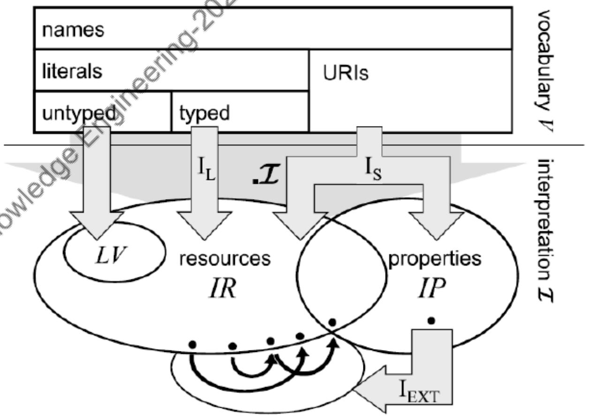

<details>
<summary>flowchart</summary>

```mermaid
graph TD
  A["vocabulary I"] --> B["interpretation I"]
  B --> C["list: resources IR"]
  C --> D["list: properties IP"]
  D --> E["list: unlabeled"]
  F["names"] --> G["literals"]
  G --> H["untyped"]
  H --> I["I_L"]
  I --> J["URIs"]
  K["I_S"] --> L["list: resources IR"]
  L --> M["list: properties IP"]
  M --> N["I_EXT"]
```
</details>

## Simple models

The truth value s $\texttt { p o } . ^ { \mathcal { T } }$ of a (grounded\*) tripl@ s p o. is true exactly if( s, p,o are contained in V) and $\bar { \mathfrak { F } } \mathfrak { s } ^ { \mathcal { T } } , \mathfrak { o } ^ { \mathcal { T } } \rangle \in \mathrm { I } _ { \mathrm { E X T } } ( \mathfrak { p } ^ { \mathcal { T } } )$ tripte

\* A grounded triple does not contain a blank node.

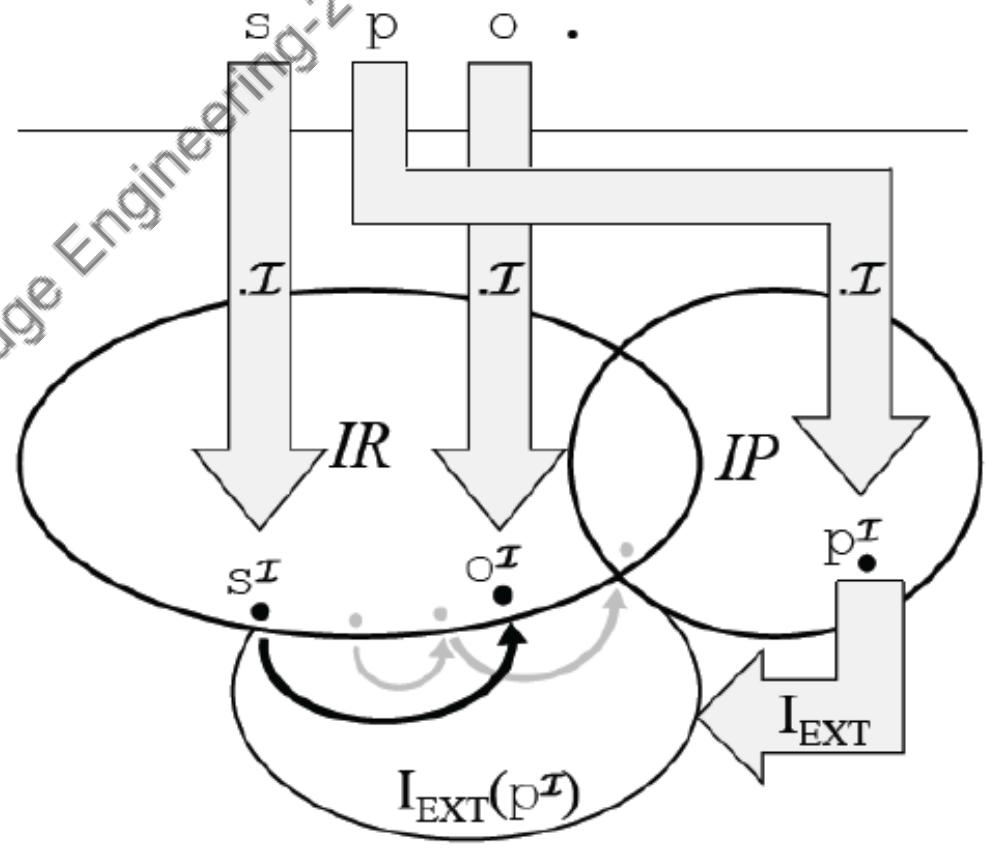

<details>
<summary>flowchart</summary>

```mermaid
graph TD
  A["I"] --> B["IR"]
  C["s"] --> B
  D["p"] --> E["IP"]
  F["o"] --> E
  G["."] --> H[".I"]
  I["."] --> J[".I"]
  K["."] --> L[".I"]
  M["s^τ"] --> N["o^τ"]
  O["p^τ"] --> P["I_EXT(p^τ)"]
  Q["I_EXT(p^τ)"] --> R["I_EXT(p^τ)"]
    style A fill:#f9f,stroke:#333
    style C fill:#f9f,stroke:#333
    style D fill:#f9f,stroke:#333
    style E fill:#f9f,stroke:#333
    style F fill:#f9f,stroke:#333
    style G fill:#f9f,stroke:#333
    style H fill:#f9f,stroke:#333
    style I fill:#f9f,stroke:#333
    style J fill:#f9f,stroke:#333
    style K fill:#f9f,stroke:#333
    style L fill:#f9f,stroke:#333
    style M fill:#f9f,stroke:#333
    style N fill:#f9f,stroke:#333
    style O fill:#f9f,stroke:#333
    style P fill:#f9f,stroke:#333
    style Q fill:#f9f,stroke:#333
```
</details>

## 目录

C O N T E N T S

0 知识工程概述  
C 02 语义Web  
03 本体与推理  
04 4 知识图谱

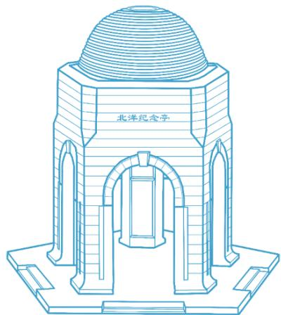

<details>
<summary>text_image</summary>

北洋紀念亭
</details>

## 本体 Ontology

## 哲学 概念

• 关于是和存在的本质 the nature of being and existence  
是及其关系的基本类别 the basic categories of being and their relations

## 知识工程

• 本体是概念模型的明确规范 Gruber, 1993

An ontology is an explicit specification of a conceptualization

概念模型  
Conceptualization  
明确  
Explicit  
形式化  
Formal  
共享  
Shared

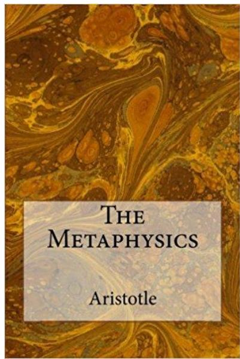

<details>
<summary>text_image</summary>

THE
METAPHYSICS
Aristotle
</details>

知识工程中借用了“本体”这一哲学概念并赋予其新的含义

## 概念 Concept： 基于集合论进行定义

## 概念表达式 concept expression

概念的否定（补集）  
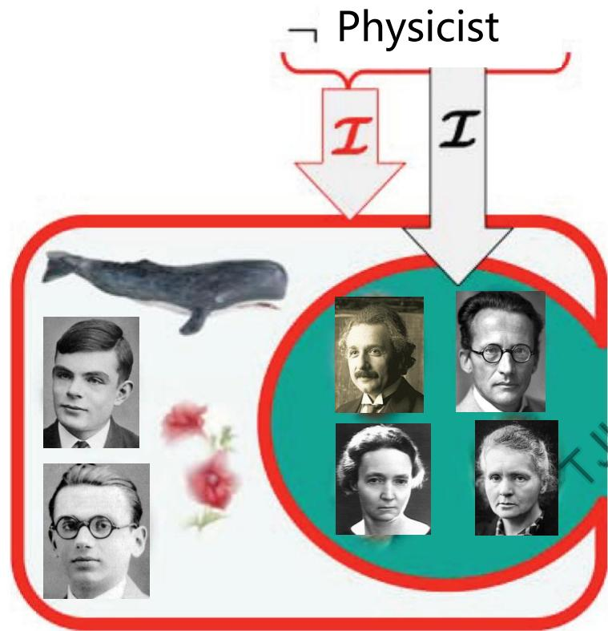

<details>
<summary>flowchart</summary>

```mermaid
graph TD
  A["Physician"] --> B["Whale"]
  A --> C["Scientist 1"]
  A --> D["Scientist 2"]
  A --> E["Scientist 3"]
  A --> F["Scientist 4"]
  A --> G["Scientist 5"]
  A --> H["Scientist 6"]
  A --> I["Scientist 7"]
  A --> J["Scientist 8"]
  A --> K["Scientist 9"]
  A --> L["Scientist 10"]
    style A fill:#f9f,stroke:#333
    style B fill:#ccf,stroke:#333
    style C fill:#ccf,stroke:#333
    style D fill:#ccf,stroke:#333
    style E fill:#ccf,stroke:#333
    style F fill:#ccf,stroke:#333
    style G fill:#ccf,stroke:#333
    style H fill:#ccf,stroke:#333
    style I fill:#ccf,stroke:#333
    style J fill:#ccf,stroke:#333
    style K fill:#ccf,stroke:#333
    style L fill:#ccf,stroke:#333
```
</details>

概念的交（交集）  
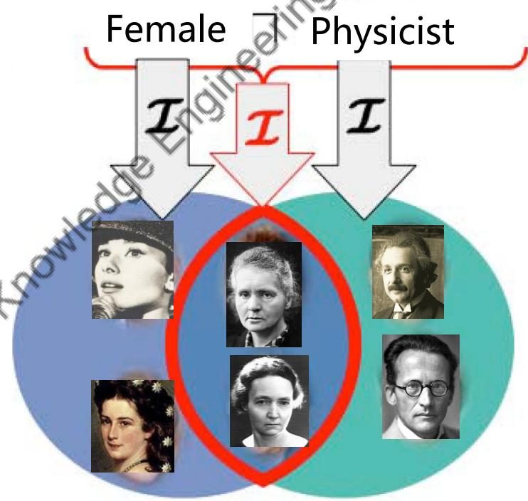

<details>
<summary>flowchart</summary>

```mermaid
graph TD
  A["Female"] --> B["Physicsist"]
  C["I"] --> D["Physicsist"]
  E["I"] --> F["Physicsist"]
  G["I"] --> H["Physicsist"]
  I["I"] --> J["Physicsist"]
  K["I"] --> L["Physicsist"]
  M["I"] --> N["Physicsist"]
  O["I"] --> P["Physicsist"]
  Q["I"] --> R["Physicsist"]
  S["I"] --> T["Physicsist"]
  U["I"] --> V["Physicsist"]
  W["I"] --> X["Physicsist"]
  Y["I"] --> Z["Physicsist"]
  AA["I"] --> AB["Physicsist"]
  AC["I"] --> AD["Physicsist"]
  AE["I"] --> AF["Physicsist"]
  AG["I"] --> AH["Physicsist"]
```
</details>

概念的并（并集）  
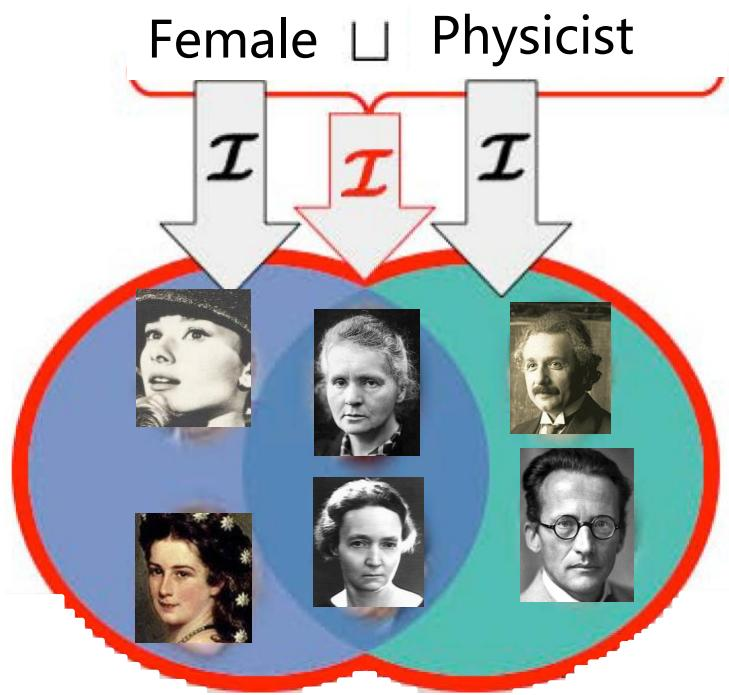

<details>
<summary>flowchart</summary>

```mermaid
graph TD
  A["Female"] --> B["I"]
  C["Physicist"] --> D["I"]
  B --> E["Image of multiple women's portraits"]
  D --> F["Image of one female portrait"]
```
</details>

## 概念 Concept： 基于集合论进行定义

概念表达式 Concept expression

概念的存在关系约束 Existential role restrictions

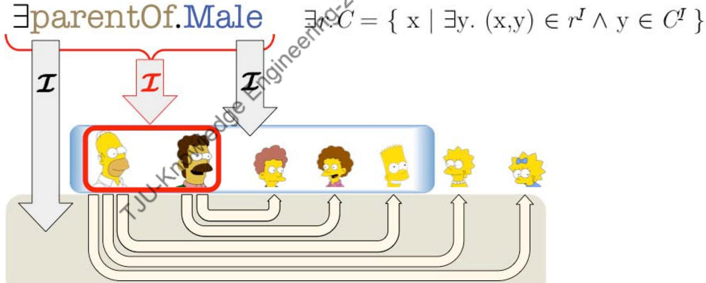

<details>
<summary>flowchart</summary>

```mermaid
graph TD
  A["∃parentOf.Male"] --> B["×"]
  B --> C["×"]
  C --> D["×"]
  D --> E["×"]
  E --> F["×"]
  F --> G["×"]
  G --> H["×"]
  H --> I["×"]
  I --> J["×"]
  J --> K["×"]
  K --> L["×"]
  L --> M["×"]
  M --> N["×"]
  N --> O["×"]
  O --> P["×"]
  P --> Q["×"]
  Q --> R["×"]
  R --> S["×"]
  S --> T["×"]
  T --> U["×"]
  U --> V["×"]
  V --> W["×"]
  W --> X["×"]
  X --> Y["×"]
  Y --> Z["×"]
  Z --> A
    style A fill:#f9f,stroke:#333
    style B fill:#ccf,stroke:#333
    style C fill:#cfc,stroke:#333
    style D fill:#fcc,stroke:#333
    style E fill:#cff,stroke:#333
    style F fill:#ffc,stroke:#333
    style G fill:#fcf,stroke:#333
    style H fill:#cff,stroke:#333
    style I fill:#ffc,stroke:#333
    style J fill:#cfc,stroke:#333
    style K fill:#fcc,stroke:#333
    style L fill:#ffc,stroke:#333
    style M fill:#cfc,stroke:#333
    style N fill:#fcc,stroke:#333
    style O fill:#ffc,stroke:#333
    style P fill:#cfc,stroke:#333
    style Q fill:#fcc,stroke:#333
    style R fill:#ffc,stroke:#333
    style S fill:#cfc,stroke:#333
    style T fill:#fcc,stroke:#333
    style U fill:#ffc,stroke:#333
```
</details>

## 概念 Concept： 基于集合论进行定义

概念表达式 Concept expression

概念的全称关系约束 Universal role restriction

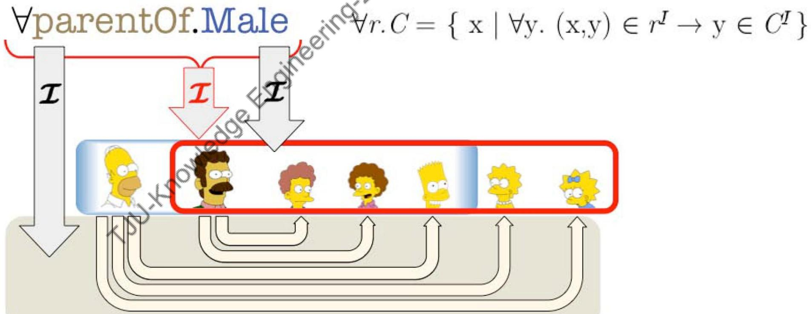

<details>
<summary>flowchart</summary>

```mermaid
graph TD
  A["∀parentOf.Male"] --> B["I"]
  B --> C["∑I-Knowledge Engineering"]
  D --> E["..."]
    style A fill:#f9f,stroke:#333
    style B fill:#ccf,stroke:#333
    style C fill:#cfc,stroke:#333
    style D fill:#fcc,stroke:#333
```
</details>

## 概念 Concept： 基于集合论进行定义

概念表达式 Concept expression

概念的量词关系约束 Qualified Number Restriction  
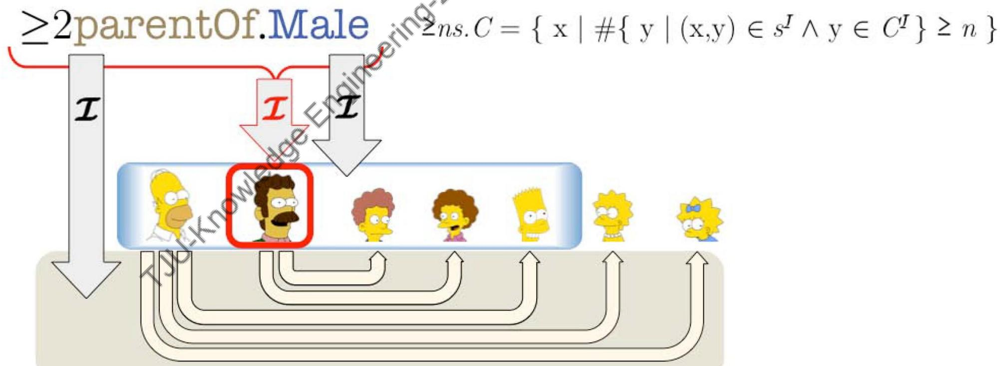

<details>
<summary>flowchart</summary>

```mermaid
graph TD
  A["≥2 parentOf.Male"] --> B["I"]
  A --> C["I"]
  A --> D["I"]
  B --> E["..."]
  C --> F["..."]
  D --> G["..."]
  E --> H["..."]
  F --> I["..."]
  G --> J["..."]
  H --> K["..."]
  I --> L["..."]
  J --> M["..."]
  K --> N["..."]
  L --> O["..."]
  M --> P["..."]
  N --> Q["..."]
  O --> R["..."]
  P --> S["..."]
  Q --> T["..."]
  R --> U["..."]
  S --> V["..."]
  T --> W["..."]
  U --> X["..."]
  V --> Y["..."]
  W --> Z["..."]
  X --> AA["..."]
  Y --> AB["..."]
  Z --> AC["..."]
  AA --> AD["..."]
  AB --> AE["..."]
  AC --> AF["..."]
  AD --> AG["..."]
  AE --> AH["..."]
  AF --> AI["..."]
  AG --> AJ["..."]
  AH --> AK["..."]
  AI --> AL["..."]
```
</details>

## ◼ 公理 Axiom：能判断结果为真或假的表达式

概念的成员：判断一个实例是否属于某概念  
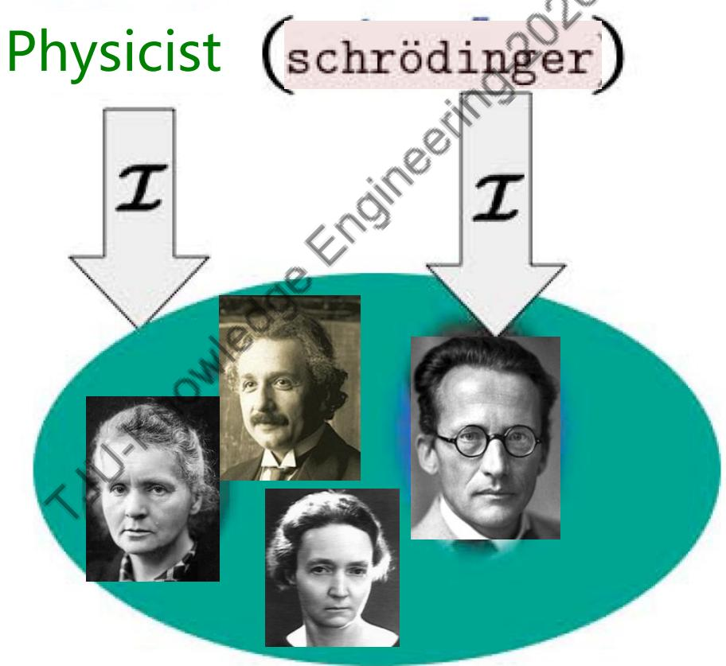

<details>
<summary>flowchart</summary>

```mermaid
graph TD
  A["Physicist (schrödinger)"] --> B["I"]
  A --> C["I"]
  B --> D["Historical 1960s"]
  B --> E["Historical 1965s"]
  B --> F["Historical 1970s"]
  C --> G["Historical 1975s"]
  C --> H["Historical 1980s"]
```
</details>

## ◼ 公理 Axiom：能判断结果为真或假的表达式

关系的成员：判断一对实例是否具有某关系

(Marie Curie, Irene Joliot-Curie)

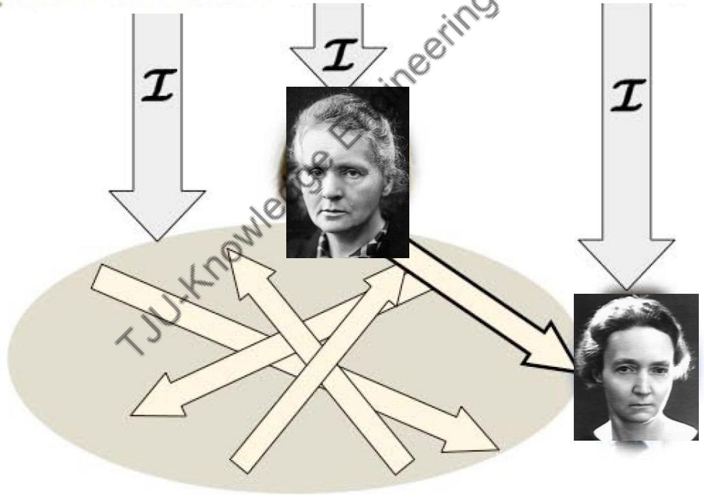

<details>
<summary>flowchart</summary>

```mermaid
graph TD
  A["TJ.Knowledge Engineering"] --> B["Historical Image"]
  C["Historical Image"] --> D["TJ.Knowledge Engineering"]
  E["Historical Image"] --> F["TJ.Knowledge Engineering"]
  G["Historical Image"] --> H["TJ.Knowledge Engineering"]
  I["I"] --> J["Infering"]
  K["I"] --> L["Engineering"]
  M["I"] --> N["Engineering"]
```
</details>

## ◼ 公理 Axiom：能判断结果为真或假的表达式

概念包含：判断一个概念是否为另一概念的子集

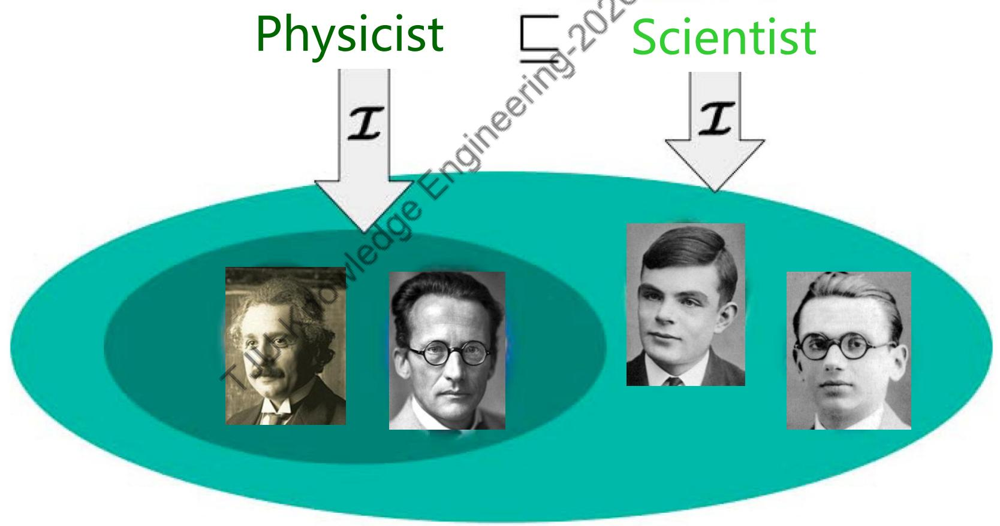

<details>
<summary>flowchart</summary>

```mermaid
graph TD
  A["Physicist"] -->|I| B["Knowledge Engineering-2023"]
  C["Scientist"] -->|I| B
  D["Image 1: Albert Einstein"] --> E["Image 2: James M. Brown"]
  F["Image 3: James M. Brown"] --> G["Image 4: James M. Brown"]
  H["Image 5: James M. Brown"] --> I["Image 6: James M. Brown"]
```
</details>

## 本体示例： 薛定谔的猫

## 本体定义（描述逻辑）

ownscaresFor

Healthy-Dead

CatDeadAlive

HappyCatOwner Eowns.Cat VcaresFor.Healthy

HappyCatOwner (schrodinger)

## 解释

如果某人拥有（owns）某物，则他关爱（caresFor）该物  
• 健康（Healthy）的东西不是死的（¬Dead）  
• 猫（Cat）要么是死的（Dead）要么是活的（Alive）

快乐的猫主人（HappyCatOwner）拥有一只猫并且他所有关爱的东西都是健康的

薛定谔（schrödinger）是快乐的猫主人（HappyCatOwner）

## DL g Description Logic 描述逻辑

## An Example Knowledge Base

<table><tr><td>RBox Rowns ⊆ caresFor“If somebody owns something, they care for it.”</td></tr><tr><td>TBox THealthy ⊆ ¬Dead“Healthy beings are not dead.”Cat ⊆ Dead ⊥ Alive“Every cat is dead or alive.”HappyCatOwner ⊆existsCat ∩∀caresFor.Healthy“A happy cat owner owns a cat and all beings he cares for are healthy.”</td></tr><tr><td>ABox AHappyCatOwner (schrödinger)“Schrödinger is a happy cat owner.”</td></tr></table>

## Interpretations

A DL interpretationI fixes a domain set $\Delta ^ { \underline { { \tau } } }$ anda mapping.I associatinga,semanticcounterpart“toeveryame.


<details>
<summary>flowchart</summary>

Diagram illustrating relationships between individual, class, and role names with mathematical expressions like ΔI and rI, centered around a central C^I region.
</details>

N.B.: Different names can bemapped to the same semantic counterpart:no unique name assumption. N.B.:△can be infinite.

## Interpretations: An Example

$\mathsf { N } _ { I } = \left\{ \begin{array} { r l r } \end{array} \right.$ sun, morning\_star,evening\_star, moon,home}.  
- Nc = {Planet,Star}.  
$- \ \mathsf { N } _ { R } = \left\{ \mathsf { o r b i t s A r o u n d } , \mathsf { s h i n e s O n } \right\} .$

$$
\begin{array}{l} \mathbf {s u n} ^ {\mathcal {I}} = \odot \quad \text {Planet} ^ {\mathcal {I}} = \{\text {♀}, \text {♀}, \text {♂}, \text {♂}, 4, \text {♂}, \text {♂}, \text {♀} \} \\ \mathsf {m o r n i n g \_ s t a r} ^ {\mathcal {I}} = \textcircled {♀} \\ \operatorname{Star} ^ {\mathcal {I}} = \{\odot \} \\ \mathsf {e v e n i n g \_ s t a r} ^ {\mathcal {I}} = \textcircled {♀} \\ \mathbf {m o o n} ^ {\mathcal {I}} = \mathbb {C} \\ \mathbf {h o m e} ^ {\mathcal {I}} = \text {♂} \\ \text {orbitsAround} ^ {\mathcal {I}} = \{\langle \wp , \odot \rangle , \langle \wp , \odot \rangle , \langle \dagger , \odot \rangle , \langle \sigma^ {\prime}, \odot \rangle , \langle 4, \odot \rangle , \\ \langle \mathfrak {h}, \odot \rangle , \langle \mathfrak {s}, \odot \rangle , \langle \mathfrak {y}, \odot \rangle , \langle \mathbb {P}, \odot \rangle , \langle \mathbb {C}, \mathfrak {s} \rangle \} \\ \mathsf {s h i n e s 0 n} ^ {\mathcal {I}} = \{\langle \odot , \mathfrak {Y} \rangle , \langle \odot , \mathfrak {Y} \rangle , \langle \odot , \mathfrak {G} \rangle , \langle \odot , \mathbb {C} \rangle , \langle \odot , \mathfrak {G} \rangle , \\ \langle \odot , 4 \rangle , \langle \odot , \hbar \rangle , \langle \odot , \hat {\mathfrak {s}} \rangle , \langle \odot , \mathfrak {F} \rangle , \langle \odot , \mathbb {P} \rangle \} \\ \end{array}
$$

$$
\begin{array}{l} \mathbf {s u n} ^ {\mathcal {I}} = \odot \\ \text { morning\_star } ^ {\mathcal {I}} = \text { ♀ } \\ \text { evening\_star } ^ {\mathcal {I}} = \text { ♀ } \\ \mathbf {m o o n} ^ {\mathcal {I}} = \mathbb {C} \\ \mathbf {h o m e} ^ {\mathcal {I}} = \text { † } \\ \mathbf {P l a n e t} ^ {\mathcal {I}} = \{\text {♀}, \text {♀}, \text {♂}, \text {♂}, 4, \text {♂}, \text {♂}, \text {♀} \} \\ \mathbf {S t a r} ^ {\mathcal {I}} = \{\odot \} \\ \mathsf {o r b i t s A r o u n d} ^ {\mathcal {I}} = \{\langle \breve {\wp}, \odot \rangle , \langle \wp , \odot \rangle , \langle \natural , \odot \rangle , \langle \sigma^ {\nearrow}, \odot \rangle , \langle 4, \odot \rangle , \\ \langle \hbar , \odot \rangle , \langle \widehat {\mathfrak {s}}, \odot \rangle , \langle \widehat {\mathfrak {g}}, \odot \rangle , \langle \mathbb {P}, \odot \rangle , \langle \mathbb {C}, \mathfrak {s} \rangle \} \\ \mathsf {s h i n e s 0 n} ^ {\mathcal {I}} = \{\langle \odot , \mathbb {Y} \rangle , \langle \odot , \mathbb {Y} \rangle , \langle \odot , \mathbb {S} \rangle , \langle \odot , \mathbb {C} \rangle , \langle \odot , \mathbb {O} \rangle , \\ \langle \odot , 4 \rangle , \langle \odot , \hbar \rangle , \langle \odot , \hat {\mathfrak {s}} \rangle , \langle \odot , \mathfrak {F} \rangle , \langle \odot , \mathbb {P} \rangle \} \\ \end{array}
$$

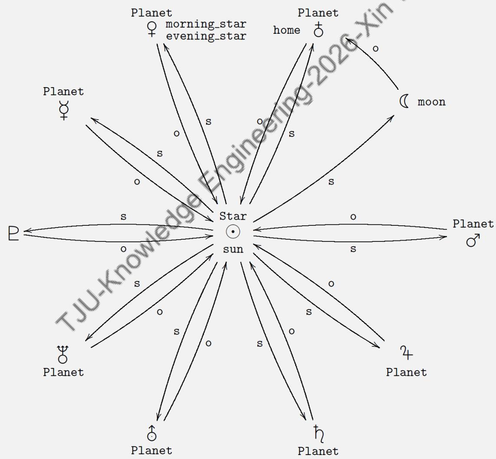

<details>
<summary>flowchart</summary>

```mermaid
graph TD
  A["Planet"] -->|s| B["Star"]
  B -->|o| C["moon"]
  B -->|s| D["Sun"]
  B -->|o| E["Moon"]
  B -->|s| F["Moon"]
  B -->|o| G["Moon"]
  B -->|s| H["Moon"]
  B -->|o| I["Moon"]
  B -->|s| J["Moon"]
  B -->|o| K["Moon"]
  B -->|s| L["Moon"]
  B -->|o| M["Moon"]
  B -->|s| N["Moon"]
  B -->|o| O["Moon"]
  B -->|s| P["Moon"]
  B -->|o| Q["Moon"]
  B -->|s| R["Moon"]
  B -->|o| S["Moon"]
  B -->|s| T["Moon"]
  B -->|o| U["Moon"]
  B -->|s| V["Moon"]
  B -->|o| W["Moon"]
  B -->|s| X["Moon"]
  B -->|o| Y["Moon"]
  B -->|s| Z["Moon"]
  B -->|o| AA["Moon"]
  B -->|s| AB["Moon"]
  B -->|o| AC["Moon"]
  B -->|s| AD["Moon"]
  B -->|o| AE["Moon"]
  B -->|s| AF["Moon"]
  B -->|o| AG["Moon"]
  B -->|s| AH["Moon"]
  B -->|o| AI["Moon"]
  B -->|s| AJ["Moon"]
  B -->|o| AK["Moon"]
  B -->|s| AL["Moon"]
  B -->|o| AM["Moon"]
  B -->|s| AN["Moon"]
  B -->|o| AO["Moon"]
  B -->|s| AP["Moon"]
  B -->|o| AQ["Moon"]
  B -->|s| AR["Moon"]
  B -->|o| AS["Moon"]
```
</details>

Atomic building blocks:

Individual names I (objects)， e.g. tintin  
Concept names C (classes), e.g. Dog  
? Role names R (relations)， e.g.owns, travelsTo

Boolean constructors:

conjunction: ∩ (class intersection)  
disjunction: (classaunion)  
negation: (class complement)

Role restrictions:

existential restriction:  (some)  
universal restriction: ∀ (only)

and more: cardinality constraints, inverse roles,role composition,

## Definition (Concept language of ALC)

Every concept name $A \in \mathsf C$ is a concept  
。 T and ⊥ are concepts  
• If C and D are concepts, then so areC,C  D,C  D  
• If $r \in { \mathsf { R } }$ and C is a concept, then Vr.C and r.C are concepts

## Which of the following are concepts?

Tnr.T  
3r.T  
CU--D  
3r.∀s.C D  
∀r.(C n -D)

## Definition (Concept language of $\ A \mathcal { L } \mathcal { C } )$

Every concept name $A \in \mathsf C$ is a concept  
T and ⊥ are concepts  
• If C and D are concepts, then so areC, C ∩ D,C  D  
· If $r \in { \mathsf { R } }$ and C is a concept, then r.C and 3r.C are concepts

## Which of the following are concepts?

Tr.T X

3r.T

C–-D X

3r.∀s.C D

∀r.(Cn-D)

## Concept language semantics

## Definition (Interpretation)

An $\mathcal { A L C C }$ interpretation I consists of a nonempty domain $\Delta$ ， and an interpretation function .T such that:

for each individual name $a \in { \mathsf { I } } , a ^ { \mathcal { I } } \in \Delta _ { \mathsf { I } }$  
for each concept name $A \in \mathsf C , A ^ { \scriptscriptstyle T } \le \bar { \Delta } ^ { \scriptscriptstyle \top } \Delta$  
for each role name $r \in \mathsf { R } , r ^ { \mathbb { Z } } \subseteq \triangle ^ { \mathbb { N } } \times \Delta$

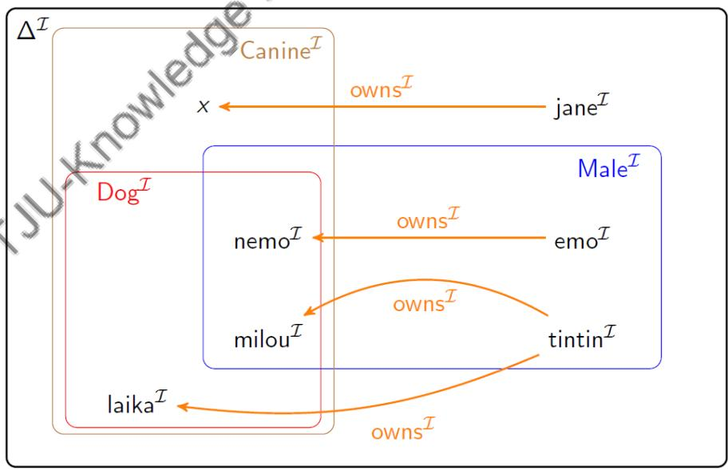

<details>
<summary>flowchart</summary>

```mermaid
graph TD
  A["Dog"] -->|x| B["Canine"]
  B -->|owns^I| C["jane^I"]
  A --> D["nemo"]
  D -->|owns^I| E["Male^I"]
  E -->|ems^I| F["emo^I"]
  A --> G["milou"]
  G -->|owns^I| H["tintin^I"]
  H -->|owns^I| I["laika^I"]
  I --> A
```
</details>

Extend interpretations to complex concept expressions:

$\top ^ { \mathcal { T } } = \Delta$  
$\perp ^ { \mathcal { T } } = \emptyset$  
$( \neg C ) ^ { \mathcal { T } } = \Delta \backslash C ^ { \mathcal { T } }$  
$( C \cap D ) ^ { \mathcal { I } } = C ^ { \mathcal { I } } \cap D ^ { \mathcal { I } }$  
$( C \sqcup D ) ^ { \mathcal { I } } = C ^ { \mathcal { I } } \cup D ^ { \mathcal { I } }$

$\begin{array} { r l } { ( \exists r . C ) ^ { \mathcal { I } } } & { { } = \{ x \in \Delta \lrcorner \} ^ { \mathcal { C } } } \end{array}$ is related by $r ^ { \mathcal { Z } }$ to some element in $C ^ { \mathcal { I } } \big \}$

$$
= \{x \in \Delta | \exists y (r ^ {\mathcal {I}} (x, y) \wedge C ^ {\mathcal {I}} (y)) \}
$$

$\begin{array} { r l } { ( \forall r . C ) ^ { \mathcal { T } } } & { { } = \{ \underset { \mathbf { X } } { \nabla } \mathbf { \mathcal { E } } \mathbf { \Psi } \Delta \mid x } \end{array}$ is related by $r ^ { \mathcal { Z } }$ Only to elements in $C ^ { \mathcal { I } } \}$

$$
= \{x \in \Delta \mid \forall y (r ^ {\mathcal {I}} (x, y) \rightarrow C ^ {\mathcal {I}} (y)) \}
$$

## Arbitrary concept

。 A class in the domain  
$C ^ { \mathcal { T } } \subseteq \Delta ^ { \mathcal { T } }$

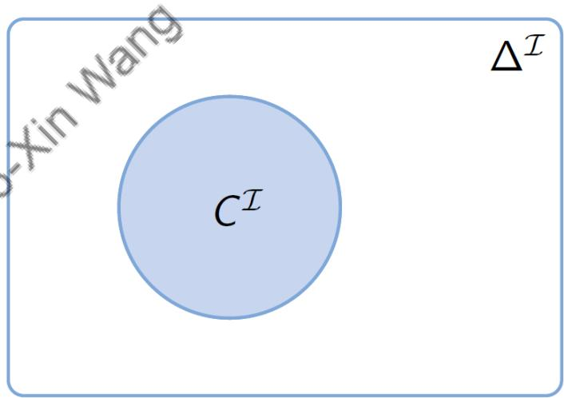

<details>
<summary>text_image</summary>

b-Xin Wang
C^I
Δ^I
</details>

## Arbitrary concept

• A class in the domain  
$C ^ { \mathcal { T } } \subseteq \Delta ^ { \mathcal { T } }$

## Concept negation

The complement of a class  
$( \neg C ) ^ { \mathcal { T } } = \Delta ^ { \mathcal { T } } \setminus \mathbf { \dot { C } ^ { \mathcal { T } } }$

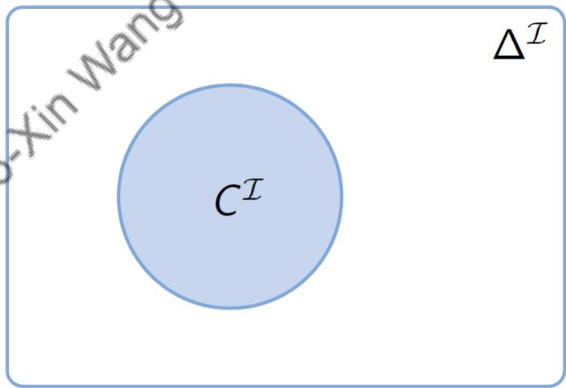

<details>
<summary>text_image</summary>

D-Xin Wang
C^I
Δ^I
</details>

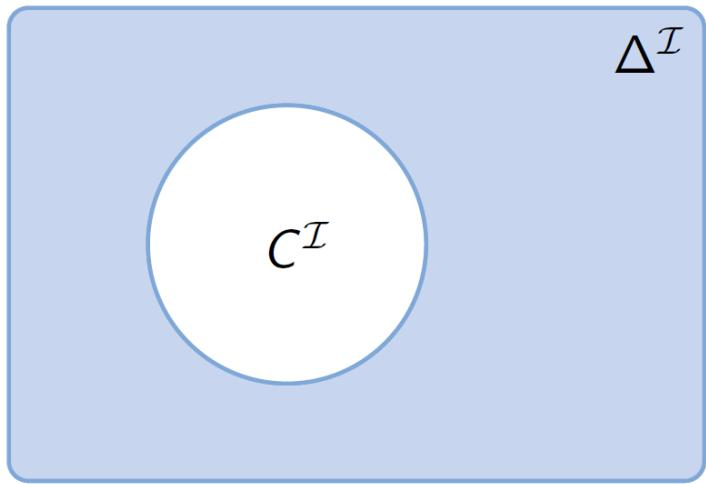

<details>
<summary>text_image</summary>

C^I
Δ^I
</details>

## Concept conjunction

The intersection of two classes  
$( C \cap D ) ^ { \mathcal { I } } = C ^ { \mathcal { I } } \cap D ^ { \mathcal { I } }$

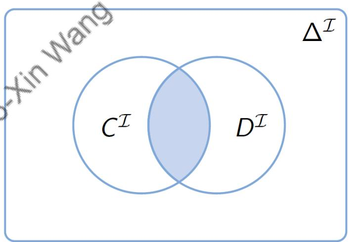

<details>
<summary>text_image</summary>

D-Xin Wang
C^I
D^I
Δ^I
</details>

## Concept conjunction

The intersection of two classes  
$( C \cap D ) ^ { \mathcal { I } } = C ^ { \mathcal { I } } \cap D ^ { \mathcal { I } }$

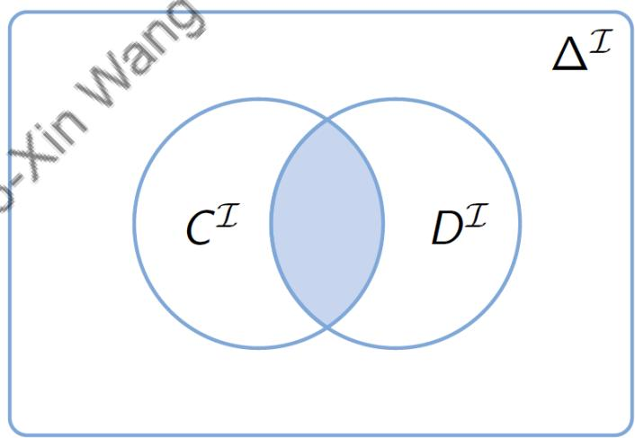

<details>
<summary>text_image</summary>

C^I
D^I
Δ^I
Xin Wang
</details>

## Concept disjunction

The union of two classes  
$( C \sqcup D ) ^ { \mathcal { Z } } = C ^ { \mathcal { \hat { Z } } } \cup D ^ { \mathcal { Z } }$

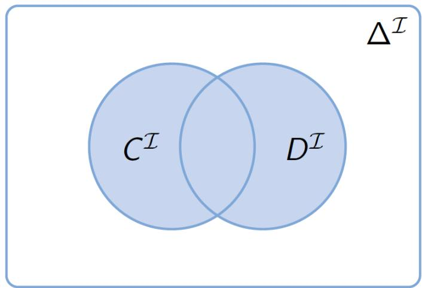

<details>
<summary>text_image</summary>

C^I
D^I
Δ^I
</details>

## Existential restriction

$$
(\exists r. C) ^ {\mathcal {I}} = \{x \in \Delta \mid \exists y (r ^ {\mathcal {I}} (x, y) \land C ^ {\mathcal {I}} (y)) \}
$$


<details>
<summary>text_image</summary>

Xin Wang
(∃r.C)I
rI
CII
ΔI
</details>

## Existential restriction

$$
(\exists r. C) ^ {\mathcal {I}} = \{x \in \Delta \mid \exists y (r ^ {\mathcal {I}} (x, y) \land C ^ {\mathcal {I}} (y)) \}
$$

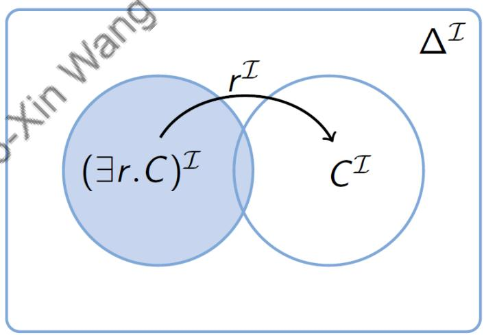

<details>
<summary>text_image</summary>

Xin Wang
(∃r.C)I
rI
CII
ΔI
</details>

## Universal restriction

$$
(\forall r. C) ^ {\mathcal {I}} = \{x \in \Delta \mid \forall y (r ^ {\mathcal {I}} (x, y) \rightarrow C ^ {\mathcal {I}} (y)) \}
$$

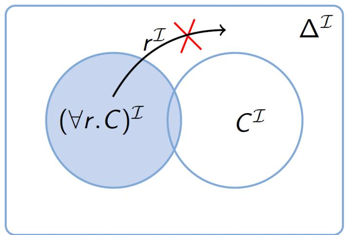

<details>
<summary>text_image</summary>

(∀r.C)ᴵ
rᴵ
Cᴵ
Δᴵ
</details>

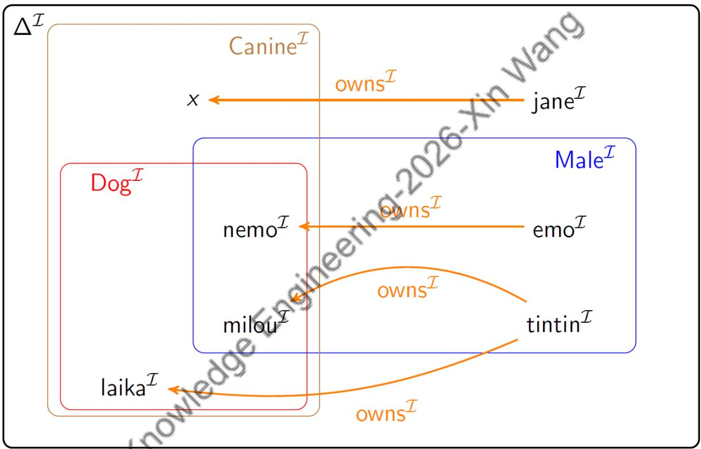

<details>
<summary>flowchart</summary>

```mermaid
graph TD
  A["Dog^I"] -->|x| B["Canine^I"]
  B -->|owns^I| C["jane^I"]
  A --> D["nemo^I"]
  D -->|owns^I| E["Male^I"]
  A --> F["milou^I"]
  F -->|owns^I| G["tintin^I"]
  A --> H["laika^I"]
  H -->|owns^I| G
    style A fill:#f9f,stroke:#333
    style B fill:#ccf,stroke:#333
    style C fill:#cfc,stroke:#333
    style D fill:#fcf,stroke:#333
    style E fill:#cff,stroke:#333
    style F fill:#ffc,stroke:#333
    style G fill:#fcc,stroke:#333
    style H fill:#cff,stroke:#333
```
</details>

$( \mathsf { C a n i n e } \sqcap \mathsf { M a } \dot { | } \mathrm { e } ) ^ { \mathbb { Z } } = \{ \dots \}$  
(Eowns.(Canine  Male)) = {..}  
（-Canine  ∀owns.-(Male  Canine))={..}

Terminological axioms (TBox axioms):

• All owners of a male dog are male  
In predicate logic:

$$
\forall x (\exists y (\text { Owns } (x, y) \land \text { Male } (y) \land \text { Dog } (y)) \rightarrow \text { Male } (x))
$$

This is a sentence in predicatelogic

Terminological axioms (TBox axioms):

• All owners of a male dog are male  
In predicate logic:

$$
\forall x (\exists y (\text { Owns } (x, y) \land \text { Male } (y) \land \text { Dog } (y)) \rightarrow \text { Male } (x))
$$

This is a sentence in predicatelogic

Assertions (ABox assertions):

assert categories to which individuals or pairs of individuals belong  
Nemo is a dog  
Emo owns Nemo  
In predicate logic:

Dog(nemo) ^ Owns(emo, nemo)

## CΩD

· Concept inclusion / subsumption:

C is subsumed by D  
C is more specific than D  
D generalises C  
All C are D  
Every C is a D

· Formalises the syllogismAll .. are..  
Predicate logic translation:

? Binds the free Variable in C and in D

$\forall x ( C ( x ) \not \prec { \mathcal { D } } ( x ) )$

## Example

3owns.(Dog  Male) Ω Male

## Assertions

$$
a: C; \quad (a, b): r
$$

。 Concept and role assertions:

a is an instance of C  
a and b are related by r

Predicate logic translation:

C(a)  
r(a,b)

## Example

nemo : Dog

nemo :-Male

(emo, nemo) : owns

Recall - An interpretation $\mathcal { T }$ is a tuple $\langle \Delta , \cdot ^ { \mathcal { I } } \rangle$ withdomain $\Delta$ of objects and interpretation function $\cdot ^ { \mathcal { Z } }$ such that:

for each individual name $a \in { \mathsf { I } } , \mathsf { \pmb { \partial } } ^ { \mathbb { Z } } \in \Delta { \mathsf { \varepsilon } }$  
for each concept name $A \in \mathsf C , A ^ { \scriptscriptstyle T } \subseteq \mathcal B$  
for each role name $r \in \mathsf { R } , r ^ { \mathbb { Z } } \subseteq \mathbb { A } ^ { \mathbb { S } } \times \Delta$

## Definition (Satisfaction)

… ${ \mathcal { T } } \Vdash C \subseteq D { \mathrm { ~ i f ~ } } C ^ { \mathbb { Z } } \subseteq D ^ { \mathbb { Z } } $ (read: I satisfies $C \subseteq D )$  
${ \mathcal { T } } \Vdash a : C { \mathsf { i f } } \ a ^ { \mathcal { T } } \in { \mathfrak { C } } ^ { \sharp }$  
· $\mathcal { T } | | - ( a , b ) : r \mathsf { i } \{ \mathsf { P } \} ^ { \mathcal { T } } , b ^ { \mathbb { Z } } ) \in r ^ { \mathbb { Z } }$

## Truth in an interpretation

${ \mathcal { T } } \Vdash C \subseteq D \ { \mathsf { i f } } \ C ^ { \mathcal { Z } } \subseteq D ^ { \mathcal { Z } }$

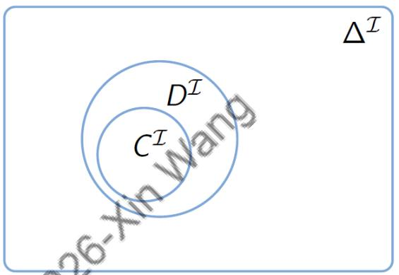

<details>
<summary>text_image</summary>

Δ^I
D^I
C^I
26-Xin wang
</details>

## Truth in an interpretation

${ \mathcal { T } } \Vdash C \subseteq D \ { \mathsf { i f } } \ C ^ { \mathcal { Z } } \subseteq D ^ { \mathcal { Z } }$

$\bullet ~ \mathcal { T } ~ | | - ~ a : C ~ \mathsf { i f } ~ a ^ { \mathcal { T } } \in C ^ { \mathcal { T } }$

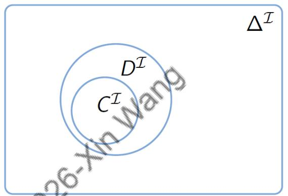

<details>
<summary>text_image</summary>

D^I
C^I
Δ^I
26-Xin Wang
</details>

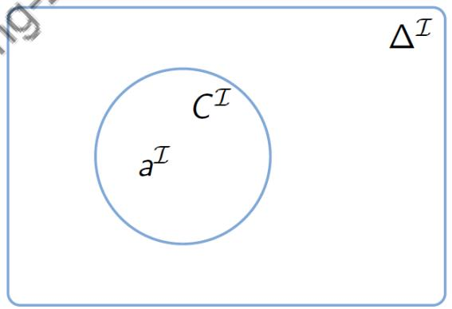

<details>
<summary>text_image</summary>

C^I
a^I
Δ^I
</details>

## Truth in an interpretation

${ \mathcal { T } } \Vdash C \subseteq D \ { \mathsf { i f } } \ C ^ { \mathcal { Z } } \subseteq D ^ { \mathcal { Z } }$  
${ \mathcal { T } } \Vdash a : C { \mathrm { ~ i f ~ } } a ^ { \mathcal { T } } \in C ^ { \mathcal { T } }$  
$\mathcal { T } \left| \right| - \left( a , b \right) : r \mathsf { i f } \left( a ^ { \mathcal { T } } , b ^ { \mathcal { T } } \right) \in r ^ { \mathcal { T } }$

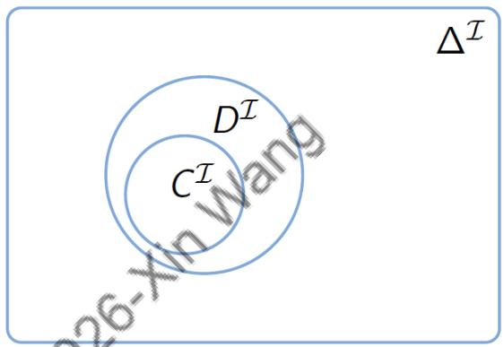

<details>
<summary>text_image</summary>

D^I
C^I
Δ^I
26-Xin wang
</details>

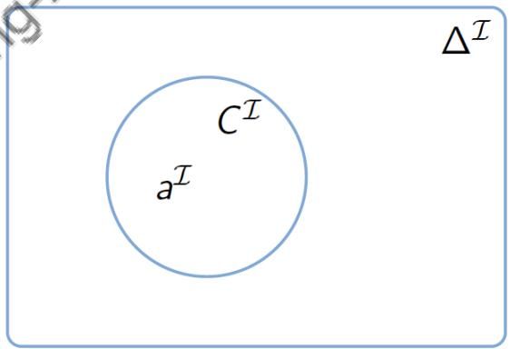

<details>
<summary>text_image</summary>

C^I
a^I
Δ^I
</details>

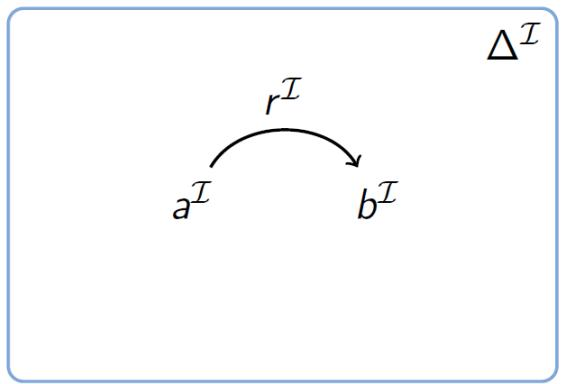

<details>
<summary>flowchart</summary>

```mermaid
graph TD
  A["a^I"] -->|r^I| B["b^I"]
  B -->|Δ^I| C["End"]
```
</details>


<details>
<summary>flowchart</summary>

```mermaid
graph TD
  A["Dog^I"] -->|x| B["Canine^I"]
  A -->|x| C["jane^I"]
  D["Dog^I"] -->|nemo^I| E["Male^I"]
  D -->|nemo^I| F["milou^I"]
  D -->|owns^I| G["tintin^I"]
  D -->|owns^I| H["loika^I"]
  D -->|owns^I| I["dog"]
  J["dog^I"] -->|naive arrow| K["dog"]
  L["dog^I"] -->|owns^I| M["dog"]
  N["dog^I"] -->|owns^I| O["dog"]
  P["dog^I"] -->|owns^I| Q["dog"]
  R["dog^I"] -->|owns^I| S["dog"]
  T["dog^I"] -->|owns^I| U["dog"]
  V["dog^I"] -->|owns^I| W["dog"]
  X["dog^I"] -->|owns^I| Y["dog"]
  Z["dog^I"] -->|owns^I| AA["dog"]
```
</details>

• Iド laika : Canine ？  
• Z├ T 』 CanineЗowns.Canine ？  
• I 』 Зowns.(Male ∩ Canine) ≌ Male ?

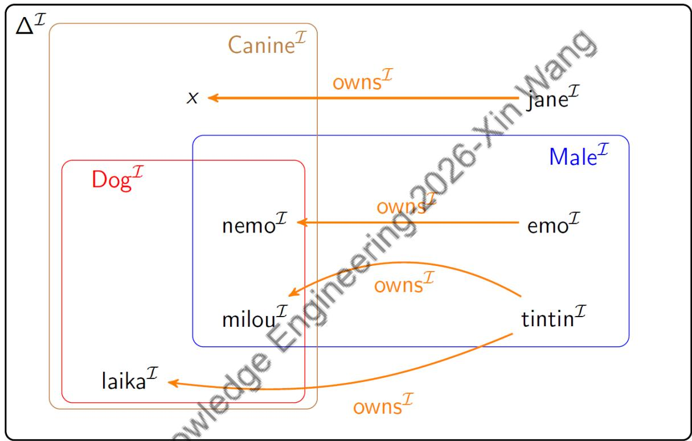

<details>
<summary>flowchart</summary>

```mermaid
graph TD
  A["Δ^I"] --> B["Canine^I"]
  B --> C["x"]
  B --> D["owns^I"]
  B --> E["jane^I"]
  F["Dog^I"] --> G["nemo^I"]
  F --> H["milou^I"]
  F --> I["tintin^I"]
  J["Male^I"] --> K["emo^I"]
  J --> L["owns^I"]
  M["laika^I"] --> N["loans^I"]
  M --> O["loans^I"]
  P["dog^-"] --> Q["nemo^-"]
  R["dog^-"] --> S["milou^-"]
  T["dog^-"] --> U["tintin^-"]
  V["dog^-"] --> W["loans^-"]
  X["dog^-"] --> Y["loans^-"]
```
</details>

• Z f laika : Canine ?  
• I├ T ≌ Canine  Зowns.Canine ？  
• Z ├ Зowns.(Male ∩ Canine) ≌ Male ?

## Role Inclusion Axioms

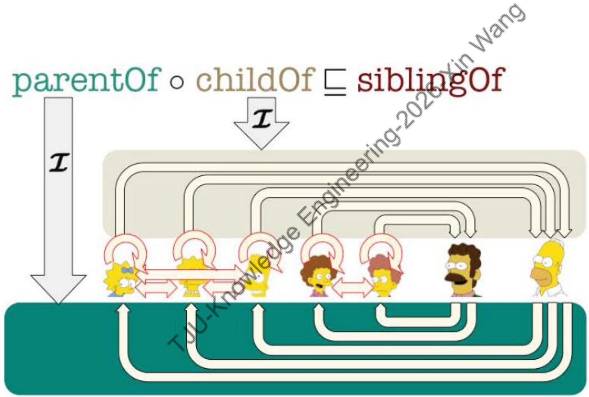

<details>
<summary>flowchart</summary>

```mermaid
graph TD
  A["parentOf"] --> B["×"]
  C["childOf"] --> D["×"]
  E["siblingOf"] --> F["×"]
  G["Tu-Knowledge Engineering-2026 in Wang"] --> H["×"]
  I["I"] --> J["×"]
  K["I"] --> L["×"]
  M["I"] --> N["×"]
  O["I"] --> P["×"]
  Q["I"] --> R["×"]
  S["I"] --> T["×"]
  U["I"] --> V["×"]
  W["I"] --> X["×"]
  Y["I"] --> Z["×"]
```
</details>

## Role Inclusion Axioms

childOf o parentOf

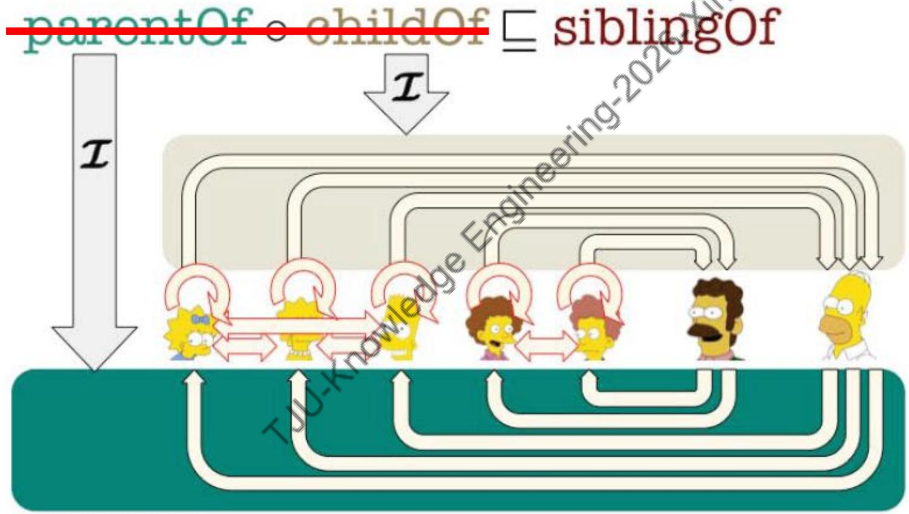

<details>
<summary>flowchart</summary>

```mermaid
graph TD
  A["parentOf"] --> B["i"]
  C["childOf"] --> B
  D["siblingOf"] --> B
  B --> E["TJU-Knowledge Engineering-2026"]
    style A fill:#f9f,stroke:#333
    style C fill:#f9f,stroke:#333
    style D fill:#f9f,stroke:#333
    style E fill:#ccf,stroke:#333
```
</details>

• A knowledge base is a tuple ${ \mathcal { K } } : = \langle { \mathcal { T } } , { \mathcal { A } } \rangle$ ， for some TBox T and ABox A  
Captures both structural knowledge about the domain and explicit knowledge about individuals

## Definition (Satisfaction extended)

• IIT if ${ \mathcal { T } } \Vdash C \subseteq D$ for each ${ \mathcal { C } } \subseteq D \in { \mathcal { T } }$  
· ${ \mathcal { T } } \Vdash { \mathcal { A } } \ i \ f \ { \mathcal { T } } \ | - \ a$ : C for each a : $C \in { \mathcal { A } }$ and ${ \mathcal { T } } \Vdash ( a , b )$ : r for each $( a , b ) : r \in { \mathcal { A } }$

· If ${ \mathcal { T } } \Vdash { \mathcal { T } } \cup A$ , we say I is a model of ${ \mathcal { K } } : = \langle { \mathcal { T } } , { \mathcal { A } } \rangle$  
• K is consistent if it has a model

## (Un)Satisfiability of Knowledge Bases

AKB is satisfiable(also:consistent) if there exists an interpretation that satisfies all itsaxiors(a model of the KB).Otherwise it is unsatisfiable(alo:inconsistent or contradictory).  
Is the following KB satisfable?

ReindeerhasNose.Red(rud1ph) worksFor.(-ReindeerLFliessanta) worksFor(rudolph,santa) antabatman

ReindeerMammal MammalnFliesBat BatVworksFor.{batman}


<details>
<summary>natural_image</summary>

Illustration of Santa Claus face with red hat and white beard, holding a green leaf (no text or symbols)
</details>

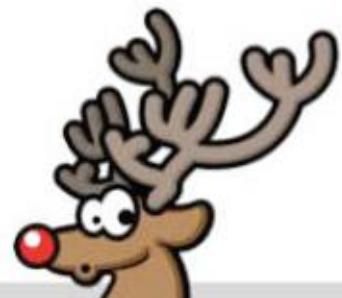

<details>
<summary>natural_image</summary>

Cartoon illustration of a reindeer with antlers and a red nose (no text or symbols)
</details>


<details>
<summary>natural_image</summary>

Cartoon character head with black hat and blue eyes (no text or symbols)
</details>

## Reasoning

Is the following KB satisfable?

Reindeer $\neg$ hasNose.Red(rudolph) Reindeer $\sqsubseteq$ Mammal
∀worksFor $\neg$ (¬Reindeer $\sqcup$ Flies)(santa) Mammal $\sqcap$ Flies $\sqsubseteq$ Bat
worksFor(rudolph,santa) Bat $\sqsubseteq$ ∀worksFor.{batman}
santa ≈ batman

## OWL

## Web Ontology LanguageWeb本体语言


<details>
<summary>flowchart</summary>

```mermaid
graph TD
  A["User Interface & Applications"] --> B["Trust"]
  B --> C["Proof"]
  C --> D["Unifying Logic"]
  D --> E["Query: SPARQL"]
  D --> F["Ontology: OWL"]
  D --> G["RDFS"]
  D --> H["Rule: RIF"]
  D --> I["Data interchange: RDF"]
  I --> J["XML"]
  I --> K["URI/IRI"]
    style A fill:#f9f,stroke:#333
    style B fill:#ccf,stroke:#333
    style C fill:#cfc,stroke:#333
    style D fill:#fcc,stroke:#333
    style E fill:#ffc,stroke:#333
    style F fill:#cfc,stroke:#333
    style G fill:#cfc,stroke:#333
    style H fill:#cfc,stroke:#333
    style I fill:#cfc,stroke:#333
    style J fill:#cfc,stroke:#333
    style K fill:#cfc,stroke:#333
  style_L["Crypto"] --> M["Meta Node"]
  M --> N["Query: SPARQL"]
  M --> O["Ontology: OWL"]
  M --> P["Rule: RIF"]
  M --> Q["Data interchange: RDF"]
```
</details>

## HowDo DLs and OWL Relate

OWL is essentially

SROIQ in disguise  
plus extended datatype support  
plus extralogical features such as annotations,versioning etc.

OWL speak is different fromDL terminology:

<table><tr><td>OWL</td><td>DL</td><td>FOL</td></tr><tr><td>class name</td><td>concept name</td><td>unary predicate</td></tr><tr><td>class</td><td>concept</td><td>formula with one free variable</td></tr><tr><td>object property name</td><td>role name</td><td>binary predicate</td></tr><tr><td>object property</td><td>role</td><td>formula with two free variables</td></tr><tr><td>ontology</td><td>knowledge base</td><td>theory</td></tr><tr><td>axiom</td><td>axiom</td><td>sentence</td></tr><tr><td>vocabulary</td><td>vocabulary / signature</td><td>signature</td></tr></table>

## TranslatingDL into OWL

preambleand a declaration part：

$$
[ \mathcal {K B} ] = \operatorname{Pre} + \operatorname{Dec} (\mathcal {K B}) \sum_ {\alpha \in \mathcal {K B}} [ \alpha ]
$$

$$
\text { Pre } = \left\{ \begin{array}{l l} @ \text { prefix   owl: } & <   \text { http://www.w3.org/2002/07/owl#> }. \\ @ \text { prefix   rdfs: } & <   \text { http://www.w3.org/2000/01/rdf - schema#> }. \\ @ \text { prefix   rdf: } & <   \text { http://www.w3.org/1999/02/22 - rdf - syntax - ns#> }. \\ @ \text { prefix   xsd: } & <   \text { http://www.w3.org/2001/XMLSchema#> }. \end{array} \right.
$$

$$
\begin{array}{l} \operatorname{Dec} (\mathcal {K B}) = \sum_ {A \in \mathrm{N} _ {C} (\mathcal {K B})} A \text {   rdf:type   owl:Class }. \\ + \sum_ {r \in \mathsf {N} _ {R} (\mathcal {K B})} r \text {rdf:type owl:ObjectProperty}. \\ \end{array}
$$

## Translating DL axioms into OWL

Following the Semantic Web rationale,OWL axioms are RDFS vocabulary is reused.

$\llbracket r_1 \circ \ldots \circ r_n \sqsubseteq r \rrbracket = \llbracket r \rrbracket_{\mathbb{R}}$ owl:propertyChainAxiom ( $\llbracket r_1 \rrbracket_{\mathbb{R}} \cdots \llbracket r_n \rrbracket_{\mathbb{R}}$ ). $\llbracket \text{Dis}(r, r') \rrbracket = \llbracket r \rrbracket_{\mathbb{R}}$ owl:propertyDisjointWith $\llbracket r'\rrbracket_{\mathbb{R}}$ . $\llbracket C \sqsubseteq D \rrbracket = \llbracket C \rrbracket_{\mathbb{C}}$ rdfs:subClassOf $\llbracket D \rrbracket_{\mathbb{C}}$ . $\llbracket C(a) \rrbracket = a$ rdf:type $\llbracket C \rrbracket_{\mathbb{C}}$ . $\llbracket r(a, b) \rrbracket = a$ $rb$ . $\llbracket r^{-}(a, b) \rrbracket = b$ $ra$ . $\llbracket \neg r(a, b) \rrbracket = []$ rdf:type owl:NegativePropertyAssertion; owl:assertionProperty $\llbracket r \rrbracket_{\mathbb{R}}$ ; owl:sourceIndividual $a$ ; owl:targetValue $b$ . $[a \approx b] = a$ owl:sameAs $b$ . $[a \not\approx b] = a$ owl:differentFrom $b$ .

```ini
[u]R = owl:topObjectProperty
[r]R = r
[r - ]R = [ owl:inverseOf :r ]
[A]C = A
[T]C = owl:Thing
[⊥]C = owl:Nothing
[{a1,...,an}]C = [ rdf:type owl:Class ; owl:oneOf ( :a1 ... :an ) ]
[¬C]C = [ rdf:type owl:Class ; owl:complementOf [C]C ]
[C1 ∩... ∩Cn]C = [ rdf:type owl:Class ; owl:intersectionOf ([C1]C ... [Cn]C)]
[C1 ∪... ∪Cn]C = [ rdf:type owl:Class ; owl:unionOf ([C1]C ... [Cn]C)]
[∃r.C]C = [ rdf:type owl:Restriction ;
owl:onProperty [r]R ; owl:someValuesFrom [C]C ]
[∀r.C]C = [ rdf:type owl:Restriction ;
owl:onProperty [r]R ; owl:allValuesFrom [C]C ]
[∃r.Self]C = [ rdf:type owl:Restriction ;
owl:onProperty [r]R ; owl:hasSelf "true"^^xsd:boolean ]
[≥nr.C]C = [ rdf:type owl:Restriction ;
owl:minQualifiedCardinality n^^xsd:nonNegativeInteger ;
owl:onProperty [r]R ; owl:onClass [C]C ]
[≤nr.C]C = [ rdf:type owl:Restriction ;
owl:maxQualifiedCardinality n^^xsd:nonNegativeInteger ;
owl:onProperty [r]R ; owl:onClass [C]C ]
```

## An OWL Ontology in RDF/Turtle serialisation

```txt
RBox R
owns ⊆ caresFor
"If somebody owns something, they care for it."

TBox T
Healthy ⊆ ¬Dead
"Healthy beings are not dead."
Cat ⊆ Dead ⊥ Alive
"Every cat is dead or alive."
HappyCatOwner ⊆ ≃owns.Cat □ ∀caresFor.Healthy
"A happy cat owner owns a cat and all beings he cares for are healthy."

ABox A
HappyCatOwner (schrödinger)
"Schrödinger is a happy cat owner."
```

```rdf
@prefix : <http://www.example.org/#> .
@prefix owl: <http://www.w3.org/2002/07/owl#> .
@prefix rdfs: <http://www.w3.org/2000/01/rdf-schema#> .
@prefix rdf: <http://www.w3.org/1999/02/22-rdf-syntax-ns#> .
@prefix xsd: <http://www.w3.org/2001/XMLSchema#> .
:owns rdf:type owl:ObjectProperty .
:caresFor rdf:type owl:ObjectProperty .
:Cat rdf:type owl:Class .
:Dead rdf:type owl:Class .
:Alive rdf:type owl:Class .
:Healthy rdf:type owl:Class .
:HappyCatOwner rdf:type owl:Class .
:owne rdfs:subPropertyOf :caresFor .
:Healthy rdfs:subClassOf [ owl:complementOf :Dead ] .
:Cat rdfs:subClassOf [ owl:unionOf (:Dead :Alive) ] .
:HappyCatOwner rdfs:subClassOf
[ owl:intersectionOf
( [ rdf:type owl:Restriction ;
owl:onProperty :owns ; owl:someValuesFrom :Cat ]
[ rdf:type owl:Restriction ;
owl:onProperty :caresFor ; owl:allValuesFrom :Healthy] )
] .
:schrödinger rdf:type :HappyCatOwner .
```

<table><tr><td>RBox  $\mathcal{R}$ owns  $\sqsubseteq$  caresFor“If somebody owns something, they care for it.”</td></tr><tr><td>TBox  $\mathcal{T}$ Healthy  $\sqsubseteq$   $\neg$ Dead“Healthy beings are not dead.”Cat  $\sqsubseteq$  Dead  $\sqcup$  Alive“Every cat is dead or alive.”HappyCatOwner  $\sqsubseteq$   $\exists$ owns.Cat  $\sqcap$   $\forall$ caresFor.Healthy“A happy cat owner owns a cat and all beings he cares for are healthy.”</td></tr><tr><td>ABox  $\mathcal{A}$ HappyCatOwner (schrödinger)“Schrödinger is a happy cat owner.”</td></tr></table>

```rdf
@prefix : <http://www.example.org/#> .
@prefix owl: <http://www.w3.org/2002/07/owl#> .
@prefix rdfs: <http://www.w3.org/2000/01/rdf-schema#> .
@prefix rdf: <http://www.w3.org/1999/02/22-rdf-syntax-ns#> .
@prefix xsd: <http://www.w3.org/2001/XMLSchema#> .
:owns rdf:type owl:ObjectProperty .
:caresFor rdf:type owl:ObjectProperty .
:Cat rdf:type owl:Class .
:Dead rdf:type owl:Class .
:Alive rdf:type owl:Class .
:Healthy rdf:type owl:Class .
:HappyCatOwner rdf:type owl:Class .
:owns rdfs:subPropertyOf :caresFor .
:Healthy rdfs:subClassOf [ owl:complementOf :Dead ] .
:Cat rdfs:subClassOf [ owl:unionOf (:Dead :Alive) ] .
:HappyCatOwner rdfs:subClassOf
[ owl:intersectionOf
( [ rdf:type owl:Restriction ;
owl:onProperty :owns ; owl:someValuesFrom :Cat ]
[ rdf:type owl:Restriction ;
owl:onProperty :caresFor ; owl:allValuesFrom :Healthy] )
] .
:schrödinger rdf:type :HappyCatOwner .
```

## Behind the Scenes...

```txt
:HappyCatOwner rdfs:subClassOf
[ owl:intersectionOf
    ( [ rdf:type owl:Restriction ;
    owl:onProperty :owns ; owl:someValuesFrom :Cat ]
    [ rdf:type owl:Restriction ;
    owl:onProperty :caresFor ; owl:allValuesFrom :Healthy] )
] .
```

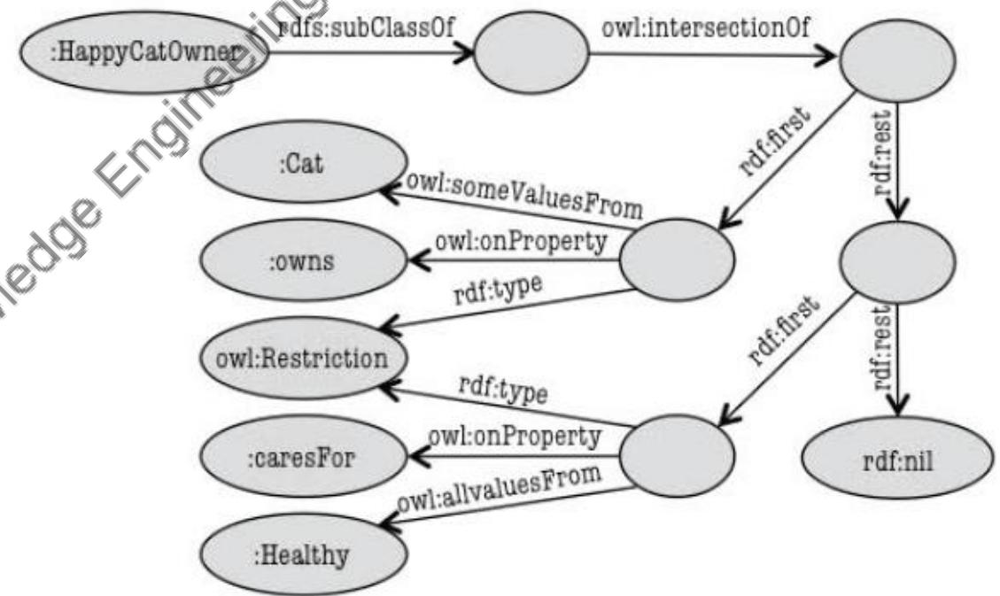

<details>
<summary>flowchart</summary>

```mermaid
graph TD
  A[":HappyCatOwner"] -->|rdfs:subClassOf| B[":"]
  B -->|owl:intersectionOf| C[":"]
  C -->|rdf:first| D[":"]
  D -->|rdf:first| E[":"]
  E -->|rdf:rest| F[":"]
  F -->|rdf:rest| G[":"]
  G -->|rdf:first| H[":caresFor"]
  G -->|rdf:type| I[":CaT"]
  I -->|owl:someValuesFrom| J[":owns"]
  J -->|owl:onProperty| K[":"]
  K -->|rdf:type| L["owl:Restriction"]
  L -->|rdf:type| M[":caresFor"]
  M -->|owl:onProperty| N[":CaT"]
  N -->|owl:allvaluesFrom| O[":Healthy"]
```
</details>

<table><tr><td>Axiom type</td><td>Turtle notation</td><td>DL paraphrase</td></tr><tr><td>Class Equivalence</td><td> $[C]_{C}$  owl:equivalentClass  $[D]_{C}$ .</td><td> $C \sqsubseteq D, D \sqsubseteq C$ </td></tr><tr><td>Class Disjointness</td><td> $[C]_{C}$  owl:disjointWith  $[D]_{C}$ .</td><td> $C \cap D \sqsubseteq \bot$ </td></tr><tr><td>Disjoint Classes</td><td>[] rdf:type owl:AllDisjointClasses ;owl:members ( $[C_1]_{C}$  ...  $[C_n]_{C}$ ) .</td><td> $C_i \cap C_j \sqsubseteq \bot$ for all  $1 \leq i < j \leq n$ </td></tr><tr><td>Disjoint Union</td><td> $[C]_{C}$  owl:disjointUnionOf( $[C_1]_{C}$  ...  $[C_n]_{C}$ ) .</td><td> $\bigsqcup_{i < j} C_i \sqsubseteq C$  $C_i \cap C_j \sqsubseteq \bot$ for all  $1 \leq i < j \leq n$ </td></tr><tr><td>Property Equivalence</td><td> $[r]_{R}$  owl:equivalentProperty  $[s]_{R}$ .</td><td> $r \sqsubseteq s, s \sqsubseteq r$ </td></tr><tr><td>Disjoint Properties</td><td>[] rdf:type owl:AllDisjointProperties ;owl:members ( $[r_1]_{R}$  ...  $[r_n]_{R}$ ) .</td><td> $\text{Dis}(r_i, r_j)$ for all  $1 \leq i < j \leq n$ </td></tr><tr><td>Inverse Properties</td><td> $[r]_{R}$  owl:inverseOf  $[s]_{R}$ .</td><td> $\text{Inv}(r) \sqsubseteq s$ </td></tr><tr><td>Property Domain</td><td> $[r]_{R}$  rdfs:domain  $[C]_{C}$ .</td><td> $\exists r. \top \sqsubseteq C$ </td></tr><tr><td>Property Range</td><td> $[r]_{R}$  rdfs:range  $[C]_{C}$ .</td><td> $\top \sqsubseteq \forall r.C$ </td></tr><tr><td>Functional Property</td><td> $\llbracket r \rrbracket_{\text{R}}$  rdf:type owl:FunctionalProperty .</td><td> $\top \sqsubseteq \leqslant 1r. \top$ </td></tr><tr><td>Inverse Functional Property</td><td> $\llbracket r \rrbracket_{\text{R}}$  rdf:typeowl:InverseFunctionalProperty .</td><td> $\top \sqsubseteq \leqslant 1Inv(r). \top$ </td></tr><tr><td>Reflexive Property</td><td> $\llbracket r \rrbracket_{\text{R}}$  rdf:type owl:ReflexiveProperty .</td><td> $\top \sqsubseteq \exists r.Self$ </td></tr><tr><td>Irreflexive Property</td><td> $\llbracket r \rrbracket_{\text{R}}$  rdf:type owl:IrreflexiveProperty .</td><td> $\exists r.Self \sqsubseteq \bot$ </td></tr><tr><td>Symmetric Property</td><td> $\llbracket r \rrbracket_{\text{R}}$  rdf:type owl:SymmetricProperty .</td><td> $Inv(r) \sqsubseteq r$ </td></tr><tr><td>Asymmetric Property</td><td> $\llbracket r \rrbracket_{\text{R}}$  rdf:type owl:AsymmetricProperty .</td><td> $Dis(Inv(r), r)$ </td></tr><tr><td>Transitive Property</td><td> $\llbracket r \rrbracket_{\text{R}}$  rdf:type owl:TransitiveProperty .</td><td> $r \circ r \sqsubseteq r$ </td></tr><tr><td>Different Individuals</td><td>[] rdf:type owl:AllDifferent ;owl:members (  $a_1 \ldots a_n$  ).</td><td> $a_i \not\approx a_j$ for all  $1 \leq i < j \leq n$ </td></tr></table>

## ◼ 本体推理举例：Schrodinger 是否为 HappyCatOwner?

ex:Healthy rdfs:subClassOf [owl:complementOf ex:Dead].

ex:Cat rdfs:subClassOf [owl:unionOf(ex:Dead,ex:Alive)].

ex:owns rdfs:subPropertyOf ex:caresFor.

ex:HappyCatOwner rdfs:subClassOf [owl:intersectionOf（

[rdf:type owl:Restriction;owl:onProperty ex:owns;Vowl:someValuesFrom ex:Cat],

rdf:type owl:Restriction;owl:onProperty ex:caregFor;owl:allValuesFrom ex:Healthy])].

ex:schrodingerrdf:type ex:HappyCatOwner.

## Knowledge Base

## 本体（知识库）

## Tableau

## 推理算法

```txt
ex:Healthy rdfs:subClassOf [owl:complementOf ex:Dead].
ex:Cat rdfs:subClassOf [owl:unionOf (ex:Dead, ex:Alive)].
ex:owns rdfs:subPropertyOf ex:caresFor.
ex:HappyCatOwner rdfs:subClassOf [owl:intersectionOf(
    [rdf:type owl:Restriction; owl:onProperty ex:owns; owl:someValuesFrom ex:Cat],
    [rdf:type owl:Restriction; owl:onProperty ex:caresFor; owlanValuesFrom ex:Healthy])].
ex:schrödinger rdf:type ex:HappyCatOwner.
```

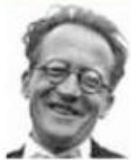

ex:HappyCatOwner

## Tableau

```txt
ex:Healthy rdfs:subClassOf [owl:complementOf ex:Dead].
ex:Cat rdfs:subClassOf [owl:unionOf (ex:Dead, ex:Alive)].
ex:owns rdfs:subPropertyOf ex:caresFor.
ex:HappyCatOwner rdfs:subClassOf [owl:intersectionOf(
    [rdf:type owl:Restriction; owl:onProperty ex:owns; owl:someValuesFrom ex:Cat],
    [rdf:type owl:Restriction; owl:onProperty ex:caresFor; owl:allValuesFrom ex:Healthy])].
ex:schrödinger rdf:type ex:HappyCatOwner.
```

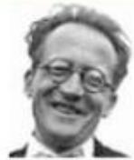

ex:HappyCatOwner

[owl:intersectionof


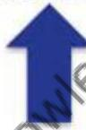

## Tableau

ex:Healthy rdfs:subClassOf [owl:complementOf ex:Dead].

ex:Cat rdfs:subClassOf [owl:unionOf(ex:Dead,ex:Alive)].

ex:owns rdfs:subPropertyOf ex:caresFor.

ex:HappyCatOwner rdfs:subClassOf [owl:intersectionOf(

[rdf:type owl:Restriction;owl:onProperty ex:owns;owl:someValuesFrom ex:Cat],

rdf:type owl:Restriction;owl:onProperty ex:caresFor;owtaMValuesFrom ex:Healthy])].

ex:schrodinger rdf:type ex:HappyCatOwner.

## Knowledge Base

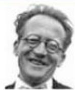

ex:HappyCatOwner

[owl:intersection]


## Tableau

ex:Healthy rdfs:subClassOf [owl:complementOf ex:Dead].

ex:Cat rdfs:subClassOf [owl:unionOf(ex:Dead,ex:Alive)].

ex:ownsrdfs:subPropertyOf ex:caresFor.

ex:HappyCatOwner rdfs:subClassOf [owl:intersectionOf(

[rdf:type owl:Restriction;owl:onProperty ex:owns;owlsgmeValuesFrom ex:Cat]

[rdf:type owl:Restriction;owl:onProperty ex:caresFor;owlallValuesFrom ex:Healthy])].

ex:schrodingerrdf:type ex:HappyCatOwner.

## Knowledge Base


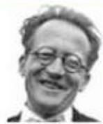

ex:owns  
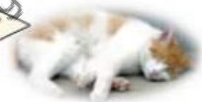

<details>
<summary>natural_image</summary>

Close-up of a cat lying down with visible whiskers (no text or symbols)
</details>

ex:HappyCatowner

[owl:intersectiongf


ex:Cat


## Tableau

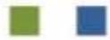

ex:Healthy rdfs:subClassOf [owl:complementOf ex:Dead].

ex:Cat rdfs:subClassOf [owl:unionOf(ex:Dead,ex:Alive)].

ex:owns rdfs:subPropertyOf ex:caresFor

ex:HappyCatOwner rdfs:subClassOf [owl:intersectionOf(

[rdf:type owl:Restriction;owl:onProperty ex:owns;owl:soneValuesFrom ex:Cat],

rdf:type owl:Restriction;owl:onProperty ex:caresFor;owlallValuesFrom ex:Healthy])].

ex:schrodingerrdf:type ex:HappyCatOwner.

## Knowledge Base

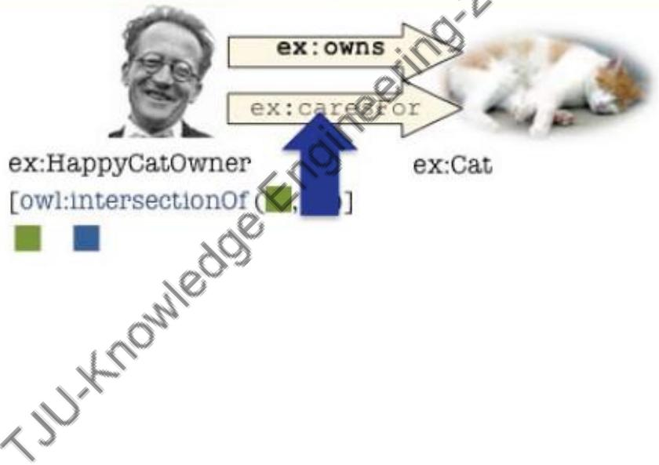

<details>
<summary>flowchart</summary>

```mermaid
graph TD
  A["ex: owners"] --> B["ex:carestror"]
  B --> C["ex: Cat"]
  D["ex: HappyCatOwner\n[owl:IntersectionOf (●)"]] --> E["TJU-Knowledge Engineering"]
```
</details>

## Tableau

ex:Healthy rdfs:subClassOf [owl:complementOf ex:Dead].

ex:Cat rdfs:subClassOf [owl:unionOf(ex:Dead,ex:Alive)].

ex:owns rdfs:subPropertyOf ex:caresFor.

ex:HappyCatOwner rdfs:subClassOf [owl:intersectionOf(

[rdf:type owl:Restriction;owl:onProperty ex:owns;owl:someValuesFrom ex:Cat]

rdf:type owl:Restriction;owl:onProperty ex:caresFor;owhallValuesFrom ex:Healthy])]

ex:schrodingerrdf:type ex:HappyCatOwner.

## Knowledge Base


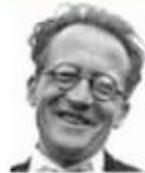

ex:owns

ex:caresFor

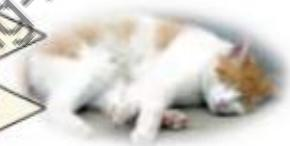

<details>
<summary>natural_image</summary>

Close-up of a white cat lying down with visible whiskers and legs (no text or symbols)
</details>

ex:HappyCatOwner

[owl:intersectionor

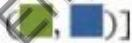

ex:Cat ex:Healthy


## Tableau

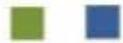

ex:Healthy rdfs:subClassOf [owl:complementOf ex:Dead]

ex:Cat rdfs:subClassOf [owl:unionOf(ex:Dead,ex:Alive)]

ex:ownsrdfs:subPropertyOf ex:caresFor.

ex:HappyCatOwner rdfs:subClassOf [owl:intersectionOf(

[rdf:type owl:Restriction;owl:onProperty ex:owns; owl;sQmeValuesFrom ex:Cat],

[rdf:type owl:Restriction;owl:onProperty ex:caresFor;qwlallValuesFrom ex:Healthyl)].

ex:schrodingerrdf:type ex:HappyCatOwner.

## Knowledge Base

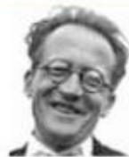

ex:owns

ex:carFor

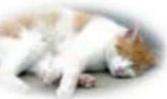

ex:HappyCatOwner

[owl:intersectionof

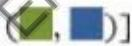

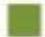


ex:Cat ex:Healthy

[owl:unionof

(ex:Dead,ex:Alive)]


## Tableau

```txt
ex:Healthy rdfs:subClassOf [owl:complementOf ex:Dead].
ex:Cat rdfs:subClassOf [owl:unionOf (ex:Dead, ex:Alive)].
ex:owns rdfs:subPropertyOf ex:caresFor.
ex:HappyCatOwner rdfs:subClassOf [owl:intersectionOf(
    [rdf:type owl:Restriction; owl:onProperty ex:owns; owl:someValuesFrom ex:Cat],
    [rdf:type owl:Restriction; owl:onProperty ex:caresFor; owl:allValuesFrom ex:Healthy])].
ex:schrödinger rdf:type ex:HappyCatOwner.
```

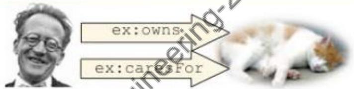

<details>
<summary>text_image</summary>

ex:owns
ex:caresfor
</details>

ex:HappyCatOwner

[owl:intersectionof


ex:Cat ex:Healthy

[owl:unionof

(ex:Dead,ex:Alive)]

## Tableau

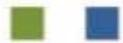

ex:Healthy rdfs:subClassOf [owl:complementofex:Dead].

ex:Cat rdfs:subClassOf [owl:unionOf(ex:Dead,ex:Alive)].

ex:owns rdfs:subPropertyOf ex:caresFor.

ex:HappyCatOwner rdfs:subClassOf owl:intersectionOf(

[rdf:type owl:Restriction;owl:onProperty ex:owns;owl;sQmeValuesFrom ex:Cat],

[rdf:type owl:Restriction;owl:onProperty ex:caresFor;owlallValuesFrom ex:Healthy])].

ex:schrodingerrdf:type ex:HappyCatOwner.

## Knowledge Base

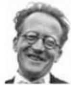

ex:owns

ex:carsFor

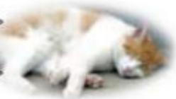

ex:HappyCatOwner

[owl:intersectionof

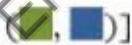

ex:Cat ex:Healthy

[owl:unionof

(ex:Dead,ex:Alive)]

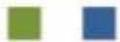


ex:owns

ex:caresFor

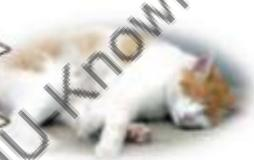


ex:HappyCatOwner

[owl:intersectionof(）]


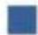

ex:Cat ex:Healthy ex:Dead

(ex:Dead,ex:Alive)]

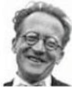

ex:owns

ex:caresFor

ex:HappyCatOwner

[owl:intersectionof（

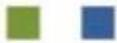

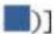

ex:Cat ex:Healthy ex:Alive

[owl:unionof

(ex:Dead,ex:Alive)]

## Tableau

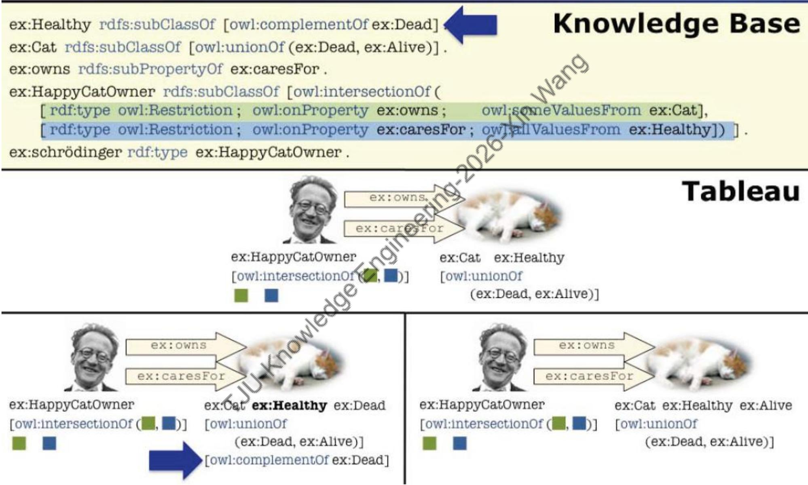

<details>
<summary>flowchart</summary>

```mermaid
graph TD
    A["ex:Healthy rdfs:subClassOf [owl:complementOf ex:Dead"] .]
    B["ex:Cat rdfs:subClassOf [owl:unionOf (ex:Dead, ex:Alive)"] .]
    C["ex:owns rdfs:subPropertyOf ex:caresFor ."]
    D["ex:HappyCatOwner rdfs:subClassOf [owl:intersectionOf ( [rdf:type owl:Restriction; owl:onProperty ex:owns; owl:someValuesFrom ex:Cat"], [rdf:type owl:Restriction; owl:onProperty ex:caresFor; owl:allValuesFrom ex:Healthy] ) ] .]
    E["ex:schrödinger rdf:type ex:HappyCatOwner ."]
    F["Tableau"]
    G["ex:HappyCatOwner [owl:intersectionOf (■, ■)"] ]
    H["ex:caresFor"]
    I["ex:Cat ex:Healthy [owl:unionOf (ex:Dead, ex:Alive)"] ]
    J["ex:HappyCatOwner [owl:intersectionOf (■, ■)"] ]
    K["ex:catesFor"]
    L["ex:Cat ex:Healthy ex:Dead [owl:unionOf (ex:Dead, ex:Alive)"] ]
    M["ex:HappyCatOwner [owl:intersectionOf (■, ■)"] ]
    N["ex:caresFor"]
    O["ex:Cat ex:Healthy ex:Alive [owl:unionOf (ex:Dead, ex:Alive)"] ]
```
</details>

ex:Healthy rdfs:subClassOf [owl:complementOf ex:Dead].

ex:Cat rdfs:subClassOf [owl:unionOf(ex:Dead,ex:Alive)].

ex:ownsrdfs:subPropertyOf ex:caresFor.

ex:HappyCatOwner rdfs:subClassOf [owl:intersectionOf(

[rdf:type owl:Restriction;owl:onProperty ex:owns;owl:someValuesFrom ex:Cat],

rdf:type owl:Restriction;owl:onProperty ex:caresFor;owTallValuesFrom ex:Healthyl)].

ex:schrodinger rdf:type ex:HappyCatowner.

## Knowledge Base

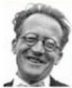

ex:owns

ex:carror

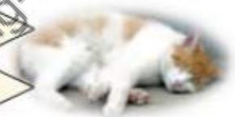

<details>
<summary>natural_image</summary>

Close-up of a cat's legs and feet in soft lighting (no text or symbols visible)
</details>

ex:HappyCatOwner

[owl:intersectionof

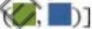

ex:Cat ex:Healthy

[owl:unionof

(ex:Dead,ex:Alive)]

## Tableau


<details>
<summary>text_image</summary>

ex:owns
ex:HappyGen
[owl:1 (e, 2)] [owl:un (e, 1)]
(ex:Dead, of dead)]
[owl:complementOf ex:Dead]
TJU-Knowle
</details>

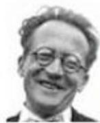

ex:owns

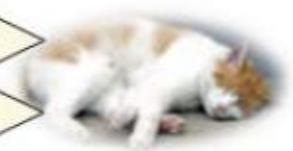

<details>
<summary>natural_image</summary>

Close-up of white cat eggs with visible skin texture and a small brown object beside it (no text or symbols)
</details>

ex:HappyCatOwner

[owl:intersectionof(]

ex:Cat ex:Healthy ex:Alive

[owl:unionof

(ex:Dead,ex:Alive)]

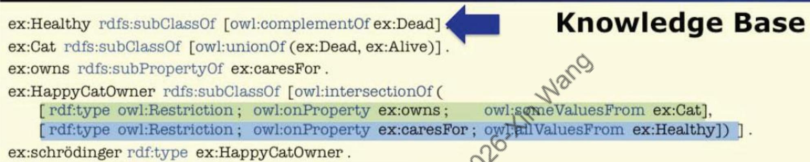

<details>
<summary>text_image</summary>

ex:Healthy rdfs:subClassOf [owl:complementOf ex:Dead].
ex:Cat rdfs:subClassOf [owl:unionOf (ex:Dead, ex:Alive)] .
ex:owns rdfs:subPropertyOf ex:caresFor .
ex:HappyCatOwner rdfs:subClassOf [owl:intersectionOf(
    [rdf:type owl:Restriction; owl:onProperty ex:owns; owl:someValuesFrom ex:Cat],
    [rdf:type owl:Restriction; owl:onProperty ex:caresFor; owl:allValuesFrom ex:Healthy]) ] .
ex:schrödinger rdf:type ex:HappyCatOwner .
</details>

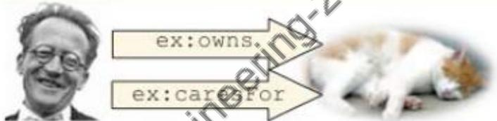

<details>
<summary>text_image</summary>

ex:owns
ex:caresor
</details>

Tableau

ex:HappyCatOwner

[owl:intersectionof

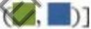

ex:Cat ex:Healthy

(ex:Dead,ex:Alive)]


<details>
<summary>text_image</summary>

ex:owns
ex:HappyGen
[owl:HappyGen (e, 1)] [owl:ull-1]
(ex:Dead, of dead)]
[owl:complementOf ex:Dead]
</details>

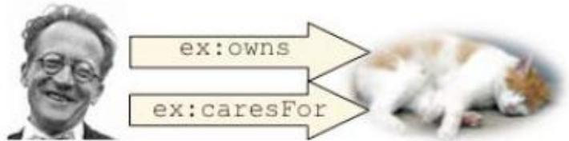

<details>
<summary>text_image</summary>

ex:owns
ex:caresFor
</details>

ex:HappyCatOwner

[owl:intersectionof(]

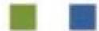


ex:Cat ex:Healthy ex:Alive

[owl:unionof

(ex:Dead,ex:Alive)]

[owl:complementof ex:Dead]

ex:Healthy rdfs:subClassOf [owl:complementOf ex:Dead].

ex:Cat rdfs:subClassOf [owl:unionOf(ex:Dead,ex:Alive)].

ex:owns rdfs:subPropertyOf ex:caresFor.

ex:HappyCatOwner rdfs:subClassOf [owl:intersectionOf(

[rdf:type owl:Restriction;owl:onProperty ex:owns;owl;sQmeValuesFrom ex:Cat],

rdf:type owl:Restriction;owl:onProperty ex:caresFor;owTallValuesFrom ex:Healthy]) ].

ex:schrodingerrdf:type ex:HappyCatOwner.

## Knowledge Base

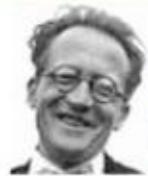  
ex:owns  
ex:carOFor

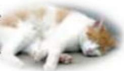

ex:HappyCatOwner

[owl:intersectionof

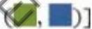

ex:Cat ex:Healthy

(ex:Dead,ex:Alive)]

## Tableau


<details>
<summary>text_image</summary>

ex:owns
ex:HappyGen
[owl: (e, 1)] [owl:ull-
(ex:Dead, of dead)]
[owl:complementOf ex:Dead]
TJU-Knowle™
</details>

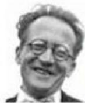  
ex:owns

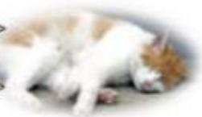

ex:HappyCatOwner

[owl:intersectionof

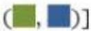

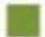

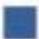

ex:Cat ex:Healthy ex:Alive

[owl:unionof

(ex:Dead,ex:Alive)]

[owl:complementOf ex:Dead]

ex:Healthy ndfssubClassOf [owl:complementOf ex:Dead].

ex:Cat rdfeswl:unionOf(ex:Dead,ex:Alive)].

ex:ownsrdfs:subrropertOex.resFor.

ex:HappyCatownerrdfs:subciasorseionof（

rdf:type owl:Restriction;owl:onrroepxvns;owl:someValuesFrom ex:Cat]

[rdf:type owl:Restriction;owl:onProperty exaresFor;owtallValuesFrom ex:Healthy])].

ex:schrodinger rdf:type ex:HappyCatOwner.

## Knowledge Base

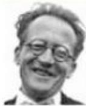

ex:owns

ex:carYor

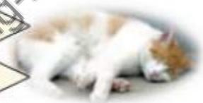

<details>
<summary>natural_image</summary>

Close-up of a white cat lying down with visible whiskers (no text or symbols)
</details>

ex:HappyCatOwner

[owl:intersectionof

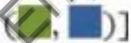

ex:Cat ex:Healthy

[owl:unionof

(ex:Dead,ex:Alive)]

## Tableau


<details>
<summary>text_image</summary>

ex:owns
ex:HappyGen
[owl:h
(ex:Dead, 1999)
(owl:1999)
ex:Dead
(ex:Dead, 2999)
[owl:1999]
(ex:Dead, 2999)
ex:Dead
(ex:Dead, 2999)
</details>

[owl:complementOfex:Dead]

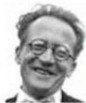

ex:owns

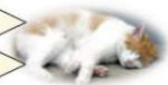

<details>
<summary>natural_image</summary>

Close-up of a white cat lying down with visible whiskers and legs (no text or symbols)
</details>

ex:HappyCatOwner

[owl:intersectionof(]

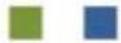

ex:Cat ex:Healthy ex:Alive

[owl:unionof

(ex:Dead,exv

[owl:complemen Dead]

## 目录

C O N T E N T S

0 知识工程概述  
02 语义Web  
03 本体与推理  
0 4 知识图谱


<details>
<summary>text_image</summary>

北洋紀念亭
</details>

## 知识工程的发展到知识图谱新阶段


<details>
<summary>flowchart</summary>

```mermaid
graph TD
  A["Animal"] -->|is an| B["Mammal"]
  A -->|is an| C["Fish"]
  B -->|is a| D["Water"]
  B -->|has| E["Cat"]
  B -->|has| F["Fur"]
  B -->|has| G["Bear"]
  B -->|is a| H["Whale"]
  C -->|lives in| C
  D -->|lives in| D
  E -->|has| F
  F -->|has| G
  G -->|has| H
```
</details>

1960s

## 本体论

## Ontology

哲学概念“本体”被 引入到人工智能领域 用来刻画知识


<details>
<summary>text_image</summary>

Man standing in front of a computer screen displaying a document and text interface with 'Y' and 'P' symbols.
</details>

1989

## The Semantic Web

从超文本链接到语义链接


<details>
<summary>natural_image</summary>

Man gesturing with hand in front of stage (no visible text or symbols)
</details>

2006

## 知识图谱

## Knowledge Graph

谷歌发布了其基于知识图谱的搜索引擎产品

## 语义网络

Semantic Networks语义网络作为知识表示的一种方法被提出，主要用于自然语言理解领域

1980s  
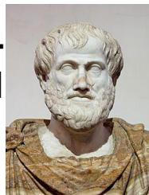

<details>
<summary>natural_image</summary>

Marble bust of an ancient philosopher with beard and classical headwear (no inscriptions or symbols visible)
</details>

## Web

Tim Berners-Lee 发明了万维网 Linked Information System

1998  
  
Semantic Web

## 链接数据

Linked DataTim突出强调语义网的本质是要建立开放数据之间的链接

2012  
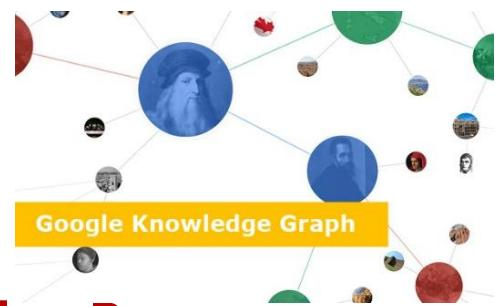

<details>
<summary>text_image</summary>

Google Knowledge Graph
</details>

知识表示与知识库- Knowledge Representation / Knowledge Base

人工智能研究者陆续提出了大量知识表示的方法，如框架系统、产生式规则、描述逻辑等

知识工程得益于KR、NLP、Web、AI多个方面的发展，走向知识图谱新阶段

## Google Knowledge Graph, 2012

  
达芬奇有什么作品


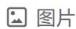

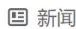


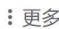

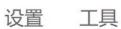

列奥纳多·达·芬奇>艺术作品  
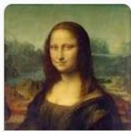  
蒙娜丽莎

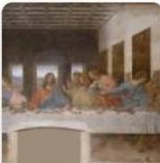  
最后的晚餐1498年

  
救世主1500年

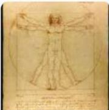  
维特鲁威人

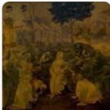  
三博士来朝

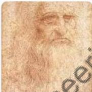  
自画像1512年

  
抱银貂的女子1490年

  
施洗者圣约翰

  
圣母领报

## 李奥納多·達文西作品列表-维基百科，自由的百科全书

https://zh.wikipedia.org/zh/李奥納多·達文西作品列表·转为简体网页

列奥納多·達·芬奇作品列表列出了文藝復興時著名藝術家列奥納多·達·芬奇的已知主要作品，其中-費隆妮葉夫人》；\*《救世主》；\*\*《圣母像》 （两个版本）；《圣母子与圣安妮》；《蒙娜丽莎》；+《安吉亞里戰役》；\*《女子頭像》；+《麗達與天鵝》；《施洗者圣约翰》.

主要現存作品·有爭議的作品·軼作·其他

## 列奥纳多·达·芬奇-维基百科，自由的百科全书-Wikipedia

https://zh.wikipedia.org/zh-hans/列奥纳多·达·芬奇√

列奥纳多·达·芬奇（意大利语：LeonardodaVinci；儒略历1452年4月15日-1519年5月2日），又译达文...在他的作品中，《蒙娜丽莎》是最负盛名且最常被模仿的肖像。.达文西关于人体比例的作品

《维特鲁威人》。.法国，巴黎，罗浮宫

1498年，现藏于义大利米兰恩宠圣母堂.生平·科学与工程·个人·代表性作品

## 达芬奇传世作品高清全集品

art.ifeng.c0m/2015/0625/1600287.shtml <

传统搜索  
网页中关键字检索

2015年6月25日-达芬奇以其画作写实性及具影响力闻名，前者如《蒙娜丽莎》、《最后的晚餐》以写实著称，后者像《维特鲁威人》对后世影响深远。..如果说《最后的晚餐》是世界最著名的宗教画，那么，达;芬奇在51岁时自米兰重返佛罗伦萨 .芬奇所惯用的描绘公式.过分重视女性眼睛的块面结构(这

## 列奥纳多·达·芬奇

博学者

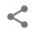

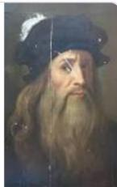

列奥纳多·达·芬奇，又译达文西，全名列奥纳多·迪·瑟皮耶罗·达·芬奇，是意大利文艺复兴时期的一个博学者：在绘画、音乐、建筑、数学、几何学、解剖学、生理学、动物学、植物学、天文学、气象学、地质学、地理学、物理学、光学、力学、发明、土木工程等领域都有显著的成就。维基百科

生于：1452年4月15日，意大利山村安奇亚诺

逝世于：1519年5月2日，法国昂布瓦斯克劳斯·吕斯城堡

画风：文艺复兴盛期，Early renaissance，文艺复兴，意大利文艺复兴，佛罗伦萨画派

## 关于达芬奇的知识点描述：

• 人物类型  
• 生卒年月日  
• 全名  
• 画风

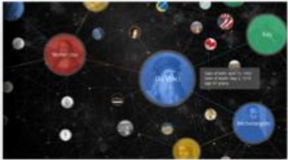

<details>
<summary>text_image</summary>

Sun of Mars, right for 10 years
distance of Mars orbit (by 2 years)
day 57 hours
Sun of Mars, right for 10 years
distance of Mars orbit (by 2 years)
day 57 hours
</details>

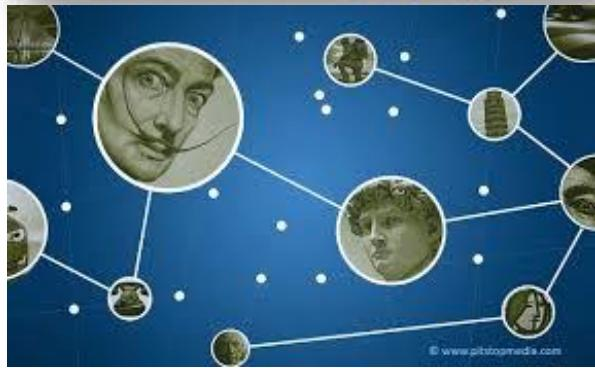

<details>
<summary>natural_image</summary>

Abstract network diagram with circular portraits and connecting lines on a blue background (no text or symbols)
</details>

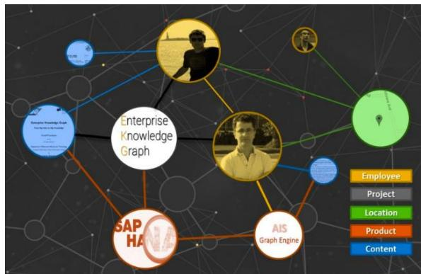

<details>
<summary>flowchart</summary>

```mermaid
graph TD
  A["Enterprise Knowledge Graph"] --> B["Employee"]
  A --> C["Project"]
  A --> D["Location"]
  A --> E["Product"]
  A --> F["Content"]
  G["SAP HAI"] --> B
  G --> C
  G --> D
  G --> E
  G --> F
  H["AIS Graph Engine"] --> B
  H --> C
  H --> D
  H --> E
  H --> F
```
</details>

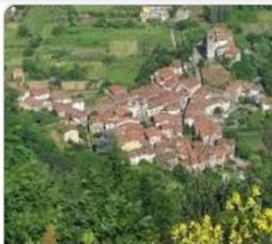

<details>
<summary>natural_image</summary>

Aerial view of a village surrounded by green hills and trees, with no visible text or symbols.
</details>

Casa Natale di Leonardo da Vinci

## Anchiano

Anchiano is a village in the comune of Vinci,Tuscany, central Italy.Thevillage is known for theancient Villadel Ferrale,with itschapel,Santi AntonioeFracco. Wikipedia

Weather: 94°F (34C),Wind W at 10 mph (16 km/h),33% Humidity

Hotels: 3-star averaging S93.View hotels

Local time:Sunday 6:26PM

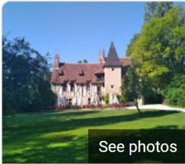

<details>
<summary>natural_image</summary>

Exterior view of a historic castle with red-tiled roof and white walls, surrounded by green lawn and trees under a clear blue sky (no signage or text visible)
</details>

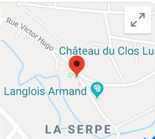

<details>
<summary>text_image</summary>

Rue Victor Hugo
Château du Clos Lu
Langlois Armand
LA SERPE
</details>

## Chäteau du Clos Lucé

Website

Directions

4.4★★★★★ 7,806 G00gle reviews

## Leonardo da Vinci

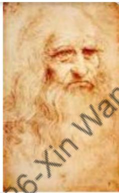

<details>
<summary>text_image</summary>

6-Xin War
</details>

Leonardo di ser Piero da Vinci, more commonly Leonardo da Vinci,was an Italian polymath of theRenaissance whose areas of interest included invention, drawing, painting,sculpture,architecturescience,music, mathematics,engineering,literature,anatomy，geology, astronomy,botany,paleontologyand cartography. Wikipedia e work

## Born Died

Born: April15452,Anchianoaly

Died: May2,1519,Chateau du Clos Luce,Amboise, France

Artworks:Mona Lisa, The Last Supper, Salvator Mundi, MORE

On view: Ambrosian Library，Louvre Museum,MORE

Periods: High Renaissance, Early renaissance, Renaissance, Italian Renaissance, Florentine painting

Siblings: Giovanni Ser Piero, Guglielmo Ser Piero,MORE

## On view

## Mona Lisa

Painting by Leonardoda Vinci


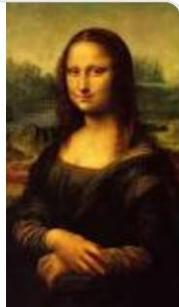

<details>
<summary>natural_image</summary>

Portrait painting of a woman with a subtle smile, set against a landscape background (no text or symbols)
</details>

The Mona Lisa isa half-length portrait painting by the Italian Renaissance artist Leonardo da Vinci that has been described as "the best known,the most visited,the most written about,the most sung about,the most parodied work of art in the world."Wikipedia

Artist: Leonardo da Vinci

Dimensions:2'6"×1'9"

Location: Louvre Museum (since 1797)

Created: 1503

## Location

P

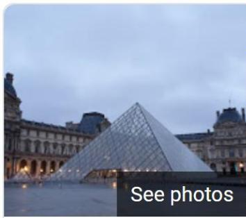

<details>
<summary>natural_image</summary>

Exterior view of the Louvre Museum with a glass pyramid and illuminated facade (no signage)
</details>

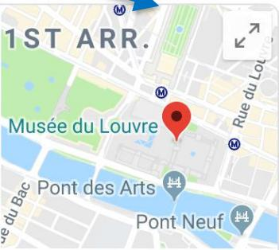

<details>
<summary>text_image</summary>

1ST ARR.
Musée du Louvre
Pont des Arts
Pont Neuf
</details>

## Louvre Museum

Website

Directions

Save


154,952 Google reviews

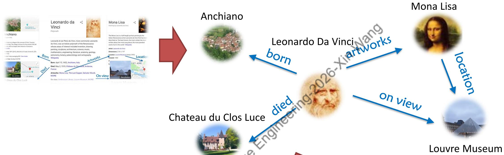

<details>
<summary>flowchart</summary>

```mermaid
graph TD
  A["Anchiano"] -->|born| B["Leonardo Da Vinci"]
  A -->|died| C["Chateau du Clos Luce"]
  B -->|on view| D["Louvre Museum"]
  C -->|and| D
  E["Mona Lisa"] -->|location| D
  F["Leonardo da Vinci"] -->|been| G["2026-Xi Artworks"]
  F -->|been| H["On view"]
  I["Leonardo da Vinci"] -->|been| J["2026-Xi Artworks"]
  I -->|been| K["On view"]
    style A fill:#f9f,stroke:#333
    style B fill:#ccf,stroke:#333
    style C fill:#cfc,stroke:#333
    style D fill:#fcc,stroke:#333
    style E fill:#cff,stroke:#333
    style F fill:#ffc,stroke:#333
    style G fill:#fcf,stroke:#333
    style H fill:#cff,stroke:#333
    style I fill:#ffc,stroke:#333
    style J fill:#cfc,stroke:#333
    style K fill:#fcc,stroke:#333
```
</details>

## 知识图谱是三元组的集合

<Leonardo Da Vinci> <born> <Anchiano>  
<Leonardo Da Vinci> <died> <Chateau du Clos Luce>  
<Leonardo Da Vinci> <artworks> <Mona Lisa>  
<Mona Lisa> <location> <Louvre Museum>  
<Leonardo Da Vinci> <on view> <Louvre Museum>

## 三元组（triple）是知识的最小单元

多条三元组形成关联数据 （Linked Data）  
Linked Data是关于实例的知识图谱  
“知识图谱” vs “数据图谱”

## RDF（Resource Description Framework）资源描述框架（N-Triples格式）

<http://dbpedia.org/resource/Leonardo\_da\_Vinci> <http://dbpedia.org/ontology/born>  
<http://dbpedia.org/resource/Leonardo\_da\_Vinci> <http://dbpedia.org/ontology/died>  
<http://dbpedia.org/resource/Leonardo\_da\_Vinci> <http://dbpedia.org/ontology/artworks>  
<http://dbpedia.org/resource/Mona\_Lisa> <http://dbpedia.org/ontology/location>  
<http://dbpedia.org/resource/Leonardo\_da\_Vinci> <http://dbpedia.org/ontology/onview>

<http://dbpedia.org/resource/Anchiano> .  
<http://dbpedia.org/resource/Clos\_Luce> .  
<http://dbpedia.org/resource/Mona\_Lisa> .  
<http://dbpedia.org/resource/Louvre> .  
<http://dbpedia.org/resource/Louvre> .

## RDF（ Turtle格式）

@prefix dbo: <http://dbpedia.org/ontology/>  
@prefix dbr: <http://dbpedia.org/resource/>

dbr:Leonardo\_da\_Vinci dbo:born dbr:Anchiano ;

dbo:died dbr:Clos\_Luce ;

dbo:artworks dbr:Mona\_Lisa .

dbr:Mona\_Lisa dbo:location dbr:Louvre .

dbr:Leonardo\_da\_Vinci dbo:onview dbr:Louvre .

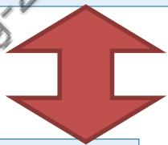

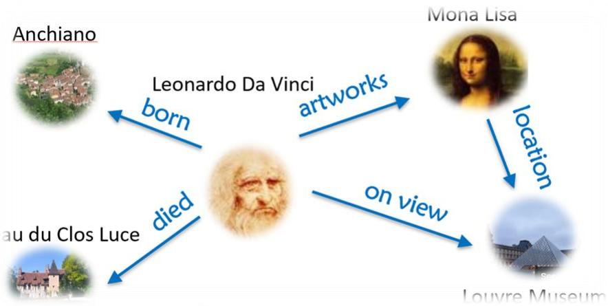

<details>
<summary>flowchart</summary>

```mermaid
graph TD
  A["Anchiano"] -->|born| B["Leonardo Da Vinci"]
  C["Lauf du Clos Luce"] -->|died| B
  D["Mona Lisa"] -->|on view| E["Louvre Museum"]
  B -->|artworks| E
  E -->|location| F["locations"]
```
</details>

##

##

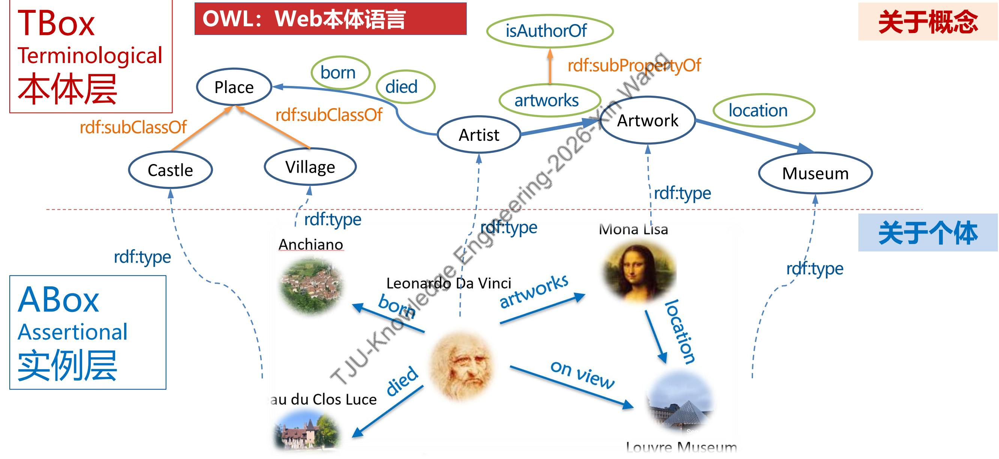

<details>
<summary>flowchart</summary>

```mermaid
graph TD
    subgraph TBox Terminological 本体层
  A["Place"] -->|rdf:subClassOf| B["Castle"]
  A -->|rdf:subClassOf| C["Village"]
  D["born"] --> E["died"]
  F["died"] --> G["Artist"]
  H["artworks"] --> I["Artwork"]
  J["isAuthorOf"] --> K["location"]
  L["artworks"] --> M["Museum"]
  N["artworks"] --> O["Mona Lisa"]
  P["arructs"] --> Q["Louvre Museum"]
    end

    subgraph ABox Assertional 实例层
  R["Abox"] --> S["TJU-Knowledge Engineering-2026-Wang"]
  T["Abox"] --> U["Abox"]
  V["Abox"] --> W["Abox"]
  X["Abox"] --> Y["Abox"]
  Z["Abox"] --> AA["Abox"]
  AB["Abox"] --> AC["Abox"]
  AD["Abox"] --> AE["Abox"]
  AF["Abox"] --> AG["Abox"]
  AH["Abox"] --> AI["Abox"]
  AJ["Abox"] --> AK["Abox"]
  AL["Abox"] --> AM["Abox"]
  AN["Abox"] --> AO["Abox"]
  AP["Abox"] --> AQ["Abox"]
  AR["Abox"] --> AS["Abox"]
  AT["Abox"] --> AU["Abox"]
  AV["Abox"] --> AW["Abox"]
    end

    subgraph OWL_Web["OWL: Web本体语言"]
        AX["owl: Web本体语言"]
        AY["owl: Web本体语言"]
        AZ["owl: Web本体语言"]
        BA["owl: Web本体语言"]
    end

    style TBox Terminological 本体层 fill:#f9f,stroke:#333
    style ABox Assertional 实例层 fill:#ccf,stroke:#333
    style OWL: Web本体语言 fill:#cfc,stroke:#333
```
</details>

##

## SPARQL 查询

SELECT ?artist ?work

WHERE {

?artist dbo:artworks ?work . ?work dbo:location dbr:Louvre . ?artist dbo:onview dbr:Louvre .

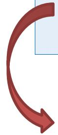

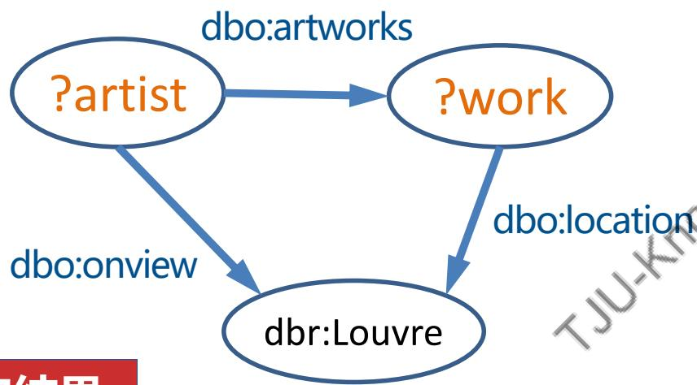

<details>
<summary>flowchart</summary>

```mermaid
graph TD
  A["?artist"] -->|dbo:artworks| B["?work"]
  A -->|dbo:onview| C["dbr:Louvre"]
  B -->|dbo:location| C
```
</details>

查询结果

<table><tr><td>?artist</td><td>?work</td></tr><tr><td>dbr:Leonardo_da_Vinci</td><td>dbr:Mona_Lisa</td></tr></table>

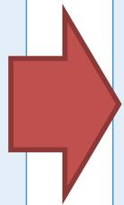

## RDF 知识图谱

dbr:Leonardo\_da\_Vinci dbo:born dbr:Anchiano ; dbo:died dbr:Clos\_Luce ; dbo:artworks dbr:Mona\_Lisa . dbr:Mona\_Lisa dbo:location dbr:Louvre . dbr:Leonardo\_da\_Vinci dbo:onview dbr:Louvre .

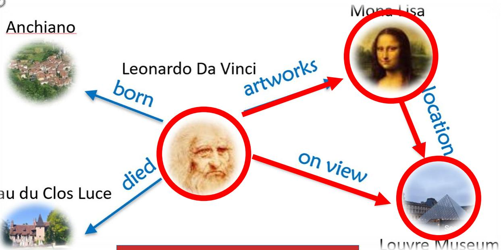

<details>
<summary>flowchart</summary>

```mermaid
graph TD
  A["Leonardo Da Vinci"] -->|born| B["Anchiano"]
  A -->|and| C["Louvre Museum"]
  A -->|and| D["Die"]
  A -->|on view| E["Mona Lisa"]
  A -->|arrworks| F["locations"]
  B -->|born| A
  C -->|location| A
  D -->|died| A
  E -->|location| A
```
</details>

查询是子图匹配过程

## 总结

01 知识工程概述  
02 语义Web  
03 本体与推理  
04 04 知识图谱

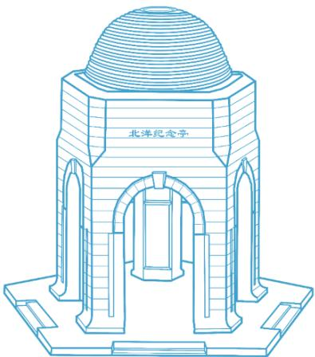

<details>
<summary>text_image</summary>

北海紀念亭
</details>