## 知识工程

# 知识数据管理

王 鑫

wangx@tju.edu.cn

天津大学 智能与计算学部 人工智能学院


<details>
<summary>text_image</summary>

智能与计算学部
COLLEGE OF INTELUS COUNCING AND TECHNOLOGY
人工智能学院
网络安全学院
国家示范性软件学院
计算机科学与技术学院
55教学楼
</details>


<details>
<summary>text_image</summary>

55
智能与计算学部
</details>

## 1. 知识数据管理

1.1 知识数据模型  
1.2 知识查询语言

## 1. 知识数据管理

1.1 知识数据模型  
1.2 知识查询语言

## RDF图模型

• RDF三元组： $( 0 , 0 ) = ( 1 1 4 4 5 6 ) \times ( 0 . 1 4 4 5 6 ) \times ( 0 . 1 4 4 4 5 6 ) \times ( 0 . 1 4 4 4 5 6 ) \times ( 0 . 1 4 4 4 5 6 2 6 ) \times ( 0 . 1 4 4 2 5 6 2 6 2 6 ) \times ( 0 . 1 4 2 5 6 2 6 2 6 2 6 2 6 ) \times ( 0 . 1 4 2 5 6 2 6 2 6 2 6 2 6 2 6 2 6 2 6 2 6 2 6 2 6 2 6 2 6 2 6 2 6 2 6 2 6 2 6 2 6 2 6 2 6 2 6 2 6 2 6 2 6 2 6 2 6 2 6 2 6 2 6 2 6 2 6 2 6 2 6 2 6 2 6 2 6 2 6 2 6 2 6 2 6 2 6 2 6 2 6 2 6 2 6 2 6 2 6 2 6 2 6 2 6 2 6 2 6 2 6 2 6 2 6 2 6 2 6 2 6 2 6 2 6$  
RDF图 ：RDF三元组的有限集合


<details>
<summary>flowchart</summary>


```mermaid
graph TD
  A["James Cameron"] -->|name| B["James_Cameron"]
  A -->|rdf:type| C["Titanic"]
  D["Director"] -->|length rdf:type| C
  E["195"] --> C
  F["Movie"] -->|birthDate| G["Leonardo DiCaprio"]
  H["1974-11-11"] -->|birthDate| I["Actor"]
  J["Titanic (1997 film)"] --> K["Kate Winslet"]
  L["birthDate"] --> M["Kate Winslet"]
  N["birthDate"] --> O["Kate Winslet"]
  P["birthDate"] --> Q["Kate Winslet"]
  R["birthDate"] --> S["Kate Winslet"]
  T["birthDate"] --> U["Kate Winslet"]
  V["birthDate"] --> W["Kate Winslet"]
  X["birthDate"] --> Y["Kate Winslet"]
  Z["birthDate"] --> AA["Kate Winslet"]
  AB["birthDate"] --> AC["Kate Winslet"]
  AD["birthDate"] --> AE["Kate Winslet"]
  AF["birthDate"] --> AG["Kate Winslet"]
  AH["birthDate"] --> AI["Kate Winslet"]
```
</details>

## RDF图模型

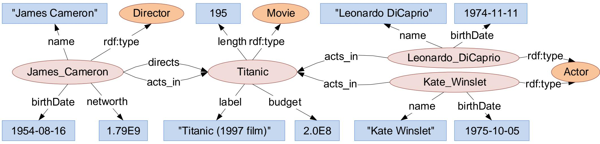

<details>
<summary>flowchart</summary>

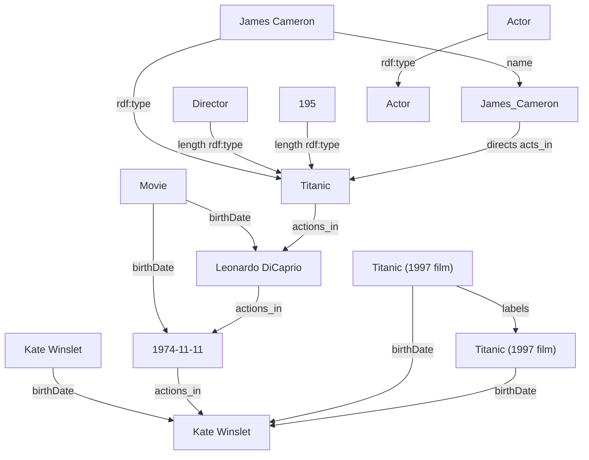
```mermaid
graph TD
  A["James Cameron"] -->|name| B["James_Cameron"]
  A -->|rdf:type| C["Titanic"]
  D["Director"] -->|length rdf:type| C
  E["195"] -->|length rdf:type| C
  F["Movie"] -->|birthDate| G["Leonardo DiCaprio"]
  F -->|birthDate| H["1974-11-11"]
  I["Titanic (1997 film)"] -->|labels| J["Titanic (1997 film)"]
  K["Kate Winslet"] -->|birthDate| L["Kate Winslet"]
  M["Actor"] -->|rdf:type| N["Actor"]
  B -->|directs acts_in| C
  C -->|actions_in| G
  G -->|actions_in| H
  H -->|actions_in| L
  I -->|birthDate| L
  J -->|birthDate| L
```
</details>

18

RDF 三元组

G = { (James\_Cameron, rdf:type, Director),

(James\_Cameron, birthDate, 1954-08-16),

(James\_Cameron, directs, Titanic),

(Titanic, rdf:type, Movie),

(Titanic, budget, 2.0E8),

(Leonardo\_DiCaprio, rdf:type, Actor),

(Leonardo\_DiCaprio, birthDate, 1974-11-11),

(Kate\_Winslet, rdf:type, Actor),

(Kate\_Winslet, birthDate, 1975-10-05),

(James\_Cameron, name, "James Cameron"),

(James\_Cameron, networth, 1.79E9),

(James\_Cameron, acts\_in, Titanic),

(Titanic, label, "Titanic (1997 film)"),

(Titanic, length, 195),

(Leonardo\_DiCaprio, name, "Leonardo DiCaprio"),

(Leonardo\_DiCaprio, acts\_in, Titanic),

(Kate\_Winslet, name, "Kate Winslet"),

(Kate\_Winslet, acts\_in, Titanic) }

## RDF图模型

 没有对于顶点和边上属性的内置支持  
 如何表示边上的属性？“具体化” （reification）  
 顶点与边交集非空：3-uniform hypergraph

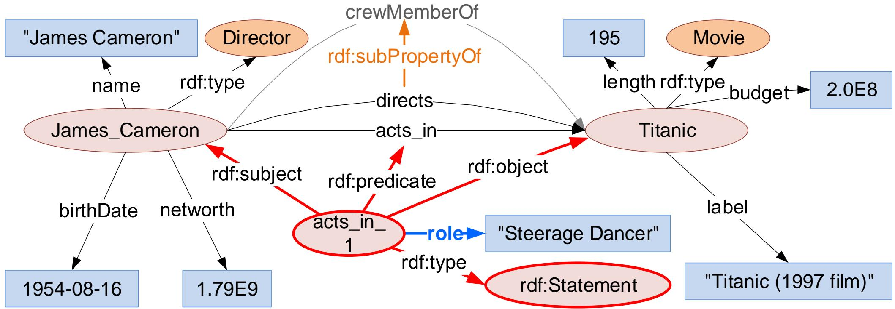

<details>
<summary>flowchart</summary>

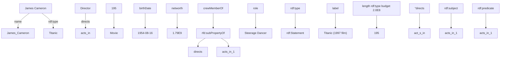
```mermaid
graph TD
  A["James Cameron"] -->|name| B["James_Cameron"]
  A -->|rdf:type| C["Titanic"]
  D["Director"] -->|directs| E["acts_in"]
  F["195"] --> G["Movie"]
  H["birthDate"] --> I["1954-08-16"]
  J["networth"] --> K["1.79E9"]
  L["crewMemberOf"] --> M["rfd:subPropertyOf"]
  M --> N[" directs "]
  M --> O[" acts_in_1"]
  P["role"] --> Q["Steerage Dancer"]
  R["rdf:type"] --> S["rdf:Statement"]
  T["label"] --> U["Titanic (1997 film)"]
  V["length rdf:type budget 2.0E8"] --> W["195"]
  X["&quot;directs"] --> Y["act_s_in"]
  Z["rdf:subject"] --> AA["acts_in_1"]
  AB["rdf:predicate"] --> AC["acts_in_1"]
```
</details>

## ◼ RDF\*：A Metadata Extension of RDF

 Metadata statements become a first class citizen  
 Allow a triple in the subject or object position of another triple  
 An embedded triple may itself be a metadata triple (recursion)

\_:acts\_in\_1 rdf:type rdf:Statement . \_:acts\_in\_1 rdf:subject James\_Cameron . \_:acts\_in\_1 rdf:predicate acts\_in . \_:acts\_in\_1 rdf:object Titanic . \_:acts\_in\_1 role "Steerage Dancer" .

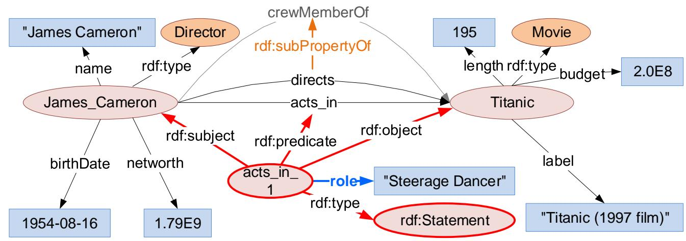

<details>
<summary>flowchart</summary>

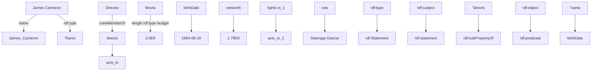
```mermaid
graph TD
  A["James Cameron"] -->|name| B["James_Cameron"]
  A -->|rdf:type| C["Titanic"]
  D["Director"] -->|crewMemberOf| E[" directs"]
  E --> F["acts_in"]
  G["Movie"] -->|length rdf:type budget| H["2.0E8"]
  I["birthDate"] --> J["1954-08-16"]
  K["networth"] --> L["1.79E9"]
  M["rights in_1"] --> N["acts_in_1"]
  O["role"] --> P["Steerage Dancer"]
  Q["rdf:type"] --> R["rdf:Statement"]
  S["rdf:subject"] --> T["rdf:statement"]
  U["&quot;directs"] --> V["rdf:subPropertyOf"]
  W["rdf:object"] --> X["rdf:predicate"]
  Y["&quot;name"] --> Z["birthDate"]
```
</details>

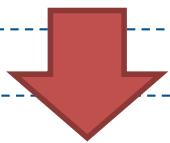

<< James\_Cameron acts\_in Titanic >> role "Steerage Dancer"

## Apache Jena

 An RDF Triplestore  
 a Java framework for building Semantic Web applications  
 store RDF triples in memory or on disk

Apache Jena Fuseki is a SPARQL se

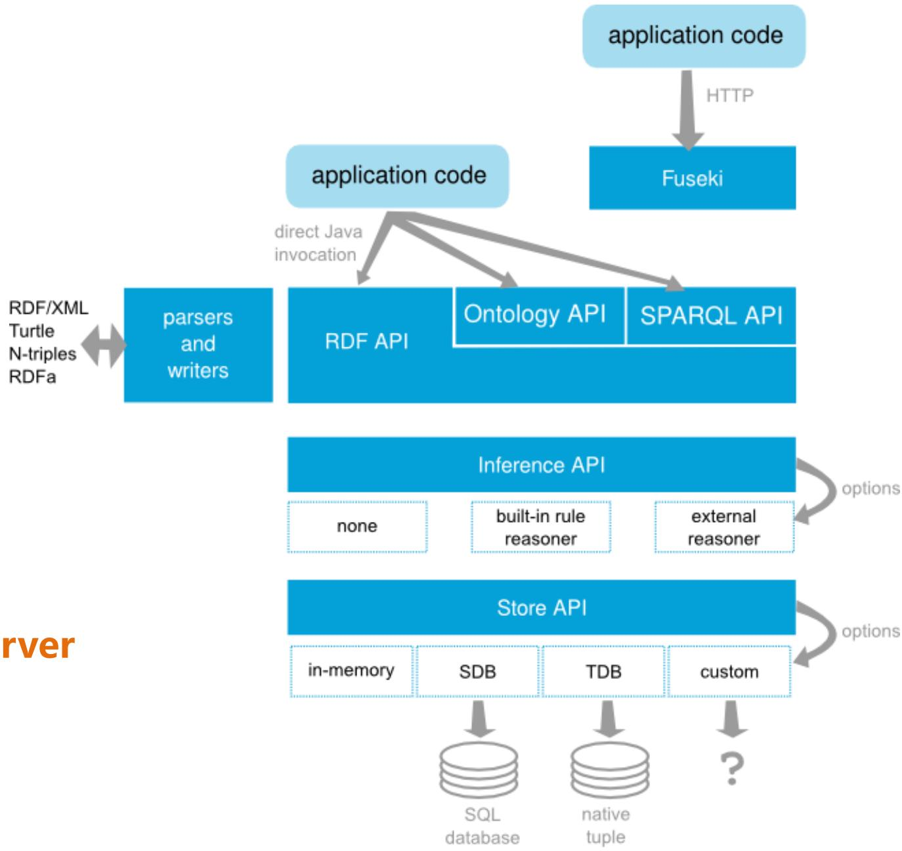

<details>
<summary>flowchart</summary>

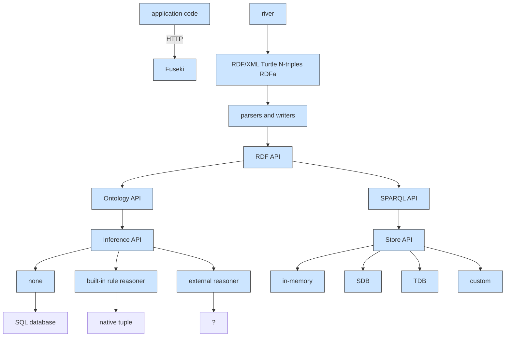
```mermaid
graph TD
  A["application code"] -->|HTTP| B["Fuseki"]
  C["river"] --> D["RDF/XML Turtle N-triples RDFa"]
  D --> E["parsers and writers"]
  E --> F["RDF API"]
  F --> G["Ontology API"]
  F --> H["SPARQL API"]
  G --> I["Inference API"]
  H --> J["Store API"]
  I --> K["none"]
  I --> L["built-in rule reasoner"]
  I --> M["external reasoner"]
  J --> N["in-memory"]
  J --> O["SDB"]
  J --> P["TDB"]
  J --> Q["custom"]
  K --> R["SQL database"]
  L --> S["native tuple"]
  M --> T["?"]
    style A fill:#cce5ff,stroke:#333
    style B fill:#cce5ff,stroke:#333
    style C fill:#cce5ff,stroke:#333
    style D fill:#cce5ff,stroke:#333
    style E fill:#cce5ff,stroke:#333
    style F fill:#cce5ff,stroke:#333
    style G fill:#cce5ff,stroke:#333
    style H fill:#cce5ff,stroke:#333
    style I fill:#cce5ff,stroke:#333
    style J fill:#cce5ff,stroke:#333
    style K fill:#cce5ff,stroke:#333
    style L fill:#cce5ff,stroke:#333
    style M fill:#cce5ff,stroke:#333
    style N fill:#cce5ff,stroke:#333
    style O fill:#cce5ff,stroke:#333
    style P fill:#cce5ff,stroke:#333
    style Q fill:#cce5ff,stroke:#333
```
</details>

## ◼ Jena Fuseki Installation 安装

 Download: https://jena.apache.org/download/  
 Later version: apache-jena-fuseki-xxx.zip  
 Required Java version: Java 11 or higher  
 Run cmd: cd C:\tools\apache-jena-fuseki-xxx  
 Run: mkdir store  
 Run: fuseki-server --loc=store --update /testds  
 Browser open: http://localhost:3030/

## ◼ Jena Fuseki: Web Interface


Apache Jena Fuseki

0 datasets

0 help

server status


## Apache Jena Fuseki

Version 4.6.1. Uptime 22h 1m 13s

<table><tr><td colspan="9">Filter datasets</td><td>Clear</td></tr><tr><td>name</td><td></td><td colspan="8">actions</td></tr><tr><td>/testds</td><td></td><td></td><td>? query</td><td>↑ add data</td><td>edit</td><td>info</td><td></td><td></td><td></td></tr></table>


## RDF Graph Example: In N-Triple Format

<http://dbpedia.org/resource/James\_Cameron> <http://www.w3.org/1999/02/22-rdf-syntax-ns#type> <http://dbpedia.org/ontology/Director>  
2 <http://dbpedia.org/resource/James\_Cameron> <http://dbpedia.org/ontology/name> "James Cameron"  
3 <http://dbpedia.org/resource/James\_Cameron  <http://dbpedia.org/ontology/birthDate> "1954-08-16"^^ http://www.w3.org/2001/xMLSchema#date>  
4 <http://dbpedia.org/resource/James\_Cameron> <http://dbpedia.org/ontology/networth> "1.79E9"^^<http://www.w3.org/2001/XMLSchema#decimal>  
http://dbpedia.org/resource/James\_Cameron  http://dbpedia.org/ontology/directs  http://dbpedia.org/resource/Titanic  
6 <http://dbpedia.org/resource/James\_Cameron> <http://dbpedia.org/ontology/acts\_in> http://dbpedia.org/resource/Titanic>  
http://dbpedia.org/resource/Titanic http://www.w3.org/1999/02/22-rdf-syntax-ns#type http://dbpedia.org/ontology/Movie  
<http://dbpedia.org/resource/Titanic> <http://www.w3.org/20o0/01/rdf-schema#label> "Titanic (1997 film)"  
9http://dbpedia.org/resource/Titanic http://dbpedia.org/ontology/budget "2.0E8"^^ http://www.w3.org/2001/xMLSchema#decimal>  
10 http://dbpedia.org/resource/Titanic http://dbpedia.org/ontology/length "195"^ http://www.w3.org/2001/xMLSchema#integer>  
11 <http://dbpedia.org/resource/Leonardo\_DiCaprio> <http://www.w3.org/1999/02/22-rdf-syntax-ns#type> <http://dbpedia.org/ontology/Actor>  
12 http://dbpedia.org/resource/Leonardo\_DiCaprio> http://dbpedia.org/ontology/name "Leonardo DiCaprio"  
13 <http://dbpedia.org/resource/Leonardo\_DiCaprio> <http://dbpedia.org/ontology/birthDate> "1974-11-11"^<http://www.w3.org/2001/xMLSchema#date>  
14 <http://dbpedia.org/resource/Leonardo\_DiCaprio> <http://dbpedia.org/ontology/acts\_in> <http://dbpedia.org/resource/Titanic>  
15 <http://dbpedia.org/resource/Kate Winslet> <http://www.w3.org/1999/02/22-rdf-syntax-ns#type> <http://dbpedia.org/ontology/Actor>  
16 <http://dbpedia.org/resource/Kate\_Winslet> <http://dbpedia.org/ontology/name> "Kate Winslet"  
<http://dbpedia.org/resource/Kate Winslet> <http://dbpedia.org/ontology/birthDate> "1975-10-05"^^<http://www.w3.org/2001/xMLSchema#date>  
18 <http://dbpedia.org/resource/Kate\_Winslet> <http://dbpedia.org/ontology/acts\_in> <http://dbpedia.org/resource/Titanic> .

## ◼ Jena Fuseki: Upload Data

/testds

® query

add data

≌ edit

@ info

## Upload files

Load data into the default graph of the currently selected dataset, or the given named graph. You may upload any RDF format, such as Turtle, RDF/XML or TRiG.

Dataset graph name

Files to upload

\+ select files

upload all

<table><tr><td>name</td><td>size</td><td>speed</td><td>status</td><td>actions</td></tr><tr><td>rdf_graph_example.nt</td><td>2.2kb</td><td>2.41kb/s</td><td>100.00Triples uploaded: 18</td><td>upload nowremove</td></tr></table>

## 属性图模型

属性图G是5元组： $( \rho _ { i } = ( 1 / \rho _ { i } ) \rho _ { i } ) \rho _ { i } ( \rho _ { i } )$

1. V：顶点的有限集合  
2. E：边的有限集合  
3. $( 0 ) 1 0 = 1 0 ( c m )$ ：将边关联到顶点对  
??: (?? ∪ ??) → ??????：为顶点或边赋予标签  
??: (?? ∪ ??) × ???????? → ??????：为顶点或边关联属性

##


<details>
<summary>flowchart</summary>

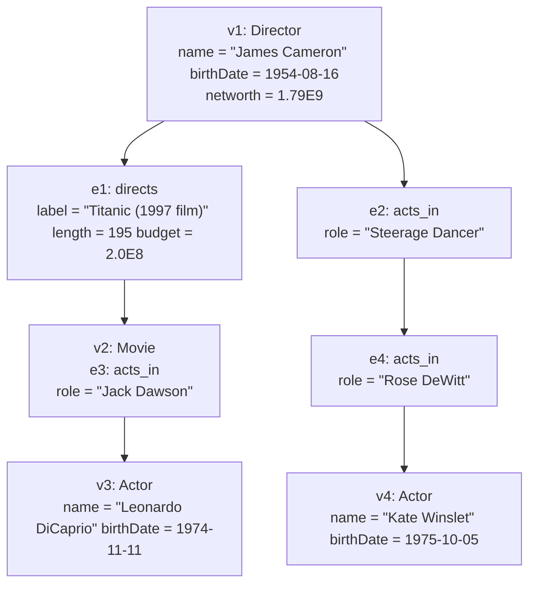
```mermaid
graph TD
  A["v1: Director\nname = &quot;James Cameron&quot; birthDate = 1954-08-16\nnetworth = 1.79E9"] --> B["e1: directs\nlabel = &quot;Titanic (1997 film)&quot; length = 195 budget = 2.0E8"]
  A --> C["e2: acts_in\nrole = &quot;Steerage Dancer&quot;"]
  B --> D["v2: Movie\ne3: acts_in\nrole = &quot;Jack Dawson&quot;"]
  C --> E["e4: acts_in\nrole = &quot;Rose DeWitt&quot;"]
  D --> F["v3: Actor\nname = &quot;Leonardo DiCaprio&quot; birthDate = 1974-11-11"]
  E --> G["v4: Actor\nname = &quot;Kate Winslet&quot; birthDate = 1975-10-05"]
```
</details>

$$
V = \left\{v _ {1}, v _ {2}, v _ {3}, v _ {4} \right\}, \quad E = \left\{e _ {1}, e _ {2}, e _ {3}, e _ {4} \right\},
$$

$$
\rho (e _ {1}) = (v _ {1}, v _ {2}), \rho (e _ {2}) = (v _ {1}, v _ {2}), \rho (e _ {3}) = (v _ {3}, v _ {2}), \rho (e _ {4}) = (v _ {4}, v _ {2}),
$$

$$
\lambda (v _ {1}) = \text {Director}, \quad \lambda (v _ {2}) = \text {Movie}, \quad \lambda (v _ {3}) = \text {Actor}, \quad \lambda (v _ {4}) = \text {Actor},
$$

$$
\lambda (e _ {1}) = \text { directs }, \quad \lambda (e _ {2}) = \text { acts\_in }, \quad \lambda (e _ {3}) = \text { acts\_in }, \quad \lambda (e _ {4}) = \text { acts\_in },
$$

$$
\sigma (v _ {1}, \text {name}) = \text {"James Cameron)}, \sigma (v _ {1}, \text {birthDate}) = 1 9 5 4 - 0 8 - 1 6, \sigma (v _ {1}, \text {networth}) = 1. 7 9 \mathrm{E} 9,
$$

$$
\sigma \left(v _ {2}, \text {label}\right) = \text {"Titanic (1997 film)"}, \quad \sigma \left(v _ {2}, \text {length}\right) = 1 9 5, \quad \sigma \left(v _ {2}, \text {budget}\right) = 2. 0 \mathrm{E} 8,
$$

$$
\sigma (v _ {3}, \text {name}) = \text {"Leonardo DiCaprio",} \sigma (v _ {3}, \text {birthDate}) = 1 9 7 4 - 1 1 - 1 1, \sigma (v _ {4}, \text {name}) = \text {"Kate Winslet",}
$$

$$
\sigma (v _ {4}, \text {birthDate}) = 1 9 7 5 - 1 0 - 0 5, \sigma (e _ {2}, \text {role}) = " S t e e r a g e D a n c e r", \sigma (e _ {3}, \text {role}) = " J a c k D a w s o n",
$$

$$
\sigma \left(e _ {4}, \text { role }\right) = \text {"Rose DeWitt"}
$$

## 属性图模型

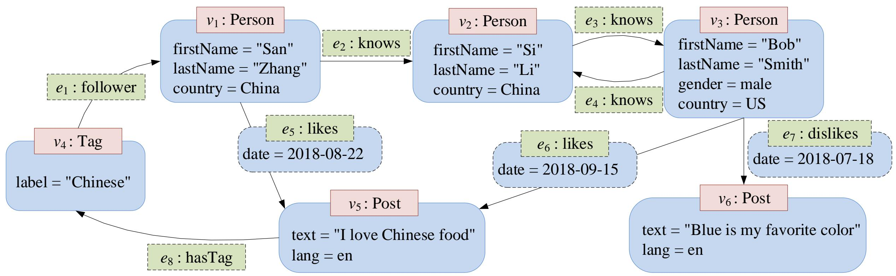

<details>
<summary>flowchart</summary>

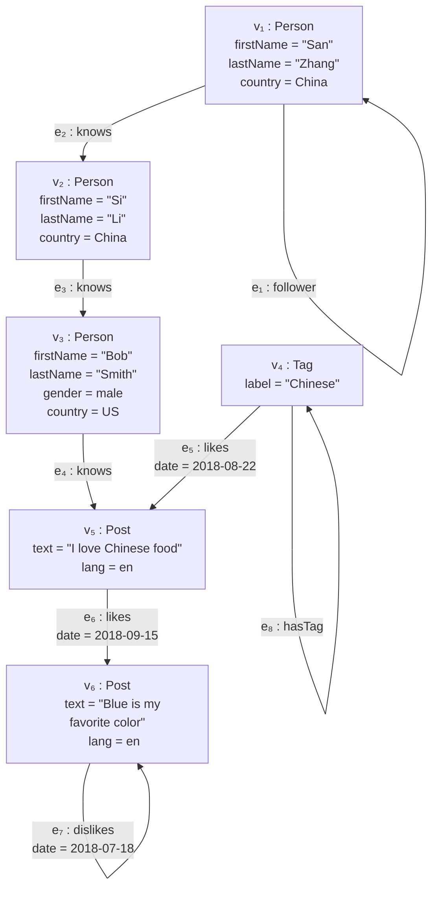
```mermaid
graph TD
  v1[" v₁ : Person\n    firstName = &quot;San&quot;\n    lastName = &quot;Zhang&quot;\ncountry = China"] -->|e₂ : knows| v2[" v₂ : Person\n    firstName = &quot;Si&quot;\n    lastName = &quot;Li&quot;\ncountry = China"]
  v2 -->|e₃ : knows| v3[" v₃ : Person\n    firstName = &quot;Bob&quot;\n    lastName = &quot;Smith&quot;\ngender = male\n    country = US"]
  v3 -->|e₄ : knows| v5[" v₅ : Post\n    text = &quot;I love Chinese food&quot;\n    lang = en"]
  v4[" v₄ : Tag\n    label = &quot;Chinese&quot;"] -->|e₅ : likes\n date = 2018-08-22| v5
  v5 -->|e₆ : likes\n date = 2018-09-15| v6[" v₆ : Post\n    text = &quot;Blue is my favorite color&quot;\n    lang = en"]
  v6 -->|e₇ : dislikes\n date = 2018-07-18| v6
  v1 -->|e₁ : follower| v1
  v4 -->|e₈ : hasTag| v4
```
</details>

## Neo4j

 Most popular graph database 最流行  
 Native graph storage andprocessing 原生存储和查询处理


  
BUSINESSUSERS

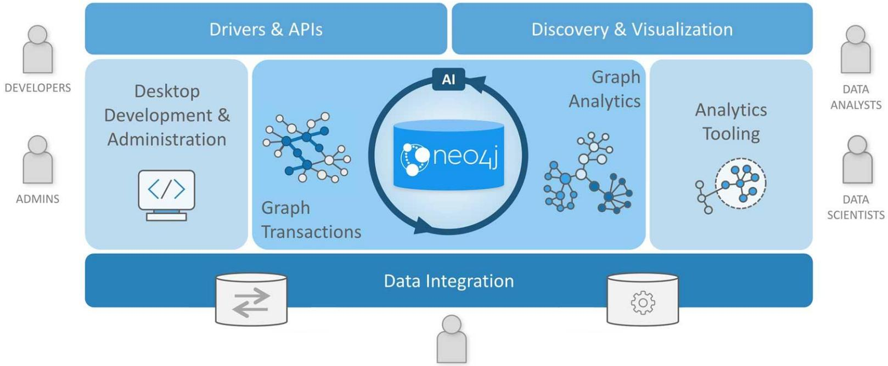

<details>
<summary>flowchart</summary>

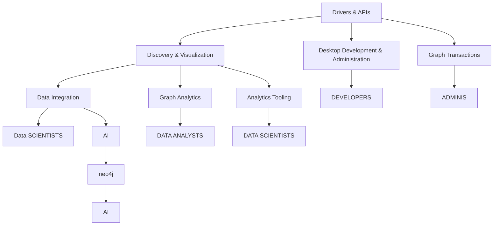
```mermaid
graph TD
  A["Drivers & APIs"] --> B["Discovery & Visualization"]
  B --> C["Data Integration"]
  C --> D["Data SCIENTISTS"]
  A --> E["Desktop Development & Administration"]
  A --> F["Graph Transactions"]
  B --> G["Graph Analytics"]
  B --> H["Analytics Tooling"]
  E --> I["DEVELOPERS"]
  F --> J["ADMINIS"]
  G --> K["DATA ANALYSTS"]
  H --> L["DATA SCIENTISTS"]
  C --> M["AI"]
  M --> N["neo4j"]
  N --> O["AI"]
```
</details>


neo4j

Neo4j Architecture  
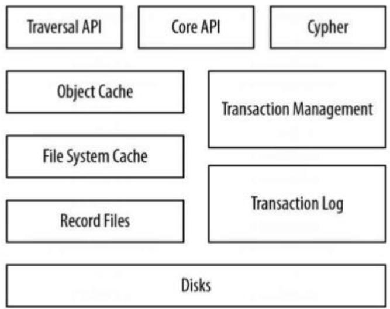

<details>
<summary>flowchart</summary>

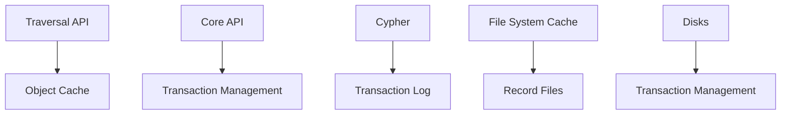
```mermaid
graph TD
  A["Traversal API"] --> B["Object Cache"]
  C["Core API"] --> D["Transaction Management"]
  E["Cypher"] --> F["Transaction Log"]
  G["File System Cache"] --> H["Record Files"]
  I["Disks"] --> J["Transaction Management"]
```
</details>

## Neo4j Installation 安装

 Download: https://neo4j.com/download-center/#community  
 Later version: neo4j-community-xxx  
 <NEO4J\_HOME>\bin\neo4j console

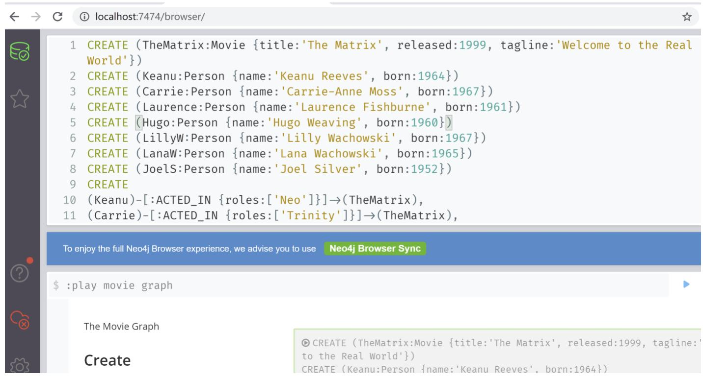

<details>
<summary>text_image</summary>

CREATE (TheMatrix:Movie {title:'The Matrix', released:1999, tagline:'Welcome to the Real World'}) 
CREATE (Keanu:Person {name:'Keanu Reeves', born:1964}) 
CREATE (Carrie:Person {name:'Carrie-Anne Moss', born:1967}) 
CREATE (Laurence:Person {name:'Laurence Fishburne', born:1961}) 
CREATE (Hugo:Person {name:'Hugo Weaving', born:1960}) 
CREATE (LillyW:Person {name:'Lilly Wachowski', born:1967}) 
CREATE (LanaW:Person {name:'Lana Wachowski', born:1965}) 
CREATE (JoelS:Person {name:'Joel Silver', born:1952}) 
CREATE 
(Keanu)-[:ACTED_IN {roles:['Neo']}]\rightarrow(TheMatrix), 
(Carrie)-[:ACTED_IN {roles:['Trinity']}]\rightarrow(TheMatrix), 
To enjoy the full Neo4j Browser experience, we advise you to use Neo4j Browser Sync
$ :play movie graph
The Movie Graph
Create
CREATE (TheMatrix:Movie {title:'The Matrix', released:1999, tagline:' to the Real World'}) 
CREATE (Keanu:Person {name:'Keanu Reeves', born:1964})
</details>

## Neo4j: Create the example graph

```txt
1 CREATE (v1:Director {name:"James Cameron", birthDate:"1954-08-16", networth:1.79E9})
2 CREATE (v2:Movie {label:"Titanic (1997 film)", length:195, budget:2.0E8})
3 CREATE (v3:Actor {name:"Leonardo DiCaprio", birthDate:"1974-11-11"})
4 CREATE (v4:Actor {name:"Kate Winslet", birthDate:"1975-10-05"})
5 CREATE (v1)-[e1:directs]→(v2)
6 CREATE (v1)-[e2:acts_in {role:"Steerage Dancer"}]→(v2)
7 CREATE (v3)-[e3:acts_in {role:"Jack Dawson"}]→(v2)
```


```txt
$ CREATE (v1:Director {name:"James Cameron", birthDate:"1954-08-16", networth:1.79E9}) CREATE (v...
```


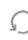

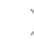


Table

Added 4 labels, created 4 nodes,set 13 properties, created 4 relationships, completed after 221 ms.

## Neo4j: Create the example graph

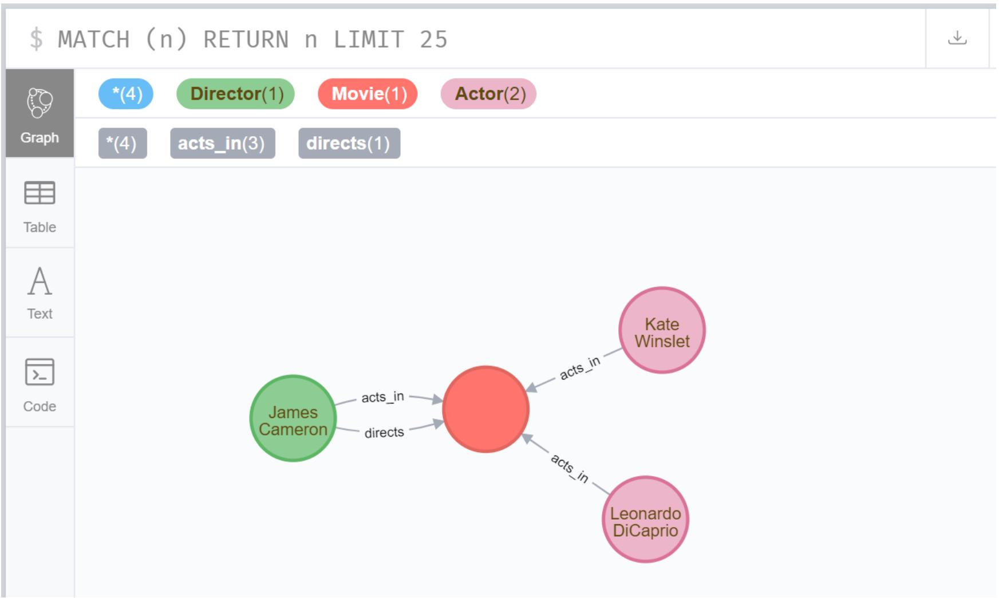

<details>
<summary>flowchart</summary>

```mermaid
graph TD
  A["James Cameron"] -->|acts_in| B(())
  A -->|directs| C(())
  D["Movie"] -->|acts_in| E(())
  F["Kate Winslet"] -->|acts_in| E
  G["Leonardo DiCaprio"] -->|acts_in| E
```
</details>

## Neo4j: Create the example graph

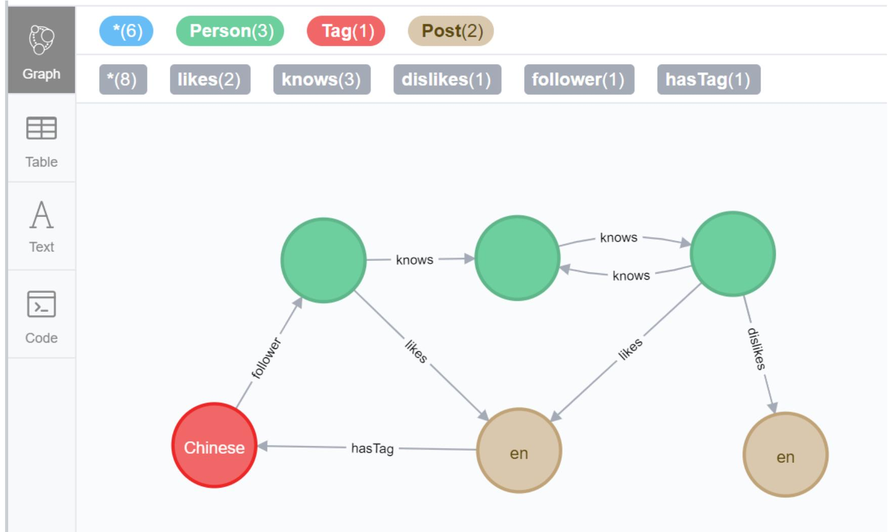

<details>
<summary>flowchart</summary>

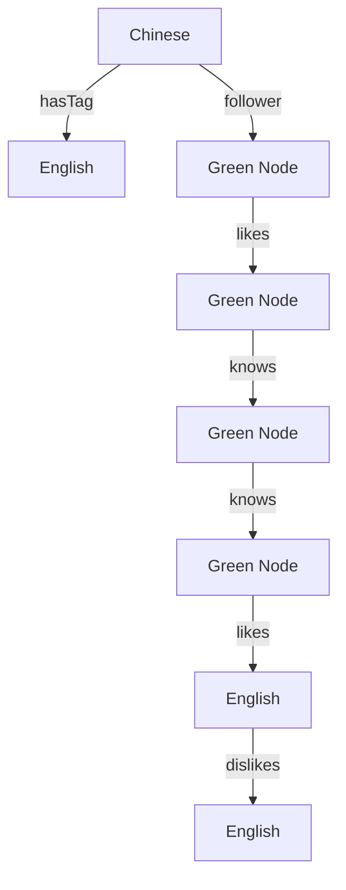
```mermaid
graph TD
  A["Chinese"] -->|hasTag| B["English"]
  A -->|follower| C["Green Node"]
  C -->|likes| D["Green Node"]
  D -->|knows| E["Green Node"]
  E -->|knows| F["Green Node"]
  F -->|likes| G["English"]
  G -->|dislikes| H["English"]
```
</details>

## 1. 知识数据管理

1.1 知识数据模型  
1.2 知识查询语言

## 知识查询语言

##  RDF图

• SPARQL 声明式语言

##  属性图

Cypher  
Gremlin  
PGQL  
• G-CORE

## RDF Graph Query Language: SPARQL

 SPARQL: SPARQL Protocol and RDF Query Language

 W3C Recommendation

 SPARQL 1.0 2008  
 SPARQL 1.1 2013

• Triple Patterns 三元组模式  
• Basic Graph Patterns 基本图模式  
• Complex Graph Patterns 复杂图模式  
• Property Paths 属性路径

https://www.w3.org/TR/sparql11-query/

##

W3C

SPARQL 1.1 Query Language

W3C Recommendation 21 March 2013

This version:

http://www.w3.org/TR/2013/REC-sparqI11-query-20130

Latest version:

http://www.w3.org/TR/sparql11-queryl

## SPARQL： RDF Query Language:


<details>
<summary>flowchart</summary>

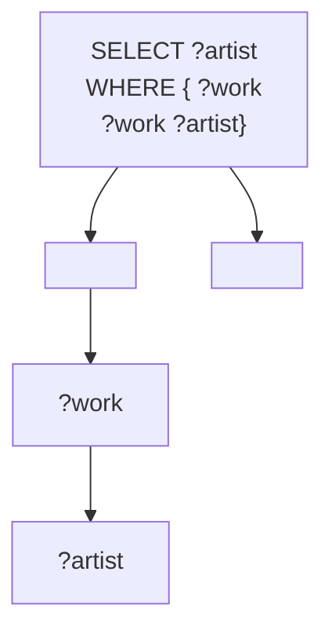
```mermaid
graph TD
  A["<Bob>"] --> B["?work"]
  B --> C["?artist"]
  D["SELECT ?artist\nWHERE {<Bob> <is interested in> ?work\n?work <was created by> ?artist}"] --> A
  D --> E["<is interested in> <was created by>"]
```
</details>

<Bob> <is a friend of> <Alice>.

<Bob> <is born on> <the 4th of July 1990>.

<Bob> <is interested in> <the Mona Lisa>.

<the Mona Lisa> <was created by> <Leonardo da Vinci>.

<the video ‘La Joconde α Washington'> <is about> <the Mona Lisa>

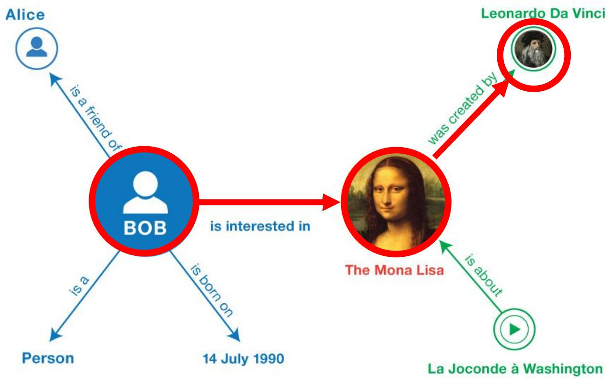

<details>
<summary>flowchart</summary>

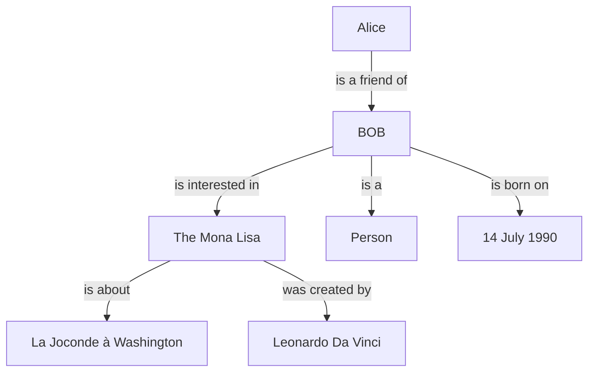
```mermaid
graph TD
  A["Alice"] -->|is a friend of| B["BOB"]
  B -->|is interested in| C["The Mona Lisa"]
  C -->|is about| D["La Joconde à Washington"]
  C -->|was created by| E["Leonardo Da Vinci"]
  B -->|is a| F["Person"]
  B -->|is born on| G["14 July 1990"]
```
</details>

## Nuts & Bolts

## URIs

<http://this.is.a/full/URI/written#out>

PREFIX foo: <http://this.is.a/URI/prefix#> foo:bar

→http://this.is.a/URI/prefix#bar

a rdf:type

## Literals

"a plain literal"

"bonjour"@fr

"13"^^xsd:integer

true  "true"^^xsd:boolean

3 → "3"^^xsd:integer

4.2 → "4.2"^^xsd:decimal

## Variables

?varl, ?anotherVar, ?and\_one\_more

## Comments

\# Comments start with a \`#' and

\# continue to the end of the line

## Triple Patterns

ex:myWidget ex:partNumber "XY24z1"

?person foaf:name "Lee Feigenbaum"

conf:SemTech2009 ?property ?value .

## Common Prefixes

<table><tr><td>prefix...</td><td>...stands for</td></tr><tr><td>rdf:</td><td>http://xmlns.com/foaf/0.1/</td></tr><tr><td>rdfs:</td><td>http://www.w3.org/2000/01/rdf-schema#</td></tr><tr><td>owl:</td><td>http://www.w3.org/2002/07/owl#</td></tr><tr><td>xsd:</td><td>http://www.w3.org/2001/XMLSchema#</td></tr><tr><td>dc:</td><td>http://purl.org/dc/elements/1.1/</td></tr><tr><td>foaf:</td><td>http://xmlns.com/foaf/0.1/</td></tr></table>

More common prefixes at http://prefix.cc

Anatomy of a Query  
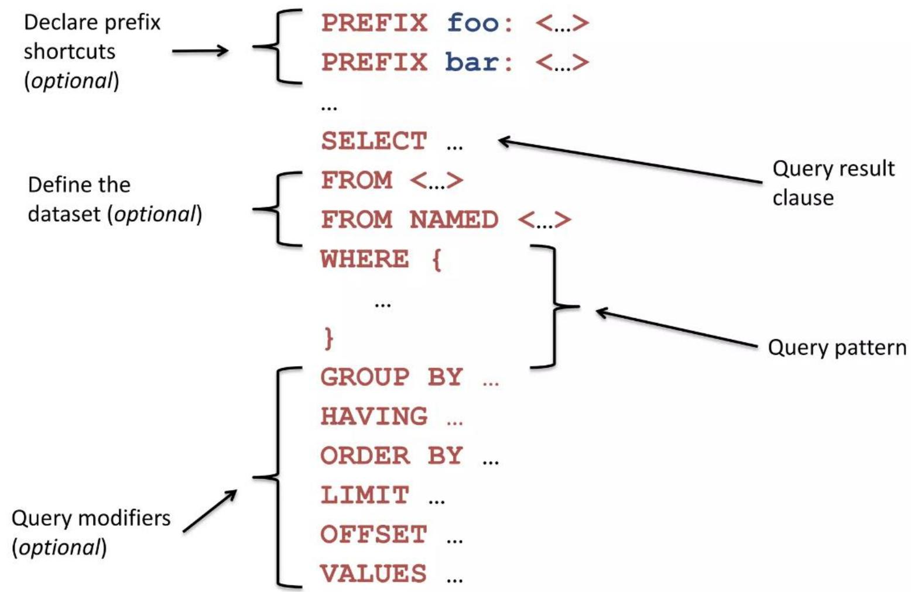

<details>
<summary>flowchart</summary>

```mermaid
graph TD
  A["Declare prefix shortcuts (optional)"] --> B{PREFIX foo: <...>
    PREFIX bar: <...>
    ...
    SELECT ...
    FROM <...>
    FROM NAMED <...>
    WHERE {
    ...
    }
    GroupBy...
    Having ...
    ORDERBy ...
    Limit ...
    OFFSET ...
    VALUES ...}
    style A fill:#f9f,stroke:#333
    style B fill:#ccf,stroke:#333
  style_C["Define the dataset (optional)"] --> D{FROM <...>
    FROM NAMED <...>
    WHERE {
        ...
        }
    style D fill:#cfc,stroke:#333
    note right of A
        Query result clause
        Query pattern
    end
    note right of C
        Query modifiers (optional)
    end
```
</details>

## 4 Types of SPARQL Queries

## SELECT queries

SELECT ?c ?cap (1000 \* ?people AS ?pop)

SELECT \*

SELECT DISTINCT ?country

Results in a table of values (in XML or JSON):

<table><tr><td>?c</td><td>?cap</td><td>?pop</td></tr><tr><td>ex:France</td><td>ex:Paris</td><td>63,500,000</td></tr><tr><td>ex:Canada</td><td>ex:Ottawa</td><td>32,900,000</td></tr><tr><td>ex:Italy</td><td>ex:Rome</td><td>58,900,000</td></tr></table>

## CONSTRUCT queries

CONSTRUCT {

?country a ex:HolidayDestination ; ex:arrive\_at ?capital ex:population ?population

ex:France a ex:HolidayDestination ; ex:arrive\_at ex:Paris ; ex:population 635000000.

ex:Canada a ex:HolidayDestination ; ex:arrive\_at ex:Ottawa ; ex:population 329000000 .

## ASK queries

ASK

Result is either "true" or "false"(in XML or JSON): true，false

## DESCRIBE queries

DESCRIBE ?country

ex:France a geo:Country ; ex:continent geo:Europe ; ex:flag <http://../flag-france.png> ;

## Combining SPARQL Graph Patterns

Consider A and B as graph patterns.

ABasic Graph Pattern-one or more triplepatterns

## A .B

Conjunction.Join together the results of solving Aand B by matching the values of any variables in common.

Optional Graph Patterns

## A OPTIONAL {B }

Left join.Join together the results of solving Aand B by matching the values of any variables in common,if possible. Keep all solutions from Awhether or not there's a matching solution in B

# Combining SPARQL Graph Patterns

Consider Aand B as graph patterns.

Either-orGraph Patterns

{A}UNION{B}

Disjunction.Include both the results of solving Aand the results of solving B.

A MINUS{B}

Negation.Solve A.Solve B.Include only those results from solving A that are not compatible with any of the results from B.

## SPARQL Subqueries (SPARQL 1.1)

Consider Aand B as graph patterns.

```txt
A .
{
SELECT ...
WHERE {
B
}
}
C .
```

Join the results of the subquery with the results of solving Aand C.

## SPARQL Filters

· SPARQL FILTERs eliminate solutions that do not cause an expression to evaluate to true.  
· Place FILTERs in α query inline within α basic graph pattern

A.B.FILTER（...expr.）

<table><tr><td>Category</td><td>Functions / Operators</td><td>Examples</td></tr><tr><td>Logical &amp; Comparisons</td><td>!, &amp;&amp;, ||, =, !=, &lt;, &lt;=, &gt;, &gt;=, IN, NOT IN</td><td>?hasPermit || ?age &lt; 25</td></tr><tr><td>Conditionals (SPARQL 1.1)</td><td>EXISTS, NOT EXISTS, IF, COALESCE</td><td>NOT EXISTS { ?p foaf:mbox ?email }</td></tr><tr><td>Math</td><td>+, -, *, /, abs, round, ceil, floor, RAND</td><td>?decimal * 10 &gt; ?minPercent</td></tr><tr><td>Strings (SPARQL 1.1)</td><td>STRLEN, SUBSTR, UCASE, LCASE, STRSTARTS, CONCAT, STRENDS, CONTAINS, STRBEFORE, STRAFTER</td><td>STRLEN(?description) &lt; 255</td></tr><tr><td>Date/time (SPARQL 1.1)</td><td>now, year, month, day, hours, minutes, seconds, timezone, tz</td><td>month (now()) &lt; 4</td></tr><tr><td>SPARQL tests</td><td>isURI, isBlank, isLiteral, is Numeric, bound</td><td>isURI (?person) || !bound (?person)</td></tr><tr><td>Constructors (SPARQL 1.1)</td><td>URI, BNODE, STRDT, STRLANG, UUID, STRUUID</td><td>STRLANG (?text, &quot;en&quot;) = &quot;hello&quot;@en</td></tr><tr><td>Accessors</td><td>str, lang, datatype</td><td>lang (?title) = &quot;en&quot;</td></tr><tr><td>Hashing (1.1)</td><td>MD5, SHA1, SHA256, SHA512</td><td>BIND (SHA256 (?email) AS ?hash)</td></tr><tr><td>Miscellaneous</td><td>sameTerm, langMatches, regex, REPLACE</td><td>regex (?ssn, &quot;\\d{3}-\\d{2}-\\d{4}&quot;)</td></tr></table>

## Aggregates (SPARQL 1.1)

1.Partition results into groups based on the expression(s) in the GROUP BY clause  
2．Evaluate projections and aggregate functions in SELECT clause to get one result per group  
3．Filter aggregated results via the HAVING clause

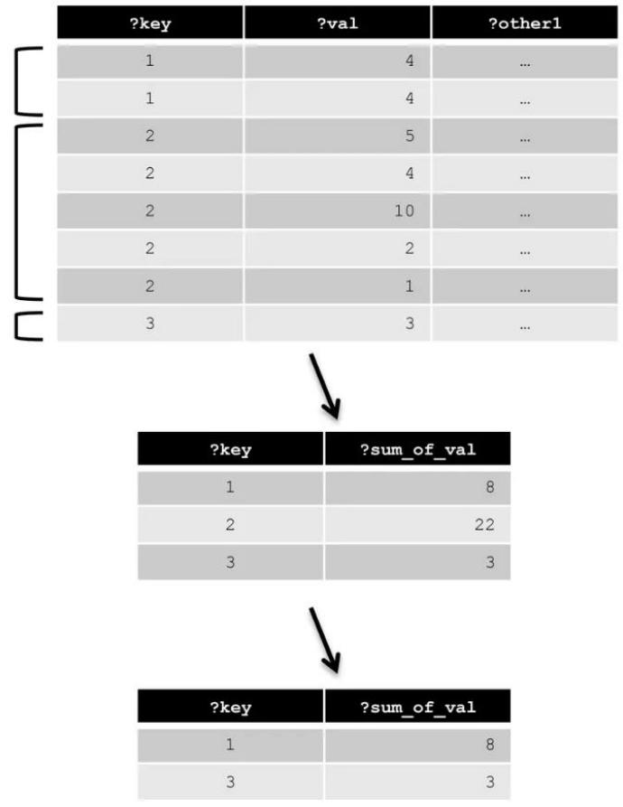

<details>
<summary>flowchart</summary>


```mermaid
graph TD
  A["?key"] --> B["1"]
  A --> C["1"]
  A --> D["2"]
  A --> E["2"]
  A --> F["2"]
  A --> G["2"]
  A --> H["3"]
  I["?val"] --> J["4"]
  I --> K["4"]
  I --> L["5"]
  I --> M["4"]
  I --> N["10"]
  I --> O["2"]
  I --> P["1"]
  I --> Q["3"]
  R["?other1"] --> S["..."]
  R --> T["..."]
  R --> U["..."]
  R --> V["..."]
  R --> W["..."]
  R --> X["..."]
  R --> Y["..."]
  R --> Z["..."]
  R --> AA["..."]
  R --> AB["..."]
  R --> AC["..."]
  R --> AD["..."]
  R --> AE["..."]
  R --> AF["..."]
```
</details>

## Property Paths (SPARQL 1.1)

Property paths allow triple patterns to match arbitrarylength paths through a graph  
Predicates are combined with regular-expression-like operators:

<table><tr><td>Construct</td><td>Meaning</td></tr><tr><td>path1/path2</td><td>Forwards path (path1 followed by path2)</td></tr><tr><td>^path1</td><td>Backwards path (object to subject)</td></tr><tr><td>path1|path2</td><td>Either path1 or path2</td></tr><tr><td>path1*</td><td>path1, repeated zero or more times</td></tr><tr><td>path1+</td><td>path1, repeated one or more times</td></tr><tr><td>path1?</td><td>path1, optionally</td></tr><tr><td>!uri</td><td>Any predicate except uri</td></tr><tr><td>!^uri</td><td>Any backwards (object to subject) predicate except uri</td></tr></table>

## RDF Datasets

A SPARQL queries a default graph (normally) and zero or more named graphs (when inside a GRAPH clause).

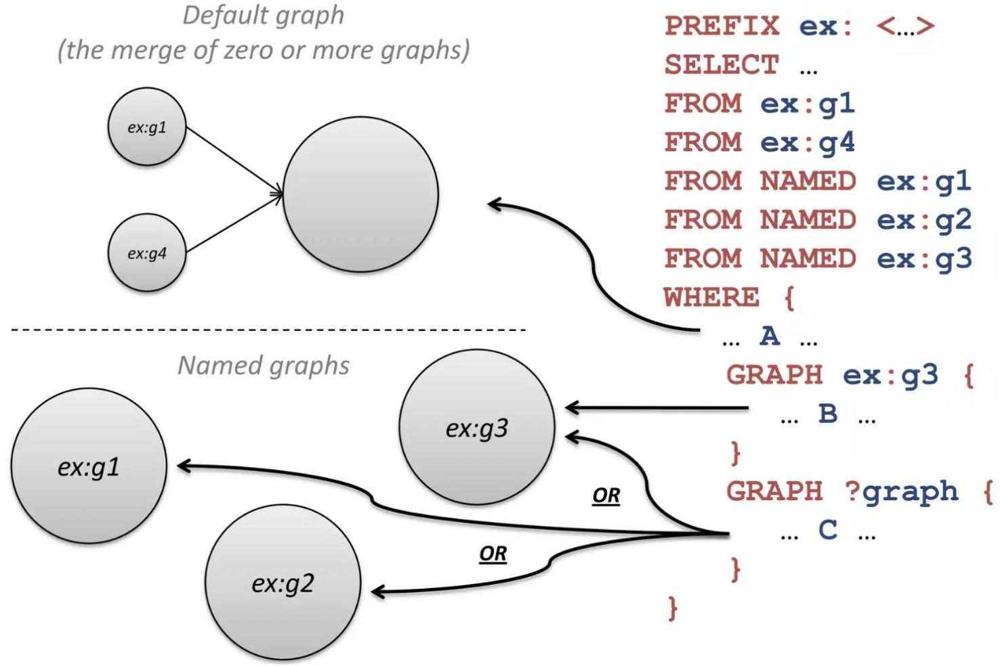

<details>
<summary>flowchart</summary>

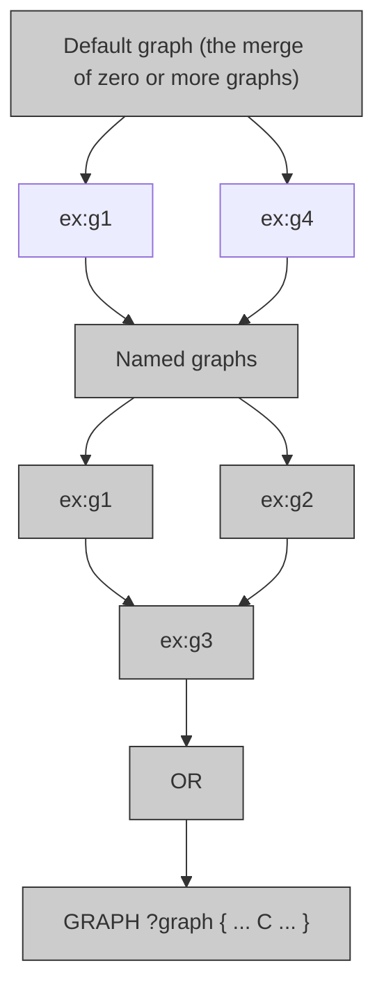
```mermaid
graph TD
  A["Default graph (the merge of zero or more graphs)"] --> B["ex:g1"]
  A --> C["ex:g4"]
  B --> D["Named graphs"]
  C --> D
  D --> E["ex:g1"]
  D --> F["ex:g2"]
  E --> G["ex:g3"]
  F --> G
  G --> H["OR"]
  H --> I["GRAPH ?graph { ... C ... }"]
    style A fill:#ccc,stroke:#333
    style D fill:#ccc,stroke:#333
    style E fill:#ccc,stroke:#333
    style F fill:#ccc,stroke:#333
    style G fill:#ccc,stroke:#333
    style H fill:#ccc,stroke:#333
    style I fill:#ccc,stroke:#333
```
</details>

## SPARQL Over HTTP (the SPARQL Protocol)

http://host.domain.com/sparql/endpoint?<parameters>

where <parameters> can include:

```html
query=<encoded query string>
e.g. SELECT+*%0DWHERE+{...
default-graph-uri=<encoded graph URI>
e.g. http%3A%2F%2Fexmaple.com%2Ffoo...
n.b. zero of more occurrences of default-graph-uri
named-graph-uri=<encoded graph URI>
e.g. http%3A%2F%2Fexmaple.com%2Fbar...
n.b. zero of more occurrences of named-graph-uri
```

HTTP GET or POST.Graphs given in the protocol override graphs given in the query.

Federated Query (SPARQL 1.1)  
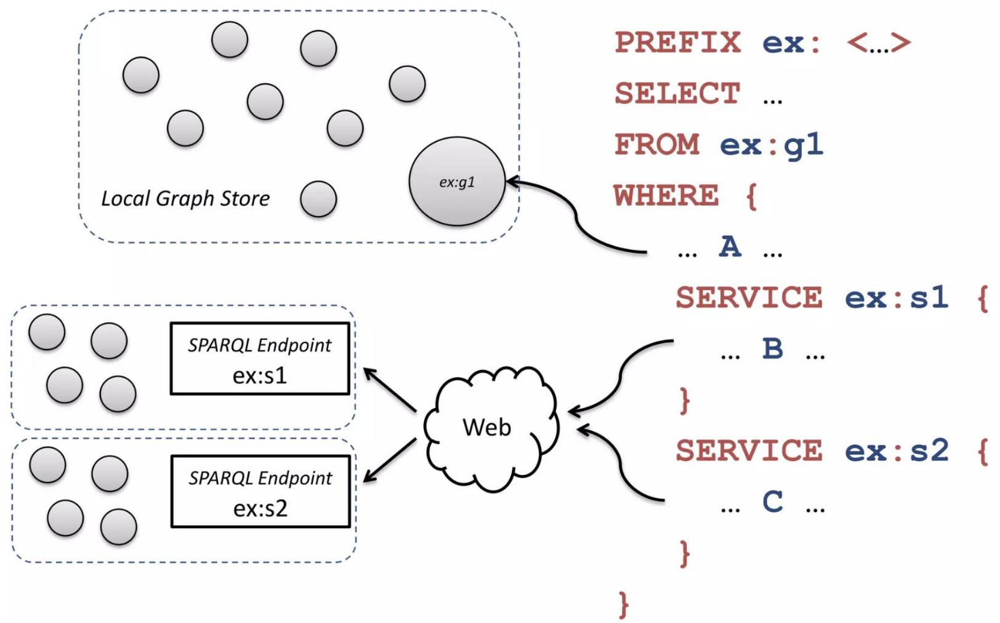

<details>
<summary>flowchart</summary>

```mermaid
graph TD
  A["Local Graph Store"] --> B["ex:g1"]
  B --> C["Web"]
  D["SPARQL Endpoint ex:s1"] --> C
  E["SPARQL Endpoint ex:s2"] --> C
  F["PREFIX ex: <...> --> B<br>  SELECT[&quot;SELECT ...&quot;"] --> B
  FROMExG1["FROM ex:g1"] --> B
  WHERE { ... A ... } --> C
  G["SERVICE ex:s1 { ... B ... } --> C<br>  H[SERVICE ex:s2 { ... C ... }"] --> C
```
</details>

## SPARQL 1.1 Update

```sql
SPARQL Update Language Statements

INSERT DATA { triples }

DELETE DATA {triples}

[ DELETE { template } ] [ INSERT { template } ] WHERE { pattern }

LOAD <uri> [ INTO GRAPH <uri> ]

CLEAR GRAPH <uri>

CREATE GRAPH <uri>

DROP GRAPH <uri>
```

[...] denotes optional parts of SPARQL 1.1 Update syntax

Some Public SPARQL Endpoints

<table><tr><td>Name</td><td>URL</td><td>What&#x27;s there?</td></tr><tr><td>SPARQLer</td><td>http://sparql.org/sparql.html</td><td>General-purpose query endpoint for Web-accessible data</td></tr><tr><td>DBPedia</td><td>http://dbpedia.org/sparql</td><td>Extensive RDF data from Wikipedia</td></tr><tr><td>DBLP</td><td>http://www4.wiwiss.fu-berlin.de/dblp/snorql/</td><td>Bibliographic data from computer science journals and conferences</td></tr><tr><td>LinkedMDB</td><td>http://data.linkedinmdb.org/sparql</td><td>Films, actors, directors, writers, producers, etc.</td></tr><tr><td>World Factbook</td><td>http://www4.wiwiss.fu-berlin.de/factbook/snorql/</td><td>Country statistics from the CIA World Factbook</td></tr><tr><td>bio2rdf</td><td>http://bio2rdf.org/sparql</td><td>Bioinformatics data from around 40 public databases</td></tr></table>

## SPARQL Resources

· SPARQL Specifications Overview  
http://www.w3.org/TR/sparql11-overview/  
·SPARQLimplementations  
http://esw.w3.org/topic/Sparqllmplementations  
· SPARQL endpoints  
http://esw.w3.org/topic/SparqlEndpoints  
· SPARQL Frequently Asked Questions  
- http://www.thefigtrees.net/lee/sw/sparql-faq  
· Common SPARQL extensions  
- http://esw.w3.org/topic/SPARQL/Extensions

## 基于Jena 执行SPARQL查询示例

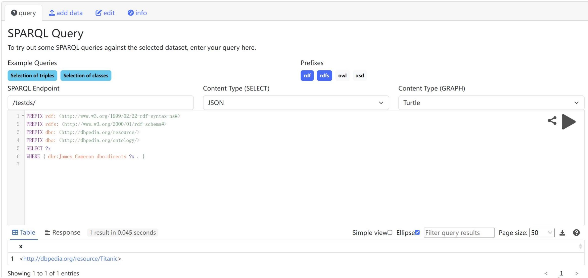

<details>
<summary>text_image</summary>

SPARQL Query
To try out some SPARQL queries against the selected dataset, enter your query here.
Example Queries
Selection of triples	Selection of classes
Prefixes
rdf	rdfs.owl	xsd
SPARQL Endpoint
Content Type (SELECT)
Content Type (GRAPH)
/testds/
JSON
Turtle
1	PREFIX rdf: <http://www.w3.org/1999/02/22-rdf-syntax-ns#>
2	PREFIX rdfs: <http://www.w3.org/2000/01/rdf-schema#>
3	PREFIX dbr: <http://dbpedia.org/resource/>
4	PREFIX dbo: <http://dbpedia.org/ontology/>
5	SELECT ?x
6	WHERE { dbr:James_Cameron dbo:directs ?x . }
7
Table	Response	1 result in 0.045 seconds
Simple view Ellipse Filter query results Page size: 50
x
1 <http://dbpedia.org/resource/Titanic>
Showing 1 to 1 of 1 entries
</details>

## SPARQL

## 查询1: 查询 James\_Cameron 执导的电影？

## 三元组模式

SELECT ?x

WHERE { dbr:James\_Cameron dbo:directs ?x . }

## 查询结果

?x

Titanic

James\_Cameron

-directs-

?x

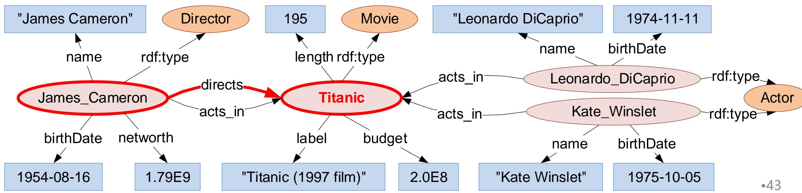

<details>
<summary>flowchart</summary>


```mermaid
graph TD
  A["James Cameron"] -->|name| B["James_Cameron"]
  A -->|rdf:type| C["Titanic"]
  D["Director"] -->|length rdf:type| C
  E["195"] -->|length rdf:type| C
  F["Movie"] -->|birthDate| G["Leonardo DiCaprio"]
  F -->|birthDate| H["Actor"]
  I["1974-11-11"] -->|name| G
  I -->|birthDate| H
  J["Titanic (1997 film)"] -->|birthDate| H
  K["2.0E8"] -->|birthDate| H
  L["Kate Winslet"] -->|birthDate| H
  M["Kate Winslet"] -->|birthDate| H
  N["RadioDiCaprio"] -->|rdf:type| G
  O["RadioDiCaprio"] -->|rdf:type| H
  P["RadioDiCaprio"] -->|rdf:type| H
  Q["RadioDiCaprio"] -->|rdf:type| H
  R["RadioDiCaprio"] -->|rdf:type| H
  S["RadioDiCaprio"] -->|rdf:type| H
  T["RadioDiCaprio"] -->|rdf:type| H
  U["RadioDiCaprio"] -->|rdf:type| H
  V["RadioDiCaprio"] -->|rdf:type| H
  W["RadioDiCaprio"] -->|rdf:type| H
  X["RadioDiCaprio"] -->|rdf:type| H
  Y["RadioDiCaprio"] -->|rdf:type| H
  Z["RadioDiCaprio"] -->|rdf:type| H
  AA["RadioDiCaprio"] -->|rdf:type| H
  AB["RadioDiCaprio"] -->|rdf:type| H
  AC["RadioDiCaprio"] -->|rdf:type| H
  AD["RadioDiCaprio"] -->|rdf:type| H
  AE["RadioDiCaprio"] -->|rdf:type| H
  AF["RadioDiCaprio"] -->|rdf:type| H
  AG["RadioDiCaprio"] -->|rdf:type| H
  AH["RadioDiCaprio"] -->|rdf:type| H
  AI["RadioDiCaprio"] -->|rdf:type| H
  AJ["RadioDiCaprio"] -->|rdf:type| H
  AK["RadioDiCaprio"] -->|rdf:type| H
  AL["RadioDiCaprio"] -->|rdf:type| H
  AM["RadioDiCaprio"] -->|rdf:type| H
  AN["RadioDiCaprio"] -->|rdf:type| H
  AO["RadioDiCaprio"] -->|rdf:type| H
  AP["RadioDiCaprio"] -->|rdf:type| H
  AQ["RadioDiCaprio"] -->|rdf:type| H
  AR["RadioDiCaprio"] -->|rdf:type| H
  AS["RadioDiCaprio"] -->|rdf:type| H
  AT["RadioDiCaprio"] -->|rdf:type| H
  AU["RadioDiCaprio"] -->|rdf:type| H
  AV["RadioDiCaprio"] -->|rdf:type| H
  AW["RadioDiCaprio"] -->|rdf:type| H
  AX["RadioDiCaprio"] -->|rdf:type| H
  AY["James Cameron"] --> AZ["directs acts_in"]
  AZ --> BA["1.79E9"]
  BA --> BB["1954-08-16"]
```
</details>

## 查询 2: 查询 James\_Cameron 执导的电影及其片名?

## 基本图模式

SELECT ?x1 ?x2

WHERE { dbr:James\_Cameron dbo:directs ?x1 . ?x1 rdfs:label ?x2 . }


<details>
<summary>flowchart</summary>

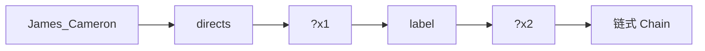
```mermaid
graph LR
  A["James_Cameron"] --> B["directs"]
  B --> C["?x1"]
  C --> D["label"]
  D --> E["?x2"]
  E --> F["链式 Chain"]
```
</details>

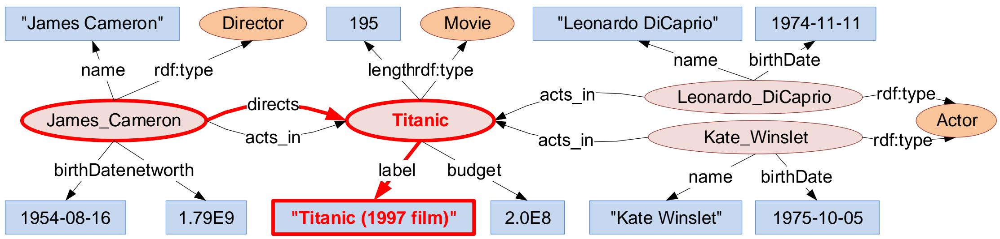

<details>
<summary>flowchart</summary>

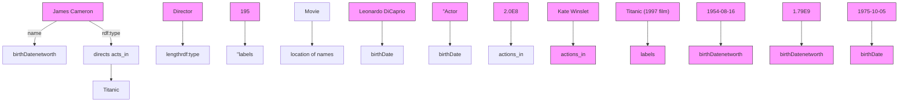
```mermaid
graph TD
  A["James Cameron"] -->|name| B["birthDatenetworth"]
  A -->|rdf:type| C["directs acts_in"]
  C --> D["Titanic"]
  E["Director"] --> F["lengthrdf:type"]
  G["195"] --> H["&quot;labels"]
  I["Movie"] --> J["location of names"]
  K["Leonardo DiCaprio"] --> L["birthDate"]
  M["&quot;Actor"] --> N["birthDate"]
  O["2.0E8"] --> P["actions_in"]
  Q["Kate Winslet"] --> R["actions_in"]
  S["Titanic (1997 film)"] --> T["labels"]
  U["1954-08-16"] --> V["birthDatenetworth"]
  W["1.79E9"] --> X["birthDatenetworth"]
  Y["1975-10-05"] --> Z["birthDate"]
    style A fill:#f9f,stroke:#333
    style E fill:#f9f,stroke:#333
    style G fill:#f9f,stroke:#333
    style K fill:#f9f,stroke:#333
    style M fill:#f9f,stroke:#333
    style O fill:#f9f,stroke:#333
    style Q fill:#f9f,stroke:#333
    style R fill:#f9f,stroke:#333
    style S fill:#f9f,stroke:#333
    style T fill:#f9f,stroke:#333
    style U fill:#f9f,stroke:#333
    style V fill:#f9f,stroke:#333
    style W fill:#f9f,stroke:#333
    style X fill:#f9f,stroke:#333
    style Y fill:#f9f,stroke:#333
    style Z fill:#f9f,stroke:#333
```
</details>

## 查询结果

<table><tr><td>?x1</td><td>?x2</td></tr><tr><td>Titanic</td><td>&quot;Titanic (1997 film)&quot;</td></tr></table>

## 查询 3: 查询1954-08-16出生的导演执导的电影？

## 基本图模式

SELECT ?x2

WHERE { ?x1 dbo:directs ?x2 .

?x1 rdf:type dbo:Director .

?x1 dbo:birthDate "1954-08-16"^^xsd:date . }

1954 -08-16

birthDate

Director

?x1

rdf:type

-directs-

?x2

## 星形 Star

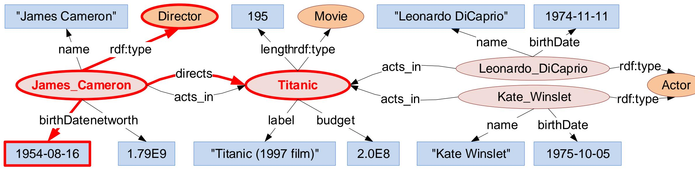

<details>
<summary>flowchart</summary>

```mermaid
graph TD
  A["James Cameron"] -->|name rdf:type| B["Director"]
  A --> C["195"]
  C --> D["Movie"]
  D --> E["Leonardo DiCaprio"]
  D --> F["1974-11-11"]
  B --> G["Titanic"]
  G --> H["lesthrdf:type"]
  G --> I["birthDate"]
  G --> J["actors_in"]
  G --> K["actors_in"]
  G --> L["rate_Winslet"]
  G --> M["rate Winslet"]
  G --> N["actor"]
  G --> O["birthDate"]
  G --> P["Titanic (1997 film)"]
  A --> Q["James_Cameron"]
  Q --> R["birthDatenetworth"]
  Q --> S["1.79E9"]
  G --> T["Titanic (1997 film)"]
  T --> U["2.0E8"]
  G --> V["Actor"]
  G --> W["Actor"]
```
</details>

## 查询 4: 查询1950年之后出生的资产大于1.0E9的导演执导的电影的出演演员？

## 复杂图模式

SELECT ?x5

WHERE { ?x1 rdf:type dbo:Director . ?x1 dbo:birthDate ?x2 . FILTER (?x2 >= "1950-01-01"^^xsd:date) ?x1 dbo:networth ?x3 . FILTER (?x3 > 1.0E9) ?x1 dbo:directs ?x4 . ?x5 dbo:acts\_in ?x4 . }

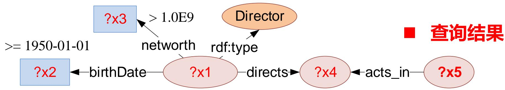

<details>
<summary>flowchart</summary>

```mermaid
graph TD
  A["?x3"] -->|>= 1950-01-01| B["?x2"]
  B --> C["birthDate"]
  C --> D["?x1"]
  D --> E["directs"]
  E --> F["?x4"]
  F --> G["acts_in"]
  G --> H["?x5"]
  I["Director"] --> J["ndworth"]
  J --> K["network"]
  K --> L["rdf:type"]
  M["?x5"] --> N["?x4"]
    style M fill:#f9f,stroke:#333
    style N fill:#f9f,stroke:#333
```
</details>

<table><tr><td>?x5</td></tr><tr><td>Leonardo_DiCaprio</td></tr><tr><td>Kate_Winslet</td></tr><tr><td>James_Cameron</td></tr></table>

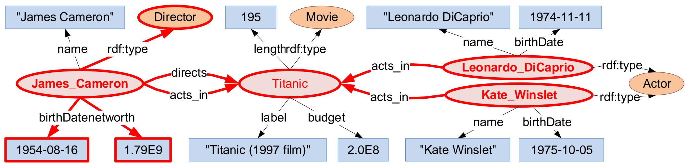

<details>
<summary>flowchart</summary>

```mermaid
graph TD
  A["James Cameron"] -->|name| B["birthDatenetworth"]
  A -->|rdf:type| C["Director"]
  C --> D["directs acts_in"]
  D --> E["Titanic"]
  E --> F["label"]
  E --> G["budget&quot;"]
  H["1954-08-16"] --> I["1.79E9"]
  J["Movie"] --> K["lengthrdf:type"]
  L["Leonardo DiCaprio"] --> M["name"]
  L --> N["birthDate"]
  O["1974-11-11"] --> P["Actor"]
  Q["Kate Winslet"] --> R["name"]
  Q --> S["birthDate"]
  T["Titanic (1997 film)"] --> U["2.0E8"]
  V["Leonardo_DiCaprio"] --> W["rdf:type"]
  X["Kate Winslet"] --> Y["rdf:type"]
```
</details>

## 查询 5: 查询具有多步 “合作距离” 的两名演员？

## 属性路径

SELECT ?x1 ?x2

WHERE {

?x1 (dbo:acts\_in / ^dbo:acts\_in)\* ?x2 . FILTER (?x1 != ?x2)

?x1 rdf:type dbo:Actor . ?x2 rdf:type dbo:Actor . }属性路径 property path: 导航式查询正在表达式 regular expression：

(acts\_in / ^acts\_in)\*

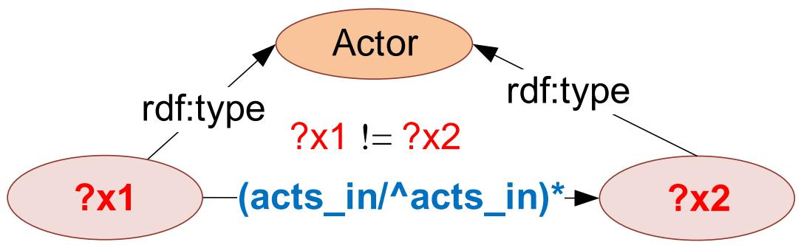

<details>
<summary>flowchart</summary>

```mermaid
graph TD
  A["Actor"] -->|rdf:type| B["?x1"]
  A -->|rdf:type| C["?x2"]
  B -->|acts_in/^acts_in*| C
    style A fill:#f9f,stroke:#333
    style B fill:#ccf,stroke:#333
    style C fill:#cfc,stroke:#333
    note right of A: ?x1 != ?x2
    note right of C: ?x2
```
</details>

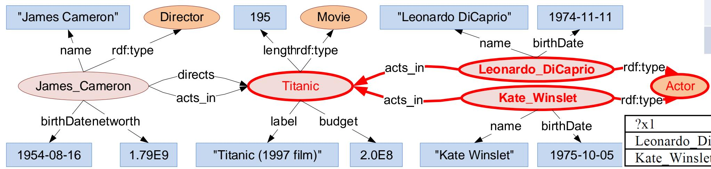

<details>
<summary>flowchart</summary>

```mermaid
graph TD
  A["James Cameron"] -->|name| B["James_Cameron"]
  A -->|rdf:type| C["Titanic"]
  D["Director"] -->|lengthrdf:type| C
  E["195"] -->|lengthrdf:type| C
  F["Movie"] -->|lengthrdf:type| C
  G["Leonardo DiCaprio"] -->|birthDate| H["Actor"]
  I["1974-11-11"] -->|birthDate| H
  J["Titanic (1997 film)"] -->|labels| K["2.0E8"]
  L["Kate Winslet"] -->|birthDate| M["1975-10-05"]
  N["Leonardo_DiCaprio"] -->|rdf:type| O["Actor"]
  P["Kate Winslet"] -->|rdf:type| O
  Q["James_Cameron"] -->|directs acts_in| C
  R["birthDatenetworth"] -->|birthDatenetworth| K
  S["Titanic (1997 film)"] -->|labels| K
  T["2.0E8"] -->|budget| K
  U["1.79E9"] --> K
  V["1954-08-16"] --> K
```
</details>

<table><tr><td>Op</td><td>语义 Semantics</td></tr><tr><td>/</td><td>path concatenation</td></tr><tr><td>|</td><td>Path union</td></tr><tr><td>*</td><td>Kleene closure</td></tr><tr><td>+</td><td>Kleene plus</td></tr><tr><td>^</td><td>Edge inverse</td></tr></table>

## 查询结果

<table><tr><td>?x1</td><td>?x2</td></tr><tr><td>Leonardo_DiCaprio</td><td>Kate_Winslet</td></tr><tr><td>Kate_Winslet</td><td>Leonardo_DiCaprio</td></tr></table>

## 属性图查询语言： Cypher

## 标准化工作：openCypher

https://www.opencypher.org


neo4j

##


About

Blog

Events

Cypher in use

Features

Contributions

Implementers Group

References

## openCypher Resources

The following resources are available to download and use.

·The Cypher Query Language Reference (Version 9), containing the complete reference for Version 9 of the Cypher query language.  
· The Cypher Style Guide is comprised of:

。 Syntax guidelines for composing Cypher queries in a conventional, readability-oriented manner.  
o Guidelines that may affect the semantics of queries.

· The TCK (Technology Compatibility Kit) is a Cucumber-based set of tests that can be used for any Cypher implementation in any of the many languages supported by Cucumber.

○ Defines the correct behaviour of Cypher under various conditions.  
Provides an unambiguous way of certifying implementations for correctness.  
○ Documents the behaviour of queries in a clear manner.  
。 Grouped into features, each of which consists of a set of scenarios, which comprise ordered steps defining the prerequisites, input and expected output.  
• Allows a proposed change to be expressed clearly, through the modification of existing scenarios or the addition of a new scenario.

## 基于Neo4j 执行Cypher查询示例

## 查询 6: 查询 James\_Cameron 执导的电影及其片名?

## SPARQL 查询 2

MATCH (:Director {name: "James Cameron"})-[:directs]->(x:Movie) RETURN x, x.label

<table><tr><td>Op</td><td>语义 Semantics</td></tr><tr><td>( )</td><td>Node information</td></tr><tr><td>- [ ]-&gt;</td><td>Edge information</td></tr><tr><td>:</td><td>Node (edge) label</td></tr><tr><td>{ }</td><td>Properties</td></tr></table>

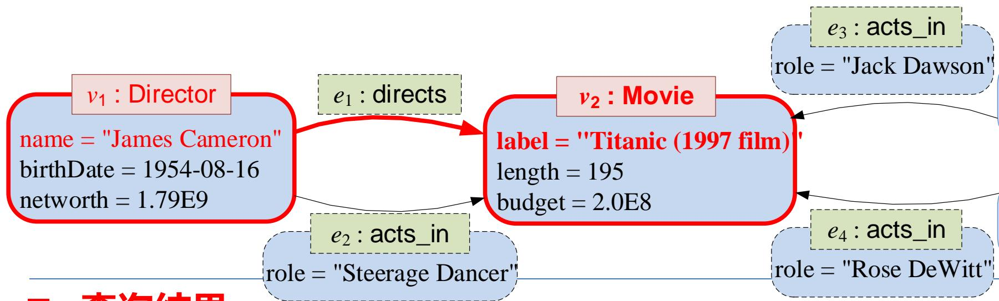

<details>
<summary>flowchart</summary>

```mermaid
graph TD
  A["v₁ : Director\nname = &quot;James Cameron&quot; birthDate = 1954-08-16\nnetworth = 1.79E9"] -->|e₁ : directs| B["label = &quot;Titanic (1997 film)&quot; length = 195\nbudget = 2.0E8"]
  A -->|e₂ : acts_in\nrole = "Steerage Dancer"| B
  C["v₂ : Movie\ne₃ : acts_in\nrole = &quot;Jack Dawson&quot;"] --> B
  D["e₄ : acts_in\nrole = &quot;Rose DeWitt&quot;"] --> B
```
</details>

v3 : Actor

name = "Leonardo DiCaprio" birthDate = 1974-11-11

v4 : Actor

name = "Kate Winslet" birthDate = 1975-10-05

## 查询结果

<table><tr><td>x</td><td>x.label</td></tr><tr><td>{&quot;length&quot;:195,&quot;label&quot;:&quot;Titanic (1997 film)&quot;, &quot;budget&quot;:200000000.0}</td><td>&quot;Titanic (1997 film)&quot;</td></tr></table>

## ◼ 查询 7: 查询1950年之后出生的资产大于1.0E9的导演执导的电影的出

## 演演员？ ?

## SPARQL

## 查询 4

MATCH (x1:Director)-[:directs]->(:Movie)<-[:acts\_in]-(x2:Actor)

WHERE x1.networth > 1.0E9 AND x1.birthDate >= date("1950-01-01")

RETURN x2

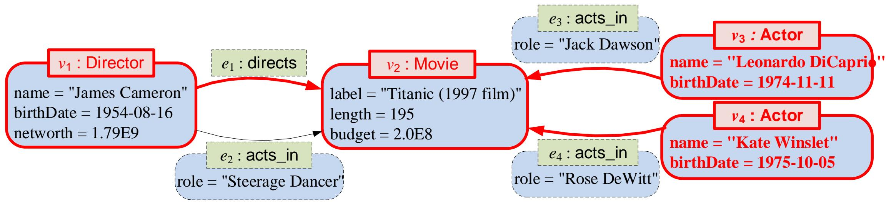

<details>
<summary>flowchart</summary>

```mermaid
graph TD
  A["v1: Director\nname = &quot;James Cameron&quot; birthDate = 1954-08-16\nnetworth = 1.79E9"] -->|e1: directs| B["v2: Movie\nlabel = &quot;Titanic (1997 film)&quot; length = 195 budget = 2.0E8"]
  A -->|e2: acts_in\nrole = "Steerage Dancer"| B
  B -->|e3: acts_in\nrole = "Jack Dawson"| C["v3: Actor\nname = &quot;Leonardo DiCaprio&quot; birthDate = 1974-11-11"]
  B -->|e4: acts_in\nrole = "Rose DeWitt"| C
  C -->|v4: Actor\nname = "Kate Winslet" birthDate = 1975-10-05| C
```
</details>

## 查询结果

```jsonl
x2
{"name":"Kate Winslet","birthDate":"1975-10-05"}
{"name":"Leonardo DiCaprio","birthDate":"1974-11-11"}
```

## 查询 8: 查询“San Zhang” 直接和间接认识的人？

MATCH (x1:Person)-[:knows\*]->(x2:Person)

WHERE x1.firstName = "San" AND x1.lastName = "Zhang" RETURN x1, x2

限制: 传递闭包算子\*只能作用在单独一个边标签

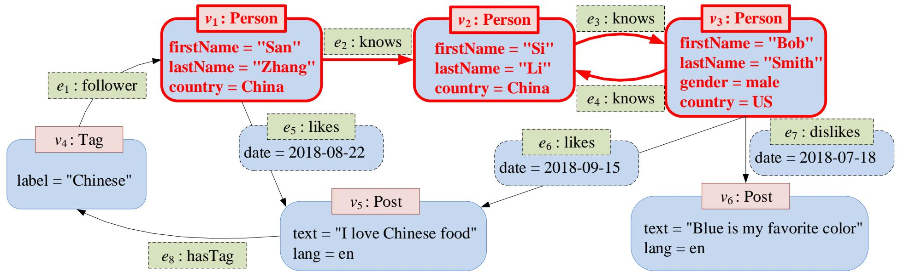

<details>
<summary>flowchart</summary>

```mermaid
graph TD
  A["v1: Person\nfirstName = &quot;San&quot;\nlastName = &quot;Zhang&quot;\ncountry = China"] -->|e2: knows| B["v2: Person\nfirstName = &quot;Si&quot;\nlastName = &quot;Li&quot;\ncountry = China"]
  B -->|e3: knows| C["v3: Person\nfirstName = &quot;Bob&quot;\nlastName = &quot;Smith&quot;\ngender = male\ncountry = US"]
  D["v4: Tag\nlabel = &quot;Chinese&quot;"] --> E["e5: likes\ndate = 2018-08-22"]
  E --> F["v5: Post\ntext = &quot;I love Chinese food&quot;\nlang = en"]
  F --> G["e6: likes\ndate = 2018-09-15"]
  G --> H["v6: Post\ntext = &quot;Blue is my favorite color&quot;\nlang = en"]
  I["e1: follower"] --> A
  J["e4: knows"] --> C
  K["e7: dislikes\ndate = 2018-07-18"] --> H
  L["e8: hasTag"] --> F
```
</details>

## 查询结果

语义: 无重复边

no-repeated-edge

<table><tr><td>x1</td><td>x2</td></tr><tr><td>{&quot;country&quot;:&quot;China&quot;,&quot;firstName&quot;:&quot;San&quot;,&quot;lastName&quot;:&quot;Zhang&quot;}</td><td>{&quot;firstName&quot;:&quot;Si&quot;,&quot;lastName&quot;:&quot;Li&quot;,&quot;country&quot;:&quot;China&quot;}</td></tr><tr><td>{&quot;country&quot;:&quot;China&quot;,&quot;firstName&quot;:&quot;San&quot;,&quot;lastName&quot;:&quot;Zhang&quot;}</td><td>{&quot;firstName&quot;:&quot;Bob&quot;,&quot;lastName&quot;:&quot;Smith&quot;,&quot;country&quot;:&quot;US&quot;,&quot;gender&quot;:&quot;male&quot;}</td></tr><tr><td>{&quot;country&quot;:&quot;China&quot;,&quot;firstName&quot;:&quot;San&quot;,&quot;lastName&quot;:&quot;Zhang&quot;}</td><td>{&quot;firstName&quot;:&quot;Si&quot;,&quot;lastName&quot;:&quot;Li&quot;,&quot;country&quot;:&quot;China&quot;}</td></tr></table>

# 属性图查询语言： Gremlin

Apache TinkerPop图计算框架  
过程式语言：图遍历、导航式游走  
更像一种函数式的编程语言接口

https://tinkerpop.apache.org/gremlin.html

## Apache TinkerPop TM

The Gremlin Graph Traversal Machine and Language

Gremlin is the graph traversal language of Apache TinkerPop. Gremlin is a functional, data-flow language that enables users to sucinctly express complex traversals on (or queries of) their application's property graph. Every Gremlin traversal is composed of a sequence of (potentialy nested) steps. A step performs an atomic operation on the data stream. Every step is either a map-step (transforming the objects in the stream), a filter-step (removing objects from the stream), or a sideEfect-step (computing statistics about the stream). The Gremlin step library extends on these 3-fundamental operations to provide users a rich collection of steps that they can compose in order to ask any conceivable question they may have of their data for Gremlin is Turing Complete.


<details>
<summary>natural_image</summary>

Green stylized animal head logo with no text or symbols
</details>

```txt
g.V().has("name", "gremlin").
out("knows").
out("knows").
values("name")
```

## What are the names of Gremlin's friends' friends?

1. Get the vertex with name "gremlin."  
2. Traverse to the people that Gremlin knows.  
3. Traverse to the people those people know.  
4. Get those people's names.


Apache TinkerPop

Download

Documentation \~

Tutorials \~


<details>
<summary>text_image</summary>

Domestic Aperture Thinker
</details>

Apache TinkerPop provides three packaged downloads per release version. The Gremlin Console and Gremlin Server downloads are binary distributions, which contain pre-packaged versions of these important TinkerPop applications that are designed to work out-of-the-box when unpackaged.The source distribution is a snapshot of the source code and files used in the building of those binary distributions.

## Current Releases


3.6.2 (latest, stable)

16-January-2023

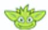

3.5.5 (maintenance)

16-January-2023

release notes 丨 upgrade 丨documentation contributors

release notes 丨upgrade 丨documentation | contributors


## Archived Releases

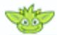

3.6.1 (18-July-2022)

release notes 丨upgrade 丨documentation contributors


## 基于TinkerPop 执行Gremlin查询示例

Download the console, unpackage it and start it:

```txt
$ unzip apache-tinkerpop-gremlin-console-3.6.2-bin.zip
$ cd apache-tinkerpop-gremlin-console-3.6.2
$ bin/gremlin.sh

\,,,/ 
(o o)

----o00o-(3)-o00o----
plugin activated: tinkerpop.server
plugin activated: tinkerpop.utilities
plugin activated: tinkerpop.tinkergraph
gremlin>
```

TIP Windows users may use the included bin/gremlin.bat file to start the Gremlin Console.

The Gremlin Console is a REPL environment, which provides a nice way to learn Gremlin as you get immediate feedback for the code that you enter. This eliminates the more complex need to "create a project" to try things out. The console is not just for "getting started", however. You willfind yourself using it for a variety of TinkerPop-related activities, such as loading data, administering graphs and working out complex traversals.

## 查询 9: 查询 James\_Cameron 执导的电影及其片名?

## SPARQL 查询 2 , Cypher 查询 6

g.V().hasLabel('Director').has('name', 'James Cameron').out('directs').values('label')

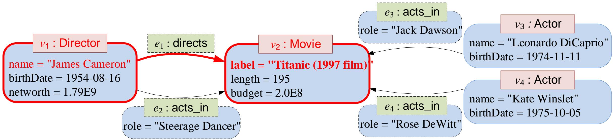

<details>
<summary>flowchart</summary>

```mermaid
graph TD
  A["v₁ : Director\nname = &quot;James Cameron&quot; birthDate = 1954-08-16\nnetworth = 1.79E9"] -->|e₁ : directs| B["label = &quot;Titanic (1997 film)&quot; length = 195\nbudget = 2.0E8"]
  A -->|e₂ : acts_in\nrole = "Steerage Dancer"| B
  B -->|e₃ : acts_in\nrole = "Jack Dawson"| C["v₃ : Actor\nname = &quot;Leonardo DiCaprio&quot; birthDate = 1974-11-11"]
  B -->|e₄ : acts_in\nrole = "Rose DeWitt"| C
```
</details>

## 查询结果

Titanic (1997 film)

Gremlin style: traversal, procedural, functional

遍历式

过程式

函数式

## 查询 10: 查询1950年之后出生的资产大于1.0E9的导演执导的电影的出演演员？

## SPARQL

查询 4,

Cypher

查询 7

g.V().hasLabel('Director').has('birthDate', gte('1950-01-01'))

.has('networth', gt(1.0E9)).out('directs').in('acts\_in').hasLabel('Actor').values('name')

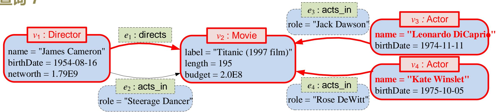

<details>
<summary>flowchart</summary>

```mermaid
graph TD
  A["v1: Director\nname = &quot;James Cameron&quot; birthDate = 1954-08-16\nnetworth = 1.79E9"] -->|e1: directs| B["v2: Movie\nlabel = &quot;Titanic (1997 film)&quot; length = 195 budget = 2.0E8"]
  A -->|e2: acts_in\nrole = "Steerage Dancer"| B
  B -->|e3: acts_in\nrole = "Jack Dawson"| C["v3: Actor\nname = &quot;Leonardo DiCaprio&quot; birthDate = 1974-11-11"]
  B -->|e4: acts_in\nrole = "Rose DeWitt"| C
  C -->|v3: Actor\nname = "Kate Winslet" birthDate = 1975-10-05| D["v4: Actor\nname = &quot;Kate Winslet&quot; birthDate = 1975-10-05"]
```
</details>

## 查询结果

Leonardo DiCaprio

Kate Winslet

## 查询 11: 列出演员“Leonardo DiCaprio”与距其多步“合作距离”演员之间的全部路径？

## SPARQL

## 查询 5

g.V().hasLabel('Actor').has('name', 'Leonardo DiCaprio').repeat( out('acts\_in').hasLabel('Movie').in('acts\_in').hasLabel('Actor') ).emit().path()

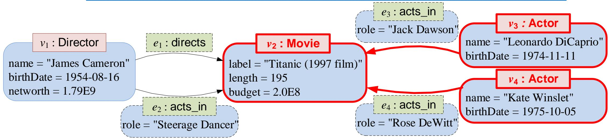

<details>
<summary>flowchart</summary>

```mermaid
graph TD
  A["v1: Director\nname = &quot;James Cameron&quot; birthDate = 1954-08-16\nnetworth = 1.79E9"] -->|e1: directs| B["v2: Movie\nlabel = &quot;Titanic (1997 film)&quot;\nlength = 195\nbudget = 2.0E8"]
  A -->|e2: acts_in\nrole = "Steerage Dancer"| B
  B -->|e3: acts_in\nrole = "Jack Dawson"| C["v3: Actor\nname = &quot;Leonardo DiCaprio&quot; birthDate = 1974-11-11"]
  B -->|e4: acts_in\nrole = "Rose DeWitt"| C
```
</details>

## 查询结果

[v[3],v[2],v[3]]

[v[3],v[2],v[4]]

[v[3],v[2],v[3],v[2],v[3]]

[v[3],ν[2],v[3],v[2],v[4]]

• 一步“合作距离"导航操作被执行了任意多次  
Gremlin默认语义: 任意路径 arbitrary paths

## 知识数据模型

◼ RDF图  
属性图

## 知识查询语言

SPARQL  
Cypher  
Gremlin

## 知识数据管理工具

Jena、Neo4j