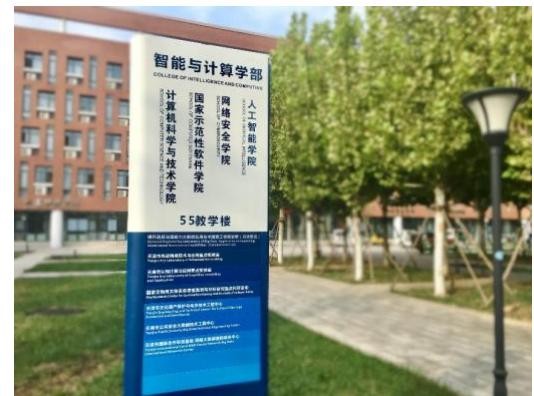
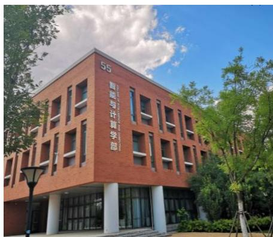
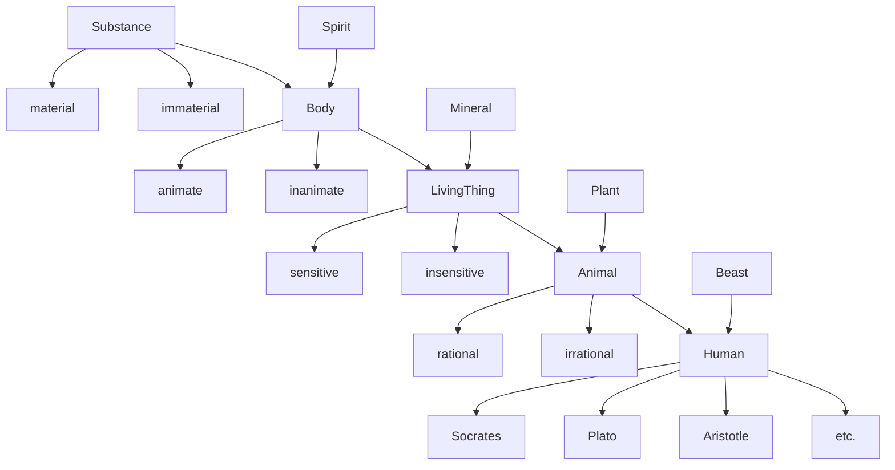
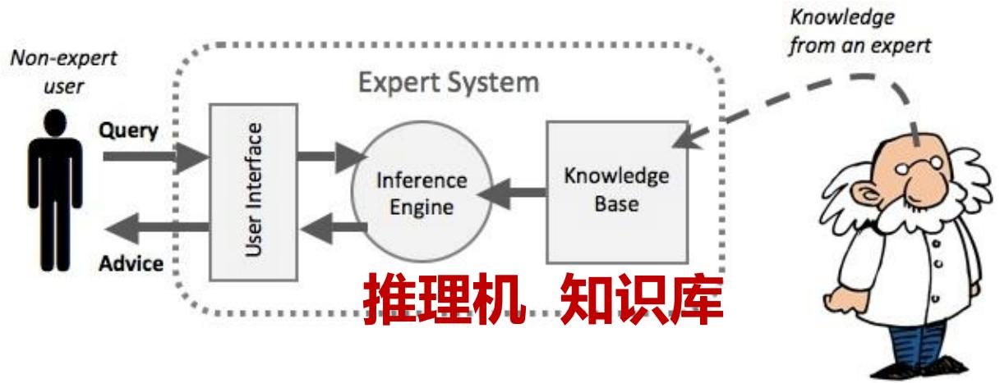
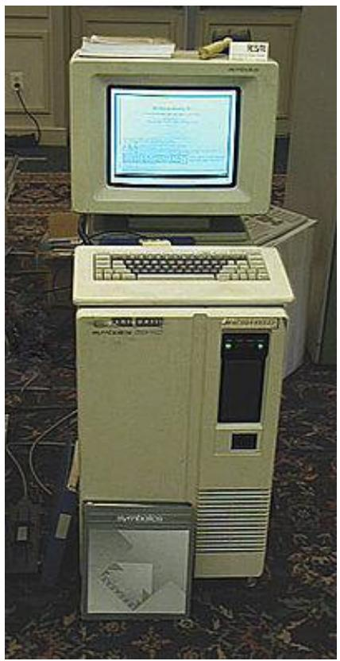

## 知识工程

## 知识表示方法



<details>
<summary>text_image</summary>

智能与计算学部
COLLEGE OF INTELLIGENCE AND TECHNOLOGY
人工智能学院
网络安全学院
国家示范性软件学院
计算机科学与技术学院
55教学楼
</details>



<details>
<summary>text_image</summary>

55
智能与计算学部
</details>

## ◼ What is a Knowledge Representation?

Role I: A KR is a Surrogate 机器对客观事物的指代  
Role II: A KR is a Set of Ontological Commitments组本体承诺和概念模型  
Role III: A KR is a Fragmentary Theory of Intelligent Reasoning 支持推理的理论基础  
◼ Role IV: A KR is a Medium for Efficient Computation用于高效计算的数据结构  
Role V: A KR is a Medium of Human Expression机器语言的人类表达方式

1 传统知识表示方法

2 基于向量的知识表示

1 传统知识表示方法

2 基于向量的知识表示

## 语义网络（Semantic Network）

## 语义网络

用有向网络结构表示概念之间的语义关系  
1956年，剑桥语言研究中心（Cambridge Language Research Unit）的计算语言学家R. H. Richens提出，用于自然语言之间进行机器翻译的中间语言（interlingua）  
◼ 1963年，计算机科学家R. F. Simmons 和 S. Klein基于一阶谓词逻辑实现了语义网络  
1963年，System Development Corporation公司计算机科学家M. Quillian在SYNTHEX项目中实现了语义网络  
1980年代末，荷兰Groningen大学和Twente大学发起“Knowledge Graphs”研究项目，实际上是一种边上有约束的语义网络  
语义网络与后来的知识图谱的概念边界逐渐模糊，2012年Google推出“Knowledge Graph”

## 语义网络（Semantic Network）

## Tree of Porphyry

The oldest known semantic network was drawn in the 3rd century AD by the Greek philosopher Porphyry in his commentary on Aristotle s categories.  
◼ Despite its age, the Tree of Porphyry represents the common core of all modern hierarchies that are used for defining concept types.


<details>
<summary>flowchart</summary>


</details>

Tree of Porphyry, as drawn by Peter of Spain (1239)

## 语义网络（Semantic Network）

## KL-ONE network

An approach proposed by Woods (1975) and implemented by Brachman (1979) in a system called Knowledge Language One (KL-ONE)  
The description logics include the features of the Tree of Porphyry as a minimum, but they usually add various extensions.  
The notation  / at the target end of the role arrows indicates value restrictions

```mermaid
graph TD
  A["Vehicle"] -->|v/r| B["Truck"]
  C["VolMeasure"] -->|v/r| B
  D["WtMeasure"] -->|v/r| B
  E["UnloadedWt"] --> B
  F["CargoCapacity"] -->|v/r| B
  G["WtMeasure"] -->|v/r| B
  H["TrailerTruck"] -->|v/r| B
  I["Trailer"] -->|v/r| B
  J["18"] --> K["Value"]
  L["Minimize"] --> M["MaxGrossWt"]
  N["NumberOfWheels"] --> O["√"]
  P["Quantity"] --> Q["√"]
  R["Weighted"] --> S["√"]
  T["Weighted"] --> U["√"]
  V["Weighted"] --> W["√"]
  X["Weighted"] --> Y["√"]
  Z["Weighted"] --> AA["√"]
  AB["TrailerTruck"] --> AC["HasPart"]
  AC --> AD["√"]
  AE["Trailer"] --> AF["√"]
  AG["TrailerTruck"] --> AH["√"]
  AI["TrailerTruck"] --> AJ["√"]
  AK["TrailerTruck"] --> AL["√"]
  AM["TrailerTruck"] --> AN["√"]
  AO["TrailerTruck"] --> AP["√"]
  AQ["TrailerTruck"] --> AR["√"]
  AS["TrailerTruck"] --> AT["√"]
  AU["TrailerTruck"] --> AV["√"]
  AW["TrailerTruck"] --> AX["√"]
  AY["Truck"] --> AZ["TrailerTruck"]
    style A fill:#f9f,stroke:#333
    style B fill:#ccf,stroke:#333
    style C fill:#ccf,stroke:#333
    style D fill:#ccf,stroke:#333
    style AE fill:#ccf,stroke:#333
    style AF fill:#ccf,stroke:#333
    style AG fill:#ccf,stroke:#333
    style AH fill:#ccf,stroke:#333
    style AI fill:#ccf,stroke:#333
    style AJ fill:#ccf,stroke:#333
    style AK fill:#ccf,stroke:#333
    style AL fill:#ccf,stroke:#333
    style AM fill:#ccf,stroke:#333
    style AN fill:#ccf,stroke:#333
```


<details>
<summary>flowchart</summary>


</details>

## 框架

由马文·闵斯基于（Marvin Minsky）1974年在其论文《表示知识的框架》（A Frameworkfor Representing Knowledge）中最早提出  
将框架定义为表示常规情景（stereotyped situation）的信息结构  
框架理论认为人类对世界的认知都是以过往经验（常规情景）为基础的，而人对新事物的认识则是对以往经验的分析与补充  
框架是一种描述对象属性的数据结构，具有槽（slot）和侧面（facet）

槽用于表示某个属性  
侧面则表示属性的不同方面  
一个框架可以有任意数目的槽，每个槽又可以有任意数目的侧面，每个侧面可以有任意数目的值

<框架名>

<table><tr><td rowspan="2">槽名A</td><td>侧面名A1</td><td>值A11,值A12,···,值A1n</td></tr><tr><td>侧面名A2</td><td>值A21,值A22,···,值A2n</td></tr><tr><td rowspan="2">槽名B</td><td>侧面名B1</td><td>值B11,值B12,···,值B1n</td></tr><tr><td>侧面名B2</td><td>值B21,值B22,···,值B2n</td></tr></table>

## 框架（Frame）

## 一个表示“男孩” 框架的示例

## 表示一个名为Alex的男孩

是“男孩”框架的一个实例  
“性别”槽的值是从父框架继 承而来的默认值  
但因为他只有一条腿，所以其“腿数量”槽的值为1，与父框架中的默认值2并不同  
另外其“年龄”槽包含了需要该值时（IF-NEEDED）才触发的一个过程附件（proceduralattachment）

<table><tr><td>槽</td><td>值</td><td>类型</td></tr><tr><td>BOY(男孩)</td><td>-</td><td>(框架名)</td></tr><tr><td>ISA(属性)</td><td>Person(人)</td><td>(父框架)</td></tr><tr><td>SEX(性别)</td><td>Male(男性)</td><td>(实例值)</td></tr><tr><td>AGE(年龄)</td><td>Under 12 yrs.(小于12岁)</td><td>(过程附件——集合约束)</td></tr><tr><td>HOME(家)</td><td>A Place(某一地点)</td><td>(另一框架)</td></tr><tr><td>NUM_LEGS(腿数量)</td><td>Default = 2 (默认值 = 2)</td><td>(从父框架“人”继承的默认值)</td></tr></table>

<table><tr><td>槽</td><td>值</td><td>类型</td></tr><tr><td>ALEX(亚历克斯)</td><td>-</td><td>(框架名)</td></tr><tr><td>NAME(名字)</td><td>Alex(亚历克斯)</td><td>(关键值)</td></tr><tr><td>ISA(属性)</td><td>Boy(男孩)</td><td>(父框架)</td></tr><tr><td>SEX(性别)</td><td>Male(男性)</td><td>(继承值)</td></tr><tr><td>AGE(年龄)</td><td>IF-NEEDED(如需):Subtract(current,BIRTHDATE);</td><td>(过程附件)</td></tr><tr><td>HOME(家)</td><td>100 Main St.(主街100号)</td><td>(实例值)</td></tr><tr><td>BIRTHDATE(出生日期)</td><td>8/4/2000(2000年8月4日)</td><td>(实例值)</td></tr><tr><td>FAVORITE_FOOD(喜爱食物)</td><td>Spaghetti(意大利面)</td><td>(实例值)</td></tr><tr><td>CLIMBS(攀爬)</td><td>Trees(树)</td><td>(实例值)</td></tr><tr><td>BODY_TYPE(身体类型)</td><td>Wiry(结实)</td><td>(实例值)</td></tr><tr><td>NUM_LEGS(腿数量)</td><td>1</td><td>(例外)</td></tr></table>

## 产生式系统（Production system）

## 产生式系统

由一组关于行为的规则组成。这些规则被称为“产生式（Production） =  
用于自动规划与调度、专家系统和动作选择中的一种基础知识表示形式  
产生式由两个部分组成：感知前提（或“IF”语句）和动作（“THEN”）

如果某条产生式的前提与当前世界状态相匹配，那么就称这条产生式被触发（triggered）  
如果某条产生式的动作被执行，则称它触发成功（fired）  
个产生式系统通常还包含一个数据库，有时叫做工作记忆（working memory），用于维护关于当前状态或当前知识的数据；并且包含一个规则解释器（rule interpreter）  
规则解释器通常执行前向链（forward chaining）算法，以选择要执行的产生式来满足当前的目标。系统会将每条规则中条件部分（左侧，LHS）与工作记忆中的当前状态进行匹配。  
任何被触发的条件都应该被执行；由此带来的后续行为（动作部分，右侧，RHS）将更新智能体的知识，即向工作记忆中移除或添加数据  
系统会在以下几种情况之一时停止处理：用户中断了前向链循环、已经执行了给定数量的循环、执行了“halt”操作的RHS，或者没有任何规则的前提可被满足

## 产生式系统（Production system）

## 产生式系统

◼ 一组产生式规则，用于反转一个字符串，且该字符串的字母表不包含符号“\$”和 =\*"因为这两个符号被用作标记符号）  
在该示例中，产生式规则的测试按照它们在规则列表中的先后顺序进行。对于每条规则，会从左到右地用一个滑动窗口来检查输入字符串，直到找到与规则左侧（LHS）相匹配的子串一旦找到匹配，输入字符串中的这段匹配子串就会被规则右侧（RHS）所替换  
在这个系统中，x和y是匹配输入字符串字母表中任意字符的变量。完成替换后，匹配过程会从规则P1重新开始

$\mathsf { P 1 } \colon \$ \mathsf { S } \mathsf { S } \to \mathsf { * }$  
$\mathsf { P 2 } \colon ^ { * } \$ 3 ^ { * }$  
$\mathsf { P 3 } \colon \mathsf { ^ { * } x } \to \mathsf { x } ^ { * }$  
$\mathsf { P 4 } ; \mathrel { \ast } \mathrel { \phantom { = } } \mathrm { \sim } \mathsf { n u l l } \mathrm { \& h a l t }$  
$\mathsf { P 5 } \colon \$ 5\mathsf { x y }  \mathsf { y }\mathsf { S } \mathsf { x }$  
$p 6 \colon \mathsf { n u l l }  \mathsf { S }$

字符串"ABC"在该产生式系统中会经历如下的转换序列

$\mathsf { A B C } \Rightarrow \mathsf { S A B C }$ (P6)

$\$ 4 B C \Rightarrow B S A C$ (P5)

${ \mathsf { B S A C } } \to { \mathsf { B C S A } }$ (P5)

$\mathsf { B C S A } \Rightarrow \mathsf { S B C S A }$ (P6)

$\$ 80,456$ (P5)

$\mathsf { C S B S A } \Rightarrow \mathsf { S C S B S A }$ (P6)

\$C\$B\$A → \$\$C\$B\$A (P6)

\$\$C\$B\$A → \*C\$B\$A (P1)

$^ { * } \mathrm { C S B S A }  \mathrm { C ^ { * } S B S A }$ (P3)

$\mathsf { C } ^ { \ast } \mathsf { S B } \mathsf { S } \mathsf { A } \to \mathsf { C } ^ { \ast } \mathsf { B } \mathsf { S } \mathsf { A }$ (P2)

$\mathsf { C } ^ { \ast } \mathsf { B } \mathsf { S } \mathsf { A } \to \mathsf { C } \mathsf { B } ^ { \ast } \mathsf { S } \mathsf { A }$ (P3)

$\mathsf { C B } ^ { * } \$ \mathsf { A } \to \mathsf { C B } ^ { * } \mathsf { A }$ (P2)

$\mathsf { C B } ^ { * } \mathsf { A } \to \mathsf { C B A } ^ { * }$ (P3)

$\mathsf { C B A ^ { * } } \to \mathsf { C B A }$ (P4)

## 产生式系统（Production system）

## 产生式系统

## 一条 OPS5 产生式规则示例

```txt
(p Holds::Object-Ceiling
{(goal ^status active ^type holds ^objid <01>) <goal>}
{(physical-object
^id <01>
^weight light
^at <p>
^on ceiling) <object-1>}
{(physical-object ^id ladder ^at <p> ^on floor) <object-2>}
{(monkey ^on ladder ^holds NIL) <monkey>}
-(physical-object ^on <01>)
-->
(write (crlf) Grab <01> (crlf))
(modify <object1> ^on NIL)
(modify <monkey> ^holds <01>)
(modify <goal> ^status satisfied)
)
```

数据结构名（如“goal”或“physical-object”）出现在条件的第一个字面量中

结构的字段用 “^”来标识  
符号“-”代表一个负条件

在OPS5中，产生式规则可以匹配所有符合条件且满足变量绑定的结构实例。如果有若干个物体都挂在天花板上，并且每个物体旁边都有梯子，梯子上还有一只空手的猴子，那么来自同一个产生式规则“Holds::Object-Ceiling”的多个匹配实例就会同时出现在冲突集中。此后，在冲突消解步骤中才会决定究竟选哪条产生式实例触发

由在LHS模式匹配所得到的变量绑定，将在RHS中被使用以引用要被修改的数据。工作记忆里还包含一种“goal”数据结构，显式地用于控制结构。在例子中，一旦猴子抓到天花板上悬挂的物体，这个目标的状态就会被设为“satisfied”使其不再满足第一条条件，从而该规则也就不再适用

## 逻辑程序设计 （Logic Programming）

种编程范式（paradigm），设置答案须符合的规则来解决问题，而非设置步骤来解决问题  
一个逻辑程序由一组逻辑形式的句子组成，表示关于某个问题领域的知识  
通过对这些知识应用逻辑推理来执行计算，从而在该领域内解决问题  
◼ 主要的逻辑程序设计语言

Prolog  
ASP（Answer Set Programming, ASP）  
Datalog

规则通常写成如下形式的子句

$A : - B _ { 1 } , . . . , B _ { n }$

查询（或称目标）与规则体的语法相同，通常写成下列形式：$? - \textsf { B } _ { 1 } , . . . , \textsf { B } _ { \Pi }$ ?- B ,

$A : - B _ { 1 } , . . . , B _ { n }$ 可以理解为：要解决 $\mathsf { A } ,$ ，需要先解决 $\mathsf { B } _ { 1 }$ ，再解决 $\mathsf { B } _ { 2 } , \ldots ,$ ，直到 $\mathsf { B } _ { \mathsf { n } }$

为符合逻辑形式的声明性语句：A 如果 $\mathsf { B } _ { 1 }$ 且 … 且 $\mathsf { B } _ { \mathsf { n } }$

其中，A 被称为规则的头部（head）， $\textsf { B } _ { 1 } , . . . , \textsf { B } _ { \mathrm { n } }$ 被称为规则的体（body）

每个 $B _ { i }$ 都被称为文字（literals）或条件（conditions）。当 n=0 时，该规则称为事实（fact）

## 逻辑程序设计（Logic Programming）

## 一个示例

```prolog
mother_child(elizabeth, charles).
father_child(charles, william).
father_child(charles, harry).
parent_child(X, Y) :-
    mother_child(X, Y).
parent_child(X, Y) :-
    father_child(X, Y).
grandparent_child(X, Y) :-
    parent_child(X, Z),
    parent_child(Z, Y).
```

## 给定某个查询时，该程序会生成答案

对查询 ?- parent\_child(X, william).

答案是：X = charles

```txt
?- grandparent_child(X, william).
X = elizabeth
```

```prolog
?- grandparent_child(elizabeth, Y).
Y = william;
Y = harry.
```

```txt
?- grandparent_child(X, Y).
X = elizabeth, Y = william;
X = elizabeth, Y = harry.
```

```txt
?- grandparent_child(william, harry).
no
```

```prolog
?- grandparent_child(elizabeth, harry).
yes
```

## 逻辑程序设计（Logic Programming）

## 一个示例

```prolog
mother_child(elizabeth, charles).
father_child(charles, william).
father_child(charles, harry).
parent_child(X, Y) :-
    mother_child(X, Y).
parent_child(X, Y) :-
    father_child(X, Y).
grandparent_child(X, Y) :-
    parent_child(X, Z),
    parent_child(Z, Y).
```

## 定义兄弟姐妹（sibling）关系会用到负条件（negative condition）

```prolog
sibling(X, Y) :-
parent_child(Z, X),
parent_child(Z, Y),
not(X = Y).
```

## 包含有负条件的逻辑程序语言具有非单调逻辑（non-monotonic logic）的知识表示能力

## 算法 = 逻辑 + 控制 （Algorithm = Logic + Control）

将逻辑程序视为目标-子目标的反向推理过程  
将逻辑（知识的声明式表示）与控制（求解搜索策略）相结合并实现算法  
可以针对同一逻辑表示应用不同的问题求解策略，得到不同的算法  
或通过改变逻辑表示，在相同的问题求解策略下生成不同的算法

## 两种主要的问题求解策略

反向推理 backward reasoning（目标约简，goal reduction）（top-down 自顶向下）  
应用：逻辑程序设计语言 Prolog  
正向推理 forward reasoning（bottom-up 自底向上）  
应用：专家系统  
目标 → 数据  
数据 → 目标

## 逻辑程序设计用于知识表示

## 《中华人民共和国国籍法》

第4条 父母双方或一方为中国公民，本人出生在中国，具有中国国籍。

```prolog
initiates(birth(Person), citizen(Person, China)) :- time_of(birth(Person), Time), place_of(birth(Person), China), parent_child(Another_Person, Person), holds(citizen(Another_Person, China), Time)
```

## 法律条文具有较强逻辑性，适合使用逻辑程序设计进行形式化表达

在Prolog之上，早期就出现了APES等专家系统外壳。其中一个面向法律领域的早期案例是：将英国《国籍法》的大部分内容编码为逻辑程序语言。“英国国籍法于1981年通过，不久后便被用来展示AI技术和逻辑形式化能有效地处理新生法律。”有名的论文《The British Nationality Act as a LogicProgram》（1986）也成为AI+法律领域后续研究的里程碑。

## Datalog 语言

◼ 逻辑程序设计语言Prolog的一个子集是一种数据库定义语言，把关系型数据库的视角与逻辑程序设计结合  
Datalog 用逻辑连结符在规则体中直接定义数据库中的关系  
很早人们就发现关系代数或关系演算难以表达递归查询，而使用极小不动点（least-fixed-point operator）可以解决。逻辑程序可自然表达递归关系，无需额外逻辑运算符。

Datalog 跟更通用的逻辑程序设计不同之处在于只能使用常量和变量作为项；所有事实都是无变量的，而规则也会限定，如果按自底向上执行，生成的新事实也无变量。

```prolog
mother_child(elizabeth, charles).
father_child(charles, william).
father_child(charles, harry).

parent_child(X, Y) :-
    mother_child(X, Y).
parent_child(X, Y) :-
    father_child(X, Y).

ancestor_descendant(X, Y) :-
    parent_child(X, X).
ancestor_descendant(X, Y) :-
    ancestor_descendant(X, Z),
ancestor_descendant(Z, Y).
```

自底向上执行将推导出下列事实，并终止：

```prolog
parent_child(elizabeth, charles).
parent_child(charles, william).
parent_child(charles, harry).
ancestor_descendant(elizabeth, charles).
ancestor_descendant(charles, william).
ancestor_descendant(charles, harry).
ancestor_descendant(elizabeth, william).
ancestor_descendant(elizabeth, harry).
```

## ASP （Answer Set Programming）回答集程序设计

与 Datalog 类似，均非图灵完备，且会将所有子句与目标整体视为一个问题，通过生成“稳固模型（stable model）”来求解。

示例：着色两个国家（oz 和 iz）为红绿两色的简化版本（map coloring）：

```prolog
country(oz).
country(iz).
adjacent(oz, iz).
colour(C, red) :- country(C), not(colour(C, green)).
colour(C, green) :- country(C), not(colour(C, red)).
```

有四个解，对应四个稳定模型：

```prolog
country(oz). country(iz). adjacent(oz, iz). colour(oz, red). colour(iz, red).
country(oz). country(iz). adjacent(oz, iz). colour(oz, green). colour(iz, green).
country(oz). country(iz). adjacent(oz, iz). colour(oz, red). colour(iz, green).
country(oz). country(iz). adjacent(oz, iz). colour(oz, green). colour(iz, red).
```

## ASP （Answer Set Programming）回答集程序设计

与 Datalog 类似，均非图灵完备，且会将所有子句与目标整体视为一个问题，通过生成“稳固模型（stable model）”来求解。

示例：着色两个国家（oz 和 iz）为红绿两色的简化版本（map coloring）：

```prolog
country(oz).
country(iz).
adjacent(oz, iz).
colour(C, red) :- country(C), not(colour(C, green)).
colour(C, green) :- country(C), not(colour(C, red)).
```

若要限制相邻国家不能相同颜色，在 ASP 中可写一个约束子句：

```prolog
:- country(C1), country(C2), adjacent(C1, C2), colour(C1, X), colour(C2, X).
```

此处的 “:- Body” 称为约束，会排除 Body 为真所导致的模型

在 ASP 中的“约束”是用来剔除不满足约束的模型

这样就只剩两个解：

```prolog
country(oz). country(iz). adjacent(oz, iz). colour(oz, red). colour(iz, green).
country(oz). country(iz). adjacent(oz, iz). colour(oz, green). colour(iz, red).
```

## ASP （Answer Set Programming）回答集程序设计

与 Datalog 类似，均非图灵完备，且会将所有子句与目标整体视为一个问题，通过生成“稳固模型（stable model）”来求解。

示例：着色两个国家（oz 和 iz）为红绿两色的简化版本（map coloring）：

```prolog
country(oz).
country(iz).
adjacent(oz, iz).
colour(C, red) :- country(C), not(colour(C, green)).
colour(C, green) :- country(C), not(colour(C, red)).
```

若要限制相邻国家不能相同颜色，在 ASP 中可写一个约束子句：

```prolog
:- country(C1), country(C2), adjacent(C1, C2), colour(C1, X), colour(C2, X).
```

此处的 “:- Body” 称为约束，会排除 Body 为真所导致的模型

在 ASP 中的“约束”是用来剔除不满足约束的模型

这样就只剩两个解：

```prolog
country(oz). country(iz). adjacent(oz, iz). colour(oz, red). colour(iz, green).
country(oz). country(iz). adjacent(oz, iz). colour(oz, green). colour(iz, red).
```

## 专家系统 Expert Systems

可以看作是一类具有专门知识和经验的计算机智能程序系统  
◼ 采用人工智能中的知识表示和知识推理技术来模拟通常由领域专家才能解决的复杂问题

## 专家系统=知识库+推理机

一个专家系统必须具备三要素

1. 领域专家级知识  
2. 模拟专家思维  
3. 达到专家级的水准



<details>
<summary>flowchart</summary>


</details>

◼ 专家系统是第一批真正成功的人工智能应用系统

它们诞生于20世纪70年代，并在80年代大量涌现  
当时常被视为AI的未来——直到成功的人工神经网络出现后才逐渐退居二线



<details>
<summary>text_image</summary>

Vintage computer setup with monitor displaying text and printed notes, placed on carpeted floor
</details>

## 专家系统 Expert Systems

一个专家系统通常分为两个子系统

知识库（knowledge base）：其中存储着事实与规则  
推理引擎（inference engine）：将规则应用于已知事实以推导出新事实，并可以包含解释和调试功能

## 早期发展

让这些机器像人类一样思考——尤其是让它们能像人类一样做出重要决策  
医学–健康领域提出了诱人的前景：让这些机器进行医学诊断决策  
◼ 医学领域的 MYCIN 专家系统、Internist-I 专家系统，以及稍后在80年代中期出现的CADUCEUS

## 正式引入与后续发展

正式意义上的专家系统于1965年由斯坦福大学启发式编程项目（Stanford Heuristic Programming Project）提出，Edward Feigenbaum（被称为“专家系统之父”）是该项目的领军人物  
斯坦福的研究人员寻找了高度复杂且对专业知识需求高的领域，如传染病诊断（Mycin）和有机分子识别（Dendral）  
Feigenbaum当时的观点是「智能系统的强大之处来源于其所拥有的知识，而非其使用的形式主义或推理机制」 这是当时的一大进步  
因为之前的研究多侧重于启发式计算方法，试图研发通用型问题求解器（主要是Allen Newell与Herbert Simon的合作成果）


<details>
<summary>natural_image</summary>

Portrait of an elderly man in a suit and tie, wearing glasses (no text or symbols visible)
</details>

Edward Feigenbaum

费根鲍姆

（1936年-）

专家系统之父

1994年图灵奖得主

## 正式引入与后续发展

在20世纪80年代，专家系统迎来大爆发。多所大学开设了专家系统课程，而世界财富500强企业中有三分之二在日常业务中应用了这一技术  
日本开展了第五代计算机系统项目（Fifth Generation Computer Systems）  
SID软件程序（Synthesis of Integral Design）是首个被用于大型产品设计的专家系统，诞生于1982年，用Lisp编写，用于生成VAX 9000 CPU中的93%逻辑门。出人意料的是，这些规则的组合最终给出的整体设计有时超出了人类专家的能力，并在很多方面表现优于人工设计  
◼ 之前专家系统种种局限促使研究者寻找新的人工智能方法，尤其是机器学习、数据挖掘和反馈机制  
◼ 现代系统更易于整合和更新新知识，因此能够更轻松地自我更新，对海量复杂数据进行更深入的泛化处理，使用基于神经网络的机器学习模型进行推理。人们将这些类型的专家系统称作“智能系统（intelligent systems）

## 应用

Hayes-Roth 将专家系统的应用分为下表所示的10类

<table><tr><td>类别</td><td>所解决的问题</td><td>示例</td></tr><tr><td>Interpretation(解释)</td><td>从传感器数据中推断情境描述</td><td>Hearsay(语音识别)、PROSPECTOR</td></tr><tr><td>Prediction(预测)</td><td>推断给定情境可能的后果</td><td>Preterm Birth Risk Assessment[68]</td></tr><tr><td>Diagnosis(诊断)</td><td>根据观测结果推断系统故障</td><td>CADUCEUS、MYCIN、PUFF、Mistral[69]、Eydenet[70]、Kaleidos[71]、GARVAN-ES1[72][73][74]</td></tr><tr><td>Design(设计)</td><td>在约束条件下配置对象</td><td>Dendral、Mortgage Loan Advisor、R1(DEC VAX配置)、SID(DEC VAX 9000 CPU)</td></tr><tr><td>Planning(规划)</td><td>设计行动</td><td>为自主水下航行器做任务规划[75]</td></tr></table>

<table><tr><td>Monitoring(监控)</td><td>将观测和计划做对比,识别异常与漏洞</td><td>REACTOR[76]</td></tr><tr><td>Debugging(调试)</td><td>针对复杂问题提供增量式解</td><td>SAINT、MATHLAB、MACSYMA</td></tr><tr><td>Repair(修复)</td><td>实施补救计划</td><td>有毒溢出危机管理(Toxic Spill Crisis Management)</td></tr><tr><td>Instruction(教学)</td><td>诊断、评估并纠正学生行为</td><td>SMH.PAL[77]、Intelligent Clinical Training[78]、STEAMER[79]</td></tr><tr><td>Control(控制)</td><td>解释、预测、修复并监测系统行为</td><td>实时过程控制[80]、航天飞机任务控制[81]、复合材料智能热压罐固化[82]</td></tr></table>