## 知识工程

## 知识表示方法

text_image

智能与计算学部
COLLEGE OF INTELUS COUNCING AND TECHNOLOGY
人工智能学院
网络安全学院
国家示范性软件学院
计算机科学与技术学院
55教学楼

text_image

55
智能与计算学部

1 传统知识表示方法

2 基于向量的知识表示

1 传统知识表示方法

2 基于向量的知识表示

## 知识图谱嵌入（Knowledge graph embedding）

知识图谱嵌入（KGE, 也叫知识表示学习 KRL）是一个基于机器学习的任务，旨在在保持语义意义（semantic meaning）的同时，将知识图谱中的实体和关系学习到低维向量表示中  
借助这种嵌入表示，可以在知识图谱上执行多种应用，如：

flowchart

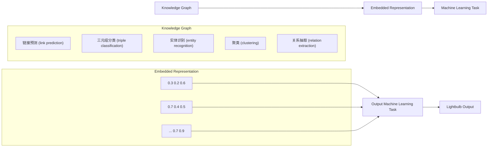
```mermaid
graph LR
  A["Knowledge Graph"] --> B["Embedded Representation"]
  B --> C["Machine Learning Task"]
    
    subgraph Knowledge Graph
        D["链接预测 (link prediction)"]
        E["三元组分类 (triple classification)"]
        F["实体识别 (entity recognition)"]
        G["聚类 (clustering)"]
        H["关系抽取 (relation extraction)"]
    end
    
    subgraph Embedded Representation
        I["0.3 0.2 0.6"]
        J["0.7 0.4 0.5"]
        K["... 0.7 0.9"]
    end
    
  I --> L["Output Machine Learning Task"]
  J --> L
  K --> L
  L --> M["Lightbulb Output"]
```

## 知识图谱

个知识图谱由实体（entities）、关系（relations）和事实（facts）组成

$$
G = \{E, R, F \}
$$

?? 实体集合、 ??关系集合、 ??事实集合

一个事实表示为三元组 $( h , r , t ) \in F$

表示在头实体（head） ℎ ∈ ?? 和尾实体（tail） $t \in E$ 之间存在关系（relation） $r \in R$

在实际应用中使用知识图谱的问题：

数据稀疏（sparsity of data） （如邻接矩阵表示）  
高计算开销 （computational inefficiency）

## 知识图谱

个知识图谱由实体（entities）、关系（relations）和事实（facts）组成

$$
G = \{E, R, F \}
$$

?? 实体集合、 ??关系集合、 ??事实集合

一个事实表示为三元组 $( h , r , t ) \in F$

表示在头实体（head） ℎ ∈ ?? 和尾实体（tail） $t \in E$ 之间存在关系（relation） $r \in R$

知识图谱嵌入（knowledge graph embedding）

是一个函数，将每个实体和关系都映射（或翻译 translate）成给定维度的向量（称为嵌入维度embedding dimension）

## 知识图谱

知识图谱嵌入（knowledge graph embedding）

是一个函数，将每个实体和关系都映射（或翻译 translate）成给定维度的向量（称为嵌入维度embedding dimension）

一个知识图谱嵌入主要由四个方面来刻画

表示空间（Representation space）：即实体和关系嵌入后所在的低维空间  
打分函数（Scoring function）：评价嵌入后某个三元组表示是否“合理”的度量方法  
编码模型（Encoding models）：定义了实体和关系的嵌入表示如何互相作用或结合  
附加信息（Additional information）：可用于丰富嵌入表示的图谱中附加信息（通常会将这种额外信息的打分项集成到通用的打分函数内）

## 嵌入过程 （Embedding procedure）

## 所有创建知识图谱嵌入的算法大体遵循相似的流程

1. 将嵌入向量随机初始化  
2. 利用训练集中包含的三元组，进行多次迭代来优化这些向量  
在每次迭代中，会从训练集中采样一个批量（batch），  
对其中的一些三元组做“破坏（corrupt）”处理  
也就是用错误的实体替换三元组中的头或尾（或者两者）来构造一个假三元组，从而保证它在真实知识图谱中并不成立

3. 将原始三元组和破坏过的三元组共同放入训练中，优化打分函数

4. 当达到某种停止条件（例如避免过拟合）时，就停止迭代

学到的嵌入应能捕捉到三元组的语义信息，并能对未见过的真实三元组进行较好的预测

## 嵌入过程 （Embedding procedure）

## ◼ 嵌入过程伪代码

algorithm Compute entity and relation embeddings
input: The training set $S = \{(h, r, t)\}$ ,
    entity set $E$ ,
    relation set $R$ ,
    embedding dimension $k$ output: Entity and relation embeddings

initialization: the entities $e$ and relations $r$ embeddings (vectors) are randomly initialized

while stop condition do $S_{batch} \leftarrow sample(S, b)$ // Sample a batch from the training set
    for each $(h, r, t)$ in $S_{batch}$ do $(h', r, t') \leftarrow sample(S')$ // Sample a corrupted fact $T_{batch} \leftarrow T_{batch} \cup \{((h, r, t), (h', r, t'))\}$ end for
    Update embeddings by minimizing the loss function
end while

## 评估指标（Performance indicators）

用于衡量模型学得的知识图谱嵌入质量  
??： the set of all ranked predictions of a model 模型预测项的排序编号的集合  
Hits@K（H@K）

在前K个预测项中，模型找对正确答案的概率  
通常K=10  
反映一个嵌入模型能正确预测两个给定实体之间关系的准确率  
数值越大说明模型预测性能越好

$$
\text { Hits@K } = \frac {| \{q \in Q : q <   k \} |}{| Q |} \in [ 0, 1 ]
$$

Mean rank （MR）

模型预测结果在所有可能答案中的平均排名位置  
数值越小越好

$$
M R = \frac {1}{| Q |} \sum_ {q \in Q} q
$$

◼ Mean reciprocal rank （MRR）

对每个正确预测，根据其排序位置的倒数进行度量  
如果第一名就正确则加1，如果第二名才正确则加1/2，以此类推  
数值越小越好

$$
M R R = \frac {1}{| Q |} \sum_ {q \in Q} \frac {1}{q} \in [ 0, 1 ]
$$

## 应用

## ◼ 机器学习任务

1. 知识图谱补全（Knowledge graph completion，KGC）指根据嵌入后的知识图谱来“推断或补全”缺失的实体或关系

◼ 实体预测（从已知的另一个实体与关系中推测要连接的实体）  
◼ 关系预测（已知两实体后预测它们之间最有可能的关系）

2. 三元组分类（Triple classification）

◼ 这是一个二分类问题：给定三元组，利用嵌入模型得出的得分，判断该三元组是否为真  
◼ 具体做法是在模型得分的基础上设定一个阈值区分真/假

3. 聚类（Clustering）

◼ 对非常稀疏的知识图谱进行嵌入后，可以将相似语义的实体在低维向量空间中聚类到一起

## 应用

## ◼ 现实应用

1. 推荐系统（recommender systems）

◼ 推荐系统中，有些模型需要大量用户反馈数据才能做好推荐。但若使用知识图谱嵌入结合已有的先验知识，可减少对用户数据的依赖

药物重定位（drug repurposing）

◼ 人们有时会将已批准药物用于新的病症。若我们构建了生物医学知识图谱，通过嵌入和链接预测，就可能找到已存在的药物与新疾病间的潜在联系

3. 社会网络分析（social network analysis）

## 模型（Models）

给出一组三元组 { ℎ, ??,?? }，嵌入模型会给图谱中每个实体和关系都生成一个连续向量表示  
令 ??、??、?? 分别是三元组中 ℎ 、??、?? 的嵌入向量， $\mathbf { h } , \mathbf { t } \in \mathbb { R } ^ { d } , \quad \mathbf { r } \in \mathbb { R } ^ { k }$ ，?? 和 ?? 分别为实体与关系的嵌入维度  
打分函数 ??(??, ??,??) 用来测量 ?? + ?? 与 ?? 之间的距离/相似度，表示该三元组嵌入的合理性

## 模型的主要分类

张量分解模型  
（Tensor decomposition models）RESCAL、

几何模型  
（Geometric models）  
TransE

深度学习模型

（Deep learning models）

ConvE

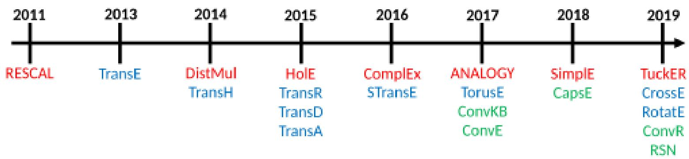

timeline chart

| Year | Model Name                  | Start Date   | End Date   |
|------|------------------------------|--------------|------------|
| 2011 | RESCAL                       | 2011         | 2013       |
| 2013 | TransE                       | 2013         | 2014       |
| 2014 | DistMul TransH              | 2014         | 2015       |
| 2015 | HolE TransR TransD TransA | 2015         | 2016       |
| 2016 | ComplEx STransE             | 2016         | 2017       |
| 2017 | ANALOGY TorusE ConvKB ConvE | 2017         | 2018       |
| 2018 | Simple CapsE                 | 2018         | 2019       |
| 2019 | TuckER CrossE RotatE ConvR RSN | 2019         | —          |

## 张量分解模型 （tensor decomposition models）

此类方法将知识图谱表示为一个多维矩阵（张量），并进行分解，从而得到低维向量的嵌入  
由于实际知识图谱通常有很多缺失信息，构建的三阶（3D）张量内大量条目为空，分解就相对简单，并且不需预先了解图结构  
但它们在面对超大规模图谱时仍会遇到维度高、稀疏的问题

RESCAL 模型  
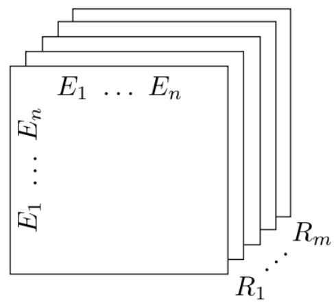

text_image

E₁ ... Eₙ
E₁ ... Eₙ
Rₘ
R₁

Figure 1: Tensor model for relational data. $E _ { 1 } \cdots E _ { n }$ denote the entities, while $R _ { 1 } \cdots R _ { m }$ denote the relations in the domain

$$
\mathcal {X} _ {k} \approx A R _ {k} A ^ {T}, \text {   for   } k = 1, \dots , m
$$

$$
\min _ {A, R _ {k}} f (A, R _ {k}) + g (A, R _ {k})
$$

$$
f (A, R _ {k}) = \frac {1}{2} \left(\sum_ {k} \| \mathcal {X} _ {k} - A R _ {k} A ^ {T} \| _ {F} ^ {2}\right)
$$

$$
g (A, R _ {k}) = \frac {1}{2} \lambda \left(\| A \| _ {F} ^ {2} + \sum_ {k} \| R _ {k} \| _ {F} ^ {2}\right)
$$

## 几何模型 （Geometric models）

该类方法把关系视作在几何空间上的变换：要得到tail的嵌入，就对head的嵌入施加某个几何变换，然后用距离函数来衡量三元组的可行性  
其中一个重要思路是 平移类（translational）模型，这种方法基于“平移不变性”概念

TransE 模型  

text_image

h
t
r

TransEModel

$$
\mathbf {h} + \mathbf {r} \approx \mathbf {t}
$$

(Beijing, isCapitalOf, China)

Beijing 实体就不再是一个离散的符号，而是一个连续空间中的低维向量如：[0.01, 0.04, 0.8, 0.32, 0.09, 0.18]，向量的维度无统一标准，一般取50\~200

目标是学得所有实体和关系的嵌入，一个正确的三元组的嵌入之间会有??+?? ≈ ??的关系，而错误的三元组之间不会有这个关系  
如果从实体 ?? 出发，通过“平移”关系 ?? ，就应该能够到达实体 ?? 附近

## TransE 模型 由Bordes等人于2013年提出

将实体和关系都映射到同一个向量空间 ℝ??

$$
\mathbf {h} + \mathbf {r} \approx \mathbf {t}
$$

如果三元组 (ℎ, ??,??) 在知识图谱中是正确的，那么头实体向量 ?? 与关系向量 ??的向量和，应当与尾实体向量 ?? 尽可能地接近

为衡量“接近程度”，需要定义一个打分函数。使用向量距离，即L1 范数或 L2 范数

$$
d (\mathbf {h} + \mathbf {r}, \mathbf {t}) = \left\{ \begin{array}{l l} \| \mathbf {h} + \mathbf {r} - \mathbf {t} \| _ {1} & (\text {L1范数}) \\ \| \mathbf {h} + \mathbf {r} - \mathbf {t} \| _ {2} & (\text {L2范数}) \end{array} \right.
$$

如果三元组在知识图谱中是真实存在的，则希望这个距离越小越好；如果三元组是负例（即知识图谱中不存在或不正确），就希望这个距离越大越好

## TransE 模型 目标函数与训练方式

## 采用了 基于边际的损失函数（margin loss）进行训练

从知识图谱中抽取正例三元组 $( h , r , t )$  
通过替换头实体或尾实体来生成对应的负例三元组 $( h ^ { \prime } , r , t )$ 或 $( h , r , t ^ { \prime } )$  
在训练集中，每个正例三元组 (ℎ, ??,??) 会对应至少一个负例 $( h ^ { \prime } , r , t )$ 或 $( h , r , t ^ { \prime } )$

TransE 的目标函数

$$
\mathcal {L} = \sum_ {(h, r, t) \in S} \sum_ {(h ^ {\prime}, r, t ^ {\prime}) \in S ^ {\prime}} [ \gamma + d (\mathbf {h} + \mathbf {r}, \mathbf {t}) - d (\mathbf {h} ^ {\prime} + \mathbf {r}, \mathbf {t} ^ {\prime}) ] _ {+}
$$

?? 表示训练集中的正例三元组集合， ??′ 表示与正例三元组对应的负例三元组集合  
?? 表示边际（margin），是一个超参数，用来控制正例和负例之间的距离差异要达到多少才算“正确区分”  
. ?? ∙ 表示距离度量（L1 或 L2）  
• $[ x ] _ { + }$ 表示 max(0, ??) 运算

## TransE 模型 目标函数与训练方式

TransE 的目标函数

$$
\mathcal {L} = \sum_ {(h, r, t) \in S} \sum_ {(h ^ {\prime}, r, t ^ {\prime}) \in S ^ {\prime}} [ \gamma + d (\mathbf {h} + \mathbf {r}, \mathbf {t}) - d (\mathbf {h} ^ {\prime} + \mathbf {r}, \mathbf {t} ^ {\prime}) ] _ {+}
$$

?? 表示训练集中的正例三元组集合， ??′ 表示与正例三元组对应的负例三元组集合  
?? 表示边际（margin），是一个超参数，用来控制正例和负例之间的距离差异要达到多少才算“正确区分”  
?? ∙ 表示距离度量（L1 或 L2）， $[ x ] _ { + }$ 表示 $\operatorname* { m a x } ( 0 , x )$ 运算

## 目标函数的含义

• 对每个正例 $( h , r , t )$ ，我们都希望 $d ( \mathbf { h } + \mathbf { r } , \mathbf { t } )$ 足够小  
• 与之对应的负例 $( h ^ { \prime } , r , t )$ 或 $( h , r , t ^ { \prime } )$ 中，模型希望 $d (  { \mathbf { h } } ^ { \prime } +  { \mathbf { r } } ,  { \mathbf { t } } ^ { \prime } )$ 相对更大  
通过加上边际 ??，我们希望正例与负例之间的距离差至少大于 ??。如果达不到要求，就会产生损失，驱动模型进行训练

模型在迭代更新参数时（即实体向量和关系向量）会使用随机梯度下降（SGD）优化算法来最小化这个损失

## TransE 模型 算法伪代码

Algorithm 1 Learning TransE  
input Training set $S = \{(h, \ell, t)\}$ , entities and rel. sets $E$ and $L$ , margin $\gamma$ , embeddings dim. $k$ .

1: initialize $\ell \leftarrow$ uniform $(- \frac{6}{\sqrt{k}}, \frac{6}{\sqrt{k}})$ for each $\ell \in L$ 实体和关系的向量随机初始化,
2: $\ell \leftarrow \ell / \| \ell \|$ for each $\ell \in L$ 通常服从均匀分布或正态分布
3: $\mathbf{e} \leftarrow$ uniform $(- \frac{6}{\sqrt{k}}, \frac{6}{\sqrt{k}})$ for each entity $e \in E$ 4: loop

5: $\mathbf{e} \leftarrow \mathbf{e} / \| \mathbf{e} \|$ for each entity $e \in E$ 对实体向量进行归一化（如 L2归一化），
6: $S_{batch} \leftarrow$ sample $(S, b) //$ sample a minibatch of size $b$ 防止训练过程中向量范数过大
7: $T_{batch} \leftarrow \emptyset //$ initialize the set of pairs of triplets

8:    for $(h, \ell, t) \in S_{batch}$ do    生成负样本
9: $(h', \ell, t') \leftarrow$ sample $(S'_{(h, \ell, t)}) //$ sample a corrupted triplet
10: $T_{batch} \leftarrow T_{batch} \cup \{((h, \ell, t), (h', \ell, t'))\}$ 使用随机梯度下降（SGD）或其变体
11:    end for
12:    Update embeddings w.r.t. $\sum_{\substack{((h, \ell, t), (h', \ell, t')) \in T_{batch}}} \nabla[\gamma + d(h + \ell, t) - d(h' + \ell, t')]_+$ 13: end loop    学习率需谨慎设置，过大易导致数值
    不稳定，过小则收敛缓慢

## TransE 模型 优点

模型简单、易于实现  
TransE 使用的是向量平移的直观思路，且参数量相对较少，训练速度较快，是最早平移模型，对后续的各种变体（TransH、TransR、TransD 等）起到了重要的启发作用  
可扩展性强  
因为模型简单，所以对大规模知识图谱也可以相对容易地进行训练，能够一定程度上满足工业 应用需求  
解释性较好  
可以比较直观地诠释实体与实体之间的关系，具有一定的解释性

## TransE 模型 缺点

◼ 难以建模复杂关系

对称关系（如“配偶spouse”）：需满足 ?? + ?? ≈ ?? 且 $\mathbf { t } + \mathbf { r } \approx \mathbf { h }$ ，迫使 ?? ≈ ??，失去区分性  
一对多/多对一关系：若 $\mathbf { h } + \mathbf { r } \approx \mathbf { t } _ { 1 }$ 和 $\mathbf { h } + \mathbf { r } \approx \mathbf { t } _ { 2 }$ 同时成立，则需 $\mathbf { t } _ { 1 } \approx \mathbf { t } _ { 2 }$ ，导致尾实体向量无法区分

嵌入空间限制：所有关系共享同一向量空间，难以表达不同关系对实体的异质性影响

## 深度学习模型 （Deep learning models）

这些模型利用深层神经网络来学习知识图谱数据中的复杂模式  
他们能区分实体、关系类型、时间信息、路径信息等，以弥补一些基于距离或语义匹配类方法的不足  
但它们往往对训练数据需求大，训练开销也更高，并常需要先前训练过的嵌入（pre-trainedembeddings）作为初始化

ConvE 模型  
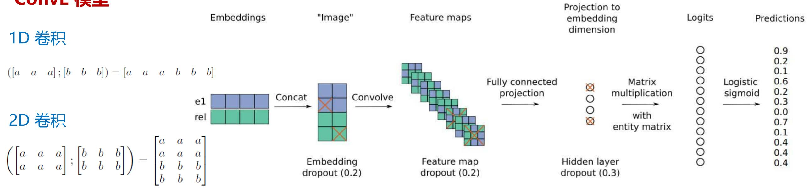

flowchart

```mermaid
graph LR
  A["Embeddings"] --> B["Image"]
  B --> C["Feature maps"]
  C --> D["Fully connected projection"]
  D --> E["Hidden layer dropout (0.3)"]
    
    subgraph sg_1D["\"1D 卷积\""]
        F1["[a a a"]; [b b b]] = G1["a a a b b b"]
    end
    
    subgraph sg_2D["\"2D 卷积\""]
        H1["e1 rel"]
        H2["Embedding dropout (0.2)"]
        H3["Feature map dropout (0.2)"]
    end
    
  F1 -->|Concat| G1
  G1 -->|Convolves| H2
  H2 -->|Fully connected projection| D
  D -->|Matrix multiplication with entity matrix| E
  E --> F2["Logits"]
  F2 --> G2["Logistic sigmoid"]
  G2 --> H3
  H3 --> I["Predictions"]
    
    style F1 fill:#f9f,stroke:#333
    style H1 fill:#bbf,stroke:#333
    style H2 fill:#bbf,stroke:#333
    style H3 fill:#bbf,stroke:#333
```

## 知识图谱嵌入（Knowledge Graph Embedding）

## Benchmark 数据集

<table><tr><td>Dataset name</td><td>Number of different entities</td><td>Number of different relations</td><td>Number of triples</td></tr><tr><td>FB15k[9]</td><td>14951</td><td>1345</td><td>584,113</td></tr><tr><td>WN18[9]</td><td>40943</td><td>18</td><td>151,442</td></tr><tr><td>FB15k-237[41]</td><td>14541</td><td>237</td><td>310,116</td></tr><tr><td>WN18RR[36]</td><td>40943</td><td>11</td><td>93,003</td></tr><tr><td>YAGO3-10[42]</td><td>123182</td><td>37</td><td>1,089,040</td></tr></table>

## 知识图谱嵌入（Knowledge Graph Embedding）

各种知识图谱嵌入模型的性能比较

<table><tr><td>Model name</td><td>Memory complexity</td><td>FB15K (Hits@10)</td><td>FB15K (MR)</td><td>FB15K (MRR)</td><td>FB15K - 237 (Hits@10)</td><td>FB15K - 237 (MR)</td><td>FB15K - 237 (MRR)</td><td>WN18 (Hits@10)</td><td>WN18 (MR)</td><td>WN18 (MRR)</td><td>WN18RR (Hits@10)</td><td>WN18RR (MR)</td><td>WN18RR (MRR)</td><td>YAGO3-10 (Hits@10)</td><td>YAGO3-10 (MR)</td><td>YAGO3-10 (MRR)</td></tr><tr><td>DistMul[19]</td><td> $\mathcal{O}(N_e d + N_r k)(d = k)$ </td><td>0.863</td><td>173</td><td>0.784</td><td>0.490</td><td>199</td><td>0.313</td><td>0.946</td><td>675</td><td>0.824</td><td>0.502</td><td>5913</td><td>0.433</td><td>0.661</td><td>1107</td><td>0.501</td></tr><tr><td>ComplEx[20]</td><td> $\mathcal{O}(N_e d + N_r k)(d = k)$ </td><td>0.905</td><td>34</td><td>0.848</td><td>0.529</td><td>202</td><td>0.349</td><td>0.955</td><td>3623</td><td>0.949</td><td>0.521</td><td>4907</td><td>0.458</td><td>0.703</td><td>1112</td><td>0.576</td></tr><tr><td>HolE[23]</td><td> $\mathcal{O}(N_e d + N_r k)(d = k)$ </td><td>0.867</td><td>211</td><td>0.800</td><td>0.476</td><td>186</td><td>0.303</td><td>0.949</td><td>650</td><td>0.938</td><td>0.487</td><td>8401</td><td>0.432</td><td>0.651</td><td>6489</td><td>0.502</td></tr><tr><td>ANALOGY[21]</td><td> $\mathcal{O}(N_e d + N_r k^2)(d = k)$ </td><td>0.837</td><td>126</td><td>0.726</td><td>0.353</td><td>476</td><td>0.202</td><td>0.944</td><td>808</td><td>0.934</td><td>0.380</td><td>9266</td><td>0.366</td><td>0.456</td><td>2423</td><td>0.283</td></tr><tr><td>Simple[22]</td><td> $\mathcal{O}(N_e d + N_r k)(d = k)$ </td><td>0.836</td><td>138</td><td>0.726</td><td>0.343</td><td>651</td><td>0.179</td><td>0.945</td><td>759</td><td>0.938</td><td>0.426</td><td>8764</td><td>0.398</td><td>0.631</td><td>2849</td><td>0.453</td></tr><tr><td>TuckER[24]</td><td> $\mathcal{O}(N_e d + N_r k)(d = k)$ </td><td>0.888</td><td>39</td><td>0.788</td><td>0.536</td><td>162</td><td>0.352</td><td>0.958</td><td>510</td><td>0.951</td><td>0.514</td><td>6239</td><td>0.459</td><td>0.680</td><td>2417</td><td>0.544</td></tr><tr><td>MEI[26]</td><td> $\mathcal{O}(N_e d + N_r k)(d = k)$ </td><td></td><td></td><td></td><td>0.552</td><td>145</td><td>0.365</td><td></td><td></td><td></td><td>0.551</td><td>3268</td><td>0.481</td><td>0.709</td><td>756</td><td>0.578</td></tr><tr><td>MEIM[27]</td><td> $\mathcal{O}(N_e d + N_r k)(d = k)$ </td><td></td><td></td><td></td><td>0.557</td><td>137</td><td>0.369</td><td></td><td></td><td></td><td>0.577</td><td>2434</td><td>0.499</td><td>0.716</td><td>747</td><td>0.585</td></tr><tr><td>TransE[9]</td><td> $\mathcal{O}(N_e d + N_r k)(d = k)$ </td><td>0.847</td><td>45</td><td>0.628</td><td>0.497</td><td>209</td><td>0.310</td><td>0.948</td><td>279</td><td>0.646</td><td>0.495</td><td>3936</td><td>0.206</td><td>0.673</td><td>1187</td><td>0.501</td></tr><tr><td>STransE[32]</td><td> $\mathcal{O}(N_e d + N_r k^2)(d = k)$ </td><td>0.796</td><td>69</td><td>0.543</td><td>0.495</td><td>357</td><td>0.315</td><td>0.934</td><td>208</td><td>0.656</td><td>0.422</td><td>5172</td><td>0.226</td><td>0.073</td><td>5797</td><td>0.049</td></tr><tr><td>CrossE[33]</td><td> $\mathcal{O}(N_e d + N_r k)(d = k)$ </td><td>0.862</td><td>136</td><td>0.702</td><td>0.470</td><td>227</td><td>0.298</td><td>0.950</td><td>441</td><td>0.834</td><td>0.449</td><td>5212</td><td>0.405</td><td>0.654</td><td>3839</td><td>0.446</td></tr><tr><td>TorusE[34]</td><td> $\mathcal{O}(N_e d + N_r k)(d = k)$ </td><td>0.839</td><td>143</td><td>0.746</td><td>0.447</td><td>211</td><td>0.281</td><td>0.954</td><td>525</td><td>0.947</td><td>0.535</td><td>4873</td><td>0.463</td><td>0.474</td><td>19455</td><td>0.342</td></tr><tr><td>RotatE[35]</td><td> $\mathcal{O}(N_e d + N_r k)(d = k)$ </td><td>0.881</td><td>42</td><td>0.791</td><td>0.522</td><td>178</td><td>0.336</td><td>0.960</td><td>274</td><td>0.949</td><td>0.573</td><td>3318</td><td>0.475</td><td>0.570</td><td>1827</td><td>0.498</td></tr><tr><td>ConvE[36]</td><td> $\mathcal{O}(N_e d^2 + N_r k^2)$ </td><td>0.849</td><td>51</td><td>0.688</td><td>0.521</td><td>281</td><td>0.305</td><td>0.956</td><td>413</td><td>0.945</td><td>0.507</td><td>4944</td><td>0.427</td><td>0.657</td><td>2429</td><td>0.488</td></tr><tr><td>ConvKB[38]</td><td> $\mathcal{O}(N_e d + N_r k)(d = k)$ </td><td>0.408</td><td>324</td><td>0.211</td><td>0.517</td><td>309</td><td>0.230</td><td>0.948</td><td>202</td><td>0.709</td><td>0.525</td><td>3429</td><td>0.249</td><td>0.604</td><td>1683</td><td>0.420</td></tr><tr><td>ConvR[37]</td><td> $\mathcal{O}(N_e d + N_r k)(d = k)$ </td><td>0.885</td><td>70</td><td>0.773</td><td>0.526</td><td>251</td><td>0.346</td><td>0.958</td><td>471</td><td>0.950</td><td>0.526</td><td>5646</td><td>0.467</td><td>0.673</td><td>2582</td><td>0.527</td></tr><tr><td>CapsE[39]</td><td> $\mathcal{O}(N_e d + N_r k)(d = k)$ </td><td>0.217</td><td>610</td><td>0.087</td><td>0.356</td><td>405</td><td>0.160</td><td>0.950</td><td>233</td><td>0.890</td><td>0.559</td><td>720</td><td>0.415</td><td>0</td><td>60676</td><td>0.000</td></tr><tr><td>RSN[40]</td><td> $\mathcal{O}(N_e d + N_r k)(d = k)$ </td><td>0.870</td><td>51</td><td>0.777</td><td>0.444</td><td>248</td><td>0.280</td><td>0.951</td><td>346</td><td>0.928</td><td>0.483</td><td>4210</td><td>0.395</td><td>0.664</td><td>1339</td><td>0.511</td></tr></table>

## 知识图谱嵌入代码库

KGE  
MEI-KGE  
Pykg2vec  
DGL-KE  
PyKEEN  
TorchKGE  
AmpliGraph  
OpenKE  
scikit-kge  
Fast-TransX  
MEIM-KGE  
DICEE

## Roadmap of Semantic Information Learning for KG

## Semantic Representation Learning for KG

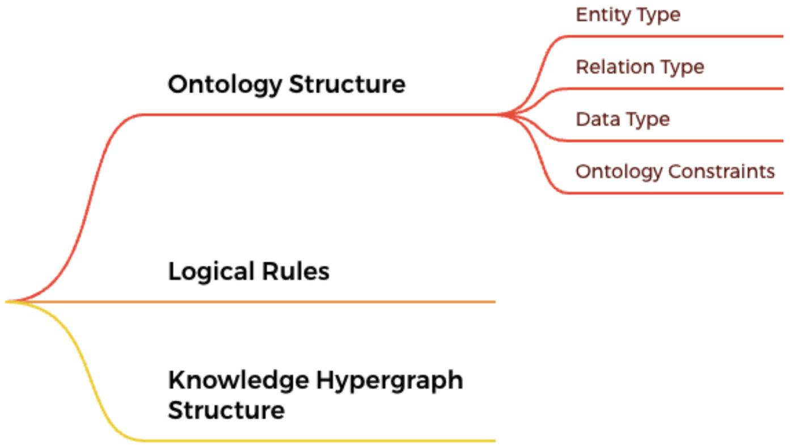

flowchart

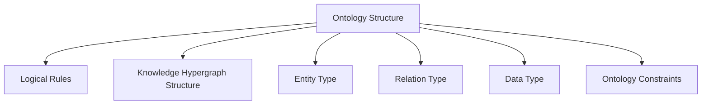
```mermaid
graph TD
  A["Ontology Structure"] --> B["Logical Rules"]
  A --> C["Knowledge Hypergraph Structure"]
  A --> D["Entity Type"]
  A --> E["Relation Type"]
  A --> F["Data Type"]
  A --> G["Ontology Constraints"]
```

## 语义信息： 关系层次

关系层次结构及其形式化  
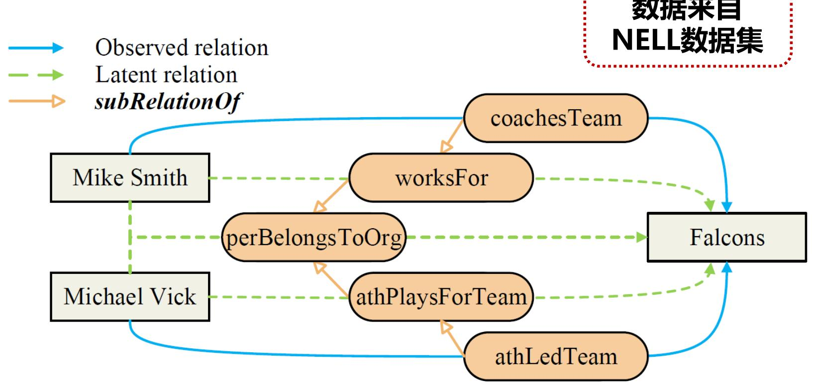

flowchart

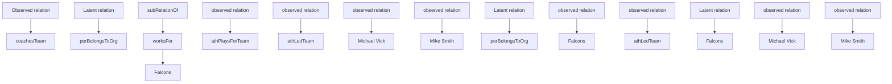
```mermaid
graph TD
  A["Observed relation"] --> B["coachesTeam"]
  C["Latent relation"] --> D["perBelongsToOrg"]
  E["subRelationOf"] --> F["worksFor"]
  F --> G["Falcons"]
  H["observed relation"] --> I["athPlaysForTeam"]
  J["observed relation"] --> K["athLedTeam"]
  L["observed relation"] --> M["Michael Vick"]
  N["observed relation"] --> O["Mike Smith"]
  P["Latent relation"] --> Q["perBelongsToOrg"]
  R["observed relation"] --> S["Falcons"]
  T["observed relation"] --> U["athLedTeam"]
  V["Latent relation"] --> W["Falcons"]
  X["observed relation"] --> Y["Michael Vick"]
  Z["observed relation"] --> AA["Mike Smith"]
```

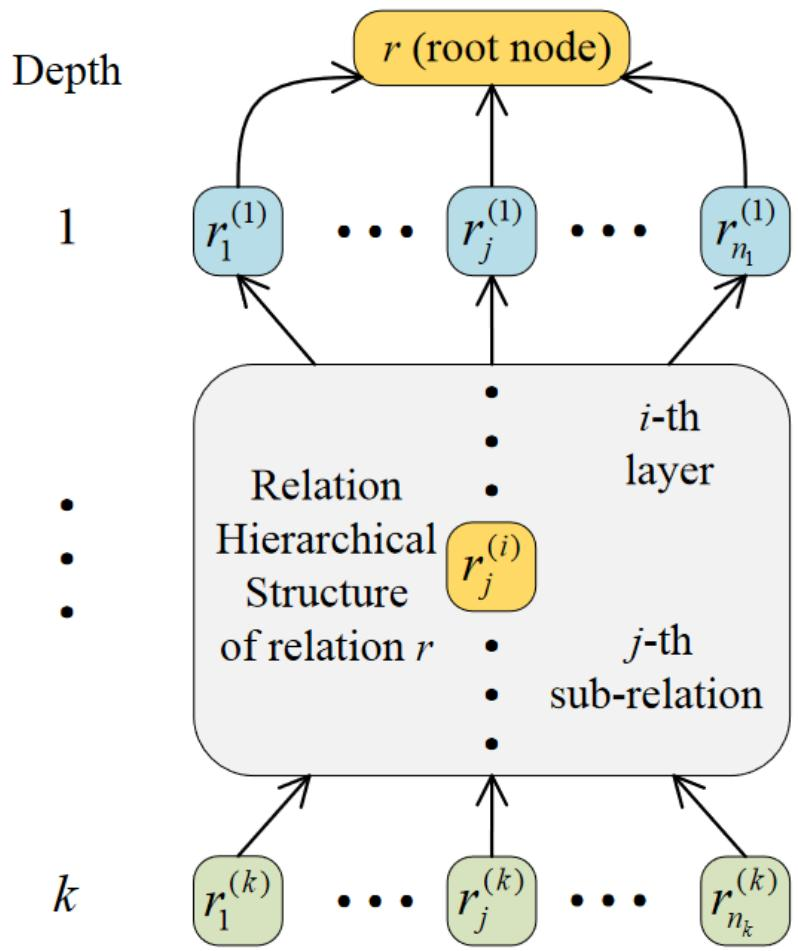

flowchart

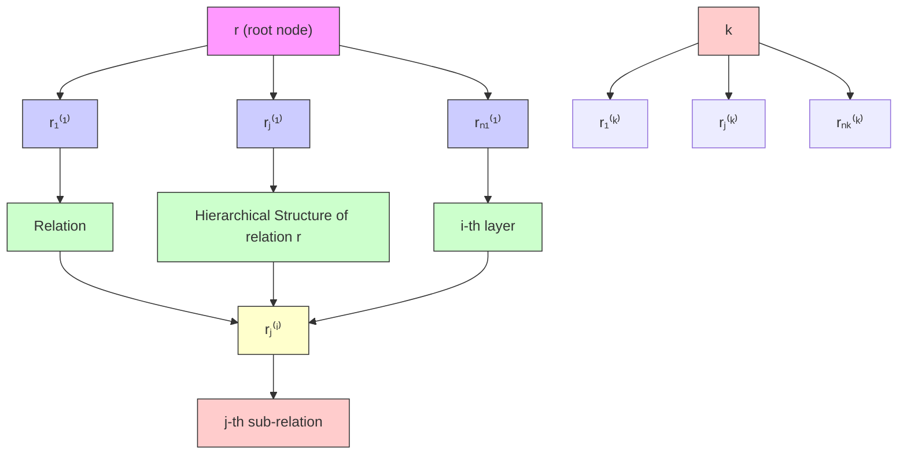
```mermaid
graph TD
  A["r (root node)"] --> B["r₁⁽¹⁾"]
  A --> C["rⱼ⁽¹⁾"]
  A --> D["rₙ₁⁽¹⁾"]
  B --> E["Relation"]
  C --> F["Hierarchical Structure of relation r"]
  D --> G["i-th layer"]
  E --> H["rⱼ⁽ⁱ⁾"]
  F --> H
  G --> H
  H --> I["j-th sub-relation"]
  J["k"] --> K["r₁⁽ᵏ⁾"]
  J --> L["rⱼ⁽ᵏ⁾"]
  J --> M["rₙₖ⁽ᵏ⁾"]
    style A fill:#f9f,stroke:#333
    style B fill:#ccf,stroke:#333
    style C fill:#ccf,stroke:#333
    style D fill:#ccf,stroke:#333
    style E fill:#cfc,stroke:#333
    style F fill:#cfc,stroke:#333
    style G fill:#cfc,stroke:#333
    style H fill:#ffc,stroke:#333
    style I fill:#fcc,stroke:#333
    style J fill:#fcc,stroke:#333
```

• F Zhang, X Wang, Z Li, et al. TransRHS: A Representation Learning Method for Knowledge Graphs with Relation Hierarchical Structure. IJCAI 2020.

## Semantic Information: Relation Hierarchical Structure

➢ The ideal embeddings in TransRHS meets the following conditions:

1. h + p is inside the sphere $s _ { 1 } ( d _ { 1 } < m _ { 1 } )$  
2. $\mathbf { h } + \mathbf { r }$ is between the sphere $s _ { 1 }$ and $s _ { 2 } ( m _ { 1 } < d _ { 2 } < m _ { 2 } )$  
3. The sphere $s _ { 1 }$ is inside the sphere $s _ { 2 } ( m _ { 1 } < m _ { 2 } )$

➢ The following situations still need to be optimized:

1. $\mathbf { h } + \mathbf { p }$ is outside the sphere $s _ { 1 } ( d _ { 1 } > m _ { 1 } )$  
2. $\mathbf { h } + \mathbf { r }$ is outside the sphere $s _ { 2 } \left( d _ { 2 } > m _ { 2 } \right)$  
3. $\mathbf { h } + \mathbf { r }$ is inside the sphere $s _ { 1 } ( d _ { 2 } < m _ { 1 } )$  
4. The sphere $s _ { 2 }$ is inside the sphere $s _ { 1 } \left( m _ { 1 } > m _ { 2 } \right)$ ：

For the above conditions, we define the loss functions as:

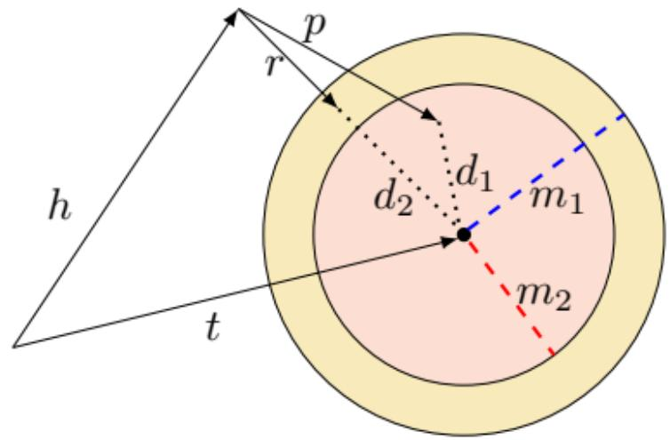

text_image

h
r
p
d2
d1
m1
m2
t

$$
f _ {R H S} = \left\{ \begin{array}{l l} \alpha_ {1} \left[ | | \mathbf {h} + \mathbf {p} - \mathbf {t} | | _ {2} - m _ {1} \right] _ {+} & \textbf {i f} d _ {1} > m _ {1} \\ \alpha_ {2} \left[ | | \mathbf {h} + \mathbf {r} - \mathbf {t} | | _ {2} - m _ {2} \right] _ {+} & \textbf {i f} d _ {2} > m _ {2} \\ \alpha_ {3} \left[ m _ {1} - | | \mathbf {h} + \mathbf {r} - \mathbf {t} | | _ {2} \right] _ {+} & \textbf {i f} d _ {2} <   m _ {1} \\ \alpha_ {4} \left[ m _ {1} - m _ {2} \right] _ {+} & \textbf {i f} m _ {1} > m _ {2} \end{array} \right.
$$

## Semantic Information: Data Type Attribute

◼ A KG with attribute values of various data types  
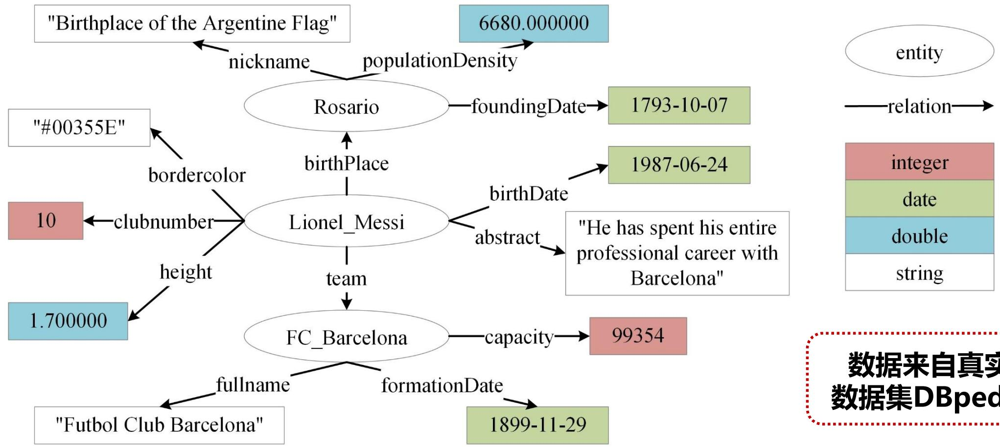

flowchart

```mermaid
graph TD
  A["Birthplace of the Argentine Flag"] -->|nickname| B["Rosario"]
  C["6680.000000"] -->|foundingDate| D["1793-10-07"]
  E["#00355E"] -->|bordercolor| F["Lionel_Messi"]
  G["&quot;10"] -->|clubnumber| F
  H["height"] --> F
  I["1.700000"] --> F
  J["&quot;fullname"] --> K["FC_Barcelona"]
  L["&quot;formationDate"] --> K
  M["&quot;height"] --> K
  N["&quot;input"] --> O["Futbol Club Barcelona"]
  P["&quot;input"] --> Q["inputDate"]
  R["&quot;input"] --> S["inputName"]
  T["&quot;input"] --> U["inputDate"]
  V["&quot;input"] --> W["inputName"]
  X["&quot;input"] --> Y["inputName"]
  Z["&quot;input"] --> AA["inputName"]
  AB["&quot;input"] --> AC["inputName"]
  AD["&quot;input"] --> AE["inputName"]
  AF["&quot;input"] --> AG["inputName"]
  AH["&quot;input"] --> AI["inputName"]
  AJ["&quot;input"] --> AK["inputName"]
  AL["&quot;input"] --> AM["inputName"]
  AN["&quot;input"] --> AO["inputName"]
  AP["&quot;input"] --> AQ["inputName"]
  AR["&quot;input"] --> AS["inputName"]
  AT["&quot;input"] --> AU["inputName"]
  AV["&quot;input"] --> AW["inputName"]
  AX["&quot;input"] --> AY["inputName"]
  AZ["&quot;input"] --> BA["inputName"]
  BB["&quot;input"] --> BC["inputName"]
  BD["&quot;input"] --> BE["inputName"]
  BF["&quot;input"] --> BG["inputName"]
  BH["&quot;input"] --> BI["inputName"]
  BJ["&quot;input"] --> BK["inputName"]
  BL["&quot;input"] --> BL["inputName"]
  BM["&quot;input"] --> BN["inputName"]
  BO["&quot;input"] --> BP["inputName"]
  BQ["entry"] -->|relation| AR
  BR["data"] -->|数据集DBped| BS
```

实 dia

## Semantic Information: Data Type Attribute

## Encoders for different data types

Based on the integer value attribute  
Relational aware property value representation  
⚫ Four hyperbolic encoders

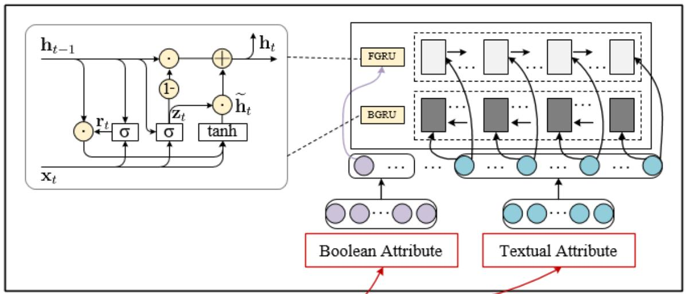

flowchart

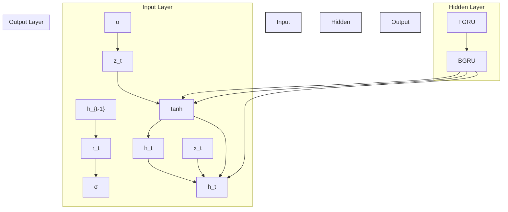
```mermaid
graph TD
    subgraph Input Layer
  h_t_minus_1["h_{t-1}"] --> r_t["r_t"]
  r_t --> σ[σ]
  node["σ"] --> z_t["z_t"]
  z_t --> tanh["σ"]
  tanh --> h_t["h_t"]
  h_t --> h_t_bar["h_t"]
  x_t["x_t"] --> h_t_bar
    end

    subgraph Hidden Layer
  fGRU["FGRU"] --> BGRU["BGRU"]
  BGRU --> tanh["tanh"]
  tanh --> h_t_bar
    end

    subgraph Output Layer
  BGRU --> tanh
  BGRU --> h_t_bar
    end

    style Input Layer fill:#f9f,stroke:#333
    style Hidden Layer fill:#bbf,stroke:#333
    style Output Layer fill:#dfd,stroke:#333
```

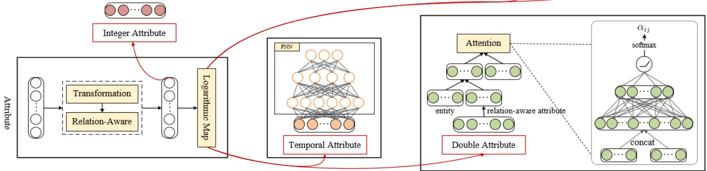

flowchart

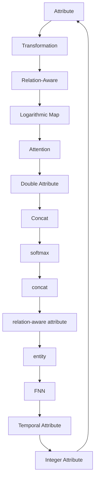
```mermaid
graph TD
  A["Attribute"] --> B["Transformation"]
  B --> C["Relation-Aware"]
  C --> D["Logarithmic Map"]
  D --> E["Attention"]
  E --> F["Double Attribute"]
  F --> G["Concat"]
  G --> H["softmax"]
  H --> I["concat"]
  I --> J["relation-aware attribute"]
  J --> K["entity"]
  K --> L["FNN"]
  L --> M["Temporal Attribute"]
  M --> N["Integer Attribute"]
  N --> A
```

## ◼ Semantic Information: Ontology Information Constraints

➢ Knowledge representation learning model based on ontology information constraints

The specifc constraint strategies are proposed for entity types, relations, and hierarchical information, respectively, which can efectively achieve reasoning and completion of KGs  
TransO can explicitly model relations and seamlessly incorporate rich ontology information in KGs to improve model performance and maintain low model complexity

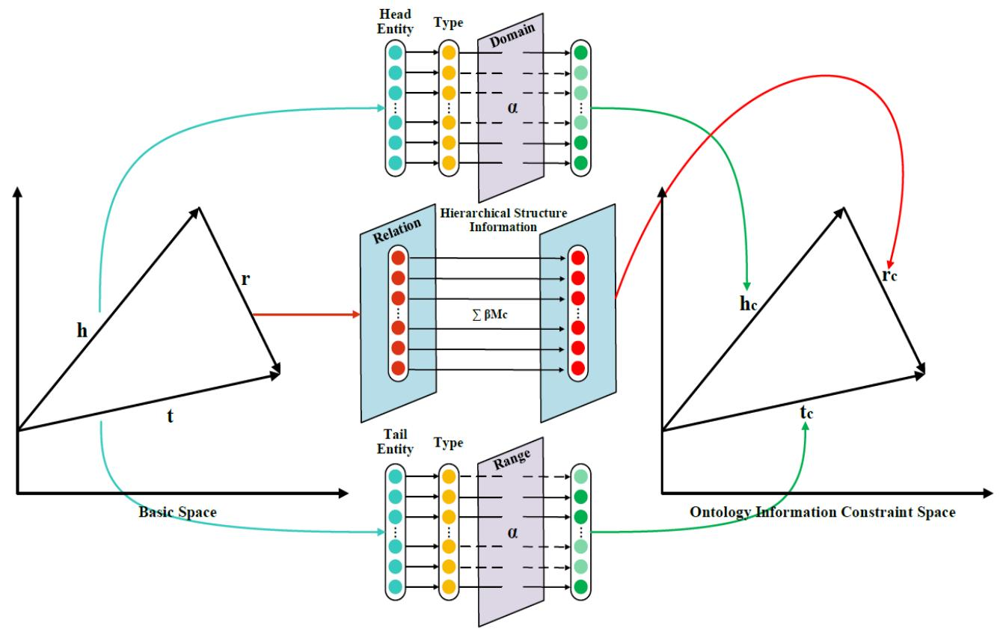

flowchart

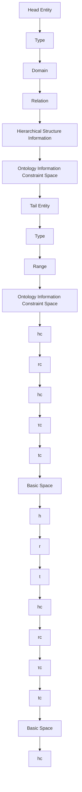
```mermaid
graph TD
  A["Head Entity"] --> B["Type"]
  B --> C["Domain"]
  C --> D["Relation"]
  D --> E["Hierarchical Structure Information"]
  E --> F["Ontology Information Constraint Space"]
  F --> G["Tail Entity"]
  G --> H["Type"]
  H --> I["Range"]
  I --> J["Ontology Information Constraint Space"]
  J --> K["hc"]
  K --> L["rc"]
  L --> M["hc"]
  M --> N["τc"]
  N --> O["tc"]
  O --> P["Basic Space"]
  P --> Q["h"]
  Q --> R["r"]
  R --> S["t"]
  S --> T["hc"]
  T --> U["rc"]
  U --> V["τc"]
  V --> W["tc"]
  W --> X["Basic Space"]
  X --> Y["hc"]
```

## Semantic Information: Logical Rules

## ◼ Statistical Relational Models

✓ A set of weighted logical rules constructs a Markov random field via a Markov logic network  
Using undirected graphs to represent variable associations  
Three types of meta-logical rules: symmetry rules, inverse rules, sub-relation rules, encoding domain knowledge

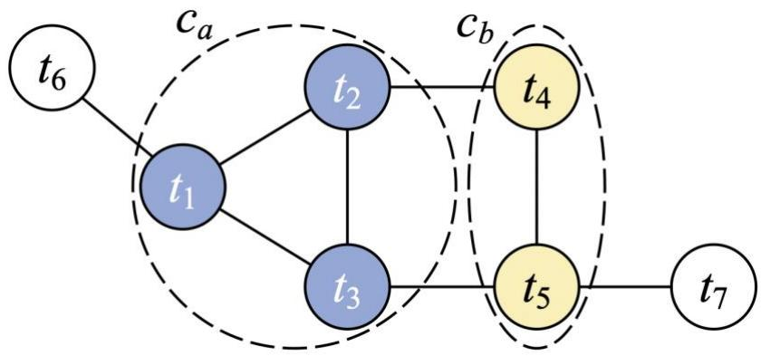

flowchart

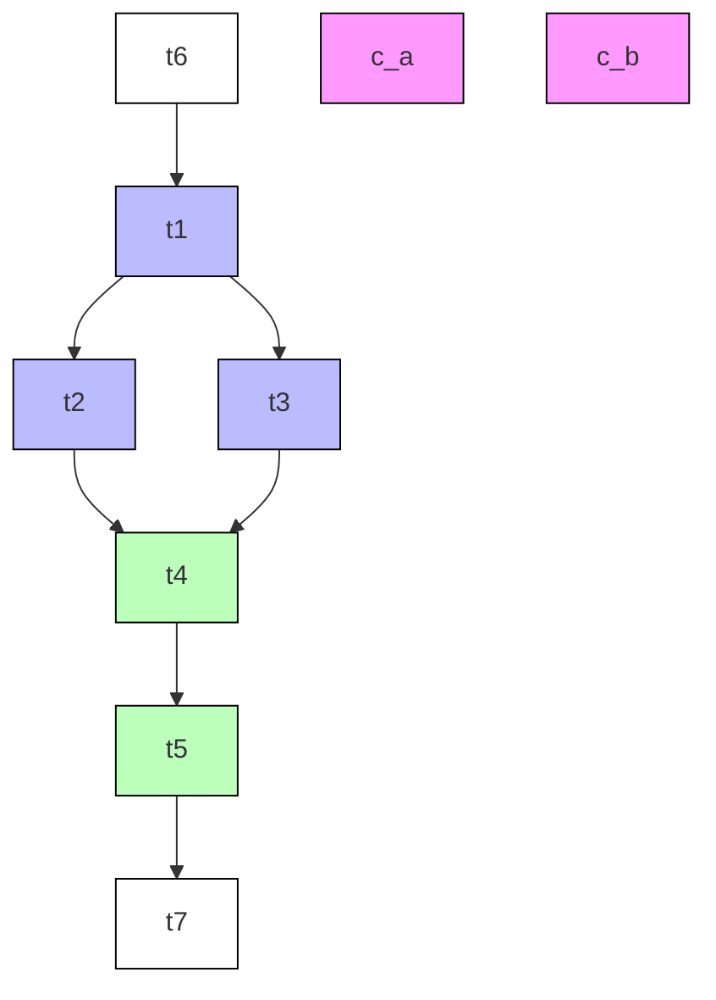
```mermaid
graph TD
  t6["t6"] --> t1["t1"]
  t1 --> t2["t2"]
  t1 --> t3["t3"]
  t2 --> t4["t4"]
  t3 --> t4
  t4 --> t5["t5"]
  t5 --> t7["t7"]
    style t6 fill:#fff,stroke:#000
    style t1 fill:#bbf,stroke:#000
    style t2 fill:#bbf,stroke:#000
    style t3 fill:#bbf,stroke:#000
    style t4 fill:#bfb,stroke:#000
    style t5 fill:#bfb,stroke:#000
    style t7 fill:#fff,stroke:#000
    style c_a fill:#f9f,stroke:#000
    style c_b fill:#f9f,stroke:#000
```

<table><tr><td>Dataset</td><td>Type</td><td>First-order Logic Rule</td></tr><tr><td>JF17K</td><td>inverse</td><td>theater.theater_production_staff_gig(X,Y,Z)⇒ theater.theater_designer_gig(Z,Y,X)</td></tr><tr><td>M-FB15K</td><td>subrelation</td><td>olympics * olympic_demonstration_medal_honor(X,Y,Z)⇒ olympics *olympic_medal_honor(X,Y,Z)</td></tr><tr><td>FB-AUTO</td><td>symmetric</td><td>exterior_color(X,Y)⇒ exterior_color(Y,X)</td></tr><tr><td>FB15k</td><td>subrelation</td><td>/medicine/symptom/symptom_of(X,Y)⇒ /medicine/disease_cause/diseases(X,Y)</td></tr><tr><td>WN18</td><td>inverse</td><td>_hyponym(X,Y)⇒ _also_see(X,Y)</td></tr></table>

## Semantic Information: Logical Rules

## Variational EM Algorithm Trains MLN and KGE

Markov logic networks based on multi-relational data can directly model multirelational tuples without S2C conversion  
Domain knowledge in logical rules is refined into embedding vectors, and semantic information in embeddings adjusts the weights of logical rules inversely  
Markov blanket extraction based on logical rules completes the explanation of inference paths

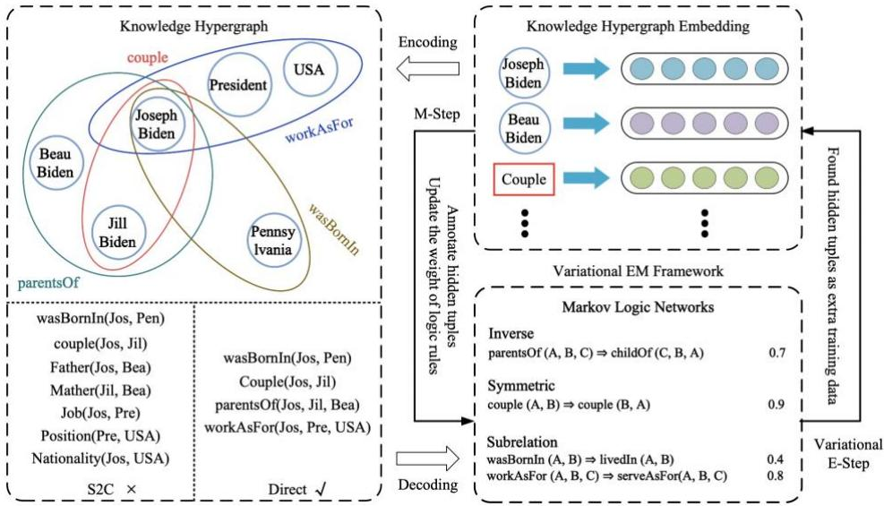

flowchart

```mermaid
graph TD
  A["Knowledge Hypergraph"] --> B["couple"]
  A --> C["President"]
  A --> D["USA"]
  A --> E["beau Biden"]
  A --> F["Jill Biden"]
  A --> G["Pennsy Ivania"]
  H["Knowledge Hypergraph Embedding"] --> I["Joseph Biden"]
  H --> J["Beau Biden"]
  H --> K["Couple"]
  L["Variational EM Framework"] --> M["Markov Logic Networks"]
  M --> N["Inverse"]
  M --> O["Symmetric"]
  M --> P["Subrelation"]
  M --> Q["Decoding"]
  R["M-Step"] --> S["Update the weight of logic rules"]
  T["Fixed hidden tuples as extra training data"] --> M
    U["wasBornIn(Jos, Pen)"]
  U --> V["couple(Jos, Jil)"]
  U --> W["Father(Jos, Bea)"]
  U --> X["Mather(Jil, Bea)"]
  U --> Y["Job(Jos, Pre)"]
  U --> Z["Position(Pre, USA)"]
  U --> AA["Nationality(Jos, USA)"]
  AB["S2C ×"] --> AC["wasBornIn(Jos, Pen)"]
  AB --> AD["Couple(Jos, Jil)"]
  AB --> AE["parentsOf(Jos, Jil, Bea)"]
  AB --> AF["workAsFor(Jos, Pre, USA)"]
  AG["Direct √"] --> AH["Decoding"]
  AI["wasBornIn(Jos, Pen)"] --> AJ["couple(Jos, Jil)"]
  AK["Father(Jos, Bea)"] --> AL["Mather(Jil, Bea)"]
  AM["Job(Jos, Pre)"] --> AN["Position(Pre, USA)"]
  AO["Nationality(Jos, USA)"] --> AP["S2C ×"]
  AQ["WorkAsFor"] --> AR["wasBornIn(A, B) ⇒ livedIn(A, B)"]
  AS["WorkAsFor"] --> AT["wasBornIn(A, B) ⇒ serveAsFor(A, B, C)"]
  AU["WorkAsFor"] --> AV["wasBornIn(A, B) ⇒ livedIn(A, B)"]
  AW["WorkAsFor"] --> AX["wasBornIn(A, B) ⇒ serveAsFor(A, B, C)"]
```

## 语义信息： 多元关系

## HyConvE

不同的实体应根据所在n元关系具有不同的嵌入表示  
不同的实体应根据其在n元事实中的位置具有不同的嵌入表示  
模型中3D卷积部分能够进行更深层次的特征提取

Jeffrey Jordan and Marcus Jordan are kids ofMichael Jordan. Statement Scottie Pippen is the best helper of Michael Jordan in 1998. Michael Jordan plays as the scoring guard in Chicago Bulls.  
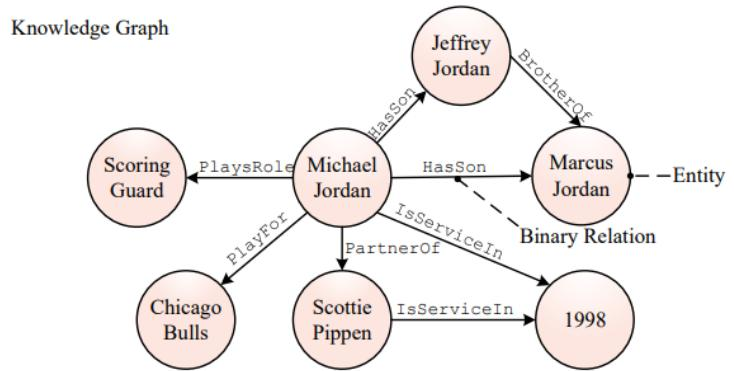

flowchart

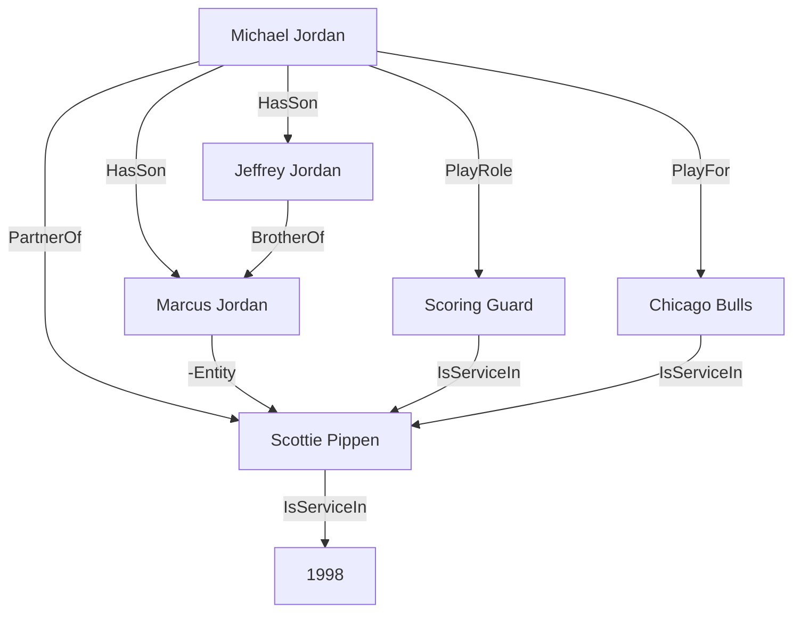
```mermaid
graph TD
  A["Michael Jordan"] -->|HasSon| B["Jeffrey Jordan"]
  A -->|HasSon| C["Marcus Jordan"]
  A -->|PlayRole| D["Scoring Guard"]
  A -->|PlayFor| E["Chicago Bulls"]
  A -->|PartnerOf| F["Scottie Pippen"]
  B -->|BrotherOf| C
  C -->|-Entity| F
  D -->|IsServiceIn| F
  E -->|IsServiceIn| F
  F -->|IsServiceIn| G["1998"]
```

Triples

HasSon (MichaeI Jordan,Jeffrey Jordan)

Has Son (Michael Jordan, Marcus Jordan)

BrotherOf (Jeffrey Jordan, Marcus Jordan)

PlaysRole (Michael Jordan, Scoring Guard)

PlaysFor (Michael Jordan, Chicago Bulls)

PartnerOf (Michael Jordan, Scotte Pipen)

IsServiceIn (Scotte Pippen, 1998)

IsServiceIn (Michael Jordan, 1998)

Jeffrey Jordan and Marcus Jordan are kids of Michael Jordan. Statement Scottie Pippen is the best helper of Michael Jordan in 1998. Michael Jordan plays as the scoring guard in Chicago Bulls.  
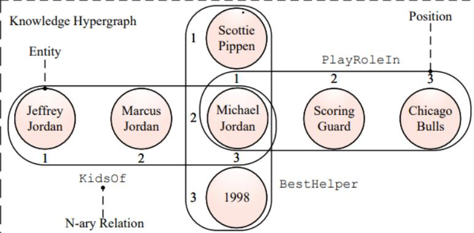

flowchart

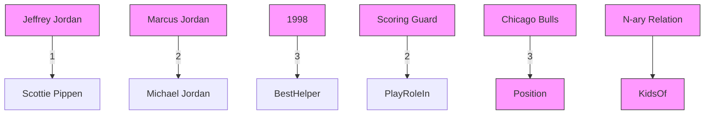
```mermaid
graph TD
  A["Jeffrey Jordan"] -->|1| B["Scottie Pippen"]
  C["Marcus Jordan"] -->|2| D["Michael Jordan"]
  E["1998"] -->|3| F["BestHelper"]
  G["Scoring Guard"] -->|2| H["PlayRoleIn"]
  I["Chicago Bulls"] -->|3| J["Position"]
  K["N-ary Relation"] --> L["KidsOf"]
    style A fill:#f9f,stroke:#333
    style C fill:#f9f,stroke:#333
    style E fill:#f9f,stroke:#333
    style G fill:#f9f,stroke:#333
    style I fill:#f9f,stroke:#333
    style J fill:#f9f,stroke:#333
    style K fill:#f9f,stroke:#333
    style L fill:#f9f,stroke:#333
```

Tuples

KidsOf (Jeffrey Jordan, Marcus Jordan, Jeffrey Jordan)

BestHelper (Scotie Pippen, Michael Jordan, 1998)

PlayRoleIn (Michael Jordan, Scoring Guard, Chicago Bulls)

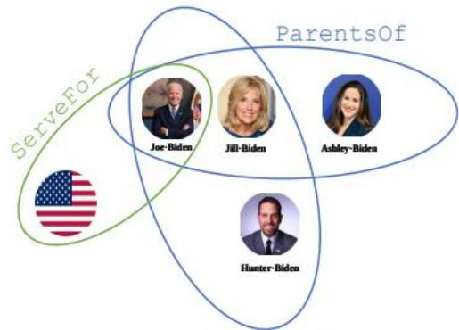

flowchart

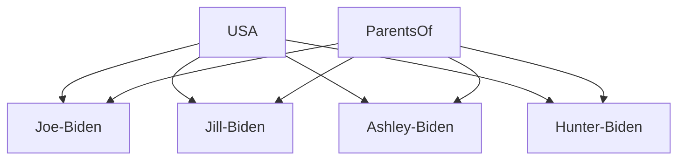
```mermaid
graph TD
  A["USA"] --> B["Joe-Biden"]
  A --> C["Jill-Biden"]
  A --> D["Ashley-Biden"]
  A --> E["Hunter-Biden"]
  F["ParentsOf"] --> B
  F --> C
  F --> D
  F --> E
```

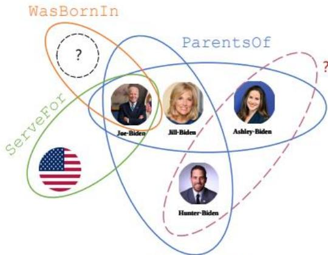

flowchart

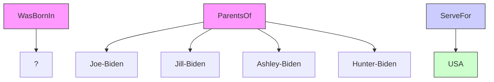
```mermaid
graph TD
  A["WasBornIn"] --> B["?"]
  C["ParentsOf"] --> D["Joe-Biden"]
  C --> E["Jill-Biden"]
  C --> F["Ashley-Biden"]
  C --> G["Hunter-Biden"]
  H["ServeFor"] --> I["USA"]
    style A fill:#f9f,stroke:#333
    style C fill:#f9f,stroke:#333
    style H fill:#ccf,stroke:#333
    style I fill:#cfc,stroke:#333
```

• Wang C, Wang X, Li Z, et al. HyConvE: A Novel Embedding Model for Knowledge Hypergraph Link Prediction with Convolutional Neural Networks. WWW 2023.

## 语义信息： 多元关系

## HyConvE

3D卷积捕获实体和关系间更深层次的交互，学习n元事实中的显式和隐式知识  
✓ 关系和位置感知的2D卷积来提取每个n元关系事实中的内在语义模式和位置信息  
两部分卷积通路提取的特征求和后经过投射网络得到每个元组的置信度得分

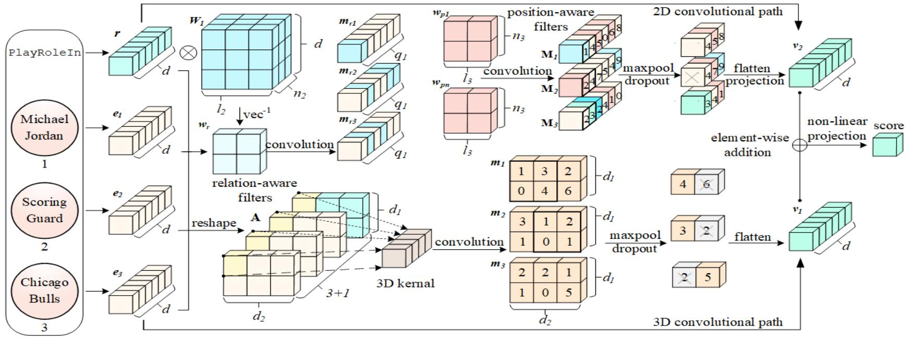

flowchart

3D convolutional neural network architecture diagram showing layers from PlayRoleIn to score via convolution, pooling, and gradient addition steps.

## ◼ Semantic Information: N-ary + Temporal

## ◼ Time-aware Knowledge Hypergraph Link Prediction

Fully utilizing the role and positional differences of entities in temporal hyperedges to obtain static embedding vectors of entities and relationships  
Setting frequencies and weights for timestamps of temporal hyperedges to obtain dynamic temporal embedding vectors of entities

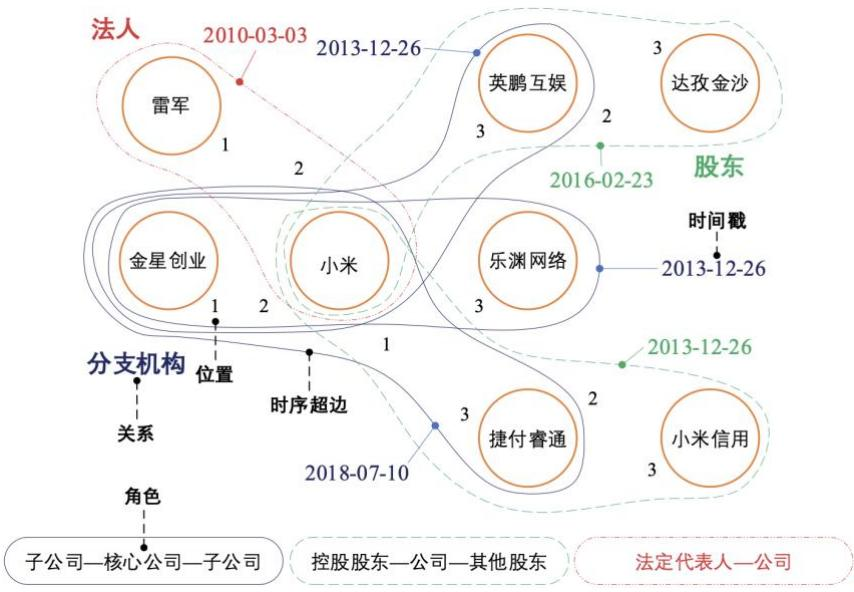

flowchart

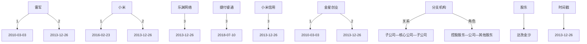
```mermaid
graph TD
  A["雷军"] -->|1| B["2010-03-03"]
  A -->|2| C["2013-12-26"]
  D["小米"] -->|1| E["2016-02-23"]
  D -->|2| F["2013-12-26"]
  G["乐渊网络"] -->|3| H["2013-12-26"]
  I["捷付睿通"] -->|3| J["2018-07-10"]
  K["小米信用"] -->|3| L["2013-12-26"]
  M["金星创业"] -->|1| N["2010-03-03"]
  M -->|2| O["2013-12-26"]
  P["分支机构"] -->|关系| Q["子公司—核心公司—子公司"]
  P -->|角色| R["控股股东—公司—其他股东"]
  S["股东"] --> T["达孜金沙"]
  U["时间戳"] --> V["2013-12-26"]
```

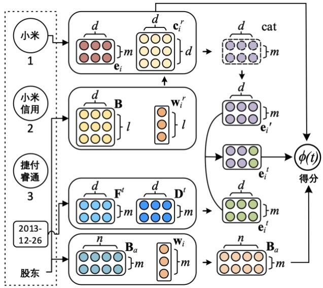

flowchart

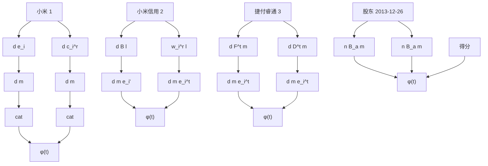
```mermaid
graph TD
  A["小米 1"] --> B["d e_i"]
  A --> C["d c_i^r"]
  B --> D["d m"]
  C --> E["d m"]
  D --> F["cat"]
  E --> G["cat"]
  F --> H["φ(t)"]
  G --> H
  I["小米信用 2"] --> J["d B l"]
  I --> K["w_i^r l"]
  J --> L["d m e_i'"]
  K --> M["d m e_i^t"]
  L --> N["φ(t)"]
  M --> N
  O["捷付睿通 3"] --> P["d F^t m"]
  O --> Q["d D^t m"]
  P --> R["d m e_i^t"]
  Q --> S["d m e_i^t"]
  R --> T["φ(t)"]
  S --> T
  U["股东 2013-12-26"] --> V["n B_a m"]
  U --> W["n B_a m"]
  V --> X["φ(t)"]
  W --> X
  Y["得分"] --> X
```

## 语义信息： 多元关系

## 知识超图3D卷积嵌入

提高全局特征交互  
复杂语义知识的有效嵌入

Facts:

· Einstein had both American and Swiss citizenship.

· Light has both particle and wave properties.

· The photoelectric effect proposed by Einstein proved that light has a particle property.

· The EPFL has captured the first-ever photograph of light as both a particle and wave.

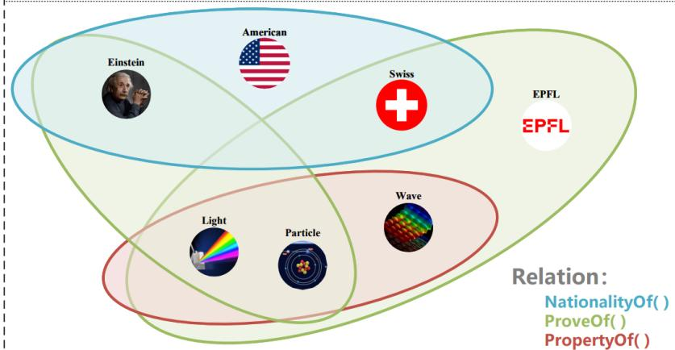

venn diagram

| Entity | Color     |
|--------|-----------|
| Einstein | Blue      |
| American | Light     |
| Swiss  | Red       |
| EPFL   | Green     |
| Light  | Red       |
| Particle | Green    |
| Wave   | Red       |

Tuples:  
NationalityOf(Einstein, American, Swiss) PropertyOf(Light,Particle,Wave) ProveOf(Einstein, Light, Particle) ProveOf(Swiss, EPFL, Light, Particle, Wave)

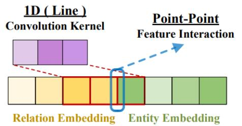

flowchart

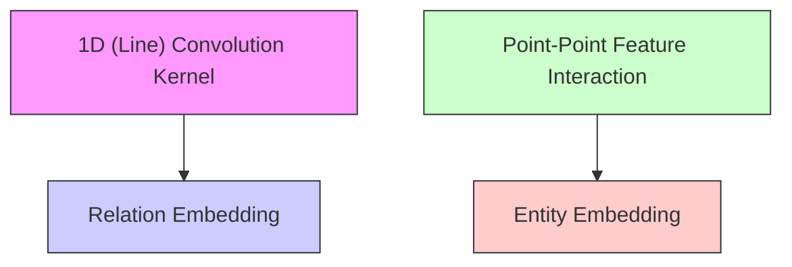
```mermaid
graph TD
  A["1D (Line) Convolution Kernel"] --> B["Relation Embedding"]
  C["Point-Point Feature Interaction"] --> D["Entity Embedding"]
    style A fill:#f9f,stroke:#333
    style B fill:#ccf,stroke:#333
    style C fill:#cfc,stroke:#333
    style D fill:#fcc,stroke:#333
```

1D Convolutional Embedding

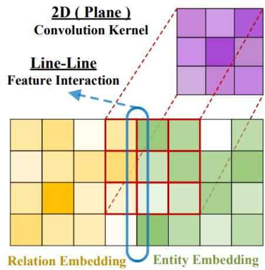

flowchart

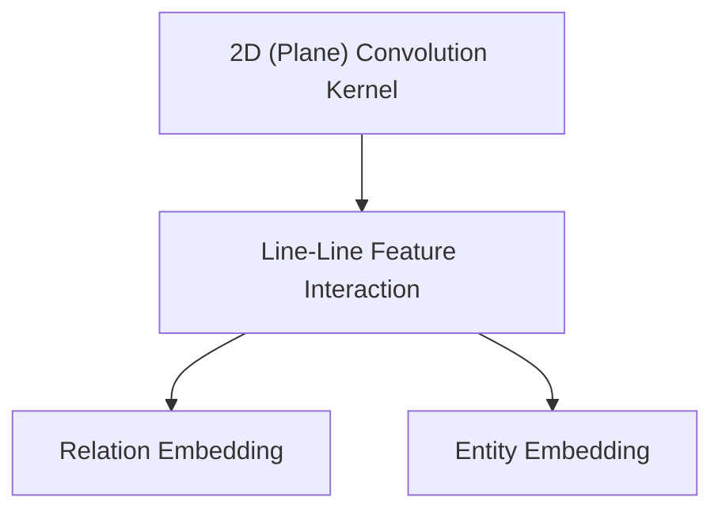
```mermaid
graph TD
  A["2D (Plane) Convolution Kernel"] --> B["Line-Line Feature Interaction"]
  B --> C["Relation Embedding"]
  B --> D["Entity Embedding"]
```

2D Convolutional Embedding

3D Convolutional Embedding  
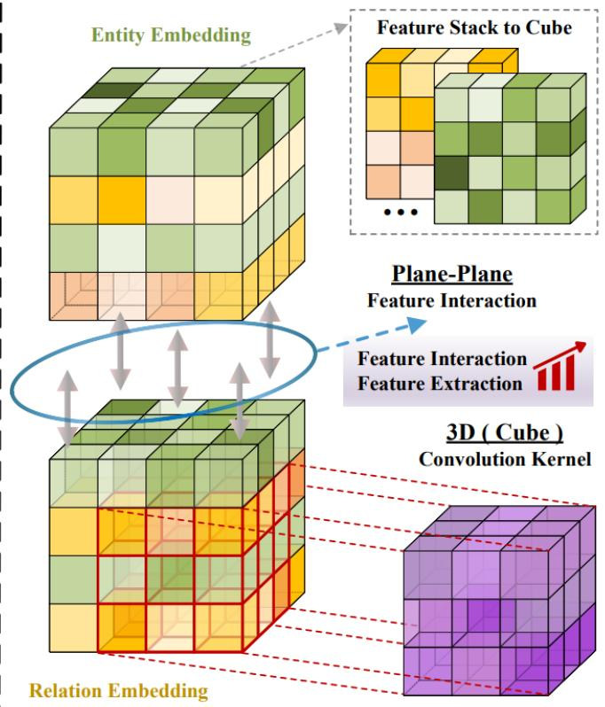

flowchart

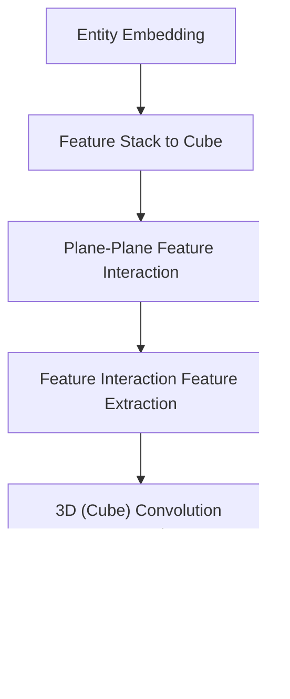
```mermaid
graph TD
  A["Entity Embedding"] --> B["Feature Stack to Cube"]
  B --> C["Plane-Plane Feature Interaction"]
  C --> D["Feature Interaction Feature Extraction"]
  D --> E["3D (Cube) Convolution Kernel"]
  E --> F["Relation Embedding"]
```

## ◼ Efficient Knowledge Hypergraph 3D Circular Convolutional Embedding

## Complex Semantic Knowledge Efficient

⚫ End-to-end efficient n-ary knowledge hypergraph embedding with fewer parameters  
⚫ Adaptively adjusting the structure of 3D circular convolutional layers

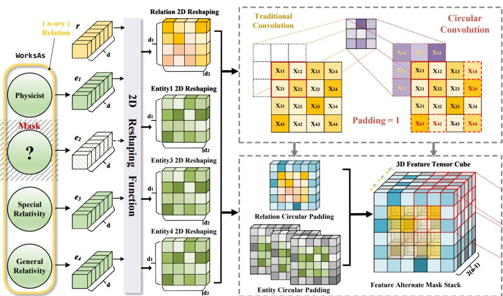

flowchart

```mermaid
graph TD
  A["WorksAs"] --> B["(n-ary) Relation"]
  B --> C["r"]
  C --> D["d"]
  D --> E["Relation 2D Reshaping"]
  E --> F["d1"]
  F --> G["d2"]
  G --> H["Entity1 2D Reshaping"]
  H --> I["d1"]
  I --> J["d2"]
  J --> K["Entity3 2D Reshaping"]
  K --> L["d1"]
  L --> M["d2"]
  M --> N["Entity4 2D Reshaping"]
  N --> O["d1"]
  O --> P["d2"]
    
  Q["Mask"] --> R["Physicist"]
  R --> S["e1"]
  S --> T["d"]
  T --> U["Relation 2D Reshaping"]
  U --> V["d1"]
  V --> W["d2"]
    
  X["Special Relativity"] --> Y["e2"]
  Y --> Z["d"]
  Z --> AA["Relation 2D Reshaping"]
  AA --> AB["d1"]
  AB --> AC["d2"]
    
  AD["General Relativity"] --> AE["e3"]
  AE --> AF["d"]
  AF --> AG["Relation 2D Reshaping"]
  AG --> AH["d1"]
  AH --> AI["d2"]
    
  E --> AJ["Traditional Convolution"]
  AJ --> AK["X44 X41 X42 X44"]
  AK --> AL["Padding = 1"]
    
  M --> AM["Circular Convolution"]
  AM --> AN["X44 X41 X42 X44"]
    
  N --> AO["Relation Circular Padding"]
  AO --> AP["Feature Alternate Mask Stack"]
    
  N --> AQ["Entity Circular Padding"]
  AQ --> AR["Feature Alternate Mask Stack"]
    
    style A fill:#f9f,stroke:#333
    style Q fill:#f9f,stroke:#333
    style AD fill:#f9f,stroke:#333
```

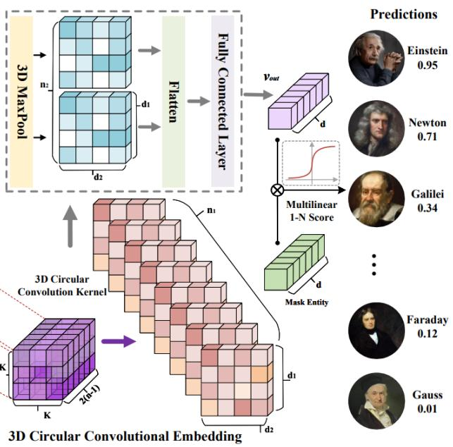

flowchart

```mermaid
graph TD
  A["3D MaxPool"] --> B["Flatten"]
  B --> C["Fully Connected Layer"]
  C --> D["Multi-Linear 1-N Score"]
  D --> E["Mask Entity"]
  E --> F["3D Circular Convolutional Embedding"]
  F --> G["3D Circular Convolution Kernel"]
  G --> H["3D MaxPool"]
  I["Predictions"] --> J["Einstein 0.95"]
  I --> K["Newton 0.71"]
  I --> L["Galilei 0.34"]
  I --> M["Faraday 0.12"]
  I --> N["Gauss 0.01"]
```

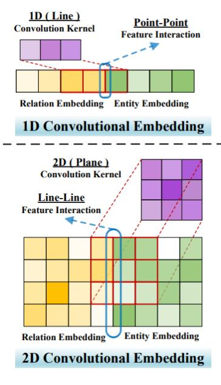

flowchart

```mermaid
graph TD
  A["1D (Line) Convolution Kernel"] --> B["Relation Embedding"]
  C["Point-Point Feature Interaction"] --> D["Entity Embedding"]
  E["1D Convolutional Embedding"] --> F["Line-Line Feature Interaction"]
  G["2D (Plane) Convolution Kernel"] --> H["Relation Embedding"]
  I["2D Convolutional Embedding"] --> J["Entity Embedding"]
```

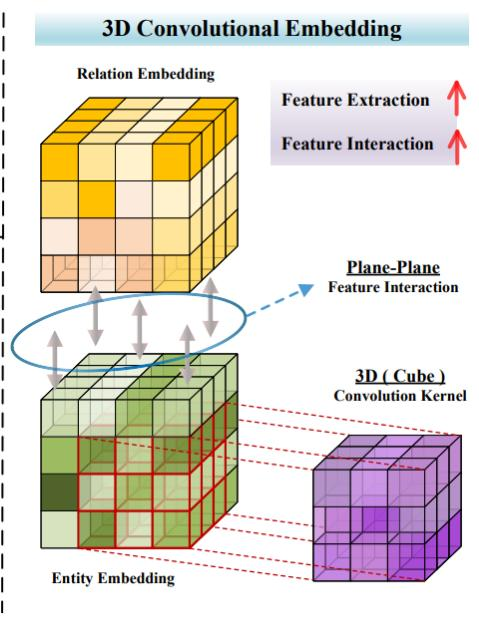

flowchart

```mermaid
graph TD
  A["Relation Embedding"] --> B["Plane-Plane Feature Interaction"]
  B --> C["Entity Embedding"]
  D["3D (Cube) Convolution Kernel"] --> C
  E["Feature Extraction"] --> F["Feature Interaction"]
  G["Feature Interaction"] --> H["Feature Interaction"]
```

## System Bottleneck

1. Gradual increase in memory requirements as the size of the knowledge graph and vector dimensions gradually increase  
2. Communication time becomes a major bottleneck limiting system performance (communication time >70 per cent)

## ◼ Optimising Motivation

1. Key embeddings are transmitted frequently during training  
2. Top-1% Entities and relationships accounted for 6 percent and 36 percent of communications traffic

Freebase-86

<table><tr><td>Number</td><td>dimension</td><td>storage</td><td>Percentage</td></tr><tr><td> $3 \times 10^{5}$ </td><td>400</td><td>275 MB</td><td>82.6%</td></tr><tr><td> $3 \times 10^{6}$ </td><td>400</td><td>2.7 GB</td><td>85.4%</td></tr><tr><td> $3 \times 10^{7}$ </td><td>400</td><td>27.5 GB</td><td>88.3%</td></tr><tr><td> $3 \times 10^{8}$ </td><td>400</td><td>275.2 GB</td><td>88.7%</td></tr><tr><td> $3 \times 10^{8}$ </td><td>50</td><td>34.4 GB</td><td>70.7%</td></tr><tr><td> $3 \times 10^{8}$ </td><td>100</td><td>68.8 GB</td><td>73.5%</td></tr><tr><td> $3 \times 10^{8}$ </td><td>200</td><td>137.6 GB</td><td>84.9%</td></tr><tr><td> $3 \times 10^{8}$ </td><td>400</td><td>275.2 GB</td><td>88.7%</td></tr></table>

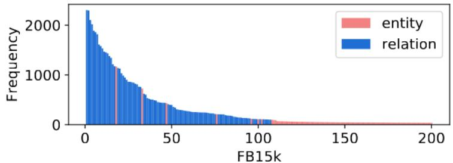

bar chart

| FB15k | entity | relation |
| ----- | ------ | -------- |
| 0     | 0      | 2300     |
| 10    | 0      | 1800     |
| 20    | 0      | 1400     |
| 30    | 0      | 1000     |
| 40    | 0      | 700      |
| 50    | 0      | 500      |
| 60    | 0      | 300      |
| 70    | 0      | 200      |
| 80    | 0      | 150      |
| 90    | 0      | 100      |
| 100   | 0      | 50       |
| 110   | 0      | 20       |
| 120   | 0      | 10       |
| 130   | 0      | 5        |
| 140   | 0      | 2        |
| 150   | 0      | 1        |
| 160   | 0      | 0        |
| 170   | 0      | 0        |
| 180   | 0      | 0        |
| 190   | 0      | 0        |
| 200   | 0      | 0        |

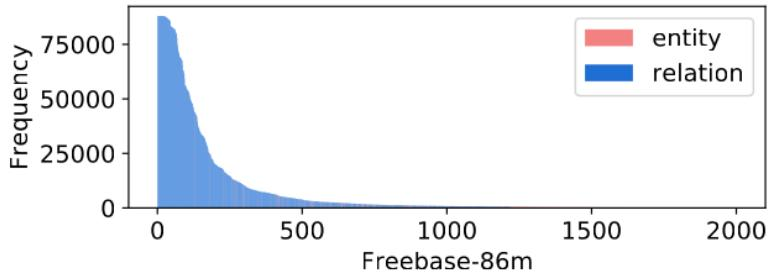

histogram

| Freebase-86m Range | entity Frequency | relation Frequency |
| ------------------ | ---------------- | ------------------- |
| 0 - 100            | ~90000           | ~90000              |
| 100 - 200          | ~50000           | ~50000              |
| 200 - 300          | ~25000           | ~25000              |
| 300 - 400          | ~15000           | ~15000              |
| 400 - 500          | ~10000           | ~10000              |
| 500 - 600          | ~5000            | ~5000               |
| 600 - 700          | ~2500            | ~2500               |
| 700 - 800          | ~1500            | ~1500               |
| 800 - 900          | ~1000            | ~1000               |
| 900 - 1000         | ~500             | ~500                |
| 1000 - 1100        | ~250             | ~250                |
| 1100 - 1200        | ~150             | ~150                |
| 1200 - 1300        | ~100             | ~100                |
| 1300 - 1400        | ~50              | ~50                 |
| 1400 - 1500        | ~25              | ~25                 |
| 1500 - 1600        | ~15              | ~15                 |
| 1600 - 1700        | ~10              | ~10                 |
| 1700 - 1800        | ~5               | ~5                  |
| 1800 - 1900        | ~2               | ~2                  |
| 1900 - 2000        | ~1               | ~1                  |

## System Workflow

1. Knowledge graph segmentation  
2. Sample prefetching, construction of key embedding tables  
3. Pulling parameters

4. Iterative Computing  
5. Push Gradient  
6. Key Embedding Synchronisation

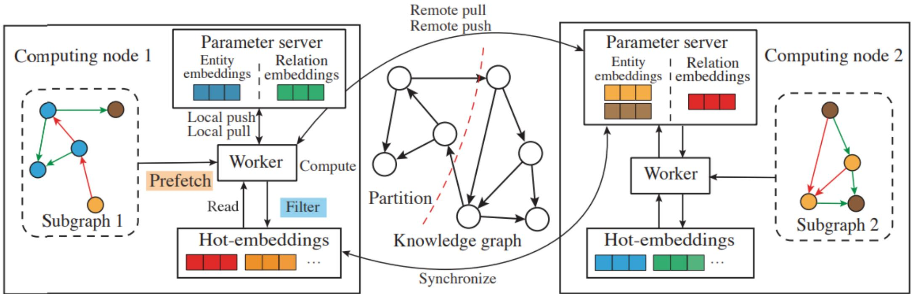

flowchart

```mermaid
graph TD
    subgraph Computing node 1
  A["Computing node 1"] --> B["Subgraph 1"]
  B --> C["Worker"]
  C --> D["Hot-embeddings"]
  D --> E["Filter"]
  E --> F["Local push"]
  F --> G["Local pull"]
  G --> H["Compute"]
  H --> I["Prefetch"]
  I --> J["Work"]
    end

    subgraph Parameter server
  K["Parameter server"] --> L["Entity embeddings"]
  K --> M["Relation embeddings"]
  L --> N["Local push"]
  M --> O["Local pull"]
  N --> P["Local pull"]
  O --> Q["Local pull"]
  P --> R["Local pull"]
  Q --> S["Local pull"]
  R --> T["Local pull"]
  S --> U["Local pull"]
  T --> V["Local pull"]
  U --> W["Local pull"]
  V --> X["Local pull"]
  W --> Y["Local pull"]
  X --> Z["Local pull"]
  Y --> AA["Local pull"]
  Z --> AB["Local pull"]
    end

    subgraph Knowledge graph
  AC["Knowledge graph"] --> AD["Partition"]
  AD --> AE["Worker"]
  AE --> AF["Synchronize"]
    end

    subgraph Parameter server
  AG["Parameter server"] --> AH["Entity embeddings"]
  AG --> AI["Relation embeddings"]
  AH --> AJ["Worker"]
  AI --> AK["Worker"]
  AJ --> AL["Worker"]
  AK --> AM["Worker"]
  AL --> AN["Worker"]
  AM --> AO["Worker"]
  AN --> AP["Worker"]
    end

    subgraph Subgraph Computing node 2
  AQ["Computing node 2"] --> AR["Subgraph 2"]
    end

    style Computing node 1 fill:#f9f,stroke:#333
    style Parameter server fill:#ccf,stroke:#333
    style Knowledge graph fill:#cfc,stroke:#333
    style Parameter server fill:#fcc,stroke:#333
    style Subgraph Computing node 2 fill:#ffc,stroke:#333
```

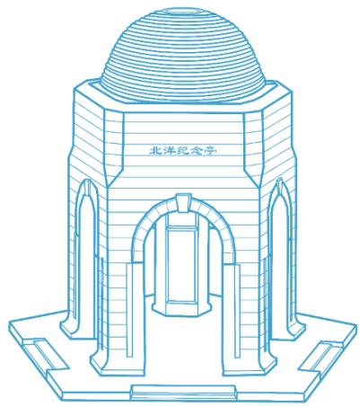

text_image

北洋紀念亭

C O N T E N T S

Overview of KG Development  
2 KG Representation Learning  
Semantic Representation 3 Learning for KG  
LLM-based KG 4 Representation Learning

## 知识图谱融合大模型表示学习

知识图谱融合大模型表示学习路线图  
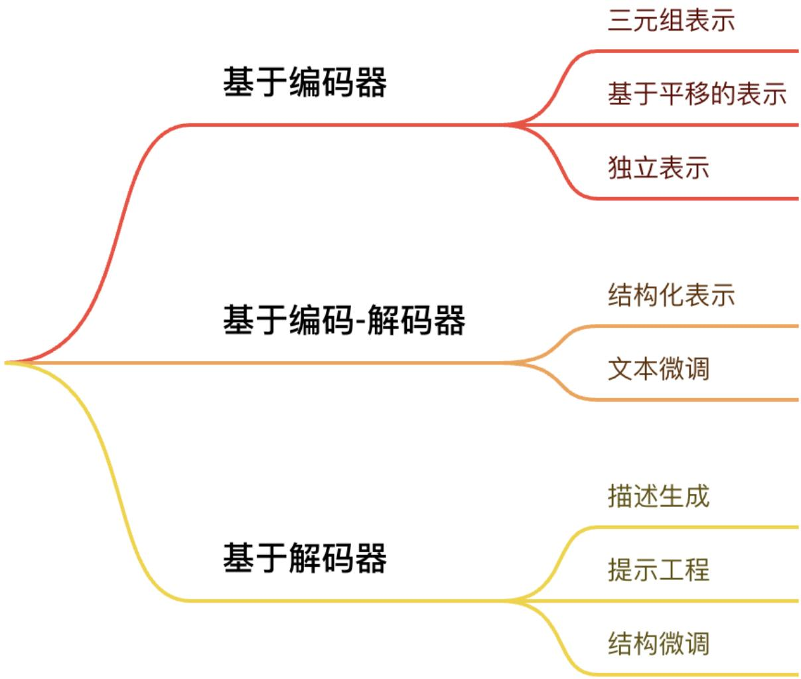

flowchart

```mermaid
graph TD
  A["基于编码器"] --> B["三元组表示"]
  A --> C["基于平移的表示"]
  A --> D["独立表示"]
  E["基于编码-解码器"] --> F["结构化表示"]
  E --> G["文本微调"]
  H["基于解码器"] --> I["描述生成"]
  H --> J["提示工程"]
  H --> K["结构微调"]
```

<table><tr><td>Year</td><td>Model</td><td>Type</td><td>Base model</td><td>Open source</td></tr><tr><td>2019</td><td>KG-BERT [18]</td><td>Encoder</td><td>BERT</td><td>Github</td></tr><tr><td rowspan="3">2020</td><td>MTL-KGC [19]</td><td>Encoder</td><td>BERT</td><td>Github</td></tr><tr><td>Pretrain-KGE [20]</td><td>Encoder</td><td>BERT</td><td>-</td></tr><tr><td>K-BERT [21]</td><td>Encoder</td><td>BERT</td><td>Github</td></tr><tr><td rowspan="9">2021</td><td>StAR [22]</td><td>Encoder</td><td>BERT, RoBERTa</td><td>Github</td></tr><tr><td>KG-GPT2 [23]</td><td>Decoder</td><td>GPT2</td><td>-</td></tr><tr><td>BERT-ResNet [24]</td><td>Encoder</td><td>BERT</td><td>Github</td></tr><tr><td>MEM-KGC [25]</td><td>Encoder</td><td>BERT</td><td>-</td></tr><tr><td>LaSS [26]</td><td>Encoder</td><td>BERT, RoBERTa</td><td>Github</td></tr><tr><td>KEPLER [27]</td><td>Encoder</td><td>RoBERTa</td><td>Github</td></tr><tr><td>BLP [28]</td><td>Encoder</td><td>BERT</td><td>Github</td></tr><tr><td>SimKGC [29]</td><td>Encoder</td><td>BERT</td><td>Github</td></tr><tr><td>MLMLM [30]</td><td>Encoder</td><td>RoBERTa</td><td>Github</td></tr><tr><td rowspan="8">2022</td><td>LP-BERT [31]</td><td>Encoder</td><td>BERT, RoBERTa</td><td>-</td></tr><tr><td>PKGC [32]</td><td>Encoder</td><td>BERT, RoBERTa, LUKE</td><td>Github</td></tr><tr><td>KGT5 [33]</td><td>Encoder-Decoder</td><td>T5</td><td>Github</td></tr><tr><td>OpenWorld KGC [34]</td><td>Encoder</td><td>BERT</td><td>-</td></tr><tr><td>kNN-KGE [35]</td><td>Encoder</td><td>BERT</td><td>Github</td></tr><tr><td>LMKE [36]</td><td>Encoder</td><td>BERT</td><td>Github</td></tr><tr><td>GenKGC [37]</td><td>Encoder-Decoder</td><td>BART</td><td>Github</td></tr><tr><td>KG-S2S [38]</td><td>Encoder-Decoder</td><td>T5</td><td>Github</td></tr><tr><td rowspan="6">2023</td><td>LambdaKG [39]</td><td>Encoder-Decoder</td><td>BERT, BART, T5</td><td>Github</td></tr><tr><td>CSPrompt-KG [40]</td><td>Encoder</td><td>BERT</td><td>Github</td></tr><tr><td>ReSKGC [41]</td><td>Encoder-Decoder</td><td>T5</td><td>-</td></tr><tr><td>ReasoningLM [42]</td><td>Encoder</td><td>RoBERTa</td><td>Github</td></tr><tr><td>KG-LLM [43]</td><td>Decoder</td><td>ChatGLM, LLaMA 2</td><td>Github</td></tr><tr><td>KoPA [44]</td><td>Decoder</td><td>Alpaca, LLaMA, GPT 3.5</td><td>Github</td></tr><tr><td rowspan="3">2024</td><td>CD [45]</td><td>Decoder</td><td>PaLM2</td><td>Github</td></tr><tr><td>CP-KGC [46]</td><td>Decoder</td><td>Qwen, LLaMA 2, GPT 4</td><td>Github</td></tr><tr><td>KICGPT [47]</td><td>Decoder</td><td>GPT 3.5</td><td>-</td></tr></table>

## 基于解码器的方法

双向知识注意力（BKA）：取消解码器因果掩码，同时关注过去、未来上下文，加强三元组间相互关联  
知识掩码预测（KMP）：有选择地掩码三元组和词汇标记，利用局部词汇上下文与全局图结构相结合以重构缺失标记，将丰富语义知识融入知识图谱嵌入表示  
⚫ 对比图语义聚合（CGSA）：多图采样视图之上应用对比学习，对齐结构与语义嵌入，保留图拓扑结构，增强判别能力，支持对新实体、关系编码

优势具体实现方式  
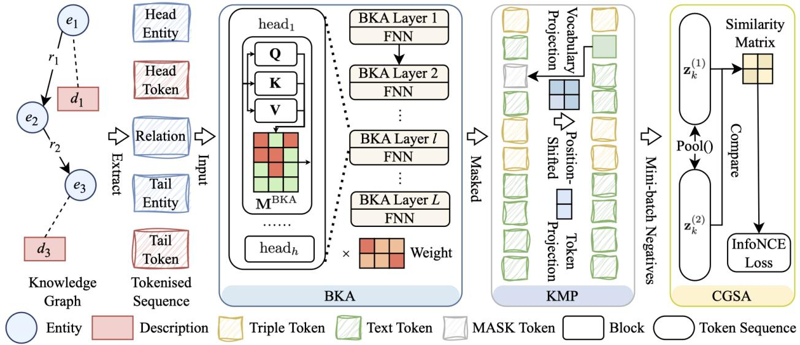

flowchart

Deep learning architecture diagram showing knowledge graph, token sequence extraction, BKA and KMP modules, similarity matrix generation, and CGSA output with token sequence.

KG-BiLM

## 知识图谱融合大模型表示学习

## 基于解码器的方法

Table 2: Summary of essential baseline link prediction metrics on WN18RR and FB15k-237 (ful table of results is available in AppendixD)

<table><tr><td rowspan="2">Model</td><td colspan="5">WN18RR</td><td colspan="5">FB15k-237</td></tr><tr><td>MR</td><td>MRR</td><td>Hits@1</td><td>Hits@3</td><td>Hits@10</td><td>MR</td><td>MRR</td><td>Hits@1</td><td>Hits@3</td><td>Hits@10</td></tr><tr><td>TransE [14]</td><td>2300</td><td>24.3</td><td>4.3</td><td>44.1</td><td>53.2</td><td>223</td><td>27.9</td><td>19.8</td><td>37.6</td><td>47.4</td></tr><tr><td>DistMult [15]</td><td>3704</td><td>44.4</td><td>41.2</td><td>47.0</td><td>50.4</td><td>411</td><td>28.1</td><td>19.9</td><td>30.1</td><td>44.6</td></tr><tr><td>ComplEx [37]</td><td>3921</td><td>44.9</td><td>40.9</td><td>46.9</td><td>53.0</td><td>508</td><td>27.8</td><td>19.4</td><td>29.7</td><td>45.0</td></tr><tr><td>ConvE [38]</td><td>4464</td><td>45.6</td><td>41.9</td><td>47.0</td><td>53.1</td><td>245</td><td>31.2</td><td>22.5</td><td>34.1</td><td>49.7</td></tr><tr><td>TuckER [39]</td><td>-</td><td>47.0</td><td>44.3</td><td>48.2</td><td>52.6</td><td>-</td><td>35.8</td><td>26.6</td><td>39.4</td><td>54.4</td></tr><tr><td>CompGCN [40]</td><td>-</td><td>47.9</td><td>44.3</td><td>49.4</td><td>54.6</td><td>-</td><td>35.5</td><td>26.4</td><td>39.0</td><td>53.5</td></tr><tr><td>QuatDE [41]</td><td>1977</td><td>48.9</td><td>43.8</td><td>50.9</td><td>58.6</td><td>90</td><td>36.5</td><td>26.8</td><td>40.0</td><td>56.3</td></tr><tr><td>NBFNet [42]</td><td>-</td><td>55.1</td><td>49.7</td><td>-</td><td>66.6</td><td>-</td><td>41.5</td><td>32.1</td><td>-</td><td>59.9</td></tr><tr><td>KG-BERT [27]</td><td>97</td><td>21.6</td><td>4.1</td><td>30.2</td><td>52.4</td><td>153</td><td>23.7</td><td>16.9</td><td>26.0</td><td>42.7</td></tr><tr><td>Pretrain-KGE [43]</td><td>-</td><td>48.8</td><td>43.7</td><td>50.9</td><td>58.6</td><td>-</td><td>35.0</td><td>25.0</td><td>38.4</td><td>55.4</td></tr><tr><td>LaSS [44]</td><td>35</td><td>-</td><td>-</td><td>-</td><td>78.6</td><td>108</td><td>-</td><td>-</td><td>-</td><td>53.3</td></tr><tr><td>SimKGC [45]</td><td>-</td><td>66.7</td><td>58.8</td><td>72.1</td><td>80.5</td><td>-</td><td>33.6</td><td>24.9</td><td>36.2</td><td>51.1</td></tr><tr><td>KG-S2S [46]</td><td>-</td><td>57.4</td><td>53.1</td><td>59.5</td><td>66.1</td><td>-</td><td>33.6</td><td>25.7</td><td>37.3</td><td>49.8</td></tr><tr><td>kNN-KGE [29]</td><td>-</td><td>57.9</td><td>52.5</td><td>-</td><td>-</td><td>-</td><td>28.0</td><td>37.3</td><td>-</td><td>-</td></tr><tr><td>CSPromp-KG [47]</td><td>-</td><td>57.5</td><td>52.2</td><td>59.6</td><td>67.8</td><td>-</td><td>35.8</td><td>26.9</td><td>39.3</td><td>53.8</td></tr><tr><td>GPT-3.5 [30]</td><td>-</td><td>-</td><td>19.0</td><td>-</td><td>-</td><td>-</td><td>-</td><td>23.7</td><td>-</td><td>-</td></tr><tr><td>CP-KGC [35]</td><td>-</td><td>67.3</td><td>59.9</td><td>72.1</td><td>80.4</td><td>-</td><td>33.8</td><td>25.1</td><td>36.5</td><td>51.6</td></tr><tr><td>KICGPT [48]</td><td>-</td><td>56.4</td><td>47.8</td><td>61.2</td><td>67.7</td><td>-</td><td>41.2</td><td>32.7</td><td>44.8</td><td>55.4</td></tr><tr><td>KG-BiLM(Ours)</td><td>67</td><td>68.2</td><td>61.4</td><td>72.7</td><td>80.5</td><td>151</td><td>36.7</td><td>30.5</td><td>36.9</td><td>53.1</td></tr></table>

Table 3: Summary of essential baseline link prediction metrics on Wikidata5M and FB15k-237N (full table of results is available in AppendixD

<table><tr><td rowspan="2">Model</td><td colspan="4">Wikidata5M</td><td colspan="4">FB15k-237N</td></tr><tr><td>MRR</td><td>Hits@1</td><td>Hits@3</td><td>Hits@10</td><td>MRR</td><td>Hits@1</td><td>Hits@3</td><td>Hits@10</td></tr><tr><td>TransE [14]</td><td>25.3</td><td>17.0</td><td>31.1</td><td>39.2</td><td>25.5</td><td>15.2</td><td>30.1</td><td>45.9</td></tr><tr><td>DistMult [15]</td><td>25.3</td><td>20.9</td><td>27.8</td><td>33.4</td><td>20.9</td><td>14.3</td><td>23.4</td><td>33.0</td></tr><tr><td>ComplEx [37]</td><td>30.8</td><td>25.5</td><td>-</td><td>39.8</td><td>24.9</td><td>18.0</td><td>27.6</td><td>38.0</td></tr><tr><td>RotatE [49]</td><td>29.0</td><td>23.4</td><td>32.2</td><td>39.0</td><td>27.9</td><td>17.7</td><td>32.0</td><td>48.1</td></tr><tr><td>QuatE [50]</td><td>27.6</td><td>22.7</td><td>30.1</td><td>35.9</td><td>-</td><td>-</td><td>-</td><td>-</td></tr><tr><td>ConvE [38]</td><td>-</td><td>-</td><td>-</td><td>-</td><td>27.3</td><td>19.2</td><td>30.5</td><td>42.9</td></tr><tr><td>CompGCN [40]</td><td>-</td><td>-</td><td>-</td><td>-</td><td>31.6</td><td>23.1</td><td>34.9</td><td>48.0</td></tr><tr><td>KG-BERT [27]</td><td>-</td><td>-</td><td>-</td><td>-</td><td>20.3</td><td>13.9</td><td>20.1</td><td>40.3</td></tr><tr><td>KG-S2S [46]</td><td>-</td><td>-</td><td>-</td><td>-</td><td>35.4</td><td>28.5</td><td>38.8</td><td>49.3</td></tr><tr><td>KEPLER [28]</td><td>21.0</td><td>17.3</td><td>22.4</td><td>27.7</td><td>-</td><td>-</td><td>-</td><td>-</td></tr><tr><td>SimKGC [45]</td><td>35.8</td><td>31.3</td><td>37.6</td><td>44.1</td><td>-</td><td>-</td><td>-</td><td>-</td></tr><tr><td>CSPrompt-KG [47]</td><td>38.0</td><td>34.3</td><td>39.9</td><td>44.6</td><td>36.0</td><td>28.1</td><td>39.5</td><td>51.1</td></tr><tr><td>ReSKGC [51]</td><td>39.6</td><td>37.3</td><td>41.3</td><td>43.7</td><td>-</td><td>-</td><td>-</td><td>-</td></tr><tr><td>CD [34]</td><td>-</td><td>-</td><td>-</td><td>-</td><td>37.2</td><td>28.8</td><td>41.0</td><td>53.0</td></tr><tr><td>KG-BiLM(Ours)</td><td>40.3</td><td>39.7</td><td>43.0</td><td>45.2</td><td>37.8</td><td>29.3</td><td>42.1</td><td>54.6</td></tr></table>

纯结构数据结果表明，通过消除因果掩码实现全局双向上下文建模，在 WN18RR 上获得最高 MRR 并在FB15k-237 上实现与 Transformer 类接近的效果，验证其双向建模优势

结构+语义数据结果表明，利用知识掩码预测和多图采样对齐策略，成功整合语义信息与图拓扑结构，在Wikidata5M 和 FB15k-237N 数据集上显著刷新 MRR 和 Hits@1 指标，有效提升对长尾实体的识别能力

## 知识图谱融合大模型表示学习

## 基于解码器的方法

Table 4: Ablation on validation split.

<table><tr><td rowspan="2">Variant</td><td colspan="2">Wikidata5M</td><td colspan="2">FB15k-237N</td></tr><tr><td>MRR</td><td>H@10</td><td>MRR</td><td>H@10</td></tr><tr><td>Full model</td><td>.403</td><td>.452</td><td>.378</td><td>.546</td></tr><tr><td>w/o BKA</td><td>.383</td><td>.426</td><td>.361</td><td>.525</td></tr><tr><td>w/o KMP</td><td>.390</td><td>.432</td><td>.366</td><td>.531</td></tr><tr><td>w/o CGSA</td><td>.397</td><td>.440</td><td>.370</td><td>.538</td></tr></table>

Table 5: Link prediction in zero-shot set-ting on Wikidata5M dataset.

<table><tr><td rowspan="2">Model</td><td colspan="4">Wikidata5M</td></tr><tr><td>MRR</td><td>Hits@1</td><td>Hits@3</td><td>Hits@10</td></tr><tr><td>DKRL [52]</td><td>23.1</td><td>5.9</td><td>32.0</td><td>54.6</td></tr><tr><td>RoBERTa [24]</td><td>7.4</td><td>0.7</td><td>1.0</td><td>19.6</td></tr><tr><td>KEPLER [28]</td><td>40.2</td><td>22.2</td><td>51.4</td><td>73.0</td></tr><tr><td>SimKGC [45]</td><td>71.4</td><td>50.9</td><td>78.5</td><td>91.7</td></tr><tr><td>KG-BiLM(Ours)</td><td>74.8</td><td>53.7</td><td>81.6</td><td>93.8</td></tr></table>

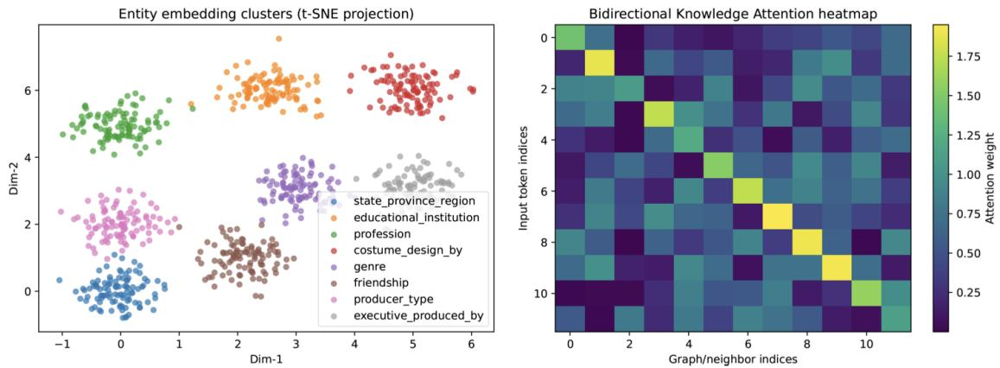  
Figure 3: Results of Entity Embedding Clusters and Knowledge-Atention Heatmap.

消融实验结果显示，双向知识注意力对表征有效性贡献最大，对比图语义聚合优化正确实体的精细排序，验证架构创新的核心作用

零样本评估中，借助上下文和部分缺失信息，增强对未见实体与低频词的泛化能力

可视化结果表明，通过双向掩码形成的实体嵌入空间结构清晰且聚类紧凑，即使罕见实体也能实现良好区分，验证其面向拓扑的非局部推理能力