## 知识工程

# 知识数据分析与挖掘

王 鑫

wangx@ tju.edu.cn

天津大学智能与计算学部人工智能学院


<details>
<summary>text_image</summary>

智能与计算学部
COLLEGE OF INTELUS COUNCING AND TECHNOLOGY
人工智能学院
网络安全学院
国家示范性软件学院
计算机科学与技术学院
55教学楼
</details>


<details>
<summary>text_image</summary>

55
智能与计算学部
</details>

## 知识数据分析与挖掘

是指从知识数据中分析和挖掘出隐藏的、有价值的、更高层面的知识

## 知识图谱是具有丰富语义的图结构数据

图数据分析和挖掘算法可以直接或经过适配用于知识图谱数据

## 知识图谱数据分析

中心性 （PageRank）  
路径搜索 (Dijkstra)  
社区检测 (Louvain)

## 知识图谱数据挖掘

相似性 (KNN)  
节点嵌入 (Node2Vec)  
知识图谱嵌入 (TransE)

## 中心性Centrality

## 图数据的矩阵表示

邻接矩阵 Adjacency Matrices

Represent a graph as an n x n square matrix M

⚫ $\boldsymbol { n } = | \mathsf { V } |$  
$M _ { i j } = 1$ means a link from node i to j

<table><tr><td></td><td>1</td><td>2</td><td>3</td><td>4</td></tr><tr><td>1</td><td>0</td><td>1</td><td>0</td><td>1</td></tr><tr><td>2</td><td>1</td><td>0</td><td>1</td><td>1</td></tr><tr><td>3</td><td>1</td><td>0</td><td>0</td><td>0</td></tr><tr><td>4</td><td>1</td><td>0</td><td>1</td><td>0</td></tr></table>

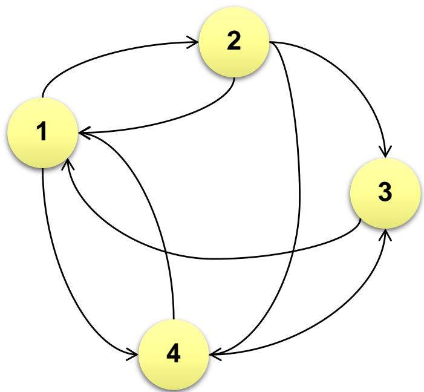

<details>
<summary>flowchart</summary>

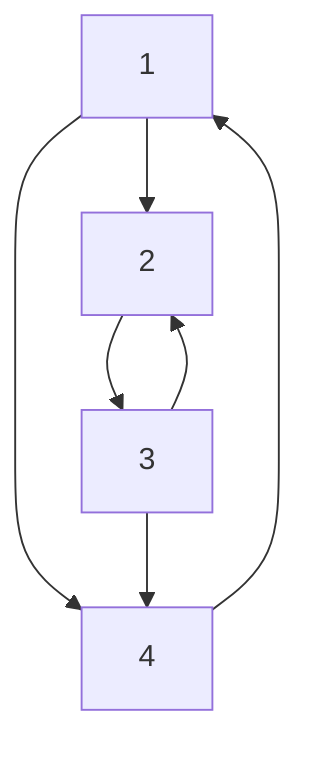
</details>

## 中心性

• 中心性算法被用来确定图中不同节点的重要性  
中心性的常见使用案例有:

–推荐: 识别并推荐产品目录中最有影响力或最受欢迎的项目  
–供应链分析: 找到供应链中最关键的节点，比如网络中的供应商，制造成品的部分原材料，或者是航线中的一个港口  
–欺诈和异常检测 (anomaly detection) : 寻找有许多共同标识符的用户，或在多个社区之间充当桥梁的用户.

## 度中心性 （degree centrality）

• 最普遍和最简单的中心性算法之一  
• 计算一个节点拥有的关系数量  
• 外度 (out-degree) 中心性–即计算从一个节点发出的关系

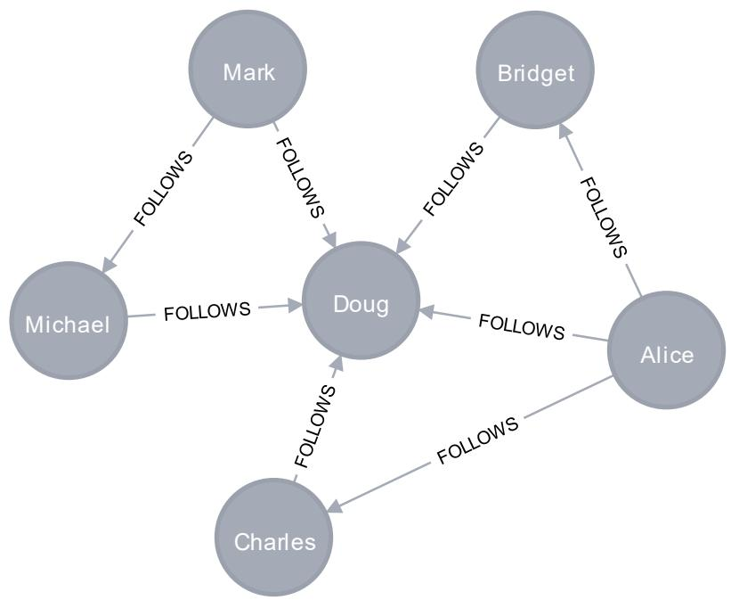

<details>
<summary>flowchart</summary>

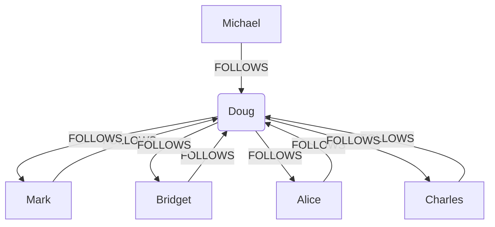
</details>

<table><tr><td>name</td><td>followers</td></tr><tr><td>&quot;Doug&quot;</td><td>5.0</td></tr><tr><td>&quot;Michael&quot;</td><td>1.0</td></tr><tr><td>&quot;Charles&quot;</td><td>1.0</td></tr><tr><td>&quot;Bridget&quot;</td><td>1.0</td></tr><tr><td>&quot;Mark&quot;</td><td>0.0</td></tr><tr><td>&quot;Alice&quot;</td><td>0.0</td></tr></table>

## PageRank

• 适合于衡量有向图 (directed graph) 中节点影响力  
• 由谷歌创始人 Larry Page 和 Sergey Brin 于 1996 年开发  
• 被谷歌搜索公司用于在其搜索引擎结果中对网页进行排名  
• The PageRank algorithm measures the importance of each node within the graph, based on the number of incoming relationships and the importance of the corresponding source nodes.

$$
P R (x) = \alpha \left(\frac {1}{N}\right) + (1 - \alpha) \sum_ {i = 1} ^ {n} \frac {P R (t _ {i})}{C (t _ {i})}
$$

## Random Walks Over the Web

## Random surfer model:

⚫ User starts at a random Web page  
⚫ User randomly clicks on links, surfing from page to page

## PageRank

⚫ A measure of how frequently a page would be encountered by our tireless web surfer  
⚫ Mathematically, a probability distribution over pages, representing the likelihood that a random walk over the link structure will arrive at a particular node

## Random Walks Over the Web

## PageRank captures notions of page quality

⚫ Nodes that have high in-degrees tend to have high PageRank  
⚫ Nodes that are linked to by other nodes with high PageRank  
Correspondence to human intuition?

## Random Walks Over the Web

## Random jump

⚫ Our web surfer doesn’t just randomly click links  
⚫ The surfer decides where to go next: a coin is flipped

•Heads: the surfer clicks on a random link on the page as usual

•Tails: the surfer ignores the links on the page and randomly “jumps” to a completely different page

## PageRank: Defined

Given page x with inlinks $t _ { l } . . . t _ { n } ,$ where

C(t) is the out-degree of t  
⚫ is probability of random jump: random jumping factor  
N is the total number of nodes in the graph

$$
P R (x) = \alpha \left(\frac {1}{N}\right) + (1 - \alpha) \sum_ {i = 1} ^ {n} \frac {P R (t _ {i})}{C (t _ {i})}
$$

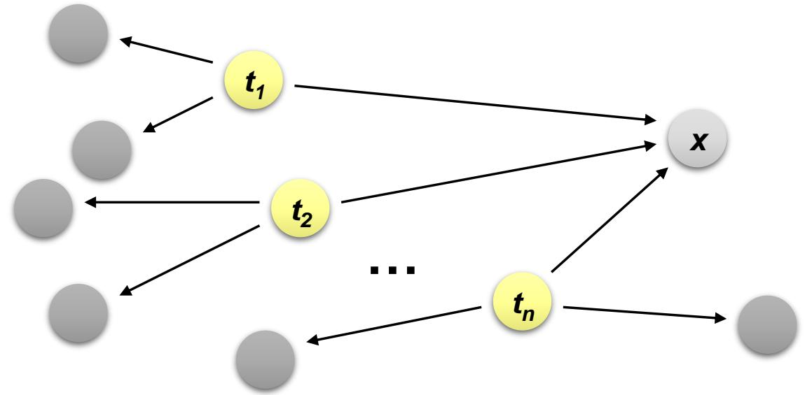

<details>
<summary>flowchart</summary>

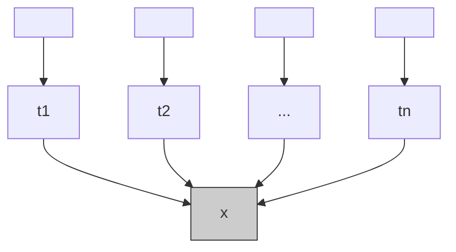
</details>

## PageRank: Defined

 $P R ( x )$

$$
P R (x) = \alpha \left(\frac {1}{N}\right) + (1 - \alpha) \sum_ {i = 1} ^ {n} \frac {P R (t _ {i})}{C (t _ {i})}
$$

⚫ Is defined recursively: iterative algorithm  
⚫ R v P R n “ n b n ” f m p n

A random surfer at $t _ { i }$ will arrive at x with probability 1/C(ti)  
Since PR(ti) is the probability that the random surfer will be at $t _ { i }$  
The probability of arriving at x from $t _ { i }$ is PR(ti)/C(ti)  
• Sum contributions from all pages that link to x:

$$
\sum_ {i = 1} ^ {n} \frac {P R (t _ {i})}{C (t _ {i})}
$$

⚫ Take into account the random jump: 1/N chance of landing at any particular page

## Sample PageRank Iteration (1)

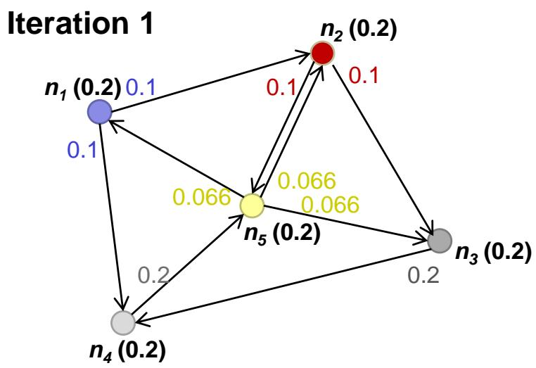

<details>
<summary>radar chart</summary>

Iteration 1
| Node | Edge Weight |
|---|---|
| n₁ (0.2) | 0.1 |
| n₂ (0.2) | 0.1 |
| n₃ (0.2) | 0.2 |
| n₄ (0.2) | 0.2 |
| n₅ (0.2) | 0.066 |
| n₁ (0.2) | 0.1 |
| n₂ (0.2) | 0.1 |
| n₃ (0.2) | 0.2 |
| n₄ (0.2) | 0.2 |
| n₅ (0.2) | 0.066 |
The diagram shows a directed graph with edges labeled by edge weights.
</details>

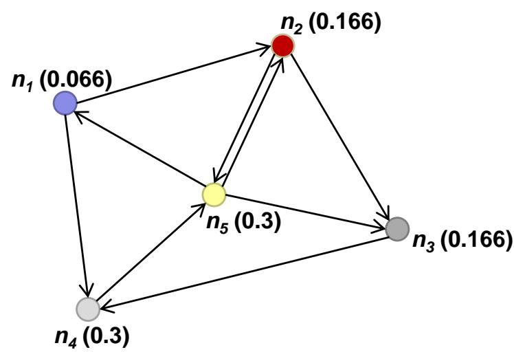

<details>
<summary>radar chart</summary>

| Node | Weight |
|---|---|
| n₁ | 0.066 |
| n₂ | 0.166 |
| n₃ | 0.166 |
| n₄ | 0.3 |
| n₅ | 0.3 |
</details>

## Sample PageRank Iteration (2)

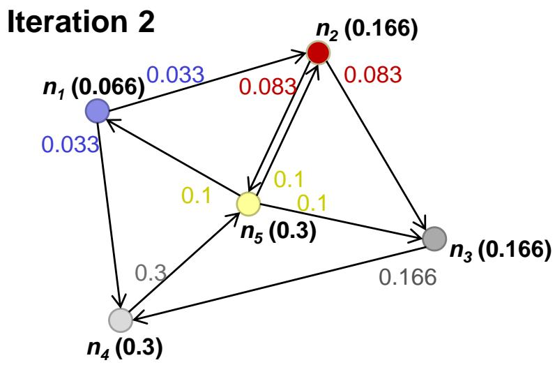

<details>
<summary>radar chart</summary>

Iteration 2
| Node | Edge Value | Weight |
|---|---|---|
| n₁ | 0.033 | 0.033 |
| n₂ | 0.083 | 0.166 |
| n₃ | 0.166 | 0.166 |
| n₄ | 0.3 | 0.3 |
| n₅ | 0.1 | 0.3 |
| n₁ (0.066) | 0.033 | 0.033 |
| n₂ (0.166) | 0.083 | 0.166 |
| n₃ (0.166) | 0.166 | 0.166 |
| n₄ (0.3) | 0.3 | 0.3 |
| n₅ (0.3) | 0.1 | 0.1 |
</details>

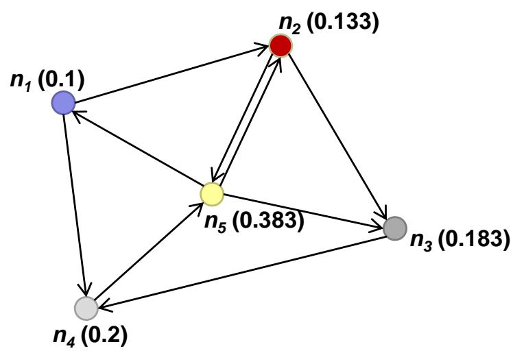

<details>
<summary>radar chart</summary>

| Node | Value |
|---|---|
| n₁ (0.1) | 0.1 |
| n₂ (0.133) | 0.133 |
| n₅ (0.383) | 0.383 |
| n₃ (0.183) | 0.183 |
| n₄ (0.2) | 0.2 |
The chart displays a complete graph with five nodes connected by edges, indicating a network or hierarchical structure.
</details>

## 路径搜索 Path Finding

## Dijkstra算法

Dijkstra单源最短路径算法 Dijkstra Single-Source Shortest Path

– 由荷兰计算机科学家Dijkstra于1959年提出的  
– 采用贪心算法的策略，每次遍历到始点距离最近且未访问过的顶点的邻接 节点，直到扩展到终点为止

• 计算一个源节点和一个目标节点之间的最短路径

–支持加权关系，以便在比较路径时考虑距离或其他成本属性  
The Dijkstra Single-Source algorithm computes the shortest paths between a source node and all nodes reachable from that node.

## Dijkstra算法

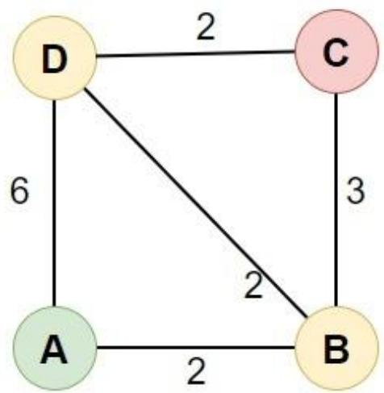

<details>
<summary>flowchart</summary>

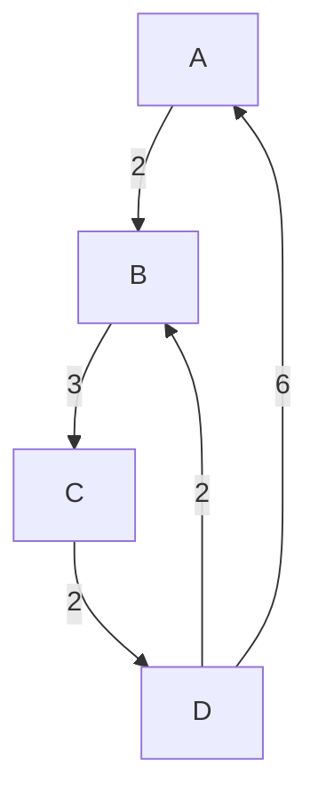
</details>

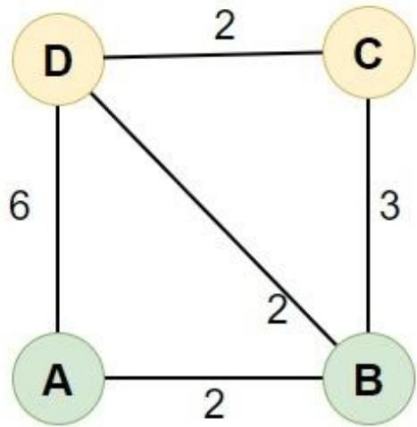

<details>
<summary>flowchart</summary>

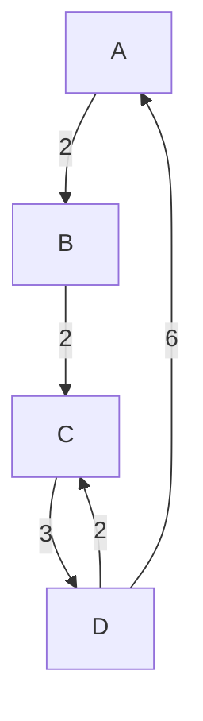
</details>

每次从 「未求出最短路径的点」中 取出 距离起点 最小路径的点

以这个点为桥梁 刷新「未求出最短路径的点」的距离

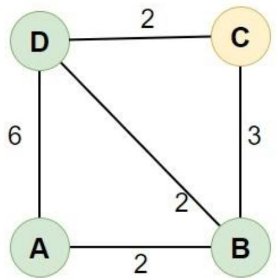

<details>
<summary>flowchart</summary>


</details>

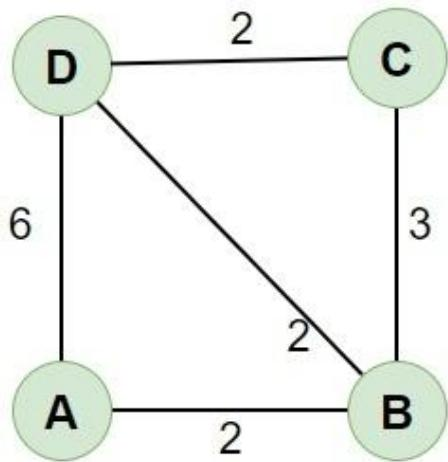

<details>
<summary>flowchart</summary>


</details>

## 其他路径搜索算法

## • 两个节点之间的最短路径

– A \* 算法最短路径 (A\* Shortest Path) : Dijkstra 算法的一个扩展，使用启发式函数来加快计算速度  
– 颜氏算法最短路径 (Yen's Algorithm Shortest Path) : Dijkstra 的一个扩展，允许找到多条最短路径，即前 k 条最短路径.

## • 一个源节点与多个其他目标节点之间的最短路径

– Dijkstra 单源最短路径 (Dijkstra Single-Source Shortest Path) : Dijkstra 算法在一个源和多 个目标之间最短路径的实现.  
– Delta-Stepping 单源最短路径 (Delta-Stepping Single-Source Shortest Path) : 平行的最短路径计算。计算速度比 Dijkstra 单源最短路径快，但使用更多内存.

## 一个源节点与多个其他目标节点之间的一般路径搜索

广度优先搜索 (Breadth-First Search, BFS) : 在每次迭代中，按照与源节点距离增加的顺序搜索路径.  
– 深度优先搜索 (Depth First Search, DFS) : 在每次迭代中沿单一多跳路径尽可能地搜索.

## 社区检测

## Community Detection

## 社区检测 (Community Detection) 算法

社区检测算法被用来评估节点组在图中的聚类或分区情况  
社区检测的常见用例包括:

– 欺诈检测: 通过识别经常发生可疑交易的账户及相互之间共享标识符，找到欺诈团伙.  
– 客户画像: 将多个记录和互动区分为一个单一的客户档案，这样一个组织就有了一个关于每个客户信息来源的汇总.  
– 市场细分: 根据优先级、行为、兴趣和其他标准，将目标市场划分为好接触的子群体.

## Louvain算法

• Louvain 算法对每个社区的模块化程度进行了最大化  
• 模块化度量了将节点分配给社区的质量

– 就是度量一个节点在社区中联系的紧密程度比在随机网络中的联系紧密多少  
– 通过层次聚类递归地将社区合并在一起来实现模块优化

• 有多个参数可用于控制 Louvain 算法的性能和产生的社区数量和规模

– 包括最大的迭代次数和使用的层级，以及评估收敛 / 停止条件的容忍度参数  
– Louvain 是一个随机的算法。社区分配在重新运行时可能会有变化

## Louvain算法

Louvain 算法对每个社区的模块化程度进行了最大化• 模块化度量了将节点分配给社区的质量

Negative Modularity  
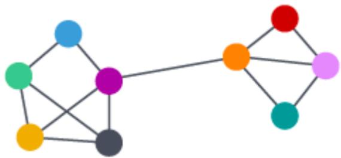

<details>
<summary>natural_image</summary>

Abstract network diagram with colored nodes and connecting lines (no text or labels)
</details>

Single Community  
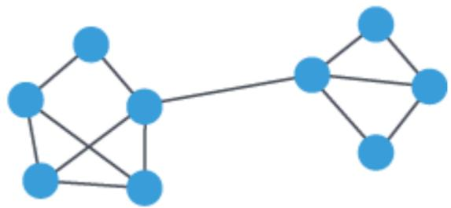

<details>
<summary>natural_image</summary>

Abstract geometric diagram with interconnected blue nodes and lines (no text or symbols)
</details>

Suboptimal Modularity  
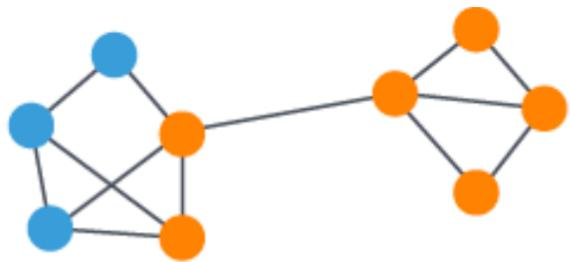

<details>
<summary>natural_image</summary>

Abstract geometric diagram with blue and orange nodes connected by gray lines (no text or symbols)
</details>

Optimal Modularity  
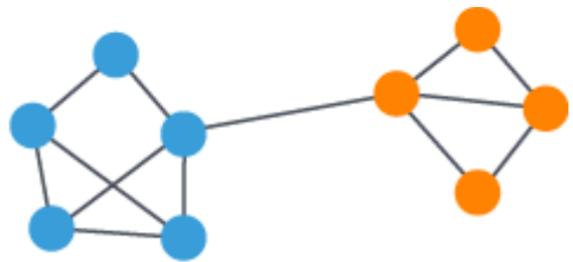

<details>
<summary>natural_image</summary>

Abstract diagram of two connected graph structures with blue and orange nodes (no text or labels)
</details>

## Louvain算法

## 模块度 （Modularity ）

模块度是评估一个社区网络划分好坏的度量方法

$$
Q = \frac {1}{2 m} \sum_ {i, j} [ A _ {i j} - \frac {k _ {i} k _ {j}}{2 m} ] \delta (c _ {i}, c _ {j})
$$

物理含义是社区内节点的连边数与随机情况下的边数之差

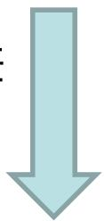

$$
Q = \sum_ {c} [ \frac {\Sigma i n}{2 m} - (\frac {\Sigma t o t}{2 m}) ^ {2} ]
$$

$A _ { i j }$ 节点i和节点j之间边的权重

$$
k _ {i} = \sum_ {j} A _ {i j} \text {所有与节点} i \text {相连的边的权重之和（度数）}
$$

$c _ { i }$ 节点i所属的社区

$$
m = \frac {1}{2} \sum_ {i j} A _ {i j} \text {   所有边的权重之和（边的数目）   }
$$

$\frac { k _ { i } k _ { j } } { 2 m }$ kikj 随机情况下节点i与j之间的边数量

$$
\delta (c _ {i}, c _ {j}) = \left\{ \begin{array}{l l} 1 & \text { if } c _ {i} \text { and } c _ {j} \text { are   the   same   cluster } \\ 0 & \text { otherwise } \end{array} \right.
$$

表示社区c内的边的权重之和

表示与社区c内的节点相连的边的权重之和

## Louvain算法

1）将图中的每个节点看成一个独立的社区，社区的数目与节点个数相同；  
2）对每个节点i，依次尝试把节点i分配到其每个邻居节点所在的社区，计算分配前与分配后的模块度变化ΔQ，并记录ΔQ最大的那个邻居节点，如果最大的ΔQ>0，则把节点i分配到ΔQ最大的那个邻居节点所在的社区，否则保持不变；  
3）重复2），直到所有节点的所属社区不再变化；  
4）对图进行压缩，将所有在同一个社区的节点压缩成一个新节点，社区内节点之间的边的权重转化为新节点的环的权重，社区间的边权重转化为新节点间的边权重；  
5）重复1）直到整个图的模块度不再发生变化。

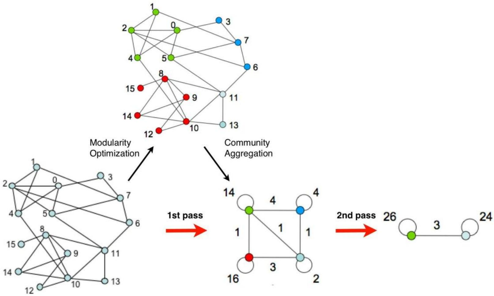

<details>
<summary>flowchart</summary>

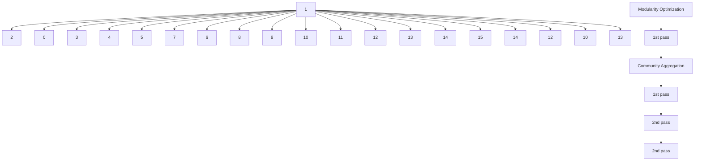
</details>

Figure 1. Visualization of the steps of our algorithm. Each pass is made of two phases: one where modularity is optimized by allowing only local changes of communities; one where the found communities are aggregated in order to build a new network of communities. The passes are repeated iteratively until no increase of modularity is possible.

$$
\Delta Q = \left[ \frac {\sum_ {i n} + k _ {i , i n}}{2 m} - \left(\frac {\sum_ {t o t} + k _ {i}}{2 m}\right) ^ {2} \right] - \left[ \frac {\sum_ {i n}}{2 m} - \left(\frac {\sum_ {t o t}}{2 m}\right) ^ {2} - \left(\frac {k _ {i}}{2 m}\right) ^ {2} \right]
$$

## Louvain算法

Louvain算法的思路： “不择手段地把图的模块化指数Q搞大”

Louvain算法也就是个贪心算法，主要分为以下几步：

第一步，将图中每个节点都看作一个社区（没错就是一个节点的社区），尝试让某个节点加入邻居的社区，计算图的模块化指数增量ΔQ，并最终选择一个ΔQ最大的邻居社区加入，比如下图我们从编号为0的节点开始，经过第一步后有如下过程：

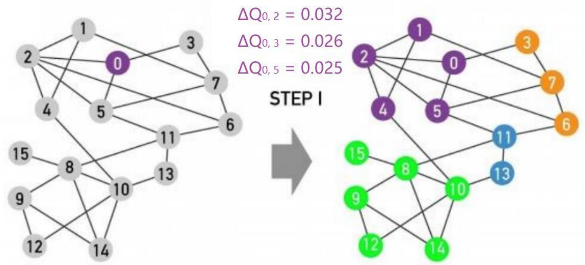

<details>
<summary>flowchart</summary>

```mermaid
graph TD
    subgraph Step_I[STEP I]
  A1["1"] --> B0["0"]
  A2["2"] --> B0["0"]
  A3["3"] --> B0["0"]
  A4["4"] --> B0["0"]
  A5["5"] --> B0["0"]
  A6["6"] --> B0["0"]
  A7["7"] --> B0["0"]
  A8["8"] --> B0["0"]
  A9["9"] --> B0["0"]
  A10["10"] --> B0["0"]
  A11["11"] --> B0["0"]
  A12["12"] --> B0["0"]
  A13["13"] --> B0["0"]
  A14["14"] --> B0["0"]
    end

    subgraph Step_I_1
  B1["1"] --> C0["2"]
  B2["2"] --> C0["2"]
  B3["3"] --> C0["2"]
  B4["4"] --> C0["2"]
  B5["5"] --> C0["2"]
  B6["6"] --> C0["2"]
  B7["7"] --> C0["2"]
  B8["8"] --> C0["2"]
  B9["9"] --> C0["2"]
  B10["10"] --> C0["2"]
  B11["11"] --> C0["2"]
  B12["12"] --> C0["2"]
  B13["13"] --> C0["2"]
  B14["14"] --> C0["2"]
    end

    Step_I_1_1
    Step_I_1_2 = 0.032
    Step_I_1_3 = 0.026
    Step_I_1_5 = 0.025
    Step_I_1_6 = 0.025
    Step_I_1_7 = 0.025
    Step_I_1_8 = 0.025
    Step_I_1_9 = 0.025
    Step_I_1_10 = 0.025
    Step_I_1_11 = 0.025
    Step_I_1_12 = 0.025
    Step_I_1_13 = 0.025
    Step_I_1_14 = 0.025
```
</details>

## Louvain算法

Louvain算法的思路： “不择手段地把图的模块化指数Q搞大”

Louvain算法也就是个贪心算法，主要分为以下几步：

第一步，将图中每个节点都看作一个社区（没错就是一个节点的社区），尝试让某个节点加入邻居的社区，计算图的模块化指数增量ΔQ，并最终选择一个ΔQ最大的邻居社区加入，比如下图我们从编号为0的节点开始，经过第一步后有如下过程：

每次都要重新计算全局的ΔQ也太麻烦了，我们只需要计算这个局部ΔQ就可以，那么这个局部ΔQ就可以表示为：

$$
\Delta Q (i \rightarrow C) = \left[ \frac {\sum_ {i n} + k _ {i , i n}}{2 m} - \left(\frac {\sum_ {t o t} + k _ {i}}{2 m}\right) ^ {2} \right] \quad - \underbrace {\left[ \frac {\sum_ {i n}}{2 m} - \left(\frac {\sum_ {t o t}}{2 m}\right) ^ {2} - \left(\frac {k _ {i}}{2 m}\right) ^ {2} \right]} _ {\text {Modularity of C}} \quad \text {将} i \text {节点加入社区C之前，社区C的局部模块化指数Q和节点} i \text {原社区的模块化指数Q之和方程左边表示节点} i \text {加入社区C}
$$

## Louvain算法

Louvain算法的思路： “不择手段地把图的模块化指数Q搞大”

Louvain算法也就是个贪心算法，主要分为以下几步：

第二步，在第一步的基础上，把划分出来的社区当成一个超节点看待，如下图所示：

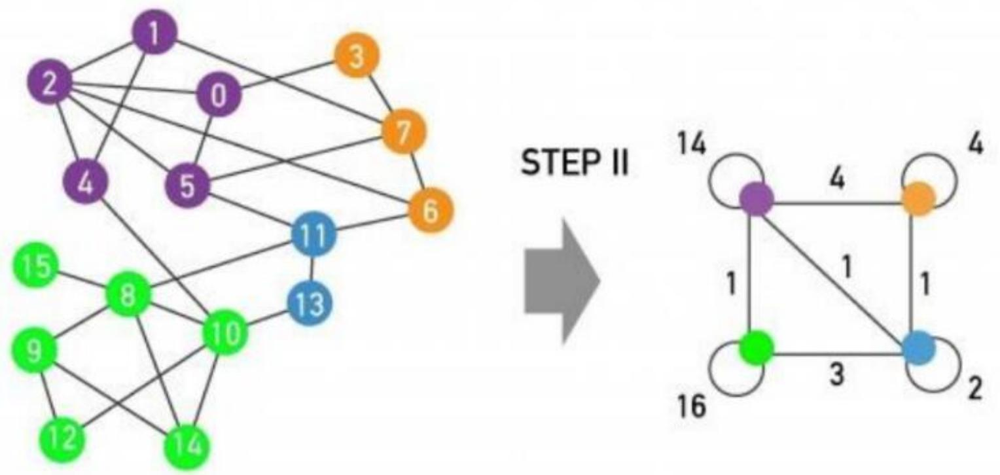

<details>
<summary>flowchart</summary>

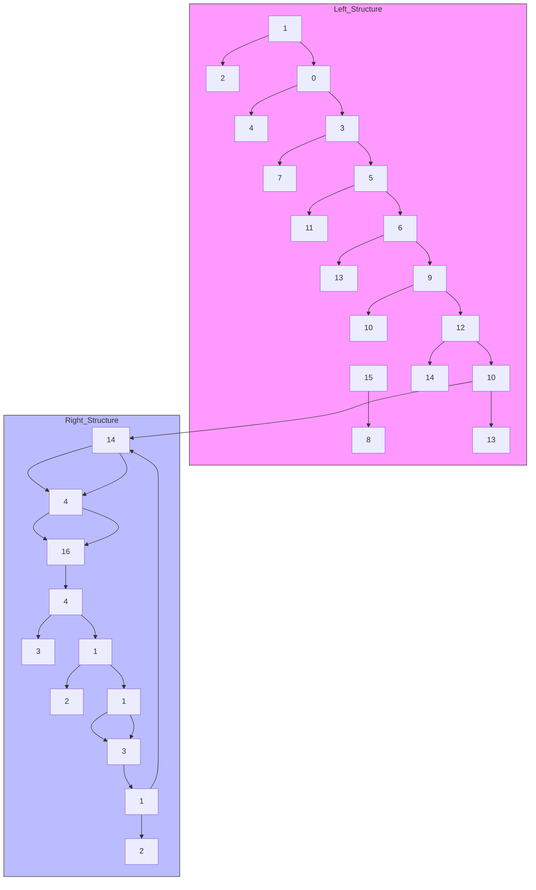
</details>

•超节点对应的社区内部存在边，需要把它们的权重求和，并作为超节点自环的权重  
•超节点之间的社区存在边，需要把它们的权重求和，并作为超节点之间的边权重

## Louvain算法

Louvain算法的思路： “不择手段地把图的模块化指数Q搞大”

Louvain算法也就是个贪心算法，主要分为以下几步：

第三步，如果算法已经达到了目标（比如最大的ΔQ小于某个值）那么算法结束，否则将超节点视为普通节点，并回到第一步。这里展示第二轮循环的结果：

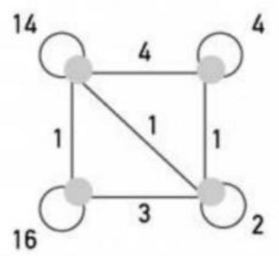

<details>
<summary>flowchart</summary>

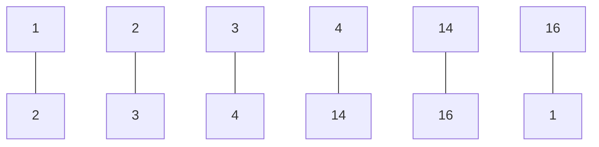
</details>

STEPI  


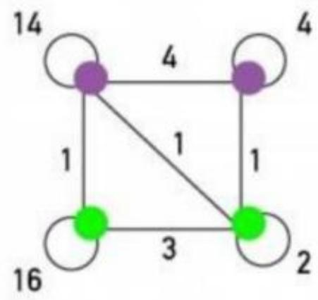

<details>
<summary>flowchart</summary>

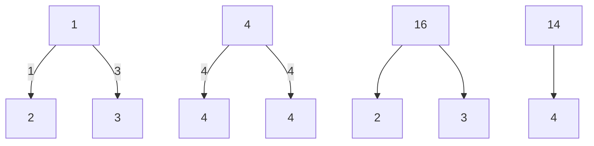
</details>

STEPI  


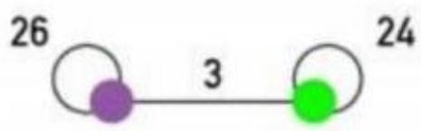

<details>
<summary>flowchart</summary>

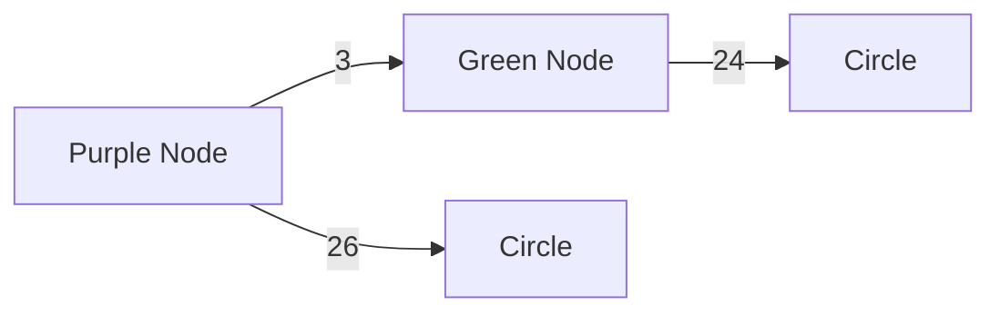
</details>

## 其他社区检测算法

• 标签传播 (Label Propagation)

– 与 Louvain 算法相似。是可以很好地并行的快速算法。对于大型图非常合适

• 弱连接成分 (Weakly Connected Components, WCC)

– 将图划分为连接节点的集合，以使得

• 在同一集合中，任何节点能到达任意其他节点  
• 不同集合的节点之间不存在路径

三角形计数 (Triangle Count)

– 计算每个节点的三角形的数量。可用于检测社区的凝聚力和图的稳定性

• 局部聚类系数 (Local Clustering Coefficient)

– 计算图中每个节点的本地聚类系数，这是一个描述该节点与其相邻节点聚集程度的指标