## 知识工程

# 知识数据分析与挖掘

王 鑫

wangx@ tju.edu.cn

天津大学智能与计算学部人工智能学院


<details>
<summary>text_image</summary>

智能与计算学部
COLLEGE OF INTELUS COUNCING AND TECHNOLOGY
人工智能学院
网络安全学院
国家示范性软件学院
计算机科学与技术学院
55教学楼
</details>


<details>
<summary>text_image</summary>

55
智能与计算学部
</details>

## 知识数据分析与挖掘

是指从知识数据中分析和挖掘出隐藏的、有价值的、更高层面的知识

## 知识图谱是具有丰富语义的图结构数据

图数据分析和挖掘算法可以直接或经过适配用于知识图谱数据

## 知识图谱数据分析

中心性 （PageRank）  
路径搜索 (Dijkstra)  
社区检测 (Louvain)

## 知识图谱数据挖掘

相似性 (KNN)  
节点嵌入 (Node2Vec)  
知识图谱嵌入 (TransE)

## 相似性Similarity

## 相似性算法

是用来推断节点对之间的相似性  
当根据用户指定的指标和阈值识别出类似的节点对时，就会在这对节点之间画出一个具有相似性程度属性的关系  
• 类似性算法的常见用例包括:

– 欺诈检测: 通过分析一组新的用户账户与标记账户的相似程度，发现潜在的欺诈用户账户  
– 推荐系统: 在网上零售店中，识别与用户正在浏览的商品相匹配的商品，以获得用户印象并提高购买率  
– 实体解析: 根据图中的活动或识别信息，识别出彼此相似的节点

## 相似性算法

## 两种主要的相似性算法:

– 节点相似性: 根据图中共享的相邻节点的相对比例来确定节点之间的相似性  
– K 近邻算法 (KNN) : 基于节点属性来确定相似性

– 节点相似性算法和 KNN 都提供了不同的度量相似性的选择

• 节点相似性算法可以选择 Jaccard 相似度和重叠相似度  
• KNN 的度量选择由节点属性类型驱动

## k最近邻图

• 一个节点与其k个距离最近邻居节点建立边  
• 距离根据节点属性计算  
• 初始时k个最近邻节点是随机选取的，经过多轮迭代计算  
最近邻节点变化小于阈值时，算法停止

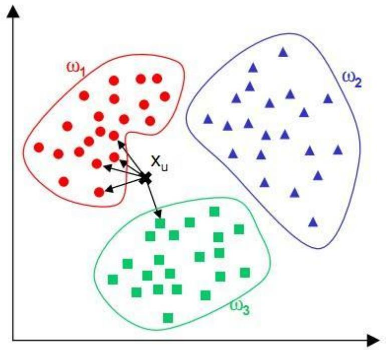

<details>
<summary>text_image</summary>

ω₁
Xᵤ
ω₂
ω₃
</details>

## k最近邻图

The nearest neighbor graph (NNG) is a directed graph defined for a set of points in a metric space, such as the Euclidean distance in the plane.  
The NNG has a vertex for each point, and a directed edge from p to q whenever q is a nearest neighbor of p, a point whose distance from p is minimum among all the given points other than p itself.

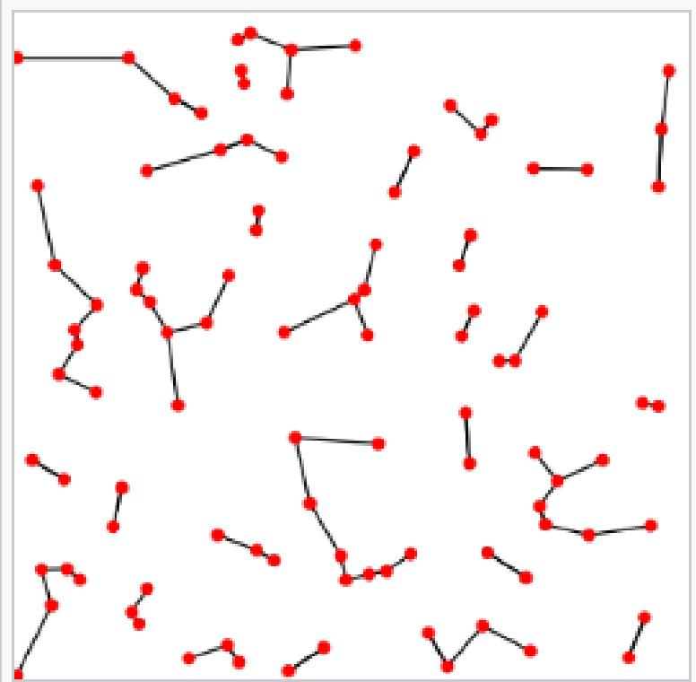

<details>
<summary>natural_image</summary>

Abstract diagram of interconnected red nodes and lines on white background (no text or symbols)
</details>

A nearest neighbor graph of 100 品 points in the Euclidean plane.

## k最近邻图

相似度计算：根据节点属性值

标量

$$
\frac {1}{1 + | p _ {s} - p _ {t} |}
$$

向量：整数

$$
J (p _ {s}, p _ {t}) = \frac {| p _ {s} \cap p _ {t} |}{| p _ {s} \cup p _ {t} |}
$$

杰卡德相似性

$$
O (p _ {s}, p _ {t}) = \frac {| p _ {s} \cap p _ {t} |}{m i n (| p _ {s} | , | p _ {t} |)}
$$

重叠系数

向量：浮点数

$$
\operatorname{cosine} \left(p _ {s}, p _ {t}\right) = \frac {\sum_ {i} p _ {s} (i) \cdot p _ {t} (i)}{\sqrt {\sum_ {i} p _ {s} (i) ^ {2}} \cdot \sqrt {\sum_ {i} p _ {t} (i) ^ {2}}}
$$

余弦相似性

$$
p e a r s o n (p _ {s}, p _ {t}) = \frac {\sum_ {i} (p _ {s} (i) - \overline {{p _ {s}}}) \cdot (p _ {t} (i) - \overline {{p _ {t}}})}{\sqrt {\sum_ {i} (p _ {s} (i) - \overline {{p _ {s}}}) ^ {2}} \cdot \sqrt {\sum_ {i} (p _ {t} (i) - \overline {{p _ {t}}}) ^ {2}}}
$$

皮尔逊相关度

$$
E D (p _ {s}, p _ {t}) = \sqrt {\sum_ {i} \left(p _ {s} (i) - p _ {t} (i)\right) ^ {2}}
$$

欧几里德相似度

## 节点嵌入 Node Embedding

## 节点嵌入 (Node Embedding) 算法

## 节点嵌入的目标是计算节点的低维向量表示

– 使向量之间的相似性 (eg. 点积) 接近于原图中节点之间的相似性  
– 这些向量也被称为嵌入，对探索性数据分析，相似性测量和机器学习非常有用 Parameters initialized randomly 2-dim output per node

在图中靠近的节点最终在二维嵌入空间中也会靠近

嵌入从图中获取结构，即 n 维邻接矩阵，并将其近似为每个节点的 2 维向量

由于维度大大降低，嵌入向量在下游过程中的使用效率更高

例如，它们可以被用于聚类分析，或者作为训练节点分类或链接预测模型的特征

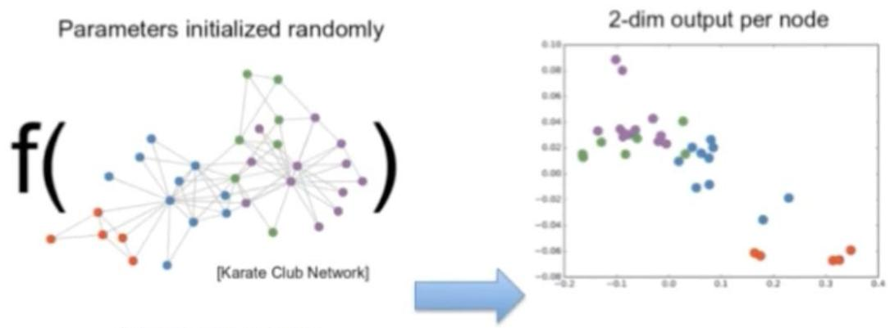

<details>
<summary>scatterplot</summary>

| Parameter | Value |
| --------- | ----- |
| f( Karate Club Network) | Not labeled (red/orange dots connected by lines) |
| 2-dim output per node | Values range from -0.08 to 0.10, with clusters of green, purple, blue, and red dots indicating different node groups. |
</details>

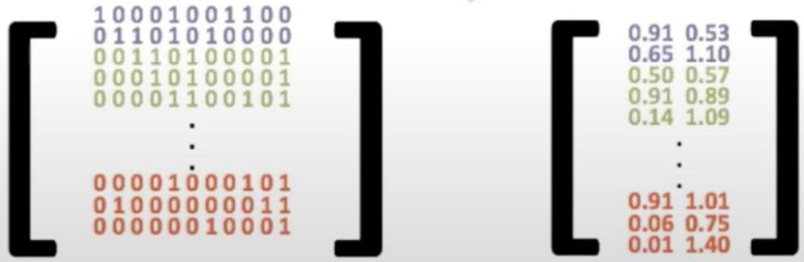

<details>
<summary>text_image</summary>

[1 0 0 0 1 0 0 1 1 0 0
0 1 1 0 1 0 1 0 0 0 0
0 0 1 1 0 1 0 0 0 0 1
0 0 0 1 0 1 0 0 0 0 1
0 0 0 0 1 1 0 0 1 0 1
...
0 0 0 0 1 0 0 0 1 0 1
0 1 0 0 0 0 0 0 0 1 1
0 0 0 0 0 0 1 0 0 0 1
] [0.91 0.53
0.65 1.10
0.50 0.57
0.91 0.89
0.14 1.09
...
...
0.91 1.01
0.06 0.75
0.01 1.40]
</details>

## 节点嵌入 (Node Embedding) 算法

## 节点嵌入的目标是计算节点的低维向量表示

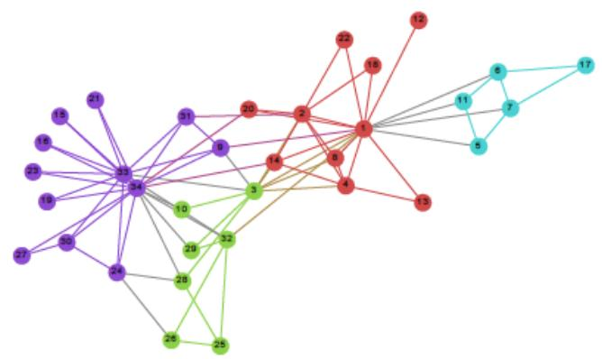

<details>
<summary>network graph</summary>

| Node | Connected To | Edge Values |
|---|---|---|
| 1 | 2 | 12 |
| 2 | 3 | 22 |
| 3 | 4 | 18 |
| 4 | 5 | 13 |
| 5 | 6 | 11 |
| 6 | 7 | 7 |
| 7 | 8 | 11 |
| 8 | 9 | 14 |
| 9 | 10 | 3 |
| 10 | 11 | 10 |
| 11 | 12 | 2 |
| 12 | 13 | 13 |
| 13 | 14 | 8 |
| 14 | 15 | 14 |
| 15 | 16 | 15 |
| 16 | 17 | 2 |
| 17 | 18 | 17 |
| 18 | 19 | 19 |
| 19 | 20 | 23 |
| 20 | 21 | 21 |
| 21 | 22 | 27 |
| 22 | 23 | 25 |
| 23 | 24 | 33 |
| 24 | 25 | 24 |
| 25 | 26 | 28 |
| 26 | 27 | 50 |
| 27 | 28 | 27 |
| 28 | 29 | 32 |
| 29 | 30 | 29 |
| 30 | 31 | 31 |
| 31 | 32 | 33 |
| 32 | 33 | 32 |
| 33 | 34 | 34 |
| 34 | 35 | 34 |
The chart displays a network diagram with nodes labeled by their respective numbers. The edges are connected by lines forming a network structure.
</details>

(a) Input: Karate Graph

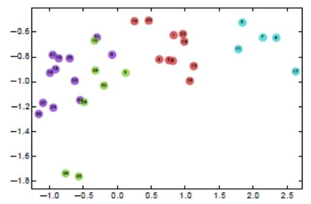

<details>
<summary>scatterplot</summary>

| x       | y       |
| ------- | ------- |
| -1.0    | -1.2    |
| -0.9    | -1.3    |
| -0.8    | -1.4    |
| -0.7    | -1.5    |
| -0.6    | -1.6    |
| -0.5    | -1.7    |
| -0.4    | -1.8    |
| -0.3    | -1.9    |
| -0.2    | -2.0    |
| -0.1    | -2.1    |
| 0.0     | -2.2    |
| 0.1     | -2.3    |
| 0.2     | -2.4    |
| 0.3     | -2.5    |
| 0.4     | -2.6    |
| 0.5     | -2.7    |
| 0.6     | -2.8    |
| 0.7     | -2.9    |
| 0.8     | -3.0    |
| 0.9     | -3.1    |
| 1.0     | -3.2    |
| 1.1     | -3.3    |
| 1.2     | -3.4    |
| 1.3     | -3.5    |
| 1.4     | -3.6    |
| 1.5     | -3.7    |
| 1.6     | -3.8    |
| 1.7     | -3.9    |
| 1.8     | -4.0    |
| 1.9     | -4.1    |
| 2.0     | -4.2    |
| 2.1     | -4.3    |
| 2.2     | -4.4    |
| 2.3     | -4.5    |
| 2.4     | -4.6    |
| 2.5     | -4.7    |
</details>

(b) Output: Representation  
Figure 1: Our proposed method learns a latent space repre-sentation of social interactions in $\mathbb { R } ^ { d }$ . The learned representation encodes community structure so it can be easily exploited by standard classification methods. Here, our method is used on Zachary's Karate network [44] to generate a latent representation in $\mathbb { R } ^ { 2 }$ . Note the correspondence between community structure in the input graph and the embedding. Vertex colors represent a modularity-based clustering of the input graph.

## 节点嵌入 (Node Embedding) 算法

## 节点嵌入的目标是计算节点的低维向量表示

如果一个连接图的度分布服从幂律定律，观测得到节点在短随机游走出现的频率也会服从幂律分布

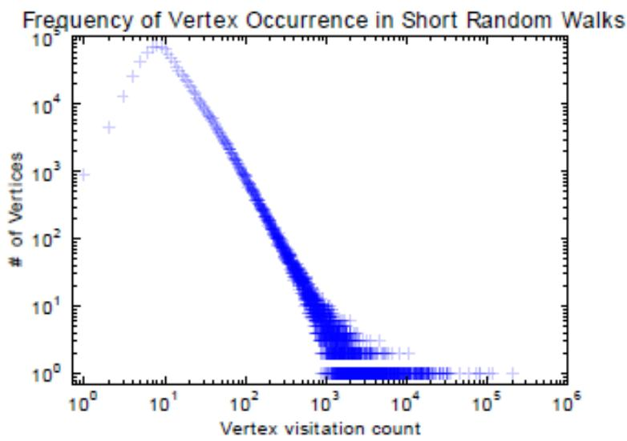

<details>
<summary>scatterplot</summary>

| Vertex visitation count | # of Vertices |
| ----------------------- | ------------- |
| 1                       | 1000          |
| 10                      | 10000         |
| 100                     | 1000          |
| 1000                    | 10            |
| 10000                   | 1             |
| 100000                  | 1             |
</details>

(a) YouTube Social Graph

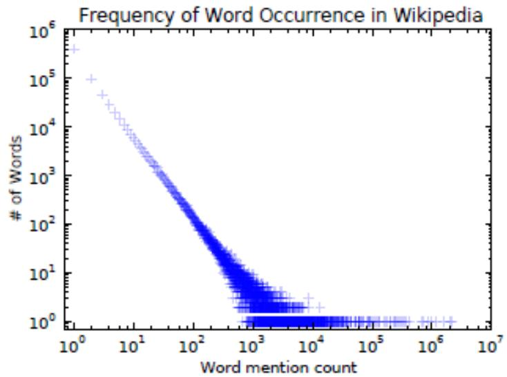

<details>
<summary>scatterplot</summary>

| Word mention count | # of Words |
| ------------------ | ---------- |
| 10^0               | 10^6       |
| 10^1               | 10^5       |
| 10^2               | 10^4       |
| 10^3               | 10^3       |
| 10^4               | 10^2       |
| 10^5               | 10^1       |
| 10^6               | 10^0       |
| 10^7               | 10^0       |
</details>

(b) Wikipedia Article Text  
Figure 2: The distribution of vertices appearing in short random walks (2al follows a power-law, much like the distribution of words in natural language (2b).

## 节点嵌入 (Node Embedding) 算法

## 节点嵌入的目标是计算节点的低维向量表示

– 在现实问题中，节点嵌入通常会大于 2 个维度，通常最终会达到数百或更大，尤其是当应用于具有数百万或数十亿节点的大型图时  
– 节点嵌入也不必严格基于图中节点的接近程度来确定相似性。节点嵌入最常用于基于关系跳数和共同相邻节点的距离的相似性，也可以在计算嵌入向量时考虑节点属性和其他 "全局视图" 节点属性

## 节点嵌入 (Node Embedding) 算法

## • 节点嵌入在多种情况下都有应用

– 探索性数据分析 (Exploratory Data Analysis, EDA) 以更好地理解图形结构和潜在的节点集群  
相似性测量 (Similarity Measurements) : 节点嵌入将使你可以使用 K近邻算法 (KNN) 或其他技术来扩展大型图中的相似性推断。这对于扩展基于记忆的推荐系统非常有用，例如协同过滤 (collaborative filtering)的变体。它还可以用于欺诈检测等领域的半监督技术，例如，我们可能想生成与一组已知欺诈实体相似的线索  
– 用于机器学习的特征: 节点嵌入向量可以作为各种机器学习问题的特征。例如，在一个在线零售商的用户购买的关系图中，我们可以使用嵌入来训练一个机器学习模型，以预测用户接下来可能有兴趣购买的产品.

## 节点嵌入算法： DeepWalk

## • DeepWalk 第一个无监督学习节点嵌入的算法

随机生成图节点序列，然后对该序列进行Word2Vec训

给定一个图，随机选择一个节点作为起始，然后随机 "步行" 到邻居节点，直到节点序列的长度达到给定的最大值。  
例如右图，分别选择 d, e, f 作为起点进行随机游走，得到三条节点序列

将节点和节点序列分别看作是“单词”和“句子”利用Work2Vec算法训练得到每个节点的embedding

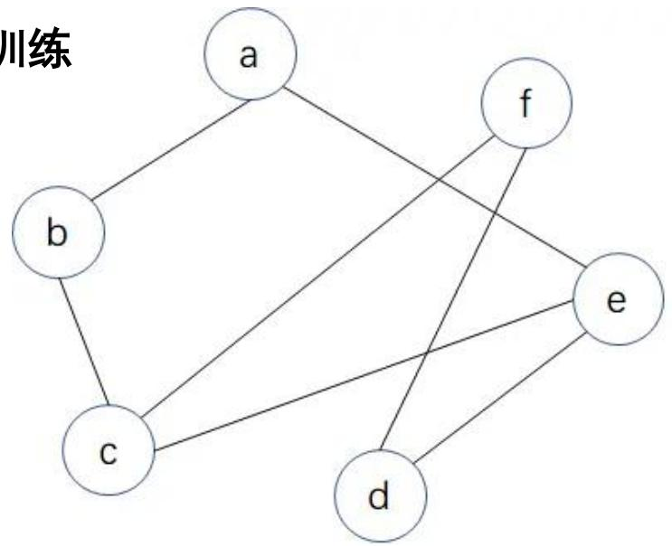

<details>
<summary>flowchart</summary>

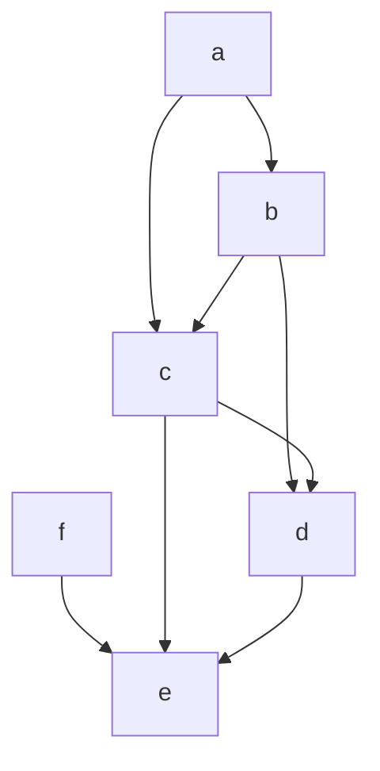
</details>

Max length=4

eaea

fced

## 节点嵌入算法： DeepWalk

## • DeepWalk 第一个无监督学习节点嵌入的算法

主要包含两个部分：一个随机游走序列生成器和一个更新

对于一个生成的以vi为中心左右窗口为w的随机游走序列

$$
v _ {i - w}, \dots , v _ {i - 1}, v _ {i}, v _ {i + 1}, \dots , v _ {i + m}
$$

DeepWalk利用SkipGram算法通过最大化以vi为中心，左右w为窗口，vi同其他节点共现概率来优化模型：

$$
\operatorname * {P r} \left(\left\{v _ {i - w}, \dots , v _ {i + w} \right\} \setminus v _ {i} \mid \Phi \left(v _ {i}\right)\right) = \prod_ {j = i - w, j \neq i} ^ {i + w} \operatorname * {P r} \left(v _ {j} \mid \Phi \left(v _ {i}\right)\right)
$$

机器学习

随机梯度下降（Stochastic Gradient Descent）负采样（Negative Sampling）

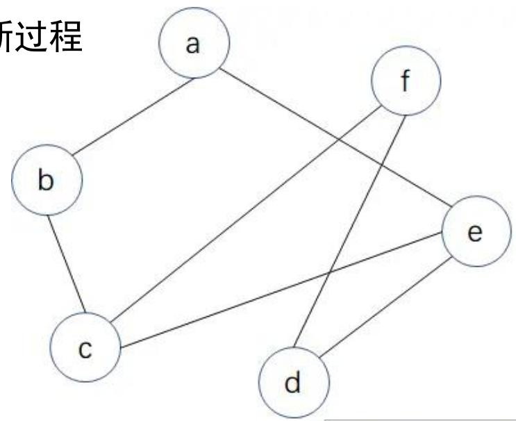

<details>
<summary>flowchart</summary>

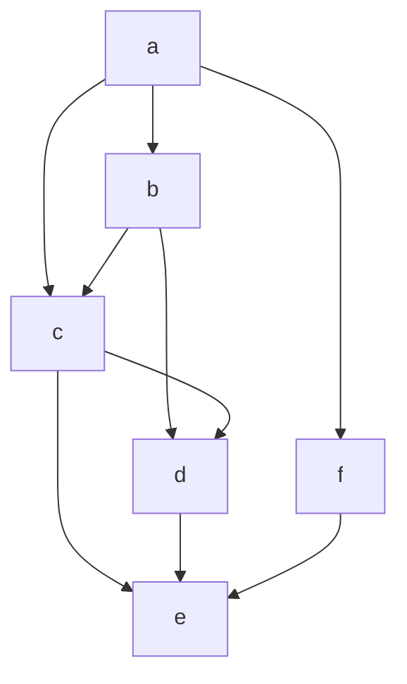
</details>

Max length=4

eaea

fced

<table><tr><td>模型</td><td>目标</td><td>输入</td><td>输出</td></tr><tr><td>Word2Vec</td><td>词</td><td>句子</td><td>词嵌入</td></tr><tr><td>DeepWalk</td><td>节点</td><td>节点序列</td><td>节点嵌入</td></tr></table>

## 节点嵌入算法： DeepWalk

• DeepWalk 最大的贡献是将Skip-Gram模型引入到图嵌入中  
• DeepWalk中的RandomWalk每次随机选择当前节点的一个邻接节点

Algorithm 1 DEEPWALK(G, w,d, γ, t)  
Input: graph $G(V, E)$ window size w
embedding size d
walks per vertex $\gamma$ walk length t

Output: matrix of vertex representations $\Phi \in R^{|V| \times d}$ 1: Initialization: Sample $\Phi$ from $U^{|V| \times d}$ 2: Build a binary Tree T from V

3: for i = 0 to $\gamma$ do

4: $\mathcal{O} = \text{Shuffle}(V)$ 5: for each $v_i \in O$ do

6: $\mathcal{W}_{v_i} = \text{RandomWalk}(G, v_i, t)$ 7: SkipGram( $\Phi$ , $W_{v_i}$ , w)

8: end for

9: end for

• 算法1中的3-9行显示了方法的核心。外循环指定次数??，应该在哪个点开始随机游走  
• 每次迭代都是对数据进行一次“传递”，并在此传递过程中对每个节点进行一次抽样  
• 在每次遍历的开始，都会生成一个随机的遍历顶点的顺序

在内部循环中，遍历图上的所有顶点。对于每个顶点v，我们生成一个随机游走| $W v _ { i } | { = } t ,$ ，然后用它来更新表示。我们根据目标函数，使用Skip-Gram算法进行表示的更新。

## 节点嵌入算法： DeepWalk

• DeepWalk 最大的贡献是将Skip-Gram模型引入到图嵌入中  
• DeepWalk中的RandomWalk每次随机选择当前节点的一个邻接节点

Algorithm 2 SkipGram(Φ, Wu, ω)  
1: for each $v_{j} \in W_{v_{i}}$ do
2: for each $u_{k} \in W_{v_{i}}[j - w : j + w]$ do
3: $J(\Phi) = -\log \Pr(u_{k} \mid \Phi(v_{j}))$ 4: $\Phi = \Phi - \alpha * \frac{\partial J}{\partial \Phi}$ 5: end for
6: end for

SkipGram是一种语言模型，它使出现在窗口w中的单词在句子中的共现概率最大化。它使用如下独立假设近似方程中的条件概率

$$
P r \left(\left\{v _ {i - w}, \dots , v _ {i + w} \right\} / v _ {i} | \Phi (v _ {i})\right) = \prod_ {j = i - w \& j \neq i} ^ {i + w} P r (v _ {j} | \Phi (v _ {i}))
$$

## 节点嵌入算法： DeepWalk

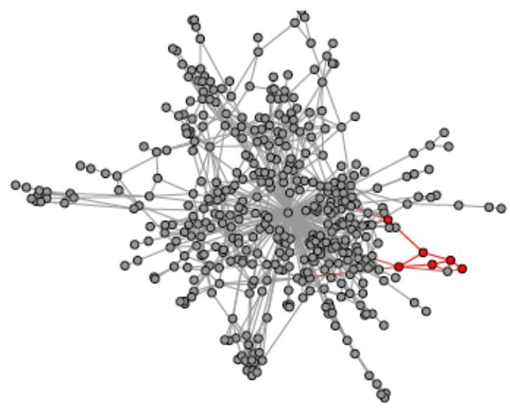

<details>
<summary>flowchart</summary>

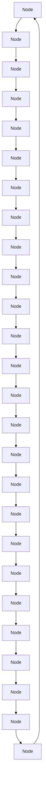
</details>

(a) Random walk generation.

$$
\mathcal {W} _ {v _ {4}} = 4
$$

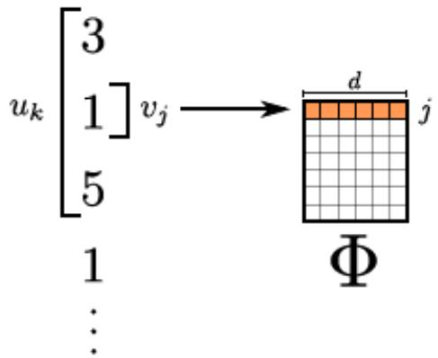

<details>
<summary>text_image</summary>

u_k [3
1] v_j → [d] j
5
1
⋮
Φ
</details>

(b) Representation mapping.

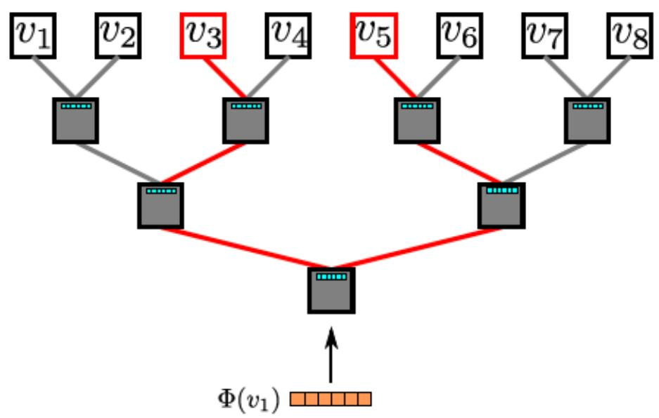

<details>
<summary>flowchart</summary>

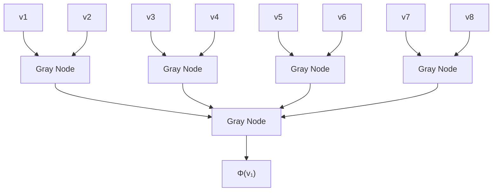
</details>

(c) Hierarchical Softmax.  
Figure 3: Overview of DEEPWALK. We slide a window of length $2 w + 1$ over the random walk $\mathcal { W } _ { v _ { 4 } }$ , mapping the central vertex $_ { v 1 }$ to its representation $\Phi ( v _ { 1 } )$ . Hierarchical Softmax factors out $\operatorname* { P r } ( v _ { 3 } \mid \Phi ( v _ { 1 } ) )$ and $\operatorname* { P r } ( v _ { 5 } \mid \Phi ( v _ { 1 } ) )$ ）over sequences of probability distributions corresponding to the paths starting at the root and ending at $v _ { 3 }$ and u5. The representation Φ is updated to maximize the probability of u1 co-occurring with its context $\{ v _ { 3 } , v _ { 5 } \}$

## 节点嵌入算法：Node2Vec

• Node2Vec 是DeepWalk的一种扩展，是结合了DFS和BFS随机游走的DeepWalk有偏的随机游走（Biased Random Walk）

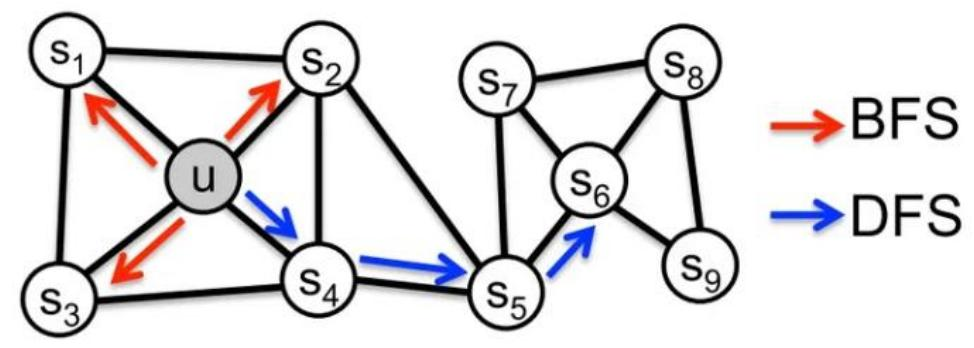

<details>
<summary>flowchart</summary>

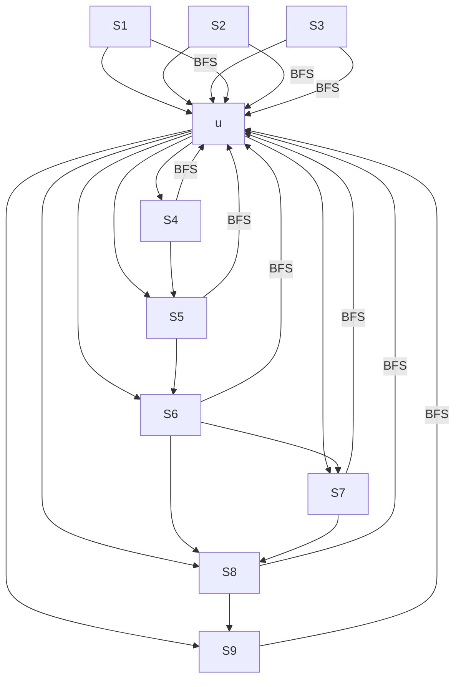
</details>

$$
P \left(c _ {i} = x \mid c _ {i - 1} = v\right) = \left\{ \begin{array}{c l} \frac {\pi_ {v x}}{Z}, & \text {if} (v, x) \in E \\ 0, & \text {otherwise} \end{array} \right.
$$

假设当前随机游走经过边 $( t , v )$ 到达顶点v，节点v和𝑥之间的边权为 ${ w _ { v x } }$ ，则可以将 $\pi _ { v x }$ 改写为a(t,x)·wvx $\alpha ( t , x ) \cdot w _ { v x }$

$$
\alpha_ {p q} (t, x) = \left\{ \begin{array}{l l} \frac {1}{p}, & \quad \text {if} d _ {t x} = 0 \\ 1, & \quad \text {if} d _ {t x} = 1 \\ \frac {1}{q}, & \quad \text {if} d _ {t x} = 2 \end{array} \right.
$$

其中， $d _ { t x }$ 表示当前节点v的邻居节点到节点t的最短距离

其中, $\frac { \pi _ { v x } } { Z }$ Tvx $\frac { 1 } { | N _ { ( v ) } | }$ 是相等的，Z可以理解为归一化的缩放因子

## 节点嵌入算法：Node2Vec

• Node2Vec 是DeepWalk的一种扩展，是结合了DFS和BFS随机游走的DeepWalk有偏的随机游走（Biased Random Walk）

$$
P \left(c _ {i} = x \mid c _ {i - 1} = v\right) = \left\{ \begin{array}{c l} \frac {\pi_ {v x}}{Z}, & \text { if } (v, x) \in E \\ 0, & \text { otherwise } \end{array} \right.
$$

其中, $\frac { \pi _ { v x } } { Z }$ Tux $\frac { 1 } { | N _ { ( v ) } | }$ 是相等的，Z可以理解为归一化的缩放因子

假设当前随机游走经过边(t,v)到达顶点v，节点v和x之间的边权为 ${ w _ { v x } }$ ，则可以将 $\pi _ { v x }$ 改写为a(t,x)·wux $\alpha ( t , x ) \cdot w _ { v x }$

$p \mathrm { : }$ 控制随机游走以多大的概率“回头”  
q: 控制随机游走偏向DFS还是BFS

q较大时(q>1)，倾向于BFS

q较小时 $( q { < } 1 )$ ，倾向于DFS

$\scriptstyle p = q = 1$ 时， $\pi _ { \nu x } { = } w _ { \nu x }$

$$
\alpha_ {p q} (t, x) = \left\{ \begin{array}{l l} \frac {1}{p}, & \quad \text {if} d _ {t x} = 0 \\ 1, & \quad \text {if} d _ {t x} = 1 \\ \frac {1}{q}, & \quad \text {if} d _ {t x} = 2 \end{array} \right.
$$

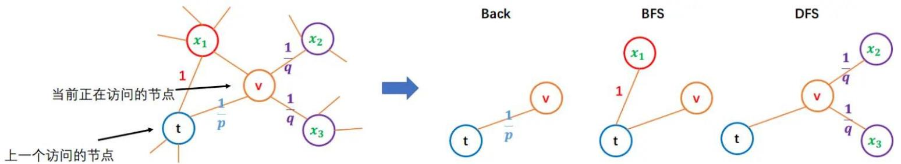

<details>
<summary>flowchart</summary>

```mermaid
graph TD
    subgraph Back
  x1["x₁"] --> v["v"]
  x2["x₂"] --> v["v"]
  x3["x₃"] --> v["v"]
  t["t"] --> v["v"]
    end
    subgraph BFS
  x1x1["x₁"] --> v["v"]
  x1x1x2["x₁"] --> v["v"]
  t["t"] --> v["v"]
  t["t"] --> v["v"]
  x1x1x2x2["DFS"] --> v["v"]
  x1x1x2x2["DFS"] --> v["v"]
  t["t"] --> v["v"]
  x1x1x2x2["DFS"] --> v["v"]
  x1x1x2x2["DFS"] --> v["v"]
    end
    subgraph DFS
  x1x1x2x2["DFS"] --> v["v"]
  x1x1x2x2["DFS"] --> v["v"]
  t["t"] --> v["v"]
  x1x1x2x2["DFS"] --> v["v"]
  x1x1x2x2["DFS"] --> v["v"]
  x1x1x2x2["DFS"] --> v["v"]
  x1x1x2x2["DFS"] --> v["v"]
  x1x1x2x2["DFS"] --> v["v"]
  x1x1x2x2["DFS"] --> v["v"]
  x1x1x2x2["DFS"] --> v["z"]
  x1x1x2x2["DFS"] --> z["z"]
```
</details>

其中， $d _ { t x }$ 表示当前节点v的邻居节点到节点t的最短距离

## 其他节点嵌入算法

## • Node2Vec

– 该算法基于图中的随机游走计算节点的矢量表示

## • GraphSage

– 一种归纳建模方法，利用节点属性和图结构计算节点嵌入

## FastRP

– 快速随机投影算法 (Fast Random Projection, FastRP)  
– 利用概率抽样技术生成图的稀疏表示，允许极快地计算嵌入向量  
– 其质量与传统的随机游走 (random walk) 和神经网络技术 (如Node2vec 和 GraphSage) 产生的向量相当

## 知识数据分析与挖掘

从知识数据中分析和挖掘出隐藏的、有价值的、更高层面的知识

## 知识图谱数据分析

中心性 （PageRank）  
路径搜索 (Dijkstra)  
社区检测 (Louvain)

## 知识图谱数据挖掘

相似性 (KNN)  
节点嵌入 (Node2Vec)  
知识图谱嵌入 (TransE)