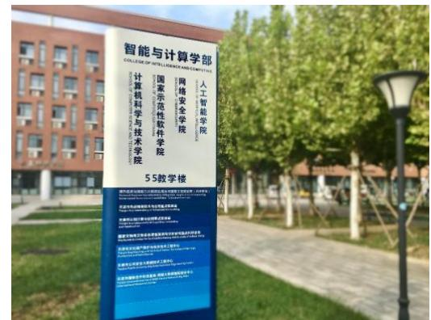
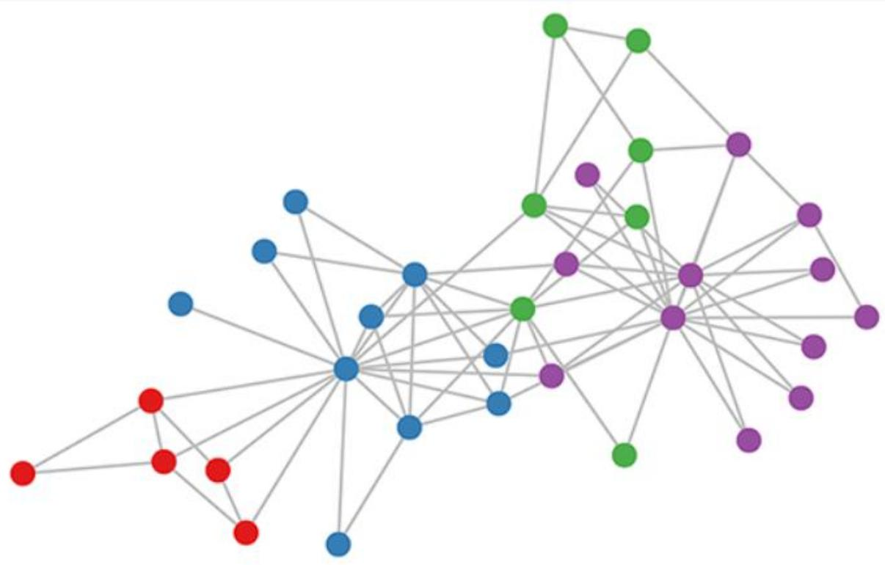
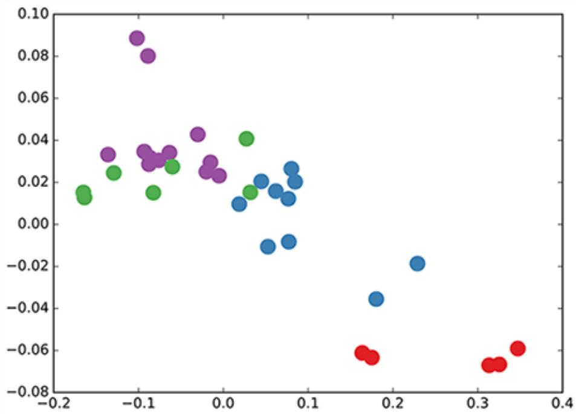
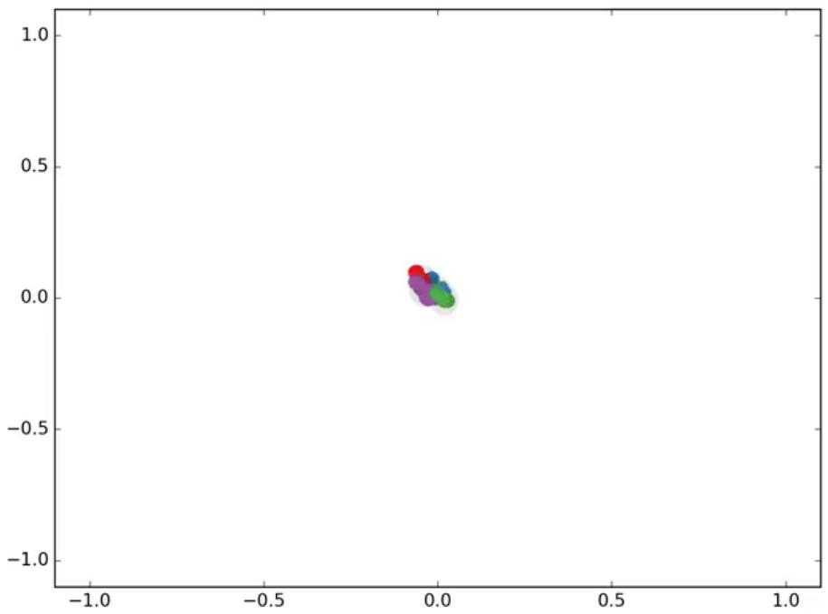
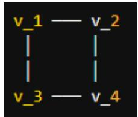

## 知识工程

## 知识数据分析与挖掘

王 鑫

天津大学人工智能学院

text_image

智能与计算学部
COLLEGE OF INTELLIGENCE AND TECHNOLOGY
人工智能学院
国家示范性软件学院
网络安全学院
计算机科学与技术学院
5.5教学楼

text_image

55
智能与计算学部

## 规则结构数据

• 图像 → 2D CNN  
• （规则像素网格）  
• 文本 / 语音 → RNN  
• （一维时间序列）  
• 有固定拓扑、易于卷积

## 不规则图结构数据

• 社交网络、知识图谱  
• 蛋白质互作网络  
• 分子结构、引文网络  
• 推荐系统的用户-物品图  
• 拓扑不规则，传统 CNN 失效

核心问题：传统神经网络无法直接处理任意拓扑结构的图数据！

## 输入

节点特征矩阵 $ { \boldsymbol { X } } \in \mathbb { R } ^ {  { \boldsymbol { N } } \times  { \boldsymbol { D } } }$  
图结构描述 $A \in \mathbb { R } ^ { N \times N }$

## 输出

• 节点级： $Z \in \mathbb { R } ^ { N \times F }$

每个节点的新表示

## 典型任务

节点分类：论文主题分类  
• 链接预测：知识图谱补全  
图分类：分子性质预测  
图生成：分子设计  
社区发现：聚类

## 每一层神经网络可写成

$$
H ^ {(l + 1)} = f (H ^ {(l)}, A)
$$

H(0)= X （输入特征）  
（最终输出）  
• ?? 为网络层数

关键问题：如何设计 ??(∙,∙) ？

能够聚合邻居节点的信息  
• 参数共享（类似 CNN 的卷积核）  
• 对节点编号的排列具有不变性

$$
f (H ^ {(l)}, A) = \sigma \left(A H ^ {(l)} W ^ {(l)}\right)
$$

含义 $A H ^ { ( l ) }$

表示对每个节点，把它所有邻居的特征加起来

举例（以节点 $V _ { 3 }$ 为例）

设 $V _ { 3 }$ 的邻居为 $V _ { 1 } , ~ V _ { 2 } , ~ V _ { 4 }$ ，则：

$$
(A H) _ {3} = h _ {1} + h _ {2} + h _ {4}
$$

⚠ 但这个简单模型存在两个问题 →

## 问题 1：忽略了节点自身

## 现象

?? 的对角线为 0，节点 $v _ { i }$ 只聚合了邻居，丢失了自己的信息！

解决方法：添加自环 (self-loop)

$$
\hat {A} = A + I
$$

效果对比

原始：

$$
(A H) _ {i} = \sum_ {j \in \mathcal {N} (i)} h _ {j}
$$

修正：

$$
(\hat {A} H) _ {i} = h _ {i} + \sum_ {j \in \mathcal {N} (i)} h _ {j}
$$

## 问题 2：尺度失衡

## 现象

度高的节点聚合后特征爆炸；度低的节点衰减。

例如某节点度数为 100，聚合后数值被放大 100 倍！

## 方法 1：行归一化（取平均）

$$
D ^ {- 1} A \rightarrow \mathrm{等价于对邻居特征取平均}
$$

## 方法 2：对称归一化（更优）

$$
D ^ {- \frac {1}{2}} A D ^ {- \frac {1}{2}}
$$

## 为何对称归一化更优？

• 同时考虑节点自身和邻居的度数  
保持矩阵对称性，便于谱分析  
特征值被约束在 [-1, 1] 范围内

## 问题 2：尺度失衡

## 现象

度高的节点聚合后特征爆炸；度低的节点衰减。

例如某节点度数为 100，聚合后数值被放大 100 倍！

$$
D ^ {- 1} = \left[ \begin{array}{c c c c} 1 / D _ {1 1} & & & \\ & 1 / D _ {2 2} & & \\ & & \ddots & \\ & & & 1 / D _ {N N} \end{array} \right]
$$

方法 1：行归一化（取平均）

$$
D ^ {- 1} A \rightarrow \mathrm{等价于对邻居特征取平均}
$$

方法 2：对称归一化（更优）

$$
D ^ {- \frac {1}{2}} A D ^ {- \frac {1}{2}}
$$

为何对称归一化更优？

• 同时考虑节点自身和邻居的度数  
保持矩阵对称性，便于谱分析  
特征值被约束在 [-1, 1] 范围内

$$
D ^ {- 1 / 2} = \left[ \begin{array}{c c c} 1 / \sqrt {D _ {1 1}} & & \\ & \ddots & \\ & & 1 / \sqrt {D _ {N N}} \end{array} \right]
$$

## 问题 2：尺度失衡

<table><tr><td>视角</td><td>行归一化  $D^{-1}A$ </td><td>对称归一化  $D^{-1/2}AD^{-1/2}$ </td></tr><tr><td>矩阵元素</td><td> $\frac{A_{ij}}{D_{ii}}$ </td><td> $\frac{A_{ij}}{\sqrt{D_{ii}D_{jj}}}$ </td></tr><tr><td>信息含义</td><td>仅看中心度数</td><td>同时看两端度数</td></tr><tr><td>对称性</td><td>✗ 不对称</td><td>√ 对称</td></tr><tr><td>谱性质</td><td>特征值复杂</td><td>特征值 ∈ [−1, 1]</td></tr><tr><td>解释</td><td>邻居均值</td><td>几何平均加权</td></tr></table>

综合两个修正，得到 Kipf & Welling (2017) 的传播规则：

$$
H ^ {(l + 1)} = \sigma \left(\hat {D} ^ {- \frac {1}{2}} \hat {A} \hat {D} ^ {- \frac {1}{2}} H ^ {(l)} W ^ {(l)}\right)
$$

## 符号说明

• Â $\hat { A } = A + I$ 自环后的邻接矩阵  
W $\hat { D } : A$ 对应的度矩阵 ℝ^(D\_l × D\_{l+ $\hat { D } _ { i i } = \sum _ { j } \hat { A } _ { i }$ 权  
• σ $W ^ { ( l ) } \in \mathbb { P } ^ { D _ { l } \times D _ { l + 1 } }$ 如 ReLU）  
$\sigma ( \cdot )$ ：非线性激活，如 $F e \bot \bot$

记 Â $\hat { A } _ { \mathrm { n o r m } } = \hat { D } ^ { - \frac { 1 } { 2 } } \hat { A } \hat { D } ^ { - \frac { 1 } { 2 } }$ D̂^(-1/2)，则可简写为：

$$
H ^ {(l + 1)} = \sigma (\hat {A} _ {\text { norm }} H ^ {(l)} W ^ {(l)})
$$

## 向量形式：单节点视角

将矩阵形式展开到单个节点 $v _ { i }$ ：

$$
h _ {v _ {i}} ^ {(l + 1)} = \sigma \left(\sum_ {j \in \mathcal {N} (i) \cup \{i \}} \frac {1}{c _ {i j}} h _ {v _ {j}} ^ {(l)} W ^ {(l)}\right)
$$

其中归一化系数为：

$$
c _ {i j} = \sqrt {\hat {D} _ {i i}} \cdot \sqrt {\hat {D} _ {j j}}
$$

## 直观三步走

1.聚合（Aggregate）：收集每个邻居（含自身）的表示  
2.变换（Transform）：乘以共享权重 $W ^ { ( l ) }$ 做线性变换  
3.激活（Activate）：经非线性函数σ

这就是『消息传递神经网络 (MPNN)』的基本雏形！

## 小例子：手算一次 GCN 传播

图：3 个节点，边为 (1-2), (2-3)

$$
A = \left( \begin{array}{c c c} 0 & 1 & 0 \\ 1 & 0 & 1 \\ 0 & 1 & 0 \end{array} \right)
$$

## 小例子：手算一次 GCN 传播

图：3 个节点，边为 (1-2), (2-3)

$$
A = \left( \begin{array}{c c c} 0 & 1 & 0 \\ 1 & 0 & 1 \\ 0 & 1 & 0 \end{array} \right) \qquad \qquad \hat {A} = A + I = \left( \begin{array}{c c c} 1 & 1 & 0 \\ 1 & 1 & 1 \\ 0 & 1 & 1 \end{array} \right)
$$

度矩阵： $\hat { D } = \mathrm { d i a g } ( 2 , 3 , 2 )$

## 数据集介绍

• 34 个成员（节点）  
• 78 条朋友关系（边）  
真实历史：因冲突分裂为 2 派  
• 扩展标注：4 个子社区

## 实验设置

• 3 层 GCN  
• 权重随机初始化（不训练！）  
• 输入 X = I（无节点特征）  
输出维度为 2，直接可视化

network graph

| Node ID | Color | Connection Count |
| --- | --- | --- |
| 1 | Red | 10 |
| 2 | Red | 8 |
| 3 | Red | 12 |
| 4 | Red | 6 |
| 5 | Blue | 15 |
| 6 | Blue | 11 |
| 7 | Blue | 9 |
| 8 | Blue | 13 |
| 9 | Green | 20 |
| 10 | Green | 18 |
| 11 | Green | 22 |
| 12 | Green | 16 |
| 13 | Purple | 19 |
| 14 | Purple | 21 |
| 15 | Purple | 17 |
| 16 | Purple | 23 |
| 17 | Purple | 15 |
| 18 | Purple | 24 |
| 19 | Purple | 14 |
| 20 | Purple | 25 |
| 21 | Purple | 13 |
| 22 | Purple | 26 |
| 23 | Purple | 12 |
| 24 | Purple | 27 |
| 25 | Purple | 11 |
| 26 | Purple | 28 |
| 27 | Purple | 10 |
| 28 | Purple | 29 |
| 29 | Purple | 9 |
| 30 | Purple | 20 |
| 31 | Purple | 18 |
| 32 | Purple | 21 |
| 33 | Purple | 16 |
| 34 | Purple | 22 |
| 35 | Purple | 15 |
| 36 | Purple | 23 |
| 37 | Purple | 14 |
| 38 | Purple | 24 |
| 39 | Purple | 13 |
| 40 | Purple | 25 |
| 41 | Purple | 12 |
| 42 | Purple | 26 |
| 43 | Purple | 11 |
| 44 | Purple | 27 |
| 45 | Purple | 10 |
| 46 | Purple | 28 |
| 47 | Purple | 9 |
| 48 | Purple | 29 |
| 49 | Purple | 8 |
| 50 | Purple | 30 |
| 51 | Purple | 7 |
| 52 | Purple | 31 |
| 53 | Purple | 6 |
| 54 | Purple | 32 |
| 55 | Purple | 5 |
| 56 | Purple | 33 |
| 57 | Purple | 4 |
| 58 | Purple | 34 |
| 59 | Purple | 35 |
| 60 | Purple | 36 |
| 61 | Purple | 37 |
| 62 | Purple | 38 |
| 63 | Purple | 39 |
| 64 | Purple | 40 |
| 65 | Purple | 41 |
| 66 | Purple | 42 |
| 67 | Purple | 43 |
| 68 | Purple | 44 |
| 69 | Purple | 45 |
| 70 | Purple | 46 |
| 71 | Purple | 47 |
| 72 | Purple | 48 |
| 73 | Purple | 49 |
| 74 | Purple | 50 |
| 75 | Purple | 51 |
| 76 | Purple | 52 |
| 77 | Purple | 53 |
| 78 | Purple | 54 |
| 79 | Purple | 55 |
| 80 | Purple | 56 |
| 81 | Purple | 57 |
| 82 | Purple | 58 |
| 83 | Purple | 59 |
| 84 | Purple | 60 |
| 85 | Purple | - |
| ... | ... |  |
| ... | ... |  |
| ... | ... |  |
| ... | ... |  |
| ... | ... |  |
| ... | ... |  |
| ... | ... |  |
| ... | ... |  |
| ... | ... |  |
| ... | ... |  |
| ... | ... |  |
| ... | ... | (note: The actual values are not provided in the code.) |

Karateclub graph,colorsdenote communitiesobtained via modularity-based clustering(Brandesetal.,2008).

接下来的观察 即使不训练，GCN 也能捕获图的社区结构！

即使不训练，GCN 产生的嵌入就已经呈现清晰的社区结构！

scatterplot

| Group | X       | Y       |
|-------|---------|---------|
| Purple| -0.1    | 0.09    |
| Purple| -0.1    | 0.08    |
| Green | -0.15   | 0.03    |
| Green | -0.1    | 0.02    |
| Green | -0.05   | 0.03    |
| Green | -0.05   | 0.02    |
| Blue  | 0.0     | 0.01    |
| Blue  | 0.05    | 0.02    |
| Blue  | 0.05    | 0.01    |
| Blue  | 0.05    | -0.01   |
| Blue  | 0.1     | 0.02    |
| Blue  | 0.1     | 0.01    |
| Blue  | 0.1     | -0.01   |
| Blue  | 0.2     | -0.02   |
| Blue  | 0.2     | -0.04   |
| Red   | 0.15    | -0.06   |
| Red   | 0.15    | -0.06   |
| Red   | 0.3     | -0.07   |
| Red   | 0.3     | -0.07   |
| Red   | 0.35    | -0.06   |

❓ 为什么随机权重也能得到有意义的嵌入？

?? GCN 可视为 Weisfeiler-Lehman 算法的可微分推广

## 任务

每个类别仅标注 1 个节点，预测所有节点的类别

## 结果

• 300 次迭代后，GCN 成功将 4 个社区线性可分  
即使标签极其稀疏，模型仍能很好泛化

## 核心洞察

图结构本身就携带丰富的信息  
GCN 通过消息传递将稀疏标签信息扩散到整个图  
• 相比 DeepWalk 等两阶段方法，GCN 是端到端的

scatterplot

| x       | y       |
| ------- | ------- |
| 0.0     | 0.0     |
| 0.0     | 0.1     |
| 0.0     | 0.2     |
| 0.0     | 0.3     |
| 0.0     | 0.4     |
| 0.0     | 0.5     |
| 0.0     | 0.6     |
| 0.0     | 0.7     |
| 0.0     | 0.8     |
| 0.0     | 0.9     |
| 0.0     | 1.0     |

Semi-supervised classification with GCNs: Latent space dynamics for 300 training iterations with a single label per class. Labeled nodes are highlighted.

## GCN 的后续发展脉络

2014

Bruna et al. 首次谱方法图卷积

2016

Defferrard et al. ChebNet

2017

Kipf & Welling GCN

2017

GraphSAGE（归纳式学习）

2018

GAT（注意力机制）

2019

R-GCN（关系图卷积）

2020+

图 Transformer、等变 GNN…

## GCN 在知识工程中的应用

## 1. 知识图谱补全

实体嵌入、关系预测；扩展：R-GCN

## 2. 推荐系统

用户-物品二部图；典型：PinSage、LightGCN

## 3. 文本分类

文档-词语图；典型：TextGCN

## 4. 生物医学

药物相互作用预测、蛋白质功能标注

## 5. 程序分析

抽象语法树、控制流图；代码漏洞检测

## GraphSAGE：大规模图的归纳式表示学习 Graph SAmple and aggreGatE

## 为什么需要 GraphSAGE？

与其学习每个节点的固定嵌入，不如学习一个"从邻居采样并聚合信息"的函数

## 从GCN的局限说起：

·X直推式（Transductive）：GCN训练时需要看到完整图，新节点来了要重新训练  
·× 全图计算: $D ^ { - 1 / 2 } A D ^ { - 1 / 2 } H$ 需要整个邻接矩阵，亿级节点图无法放入显存  
·×静态图假设：现实中图是动态的 (社交网络新用户、推荐系统新商品)

## GraphSAGE 的目标:

☑归纳式(Inductive）：学"如何聚合邻居"这个函数，而非每个节点的嵌入  
小批量训练：只采样局部邻居，可扩展到亿级图  
泛化到未见节点

## GraphSAGE：大规模图的归纳式表示学习 Graph SAmple and aggreGatE

## 为什么需要 GraphSAGE？

场景：节点=论文，边=引用关系，特征=文本TF-IDF 向量

想预测一篇新发表论文的研究领域：

GCN：必须把新论文加入图中，重新训练整个网络  
· GraphSAGE：看它引用了哪些已知论文，把这些论文的表示聚合一下→立刻得到新论文的表示

问题转化：从"学习每个节点的嵌入向量zu"→"学习一个邻居聚合函数fe"

旦学到fo，对新节点 Unew:

$$
z _ {v _ {\text { new }}} = f _ {\theta} \left(x _ {v _ {\text { new }}}, \{x _ {u}: u \in \mathcal {N} (v _ {\text { new }}) \}\right)
$$

无需重新训练，直接前向推理即可→归纳式学习 (Inductive Learning)

## GraphSAGE：大规模图的归纳式表示学习 Graph SAmple and aggreGatE

1.Sample（采样）：对每个节点，随机采样固定数量的邻居  
2.Aggregate（聚合)：用聚合函数把邻居信息汇总  
3.Update（更新）：拼接自身特征与聚合结果，过线性层

## GraphSAGE：大规模图的归纳式表示学习 Graph SAmple and aggreGatE

为什么要采样？

## 为什么要采样？

真实图中度数分布极不均匀 (幂律分布)  
某些节点度数上万，全量聚合计算爆炸  
固定采样数→固定计算量→可批量化

## 采样策略：

第1跳采样 $S _ { 1 }$ 个邻居 (论文建议 25)  
第2跳采样 $S _ { 2 }$ 个邻居 (论文建议 10)  
若邻居不足→有放回采样；若过多→无放回采样

计算量：每个节点2层下计算量 $= S _ { 1 } \times S _ { 2 } = 2 5 0$ ，与图总规模无关！

## GraphSAGE：大规模图的归纳式表示学习 Graph SAmple and aggreGatE

前向传播核心公式

Step 1-聚合邻居:

$$
h _ {\mathcal {N} (v)} ^ {(k)} = \operatorname{AGG} _ {k} \left(\left\{h _ {u} ^ {(k - 1)}: u \in \mathcal {N} (v) \right\}\right)
$$

Step 2一拼接并变换:

$$
h _ {v} ^ {(k)} = \sigma \left(W ^ {(k)} \cdot \text { CONCAT } \left(h _ {v} ^ {(k - 1)}, h _ {\mathcal {N} (v)} ^ {(k)}\right)\right)
$$

Step 3一L2归一化（防止数值爆炸）：

$$
h _ {v} ^ {(k)} \leftarrow \frac {h _ {v} ^ {(k)}}{\| h _ {v} ^ {(k)} \| _ {2}}
$$

初始化： $h _ { v } ^ { ( 0 ) } = x _ { v } ,$ 最终输出: $z _ { v } = h _ { v } ^ { ( K ) }$

## GraphSAGE：大规模图的归纳式表示学习 Graph SAmple and aggreGatE

为什么用 CONCAT 而不是相加？

$\begin{array} { r } { h _ { v } ^ { ( k ) } = \sigma \left( W \cdot \sum _ { u \in N ( v ) \cup \{ v \} } \tilde { A } _ { v u } h _ { u } ^ { ( k - 1 ) } \right) } \end{array}$ 自身与邻居混在一起  
GraphSAGE: : h(k) $h _ { v } ^ { ( k ) } = \sigma \left( W \cdot [ h _ { v } ^ { ( k - 1 ) } \parallel h _ { \mathcal { N } ( v ) } ^ { ( k ) } ] \right)$ 自身与邻居分开通道

CONCAT 后权重矩阵可分块：

$$
W \cdot \left[ \begin{array}{c} h _ {v} \\ h _ {\mathcal {N} (v)} \end{array} \right] = [ W _ {\mathrm{self}} \mid W _ {\mathrm{neigh}} ] \left[ \begin{array}{c} h _ {v} \\ h _ {\mathcal {N} (v)} \end{array} \right] = W _ {\mathrm{self}} h _ {v} + W _ {\mathrm{neigh}} h _ {\mathcal {N} (v)}
$$

✅自身特征与邻居特征可用不同权重变换，表达能力更强！

## GraphSAGE：大规模图的归纳式表示学习 Graph SAmple and aggreGatE

聚合函数（重点！）

3 种聚合器： Mean Aggregator

## 聚合函数必须满足的性质：

•排列不变性（邻居无序）  
•可训练（能反向传播）  
•表达能力强

$$
h _ {\mathcal {N} (v)} ^ {(l)} = \text { MEAN } \left(\{h _ {u} ^ {(l - 1)}, \forall u \in \mathcal {N} (v) \}\right)
$$

$$
h _ {v} ^ {(l)} = \sigma \left(W ^ {(l)} \cdot \left[ h _ {v} ^ {(l - 1)} \| h _ {\mathcal {N} (v)} ^ {(l)} \right]\right)
$$

特点：简单、快速，与GCN近似但多了拼接操作 (保留了自身信息)

LSTM Aggregator

$$
h _ {\mathcal {N} (v)} ^ {(l)} = \operatorname{LSTM} \left([ h _ {u} ^ {(l - 1)}, \forall u \in \pi (\mathcal {N} (v)) ]\right)
$$

特点:

·表达能力强  
A LSTM本身对顺序敏感→对邻居随机排列π以近似排列不变  
·计算最慢

Pooling Aggregator

$$
h _ {\mathcal {N} (v)} ^ {(l)} = \max \left(\{\sigma (W _ {\text { pool }} h _ {u} ^ {(l - 1)} + b), \forall u \in \mathcal {N} (v) \}\right)
$$

特点:

·每个邻居先过一层MLP，再逐维度取最大  
·天然排列不变  
·实验中效果最好

GraphSAGE：大规模图的归纳式表示学习 Graph SAmple and aggreGatE 示例演算设定一个 4 节点小图：

text_image

v_1 — v_2
|
|
|
v_3 — v_4

初始特征(do =2）:

· ε1 =[1,0]， 𝑥2 = [0,1]  
ε3 = [1,1], ε4 = [0,0]

邻居: $\mathcal { N } ( 1 ) = \{ 2 , 3 \} , \ \mathcal { N } ( 2 ) = \{ 1 , 4 \} , \ \mathcal { N } ( 3 ) = \{ 1 , 4 \} , \ \mathcal { N } ( 4 ) = \{ 2 , 3 \}$

任务：用 SAGE-mean，K=1，计算 $h _ { 1 } ^ { ( 1 ) }$

## GraphSAGE：大规模图的归纳式表示学习 Graph SAmple and aggreGatE

优点 1：归纳式、可扩展、灵活聚合

缺点X：采样有随机性、不区分邻居重要性、仅用结构特征

演进脉络：

$\mathrm { G C N ~ { \frac { H \overset { \partial } { = } \overset { H \partial } { \operatorname { f i v } } + \overset { \triangledown } { \operatorname { f i v } } \dag } } { \operatorname { G r a p h S A G E } } } ~ \mathrm { G r a p ~ d e } ~ { \frac { \operatorname { t i m } \overset { \partial } { \operatorname { f i v } } \dag } { \operatorname { d e t } } } \to \mathrm { G A T } ~ { \frac { \partial ^ { 2 } \operatorname { t i v } \dag \operatorname { f i v } \dag } { \operatorname { d e t } } } \to \mathrm { G I N } ~ { \frac { \partial ~ \operatorname { t r a p h } ~ \operatorname { T r a n s f o r m e r } } { \operatorname { d e t } \operatorname { f i v } \dag } }$