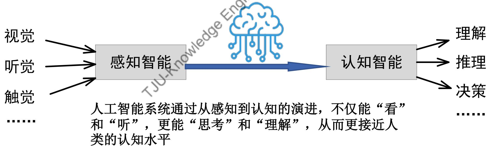
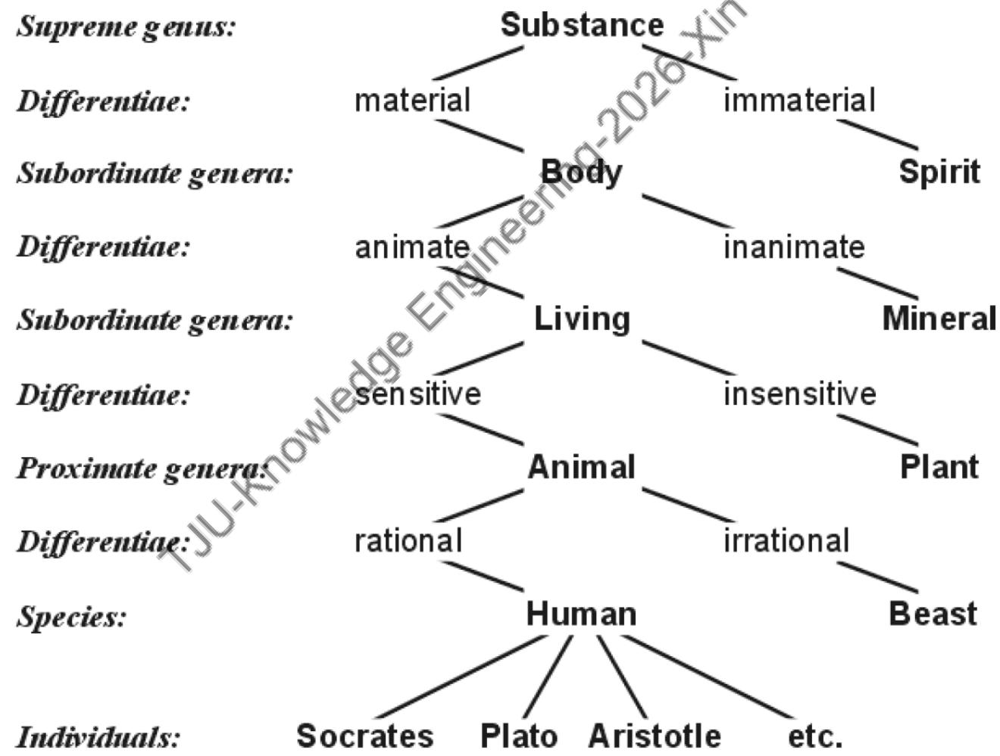
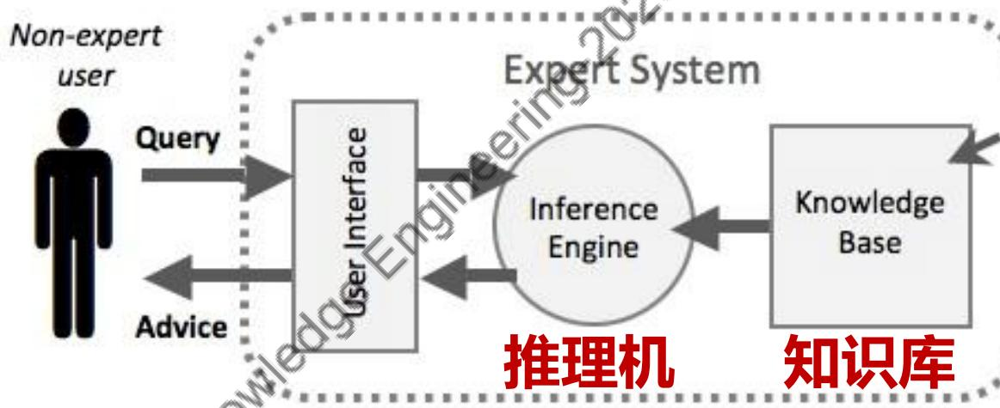
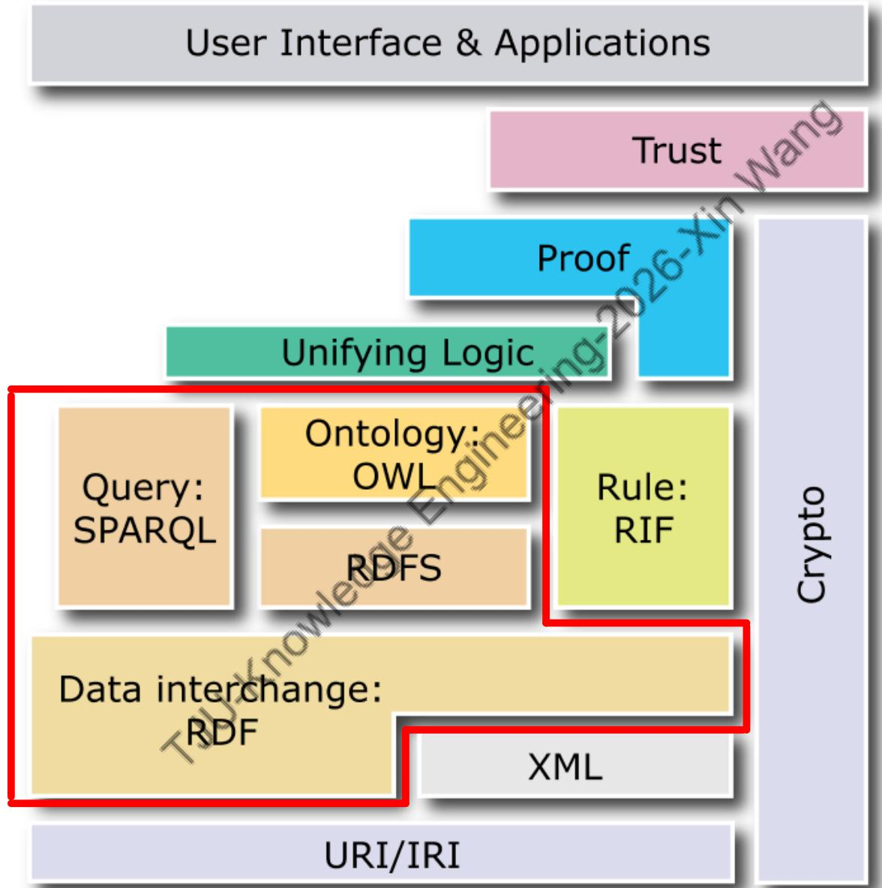
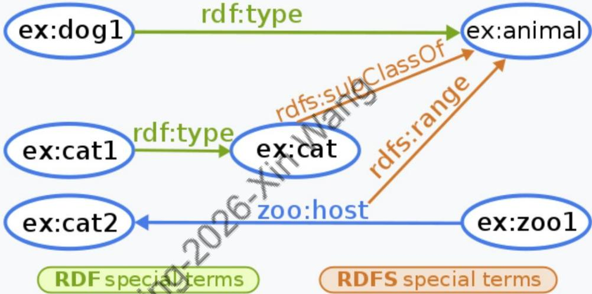
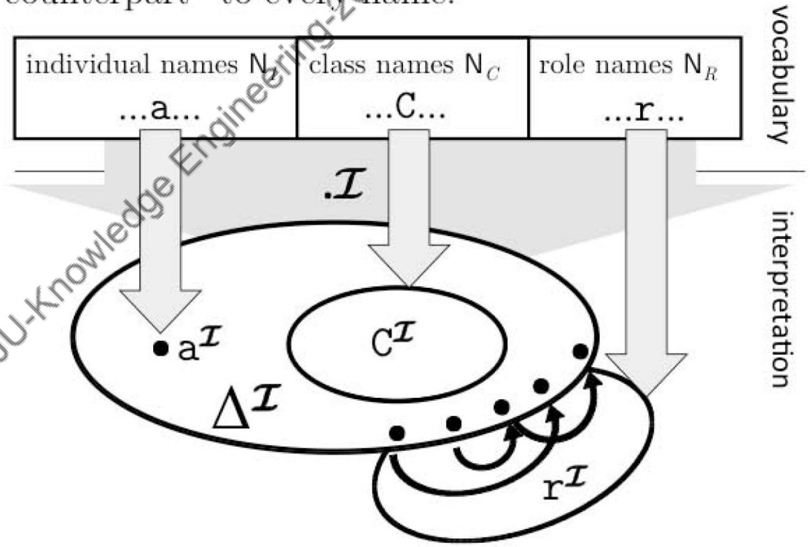
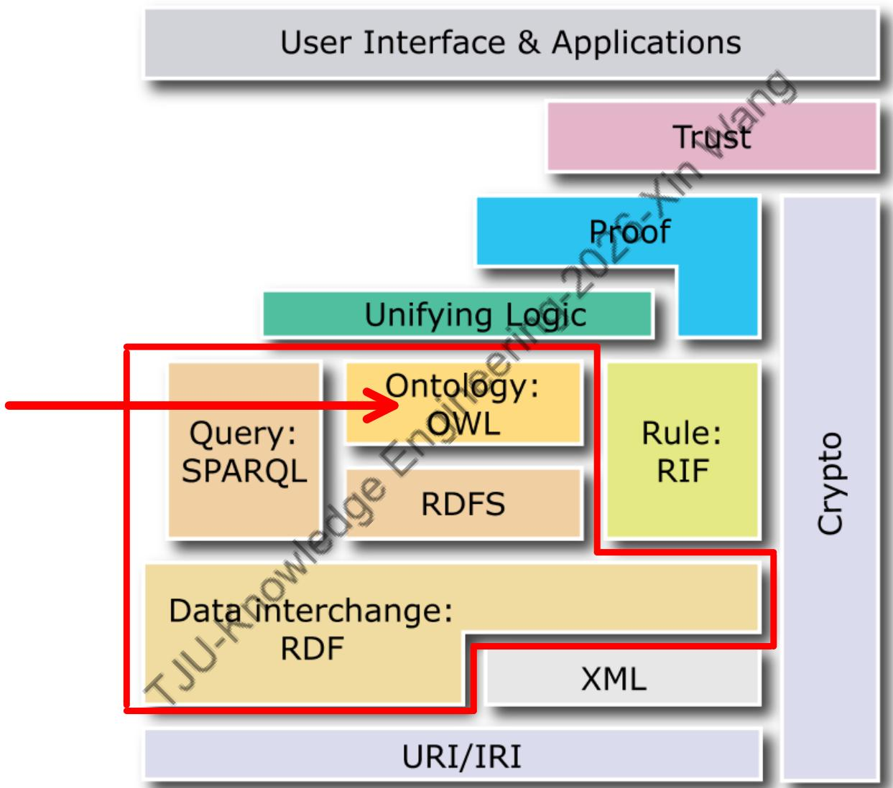
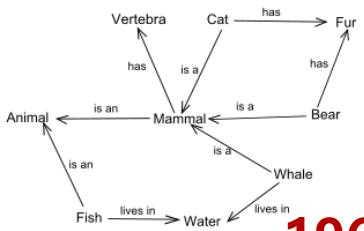

# 第1讲 知识工程与知识图谱

## 1. 本章概述

本章从哲学认识论出发，介绍知识的基本概念与分类（JTB理论、先验/后验知识、声明性/过程性知识、DIKW体系），阐述人工智能从感知到认知的发展脉络，梳理符号主义AI、专家系统、Cyc项目等经典知识工程方法，并引入检索增强生成（RAG）与语义万维网技术，最后深入讲解RDF三元组、RDFS推理规则、本体（Ontology）、描述逻辑（Description Logic）和OWL语言，以及从知识工程到知识图谱的发展历程。

---

## 2. 知识点讲解

### 知识点 1：JTB 理论与葛梯尔问题

**通俗定义**：知识不是"碰巧猜对"。一个命题要成为知识，必须是真的、你相信它、并且你有合理证据支持它。

**标准定义**：

古希腊哲学家柏拉图在《泰阿泰德篇》中提出 **JTB 理论**（Justified True Belief，被证成的真信念），认为一个人拥有知识必须同时满足三个条件：

1. **真理（Truth）**：知识必须基于真实的事实。命题 $P$ 必须为真
2. **信念（Belief）**：个体必须真正相信命题 $P$
3. **正当理由（Justification）**：主体相信 $P$ 必须有充分的理由或证据支持

三者缺一不可。

**葛梯尔问题（Gettier Problem）**：由埃德蒙·葛梯尔于1963年提出，通过反例说明"被证成的真信念"并不总是足够定义知识。经典例子是"空地上的奶牛"——你看到的是一头黑白花纹的纸板模型，恰好空地后面确实有一头真奶牛。你的信念为真（奶牛确实存在），你的理由也是正当的（你确实看到了），但结论只是碰巧正确，因此不算真正的知识。

**举例**：
- "太阳是由氢和氦组成的"——命题为真，科学家相信它，且有光谱分析等正当理由 → 这是知识
- 如果某人不相信太阳由氢和氦组成，即使命题为真且有证据 → 不满足信念条件，不是知识

**初学易错点**：
- JTB三个条件**缺一不可**，少了任何一个都不构成知识
- 葛梯尔问题说明JTB条件虽然是必要条件，但**不是充分条件**——还需要额外条件（如"不可击败性"）

---

**例题 1**：

**题目**：按照JTB理论，"知道命题 $P$"需要满足哪三个条件？

**解答**：
1. $P$ 为真（真理条件）——知识必须基于真实的事实
2. 主体相信 $P$（信念条件）——个体必须真正相信命题
3. 主体相信 $P$ 有正当理由或证据（正当理由条件）——信念必须有充分理由或证据支持

> [!question]- 点击查看完整解答
> **答案**：三个条件缺一不可：真理（Truth）、信念（Belief）、正当理由（Justification）。
> 
> **解析**：JTB理论源自柏拉图《泰阿泰德篇》，是认识论中最经典的知识定义。葛梯尔问题表明JTB虽然是必要条件但不是充分条件——还需要额外条件如"不可击败性"来排除碰巧正确的情况。

---

**练习 1**：

小明通过天气预报得知明天会下雨，于是告诉同学"明天会下雨"。请分析：小明是否真正"知道"明天会下雨？缺少JTB哪个条件？

> [!question]- 点击查看完整解答
> **答案**：需要判断三个条件——(1) 真理：如果明天确实下雨了，则满足；(2) 信念：小明确实相信明天会下雨；(3) 正当理由：天气预报提供了合理的证据支持。若三个条件均满足，小明可以算作"知道"。但如果天气预报不准确且明天没下雨，则不满足真理条件，不能算作知识。
> 
> **解析**：这道题考查JTB理论的实际应用。关键是要逐条检验三个条件是否满足。注意"天气预报"通常被认为是正当理由（正当来源），但如果预报不准确导致命题为假，则不满足真理条件。

---

**练习 2**：

葛梯尔问题为什么挑战了JTB理论？

> [!question]- 点击查看完整解答
> **答案**：葛梯尔问题表明：一个人可以拥有一个"被证成的真信念"（JTB），但其信念为真只是偶然/碰巧正确，而非真正由证据和推理保证的。因此JTB三个条件即使全部满足，仍可能不构成真正的知识。这说明JTB条件并非知识的充分条件。
> 
> **解析**：经典反例"空地上的奶牛"：你看到的是黑白花纹的纸板模型（证据看似正当），恰好空地后面确实有一头真奶牛（命题为真），但你相信有奶牛的理由是基于纸板模型而非真奶牛。你的信念碰巧正确，但这不算真正的知识。

---

### 知识点 2：先验知识与后验知识

**通俗定义**：先验知识靠推理，不必亲自观察；后验知识靠经验、实验、观察来确认。

**标准定义**：

- **先验知识（Apriori Knowledge）**：不依赖于特定经验，可通过理性或逻辑推理得到
- **后验知识（Aposteriori Knowledge）**：依赖于经验或感觉观察来验证

**举例**：
- 先验知识：数学命题 "$2+2=4$"、逻辑命题 "如果 $A$ 为真且 $A$ 蕴含 $B$，则 $B$ 为真"、定义性真理"所有有子女的女性是母亲"
- 后验知识：科学定律"水在标准大气压下的沸点是100°C"、历史事实"第二次世界大战于1939年开始"、感官经验"巧克力的味道很甜"

**初学易错点**：
- 数学/逻辑/定义 → 通常为先验知识；科学实验事实/历史事实/感官经验 → 通常为后验知识
- 并非所有科学知识都是后验的——一些理论框架内的推导可能具有先验性

---

**例题 2**：

**题目**：判断以下知识属于先验还是后验：(1) 三角形内角和为180°；(2) 水在0°C结冰。

**解答**：
1. 三角形内角和为180° → **先验知识**。可通过几何公理推导，不依赖经验观察
2. 水在0°C结冰 → **后验知识**。需要通过实验观察确认

> [!question]- 点击查看完整解答
> **答案**：(1)先验知识，(2)后验知识。
> 
> **解析**：先验知识可通过理性推理得到（数学/逻辑/定义）；后验知识必须通过经验/实验/观察来验证（科学事实/历史事实/感官经验）。

---

### 知识点 3：声明性知识与过程性知识

**通俗定义**：声明性知识是"事实是什么"；过程性知识是"事情怎么做"。

**标准定义**：

- **声明性知识（Declarative Knowledge）**：又称陈述性知识，关于世界的事实性陈述，描述事物的状态、对象、属性及关系，即"知道如此"（knowing-that）。常用于构建知识库
- **过程性知识（Procedural Knowledge）**：又称程序性知识，执行任务或解决问题的具体步骤，即"知道如何"（knowing-how）。常包含隐性知识（tacit knowledge）

**举例**：
- 声明性知识："北京是中国的首都"、"水在标准大气压下的沸点是100°C"
- 过程性知识：知道如何游泳、如何烹饪、如何安装软件

**初学易错点**：
- 知识库更偏声明性（保存事实），算法/规则执行更偏过程性（操作和推理）
- 过程性知识常包含隐性知识——我们知道怎么做但难以完全解释给他人
- 有效的知识工程方案需要**合理结合两种知识**

---

**练习 1**：

"知道如何骑自行车"属于声明性知识还是过程性知识？为什么？

> [!question]- 点击查看完整解答
> **答案**：属于过程性知识（knowing-how）。骑自行车是一种技能，涉及具体的操作步骤和身体协调，难以完全用语言陈述表达。它常包含隐性知识——我们知道怎么骑，但很难完整地解释给他人听。
> 
> **解析**：声明性知识回答"是什么"（knowing-that），过程性知识回答"怎么做"（knowing-how）。骑自行车涉及身体协调、平衡感等难以用语言完整描述的技能，典型的隐性知识。

---

### 知识点 4：DIKW 体系

**通俗定义**：数据是原始记录；信息是有意义的数据；知识是经过组织、可用于解释和推理的信息；智慧是知道在什么情境下如何使用知识。

**标准定义**：

**DIKW 体系**从低到高包含四层：

| 层级 | 含义 | 举例 |
|------|------|------|
| 数据（Data） | 原始记录，未加工 | 温度计读数 "36.5°C" |
| 信息（Information） | 有意义的数据 | "患者体温36.5°C，属于正常范围" |
| 知识（Knowledge） | 经组织、可推理的信息 | "正常体温为36-37°C，超过38°C为发烧" |
| 智慧（Wisdom） | 在具体情境下使用知识的能力 | 根据患者病史判断是否需要进一步检查 |

同时区分：
- **智慧**：使用知识的能力和效率，涉及判断力、洞察力，以及根据情境选择和应用知识的能力
- **智能**：更广泛的概念，描述理解、学习、推理、解决问题、思考、记忆和适应环境变化等能力

**初学易错点**：
- 不要把"信息"和"知识"混成一个概念——信息强调有意义的描述，知识强调可组织、可复用、可推理
- 智慧 vs 智能：智慧强调具体情境下的判断力和洞察力；智能是更广泛的概念


---

**例题 1**：

**题目**：请将以下四条信息按DIKW体系从低到高排列：(a) "温度38.5°C"；(b) "患者发烧了"；(c) "体温数值38.5"；(d) "发烧患者应多喝水并监测体温变化"。

**解答**：
(c) 数据 → (a) 信息 → (b) 知识 → (d) 智慧

> [!question]- 点击查看完整解答
> **答案**：按DIKW从低到高排列：(c) 数据 → (a) 信息 → (b) 知识 → (d) 智慧。
> 
> **解析**：(c)"体温数值38.5"是原始数据，未加任何解读；(a)"温度38.5°C"是有意义的描述（信息）；(b)"患者发烧了"是基于知识的判断（知识层）；(d)"发烧患者应多喝水并监测体温变化"是在具体情境下使用知识做决策（智慧层）。

---

### 知识点 5：感知智能与认知智能

**通俗定义**：感知智能偏输入识别（看见/听见），认知智能偏理解、推理和决策（思考/理解）。

**标准定义**：

- **感知智能（Perceptual Intelligence）**：使机器通过传感器和数据输入模拟人类感官（视觉、听觉、触觉等），目标是识别和处理周围环境的信息
- **认知智能（Cognitive Intelligence）**：涉及更高阶的思维功能，包括语言理解、逻辑推理、规划、学习、问题解决与决策，需要更加丰富和复杂的知识结构

人工智能系统通过从感知到认知的演进，不仅能"看"和"听"，更能"思考"和"理解"。

**举例**：
- 感知智能：图像识别（OCR）、语音识别、人脸识别
- 认知智能：医疗诊断系统、智能问答系统、自动规划系统

**初学易错点**：
- 知识工程主要服务于认知智能——通过知识表示、知识获取、知识推理，使机器具备理解和推理能力
- 感知智能解决"输入信号的识别和转换"，认知智能解决"语义理解和推理决策"


---

**例题 1**：

**题目**：为什么说"知识工程更接近认知智能"而不是感知智能？

**解答**：
感知智能主要处理输入信号的识别和转换（如将图像转为标签、将语音转为文字），不需要深层的语义理解。而认知智能需要对知识进行表示、组织和推理，涉及语言理解、逻辑推理和决策等高阶能力。知识工程的核心工作（知识表示、知识获取、知识推理）正是认知智能的基础，因此说它更接近认知智能。

> [!question]- 点击查看完整解答
> **答案**：感知智能是"看见/听见"，认知智能是"理解/推理/决策"。知识工程处理的是知识的表示、组织和推理，这正是认知智能的核心能力。

---

### 知识点 6：符号主义人工智能与莱布尼茨质数编码

**通俗定义**：符号主义把知识写成明确的规则、逻辑、符号结构。优点是可解释，缺点是需要人工建模，学习能力弱。

**标准定义**：

符号主义人工智能（Symbolic AI）主要采用**逻辑符号和规则**来表达知识。

典型方法：
- 逻辑程序设计（Logic Programming）
- 产生式系统（Production Rules）
- 语义网络（Semantic Networks）
- 框架（Frames）

典型应用：
- 专家系统（Expert Systems）
- 符号计算系统
- 自动定理证明器（Automated Theorem Prover）
- 自动规划与调度系统

AI 诞生初期四五十年间，符号主义方法一直占据主导地位。其优势是可解释、便于推理；局限是知识依赖人工构建，缺乏自动学习能力。

**莱布尼茨质数编码**：约350年前，莱布尼茨提出用**质数或质数乘积表示概念**的编码思想。每个概念分配一个唯一的质数编号。如果概念 $A$ 的编码能被概念 $B$ 的编码整除（即 $B$ 的质因子全部包含在 $A$ 中），则 $A$ 是 $B$ 的子概念（"是一种"关系成立）。

**举例**：
- "有生命" = $2$，"人类" = $2 \times 3 \times 7 \times 13 \times 19 = 10374$
- $10374 \div 2 = 5187$，整除成立 → "人类"是一种"有生命"的事物
- 概念编码 $A = 2 \times 3 \times 5 = 30$，$B = 3 \times 5 = 15$ → $30 \div 15 = 2$，整除成立 → $A$ 包含 $B$

**初学易错点**：
- 重点不是背具体数字，而是理解"概念包含关系可通过质因数整除关系判断"
- 符号主义 vs 联结主义（Connectionism）：符号主义自顶向下，可解释但缺学习能力；联结主义自底向上，擅长模式识别但可解释性弱



---

**例题 1**：

**题目**：给定概念编码：$A = 2 \times 3 \times 5 = 30$，$B = 3 \times 5 = 15$，$C = 2 \times 7 = 14$。判断：$A$ 是否包含 $B$？$A$ 是否包含 $C$？

**解答**：
- 判断 $A$ 是否包含 $B$：$A \div B = 30 \div 15 = 2$，整除成立 → $A$ 包含 $B$
- 判断 $A$ 是否包含 $C$：$A \div C = 30 \div 14 \approx 2.14$，不整除 → $A$ 不包含 $C$

> [!question]- 点击查看完整解答
> **答案**：$A$ 包含 $B$，$A$ 不包含 $C$。
> 
> **解析**：莱布尼茨质数编码的核心是"概念包含关系可通过质因数整除关系判断"。$A=30$的质因数为$\{2,3,5\}$，$B=15$的质因数为$\{3,5\}$，$B$的质因子全部包含在$A$中，所以整除成立。$C=14$的质因数为$\{2,7\}$，$7$不在$A$的质因子中，所以不整除。

---

### 知识点 7：专家系统、Cyc 项目与双系统理论

**通俗定义**：专家系统把领域专家的知识放进知识库，再用推理机按规则进行推断。Cyc试图把人类默认知道的常识系统化写进知识库。

**标准定义**：

**专家系统（Expert System）**：20世纪70-80年代兴起的AI系统，核心组成为：

$$
\text{专家系统} = \text{知识库（Knowledge Base）} + \text{推理机（Inference Engine）}
$$

- **知识库**：存储特定领域专家水平的事实和规则
- **推理机**：根据已有事实和规则推导新结论

经典案例：**MYCIN**（医疗诊断专家系统），**爱德华·费根鲍姆**（专家系统之父，1994年图灵奖得主）。

**Cyc 项目（1984）**：
- 创始人：道格拉斯·莱纳特（Douglas Lenat）
- 目标：创建包含人类广泛**常识性知识**（Commonsense Knowledge）的庞大知识库，解决AI缺乏常识推理能力的问题
- 知识表示语言：CycL（一种形式逻辑语言）
- 重点**不是**大规模数据学习，而是人工构建常识知识库和常识推理能力

**双系统理论（Dual Process Theory）**：与丹尼尔·卡尼曼的《思考，快与慢》相关：

| 特征 | 系统1 | 系统2 |
|------|-------|-------|
| 速度 | 快速 | 较慢 |
| 方式 | 自动、直觉式、无意识 | 审慎、逻辑化、逐步推理 |
| 类比AI | 大模型直觉式生成 | 符号推理/知识工程的逻辑推理 |

**举例**：
- 经验丰富的医生快速凭直觉诊断 → 系统1
- 新手医生逐步分析症状做出诊断 → 系统2

**初学易错点**：
- Cyc的重点是人工构建常识知识库，与当前基于大模型的知识获取方式有本质区别
- 知识工程更强调显式知识、逻辑推理和可解释决策，可看作对系统2能力的建模


---

**例题 1**：

**题目**：写出专家系统的两大组成部分及其各自的功能。

**解答**：
1. **知识库（Knowledge Base）**：存储特定领域专家水平的事实和规则。例如MYCIN的知识库包含血液感染诊断相关的医学规则
2. **推理机（Inference Engine）**：根据知识库中的事实和规则，运用推理策略（如正向链、反向链）推导出新结论，为用户提供决策支持

> [!question]- 点击查看完整解答
> **答案**：专家系统 = 知识库 + 推理机。知识库存储领域事实和规则，推理机根据已有事实和规则推导新结论。
> 
> **解析**：MYCIN是经典的医疗诊断专家系统，帮助医生对血液感染患者进行诊断和用药推荐。爱德华·费根鲍姆是专家系统之父，1994年图灵奖得主。专家系统的核心思想是将领域专家的知识显式编码，使计算机能够模拟专家的推理过程。

---

**练习 1**：

Cyc项目的核心目标是什么？它与当前基于大模型的知识获取方式有何根本区别？

> [!question]- 点击查看完整解答
> **答案**：Cyc的核心目标是创建包含人类广泛常识性知识的庞大知识库，使机器具备常识推理能力。它与大模型的根本区别在于：Cyc依赖人工构建和编码常识知识（自顶向下），而大模型通过大规模数据学习获得知识（自底向上）。
> 
> **解析**：Cyc项目始于1984年，由道格拉斯·莱纳特领导，开发了CycL知识表示语言。它的核心思想是"把常识写进知识库"，而不是通过数据学习。这与当前大模型（如GPT）通过海量文本训练获取知识的方式形成鲜明对比。

---

**练习 2**：

用双系统理论分析：一个经验丰富的医生快速凭直觉做出诊断，vs. 一个新手医生通过逐步分析症状做出诊断，分别对应哪个系统？

> [!question]- 点击查看完整解答
> **答案**：经验丰富的医生快速凭直觉诊断 → 系统1（快速、自动、直觉式）；新手医生逐步分析症状 → 系统2（较慢、审慎、逻辑化、逐步推理）。
> 
> **解析**：系统1是快速、自动、直觉式、无意识的思维；系统2是较慢、审慎、逻辑化、逐步推理的思维。专家通过长期经验形成了直觉判断能力（系统1），而新手需要依赖逻辑推理和逐步分析（系统2）。知识工程更强调系统2的能力——显式知识、逻辑推理和可解释决策。

---

### 知识点 8：检索增强生成（RAG）与语义万维网

**通俗定义**：RAG不是让模型只凭参数记忆回答，而是在回答前先检索相关外部资料，再基于资料生成答案。语义万维网把"文档之网"升级为"数据之网"。

**标准定义**：

**RAG（Retrieval-Augmented Generation）**：由 Patrick Lewis 等人在 NeurIPS 2020 提出。

作用：
1. 允许大语言模型（LLM）**检索外部数据**，而非仅依赖参数记忆
2. **降低幻觉**（Hallucination），提升回答的事实依据
3. **降低重新训练** LLM 的需求

基本流程：用户问题 → 检索相关文档/知识 → 作为上下文 → LLM 生成答案

**万维网 vs 语义万维网**：

| 对比项 | 万维网（Web of Documents） | 语义万维网（Semantic Web） |
|--------|---------------------------|---------------------------|
| 本质 | 文档之网 | 数据之网 |
| 连接方式 | 超链接连接HTML文档 | 带类型的链接连接数据/事物 |
| 可读性 | 人类可读，机器可处理 | 机器可理解语义 |
| 提出者 | 蒂姆·伯纳斯-李（1989） | 蒂姆·伯纳斯-李（2001） |

语义万维网标准技术栈（从底层到顶层）：`URI/IRI` → `XML` → `RDF`（数据交换） → `RDFS` → `OWL`（本体） → `SPARQL`（查询） → `RIF`（规则） → `统一逻辑` → `证明` → `信任`

**举例**：
- RAG应用：问答系统先从知识库检索相关文档，再让LLM基于检索结果生成答案
- 语义万维网：机器能理解"达芬奇"和"蒙娜丽莎"之间的"创作"关系

**初学易错点**：
- RAG的核心优势是降低幻觉——答案基于检索到的真实文档，而非仅凭模型参数记忆
- 语义万维网不仅是技术升级，更是从"人读文档"到"机器理解数据"的范式转变



---

**例题 1**：

**题目**：RAG的基本流程是什么？为什么RAG能帮助降低LLM的幻觉问题？

**解答**：
1. 用户提出问题
2. 系统从外部知识库或文档中**检索**与问题相关的信息
3. 将检索结果作为**上下文**提供给LLM
4. LLM基于上下文**生成答案**

由于答案是基于检索到的真实文档生成的，而非仅凭模型参数记忆，因此可以增强事实依据、降低幻觉。

> [!question]- 点击查看完整解答
> **答案**：RAG通过"检索+生成"结合外部知识。系统先检索相关文档，再让LLM基于检索结果生成答案，从而降低幻觉。
> 
> **解析**：RAG的核心思想是"先查后答"，让模型不再仅依赖训练时的参数记忆，而是能够实时获取外部知识来支撑回答。这类似于人类做研究时"先查资料再写论文"的过程。

---

**练习 1**：

比较"文档之网"和"数据之网"的核心区别。

> [!question]- 点击查看完整解答
> **答案**：文档之网（万维网）以HTML文档为基本单位，通过超链接连接文档，机器只能处理文档的格式，无法理解文档内容的含义。数据之网（语义万维网）以数据为基本单位，通过带语义类型标注的链接连接资源（事物），使机器能够理解数据之间的语义关系。
> 
> **解析**：传统万维网的链接只是"点击跳转"，机器不知道链接两端是什么关系。语义万维网的链接带有明确的语义类型（如"创作"、"位于"等），机器可以理解"达芬奇→创作→蒙娜丽莎"这样的关系。

---

### 知识点 9：RDF 三元组

**通俗定义**：RDF三元组就是"谁—有什么关系—谁/什么值"。例如：达芬奇—出生于—安奇亚诺。

**标准定义**：

RDF（Resource Description Framework，资源描述框架）的基本表示单元是**三元组**：

$$
(s,\ p,\ o) \in U \times U \times (U \cup L)
$$

其中：$s$ 为主语（Subject），$p$ 为谓词（Predicate/Property），$o$ 为宾语（Object）。
- 主语：通常是URI或空白节点（Blank Node）
- 谓词：必须是URI（表示关系或属性）
- 宾语：可以是URI、空白节点或字面值（Literal）

知识图谱可表示为三元组集合：$G = \{(s_1, p_1, o_1),\ (s_2, p_2, o_2),\ \ldots\}$

**三元关系（Ternary Relationship）**：RDF三元组只能直接表达二元关系。当一个事实涉及三个要素时（如"某菜有某配料且该配料数量是多少"），需要引入**中间资源**：

错误做法（语义不清）：
```turtle
ex:Chutney ex:hasIngredient "1lb green mango", "1tsp. Cayenne pepper".
```

正确做法（引入中间节点）：
```turtle
ex:Chutney ex:hasIngredient _:id1 .
_:id1 ex:ingredient ex:greenMango ;
      ex:amount "1lb" .
```

空白节点简写：
```turtle
ex:Chutney ex:hasIngredient [
    ex:ingredient ex:greenMango ;
    ex:amount "1lb"
] .
```

**RDF容器与集合列表**：

| 类型 | 说明 | 特点 |
|------|------|------|
| `rdf:Seq` | 有序列表 | 开放，可添加新元素 |
| `rdf:Bag` | 无序集合 | 开放 |
| `rdf:Alt` | 备选项集合 | 开放 |
| Collection（集合列表） | 穷尽且有序的列表 | **封闭**，用 `rdf:first`/`rdf:rest` 链表实现 |

**RDFS 蕴含规则**：RDF只能表达事实，RDFS可以表达模式知识。核心规则：

| 规则 | 如果S包含 | 则RDFS蕴含 |
|------|----------|-----------|
| rdfs2 | `aaa rdfs:domain xxx` 且 `yyy aaa zzz` | `yyy rdf:type xxx` |
| rdfs3 | `aaa rdfs:range xxx` 且 `yyy aaa zzz` | `zzz rdf:type xxx` |
| rdfs7 | `aaa rdfs:subPropertyOf bbb` 且 `xxx aaa yyy` | `xxx bbb yyy` |
| rdfs9 | `xxx rdfs:subClassOf yyy` 且 `zzz rdf:type xxx` | `zzz rdf:type yyy` |
| rdfs11 | `xxx rdfs:subClassOf yyy` 且 `yyy rdfs:subClassOf zzz` | `xxx rdfs:subClassOf zzz` |

**简单模型（Simple Models）**：一个有基三元组（grounded triple）不包含空白节点。三元组 $(s, p, o)$ 在解释 $I$ 下为真，当且仅当：

$$
\langle I(s),\ I(o) \rangle \in I_{\mathrm{EXT}}(I(p))
$$

**举例**：
- 三元组：`(Leonardo_da_Vinci, born, Anchiano)`——达芬奇出生于安奇亚诺
- RDFS推理：`ex:cat rdfs:subClassOf ex:animal` + `ex:cat1 rdf:type ex:cat` → 可推出 `ex:cat1 rdf:type ex:animal`（rdfs9规则）

**初学易错点**：
- 谓词通常是IRI，不能随便写自然语言
- `domain` 推**主语**类型，`range` 推**宾语**类型，不要搞反
- 容器是"开放的"，Collection是"封闭的"——Collection更安全，有明确形式语义
- $I_{\mathrm{EXT}}(p)$ 是谓词 $p$ 的外延，是一组主语-宾语对 $\langle s, o \rangle$，不是对象集合



---

**例题 1**：

**题目**：给出以下Turtle代码的三元组集合：

```turtle
@prefix ex: <http://example.org/> .
@prefix rdf: <http://www.w3.org/1999/02/22-rdf-syntax-ns#> .

ex:Chutney ex:hasIngredient _:id1 .
_:id1 ex:ingredient ex:greenMango ;
      ex:amount "1lb" .
```

**解答**：
```
(ex:Chutney, ex:hasIngredient, _:id1)
(_:id1, ex:ingredient, ex:greenMango)
(_:id1, ex:amount, "1lb")
```

> [!question]- 点击查看完整解答
> **答案**：共3个三元组：(1) ex:Chutney → hasIngredient → _:id1；(2) _:id1 → ingredient → ex:greenMango；(3) _:id1 → amount → "1lb"。
> 
> **解析**：`_:id1` 是空白节点（Blank Node），代表一个没有URI的中间资源。这种模式常用于表达三元关系（ternary relationship）——"Chutney有配料1，配料1是青芒果，数量是1磅"。空白节点不需要名字，因为它只在局部上下文中使用。

---

**例题 2**：

**题目**：给定以下RDFS知识，利用蕴含规则推出所有可推导的新三元组：

```turtle
ex:cat1 rdf:type ex:cat .
ex:cat  rdfs:subClassOf ex:animal .
zoo:host rdfs:range ex:animal .
ex:zoo1 zoo:host ex:cat2 .
```

**解答**：

可推导的新三元组：
1. `ex:cat1 rdf:type ex:animal`（由rdfs9规则：`ex:cat rdfs:subClassOf ex:animal` + `ex:cat1 rdf:type ex:cat`）
2. `ex:cat2 rdf:type ex:animal`（由rdfs3规则：`zoo:host rdfs:range ex:animal` + `ex:zoo1 zoo:host ex:cat2`）

> [!question]- 点击查看完整解答
> **答案**：可推出2个新三元组：cat1是animal，cat2是animal。
> 
> **解析**：rdfs9规则（subClassOf传递）：如果 $X$ 是 $Y$ 的子类，且 $Z$ 是 $X$ 的实例，则 $Z$ 也是 $Y$ 的实例。rdfs3规则（range推理）：如果属性 $P$ 的值域是类 $C$，且 $(a, b)$ 是 $P$ 的实例，则 $b$ 是 $C$ 的实例。注意domain推主语类型，range推宾语类型，不要搞反。

---

**练习 1**：

在简单模型中，一个三元组 $(s, p, o)$ 为真的条件是什么？

> [!question]- 点击查看完整解答
> **答案**：一个有基三元组 $(s, p, o)$ 在解释 $I$ 下为真，当且仅当 $s, p, o$ 都在词汇表 $V$ 中，且 $\langle I(s), I(o) \rangle \in I_{\mathrm{EXT}}(I(p))$。即主语的解释和宾语的解释构成的有序对属于谓词外延集合。
> 
> **解析**：$I_{\mathrm{EXT}}(p)$ 是谓词 $p$ 的外延，是一组主语-宾语对 $\langle s, o \rangle$，不是对象集合。例如"达芬奇→出生于→安奇亚诺"为真，意味着"达芬奇的解释"和"安奇亚诺的解释"这对元素属于"出生于"的外延集合。

---

### 知识点 10：本体（Ontology）

**通俗定义**：本体是对一个领域中"有哪些概念、关系、约束和公理"的形式化说明。它比普通事实库更强调概念层级和逻辑约束。

**标准定义**：

哲学含义：关于"是"和"存在"的本质，研究存在的基本类别及其关系。

知识工程中的本体（Gruber, 1993）：
> 本体是概念模型的**明确**、**形式化**、**共享**的规范

四个关键词：
- **概念模型（Conceptualization）**：对领域中事物的抽象模型
- **明确（Explicit）**：概念和约束被显式定义
- **形式化（Formal）**：可被机器处理和推理
- **共享（Shared）**：被群体共同接受

**概念表达式（基于集合论）**：

| 构造 | DL记法 | 集合语义 | 含义 |
|------|--------|----------|------|
| 概念否定 | $\neg C$ | $\Delta^I \setminus C^I$ | 补集 |
| 概念交 | $C \sqcap D$ | $C^I \cap D^I$ | 交集 |
| 概念并 | $C \sqcup D$ | $C^I \cup D^I$ | 并集 |
| 存在限制 | $\exists r.C$ | $\{x \in \Delta \mid \exists y(r^I(x,y) \land C^I(y))\}$ | 至少一个 $r$ 后继属于 $C$ |
| 全称限制 | $\forall r.C$ | $\{x \in \Delta \mid \forall y(r^I(x,y) \to C^I(y))\}$ | 所有 $r$ 后继属于 $C$ |

**公理（Axiom）**：能判断结果为真或假的表达式：
- 概念成员：$Physicist(\text{schrödinger})$——判断个体是否属于某概念
- 关系成员：$(Marie\ Curie,\ Irene\ Joliot\text{-}Curie)$——判断个体对是否具有某关系
- 概念包含：$Physicist \sqsubseteq Scientist$——判断概念间包含关系

**本体示例：薛定谔的猫**

$$
\begin{aligned}
owns &\sqsubseteq caresFor \\
Healthy &\sqsubseteq \neg Dead \\
Cat &\sqsubseteq Dead \sqcup Alive \\
HappyCatOwner &\sqsubseteq \exists owns.Cat \sqcap \forall caresFor.Healthy \\
HappyCatOwner(\text{schrödinger})
\end{aligned}
$$

解释：如果某人拥有某物（owns），则他关爱该物（caresFor）；健康的东西不是死的；猫要么是死的要么是活的；快乐的猫主人拥有一只猫且他所有关爱的东西都是健康的；薛定谔是快乐的猫主人。

**举例**：
- 将"拥有雄性狗的人都是男性"翻译为DL：$\exists owns.(Dog \sqcap Male) \sqsubseteq Male$
- 对应谓词逻辑：$\forall x(\exists y(Owns(x,y) \land Male(y) \land Dog(y)) \to Male(x))$

**初学易错点**：
- $\exists r.C$ 是"至少存在一个" $r$ 后继属于 $C$
- $\forall r.C$ 是"所有" $r$ 后继都属于 $C$；若没有 $r$ 后继，通常真空满足
- $C \sqsubseteq D$ 是概念包含公理，不是个体断言



---

**例题 1**：

**题目**：将以下DL公理翻译为OWL/Turtle：

$$
\exists owns.(Dog \sqcap Male) \sqsubseteq Male
$$

**解答**：

```turtle
[ rdf:type owl:Restriction ;
  owl:onProperty :owns ;
  owl:someValuesFrom [ rdf:type owl:Class ;
                       owl:intersectionOf (:Dog :Male) ] ]
rdfs:subClassOf :Male .
```

> [!question]- 点击查看完整解答
> **答案**：使用 `owl:someValuesFrom` 表达存在限制 $\exists owns.$，使用 `owl:intersectionOf` 表达交集 $\sqcap$，使用 `rdfs:subClassOf` 表达概念包含 $\sqsubseteq$。
> 
> **解析**：$\exists owns.(Dog \sqcap Male)$ 表示"拥有至少一只雄性狗"。这个概念被包含于 $Male$，即"所有拥有雄性狗的人都是男性"。翻译时：$\exists r.C$ → `owl:someValuesFrom`，$C \sqcap D$ → `owl:intersectionOf`，$C \sqsubseteq D$ → `rdfs:subClassOf$。

---

### 知识点 11：描述逻辑（Description Logic）

**通俗定义**：描述逻辑是把概念、关系和个体组织成可推理知识库的逻辑语言。TBox管概念层次，ABox管个体事实，RBox管关系层次。

**标准定义**：

**DL知识库结构**：$\mathcal{K} = \langle \mathcal{T}, \mathcal{A} \rangle$（可选RBox $\mathcal{R}$）

| 部分 | 含义 | 薛定谔猫示例 |
|------|------|-------------|
| RBox $\mathcal{R}$ | 角色包含公理 | $owns \sqsubseteq caresFor$ |
| TBox $\mathcal{T}$ | 概念包含公理（领域结构） | $Healthy \sqsubseteq \neg Dead$；$Cat \sqsubseteq Dead \sqcup Alive$ |
| ABox $\mathcal{A}$ | 个体断言（个体事实） | $HappyCatOwner(\text{schrödinger})$ |

**DL解释（Interpretation）**：一个DL解释 $I$ 包含：
- 非空**论域** $\Delta^I$（domain）
- **解释函数** $\cdot^I$，映射规则：
  - 个体名称 $a$ → 论域中的元素：$a^I \in \Delta^I$
  - 概念名称 $A$ → 论域的子集：$A^I \subseteq \Delta^I$
  - 角色名称 $r$ → 二元关系：$r^I \subseteq \Delta^I \times \Delta^I$

**ALC概念语言**：
- 原子：个体名称 $a$、概念名称 $C$、角色名称 $r$
- 布尔构造：$C \sqcap D$（合取）、$C \sqcup D$（析取）、$\neg C$（否定）
- 角色限制：$\exists r.C$（存在限制）、$\forall r.C$（全称限制）
- 扩展构造：基数约束、逆角色、角色组合

**概念包含公理（TBox）**：$C \sqsubseteq D$ 表示"所有 $C$ 都是 $D$"，等价于：
$$
\forall x(C(x) \to D(x))
$$

**ABox断言**：$a:C$ 表示 $a$ 是概念 $C$ 的实例；$(a,b):r$ 表示 $a$ 与 $b$ 之间具有关系 $r$。

**满足关系**：
$$
\begin{aligned}
I \models C \sqsubseteq D &\quad \text{iff} \quad C^I \subseteq D^I \\
I \models a:C &\quad \text{iff} \quad a^I \in C^I \\
I \models (a,b):r &\quad \text{iff} \quad (a^I, b^I) \in r^I
\end{aligned}
$$

**知识库一致性**：如果存在一个解释满足知识库中的所有公理（即存在知识库的模型），则该知识库是**可满足的/一致的**。否则是**不可满足的/不一致的/矛盾的**。

**举例**：
- $C \sqsubseteq D$ 和 $D \sqsubseteq C$ 同时成立 → $C^I = D^I$，即概念 $C$ 和 $D$ 是**等价概念**
- 知识库：$Cat \sqsubseteq Animal$，$Tom:Cat$ → 可推出 $Tom:Animal$

**初学易错点**：
- 不同名称可以映射到同一语义对象（**没有唯一名假设**）
- $\forall r.C$ 约束在没有 $r$ 后继时**真空满足**（Vacuously True）
- $a:C$ 是ABox断言，$C \sqsubseteq D$ 是TBox公理，不要混淆

---

**练习 1**：

OWL中`owl:someValuesFrom`和`owl:allValuesFrom`分别对应DL中的什么构造？如果一个类的所有成员都没有某个属性，那么`allValuesFrom`约束是否仍然满足？

> [!question]- 点击查看完整解答
> **答案**：`owl:someValuesFrom`对应 $\exists r.C$（存在限制），`owl:allValuesFrom`对应 $\forall r.C$（全称限制）。如果一个类的所有成员都没有某个属性 $r$，那么 $\forall r.C$ 约束仍然满足（真空满足/Vacuously True）——因为没有 $r$ 后继存在，"所有 $r$ 后继都属于 $C$"这一条件没有反例。
> 
> **解析**：全称量词在空集上真空满足是逻辑学的基本性质。例如"所有独角兽都是白色的"——因为不存在独角兽，这个命题在经典逻辑中为真。类似地，如果一个个体没有 $r$ 后继，那么"所有 $r$ 后继都属于 $C$"自动成立。

---

### 知识点 12：OWL 与知识工程到知识图谱的发展

**通俗定义**：OWL是语义万维网中表达本体的标准语言，本质上是描述逻辑的"Web版"。知识图谱不是凭空出现的，它来自语义网络、本体、语义万维网等多条技术路线的汇合。

**标准定义**：

**OWL（Web Ontology Language）**：本质上是 **SROIQ 描述逻辑**的变体，增加了扩展的数据类型支持、注释、版本控制等非逻辑特性。

OWL与DL/FOL术语对照：

| OWL | DL | FOL |
|-----|----|----|
| 类名（Class name） | 概念名称 | 一元谓词 |
| 类（Class） | 概念 | 含一个自由变量的公式 |
| 对象属性名 | 角色名称 | 二元谓词 |
| 本体（Ontology） | 知识库 | 理论 |
| 公理（Axiom） | 公理 | 句子 |

DL到OWL/Turtle关键翻译：

| DL表达式 | OWL/Turtle记法 |
|----------|---------------|
| $[\top]_C$ | `owl:Thing` |
| $[\bot]_C$ | `owl:Nothing` |
| $[\neg C]_C$ | `[ owl:complementOf [C]C ]` |
| $[C \sqcap D]_C$ | `[ owl:intersectionOf ([C]C [D]C) ]` |
| $[C \sqcup D]_C$ | `[ owl:unionOf ([C]C [D]C) ]` |
| $[\exists r.C]_C$ | `[ owl:onProperty [r]R ; owl:someValuesFrom [C]C ]` |
| $[\forall r.C]_C$ | `[ owl:onProperty [r]R ; owl:allValuesFrom [C]C ]` |

**知识工程到知识图谱的发展**：

| 时间 | 里程碑 | 说明 |
|------|--------|------|
| 1960s | 语义网络 | 作为知识表示方法，用于自然语言理解 |
| 1980s | 本体论引入AI | 哲学概念"本体"被引入人工智能领域刻画知识 |
| 1989 | 万维网发明 | 蒂姆·伯纳斯-李发明万维网，链接信息系统 |
| 1998 | 语义万维网 | 从超文本链接到语义链接 |
| 2006 | 链接数据 | 语义网本质是建立开放数据之间的链接 |
| 2012 | 谷歌知识图谱 | 谷歌发布基于知识图谱的搜索引擎产品 |

知识工程得益于知识表示（框架系统、产生式规则、描述逻辑等）、自然语言处理、万维网和人工智能多个方面的发展，逐步走向以大规模实体、关系和语义链接为核心的知识图谱新阶段。

**举例**：
- OWL/Turtle本体示例：

```turtle
:owns rdfs:subPropertyOf :caresFor .
:Healthy rdfs:subClassOf [ owl:complementOf :Dead ] .
:Cat rdfs:subClassOf [ owl:unionOf (:Dead :Alive) ] .
:HappyCatOwner rdfs:subClassOf
    [ owl:intersectionOf
        ( [ rdf:type owl:Restriction ;
            owl:onProperty :owns ;
            owl:someValuesFrom :Cat ]
          [ rdf:type owl:Restriction ;
            owl:onProperty :caresFor ;
            owl:allValuesFrom :Healthy ] )
    ] .
:schrödinger rdf:type :HappyCatOwner .
```

**初学易错点**：
- `someValuesFrom` ↔ $\exists r.C$，`allValuesFrom` ↔ $\forall r.C$
- `intersectionOf` ↔ $\sqcap$（交集），`unionOf` ↔ $\sqcup$（并集），`complementOf` ↔ $\neg$（否定）
- 如果一个类的所有成员都没有某个属性，那么 `allValuesFrom` 约束仍然满足（真空满足）
- 谷歌知识图谱（2012）是知识图谱广泛进入应用的重要标志



---

**练习 1**：

按时间线简述从语义网络到知识图谱的发展脉络。

> [!question]- 点击查看完整解答
> **答案**：1960s：语义网络作为知识表示方法被提出（用于自然语言理解）→ 1980s：本体论（哲学概念）被引入AI领域刻画知识 → 1989：蒂姆·伯纳斯-李发明万维网，链接信息系统 → 1998：语义万维网出现，从超文本链接到语义链接 → 2006：链接数据（Linked Data）强调语义网本质是建立开放数据之间的链接 → 2012：谷歌知识图谱发布，标志知识图谱广泛进入应用。
> 
> **解析**：知识图谱不是凭空出现的，它来自语义网络、知识表示、本体、语义万维网、链接数据等多条技术路线的汇合。2012年谷歌知识图谱是这一领域从学术研究走向大规模应用的重要标志。知识工程得益于知识表示、自然语言处理、万维网和人工智能多个方面的发展。
