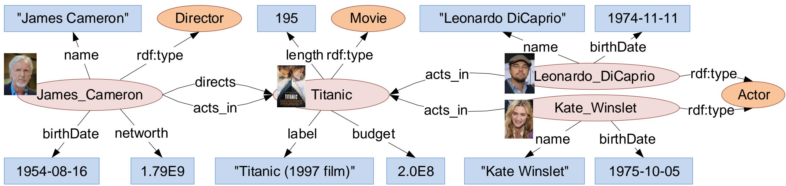
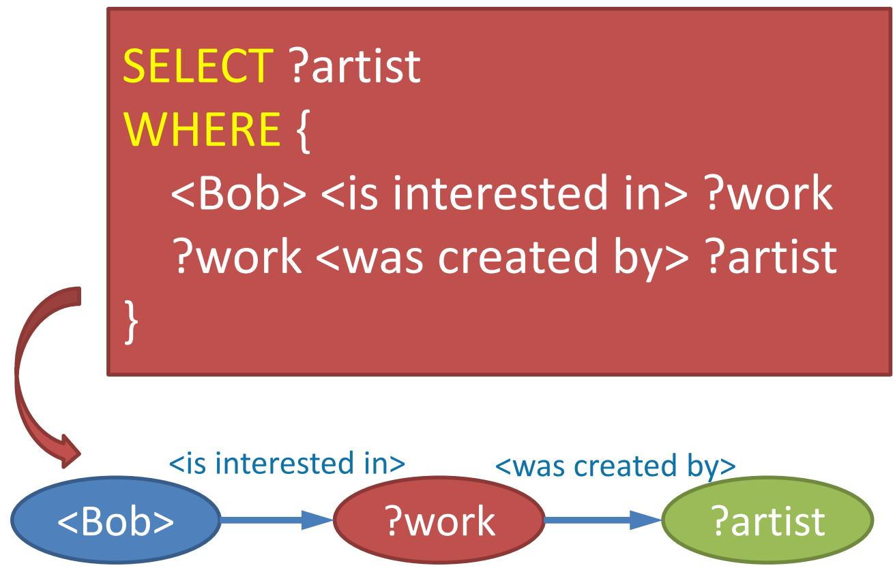

# 第 2 章 知识数据管理

## 1. 本章概述

本章介绍知识图谱的两大**数据模型**——**RDF图**（Resource Description Framework Graph）与**属性图**（Property Graph），以及对应的**查询语言**——**SPARQL**（用于RDF图）和**Cypher**（用于属性图）。核心内容包括：三元组与五元组的形式化定义、具体化（Reification）与RDF\*扩展、SPARQL的四类查询与图模式组合、属性路径、Cypher的模式匹配与传递闭包，以及SPARQL与Cypher的互译。

---

## 2. 知识点讲解

### 知识点 1：RDF图模型

**通俗定义**：RDF图是由很多"三元组"组成的图。每个三元组是一条"主语—谓词—宾语"的边，描述一个事实。好比一条笔记："张三—喜欢—篮球"。

**标准定义**：
- **RDF三元组**（Triple）：形如 $(\text{subject}, \text{predicate}, \text{object})$
  - **subject**（主语）：资源（resource），用 URI 标识
  - **predicate**（谓词）：属性或关系，也用 URI 标识
  - **object**（宾语）：资源或字面值（literal）
- **RDF图**：RDF三元组的**有限集合**，可看作有向图

**举例**（电影《泰坦尼克号》）：
```text
G = {
  (James_Cameron, rdf:type, Director),
  (James_Cameron, birthDate, 1954-08-16),
  (James_Cameron, directs, Titanic),
  (Titanic, rdf:type, Movie),
  (Titanic, budget, 2.0E8),
  (Leonardo_DiCaprio, rdf:type, Actor),
  (Leonardo_DiCaprio, birthDate, 1974-11-11),
  (Kate_Winslet, rdf:type, Actor),
  (Kate_Winslet, birthDate, 1975-10-05),
  (James_Cameron, name, "James Cameron"),
  (James_Cameron, networth, 1.79E9),
  (James_Cameron, acts_in, Titanic),
  (Titanic, label, "Titanic (1997 film)"),
  (Titanic, length, 195),
  (Leonardo_DiCaprio, name, "Leonardo DiCaprio"),
  (Leonardo_DiCaprio, acts_in, Titanic),
  (Kate_Winslet, name, "Kate Winslet"),
  (Kate_Winslet, acts_in, Titanic)
}
```

**RDF图的特点**：
1. 顶点和边均由三元组间接表达，没有独立的"节点对象"和"边对象"
2. **没有对"顶点属性"和"边属性"的内置支持**——这是与属性图最大的区别
3. 顶点与边交集非空，是一种 **3-一致超图**（3-uniform hypergraph）

**具体化（Reification）**：
- **问题**：如何表示"边上的属性"？如 James Cameron 在 Titanic 中 `acts_in`，角色是 `"Steerage Dancer"`——这个 `role` 应附加在边上
- **传统具体化**：把三元组本身建为一个资源节点：
```turtle
_:acts_in_1 rdf:type rdf:Statement .
_:acts_in_1 rdf:subject James_Cameron .
_:acts_in_1 rdf:predicate acts_in .
_:acts_in_1 rdf:object Titanic .
_:acts_in_1 role "Steerage Dancer" .
```
- **RDF\* 扩展**（更简洁）：
```turtle
<< James_Cameron acts_in Titanic >> role "Steerage Dancer" .
```

**RDF\* 要点**：
- 元数据语句成为**一等公民**
- 允许一个三元组出现在另一个三元组的主语或宾语位置
- 嵌入三元组本身也可继续作为元数据三元组，**支持递归**

**初学易错点**：
- RDF 图中**没有**五元组的概念（五元组是属性图的）
- `"Titanic"` 是字面值（literal），`dbr:Titanic` 是资源（URI），二者不同
- 具体化写法繁琐，RDF\* 是更现代的替代方案


---

**例题 1：将自然语言转化为RDF三元组**

**题目**：将以下自然语言描述转化为 RDF 三元组集合："北京是中国的首都，北京的人口是2154万。"

> [!question]- 点击查看完整解答
> ```text
> G = {
>   (北京, rdf:type, 城市),
>   (中国, 首都, 北京),
>   (北京, 人口, "2154万")
> }
> ```
> 注意："北京"和"中国"在实际中应用 URI 标识（如 `ex:北京`），字面值 `"2154万"` 加引号。
>
> **解析**：
> - 每个事实对应一个三元组
> - "北京是城市" → `(北京, rdf:type, 城市)`，其中 `rdf:type` 表示"属于某个类别"
> - "中国首都北京" → `(中国, 首都, 北京)`，谓词"首都"连接两个资源
> - "人口2154万" → `(北京, 人口, "2154万")`，字面值用引号包裹

**练习 1**

以下关于 RDF 图的说法，**错误**的是（ ）
A. RDF 图是三元组的有限集合
B. RDF 图没有对边属性的内置支持
C. RDF\* 允许三元组出现在另一个三元组的主语位置
D. RDF 图的五元组定义中 $\sigma$ 管属性

> [!question]- 点击查看完整解答
> **答案**：D
>
> **解析**：
> - A 正确：RDF 图的定义就是三元组的有限集合
> - B 正确：RDF 默认不支持边属性，需要具体化或 RDF\*
> - C 正确：RDF\* 允许 `<< s p o >>` 嵌入三元组作为主语或宾语
> - D 错误：**五元组是属性图的概念**，RDF 图没有五元组定义，也没有 $\sigma$ 这个符号

---

### 知识点 2：属性图模型

**通俗定义**：属性图比 RDF 图更直接——节点和边都可以有标签和属性。例如 `acts_in` 这条边可以直接有 `role = "Jack Dawson"`，不用像 RDF 那样具体化。

**标准定义**：属性图形式化为一个**五元组**：

$$
G = (V, E, \rho, \lambda, \sigma)
$$

| 符号 | 含义 |
| --- | --- |
| $V$ | 顶点的有限集合 |
| $E$ | 边的有限集合 |
| $\rho: E \to V \times V$ | 将边关联到顶点对（起点→终点） |
| $\lambda: (V \cup E) \to \text{Labels}$ | 为顶点或边赋予**标签** |
| $\sigma: (V \cup E) \times \text{Properties} \to \text{Values}$ | 为顶点或边关联**属性** |

**举例**（电影《泰坦尼克号》）：

$$
\begin{aligned}
V &= \{v_1, v_2, v_3, v_4\} \\
E &= \{e_1, e_2, e_3, e_4\} \\
\rho(e_1) &= (v_1, v_2), \quad \rho(e_2) = (v_1, v_2) \\
\rho(e_3) &= (v_3, v_2), \quad \rho(e_4) = (v_4, v_2)
\end{aligned}
$$

标签：
$$
\begin{aligned}
\lambda(v_1) &= \text{Director}, & \lambda(v_2) &= \text{Movie} \\
\lambda(v_3) &= \text{Actor}, & \lambda(v_4) &= \text{Actor} \\
\lambda(e_1) &= \text{directs}, & \lambda(e_2) &= \text{acts\_in} \\
\lambda(e_3) &= \text{acts\_in}, & \lambda(e_4) &= \text{acts\_in}
\end{aligned}
$$

节点属性：
$$
\begin{aligned}
\sigma(v_1, \text{name}) &= \text{"James Cameron"} \\
\sigma(v_1, \text{birthDate}) &= \text{1954-08-16} \\
\sigma(v_2, \text{label}) &= \text{"Titanic (1997 film)"} \\
\sigma(v_3, \text{name}) &= \text{"Leonardo DiCaprio"} \\
\sigma(v_4, \text{name}) &= \text{"Kate Winslet"}
\end{aligned}
$$

边属性（RDF无法直接表达）：
$$
\begin{aligned}
\sigma(e_2, \text{role}) &= \text{"Steerage Dancer"} \\
\sigma(e_3, \text{role}) &= \text{"Jack Dawson"} \\
\sigma(e_4, \text{role}) &= \text{"Rose DeWitt"}
\end{aligned}
$$

**RDF图 vs 属性图核心对比**：

| 特性 | RDF图 | 属性图 |
| --- | --- | --- |
| 基本单元 | 三元组 $(s,p,o)$ | 节点 + 边（均可有属性） |
| 边属性 | 需要具体化/RDF\* | **原生支持** |
| 标签 | 通过 `rdf:type` 三元组 | 节点/边标签（冒号语法） |
| 数据模型 | 三元组集合 | 五元组 $(V,E,\rho,\lambda,\sigma)$ |
| 查询语言 | SPARQL | Cypher / Gremlin / PGQL |

**初学易错点**：
- $\rho$ 管边连接哪两个点，$\lambda$ 管**标签**，$\sigma$ 管**属性**——三者不要混淆
- 属性图中的边可以直接带属性；RDF 默认不直接支持边属性
- 五元组中的 $(V \cup E)$ 表示 $\lambda$ 和 $\sigma$ 同时作用于**节点和边**


---

**例题 2：写出属性图五元组**

**题目**：给定以下社交网络描述：节点 $v_1$（Person，name="San Zhang"，country=China）、节点 $v_2$（Person，name="Si Li"，country=China）、边 $e_1$（从 $v_1$ 到 $v_2$，knows）。写出 $V, E, \rho, \lambda, \sigma$。

> [!question]- 点击查看完整解答
> $$
> \begin{aligned}
> V &= \{v_1, v_2\} \\
> E &= \{e_1\} \\
> \rho(e_1) &= (v_1, v_2) \\
> \lambda(v_1) &= \text{Person}, \quad \lambda(v_2) = \text{Person}, \quad \lambda(e_1) = \text{knows} \\
> \sigma(v_1, \text{name}) &= \text{"San Zhang"}, \quad \sigma(v_1, \text{country}) = \text{China} \\
> \sigma(v_2, \text{name}) &= \text{"Si Li"}, \quad \sigma(v_2, \text{country}) = \text{China}
> \end{aligned}
> $$
>
> **解析**：
> - $\rho$ 管边的连接关系（谁指向谁）
> - $\lambda$ 管标签（节点/边的类型）
> - $\sigma$ 管属性（键值对）
> - 注意 $\lambda$ 和 $\sigma$ 同时作用于节点和边

**练习 2**

属性图五元组 $G = (V, E, \rho, \lambda, \sigma)$ 中，$\lambda(e_1) = \text{directs}$ 表示（ ）
A. 边 $e_1$ 的属性是 directs
B. 边 $e_1$ 的标签是 directs
C. 边 $e_1$ 连接到 directs 节点
D. 边 $e_1$ 的权重是 directs

> [!question]- 点击查看完整解答
> **答案**：B
>
> **解析**：$\lambda$ 管**标签**（label），$\sigma$ 管**属性**（property）。$\lambda(e_1) = \text{directs}$ 表示边 $e_1$ 的标签是 `directs`。如果要表示属性，应该用 $\sigma(e_1, \text{role}) = \text{"xxx"}$。

---

### 知识点 3：SPARQL查询语言

**通俗定义**：SPARQL 是查询 RDF 图的语言。它不是一步步告诉机器怎么走，而是**声明式**地描述"我想匹配怎样的三元组模式"。

**标准定义**：
- **SPARQL**（SPARQL Protocol and RDF Query Language）：W3C 推荐标准
- SPARQL 1.0（2008）→ SPARQL 1.1（2013）
- 核心层次：三元组模式 → 基本图模式 → 复杂图模式 → 属性路径

**基本语法要素**：

| 要素 | 说明 | 示例 |
| --- | --- | --- |
| URI | 完整资源标识 | `<http://dbpedia.org/resource/Titanic>` |
| 前缀 | URI 缩写 | `dbr:` → `http://dbpedia.org/resource/` |
| `a` | `rdf:type` 的简写 | `?x a dbo:Director` 等价于 `?x rdf:type dbo:Director` |
| 字面值 | 字符串/数字/布尔值 | `"Titanic"`, `3`, `true` |
| 带类型字面值 | 指定数据类型 | `"13"^^xsd:integer`, `"1950-01-01"^^xsd:date` |
| 变量 | 以 `?` 开头 | `?x`, `?person`, `?capital` |

常见前缀：

| 前缀 | 含义 |
| --- | --- |
| `rdf:` | `http://www.w3.org/1999/02/22-rdf-syntax-ns#` |
| `rdfs:` | `http://www.w3.org/2000/01/rdf-schema#` |
| `owl:` | `http://www.w3.org/2002/07/owl#` |
| `xsd:` | `http://www.w3.org/2001/XMLSchema#` |

**四类查询**：

| 类型 | 返回结果 | 用途 |
| --- | --- | --- |
| **SELECT** | 变量绑定表（table） | 最常用，查询变量的具体值 |
| **CONSTRUCT** | 新的 RDF 图 | 根据查询构造新三元组 |
| **ASK** | 布尔值（true/false） | 判断某模式是否存在匹配 |
| **DESCRIBE** | 资源的描述（RDF图） | 获取某个资源的相关三元组 |

查询结构：
```sparql
PREFIX dbr: <http://dbpedia.org/resource/>
PREFIX dbo: <http://dbpedia.org/ontology/>
SELECT ?x
WHERE {
  dbr:James_Cameron dbo:directs ?x .
}
GROUP BY ...
HAVING ...
ORDER BY ...
LIMIT ...
```

**图模式组合**：

| 操作 | 语法 | 语义 |
| --- | --- | --- |
| 合取 | `A . B` | 连接 A 和 B 的结果（共同变量匹配） |
| 可选 | `A OPTIONAL { B }` | 左连接：保留 A 全部解，B 有匹配则补充 |
| 并集 | `{ A } UNION { B }` | 取 A 和 B 的解的并集 |
| 否定 | `A MINUS { B }` | 只保留 A 中与 B 不兼容的结果 |
| 子查询 | `A . { SELECT ... WHERE { B } } . C` | 子查询结果与 A、C 连接 |

**FILTER 过滤**：

```sparql
SELECT ?x
WHERE {
  ?x rdf:type dbo:Director .
  ?x dbo:birthDate ?date .
  FILTER (?date >= "1950-01-01"^^xsd:date)
  ?x dbo:networth ?worth .
  FILTER (?worth > 1.0E9)
}
```

常用 FILTER 类别：逻辑/比较（`=`, `!=`, `<`, `>`）、条件（`EXISTS`, `IF`）、数学（`+`, `-`, `*`, `/`）、字符串（`STRLEN`, `REGEX`）、日期（`now()`, `year()`）。

**聚合**：
```sparql
SELECT ?country (COUNT(?actor) AS ?num)
WHERE { ?movie dbo:actor ?actor . ?movie dbo:country ?country . }
GROUP BY ?country
HAVING (COUNT(?actor) > 10)
```

**属性路径（Property Paths）**：

| 构造 | 含义 | 示例 |
| --- | --- | --- |
| `path1/path2` | 路径连接（先 path1 再 path2） | `dbo:directs/rdfs:label` |
| `^path` | 反向路径（宾语→主语） | `^dbo:acts_in` |
| `path1\|path2` | 路径并集（二选一） | `dbo:directs\|dbo:produces` |
| `!uri` | 谓词否定（排除指定uri） | `!rdf:type` |
| `!^uri` | 反向谓词否定（反向排除uri） | `!^dbo:directs` |
| `path*` | 零次或多次（Kleene闭包） | `dbo:knows*` |
| `path+` | 一次或多次 | `dbo:knows+` |
| `path?` | 可选（零次或一次） | `dbo:knows?` |

**初学易错点**：
- 变量必须以 `?` 开头
- `a` 不是普通字符，是 `rdf:type` 的简写
- `*` 包括 **0次**，可能匹配自己，需加 `FILTER (?x != ?y)`；`+` 至少 **1次**
- `OPTIONAL` 不会删除 A 的结果；普通 `. B` 如果 B 匹配不到会导致整条解消失
- `WHERE` + `FILTER` 过滤原始匹配结果，`HAVING` 过滤分组后的聚合结果
- 日期比较要标注数据类型 `"1950-01-01"^^xsd:date`


---

**例题 3：SPARQL单跳查询**

**题目**：查询 James Cameron 执导的电影。

> [!question]- 点击查看完整解答
> ```sparql
> PREFIX dbr: <http://dbpedia.org/resource/>
> PREFIX dbo: <http://dbpedia.org/ontology/>
>
> SELECT ?movie
> WHERE {
>   dbr:James_Cameron dbo:directs ?movie .
> }
> ```
>
> 结果：`?movie = dbr:Titanic`
>
> **解析**：固定主语 `James_Cameron` 和谓词 `directs`，变量 `?movie` 匹配宾语。这是最简单的**单三元组模式**查询。

**例题 4：SPARQL星形模式 + FILTER**

**题目**：查询 1950 年之后出生的、资产大于 1.0E9 的导演执导的电影的出演演员。

> [!question]- 点击查看完整解答
> ```sparql
> SELECT ?actor
> WHERE {
>   ?director rdf:type dbo:Director .
>   ?director dbo:birthDate ?date .
>   FILTER (?date >= "1950-01-01"^^xsd:date)
>   ?director dbo:networth ?worth .
>   FILTER (?worth > 1.0E9)
>   ?director dbo:directs ?movie .
>   ?actor rdf:type dbo:Actor .
>   ?actor dbo:acts_in ?movie .
> }
> ```
>
> 查询结构：`?director --directs--> ?movie <--acts_in-- ?actor`
>
> 结果：`Leonardo_DiCaprio`, `Kate_Winslet`
>
> **解析**：
> - 先找满足条件的导演（类型为Director、出生日期 ≥ 1950、资产 > 1.0E9）
> - 再找其执导的电影
> - 最后找出演该电影的演员
> - 多条三元组模式通过共同变量 `?director`、`?movie` 连接，形成**星形**图模式

**例题 5：SPARQL属性路径**

**题目**：查询具有多步"合作距离"的两名演员（通过共同出演电影可达）。

> [!question]- 点击查看完整解答
> ```sparql
> SELECT ?x1 ?x2
> WHERE {
>   ?x1 (dbo:acts_in / ^dbo:acts_in)* ?x2 .
>   FILTER (?x1 != ?x2)
>   ?x1 rdf:type dbo:Actor .
>   ?x2 rdf:type dbo:Actor .
> }
> ```
>
> 路径解析：
> - `dbo:acts_in`：从演员沿边走到电影
> - `^dbo:acts_in`：从电影**反向**走到另一个演员
> - `*`：以上操作重复**零次或多次**
>
> 结果：
>
> | ?x1 | ?x2 |
> | --- | --- |
> | Leonardo_DiCaprio | Kate_Winslet |
> | Kate_Winslet | Leonardo_DiCaprio |
>
> **解析**：`*` 包括0次，所以 `FILTER (?x1 != ?x2)` 必不可少，否则会匹配自己到自己。

**练习 3**

将以下 SPARQL 查询翻译为自然语言：
```sparql
SELECT ?name
WHERE {
  ?person rdf:type dbo:Actor .
  ?person dbo:birthDate ?date .
  FILTER (?date >= "1975-01-01"^^xsd:date)
  ?person dbo:name ?name .
}
```

> [!question]- 点击查看完整解答
> **答案**：查询所有出生于1975年之后的演员的姓名。
>
> **解析**：
> - `?person rdf:type dbo:Actor` — 找到所有 Actor 类型的资源
> - `?person dbo:birthDate ?date` — 获取其出生日期
> - `FILTER (?date >= "1975-01-01"^^xsd:date)` — 过滤出生日期 ≥ 1975年1月1日
> - `?person dbo:name ?name` — 获取姓名
> - 关键点：日期字面值必须标注 `^^xsd:date` 数据类型

**练习 4**

以下 SPARQL 查询中，`OPTIONAL` 的作用是什么？
```sparql
SELECT ?label ?budget
WHERE {
  dbr:James_Cameron dbo:directs ?movie .
  ?movie rdfs:label ?label .
  OPTIONAL { ?movie dbo:budget ?budget . }
}
```

> [!question]- 点击查看完整解答
> **答案**：即使电影没有 budget 信息，也不会过滤掉该电影的 label 结果。
>
> **解析**：
> - `OPTIONAL` 实现**左连接**语义：保留 A（主查询）的全部解，B（OPTIONAL 块）有匹配则补充，无匹配则 B 的变量为空
> - 如果不用 `OPTIONAL` 而直接写 `?movie dbo:budget ?budget`，没有 budget 的电影会被**整条过滤掉**
> - 这是 SPARQL 图模式组合中最容易出错的点之一

**练习 5**

判断以下需求应选用哪种 SPARQL 查询类型：
1. "列出所有导演的姓名和出生日期" —— 返回表格
2. "获取 Titanic 的所有相关描述" —— 返回 RDF 图

> [!question]- 点击查看完整解答
> **答案**：
> 1. **SELECT** — 返回变量绑定的表格
> 2. **DESCRIBE** — 返回关于资源的描述（RDF图）
>
> **解析**：
> - SELECT 返回变量绑定表，适合"列出某些值"的需求
> - DESCRIBE 返回某个资源的所有相关三元组，适合"获取某资源全部信息"的需求
> - ASK 返回 true/false，适合"判断是否存在"的需求
> - CONSTRUCT 构造新 RDF 三元组，适合"生成新数据"的需求

---

### 知识点 4：Cypher查询语言

**通俗定义**：Cypher 是属性图的查询语言。用括号表示节点、方括号表示边、箭头表示方向，非常直观。可以理解为"在图上画模式"。

**标准定义**：
- Cypher 由 Neo4j 推出，后被 **openCypher** 标准化
- 属性图查询语言，与 SPARQL（RDF查询语言）地位对等

**基本符号**：

| 运算符 | 语义 |
| --- | --- |
| `( )` | 节点信息 |
| `-[]->` | 边信息（有向） |
| `:` | 节点/边标签 |
| `{ }` | 属性（键值对） |

典型模式：
```cypher
(x:Label {属性: value})-[:RELATION]->(y:Label)
```

**核心子句**：

| 子句 | 功能 | SPARQL对应 |
| --- | --- | --- |
| `MATCH` | 匹配图模式 | WHERE |
| `WHERE` | 过滤条件 | FILTER |
| `RETURN` | 指定返回结果 | SELECT |
| `CREATE` | 创建节点或边 | INSERT DATA |
| `MERGE` | 匹配或创建（幂等） | — |

**举例**：

```cypher
-- 创建节点
CREATE (v1:Director {name:"James Cameron", birthDate:"1954-08-16", networth:1.79E9})
CREATE (v2:Movie {label:"Titanic (1997 film)", length:195, budget:2.0E8})
CREATE (v3:Actor {name:"Leonardo DiCaprio", birthDate:"1974-11-11"})
CREATE (v4:Actor {name:"Kate Winslet", birthDate:"1975-10-05"})

-- 创建边
CREATE (v1)-[:directs]->(v2)
CREATE (v1)-[:acts_in {role:"Steerage Dancer"}]->(v2)
CREATE (v3)-[:acts_in {role:"Jack Dawson"}]->(v2)
CREATE (v4)-[:acts_in {role:"Rose DeWitt"}]->(v2)

-- 查询
MATCH (:Director {name: "James Cameron"})-[:directs]->(x:Movie)
RETURN x, x.label
```

**与SPARQL的核心区别**：

| 特性 | SPARQL | Cypher |
| --- | --- | --- |
| 数据模型 | RDF 三元组 | 属性图 |
| 模式匹配 | 三元组模式 `(s,p,o)` | 图模式 `(:Label)-[:REL]->(:Label)` |
| 属性访问 | 需三元组绑定变量 | 直接 `node.property` |
| 日期写法 | `"1950-01-01"^^xsd:date` | `date("1950-01-01")` |
| 传递闭包 | `(path)*` 属性路径 | `[:knows*]` 边标签限定 |

**初学易错点**：
- Cypher 的传递闭包算子 `*` **只能作用在单独一个边标签**上
- `<-[:acts_in]-` 表示反向匹配：数据中边从演员指向电影，查询时从电影回溯到演员
- SPARQL 需要多条三元组模式绑定属性，Cypher 一条 MATCH 即可直接访问节点属性


---

**例题 6：Cypher单跳查询（对应SPARQL例题3）**

**题目**：查询 James Cameron 执导的电影及其片名。

> [!question]- 点击查看完整解答
> ```cypher
> MATCH (:Director {name: "James Cameron"})-[:directs]->(x:Movie)
> RETURN x, x.label
> ```
>
> 结果：`x = {length:195, label:"Titanic (1997 film)", budget:200000000}`, `x.label = "Titanic (1997 film)"`
>
> **解析**：
> - `(:Director {name: "James Cameron"})` 匹配导演节点
> - `-[:directs]->` 匹配执导边
> - `(x:Movie)` 匹配电影节点并绑定为变量
> - SPARQL 需要两条三元组模式（directs + label），Cypher 一条 MATCH 即可

**例题 7：Cypher多跳 + 过滤（对应SPARQL例题4）**

**题目**：查询 1950 年之后出生的、资产大于 1.0E9 的导演执导的电影的出演演员。

> [!question]- 点击查看完整解答
> ```cypher
> MATCH (x1:Director)-[:directs]->(:Movie)<-[:acts_in]-(x2:Actor)
> WHERE x1.networth > 1.0E9
>   AND x1.birthDate >= date("1950-01-01")
> RETURN x2
> ```
>
> 图模式：`Director --directs--> Movie <--acts_in-- Actor`
>
> 结果：`{name:"Kate Winslet", birthDate:"1975-10-05"}`, `{name:"Leonardo DiCaprio", birthDate:"1974-11-11"}`
>
> **解析**：
> - `<-[:acts_in]-` 表示反向匹配：数据中边从演员指向电影，查询时从电影回溯到演员
> - `WHERE` 直接用 `x1.networth` 和 `x1.birthDate` 访问节点属性（SPARQL 需要额外三元组绑定变量）
> - 日期写法：`date("1950-01-01")`（Cypher）vs `"1950-01-01"^^xsd:date`（SPARQL）

**例题 8：Cypher传递闭包**

**题目**：查询"San Zhang"直接和间接认识的人。

> [!question]- 点击查看完整解答
> ```cypher
> MATCH (x1:Person)-[:knows*]->(x2:Person)
> WHERE x1.firstName = "San"
>   AND x1.lastName = "Zhang"
> RETURN x1, x2
> ```
>
> 结果：
>
> | x1 | x2 |
> | --- | --- |
> | San Zhang | Si Li |
> | San Zhang | Bob Smith |
>
> **解析**：
> - `[:knows*]` 沿 `knows` 边走**任意多步**（传递闭包）
> - 语义：**无重复边**（no-repeated-edge）
> - **限制**：Cypher 的 `*` **只能作用在单独一个边标签**上，不能组合多个标签

**练习 6**

将以下 Cypher 查询翻译为 SPARQL：
```cypher
MATCH (a:Actor)-[:acts_in]->(m:Movie)<-[:directs]-(d:Director)
WHERE m.length > 180
RETURN a.name, d.name
```

> [!question]- 点击查看完整解答
> **答案**：
> ```sparql
> PREFIX dbo: <http://dbpedia.org/ontology/>
> SELECT ?actorName ?directorName
> WHERE {
>   ?actor rdf:type dbo:Actor .
>   ?actor dbo:acts_in ?movie .
>   ?director rdf:type dbo:Director .
>   ?director dbo:directs ?movie .
>   ?movie dbo:length ?length .
>   FILTER (?length > 180)
>   ?actor dbo:name ?actorName .
>   ?director dbo:name ?directorName .
> }
> ```
>
> **解析**：
> - Cypher 的 `(a:Actor)-[:acts_in]->(m:Movie)` → SPARQL 需要两条三元组模式 + 类型约束
> - Cypher 的 `m.length > 180` → SPARQL 的 `FILTER (?length > 180)`
> - Cypher 直接返回 `a.name` → SPARQL 需要额外三元组 `?actor dbo:name ?actorName` 绑定变量
> - 核心区别：**Cypher 可以直接访问节点属性，SPARQL 需要通过三元组模式绑定变量**

**练习 7**

Cypher 中 `[:knows*]` 与 SPARQL 中 `(dbo:knows*)` 都表示传递闭包，以下说法**正确**的是（ ）
A. 两者都包括0步（匹配自己）
B. Cypher 的 `*` 可以组合多个边标签
C. SPARQL 的 `*` 需要加 `FILTER (?x != ?y)` 防止匹配自己
D. 两者的语义完全相同

> [!question]- 点击查看完整解答
> **答案**：C
>
> **解析**：
> - A 部分正确：SPARQL 的 `*` 包括0步；但 Cypher 的 `[:knows*]` 语义也是任意多步，可能包括0步（取决于实现）
> - B 错误：Cypher 的 `*` **只能作用在单独一个边标签**上
> - C 正确：SPARQL 的 `*` 包括0步，会匹配自己到自己，所以需要 `FILTER (?x != ?y)` 排除
> - D 错误：SPARQL 的 `*` 作用于任意路径表达式（可组合多个边），Cypher 的 `*` 仅限单个边标签
