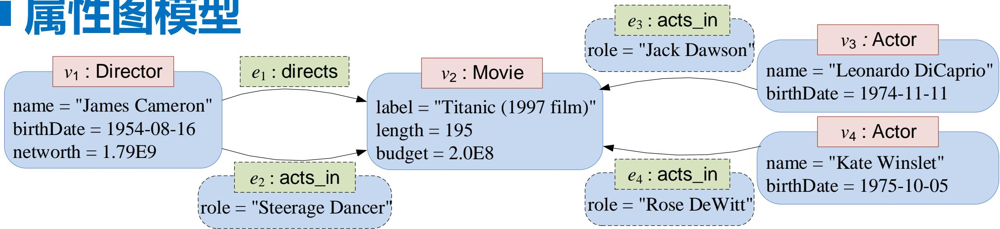

# 第2讲 知识数据管理复习资料

## 1. RDF 图模型（P4-P7）

RDF 图模型以 RDF 三元组为基本单位。

RDF 三元组：

```text
(subject, predicate, object)
```

RDF 图：

RDF 图是 RDF 三元组的有限集合。

PPT 使用电影 Titanic 的例子：

```text
G = {
  (James_Cameron, rdf:type, Director),
  (James_Cameron, birthDate, 1954-08-16),
  (James_Cameron, directs, Titanic),
  (Titanic, rdf:type, Movie),
  (Titanic, budget, 2.0E8),
  (Leonardo_DiCaprio, rdf:type, Actor),
  (Leonardo_DiCaprio, birthDate, 1974-11-11),
  (Kate_Winslet, rdf:type, Actor),
  (Kate_Winslet, birthDate, 1975-10-05),
  (James_Cameron, name, "James Cameron"),
  (James_Cameron, networth, 1.79E9),
  (James_Cameron, acts_in, Titanic),
  (Titanic, label, "Titanic (1997 film)"),
  (Titanic, length, 195),
  (Leonardo_DiCaprio, name, "Leonardo DiCaprio"),
  (Leonardo_DiCaprio, acts_in, Titanic),
  (Kate_Winslet, name, "Kate Winslet"),
  (Kate_Winslet, acts_in, Titanic)
}
```

PPT 原图：


RDF 图模型的特点：

- 顶点和边均由三元组间接表达。
- RDF 没有对“顶点属性”和“边属性”的内置支持。
- 边上的属性可通过“具体化”（reification）表达。
- PPT 提到 RDF 图可看作 3-uniform hypergraph。

边属性例子：James Cameron 在 Titanic 中 `acts_in`，角色是 `"Steerage Dancer"`。

传统 reification 写法：

```turtle
_:acts_in_1 rdf:type rdf:Statement .
_:acts_in_1 rdf:subject James_Cameron .
_:acts_in_1 rdf:predicate acts_in .
_:acts_in_1 rdf:object Titanic .
_:acts_in_1 role "Steerage Dancer" .
```

RDF* 扩展写法：

```turtle
<< James_Cameron acts_in Titanic >> role "Steerage Dancer" .
```

RDF* 说明：

- Metadata statements become first-class citizen。
- 允许一个 triple 出现在另一个 triple 的 subject 或 object 位置。
- embedded triple 本身也可继续作为 metadata triple，支持递归。

### 通俗解释

RDF 图就是很多三元组组成的图。每个三元组是一条“主语-谓词-宾语”的边。RDF 适合语义 Web 和知识图谱，但如果要给边加属性，普通 RDF 需要额外建一个“表示这条边的节点”，RDF* 则更直接。

### 常见考法：

- 给自然语言或图，写 RDF 三元组集合。
- 给 RDF 三元组集合，画 RDF 图。
- 问 RDF 为什么不方便表示边属性，以及 reification / RDF* 如何解决。

### 易错点 / 答题模板

> RDF 图是 RDF 三元组的有限集合。三元组形如 `(s,p,o)`，表示资源 s 通过属性/关系 p 指向资源或字面值 o。RDF 本身没有内置边属性，若要表示边上的属性，可使用 reification 将三元组本身作为资源描述，或使用 RDF* 的嵌入三元组表示。

---

## 2. 属性图模型（P13-P15）

属性图模型（Property Graph Model）中，节点和边都可以具有：

- label：标签。
- property：属性键值对。

PPT 给出属性图 5 元组思想：

$$
G=(V,E,\rho,\lambda,\sigma)
$$

含义：

1. $V$：顶点有限集合。
2. $E$：边有限集合。
3. $\rho$：将边关联到顶点对，例如 $\rho(e)=(source,target)$。
4. $\lambda$：为顶点或边赋予标签。
5. $\sigma$：为顶点或边关联属性。

Titanic 属性图例子：

$$
\begin{aligned}
V &= \{v_1,v_2,v_3,v_4\} \\
E &= \{e_1,e_2,e_3,e_4\} \\
\rho(e_1)&=(v_1,v_2) \\
\rho(e_2)&=(v_1,v_2) \\
\rho(e_3)&=(v_3,v_2) \\
\rho(e_4)&=(v_4,v_2) \\
\lambda(v_1)&=Director \\
\lambda(v_2)&=Movie \\
\lambda(v_3)&=Actor \\
\lambda(v_4)&=Actor \\
\lambda(e_1)&=directs \\
\lambda(e_2)&=acts\_in \\
\lambda(e_3)&=acts\_in \\
\lambda(e_4)&=acts\_in
\end{aligned}
$$

节点属性：

$$
\begin{aligned}
\sigma(v_1,name)&=\text{"James Cameron"} \\
\sigma(v_1,birthDate)&=\text{1954-08-16} \\
\sigma(v_1,networth)&=1.79E9 \\
\sigma(v_2,label)&=\text{"Titanic (1997 film)"} \\
\sigma(v_2,length)&=195 \\
\sigma(v_2,budget)&=2.0E8 \\
\sigma(v_3,name)&=\text{"Leonardo DiCaprio"} \\
\sigma(v_3,birthDate)&=\text{1974-11-11} \\
\sigma(v_4,name)&=\text{"Kate Winslet"} \\
\sigma(v_4,birthDate)&=\text{1975-10-05}
\end{aligned}
$$

边属性：

$$
\begin{aligned}
\sigma(e_2,role)&=\text{"Steerage Dancer"} \\
\sigma(e_3,role)&=\text{"Jack Dawson"} \\
\sigma(e_4,role)&=\text{"Rose DeWitt"}
\end{aligned}
$$

PPT 原图：



另一个社交图例：


### 通俗解释

属性图比 RDF 更直接：节点和边都可以有标签和属性。例如 `acts_in` 这条边可以直接有 `role = "Jack Dawson"`，不用像 RDF 那样 reification。

### 常见考法：

- 写出属性图五元组及含义。
- 根据图写出 $V,E,\rho,\lambda,\sigma$。
- 比较 RDF 图和属性图如何表示边属性。

### 易错点

- $\rho$ 管边连接哪两个点。
- $\lambda$ 管标签。
- $\sigma$ 管属性。
- 属性图中的边可以直接带属性；RDF 默认不直接支持边属性。

---

## 3. SPARQL（P23-P40、P43-P47）

### 3.1 SPARQL 基本概念

SPARQL：

```text
SPARQL Protocol and RDF Query Language
```

特点：

- RDF 图查询语言。
- 声明式语言。
- W3C Recommendation。
- SPARQL 1.0：2008。
- SPARQL 1.1：2013。

核心内容：

- Triple Patterns：三元组模式。
- Basic Graph Patterns：基本图模式。
- Complex Graph Patterns：复杂图模式。
- Property Paths：属性路径。

#### 通俗解释

SPARQL 是查询 RDF 图的语言。它不是一步步告诉机器怎么走，而是声明想匹配怎样的三元组模式。

---

### 3.2 SPARQL 基本语法

URI：

```sparql
<http://this.is.a/full/URI/written#out>
```

Prefix：

```sparql
PREFIX foo: <http://this.is.a/URI/prefix#>
foo:bar
```

等价于：

```text
http://this.is.a/URI/prefix#bar
```

`a` 是 `rdf:type` 的简写。

Literals：

```sparql
"a plain literal"
"bonjour"@fr
"13"^^xsd:integer
true
"true"^^xsd:boolean
3
"3"^^xsd:integer
4.2
"4.2"^^xsd:decimal
```

Variables：

```sparql
?var1
?anotherVar
?and_one_more
```

Comments：

```sparql
# Comments start with a `#'
# continue to the end of the line
```

Triple Patterns：

```sparql
ex:myWidget ex:partNumber "XY24z1" .
?person foaf:name "Lee Feigenbaum" .
conf:SemTech2009 ?property ?value .
```

Common Prefixes：

| prefix | stands for |
| --- | --- |
| rdf: | `http://www.w3.org/1999/02/22-rdf-syntax-ns#` |
| rdfs: | `http://www.w3.org/2000/01/rdf-schema#` |
| owl: | `http://www.w3.org/2002/07/owl#` |
| xsd: | `http://www.w3.org/2001/XMLSchema#` |
| dc: | `http://purl.org/dc/elements/1.1/` |
| foaf: | `http://xmlns.com/foaf/0.1/` |

#### 查询结构

典型结构：

```sparql
PREFIX foo: <...>
PREFIX bar: <...>

SELECT ...
FROM <...>
FROM NAMED <...>
WHERE {
  ...
}
GROUP BY ...
HAVING ...
ORDER BY ...
LIMIT ...
OFFSET ...
VALUES ...
```

组成：

- prefix shortcuts：可选。
- dataset definition：可选。
- query result clause。
- query pattern。
- query modifiers：可选。

### 常见考法：

- 识别 URI、literal、变量、prefix。
- 写出 `a` 的完整含义。
- 给 triple pattern，说明变量绑定。

### 易错点

- 变量必须以 `?` 开头。
- literal 和 IRI 不同，`"Titanic"` 是字面值，`dbr:Titanic` 是资源。
- `a` 不是普通字符，是 `rdf:type` 简写。

---

### 3.3 SPARQL 四类查询

SELECT queries：返回变量绑定表。

```sparql
SELECT ?c ?cap (1000 * ?people AS ?pop)
SELECT *
SELECT DISTINCT ?country
```

结果是表格，如：

| ?c | ?cap | ?pop |
| --- | --- | --- |
| ex:France | ex:Paris | 63,500,000 |
| ex:Canada | ex:Ottawa | 32,900,000 |
| ex:Italy | ex:Rome | 58,900,000 |

CONSTRUCT queries：构造 RDF 图。

```sparql
CONSTRUCT {
  ?country a ex:HolidayDestination ;
           ex:arrive_at ?capital ;
           ex:population ?population .
}
```

ASK queries：返回布尔值。

```sparql
ASK
```

结果：

```text
true
false
```

DESCRIBE queries：返回资源描述。

```sparql
DESCRIBE ?country
```

### 常见考法：

- 问四类 SPARQL 查询及返回结果。
- 判断某需求应该用 SELECT / CONSTRUCT / ASK / DESCRIBE。

### 易错点

- SELECT 返回表。
- CONSTRUCT 返回 RDF 图。
- ASK 返回 true/false。
- DESCRIBE 返回资源描述，具体内容与实现有关。

---

### 3.4 SPARQL 图模式组合

设 A 和 B 是 graph patterns。

Conjunction：

```sparql
A . B
```

含义：连接 A 和 B 的结果，通过共同变量匹配。

Optional Graph Patterns：

```sparql
A OPTIONAL { B }
```

含义：left join。保留 A 的所有解；如果 B 可匹配，则补充 B 的变量绑定。

Either-or Graph Patterns：

```sparql
{ A } UNION { B }
```

含义：并集。包含 A 的解和 B 的解。

Negation：

```sparql
A MINUS { B }
```

含义：先解 A 和 B，只保留 A 中与 B 不兼容的结果。

Subqueries：

```sparql
A .
{
  SELECT ...
  WHERE {
    B
  }
}
C .
```

含义：子查询结果与 A、C 的结果 join。

### 常见考法：

- 解释 OPTIONAL 与普通连接的区别。
- 解释 UNION 和 MINUS 的作用。
- 给查询，判断会保留哪些结果。

### 易错点

OPTIONAL 不会删除 A 的结果；普通 `. B` 如果 B 匹配不到会导致整条解消失。

---

### 3.5 SPARQL FILTER

FILTER：

- 用于消除表达式不为 true 的解。
- 可放在 basic graph pattern 内。

形式：

```sparql
A .
B .
FILTER (...expr...)
```

常用类别：

| 类别 | 函数/操作符 | 例子 |
| --- | --- | --- |
| Logical & Comparisons | `!`, `&&`, `||`, `=`, `!=`, `<`, `<=`, `>`, `>=`, `IN`, `NOT IN` | `?hasPermit || ?age < 25` |
| Conditionals | `EXISTS`, `NOT EXISTS`, `IF`, `COALESCE` | `NOT EXISTS { ?p foaf:mbox ?email }` |
| Math | `+`, `-`, `*`, `/`, `abs`, `round`, `ceil`, `floor`, `RAND` | `?decimal * 10 > ?minPercent` |
| Strings | `STRLEN`, `SUBSTR`, `UCASE`, `LCASE`, `CONTAINS`, `REGEX` 等 | `STRLEN(?description) < 255` |
| Date/time | `now`, `year`, `month`, `day`, `hours`, `minutes`, `seconds` | `month(now()) < 4` |
| Tests | `isURI`, `isBlank`, `isLiteral`, `isNumeric`, `bound` | `isURI(?person) || !bound(?person)` |
| Accessors | `str`, `lang`, `datatype` | `lang(?title) = "en"` |

### 常见考法：

- 根据条件写 `FILTER`。
- 判断 `FILTER` 放在查询中的作用。

### 易错点

日期和数字比较要注意 literal datatype，例如：

```sparql
"1950-01-01"^^xsd:date
```

---

### 3.6 Aggregates

Aggregates 的步骤：

1. 根据 `GROUP BY` 中的表达式将结果分组。
2. 在 `SELECT` 中对每组计算 aggregate functions。
3. 用 `HAVING` 过滤聚合结果。

### 常见考法：

- 写 `COUNT`、`GROUP BY`、`HAVING`。
- 说明 `WHERE` 与 `HAVING` 的区别。

### 易错点

`WHERE/FILTER` 过滤原始匹配结果，`HAVING` 过滤分组后的聚合结果。

---

### 3.7 Property Paths（P43-P47）

Property paths allow triple patterns to match arbitrary-length paths through a graph。

操作符：

| Construct | Meaning |
| --- | --- |
| `path1/path2` | path concatenation，先走 path1 再走 path2 |
| `^path1` | 反向路径，从 object 到 subject |
| `path1|path2` | path union，二选一 |
| `path1*` | 零次或多次 |
| `path1+` | 一次或多次 |
| `path1?` | 可选，一次或零次 |
| `!uri` | 任意谓词，除了 uri |
| `!^uri` | 任意反向谓词，除了 uri |

### 常见考法：

- 根据多跳关系写 property path。
- 解释 `*`、`+`、`^`、`/`。
- 判断查询是否包含 0 跳路径。

### 易错点

- `*` 包括 0 次，因此可能匹配自己。
- `+` 至少一次。
- `^acts_in` 表示沿 `acts_in` 反方向走。

---

### 3.8 SPARQL 示例 1：查询 James_Cameron 执导的电影

查询 1：查询 `James_Cameron` 执导的电影。

三元组模式：

```sparql
SELECT ?x
WHERE {
  dbr:James_Cameron dbo:directs ?x .
}
```

查询结果：

| ?x |
| --- |
| Titanic |

#### 通俗解释

固定主语 `James_Cameron` 和谓词 `directs`，让变量 `?x` 匹配宾语。

#### 常见考法：

常见变体：

- 把主语换成其他导演。
- 把谓词换成 `acts_in`、`birthDate` 等。

---

### 3.9 SPARQL 示例 2：查询 James_Cameron 执导的电影及片名

查询 2：查询 `James_Cameron` 执导的电影及其片名。

基本图模式：

```sparql
SELECT ?x1 ?x2
WHERE {
  dbr:James_Cameron dbo:directs ?x1 .
  ?x1 rdfs:label ?x2 .
}
```

查询结果：

| ?x1 | ?x2 |
| --- | --- |
| Titanic | `"Titanic (1997 film)"` |

#### 通俗解释

第一条三元组找到电影资源 `?x1`；第二条三元组再查这个电影资源的 label `?x2`。共同变量 `?x1` 把两条模式连接起来。

#### 常见考法：

- 问为什么这是“基本图模式”：因为多条 triple pattern 通过变量 join。
- 给查询，让你画匹配链。

---

### 3.10 SPARQL 示例 3：查询 1954-08-16 出生的导演执导的电影

查询 3：查询 `1954-08-16` 出生的导演执导的电影。

```sparql
SELECT ?x2
WHERE {
  ?x1 dbo:directs ?x2 .
  ?x1 rdf:type dbo:Director .
  ?x1 dbo:birthDate "1954-08-16"^^xsd:date .
}
```

图模式形状：星形（Star）。

#### 通俗解释

变量 `?x1` 表示导演，必须同时满足三个条件：

- 他执导了 `?x2`；
- 他是 `dbo:Director`；
- 生日是 `1954-08-16`。

#### 常见考法：

- 写一个多条件查询。
- 判断多条三元组共同变量如何绑定。

### 易错点

`?x1` 是被约束的中心节点；如果三条模式的变量名写不一致，就不能正确 join。

---

### 3.11 SPARQL 示例 4：复杂图模式 + FILTER

查询 4：查询 1950 年之后出生的、资产大于 `1.0E9` 的导演执导的电影的出演演员。

复杂图模式：

```sparql
SELECT ?x5
WHERE {
  ?x1 rdf:type dbo:Director .
  ?x1 dbo:birthDate ?x2 .
  FILTER (?x2 >= "1950-01-01"^^xsd:date)

  ?x1 dbo:networth ?x3 .
  FILTER (?x3 > 1.0E9)

  ?x1 dbo:directs ?x4 .
  ?x5 dbo:acts_in ?x4 .
}
```

查询结果：

| ?x5 |
| --- |
| Leonardo_DiCaprio |
| Kate_Winslet |
| James_Cameron |

#### 通俗解释

这个查询先找满足条件的导演 `?x1`：

- `?x1` 是导演；
- 出生日期大于等于 1950-01-01；
- 资产大于 1.0E9。

再找其执导的电影 `?x4`，最后找出演该电影的演员 `?x5`。

#### 常见考法：

- 给中文需求，写 SPARQL。
- 改出生日期、资产阈值或关系方向。
- 问 `FILTER` 是过滤哪个变量。

### 易错点

- 日期比较要写 datatype。
- `?x5 dbo:acts_in ?x4` 表示演员出演电影；方向不要写反。

---

### 3.12 SPARQL 示例 5：多步合作距离 / 属性路径

查询 5：查询具有多步“合作距离”的两名演员。

属性路径：

```sparql
SELECT ?x1 ?x2
WHERE {
  ?x1 (dbo:acts_in / ^dbo:acts_in)* ?x2 .
  FILTER (?x1 != ?x2)

  ?x1 rdf:type dbo:Actor .
  ?x2 rdf:type dbo:Actor .
}
```

属性路径表达式：

```sparql
(acts_in / ^acts_in)*
```

含义：

1. 从演员沿 `acts_in` 到电影。
2. 再沿 `^acts_in` 从电影反向到其他演员。
3. `*` 表示这个“合作距离”导航操作可以重复零次或多次。

PPT 操作符表：

| Op | 语义 |
| --- | --- |
| `/` | path concatenation |
| `|` | path union |
| `*` | Kleene closure |
| `+` | Kleene plus |
| `^` | edge inverse |

查询结果：

| ?x1 | ?x2 |
| --- | --- |
| Leonardo_DiCaprio | Kate_Winslet |
| Kate_Winslet | Leonardo_DiCaprio |

#### 通俗解释

这个查询找演员之间通过共同出演电影形成的可达关系。`acts_in / ^acts_in` 是“一步合作关系”；加 `*` 后变成多步合作距离。

#### 常见考法：

- 解释 property path。
- 问 `^dbo:acts_in` 是什么方向。
- 把 `*` 改成 `+` 后问结果有什么不同。

### 易错点

如果使用 `*`，0 步路径会包含自己，所以 PPT 中用：

```sparql
FILTER (?x1 != ?x2)
```

去掉自己到自己的匹配。

---

## 4. Cypher（P50-P52）

### 4.1 Cypher 基本模式

Cypher 是属性图查询语言。

常见符号：

| Op | 语义 |
| --- | --- |
| `( )` | Node information |
| `-[ ]->` | Edge information |
| `:` | Node / edge label |
| `{ }` | Properties |

典型模式：

```cypher
(x:Label {property: value})-[:RELATION]->(y:Label)
```

#### 通俗解释

Cypher 用括号表示节点，用方括号表示边，用箭头表示边方向。标签写在冒号后，属性写在花括号里。

### 常见考法：

- 给图模式，写 Cypher。
- 读 Cypher，说明查什么。
- 与 SPARQL 查询互译。

---

### 4.2 Cypher 示例 6：查询 James Cameron 执导的电影及片名

查询 6：查询 `James Cameron` 执导的电影及其片名。

对应 SPARQL 查询 2。

```cypher
MATCH (:Director {name: "James Cameron"})-[:directs]->(x:Movie)
RETURN x, x.label
```

查询结果：

| x | x.label |
| --- | --- |
| `{"length":195,"label":"Titanic (1997 film)", "budget":200000000.0}` | `"Titanic (1997 film)"` |

#### 通俗解释

`(:Director {name: "James Cameron"})` 匹配名字为 James Cameron 的导演节点；`-[:directs]->` 匹配其指向电影的执导边；`x:Movie` 把电影节点绑定为变量 `x`；最后返回整个电影节点和其 label 属性。

#### 常见考法：

- 将 SPARQL 查询 2 改写成 Cypher。
- 问 `x.label` 是什么意思。

### 易错点

`name` 是导演节点属性；`label` 是电影节点属性。不要把 `rdfs:label` 和属性图中的 `x.label` 混为同一种语法。

---

### 4.3 Cypher 示例 7：复杂条件 + 多跳模式

查询 7：查询 1950 年之后出生的、资产大于 `1.0E9` 的导演执导的电影的出演演员。

对应 SPARQL 查询 4。

```cypher
MATCH (x1:Director)-[:directs]->(:Movie)<-[:acts_in]-(x2:Actor)
WHERE x1.networth > 1.0E9
  AND x1.birthDate >= date("1950-01-01")
RETURN x2
```

查询结果：

```json
x2
{"name":"Kate Winslet","birthDate":"1975-10-05"}
{"name":"Leonardo DiCaprio","birthDate":"1974-11-11"}
```

#### 通俗解释

图模式：

```text
Director --directs--> Movie <--acts_in-- Actor
```

先匹配导演执导电影，再匹配演员出演该电影。`WHERE` 对导演属性做过滤。

#### 常见考法：

- 与 SPARQL 查询 4 互译。
- 改过滤条件。
- 问为什么 `acts_in` 的箭头是从 Actor 指向 Movie，因此查询写成 `<-[:acts_in]-`。

### 易错点

Cypher 中日期函数写：

```cypher
date("1950-01-01")
```

而 SPARQL 中日期常写：

```sparql
"1950-01-01"^^xsd:date
```

---

### 4.4 Cypher 示例 8：直接和间接认识的人

查询 8：查询 “San Zhang” 直接和间接认识的人。

```cypher
MATCH (x1:Person)-[:knows*]->(x2:Person)
WHERE x1.firstName = "San"
  AND x1.lastName = "Zhang"
RETURN x1, x2
```

限制：

```text
传递闭包算子 * 只能作用在单独一个边标签
```

查询语义：

```text
no-repeated-edge
```

查询结果中包括：

| x1 | x2 |
| --- | --- |
| San Zhang | Si Li |
| San Zhang | Bob Smith |

#### 通俗解释

`[:knows*]` 表示沿 `knows` 边走任意多步，因此既包括直接认识的人，也包括通过别人间接认识的人。

#### 常见考法：

- 用 Cypher 写传递闭包查询。
- 问 `*` 和固定长度路径的区别。
- 与 SPARQL property path 对比。

### 易错点

PPT 特别强调：Cypher 的传递闭包算子 `*` 只能作用在单独一个边标签上。

---

## 5. 作业 / 练习怎么复习

Markdown 和 PDF 中未看到独立标题为“作业”的页面。结合提纲，最可能需要复习的是 PPT 中 SPARQL 与 Cypher 的查询练习：

- SPARQL 查询 1：单个三元组模式。
- SPARQL 查询 2：基本图模式。
- SPARQL 查询 3：星形图模式。
- SPARQL 查询 4：复杂图模式 + FILTER。
- SPARQL 查询 5：属性路径。
- Cypher 查询 6：电影及片名。
- Cypher 查询 7：复杂条件下的出演演员。
- Cypher 查询 8：`knows*` 传递闭包。

### 常见考法：

最可能的题型：

1. 给中文需求，写 SPARQL。
2. 给中文需求，写 Cypher。
3. 给 SPARQL，解释查询含义和结果。
4. 给 Cypher，解释查询路径、变量和过滤条件。
5. SPARQL 与 Cypher 互译。

### 必背模板

SPARQL 单跳：

```sparql
SELECT ?x
WHERE {
  subject predicate ?x .
}
```

SPARQL 多条件：

```sparql
SELECT ?answer
WHERE {
  ?a rdf:type SomeClass .
  ?a someProperty ?v .
  FILTER (?v > value)
  ?a relation ?answer .
}
```

SPARQL 属性路径：

```sparql
SELECT ?x ?y
WHERE {
  ?x (p / ^p)* ?y .
  FILTER (?x != ?y)
}
```

Cypher 单跳：

```cypher
MATCH (a:Label {prop: value})-[:REL]->(b:Label)
RETURN b
```

Cypher 复杂路径：

```cypher
MATCH (x1:Director)-[:directs]->(:Movie)<-[:acts_in]-(x2:Actor)
WHERE x1.networth > 1.0E9
  AND x1.birthDate >= date("1950-01-01")
RETURN x2
```

Cypher 传递闭包：

```cypher
MATCH (x1:Person)-[:knows*]->(x2:Person)
WHERE x1.firstName = "San"
  AND x1.lastName = "Zhang"
RETURN x1, x2
```


