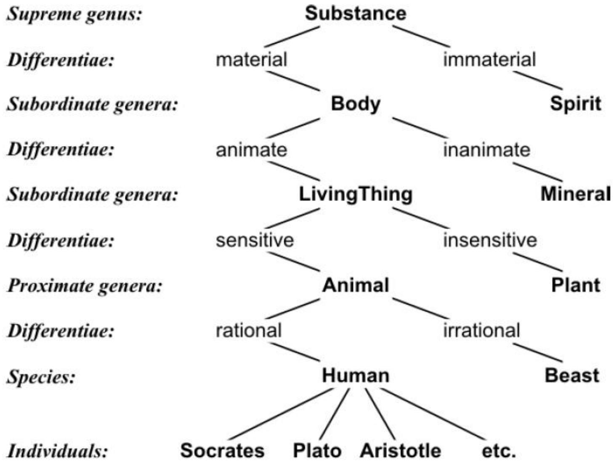
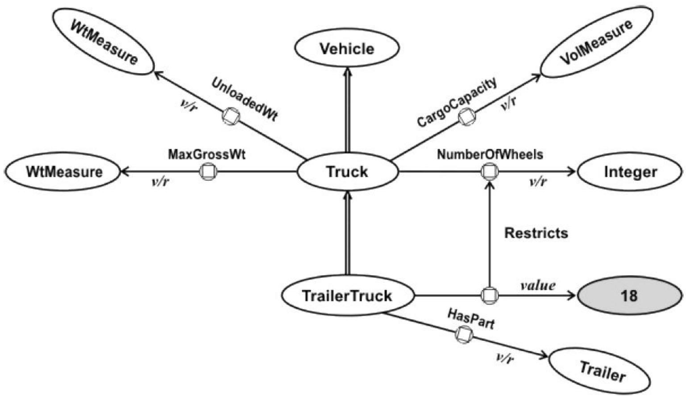
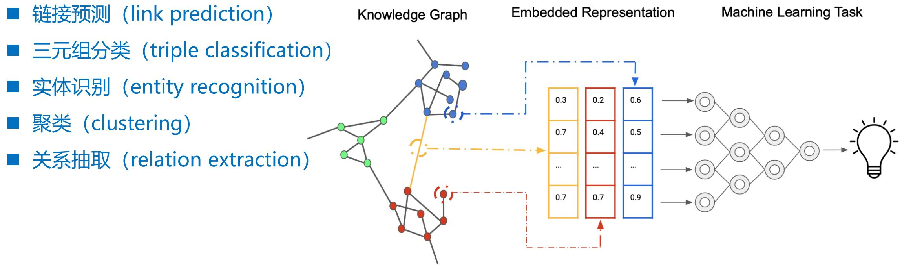
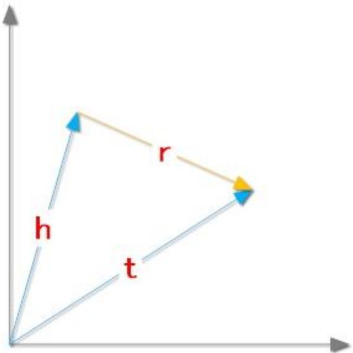

# 第3讲 知识表示方法

## 1. 本章概述

本章介绍知识表示的两大类方法：**传统知识表示方法**（语义网络、框架、产生式系统、逻辑程序设计、专家系统）和**基于向量的知识表示**（知识图谱嵌入、几何模型与 TransE 模型）。传统方法强调符号化、逻辑推理与规则表达，基于向量的方法则将知识图谱中的实体和关系映射到低维连续向量空间中，借助嵌入向量进行语义计算和链接预测。

---

## 2. 知识点讲解

### 知识点 1：语义网络（Semantic Network）

**通俗定义**：用有向图来表达概念及其之间的关系——节点表示概念、边表示关系，类似于人的联想记忆结构。

**标准定义**：
- 语义网络是一种用**有向网络结构**表示概念之间语义关系的知识表示方法
- 1956 年剑桥语言研究中心 R. H. Richens 提出，用于自然语言之间机器翻译的中间语言
- 1963 年 R. F. Simmons 和 S. Klein 基于一阶谓词逻辑实现
- 语义网络与知识图谱关联密切，2012 年 Google 推出 "Knowledge Graph"

**历史渊源**：
- 已知最早的语义网络是公元 3 世纪希腊哲学家 Porphyry 绘制的 **Porphyry 树**——用层次结构定义概念类型，如 Substance → Body → LivingThing → Animal → Human → Socrates/Plato 等
- **KL-ONE 网络**：Woods（1975）提出、Brachman（1979）实现，引入描述逻辑（Description Logics），在角色箭头的目标端标注值约束（value restrictions）

**图示描述（Porphyry 树）**：
```
Substance → material / immaterial
         → Body → animate / inanimate
                → LivingThing → sensitive / insensitive
                              → Animal → rational / irrational
                                        → Human → Socrates, Plato, ...
```

**举例**：
- "猫是哺乳动物" → 节点"猫"← IS-A 边→节点"哺乳动物"
- "猫有尾巴" → 节点"猫"← Has-Part 边→节点"尾巴"
- "知更鸟是鸟类，鸟类有翅膀" → 知更鸟继承"有翅膀"属性

**初学易错点**：
- 语义网络中的边可以有多种语义（IS-A、Part-Of、Agent 等），不能混为一谈
- 语义网络与知识图谱的概念边界模糊，但知识图谱对边有更严格的约束（通常来自本体）



---

**例题 1**：

**题目**：以下关于语义网络的说法，错误的是（ ）
A. 语义网络用有向图结构表示概念之间的语义关系
B. Porphyry 树是已知最早的语义网络
C. 语义网络中的所有边都有同一种语义解释
D. KL-ONE 引入了描述逻辑

**解答**：
- A 正确：语义网络的核心就是有向图表示概念关系
- B 正确：Porphyry 树（公元 3 世纪）是已知最早的语义网络
- C 错误：语义网络中的边可表示多种不同的语义关系（IS-A、Part-Of、Agent 等）
- D 正确：KL-ONE 由 Woods 和 Brachman 提出，引入描述逻辑

**答案**：C

> [!question]- 点击查看完整解答
> **答案**：C
>
> **解析**：语义网络使用有向图表达概念关系，但边的语义多种多样——从 Porphyry 树中"属于"关系到现代知识图谱中多种自定义关系。C 选项说"所有边都有同一种语义解释"显然错误。

**练习 1**：

下列不属于传统知识表示方法的是（ ）
A. 语义网络
B. 知识图谱嵌入
C. 框架
D. 产生式系统

> [!question]- 点击查看完整解答
> **答案**：B
>
> **解析**：传统知识表示方法包括语义网络、框架、产生式系统、逻辑程序设计、专家系统。知识图谱嵌入属于**基于向量的知识表示**方法。

**练习 2**：

关于 Porphyry 树的说法，正确的是（ ）
A. 由 R. F. Simmons 在 1963 年提出
B. 是一个概念类型分类树
C. 只包含两个层次
D. 不能用于定义概念类型

> [!question]- 点击查看完整解答
> **答案**：B
>
> **解析**：Porphyry 树是公元 3 世纪希腊哲学家 Porphyry 绘制的多层分类树（Substance → Body → LivingThing → Animal → Human → 具体个人），代表了所有现代层次概念分类机制的核心。

---

### 知识点 2：框架（Frame）

**通俗定义**：用"表格"来描述一个对象或概念——框架名是对象名，表格中的行（槽）描述属性，单元格（侧面）描述属性的细节。适合表达具有默认值的结构化知识。

**标准定义**：
- 1975 年 Marvin Minsky 提出，作为一种面向对象的知识表示方法
- 框架的两级结构：

| 层级 | 含义 | 例子（"男孩"框架） |
|------|------|-------------------|
| **框架（Frame）** | 描述某一类对象 | 男孩（Boy） |
| **槽（Slot）** | 对象的某个属性 | 腿数量（leg_count） |
| **侧面（Facet）** | 属性的某个方面（值、默认值、约束等） | 默认值 = 2 |

- **实例化**：创建具体对象时填充槽值，未指定的值使用默认值
- **继承**：子框架自动继承父框架的槽和默认值

**举例（"具体的人 Alex"）**：
```txt
框架: Boy（男孩）
  槽: leg_count（腿数量） → 默认值 = 2
  槽: can_walk（能行走）→ 默认值 = true

框架实例: Boy#Alex（具体个体 Alex）
  槽: leg_count: 1（覆盖默认值，Alex 只有一条腿）
```

**初学易错点**：
- 框架 vs 语义网络：框架更强调"结构化的默认值+继承"，语义网络更强调"关系"
- 框架支持**继承机制**：子框架继承父框架的默认值，也可**覆盖（override）**
- 过程附件可以是 IF-NEEDED（需要时计算）、IF-ADDED（添加时触发）、IF-REMOVED（删除时触发）等多种类型

---

**例题 2**：

**题目**：在框架表示法中，下列关于"槽"和"侧面"的描述中正确的是（ ）
A. 一个框架只能有一个槽
B. 侧面不能有默认值
C. 槽表示某个属性，侧面表示属性的不同方面
D. 框架实例不能覆盖父框架的默认值

**解答**：
- A 错误：一个框架可有任意数目的槽
- B 错误：侧面可以有默认值（如"男孩"框架腿数量默认=2）
- C 正确
- D 错误：实例可以覆盖父框架的默认值（如 Alex 腿数量=1）

**答案**：C

> [!question]- 点击查看完整解答
> **答案**：C
>
> **解析**：框架是 Minsky 提出的两级数据结构：槽描述属性，侧面描述属性的不同方面。侧面可包含默认值、过程附件等。实例可以覆盖（override）父框架的默认值。

**练习 1**：

在框架表示法中，子框架实例可以更改父框架中某个槽的默认值，这一机制称为（ ）
A. 继承
B. 覆盖（override）
C. 封装
D. 多态

> [!question]- 点击查看完整解答
> **答案**：B
>
> **解析**：框架同时支持**继承**（获取父框架默认值）和**覆盖**（修改继承值）。如"男孩"框架的腿数量默认=2，实例 Alex 的腿数量=1 就是覆盖。

---

### 知识点 3：产生式系统（Production System）

**通俗定义**：由一组 IF-THEN 规则构成——"如果某种情况成立，就执行某个动作"，类似编程中的条件判断语句集合。

**标准定义**：
- 由**产生式规则**（Production Rules）、**工作记忆**（Working Memory，存放当前状态数据）和**规则解释器**（Rule Interpreter）三部分组成
- 规则形式：`IF 前提（LHS）THEN 动作（RHS）`
- 规则解释器通常执行 **前向链（Forward Chaining）** 算法：反复匹配规则前提与工作记忆，触发成功的规则执行动作，更新工作记忆

**基本流程**：
1. 将当前状态存入工作记忆
2. 匹配所有规则前提（LHS）与工作记忆
3. 将匹配的规则加入**冲突集**（conflict set）
4. 通过冲突消解策略选择一条**触发成功（fired）**
5. 执行规则 RHS，更新工作记忆
6. 重复直到满足停止条件

**停止条件**：用户中断、达到循环上限、执行 halt 操作、无规则可匹配

**初学易错点**：
- **被触发（triggered）** 和 **触发成功（fired）** 不同：前者是前提匹配但动作未执行，后者是动作已执行
- 冲突消解选择的是"哪条规则先 fire"，而非"哪些规则被触发"

---

**例题 3**：

**题目**：在产生式系统中，一条规则的前提被满足但动作尚未执行的状态称为（ ）
A. 被触发（triggered）
B. 触发成功（fired）
C. 冲突消解
D. 匹配失败

**解答**：
- triggered：前提匹配但动作未执行
- fired：前提匹配且动作已执行
- 冲突消解：在多个匹配中选规则的过程
- 匹配失败：前提不满足

**答案**：A

> [!question]- 点击查看完整解答
> **答案**：A
>
> **解析**：triggered（被触发）= 前提匹配成功，但动作尚未执行；fired（触发成功）= 动作已执行。多条规则同时被触发时，需通过冲突消解策略选择一条来 fire。

**练习 1**：

在产生式系统中，当有多条规则的前提同时被工作记忆满足时，选择其中一条执行的过程称为（ ）
A. 模式匹配
B. 前向链
C. 冲突消解
D. 规则触发

> [!question]- 点击查看完整解答
> **答案**：C
>
> **解析**：所有匹配规则加入冲突集后，需通过**冲突消解策略**（如专一性优先、最近使用优先等）选择一条实际触发执行的规则。

---

### 知识点 4：逻辑程序设计（Logic Programming）

**通俗定义**：用一阶谓词逻辑来描述知识和推理规则，然后用定理证明（自动推理）来回答查询。代表语言是 Prolog。

**标准定义**：
- 代表性语言：**Prolog**（Programming in Logic），1972 年由 Alain Colmerauer 和 Robert Kowalski 开发
- 核心组成：**事实（Facts）** + **规则（Rules）** + **查询（Queries）**

**Prolog 程序结构**：
- **事实**：无条件的真值陈述。`father_child(charles, william).`
- **规则**：`head :- body.`——如果 body 真，则 head 真。`parent_child(X, Y) :- father_child(X, Y).`
- **查询**：`?- parent_child(X, Y).`——询问满足条件的 X, Y

**Prolog 推理机制**：
- **反向推理（Backward Chaining / 目标约简）**：从查询目标出发，自顶向下分解子目标
- **合一（Unification）**：匹配变量与常量，寻找最一般合一子（MGU）
- **回溯（Backtracking）**：当一条推理路径失败时，回退到上一个选择点尝试另一种可能

**举例**：
```prolog
father_child(charles, william).     % 事实
father_child(charles, harry).       % 事实
mother_child(elizabeth, charles).   % 事实
parent_child(X, Y) :- father_child(X, Y).   % 规则
parent_child(X, Y) :- mother_child(X, Y).   % 规则
grandparent_child(X, Y) :- parent_child(X, Z), parent_child(Z, Y). % 规则
```

查询 `?- parent_child(X, Y).` 会返回：X=charles,Y=william; X=charles,Y=harry; X=elizabeth,Y=charles

**初学易错点**：
- Prolog = **反向推理**（目标约简），专家系统 = **正向推理**（事实推导）
- Prolog 中的逗号 `,` 表示"逻辑与"，分号 `;` 表示"逻辑或"
- 逻辑程序设计可自然表达递归，关系代数/关系演算难以做到
- ASP（Answer Set Programming）是逻辑程序设计的变体，用 `:-` 表示约束

---

**例题 4**：

**题目**：给定以下 Prolog 程序：
```prolog
father_child(charles, william).
father_child(charles, harry).
mother_child(elizabeth, charles).
parent_child(X, Y) :- father_child(X, Y).
parent_child(X, Y) :- mother_child(X, Y).
grandparent_child(X, Y) :- parent_child(X, Z), parent_child(Z, Y).
```
查询 `?- grandparent_child(elizabeth, harry).` 的结果是（ ）
A. yes
B. no
C. william
D. harry

**解答**：
推理：需要存在 Z 使 `parent_child(elizabeth, Z)` 且 `parent_child(Z, harry)`。`parent_child(elizabeth, charles)` 成立（通过 mother_child），`parent_child(charles, harry)` 也成立（通过 father_child），因此 Z=charles 成立。

**答案**：A

> [!question]- 点击查看完整解答
> **答案**：A
>
> **解析**：Prolog 使用反向推理（目标约简）。`grandparent_child(elizabeth, harry)` 拆分为两个子目标：`parent_child(elizabeth, Z)` 和 `parent_child(Z, harry)`。前者匹配到 `mother_child(elizabeth, charles)`，得 Z=charles；后者匹配到 `father_child(charles, harry)`。故回答 yes。

**练习 1**：

Prolog 语言主要使用的推理策略是（ ）
A. 正向推理
B. 反向推理
C. 双向推理
D. 随机推理

> [!question]- 点击查看完整解答
> **答案**：B
>
> **解析**：Prolog 使用**反向推理**（目标约简/自顶向下）——从查询目标开始逐层分解子目标。专家系统通常使用正向推理。

**练习 2**：

在 ASP（回答集程序设计）中，以下写法的作用是：
```prolog
:- country(C1), country(C2), adjacent(C1, C2), colour(C1, X), colour(C2, X).
```
A. 定义规则
B. 定义事实
C. 定义约束，排除不满足条件的模型
D. 定义查询

> [!question]- 点击查看完整解答
> **答案**：C
>
> **解析**：ASP 中 `:- Body` 是**约束**，排除所有使 Body 为真的模型。此约束意为"不允许相邻国家涂成相同颜色"。

---

### 知识点 5：专家系统（Expert System）

**通俗定义**：把领域专家的知识放进知识库，再用推理机按规则进行推断。核心思想是"知识就是力量"。

**标准定义**：

**专家系统 = 知识库（Knowledge Base）+ 推理引擎（Inference Engine）**

- **知识库**：存储特定领域专家水平的事实和规则
- **推理引擎**：使用知识库中的规则进行推理，常用策略包括前向链和反向链

**Edwards Feigenbaum 名言**：
> "智能系统的强大来源于其所拥有的知识，而非其使用的形式主义或推理机制。"

**举例（MYCIN 医疗诊断专家系统）**：
- IF 患者有感染症状且革兰染色阳性 THEN 可能存在链球菌感染
- IF 细菌类型为链球菌 THEN 推荐使用青霉素

**初学易错点**：
- 专家系统的核心是**知识库中的知识**，不是推理机制本身
- 不要混淆"专家系统"和"现代 AI 系统"——前者以符号规则推理为核心，后者以机器学习/神经网络为核心


---

**例题 5**：

**题目**：专家系统的核心结构是（ ）
A. 数据库 + 算法
B. 知识库 + 推理引擎
C. 规则集 + 工作记忆
D. 数据仓库 + 数据挖掘

**解答**：
专家系统 = **知识库**（事实与规则）+ **推理引擎**（使用规则推导新结论）

**答案**：B

> [!question]- 点击查看完整解答
> **答案**：B
>
> **解析**：专家系统的经典定义就是"知识库 + 推理引擎"。Edward Feigenbaum（专家系统之父）强调"智能系统的强大来源于其所拥有的知识"。

**练习 1**：

以下哪项最能体现 Feigenbaum 关于专家系统的核心理念（ ）
A. 巧妇难为无米之炊
B. 三个臭皮匠，顶个诸葛亮
C. 失败是成功之母
D. 熟能生巧

> [!question]- 点击查看完整解答
> **答案**：A
>
> **解析**：Feigenbaum 名言："智能系统的强大来源于其所拥有的知识，而非其使用的形式主义或推理机制"。知识就是"米"，推理机是"巧妇"——没有领域知识，再好的推理方法也得不到智能结果。

---

### 知识点 6：知识图谱嵌入（Knowledge Graph Embedding, KGE）

**通俗定义**：将知识图谱中的实体和关系映射到低维向量空间，用向量间的运算代替图上的遍历和搜索。好比给地图上的每个地点（实体）和每条道路（关系）都分配一个坐标，用坐标计算来推演路线。

**标准定义**：
- 一个知识图谱 $G = \{E, R, F\}$，其中 $E$ 是实体集合，$R$ 是关系集合，$F$ 是三元组集合 $(h, r, t)$
- KGE 学习两个映射函数：
  - 实体嵌入：$\phi_E: E \to \mathbb{R}^d$
  - 关系嵌入：$\phi_R: R \to \mathbb{R}^d$
- 通过学习保持嵌入空间中的语义关系，一般用一个**打分函数** $f(h, r, t)$ 来衡量三元组的合理性

**典型应用**：
- 链接预测（Link Prediction）：预测缺失的三元组
- 三元组分类（Triple Classification）：判断三元组真伪
- 实体识别与关系抽取的辅助特征

**评估指标**：
- **Mean Rank（MR）**：正确实体的平均排名，越小越好
- **Hits@K**：前 K 个预测中包含正确实体的比例，越大越好
- **Mean Reciprocal Rank（MRR）**：正确排名的倒数均值，越大越好

**初学易错点**：
- MR **越小越好**，Hits@K 和 MRR **越大越好**——三个指标的方向不同
- KGE 面临的挑战：数据稀疏和高计算开销



---

**例题 6**：

**题目**：以下关于知识图谱嵌入评估指标的说法，错误的是（ ）
A. Hits@10 值越大，模型预测性能越好
B. Mean Rank（MR）值越大，模型预测性能越好
C. Mean Reciprocal Rank（MRR）值越大，模型预测性能越好
D. Hits@K 表示前 K 个预测中正确预测的概率

**解答**：
- A 正确：Hits@K 越大越好
- B 错误：MR 表示正确实体的平均排名，越小越好
- C 正确：MRR 越大越好
- D 正确：Hits@K 的定义

**答案**：B

> [!question]- 点击查看完整解答
> **答案**：B
>
> **解析**：三个评估指标的方向：
> - **Hits@K**：越大越好（正确项排在前面的比例高）
> - **MR**：越小越好（平均排名低）
> - **MRR**：越大越好（排名倒数大，即排名靠前）

**练习 1**：

在 KGE 评估中，MR（Mean Rank）值越小越好，意味着（ ）
A. 正确实体在预测中的平均排名越靠前
B. 正确实体在预测中的平均排名越靠后
C. 模型训练速度越快
D. 数据集越大

> [!question]- 点击查看完整解答
> **答案**：A
>
> **解析**：MR = 所有正确实体在预测中的平均排名。MR 越小，说明正确实体排名越靠前，模型性能越好。

---

### 知识点 7：几何模型与 TransE

#### 几何模型

**通俗定义**：将关系视为向量空间中的几何变换，最典型的思路是"平移"——如果 $(h, r, t)$ 成立，则"头实体向量 + 关系向量 ≈ 尾实体向量"。

**标准定义**：
- 几何模型将关系视为几何空间上的变换：对头实体施加几何变换得到尾实体，用距离函数衡量可行性
- **平移类（translational）模型**基于"平移不变性"概念

#### TransE 模型

**核心假设**（Bordes 等人，2013）：
$$ \mathbf{h} + \mathbf{r} \approx \mathbf{t} $$

三元组 $(h, r, t)$ 正确时，头实体向量 $\mathbf{h}$ 与关系向量 $\mathbf{r}$ 之和应接近尾实体向量 $\mathbf{t}$。

**打分函数**：
$$ d(\mathbf{h} + \mathbf{r}, \mathbf{t}) = \begin{cases} \|\mathbf{h} + \mathbf{r} - \mathbf{t}\|_1 & \text{(L1 范数)} \\ \|\mathbf{h} + \mathbf{r} - \mathbf{t}\|_2 & \text{(L2 范数)} \end{cases} $$

正例距离越小越好，负例距离越大越好。

**目标函数（margin-based loss）**：
$$ \mathcal{L} = \sum_{(h,r,t) \in S} \sum_{(h',r,t') \in S'} [\gamma + d(\mathbf{h} + \mathbf{r}, \mathbf{t}) - d(\mathbf{h}' + \mathbf{r}, \mathbf{t}')]_+ $$

- $\gamma$：边际超参数，控制正负例间的最小距离差
- $[x]_+ = \max(0, x)$
- 优化算法：随机梯度下降（SGD）

**算法流程**：
1. 关系向量和实体向量均匀分布随机初始化
2. 实体向量 L2 归一化
3. 循环迭代：采样 minibatch → 生成负例 → SGD 更新嵌入

**优点**：
- 模型简单、易于实现
- 参数量少、训练速度快
- 可扩展性强，适用于大规模知识图谱
- 解释性好，直观理解实体关系

**缺点**：
- **难以建模复杂关系**：
  - 对称关系（如 spouse）：要求 $\mathbf{h} + \mathbf{r} \approx \mathbf{t}$ 且 $\mathbf{t} + \mathbf{r} \approx \mathbf{h}$，迫使 $\mathbf{r} \approx \mathbf{0}$
  - 一对多/多对一关系：多个头/尾实体的向量被映射到相同位置，无法区分
- **嵌入空间限制**：所有关系在同一向量空间，无法表达异质性影响

**初学易错点**：
- 实体和关系在**同一**向量空间 $\mathbb{R}^d$（实体维度 = 关系维度 = k）
- 正例最小化 $d(\mathbf{h} + \mathbf{r}, \mathbf{t})$，负例**最大化**这一距离
- 边际 $\gamma$ 需谨慎设置——太小难以区分正负例，太大训练不收敛
- TransE 的变体：TransH（关系超平面）、TransR（关系空间）、TransD（动态映射）等


---

**例题 7**：

**题目**：TransE 模型的损失函数中，符号 $[x]_+$ 表示的含义是（ ）
A. $|x|$
B. $\max(0, x)$
C. $\min(0, x)$
D. $x^2$

**解答**：
$[x]_+$ 是 hinge loss 中常用的 $\max(0, x)$ 操作。

**答案**：B

> [!question]- 点击查看完整解答
> **答案**：B
>
> **解析**：TransE 损失函数 $\mathcal{L} = \sum [\gamma + d(\mathbf{h} + \mathbf{r}, \mathbf{t}) - d(\mathbf{h}' + \mathbf{r}, \mathbf{t}')]_+$ 中，若正例距离 + 边距已小于负例距离（即 $\gamma + d_+ < d_-$），则损失为 0；否则产生正损失推动参数更新。$[x]_+$ 的作用是截断负值部分。

**练习 1**：

TransE 模型对于正确三元组 $(h, r, t)$ 期望的关系是（ ）
A. $\mathbf{h} \approx \mathbf{r} + \mathbf{t}$
B. $\mathbf{h} + \mathbf{r} \approx \mathbf{t}$
C. $\mathbf{h} + \mathbf{t} \approx \mathbf{r}$
D. $\mathbf{h} \approx \mathbf{r} \times \mathbf{t}$

> [!question]- 点击查看完整解答
> **答案**：B
>
> **解析**：TransE 核心假设 $\mathbf{h} + \mathbf{r} \approx \mathbf{t}$，即头实体向量 + 关系向量 ≈ 尾实体向量。

**练习 2**：

TransE 模型在处理"配偶（spouse）"这种对称关系时的问题是（ ）
A. 训练速度太慢
B. 需要太多训练数据
C. $\mathbf{r}$ 被迫趋近于 $\mathbf{0}$，失去区分性
D. 无法初始化嵌入向量

> [!question]- 点击查看完整解答
> **答案**：C
>
> **解析**：对称关系要求 $\mathbf{h} + \mathbf{r} \approx \mathbf{t}$ 且 $\mathbf{t} + \mathbf{r} \approx \mathbf{h}$，推出 $\mathbf{r} \approx \mathbf{0}$，关系向量无法表达语义。这是 TransE 的主要缺点之一，后续 TransH 等变体试图解决。
