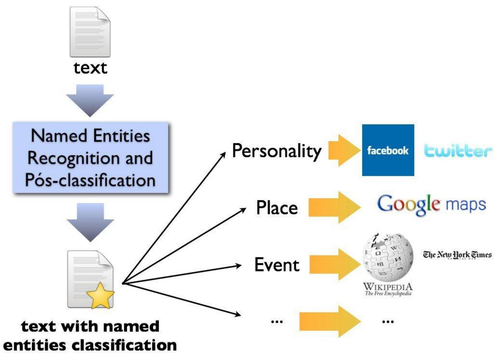
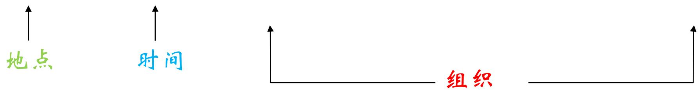
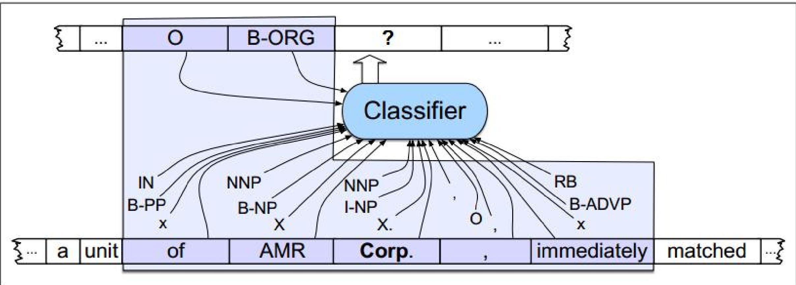
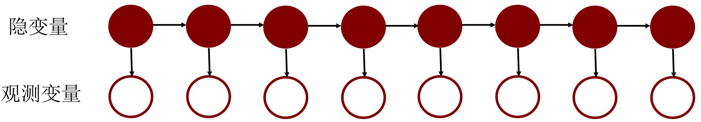
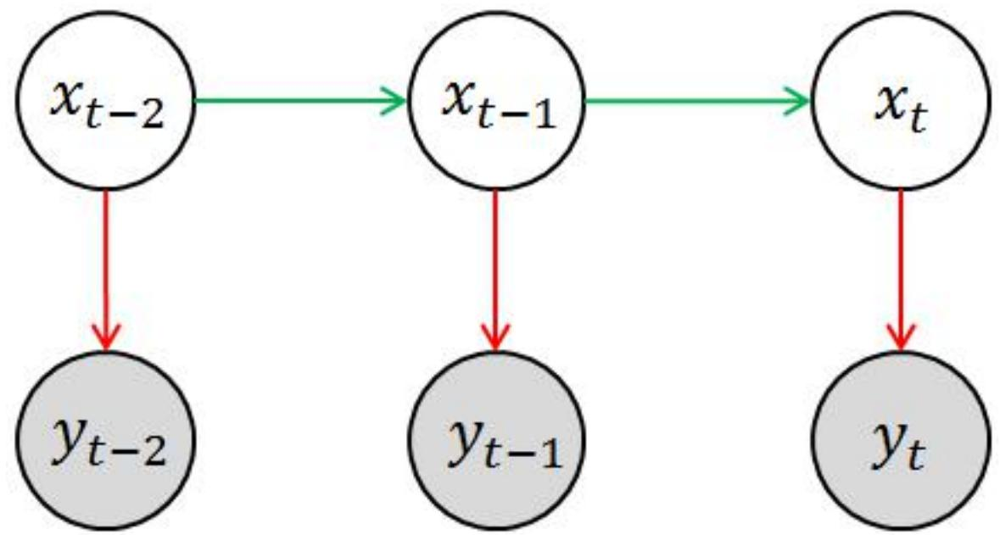
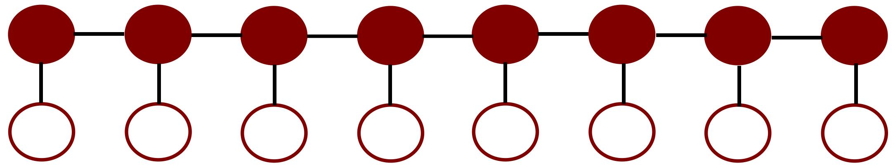
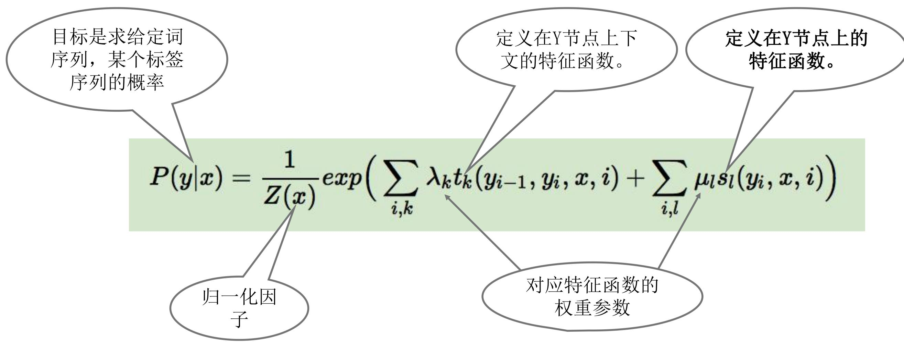
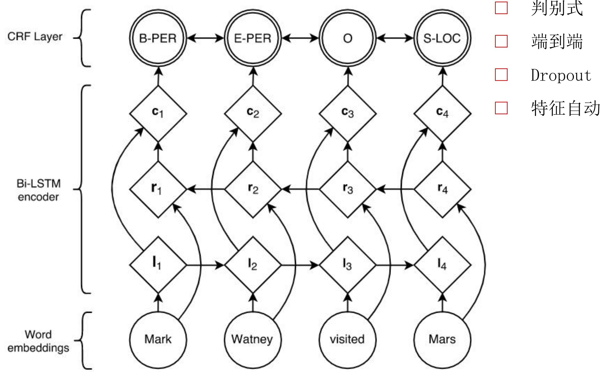

知识获取第2讲

# 实体识别

# Named Entity Recognition（NER）

张小旺

xiaowangzhang@tju.edu.cn

天津大学智能与计算学部

## NER：从文本中识别实体

● 任务定义: 抽取文本中的原子信息元素，是进一步实现关系抽取的基础

● 通用领域实体类型举例

人名

组织/机构名

地理位置

时间/日期

字符值

金额值

## 实体识别举例

北京时间10月25日，骑士后来居上，在主场以119-112击退公牛。

中新社华盛顿10月24日电 美国众议院三个委员会24日宣布将分别展开两项与希拉里·克林顿有关的调查，国会民主党人称这是共和党人试图转移注意力。

人物

## 实体识别的常用方法

p基于模板和规则的方法

p基于序列标注的机器学习方法

p基于深度学习的方法

p结合迁移学习、对抗学习等新方法

## 基于模板和规则的方法

● 将文本与规则进行匹配来识别出命名实体

“\*\*\*说”、 “\*\*\*老师”;

“\*\*\*大学”、 “\*\*\*医院”

优点：

□ 准确，有些实体识别只能依靠规则抽取

●缺点：

需要大量的语言学知识

需要谨慎处理规则之间的冲突问题；

构建规则的过程费时费力、可移植性不好。

## 基于序列标注的方法

确定标签体系

?

选择模型

定义特征

模型训练

❑ 词本身的特征-边界特征：边界词概率-词性-依存关系

前后缀特征-姓氏：李XX、王X-地名：XX省、XX市❑ 字本身的特征-是否是数字-是否是字符

## 确定实体识别的序列标签体系

<table><tr><td rowspan=1 colspan=1></td><td rowspan=1 colspan=1>IOB标注体系</td><td rowspan=1 colspan=1>I0标注体系</td><td rowspan=1 colspan=1></td><td rowspan=1 colspan=1>IOB标注体系</td><td rowspan=1 colspan=1>I0标注体系</td></tr><tr><td rowspan=1 colspan=1>由</td><td rowspan=1 colspan=1>O</td><td rowspan=1 colspan=1>0</td><td rowspan=1 colspan=1>清</td><td rowspan=1 colspan=1>B-ORG</td><td rowspan=1 colspan=1>I-ORG</td></tr><tr><td rowspan=1 colspan=1>浙</td><td rowspan=1 colspan=1>B-0RG</td><td rowspan=1 colspan=1>I-ORG</td><td rowspan=1 colspan=1>华</td><td rowspan=1 colspan=1>I-ORG</td><td rowspan=1 colspan=1>I-0RG</td></tr><tr><td rowspan=1 colspan=1>江</td><td rowspan=1 colspan=1>I-ORG</td><td rowspan=1 colspan=1>I-ORG</td><td rowspan=1 colspan=1>大</td><td rowspan=1 colspan=1>I-ORG</td><td rowspan=1 colspan=1>I-ORG</td></tr><tr><td rowspan=1 colspan=1>大</td><td rowspan=1 colspan=1>I-ORG</td><td rowspan=1 colspan=1>I-0RG</td><td rowspan=1 colspan=1>学</td><td rowspan=1 colspan=1>I-ORG</td><td rowspan=1 colspan=1>I-0RG</td></tr><tr><td rowspan=1 colspan=1>学</td><td rowspan=1 colspan=1>I-ORG</td><td rowspan=1 colspan=1>I-ORG</td><td rowspan=1 colspan=1>的</td><td rowspan=1 colspan=1>0</td><td rowspan=1 colspan=1>0</td></tr><tr><td rowspan=1 colspan=1>的</td><td rowspan=1 colspan=1>0</td><td rowspan=1 colspan=1>0</td><td rowspan=1 colspan=1>李</td><td rowspan=1 colspan=1>B-PER</td><td rowspan=1 colspan=1>I-PER</td></tr><tr><td rowspan=1 colspan=1>张</td><td rowspan=1 colspan=1>B-PER</td><td rowspan=1 colspan=1>I-PER</td><td rowspan=1 colspan=1>大</td><td rowspan=1 colspan=1>I-PER</td><td rowspan=1 colspan=1>I-PER</td></tr><tr><td rowspan=1 colspan=1>小</td><td rowspan=1 colspan=1>I-PER</td><td rowspan=1 colspan=1>I-PER</td><td rowspan=1 colspan=1>大</td><td rowspan=1 colspan=1>I-PER</td><td rowspan=1 colspan=1>I-PER</td></tr><tr><td rowspan=1 colspan=1>小</td><td rowspan=1 colspan=1>I-PER</td><td rowspan=1 colspan=1>I-PER</td><td rowspan=1 colspan=1></td><td rowspan=1 colspan=1></td><td rowspan=1 colspan=1></td></tr><tr><td rowspan=1 colspan=1>迎</td><td rowspan=1 colspan=1>0</td><td rowspan=1 colspan=1>0</td><td rowspan=1 colspan=1></td><td rowspan=1 colspan=1></td><td rowspan=1 colspan=1></td></tr><tr><td rowspan=1 colspan=1>战</td><td rowspan=1 colspan=1>0</td><td rowspan=1 colspan=1>0</td><td rowspan=1 colspan=1></td><td rowspan=1 colspan=1></td><td rowspan=1 colspan=1></td></tr></table>

## 序列标签体系

<table><tr><td rowspan=1 colspan=1>编码</td><td rowspan=1 colspan=1>代码</td><td rowspan=1 colspan=1>意义</td><td rowspan=1 colspan=1>例子</td></tr><tr><td rowspan=1 colspan=1>B</td><td rowspan=1 colspan=1>Pf</td><td rowspan=1 colspan=1>姓氏</td><td rowspan=1 colspan=1>张华平先生</td></tr><tr><td rowspan=1 colspan=1>C</td><td rowspan=1 colspan=1>Pm</td><td rowspan=1 colspan=1>双名的首字</td><td rowspan=1 colspan=1>张华平先生</td></tr><tr><td rowspan=1 colspan=1>D</td><td rowspan=1 colspan=1>Pt</td><td rowspan=1 colspan=1>双名的末字</td><td rowspan=1 colspan=1>张华平先生</td></tr><tr><td rowspan=1 colspan=1>E</td><td rowspan=1 colspan=1>Ps</td><td rowspan=1 colspan=1>单名</td><td rowspan=1 colspan=1>张浩说：“我是一个好人”</td></tr><tr><td rowspan=1 colspan=1>F</td><td rowspan=1 colspan=1>Ppf</td><td rowspan=1 colspan=1>前缀</td><td rowspan=1 colspan=1>老刘、小李</td></tr><tr><td rowspan=1 colspan=1>G</td><td rowspan=1 colspan=1>Plf</td><td rowspan=1 colspan=1>后缀</td><td rowspan=1 colspan=1>王总、刘老、肖氏、吴妈、叶帅</td></tr><tr><td rowspan=1 colspan=1>K</td><td rowspan=1 colspan=1>PP</td><td rowspan=1 colspan=1>人名的上文</td><td rowspan=1 colspan=1>又来到于洪洋的家。</td></tr><tr><td rowspan=1 colspan=1>L</td><td rowspan=1 colspan=1>Pn</td><td rowspan=1 colspan=1>人名的下文</td><td rowspan=1 colspan=1>新华社记者黄文摄</td></tr><tr><td rowspan=1 colspan=1>M</td><td rowspan=1 colspan=1>Ppn</td><td rowspan=1 colspan=1>两个中国人名之间的成分</td><td rowspan=1 colspan=1>编剧邵钧林和稽道青说</td></tr><tr><td rowspan=1 colspan=1>U</td><td rowspan=1 colspan=1>Ppf</td><td rowspan=1 colspan=1>人名的上文和姓成词</td><td rowspan=1 colspan=1>这里有关天培的壮烈</td></tr><tr><td rowspan=1 colspan=1>V</td><td rowspan=1 colspan=1>Pnw</td><td rowspan=1 colspan=1>人名的末字和下文成词</td><td rowspan=1 colspan=1>龚学平等领导，邓颖超生前</td></tr><tr><td rowspan=1 colspan=1>×</td><td rowspan=1 colspan=1>Pim</td><td rowspan=1 colspan=1>姓与双名的首字成词</td><td rowspan=1 colspan=1>王国维、</td></tr><tr><td rowspan=1 colspan=1>Y</td><td rowspan=1 colspan=1>Pfs</td><td rowspan=1 colspan=1>姓与单名成词</td><td rowspan=1 colspan=1>高峰、汪洋</td></tr><tr><td rowspan=1 colspan=1>Z</td><td rowspan=1 colspan=1>Pmt</td><td rowspan=1 colspan=1>双名本身成词</td><td rowspan=1 colspan=1>张朝阳</td></tr><tr><td rowspan=1 colspan=1>A</td><td rowspan=1 colspan=1>Po</td><td rowspan=1 colspan=1>以上之外其他的角色</td><td rowspan=1 colspan=1></td></tr></table>

## 序列标签体系

<table><tr><td rowspan=1 colspan=1>角色</td><td rowspan=1 colspan=1>意义</td><td rowspan=1 colspan=1>例子</td></tr><tr><td rowspan=1 colspan=1>A</td><td rowspan=1 colspan=1>上文</td><td rowspan=1 colspan=1>参与亚太经合组织的活动</td></tr><tr><td rowspan=1 colspan=1>B</td><td rowspan=1 colspan=1>下文</td><td rowspan=1 colspan=1>中央电视台报道</td></tr><tr><td rowspan=1 colspan=1>X</td><td rowspan=1 colspan=1>连接词</td><td rowspan=1 colspan=1>北京电视台和天津电视台</td></tr><tr><td rowspan=1 colspan=1>C</td><td rowspan=1 colspan=1>特征词的一般性前缀</td><td rowspan=1 colspan=1>北京电影学院</td></tr><tr><td rowspan=1 colspan=1>F</td><td rowspan=1 colspan=1>特征词的人名前缀</td><td rowspan=1 colspan=1>何镜堂纪念馆</td></tr><tr><td rowspan=1 colspan=1>G</td><td rowspan=1 colspan=1>特征词的地名性前缀</td><td rowspan=1 colspan=1>交通银行北京分行</td></tr><tr><td rowspan=1 colspan=1>K</td><td rowspan=1 colspan=1>特征词的机构名、品牌名前缀</td><td rowspan=1 colspan=1>中共中央顾问委员会美国摩托罗拉公司</td></tr><tr><td rowspan=1 colspan=1>I</td><td rowspan=1 colspan=1>特征词的特殊性前缀</td><td rowspan=1 colspan=1>中央电视台，中海油集团</td></tr><tr><td rowspan=1 colspan=1>J</td><td rowspan=1 colspan=1>特征词的简称性前缀</td><td rowspan=1 colspan=1>巴政府</td></tr><tr><td rowspan=1 colspan=1>D</td><td rowspan=1 colspan=1>机构名的特征词</td><td rowspan=1 colspan=1>国务院侨务办公室</td></tr><tr><td rowspan=1 colspan=1>S</td><td rowspan=1 colspan=1>开始标志</td><td rowspan=1 colspan=1>始##始</td></tr></table>

## 常见模型：HMM (隐马尔可夫模型)

…B-ORG

I-ORG

I-ORG

I-ORG

O

O

B-LOC

B-LOC…

  
…浙  
江  
大  
学  
位  
于  
杭  
州…

有向图模型，结构最简单的动态贝叶斯网络

基于马尔可夫性，假设特征之间是独立的

## 常见模型：HMM (隐马尔可夫模型)

➤ 齐次马尔科夫链假设：即任意时刻的隐藏状态只依赖于它前一个隐藏态

➤ 观测独立性假设：即任意时刻的观察状态只仅仅依赖于当前时刻的隐藏状态

离散的转移概率（Transition Probability）

$$
P ( x _ { t } | x _ { t - 1 } , x _ { t - 2 } , \cdots , x _ { 1 } , y _ { 1 } , \cdots , y _ { t - 1 } ) = P ( x _ { t } | x _ { t - 1 } )
$$

·连续（或离散）的测量概率（Measurement Probability）

$$
P ( y _ { t } | x _ { t } , x _ { t - 1 } , \cdots , x _ { 1 } , y _ { 1 } , \cdots , y _ { t - 1 } ) = P ( y _ { t } | x _ { t } )
$$

## 常见模型：CRF (条件随机场)

条件随机场无向图模型

● 随机场是由若干个位置组成的整体，当给每一个位置中按照某种分布随机赋予一个值之后，其全体就叫做随机场。

马尔科夫随机场是随机场的特例，它假设随机场中某一个位置的赋值仅与和它相邻的位置的赋值有关，和与其不相邻的位置的赋值无关。

● 条件随机场是马尔科夫随机场的特例，它假设马尔科夫随机场中只有X和Y两种变量，X一般是给定的，而Y一般是在给定X的条件下的输出。

● 例如：实体识别任务要求对一句话中的十个词做实体类型标记，这十个词可以从可能实体类型标签中选择，这就形成了一个随机场。如果假设某个词的标签只与其相邻的词的标签有关，则形成马科夫随机场，同时由于这个随机场只有两种变量，令X为词，Y为实体类型标签，则形成一个条件随机场。

## CRF的机器学习模型

通过定义特征函数和权重系数转化为一个机器学习问题。

## CRF的训练

● 训练——Training：给定训练数据集X和Y，学习linear-CRF的模型参数wk (?)和条件概率分布 $\operatorname { P } _ { \mathbb { W } } \left( { \mathfrak { y } } \mid _ { \mathbb { X } } \right)$ ，采用最大化对数似然函数和SGD即可：

$$
\begin{array} { r } { \bullet \mathrm { ~ 0 ~ } ( \bigoplus ) = \sum \mathrm { ~ t = 1 ~ } ^ { \sim } \mathrm { ~ N ~ } \log \mathrm { P } \bullet \left( \mathrm { y } ^ { \mathrm { t } } \left| \mathrm { ~ x } ^ { \mathrm { t } } \right. \right) } \end{array}
$$

● 解码——Decoding：给定 linear-CRF的条件概率分布P ${ \bigl ( } \mathbf { y } \mid \mathbf { \boldsymbol { x } } { \bigr ) }$ ,和输入序列x,计算使条件概率最大的输出序列y，可采用维特比算法很方便解决这一问题。

## 常见模型： RNN+CRF

特征自动提取

## 中文实体识别

● 中文没有自然分词，词的概念很模糊，也不具备英文中的字母大小写等形态特征。

● 中文用字变化多，有些实体不能脱离上下文语境，同一实体在不同语境可能是不同的实体类型。

中文多嵌套实体，如“浙江大学附属第一医院” O

● 中文简化表达现象严重，如“浙大”、“新思想”，“浙大竺院”

## 本讲结束

感谢浙江大学陈华钧教授提供课程素材！