## 知识获取第3讲

# 实体关系抽取

张小旺

天津大学

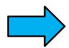

## 实体关系抽取

p从文本中抽取出两个或者多个实体之间的语义关系p信息抽取 (Information Extraction)研究领域的任务之一p从文本获取知识图谱三元组的主要技术手段

举例：王健林谈儿子王思聪:我期望他稳重一点。

父子 (王健林， 王思聪)

## 实体关系抽取

中国证券网讯（记者严政）卓翼科技月4日晚公告称，公司于近日收到中兴通讯股份有限公司发出的《中标结果》通知，公司在中兴通讯EPON产品、GPON产品招标中均获第二名的份额，预计本次中标总金额约为1.914亿元（不含税），占公司2011年度经审计的营业收入的15.46%。

其中，公司本次中标中兴通讯四个EPON产品类别，中兴通讯预计该四个EPON产品类别2013年全年总量为270万台，根据招标结果，公司中标份额的比例分别为20%、20%、30%、30%，对应的产品总量约为57万台，预计金额为8800万元，占公司2011年度经审计的营业收入的7.11%。

<table><tr><td rowspan=1 colspan=1>公司A</td><td rowspan=1 colspan=1>公司B</td><td rowspan=1 colspan=1>关系（A是B的)</td><td rowspan=1 colspan=1>时间</td><td rowspan=1 colspan=1>来源</td></tr><tr><td rowspan=1 colspan=1>中兴通讯</td><td rowspan=1 colspan=1>卓翼科技(002369)</td><td rowspan=1 colspan=1>客户</td><td rowspan=1 colspan=1>2013.03.05</td><td rowspan=1 colspan=1>中国证券网公司公告</td></tr><tr><td rowspan=1 colspan=1>中兴康讯</td><td rowspan=1 colspan=1>Acacia</td><td rowspan=1 colspan=1>客户</td><td rowspan=1 colspan=1>2015.12.28</td><td rowspan=1 colspan=1>OFweek光通讯网行业新闻</td></tr></table>

Acacia自2011年开始出货高速高效节能产品，目前已拥有20家客户 包括ADVA、中兴康讯和阿尔卡特朗讯 Acacia与阿尔卡特朗讯关系良好——其CEORajShanmugarai曾是阿尔卡特朗讯美国公司的光网络事业部的业务发展副总裁。

## 关系抽取举例

中国联通与中兴通讯正式签署SDN/NFV战略合作协议

近日，中国联通和中兴通讯共同宣布，双方正式签署SDN/NFV战明合作协议。双方旨在通过协同创新更好地把握以SDN/NFV为代表的网络发展趋势，实现SDN/NFV的落地应用，推动中国联通新一代网络的构建，快速满

## 中兴通信中标联通规模最大100G项目

作者：李雁争来源：上海证券报

<table><tr><td rowspan=1 colspan=1>公司A</td><td rowspan=1 colspan=1>公司B</td><td rowspan=1 colspan=1>关系（A是B的)</td><td rowspan=1 colspan=1>时间</td><td rowspan=1 colspan=1>来源</td></tr><tr><td rowspan=1 colspan=1>中兴通讯</td><td rowspan=1 colspan=1>中国联通</td><td rowspan=1 colspan=1>合作伙伴</td><td rowspan=1 colspan=1>2016.03.23</td><td rowspan=1 colspan=1>公司新闻</td></tr><tr><td rowspan=1 colspan=1>中兴通讯</td><td rowspan=1 colspan=1>中国联通</td><td rowspan=1 colspan=1>客户</td><td rowspan=1 colspan=1>2015.06.12</td><td rowspan=1 colspan=1>公司新闻</td></tr><tr><td rowspan=1 colspan=1>中兴通讯</td><td rowspan=1 colspan=1>英特尔(INTC)</td><td rowspan=1 colspan=1>合作伙伴</td><td rowspan=1 colspan=1>2013.01.16</td><td rowspan=1 colspan=1>公司新闻</td></tr></table>

首页》新闻资讯》新闻动态

## 实体关系抽取概览

领域

模型

封闭域关系抽取

开放域关系抽取

特征工程

拓展

框架

核函数

图模型

深度学习

人工模板

多元关系

监督学习

跨句推理

弱监督远程监督

联合抽取

Bootstrap

对抗学习

无监督

强化学习

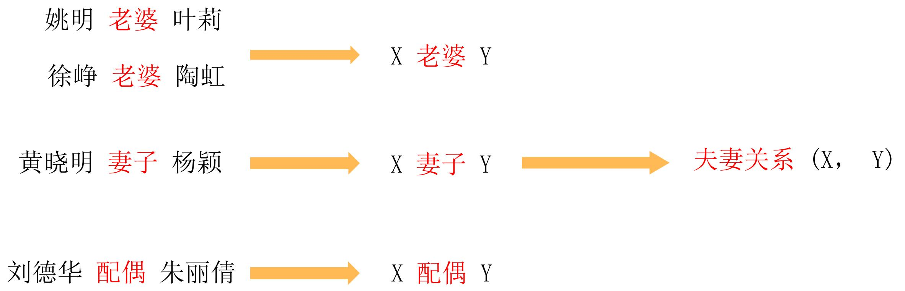

## 基于模板的方法 （触发词）

## 基于模板的方法(依存句法分析)

<table><tr><td>关系类型</td><td>Tag Description</td><td></td><td>Example 我送她一束花 (我 &lt;-送)</td></tr><tr><td>主谓关系 动宾关系 间宾关系 前置宾语 兼语 定中关系 状中结构</td><td colspan="3">SBV subject-verb VOB 直接宾语，verb-object IOB 间接宾语，indirect-object FOB 前置宾语，fronting-object DBLdouble ATT attribute ADV adverbial CMP complement COO coordinate POB preposition-object 左附加关系 LAD left adjunct 右附加关系 RAD right adjunct IS independent structure</td></tr></table>

法关

## 基于模板的方法（依存句法分析）

p 依存句法分析句子的句法结构

p 以动词为起点，构建规则，对节点上的词性和边上的依存关系进行限定

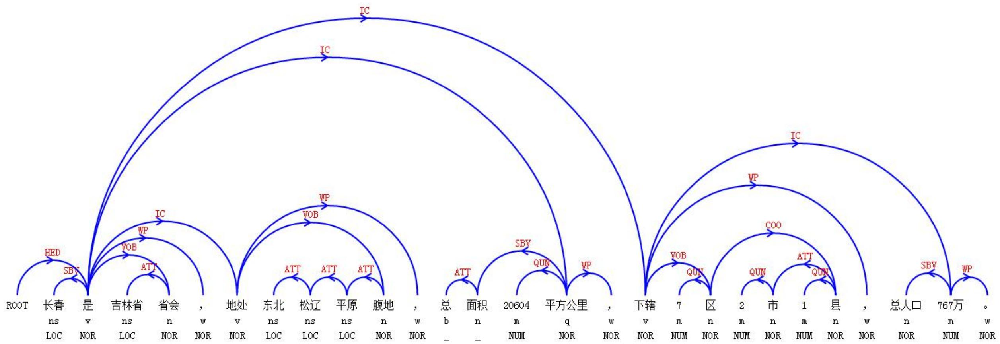

## 基于模板的方法(依存句法分析)

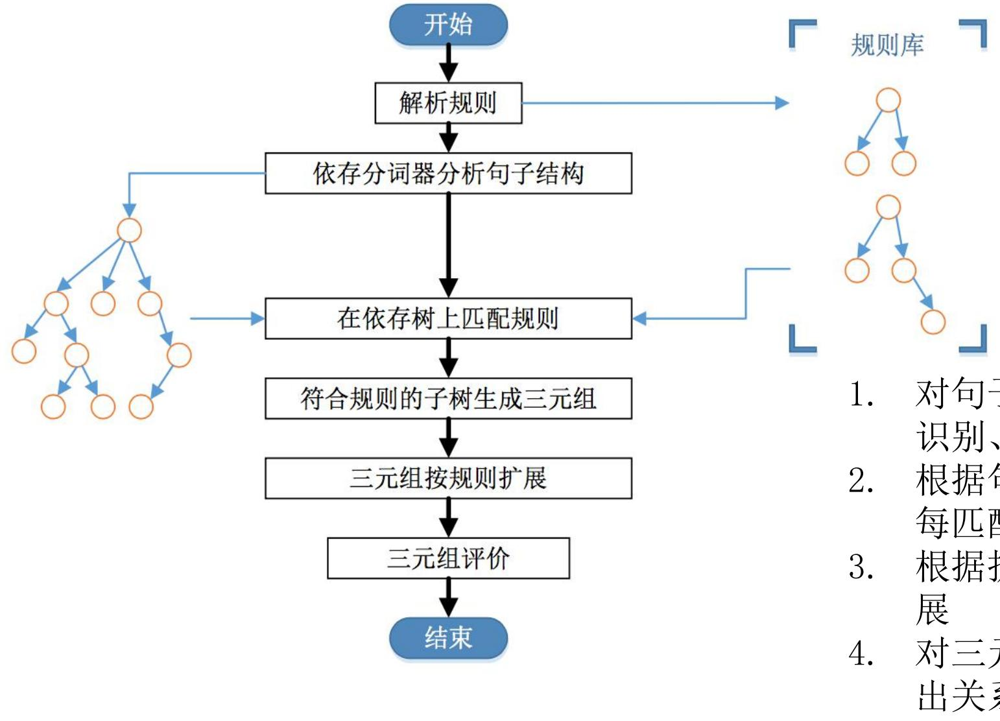

1. 对句子进行分词、词性标注、命名实体识别、依存分析等处理

2. 根据句子依存语法树结构上匹配规则，每匹配一条规则就生成一个三元组

3. 根据扩展规则对抽取到的三元组进行扩展

4. 对三元组实体和触发词进一步处理抽取出关系 9

## 基于模板的方法（依存句法分析）

董卿现身国家博物馆看展优雅端庄大方

<table><tr><td rowspan=1 colspan=1>词顺序</td><td rowspan=1 colspan=1>词</td><td rowspan=1 colspan=1>词性</td><td rowspan=1 colspan=1>依存关系路径</td><td rowspan=1 colspan=1>依存关系</td></tr><tr><td rowspan=1 colspan=1>0</td><td rowspan=1 colspan=1>董卿</td><td rowspan=1 colspan=1>人名</td><td rowspan=1 colspan=1></td><td rowspan=1 colspan=1>定语</td></tr><tr><td rowspan=1 colspan=1>1</td><td rowspan=1 colspan=1>现身</td><td rowspan=1 colspan=1>动词</td><td rowspan=1 colspan=1>-1</td><td rowspan=1 colspan=1>核心词</td></tr><tr><td rowspan=1 colspan=1>2</td><td rowspan=1 colspan=1>国家博物馆</td><td rowspan=1 colspan=1>地名</td><td rowspan=1 colspan=1>1</td><td rowspan=1 colspan=1>宾语</td></tr><tr><td rowspan=1 colspan=1>3</td><td rowspan=1 colspan=1>看</td><td rowspan=1 colspan=1>动词</td><td rowspan=1 colspan=1>1</td><td rowspan=1 colspan=1>顺承</td></tr><tr><td rowspan=1 colspan=1>4</td><td rowspan=1 colspan=1>展</td><td rowspan=1 colspan=1>动词</td><td rowspan=1 colspan=1>3</td><td rowspan=1 colspan=1>补语</td></tr><tr><td rowspan=1 colspan=1>5</td><td rowspan=1 colspan=1>优雅</td><td rowspan=1 colspan=1>形容词</td><td rowspan=1 colspan=1>7</td><td rowspan=1 colspan=1>定语</td></tr><tr><td rowspan=1 colspan=1>6</td><td rowspan=1 colspan=1>端庄</td><td rowspan=1 colspan=1>形容词</td><td rowspan=1 colspan=1>7</td><td rowspan=1 colspan=1>定语</td></tr><tr><td rowspan=1 colspan=1>7</td><td rowspan=1 colspan=1>大方</td><td rowspan=1 colspan=1>形容词</td><td rowspan=1 colspan=1>4</td><td rowspan=1 colspan=1>宾语</td></tr></table>

## 基于模板的方法—优劣

p 优点

在小规模数据集上容易实现

构建简单

p 缺点

. 特定领域的模板需要专家构建

难以维护

可移植性差

规则集合小的时候，召回率很低

## 监督学习

p确定实体对的情况下，根据句子上下文对实体关系进行预测，构建一个监督学习应该怎么做？

预先定义好关系的类别

建模为一个分类问题

• 人工标注一些数据

• 设计特征表示

"Steve Jobs was the co-founder and CEO of Apple and formerly Pixar."

• 选择一个分类方法 (SVM、NN、Naive Bayes)

• 评估结果

Labeled Training Data

## 监督学习-特征

p 轻量级特征

实体前后的词

实体的类型

实体之间的距离

p 中等量级特征

. Chunk序列

p 重量级特征

实体间的依存关系路径

实体间树结构的距离

特定的结构信息

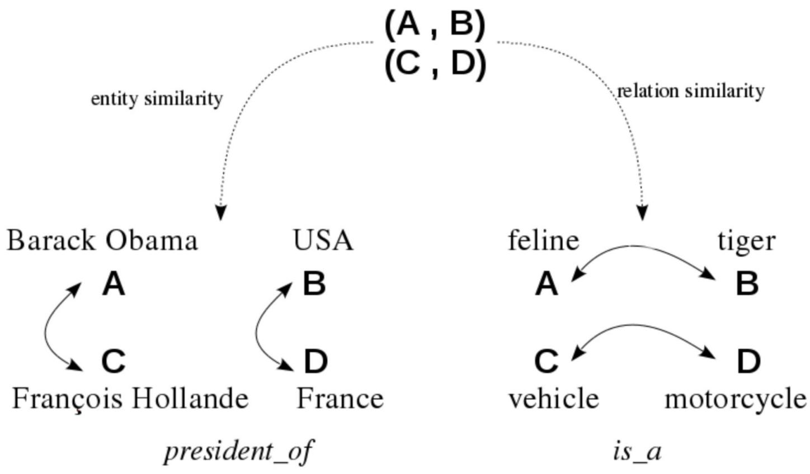

## 实体特征

p基本实体特征

● String values

● Examples:

● string value

● words/stems/lemmata

●PROs: 特征信号强

● CONs: 过于稀疏

## p 实体的上下文特征

语法信息——Syntactic information,e.g., grammatical role

• 语义信息——Semantic information,e.g., semantic class

• 词的共现特征, e.g., dog and cat

. 分布式表示

词向量

. 引入外部语义关系, e.g.,

ACE entity types

WordNet features

## 实体特征

● 实体的上下文特征——分布式表示(Distributional representation)

e.g, the noun paper的分布式表示

● what a paper can do: propose, say

what one can do with a paper: read, publish

typical adjectival modifiers: white, recycled

noun modifiers: toilet, consultation

<table><tr><td>Word</td><td>Syntacticrelation</td><td>Co-occurring words</td></tr><tr><td rowspan="7"></td><td> paper-n coordination</td><td>pen-n:69, pencil-n:51, paper-n:32, glass-n:22, ink- n:20,...</td></tr><tr><td>subject_of</td><td>say-v:86,make-v:39,propose-v:39,describe-v:3, v:30,...</td></tr><tr><td>object_of</td><td>publish-v:147,read-v:129,use-v:78, write-v:62,take- 43,...</td></tr><tr><td>modified_by_adj</td><td>white-j:923; local-j:159, green-j:63,brown-j:56, non- stick-j:71...</td></tr><tr><td>modified_by_n</td><td>consultation-n:117, government-n:94, discussion- n:84,tissue-n:71,blotting-n:59,...</td></tr><tr><td>modifies_n</td><td>bag-n:150, money-n:44, cup-n:37, mill-n:36, work- n:34,...</td></tr><tr><td>pp_with</td><td>number-n:6,address-n:3,title-n:2,note-n:2,word-n:2,</td></tr><tr><td>Pp_on</td><td>. reform-n:13, future-n:13,policy-n:10,environment- n:9, subject-n:8,...</td></tr></table>

nouns connected via prepositions: on environment, for meeting, with a title

● PROs: captures word meaning by aggregating all interactions

## 关系特征

## p基本关系特征

● 实体之间的词：words between the two arguments

● 窗口：words from a fixed window on either side of the arguments

● 依存关系：a dependency path linking the arguments

● 整个依存关系图：an entire dependency graph

● 最小子树：the smallest dominant subtree

## 机器学习框架——特征函数+最大熵模型

·特征流+最大熵模型

## 同关系句子具有类似的文本特征

<table><tr><td rowspan=1 colspan=1>Words</td><td rowspan=1 colspan=1>Mention词及中间所有词</td></tr><tr><td rowspan=1 colspan=1> Entity Type</td><td rowspan=1 colspan=1> PER/ORG / LOC</td></tr><tr><td rowspan=1 colspan=1>Mention Level</td><td rowspan=1 colspan=1>NAME/NOMINAL/ PRONOUN</td></tr><tr><td rowspan=1 colspan=1>Overlap</td><td rowspan=1 colspan=1>Mention词间隔的词数、中间含有mention词的个数，是否在同一短语中</td></tr><tr><td rowspan=1 colspan=1>Dependency</td><td rowspan=1 colspan=1>Mention在parsetree中依赖的词的POS/chunk/word</td></tr><tr><td rowspan=1 colspan=1>Parse Tree</td><td rowspan=1 colspan=1>两个mention词中的依赖路径</td></tr></table>

特征稀疏，需要人工设计

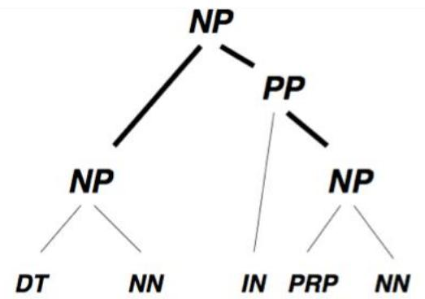  
...been the chairman of its board .

PERSON-NP-PP-ORGANIZATION.

ACE RDC 2003，F1= 52.4（人工标记mention)

## 机器学习框架——深度学习

p基于特征的方法需要人工设计特征，这类方法适用于标注数量较少，精度要求较高，人工能够胜任的情况。

p基于核函数的方法能够从字符串或句法树中自动抽取大量特征，但这类方法始终是在衡量两段文本在子串或子树上的相似度，并没有从语义的层面对两者做深入比较。

p此外，上述两类方法通常都需要做词性标注和句法分析，用于特征抽取或核函数计算，这是典型的pipeline做法，会把POS和句法分析等模块产生的错误传导到后续的关系抽取任务，并被不断放大。

p深度学习技术不断发展，端到端的抽取方法能大幅减少特征工程，并减少对词性标注等预处理模块的依赖，成为当前关系抽取技术的主流技术路线。

## 机器学习框架——基于CNN

## CNN自动抽取关系特征

·基于特征向量和核函数的方法都存在nlp错误传播

·神经网络可以直接encode句子特征

· Lexical level features

实体、实体周边词、实体同义词的连接

<table><tr><td>Features</td><td>Remark</td></tr><tr><td>L1 L2 L3 L4 L5</td><td>Noun 1 Noun 2 Left and right tokens of noun 1 Left and right tokens of noun 2 WordNet hypernyms of nouns</td></tr></table>

## · Sentence level features [WF,PF]T

WF(word features):窗口词，窗口大小为3

PF(position features) : [d1,d2]

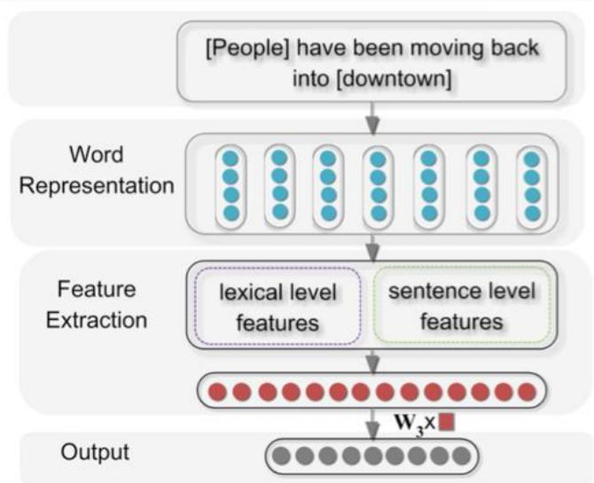

## 机器学习框架——基于CNN

## CNN自动抽取关系特征

·对sentence level 特征进行线性变换（卷积）

$$
\mathbf { Z } = \mathbf { W } _ { 1 } \mathbf { X } \quad \mathbf { W } _ { 1 } \in \mathbb { R } ^ { n _ { 1 } \times n _ { 0 } } \quad \mathbf { X } \in \mathbb { R } ^ { n _ { 0 } \times t }
$$

为卷积核维度（隐藏层节点数），为特征维度，t词数

·在～上做池化

$$
m _ { i } = \operatorname* { m a x } \mathbf { Z } ( i , \cdot ) \quad 0 \leq i \leq n _ { 1 } \quad \mathbf { Z } \in \mathbb { R } ^ { n _ { 1 } \times t }
$$

·非线性变换

$$
\begin{array} { r } { \mathbf { g } = \operatorname { t a n h } ( \mathbf { W } _ { 2 } \mathbf { m } ) \quad \mathbf { W _ { 2 } } \in \mathbb { R } ^ { n _ { 2 } \times n _ { 1 } } \quad \mathbf { m } \in \mathbb { R } ^ { n _ { 1 } \times 1 } } \end{array}
$$

·输出层+ softmax

$$
\begin{array} { c c } { \mathbf { o } = \mathbf { W } _ { 3 } \mathbf { f } \quad \mathbf { f } = [ \imath , \mathbf { g } ] . \quad \mathbf { W _ { 3 } } \in \mathbb { R } ^ { n _ { 4 } \times n _ { 3 } } \quad \mathbf { f } \in \mathbb { R } ^ { n _ { 3 } \times 1 } } \\ { \mathbf { \zeta } } \\ { \mathsf { S e m E v a l - } 2 0 1 0 7 { \mathsf { a s k } } \otimes \mathbf { \zeta } , \mathsf { \beta } \in \mathbb { B } 2 . 7 } \end{array}
$$

S:[Peopleohave1bentmovingback4ninto5/downtown68

$$
\{ [ { \bf x } _ { s } , { \bf x } _ { 0 } , { \bf x } _ { 1 } ] , ~ [ { \bf x } _ { 0 } , { \bf x } _ { 1 } , { \bf x } _ { 2 } ] , ~ \cdot \cdot \cdot ~ , ~ [ { \bf x } _ { 5 } , { \bf x } _ { 6 } , { \bf x } _ { e } ] \} ^ { 5 }
$$

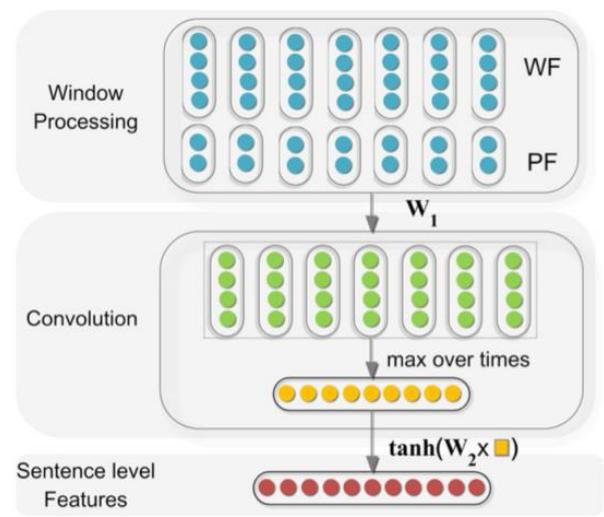

$$
p ( i | x , \theta ) = \frac { e ^ { o _ { i } } } { \displaystyle \sum _ { k = 1 } ^ { n _ { 4 } } e ^ { o _ { k } } } J \left( \theta \right) = \sum _ { i = 1 } ^ { T } \log p ( y ^ { ( i ) } | x ^ { ( i ) } , \theta )
$$

## 机器学习框架——跨句推理

## A是B的爸爸，B的妈妈是C->A和C是夫妻

·判断同一个句子中所有实体对的关系:

·CNN encoder，得到模型 $E ( h , r , t | S ) = \operatorname* { m a x } _ { i } p ( r | \theta , \mathbf { s } _ { i } )$

·找到和h，t均存在关系的实体，判断间接关系

$$
G ( h , r , t | p _ { i } ) = E ( h , r _ { A } , e ) E ( e , r _ { B } , t ) p ( r | r _ { A } , r _ { B } )
$$

·训练关系间relation path :

·Path encoder，得到r1和r2能推出关系r的概率

$$
p ( r | r _ { A } , r _ { B } ) = \frac { \exp ( o _ { r } ) } { \sum _ { i = 1 } ^ { n _ { r } } \exp ( o _ { i } ) } \qquad o _ { i } = - \| { \bf r } _ { i } - ( { \bf r } _ { A } + { \bf r } _ { B } ) \| _ { L _ { 1 } }
$$

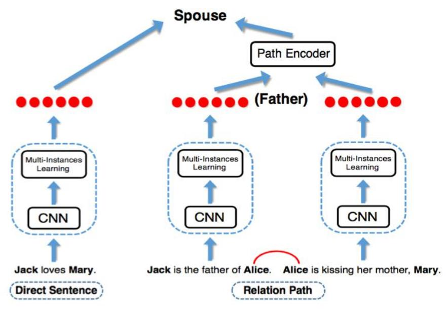

## 定义(h,t)总关系

$$
\begin{array} { l } { { \displaystyle { \cal L } ( h , r , t ) = E ( h , r , t | S ) + \alpha G ( h , r , t | P ) , } } \\ { { \displaystyle { \cal J } ( \theta ) = \sum _ { ( h , r , t ) } \log ( L ( h , r , t ) ) } } \end{array}
$$

<table><tr><td>Test Settings(Noise)</td><td colspan="3">75%</td><td colspan="3">85%</td><td colspan="3">95%</td></tr><tr><td>P@N(%)</td><td>10% 20%</td><td>50%</td><td>F1 10%</td><td>20%</td><td>50%</td><td>F1 10%</td><td>20%</td><td>50%</td><td>F1</td></tr><tr><td>CNN+rand</td><td>86.7 67.0</td><td>38.9</td><td>57.5</td><td>84.6 66.4</td><td>37.5</td><td>55.0</td><td>79.9 61.8</td><td>35.2</td><td>51.4</td></tr><tr><td>CNN+max</td><td>86.0 68.5</td><td>38.3</td><td>57.2</td><td>85.4 67.6</td><td>37.7</td><td>56.5</td><td>84.4 66.0</td><td>36.6</td><td>54.8</td></tr><tr><td>Path+rand</td><td>89.4 71.7</td><td>39.9</td><td>59.3</td><td>88.2 70.2</td><td>39.0</td><td>58.1</td><td>86.0 67.2</td><td>37.0</td><td>55.6</td></tr><tr><td>Path+max</td><td>89.0 71.5</td><td>39.8</td><td>59.6</td><td>89.0 71.4</td><td>39.6</td><td>59.4</td><td>88.6 71.0</td><td>39.1</td><td>59.1</td></tr></table>

## 机器学习框架——多元关系

·传统的二元关系扩展的缺点

·产生C(n,2)种特征组合

·拆分成多个binary会丧失多元语义联系

·学习出所有实体的表示，连接后分类·能表示所有实体对的全局关系

·Graph LSTM :

·Chain LSTM:按照time-step输入后一个词

·Tree LSTM：按照time-step输入当前语法依赖词

·Graph LSTM：节点同时依赖上一时刻不同的语法依赖词和线性输入词，重新定义一个维度表示当前依赖种类

$$
\begin{array} { r l } & { i _ { t } = \sigma \big ( W _ { i } x _ { t } + \sum _ { j \in P ( t ) } U _ { i } \times _ { T } \left( h _ { j } \otimes e _ { j } \right) + b _ { i } \big ) } \\ & { f _ { t j } = \sigma \big ( W _ { f } x _ { t } + U _ { f } \times _ { T } \left( h _ { j } \otimes e _ { j } \right) + b _ { f } \big ) } \\ & { o _ { t } = \sigma \big ( W _ { o } x _ { t } + \sum _ { j \in P ( t ) } U _ { o } \times _ { T } \left( h _ { j } \otimes e _ { j } \right) + b _ { o } \big ) } \end{array}
$$

## 抽取(d, g, v)上的关系r

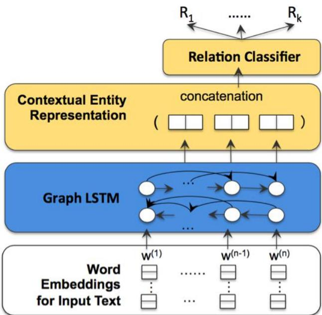

<table><tr><td>Model</td><td>Single-Sent.</td><td>Cross-Sent.</td></tr><tr><td>Feature-Based</td><td>74.7</td><td>77.7</td></tr><tr><td>CNN</td><td>77.5</td><td>78.1</td></tr><tr><td>BiLSTM</td><td>75.3</td><td>80.1</td></tr><tr><td>Graph LSTM-EMBED</td><td>76.5</td><td>80.6</td></tr><tr><td>Graph LSTM-FULL</td><td>77.9</td><td>80.7</td></tr></table>

Cross-Sentence N-ary Relation Extraction with Graph LSTMs(TACL 2017)

## 半监督学习—远程监督

两个实体如果在知识库中存在某种关系，则包含该两个实体的非结构化句子均能表示出这种关系。

在某知识库中存在： 创始人 (乔布斯, 苹果公司)

则可构建训练正例：乔布斯是苹果公司的联合创始人和CEO

## 具体步骤

1. 从知识库中抽取存在关系的实体对

2. 从非结构化文本中抽取含有实体对的句子作为训练样例

## 远程监督—优劣

p优点

• 可以利用丰富的知识库信息，减少一定的人工标注p缺点

. 假设过于肯定，引入大量噪声

• 很难发现新的关系

## 小结 （方法对比分析）

p核函数方法利于捕获具有复杂结构的关系特征（通常需要处理句子结构）

p神经网络易于捕获复杂的交互特征和组合性特征

p序列标注方法被用来做实体和关系的联合抽取，这种情况下通常需要处理可变的序列。

p不论采用什么样的模型，预测效果的好坏较多依赖于

●被抽取关系的频繁使用程度

●被抽取关系在句子语料中的分布情况

●训练预料是否充分，标注质量是否高

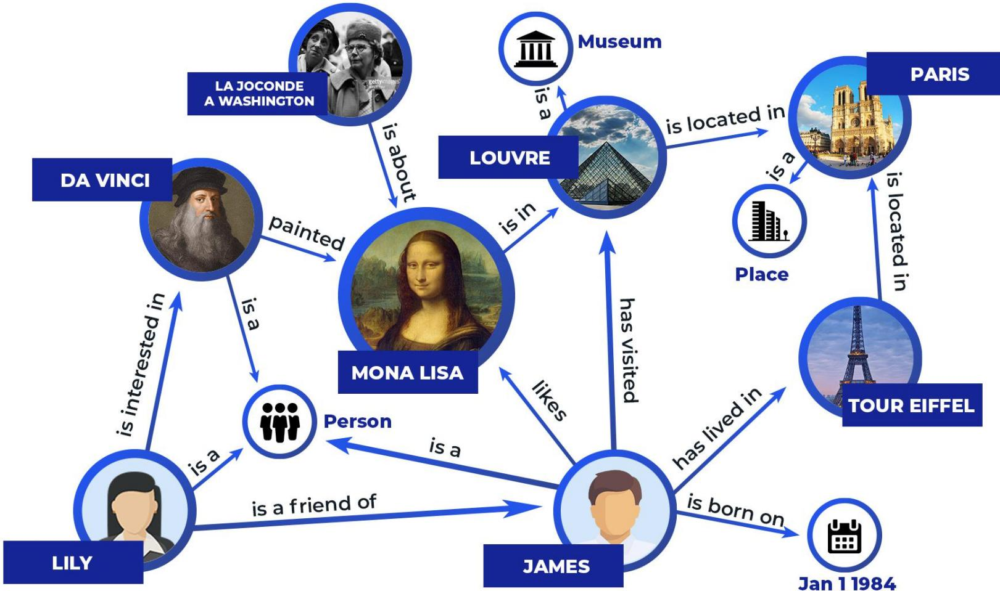

## 本讲结束

感谢浙江大学陈华钧教授提供课件素材！