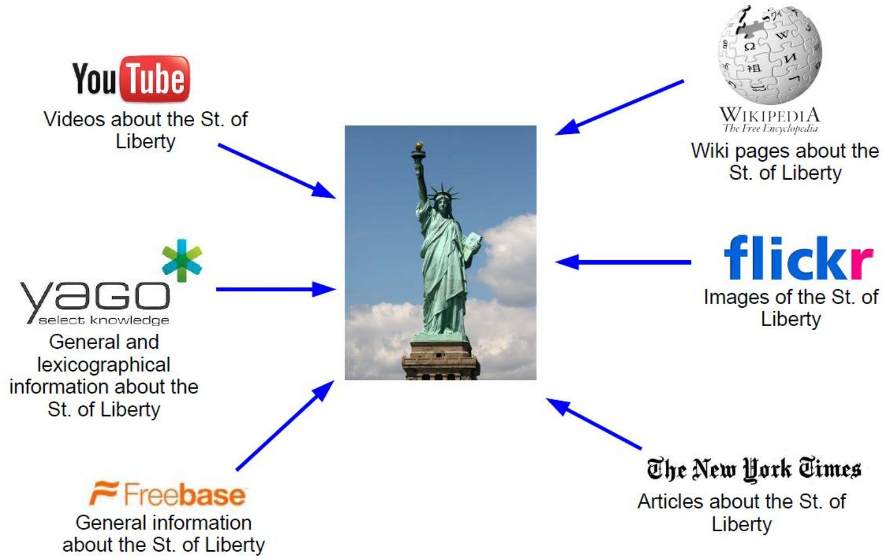
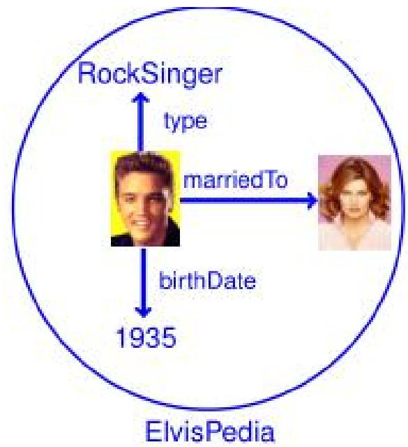
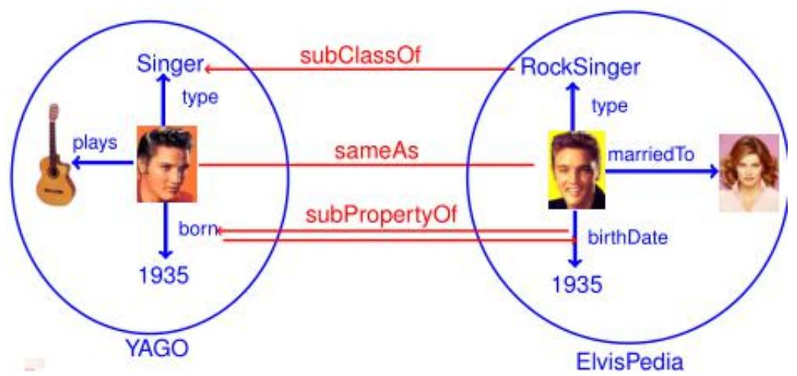
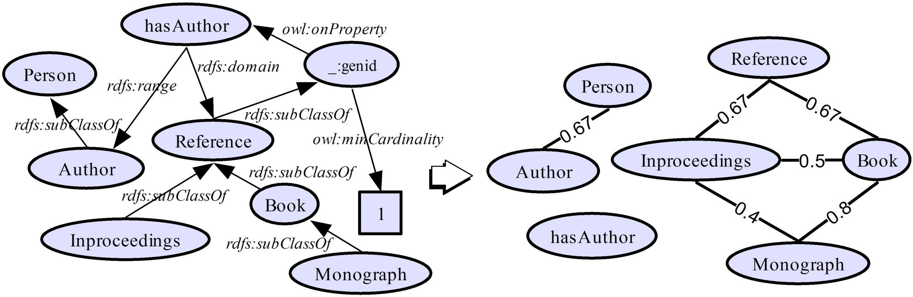
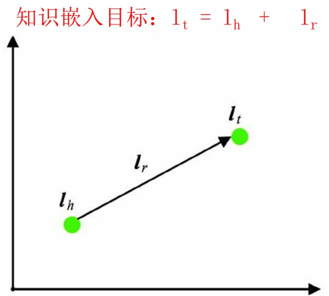
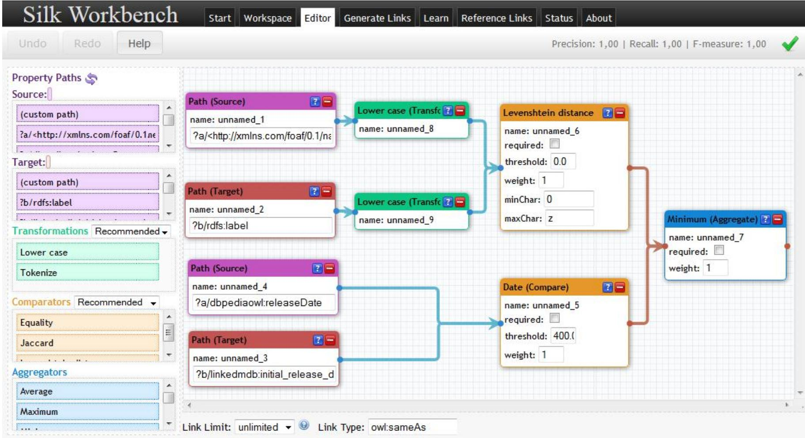
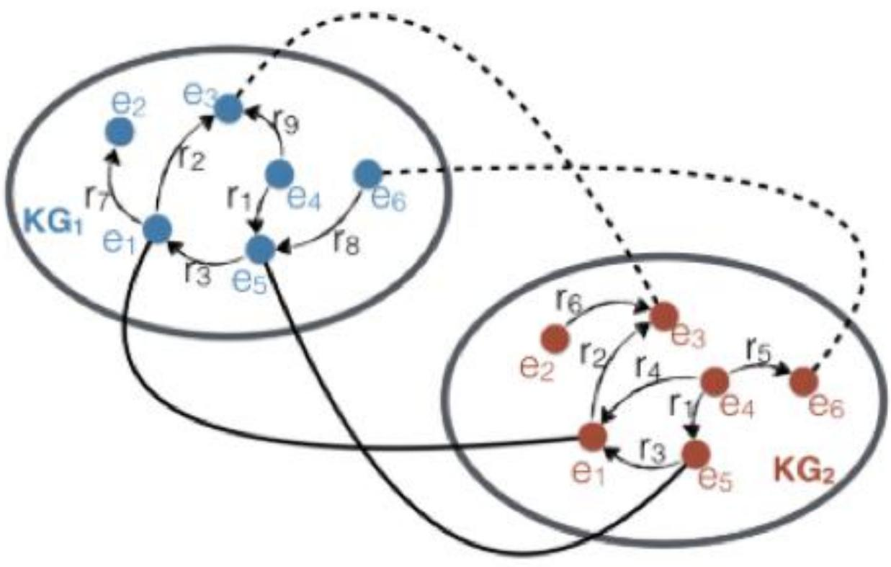

## 知识融合

张小旺

xiaowangzhang@tju.edu.cn

## “冗余” 知识

## 很多数据集包含相似或者相同的本体或者事实（三元组）

## “冗余” 知识引起逻辑冲突

“冗余”知识往往引起逻辑“冲突”或“不一致”

  
问题：Elvis是单身吗？ 答案：？

## 知识融合：消除“冗余”知识

统一实体

  
合并实体

等价实例

等价类/子类

等价属性/子属性

问题：Elvis是单身吗？ 答案：Yes

## 知识融合基本技术流程

数据预处理

数据预处理阶段，原始数据的质量会直接影响到最终链接的结果，不同的数据集对同一实体的描述方式往往是不相同的，对这些数据进行归一化处理是提高后续链接精确度的重要步骤。

分块（Blocking）是从给定的知识库中的所有实体对中，选出潜在匹配的记录对作为候选项，并将候选项的大小尽可能的缩小。

分块

记录链接

负载均衡

负 载 均 衡 （ L o a dBalance）来保证所有块中的实体数目相当，从而保证分块对性能的提升程度。

最简单的方法是多次Map-Reduce操作。

E

结果评估

结果输出

假设两个实体的记录 和 ， 和 在第 个属性上的值是 ，那么通过如下两步进行记录链接：

1. 属性相似度：综合单个属性相似度得到属性相似度向量

[???(?1, ?1), ???(?2, ?2), … , ???(? , ? )]

2. 实体相似度：根据属性相似度向量得到一个实体的相似度

## 本讲内容

●本体对齐

●实体匹配

## 4.1 本体对齐

## 本体对齐：属性相似度计算

p编辑距离：Levenstein ，Wagner and Fisher ，Edit Distance withAffine Gaps

p集合相似度计算：Jaccard系数，Dice

p基于向量的相似度计算：Cosine相似度，TFIDF相似度

p

$$
\mathrm { J a c c a r d } ( x , y ) = | \mathrm { i n t e r s e c t i o n } ( x , y ) | / | \mathrm { u n i o n } ( x , y ) | .
$$

$$
\mathrm { D i c e } \left( x , y \right) = 2 \times \left| \mathrm { i n t e r s e c t i o n } \left( x , y \right) \right| / \left( \left| x \right| + \left| y \right| \right) ,
$$

## 本体对齐：本体划分（概念间的结构亲近性计算）

●类：层次关系（公共父类）

属性：层次关系、定义域

## 本体对齐工具：Falcon-AO

p简介

Falcon-AO是一个自动的本体匹配系统，已经成为RDF（S）和OWL所表达的Web本体相匹配的一种实用和流行的选择。编程语言为Java。

p作者：胡伟

p主页：http://ws.nju.edu.cn/falcon-ao/

p参考论文

H u , W. , & Q u , Y. ( 2 0 0 8 ) .

J i a n , N . , H u , W. , C h e n g , G . , & Q u , Y. ( 2 0 0 5 ) .

## 4.2 实体匹配

## 实体匹配： 相似度计算

p聚合

• 加权平均，手动制定规则，分类器

p聚类

• 层次聚类，相关性聚类

p表示学习

## 实体相似度计算：聚合

p问题：

—训练集的生成

—分类不均衡（更多不匹配的记录对）

误分类

最关键的问题是需要生成训练集合

## p方案

—无监督/半监督（EM，生成模型等）

—主动学习（众包等）

## 实体相似度计算：聚类

p层次聚类

p相关性聚类

pCanopy+K-means聚类

• 步骤1：Canopy聚类在第一阶段选择简单、计算代价较低的方法计算对象相似性，将相似的对象放在一个子集中，这个子集被叫做Canopy ，通过一系列计算得到若干Canopy，Canopy之间可以是重叠的，但不会存在某个对象不属于任何Canopy的情况，可以把这一阶段看做数据预处理；

• 步骤2：在各个Canopy 内使用传统的聚类方法(如K-means)，不属于同一Canopy 的对象之间不进行相似性计算。

## 实体相似度计算：表示学习

或知识嵌入：将知识图谱中的实体和关系都映射低维空间向量，直接用数学表达式来计算各个实体之间相似度。这类方法不依赖任何的文本信息，获取到的都是数据的深度特征。

  
三元组(h, r, t)：关系向量lr表示为头向量lh和尾向量lt之间的位移  
实体对齐目标：KINGS – QUEENS = KING – QUEEN

  
考虑两对实体之间存在某个相同的关系

## 实体匹配工具：Dedupe

p简介

Dedupe是一个用于模糊匹配, 记录去重 和实体解析的python库。

pgithub主页：https://github.com/dedupeio/dedupe

p作者

Forest Gregg, DataMade

Derek Eder, DataMade

p参考论文

• Bilenko, M. Y. (2006)

## 实体匹配工具：Dedupe优缺点

p优点：主动学习

主动学习训练正负样本集，降低用户标注量。

p缺点：属性数量有限制

要求输入数据集中记录的属性数量很少，通常10-20个属性。

## 实体匹配工具： Silk系统

## p整体框架

p预处理：xiapian索引，一个搜索引擎的库。会将索引的结果排名前N的记录下来进行作为候选对，进行下一步更精准的匹配（损失精度）。

p相似度计算：Febrl，生物记录链接的库。里面包含了很多相似度计算的方法。

p过滤：过滤掉相似度小于给定阈值的记录对。

## 实体匹配工具：Silk系统特点

p 提供了专门的Silk-LSL语言来进行具体处理

p 提供图形化用户界面—SilkWorkbench ,用户可以很方便的进行记录链接。

## 本讲结束

感谢南京大学胡伟教授提供课件素材！

