知识问答第1讲

## 知识库问答

张小旺

xiaowangzhang@tju.edu.cn

## 本讲内容

● 知识库问答概念

● 知识库问答方法

## 6.1 知识库问答

## 问答系统历史

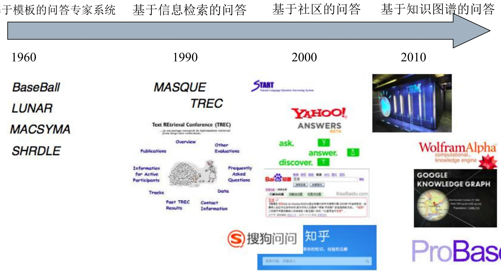

## 问答系统历史

基于信息检索的问答

基于关键词匹配+信息抽取，基于浅层语义分析

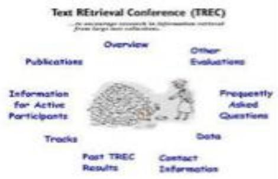


基于社区的问答

依赖于网民贡献，问答过程依赖于关键词检索技术


基于知识库的问答

知识库 语义解析

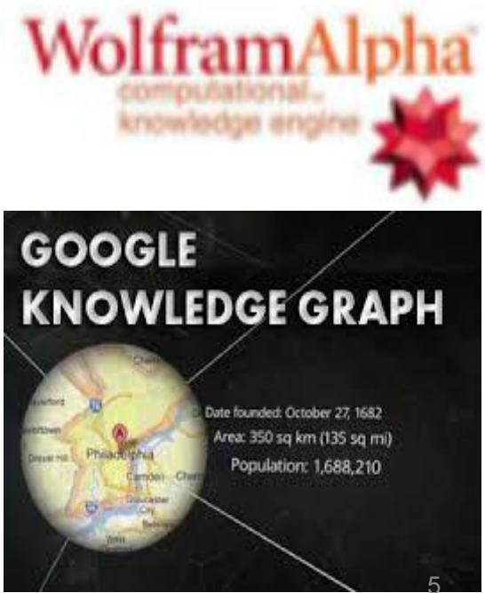

## 问答形式分类

## p 一问一答


## 交互式问答


## 阅读理解

Mary journeyed to the den.   
Mary went back to the kitchen.   
John journeyed to the bedroom.   
Mary discarded the milk.   
Q:Where was the milk before the den? Bernhard is green.   
Sam picks up an apple.   
Sam walks into the bedroom.   
Sam drops the apple.   
Q:Where is the apple?

## 问答系统框架

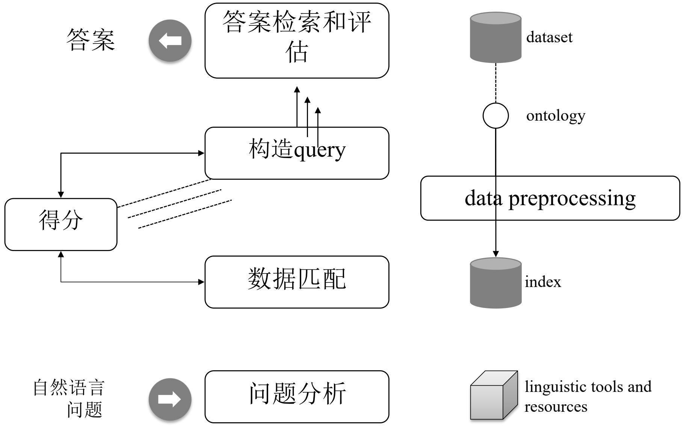

## 问答系统流程

问句

传统问答方法 (符号表示)

-基于关键词检索

-基于文本蕴含推理

-基于逻辑表达式

语义匹配、推理

答案

基于深度学习的问答方法 (分布式表示)

\- LSTM

\- Attention Model

\- Memory Network

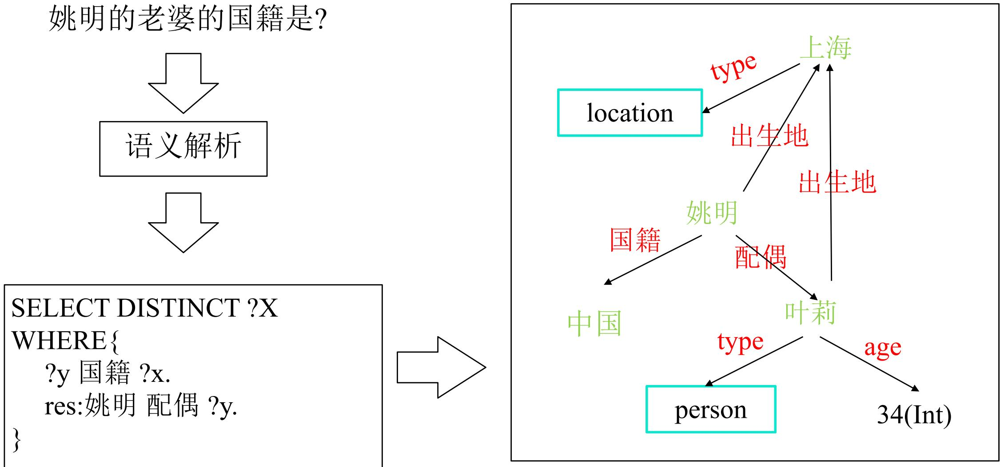

## 问答I类：基于符号表示的问答

查询

## 问答II类：基于分布式表示的问答

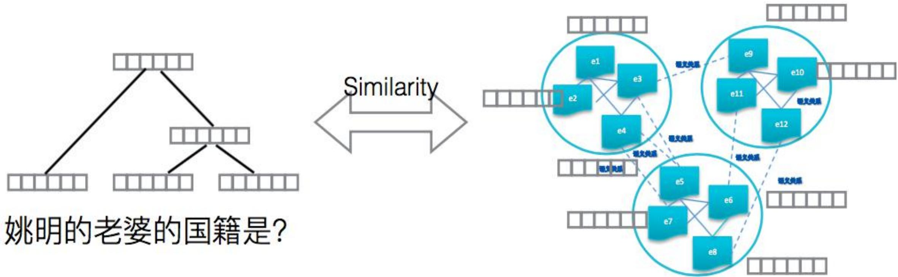

## 问答系统概念：问句短语

问句短语定义问的是什么:

p Wh-words:

who, what, which, when, where, why, and how

p Wh-words + nouns, adjectives or adverbs:

• “which party …” , “which actress …” , “how long …”, “how tall …”.

## 问答系统概念：问题类型

## 问题类型决定了后续采用什么样的回答处理策略

## p FACTOID – 事实型问题:

PREDICATIVE QUESTIONS – 谓词型问题 :

“Who was the first man in space?”

： “What is the highest mountain in Korea?”

. “How far is Earth from Mars?”

“When did the Jurassic Period end?”

. “Where is Taj Mahal?”

LIST – 列表型问题:

“Give me all cities in Germany.”

SUPERLATIVE – 最高级型问题:

“What is the highest mountain?”

YES-NO – 对错型问题:

“Was Margaret Thatcher a chemist?”

## 问答系统概念：问题类型

p OPINION - 观点型问题:

• “What do most Americans think of gun control?”

p CAUSE & EFFECT–因果型问题:

• “What is the most frequent cause for lung cancer?”

p PROCESS – 方法型问题:

. “How do I make a cheese cake?”

p EXPLANATION & JUSTIFICATION – 解释型问题:

• “Why did the revenue of IBM drop?”

p ASSOCIATION QUESTION – 关联型问题:

“What is the connection between Barack Obama and Indonesia?”

p EVALUATIVE OR COMPARATIVE QUESTIONS – 比较型问题:

“What is the difference between impressionism and expressionism?”

## 问答系统概念：答案类型

p 事实型答案—

• Entity: event, color, animal, plant,. . . (What …)

Human: group, individual,. . . (“Who …”)

• Location: city, country, mountain,. . . ( “Where …”)

Numeric: count, distance, size,. . . (“How many, how far, how long …”)

Temporal: date, time, …(from “When …”)

p 摘要性答案——Abbreviation

p 描述性答案——Description

解释性-Explanation : How

证据型-Justification :Why

## 问答系统概念：问题主题

问题主题: 问题是关于哪方面的:

p “What is the height of Mount Everest?”

. (geography, mountains)

p “Which organ is affected by the Meniere’s disease?”

(medicine)

## 问答系统概念：答案来源类型

Structure level:

. 结构化数据 (databases).

. 半结构化数据(e.g. XML).

. 非结构化数据.

## □ 数据源:

• Single dataset (centralized).

Enumerated list of multiple, distributed datasets.

. Web-scale.

## 问答系统概念： 领域类型

p Domain Scope:

. 开放域

特定域

p Data Type:

. 文本

. 图片

. 音频

. 视频

多模态问答

p 视觉问答

## 6.2 知识库问答方法

## 知识库问答常见方法

基于模板的方法

基于语义解析的方法

基于深度学习的方法

## 基于模板的问答方法

模板定义

模板生成

模板匹配

本讲以TBSL (Unger et al., 2012)方法为例讲解

## 基于模板的问答方法

p问题输入：Who produced the most films?   
pSPARQL template模板生成 p 模板实例化   
SELECT DISTINCT ?x WHERE { ?c = <http://dbpedia.org/ontology/Film>   
?y rdf:type ?c . ?p = <http://dbpedia.org/ontology/producer>   
?y ?p ?x .   
ORDER BY DESC(COUNT(?y))   
OFFSET 0 LIMIT 1   
?c CLASS [films]   
?p PROPERTY [produced]

## 基于模板的问答方法--模板定义

□ 结合KG的结构，以及问句的句式，进行模板定义。通常没有统一的标准或格式

TBSL的模板定义为SPARQL query模板，将其直接与自然语言相映射

## 基于模板的问答方法--TBSL架构

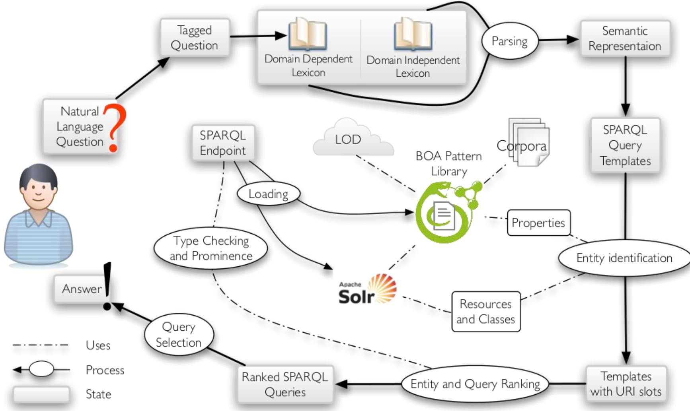

## 基于模板的问答方法--TBSL架构

## 第一步：模板生成

1. 首先，获取自然语言问题的POS tags信息

2. 其次，基于POS tags, 语法 规则表示问句

3. 然后利用domain-dependent词汇和domain-independent词汇辅助分析问题

4. 最后，将语义表示转化为一个SPARQL模板

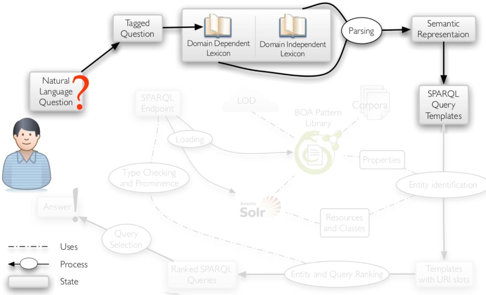

## 第一步实例结果（Who produced the most films?）

领域无关: who, the most

领域相关: produced/VBD, films/NNS

```sql
SPARQL template 1:
SELECT DISTINCT ?x WHERE {
?x ?p ?y .
?y rdf:type ?c .
ORDER BY DESC(COUNT(?y)) LIMIT 1
?c CLASS [films]
?p PROPERTY [produced]
```

```sql
SPARQL template 2:
SELECT DISTINCT ?x WHERE {
?x ?p ?y .
ORDER BY DESC(COUNT(?y))
LIMIT 1
?p PROPERTY [films]
```

## 基于模板的问答方法--TBSL架构

## 第二步：模板匹配与实例化

有了SPARQL模板以后，需要进行实例化与具体的自然语言问句相匹配。即将自然语言问句与知识库中的本体概念相映射的过程。

p 对于resources和classes,实体识别常用方法:

. 用WordNet定义知识库中标签的同义词

计算字符串相似度 (trigram, Levenshtein和子串相似度)

p 对于property labels,将还需要与存储在模式库中的自然语言表示进行比较

p 最高排位的实体将作为填充查询槽位的候选答案

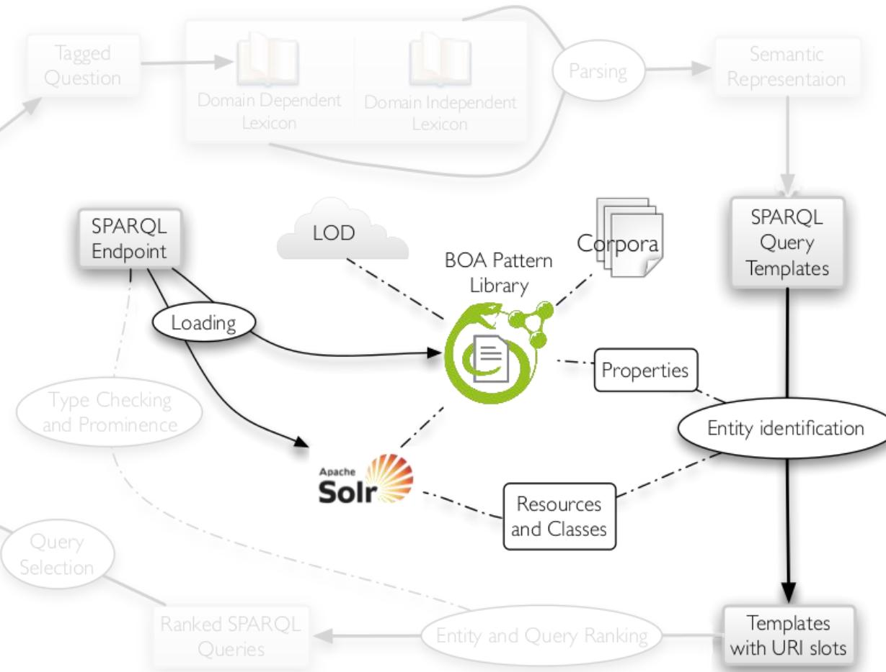

## 第二步示例结果（Who produced the most films?）

?c CLASS [films]

<http://dbpedia.org/ontology/Film>

<http://dbpedia.org/ontology/FilmFestival>

?p PROPERTY [produced]

<http://dbpedia.org/ontology/producer>

<http://dbpedia.org/property/producer>

<http:// dbpedia.org/ontology/wineProduced>

## 基于模板的问答方法--TBSL架构

## 第三步：排序打分

1. 每个entity根据string similarity和prominence获得一个打分

2.一个query模板的分值根据填充slots的多个entities的平均打分

3. 另外,需要检查type类型: 对于所有的三元组?x rdf:type <class>,对于查询三元组?x p e和 e p ?x需要检查p的domain/range是否与<class>一致

4. 对于全部的查询集合，仅返回打分最高的.

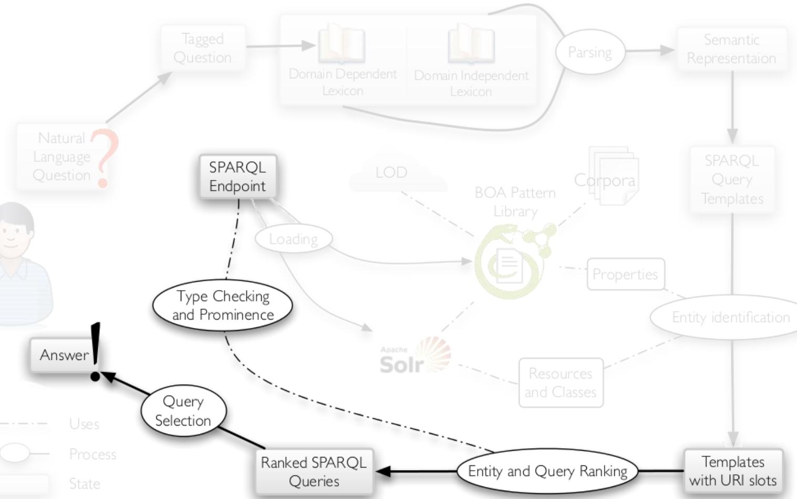

## 第三步示例结果（Who produced the most films?）

```sql
SELECT DISTINCT ?x WHERE {
?x <http://dbpedia.org/ontology/producer> ?y .
?y rdf:type <http://dbpedia.org/ontology/Film>
}
```

ORDER BY DESC(COUNT(?y)) LIMIT 1   
Score: 0.76   
ORDER BY DESC(COUNT(?y)) LIMIT 1   
Score: 0.60

## 基于模板的问答方法优缺点

p模板方法的优点：

. 模板查询响应速度快

准确率较高，可以回答相对复杂的复合问题

p模板方法的缺点：

人工定义的模板结构经常无法与真实的用户问题进行匹配。

• 如果为了尽可能匹配上一个问题的多种不同表述，则需要建立庞大的模板库，耗时耗力且查询起来效率降低。

## 基于语义解析的问答方法

资源映射

Logic Form

候选答案生成

排序

## 基于语义解析的问答方法：问题形式化

姚明的老婆出生在哪里？

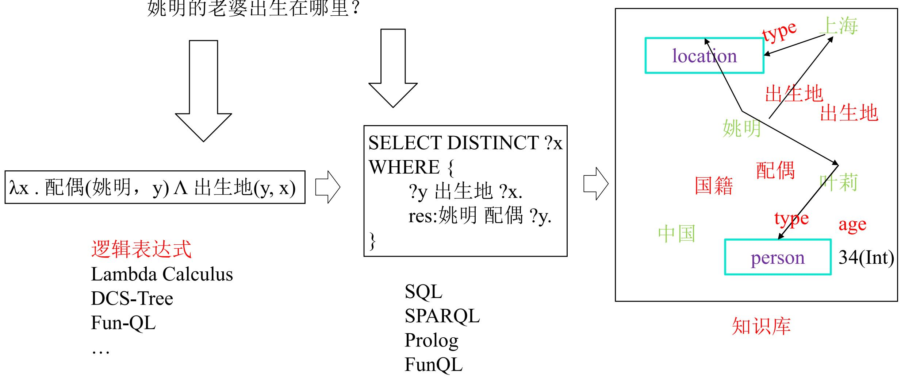

## 基于语义解析的问答方法：基本步骤

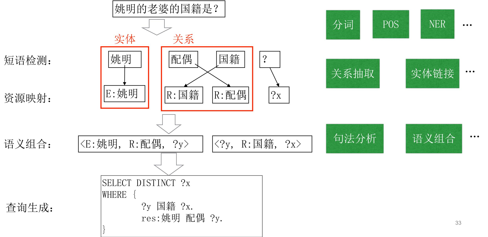

## 基于语义解析的问答方法：关键因素

p获得短语到资源的映射-资源映射

p如何解决文本的歧义 - 逻辑表达式

Which software has been developed by organizations founded in California, USA?

类别

关系

实体

文本 (Mention)

organizations

founded in

California

表示1

表示2

知识库 (KB)

dbo:Company

dbo:California

dbr:foundationPlace

表示3

表示4

## 基于语义解析的问答方法：资源映射

资源映射：将自然语言短语或单词节点映射到知识库的实体或实体关系。可以通过构造一个词汇表（Lexicon）来完成这样的映射

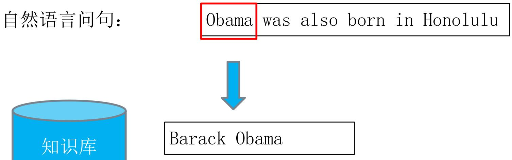  
简单映射：字符串相似度匹配

## 基于语义解析的问答方法：资源映射

p 复杂映射：“was also born in” → PlaceOfBirth

p 较难通过字符串匹配的方式建立映射，可采用统计方法

p 实体对 (entity1，entity2)常作为主语和宾语出现在was also born in两侧，并且也存在在知识库中PlaceOfBirth的三元组中，那么我们可以认为“was also born in”这个短语可以和PlaceOfBirth建立映射

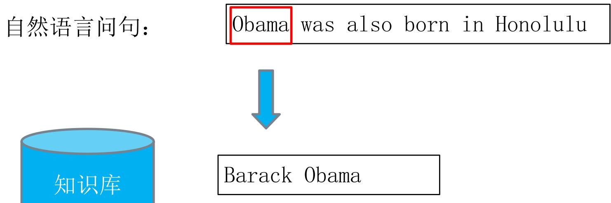  
复杂映射：统计方法

## 基于语义解析的问答方法：逻辑表达式

p逻辑表达式: 即一种能让知识库“看懂”的表示。可以表示知识库中的实体、实体关系

p逻辑形式通常可分为一元形式 (unary)和二元形式 (binary)

. 一元实体：对应知识库中的实体

• 元实体关系，对应知识库中所有与该实体关系相关的三元组中的实体对。

p并且，可以像数据库语言一样，进行连接Join，求交集Intersection和聚合Aggregate (如计数，求最大值等等)操作

## 基于语义解析的问答方法：逻辑表达式

□ 一步到位: 直接获得与知识库相关的语义表示

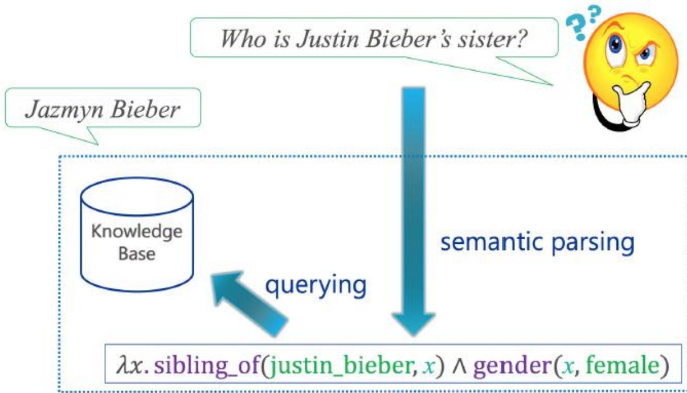

两步到位: 先通用语义表示，再实现知识库映射

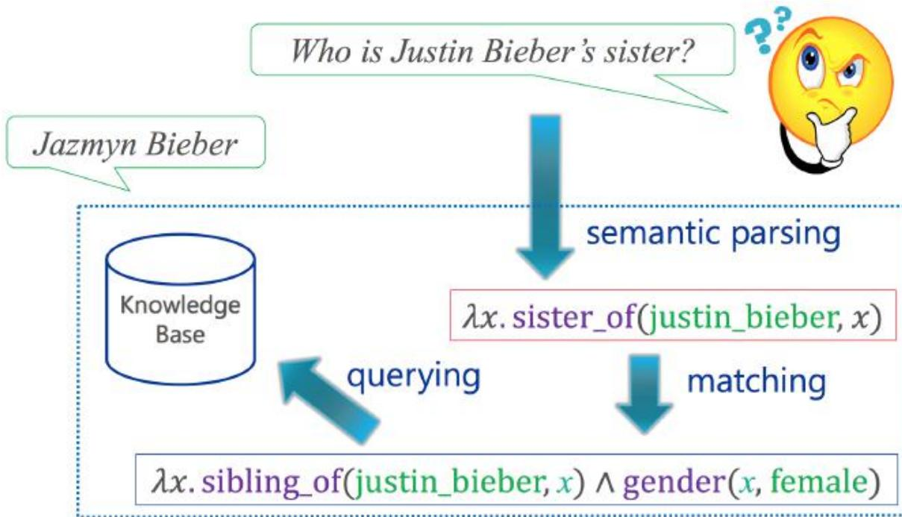

# 基于语义解析的问答方法：问题定义

p 问题答案对 (question/answers pairs)数据集来训练分析器

p 数据集: QALD，WebQuestions，Free917等等 ；也可以人工从KB中抽取构建

输入：   
Knowledge-baseK   
问答对训练集合{（x，y）}   
问答对示例：   
What'sCalifornia'scapital? Sacramento   
How long is the Mississippi river? 3,734km   
输出：   
通过语义分析，构建逻辑形式，将问题x与答案y相映射。   
What’sCalifornia’scapital? → Capital.California   
→ Sacramento

## 基于语义解析的问答方法：语义解析器训练

p监督数据来源：手工编写规则

What's California's capital? Capital.California

How long is the Mississippi river?RiverLength.Mississipi

p 监督数据来源：问题/答案对

What's California's capital? Sacramento

How long is the Mississippi river? 3,734km

## p 局限

需要专家编写–进度缓慢、代价昂贵、不可扩展

仅可在受限领域推广

p 优势

可以较为轻松地从普通民众获得

## 基于深度学习的问答方法

p课后阅读

Semantic layer: y

Semantic projection matrix: Ws

Maxpooling layer:V

Max pooling operation

Convolutional layer: h, Convolution matrix: Wc Word hashing layer:f Word hashingmatrix:W Word sequence: x,

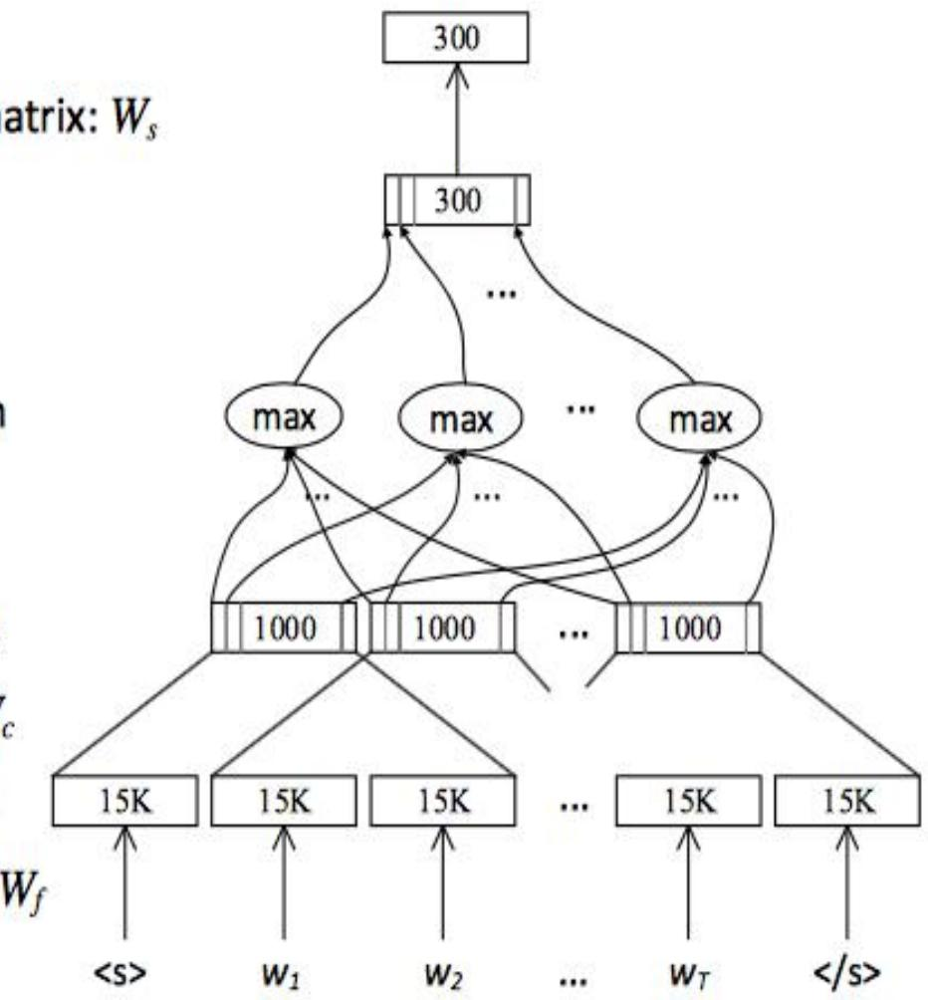

## 问答方法对比

模板方法：模板查询响应快、准确率高，可以回答相对复杂的问题。但人工定义模板费时费力，且经常无法与用户真实问题匹配。

语义方法：可以回答较为复杂的问题，例如时序性问题。但人工编写规则工程量大。

□ 深度学习方法：无需人工编写规则定义模板，整个学习过程都是自动进行，但目前只能处理简单题和单边关系问题，且深度学习方法通常不包含聚类操作，因此时序性问题无法应对。

##

## 本讲结束

感谢浙江大学陈华钧教授提供课件素材