# 知识推理 一

## 张小旺xiaowangzhang@tju.edu.cn

天津大学智能与计算学部

## 知识图谱是交叉领域

AI & Machine Learning

Knowledge   
Representation   
&   
Representation   
Learning

Graph Database &Data Integration

Database

NLP

Information Extraction & Knowledge Base Population

Semantic Search & Question Answering

Web & IR

## 本讲内容

p知识推理基本概念

p基于RDFS的简单推理

pOWL本体推理

p基于Tableaux算法的推理

p基于逻辑编程改写的方法

p基于产生式规则的方法

## 7.1 知识推理基本概念

## 什么是推理？

<table><tr><td>百度一下 姚明的妻子姚明的女儿的妈妈 @</td></tr><tr><td>网页 新闻贴吧知道音乐图片视频地图文库更多》</td></tr><tr><td>百度为您找到相关结果约2，100,000个 了搜索工具 姚明妻子：</td></tr><tr><td>叶莉  叶莉，1981年11月20日出生，上海人。1996年进入上海体育运动技 术学院，1997年在上海体育运动技术学院，1998年入选国家青年 队，1999年第一次入选国家队。2002年5月，叶莉.详情&gt;&gt;</td></tr><tr><td>来自百度知识图谱报错</td></tr><tr><td>演绎 归纳 溯因 New Facts Known Facts New Knowledge 预测推断类比</td></tr></table>

# Deductive Reasoning——演绎推理

op-down logi

## Modus ponens

肯定前件假言推理 mode that affirms by affirming

1. $P  Q$ (conditional statement)

2.P(hypothesis stated)

1. If today is Tuesday, then John will go to work.

3.Q(conclusion deduced)

2. Today is Tuesday.

3. Therefore, John will go to work.

## Modus tollens

否定后件假言推理 mode that denies by denying

1. $\begin{array} { r } { P  Q . } \end{array}$

1. If it is raining, then there are clouds in the sky.

2. $\neg Q .$

2. There are no clouds in the sky.

3.Therefore,we canconclude that $\neg P .$

3. Thus, it is not raining.

## Law of syllogism

三段论

1. $P  Q$

1. If Larry is sick, then he will be absent.

2. $Q  R$

2. If Larry is absent, then he will miss his classwork.

3.Therefore, $P  R .$

3. Therefore, if Larry is sick, then he will miss his classwork.

# Inductive Reasoning——归纳推理

Bottom-up logi

The derivation of general principles from specific observations, for example, if all swans that we have observed so far are white, we may induce that the possibility that all swans are white is reasonable.

## Inductive Generalization

Theproportion Qof the sample has attribute A. Therefore:

The proportion Qof the population hasattribute A.

There are 20 balls—either black or white—in an urn. To estimate their respective numbers, you draw a sample of four balls and find that three are black and one is white. A good inductive generalization would be that there are 15 black and five white balls in the urn.

## Statistical syllogism

A proportionQof population P hasattributeA.   
AnindividualXisamemberof P.

Therefore:

Thereisaprobability whichcorresponds to Qthat XhasA.

90% of graduates from Excelsior Preparatory school go on to University.   
Bob is a graduate of Excelsior Preparatory school.   
Bob will go on to University.

## Simple induction

Proportion Qof the known instances of populationP hasattribute A.

Individual lisanothermemberof P.

Therefore:

There isa probability corresponding to Q that Ihas A.

## Abductive Reasoning——溯因推理

ference to the best explanati

a form of logical inference which starts with an observation or set of observations then seeks to find the simplest and most likely explanation for the observations

## inference to the best explanation

For E to be an explanation of O (Observation) according to T (Theory), it should satisfy two conditions:

O follows fromEand T;

Eis consistent with T.

It is a known rule that if it rains the grass is wet; so, to explain the fact that the grass is wet; one abduces that it has rained.

<table><tr><td>Deduction.</td><td>Induction.</td><td>Hypothesis.</td></tr><tr><td>Rule: All the beans from this bag are white. Case: These beans are from this bag.</td><td>Case: These beans are [randomly selected] from this bag.</td><td>Rule: All the beans from this bag are white. Result: These beans [oddly] are white.</td></tr><tr><td>Result: These beans are white.</td><td>Result: These beans are white.</td><td> Case: These beans are from this bag.</td></tr><tr><td></td><td>Rule: All the beans from this bag are white.</td><td></td></tr></table>

# Analogical Reasoning——类比推理

nference via Analog

In a narrower sense, analogy is an inference or an argument from one particular to another particular, as opposed to deduction, induction, and abduction, in which at least one of the premises, or the conclusion, is general rather than particular in nature.

## Analogical Reasoning

P and Q are similar in respect to properties a, b,and c.   
Object P has been observed to have further property x.   
Therefore, Q probably has property xalso.

"Smile is to mouth, as wink is to eye."

suppose Fred wants to prepare blueberry pancakes. Being a novice cook, the most relevant experience he can recall is one in which he successfully made plain pancakes

## 自然语言推理

<table><tr><td>Premise</td><td>Label</td><td>Hypothesis</td></tr><tr><td>Fiction</td><td>neutral</td><td>Ca&#x27;daan knewthe Old</td></tr><tr><td>The Old Onealwayscomforted Ca&#x27;daan,except today. Letters</td><td></td><td>One very well.</td></tr><tr><td>Your gift isappreciated byeachand everystudentwho willbenefit from your generosity.</td><td>neutral</td><td>Hundreds of students will benefitfromyour generosity.</td></tr><tr><td>Telephone Speech yesnow you knowif if everybodylikeinAugust when everybody&#x27;s</td><td></td><td>Augustisablackout</td></tr><tr><td>onvacation orsomething wecan dressa littemorecasual or 9/11Report</td><td></td><td>contradiction monthfor vacationsin thecompany.</td></tr><tr><td>Attheother endof Pennsylvania Avenue,people beganto lineup for a White House tour.</td><td>entailment</td><td>People formeda lineat theendof Pennsylvania Avenue.</td></tr></table>

http://www.nyu.edu/projects/bowman/mu/tinli/

## 视觉推理


Q: Are there an equal number of large things and metal spheres?

Q:What size is the cylinder that is left of the brown metal thing that is left of the big sphere?Q: There is a sphere with the same size as the metal cube; is it made of the same material as the small red sphere? Q: How many objects are either small cylinders or metal things?

Figure 1.A sample image and questions from CLEVR.Questions test aspects of visual reasoning such as attribute identification, counting, comparison, multiple attention, and logical operations.

CLEVR: A Diagnostic Dataset for Compositional Language and Elementary Visual Reasoning. https://cs.stanford.edu/people/jcjohns/clevr/

## 基于知识图谱的推理

主要关注围绕关系的推理，即：基于图谱中已有的事实或关系和推断未知的事实或关系，一般着重考察实体、关系和图谱结构三个方面的特征信息。

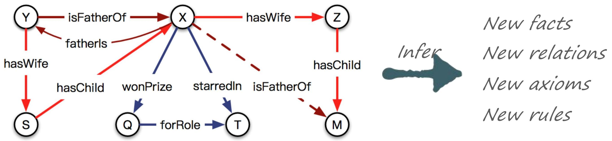

## 基于知识图谱的推理

. 知识图谱推理的主要方法

基于描述逻辑的推理（如DL-based）

基于图结构和统计规则挖掘的推理（如：PRA、AMIE）

. 基于知识图谱表示学习的推理（如：TransE）

• 基于概率逻辑的方法（如：Statistical RelationalLearning）

## 基于符号逻辑的推理——本体推理

• 传统的符号逻辑推理中主要与知识图谱有关的推理手段是基于描述逻辑的本体推理。

• 描述逻辑主要被用来对事物的本体进行建模和推理，用来描述和推断概念分类及其概念之间的关系。

主要方法：

•基于表运算（Tableaux）及改进的方法：FaCT++、Racer、 Pellet Hermit等

•基于Datalog转换的方法如KAON、RDFox等

•基于产生式规则的算法（如rete）：Jena 、Sesame、OWLIM等

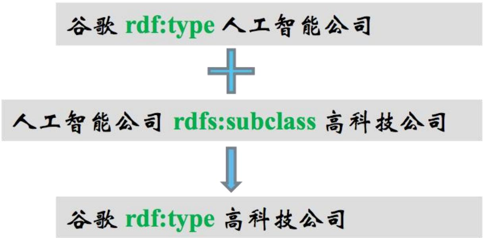

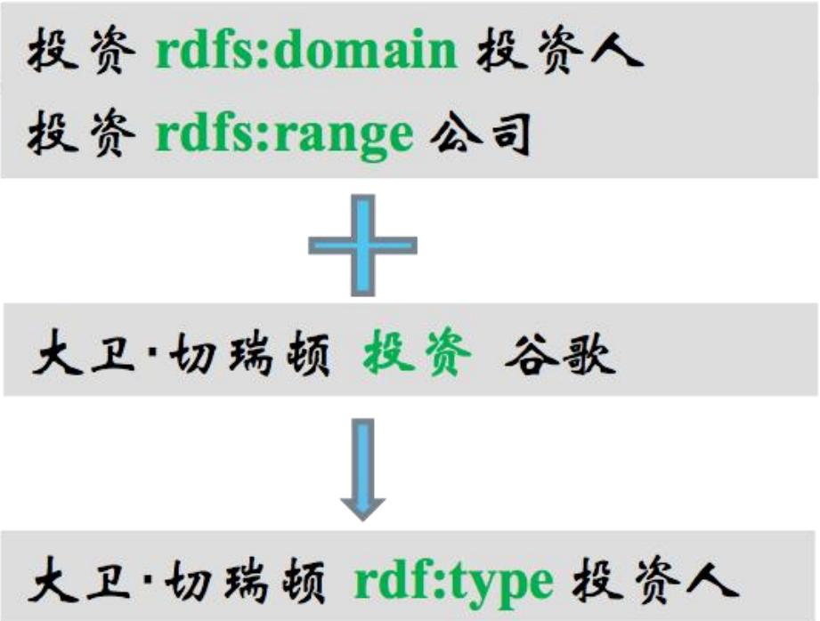

## 基于图结构和统计规则挖掘的推理

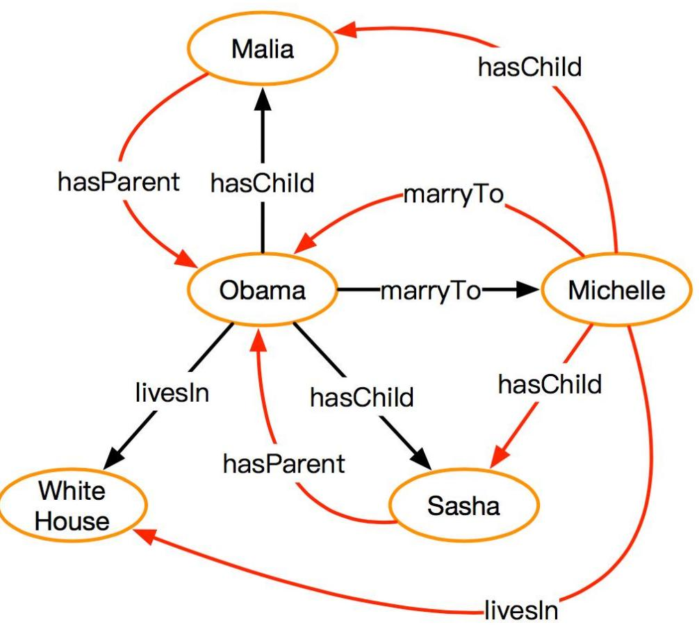

hasChild(A,B) = hasParent(B,A)   
marryTo(A,B) ⇒ marryTo(B,A)   
marryTo(A,B)hasChild(A,C)⇒ hasChild(B,C)   
marryTo(A,B)livesIn(A,C)= livesIn(B,C)

## 主要方法：

基于路径排序学习方法(PRA，Pathranking Algorithm)

基于关联规则挖掘方法(AMIE)

## 基于知识图谱表示学习的关系推理

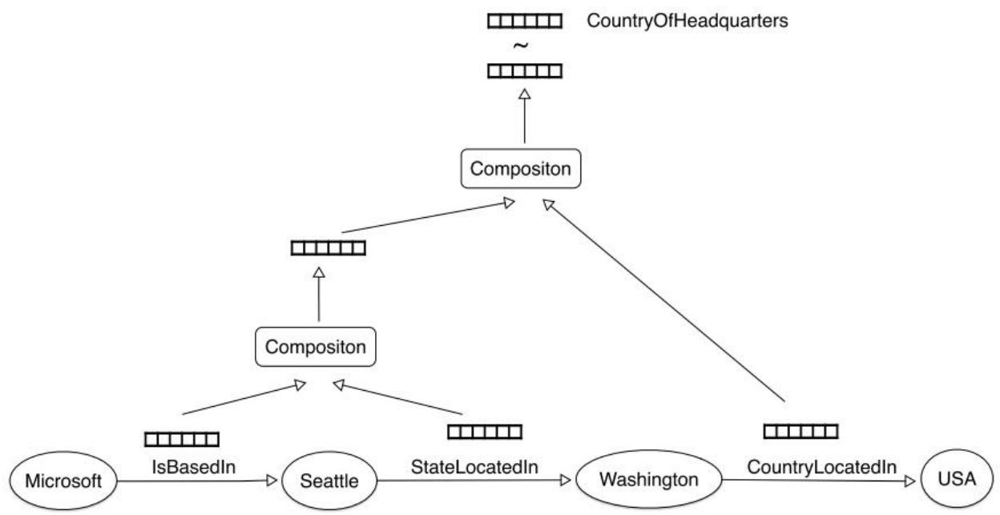

## Representation Learning

将实体和关系都表示为向量

通过向量之间的计算代替图的遍历和搜索来预测三元组的存在，由于向量的表示已经包含了实体原有的语义信息，计算含有一定的推理能力。

可应用于链接预测，基于路径的多度查询等。

# 基于概率逻辑的方法——StatisticalRelational Learning

• Statistical relational learning (SRL)，sometimes called Relational Machine Learning (RML)， is concerned with domain models that exhibit both uncertainty and complex, relational structure.

• Typically, the knowledge representation formalisms developed in SRL use (a subset of) firstorder logic to describe relational properties of a domain in a general manner (universal quantification) and draw upon probabilistic graphical models (such as Bayesian networks or Markov networks) to model the uncertainty.

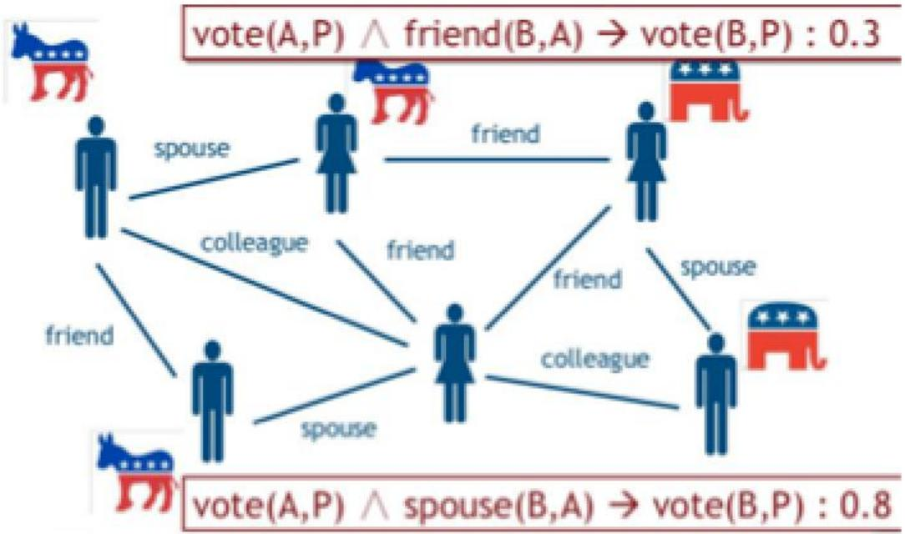

## ProbabilisticSoft Logic(PSL)

规则+输入数据

真实世界中的很多规则都不是非1即0的，而是带有一定的概率的，PSL用概率逻辑推理代替了传统的硬逻辑推理。

可应用于实体消解、链接预测、本体对齐等任务

## 7.2 基于RDFS的简单推理

## RDF：Triple-based Assertion model

## 最简单、最接近自然语言和人脑认知的数据模型

RDF 代表 Resource Description Framework (资源描述框架)

An RDF triple （S,P,O）encodes a statement—a simple logical expression, or claim about the world.

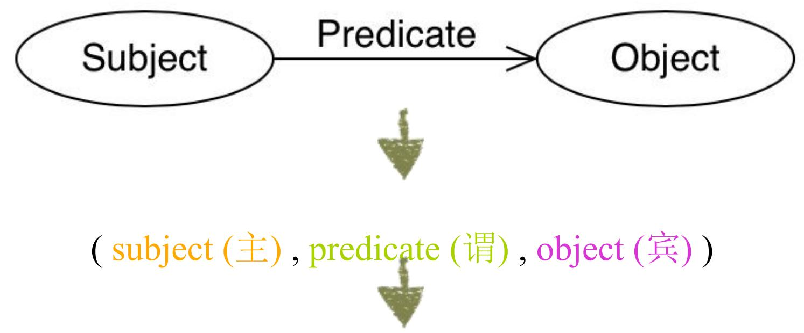  
( subject (浙江大学) , predicate (位于) , object (杭州) )

# RDFS: Simple Vocabulary and Schema

Defines small vocabulary for RDF: Class, subClassOf, type, Property, subPropertyOf, Domain, Range

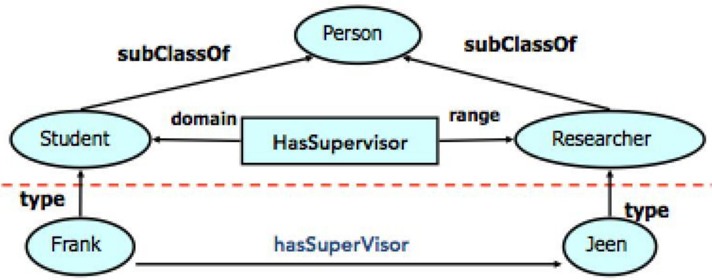

## 基于RDFS的简单推理


## 7.3 OWL本体推理

# OWL extends RDF Schema

RDF-Schema：Class, subclass, Property, subProperty……


Complex Classes: intersection, union and complement

Property Restrictions: existential quantification, universal quantification, hasValue

Cardinality Restrictions: maxQualifiedCardinality, minQualifiedCardinality, qualifiedCardinality

Property Characteristics: inverseOf, SymmetricProperty, AsymmetricProperty, propertyDisjointWith, ReflexiveProperty, FunctionalProperty

Property Chains

## OWL本体语言

OWL本体语言

W3C

描述逻辑

一阶谓词逻辑的子集

←

←

↑

➤ 是知识图谱语言中最规范，最严谨，表达能力最强的语言

➤ 基于RDF语法，使表示出来的文档具有语义理解的结构基础

➤ 促进了统一词汇表的使用，定义了丰富的语义词汇

允许逻辑推理

## OWL本体语言

## 描述逻辑系统

一个描述逻辑系统包括四个基本的组成部分

1) 最基本的元素：概念、关系和个体

2) TBox术语集(概念术语的公理集合)

3) ABox断言集(个体的断言集合)

4) TBox和ABox上的推理机制

➤ 不同的描述逻辑系统的表示能力与推理机制由于对这四个组成部分的不同选择而不同。

## OWL本体语言

## □概念

解释为一个领域的子集

■ 例如，学生:{x|student(x)}

## □关系

■ 解释为该领域上的二元关系 （笛卡尔乘积）

倒如，朋友： $\{ \langle x , y \rangle | { \mathrm { f r i e n d } } ( x , y ) \}$

## □个体

一个领域内的实倒

例如，小明:{Ming}

## OWL本体语言

## TBox——泛化的知识

➤ 描述概念和关系的知识，被称之为公理(Axiom)

由于概念之间存在包含关系，TBox知识形成类似格(Lattice)的结构，这种数学结构是由包含关系决定的，与具体实现无关

## ABox——具体个体的信息

➤ ABox包含外延知识 (又称断言 (Assertion))，描述论域中的特定个体  
描述逻辑的知识库， 即TBox， 即ABox

## OWL本体语言

## Tbox语言

定义：引入概念以及关系的名称

例如，Mother，Person，has\_child

V 包含：声明包含关系的公理

例如，Mother≌ has\_child.Person

概念和概念，关糸和概念之间可以组成更复杂的概念。

## Abox语言

概念断言- -表示一个对象是否属于某个概念

例如，Mother(Alice)，Person(Bob)

关系断言- -表示两个对象是否满足特定关系

例如，has\_child(Alice, Bob)

## OWL本体语言

## 描述逻辑的语义

<table><tr><td rowspan=1 colspan=1>构造算子</td><td rowspan=1 colspan=1>语法</td><td rowspan=1 colspan=1>语义</td><td rowspan=1 colspan=1>例子</td></tr><tr><td rowspan=1 colspan=1>原子概念</td><td rowspan=1 colspan=1>A</td><td rowspan=1 colspan=1> $\mathsf { A } ^ { \mathsf { I } } \subseteq \mathsf { \Delta } \mathsf { L } ^ { \mathsf { I } }$ </td><td rowspan=1 colspan=1>Human</td></tr><tr><td rowspan=1 colspan=1>原子关系</td><td rowspan=1 colspan=1>R</td><td rowspan=1 colspan=1> $\mathbb { R } ^ { 1 } \subseteq \Delta ^ { \mathrm { I } } \times \Delta ^ { \mathrm { I } }$ </td><td rowspan=1 colspan=1>has_child</td></tr><tr><td rowspan=1 colspan=2>对概念C，D和关系(role)R</td><td rowspan=1 colspan=2></td></tr><tr><td rowspan=1 colspan=1>合取</td><td rowspan=1 colspan=1>CnD</td><td rowspan=1 colspan=1> $\mathbf { C } ^ { \mathrm { I } } \cap \mathbf { D } ^ { \mathrm { I } }$ </td><td rowspan=1 colspan=1>Human  Male</td></tr><tr><td rowspan=1 colspan=1>析取</td><td rowspan=1 colspan=1>CuD</td><td rowspan=1 colspan=1> $\mathsf { C } ^ { \mathrm { I } } \cup \mathsf { D } ^ { \mathrm { I } }$ </td><td rowspan=1 colspan=1>Doctor L Lawyer</td></tr><tr><td rowspan=1 colspan=1>非</td><td rowspan=1 colspan=1>-C</td><td rowspan=1 colspan=1> $\Delta ^ { \mathrm { I } } \backslash \mathsf { C }$ </td><td rowspan=1 colspan=1>-Male</td></tr><tr><td rowspan=1 colspan=1>存在量词</td><td rowspan=1 colspan=1>ERC</td><td rowspan=1 colspan=1> $\{ x | \exists y . \langle x , y \rangle \in \mathrm { R } ^ { \mathrm { I } } \land y \in \mathrm { C } ^ { \mathrm { I } } \}$ </td><td rowspan=1 colspan=1>has_child.Male</td></tr><tr><td rowspan=1 colspan=1>全称量词</td><td rowspan=1 colspan=1>∀R. C</td><td rowspan=1 colspan=1> $\{ x | \forall y . \langle x , y \rangle \in \mathrm { R } ^ { \mathrm { I } } \Rightarrow y \in \mathrm { C } ^ { \mathrm { I } } \}$ </td><td rowspan=1 colspan=1>∀has_child. Doctor</td></tr></table>

有了语义之后，我们可以进行推理。通过语义来保证推理的正确和完备性。

## OWL本体语言

描述逻辑与OWL词汇的对应
<table><tr><td rowspan=1 colspan=1>Axiom</td><td rowspan=1 colspan=1>DL Syntax</td><td rowspan=1 colspan=1>Example</td></tr><tr><td rowspan=1 colspan=1>subClassOf</td><td rowspan=1 colspan=1> $\mathrm { C } _ { 1 } \subseteq \mathrm { C } _ { 2 }$ </td><td rowspan=1 colspan=1>Human≤ Animal  Biped</td></tr><tr><td rowspan=1 colspan=1>sameClassAs</td><td rowspan=1 colspan=1> ${ \sf C } _ { 1 } \equiv { \sf C } _ { 2 }$ </td><td rowspan=1 colspan=1>Man 三 Human  Male</td></tr><tr><td rowspan=1 colspan=1>subPropertyOf</td><td rowspan=1 colspan=1> $\mathrm { P } _ { 1 } \subseteq \mathrm { P } _ { 2 }$ </td><td rowspan=1 colspan=1>hasDaughterE hasChild</td></tr><tr><td rowspan=1 colspan=1>samePropertyAs</td><td rowspan=1 colspan=1> $\mathsf { P } _ { 1 } \equiv \mathsf { P } _ { 2 }$ </td><td rowspan=1 colspan=1>cost = price</td></tr><tr><td rowspan=1 colspan=1>sameIndividualAs</td><td rowspan=1 colspan=1> $\{ x _ { 1 } \} \equiv \{ x _ { 2 } \}$ </td><td rowspan=1 colspan=1> $\{ \mathrm { P r s i d e n t \_ B u s h } \} \equiv \{ \mathrm { G \_ W \_ B u s h } \}$ </td></tr><tr><td rowspan=1 colspan=1>disjointWith</td><td rowspan=1 colspan=1> $\mathsf C _ { 1 } \subseteq \lnot \mathbf C _ { 2 }$ </td><td rowspan=1 colspan=1>MaleE-Female</td></tr><tr><td rowspan=1 colspan=1>differentIndividualFrom</td><td rowspan=1 colspan=1> $\{ x _ { 1 } \} \subseteq \lnot \{ x _ { 2 } \}$ </td><td rowspan=1 colspan=1> $\{ \mathrm { J o h n } \} \subseteq \lnot \{ \mathrm { P e t e r } \}$ </td></tr><tr><td rowspan=1 colspan=1>inverseOf</td><td rowspan=1 colspan=1> $\mathrm { P } _ { 1 } \equiv \mathrm { P } _ { 2 } ^ { \phantom { } - }$ </td><td rowspan=1 colspan=1> $\mathbf { h a s C h i l d } \equiv \mathbf { h a s P a r e n t ^ { - } }$ </td></tr><tr><td rowspan=1 colspan=1>transitiveProperty</td><td rowspan=1 colspan=1> ${ \mathrm { P } } ^ { + } \subseteq { \mathrm { P } }$ </td><td rowspan=1 colspan=1> $\operatorname { a n c e s t o r } ^ { + } \subseteq \operatorname { a n c e s t o r }$ </td></tr><tr><td rowspan=1 colspan=1>uniqueProperty</td><td rowspan=1 colspan=1> $\mathrm { T } \subseteq \leq 1 \mathrm { P }$ </td><td rowspan=1 colspan=1>T E≤ 1hasMother</td></tr><tr><td rowspan=1 colspan=1> unambiguousProperty</td><td rowspan=1 colspan=1> $\mathrm { T } \subseteq \leq 1 \mathsf { P } ^ { - }$ </td><td rowspan=1 colspan=1>TE≤1isMotherOf-</td></tr></table>

## 知识推理任务

可满足性 (satisfiability)

分类 (classification)

实例化 (materialization)

推理就是通过各种方法获取新的知识或者结论，这些知识和结论满足语义。

## OWL本体推理

## 可满足性(satisfiability)

## 本体可满足性

检查一个本体是否可满足，即检查该本体是否有模型。如果本体不可满足，说明存在不一致

概念可满足性

检查某一概念的可满足性，即检查是否具有模型，使得针对该概念的解释不是空集

一个不可满足的本体

Man ∩ Women ≌」

Man(Allen)

Women(Allen)

一个不可满足的概念Eternity ≌⊥

针对可满足性推理采用Tableaux算法

## OWL本体推理

## 分类（classification)

针对Tbox的推理，计算新的概念包含关系

Mother≤ Women

Women ≌ Person


Mother≤ Person

注意：这里的分类和机器学习中分类的区别！

## OWL本体推理

分类的例子

Apple ⊑ ∃beInvestedBy.(Fidelity ⊓ BlackStone)

苹果由富达和黑石投资。

∃beFundedBy.Fidelity ⊑ InnovativeCompanies

借助富达融资的公司都是创新企业。

∃beFundedBy.BlackStone ⊑ InnovativeCompanies

借助黑石融资的公司都是创新企业。

beInvestedBy ⊑ beFundedBy

投资即是帮助融资。

富达基金和黑石基金都喜欢投资高新科技公司。

## OWL本体推理

分类的例子

Apple ⊑ ∃beInvestedBy.(Fidelity ⊓ BlackStone)

∃beFundedBy.Fidelity ⊑ InnovativeCompanies

∃beFundedBy.BlackStone ⊑ InnovativeCompanies

beInvestedBy ⊑ beFundedBy

## OWL本体推理

分类的例子

Apple ⊑ ∃beInvestedBy.(Fidelity ⊓ BlackStone)

∃beFundedBy.Fidelity ⊑ InnovativeCompanies

∃beFundedBy.BlackStone ⊑ InnovativeCompanies

beInvestedBy ⊑ beFundedBy

Apple ⊑ ∃beInvestedBy.Fidelity

## OWL本体推理

分类的例子

Apple ⊑ ∃beInvestedBy.(Fidelity ⊓ BlackStone)

∃beFundedBy.Fidelity ⊑ InnovativeCompanies

∃beFundedBy.BlackStone ⊑ InnovativeCompanies

beInvestedBy ⊑ beFundedBy

Apple ⊑ ∃beInvestedBy.Fidelity

Apple ⊑ ∃beFundedBy.Fidelity

## OWL本体推理

分类的例子

Apple ⊑ ∃beInvestedBy.(Fidelity ⊓ BlackStone)

∃beFundedBy.Fidelity ⊑ InnovativeCompanies

∃beFundedBy.BlackStone ⊑ InnovativeCompanies

beInvestedBy ⊑ beFundedBy

Apple ⊑ ∃beInvestedBy.Fidelity

Apple ⊑ ∃beFundedBy.Fidelity

Apple ⊑ InnovativeCompanies

## OWL本体推理

## 实例化 (materialization)

实例化即计算属于某个概念或关系的所有实倒的集合

## 计算新的类实例信息

Mother(Alice) MotherE Women

Women(Alice)

## 计算新的二元关系

has\_son(Alice,Bob)

has\_son ≤ has\_child

has\_child(Alice, Bob)

## OWL本体推理

实例化(materialization)的一个例子:

一个兼并重组(可以是业务兼并，不是收购)套利策略:策略思想: 与大盘股公司兼并重组的上市企业有很高的预期收益。

∃merge.BigCapital ⊑ ValueSecurity

定义什么是大盘股(按照策略自己调整):

上证50和沪深300指数中的标的属于大盘股。

SZ50 ⊑ BigCapital, HS300 ⊑ BigCapital, SZ180 ⊑ HS300

选股目标: 找出兼并重组策略下所有高预期公司:

使用OWL的实例化推理

## OWL本体推理

实例化(materialization)的一个例子：

一个兼并重组套利策略：

merge.BigCapitalE ValueSecurity   
SZ50 E BigCapital, HS300 E BigCapital,SZ180 E HS300

选股目标：找出兼并重组策略下所有高预期公司：

merge(SZ300377,SH600570）赢时胜和恒生电子在区块链方面有业务兼并  
SZ180(SH600570) 恒生电子是上证180的成分股

推理：

## OWL本体推理

实例化(materialization)的一个例子:

一个兼并重组套利策略:

∃merge.BigCapital ⊑ ValueSecurity   
SZ50 ⊑ BigCapital, HS300 ⊑ BigCapital, SZ180 ⊑ HS300

选股目标: 找出兼并重组策略下所有高预期公司:

merge(SZ300377, SH600570) 赢时胜和恒生电子在区块链方面有业务兼并  
SZ180(SH600570) 恒生电子是上证180的成分股

推理:

HS300(SH600570)

## OWL本体推理

实例化(materialization)的一个例子:

一个兼并重组套利策略:

∃merge.BigCapital ⊑ ValueSecurity   
SZ50 ⊑ BigCapital, HS300 ⊑ BigCapital, SZ180 ⊑ HS300

选股目标: 找出兼并重组策略下所有高预期公司:

merge(SZ300377, SH600570) 赢时胜和恒生电子在区块链方面有业务兼并  
SZ180(SH600570) 恒生电子是上证180的成分股

推理:

HS300(SH600570), BigCapital(SH600570)

## OWL本体推理

实例化(materialization)的一个例子:

一个兼并重组套利策略:

∃merge.BigCapital ⊑ ValueSecurity   
SZ50 ⊑ BigCapital, HS300 ⊑ BigCapital, SZ180 ⊑ HS300

选股目标: 找出兼并重组策略下所有高预期公司:

merge(SZ300377, SH600570) 赢时胜和恒生电子在区块链方面有业务兼并  
SZ180(SH600570) 恒生电子是上证180的成分股

推理:

HS300(SH600570), BigCapital(SH600570), ValueSecurity(SZ300377)

## OWL本体推理

实例化(materialization)的一个例子:

一个兼并重组套利策略:

∃merge.BigCapital ⊑ ValueSecurity   
SZ50 ⊑ BigCapital, HS300 ⊑ BigCapital, SZ180 ⊑ HS300

选股目标: 找出兼并重组策略下所有高预期公司:

merge(SZ300377, SH600570) 赢时胜和恒生电子在区块链方面有业务兼并  
SZ180(SH600570) 恒生电子是上证180的成分股

推理:

HS300(SH600570), BigCapital(SH600570), ValueSecurity(SZ300377)

结论: SZ300377赢时胜在短期内是一家高收益公司。

这本质上用基于消息面的套利，推理机可以完成复杂股票筛选的过程。

## 7.4 基于Tableaux算法的推理

## 典型推理算法：Tableaux算法

## Tableaux运算

适用场合

检查某一本体概念的可满足性，以及实例检测

基本思想

通过一系列规则构建Abox，以检测可满足性，或者检测某一实例是否存在于某概念

➤ 基本思想类似于一阶逻辑的归结反驳

## 基于Tableaux运算的方法

## Tableaux运算规则（以主要DL算子举例）

初始情况下，の是原始的AbOX，迭代运用如下规则：

+-规则：若CnD(x)∈Ω，且C(x),D(x)∈の，则の:=のU{C(x),D(x)};   
-规则：若C(x),D(x)∈Φ,且C∩D(x)∈の，则の:=のU{C∩D(x)};   
规则：若R.C(x)∈の,且R(x,y),C(y)∈の，则の:=のU{R(x,y),C(y)},   
还有个存在-规则其中，y是新加进来的个体;   
∀-规则：若∀R.C(x),R(x,y)∈の，且C(y)∈の，则の:=のU{C(y)};   
≌-规则：若C(x)∈の,C∈D，且D(x)∈の，则の:=のU{D(x)};   
⊥-规则：若」(x)∈の,则拒绝の;

## 基于Tableaux运算的方法

Tableaux运算规则举例给定如下本体，检测实倒Allen是否在Woman中？

Man ∩ Women ∈⊥

Man(Allen)

## 基于Tableaux运算的方法

## Tableaux运算规则举例

给定如下本体，检测实例Allen是否在Woman中？


## 基于Tableaux运算的方法

## Tableaux运算规则举例

初始Abox，记为の

给定如下本体，检测实例Allen是否在Woman中？

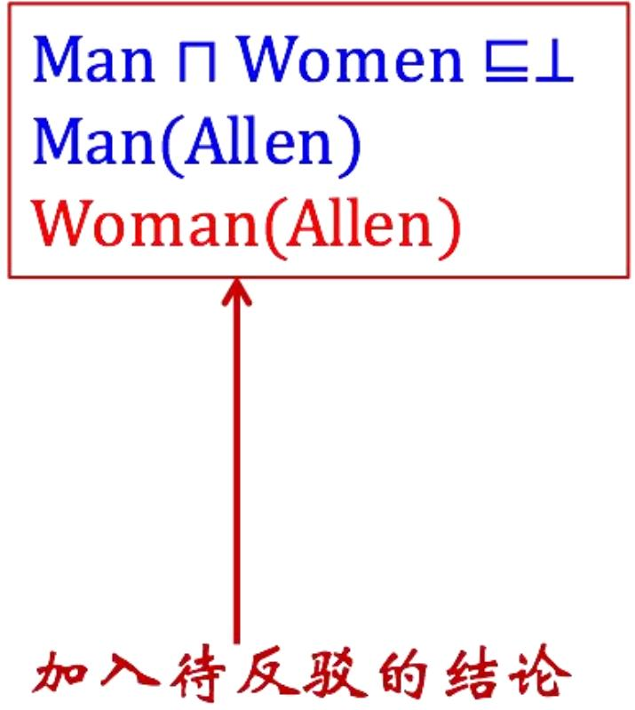

Man(Allen)

Woman(Allen)

## 基于Tableaux运算的方法

## Tableaux运算规则举例

给定如下本体，检测实例Allen是否在Woman中？

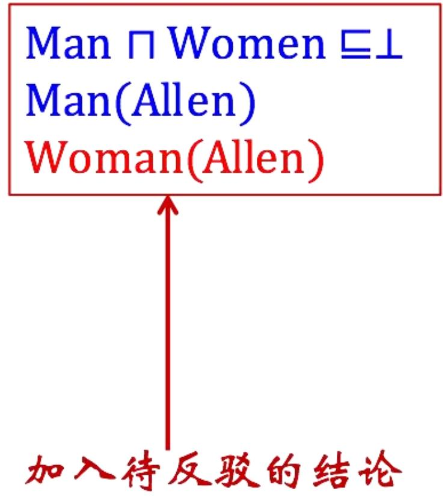

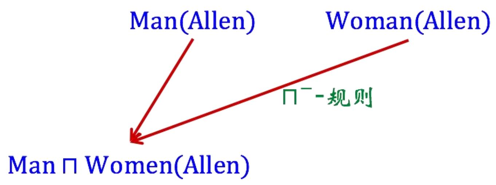

## 基于Tableaux运算的方法

## Tableaux运算规则举例

现在的の

给定如下本体，检测实例Allen是否在Woman中？

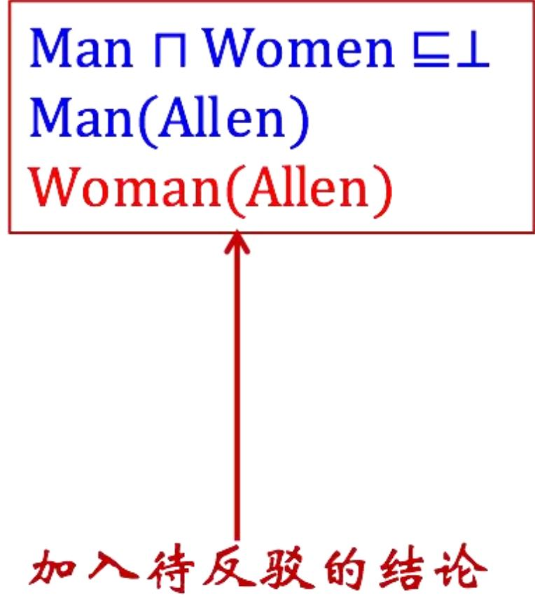

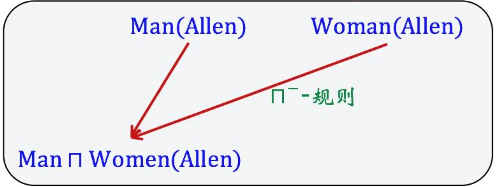

## 基于Tableaux运算的方法

## Tableaux运算规则举例

给定如下本体，检测实例Allen是否在Woman中？

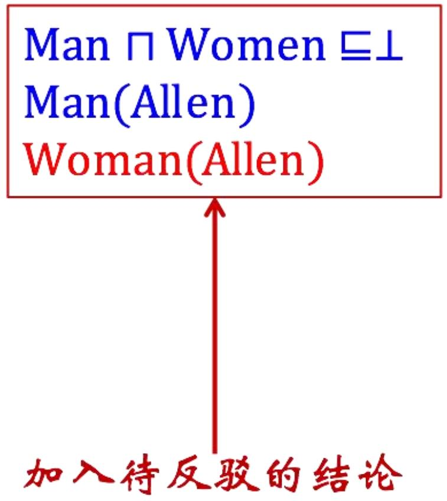

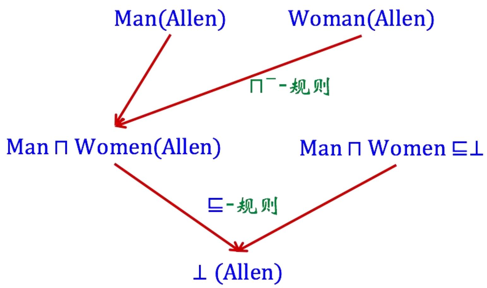

## 基于Tableaux运算的方法

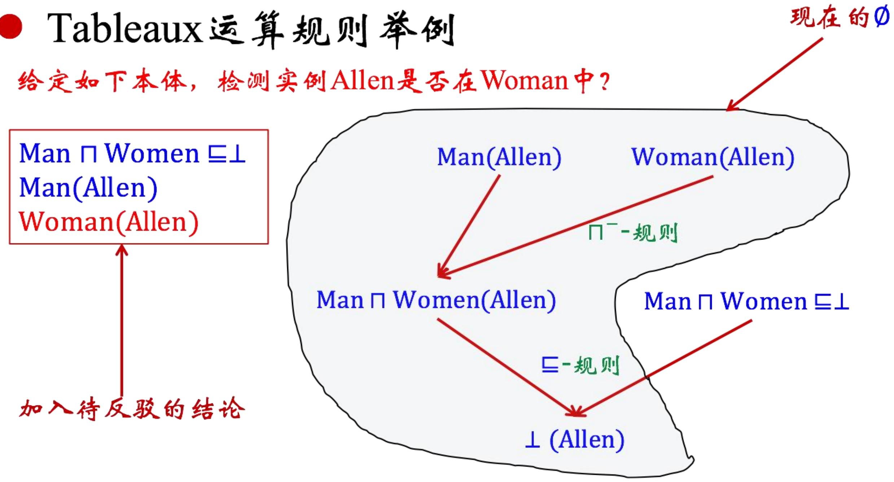

## 基于Tableaux运算的方法

## Tableaux运算规则举例

给定如下本体，检测实例Allen是否在Woman中？

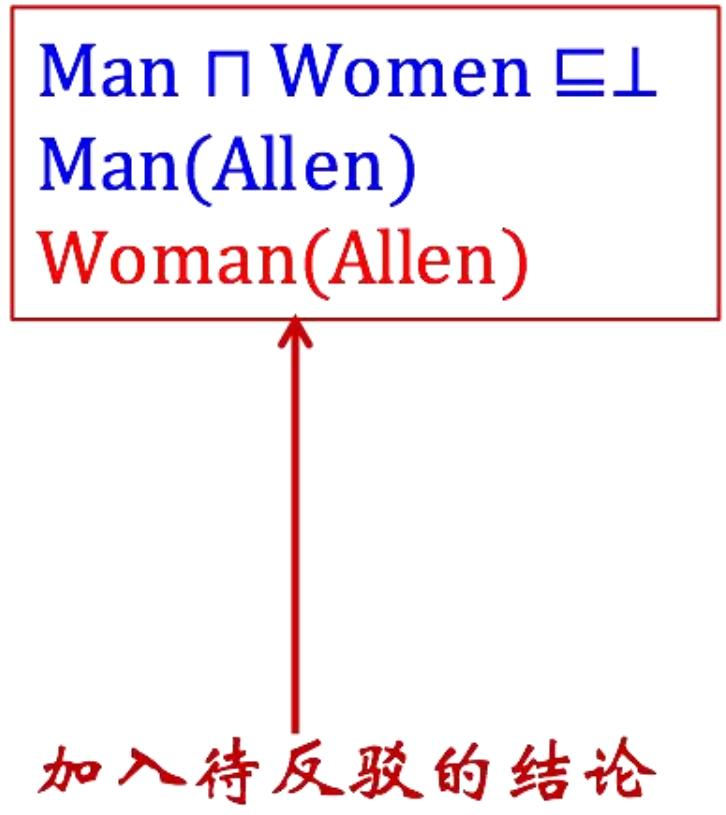

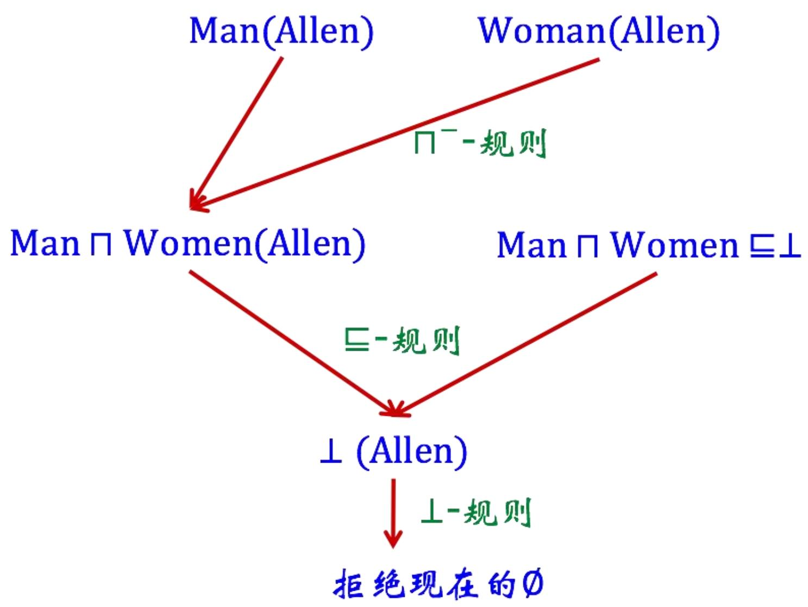

## 基于Tableaux运算的方法

## Tableaux运算规则举例

给定如下本体，检测实例Allen是否在Woman中？

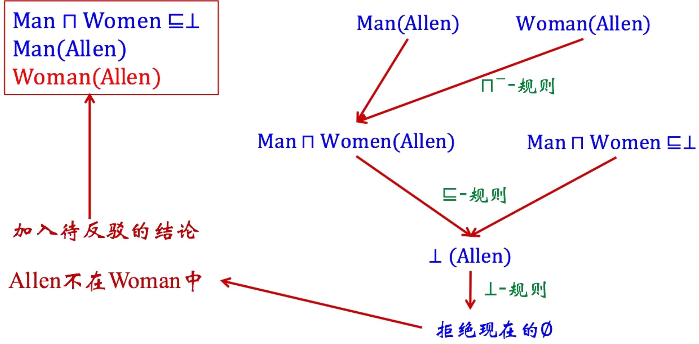

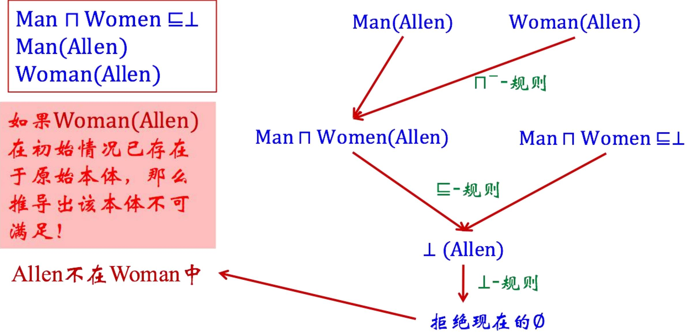

## 基于Tableaux运算的方法

## Tableaux运算规则举例

给定如下本体，检测是否可满足？

## 相关工具简介

FaCT++

➤ 曼彻斯特大学开发的描述逻辑推理机

使用C++实现，且能与Protégé集成

Java版本名为Jfact，基于OWL API

使用举例

构建推理机

OWLReasonerFactory reasonerFactory = new JFactFactory();   
OWLReasoner reasoner = this.reasonerFactory.createReasoner(ontology);

进行推理(分类)

reasoner.precomputeInferences(InferenceType.CLASS\_HIERARCHY);

http://owl.man.ac.uk/factplusplus/

## 相关工具简介

Racer

美国Franz Inc.公司开发的以描述逻辑为基础的本体推理，也可以用作语义知识库

支持OWL DL，支持部分OWL 2 DL

支持单机和客户端/服务器两种模式

用Allegro Common Lisp实现

使用举例

(classify-tbox &optional (tbox (current-tbox)))

进行TBox推理

(realize-abox &optional (abox (current-abox)))

进行ABox推理

https://www.ifis.uni-luebeck.de/index.php?id=385

## 相关工具简介

Pellet

https://github.com/stardog-union/pellet

马里兰大学开发的本体推理机

➤ 支持OWL DL的所有特性，包括枚举类和XML数据类型的推理

支持OWL API以及Jena的接口

• 使用举例

PelletReasoner reasoner = 构建一个 PelletReasonerFactory.getInstance().createReasoner( ontology);

构建一个推理机

NodeSet<OWLNamedIndividual> individuals = reasoner.getInstances(Person, true);

通过查询接口进行推理

## 相关工具简介

HermiT

牛津大学开发的本体推理机

基于hypertableau运算，更加高效

支持OWL 2规则

使用举例

Reasoner hermit = new Reasoner(ontology);

构建一个推理机

System.out.println(hermit.isConsistent());

一致性检测

http://www.hermit-reasoner.com/

## 相关工具简介

相关工具总结

<table><tr><td rowspan=1 colspan=1>工具名称</td><td rowspan=1 colspan=1>支持本体语言</td><td rowspan=1 colspan=1>编程语言</td><td rowspan=1 colspan=1>算法</td></tr><tr><td rowspan=1 colspan=1>FaCT++</td><td rowspan=1 colspan=1>OWLDL</td><td rowspan=1 colspan=1>C++</td><td rowspan=1 colspan=1>tableau-based</td></tr><tr><td rowspan=1 colspan=1>Racer</td><td rowspan=1 colspan=1>OWL DL</td><td rowspan=1 colspan=1>Common Lisp</td><td rowspan=1 colspan=1>tableau-based</td></tr><tr><td rowspan=1 colspan=1>Pellet</td><td rowspan=1 colspan=1>OWL DL</td><td rowspan=1 colspan=1>Java</td><td rowspan=1 colspan=1>tableau-based</td></tr><tr><td rowspan=1 colspan=1>HermiT</td><td rowspan=1 colspan=1>OWL 2 Profiles</td><td rowspan=1 colspan=1>Java</td><td rowspan=1 colspan=1>hypertableau</td></tr></table>

## 7.5 基于逻辑编程改写的方法

## 基于逻辑编程改写的方法

规则推理

## 本体推理的局限:

(1) 仅支持预定义的本体公理上的推理(无法针对自定义的词汇支持灵活推理)

(2) 用户无法定义自己的推理过程

## 引入规则推理

(1) 可以根据特定的场景定制规则，以实现用户自定义的推理过程

(2) Datalog语言可以结合本体推理和规则推理

## 基于逻辑编程改写的方法

## Datalog语言

➤ 面向知识库和数据库设计的逻辑语言，表达能力与OWL相当，支持递归

便于撰写规则，实现推理

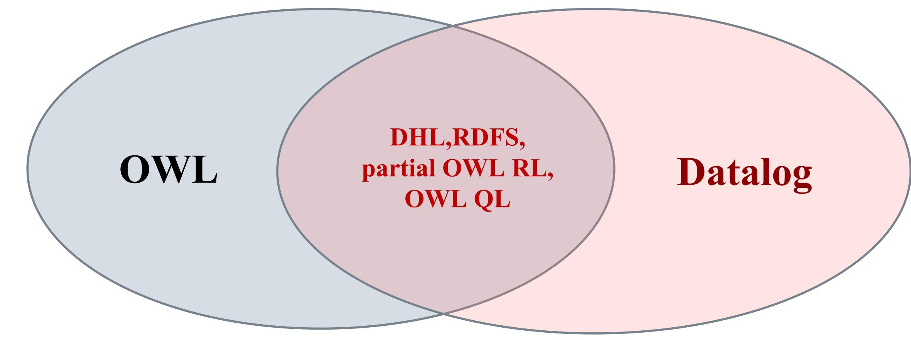

## 基于逻辑编程改写的方法

## Datalog语法

原子 (Atom)

$p ( t _ { 1 } , t _ { 2 } , \ldots , t _ { n } )$

●其中p是谓词，n是目数， $t _ { i }$ 是项(变量或常量)

例如： $\mathrm { { h a s \_ c h i l d ( X , Y ) } }$

规则 (Rule)

$\mathrm { H } ; - \mathrm { B } _ { 1 } , \mathrm { B } _ { 2 } , \ldots , \mathrm { B } _ { \mathrm { m } }$

由原子构建，其中H是头部原子， $\mathrm { B } _ { 1 } , \mathrm { B } _ { 2 } , \ldots , \mathrm { B } _ { \mathrm { m } }$ 是体部原子

例如： $\mathtt { h a s \_ c h i l d ( X , Y ) : - h a s \_ s o n ( X , Y ) }$

## 基于逻辑编程改写的方法

## Datalog语法

事实(Fact)

$\operatorname { F } ( \mathbf { c } _ { 1 } , \mathbf { c } _ { 2 } , \ldots , \mathbf { c } _ { \mathrm { n } } ) \colon$

没有体部且没有变量的规则

例如：has\_child(Alice,Bob): -

Datalog程序是规则的集合

例如：

Datalog程序P:   
has\_child(X, Y): -has\_son(X, Y).   
has\_child(Alice, Bob): -

## 基于逻辑编程改写的方法

## Datalog推理举例

规则集

path(x,y): -edge(x,y).

path(x,y): -path(x,z),path(z,y).

事实集

edge(a, b).

edge(b,c).

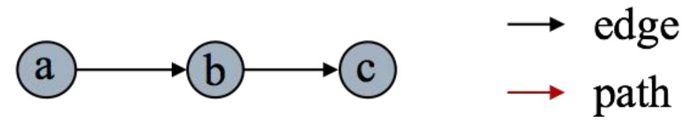

## 基于逻辑编程改写的方法

## Datalog推理举例

规则集

path(x,y): -edge(x,y).

path(x,y): -path(x,z),path(z,y).

事实集

edge(a,b).

edge(b,c).

结果集

path(a, b).

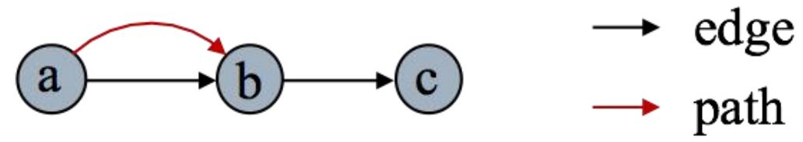

## 基于逻辑编程改写的方法

## Datalog推理举例

规则集

path(x,y): -edge(x,y).

path(x,y): -path(x,z),path(z,y).

事实集

edge(a, b).

edge(b,c).

## 结果集

path(a,b).

path(b,c).

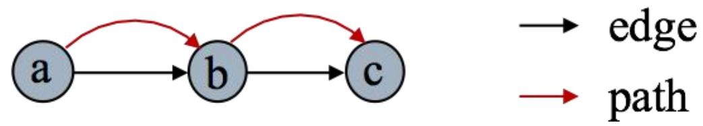

## 基于逻辑编程改写的方法

## Datalog推理举例

规则集

path(x, y): -edge(x, y).

path(x,y): -path(x,z),path(z,y).

事实集

edge(a, b).

edge(b,c).

## 结果集

path(a,b).]

path(b,c).|

path(a,c).

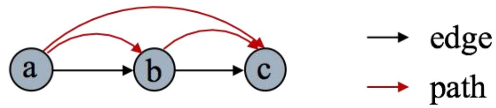

## 相关工具介绍

KAON2

➤ OWL推理机、本体管理API

基于一阶消解原理

针对大规模ABox进行优化

## 使用举例

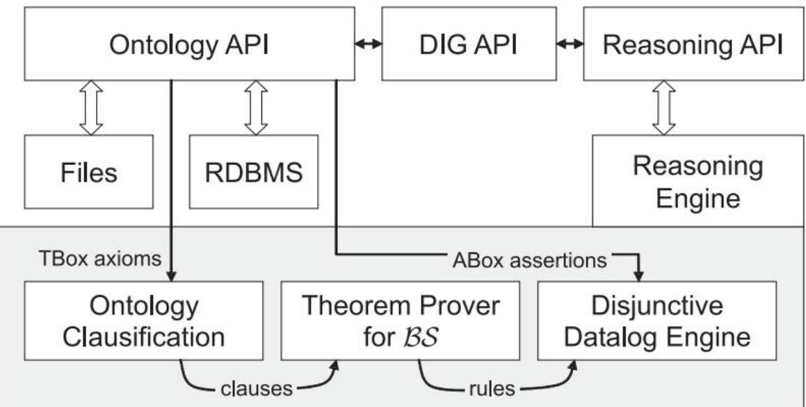

http://kaon2.semanticweb.org/

OntologyManager ontologyManager=KAON2Manager.newOntologyManager(); 2   
Ontology ontology=ontologyManager.createOntology("http://kaon2.semanticweb.org/example04",new   
HashMap<String,Object>());

## 创建本体

Reasoner reasoner=ontology.createReasoner();

Query whatDoPeopleKnowAbout=reasoner.createQuery(new Literal[] {

KAON2Manager.factory().literal(true,person,new Term[] { X }),

KAON2Manager.factory().literal(true,personKnowsAboutTopic,new Term[] { X,Y }),

},new Variable[] { X,Y});

创建推理机并用于查询

## 相关工具介绍

## RDFox

https://www.cs.ox.ac.uk/isg/tools/RDFox/

➤ 由牛津大学开发的可扩展、跨平台、基于内存的RDF三元组存储系统

支持并行Datalog推理、SPARQL查询

• 使用举例

## 创建本体与存储

```javascript
OWLOntologyManager manager = OWLManager.createOWLOntologyManager();
OWLOntology ontology =
manager.loadOntologyFromOntologyDocument(IRI.create(“test.owl"));
DataStore store = new DataStore(DataStore.StoreType.ParallelSimpleNN, true);
```

```javascript
store.importOntology(ontology);
store.applyReasoning();
```

导入本体进行推理

## 相关工具简介

相关工具总结

<table><tr><td rowspan=1 colspan=1>工具名称</td><td rowspan=1 colspan=1>支持本体语言</td><td rowspan=1 colspan=1>实现编程语言</td><td rowspan=1 colspan=1>支持编程语言</td></tr><tr><td rowspan=1 colspan=1>KAON2</td><td rowspan=1 colspan=1>OWLDL/SWRL</td><td rowspan=1 colspan=1>Java</td><td rowspan=1 colspan=1>Java</td></tr><tr><td rowspan=1 colspan=1>RDFox</td><td rowspan=1 colspan=1>OWL 2 RL</td><td rowspan=1 colspan=1>C++</td><td rowspan=1 colspan=1>Java/C++/Python</td></tr></table>

## 7.6 基于产生式规则的方法

## 基于产生式规则的方法

产生式系统

➤ 一种前向推理系统，可以按照一定机制执行规则从而达到某些目标，与一阶逻辑类似，也有区别

应用

自动规划

专家系统

产生式系统的组成

Feigenbaum研制的化学分子结构专家系统DENDRAL

Shortliffe研制的的诊断感染性疾病的专家系统MYCIN

事实集合 (Working Memory)

产生式/规则集合

推理引擎

## 基于产生式规则的方法

事实集/运行内存(Working Memory,WM)

事实(WME)的集合

用于存储当前系统中所有事实

●事实（Working Memory Element, WME)

描述对象

形 $\not \exists \circ \mathrm { ( t y p e ~ a t t r _ { 1 } : v a l _ { 1 } ~ a t t r _ { 2 } : v a l _ { 2 } ~ . . . ~ a t t r _ { n } : v a l _ { n } ) , ~ } \not \equiv$ 中type,attri, vali均为原子（常量） 米比

类比类和对象

例如: (student name: Alice age: 24)

描述关系 (Refication)

例如: (basicFact relation:olderThan firstArg: John secondArg: Alice) 简记为(olderThan John Alice)

## 基于产生式规则的方法

产生式集合 (Production Memory, PM)

产生式的集合

产生式

➤ IF conditions THEN actions

conditions是由条件组成的集合，又称为LHS（Left HandSide）

actions是由动作组成的序列，又称为RHS（Right HandSide)

## 基于产生式规则的方法

## LHS

V 条件(condition)的集合，各条件之间是且的关系

当LHS中所有条件均被满足，则该规则触发

每个条件形如(type attr: spec1 attr2:spec2...attrn: specn)

其中speci表示对attri的约束，形式可取下列中的一种

原子，如：Alice (person name:Alice)

变量，如：x(斜体) (person name: x)

表达式，如：[n+4] (person age: [n + 4])

布尔测试，如：{> 10} (person age: {> 10})

约束的与、或、非操作

## 基于产生式规则的方法

RHS

动作(action)的序列，执行时依次执行

动作的种类如下：

ADD pattern

➤ 向WM中加入形如pattern的WME

REMOVE i

➤ 从WM中移除当前规则第i个条件匹配的WME

MODIFY i (attr spec)

➤ 对于当前规则第i个条件匹配的WME，将其对应于attr属性的值改为spec

## 基于产生式规则的方法

产生式 LHS

IF conditions THEN actions

例如：

亦可写作 (具体语法因不同系统而异)

如果有一个学生名为?x，那么向事实集中加入一个事实，表示有一个名为?x的人

## 基于产生式规则的方法

## 推理引擎

## 控制系统的执行

➤ 模式匹配

该步骤是产生式系统的核心，具体算法在后面介绍

➤ 用规则的条件部分匹配事实集中的事实，整个LHS都被满足的规则被触发，并被加入议程(agenda)

解决冲突

➤ 按一定的策略从被触发的多条规则中选择一条

执行动作

➤ 执行被选择出来的规则的RHS，从而对WM进行一定的操作产生式系统=事实集+产生式集合+推理引擎

## 基于产生式规则的方法

## 产生式系统执行流程

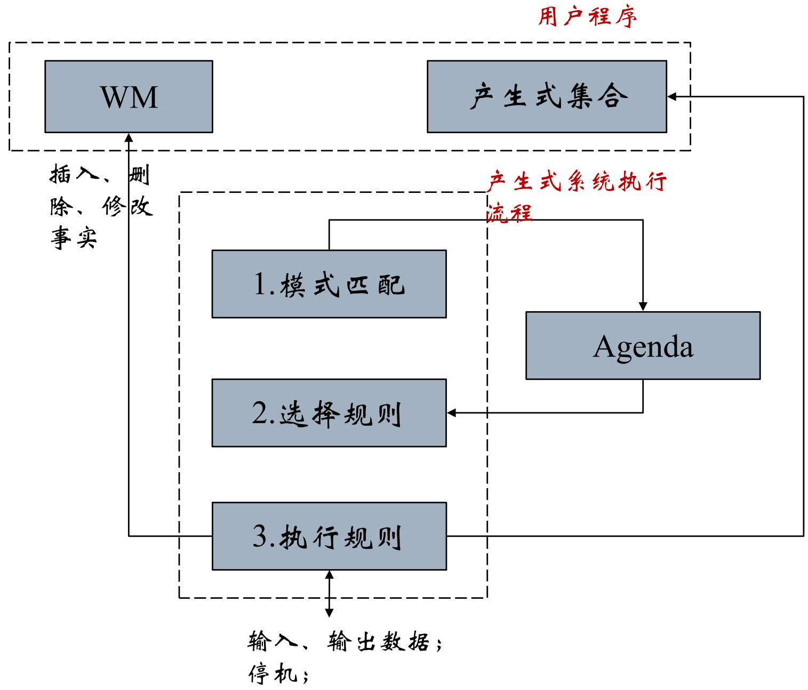

## 基于产生式规则的方法

## 模式匹配

用每条规则的条件部分匹配当前WM

(type x y), (subClassOf y z) = ADD (type x z)

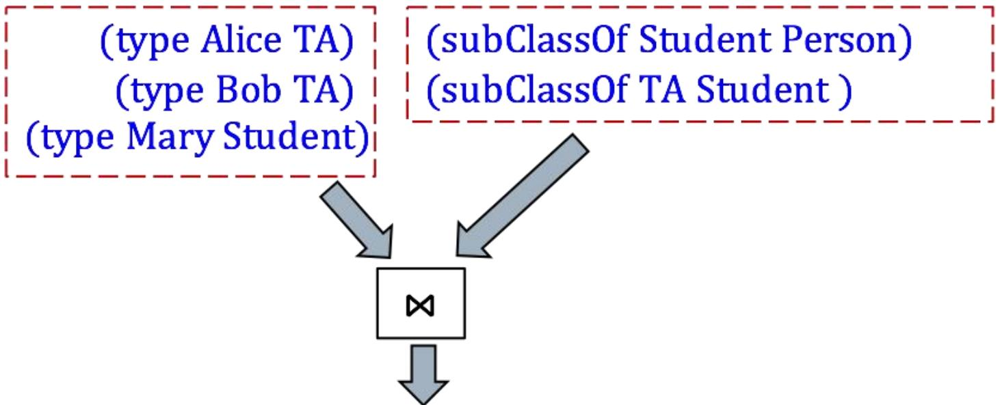

WM   
(type Alice TA)   
(type Bob TA)   
(type Mary Student)   
(subClassOf Student Person)   
(subClassOf TA Student )

(type Alice TA),(subClassOf TA Student ) (type Bob TA),(subClassOf TA Student) (type Mary Student),(subClassOf Student Person)!

如何高效匹配？

## 基于产生式规则的方法

## 模式匹配

## RETE算法

1979年由Charles Forgy (CMU)提出

将产生式的LHS组织成判别网络形式

用空间换时间

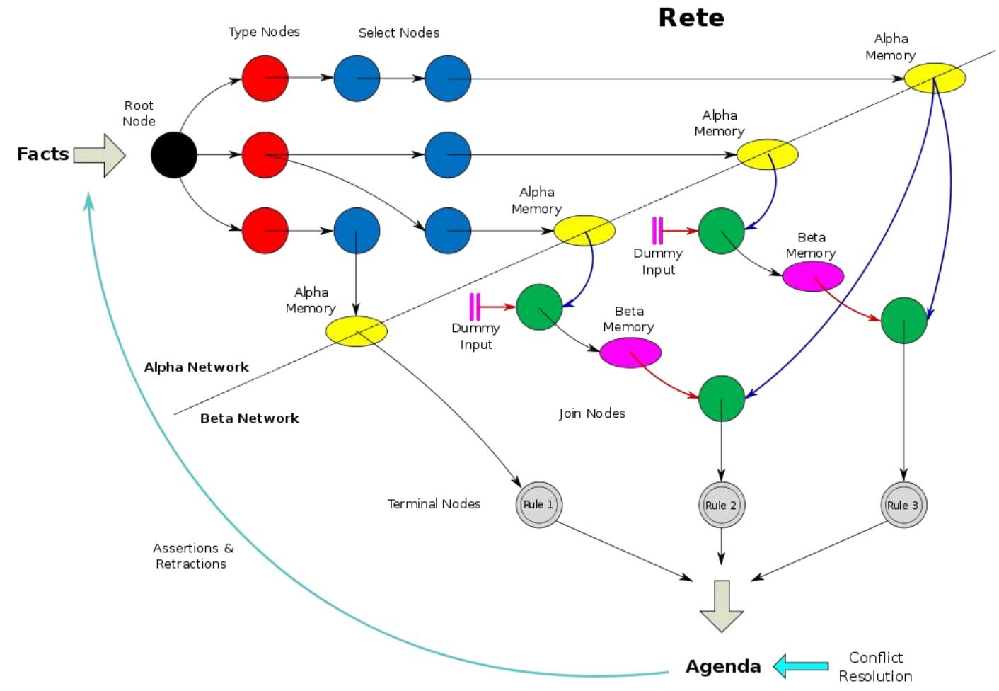

## 基于产生式规则的方法

## 模式匹配

RETE算法

Production Memory (a x), (b x y), (c y)

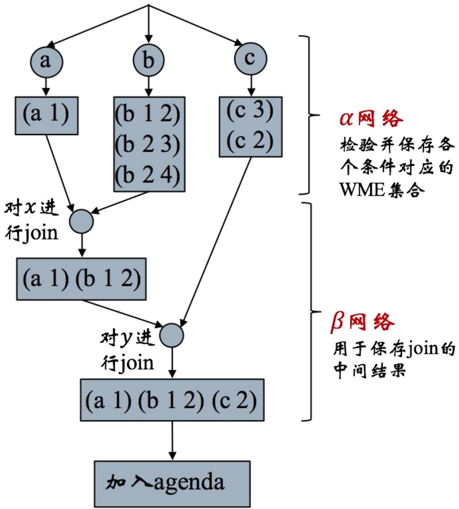

## 基于产生式规则的方法

## 冲突解决

从被触发的多条规则中选择一条

常见策略

随机选择在推理的场景下，被触发的多条规则可全被执行

V 从被触发的规则中随机选择一条执行

具体性（specificity) (Student name: x)= ·… 选择最具体的规则 (Student name: x age: 20) ..

新近程度(recency)

选择最近没有被触发的规则执行动作

Drools

15 Drools

➤ 商用规则管理系统，其中提供了一个规则推理引擎

核心算法基于RETE算法改进

提供规则定义语言，支持嵌入Java代码

使用举例

https://www.drools.org/

创建容器与会话

```javascript
KieServices ks = KieServices.Factory.get();
KieContainer kContainer = ks.getKieClasspathContainer();
KieSession kSession = kContainer.newKieSession("ksession-rules");
```

kSession.fireAllRules();

触发规则

用于构建语义网应用的Java框架

规则格式

➤ 提供了处理RDF、RDFS、OWL数据的接口，还提供了一个规则引擎

提供三元组的内存存储于查询

http://jena.apache.org/

## 使用举例

Model m = ModelFactory.createDefaultModel();

创建模型

Reasoner reasoner = new

创建规则推理机

GenericRuleReasoner(Rule.rulesFromURL("file:rule.txt"));

InfModel inf = ModelFactory.createInfModel(reasoner, m);

## 相关工具介绍

CONSTRUCT   
{ ?p :relatesTo :Cryptography } WHERE   
{ { :Bob ?p :Alice } UNION   
{ :Alice ?p :Bob } }

RDF4J (原Sesame)

一个处理RDF数据的开源框架

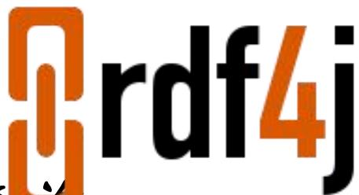

规则格式(SPARQL)

支持语义数据的解析、存储、推理和查询

➤ 能够关联几乎所有RDF存储系统

能够用于访问远程RDF存储

## • 使用举例

http://rdf4j.org/

String pre = "PREFIX : <http://foo.org/bar#>\n"; 创建规则   
String rule = pre + "CONSTRUCT { ?p :relatesTo :Cryptography } WHERE   
" + "{ { :Bob ?p :Alice } UNION { :Alice ?p :Bob } }";

Repository repo = new SailRepository(new   
CustomGraphQueryInferencer(new MemoryStore(),   
QueryLanguage.SPARQL, rule, “”));

创建推理知识库

## 相关工具介绍

Id: rdfs2   
x a y [Constraint a != <rdf:type>]   
a <rdfs:domain> z [Constraint z != <rdfs:Resource>]   
x <rdf:type> z 规则格式 规则格

GraphDB (原OWLIM)

## ·GraphDB8

➤ 一个可扩展的语义数据存储系统(基于RDF4J)

包含三元组存储、推理引擎、查询引擎

➤ 支持RDFS，OWL DLP，OWL Horst，OWL 2 RL推理

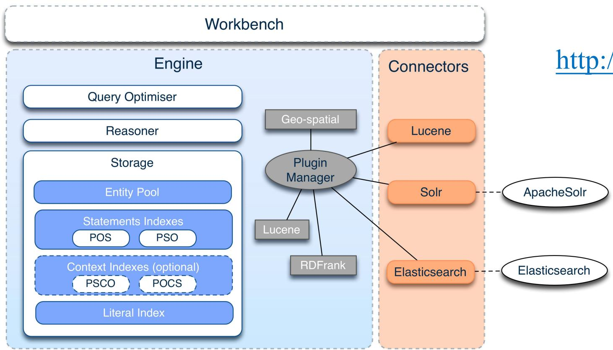  
http://graphdb.ontotext.com/

## 相关工具简介

相关工具总结

<table><tr><td rowspan=1 colspan=1>工具名称</td><td rowspan=1 colspan=1>实现语言</td><td rowspan=1 colspan=1>支持编程语言</td><td rowspan=1 colspan=1>是否开源</td><td rowspan=1 colspan=1>算法</td></tr><tr><td rowspan=1 colspan=1>Drools</td><td rowspan=1 colspan=1>Java</td><td rowspan=1 colspan=1>Java</td><td rowspan=1 colspan=1></td><td rowspan=1 colspan=1>RETEOO/PHREAK</td></tr><tr><td rowspan=1 colspan=1>Jena</td><td rowspan=1 colspan=1>Java</td><td rowspan=1 colspan=1>Java</td><td rowspan=1 colspan=1></td><td rowspan=1 colspan=1>RETE</td></tr><tr><td rowspan=1 colspan=1>RDF4J</td><td rowspan=1 colspan=1>Java</td><td rowspan=1 colspan=1>Java/PHP/Python</td><td rowspan=1 colspan=1></td><td rowspan=1 colspan=1>RETE</td></tr><tr><td rowspan=1 colspan=1>GraphDB</td><td rowspan=1 colspan=1>Java</td><td rowspan=1 colspan=1>Java/PHP/Python/Scala...</td><td rowspan=1 colspan=1></td><td rowspan=1 colspan=1>TRREE</td></tr></table>

其中，Drools是通用规则管理系统，而另外三个均是图数据库

TRREE stands for ‘Triple Reasoning and Rule Entailment Engine’.

## 本讲结束

感谢浙江大学陈华钧教授提供课程素材！

