知识推理第2讲

## 知识并行推理

张小旺

## x iaowangzhang@tju.edu.cn

天津大学智能与计算学部

## 知识库回答（Query Answeing over KB）

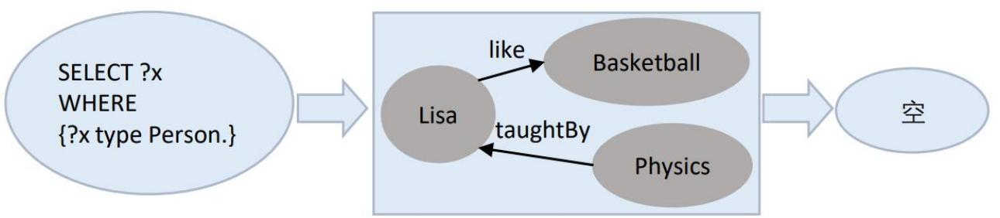  
图2-4传统数据库查询示例图

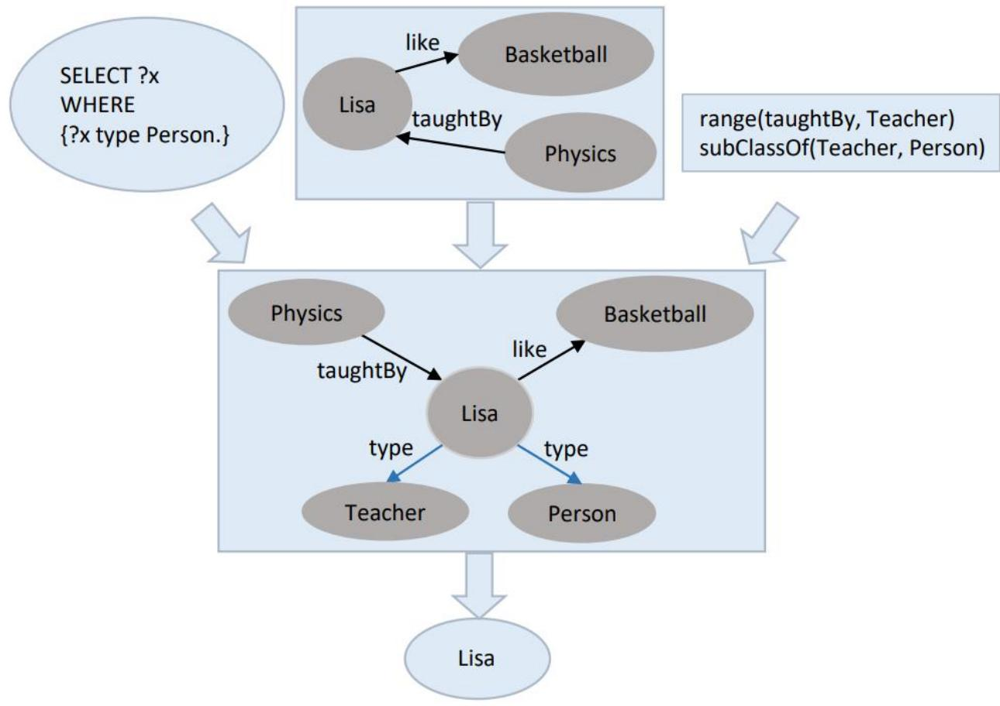

## 通用模型

通用模型 $\mathcal { U } _ { \mathcal { K } }$ 如下定义：

$$
\Delta ^ { \mathcal { U } _ { \mathcal { K } } } = \{ a \cdot c _ { R _ { 1 } } \cdot \cdot \cdot c _ { R _ { n } } \mid a \in \operatorname { I n d } ( \mathcal { A } ) , n \geq 0 , a \sim c _ { R _ { 1 } } \sim \cdot \cdot \cdot \sim c _ { R _ { n } } \} ,
$$

$a ^ { \mathcal { U } _ { \mathcal { K } } } = a ,$ ，对任 $\qquad - \ a \in { \mathrm { I n d } } ( { \mathcal { A } } )$

$A ^ { \mathcal { U } _ { \mathcal { K } } } = \{ \sigma \in \Delta ^ { \mathcal { U } _ { \mathcal { K } } } \mid \operatorname { t a i l } ( \sigma ) \in A ^ { I _ { \mathcal { K } } } \}$

$$
\bullet \ P ^ { \mathcal { U } _ { \mathcal { K } } } = \{ ( a , b ) \in \mathrm { I n d } ( { \mathcal { A } } ) \times \mathrm { I n d } ( { \mathcal { A } } ) \ | \ P ( a , b ) \in { \mathcal { A } } \} \cup \{ ( \sigma , \sigma \cdot c _ { P } ) \in \Delta ^ { \mathcal { U } _ { \mathcal { K } } } \times \Delta ^ { \mathcal { U } _ { \mathcal { K } } } \ | \}
$$

$$
\mathrm { t a i l } ( \sigma ) \sim c _ { P } \} \cup \{ ( \sigma \cdot c _ { P ^ { - } } , \sigma ) \in \Delta ^ { \mathcal { U } _ { \mathcal { K } } } \times \Delta ^ { \mathcal { U } _ { \mathcal { K } } } | \mathrm { t a i l } ( \sigma ) \sim c _ { P ^ { - } } \} \mathrm { o }
$$

## 通用模型的“无穷”

例2.1已知由 $\mathcal { T } = \{ B \subseteq \exists S , \exists S ^ { - } \subseteq \exists S \}$ 和 $\mathcal { A } = \{ B ( d _ { 0 } ) \}$ 组成。

则 $\Delta ^ { J _ { \mathcal { K } } } ~ = ~ \{ d _ { 0 } , d _ { 1 } \} , ~ B ^ { I _ { \mathcal { K } } } = \{ d _ { 0 } \}$ ，并且 $S ^ { I _ { \mathcal { K } } } = \{ ( d _ { 0 } , d _ { 1 } ) , ( d _ { 1 } , d _ { 1 } ) \}$

$$
\Delta ^ { \mathcal { U } _ { \mathcal { K } } } \ = \ \{ d _ { 0 } , d _ { 1 } , d _ { 2 } , d _ { 3 } , . . . \} , B ^ { \mathcal { U } _ { \mathcal { K } } } = \{ d _ { 0 } \}
$$

$$
S ^ { \mathcal { U } _ { \mathcal { K } } } = \{ ( d _ { 0 } , d _ { 1 } ) , ( d _ { 1 } , d _ { 2 } ) , \ldots \}
$$

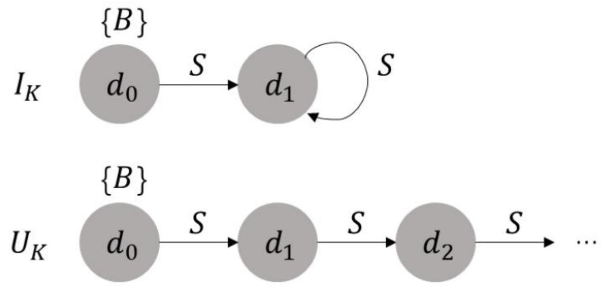  
图2-1规范解释和通用模型图

## 通用模型的多步有穷性

定理3.1对于任一一致性的 $D L \ – L i t e _ { h o r n } ^ { N }$ 知识库K，任一根合取查询 $q = \exists \vec { u } \varphi ( \vec { u } , \vec { \nu } )$ 和任一映射π，其中 $\deg ( q , \pi ) = n$ ，都满足， $\mathcal { U } _ { \mathcal { K } } \models ^ { \pi } \boldsymbol { q }$ 当且仅当 $\mathcal { U } _ { \mathcal { K } } ^ { n } \ \models ^ { \pi } { q }$

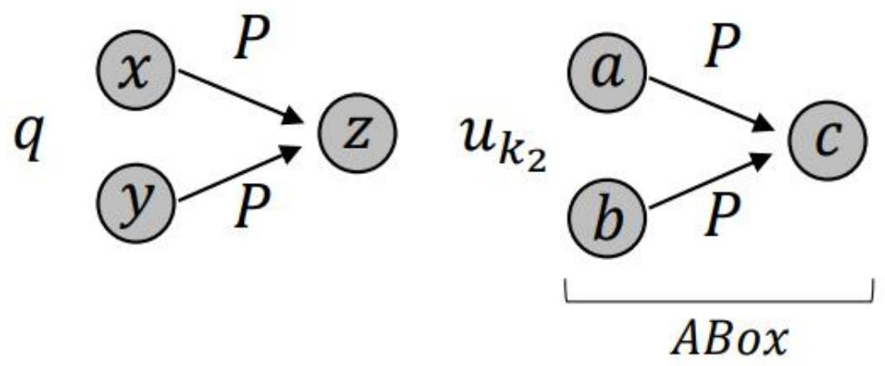  
图3-4 $\mathcal { K } _ { 2 }$ 的通用模型

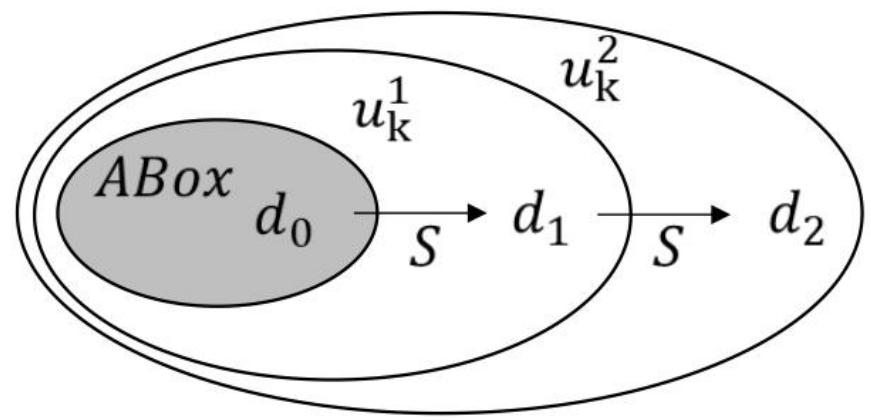  
图2-3例2.3的2步通用模型

SUMA https://github.com/SUMA-2019 AMaterialization-basedScalableQueryAnsweringinOWL

## 一个高效可扩展的支持OWL 2 DL的查询回答系统

SUMA源码地址：https://github.com/SUMA-2019

OpenKG.CN链接：http://openkg.cn/tool/suma-2019

## 引言：

本体推理问答是一个公认的难问题，因为推理时间开销巨大，在实际应用中完全做到线上实时推理问答是非常困难的。

本体物化通过扩展本体到一个近似的本体模型，将本体推理问答中的推理任务放在线下来预处理，从而减少线上问答的时间代价。

近年来，本体物化已成为本体推理问答的一种重要的优化方法，因其线上高效的查询性能，使其具有广泛的实际应用前景。

然而，现有的本体问答推理机不能解决无穷物化问题（本体的模型是无穷，这种情况是经常发生的），或者物化算法时间复杂度过高，只能处理中小型数据，或者需要额外的线上查询改写的时间消耗。

为此，向大家推出查询回答系统SUMA，提供较高完备性的大规模数据的实时推理。我们欢迎各位同学积极使用并反馈宝贵的意见。

## 特点：

• 高性能：SUMA采用低复杂度的物化算法并且为了加快事实和规则的匹配时间，为数据和规则构建三种类型的索引。

• 大规模：SUMA支持单机亿级数据的实时推理。

在24核180G内存的测试环境下，SUMA物化LUBM（1000）（1亿条元组）需要202s，物化UOBM（500）（1亿条元组）需要515s。预处理LUBM（1000）的时间总计为627s，是PAGOdA预处理时间的二分之一。预处理UOBM（500）的时间总计为966s，是PAGOdA预处理时间的六分之一。

• 适应性：SUMA 采用纯物化的方法进行查询回答，SUMA物化与查询独立，从无需对查询进行改写，也适合所有数据。

• 完备性：SUMA通过添加额外的推理规则和数据结构来保留近似处理可能会丢失的部分OWL 2DL语义。 在所有测试查询中，以Pellet的查询结果为评估标准，PAGOdA在8个测试查询上得到的答案是不完备的，SUMA在所有测试查询上都是可靠完备的。

• 简便性：SUMA 提供推理接口，可以为任何系统提供推理服务，同时也可以整合任意SPARQL查询引擎执行查询任务。

## SUMA系统结构和工作流程：

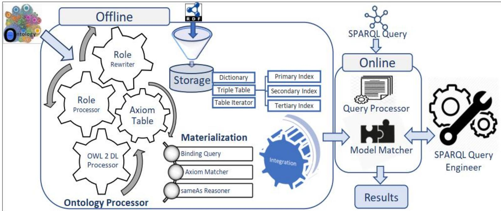

SUMA包含四个模块：本体处理，存储，物化和线上查询。下面我们简要介绍四个模块的工作流程：

## 第一步 [线下]：在物化之前预处理本体和数据

存储模块通过Jena API解析元组，将字符型数据编码为整形ID。将编码后的三元组存储为元组表，同时为元组表构建三级索引。此时，本体处理器使用OWL API解析本体，改写器通过近似规则近似处理OWL 2 DL公理。处理器通过与数据共享的字典对改写后的公理集进行编码，并存储为带有索引的公理表。

## SUMA数据存储与匹配

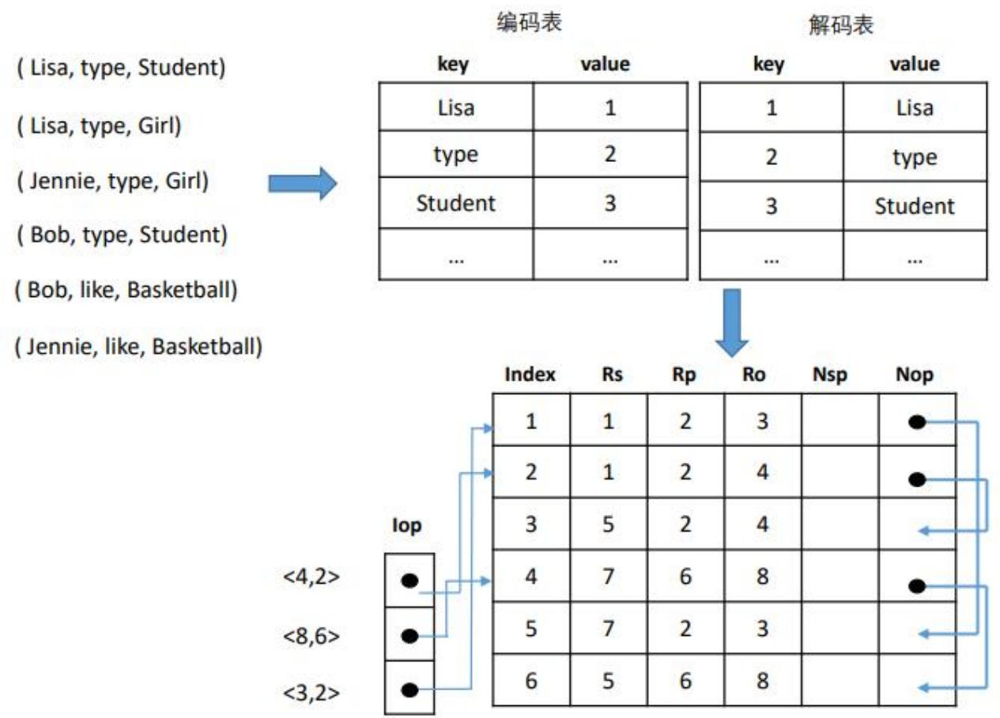  
图5-2SUMA存储模块图

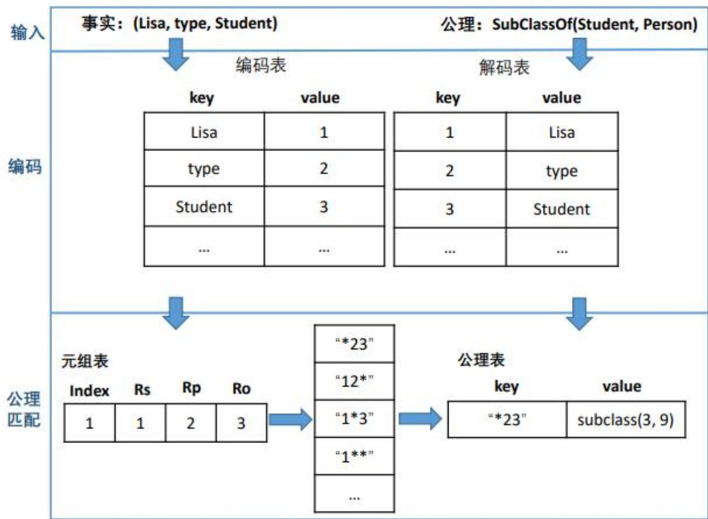  
图5-3SUMA公理匹配图

## SUMA系统结构和工作流程：

SUMA包含四个模块：本体处理，存储，物化和线上查询。下面我们简要介绍四个模块的工作流程：

## 第二步 [线下]：根据公理，对原始数据进行物化

物化模块迭代的读取一个未处理的事实F并且判定F不为冗余数据（在sameAs语义下，不存在等价元组）之后，解析F的数据类型。假如F表达个体等价性，则sameAs模块通过自身的sameAs算法对其进行处理；假如F涉及函数属性或者逆函数属性，则根据推理规则生成新的个体等价或者抛出异常；最后一种通用模式，匹配F对应的所有公理，根据F将公理转换为绑定查询，对已知元组表通过索引进行快速查找。根据查询答案生成新的事实。

## SUMA系统结构和工作流程：

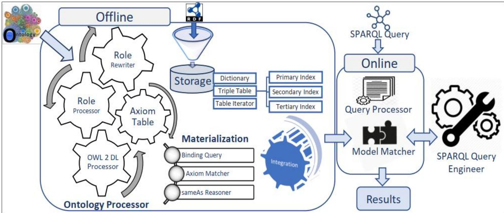

SUMA包含四个模块：本体处理，存储，物化和线上查询。下面我们简要介绍四个模块的工作流程：

## 第三步 [线上]：线上执行SPARQL查询

查询处理器计算查询中限制变量的个数，模型匹配器根据查询处理器的输出结果选择物化模型，并将数据和查询传递给SPARQL查询引擎。

## SUMA算法代码：

Algorithm 1 Materialization Algorithm   
Input: I : a collection of facts, T: a collection of axioms   
Output: I: a collection of expanded facts   
1:whileF= I.next and F ≠εdo   
2: G = Ω.getSameAsMapping(F);   
3： if G.equals(F) then   
4: if F is the form of (d,=,e) then   
5: sameAsReasoning(F);   
6: else   
7： if F is the form of (d,P,e)^ P.isFunctionalProperty then   
8: fore\*∈ I.getIndividual(d,P)do   
9: if I.contains(e，￥,e\*）) then   
10: result in contradiction;   
11: else I.add(e，=,e\*）);   
12: else   
13: for each (type,r,F) ∈ matchAxiom(F,T) do   
14: for F'∈ I.evaluate(type,r, F) do   
15: I.add(F');  
图1. 物化算法

Algorithm 2 sameAs Reasoning Algorithm   
Input: I : d, e : individual name, pool: a list of equivalent pool   
1: idx = mergeEquivalentPool(d,e);   
2:c=selectNewdentifer(poolidxl);   
3:fori∈ poolidx] do   
4: i.setSameAsMapping(c);  
图2. sameAs 算法

## 实验结果

为了验证SUMA的性能，尤其指预处理时间（包含物化时间）和在无穷物化情况下的查询的完备性，我们通过对LUBM和UOBM本体添加额外的公理，构建无穷模型的测试本体LUBM+和UOBM+。在有穷模型和无穷模型上分别测试了SUMA的性能。实验结果表明SUMA在所有测试查询上都是可靠完备的，并且它只需要花费202s来物化LUBM(1000)，515s物化UOBM(500)。

（实验中所有测试本体和查询都已开源在https://github.com/SUMA-2019）

<table><tr><td rowspan=1 colspan=1>Data</td><td rowspan=1 colspan=1>Expressivity</td><td rowspan=1 colspan=1>Axioms</td><td rowspan=1 colspan=1>Facts</td><td rowspan=1 colspan=1>Queries</td></tr><tr><td rowspan=3 colspan=1>LUBM(n)LUBM+(n)UOBM(n)UOBM+(n)DBPedia+</td><td rowspan=3 colspan=1>EL++ $\operatorname { E L } + +$ SHION(D)SHION(D)SHION(D)</td><td rowspan=1 colspan=1>243</td><td rowspan=1 colspan=1> $\overline { { \mathrm { n } { * } 1 0 ^ { 5 } } }$ </td><td rowspan=1 colspan=1>24</td></tr><tr><td rowspan=1 colspan=1>245502504</td><td rowspan=1 colspan=1> $\mathrm { n } { * } 1 0 ^ { 5 }$  $2 . 6 \mathrm { n } { * } 1 0 ^ { 5 }$  $2 . 6 \mathrm { n } { * } 1 0 ^ { 5 }$ </td><td rowspan=1 colspan=1>331520</td></tr><tr><td rowspan=1 colspan=1>3000</td><td rowspan=1 colspan=1> $2 . 6 { * } 1 0 ^ { 7 }$ </td><td rowspan=1 colspan=1>1024</td></tr></table>

图3. 实验中使用的本体，数据和查询

## 完备性评估

完备性测试是计算在确定性语义下，SUMA可以正确回答的查询数目。我们将Pellet的结果作为评估指标。实验结果表示对于所有的测试查询，SUMA都可以计算出所有的正确答案。而PAGOdA在LUBM+的五个测试查询(Q2, Q4, Q5, Q6,Q7)上和UOBM+的三个测试查询(Q1, Q2, Q3)上是不完备的。

## 预处理时间评估

在测试预处理时间时，我们设置LUBM数据的增长步长为200，本体较复杂的UOBM数据的增长步长为100。下图给出了SUMA和PAGOdA预处理时间的对比：

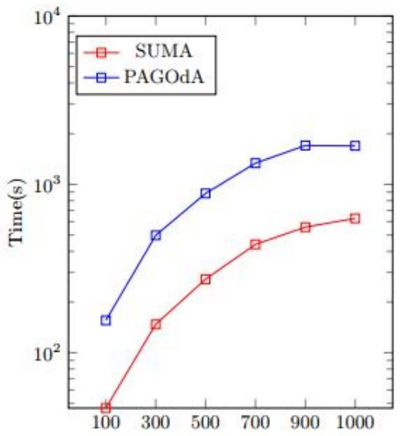  
图4. LUBM预处理时间

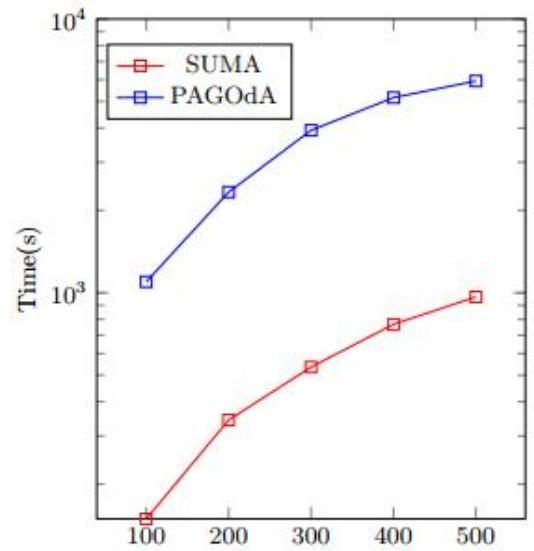  
图5. UOBM预处理时间

从图中可以看出，在所有LUBM和UOBM数据集上，SUMA的预处理时间都比PAGOdA更快，特别的，在三个UOBM数据集上，SUMA的预处理时间比PAGOdA快了七倍。

## SUMA运行方式：

1.1 源码运行：

 git clone SUMA源码 到本地；

运行src/main/java/com/tju/suma/test下的testSUMARunTest.java, 同一包路径下的MainClassInJar是生成jar的主类，导出jar包时请将主类设置为MainClassInJar。

 运行参数： pathTBox:本体路径(\*.owl)

pathABox:数据路径(\*.nt/ttl)

n: 物化步长，默认为7

pathExtendedABox:物化后的数据路径 (\*.nt)

isQueryByJena:是否进行Jena查询

initIsRoleWriting(true):是否进行角色改写，默认为true

queryPath: SPARQL查询路径(.sparql)

answerPath: 查询答案的路径

 配置：

Project Structure->Libraries->new project library->Java->加载当前目录下的lib中的所有jar包

1.2 jar包运行：

git clone SUMA jar包；

命令行：

java -jar SUMA.jar ONTOLOGY\_PATH DATA\_PATH NEW\_DATA\_PATH 比如， java -jar SUMA.jar uobm.owl uobm1.nt uobm1\_new.nt

## 其他资源链接：

RDF3X：一个高效的SPARQL查询引擎；可用于替换SUMA中的Jena查询。

 PAGOdA：PAGOdA是一个采用RDFox推理机和HermiT推理机相结合的查询回答系统。

测试用数据和查询：

SUMA 在DASFAA’20实验中用到的本体和查询；

PAGOdA提供的本体，数据和查询；

LUBM 数据生成器；

UOBM 数据生成器。

## 本讲结束

