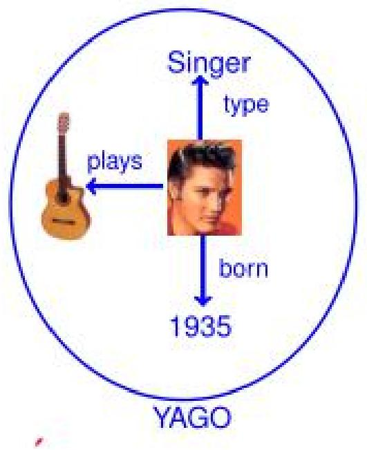
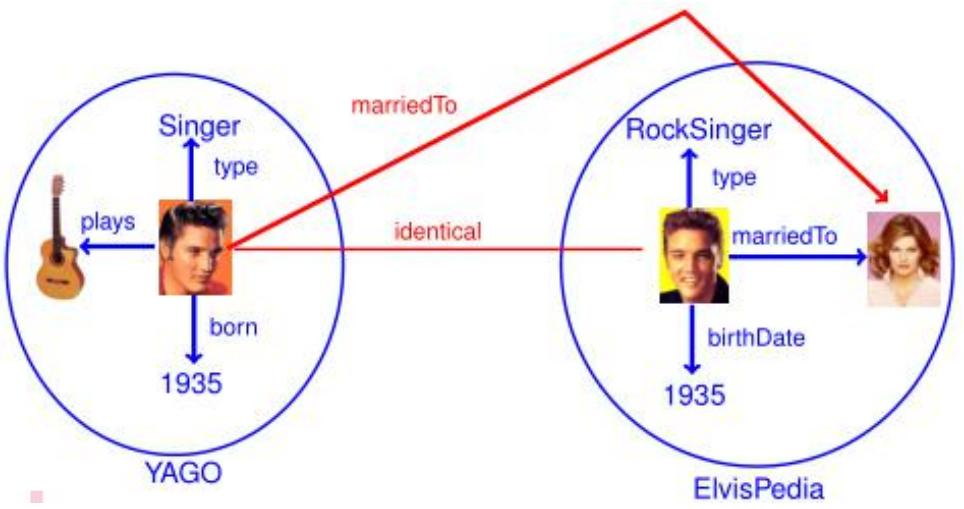
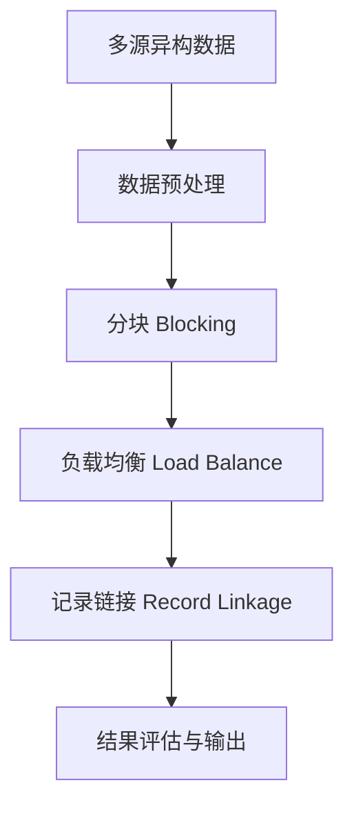
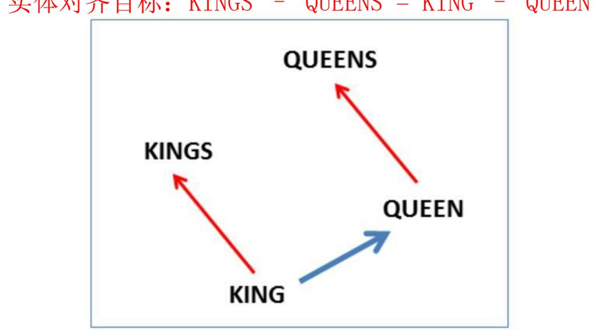
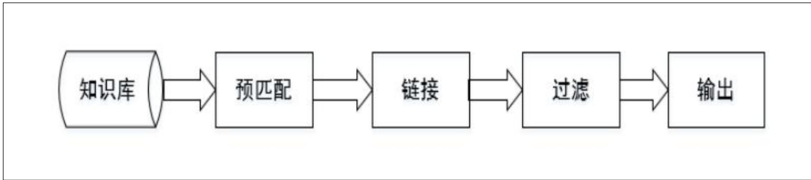

# 知识融合

---

## 考点1：知识融合概述

### 核心概念

**知识融合（Knowledge Fusion）** 是解决多个数据源之间知识冗余与冲突的关键技术，目的是消除冗余知识、消解逻辑冲突，最终得到一致可信的统一知识库。

> [!tip] 💡 白话解释
> 想象你有三本百科全书，同一人物在不同书中描述不一致——知识融合就是"合三为一"，消除矛盾、合并重复信息，最终得到一份可信的统一知识库。

### 冗余知识的几种形式

| 冗余类型 | 说明 | 示例 |
|---------|------|------|
| **重复事实** | 不同数据源描述了完全相同的三元组 | DBpedia 和 Wikidata 都有 `<北京, 首都, 中国>` |
| **等价实例** | 同一实体在不同数据集有不同的标识 | "Elvis" vs "Elvis Presley" vs "猫王" |
| **等价类 / 子类** | 不同本体中语义相同的类或子类 | `Person` ≡ `Human` |
| **等价属性 / 子属性** | 不同本体中语义相同的属性 | `hasName` ≡ `fullName` |
| **冲突事实** | 对同一实体给出矛盾描述 | 数据源A说"Elvis已婚"，数据源B说"Elvis单身" |

### 冗余知识引起逻辑冲突

多个数据源对同一实体描述不一致时，会引发逻辑冲突。例如：数据源A中标注Elvis为已婚，数据源B中标注Elvis为单身，则"Elvis是单身吗？"这一问题无法得到一致答案。

**知识融合的目标**就是统一实体、合并等价信息、消解冲突，使得每个问题有唯一可信的答案。

### 知识融合的主要任务

1. **统一实体**：识别不同数据集中指代同一现实对象的实体，合并等价实例

2. **合并等价类/子类、等价属性/子属性**：发现不同本体中语义等价的类和属性

3. **冲突消解**：处理事实冲突，选择最可信的信息

> [!example] **例题**
> **问题**：以下哪些属于知识融合需要处理的问题？
> A. 数据库表中某字段为空值
> B. 数据集A说"Elvis已婚"，数据集B说"Elvis单身"
> C. 数据集C用"Person"类表示人物，数据集D用"Human"类表示人物
> D. 对同一实体"Alice"在不同数据集中有不同ID
>
> **答案**：B、C、D
> - B是冲突事实的消解问题
> - C是等价类问题（Person ≡ Human）
> - D是等价实例问题（同一实体的不同标识）
> - A是数据质量问题（空值），不属于知识融合

> [!question]- 📖 答案与解析
>
> **判断题**：数据集A和数据集B都包含三元组 `<爱因斯坦, 出生于, 1879>`，这属于知识融合需要处理的冗余知识问题。请判断并说明原因。
>
> ✅ 正确。虽然两个三元组完全相同，但在大规模知识图谱中，需要识别这种重复三元组并进行合并，这也是知识融合中"消除冗余知识"的范畴。实际中需要通过实体对齐确认两个"爱因斯坦"指代同一实体，然后去重。

---

## 考点2：知识融合的基本技术流程

### 总体流程

### 第一步：数据预处理（归一化）

不同数据集对同一实体的描述方式往往不同，归一化处理是提高后续链接精确度的关键步骤。

| 预处理操作 | 说明 | 示例 |
|-----------|------|------|
| 大小写归一化 | 统一大小写 | "Beijing" → "beijing" |
| 缩写展开 | 将缩写还原为全称 | "NYC" → "New York City" |
| 去除停用词 | 去掉无意义的高频词 | "University of Beijing" → "University Beijing" |
| 同义词替换 | 统一同义表达 | "AI" → "人工智能" / "Artificial Intelligence" |

### 第二步：分块（Blocking）

> [!tip] 💡 白话解释
> 假设有 $n$ 个实体，暴力两两比较需要 $O(n^2)$ 次计算。分块就是先用简单规则（如"姓氏首字母相同"）把实体分成小块，只在块内比较，大幅减少计算量。

**核心思想**：从所有实体对中选出**潜在匹配对**作为候选项，将候选项的大小尽可能缩小，从而降低计算复杂度。

### 第三步：负载均衡（Load Balance）

- **目的**：保证各块中的实体数目相当，避免某些块过大导致计算瓶颈
- **方法**：多次 Map-Reduce 操作进行负载分配

### 第四步：记录链接（Record Linkage）

记录链接分两步进行：

> **Step 1：属性相似度计算**——对实体的每个属性分别计算相似度，得到一个属性相似度向量：
> $$[sim(a_1, b_1), sim(a_2, b_2), \dots, sim(a_n, b_n)]$$

> **Step 2：实体相似度计算**——根据属性相似度向量，聚合得到一个综合的实体相似度得分

### 第五步：结果评估与输出

| 评估指标 | 含义 |
|---------|------|
| **精确率（Precision）** | 正确匹配数 / 系统判定的匹配总数 |
| **召回率（Recall）** | 正确匹配数 / 实际匹配总数 |
| **F1值** | 精确率和召回率的调和平均 |

> [!example] **例题**
> **问题**：在一个实体对齐任务中，系统共判定了 200 对实体为匹配，其中 150 对确实是同一实体（True Positive），而实际共有 180 对匹配实体。求精确率、召回率和 F1 值。
>
> **解答**：
> - 精确率 $P = \frac{150}{200} = 0.75$
> - 召回率 $R = \frac{150}{180} \approx 0.833$
> - $F1 = \frac{2 \times 0.75 \times 0.833}{0.75 + 0.833} \approx 0.789$

> [!question]- 📖 答案与解析
>
> **简答题**：为什么知识融合流程中需要"分块"步骤？如果直接对所有实体进行两两比较，会有什么问题？
>
> - **原因**：直接两两比较的复杂度为 $O(n^2)$，当实体数量达到百万级时，计算不可行。
> - **分块的作用**：通过简单的规则（如姓氏首字母、实体类型等）将实体分成若干块，只在同块内的实体之间进行比较，将搜索空间从全局缩小到局部。
> - **注意**：分块策略会影响最终结果——分块太粗可能遗漏匹配对（降低召回率），分块太细则计算量仍然很大（降低效率）。

---

## 考点3：本体对齐（Ontology Alignment）

### 什么是本体对齐

**本体对齐**是指发现两个或多个本体中**语义等价的类、属性和关系**的过程。

- **类对齐**：`Person`（本体A）≡ `Human`（本体B）
- **属性对齐**：`hasName`（本体A）≡ `fullName`（本体B）
- **关系对齐**：`worksAt`（本体A）≡ `employedBy`（本体B）

### 属性相似度计算方法

#### 1. 编辑距离（Edit Distance）

> [!tip] 💡 记忆口诀
> "改几个字就一样"——编辑距离就是把一个字符串变成另一个，最少需要多少次操作（插入、删除、替换）。

| 算法 | 特点 |
|------|------|
| **Levenshtein 距离** | 只允许插入、删除、替换三种操作，每次操作代价为 1 |
| **Wagner-Fisher** | Levenshtein 的动态规划实现版本 |
| **带仿射间隙的编辑距离（Affine Gaps）** | 允许连续操作有折扣（如连续删除算一次代价），更符合实际 |

#### 2. 集合相似度

当属性值是**集合**（如标签集合、关键词列表）时使用：

$$\text{Jaccard}(x, y) = \frac{|x \cap y|}{|x \cup y|}$$

$$\text{Dice}(x, y) = \frac{2 \times |x \cap y|}{|x| + |y|}$$

> [!tip] 💡 白话解释
> - **Jaccard**：交集 ÷ 并集 → "两个集合有多大比例是重叠的？"
> - **Dice**：2×交集 ÷ 总数 → "两个集合的重叠程度有多高？"
> - Jaccard 更严格（分母大），Dice 更宽松

#### 3. 向量相似度

当属性值可以表示为**向量**时使用：

| 方法 | 说明 |
|------|------|
| **Cosine 相似度** | 计算两个向量夹角的余弦值，值域 $[-1, 1]$，越接近 1 越相似 |
| **TF-IDF 相似度** | 先用 TF-IDF 将文本转为向量，再计算余弦相似度 |

$$\text{Cosine}(x, y) = \frac{x \cdot y}{\|x\| \times \|y\|}$$

### 本体划分策略（概念间的结构亲近性计算）

| 划分依据 | 说明 | 示例 |
|---------|------|------|
| **类的层次关系** | 按父子类层次组织 | `动物 → 哺乳动物 → 猫` |
| **公共父类** | 有共同祖先的类放在一起比较 | `猫` 和 `狗` 共享父类 `哺乳动物` |
| **属性层次关系、定义域** | 按属性的适用范围分组 | `hasName` 属性的定义域是 `Person`，就只在 `Person` 类间比较 |

### 工具：Falcon-AO

| 特性 | 说明 |
|------|------|
| **开发者** | 南京大学胡伟团队 |
| **功能** | 自动的本体匹配系统 |
| **支持格式** | RDF(S)、OWL |
| **编程语言** | Java |
| **核心方法** | 基于多种相似度度量的组合，自动发现等价类和等价属性 |
| **主页** | http://ws.nju.edu.cn/falcon-ao/ |

> [!example] **例题**
> **问题**：本体A中有标签集合 $X = \{\text{AI, ML, NLP}\}$，本体B中有标签集合 $Y = \{\text{ML, DL, NLP}\}$。分别用 Jaccard 和 Dice 系数计算相似度。
>
> **解答**：
> - $X \cap Y = \{\text{ML, NLP}\}$，$|X \cap Y| = 2$
> - $X \cup Y = \{\text{AI, ML, NLP, DL}\}$，$|X \cup Y| = 4$
> - $|X| = 3$，$|Y| = 3$
>
> $$\text{Jaccard} = \frac{2}{4} = 0.5$$
>
> $$\text{Dice} = \frac{2 \times 2}{3 + 3} = \frac{4}{6} \approx 0.667$$
>
> Dice 系数比 Jaccard 更宽松（0.667 > 0.5）。

> [!question]- 📖 答案与解析
>
> **对比分析题**：编辑距离和 Jaccard 系数分别适用于什么类型的属性？请各举一例说明，并解释为什么不能将编辑距离用于集合类型属性的相似度计算。
>
> - **编辑距离**适用于**字符串类型**的属性（如实体名称）。例如计算 "Beijing" 和 "Peking" 的相似度。
> - **Jaccard 系数**适用于**集合类型**的属性（如标签集、关键词集）。例如计算两个实体的标签集合重叠度。
> - **不能混用的原因**：编辑距离是基于字符位置的操作计数，将集合转为字符串后会引入顺序信息（如 {A,B} 和 {B,A} 被视为不同），丢失了集合的"无序性"语义。

---

## 考点4：实体匹配（Entity Matching）

### 概述

实体匹配是知识融合的核心步骤，目的是判断两个来自不同数据集的实体是否指代同一现实对象。假设实体的记录为 $a$ 和 $b$，$a_i$ 和 $b_i$ 表示在第 $i$ 个属性上的取值，则通过属性相似度 → 实体相似度两步完成匹配。

### 方法一：聚合方法（Aggregation）

> [!tip] 💡 白话解释
> 聚合方法就像"民主投票"：每个属性算出一个相似度分数，然后把所有分数按权重加起来，超过阈值就算匹配。

| 聚合方式 | 说明 |
|---------|------|
| **加权平均** | 为每个属性分配权重，计算加权相似度 |
| **手工规则** | 人工设定规则（如"名称相似度 > 0.8 且 类型相同 → 匹配"） |
| **分类器** | 用机器学习模型（SVM、决策树等）学习匹配函数 |

**聚合方法的挑战与解决方案**：

| 挑战 | 说明 | 解决方案 |
|------|------|---------|
| 训练集生成 | 标注匹配对成本高 | **无监督/半监督**方法（如 EM 算法）、生成模型 |
| 分类不均衡 | 不匹配记录对远多于匹配记录对 | **主动学习（Active Learning）**、**众包（Crowdsourcing）** |
| 误分类代价高 | 错误匹配影响下游任务 | 人工验证、众包 |

### 方法二：聚类方法（Clustering）

> [!tip] 💡 白话解释
> 聚类方法就像"物以类聚"：把相似的实体自动聚成一团，同一团内的实体就是匹配的。

| 聚类算法 | 说明 | 特点 |
|---------|------|------|
| **层次聚类** | 逐层合并/分裂，形成树状结构 | 可控但复杂度高 |
| **相关性聚类** | 最小化冲突边数 | 理论优美，适合图结构 |
| **Canopy + K-means** | 两阶段：先 Canopy 粗分，再 K-means 细分 | 兼顾效率和效果 |

> [!tip] 💡 Canopy + K-means 详解
> 1. **Canopy 阶段**：用快速但粗略的相似度（如 TF-IDF + 余弦）将实体分成若干个"canopy"（canopy 之间可以重叠，但每个对象至少属于一个 canopy），作为数据预处理
> 2. **K-means 阶段**：在各个 canopy 内部使用 K-means 进行精细聚类，不属于同一 canopy 的对象之间不进行相似性计算
> - **优势**：避免了 K-means 需要预先指定 $K$ 值的问题，大幅降低计算量

### 方法三：表示学习（Representation Learning）

> [!tip] 💡 白话解释
> 将知识图谱中的实体和关系都映射到低维空间向量，直接用数学表达式来计算各个实体之间的相似度——不依赖任何文本信息，获取的是数据的深度特征。

**TransE 模型**：经典的知识图谱表示学习方法

$$\mathbf{h} + \mathbf{r} \approx \mathbf{t}$$

即：**头实体向量 + 关系向量 ≈ 尾实体向量**

> [!tip] 💡 TransE 直观理解
> 经典示例：$\text{KINGS} - \text{QUEENS} = \text{KING} - \text{QUEEN}$
>
> **解读**：
> - 考虑两对实体之间存在某个相同的关系，关系向量 $\mathbf{r}$ 表示为头向量 $\mathbf{h}$ 和尾向量 $\mathbf{t}$ 之间的位移
> - `KING` → `KINGS` 的变化（单复数关系）≈ `QUEEN` → `QUEENS` 的变化
> - TransE 通过向量运算捕捉了这种语义关系
> - 实体匹配时：如果两个实体在向量空间中的距离很近，很可能指代同一对象

### 实体匹配工具对比

| 工具 | 核心特点 | 优势 | 局限 |
|------|---------|------|------|
| **Dedupe** | Python 模糊匹配、记录去重和实体解析库 | 主动学习降低用户标注量；API 简洁易用 | 属性数量限制（通常 10-20 个） |
| **Silk** | 提供 Silk-LSL 语言 + Silk Workbench 图形化界面 | 可视化配置记录链接流程，支持复杂规则 | 需要学习 LSL 特定语言 |
| **Falcon-AO** | 自动本体匹配系统 | 支持 RDF(S) 和 OWL | 主要针对本体层的对齐，非实例级匹配 |

**Silk 系统整体框架**：
1. **预处理**：使用 Xapian 搜索引擎索引库，将索引结果排名前 N 的记录作为候选对（可能损失精度）
2. **相似度计算**：使用 Febrl（生物记录链接库）提供的多种相似度计算方法
3. **过滤**：过滤掉相似度小于给定阈值的记录对

> [!example] **例题**
> **问题**：某电商公司需要合并两个商品数据库中的商品记录（共500万条）。商品属性包括：商品名、价格、品牌、描述文本。请推荐合适的实体匹配方法组合，并说明理由。
>
> **答案**：
> 1. **分块**：先按"品牌"分块，缩小比较范围
> 2. **属性相似度**：
>    - 商品名：用**编辑距离**（字符串匹配）
>    - 价格：用**数值差异比**
>    - 品牌：用**精确匹配**
>    - 描述文本：用 **TF-IDF + Cosine**（向量相似度）
> 3. **聚合**：用**分类器**（如随机森林）综合各属性相似度
> 4. **工具选择**：数据量大且属性多，建议用 **Silk**（支持复杂规则和可视化调试）

> [!question]- 📖 答案与解析
>
> **方法选择题**：在以下场景中，分别最适合使用哪种实体匹配方法？简述理由。
> A. 两个小规模数据集（各1000条记录），属性简单，有少量标注数据
> B. 超大规模知识图谱（1亿实体），需要全自动化处理
> C. 数据中存在大量噪声和缺失值，需要人工参与验证
>
> - **A**：**聚合方法（分类器）**。数据量小，可以训练分类器；有标注数据可以直接使用。
> - **B**：**表示学习（TransE 等）+ Canopy + K-means 聚类**。表示学习可以高效处理大规模实体，Canopy + K-means 免去指定聚类数的需要。
> - **C**：**主动学习 + 众包**。主动学习选择最有信息量的样本进行标注，众包可以让人工验证不确定的匹配对，两者结合降低标注成本的同时保证质量。

---

## 知识融合方法总结对比

| 维度 | 聚合方法 | 聚类方法 | 表示学习 |
|------|---------|---------|---------|
| **核心思想** | 属性分数加权/分类 | 实体自动分组 | 低维空间表示 + 距离计算 |
| **是否需要标注** | 需要（分类器）/ 不需要（加权） | 不需要 | 不需要 |
| **处理规模** | 中小规模 | 中大规模 | 大规模 |
| **可解释性** | 高（规则/特征明确） | 中 | 低（向量空间） |
| **典型工具** | Dedupe, Silk | Canopy + K-means | TransE, DistMult |
| **适用场景** | 结构化数据、属性丰富 | 无监督场景 | 大规模知识图谱 |
