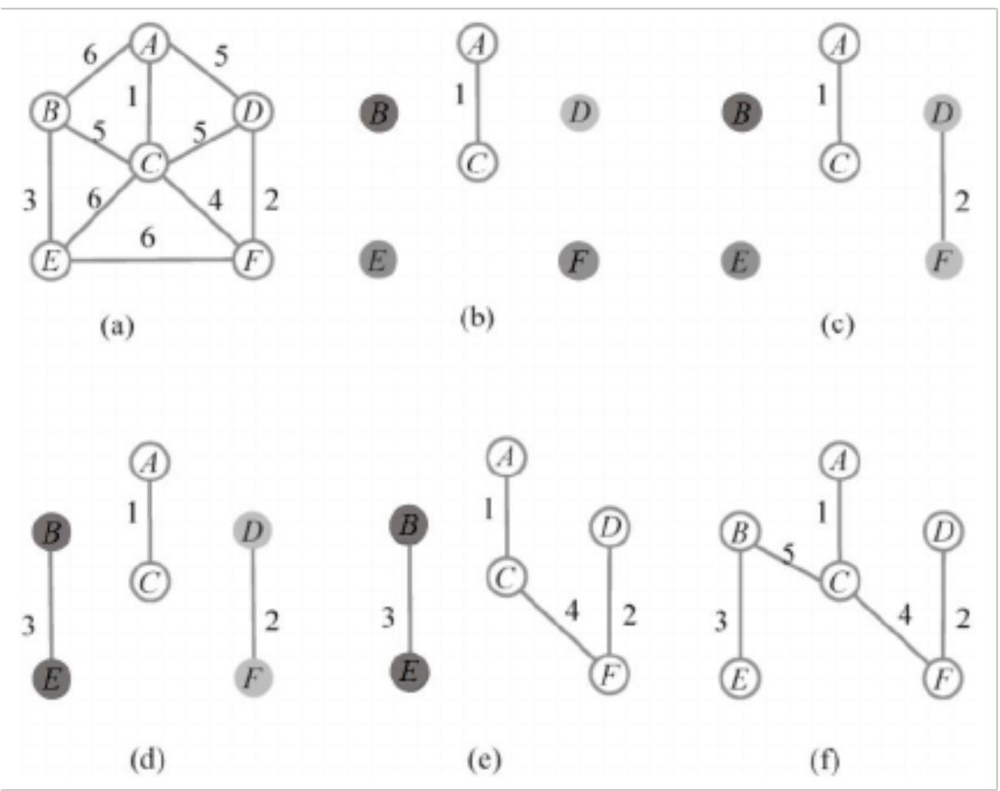

第 1 章 概述

一、选择题

1.C 2.C 3.B 4.B 5.B

## 二、填空题

1. 先验知识，后验知识

2. 知识库，推理引擎

3. 前向推理，后向推理

## 三、简答题

1.在知识工程中，声明性知识和过程性知识各有什么作用？并举例说明它们在医疗诊断系统中的应用。

答：在知识工程中，声明性知识和过程性知识各自扮演着不同的角色。

（1）声明性知识主要用来构建知识库，它描述的是事物的状态、属性和关系等事实性信息。这些知识使得系统能够通过查询这些事实来回答问题或进行决策支持。在医疗诊断系统中，声明性知识可以用来存储各种疾病的症状、可能的病因、治疗方法以及相关的医学知识等。

（2）过程性知识则通过规则或算法来实现特定的操作或功能，它使系统能够自动执行复杂的任务。在医疗诊断系统中，过程性知识可以用来实现如何根据患者的症状来选择合适的诊断方法、如何根据诊断结果来确定治疗方案等。这些过程性知识通常基于医学专家的经验和实践，通过规则或算法的形式来指导系统的操作。

因此，有效的知识工程解决方案需要合理地结合和利用这两种知识，以提高系统的性能和适应性。在医疗诊断系统中，通过结合声明性知识和过程性知识，系统可以更准确地诊断疾病并提供合适的治疗方案。

2.请简述公理体系在数学和逻辑学中的作用，并解释公理的特点。

答：在数学和逻辑学中，公理体系是一种基本构成方式，用于构建理论系统。它的作用主要体现在以下几个方面：

（1）提供自洽的逻辑框架：公理体系通过定义一组基本公理，形成了一个自洽的逻辑框架。在这个框架内，所有的定理和结论都应能通过逻辑推演自这些公理导出，从而确保了整个理论系统的一致性和自洽性。

（2）作为推导的起点：公理是在给定理论中被默认为真实的基本陈述，它们无需证明，被用作推导所有其他定理（即该理论中的其他真理）的起点。这使得理论系统能够在这些基本公理的基础上，通过逻辑推理和演绎，得出更加复杂和深入的结论。

公理的特点主要体现在以下几个方面：

(1)一致性：公理体系应当内部一致，即公理之间不应有逻辑上的矛盾。

(2)完备性：公理体系应尽可能覆盖其所描述的理论的所有方面，使得所有真实的命题都能从公理中推导出来。

(3)独立性：理想中，公理体系中的任何一个公理都不能由其他公理推导出来，即公理之间

应相互独立。

综上所述，公理体系在数学和逻辑学中起到了至关重要的作用，它为我们提供了一种构建自洽、一致和可推导的理论系统的方法。同时，公理的清晰性、简洁性和不相矛盾性也是确保公理体系有效性和可靠性的重要保障。

3.请简要解释DIKW体系，并说明它如何体现知识、智慧与智能之间的关系。

答：DIKW 体系是一个从数据（Data）到智慧（Wisdom）的转化过程，展现了知识、智慧与智能三者之间的紧密联系。具体解释如下：

(1) 数据（Data）：这是事实的原始记录，是未经加工的基本元素，如数字、字符和图像等，它们通常是量化的观察结果。

(2) 信息（Information）：信息是对数据的处理和组织，赋予其特定的意义和上下文。它是数据经过整理、分类后形成的有结构的输出，提供了关于数据的解释和背景。

(3) 知识（Knowledge）：知识是对信息的进一步深化，涉及模式、关联和因果关系的理解。它不仅仅是对信息的简单积累，而是对信息之间关系的深入洞察。

(4) 智慧（Wisdom）：智慧是知识的最高层次，它涉及对知识的深刻理解、评估和应用，以有效解决新问题和做出判断。智慧体现了对知识的综合运用和创新能力，是智能的高级表现形式。

DIKW 体系体现了从数据到智慧的提升过程中，智能不仅仅是数据处理的能力，更是对知识的理解与应用，以及在此基础上展现出的决策和解决问题的智慧。每一层次的提升，都需要前一层次的支持和完善。因此，DIKW 体系不仅揭示了知识、智慧与智能之间的递进关系，还强调了它们在人类社会中的重要作用。

4.请简述人工智能领域中“感知智能”与“认知智能”的区别，并说明知识在人工智能向认知智能演进中的作用。

答：在人工智能领域中，“感知智能”与“认知智能”的区别主要体现在智能层次和所依赖的技术及应用上。

（1）感知智能：

① 关注于使机器能够通过传感器和数据输入模拟人类的感官，如视觉和听觉，以识别和处理周围环境的信息。

② 主要依赖模式识别和机器学习技术来解析传入的数据。

③ 通常缺乏深度理解和处理复杂情境的能力，主要停留在数据识别和初步处理的层面。

（2）认知智能：

① 涉及更高阶的思维功能，如语言理解、逻辑推理、规划、学习、问题解决与决策。

② 需要更加丰富和复杂的知识结构，以支持对数据的深度理解和复杂情境的处理。

③ 使人工智能系统不仅能“看”和“听”，更能“思考”和“理解”，从而更接近人类的认知水平。知识在人工智能向认知智能演进中扮演着至关重要的角色。它不仅是连接感知和认知的桥梁，使机器能够从简单的数据识别上升到对数据和情境的深度理解，还是推动人工智能从简单的数据处理发展到能进行理解思考和复杂决策的关键因素。通过积累和应用知识，人工智能系统能够更好地模拟人类的认知过程，实现更高层次的智能。

5.简述知识图谱的关键技术及其作用。

答：知识图谱的关键技术包括知识图谱表示、构建、管理、推理和问答。知识图谱表示通过图数据结构和向量表示，为知识图谱的构建和应用提供基础。构建技术从各种数据源中提取数据并转化为知识图谱所需的结构，确保知识的一致性和准确性。管理技术则负责图谱数据的存储、查询、优化以及版本控制，保障知识图谱的可持续使用和扩展。推理技术利用逻辑规则或统计模型发现未显式表示的信息，拓展知识图谱的边界。问答技术允许用户通过自然语言查询知识图谱，使非专业用户也能方便地检索知识。这些关键技术共同支持了知识图谱的高效构建、管理和应用，推动了人工智能领域的快速发展。

## 第 2 章 知识表示

## 一、选择题

1.D 2.B 3.C 4.B 5.B

二、填空题

1.语义网络

2.概念、属性、个体

3.主语、谓语、宾语

4.OWL

5.霍恩

## 三、简答题

1.符号逻辑知识表示与向量化知识表示方法的主要区别是什么？

答案： 符号逻辑知识表示使用离散的符号来明确表示知识及其关系，具备较高的可解释性，但在处理不确定性时存在不足；向量化知识表示则通过将知识映射到连续的向量空间，利用统计或神经网络方法进行推理，可以捕获隐含的关系，但缺乏符号逻辑的直观解释性。

2.描述逻辑在知识表示中的作用是什么？

答案： 描述逻辑为知识表示提供了一个严谨的框架，能够支持复杂的推理任务。它平衡了表达能力和推理的计算复杂度，常用于本体论建模，并且是OWL等本体语言的理论基础。

3.使用语义网络进行知识表示有哪些不足？

答案： 语义网络缺乏统一的形式化语义，导致在推理时可能产生歧义，特别是在处理复杂的逻辑关系时。此外，不同的表示方式可能增加解析和推理的复杂性，难以保证推理结果的正确性。

4.框架理论中的“槽”和“侧面”分别表示什么？

答案： 框架中的“槽”用于表示对象的属性，而“侧面”表示属性的不同方面。通过这些结构，框架能够全面地描述对象的特性。

5.向量化的知识表示有哪些优势？

答案： 向量化知识表示可以通过数据的统计特性捕获隐含的知识关系，利用机器学习方法进行推理。同时，向量化表示更适合处理不完备或噪声数据，且能够与深度学习模型结合进行推理。

## 第 3章 基于符号的知识推理

## 一、选择题

1.D 2.C 3.C 4.D 5.C 6.C 7.C 8.D 9.B 10.D

## 二、填空题

1.已有知识，未知知识

2.演绎推理，归纳推理

3.基于演绎的知识推理，基于归纳的知识推理

4.OWL Lite，OWL DL，OWL Full

5.Tableaux

6.专家系统

7.常量，变量，谓词

8.SWRL

9.条件，动作

10.路径

## 三、简答题

1. 请简述演绎推理和归纳推理的区别，并举例说明。

答：演绎推理与归纳推理的区别：

前提与结论的关系: 演绎推理是从一般性前提到个别性结论的推理，结论蕴含在前提中；归纳推理是从个别性事实到一般性结论的推理，结论超越了前提所包含的信息。

结论的确定性: 演绎推理的结论是必然的，只要前提为真，结论就一定为真；归纳推理的结论是或然的，即使前提为真，结论也可能不成立。

举例说明:

演绎推理: 所有金属都能导电，铜是金属，所以铜能导电。

归纳推理: 我观察到很多天鹅都是白色的，所以所有天鹅都是白色的。（该结论不一定成立，因为存在黑天鹅）

2.请简述知识图谱推理的任务，并说明推理在知识图谱生命周期中扮演的角色。

答案：知识图谱推理的任务:

知识图谱补全: 预测实体之间缺失的关系，或预测实体缺失的属性。

不一致性检测: 检测知识图谱中存在的矛盾或错误信息。

查询扩展: 根据用户的查询意图，扩展查询语句，以获得更全面的答案。

推理在知识图谱生命周期中扮演的角色:

在知识图谱的 构建阶段，推理可以用于知识提取、知识融合和知识校验。

在知识图谱的 应用阶段，推理可以用于语义搜索、问答系统、推荐系统等。

3.什么是本体？请简述本体推理的常见任务和方法。

答：本体的定义: 本体是对特定领域中概念、属性和关系的显示规约，它提供了一种共享词汇表，用于描述和表示该领域中的知识。

本体推理的常见任务:

概念包含: 判断概念之间是否存在子类关系。

概念互斥: 判断两个概念是否不相交。

概念可满足: 判断一个概念是否存在实例。

实例测试: 判断一个个体是否属于某个概念。

本体推理的方法:

基于 Tableaux 的推理方法

基于逻辑编程的推理方法

基于查询重写的方法

4.什么是 Datalog？请简述 Datalog 的语法和语义，并说明如何使用 Datalog 进行知识图谱推理。

答：Datalog 的定义: Datalog 是一种面向知识库和数据库设计的逻辑语言，它具有声明式的语法和语义，可以用于表示和推理知识图谱中的规则。

Datalog 的语法:

常量: 用小写字母表示，例如 a, b, c。

变量: 用大写字母表示，例如 X, Y, Z。

谓词: 表示关系，例如 fatherOf(X, Y)。

规则: 由头部和体部组成，例如 hasChild(X, Y) :- hasSon(X, Y).

Datalog 的语义: Datalog 的语义通过结果集定义，一个结果集是 Datalog 程序可以推导出的所有原子的集合。

使用 Datalog 进行知识图谱推理: 可以将知识图谱中的三元组看作 Datalog 事实，然后定义 Datalog 规则，利用 Datalog 推理机进行推理。

5.请简述基于图结构与规则学习的知识图谱推理方法，并比较 PRA 和 AMIE 两种方法的优缺点。

答：基于图结构与规则学习的知识图谱推理方法: 这类方法利用知识图谱的图结构信息进行推理，通过学习实体之间的路径来预测它们之间可能存在的关系。

PRA 与 AMIE 的比较:

<table><tr><td>特征</td><td>PRA</td><td>AMIE</td></tr><tr><td>路径搜索</td><td>随机游走</td><td>穷举搜索</td></tr><tr><td>规则类型</td><td>封闭式规则</td><td>可以学习到非封闭式规则</td></tr><tr><td>效率</td><td>较高</td><td>较低</td></tr><tr><td>表达能力</td><td>较低</td><td>较高</td></tr></table>

6.请简述基于知识图谱嵌入与预训练的推理方法，并比较 TransE 和 DistMult 两种模型的优缺点。

答：基于知识图谱嵌入与预训练的推理方法: 这类方法将知识图谱中的实体和关系映射到低维向量空间中，通过向量计算来完成推理任务。

TransE 与 DistMult 的比较：

<table><tr><td>特征</td><td>TransE</td><td>DistMult</td></tr><tr><td>模型复杂度</td><td>简单</td><td>较复杂</td></tr><tr><td>表达能力</td><td>对复杂关系的表达能力有限</td><td>对关系的表达能力较强</td></tr><tr><td>计算效率</td><td>高</td><td>较高</td></tr><tr><td>可解释性</td><td>较低</td><td>较低</td></tr></table>

7.请简述基于本体表示学习的知识图谱推理方法，并说明其与基于三元组和图结构信息的推理方法相比有哪些优势。

答：基于本体表示学习的知识图谱推理方法: 这类方法将本体中的概念和属性也映射到低维向量空间中，从而可以利用向量计算来完成更复杂的推理任务，例如概念包含推理、概念互斥推理等。

优势：

更强的表达能力：可以表达更复杂的语义信息。

更高的推理效率：可以利用向量计算来加速推理过程。

8.请简述符号推理与向量推理的融合方法，并说明其优势。

答：符号推理与向量推理的融合方法：这类方法结合了符号推理的精确性和向量推理的效率，例如，可以在向量表示学习过程中加入逻辑规则作为约束，或者使用向量表示来加速符号推理过程。

优势:

更高的推理精度: 结合了两种方法的优点，可以提高推理的准确性。

更好的可解释性: 可以利用符号推理来解释向量推理的结果。

## 第 4章 基于向量的知识推理

## 一、选择题

1.D 2.B 3.B 4.C 5.C 6.C 7.B 8.B 9.B 10.C

## 二、填空题

1.预训练语言

2.图神经网络（GNN）

3.属性表示

4.SPARQL

5.响应速度

6.实体间的动态关系

7.概念层次

8.复杂拓扑结构

9.语义理解能力

10.没有训练样本

## 三、简答题

1.请简述如何利用图结构与规则学习进行知识图谱的推理，并给出一个实际应用场景。

答：在知识图谱中，基于图结构与规则学习的推理涉及从图数据中挖掘实体和关系的规则，例如，通过频繁模式挖掘技术提取出现概率高的实体关系模式。这些规则通常表达为如果-则形式的逻辑规则，用于推理新的或隐含的实体关系。应用场景之一是在金融风险评估中，通过分析客户之间的交易网络和关系模式，推理出潜在的高风险客户。

2.描述基于嵌入学习的知识图谱推理的基本原理及其在实际中的一个应用。

答：基于嵌入学习的知识图谱推理通过将图中的实体和关系映射到一个低维向量空间来进行。这些向量通过训练过程中的优化算法调整，以便能够在向量空间中准确地反映实体间的关系。在推荐系统中，可以利用商品和用户的嵌入向量通过计算其向量间的相似度，预测用户对未知商品的偏好。

3.比较符号推理与向量推理在知识图谱中的优缺点。

答：符号推理依赖于逻辑规则（如 Prolog 编程语言中的规则）和结构化表示，优点是高度可解释，但在处理大规模或不确定性数据时可能不够灵活。相对地，向量推理（如使用神经网络模型）依赖数学上的向量运算，优点在于可以高效地处理大规模数据集，并且对于模糊数据有更好的容错性，缺点是结果可能较难解释。符号推理适用于对可解释性有高要求的场景，而向量推理更适用于需要处理大数据量的复杂问题。

4.解释规则学习与嵌入学习融合模型的工作原理及其带来的好处。

答：规则学习与嵌入学习的融合模型结合了符号逻辑的可解释性和向量嵌入的计算效率。例如，在神经逻辑编程中，模型利用神经网络来学习和优化嵌入向量，同时使用逻辑规则来约束学习过程，从而保证学到的知识符合已知的逻辑规则。这种融合带来的好处是，模型不仅能高效处理大规模数据，还能提供逻辑推理的可解释路径，特别适用于医疗诊断和金融监管

等需要精确逻辑推理的领域。

## 第 5 章 知识获取

## 一、选择题

1.B 2.D 3.A 4.D 5.C

## 二、填空题

1．本体匹配 2. 概念之间的层次 3. Data模块 4. 相似度计算的时间复杂度 5. Module

## 三、简答题

1. 简要描述知识图谱的知识获取过程，并解释每个步骤的作用。答：

•信息抽取：从文本、数据库等多种数据源中提取实体、关系和属性。

(1) 实体识别与消歧：识别文本中的实体，并消除歧义确保实体的唯一性。

(2) 关系抽取：识别实体之间的关系。

(3) 属性抽取：识别实体的属性信息。

(4) 数据集成与融合：将不同数据源的信息整合到统一的知识图谱中，处理不一致性和冗余。

(5) 知识表示与存储：将知识图谱以特定格式进行存储（如RDF或 OWL）。

(6) 知识更新与演化：持续更新知识图谱，确保其时效性。

(7) 质量评估与控制：确保知识图谱的准确性和一致性。

2. 说明基于深度学习的流水线关系抽取方法与联合关系抽取方法的区别，并给出一个实际应用场景。

答：

(1) 流水线方法：将实体抽取与关系抽取分为两个独立过程，实体抽取的结果作为关系抽取的输入。适合于简单任务。

(2) 联合抽取方法：将实体抽取与关系抽取结合在同一个模型中共同优化，避免了流水线方法中的错误积累，适合于复杂任务。

(3) 应用场景：在法律文书中提取案件信息时，可以使用联合抽取方法来同时识别

案件的实体（如案件名、法院名）及案件之间的关系（如审判关系、被告关系）。3. 解释 HMM模型在实体识别中的应用，指出其优缺点。

(1) 应用：HMM在实体识别中通过基于观察序列的概率模型进行标注，假设每个词语的标签仅依赖于前一个词语的标签。

(2) 优点：模型简单，易于理解和实现，在标注数据较少时仍能取得一定效果。

(3) 缺点：对长距离依赖关系处理不佳，忽略了上下文的全局信息。

(4) 讨论远程监督方法的优缺点，并简要描述如何克服其中的噪声问题。

(5) 优点：减少了对人工标注数据的依赖，能够快速生成大量训练数据，增强了模型的跨领域适应能力。

(6) 缺点：噪声问题（错误标注）可能引入不准确的训练数据，导致语义漂移。

(7) 解决方法：通过多示例学习、注意力机制和强化学习等方法改进模型，减少噪声影响。

## 第 6章 知识存储与查询

## 一、选择题

1.B 2.B 3.C 4.B 5.C 6.B

## 二、填空题

1. 主语、谓语、宾语，节点、边和属性

## 2. SERVICE

解析：在 SPARQL 中使用 SERVICE { … } 进行联邦查询，将多个远程端点数据源的查询合并到一个 SPARQL 查询中。

3. reification

解析：RDF 中可通过“具体化”方法（reification）给某个三元组赋予一个空节点或新的 IRI，并在该空节点/IRI 上关联其他属性。

4. 冒号“:”

解析：在 Cypher 语法中对节点和边指定标签或类型时使用冒号，例如(v:Battle)，(p:Person)，(p)-[:COMMAND]->(b)。

## 5. 定长记录

解析：在 Neo4j 中，节点存储、关系存储均采用固定长度的记录结构，可根据节点或关系 ID直接计算所在文件的偏移量。

## 6. OPTIONAL

解析：SPARQL 语言使用 OPTIONAL { … } 作为可选匹配；与之类似，Cypher 语言则是“OPTIONAL MATCH”。

## 三、简答题

1．结合本章内容，简述RDF图与属性图在数据建模和关系属性表达方面的主要差异。

答：（1）RDF图以三元组为基本结构，用(s, p, o)三元组表示实体与实体、实体与属性值之间的关系；关系上的属性需使用reification 或空节点等方式表示。

（2）属性图直接在节点及边上附加属性，能够天然支持关系上的属性；且节点/边还可带有标签，便于分类和快速检索。

2．简要说明在RDF图中如何表示关系上的属性，并举例说明采用了哪种方法（或技术）来实现。

答：在 RDF 图中，如果想在主语—谓语—宾语这条边（关系）上再附加额外信息，需要使用“具体化”（reification）方法。例如，要为“毛泽东指挥四渡赤水”这条三元组添加“角色为战略指挥”属性，可先创建一个新资源 :t1，声明:t1 rdf:subject ex:maoZedong, rdf:predicateex:command, rdf:object ex:crossing，然后将 role 这一属性附加到 \_:t1 上。

3．Cypher 与 SPARQL 在查询中的“模式并集”功能分别使用了什么关键字？请分别举一个示例。

答：SPARQL 中使用 UNION 实现模式并集，比如：{ ?s a ex:Battle } UNION { ?s aex:Campaign }。

Cypher 中使用 UNION 关键字将多个 MATCH 查询的结果合并：

MATCH (b:Battle) RETURN b.name UNION MATCH (c:Campaign) RETURN c.name。

4．知识图谱数据库的核心组成部分有哪些，请分别简述其用途。

答：知识图谱数据库的核心组成部分，包括存储管理器、查询处理引擎和数据访问接口。存储管理器负责数据的持久化存储，通过优化的数据结构和索引机制，支持对大规模知识图谱数据的高效存取。查询处理引擎则处理用户的查询请求，生成查询执行计划，高效率执行查询算法，以提供精确的查询结果。数据访问接口为开发者提供与知识图谱数据库交互的手段，通过这些接口，用户可以方便地与数据库进行各类交互。知识图谱数据库是实现知识存储与查询的重要基础设施。

5．在属性图数据库 Neo4j 中，查询处理一般要经历哪些步骤？可结合“MATCH(p:Person)-[r:COMMAND]->(b:Battle {name: '四渡赤水'}) RETURN …”示例说明。

答：在 Neo4j 中一次查询处理的大致步骤包括：

(1) 解析：将 Cypher 查询解析为语法树；

(2) 优化：分析标签、属性索引，以及连接顺序等，生成最佳执行计划；

(3) 执行：根据执行计划，先使用索引定位起始节点或属性，再进行关系扩展（expand）或过滤，得到结果；

(4) 返回结果：将查询匹配的节点/关系或属性值返回给用户。

例如，“MATCH (p:Person)-[r:COMMAND]->(b:Battle {name:'四渡赤水'}) RETURN …”会先根据标签(:Battle)与属性(name='四渡赤水')索引锁定战役节点，再沿COMMAND边扩展到人物节点 p，最终返回所需的信息。

## 第 7章 知识分析与挖掘

## 一、选择题

1.D 2.C 3.D 4.A 5.D

## 二、简答题

1. 什么是随机网络模型？

答：随机网络模型是研究复杂网络的一种基本模型，用于模拟在无序条件下形成的网络结构。它的基本思想是节点之间的连接是随机的，而不是按照某种特定的规则或模式生成的。通过这种随机连接方式，随机网络模型能够解释一些实际网络中的传播和扩散现象。

2. 举例说明多维数据降维方法。

多维数据降维是指将高维数据映射到较低维度空间的过程，以减少计算复杂度、提高处理效率，同时保留数据中最有价值的信息。以下是几种常见的多维数据降维方法：

(1)主成分分析（PCA，Principal Component Analysis）

原理：PCA 是最常用的线性降维方法，它通过寻找数据中的主成分（即数据方差最大的方向）来对数据进行降维。PCA 试图将数据投影到一个新的坐标轴上，其中新坐标轴是原始数据特征的线性组合，按方差从大到小排序。选择前几个主成分，可以有效减少数据的维度。

 图像处理：将高维图像数据（例如像素矩阵）降低为低维表示，减少存储和计算量。

 数据预处理：在机器学习模型训练前，使用 PCA降低数据的维度，提高计算效率和模

型的稳定性。

示例：假设有一个包含多个特征（如不同颜色通道的 RGB 图像数据）的数据集，使用 PCA 可以将数据集投影到一个较低维度的空间，使得数据的方差最大化。

## 2. 线性判别分析（LDA，Linear Discriminant Analysis）

原理：LDA 是一种监督学习的降维方法，通常用于分类问题。与 PCA 不同，LDA 的目标不仅是保留数据的方差，还要考虑数据中类别信息，最大化类间方差与类内方差的比值，以便更好地区分不同类别的数据。LDA适用于已知类别标签的数据集。

 分类任务：LDA常用于模式识别、医学影像分析等领域。

 人脸识别：LDA可以通过降维来保留人脸图像中最具判别力的信息。

示例：对于一个包含不同类别（如猫、狗等）的图像数据集，LDA 通过寻找能够区分不同类别的低维空间，使得同类数据点聚集在一起，而不同类别的数据点则尽可能分开。

## 3. t-SNE（t-Distributed Stochastic Neighbor Embedding）

原理：t-SNE 是一种非线性降维方法，特别适合于高维数据的可视化。t-SNE 通过最小化高维空间和低维空间之间的概率分布差异来实现降维。它保持了数据点之间的局部结构，即相似的数据点在低维空间中会尽可能靠近。

应用：

 数据可视化：t-SNE 常用于将高维数据降维到二维或三维空间中，以便进行可视化。

 聚类分析：t-SNE 能够展示数据中潜在的聚类结构。

示例：在自然语言处理（NLP）中，使用 t-SNE 将词向量（高维）映射到二维空间后，可以直观地看到不同词语之间的语义相似度，比如“king”与“queen”在低维空间中可能距离较近。

## 4. 自编码器（Autoencoder）

原理：自编码器是一种神经网络模型，通过训练网络将输入数据映射到低维表示，再将其恢复回原始数据。自编码器由编码器（encoder）和解码器（decoder）组成，编码器将输入压缩成低维表示，解码器则重建原始数据。自编码器适用于非线性降维。

应用：

 图像降维：将高维图像数据压缩成低维表示，常用于图像生成、重建等任务。

 特征提取：在深度学习中，可以使用自编码器从高维数据中提取有效的低维特征。

示例：在图像压缩中，可以训练一个自编码器对图像进行编码，使得压缩后的低维表示仍能保持图像的重要特征，进而进行重建。

## 3. 试述 PageRank 算法的基本流程。

答：在步骤0 中：第一步，计算节点初始值=1/n(n为总的节点数)；第二步，计算链接值=节点值/该节点链出(Out-Link)的数量，例如0.17的边是因为最上面的节点有两个Out-Link。在步骤 1 中：第一步，继续计算节点值=链入(In-Link)的链接值之和；第二步，再继续计算链接值=节点值/该节点链出(Out-Link)的数量。重复上述步骤，迭代将继续进行，直到达到收敛、设置的解决方案范围或设置的迭代次数为止。

4. 举例说明什么是最小生成树算法。

答：以Kruskal算法为例介绍最小生成树的产生过程。首先选择代价最小的边(A,C)，并保证A、C 不在同一棵树上。继续选择代价最小的边(D,F)，并保证D、F不在同一棵树上。继续选择边(B,E)，并保证 B、E 不在同一棵树上。接下来选择代价最小的边(C,F)，然后合并 C，所在的子树为一棵子树。最后，选择代价最小的边(A,D)，但发现 A、D 已经在同一棵树上了，所以丢弃这条边。同样发现(C,D)边也需要丢弃，直到发现(B,C)边满足要求，最后形成最小生成树。

## 第 8章 知识检索与问答

## 一、选择题

1.C 2.C 3.B

## 二、填空题

## 1. 复杂查询匹配

解析：这是基于知识图谱的知识检索技术的三个主要部分，文中明确阐述。

## 2. 逻辑表达式生成

解析：基于语义解析的问答方法中，自然语言转化为逻辑表达式的过程里，资源映射和逻辑表达式生成是关键步骤，二者缺一不可。

## 三、简答题

1. 请简述基于分面的知识检索的优势以及高效分面搜索系统应具备的关键特性。

答案：基于分面的知识检索的优势在于：结构化的分类方式使得信息检索更加高效和精准，广泛应用于电子商务、数据库检索和知识管理等领域，提升了用户体验和信息检索效率。高效分面搜索系统应具备的关键特性包括：领域感知的分面组织，依据不同领域优化分面及值的设置；全面且无遗漏的分面浏览，确保用户能浏览所有分面值；动态分面和值的智能聚类，根据用户查询调整分面并聚类相似值；分面排序与隐藏机制，智能排序和隐藏不相关分面；以渐进式交互方式引导用户探索，提供可视化反馈并降低用户认知负荷。

解析：基于分面的知识检索的优势在文本中有明确阐述，而高效分面搜索系统的关键特性也是文中重点介绍的内容，需准确概括。

2. 对比基于模板的问答方法和基于端到端的问答方法的优缺点。

答案：基于模板的问答方法优点是高效性，能快速生成结构化查询，适合实时问答；可解释性高，便于调试和优化；在特定领域定制模板可获得较高准确率。缺点是模板覆盖度有限，难以涵盖所有自然语言问题；构建成本高，需大量领域知识和人力；灵活性不足，难以处理复杂或语义变化大的问题 。基于端到端的问答方法优点是采用端到端学习，自动学习复杂映射关系；语义理解能力强，能捕捉问题语义信息；适应性强，可处理开放域和复杂语义问题。缺点是数据需求高，依赖大量标注数据训练模型；可解释性差，决策过程难以解释；计算开销大，训练和推理需高计算资源。

解析：两种方法的优缺点在文中均有详细对比，需要分别总结提炼出关键信息进行作答。

## 第 9章 新一代知识工程

## 一、选择题

1.A 解析：传统知识工程难以表达不确定性、模糊性信息，A正确；对数据依赖大是神经网络的问题，B 错误；传统知识工程面临“知识获取瓶颈”，C 错误；传统知识工程具有可追踪、可解释的逻辑推理能力，D 错误。

2.A 解析：DrKIT 使用语料库作为虚拟的知识图谱，采用传统知识图谱上的搜索策略进行文本数据的遍历，A 正确；DrKIT 是神经符号结合的框架，并非用神经网络完全替代符号推理，B 错误；它遵循语料库中包含文本提及实体之间的关系路径，不是仅依赖单一信息，C错误；整个系统可使用基于梯度的方法从自然语言输入到输出答案进行训练，D错误。

3.C 解析：前融合方法是在预训练阶段，将知识以文本形式转换为模型的训练数据，让模型隐式吸收知识，C 正确；微调阶段注入知识的是后融合方法，A 错误；推理阶段和后训练阶段均不符合前融合的定义，B、D 错误。

## 二、填空题

## 1.可解释性

解析：文中明确提到神经符号结合在知识推理方面，符号系统的逻辑推理能力可使神经网络推理过程更透明，提升可解释性和逻辑可控性。

## 2. 子模块

解析：子模块范式的特点是以知识系统为核心，神经网络模块仅作为逻辑问题求解器的子程序，构成松耦合的混合系统。

## 三、简答题

1. 简述神经网络和符号知识工程结合的必要性。

答案：神经网络和符号知识工程结合很有必要，主要体现在：知识表示上，神经网络能捕捉多模态数据深层模式，符号系统以显性规则组织知识，二者结合可全面描述复杂知识，提升知识表达能力和模型适应性；知识获取方面，神经网络自动提取数据模式，符号系统将其显性化，减少人工编码依赖，提高知识获取效率，保证知识可解释和复用；知识推理方面，符号系统的逻辑推理能力可对神经网络特征进行规则化描述，克服神经网络“黑盒”问题，提升推理的可解释性和高阶逻辑推理能力。

解析：依据文本中关于神经符号结合在知识表示、获取和推理三方面的优势进行总结。

2. 对比符号知识注入大语言模型的前融合、后融合和混合融合方法。

答案：前融合方法在预训练阶段将知识以文本形式转化为训练数据，让模型隐式吸收知识，优势是知识深度融合，但难以随时更新；后融合方法在微调阶段针对特定任务检索知识，在推理时增强模型输出，优势是知识可更新，能灵活适应不同任务；混合融合方法结合前两者优点，在预训练阶段引入知识学习机制，微调阶段强化知识应用，可兼顾知识存储的深度与灵活性，最大化模型对知识的理解和应用能力。

解析：根据文本中对三种融合方法的定义、操作方式和优势进行对比阐述。