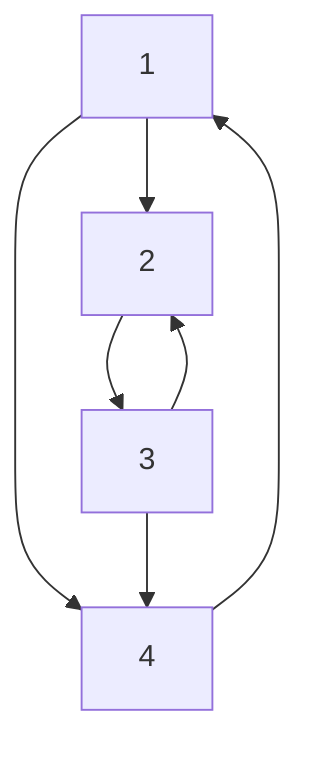
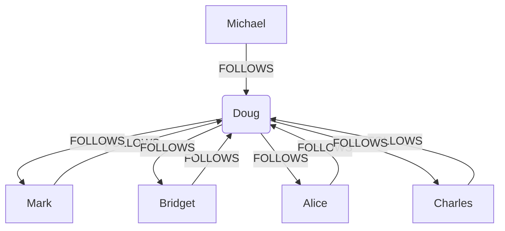
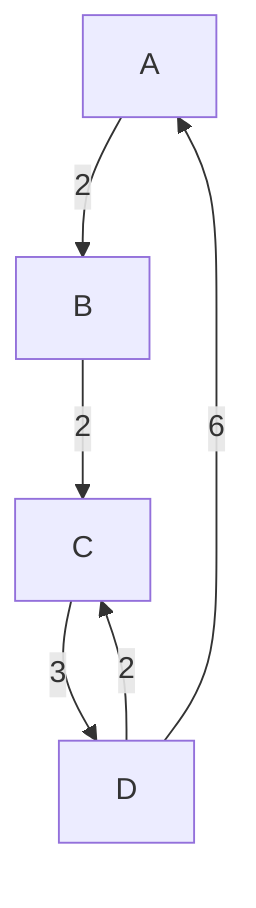
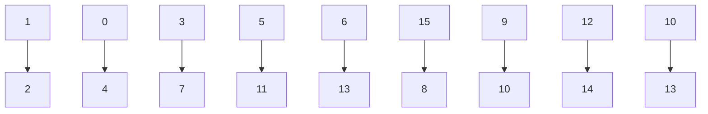
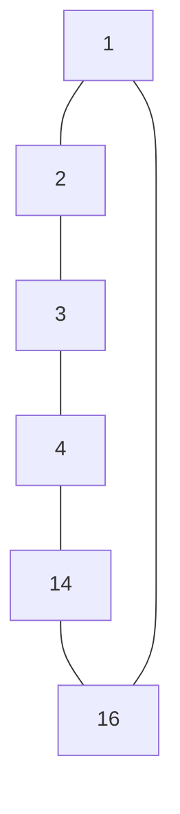
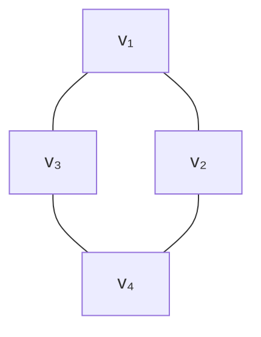

# 知识数据分析与挖掘

> 天津大学智能与计算学部人工智能学院 · 王鑫  
> wangx@tju.edu.cn

---

## 概述

**知识数据分析与挖掘**是指从知识数据中分析和挖掘出隐藏的、有价值的、更高层面的知识。

**知识图谱**是具有丰富语义的图结构数据，图数据分析和挖掘算法可以直接或经过适配用于知识图谱数据。

### 知识图谱数据分析

| 算法 | 用途 |
|------|------|
| 中心性（PageRank） | 衡量节点重要性 |
| 路径搜索（Dijkstra） | 最短路径计算 |
| 社区检测（Louvain） | 社区发现 |

### 知识图谱数据挖掘

| 算法 | 用途 |
|------|------|
| 相似性（KNN） | 节点相似度 |
| 节点嵌入（Node2Vec） | 图嵌入表示 |
| 知识图谱嵌入（TransE） | 知识图谱嵌入 |

---

## 中心性 Centrality

### 图数据的矩阵表示

**邻接矩阵（Adjacency Matrices）**：用 $n \times n$ 方阵 M 表示图

- $n = |V|$
- $M_{ij} = 1$ 表示从节点 i 到 j 有链接

|   | 1 | 2 | 3 | 4 |
|---|---|---|---|---|
| 1 | 0 | 1 | 0 | 1 |
| 2 | 1 | 0 | 1 | 1 |
| 3 | 1 | 0 | 0 | 0 |
| 4 | 1 | 0 | 1 | 0 |

对应的有向图：



### 中心性概念

中心性算法用来确定图中不同节点的重要性。常见使用案例：

- **推荐**：识别并推荐产品目录中最有影响力或最受欢迎的项目
- **供应链分析**：找到供应链中最关键的节点（如供应商、原材料、航线港口）
- **欺诈和异常检测**：寻找有许多共同标识符的用户，或在多个社区之间充当桥梁的用户

### 度中心性（Degree Centrality）

最普遍和最简单的中心性算法之一，计算一个节点拥有的关系数量。**外度中心性（Out-degree Centrality）** 即计算从一个节点发出的关系。

社交网络示例（FOLLOWS关系）：



| name | followers |
|------|-----------|
| Doug | 5.0 |
| Michael | 1.0 |
| Charles | 1.0 |
| Bridget | 1.0 |
| Mark | 0.0 |
| Alice | 0.0 |

### PageRank

适用于衡量**有向图**中节点影响力，由谷歌创始人 Larry Page 和 Sergey Brin 于 1996 年开发，用于搜索引擎结果中对网页进行排名。

PageRank 算法衡量图中每个节点的重要性，基于入链（incoming relationships）的数量和对应源节点的重要性。

$$ PR(x) = \alpha \left(\frac{1}{N}\right) + (1 - \alpha) \sum_{i=1}^{n} \frac{PR(t_i)}{C(t_i)} $$

其中：
- $C(t)$ 是节点 $t$ 的出度（out-degree）
- $\alpha$ 是随机跳转概率（random jumping factor）
- $N$ 是图中节点总数

#### Random Surfer 模型

1. 用户从随机网页开始
2. 用户随机点击链接，从一页冲浪到另一页
3. 每步抛硬币决定：
   - **Heads**：点击当前页面的随机链接
   - **Tails**：忽略链接，随机"跳转"到完全不同页面

PageRank 衡量的就是"页面被遇到的频率"——数学上是一个概率分布，表示随机游走到达特定节点的可能性。

#### 递推定义

给定页面 x，有入链 $t_1 ... t_n$：

- 随机冲浪者从 $t_i$ 到达 x 的概率为 $1/C(t_i)$
- $PR(t_i)$ 是冲浪者在 $t_i$ 的概率
- 从 $t_i$ 到达 x 的概率为 $PR(t_i)/C(t_i)$
- 汇总所有链接到 x 的页面贡献：$\sum_{i=1}^{n} \frac{PR(t_i)}{C(t_i)}$
- 考虑随机跳转：$1/N$ 的概率到达任意特定页面

$$ PR(x) = \alpha \left(\frac{1}{N}\right) + (1 - \alpha) \sum_{i=1}^{n} \frac{PR(t_i)}{C(t_i)} $$

PageRank 是递归定义的，通过迭代算法计算。

#### PageRank 迭代示例

**Iteration 1：**

初始各节点 PR 值均为 0.2。

| Node | Weight |
|------|--------|
| n₁ | 0.066 |
| n₂ | 0.166 |
| n₃ | 0.166 |
| n₄ | 0.3 |
| n₅ | 0.3 |

**Iteration 2：**

| Node | Value |
|------|-------|
| n₁ | 0.1 |
| n₂ | 0.133 |
| n₃ | 0.183 |
| n₄ | 0.2 |
| n₅ | 0.383 |

---

## 路径搜索 Path Finding

### Dijkstra 算法

Dijkstra 单源最短路径算法，由荷兰计算机科学家 Dijkstra 于 1959 年提出。采用**贪心策略**，每次遍历到始点距离最近且未访问过的顶点的邻接节点，直到扩展到终点为止。

- 计算一个**源节点**和一个**目标节点**之间的最短路径
- 支持加权关系，以便在比较路径时考虑距离或其他成本属性
- 计算源节点到所有可达节点的最短路径

**算法步骤：**

1. 每次从「未求出最短路径的点」中取出距离起点最小路径的点
2. 以这个点为桥梁，刷新「未求出最短路径的点」的距离

**图示（加权有向图）：**



### 其他路径搜索算法

**两个节点之间的最短路径：**

| 算法 | 描述 |
|------|------|
| A\* 算法（A\* Shortest Path） | Dijkstra 的扩展，使用启发式函数加快计算速度 |
| 颜氏算法（Yen's Algorithm） | Dijkstra 的扩展，允许找到前 k 条最短路径 |

**一个源节点与多个目标节点之间的最短路径：**

| 算法 | 描述 |
|------|------|
| Dijkstra 单源最短路径 | 一个源到多个目标的最短路径 |
| Delta-Stepping 单源最短路径 | 并行最短路径计算，速度更快但使用更多内存 |

**一般路径搜索：**

| 算法 | 描述 |
|------|------|
| 广度优先搜索（BFS） | 按与源节点距离增加的顺序搜索路径 |
| 深度优先搜索（DFS） | 沿单一多跳路径尽可能搜索 |

---

## 社区检测 Community Detection

社区检测算法用来评估节点组在图中的聚类或分区情况。

**常见用例：**

- **欺诈检测**：识别经常发生可疑交易的账户及共享标识符的欺诈团伙
- **客户画像**：将多个记录和互动区分为单一客户档案
- **市场细分**：根据优先级、行为、兴趣等将目标市场划分为子群体

### Louvain 算法

Louvain 算法对每个社区的**模块度**进行最大化。模块度度量了将节点分配给社区的质量——即一个节点在社区中联系的紧密程度比在随机网络中的联系紧密多少。

通过层次聚类递归地将社区合并在一起来实现模块优化。

**参数控制**：最大迭代次数、层级数量、收敛/停止条件的容忍度。

> Louvain 是一个随机算法，社区分配在重新运行时可能会有变化。

#### 模块度（Modularity）公式

模块度是评估社区网络划分好坏的度量方法，物理含义是社区内节点的连边数与随机情况下的边数之差。

$$ Q = \frac{1}{2m} \sum_{i, j} \left[ A_{ij} - \frac{k_i k_j}{2m} \right] \delta(c_i, c_j) $$

$$ Q = \sum_{c} \left[ \frac{\Sigma in}{2m} - \left(\frac{\Sigma tot}{2m}\right)^2 \right] $$

**符号说明：**

| 符号 | 含义 |
|------|------|
| $A_{ij}$ | 节点 i 和 j 之间边的权重 |
| $k_i = \sum_j A_{ij}$ | 所有与节点 i 相连的边的权重之和（度数） |
| $c_i$ | 节点 i 所属的社区 |
| $m = \frac{1}{2}\sum_{ij} A_{ij}$ | 所有边的权重之和（边的数目） |
| $\frac{k_i k_j}{2m}$ | 随机情况下节点 i 与 j 之间的边数量 |
| $\delta(c_i, c_j)$ | 若 $c_i$ 和 $c_j$ 在同一社区则为 1，否则为 0 |

**模块度增量公式：**

$$ \Delta Q = \left[ \frac{\sum_{in} + k_{i,in}}{2m} - \left(\frac{\sum_{tot} + k_i}{2m}\right)^2 \right] - \left[ \frac{\sum_{in}}{2m} - \left(\frac{\sum_{tot}}{2m}\right)^2 - \left(\frac{k_i}{2m}\right)^2 \right] $$

#### Louvain 算法步骤

Louvain 算法是一个**贪心算法**，核心思路是"不择手段地把图的模块化指数 Q 搞大"。

**第一步**：将图中每个节点都看作一个独立社区，尝试让某个节点加入邻居的社区，计算模块度增量 ΔQ，选择 ΔQ 最大的邻居社区加入。

**第二步**：在第一步的基础上，把划分出来的社区当成一个**超节点**（super node）看待。

- 超节点对应社区内部的边：权重求和，作为超节点自环的权重
- 超节点之间的社区间边：权重求和，作为超节点之间的边权重

**第三步**：如果算法已达到目标（如最大 ΔQ 小于某阈值）则结束；否则将超节点视为普通节点，回到第一步，进行下一轮循环。

**流程图解：**



**第二轮循环结果：**



#### 局部模块度增量计算

每次重新计算全局 ΔQ 成本太高，只需计算局部 ΔQ：

$$ \Delta Q(i \to C) = \left[ \frac{\sum_{in} + k_{i,in}}{2m} - \left(\frac{\sum_{tot} + k_i}{2m}\right)^2 \right] - \underbrace{\left[ \frac{\sum_{in}}{2m} - \left(\frac{\sum_{tot}}{2m}\right)^2 - \left(\frac{k_i}{2m}\right)^2 \right]}_{\text{Modularity of C}} $$

### 其他社区检测算法

| 算法 | 描述 |
|------|------|
| **标签传播（Label Propagation）** | 与 Louvain 相似，可并行，适合大型图 |
| **弱连接成分（WCC）** | 将图划分为连通节点集合，同一集合中任意节点可达任意其他节点 |
| **三角形计数（Triangle Count）** | 计算每个节点的三角形数量，检测社区凝聚力和图的稳定性 |
| **局部聚类系数（Local Clustering Coefficient）** | 计算每个节点的本地聚类系数，描述该节点与其相邻节点的聚集程度 |

---

## 相似性 Similarity

### 相似性算法

用来推断节点对之间的相似性。当根据用户指定的指标和阈值识别出类似的节点对时，画出一个具有相似性程度属性的关系。

**常见用例：**

- **欺诈检测**：分析新用户账户与标记账户的相似程度，发现潜在欺诈
- **推荐系统**：识别与用户正在浏览的商品相匹配的商品
- **实体解析**：根据图中的活动或识别信息，识别彼此相似的节点

### 两种主要的相似性算法

| 算法 | 描述 |
|------|------|
| **节点相似性** | 根据共享的相邻节点的相对比例确定节点之间的相似性 |
| **K 近邻算法（KNN）** | 基于节点属性确定相似性 |

- 节点相似性可选择 **Jaccard 相似度**和**重叠相似度**
- KNN 的度量选择由节点属性类型驱动

### k 最近邻图（k-Nearest Neighbor Graph）

- 一个节点与其 k 个距离最近邻居节点建立边
- 距离根据节点属性计算
- 初始时 k 个最近邻节点随机选取，经过多轮迭代计算
- 最近邻节点变化小于阈值时，算法停止

最近邻图（NNG）是一个有向图，定义在度量空间中的一组点（如平面上的欧几里得距离）。每个点作为一个顶点，从 p 到 q 的有向边表示 q 是 p 的最近邻（距离最小）。

### 相似度计算方法

根据节点属性值计算：

| 类型      | 公式                                                                                                                                                                                                            | 名称           |        |              |     |        |     |      |
| ------- | ------------------------------------------------------------------------------------------------------------------------------------------------------------------------------------------------------------- | ------------ | ------ | ------------ | --- | ------ | --- | ---- |
| 标量      | $\displaystyle \frac{1}{1 + \|p_s - p_t\|}$                                                                                                                                                                   | 标量距离         |        |              |     |        |     |      |
| 向量（整数）  | $\displaystyle J(p_s, p_t) = \frac{                                                                                                                                                                           | p_s \cap p_t | }{     | p_s \cup p_t | }$  | 杰卡德相似度 |     |      |
| 向量（整数）  | $\displaystyle O(p_s, p_t) = \frac{                                                                                                                                                                           | p_s \cap p_t | }{min( | p_s          | ,   | p_t    | )}$ | 重叠系数 |
| 向量（浮点数） | $\displaystyle \text{cosine}(p_s, p_t) = \frac{\sum_i p_s(i) \cdot p_t(i)}{\sqrt{\sum_i p_s(i)^2} \cdot \sqrt{\sum_i p_t(i)^2}}$                                                                              | 余弦相似性        |        |              |     |        |     |      |
| 向量（浮点数） | $\displaystyle \text{pearson}(p_s, p_t) = \frac{\sum_i (p_s(i) - \overline{p_s}) \cdot (p_t(i) - \overline{p_t})}{\sqrt{\sum_i (p_s(i) - \overline{p_s})^2} \cdot \sqrt{\sum_i (p_t(i) - \overline{p_t})^2}}$ | 皮尔逊相关度       |        |              |     |        |     |      |
| 向量（浮点数） | $\displaystyle ED(p_s, p_t) = \sqrt{\sum_i (p_s(i) - p_t(i))^2}$                                                                                                                                              | 欧几里德相似度      |        |              |     |        |     |      |

---

## 节点嵌入 Node Embedding

### 基本概念

**节点嵌入的目标**是计算节点的低维向量表示：

- 使向量之间的相似性（如点积）接近于原图中节点之间的相似性
- 这些向量也称为**嵌入**，对探索性数据分析、相似性测量和机器学习非常有用
- 在图中靠近的节点最终在嵌入空间中也会靠近
- 嵌入从图中获取结构（n 维邻接矩阵），将其近似为每个节点的低维向量

由于维度大大降低，嵌入向量在下游过程中使用效率更高：可用于聚类分析，或作为训练节点分类或链接预测模型的特征。

### 嵌入的维度与相似性

- 在现实问题中，节点嵌入通常远大于 2 维，最终可达到数百维甚至更大
- 节点嵌入不必严格基于图的接近程度来确定相似性，也可考虑节点属性和其他"全局视图"节点属性
- 最常用的是基于关系跳数和共同相邻节点的距离的相似性

### 应用场景

| 应用 | 描述 |
|------|------|
| **探索性数据分析（EDA）** | 更好地理解图形结构和潜在的节点集群 |
| **相似性测量** | 使用 KNN 在大型图中扩展相似性推断，适用于协同过滤、欺诈检测 |
| **机器学习特征** | 嵌入向量作为机器学习模型的特征（如用户购买关系图） |

### 节点嵌入算法：DeepWalk

DeepWalk 是**第一个**无监督学习节点嵌入的算法，核心思路是将图分析转化为**自然语言处理问题**：

1. 随机生成图节点序列（随机游走）
2. 对序列进行 **Word2Vec** 训练

**算法流程：**

1. 给定一个图，随机选择一个节点作为起始
2. 随机"步行"到邻居节点，直到节点序列长度达到最大值
3. 将节点和节点序列分别视为"单词"和"句子"
4. 利用 Word2Vec （Skip-Gram）算法训练得到每个节点的 embedding

| 模型 | 目标 | 输入 | 输出 |
|------|------|------|------|
| Word2Vec | 词 | 句子 | 词嵌入 |
| DeepWalk | 节点 | 节点序列 | 节点嵌入 |

#### DeepWalk 数学形式

对于一个以 $v_i$ 为中心、左右窗口为 $w$ 的随机游走序列：

$$ v_{i-w}, \dots, v_{i-1}, v_i, v_{i+1}, \dots, v_{i+m} $$

DeepWalk 利用 Skip-Gram 算法通过最大化 $v_i$ 同其他节点共现概率来优化模型：

$$ \Pr\left(\{v_{i-w}, \dots, v_{i+w}\} \setminus v_i \mid \Phi(v_i)\right) = \prod_{j=i-w, j \neq i}^{i+w} \Pr(v_j \mid \Phi(v_i)) $$

**优化方法**：随机梯度下降（SGD）+ 负采样（Negative Sampling）

#### DeepWalk 算法

```
Algorithm 1 DEEPWALK(G, w, d, γ, t)
Input: graph G(V, E), window size w, embedding size d,
       walks per vertex γ, walk length t
Output: matrix of vertex representations Φ ∈ ℝ^{|V|×d}

1: Initialization: Sample Φ from U^{|V|×d}
2: Build a binary Tree T from V
3: for i = 0 to γ do
4:     O = Shuffle(V)
5:     for each v_i ∈ O do
6:         W_{v_i} = RandomWalk(G, v_i, t)
7:         SkipGram(Φ, W_{v_i}, w)
8:     end for
9: end for
```

**Skip-Gram 算法：**

```
Algorithm 2 SkipGram(Φ, W_u, ω)
1: for each v_j ∈ W_{v_i} do
2:     for each u_k ∈ W_{v_i}[j-w : j+w] do
3:         J(Φ) = -log Pr(u_k | Φ(v_j))
4:         Φ = Φ - α * ∂J/∂Φ
5:     end for
6: end for
```

#### DeepWalk 的关键贡献

- 将 **Skip-Gram 模型**引入到图嵌入中
- DeepWalk 中的 RandomWalk 每次随机选择当前节点的一个邻接节点

随机游走序列在图中出现的频率服从**幂律分布**（幂律定律），与自然语言中词的分布类似。

### 节点嵌入算法：Node2Vec

Node2Vec 是 DeepWalk 的扩展，结合了 **DFS（深度优先）和 BFS（广度优先）** 的**有偏随机游走（Biased Random Walk）**。

#### 转移概率公式

假设当前随机游走经过边 $(t, v)$ 到达顶点 v，节点 v 和 x 之间的边权为 $w_{vx}$：

$$ P(c_i = x \mid c_{i-1} = v) = \begin{cases} \frac{\pi_{vx}}{Z}, & \text{if } (v, x) \in E \\ 0, & \text{otherwise} \end{cases} $$

其中 $\pi_{vx} = \alpha(t, x) \cdot w_{vx}$，Z 为归一化缩放因子。

$$ \alpha_{pq}(t, x) = \begin{cases} \frac{1}{p}, & \text{if } d_{tx} = 0 \\ 1, & \text{if } d_{tx} = 1 \\ \frac{1}{q}, & \text{if } d_{tx} = 2 \end{cases} $$

其中 $d_{tx}$ 表示当前节点 v 的邻居节点到节点 t 的最短距离。

**参数含义：**

| 参数 | 作用 |
|------|------|
| $p$ | 控制随机游走以多大概率"回头"（返回已访问节点） |
| $q$ | 控制随机游走偏向 DFS 还是 BFS |
| $q > 1$ | 倾向于 BFS（广度优先） |
| $q < 1$ | 倾向于 DFS（深度优先） |
| $p = q = 1$ | $\pi_{vx} = w_{vx}$，退化为 DeepWalk |

### 其他节点嵌入算法

| 算法 | 描述 |
|------|------|
| **Node2Vec** | 基于有偏随机游走的节点向量表示 |
| **GraphSage** | 归纳建模方法，利用节点属性和图结构计算节点嵌入 |
| **FastRP（快速随机投影）** | 利用概率抽样生成稀疏表示，极快计算嵌入，质量与随机游走和神经网络方法相当 |

---

## 图神经网络 GNN

### 规则结构 vs 不规则结构

| 数据类型 | 处理方式 |
|----------|----------|
| 图像（规则像素网格） | 2D CNN |
| 文本/语音（一维时间序列） | RNN |
| 社交网络、知识图谱、蛋白质互作网络、分子结构、引文网络 | **传统 CNN 失效** |

**核心问题**：传统神经网络无法直接处理任意拓扑结构的图数据！

### GCN 的基本定义

**输入：**
- 节点特征矩阵 $\mathbf{X} \in \mathbb{R}^{N \times D}$
- 图结构描述 $A \in \mathbb{R}^{N \times N}$

**输出：**
- 节点级：$Z \in \mathbb{R}^{N \times F}$（每个节点的新表示）

**典型任务：**
- 节点分类（论文主题分类）
- 链接预测（知识图谱补全）
- 图分类（分子性质预测）
- 图生成（分子设计）
- 社区发现（聚类）

### 每一层神经网络

$$ H^{(l+1)} = f(H^{(l)}, A) $$

其中 $H^{(0)} = X$（输入特征），$H^{(L)}$ 为最终输出。

**关键问题**：如何设计 $f(\cdot, \cdot)$？
- 能够聚合邻居节点的信息
- 参数共享（类似 CNN 的卷积核）
- 对节点编号的排列具有不变性

### 简单图卷积

$$ f(H^{(l)}, A) = \sigma(A H^{(l)} W^{(l)}) $$

含义：$A H^{(l)}$ 表示对每个节点，把它所有邻居的特征加起来。

**举例**（以节点 $V_3$ 为例）：设 $V_3$ 的邻居为 $V_1, V_2, V_4$，则：

$$ (A H)_3 = h_1 + h_2 + h_4 $$

### 问题 1：忽略了节点自身

**现象**：$A$ 的对角线为 0，节点 $v_i$ 只聚合了邻居，丢失了自己的信息。

**解决方法**：添加自环（self-loop）

$$ \hat{A} = A + I $$

| 对比 | 公式 |
|------|------|
| 原始 | $(A H)_i = \sum_{j \in \mathcal{N}(i)} h_j$ |
| 修正 | $(\hat{A} H)_i = h_i + \sum_{j \in \mathcal{N}(i)} h_j$ |

### 问题 2：尺度失衡

**现象**：度高的节点聚合后特征爆炸；度低的节点衰减。例如某节点度数为 100，聚合后数值被放大 100 倍！

**方法 1：行归一化（取平均）**

$$ D^{-1} A \to \text{等价于对邻居特征取平均} $$

**方法 2：对称归一化（更优）**

$$ D^{-\frac{1}{2}} A D^{-\frac{1}{2}} $$

**两种归一化对比：**

| 视角 | 行归一化 $D^{-1}A$ | 对称归一化 $D^{-1/2}AD^{-1/2}$ |
|------|---------------------|-------------------------------|
| 矩阵元素 | $\frac{A_{ij}}{D_{ii}}$ | $\frac{A_{ij}}{\sqrt{D_{ii}D_{jj}}}$ |
| 信息含义 | 仅看中心度数 | 同时看两端度数 |
| 对称性 | ✗ 不对称 | ✓ 对称 |
| 谱性质 | 特征值复杂 | 特征值 ∈ [−1, 1] |
| 解释 | 邻居均值 | 几何平均加权 |

**为何对称归一化更优？**
- 同时考虑节点自身和邻居的度数
- 保持矩阵对称性，便于谱分析
- 特征值被约束在 [-1, 1] 范围内

### GCN 最终传播规则

综合两个修正（自环 + 对称归一化），得到 Kipf & Welling (2017) 的传播规则：

$$ H^{(l+1)} = \sigma\left(\hat{D}^{-\frac{1}{2}} \hat{A} \hat{D}^{-\frac{1}{2}} H^{(l)} W^{(l)}\right) $$

**符号说明：**

| 符号 | 含义 |
|------|------|
| $\hat{A} = A + I$ | 自环后的邻接矩阵 |
| $\hat{D}$ | $\hat{A}$ 对应的度矩阵，$\hat{D}_{ii} = \sum_j \hat{A}_{ij}$ |
| $W^{(l)} \in \mathbb{R}^{D_l \times D_{l+1}}$ | 权重矩阵 |
| $\sigma(\cdot)$ | 非线性激活函数（如 ReLU） |

记 $\hat{A}_{\text{norm}} = \hat{D}^{-\frac{1}{2}} \hat{A} \hat{D}^{-\frac{1}{2}}$，可简写为：

$$ H^{(l+1)} = \sigma(\hat{A}_{\text{norm}} H^{(l)} W^{(l)}) $$

#### 向量形式：单节点视角

展开到单个节点 $v_i$：

$$ h_{v_i}^{(l+1)} = \sigma\left(\sum_{j \in \mathcal{N}(i) \cup \{i\}} \frac{1}{c_{ij}} h_{v_j}^{(l)} W^{(l)}\right) $$

其中归一化系数 $c_{ij} = \sqrt{\hat{D}_{ii}} \cdot \sqrt{\hat{D}_{jj}}$

#### 直观三步走

1. **聚合（Aggregate）**：收集每个邻居（含自身）的表示
2. **变换（Transform）**：乘以共享权重 $W^{(l)}$ 做线性变换
3. **激活（Activate）**：经非线性函数 $\sigma$

这就是**消息传递神经网络（MPNN）**的基本雏形！

### 手算一次 GCN 传播

**设定**：3 个节点，边为 (1-2), (2-3)

邻接矩阵：

$$ A = \begin{pmatrix} 0 & 1 & 0 \\ 1 & 0 & 1 \\ 0 & 1 & 0 \end{pmatrix} $$

加自环：

$$ \hat{A} = A + I = \begin{pmatrix} 1 & 1 & 0 \\ 1 & 1 & 1 \\ 0 & 1 & 1 \end{pmatrix} $$

度矩阵：$\hat{D} = \text{diag}(2, 3, 2)$

### Karate Club 实验

**数据集介绍**：
- 34 个成员（节点），78 条朋友关系（边）
- 真实历史：因冲突分裂为 2 派
- 扩展标注：4 个子社区

**实验设置**：
- 3 层 GCN
- 权重随机初始化（**不训练！**）
- 输入 X = I（无节点特征）
- 输出维度为 2，直接可视化

**关键发现**：即使不训练，GCN 也能捕获图的社区结构！

> ❓ 为什么随机权重也能得到有意义的嵌入？
>
> → GCN 可视为 **Weisfeiler-Lehman 算法**的可微分推广

**半监督学习实验**：
- 每个类别仅标注 1 个节点，预测所有节点的类别
- 300 次迭代后，GCN 成功将 4 个社区线性可分
- 即使标签极其稀疏，模型仍能很好泛化

**核心洞察**：
- 图结构本身就携带丰富的信息
- GCN 通过消息传递将稀疏标签信息扩散到整个图
- 相比 DeepWalk 等两阶段方法，GCN 是**端到端**的

### GCN 的后续发展脉络

| 年份 | 模型 | 贡献 |
|------|------|------|
| 2014 | Bruna et al. | 首次谱方法图卷积 |
| 2016 | Defferrard et al. | ChebNet |
| 2017 | Kipf & Welling | **GCN** |
| 2017 | GraphSAGE | 归纳式学习 |
| 2018 | GAT | 注意力机制 |
| 2019 | R-GCN | 关系图卷积 |
| 2020+ | 图 Transformer、等变 GNN… | 进一步演进 |

### GCN 在知识工程中的应用

| 应用 | 描述 |
|------|------|
| **知识图谱补全** | 实体嵌入、关系预测；扩展：R-GCN |
| **推荐系统** | 用户-物品二部图；典型：PinSage、LightGCN |
| **文本分类** | 文档-词语图；典型：TextGCN |
| **生物医学** | 药物相互作用预测、蛋白质功能标注 |
| **程序分析** | 抽象语法树、控制流图；代码漏洞检测 |

---

## GraphSAGE：大规模图的归纳式表示学习

Graph **S**ample and aggre**G**at**E**

### 为什么需要 GraphSAGE？

**从 GCN 的局限说起：**

| GCN 局限 | 说明 |
|----------|------|
| ✗ 直推式（Transductive） | 训练时需要看到完整图，新节点来了要重新训练 |
| ✗ 全图计算 | $D^{-1/2} A D^{-1/2} H$ 需要整个邻接矩阵，亿级节点图无法放入显存 |
| ✗ 静态图假设 | 现实中图是动态的（社交网络新用户、推荐系统新商品） |

**GraphSAGE 的目标：**

| 目标 | 说明 |
|------|------|
| ✓ 归纳式（Inductive） | 学"如何聚合邻居"的函数，而非每个节点的嵌入 |
| ✓ 小批量训练 | 只采样局部邻居，可扩展到亿级图 |
| ✓ 泛化到未见节点 | 新节点直接推理，无需重新训练 |

**场景示例**：节点 = 论文，边 = 引用关系，特征 = 文本 TF-IDF 向量。
- 想预测一篇**新发表论文**的研究领域
- GCN：必须把新论文加入图中，重新训练整个网络
- **GraphSAGE**：看它引用了哪些已知论文，把这些论文的表示聚合一下 → 立刻得到新论文的表示

**问题转化**：从"学习每个节点的嵌入向量 $z_u$" → "学习一个邻居聚合函数 $f_\theta$"。

一旦学到 $f_\theta$，对新节点 $v_{\text{new}}$：

$$ z_{v_{\text{new}}} = f_\theta\left(x_{v_{\text{new}}}, \{x_u: u \in \mathcal{N}(v_{\text{new}})\}\right) $$

无需重新训练，直接前向推理即可 → **归纳式学习（Inductive Learning）**。

### GraphSAGE 三步流程

1. **Sample（采样）**：对每个节点，随机采样固定数量的邻居
2. **Aggregate（聚合）**：用聚合函数把邻居信息汇总
3. **Update（更新）**：拼接自身特征与聚合结果，过线性层

#### 为什么要采样？

真实图中度数分布极不均匀（幂律分布），某些节点度数上万，全量聚合计算爆炸。

**采样策略：**

| 跳数 | 采样数（论文建议） |
|------|-------------------|
| 第 1 跳 | $S_1 = 25$ |
| 第 2 跳 | $S_2 = 10$ |

- 若邻居不足 → 有放回采样
- 若过多 → 无放回采样

**计算量**：每个节点 2 层下计算量 $= S_1 \times S_2 = 250$，与图总规模无关！

#### 前向传播核心公式

**Step 1 — 聚合邻居：**

$$ h_{\mathcal{N}(v)}^{(k)} = \text{AGG}_k\left(\{h_u^{(k-1)}: u \in \mathcal{N}(v)\}\right) $$

**Step 2 — 拼接并变换：**

$$ h_v^{(k)} = \sigma\left(W^{(k)} \cdot \text{CONCAT}\left(h_v^{(k-1)}, h_{\mathcal{N}(v)}^{(k)}\right)\right) $$

**Step 3 — L2 归一化（防止数值爆炸）：**

$$ h_v^{(k)} \leftarrow \frac{h_v^{(k)}}{\|h_v^{(k)}\|_2} $$

初始化：$h_v^{(0)} = x_v$，最终输出：$z_v = h_v^{(K)}$

#### 为什么用 CONCAT 而不是相加？

| 方式 | 公式 | 特点 |
|------|------|------|
| GCN 式相加 | $h_v^{(k)} = \sigma(W \cdot \sum_{u \in N(v) \cup \{v\}} \tilde{A}_{vu} h_u^{(k-1)})$ | 自身与邻居混在一起 |
| GraphSAGE 拼接 | $h_v^{(k)} = \sigma(W \cdot [h_v^{(k-1)} \parallel h_{\mathcal{N}(v)}^{(k)}])$ | 自身与邻居分开通道 |

CONCAT 后权重矩阵可分块：

$$ W \cdot \begin{bmatrix} h_v \\ h_{\mathcal{N}(v)} \end{bmatrix} = [W_{\text{self}} \mid W_{\text{neigh}}] \begin{bmatrix} h_v \\ h_{\mathcal{N}(v)} \end{bmatrix} = W_{\text{self}} h_v + W_{\text{neigh}} h_{\mathcal{N}(v)} $$

✅ 自身特征与邻居特征可用**不同权重变换**，表达能力更强！

### 聚合函数

聚合函数必须满足的性质：
- **排列不变性**（邻居无序）
- **可训练**（能反向传播）
- **表达能力强**

#### 三种聚合器

**1. Mean Aggregator**

$$ h_{\mathcal{N}(v)}^{(l)} = \text{MEAN}\left(\{h_u^{(l-1)}, \forall u \in \mathcal{N}(v)\}\right) $$

$$ h_v^{(l)} = \sigma\left(W^{(l)} \cdot \left[h_v^{(l-1)} \| h_{\mathcal{N}(v)}^{(l)}\right]\right) $$

特点：简单、快速，与 GCN 近似但多了拼接操作（保留自身信息）。

**2. LSTM Aggregator**

$$ h_{\mathcal{N}(v)}^{(l)} = \text{LSTM}\left([h_u^{(l-1)}, \forall u \in \pi(\mathcal{N}(v))]\right) $$

特点：
- 表达能力强
- LSTM 本身对顺序敏感 → 对邻居随机排列 $\pi$ 以近似排列不变
- 计算最慢

**3. Pooling Aggregator**

$$ h_{\mathcal{N}(v)}^{(l)} = \max\left(\{\sigma(W_{\text{pool}} h_u^{(l-1)} + b), \forall u \in \mathcal{N}(v)\}\right) $$

特点：
- 每个邻居先过一层 MLP，再逐维度取最大
- 天然排列不变
- **实验中效果最好**

### 示例演算

**设定一个 4 节点小图：**



**初始特征**（$d_0 = 2$）：
- $x_1 = [1, 0]$
- $x_2 = [0, 1]$
- $x_3 = [1, 1]$
- $x_4 = [0, 0]$

**邻居：** $\mathcal{N}(1) = \{2, 3\}, \mathcal{N}(2) = \{1, 4\}, \mathcal{N}(3) = \{1, 4\}, \mathcal{N}(4) = \{2, 3\}$

任务：用 SAGE-mean，K=1，计算 $h_1^{(1)}$。

**优点：** 归纳式、可扩展、灵活聚合  
**缺点：** 采样有随机性、不区分邻居重要性、仅用结构特征

### GNN 演进脉络

GCN → GraphSAGE → GAT → GIN → Graph Transformer
