# 知识工程与知识图谱 - 第1讲

# 1. 知识工程与知识图谱

王 鑫

wangx@tju.edu.cn

天津大学 人工智能学院

2 语义Web   
03 本体与推理  
04 4 知识图谱


2 语义Web   
03 本体与推理  
04 4 知识图谱


# ◼ 人工智能是第四次工业革命的重要推动力

# 发
展
热
度

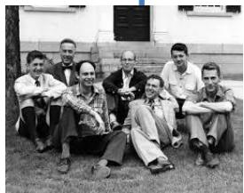  
达特茅斯会议

# AI诞生

逻辑推理

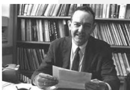  
第一次浪潮

符号主义

逻辑运算、演绎推理

Prolog语言

专家系统

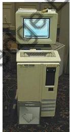  
第二次浪潮  
专家系统遍地开花人工智能转向实用

# 第一次低谷

算法仅能解决狭窄领域问题计算能力不足，未达AI预期

机器学习/深度学习

# 第三次浪潮

大数据，大量学习训练数据云计算，计算能力大幅提升深度学习，深度神经网络发展

2018 年图灵奖Yoshua Bengio、Geoffrey Hinton 和Yann LeCun

# 第二次低谷

专家系统应用领域有限

AI资金投入减少

神经网络出现， 但计算能力不足未达AI预期


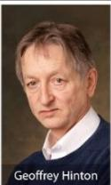


  
大语言模型

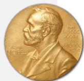  
2024诺贝尔物理学奖Hinton

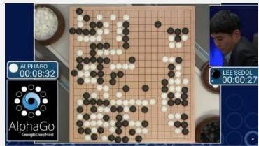

1956

1974

1980

1987

1993

2010

时间

# 人工智能的学派

# 符号主义学派

# Symbolicism

模拟心智

# 联结主义学派

# Connectionism

模拟神经

# 行为主义学派

# Actionism

模拟行为

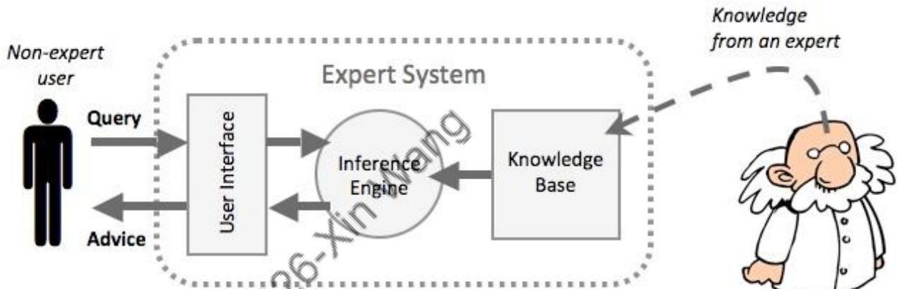

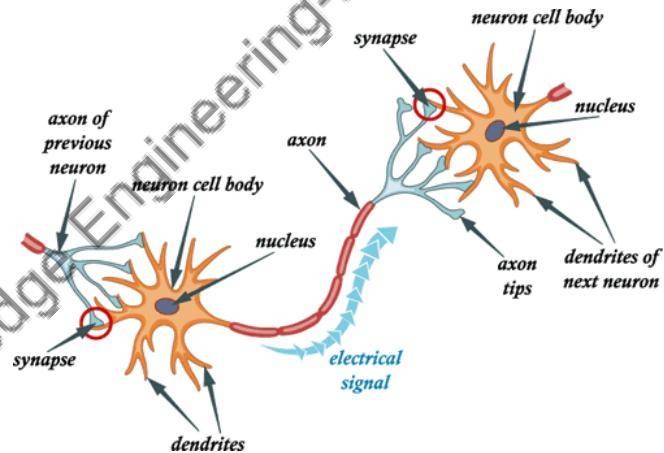

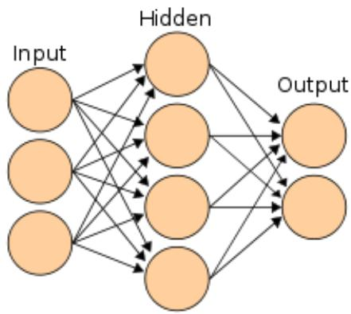

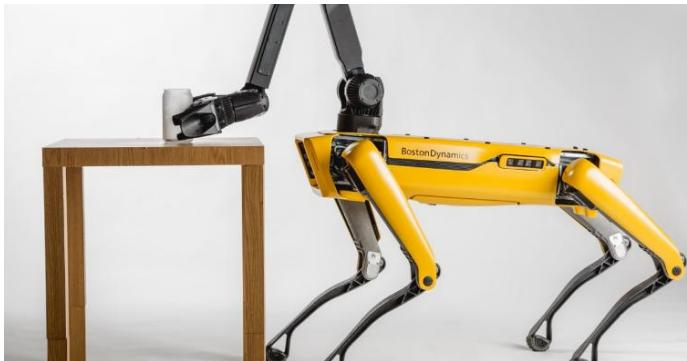

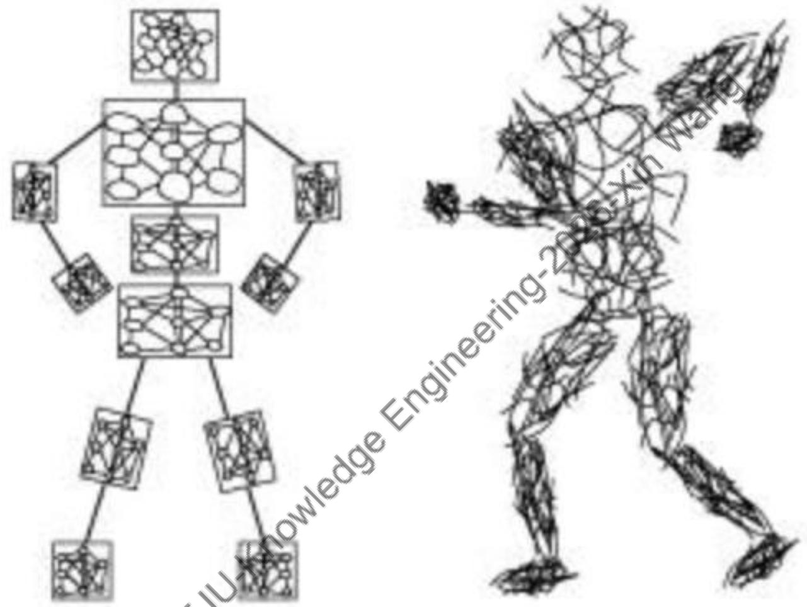  
Connectionist

# 知识 Knowledge

# 辞海

人类认识的成果或结晶。人的一切知识都是在社会实践中形成的，是对现实的能动反映

# 百科

知识是人类从各个途径中获得的经过提升 总结与凝练的系统的认识

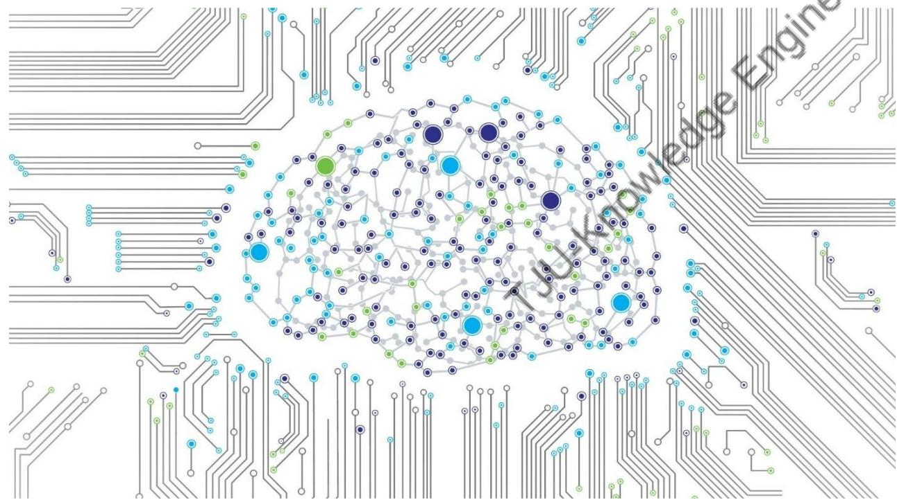

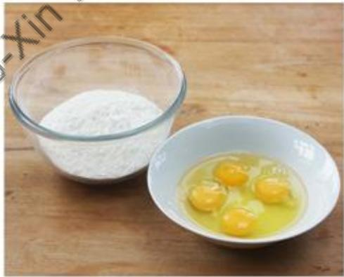  
Data   
数据

  
Information   
信息

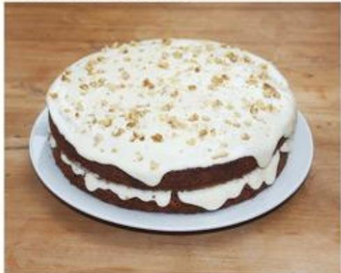  
Presentation   
界面

  
Knowledge   
知识

# 知识 Knowledge

# 辞海

人类认识的成果或结晶。人的一切知识都是在社会实践中形成的，是对现实的能动反映

# 百科

知识是人类从各个途径中获得的经过提升 总结与凝练的系统的认识

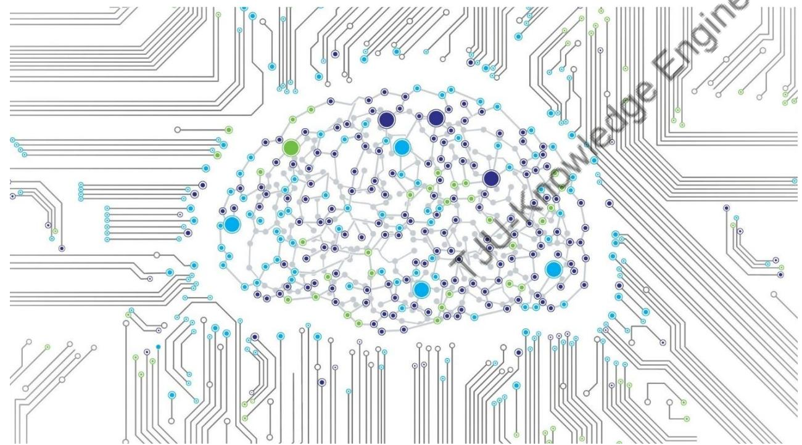

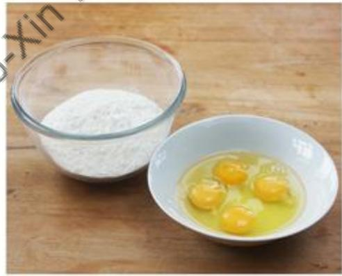  
Data   
数据

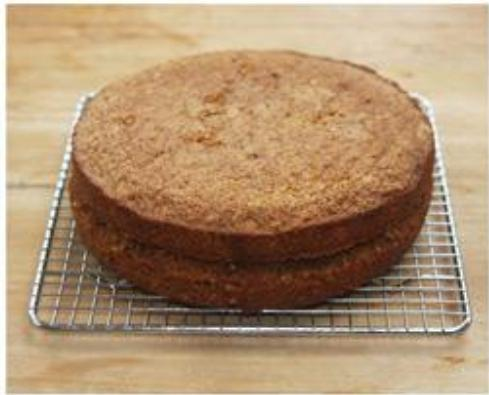  
Information   
信息

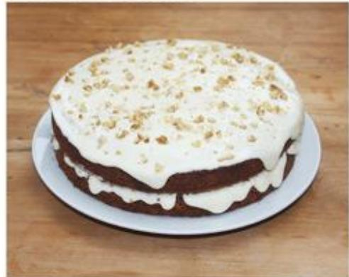  
Presentation   
界面

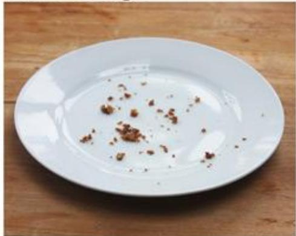  
Knowledge   
知识

# 知识 Knowledge 从哲学说起

哲学 “认识论” （epistemology）

研究关于知识的各种哲学本质问题

# 古希腊哲学家柏拉图《泰阿泰德篇》


公元前429年—前347年

知识的定义 JTB理论

“真理信念理论” （Justified True Belief）

JTB 理论认为，一个人拥有知识必须满足三个条件：

1. 真理（True）：知识必须基于真实的事实。如，“太阳是由氢和氦组成的”  
2. 信念（Belief）：个体必须真正相信某个命题。如，即使所有科学证据都表明太阳主要由氢和氦构成，如果某人并不相信这一点，那么他就不具备这方面的知识  
3. 正当理由（Justified）：信念必须有充分的理由或证据支持。如，科学家通过光谱分析等方法确定

太阳的成分中有氢和氦

葛梯尔问题（Gettier Problem） “空地上的奶牛”

# 知识 Knowledge

# 从哲学说起

古希腊哲学家柏拉图《泰阿泰德篇》

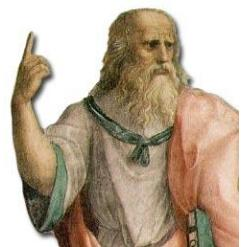

信念（Belief)

真理

(True belief)

知识

(Knowledge)

正当理由

(Justified belief)

葛梯尔问题（Gettier Problem） “空地上的奶牛”

“一位农民找不到自己的奶牛，一个送奶工说他看到农民的奶牛在附近的空地上。农民相信了送奶工，但他还是想亲自去看看。他看到了空地上有黑白相间的东西，于是就认为他的奶牛就在那。过了一会，农民走近到那片空地上看，他看到奶牛确实在那，但奶牛躲在树林中；他之前看到黑白相间的东西，是挂在树上的一大张黑白相间的纸。”

# 先验与后验

# 先验知识 （A Priori Knowledge）

先验知识是指不依赖于特定经验的知识，可以仅通过理性或逻辑推理得到的知识

先验知识的例子包括：

数学命题：如 $^ { 6 6 } 2 + 2 = 4 ^ { \prime }$ ”   
 逻辑命题：如“如果A是真的并且A蕴含B，那么B是真的”   
定义性真理：如“所有有子女的女性是母亲”

# 后验知识（A Posteriori Knowledge）

后验知识是指依赖于特定经验或感觉观察来验证的知识

后验知识的例子包括：

 科学定律和理论：如“水的沸点是 $1 0 0 ^ { \circ }$ C（在标准大气压下）”  
 历史事实：如“第二次世界大战于1939年开始”  
 个人的感觉经验：如“巧克力的味道很甜”

# 声明性与过程性

# 声明性知识（Declarative Knowledge）

声明性知识，也称为陈述性知识，是关于世界的事实性陈述。它描述了事物的状态、存在的对象及其属性和之间的关系，即“知道如此” （knowing-that）。  
声明性知识常用来构建知识库，使系统能够通过查询这些事实来回答问题或进行决策支持

◼ 例如，知道“北京是中国的首都”或者“水在标准大气压下的沸点是100°C”，都属于声明性知识。声明性知识的特点是可以被直接表述并且通常容易被共享和传递。

# 过程性知识（Procedural Knowledge）

过程性知识，也称为程序性知识，是执行任务或解决问题的具体步骤。它不是简单地知道事物是什么，而是知道如何做事，即“知道如何” （knowing-how）。  
过程性知识则可以通过规则或算法来实现，其使系统能够自动执行复杂的操作。

◼ 例如，知道如何游泳、如何烹饪一道菜，或者如何在计算机上安装某个软件，这些都是过程性知识。过程性知识往往难以被完全表述，因为它包含了大量的隐性知识，即那些我们知道如何做但很难完全解释给他人的知识。

有效的知识工程解决方案需要合理地结合和利用这两种知识，以提高系统的性能和适应性。

# 知识、 智慧与智能

智慧通常指的是使用知识的能力和效率，涉及判断力、洞察力以及根据情境选择和应用知识的能力  
智能则是更为广泛的概念，描述的是理解、学习、推理、解决问题、思考、记忆和适应环境变化等能力

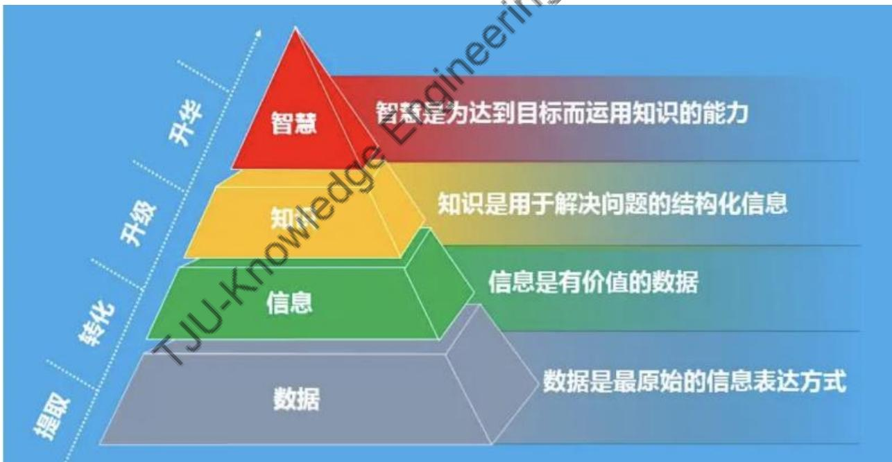  
“数据-信息-知识-智慧”体系，即DIKW体系

# 人工智能的核心任务之一是模拟人类的认知过程

# “感知智能” （perceptual intelligence）

感知智能关注于使机器能够通过传感器和数据输入模拟人类的感官，如视觉和听觉，以识别和处理周围环境的信息

# “认知智能” （cognitive intelligence）

认知智能涉及更高阶的思维功能，如语言理解、逻辑推理、规划、学习、问题解决与决策，这些能力都需要更加丰富和复杂的知识结构

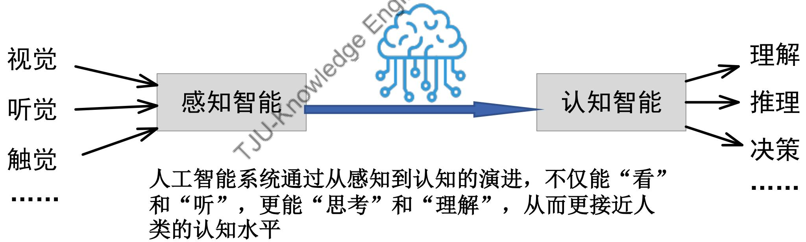

# 领域案例

# 自动驾驶汽车

在感知层面，自动驾驶系统利用雷达、摄像头和传感器收集周围环境的数据，如其他车辆的位置、行人、交通标志等

认知智能在此扮演关键角色，它使车辆能够通过预先加载的地图数据和实时交通信息，进行路径规划、预测潜在的危险，并作出复杂的决策，包括何时变道或减速以避免碰撞

这些决策依赖于庞大的知识库和高级的算法来模拟人类司机的判断过程。 W


# 健康诊断系统

在医疗领域，知识密集型的认知智能系统，如健康诊断工具， 可以分析患者的临床数据，如症状、体检结果和医学影像，以辅助医生进行诊断。

这些系统结合了医学知识库、病例研究和机器学习算法，不仅能识别疾病模式，还能推荐治疗方案。

健康系统能够利用自然语言处理和认知计算技术，解析大量的医学文献和患者信息，提供个性化的治疗建议。

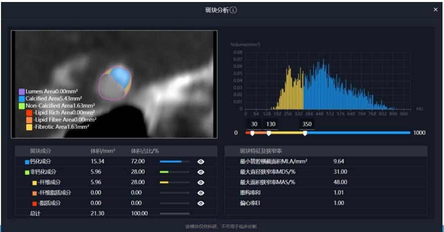

# 知识工程：人工智能的重要分支 Knowledge Engineering

# 1. 知识获取

如何从系统外部获得知识、充实知识库，包括对外部的数据进行知识化

# 2. 知识表示

怎样对知识进行形式化地描述，以便让计算机能合理地存储和使用知识

# 3. 知识使用

知识处理系统如何组织和利用知识，使用推理方法，达到所希望的目标

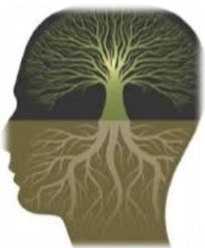  
语言推理思考

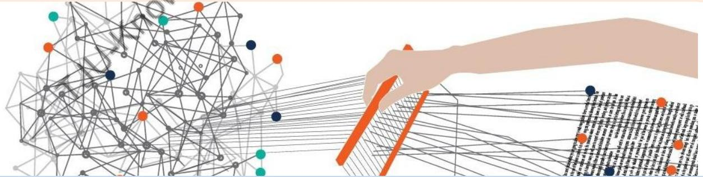  
人脑是如何进行知识获取、表示与使用的？

# 亚里士多德 逻辑学《范畴篇》 2000+ 年前

# Aristotle's Logic Categories: 2000+ years ago


亚里士多德（公元前384-前322）古希腊人世界古代史上伟大的哲学家、科学家和教育家之一

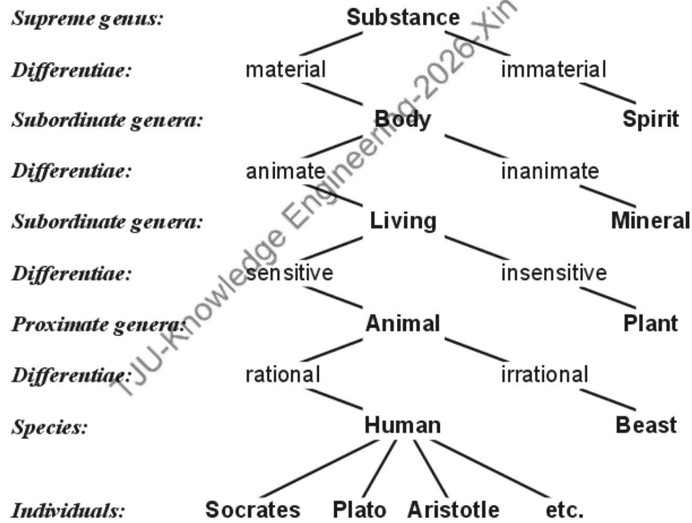

# 波菲利之树

Porphyrian tree

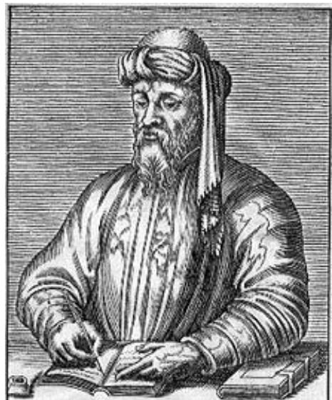

波菲利（约234年－约305年）古罗马哲学家

# 亚里士多德 逻辑学《前分析篇》 2000+ 年前

# Aristotle's Logic Prior Analytics: 2000+ years ago

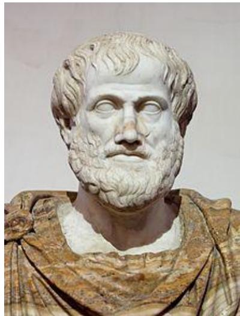

# 三段论 Syllogism

1. 所有人都会死

（大前提）

All human are mortal.

2. 苏格拉底是人

（小前提）

Socrates is a human.

3. 所以，苏格拉底是要死的

（结论）Therefore, Socrates is mortal.

# 一阶谓词逻辑 First-order Logic

1. ∀??(?????????? ?? → ???????????? ?? )

（大前提）

2. ??????????(????????????????)

（小前提）

3. ????????????(????????????????)

（结论）

# 莱布尼茨 质数编码 —— 350年前

# Leibniz's Prime Number Encoding: 350 years ago

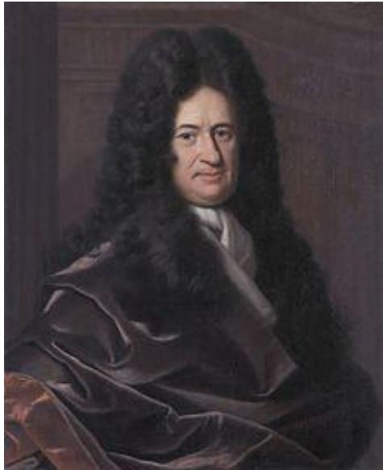  
莱布尼茨

（1646-1716）

德国哲学家、数学家是历史上少见的通才，被誉为十七世纪的亚里士多德

Supreme genus:

Differentiae:

Subordinategenera:

Differentiae:

Subordinategenera:

Differentiae:

Proximate genera:

Differentiae:

Species:

Individuals:

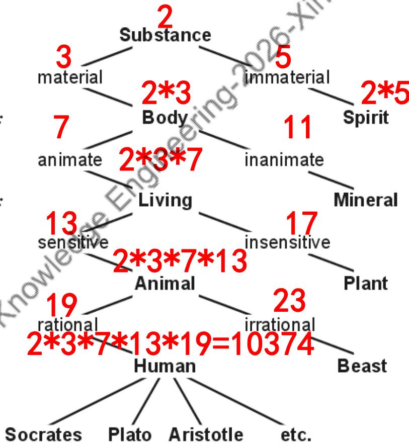

# 是否正确？

Human是animate的吗？

Every human is

animate

# 正确

因为表示Human的数可

以被表示animate的数

# 乘除

# “逻辑理论家”程序: 1956 达特茅斯会议（Dartmouth Workshop）

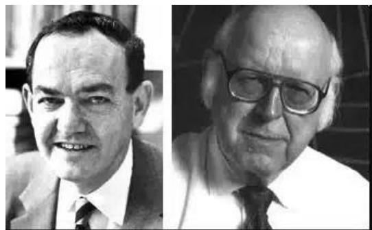  
艾伦·纽厄尔

赫伯特·西蒙

（Allen Newell）（Herbert Simon） （Allen Newell)

1916-2002

1927-1992

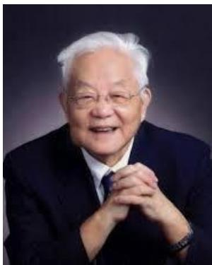  
吴文俊（1919-2017）  
中国数学家吴文俊提出了用机器自动证明几何定理的“吴方法”

# “逻辑理论家”（Logic Theorist） “史上首款人工智能程序”自动推理计算机程序

自动证明了《数学原理》（Principia Mathematica，怀特黑德和罗素所著）前38个定理纽厄尔和西蒙也因此获得了1975年的图灵奖 1978年西蒙获得诺贝尔经济学奖

# “逻辑理论家”程序也是“计算机之父”图灵关于“机器可以具有智能”这一论断的第一个程序实现 En

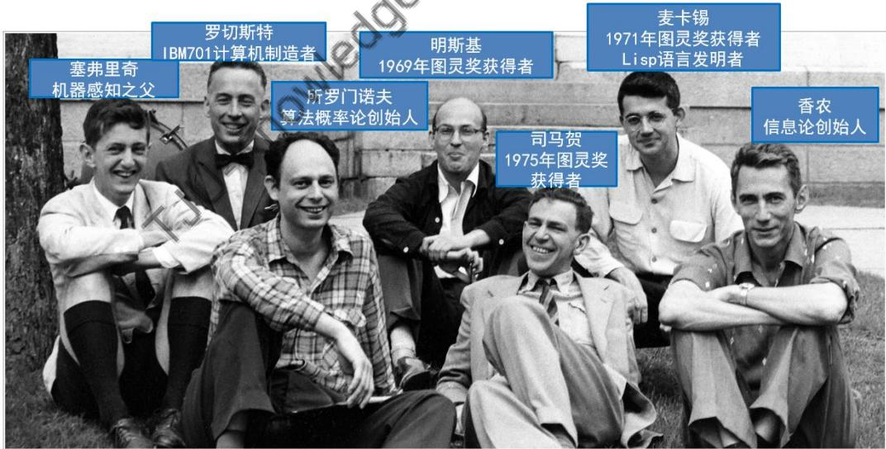

西蒙的中文名字是司马贺，据说是中国朋友给起的，他70多岁开始学习中文，曾将中国称为“我的中国”，并曾在回忆录里写道：“我十次到访中国，在那里度过的时间比在任何其他外国都要多，总计大约有一年之长。” 1994年当选为中国科学院外籍院士。

# GPS程序: 1957

在“逻辑理论家”程序取得初步成功之后，西蒙、纽厄尔与约翰·肖(John Cliff Shaw)合作，于1957年开发了“通用问题求解系统”（General Problem Solver, 简称 GPS）

◼ GPS提供一个框架，用以表达和解决这些问题，其通过“手段-目的分析”（means–endsanalysis）方法，模拟人类的问题解决策略，进行“状态空间搜索”（state-space search），比较当前状态与目标状态之间的差异，并确定如何逐步减少这种差异来寻找问题的最终解。  
◼ GPS为后续知识工程领域的专家系统和智能决策支持系统的设计提供了重要的理论和技术基础

启发式搜索” （heuristic search）

◼ GPS程序的问题求解策略实际上是通过“启发式搜索” 机制实现的  
◼ 启发式搜索通过使用预先定义的规则或经验判断来引导搜索过程，减小搜索空间，以更快地达到目标状态  
◼ 启发式搜索能够帮助系统在庞大且复杂的搜索空间中快速找到有效的解，避免盲目搜索带来的计算开销   
著名的A*算法就是实现启发式搜索的一种通用框架。

# 简约派和芜杂派

在人工智能领域，“简约派”（the neats）和“芜杂派”（the scruffies）代表了两种截然不同的哲学观点和研究方法。

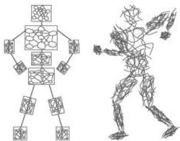

# “简约派” （the neats）

追求采用一种形式化、理论化的方法来解决人工智能问题，认为通过基于数学和逻辑的方法可以构建出能够模拟人类智能的系统  
约翰·麦卡锡（John McCarthy）认为机器不需要模拟人类思考的确切机制，而是可以使用逻辑方法找到问题求解和抽象推理的本质 E  
麦卡锡创建的斯坦福大学智能实验室（SAIL）专注于使用形式逻辑解决各类问题，包括知识表示、规划和学习  
将递归函数 （recursive function）用于符号表达式的计算，从而开发了著名的人工智能程序设计语言Lisp  
两位法国学者柯尔迈伦（Alain Colmerauer）和罗塞尔（Philippe Roussel）在1972年开发了逻辑编程语言Prolog  
麦卡锡获得1971年图灵奖

# “芜杂派”（the scruffies）

认为人工智能的发展需要模拟人类大脑的复杂性和不确定性，因此更倾向于使用模式识别和神经网络等技术以及由专家手工进行规则建立与参数优化  
马文·明斯基（Marvin Minsky）尝试解决计算机视觉与自然语言处理中的AI难题。他们得出的结论是这些问题难以采用以逻辑为基础的单一方法来解决  
其间，他们开发的人工智能程序ELIZA可与人类展开英语对话，尽管它根本没有任何正式的语言学知识  
他们接受系统可能不完全可解释或不完全符合传统逻辑规则，但追求的是功能性和效能，即使系统的内部工作机制可能显得“杂乱无章”  
明斯基获得1969年图灵奖

# 符号主义人工智能 Symbolic AI

在人工智能诞生之初的四五十年间，符号主义方法一直占据着AI领域的主导地位；符号主义人工智能主要采用逻辑符号和规则来表达知识。 W

# 符号主义人工智能的典型方法

逻辑程序设计（logic programming）  
产生式系统（production rules）  
语义网络（semantic network）  
框架（frame）

# 符号主义人工智能的典型应用

专家系统（expert system）  
符号计算系统（symbolic mathematics）  
自动定理证明器（automated theorem provers）  
自动规划与调度系统（automated planning and scheduling）

符号主义人工智能在早期取得了显著成就，但它面临一个主要问题是缺乏学习能力，符号系统通常需要人工设定和更新，不易适应新的数据或变化的环境

# 专家系统 Expert Systems: 1970s - 1980s

  
费根鲍姆

（1936年生, 89岁）

专家系统之父

1994年图灵奖得主

内部含有大量的某个领域专家水平的知识与经验  
专家系统 知识库 + 推理机

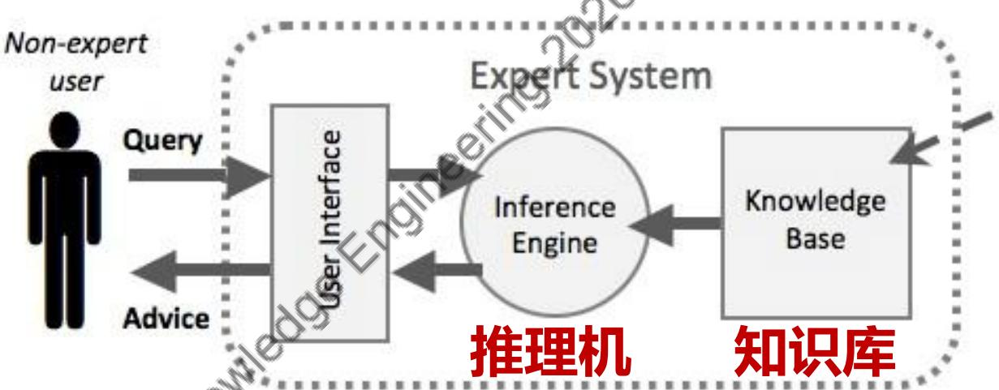

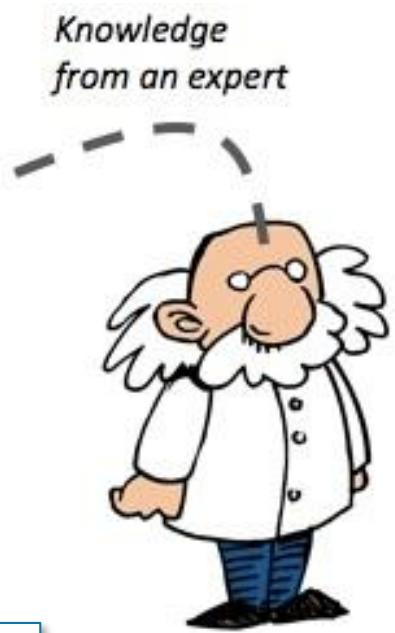

# 医疗诊断专家系统 MYCIN

帮助医生对血液感染患者进行诊断

# RULE 047

如果：（1）病原体的鉴别名不确定，且  
（2）病原体来自血液，且  
（3）病原体的染色是革兰氏阴性，且  
（4）病原体的形态是杆状的，且  
（5）病原体呈赭色

那么：该病原体的鉴别名是假单胞细菌，可信度为0.4

# Cyc项目: 1984

  
道格拉斯·莱纳特  
（Douglas Lenat）  
1950-2023

目的是创建一个包含人类的广泛常识性知识（common-sense knowledge）的庞大知识库  
◼ 以解决当时的AI系统无法理解人类日常生活中理所当然的事实的问题，即缺乏常识推理（common-sense reasoning）能力

# 常识推理

是指机器能够像人类一样，使用日常生活中普遍的、通常未被明确表达的知识来解决问题和做出决策的能力

对于人类来说，这种能力是无意识且自然发生的，例如，当你看到外面天空变得阴暗并且风也开始增强，你会推断很快会下雨，因此决定出门带伞。

常识推理在知识工程中占有重要地位，因为它允许系统在面对不完整或未明确说明的信息时，能够做出合理的判断和推理。

Cyc项目团队开发了一种新的知识表示语言CycL，这是一种形式逻辑语言，专门设计用于编码复杂的、层次化的知识。CycL能够表达各种知识，从基本的事实如“树木生长需要水分”到更复杂的概念如社会行为和心理状态等。

# 双系统理论 Dual process theory: 2011

# 认知心理学

THINKING,

FASTASLOW

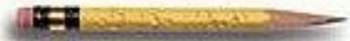

DANIEL

KAHNEMAN

WINNTROTHEOELPRIZEINECONOMIC

# 系统1

 Fast   
Automatic   
 Intuitive   
 Unconscious

# 系统2

 Slower   
 Deliberative   
 Logical   
Step-by-step

  
Daniel Kahneman (1934—2024)

Thinking, Fast and Slow is a 2011 book by

psychologist Daniel Kahneman 2002年诺贝尔经济学奖获得者

# 大模型时代的知识工程

在当今的大语言模型时代，一种说法是知识工程领域的主要工作包括知识获取、知识表示和知识推理等方面均可以由大语言模型完成。  
在当今的大语言模型时代，知识工程已经被大语言模型取代，这种说法是否正确？你认为在大语言模型时代知识工程的必要性有哪些？

# Retrieval-Augmented Generation （RAG）

RAG允许LLM检索外部数据  
2. RAG提升LLM性能，帮助LLM基于事实，降低 幻觉   
3. RAG降低LLM重新训练的需求

Meta发表的NeurIPS 2020论文，提出RAG概念，基于PLM   
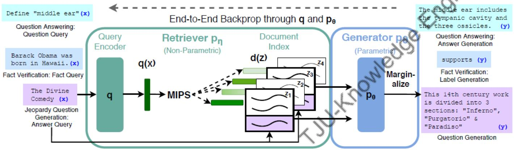  
Figure l: Overview of our approach. We combine a pre-trained retriever (Query Encoder + Document Index) with a pre-trained seq2seq model (Generator) and fine-tune end-to-end. For query $_ x$ , we use Maximum Inner Product Search (MIPS) to find the top-K documents $z _ { i }$ . For final prediction $y$ , we treat $z$ as a latent variable and marginalize over seq2seq predictions given different documents.

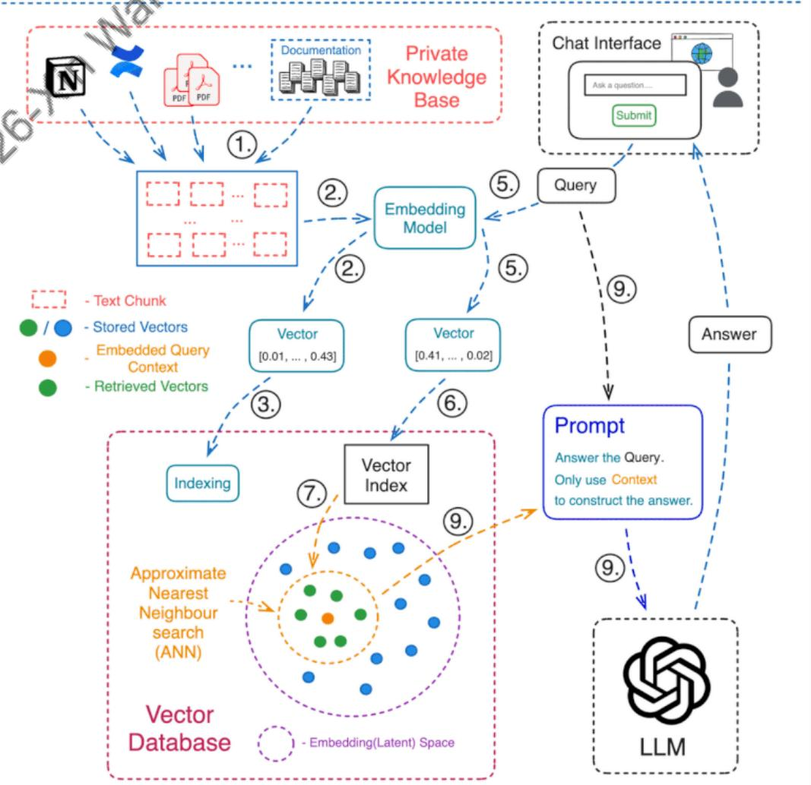  
LLM使用RAG的流程

# Graph RAG的提出

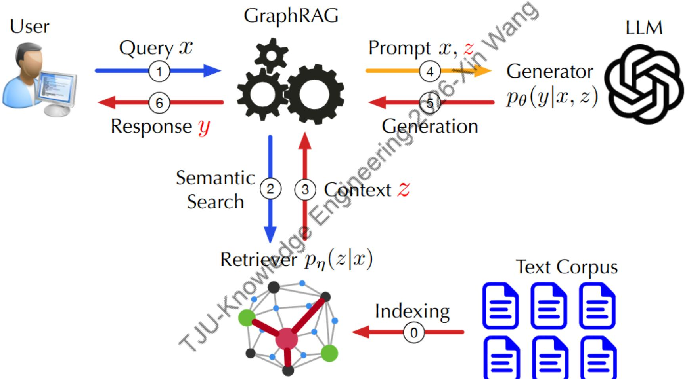  
Constructed $^ +$ Existing Knowledge Graphs

02 语义Web   
03 本体与推理  
04 4 知识图谱

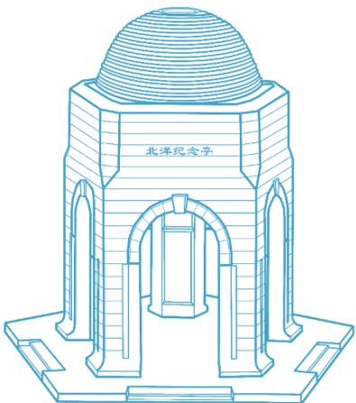

# ◼万维网 （World Wide Web）

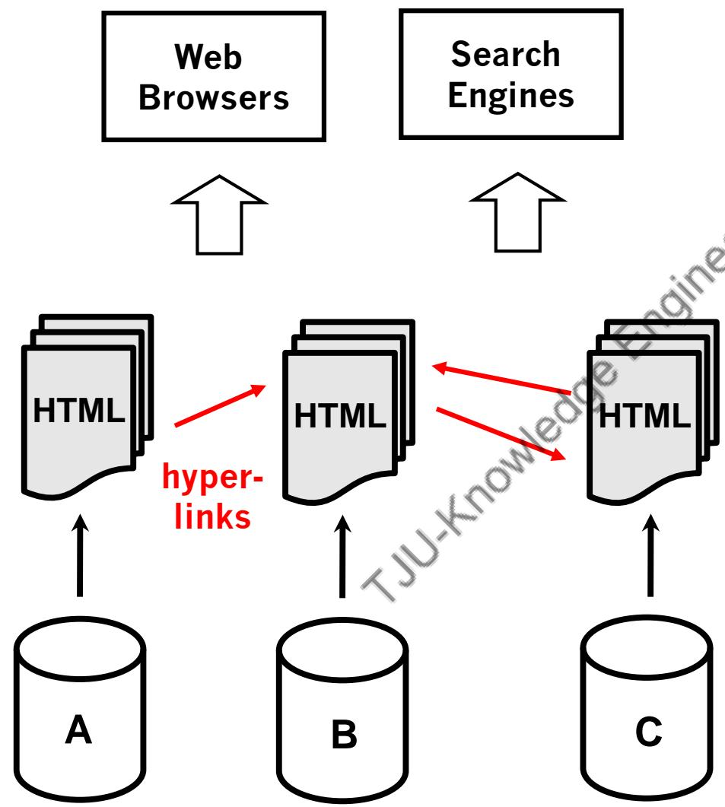

Web of documents

machine-processable, human-readable documents

Problems

machine cannot understand the meaning (semantics) of documents

# ◼ 万维网（Web）➔ 语义万维网（Semantic Web)

• A “Web of Data”

– enables machines to understand the semantics, or meaning, of information on the World Wide Web

Tim Berners-Lee. The Semantic Web. eb.e In Scientific American, 284(5):34-43, 2001


# ◼Data Web vs. Document Web

Machine-readable data   
Linked Data   
Agents?

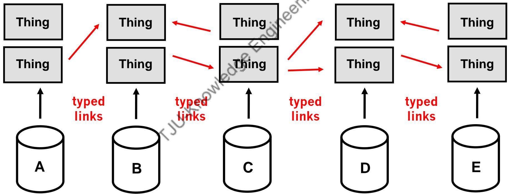

# ◼Basic Idea of the Semantic Web

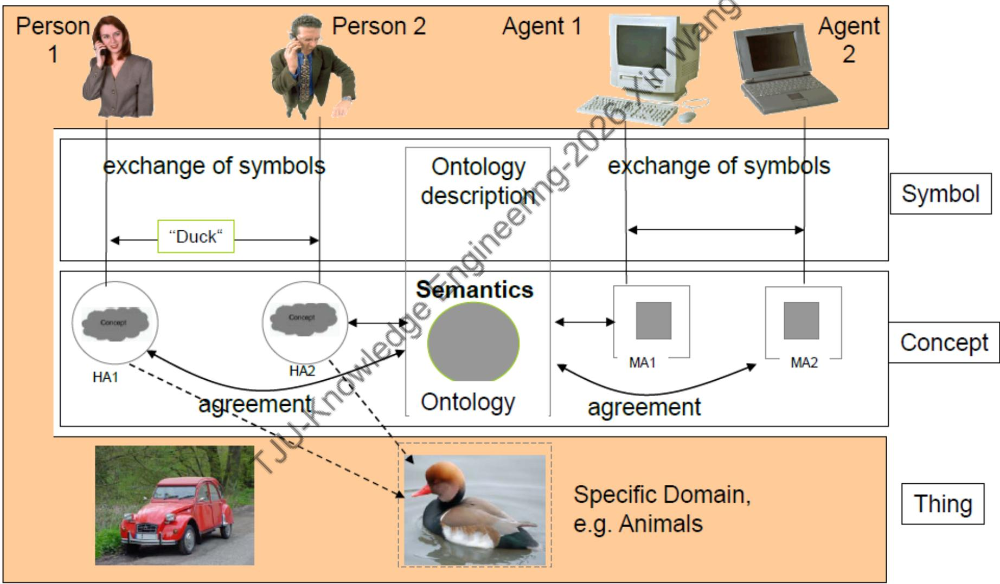

User Interface & Applications

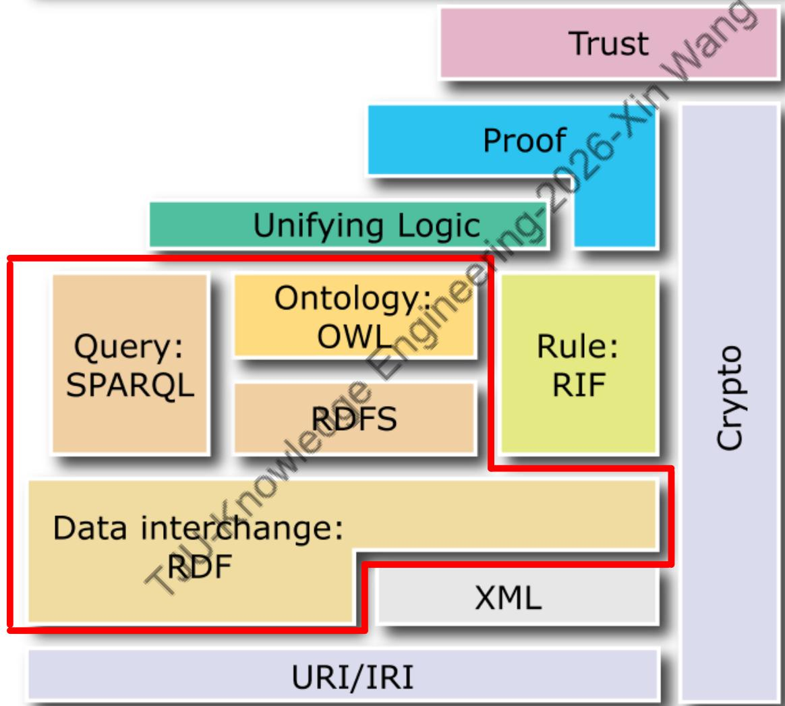  
SEMANTIC WEB STANDARD STACK

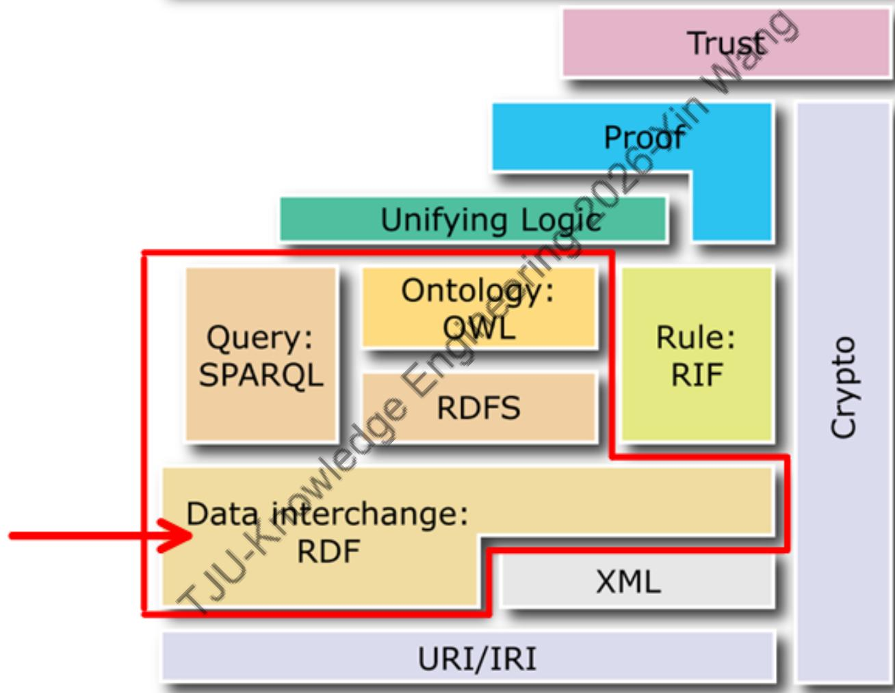  
User Interface & Applications

# RDF Terms

URIs   
– for referencing resources   
• Literals   
– data values   
Blank nodes   
– talking about something which doesn’t have a name (or the name of which isn’t known)

# RDF Triple

# Definition (RDF Triple)

An RDF triple is a tuple of the form

$$
(s, p, o) \in U B \times U \times U B L
$$

In this tuple,s is caled the subject,pthe predicate, and o the object.

The predicate is also known as property of the triple.

# RDF Triple

An RDF triple consists of

http://example.org/publishedBy

http://abc-book.org/uri

http://def-press.com/uri

Predicate

Object

(borrowed from linguistics)

allowed are:

– In the subject : URIs and blank nodes   
– In the predicate: URIs (usually called properties)   
– In the object: URIs and blank nodes and literals

• Note that the graph can be reconstructed from the list of triples.

# Turtle – Terse RDF Triple Language

simple syntax for RDF   
triples are directly listed as such

– URIs are in <angle brackets>   
– Literals are "enclosed in quotes"   
– triples end with a full-stop .   
– whitespace (blanks, line feeds) is ignored

```txt
<http://semantic-web-book.org/uri> <http://example.org/publishedBy> <http://crcpress.com/uri>   
<http://semantic-web-book.org/uri> <http://example.org/title> "Foundations of Semantic Web Technologies".   
<http://crcpress.com/uri> <http://example.org/name> "CRC Press" . 
```

# Turtle

shortcuts for prefixes

```txt
@prefix book: <http://semantic-web-book.org/>.   
@prefix ex: <http://example.org/>.   
@prefix crc: <http://crcpress.com/>.   
book:uri ex:publishedBy crc:uri .   
book:uri ex:title "Foundations of Semantic Web Technologies".   
crc:uri ex:name "CRC Press". 
```

# Turtle

```txt
@prefix book: <http://semantic-web-book.org/>.   
@prefix ex: <http://example.org/>.   
@prefixCRC: <http://crcpress.com/>.   
book:uri ex:publishedByCRC:uri .   
book:uri ex:title "Foundations of Semantic Web Technologies".   
crc:uri ex:name "CRC Press". 
```

grouping of triples with the same subject   
• grouping of triples with same subject and predicate

```txt
@prefix book: <http://semantic-web-book.org/>.   
@prefix ex: <http://example.org/>.   
@prefixCRC: <http://crcpress.com/>.   
book:uri ex:publishedByCRC:uri ; ex:title "Foundations of Semantic Web Technologies".   
crc:uri ex:name CRC Press",CRC". 
```

# Datatypes in RDF

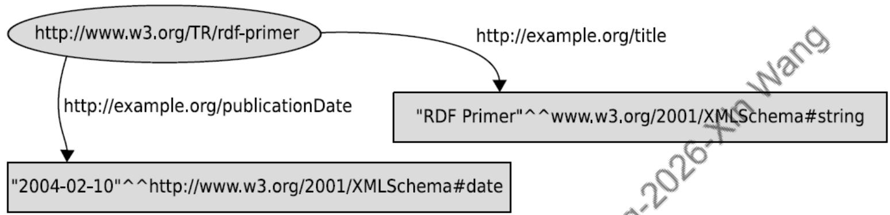

```txt
@prefix xsd: <http://www.w3.org/2001/XMLSchema#> .  
<http://www.w3.org/TR/rdf-primer>  
<http://example.org/title> "RDF Primer"^^xsd:string ;  
<http://example.org/publicationDate> "2004-02-10"^^xsd:date . 
```

```txt
<rdf:Description rdf:about="http://www.w3.org/TR/rdf-primer">
    <ex:title rdf:datatype="http://www.w3.org/2001/XMLSchema#string">
        RDF Primer
    </ex:title>
    <ex:publicationDate
        rdf:datatype="http://www.w3.org/2001/XMLSchema#date">
            2004-02-10
        </ex:publicationDate>
    </rdf:Description> 
```

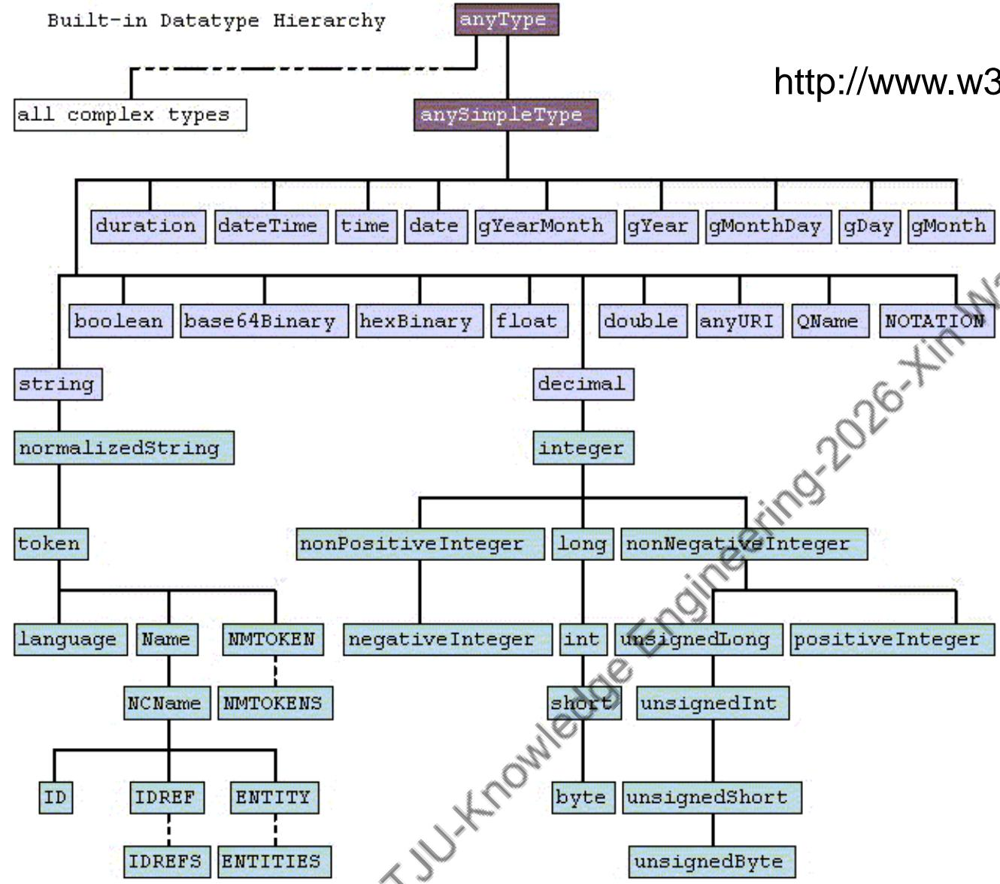

3.org/TR/xmlschema-2/

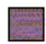

ur types

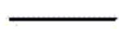

derived by restriction

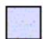

built-in primitive types

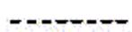

derived by list

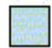

built-in derived types

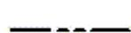

derived by extension or restriction

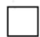

complex types

# What is wrong with these?

@prefix ex: <http://example.org/> .

ex:Chutney ex:hasIngredient "1lb green mango",

"1tsp. Cayenne pepper"

@prefix ex: <http://example.org/> .

ex:Chutney ex:ingredient dex:greenMango; ex:amount "1lb" ;

ex:ingredientNe ex:CayennePepper; ex:amount"1tsp." .

# It’s a ternary relationship!

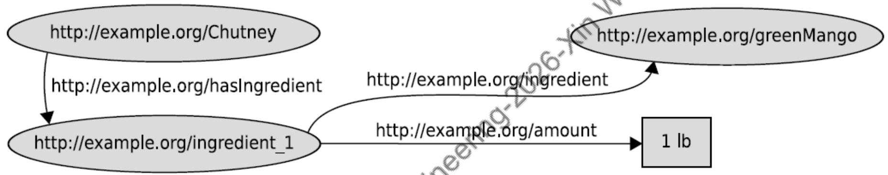

```rdf
@prefix ex: <http://example.org/>.   
@prefix rdf: <http://www.w3.org/1999/02/22-rdf-syntax-ns#>.   
ex:Chutney ex:hasIngredient ex:ingredient1 .   
ex:ingredient1 rdf:value ex:greenMango; ex:amount "1lb". 
```

# It doesn’t need a name :)

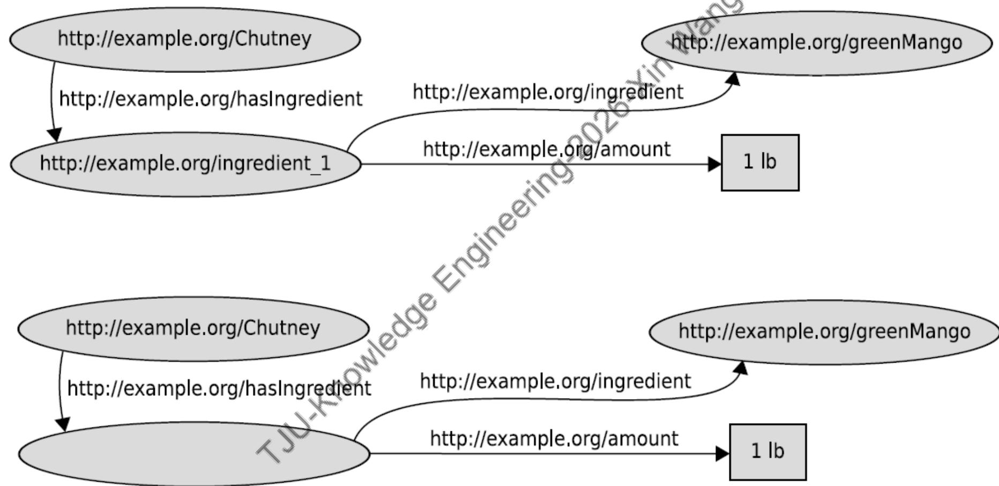

# Blank nodes syntax

```txt
@prefix ex: <http://example.org/>.  
ex:Chutney ex:hasIngredient __id1_.  
__id1 ex:ingredient ex:greenMango; ex:amount "1lb". 
```

Shortcut:

```txt
@prefix ex: <http://example.org/>.  
ex:Chutney ex:hasIngredient  
[ ex:ingredient ex:greenMango; ex:amount "1lb" ]. 
```

# question:


```rdf
<?xml version="1.0"?>   
<rdf:PDF xmlns:rdf="http://www.w3.org/1999/02/22-rdf-syntax-ns#" xmlns:exs="http://example.org-schema#"   
<rdf:Description rdf:about="http://example.org/doc.html"> <rdf:type rdf:resource="http://example.org-schema#Report"/> <exs:theme rdf:resource="http://example.org#Music"/> <exs:theme rdf:resource="http://example.org#History"/> <exs:nbPages rdf:datatype="http://www.w3.org/2001/XMLSchema#int">23</exs:nbPages> </rdf:Description>   
</rdf:RDF> 
```

# meaning

# question:


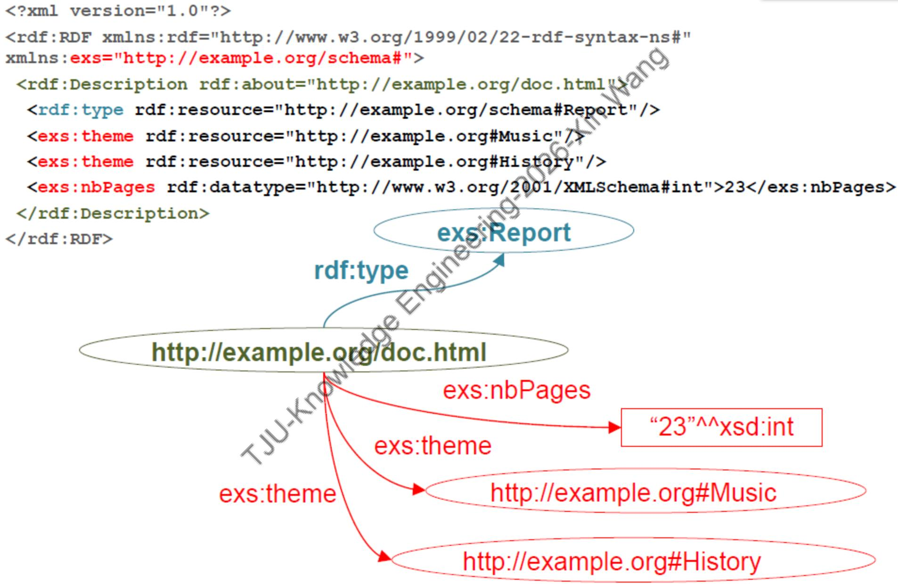

# Types of containers

“open”: new elements can be added.   
rdf:Seq – ordered list   
rdf:Bag – unordered set   
• rdf:Alt – set of alternatives   
• Lists are actually hardly reflected in the formal semantics (more about this later)

# bags = unordered groups

<rdf:Description rdf:about="#">

<author>

<rdf:Bag>

<rdf:li>Ivan Herman</rdf:li>

<rdf:li>Fabien Gandon</rdf:li>

</rdf :Bag>

</author>

</rdf:Description>


<#> author :a

_:a rdf:_1 "Ivan Herman"

_:a rdf:_2 "Fabien Gandon"

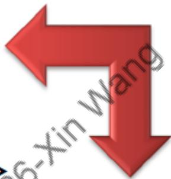

<#> author [

a rdf:Bag ;

rdf:li "Ivan Herman" ;

rdf:li "Fabien Gandon" . ] .


# sequence

# ordered group of resources or literals

<rdf:Description rdf:about $\underline { { \underline { { \mathbf { \Pi } } } } } =$ "#partition">

<contains>

<rdf:Seq>

<rdf:li rdf:about="#C"

<rdf:li rdf:about="#cs/>

<rdf:li rdf:about="#C"/>

<rdf:li rdf:aboute"#D"/>

<rdf:li rdf:about="#E"/>

</rdf:Seq>

</contains>

</rdf:Description>

<partition>

contains [

a rdf:Seq ;

rdf:li "C" ;

rdf:li "C" ;

rdf:li "C" ;

rdf:1i "D" ;

rdf:li "E" .

].

# alternatives

e.g. title of a book in different languages

<rdf:Description rdf:about="#book">

<title>

<rdf:Alt>

<rdf:li xml:lang="fr">l'homme qui prenait sa femme pour unqehapeau</rdf:li>

<rdf:li xml:lang="en">the mah who mistook his wife forahat</rdf:li>

</rdf:Alt>

</title>

</rdf:Description>


<#book>

title[

a rdf:Alt

rdf:1i "l'homme...@fr ;

rdf:li "the man..."@en .

】.

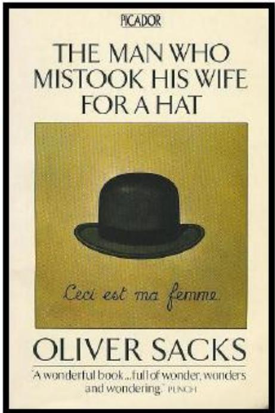

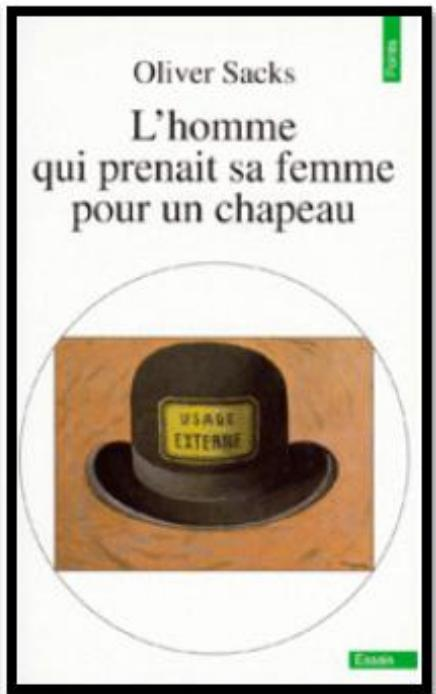

# collection

# exhaustive and ordered list

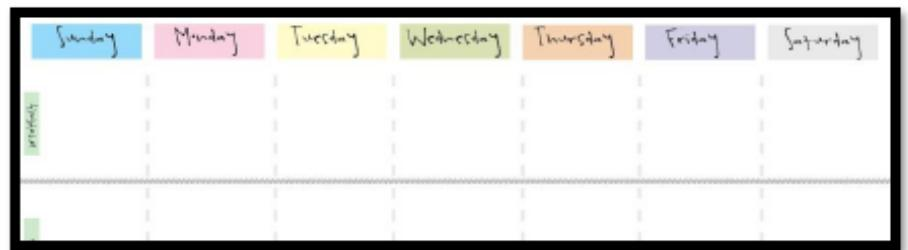

```txt
<rdf:Description rdf:about="#week"> 
```

```txt
<dividedIn rdf:parseType="Collection"> 
```

<rdf:Description rdf:about $\equiv$ "#monday"/>

<rdf:Description rdf:about $=$ "#tuesday"/>

```txt
<rdf:Description rdf:about="#wednesday"/> 
```

```txt
<rdf:Description rdf:about="#thursday"/> 
```

```xml
<rdf:Description rdf:about="#friday"/> 
```

```txt
<rdf:Description rdf:about="#saturday"/> 
```

<rdf:Description rdf:about $=$ "#sunday"/>

```xml
</devidedIn> 
```

```txt
</rdfs:Description> 
```


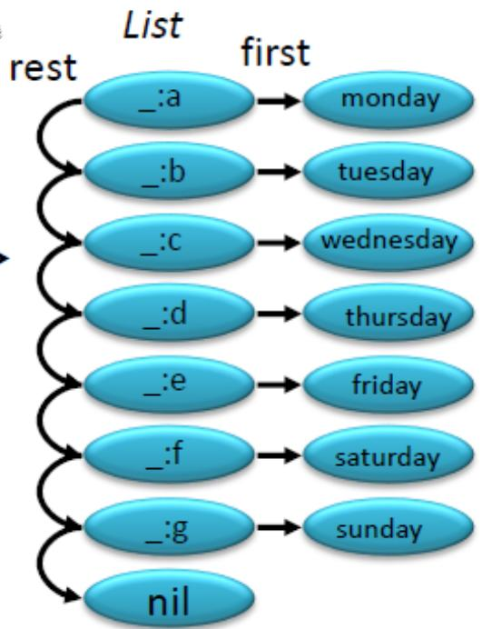

```txt
<#week> dividedIn 
```

```txt
(<#monday> <#tuesday> <#wednesday> 
```

```txt
<#thursday> <#friday> <#saturday> <#sunday> 
```

# Comparison

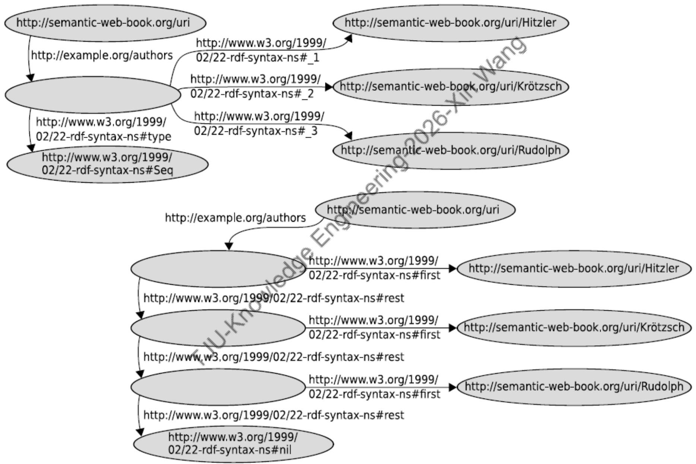

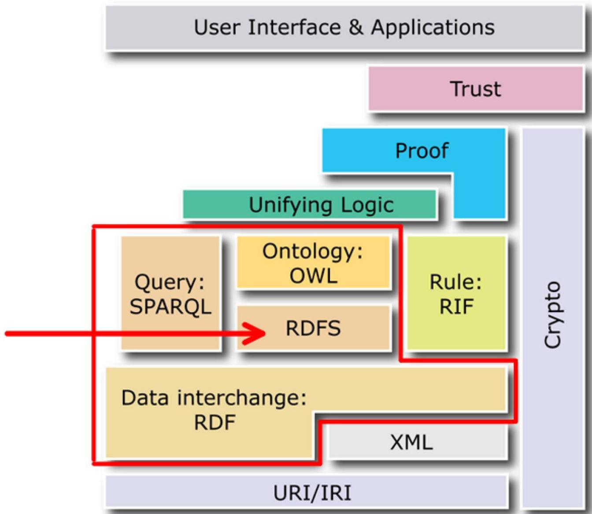

RDF allows to express facts

Anne is the mother of Merula

But we'd like to be able to express more generic knowledge

Mothers are female   
If somebody has a daughter then that person is a parent

This kind of knowledge is often called schema knowledge or terminological knowledge.   
· RDF Schema allws us to do some schema knowledge modeling.   
· OWL (discussed later) gives even more expressivity.

# RDFS

# Classes

– rdfs:Resource   
• Represents the class of everything. All things described by RDF are resources   
rdfs:Class   
• An rdfs:Class declares a resource as a class for other resources.   
– rdfs:Literal   
• literal values such as strings and integers.   
– rdfs:Datatype   
• the class of datatypes.   
rdf:Property   
• the class of properties.

# RDFS

# Properties

# – rdfs:domain

• the rdfs:domain of an rdf:Property declares the class of the subject in a triple whose predicate is that property.

# – rdfs:range

• the rdfs:range of an rdf:Property declares the class or datatype of the object in a triple whose predicate is that property.

# rdf:type

• a property used to state that a resource is an instance of a class.

# – rdfs:subClassOf

• allows declaration of hierarchies of classes.

# rdfs:subPropertyOf

• an instance of rdf:Property that is used to state that all resources related by one property are also related by another.

# RDF 1.1 Semantics

W.3C Recommendation 25 February 2014

# RDFS Entailment Rules

https://www.w 3.org/TR/rdf11 -mt/#rdfsentailment

<table><tr><td></td><td>If S contains:</td><td>then S RDFS entails recognizing D:</td></tr><tr><td>rdfs1</td><td>any IRI aaa in D</td><td>aaa rdf:type rdfs:Datatype .</td></tr><tr><td>rdfs2</td><td>aaa rdfs:domain xxx . 
yyy aaa zzz .</td><td>yyy rdf:type xxx .</td></tr><tr><td>rdfs3</td><td>aaa rdfs:range xxx . 
yyy aaa zzz .</td><td>zzz rdf:type xxx .</td></tr><tr><td>rdfs4a</td><td>xxx aaa yyyy .</td><td>xxx rdf:type rdfs:Resource .</td></tr><tr><td>rdfs4b</td><td>xxx aaa yyyy .</td><td>yyyy rdf:type rdfs:Resource .</td></tr><tr><td>rdfs5</td><td>xxx rdfs:subPropertyOf yyyy . 
yyy rdfs:subPropertyOf zzz .</td><td>xxx rdfs:subPropertyOf zzz .</td></tr><tr><td>rdfs6</td><td>xxx rdf:type rdf:Property .</td><td>xxx rdfs:subPropertyOf xxx .</td></tr><tr><td>rdfs7</td><td>aaa rdfs:subPropertyOfbbb . 
xxx aaa yyyy .</td><td>xxxbbb yyyy .</td></tr><tr><td>rdfs8</td><td>xxx rdf:type rdfs:Class .</td><td>xxx rdfs:subClassOf rdfs:Resource .</td></tr><tr><td>rdfs9</td><td>xxx rdfs:subClassOf yyyy . 
zzz rdf:type xxx .</td><td>zzz rdf:type yyyy .</td></tr><tr><td>rdfs10</td><td>xxx rdf:type rdfs:Class .</td><td>xxx rdfs:subClassOf xxx .</td></tr><tr><td>rdfs11</td><td>xxx rdfs:subClassOf yyyy . 
yyy rdfs:subClassOf zzz .</td><td>xxx rdfs:subClassOf zzz .</td></tr><tr><td>rdfs12</td><td>xxx rdf:type rdfs:ContainerMembershipProperty .</td><td>xxx rdfs:subPropertyOf rdfs:member .</td></tr><tr><td>rdfs13</td><td>xxx rdf:type rdfs:Datatype .</td><td>xxx rdfs:subClassOf rdfs:Literal .</td></tr></table>

# In English

•Dog1 is an animal   
•Cat1 is a cat   
•Cats are animals   
·Zoos host animals   
·Zo01 hosts the Cat2

<table><tr><td>In English</td><td>The graph</td></tr><tr><td>•Dog1 is an animal
•Cat1 is a cat
•Cats are animals
•Zoos host animals
•Zoo1 hosts the Cat2</td><td>ex:dog1 rdf:type
ex:cat1 rdfs:type
ex:cat2 zoo:host
RDF special terms RDFS special terms</td></tr><tr><td>•Dog1 is an animal
•Cat1 is a cat
•Cats are animals
•Zoos host animals
•Zoo1 hosts the Cat2</td><td>ex:dog1 rdf:type
ex:cat1 rdf:type
ex:cat2 zoo:host
RDF special terms RDFS special terms</td></tr></table>

# RDF/turtle

@prefix rdf:<http:/www.w3.org/1999/02/22-rdf-syntax-ns#> .

@prefix rdfs: <http://www.w3.org/2000/01/rdf-schema#>

@prefix zoo: <http://example.org/zoo/> .

ex: dog1 rdf:type ex:animal

ex:cat1 rdf:type ex:cat .

ex:cat rdfs: subClass0f ex:animal

zoo:host rdfs:range ex:animal

ex: z001 zoo:host ex:cat2 .

# Simple models

The truth value s p o.I ofa(grounded*) tripl@ s p o. is true exactly if( s, p,o are contained in V) andsI,oI) ∈ IExr(p) .

* A grounded triple does not contain a blank node.

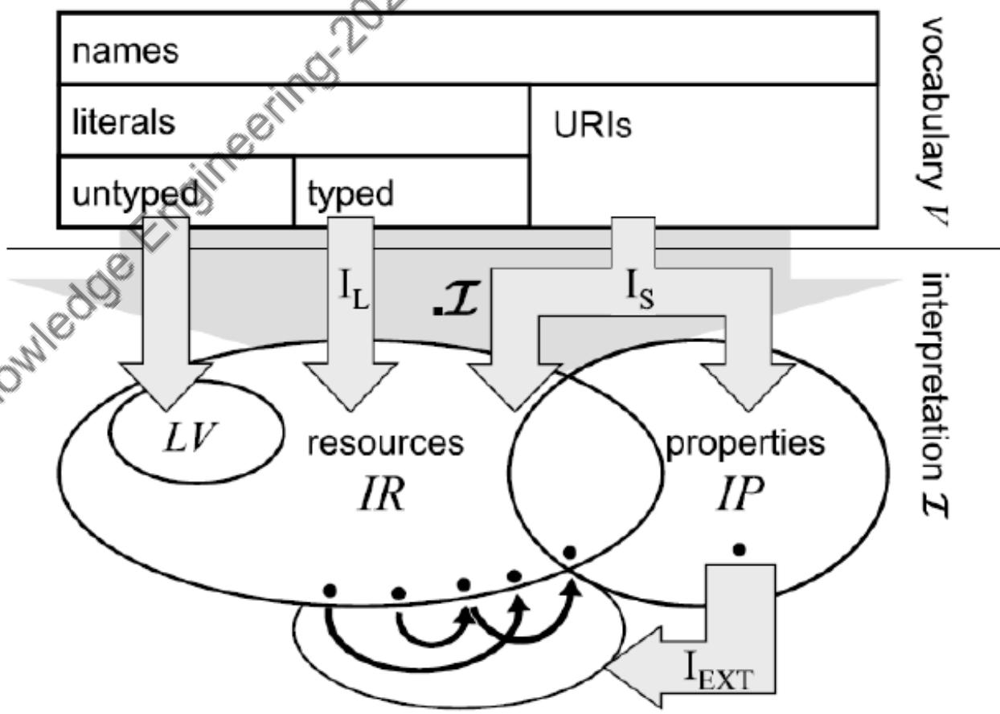

# Simple models

The truth value s p o.I ofa(grounded*) tripl@s p o. is true tripPe

* A grounded triple does not contain a blank node.

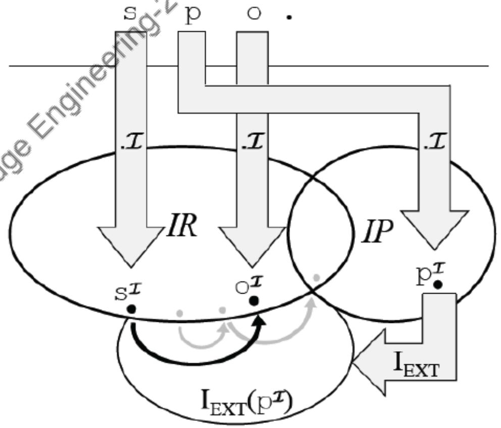

2 语义Web   
03 e 本体与推理  
04 4 知识图谱

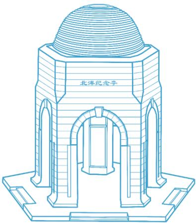

# 本体 Ontology

# 哲学 概念

• 关于是和存在的本质 the nature of being and existence   
• 是及其关系的基本类别 the basic categories of being and their relations

# 知识工程

本体是概念模型的明确规范 Gruber, 1993

An ontology is an explicit specification of a conceptualization

• 概念模型 Conceptualization  
• 明确 Explicit  
• 形式化 Formal  
• 共享 Shared

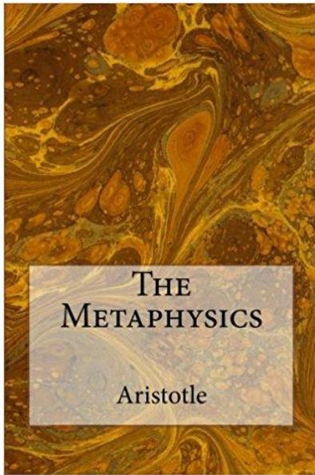

知识工程中借用了“本体”这一哲学概念并赋予其新的含义

# 概念 Concept： 基于集合论进行定义

# 概念表达式 concept expression

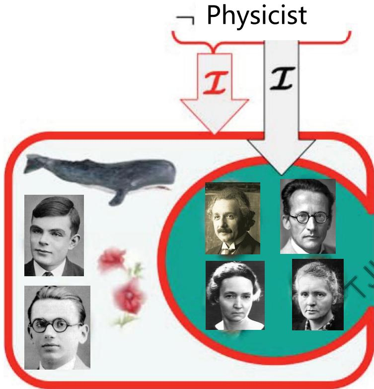  
概念的否定（补集）

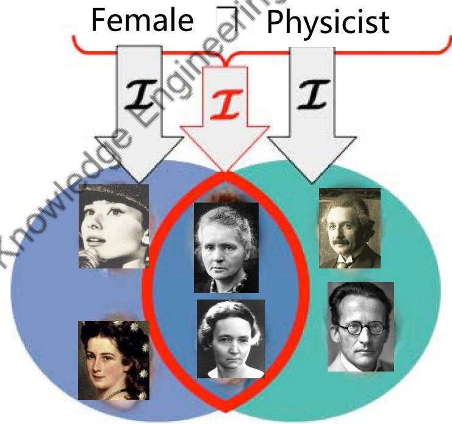  
概念的交（交集）

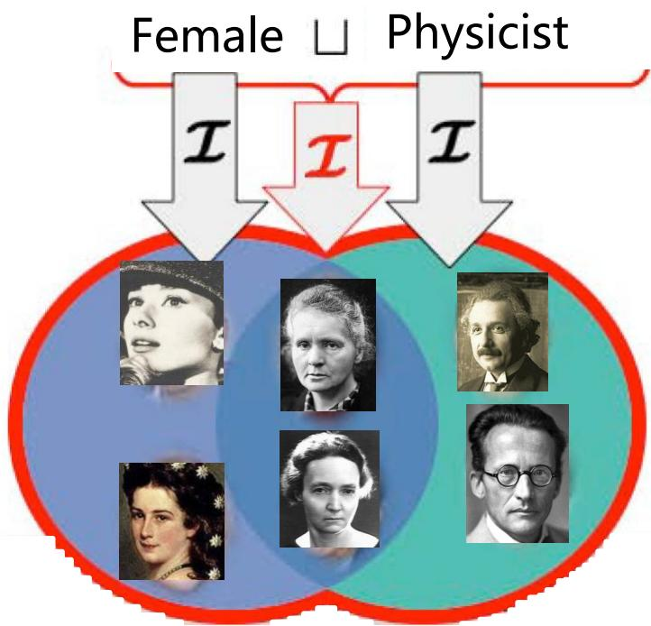  
概念的并（并集）

# 概念 Concept： 基于集合论进行定义

概念表达式 Concept expression

概念的存在关系约束 Existential role restrictions

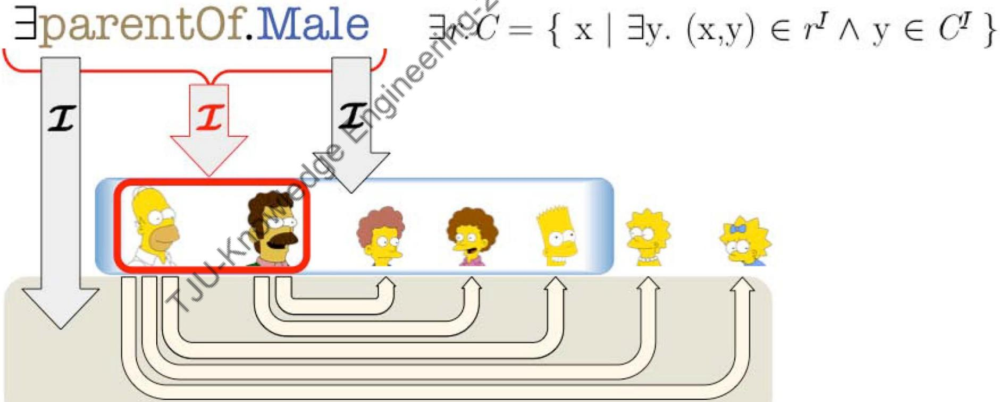

# 概念 Concept： 基于集合论进行定义

概念表达式 Concept expression

概念的全称关系约束 Universal role restriction

AparentOf.Male

$$
\forall r. C = \left\{\mathrm {x} \mid \forall \mathrm {y}. (\mathrm {x}, \mathrm {y}) \in r ^ {I} \rightarrow \mathrm {y} \in C ^ {J} \right\}
$$

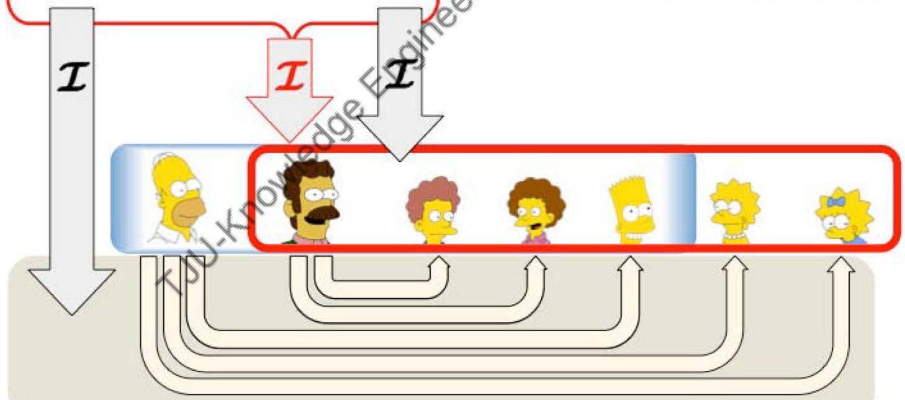

# 概念 Concept： 基于集合论进行定义

概念表达式 Concept expression

# 概念的量词关系约束 Qualified Number Restriction

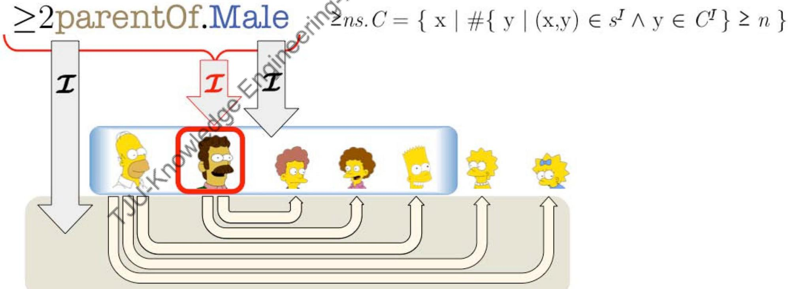

# 公理 Axiom：能判断结果为真或假的表达式

概念的成员：判断一个实例是否属于某概念

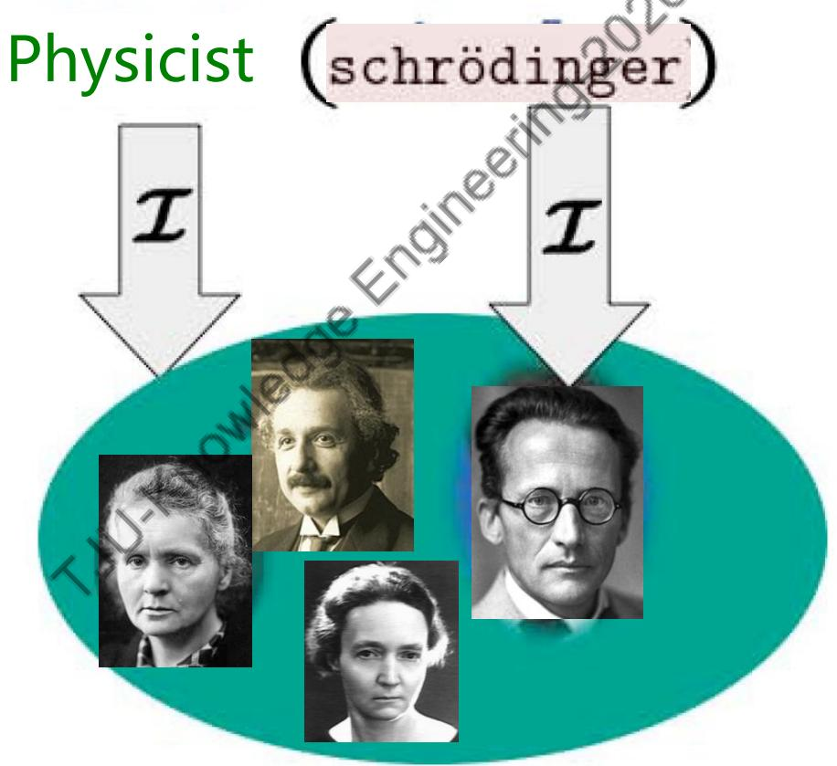

# 公理 Axiom：能判断结果为真或假的表达式

关系的成员：判断一对实例是否具有某关系

(Marie Curie, Irene Joliot-Curie)

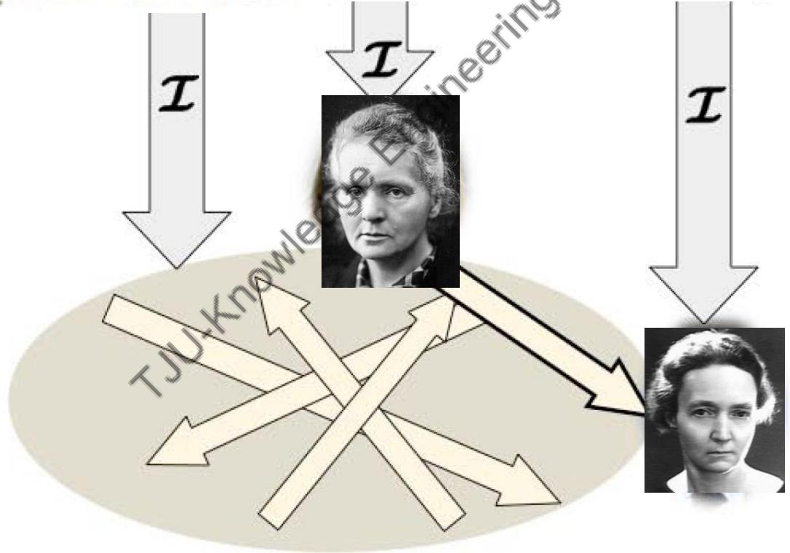

# 公理 Axiom：能判断结果为真或假的表达式

概念包含：判断一个概念是否为另一概念的子集

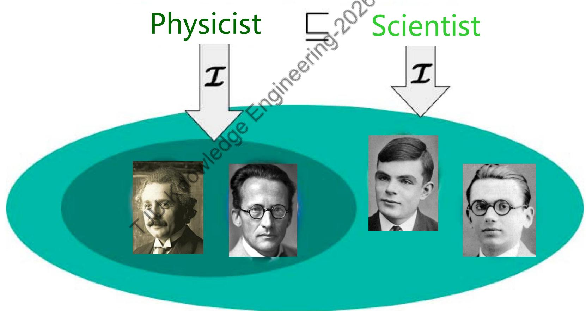

# 本体示例： 薛定谔的猫

# 本体定义（描述逻辑）

ownscaresFor

Healthy-Dead

CatDeadAlive

HappyCatOwnerEowns.Cat VcareFor.Healthy

# 解释

如果某人拥有（owns）某物，则他关爱（caresFor）该物  
• 健康（Healthy）的东西不是死的（¬Dead）  
• 猫（Cat）要么是死的（Dead）要么是活的（Alive）

HappyCatOwner (schrodinger)

快乐的猫主人（HappyCatOwner）拥有一只猫并且他所有关爱的东西都是健康的  
薛定谔（schrödinger）是快乐的猫主人（HappyCatOwner）

# DL Lg Description Logic 描述逻辑

# An Example Knowledge Base

<table><tr><td>RBox R
 owns □ caresFor
 “If somebody owns something, they care for it.”</td></tr><tr><td>TBox T
 Healthy □ Dead
 “Healthy beings are not dead.”
 Cat □ Dead □ Alive
 “Every cat is dead or alive.”
 HappyCatOwner □owns Cat □ ∀caresFor. Healthy
“A happy cat owner owns a cat and all beings he cares for are healthy.”</td></tr><tr><td>ABox A
 HappyCatOwner (schrödinger)
 “Schrödinger is a happy cat owner.”</td></tr></table>

# Interpretations

Semantics for DLs is defined ina model theoretic wai.e.based on bractolte   
A DL interpretation $\boldsymbol { \mathcal { L } }$ fixes a domain set $\Delta ^ { z }$ anda mapping I associatinga,,semanticcounterpart“toeveryame.

N.B.:Different names can bemapped to the same semantic counterpart:no unique name assumption. N.B. $\Delta ^ { \underline { { x } } }$ can be infinite.

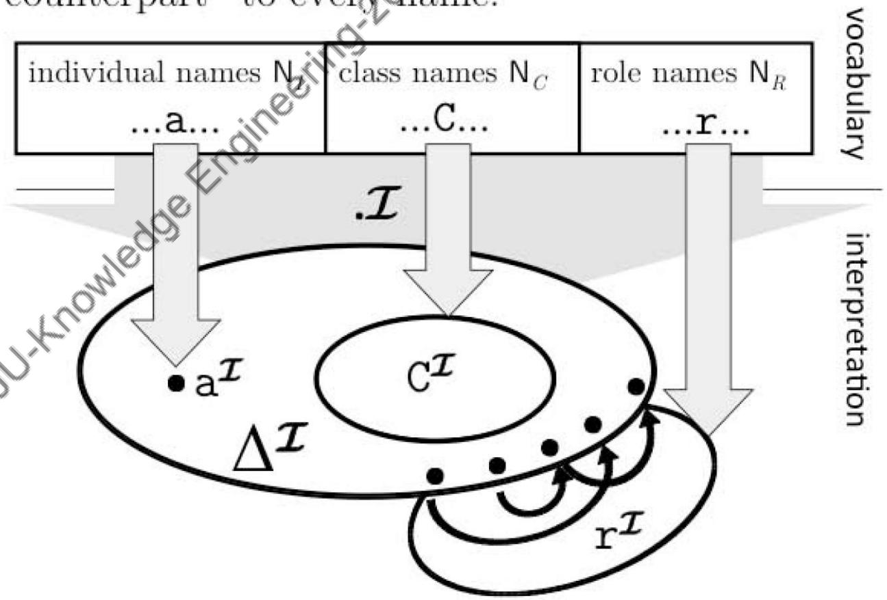

# Interpretations: An Example

N1 = {sun,morning_star,evening_star,moon,home}.   
- Nc = {Planet,Star}.   
NR = {orbitsAround, shines0n}.

$$
\mathbf {s u n} ^ {\mathcal {I}} = \odot
$$

morning_star

evening-star $\tau _ { \mathit { \Pi } } = \mathcal { \mathfrak { Q } }$

$$
\mathbf {m o o n} ^ {\mathcal {I}} = \mathbb {C}
$$

$$
\mathbf {h o m e} ^ {\mathcal {I}} = \widehat {\mathbf {\Phi}}
$$

$$
\operatorname {P l a n e t} ^ {\mathcal {I}} = \{\Uparrow , \Uparrow , \vec {\partial}, \vec {\partial}, 4, \hbar , \vec {\partial}, \vec {\Sigma} \}
$$

$$
\mathbf {S t a r} ^ {\mathcal {I}} = \{\odot \}
$$

orbitsAround¹ = {(皂,①),<♀,①),(古,①),(σ²,①),(4,①),

$$
\langle \hbar , \odot \rangle , \langle \widehat {\mathfrak {s}}, \odot \rangle , \langle \mathfrak {g}, \odot \rangle , \langle \mathbb {P}, \odot \rangle , \langle \mathbb {C}, \widehat {\mathfrak {s}} \rangle \}
$$

shines0n {(0,￥〉，(0,♀),(0,古),(0,(〉,(0,0²),

$$
\langle \odot , 4 \rangle , \langle \odot , \hbar \rangle , \langle \odot , \mathfrak {S} \rangle , \langle \odot , \mathfrak {F} \rangle , \langle \odot , E \rangle \}
$$

$$
\begin{array}{r l r} \mathsf {s u n} ^ {\mathcal {I}} = \odot & \mathsf {P l a n e t} ^ {\mathcal {I}} = \{\checkmark , \varphi , \natural , \sigma^ {\prime}, 4, \hbar , \hat {\sigma}, \Psi \} \\ \mathsf {m o r n i n g - s t a r} ^ {\mathcal {I}} = \varphi & \mathsf {S t a r} ^ {\mathcal {I}} = \{\odot \} \\ \mathsf {e v e n i n g - s t a r} ^ {\mathcal {I}} = \varphi & \mathsf {o r b i t s A r o u n d} ^ {\mathcal {I}} = \{\langle \checkmark , \odot \rangle , \langle \varphi , \odot \rangle , \langle \natural , \odot \rangle , \langle \sigma^ {\prime}, \odot \rangle , \langle 4, \odot \rangle , \\ \mathsf {m o o n} ^ {\mathcal {I}} = \mathbb {C} & & \langle \hbar , \odot \rangle , \langle \natural , \odot \rangle , \langle \xi , \odot \rangle , \langle P, \odot \rangle , \langle \mathbb {C}, \natural \rangle \} \\ \mathsf {h o m e} ^ {\mathcal {I}} = \natural & \mathsf {s h i n e s O n} ^ {\mathcal {I}} = \{\langle \odot , \checkmark \rangle , \langle \odot , \varphi \rangle , \langle \odot , \natural \rangle , \langle \odot , \mathbb {C} \rangle , \langle \odot , \sigma^ {\prime} \rangle , \\ & & \langle \odot , 4 \rangle , \langle \odot , \hbar \rangle , \langle \odot , \natural \rangle , \langle \odot , \xi \rangle , \langle \odot , P \rangle \} \\ & & \end{array}
$$

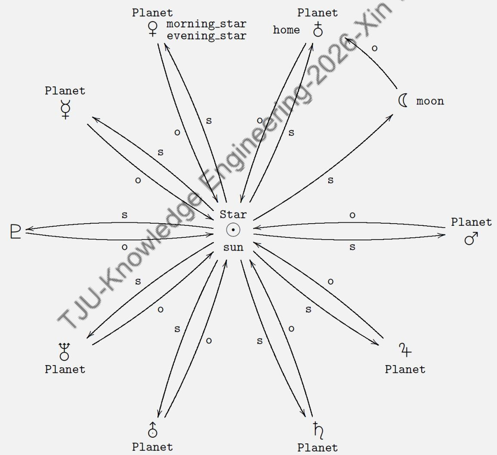

# Concept building blocks

Atomic building blocks:

Individual names I (objects), e.g. tintin   
Concept names C (classes), e.g. Dog   
Role names R (relations)， e.g.owns, travelsTo

Boolean constructors:

conjunction: ∩ (class intersection)   
disjunction: □ (classunion)   
negation: (class complement)

Role restrictions:

existential restriction:  (some)   
universal restriction: ∀ (only)

• and more: cardinality constraints, inverse roles, role composition，..

# Building complex concepts

# Definition (Concept language of ALC)

Every concept name $A \in \mathsf C$ is a concept   
• T and ⊥ are concepts   
· If $C$ and $D$ are concepts, then so areC,C  D,C  D   
o If $r \in { \mathsf { R } }$ and $C$ is a concept, then Vr.C and r.C are concepts

# Which of the following are concepts?

Tn r.T   
3r.T   
CU--D   
3r.∀s.C D   
∀r.(C n -D)

# Building complex concepts

# Definition (Concept language of ALC)

Every concept name $A \in \mathsf C$ is a concept   
• T and ⊥ are concepts   
· If $C$ and $D$ are concepts, then so areC, C ∩ D, C D   
If $r \in { \mathsf { R } }$ and $C$ is a concept, then Vr.C and r.C are concepts

# Which of the following are concepts?

Tr.T X   
3r.T   
C–-D X   
3r.∀s.C D   
∀r.(Cn-D)

# Definition (Interpretation)

An ALC interpretation $\mathcal { T }$ consists of a nonempty domain △，and an interpretation function .I such that:

for each individual name $\mathfrak { a } \in \mathsf { I }$ ,a∈△   
for each concept name A ∈ C， AI S  
for each role name $r \in { \mathsf { R } }$ ,rIg A X△

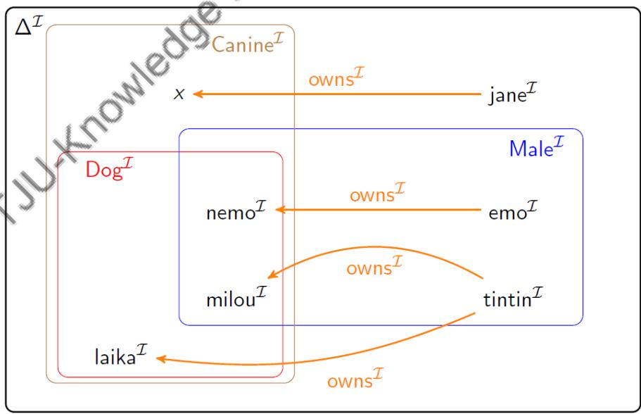

# Concept language semantics

Extend interpretations to complex concept expressions:

TI=△

⊥¹=の

$( \neg C ) ^ { \mathcal { T } } = \Delta \backslash C ^ { \mathcal { T } }$

(C∩ D) = c n DΠ

(cμ D) = cU dī

(r.C)I = {x ∈△ is related by $r ^ { \mathcal { Z } }$ to some element in $C ^ { \mathcal { I } } \big \}$

$$
= \{x \in \Delta \mid \exists y (r ^ {\mathcal {I}} (x, y) \wedge C ^ {\mathcal {I}} (y)) \}
$$

(Vr.C)T ={x∈△|x is related by $r ^ { \mathcal { Z } }$ Only to elements in $C ^ { \mathcal { I } } \big \}$

$$
= \{x \in \Delta \mid \forall y (r ^ {\mathcal {I}} (x, y) \rightarrow C ^ {\mathcal {I}} (y)) \}
$$

# Concept language semantics

# Arbitrary concept

• A class in the domain   
$C ^ { \mathcal { T } } \subseteq \Delta ^ { \mathcal { T } }$


# Arbitrary concept

• A class in the domain   
$C ^ { \mathcal { T } } \subseteq \Delta ^ { \mathcal { T } }$

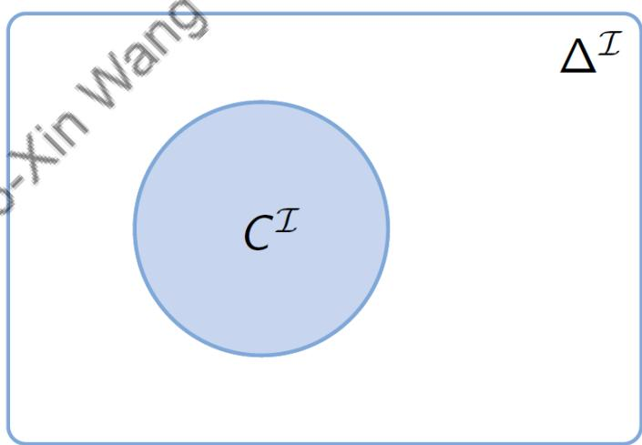

# Concept negation

The complement of a class   
（-C)=△²\CI

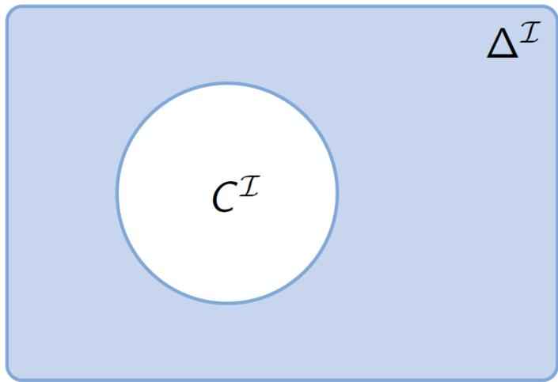

# Concept conjunction

The intersection of two classes   
$( C \cap D ) ^ { \mathcal { I } } = C ^ { \mathcal { I } } \cap D ^ { \mathcal { I } }$

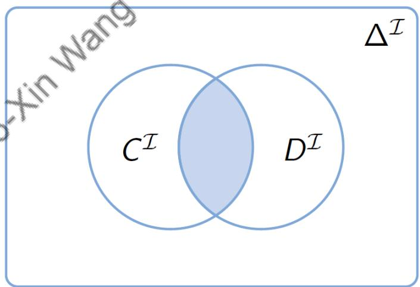

# Concept conjunction

The intersection of two classes   
$( C \cap D ) ^ { \mathcal { I } } = C ^ { \mathcal { I } } \cap D ^ { \mathcal { I } }$

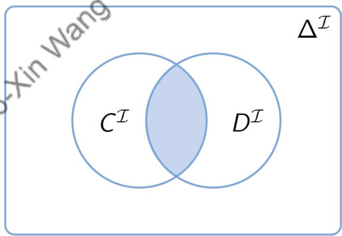

# Concept disjunction

The union of two classes   
· $( C \sqcup D ) ^ { \mathcal { Z } } = C ^ { \mathcal { \vec { Z } } } \cup D ^ { \mathcal { Z } }$

△I $\Delta ^ { \mathcal { I } }$

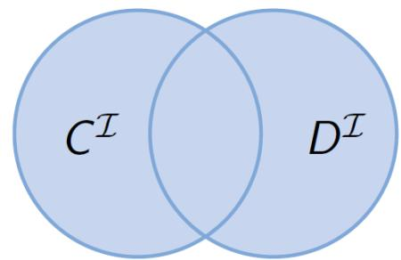

# Concept language semantics

# Existential restriction

$$
\left(\exists r. C\right) ^ {\mathcal {I}} = \{x \in \Delta \mid \exists y \left(r ^ {\mathcal {I}} (x, y) \wedge C ^ {\mathcal {I}} (y)\right) \}
$$


# Concept language semantics

# Existential restriction

$$
\left(\exists r. C\right) ^ {\mathcal {I}} = \{x \in \Delta \mid \exists y \left(r ^ {\mathcal {I}} (x, y) \wedge C ^ {\mathcal {I}} (y)\right) \}
$$

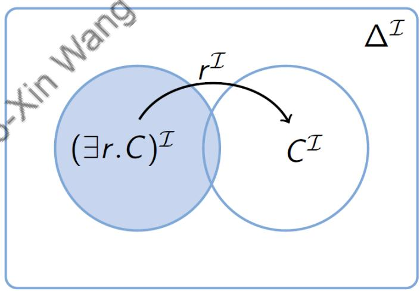

# Universal restriction

$$
\left(\forall r. C\right) ^ {\mathcal {I}} = \{x \in \Delta \mid \forall y \left(r ^ {\mathcal {I}} (x, y) \rightarrow C ^ {\mathcal {I}} (y)\right) \}
$$

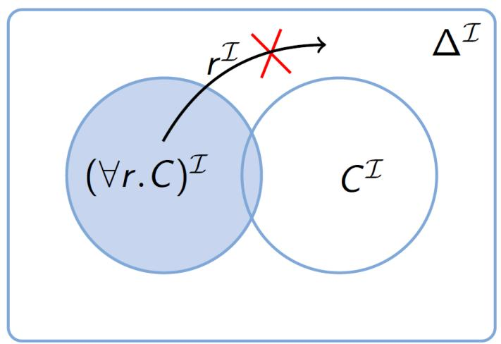

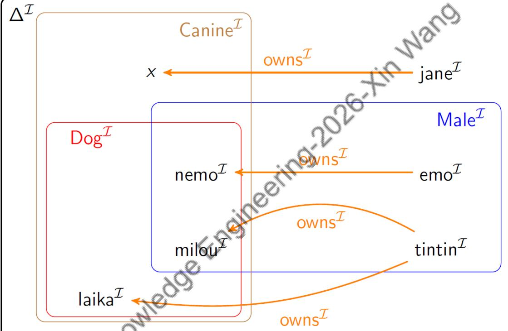

(Canine Male)I [..]   
• (Eowns.(Canine  Male) ={...}   
（-Canine ∀owns.-(Male Canine) = {. }

Terminological axioms (TBox axioms):

All owners of a male dog are male   
In predicate logic:

$$
\forall x (\exists y \left(\operatorname {O w n s} (x, y) \wedge \operatorname {M a l e} (y) \wedge \operatorname {D o g} (y)\right)\rightarrow \operatorname {M a l e} (x))
$$

This is a sentence in predicatelogic

Terminological axioms (TBox axioms):

All owners of a male dog are male   
In predicate logic:

$$
\forall x (\exists y \left(\operatorname {O w n s} (x, y) \wedge \operatorname {M a l e} (y) \wedge \operatorname {D o g} (y)\right)\rightarrow \operatorname {M a l e} (x))
$$

This is a sentence in predicate logic

Assertions (ABox assertions):

assert categories to which individuals or pairs of individuals belong   
Nemo is a dog   
Emo owns Nemo   
In predicate logic:

Dog(nemo) > Owns(emo,nemo)

# CΩD

· Concept inclusion subsumption:

C is subsumed by D   
C is more specific than D   
D generalises C   
• All C are D   
Every C is a D

• Formalises the syllogismAll ... are 1   
Predicate logic translation:

Binds the free Variable in C and in D   
$\forall x ( C ( x ) \not \prec { \mathcal { D } } ( x ) )$

# Example

3owns.(Dog  Male)  Male

$$
a: C; \qquad (a, b): r
$$

· Concept and role assertions:

• a is an instance of C   
a and $b$ are related by r

Predicate logic translation:

C(a)   
r(a,b)

Example

nemo : Dog

nemo :-Male

(emo, nemo) : owns

# Truth in an interpretation

Recall - An interpretation $\mathcal { T }$ is a tuple $\langle \Delta , \cdot ^ { \mathcal { I } } \rangle$ with domain △ of objects and interpretation function .I such that:

for each individual name $\mathfrak { a } \in \mathsf { I }$ ,a¹∈△   
• for each concept name A ∈C,AI   
for each role name $r \in { \mathsf { R } }$ ，rI

# Definition (Satisfaction)

•I├CςDifC¹η (read: I satisfies $C \subseteq D _ { \mathbf { \alpha } }$ ）  
•Il├a:Cif a∈CT   
• Il(a,b): rif(a¹,b)∈ r

# Truth in an interpretation

•ICΩDif $C ^ { \mathcal { T } } \subseteq D ^ { \mathcal { T } }$

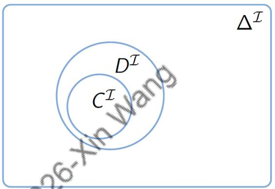

# Truth in an interpretation

•IICΩDif $C ^ { \mathcal { T } } \subseteq D ^ { \mathcal { T } }$   
$\mathcal { T } \Vdash a : C$ if $\partial ^ { \mathcal { T } } \in C ^ { \mathcal { T } }$

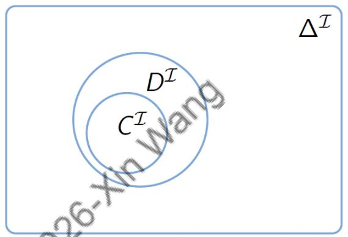

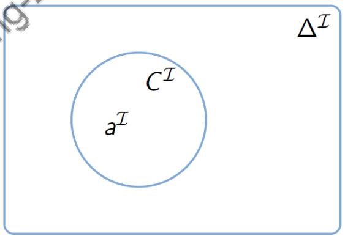

# Truth in an interpretation

• II CΩDif $C ^ { \mathcal { T } } \subseteq D ^ { \mathcal { T } }$   
$\mathcal { T } \Vdash a : C$ if $\mathsf { a } ^ { \mathcal { Z } } \in C ^ { \mathcal { Z } }$   
$\mathcal { T } \left| \right| - \left( a , b \right) : r \mathsf { i f } \left( a ^ { \mathcal { T } } , b ^ { \mathcal { T } } \right) \in r ^ { \mathcal { Z } }$ ${ \mathcal { T } } \Vdash ( a , b ) : r$ $\left( a ^ { \mathcal { Z } } , b ^ { \mathcal { Z } } \right) \in r ^ { \mathcal { Z } }$

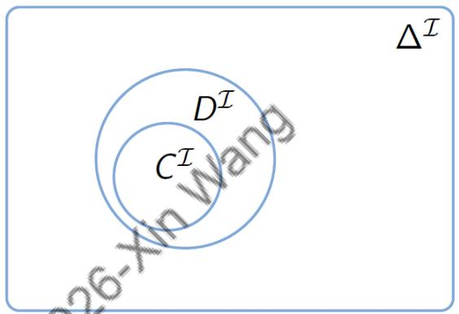

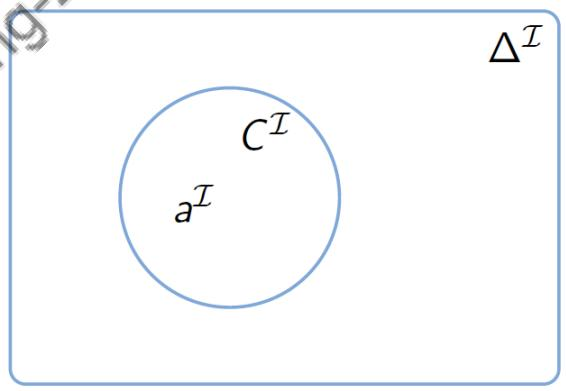

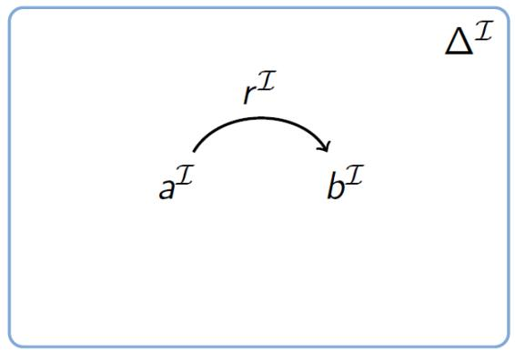

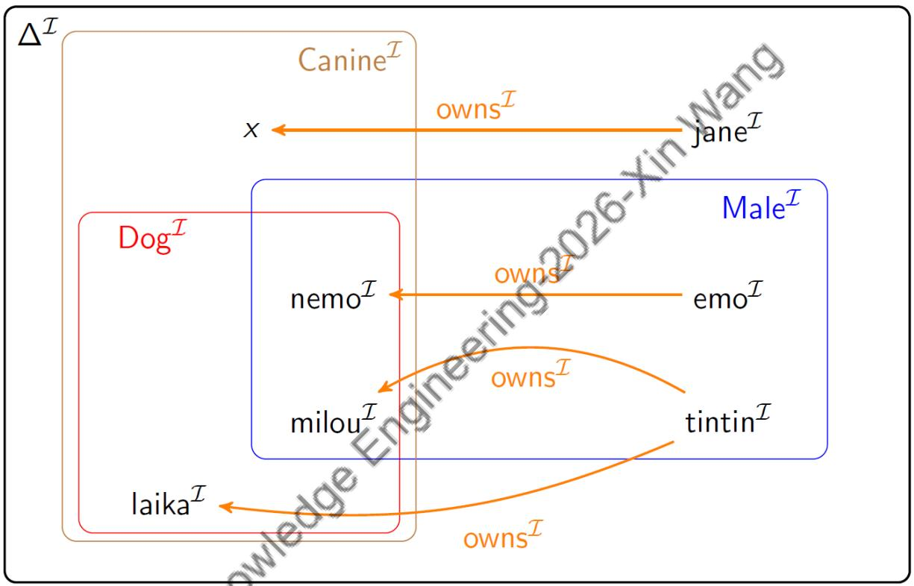

• I├ laika : Canine ？  
• Z片 T』 Canine Зowns.Canine ？  
• I 』 Зowns.(Male  Canine) ≌ Male ？

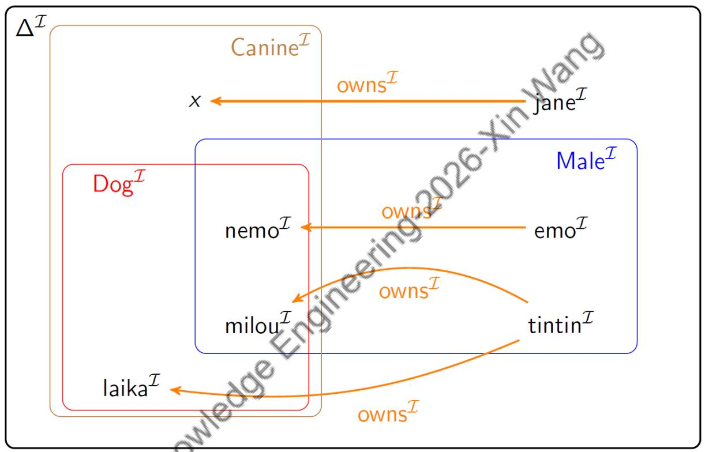

• Zド laika : Canine ？   
• I片 T≌ CanineЗowns.Canine ？   
• I = 3owns.(Male∩ Canine) ≌ Male ？

# Role Inclusion Axioms

parentOfochildofsiblingOf

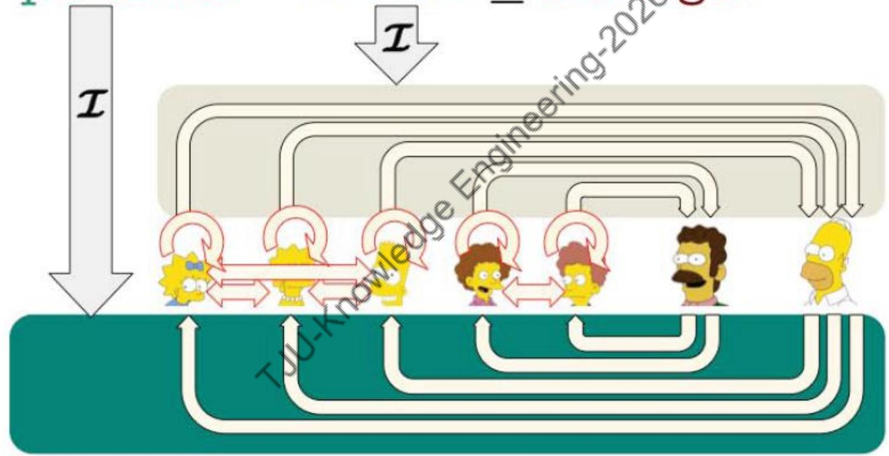

# Role Inclusion Axioms

childOf o parentOf

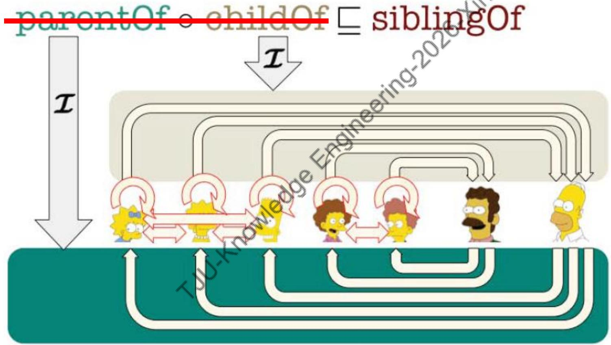

A knowledge base is a tuple ${ \mathcal { K } } : = \langle { \mathcal { T } } , { \mathcal { A } } \rangle$ , for some TBox T and ABox A   
Captures both structural knowledge about the domain and explicit knowledge about individuals

# Definition (Satisfaction extended)

• II TifIIC≌D for eachC≌D∈T   
$A$ if I l├ a : C for each a : C ∈ A and ${ \mathcal { T } } \Vdash ( a , b ) : r$ for each $( a , b ) : r \in { \mathcal { A } }$

• If I I TU A, we say $\mathcal { T }$ is a model of ${ \mathcal { K } } : = \langle { \mathcal { T } } , { \mathcal { A } } \rangle$   
$\mathcal { K }$ is consistent if it has a model

# (Un)Satisfiability of Knowledge Bases

AKBis satisfiable (also:consistent)if thee exists an interpretation that satisfies all itsaxiors(a model of the KB).Otherwise it is unsatisfiable(alo:inconsistent or contradictory).   
Is the following KB satisfable?

ReindeerhasNose.Red(rudiph) worksFor.(-ReindeerLFlies(santa) worksFor(rudiph,santa) antabatman

ReindeerMammal MammalnFliesBat BatVworksFor.{batman}

# Reasoning

Is the following KB satisfiable?

Reindeer hasNose.Red(rudolph) Reindeer Mammal $\forall$ worksFor.(-Reindeer Flies)(santa) Mammal Flies Bat  
worksFor(rudolph, santa) Bat $\square$ VworksFor.{batman}  
santa $\approx$ batman

# OWL

# Web Ontology LanguageWeb本体语言

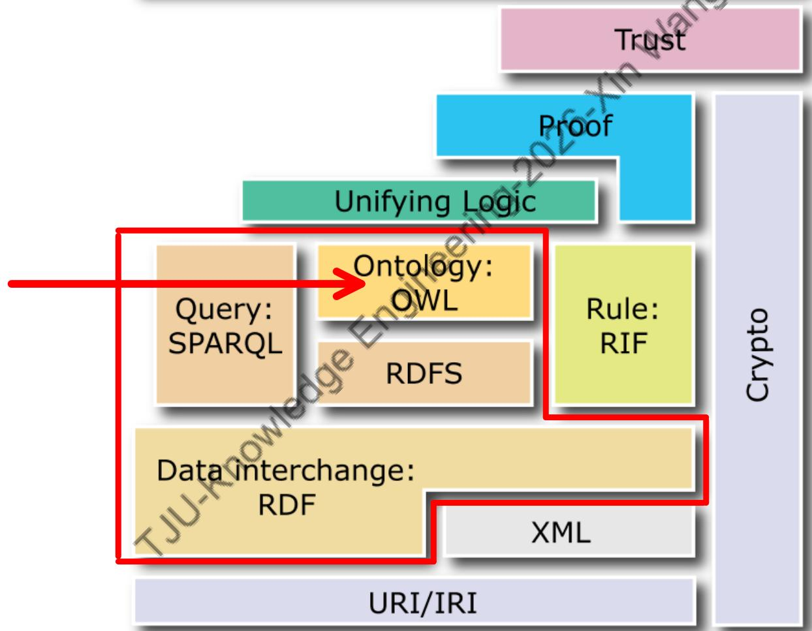  
User Interface & Applications

# HowDoDLsand OWL Relate

OWL is essentially

SROIQ in disguise   
■plus extended datatype support   
plus extralogical features such as annotations,versioning etc.

OWL speak is different fromDL terminology:

<table><tr><td>OWL</td><td>DL</td><td>FOL</td></tr><tr><td>class name</td><td>concept name</td><td>unary predicate</td></tr><tr><td>class</td><td>concept</td><td>formula with one free variable</td></tr><tr><td>object property name</td><td>role name</td><td>binary predicate</td></tr><tr><td>object property ontology</td><td>role</td><td>formula with two free variables</td></tr><tr><td>axiom</td><td>knowledge base</td><td>theory</td></tr><tr><td>vocabulary</td><td>axiom</td><td>sentence</td></tr><tr><td></td><td>vocabulary / signature</td><td>signature</td></tr></table>

# Translating DL into OWL

$$
\llbracket \mathcal {K B} \rrbracket = \operatorname {P r e} + \operatorname {D e c} (\mathcal {K B}) \sum_ {\alpha \in \mathcal {K B}} [   [ \alpha ]   ]
$$

$$
\mathrm {P r e} = \left\{ \begin{array}{l l} @ p r e f i x o w 1: & <   \text {h t p : / / w w . w 3 . o r g / 2 0 0 2 / 0 7 / o w l \# >}. \\ @ p r e f i x r d f s: & <   \text {h t p : / / w w . w 3 . o r g / 2 0 0 0 / 0 1 / r d f - s c h e m a \# >}. \\ @ p r e f i x r d f: & <   \text {h t p : / / w w . w 3 . o r g / 1 9 9 9 / 0 2 / 2 2 - r d f - s y n t a x - n s \# >}. \\ @ p r e f i x x s d: & <   \text {h t p : / / w w . w 3 . o r g / 2 0 0 1 / X M L S c h e m a \# >}. \end{array} \right.
$$

$$
\begin{array}{l} \operatorname {D e c} (\mathcal {K B}) = \sum_ {A \in \mathrm {N} _ {C} (\mathcal {K B})} A \text {r d f : t y p e o w l : C l a s s}. \\ + \sum_ {r \in \mathrm {N} _ {R} (\mathcal {K B})} r \text {r d f : t y p e o w l : O b j e c t P r o p e r t y}. \\ \end{array}
$$

# Translating DL axioms into OWL

Following the Semantic Web rationale, OWL axioms are RDFSvocabulary is reused.

$$
\llbracket r _ {1} \circ \dots \circ r _ {n} \sqsubseteq r \rrbracket = \llbracket r \rrbracket_ {\mathrm {R}} \text {o w l : p r o p e r t y C h a i n A x i o m} \left(\llbracket r _ {1} \rrbracket_ {\mathrm {R}} \dots \llbracket r _ {n} \rrbracket_ {\mathrm {R}}\right).
$$

$$
\llbracket \operatorname {D i s} \left(r, r ^ {\prime}\right) \rrbracket = \llbracket r \rrbracket_ {\mathrm {R}} \text {o w l : p r o p e r t y D i s j o i n t W i t h} \llbracket r ^ {\prime} \rrbracket_ {\mathrm {R}}.
$$

$$
[ C \sqsubseteq D ] = [ C ] _ {\mathrm {C}} \text {r d f s : s u b C l a s s 0 f} [ D ] _ {\mathrm {C}}.
$$

$$
[   [ C (a) ]   ] = a \operatorname {r d f}: \text {t y p e} _ {\mathbb {C}} [   [ C ]   ] c.
$$

$$
[   [ r (  a, b)   ]   ] = a r b.
$$

$$
[   [ r ^ {-} (a, b) ]   ] = b r a
$$

$$
\begin{array}{r l} {[ \neg r (a, b) ] = [ ] \quad \text {r d f : t y p e o w l : N e g a t i v e P r o p e r t y A s s e r t i o n ;}} \\ & {\quad \text {o w l : a s s e r t i o n P r o p e r t y} [ r ] _ {\mathrm {R}} ;} \\ & {\quad \text {o w l : s o u r c e I n d i v i d u a l} a ; \quad \text {o w l : t a r g e t V a l u e} b .} \end{array}
$$

$$
[ a \approx b ] = a \text {o w l : s a m e A s} b.
$$

$$
[   [ a \not \approx b ]   ] = a \text {o w l : d i f f e r e n t F r o m} b .
$$

```latex
[ [u]_{\mathrm{R}} = \text{owl:topObjectProperty} ]
[ [r]_{\mathrm{R}} = r ]
[ [r - ]_{\mathrm{R}} = [\text{owl:inverseOf} : r] ]
[ [A]_{\mathrm{C}} = A ]
[ [T]_{\mathrm{C}} = \text{owl:Thing} ]
[ [⊥]_{\mathrm{C}} = \text{owl:Nothing} ]
[ [ \{a_1, \ldots, a_n \} ]_{\mathrm{C}} = [\text{rdfs:type owl:Class}; \text{owl:oneOf} (\cdot a_1 \ldots \cdot a_n)] ]
[ [ \neg C ]_{\mathrm{C}} = [\text{rdfs:type owl:Class}; \text{owl:complementOf} [C ]_{\mathrm{C}} ] ]
[ [C_1 \sqcup \ldots \sqcap C_n ]_{\mathrm{C}} = [\text{rdfs:type owl:Class}; \text{owl:intersectionOf} ([C_1]_{\mathrm{C}} \ldots [C_n]_{\mathrm{C}})] ]
[ [C_1 \sqcup \ldots \sqcup C_n ]_{\mathrm{C}} = [\text{rdfs:type owl:Class}; \text{owl:unionOf} ([C_1]_{\mathrm{C}} \ldots [C_n]_{\mathrm{C}})] ]
[ [ \exists r. C ]_{\mathrm{C}} = [\text{rdfs:type owl:Restriction}; \text{owl:onProperty} [r]_{\mathrm{R}}; \text{owl:someValuesFrom} [C]_{\mathrm{C}} ] ]
[ [ \forall r. C ]_{\mathrm{C}} = [\text{rdfs:type owl:Restriction}; \text{owl:onProperty} [r]_{\mathrm{R}}; \text{owl:allValuesFrom} [C]_{\mathrm{C}} ] ]
[ [ \exists r. Self ]_{\mathrm{C}} = [\text{rdfs:type owl:Restriction}; \text{owl:onProperty} [r]_{\mathrm{R}}; \text{owl:hasSelf}"true"~xsd:boolean} ] ]
[ [ \geqslant n r. C ]_{\mathrm{C}} = [\text{rdfs:type owl:Restriction}; \text{owl:minQualifiedCardinality} n^{\sim}\text{xsd:nonNegativeInteger}; \text{owl:onProperty} [r]_{\mathrm{R}}; \text{owl:onClass} [C]_{\mathrm{C}} ] ]
[ [ \leqslant n r. C ]_{\mathrm{C}} = [\text{rdfs:type owl:Restriction}; \text{owl:maxQualifiedCardinality} n^{\sim}\text{xsd:nonNegativeInteger}; \text{owl:onProperty} [r]_{\mathrm{R}}; \text{owl:onClass} [C]_{\mathrm{C}} ] ] 
```

# An OWL Ontology in RDF/Turtle serialisation

RBox R owns $\sqsubseteq$ caresFor "If somebody owns something, they care for it."   
TBox T Healthy $\sqsubseteq$ Dead "Healthy beings are not dead." CatDead Alive "Every cat is dead or alive." HappyCatOwner $\sqsubseteq$ Owns.CatVcaresFor.Healthy "A happy cat owner owns a cat and all beings he cares for are healthy."   
ABox A HappyCatOwner (schrodinger) "Schrodinger is a happy cat owner."

```rdf
@prefix : <http://www.example.org/#> .   
@prefix owl: <http://www.w3.org/2002/07/owl#> .   
@prefix rdfs: <http://www.w3.org/2000/01/rdf-schema#> .   
@prefix rdf: <http://www.w3.org/1999/02/22-rdf-syntax-ns#> .   
@prefix xsd: <http://www.w3.org/2001/XMLSchema#> .   
: owns rdf:type owl:ObjectProperty .   
:caresFor rdf:type owl:ObjectProperty .   
:Cat rdf:type owl:Class .   
:Dead rdf:type owl:Class .   
:Alive rdf:type owl:Class .   
:Healthy rdf:type owl:Class .   
:HappyCatOwner rdf:type owl:Class .   
: owns rdfs:subPropertyOf :caresFor .   
:Healthy rdfs:subClassOf [ owl:complementOf :Dead ] .   
:Cat rdfs:subClassOf [ owl:unionOf ( :Dead :Alive) ] .   
:HappyCatOwner rdfs:subClassOf [ owl:intersectionOf ([ rdf:type owl:Restriction ; owl:onProperty :owns ; owl:someValuesFrom :Cat ] [ rdf:type owl:Restriction ; owl:onProperty :caresFor ; owl:allValuesFrom :Healthy] ) ] .   
:schrödinger rdf:type :HappyCatOwner . 
```

<table><tr><td>RBox R
 owns □ caresFor
 “If somebody owns something, they care for it.”</td></tr><tr><td>TBox T
 Healthy □ ¬Dead
 “Healthy beings are not dead.”
 Cat □ Dead □ Alive
 “Every cat is dead or alive.”
 HappyCatOwner □ Others/cat □ ∀caresFor. Healthy
 “A happy cat owner owns a cat and all beings he cares for are healthy.”</td></tr><tr><td>ABox A
 HappyCatOwner (schrödinger)
 “Schrödinger is a happy cat owner.”</td></tr></table>

```rdf
@prefix : <http://www.example.org/#> .   
@prefix owl: <http://www.w3.org/2002/07/owl#>.   
@prefix rdfs: <http://www.w3.org/2000/01/rdf-schema#>.   
@prefix rdf: <http://www.w3.org/1999/02/22-rdf-syntax-ns#>.   
@prefix xsd: <http://www.w3.org/2001/XMLSchema#>.   
:owns rdf:type owl:ObjectProperty .   
:caresFor rdf:type owl:ObjectProperty .   
:Cat rdf:type owl:Class .   
:Dead rdf:type owl:Class .   
:Alive rdf:type owl:Class .   
:Healthy rdf:type owl:Class .   
:HappyCatOwner rdf:type owl:Class .   
:owns rdfs:subPropertyOf :caresFor .   
:Healthy rdfs:subClassOf [ owl:complementOf :Dead ] .   
:Cat rdfs:subClassOf [ owl:unionOf (:Dead :Alive) ] .   
:HappyCatOwner rdfs:subClassOf [ owl:intersectionOf ( [ rdf:type owl:Restriction ; owl:onProperty :owns ; owl:someValuesFrom :Cat ] [ rdf:type owl:Restriction ; owl:onProperty :caresFor ; owl:allValuesFrom :Healthy] ) ] .   
:schrödinger rdf:type :HappyCatOwner . 
```

# Behind the Scenes..

```txt
:HappyCatOwner rdfs:subClassOf [owl:intersectionOf ( [rdfs:type owl:Restriction ; owl:onProperty :owns ; owl:someValuesFrom :Cat ] [rdfs:type owl:Restriction ; owl:onProperty :caresFor ; owl:allValuesFrom :Healthy] ) ] . 
```

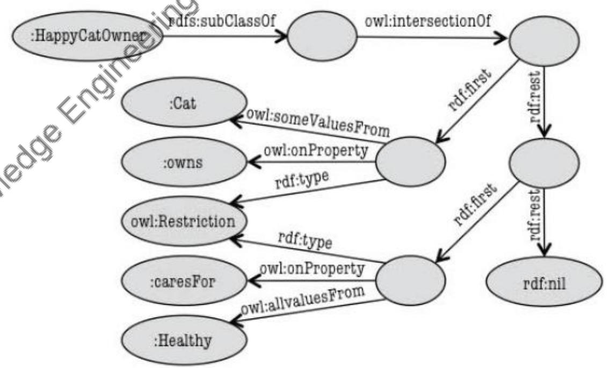

<table><tr><td>Axiom type</td><td>Turtle notation</td><td>DL paraphrase</td></tr><tr><td>Class Equivalence</td><td>[[C]]C owl:equivalentClass [[D]]C.</td><td>C ⊆ D, D ⊆ C</td></tr><tr><td>Class Disjointness</td><td>[[C]]C owl:disjointWith [[D]]C.</td><td>C ∩ D ⊥⊥</td></tr><tr><td>Disjoint Classes</td><td>[] rdf:type owl:AllDisjointClasses; owl:members ([C1]C ... [Cn]C).</td><td>C_i ∩ C_j ⊆⊥ for all 1≤i&lt;j≤n</td></tr><tr><td>Disjoint Union</td><td>[[C]]C owl:disjointUnionOf ([C1]C ... [Cn]C).</td><td>∪i&lt;j&gt;C_i ⊆C
C_i ∩ C_j ⊆⊥ for all 1≤i&lt;j≤n</td></tr><tr><td>Property Equivalence</td><td>[[r]]R owl:equivalentProperty [[s]]R.</td><td>r ⊆ s, s ⊆ r</td></tr><tr><td>Disjoint Properties</td><td>[] rdf:type owl:AllDisjointProperties; owl:members ([r1]R ... [rn]R).</td><td>Dis(r_i, r_j) for all 1≤i&lt;j≤n</td></tr><tr><td>Inverse Properties</td><td>[[r]]R owl:inverseOf [[s]]R.</td><td>Inv(r) ⊆ s</td></tr><tr><td>Property Domain</td><td>[[r]]R rdfs:domain [[C]]C.</td><td>∃r. T ⊆ C</td></tr><tr><td>Property Range</td><td>[[r]]R rdfs:range [[C]]C.</td><td>T ⊆ ∀r.C</td></tr><tr><td>Functional Property</td><td>[[r]]R rdf:type owl:FunctionalProperty .</td><td>T ⊆ ≤1r.T</td></tr><tr><td>Inverse Functional</td><td>[[r]]R rdf:type</td><td>T ⊆ ≤1Inv(r).T</td></tr><tr><td>Property</td><td>owl:InverseFunctionalProperty .</td><td></td></tr><tr><td>Reflexive Property</td><td>[[r]]R rdf:type owl: reflexiveProperty .</td><td>T ⊆ ∃r.Self</td></tr><tr><td>Irreflexive Property</td><td>[[r]]R rdf:type owl: IrreflexiveProperty .</td><td>∃r. Self ⊆ ⊥</td></tr><tr><td>Symmetric Property</td><td>[[r]]R rdf:type owl: SymmetricProperty .</td><td>Inv(r) ⊆ r</td></tr><tr><td>Asymmetric Property</td><td>[[r]]R rdf:type owl: AsymmetricProperty .</td><td>Dis(Inv(r), r)</td></tr><tr><td>Transitive Property</td><td>[[r]]R rdf:type owl: TransitiveProperty .</td><td>r o r ⊆ r</td></tr><tr><td>Different Individuals</td><td>[] rdf:type owl: AllDifferent ; owl:members ( a1 ... an ) .</td><td>ai ≈ aj for all 1≤i&lt;j≤n</td></tr></table>

# ◼ 本体推理举例：Schrodinger 是否为 HappyCatOwner?

ex:Healthy rdfs:subClassOf [owl:complementOf ex:Dead].

ex:Cat rdfs:subClassOf [owl:unionOf(ex:Dead,ex:Alive)].

ex:owns rdfs:subPropertyOf ex:caresFor.

ex:HappyCatOwner rdfs:subClassOf [owl:intersectionOf(

[rdf:type owl:Restriction;owl:onProperty ex:owns;Vowl:someValuesFrom ex:Cat]

rdf:type owl:Restriction;owl:onProperty ex:caresFor;owl:allValuesFrom ex:Healthy])].

ex:schrodinger rdf:type ex:HappyCatOwner.

Knowledge Base

本体（知识库）

Tableau

推理算法

```txt
ex:Healthy rdfs:subClassOf [owl:complementOf ex:Dead]. Knowledge Base   
ex:Cat rdfs:subClassOf [owl:unionOf (ex:Dead, ex:Alive)].   
ex:owns rdfs:subPropertyOf ex:caresFor.   
ex:HappyCatOwner rdfs:subClassOf [owl:intersectionOf( [ rdf:type owl:Restriction; owl:onProperty ex:owns; owl:someValuesFrom ex:Cat], [ rdf:type owl:Restriction; owl:onProperty ex:caresFor; owl:ValuesFrom ex:Healthy])].   
ex:schrodinger rdf:type ex:HappyCatOwner. 
```


ex:HappyCatOwner

# Tableau

ex:Healthy rdfs:subClassOf [owl:complementOf ex:Dead].

ex:Cat rdfs:subClassOf [owl:unionOf(ex:Dead,ex:Alive)].

ex:owns rdfs:subPropertyOf ex:caresFor.

ex:HappyCatOwner rdfs:subClassOf [owl:intersectionOf(

[rdf:type owl:Restriction;owl:onProperty ex:owns;owl:smeValuesFrom ex:Cat],

rdf:type owl:Restriction;owl:onProperty ex:caresFor;owl.allValuesFrom ex:Healthyl)].

ex:schrodinger rdf:type ex:HappyCatOwner.

# Knowledge Base


# Tableau

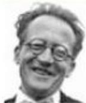

ex:HappyCatOwner

[owl:intersectionof


```txt
ex:Healthy rdfs:subClassOf [owl:complementOf ex:Dead]. Knowledge Base   
ex:Cat rdfs:subClassOf [owl:unionOf (ex:Dead, ex:Alive)].   
ex:owns rdfs:subPropertyOf ex:caresFor.   
ex:HappyCatOwner rdfs:subClassOf [owl:intersectionOf( [rdf:type owl:Restriction; owl:onProperty ex:owns; owl:someValuesFrom ex:Cat], [rdf:type owl:Restriction; owl:onProperty ex:caresFor; owl:ValuesFrom ex:Healthy])] .   
ex:schrodinger rdf:type ex:HappyCatOwner. 
```

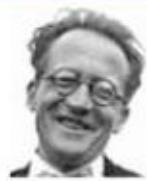

ex:HappyCatOwner

[owl:intersectiono

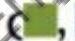

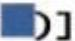


# Tableau

ex:Healthy rdfs:subClassOf [owl:complementOf ex:Dead].

ex:Cat rdfs:subClassOf [owl:unionOf(ex:Dead,ex:Alive)].

ex:owns rdfs:subPropertyOf ex:caresFor.

ex:HappyCatOwner rdfs:subClassOf [owl:intersectionOf(

[rdf:type owl:Restriction;owl:onProperty ex:owns; owlsmeValuesFrom ex:Cat]

[rdf:type owl:Restriction;owl:onProperty ex:caresFor;owlallValuesFrom ex:Healthy])].

ex:schrodinger rdf:type ex:HappyCatOwner.

# Knowledge Base

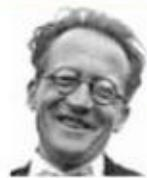

ex:owns

ex:HappyCatOwner

[owl:intersectionof


ex:Cat


# Tableau

ex:Healthy rdfs:subClassOf [owl:complementOf ex:Dead].

ex:Cat rdfs:subClassOf [owl:unionOf(ex:Dead,ex:Alive)].

ex:owns rdfs:subPropertyOf ex:caresFor

ex:HappyCatOwner rdfs:subClassOf [owl:intersectionOf（

[rdf:type owl:Restriction；owl:onProperty ex:owns;owl:soneValuesFrom ex:Cat],

[rdf:type owl:Restriction;owl:onProperty ex:caresFor;owl;allValuesFrom ex:Healthy])].

ex:schrodinger rdf:type ex:HappyCatOwner.

# Knowledge Base

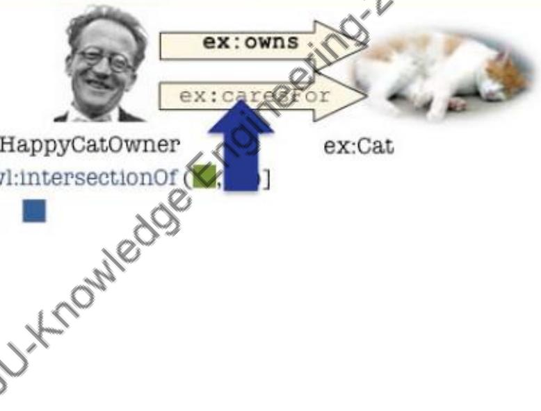

# Tableau

ex:Healthy rdfs:subClassOf [owl:complementOf ex:Dead].

ex:Cat rdfs:subClassOf [owl:unionOf(ex:Dead,ex:Alive)].

ex:owns rdfs:subPropertyOf ex:caresFor.

ex:HappyCatOwner rdfs:subClassOf [owl:intersectionOf(

[rdf:type owl:Restriction;owl:onProperty ex:owns;owl:someValuesFrom ex:Cat],

[rdf:type owl:Restriction;owl:onProperty excaresFor;owlallValuesFrom ex:Healthy])].

ex:schrodinger rdf:type ex:HappyCatOwner.

# Knowledge Base

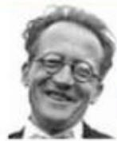

ex:owns

ex:caresFor

ex:HappyCatOwner

[owl:intersectionor


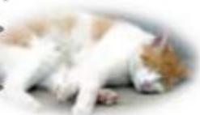

ex:Cat ex:Healthy


# Tableau


ex:Healthy rdfs:subClassOf [owl:complementOf ex:Dead]

ex:Cat rdfs:subClassOf [owl:unionOf(ex:Dead,ex:Alive)]

ex:owns rdfs:subPropertyOf ex:caresFor.

ex:HappyCatOwner rdfs:subClassOf [owl:intersectionOf(

[rdf:type owl:Restriction;owl:onProperty ex:owns;owl;sQmeValuesFrom ex:Cat],

[rdf:type owl:Restriction;owl:onProperty excaresFor;qwlallValuesFrom ex:Healthy])].

ex:schrodinger rdf:type ex:HappyCatOwner.

# Knowledge Base

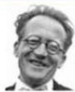

ex:owns

ex:carsFor

ex:HappyCatOwner

[owl:intersectionof


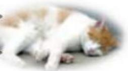

ex:Cat ex:Healthy

(ex:Dead,ex:Alive)]


# Tableau

ex:Healthy rdfs:subClassOf owl:complementOf ex:Dead].

ex:Cat rdfs:subClassOf [owl:unionOf(ex:Dead,ex:Alive)].

ex:owns rdfs:subPropertyOf ex:caresFor.

ex:HappyCatOwner rdfs:subClassOf [owl:intersectionOf(

[rdf:type owl:Restriction;owl:onProperty ex:owns;owl;sQmeValuesFrom ex:Cat],

[rdf:type owl:Restriction;owl:onProperty ex:caresFor;qwlallValuesFrom ex:Healthy])].

ex:schrodinger rdf:type ex:HappyCatOwner.

# Knowledge Base

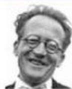

ex:owns

ex:carsFor

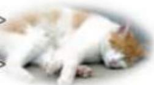

ex:HappyCatOwner

[owl:intersectionof


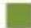


ex:Cat ex:Healthy

[owl:unionof

(ex:Dead,ex:Alive)]

# Tableau

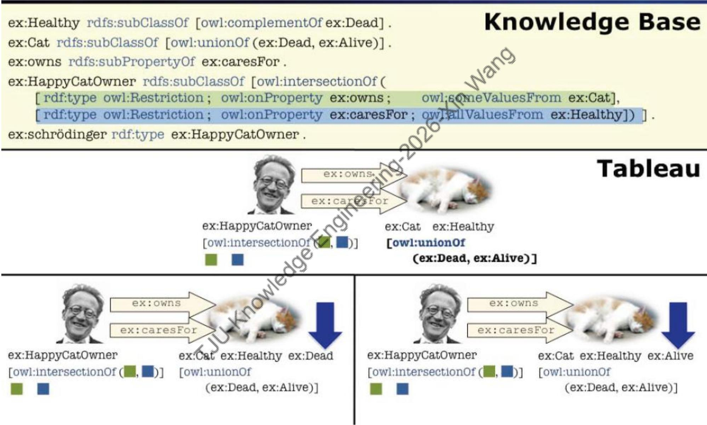

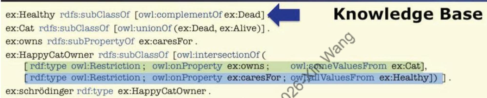

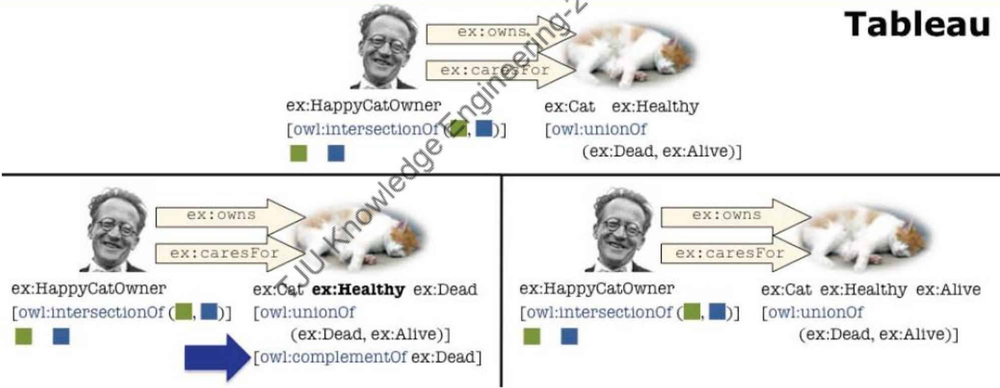

ex:Healthy rdfs:subClassOf [owl:complementof ex:Dead]. Knowledge Base ex:Cat rdfs:subClassOf [owl:unionOf(ex:Dead,ex:Alive)]. ex:owns rdfs:subPropertyOf ex:caresFor. ex:HappyCatOwner rdfs:subClassOf [owl:intersectionOf( [rdf:type owl:Restriction;owl:onProperty ex:owns; owl:someValuesFrom ex:Cat] [rdf:type owl:Restriction;owl:onProperty ex:caresFor;owTallValuesFrom ex:Healthy])] ex:schrodinger rdf:type ex:HappyCatowner.

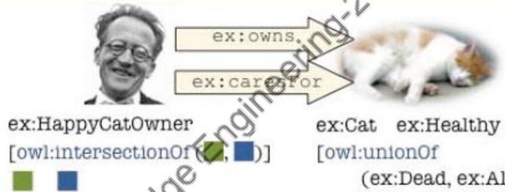

# Tableau


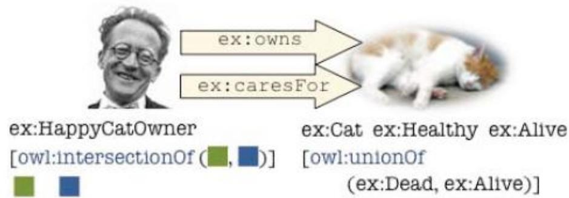

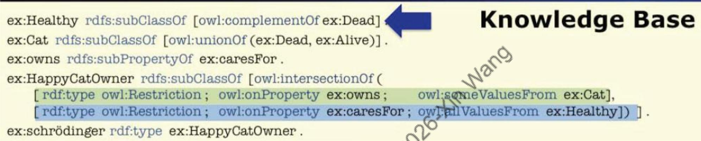

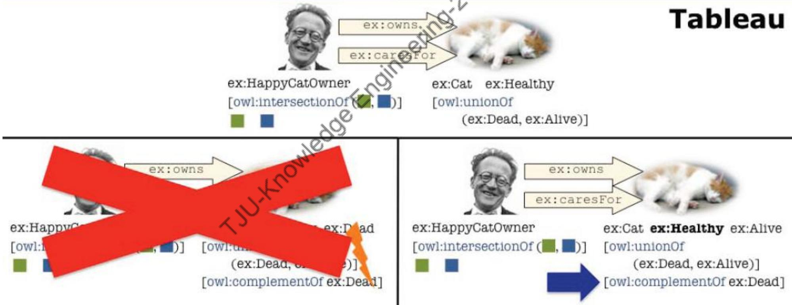

ex:Healthy rdfs:subClassOf [owl:complementOf ex:Dead].

ex:Cat rdfs:subClassOf [owl:unionOf(ex:Dead,ex:Alive)].

ex:owns rdfs:subPropertyOf ex:caresFor.

ex:HappyCatOwner rdfs:subClassOf [owl:intersectionOf(

[rdf:type owl:Restriction;owl:onProperty ex:owns;owlsmeValuesFrom ex:Cat],

[rdf:type owl:Restriction;owl:onProperty ex:caresFor;owjallValuesFrom ex:Healthy])].

ex:schrodinger rdf:type ex:HappyCatOwner.

# Knowledge Base

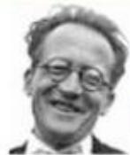

ex:owns

ex:carOFor

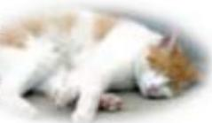

ex:HappyCatOwner

[owl:intersectionof


ex:Cat ex:Healthy

[owl:unionof

(ex:Dead,ex:Alive)]

# Tableau


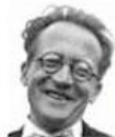

ex:owns

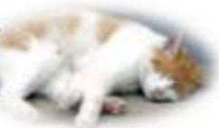

ex:HappyCatOwner

[owl:intersectionof（，

ex:Cat ex:Healthy ex:Alive

(ex:Dead,ex:Alive)]

[owl:complementOf ex:Dead]

ex:Healthy ndfs:subClassOf [owl:complementOf ex:Dead].

ex:Cat rdfseswl:unionOf(ex:Dead,ex:Alive)].

ex:ownsrdfs:surroertexrosFor

ex:HappyCatownerrdfs:subciasorseionof（

[rdf:type owl:Restriction;owl:onroepxwns;owl:someValuesFrom ex:Cat]

[rdf:type owl:Restriction;owl:onProperty exaresFor;owtaliValuesFrom ex:Healthyl)].

ex:schrodingerrdf:type ex:HappyCatOwner.

# Knowledge Base

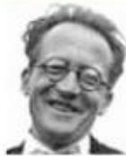

ex:owns

ex:carror

ex:HappyCatOwner

[owl:intersectionof

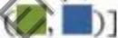

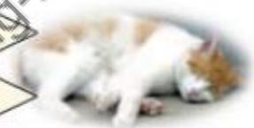

ex:Cat ex:Healthy

(ex:Dead,ex:Alive)]

# Tableau


[owl:complementOfex:Dead]

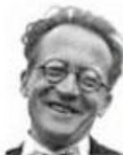

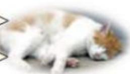

ex:HappyCatOwner

[owl:intersectionof（）]


ex:Cat ex:Healthy ex:Alive

(ex:Dead,exv

[owl:complemen

Dead]

2 语义Web   
03 本体与推理  
04 知识图谱


# 知识工程的发展到知识图谱新阶段

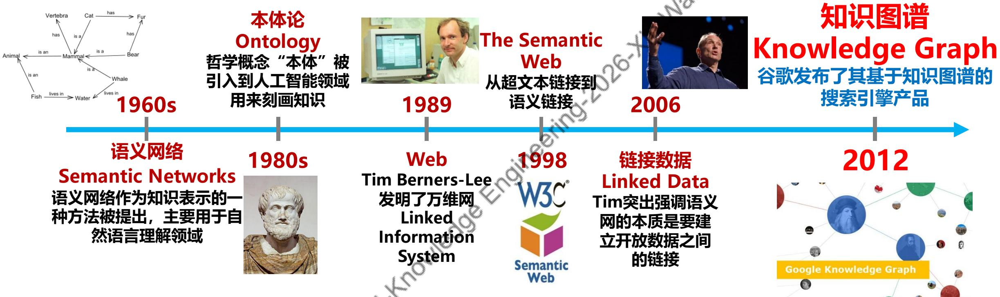

知识表示与知识库- Knowledge Representation / Knowledge Base人工智能研究者陆续提出了大量知识表示的方法，如框架系统、产生式规则、描述逻辑等

知识工程得益于KR、NLP、Web、AI多个方面的发展，走向知识图谱新阶段

# Google Knowledge Graph, 2012


# 李奥納多·達文西作品列表-维基百科，自由的百科全书

https://zh.wikipedia.org/zh/李奥納多·達文西作品列表■转为简体网页

列奥納多·達·芬奇作品列表列出了文藝復興時著名藝術家列奥納多·達·芬奇的已知主要作品，其中

費隆妮葉夫人》；*《救世主》；**《圣母像》（两个版本）；《圣母子与圣安妮》；《蒙娜丽莎》;+《安吉

亞里戰役》；*《女子頭像》；+《麗達與天鵝》：《施洗者圣约翰》·

主要現存作品·有爭議的作品·軼作·其他

# 列奥纳多·达·芬奇-维基百科，自由的百科全书-Wikipedia

https://zh.wikipedia.org/zh-hans/列奥纳多·达·芬奇√

列奥纳多·达·芬奇（意大利语：Leonardoda Vinci；儒略历1452年4月15日-1519年5月2日），又译达文

...在他的作品中，《蒙娜丽莎》是最负盛名且最常被模仿的肖像。..达文西关于人体比例的作品

1498年，现藏于义大利米兰恩宠圣母堂..

生平·科学与工程·个人·代表性作品

# 达芬奇传世作品高清全集吕

art.ifeng.c0m/2015/0625/1600287.shtml <

传统搜索   
网页中关键字检索

2015年6月25日-达芬奇以其画作写实性及具影响力闻名，前者如《蒙娜丽莎》、《最后的晚餐》以写实

著称，后者像《维特鲁威人》对后世影响深远。.如果说《最后的晚餐》是世界最著名的宗教画，那

么，达;芬奇在51岁时自米兰重返佛罗伦萨 芬奇所惯用的描绘公式.过分重视女性眼睛的块面结构(这

# 列奥纳多·达·芬奇

博学者

列奥纳多·达·芬奇，又译达文西，全名列奥纳多·迪·瑟皮耶罗·达·芬奇，是意大利文艺复兴时期的一个博学者：在绘画、音乐、建筑、数学、几何学、解剖学、生理学、动物学、植物学、天文学、气象学、地质学、地理学、物理学、光学、力学、发明、土木工程等领域都有显著的成就。维基百科

生于：1452年4月15日，意大利山村安奇亚诺

逝世于：1519年5月2日，法国昂布瓦斯克劳斯·吕斯城堡

画风：文艺复兴盛期，Earlyrenaissance，文艺复兴意大利文艺复兴，佛罗伦萨画派

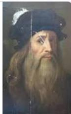

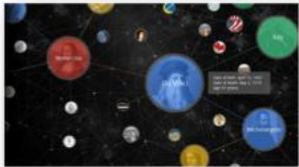

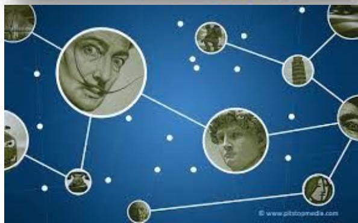

# 关于达芬奇的知识点描述：

• 人物类型  
• 生卒年月日  
• 全名  
• 画风

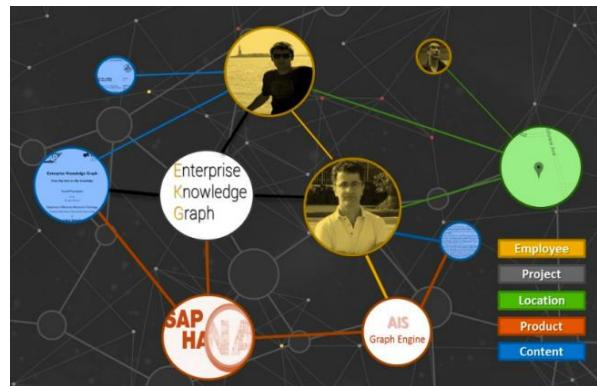

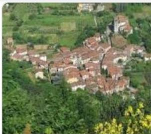


Casa Natale di Leonardo da Vinci

# Anchiano

Anchiano isavillage in the comune of Vinci，Tuscany, central Italy.The village is known for the ancient Villa del Ferrale,with itschapel,anti AntonioeFrancesco Wikipedia

Weather: $9 4 ^ { \circ } F$ $( 3 4 ^ { \circ } \mathsf { C } )$ ,Wind W at 10 mph (16 km/h) $3 3 \%$ Humidity

Hotels:3-staraveraging $\$ 93$ .Viewhotels

Local time:Sunday 6:26PM

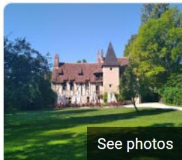

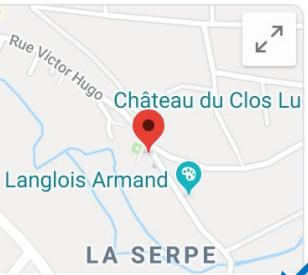

# Chateau du Clos Lucé

Website

Directions

Save

4.4★★★★★ 7,806 Go0gle reviews

# Leonardo da Vinci


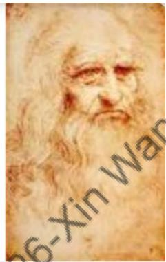

Leonardo di ser Piero da Vinci, more commonly Leonardo da Vinci,was an Italian polymath of theRenaissance whose areas of interest included invention,drawing, painting,sculpture,architecturescience,music, mathematics,engineering,literature,anatomy，geology, astronomy，botany,paleontologyand cartography. Wikipedia work

Born: April15452,Anchianolaly

Died: May2,1519,Chateau du Clos Luce,Amboise, France

Artworks: Mona Lisa, The Last Supper, Salvator Mundi, MORE

On view: Ambrosian Library,Louvre Museum,MORE

Periods: High Renaissance, Early renaissance, Renaissance, Italian Renaissance, Florentine painting

Siblings: Giovanni Ser Piero,Guglielmo Ser Piero,MORE

orks

On view

# Mona Lisa


The Mona Lisa is a half-length portrait painting by the Italian Renaissance artist Leonardo da Vinci that has been described as "the best known,the most visited,themost written about,the most sung about, the most parodied work of art inthe world."Wikipedia

Artist: Leonardo da Vinci

Dimensions:2'6"×1'9"

Location: Louvre Museum (since 1797)

Location

Created: 1503

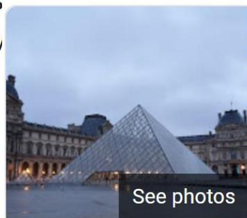

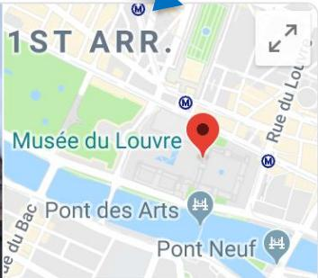

# Louvre Museum

Website

Directions

Save

4.7 ★★★★  154,952 Go0gle reviews

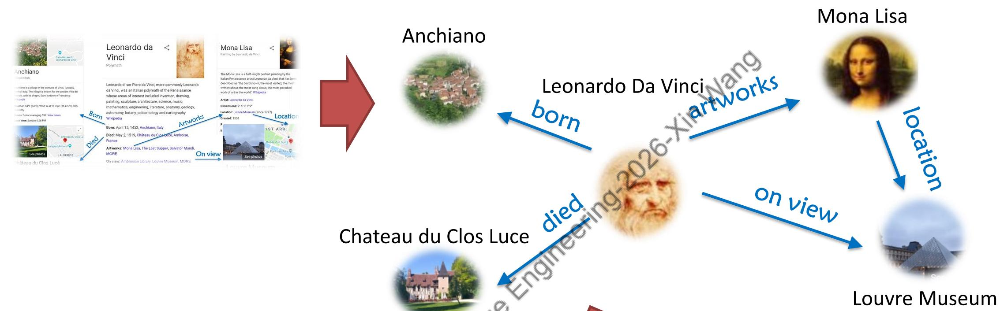

# 知识图谱是三元组的集合

<Leonardo Da Vinci> <born> <Anchiano>   
<Leonardo Da Vinci> <died> <Chateau du Clos Luce>   
<Leonardo Da Vinci> <artworks> <Mona Lisa>   
<Mona Lisa> <location> <Louvre Museum>   
<Leonardo Da Vinci> <on view> <Louvre Museum>

# 三元组 （triple） 是知识的最小单元

多条三元组形成关联数据 （Linked Data）  
Linked Data是关于实例的知识图谱   
“知识图谱” vs “数据图谱”

# RDF（Resource Description Framework）资源描述框架（N-Triples格式）

<http://dbpedia.org/resource/Leonardo_da_Vinci> <http://dbpedia.org/ontology/born> <http://dbpedia.org/resource/Anchiano> . <http://dbpedia.org/resource/Leonardo_da_Vinci> <http://dbpedia.org/ontology/died> <http://dbpedia.org/resource/Clos_Luce> . <http://dbpedia.org/resource/Leonardo_da_Vinci> <http://dbpedia.org/ontology/artworks> <http://dbpedia.org/resource/Mona_Lisa> . <http://dbpedia.org/resource/Mona_Lisa> <http://dbpedia.org/ontology/location> <http://dbpedia.org/resource/Louvre> . <http://dbpedia.org/resource/Leonardo_da_Vinci> <http://dbpedia.org/ontology/onview> <http://dbpedia.org/resource/Louvre> .

# RDF（ Turtle格式）

@prefix dbo: <http://dbpedia.org/ontology/>   
@prefix dbr: <http://dbpedia.org/resource/>

dbr:Leonardo_da_Vinci dbo:born dbr:Anchiano ; dbo:died dbr:Clos_Luce ; dbo:artworks dbr:Mona_Lisa . dbr:Mona_Lisa dbo:location dbr:Louvre . dbr:Leonardo_da_Vinci dbo:onview dbr:Louvre .

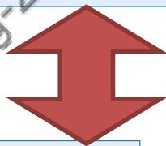

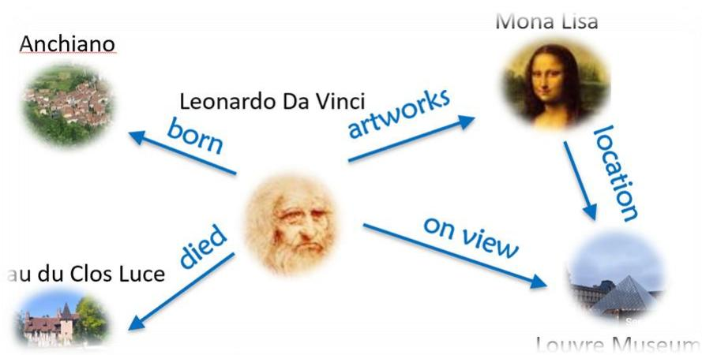

#

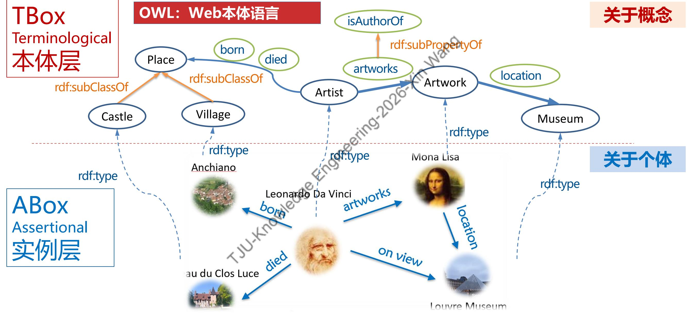

# SPARQL 查询

SELECT ?artist ?work

WHERE {

?artist dbo:artworks ?work .

?work dbo:location dbr:Louvre .

?artist dbo:onview dbr:Louvre .

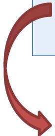

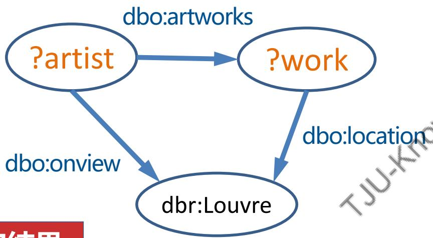

# 查询结果

<table><tr><td>?artist</td><td>?work</td></tr><tr><td>dbr:Leonardo.da_Vinci</td><td>dbr:Mona_Lisa</td></tr></table>

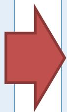

# RDF 知识图谱

dbr:Leonardo_da_Vinci dbo:born dbr:Anchiano ; dbo:died dbr:Clos_Luce ; dbo:artworks dbr:Mona_Lisa . dbr:Mona_Lisa dbo:location dbr:Louvre . dbr:Leonardo_da_Vinci dbo:onview dbr:Louvre .

Anchiano

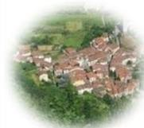

au du Clos Luce

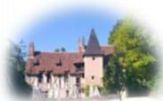

Leonardo Da Vinci

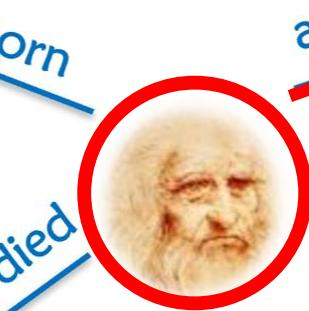

查询是子图匹配过程

N isa

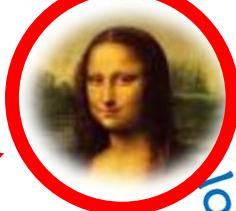


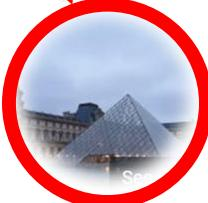

Louvre Museum

# 总结

01 知识工程概述  
02 语义Web   
03 本体与推理  
04 知识图谱

