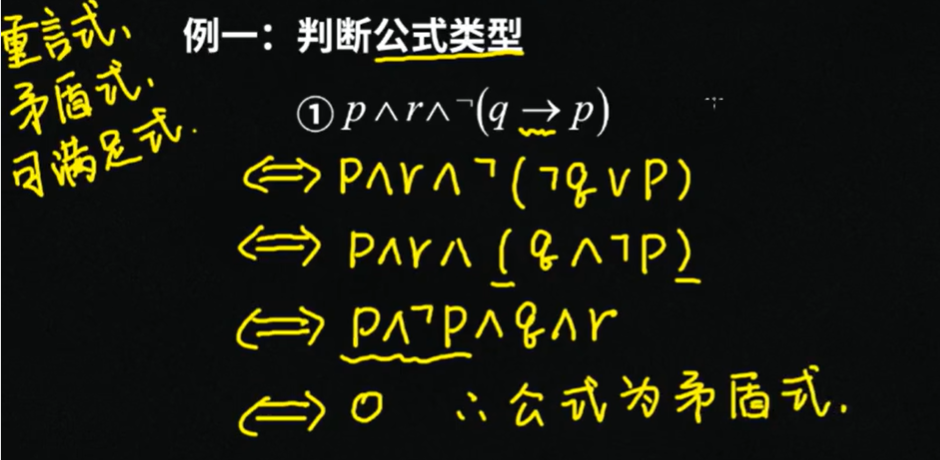
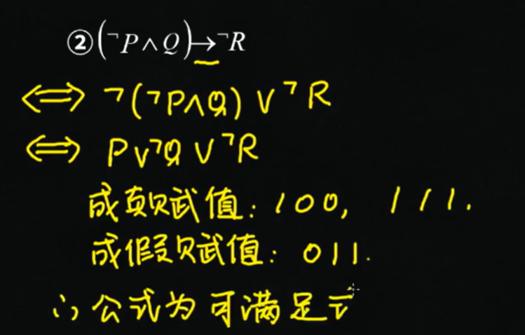
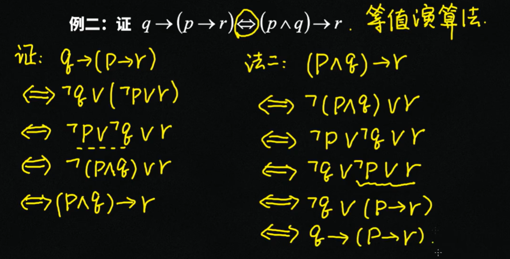
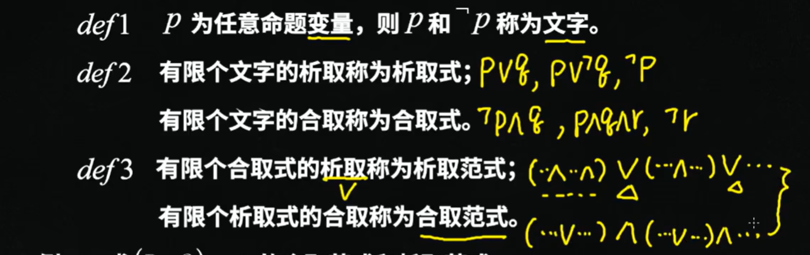

# 命题逻辑等值演算

## 等值式概念
若 $A$ 当且仅当 $B$ 为永真式（重言式），则称 $A$ 和 $B$ 等值，记作 $A$ 逻辑等价于 $B$。

注意：逻辑等价符号是原语言符号，不是连接词。不同教材写法：$A≡B$、$A=B$、$A⇔B$。

## 基本等值式

### 双否律
$\neg \neg A \Leftrightarrow A$

### 幂等律
$A \land A \Leftrightarrow A$
$A \lor A \Leftrightarrow A$

### 交换律
$A \land B \Leftrightarrow B \land A$
$A \lor B \Leftrightarrow B \lor A$

### 结合律
$(A \land B) \land C \Leftrightarrow A \land (B \land C)$
$(A \lor B) \lor C \Leftrightarrow A \lor (B \lor C)$

### 分配律
$A \lor (B \land C) \Leftrightarrow (A \lor B) \land (A \lor C)$ （或对且分配）
$A \land (B \lor C) \Leftrightarrow (A \land B) \lor (A \land C)$

### 德摩根律
$\neg (A \land B) \Leftrightarrow \neg A \lor \neg B$ （且变或）
$\neg (A \lor B) \Leftrightarrow \neg A \land \neg B$ （或变且）

### 吸收律
$A \lor (A \land B) \Leftrightarrow A$
$A \land (A \lor B) \Leftrightarrow A$

### 零律
$A \lor 1 \Leftrightarrow 1$
$A \land 0 \Leftrightarrow 0$

### 同一律
$A \land 1 \Leftrightarrow A$
$A \lor 0 \Leftrightarrow A$

### 排中律
$A \lor \neg A \Leftrightarrow 1$

### 矛盾律
$A \land \neg A \Leftrightarrow 0$

### **蕴含等值式**
$A \to B \Leftrightarrow \neg A \lor B$

### 等价等值式
$A \leftrightarrow B \Leftrightarrow (A \to B) \land (B \to A)$ （充要条件）

### 假言易位
$A \to B \Leftrightarrow \neg B \to \neg A$ （命题等价于其逆否命题）

### 等价否定等值式
$A \leftrightarrow B \Leftrightarrow \neg A \leftrightarrow \neg B$

### 归谬论
$(A \to B) \land (A \to \neg B) \Leftrightarrow \neg A$

## 用等值演算判断公式类型

步骤：
1. 用等值式去掉蕴含、等价等连接词，只保留 $\neg$、$\land$、$\lor$
2. 通过化简判断公式类型

例题：
- 公式化简为含有 $P \land \neg P$ 形式的为矛盾式
- 公式既有成真赋值又有成假赋值为可满足式
- 公式所有赋值都成真为永真式（重言式）

## 证明公式等值

通过等值演算逐步推导，将左端公式转化为右端公式。

示例：证明 $(P \to Q) \to (P \to R) \Leftrightarrow P \to (Q \to R)$
通过蕴含等值式、分配律等逐步推导。

## 析取范式 合取范式
- 命题常元（常量）P：雪是白色的
- 命题变元（变量）P（没有指定具体命题内容）

