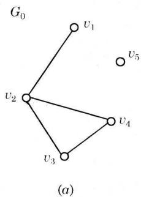
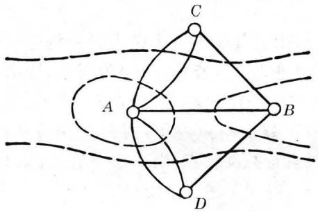
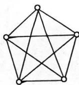

# 第七章 图论

## 7-1 图的基本概念

### 定义7-1.1（图）

一个图是一个三元组 $\langle V(G), E(G), \varphi_G \rangle$，其中 $V(G)$ 是一个非空的结点集合，$E(G)$ 是边集合，$\varphi_G$ 是从边集合 $E$ 到结点无序偶（有序偶）集合上的函数。图亦可简记为 $G = \langle V, E \rangle$，其中 $V$ 是非空结点集，$E$ 是连接结点的边集。

若边 $e_i$ 与结点无序偶 $(v_j, v_k)$ 相关联，则称该边为**无向边**。若边 $e_i'$ 与结点有序偶 $\langle v_j, v_k \rangle$ 相关联，则称该边为**有向边**，$v_j$ 称为起始结点，$v_k$ 称为终止结点。

  *无向图示例*

  *有向图示例*

  *混合图示例*

---

### 定义7-1.2（度数）

在图 $G = \langle V, E \rangle$ 中，与结点 $v (v \in V)$ 关联的边数，称作是该结点的**度数**，记作 $\deg(v)$。

每个环在其对应结点上度数增加 2。

记 $\Delta(G) = \max\{\deg v \mid v \in V(G)\}$，$\delta(G) = \min\{\deg v \mid v \in V(G)\}$，分别称为 $G$ 的**最大度**和**最小度**。

---

### 定理7-1.1（握手定理）

每个图中，结点度数的总和等于边数的两倍。

$$
\sum_{v \in V} \deg(v) = 2|E|
$$

**证明**：因为每条边必关联两个结点，而一条边给予关联的每个结点的度数为 1。因此在一个图中，结点度数的总和等于边数的两倍。□

---

### 定理7-1.2（奇度结点偶数个）

在任何图中，度数为奇数的结点必定是偶数个。

**证明**：设 $V_1$ 和 $V_2$ 分别是 $G$ 中奇数度数和偶数度数的结点集，则由握手定理有

$$
\sum_{v \in V_1} \deg(v) + \sum_{v \in V_2} \deg(v) = \sum_{v \in V} \deg(v) = 2|E|
$$

由于 $\sum_{v \in V_2} \deg(v)$ 是偶数之和，必为偶数，而 $2|E|$ 是偶数，故得 $\sum_{v \in V_1} \deg(v)$ 是偶数。因为奇数个奇数之和为奇数，所以 $|V_1|$ 必为偶数。□

---

### 定义7-1.3（入度与出度）

在有向图中，射入一个结点的边数称为该结点的**入度**，由一个结点射出的边数称为该结点的**出度**。结点的出度与入度之和就是该结点的度数。

---

### 定理7-1.3（入度出度和相等）

在任何有向图中，所有结点的入度之和等于所有结点的出度之和。

**证明**：因为每一条有向边必对应一个入度和一个出度，若一个结点具有一个入度或出度，则必关联一条有向边，所以有向图中各结点入度之和等于边数，各结点出度之和也等于边数。因此，任何有向图中，入度之和等于出度之和。□

---

### 定义7-1.4（多重图）

含有平行边的任何一个图称为**多重图**。不含有平行边和环的图称作**简单图**。

---

### 定义7-1.5（完全图）

简单图 $G = \langle V, E \rangle$ 中，若每一对结点间都有边相连，则称该图为**完全图**。有 $n$ 个结点的无向完全图记作 $K_n$。

---

### 定理7-1.4（完全图边数）

$n$ 个结点的无向完全图 $K_n$ 的边数为 $\displaystyle \frac{1}{2} n (n - 1)$。

**证明**：在 $K_n$ 中，任意两点间都有边相连，$n$ 个结点中任取两点的组合数为 $C_n^2 = \frac{1}{2}n(n-1)$，故 $K_n$ 的边数为 $\frac{1}{2}n(n-1)$。□

---

### 定义7-1.6（补图）

给定一个图 $G$，由 $G$ 中所有结点和所有能使 $G$ 成为完全图的添加边组成的图，称为 $G$ 的相对于完全图的**补图**，或简称为 $G$ 的补图，记作 $\overline{G}$。

---

### 定义7-1.7（子图与生成子图）

设图 $G = \langle V, E \rangle$，如果有图 $G' = \langle V', E' \rangle$，且 $E' \subseteq E$，$V' \subseteq V$，则称 $G'$ 为 $G$ 的**子图**。如果 $G$ 的子图包含 $G$ 的所有结点，则称该子图为 $G$ 的**生成子图**。

---

### 定义7-1.8（子图的补图）

设 $G' = \langle V', E' \rangle$ 是图 $G = \langle V, E \rangle$ 的子图，若给定另外一个图 $G'' = \langle V'', E'' \rangle$ 使得 $E'' = E - E'$，且 $V''$ 中仅包含 $E''$ 的边所关联的结点，则称 $G''$ 是子图 $G'$ 的相对于图 $G$ 的补图。

---

### 定义7-1.9（图的同构）

设图 $G = \langle V, E \rangle$ 及图 $G' = \langle V', E' \rangle$，如果存在一一对应的映射 $g: v_i \to v_i'$ 且 $e = (v_i, v_j)$（或 $\langle v_i, v_j \rangle$）是 $G$ 的一条边，当且仅当 $e' = (g(v_i), g(v_j))$（或 $\langle g(v_i), g(v_j) \rangle$）是 $G'$ 的一条边，则称 $G$ 与 $G'$ **同构**，记作 $G \simeq G'$。从这个定义可以看到，若$G$与$G'$同构，它的充要条件是:两个
图的结点和边分别存在着一一对应，且保持关联关系

两图同构的必要条件：
1. 结点数目相同；
2. 边数相等；
3. 度数相同的结点数目相等。

---

## 7-2 路与回路

### 定义7-2.1（路与回路）

给定图 $G = \langle V, E \rangle$，设 $v_0, v_1, \dots, v_n \in V$，$e_1, e_2, \dots, e_n \in E$，其中 $e_i$ 是关联于结点 $v_{i-1}, v_i$ 的边，交替序列 $v_0 e_1 v_1 e_2 \cdots e_n v_n$ 称为联结 $v_0$ 到 $v_n$ 的**路**。$v_0$ 和 $v_n$ 分别称作路的起点和终点，边的数目 $n$ 称作路的长度。

- 当 $v_0 = v_n$ 时，这条路称作**回路**。
- 若一条路中所有的边均不相同，称作**迹**。
- 若一条路中所有的结点均不相同，则称作**通路**。
- 闭的通路，即除 $v_0 = v_n$ 外，其余的结点均不相同的路，就称作**圈**。

---

### 定理7-2.1（路长缩减定理）

在一个具有 $n$ 个结点的图中，如果从结点 $v_j$ 到结点 $v_k$ 存在一条路，则从结点 $v_j$ 到结点 $v_k$ 必存在一条不多于 $n - 1$ 条边的路。

**证明**：如果从结点 $v_j$ 到结点 $v_k$ 存在一条路，该路上的结点序列是 $v_j \cdots v_i \cdots v_k$，如果在这条路中有 $l$ 条边，则序列中必有 $l+1$ 个结点。若 $l > n-1$，则必有结点 $v_s$ 在序列中不止一次出现，即必有结点序列 $v_j \cdots v_s \cdots v_s \cdots v_k$。在路中去掉从 $v_s$ 到 $v_s$ 的这些边，仍是 $v_j$ 到 $v_k$ 的一条路，但此路比原来的路边数要少。如此重复进行下去，必可得到一条从 $v_j$ 到 $v_k$ 的不多于 $n-1$ 条边的路。□

**推论**：在一个具有 $n$ 个结点的图中，若从结点 $v_j$ 到 $v_k$ 存在一条路，则必存在一条从 $v_j$ 到 $v_k$ 而边数小于 $n$ 的通路。

---

### 定义7-2.2（连通）

在无向图 $G$ 中，结点 $u$ 和 $v$ 之间若存在一条路，则称结点 $u$ 和结点 $v$ 是**连通**的。结点之间的连通性是结点集 $V$ 上的等价关系。

---

### 定义7-2.3（连通图与连通分支）

若图 $G$ 只有一个连通分支，则称 $G$ 是**连通图**。图 $G$ 的连通分支数记作 $W(G)$。

---

### 定义7-2.4（点割集与连通度）

设无向图 $G = \langle V, E \rangle$ 为连通图，若有点集 $V_1 \subset V$，使图 $G$ 删除了 $V_1$ 的所有结点后，所得的子图是不连通图，而删除了 $V_1$ 的任何真子集后，所得到的子图仍是连通图，则称 $V_1$ 是 $G$ 的一个**点割集**。若某一个结点构成一个点割集，则称该结点为**割点**。

若 $G$ 不是完全图，定义 $k(G) = \min\{|V_1| \mid V_1 \text{ 是 } G \text{ 的点割集}\}$ 为 $G$ 的**点连通度（或连通度）**。规定 $k(K_p) = p - 1$。

---

### 定义7-2.5（边割集与边连通度）

设无向图 $G = \langle V, E \rangle$ 为连通图，若有边集 $E_1 \subset E$，使图 $G$ 中删除了 $E_1$ 中的所有边后得到的子图是不连通图，而删除了 $E_1$ 的任一真子集后得到的子图是连通图，则称 $E_1$ 是 $G$ 的一个**边割集**。若某一个边构成一个边割集，则称该边为**割边（或桥）**。

定义非平凡图 $G$ 的**边连通度**为：$\lambda(G) = \min\{|E_1| \mid E_1 \text{ 是 } G \text{ 的边割集}\}$。

---

### 定理7-2.2（k≤λ≤δ）

对于任何一个图 $G$，有

$$
k(G) \leqslant \lambda(G) \leqslant \delta(G)
$$

**证明**：若 $G$ 不连通，则 $k(G) = \lambda(G) = 0$，故上式成立。

若 $G$ 连通：

1. 证明 $\lambda(G) \leqslant \delta(G)$：如果 $G$ 是平凡图，则 $\lambda(G) = 0 \leqslant \delta(G)$；若 $G$ 是非平凡图，则因每一结点的所有关联边必含一个边割集，故 $\lambda(G) \leqslant \delta(G)$。

2. 再证 $k(G) \leqslant \lambda(G)$：
   (a) 设 $\lambda(G) = 1$，即 $G$ 有一割边，显然这时 $k(G) = 1$，上式成立。
   (b) 设 $\lambda(G) \geqslant 2$，则必可删去某 $\lambda(G)$ 条边使 $G$ 不连通，而删去其中 $\lambda(G)-1$ 条边它仍是连通的，且有一条桥 $e = (u,v)$。对 $\lambda(G)-1$ 条边中的每一条边都选取一个不同于 $u,v$ 的端点，把这些端点删去则必至少删去 $\lambda(G)-1$ 条边。若这样产生的图是不连通的，则 $k(G) \leqslant \lambda(G)-1 < \lambda(G)$；若这样产生的图是连通的，则 $e$ 仍是桥，此时再删去 $u$ 或 $v$，就必产生一个不连通图，故 $k(G) \leqslant \lambda(G)$。

由 1) 和 2) 得 $k(G) \leqslant \lambda(G) \leqslant \delta(G)$。□

---

### 定理7-2.3（割点充要条件）

一个连通无向图 $G$ 中的结点 $v$ 是割点的充分必要条件是存在两个结点 $u$ 和 $w$，使得结点 $u$ 和 $w$ 的每一条路都通过 $v$。

**证明**：

**必要性**：若结点 $v$ 是连通图 $G$ 的一个割点，设删去 $v$ 得到子图 $G'$，则 $G'$ 至少包含两个连通分支。设其为 $G_1 = \langle V_1, E_1 \rangle$，$G_2 = \langle V_2, E_2 \rangle$，任取 $u \in V_1$，$w \in V_2$。因为 $G$ 是连通的，故在 $G$ 中必有一条连结 $u$ 和 $w$ 的路 $C$，但 $u$ 和 $w$ 在 $G'$ 中属于两个不同的连通分支，故 $u$ 和 $w$ 必不连通，因此 $C$ 必须通过 $v$，故 $u$ 和 $w$ 之间的任意一条路都通过 $v$。

**充分性**：若连通图 $G$ 中某两个结点的每一条路都通过 $v$，删去 $v$ 得到子图 $G'$，在 $G'$ 中这两个结点必然不连通，故 $v$ 是图 $G$ 的割点。□

---

### 定义7-2.6（有向图的连通性）

在简单有向图 $G$ 中：

- 任何一对结点间，至少有一个结点到另一个结点是可达的，则称这个图是**单侧连通**的。
- 如果对于图 $G$ 中的任何一对结点两者之间是相互可达的，则称这个图是**强连通**的。
- 如果在图 $G$ 中略去边的方向，将它看成无向图后，图是连通的，则称该图为**弱连通**的。

---

### 定理7-2.4（强连通充要条件）

一个有向图是强连通的，当且仅当 $G$ 中有一个回路，它至少包含每个结点一次。

**证明**：

**充分性**：如果 $G$ 中有一个回路，它至少包含每个结点一次，则 $G$ 中任两个结点都是相互可达的，故 $G$ 是强连通图。

**必要性**：如果有向图 $G$ 是强连通的，则任两个结点都是相互可达的，故必可作一回路经过图中所有各点。若不然则必有一回路不包含某一结点 $v$，并且 $v$ 与回路上的各结点就不是相互可达，与强连通条件矛盾。□

---

### 定义7-2.7（强/单侧/弱分图）

在简单有向图中：

- 具有强连通性质的最大子图，称为**强分图**。
- 具有单侧连通性质的最大子图，称为**单侧分图**。
- 具有弱连通性质的最大子图，称为**弱分图**。

---

### 定理7-2.5（强分图唯一性）

在有向图 $G = \langle V, E \rangle$ 中，它的每一个结点位于且只位于一个强分图中。

**证明**：

1. 假设 $v \in V$，令 $S$ 是 $G$ 中所有与 $v$ 相互可达的结点的集合，当然 $v$ 也在 $S$ 之中，而 $S$ 是 $G$ 的一个强分图，因此 $G$ 的每一结点必位于一个强分图中。

2. 假设 $v$ 位于两个不同的强分图 $S_1$ 与 $S_2$ 之中，因为 $S_1$ 中每个结点与 $v$ 相互可达，而 $v$ 与 $S_2$ 中每个结点也相互可达，故 $S_1$ 中任何一结点与 $S_2$ 中任何一个结点通过 $v$ 都相互可达，这与 $S_1$ 为强分图的极大性矛盾。故 $G$ 的每一结点只能位于一个强分图之中。□

---

## 7-3 图的矩阵表示

### 定义7-3.1（邻接矩阵）

设 $G = \langle V, E \rangle$ 是一个简单图，它有 $n$ 个结点 $V = \{v_1, v_2, \dots, v_n\}$，则 $n$ 阶方阵 $A(G) = (a_{ij})$ 称为 $G$ 的**邻接矩阵**，其中

$$
a_{ij} = \begin{cases}
1, & v_i \text{ adj } v_j \\
0, & v_i \text{ nadj } v_j \text{ 或 } i = j
\end{cases}
$$

---

### 定理7-3.1（邻接矩阵路径计数）

设 $A(G)$ 是图 $G$ 的邻接矩阵，则 $(A(G))^l$ 中的 $i$ 行 $j$ 列元素 $a_{ij}^{(l)}$ 等于 $G$ 中联结 $v_i$ 与 $v_j$ 的长度为 $l$ 的路的数目。

**证明**：对 $l$ 用数学归纳法。

当 $l = 2$ 时，$a_{ij}^{(2)} = \sum_{k=1}^{n} a_{ik} \cdot a_{kj}$，其中 $a_{ik} = 1$ 当且仅当 $v_i$ 与 $v_k$ 间有边，$a_{kj} = 1$ 当且仅当 $v_k$ 与 $v_j$ 间有边，故 $a_{ik} \cdot a_{kj} = 1$ 当且仅当存在一条 $v_i \to v_k \to v_j$ 长度为 2 的路。求和即得所有从 $v_i$ 到 $v_j$ 长度为 2 的路的数目，结论成立。

设命题对 $l$ 成立，由 $(A(G))^{l+1} = A(G) \cdot (A(G))^l$，故 $a_{ij}^{(l+1)} = \sum_{k=1}^{n} a_{ik} \cdot a_{kj}^{(l)}$。根据邻接矩阵定义 $a_{ik}$ 表示联结 $v_i$ 与 $v_k$ 的长度为 1 的路的数目，$a_{kj}^{(l)}$ 是联结 $v_k$ 与 $v_j$ 的长度为 $l$ 的路的数目，故每一项表示由 $v_i$ 经过一条边到 $v_k$，再由 $v_k$ 经过一条长度为 $l$ 的路到 $v_j$ 的总长度为 $l+1$ 的路的数目。对所有 $k$ 求和即得所有从 $v_i$ 到 $v_j$ 的长度为 $l+1$ 的路的数目，故命题对 $l+1$ 成立。□

---

### 定义7-3.2（可达性矩阵）

令 $G = \langle V, E \rangle$ 是一个简单有向图，$|V| = n$，定义 $n \times n$ 矩阵 $P = (p_{ij})$，其中

$$
p_{ij} = \begin{cases}
1, & \text{从 } v_i \text{ 到 } v_j \text{ 至少存在一条路} \\
0, & \text{从 } v_i \text{ 到 } v_j \text{ 不存在路}
\end{cases}
$$

称矩阵 $P$ 是图 $G$ 的**可达性矩阵**。

---

### 定义7-3.3（无向图完全关联矩阵）

给定无向图 $G$，令 $v_1, v_2, \dots, v_p$ 和 $e_1, e_2, \dots, e_q$ 分别记为 $M(G)$ 的结点和边，则矩阵 $M(G) = (m_{ij})$，其中

$$
m_{ij} = \begin{cases}
1, & \text{若 } v_i \text{ 关联 } e_j \\
0, & \text{若 } v_i \text{ 不关联 } e_j
\end{cases}
$$

称 $M(G)$ 为**完全关联矩阵**。

---

### 定义7-3.4（有向图完全关联矩阵）

给定简单有向图 $G = \langle V, E \rangle$，$p \times q$ 阶矩阵 $M(G) = (m_{ij})$，其中

$$
m_{ij} = \begin{cases}
1, & \text{若在 } G \text{ 中 } v_i \text{ 是 } e_j \text{ 的起点} \\
-1, & \text{若在 } G \text{ 中 } v_i \text{ 是 } e_j \text{ 的终点} \\
0, & \text{若 } v_i \text{ 与 } e_j \text{ 不关联}
\end{cases}
$$

称 $M(G)$ 为 $G$ 的**完全关联矩阵**。

---

## 7-4 欧拉图与汉密尔顿图

### 定义7-4.1（欧拉路与欧拉图）

给定无孤立结点图 $G$：

- 若存在一条路，经过图中每边一次且仅一次，该条路称为**欧拉路**。
- 若存在一条回路，经过图中每边一次且仅一次，该回路称为**欧拉回路**。
- 具有欧拉回路的图称作**欧拉图**。

  *哥尼斯堡七桥问题的图论模型：4结点7边*

---

### 定理7-4.1（欧拉路判定）

无向图 $G$ 具有一条欧拉路，当且仅当 $G$ 是连通的，且有零个或两个奇数度结点。

**证明**：

**必要性**：设 $G$ 具有欧拉路，即有点边序列 $v_0 e_1 v_1 e_2 v_2 \cdots e_k v_k$，其中结点可能重复出现但边不重复。因为欧拉路经过所有结点，故 $G$ 必连通。对任意一个不是端点的结点 $v_i$，在欧拉路中每当 $v_i$ 出现一次，必关联两条边，故 $\deg(v_i)$ 必为偶数。对于端点，若 $v_0 = v_k$，则 $\deg(v_0)$ 为偶数，即 $G$ 中无奇数度结点；若 $v_0$ 与 $v_k$ 不同，则 $\deg(v_0)$ 和 $\deg(v_k)$ 均为奇数，$G$ 中就有两个奇数度结点。

**充分性**：若 $G$ 连通，有零个或两个奇数度结点，构造欧拉路如下：

（1）若有两个奇数度结点，则从其中一个开始构造一条迹，每边仅取一次，由于 $G$ 连通，必可到达另一奇数度结点停下，得到迹 $L$。若 $G$ 中没有奇数度结点，则从任一结点出发，必可回到该结点，得到闭迹 $L_1$。
（2）若 $L_1$ 通过了 $G$ 的所有边，则 $L_1$ 就是欧拉路。
（3）若 $G$ 中去掉 $L_1$ 后得到子图 $G'$，则 $G'$ 中每个结点度数为偶数，且 $L_1$ 与 $G'$ 至少有一个公共结点 $v_i$，在 $G'$ 中由 $v_i$ 出发重复（1）的方法，得到闭迹 $L_2$。
（4）将 $L_1$ 与 $L_2$ 组合，若恰是 $G$ 则得欧拉路，否则重复（3）直到得到一条经过 $G$ 中所有边的欧拉路。□

**推论**：无向图 $G$ 具有一条欧拉回路，当且仅当 $G$ 是连通的，并且所有结点度数全为偶数。

---

### 定义7-4.3（汉密尔顿路与汉密尔顿图）

给定图 $G$：

- 若存在一条路经过图中的每个结点恰好一次，这条路称作**汉密尔顿路**。
- 若存在一条回路，经过图中的每个结点恰好一次，这条回路称作**汉密尔顿回路**。
- 具有汉密尔顿回路的图称作**汉密尔顿图**。

  *汉密尔顿十二面体图（20个结点，周游世界问题）*

---

### 定理7-4.3（汉密尔顿图必要条件）

若图 $G = \langle V, E \rangle$ 具有汉密尔顿回路，则对于结点集 $V$ 的每个非空子集 $S$ 均有 $W(G - S) \leqslant |S|$ 成立，其中 $W(G - S)$ 是 $G - S$ 中连通分支数。

**证明**：设 $C$ 是 $G$ 的一条汉密尔顿回路，则对于 $V$ 的任何一个非空子集 $S$，在 $C$ 中删去 $S$ 中任一结点 $a_1$，则 $C - a_1$ 是连通的非回路。若再删去 $S$ 中另一结点 $a_2$，则 $W(C - a_1 - a_2) \leqslant 2$。由归纳法可得 $W(C - S) \leqslant |S|$。同时 $C - S$ 是 $G - S$ 的一个生成子图，因而 $W(G - S) \leqslant W(C - S)$。所以 $W(G - S) \leqslant |S|$。□

---

### 定理7-4.4（汉密尔顿路充分条件）

设 $G$ 是具有 $n$ 个结点的简单图，如果 $G$ 中每一对结点度数之和大于等于 $n - 1$，则在 $G$ 中存在一条汉密尔顿路。

**证明**：先证 $G$ 是连通图。若 $G$ 有两个或更多个互不连通的分图，设一个分图有 $n_1$ 个结点，另一分图有 $n_2$ 个结点，任取 $v_1 \in V_1$，$v_2 \in V_2$，则 $\deg(v_1) \leqslant n_1 - 1$，$\deg(v_2) \leqslant n_2 - 1$，故 $\deg(v_1) + \deg(v_2) \leqslant n_1 + n_2 - 2 < n - 1$，与题设矛盾，故 $G$ 连通。

其次，从一条边出发构成一条路，证明它是汉密尔顿路。设在 $G$ 中有 $p-1$ 条边的路，$p < n$，结点序列为 $v_1, v_2, \dots, v_p$。若 $v_1$ 或 $v_p$ 邻接于不在这条路上的结点，则可扩展这条路。否则 $v_1$ 和 $v_p$ 都只邻接于这条路上的结点，可证存在一条包含 $v_1, v_2, \dots, v_p$ 的回路。由 $G$ 连通，存在回路外结点与回路中某结点邻接，从而可得到一条更长的路。重复进行直到得到 $n-1$ 条边的路，即汉密尔顿路。□

---

### 定理7-4.5（汉密尔顿回路充分条件）

设 $G$ 是具有 $n$ 个结点的简单图，如果 $G$ 中每一对结点度数之和大于等于 $n$，则在 $G$ 中存在一条汉密尔顿回路。

**证明**：由定理7-4.4可知必有一条汉密尔顿路，设为 $v_1 v_2 \cdots v_n$。如果 $v_1$ 与 $v_n$ 邻接，则定理得证。

如果 $v_1$ 与 $v_n$ 不邻接，假设 $v_1$ 邻接于 $\{v_{i_1}, v_{i_2}, \dots, v_{i_k}\}$（$2 \leqslant i_j \leqslant n-1$），可以证明 $v_n$ 必邻接于 $v_{i_1-1}, v_{i_2-1}, \dots, v_{i_k-1}$ 中之一。若不邻接，则 $v_n$ 至多邻接于 $n-k-1$ 个结点，因而 $\deg(v_n) \leqslant n-k-1$，而 $\deg(v_1) = k$，故 $\deg(v_1) + \deg(v_n) \leqslant n-1$，与题设矛盾。所以必有汉密尔顿回路 $v_1 v_2 \cdots v_{j-1} v_n v_{n-1} \cdots v_j v_1$。□

---

### 定义7-4.4（图的闭包）

给定图 $G = \langle V, E \rangle$ 有 $n$ 个结点，若将图 $G$ 中度数之和至少是 $n$ 的非邻接结点连接起来得图 $G'$，对图 $G'$ 重复上述步骤，直到不再有这样的结点对存在为止，所得到的图，称为原图 $G$ 的**闭包**，记作 $C(G)$。

---

### 定理7-4.6（闭包与汉密尔顿图）

当且仅当一个简单图的闭包是汉密尔顿图时，这个简单图是汉密尔顿图。

**证明**：证明略。

---

## 7-5 平面图

### 定义7-5.1（平面图）

设 $G = \langle V, E \rangle$ 是一个无向图，如果能够把 $G$ 的所有结点和边画在平面上，且使得任何两条边除了端点外没有其他的交点，就称 $G$ 是一个**平面图**。

---

### 定义7-5.2（面与边界）

设 $G$ 是一连通平面图，由图中的边所包围的区域，在区域内既不包含图的结点，也不包含图的边，这样的区域称为 $G$ 的一个**面**，包围该面的诸边所构成的回路称为这个面的**边界**。面的边界的回路长度称作是该面的**次数**，记为 $\deg(r)$。在图形之外不受边界约束的面称作**无限面**。

---

### 定理7-5.1（面次数和）

一个有限平面图，面的次数之和等于其边数的两倍。

$$
\sum \deg(r_i) = 2|E|
$$

**证明**：因为任何一条边，或者是两个面的公共边，或者在一个面中作为边界被重复计算两次，故面的次数之和等于其边数的两倍。□

---

### 定理7-5.2（欧拉公式）

设有一个连通的平面图 $G$，共有 $v$ 个结点，$e$ 条边和 $r$ 个面，则

$$
v - e + r = 2
$$

**证明**：对边数 $e$ 用归纳法。

（1）若 $G$ 为一个孤立结点，则 $v=1$，$e=0$，$r=1$，故 $v-e+r=2$ 成立。
（2）若 $G$ 为一条边，即 $v=2$，$e=1$，$r=1$，则 $v-e+r=2$ 成立。
（3）设 $G$ 为 $k$ 条边时欧拉公式成立，即 $v_k - e_k + r_k = 2$。考察 $G$ 为 $k+1$ 条边时的情况：

在 $k$ 条边的连通图上增加一条边，使其仍为连通图，只有两种情况：

a) 加上一个新结点 $Q_2$，$Q_2$ 与图上的一点 $Q_1$ 相连，此时 $v_k$ 和 $e_k$ 都增加 1，而面数 $r_k$ 未变，故 $(v_k+1) - (e_k+1) + r_k = v_k - e_k + r_k = 2$。

b) 用一条边连接图上的两已知点 $Q_1$ 和 $Q_2$，此时 $e_k$ 和 $r_k$ 都增加 1 而结点数 $v_k$ 未变，故 $v_k - (e_k+1) + (r_k+1) = v_k - e_k + r_k = 2$。

由归纳法，欧拉公式对一切连通平面图成立。□

---

### 定理7-5.3（简单平面图边数界）

设 $G$ 是一个有 $v$ 个结点，$e$ 条边的连通简单平面图，若 $v \geqslant 3$，则

$$
e \leqslant 3v - 6
$$

**证明**：设连通平面图 $G$ 的面数为 $r$。当 $v=3$，$e=2$ 时上式显然成立。除此以外若 $e \geqslant 3$，则每一面的次数不小于 3。由定理7-5.1，各面次数之和为 $2e$，因此 $2e \geqslant 3r$，即 $r \leqslant \frac{2}{3}e$。代入欧拉公式得

$$
2 = v - e + r \leqslant v - e + \frac{2}{3}e = v - \frac{e}{3}
$$

即 $6 \leqslant 3v - e$，亦即 $e \leqslant 3v - 6$。□

---

### 定义7-5.3（2度结点内同构）

给定两个图 $G_1$ 和 $G_2$，如果它们是同构的，或者通过反复插入或除去度数为 2 的结点后，使 $G_1$ 与 $G_2$ 同构，则称该两图是在**2度结点内同构**的。

---

### 定理7-5.4（Kuratowski定理）

一个图是平面图，当且仅当它不包含与 $K_{3,3}$ 或 $K_5$ 在2度结点内同构的子图。

**证明**：$K_{3,3}$ 和 $K_5$ 常称作库拉托夫斯基图。该定理的证明较长，从略。

  *$K_5$（5结点10边，非平面图）*

  *$K_{3,3}$（完全二分图，非平面图）*

---

## 7-6 对偶图与着色

### 定义7-6.1（对偶图）

给定平面图 $G = \langle V, E \rangle$，它具有面 $F_1, F_2, \dots, F_n$，若有图 $G^{*} = \langle V^{*}, E^{*} \rangle$ 满足下述条件：

1. 对于图 $G$ 的任一个面 $F_i$，内部有且仅有一个结点 $v_i^{*} \in V^{*}$。
2. 对于图 $G$ 的面 $F_i, F_j$ 的公共边界 $e_k$，存在且仅存在一条边 $e_k^{*} \in E^{*}$，使 $e_k^{*} = (v_i^{*}, v_j^{*})$，且 $e_k^{*}$ 与 $e_k$ 相交。
3. 当且仅当 $e_k$ 只有一个面 $F_i$ 的边界时，$v_i^{*}$ 存在一个环 $e_k^{*}$。

则称图 $G^{*}$ 是图 $G$ 的**对偶图**。

  *对偶图示例：实线为原图，虚线为对偶图*

---

### 定义7-6.2（自对偶图）

如果图 $G$ 的对偶图 $G^*$ 同构于 $G$，则称 $G$ 是**自对偶图**。

---

### 韦尔奇·鲍威尔染色法(Welch Powell) 
对图G进行着色，其方法是:
- 将图G 中的结点按照度数的递减次序进行排列。(这种排列可能并不是唯一的，因为有些点有相同度数。)
- 用第一种颜色对第一点着色，并且按排列次序，对与前面着色点不邻接的每一点着上同样的颜色。
- 用第二种颜色对尚未着色的点重复b) ，用第三种颜色继续这种做法，直到所有的点全部着上色为止。

--- 
### 定理7-6.1（完全图着色数）

对于 $n$ 个结点的完全图 $K_n$，有 $\chi(K_n) = n$。

**证明**：因为完全图的每一个结点与其他各个结点都邻接，故 $n$ 个结点的着色数不能少于 $n$；又 $n$ 个结点的着色数至多为 $n$，故 $\chi(K_n) = n$。

---

### 定理7-6.2（平面图度≤5结点）

设 $G$ 为一个至少具有三个结点的连通平面图，则 $G$ 中必有一个结点 $u$，使得 $\deg(u) \leqslant 5$。

**证明**：设 $G = \langle V, E \rangle$，$|V| = v$，$|E| = e$。若 $G$ 的每一个结点 $u$ 都有 $\deg(u) \geqslant 6$，则因 $\sum_{i=1}^{v} \deg(v_i) = 2e$，故 $2e \geqslant 6v$，所以 $e \geqslant 3v > 3v - 6$，与定理7-5.3矛盾。

---

## 7-7 树与生成树

### 定义7-7.1（树）

一个连通且无回路的无向图称为**树**。树中度数为 1 的结点称为**树叶**，度数大于 1 的结点称为**分枝点**或内点。一个无回路的无向图称作**森林**，它的每个连通分图是树。

---

### 定理7-7.1（树的等价定义）

给定图 $T$，以下关于树的定义是等价的：

1. 无回路的连通图。
2. 无回路且 $e = v - 1$，其中 $e$ 是边数，$v$ 是结点数。
3. 连通且 $e = v - 1$。
4. 无回路，但增加一条新边，得到一个且仅有一个回路。
5. 连通，但删去任一边后便不连通。
6. 每一对结点之间有一条且仅有一条路。

**证明**：$(1) \Rightarrow (2)$：对 $v$ 用归纳法。$v=2$ 时 $e=1=v-1$ 成立。假设 $v=k-1$ 时成立，$v=k$ 时无回路且连通，故至少有一条边其一个端点 $u$ 的度数为 1。删去 $u$ 得 $k-1$ 个结点的连通无回路图 $T'$，由归纳假设 $e'=(k-1)-1=k-2$，故原图 $T$ 的边数 $e=e'+1=k-1$，即 $e=v-1$。

$(2) \Rightarrow (3)$：若 $T$ 不连通且有 $k(k\geqslant 2)$ 个连通分支，每个分支连通无回路，则 $e = \sum(v_i-1) = v-k$，但 $e=v-1$，故 $k=1$，矛盾。

$(3) \Rightarrow (4)$：$T$ 连通且 $e=v-1$。可证至少有一个结点度数为 1，删去它及其关联边，由归纳假设知 $T$ 无回路。若在连通图 $T$ 中增加新边，则该边与 $T$ 中已存在的唯一一条路构成一个回路，且该回路唯一。

$(4) \Rightarrow (5)$：若 $T$ 不连通，则存在结点 $u_i$ 与 $u_j$ 之间没有路，加边 $\{u_i,u_j\}$ 不会产生回路，与 (4) 矛盾。又因 $T$ 无回路，故删去任一边图就不连通。

$(5) \Rightarrow (6)$：由连通性知任两结点间有一条路。若存在两点间有多于一条的路，则 $T$ 中必有回路，删去该回路上任一条边图仍连通，与 (5) 矛盾。

$(6) \Rightarrow (1)$：任两结点间有唯一一条路，则 $T$ 必连通。若有回路，则回路上任两点间有两条路，与 (6) 矛盾。□

---

### 定理7-7.2（树至少两片树叶）

任一棵树中至少有两片树叶。

**证明**：设树 $T = \langle V, E \rangle$，$|V| = v$。因为 $T$ 是连通图，对于任意 $v_i \in T$ 有 $\deg(v_i) \geqslant 1$，且 $\sum \deg(v_i) = 2(|V|-1) = 2v-2$。若 $T$ 中每个结点度数大于等于 2，则 $\sum \deg(v_i) \geqslant 2v$，得出矛盾。若 $T$ 中只有一个结点度数为 1，其他结点度数大于等于 2，则 $\sum \deg(v_i) \geqslant 2(v-1) + 1 = 2v-1$，得出矛盾。故 $T$ 中至少有两个结点度数为 1。□

---

### 定义7-7.2（生成树）

若图 $G$ 的生成子图是一棵树，则该树称为 $G$ 的**生成树**。生成树中的边称作**树枝**，不在生成树中的边称作**弦**。所有弦的集合称作生成树 $T$ 的补。

---

### 定理7-7.3（连通图有生成树）

连通图至少有一棵生成树。

**证明**：设连通图 $G$ 没有回路，则 $G$ 本身就是一棵生成树。若 $G$ 至少有一个回路，删去 $G$ 的回路上的一条边，得到图 $G_1$，它仍是连通的，并与 $G$ 有同样的结点集。若 $G_1$ 没有回路，则 $G_1$ 就是生成树；若 $G_1$ 仍有回路，再删去 $G_1$ 回路上的一条边。重复上述步骤，直至得到一个连通无回路的图 $H$，它与 $G$ 有同样的结点集，因此 $H$ 是 $G$ 的生成树。□

---

### 定理7-7.4（回路与生成树补）

一条回路和任何一棵生成树的补至少有一条公共边。

**证明**：若有一条回路和一棵生成树的补没有公共边，那么这条回路包含在生成树中。然而这是不可能的，因为一棵生成树不能包含回路。□

---

### 定理7-7.5（边割集与生成树）

一个边割集和任何生成树至少有一条公共边。

**证明**：若有一个边割集和一棵生成树没有公共边，那么删去这个边割集后，所得子图必包含该生成树，这意味着删去边割集后仍是连通图，与边割集定义矛盾。□

---

### 定义7-7.3（最小生成树）

在图 $G$ 的所有生成树中，树权最小的那棵生成树，称作**最小生成树**。

---

### 定理7-7.6（Kruskal算法）

设图 $G$ 有 $n$ 个结点，以下算法产生的是最小生成树：

1. 选取最小权边 $e_1$，置边数 $i \gets 1$。
2. 若 $i = n - 1$ 则结束，否则转步骤3。
3. 设已选择边为 $e_1, e_2, \dots, e_i$，在 $G$ 中选取不同于 $e_1, e_2, \dots, e_i$ 的边 $e_{i+1}$，使 $\{e_1, e_2, \dots, e_i, e_{i+1}\}$ 中无回路且 $e_{i+1}$ 是满足此条件的最小边。
4. $i \gets i + 1$，转步骤2。

**证明**：设 $T_0$ 为由上述算法构造的图，它的结点是 $G$ 的 $n$ 个结点，边是 $e_1, e_2, \dots, e_{n-1}$。根据构造，$T_0$ 没有回路且连通，故 $T_0$ 是一棵生成树。

下面证明 $T_0$ 是最小生成树。设 $G$ 的最小生成树是 $T$。若 $T$ 与 $T_0$ 不同，则在 $T_0$ 中至少有一条边 $e_{i+1}$ 不是 $T$ 的边，但 $e_1, e_2, \dots, e_i$ 是 $T$ 的边。在 $T$ 中加上 $e_{i+1}$ 必有一条回路 $r$，而 $T_0$ 是树，故 $r$ 中必存在某条边 $f$ 不在 $T_0$ 中。以 $e_{i+1}$ 置换 $f$ 得到新树 $T'$，则 $C(T') = C(T) + C(e_{i+1}) - C(f)$。因为 $T$ 是最小生成树，故 $C(T) \leqslant C(T')$，即 $C(e_{i+1}) \geqslant C(f)$。又由算法选取规则，$C(e_{i+1}) > C(f)$ 不可能成立，故 $C(e_{i+1}) = C(f)$，从而 $T'$ 也是最小生成树。重复上述论证，最终可得 $T_0$ 是最小生成树。□
