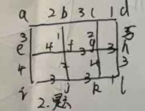

# 图论

## 点连通度与着色数

### 2019-2020
完全图$K_5$的点连通度为

> [!NOTE] 点割集与点连通度
> 设无向图 $G = \langle V, E \rangle$ 为连通图，若有点集 $V_1 \subset V$，使图 $G$ 删除了 $V_1$ 的所有结点后，所得的子图是不连通图，而删除了 $V_1$ 的任何真子集后，所得到的子图仍是连通图，则称 $V_1$ 是 $G$ 的一个**点割集**。若 $G$ 不是完全图，定义 $k(G) = \min\{|V_1| \mid V_1 \text{ 是 } G \text{ 的点割集}\}$ 为 $G$ 的**点连通度**。规定 $k(K_p) = p - 1$。

### 证明：
完全图 $K_n$ 中任意两个结点之间都有边直接相连，因此删除任意 $n-2$ 个结点后，剩余两个结点仍然连通（它们之间有边）。只有当删除 $n-1$ 个结点时，图才变成平凡图（孤立结点），此时才不连通。故 $K_n$ 的点连通度为 $n-1$。

因此 $K_5$ 的点连通度为 $5-1=4$。

---

### 2019-2020
7个节点的完全图$K_7$的点着色数为

> [!NOTE] 完全图着色数
> 对于 $n$ 个结点的完全图 $K_n$，有 $\chi(K_n) = n$。
> **证明**：因为完全图的每一个结点与其他各个结点都邻接，故 $n$ 个结点的着色数不能少于 $n$；又 $n$ 个结点的着色数至多为 $n$，故 $\chi(K_n) = n$。

### 证明：
完全图 $K_7$ 中任意两个结点都相邻接，因此每个结点都必须使用不同的颜色。故 $K_7$ 的点着色数为 $7$。

---

## 邻接矩阵与路径

### 2019-2020（8）
(1) 利用邻接矩阵求平面无向图中从 $V_1$ 到 $V_2$ 长度为2的路径数目。
(2) 请利用关联矩阵将顶点 $V_1, V_3$ 合并。(给出必要解释步骤)

> [!NOTE] 邻接矩阵
> 设 $G = \langle V, E \rangle$ 是一个简单图，它有 $n$ 个结点 $V = \{v_1, v_2, \dots, v_n\}$，则 $n$ 阶方阵 $A(G) = (a_{ij})$ 称为 $G$ 的**邻接矩阵**，其中
> $$a_{ij} = \begin{cases} 1, & v_i \text{ adj } v_j \\ 0, & v_i \text{ nadj } v_j \text{ 或 } i = j \end{cases}$$

> [!NOTE] 邻接矩阵路径计数
> 设 $A(G)$ 是图 $G$ 的邻接矩阵，则 $(A(G))^l$ 中的 $i$ 行 $j$ 列元素 $a_{ij}^{(l)}$ 等于 $G$ 中联结 $v_i$ 与 $v_j$ 的长度为 $l$ 的路的数目。

> [!NOTE] 无向图完全关联矩阵
> 给定无向图 $G$，令 $v_1, v_2, \dots, v_p$ 和 $e_1, e_2, \dots, e_q$ 分别记为 $M(G)$ 的结点和边，则矩阵 $M(G) = (m_{ij})$，其中
> $$m_{ij} = \begin{cases} 1, & \text{若 } v_i \text{ 关联 } e_j \\ 0, & \text{若 } v_i \text{ 不关联 } e_j \end{cases}$$
> 称 $M(G)$ 为**完全关联矩阵**。

### 证明：

原图包含 4 个结点 $V_1, V_2, V_3, V_4$ 和 5 条边，边与结点的关联关系如下：
- $e_1 = (V_1, V_2)$
- $e_2 = (V_1, V_3)$
- $e_3 = (V_3, V_4)$
- $e_4 = (V_1, V_4)$
- $e_5 = (V_2, V_3)$

**（1）从 $V_1$ 到 $V_2$ 长度为 2 的路径数目**

先写出邻接矩阵 $A$（$4 \times 4$ 矩阵，$a_{ij}=1$ 当且仅当 $V_i$ 与 $V_j$ 之间有边）：

$$
A = \begin{pmatrix}
0 & 1 & 1 & 1 \\
1 & 0 & 1 & 0 \\
1 & 1 & 0 & 1 \\
1 & 0 & 1 & 0
\end{pmatrix}
$$

计算 $A^2$：

$$
A^2 = A \cdot A = \begin{pmatrix}
3 & 1 & 2 & 1 \\
1 & 2 & 1 & 2 \\
2 & 1 & 3 & 1 \\
1 & 2 & 1 & 2
\end{pmatrix}
$$

其中 $(A^2)_{12} = 1$，故从 $V_1$ 到 $V_2$ 长度为 2 的路有 **1 条**，即 $V_1 \to V_3 \to V_2$。

**（2）利用关联矩阵合并 $V_1$ 和 $V_3$**

写出完全关联矩阵 $M$（4 行对应 $V_1, V_2, V_3, V_4$，5 列对应 $e_1, e_2, e_3, e_4, e_5$）：

$$
M = \begin{pmatrix}
1 & 1 & 0 & 1 & 0 \\
1 & 0 & 0 & 0 & 1 \\
0 & 1 & 1 & 0 & 1 \\
0 & 0 & 1 & 1 & 0
\end{pmatrix}
$$

合并 $V_1$ 和 $V_3$，即将第 1 行与第 3 行相加（模 2 加法），得到新顶点 $V'$ 的行：

$$
V'\text{行} = (1,1,0,1,0) + (0,1,1,0,1) = (1,0,1,1,1) \pmod{2}
$$

删除原 $V_1$、$V_3$ 行，加入 $V'$ 行，得到合并后的关联矩阵：

$$
M' = \begin{pmatrix}
1 & 0 & 1 & 1 & 1 \\
1 & 0 & 0 & 0 & 1 \\
0 & 0 & 1 & 1 & 0
\end{pmatrix}
$$

其中第 2 列 $e_2$ 原来连接 $V_1$ 与 $V_3$。合并后 $e_2$ 的两个端点都变成了 $V'$，故 $e_2$ 变为自环。在简单图中去掉该自环，得到最终的关联矩阵（去掉 $e_2$ 列）：

$$
M'_{\text{final}} = \begin{pmatrix}
1 & 1 & 1 & 1 \\
1 & 0 & 0 & 1 \\
0 & 1 & 1 & 0
\end{pmatrix}
$$

三个行依次对应 $V'$（合并后的顶点）、$V_2$、$V_4$，四列依次对应 $e_1, e_3, e_4, e_5$。

---

### 2022-2023 期末（7分）
设 $A, B, C, D, E$ 是 5 个命题公式，并且已知蕴含式 $A \Rightarrow B$，$A \Rightarrow C$，$A \Rightarrow D$，$B \Rightarrow A$，$B \Rightarrow D$，$C \Rightarrow B$，$D \Rightarrow E$。由 $\Rightarrow$ 的传递性，可以得到新的蕴含式（例如，由 $A \Rightarrow D$ 和 $D \Rightarrow E$，可以得到 $A \Rightarrow E$）。请给出所有新的蕴含式。注意，本题要求使用图的矩阵表示方法解答。

> [!NOTE] 邻接矩阵与路径计数
> 设 $A(G)$ 是图 $G$ 的邻接矩阵，则 $(A(G))^l$ 中的 $i$ 行 $j$ 列元素 $a_{ij}^{(l)}$ 等于 $G$ 中联结 $v_i$ 与 $v_j$ 的长度为 $l$ 的路的数目。

> [!NOTE] 可达性矩阵
> 令 $G = \langle V, E \rangle$ 是一个简单有向图，$|V| = n$，定义 $n \times n$ 矩阵 $P = (p_{ij})$，其中
> $$p_{ij} = \begin{cases} 1, & \text{从 } v_i \text{ 到 } v_j \text{ 至少存在一条路} \\ 0, & \text{从 } v_i \text{ 到 } v_j \text{ 不存在路} \end{cases}$$
> 称矩阵 $P$ 是图 $G$ 的**可达性矩阵**。可达性矩阵可通过计算 $R = I \vee A \vee A^2 \vee \cdots \vee A^{n-1}$ 得到。

### 证明：

将 5 个命题公式视为有向图的 5 个结点，每个已知蕴含式对应一条有向边，构造邻接矩阵 $M$（行→列表示蕴含方向）：

$$
M = \begin{pmatrix}
0 & 1 & 1 & 1 & 0 \\
1 & 0 & 0 & 1 & 0 \\
0 & 1 & 0 & 0 & 0 \\
0 & 0 & 0 & 0 & 1 \\
0 & 0 & 0 & 0 & 0
\end{pmatrix}
$$

**第一步**：计算 $M^2$（长度为 2 的路径）：

$$
M^2 = M \cdot M = \begin{pmatrix}
1 & 1 & 0 & 1 & 1 \\
0 & 1 & 1 & 1 & 1 \\
1 & 0 & 0 & 1 & 0 \\
0 & 0 & 0 & 0 & 0 \\
0 & 0 & 0 & 0 & 0
\end{pmatrix}
$$

**第二步**：计算 $M^3$（长度为 3 的路径）：

$$
M^3 = M \cdot M^2 = \begin{pmatrix}
1 & 1 & 1 & 2 & 1 \\
1 & 1 & 0 & 1 & 1 \\
0 & 1 & 1 & 1 & 1 \\
0 & 0 & 0 & 0 & 0 \\
0 & 0 & 0 & 0 & 0
\end{pmatrix}
$$

**第三步**：计算 $M^4$（长度为 4 的路径）：

$$
M^4 = M \cdot M^3 = \begin{pmatrix}
1 & 2 & 1 & 2 & 1 \\
1 & 1 & 1 & 2 & 1 \\
1 & 1 & 0 & 1 & 1 \\
0 & 0 & 0 & 0 & 0 \\
0 & 0 & 0 & 0 & 0
\end{pmatrix}
$$

**第四步**：求可达性矩阵 $R = I \vee M \vee M^2 \vee M^3 \vee M^4$（$I$ 为单位矩阵，表示自身到自身的可达性，$\vee$ 为布尔析取）：

$$
R = \begin{pmatrix}
1 & 1 & 1 & 1 & 1 \\
1 & 1 & 1 & 1 & 1 \\
1 & 1 & 1 & 1 & 1 \\
0 & 0 & 0 & 1 & 1 \\
0 & 0 & 0 & 0 & 1
\end{pmatrix}
$$

**第五步**：已知的直接蕴含式对应 $M$ 中为 1 的位置。新的蕴含式对应 $R - I - M$ 中为 1 的位置（减去自身到自身的可达性和直接边）：

$$
R - I - M = \begin{pmatrix}
0 & 0 & 0 & 0 & 1 \\
0 & 0 & 1 & 0 & 1 \\
1 & 0 & 0 & 1 & 1 \\
0 & 0 & 0 & 0 & 0 \\
0 & 0 & 0 & 0 & 0
\end{pmatrix}
$$

因此所有新的蕴含式为：
$$
A \Rightarrow E,\; B \Rightarrow C,\; B \Rightarrow E,\; C \Rightarrow A,\; C \Rightarrow D,\; C \Rightarrow E
$$

共 6 个新蕴含式。

---

### 2024-2025
利用邻接矩阵求解 $V_{3}$ 到 $V_{2}$ 路径长度为4的路的数量 (图略)

> [!NOTE] 邻接矩阵路径计数
> 设 $A(G)$ 是图 $G$ 的邻接矩阵，则 $(A(G))^l$ 中的 $i$ 行 $j$ 列元素 $a_{ij}^{(l)}$ 等于 $G$ 中联结 $v_i$ 与 $v_j$ 的长度为 $l$ 的路的数目。

### 证明：

**通用解法**：

设图有 $n$ 个顶点，邻接矩阵为 $A$（$n \times n$ 矩阵）。

**第一步**：根据图的实际结构写出邻接矩阵 $A$。

**第二步**：计算 $A^2$，其中 $(A^2)_{ij} = \sum_{k=1}^{n} a_{ik} \cdot a_{kj}$，表示从 $v_i$ 到 $v_j$ 长度为 2 的路的数目。

**第三步**：计算 $A^4$。为简化计算，可先算 $A^2$，再算 $A^4 = A^2 \times A^2$：
$$(A^4)_{ij} = \sum_{k=1}^{n} (A^2)_{ik} \cdot (A^2)_{kj}$$

**第四步**：读取 $(A^4)_{32}$（即 $A^4$ 中第 3 行第 2 列的元素）的值，即为从 $V_3$ 到 $V_2$ 长度为 4 的路的数量。

**注意**：这里计数的是"路"（walk），允许重复经过顶点和边。这与"简单路径"（不允许重复顶点）是不同的概念。

---

## 最小生成树与最大生成树

### 2019-2020（5）
对于下图，利用 Kruskal 算法求最小生成树，并按顺序写出选出的每条边与权。

> [!NOTE] 最小生成树
> 在图 $G$ 的所有生成树中，树权最小的那棵生成树，称作**最小生成树**。

> [!NOTE] Kruskal算法
> 设图 $G$ 有 $n$ 个结点，以下算法产生的是最小生成树：
> 1. 选取最小权边 $e_1$，置边数 $i \gets 1$。
> 2. 若 $i = n - 1$ 则结束，否则转步骤3。
> 3. 设已选择边为 $e_1, e_2, \dots, e_i$，在 $G$ 中选取不同于 $e_1, e_2, \dots, e_i$ 的边 $e_{i+1}$，使 $\{e_1, e_2, \dots, e_i, e_{i+1}\}$ 中无回路且 $e_{i+1}$ 是满足此条件的最小边。
> 4. $i \gets i + 1$，转步骤2。

### 证明：

**Kruskal 算法求解步骤**：

1. 将图中所有边按权值从小到大排序。
2. 从小到大依次检查每条边，若加入后不形成回路则选取，否则跳过。
3. 重复直到选出 $n-1$ 条边。

以 Kruskal 算法按上述步骤操作，从图上按权值递增顺序选边，每次选取不形成环的最小权边，直到选出 5 条边（$n-1=5$），即得最小生成树。

---

### 2022-2023 期末（7分）
如图所示的带权图，节点表示六座通信基站，节点之间的边表示修建光缆的带宽（单位:Gbps）。试给出一个设计方案，使得各基站之间能相互通信并且总带宽最大，并求出最大带宽。（要求写出具体步骤）

*(注：附图包含 6 个顶点 $V_1, V_2, V_3, V_4, V_5, V_6$，各边权值分别为：$(V_1, V_5)=1$, $(V_1, V_6)=6$, $(V_1, V_2)=7$, $(V_5, V_6)=6$, $(V_5, V_4)=2$, $(V_6, V_4)=4$, $(V_6, V_3)=3$, $(V_4, V_3)=2$, $(V_2, V_3)=7$)*

> [!NOTE] 最小生成树
> 在图 $G$ 的所有生成树中，树权最小的那棵生成树，称作**最小生成树**。

> [!NOTE] Kruskal算法
> 设图 $G$ 有 $n$ 个结点，以下算法产生的是最小生成树：
> 1. 选取最小权边 $e_1$，置边数 $i \gets 1$。
> 2. 若 $i = n - 1$ 则结束，否则转步骤3。
> 3. 设已选择边为 $e_1, e_2, \dots, e_i$，在 $G$ 中选取不同于 $e_1, e_2, \dots, e_i$ 的边 $e_{i+1}$，使 $\{e_1, e_2, \dots, e_i, e_{i+1}\}$ 中无回路且 $e_{i+1}$ 是满足此条件的最小边。
> 4. $i \gets i + 1$，转步骤2。

### 证明：

本题要求"总带宽最大"，等价于求**最大生成树**。将 Kruskal 算法的排序方向反转——按权值从大到小排序，再依次选取不形成回路的边，直到选出 $n-1=5$ 条边。

**第一步：将所有边按带宽从大到小排序**

| 边 | 带宽 (Gbps) |
|:-:|:-:|
| $V_1V_2$ | 7 |
| $V_2V_3$ | 7 |
| $V_1V_6$ | 6 |
| $V_5V_6$ | 6 |
| $V_6V_4$ | 4 |
| $V_6V_3$ | 3 |
| $V_5V_4$ | 2 |
| $V_4V_3$（另一条平行边） | 2 |
| $V_1V_5$ | 1 |

**第二步：从大到小依次选边（不形成回路）**

1. 选 $V_1V_2$（7）→ 连通分量：$\{V_1, V_2\}$
2. 选 $V_2V_3$（7）→ 连通分量：$\{V_1, V_2, V_3\}$
3. 选 $V_1V_6$（6）→ 连通分量：$\{V_1, V_2, V_3, V_6\}$
4. 选 $V_5V_6$（6）→ 连通分量：$\{V_1, V_2, V_3, V_5, V_6\}$
5. 选 $V_6V_4$（4）→ 连通分量：$\{V_1, V_2, V_3, V_4, V_5, V_6\}$

已选出 5 条边，所有顶点连通，算法结束。

**第三步：计算总带宽**

最大总带宽 = $7 + 7 + 6 + 6 + 4 = 30$（Gbps）

**最终方案**：选用的光缆线路为 $V_1V_2$（7）、$V_2V_3$（7）、$V_1V_6$（6）、$V_5V_6$（6）、$V_6V_4$（4），最大总带宽为 **30 Gbps**。

---

## 平面图

### 2019-2020（8）
(1) 判断 (a), (b) 是否为平面图。

(2) 是平面图的，则有多少面，面的次数分别是多少。
(3) 假设G是一个有 $V$ 个结点, $e$ 条边和 $r$ 个面的连通简单平面图, 求 $V, e, r$ 关系。

> [!NOTE] 平面图
> 设 $G = \langle V, E \rangle$ 是一个无向图，如果能够把 $G$ 的所有结点和边画在平面上，且使得任何两条边除了端点外没有其他的交点，就称 $G$ 是一个**平面图**。

> [!NOTE] 面与边界
> 设 $G$ 是一连通平面图，由图中的边所包围的区域，在区域内既不包含图的结点，也不包含图的边，这样的区域称为 $G$ 的一个**面**，包围该面的诸边所构成的回路称为这个面的**边界**。面的边界的回路长度称作是该面的**次数**，记为 $\deg(r)$。在图形之外不受边界约束的面称作**无限面**。

> [!NOTE] 面次数和
> 一个有限平面图，面的次数之和等于其边数的两倍。$\displaystyle \sum \deg(r_i) = 2|E|$

> [!NOTE] 欧拉公式
> 设有一个连通的平面图 $G$，共有 $v$ 个结点，$e$ 条边和 $r$ 个面，则 $v - e + r = 2$。

> [!NOTE] Kuratowski定理
> 一个图是平面图，当且仅当它不包含与 $K_{3,3}$ 或 $K_5$ 在2度结点内同构的子图。

### 证明：

**（1）判断平面图**

图 (b) 是五边形内接五角星的图形，即完全图 $K_5$（5 个顶点，10 条边）。根据 Kuratowski 定理，$K_5$ 不是平面图，因此图 (b) 不是平面图。

图 (a) 从结构来看，可以重画为无边交叉的形式，因此是平面图（具体地，它是某个多面体图的平面嵌入）。

**（2）面数与面的次数**

图 (a) 是平面图。设其有 $v$ 个结点和 $e$ 条边。根据平面图的欧拉公式：
$$v - e + r = 2$$
由 $v = 10$，$e = 19$，可得面数：
$$r = 2 - v + e = 2 - 10 + 19 = 11$$

该图有 11 个面（包含外部无限面），各面次数之和为 $2e = 38$。

**（3）$V, e, r$ 的关系**

对于连通简单平面图，三者满足**欧拉公式**：
$$V - e + r = 2$$

---

### 2022-2023 期末（6分）
设 $G$ 是一个平面图，其中它的结点数、边数、面数分别为 $v, e, r$，并且它的连通分支数为 $p$。证明：$v - e + r = p + 1$。

> [!NOTE] 欧拉公式
> 设有一个连通的平面图 $G$，共有 $v$ 个结点，$e$ 条边和 $r$ 个面，则 $v - e + r = 2$。

### 证明：

设 $G$ 有 $p$ 个连通分支，记作 $G_1, G_2, \dots, G_p$。由于 $G$ 是平面图，每个连通分支都是平面图，且所有分支共享同一个外部面。

**构造法**：在不同分支之间添加 $p-1$ 条新边，将 $p$ 个分支连接成一个连通平面图 $G'$。这些新边画在外部面中，与原有边不相交，且每一条都是割边（桥），不产生新面。

添加后各量的变化：
- 结点数不变：$v' = v$
- 边数增加 $p-1$：$e' = e + (p-1)$
- 面数不变：$r' = r$（新加的边都是割边，不增加面）

由于 $G'$ 是连通平面图，由欧拉公式得：
$$v' - e' + r' = 2$$

代入得：
$$v - (e + p - 1) + r = 2$$

整理得：
$$v - e - p + 1 + r = 2$$
$$v - e + r = p + 1$$

证毕。

---

### 2024-2025
对于一个平面简单图，设其边数为19，其中面的次数为7的面有3个，面的次数为6的面有2个，则这个图节点数为多少，为什么？

> [!NOTE] 面次数和
> 一个有限平面图，面的次数之和等于其边数的两倍。$\displaystyle \sum \deg(r_i) = 2|E|$

> [!NOTE] 欧拉公式
> 设有一个连通的平面图 $G$，共有 $v$ 个结点，$e$ 条边和 $r$ 个面，则 $v - e + r = 2$。

> [!NOTE] 简单平面图边数界
> 设 $G$ 是一个有 $v$ 个结点，$e$ 条边的连通简单平面图，若 $v \geqslant 3$，则 $e \leqslant 3v - 6$。

### 证明：

**第一步：求总面数 $r$**

根据面次数公式：
$$\sum_{F} \deg(F) = 2e = 2 \times 19 = 38$$

已知 3 个面次数为 7，2 个面次数为 6，设剩余面的次数之和为 $S$：
$$3 \times 7 + 2 \times 6 + S = 38$$
$$21 + 12 + S = 38$$
$$S = 5$$

在简单平面图中，每个面的次数至少为 3（不允许有自环或平行边）。若剩余的面数 $\geqslant 2$，则最小次数和为 $3 + 3 = 6 > 5$，矛盾。

因此剩余的面恰有 1 个，其次数为 5。总面数：
$$r = 3 + 2 + 1 = 6$$

**第二步：利用欧拉公式求结点数 $v$**

对于连通简单平面图，欧拉公式 $v - e + r = 2$ 成立。代入 $e = 19$，$r = 6$：
$$v - 19 + 6 = 2$$
$$v = 15$$

因此该平面简单图的结点数为 **15**。

---

## 欧拉图

### 2022-2023 期末（5分）
证明：欧拉图不含有割边。

> [!NOTE] 欧拉路与欧拉图
> 给定无孤立结点图 $G$：
> - 若存在一条路，经过图中每边一次且仅一次，该条路称为**欧拉路**。
> - 若存在一条回路，经过图中每边一次且仅一次，该回路称为**欧拉回路**。
> - 具有欧拉回路的图称作**欧拉图**。

> [!NOTE] 欧拉回路判定
> 无向图 $G$ 具有一条欧拉回路，当且仅当 $G$ 是连通的，并且所有结点度数全为偶数。

> [!NOTE] 边割集与割边
> 设无向图 $G = \langle V, E \rangle$ 为连通图，若有边集 $E_1 \subset E$，使图 $G$ 中删除了 $E_1$ 中的所有边后得到的子图是不连通图，而删除了 $E_1$ 的任一真子集后得到的子图是连通图，则称 $E_1$ 是 $G$ 的一个**边割集**。若某一个边构成一个边割集，则称该边为**割边（或桥）**。

### 证明：

设 $G$ 是一个欧拉图，则 $G$ 中存在一条欧拉回路 $C$，它经过 $G$ 中的每条边恰好一次并回到起点。

用反证法。假设 $G$ 中含有割边 $e = uv$。

由于 $e$ 是割边，在图 $G$ 中删除 $e$ 后，图变为不连通，恰好分成两个连通分支 $G_1$ 和 $G_2$，其中 $u \in V(G_1)$，$v \in V(G_2)$。

欧拉回路 $C$ 经过每条边恰好一次，因此 $C$ 必定经过 $e$。不妨设 $C$ 从 $u$ 出发经过 $e$ 到达 $v$。

$C$ 经过 $e$ 从 $u$ 到达 $v$ 后，要继续行走并最终回到起点 $u$。这意味着 $C$ 必须遍历 $v$ 所在分支 $G_2$ 的所有边，然后**再回到** $u$ 所在的分支 $G_1$ 才能最终回到起点 $u$。然而，唯一连接 $G_1$ 和 $G_2$ 的边就是 $e$——但 $C$ 已经经过 $e$ 一次（每条边只能走一次），不能再走 $e$ 返回。

因此 $C$ 一旦到达 $v$ 后就无法回到 $u$，这与欧拉回路回到起点的定义矛盾。

故假设不成立，欧拉图中不可能含有割边。$\square$

---

## 树

### 2024-2025
在非平凡树 $T$ 中，证明去掉任意一个节点得到的子图的联通度等于该节点的度数，即
$$
W (T - \{v \}) = \deg (v)
$$

> [!NOTE] 树
> 一个连通且无回路的无向图称为**树**。树中度数为 1 的结点称为**树叶**，度数大于 1 的结点称为**分枝点**或内点。

> [!NOTE] 树的等价定义
> 给定图 $T$，以下关于树的定义是等价的：
> 1. 无回路的连通图。
> 2. 无回路且 $e = v - 1$，其中 $e$ 是边数，$v$ 是结点数。
> 3. 连通且 $e = v - 1$。
> 4. 无回路，但增加一条新边，得到一个且仅有一个回路。
> 5. 连通，但删去任一边后便不连通。
> 6. **每一对结点之间有一条且仅有一条路**。

### 证明：

设 $T$ 是一棵非平凡树（即顶点数 $n \ge 2$），$v$ 是 $T$ 中的任意一个顶点，$\deg(v) = k$。

记 $v$ 的 $k$ 个邻接顶点为 $u_1, u_2, \dots, u_k$，关联边为 $vu_1, vu_2, \dots, vu_k$。

**第一步**：证明 $W(T - \{v\}) \ge k$。

任取两个不同的邻接顶点 $u_i$ 和 $u_j$（$i \ne j$）。在树 $T$ 中，$u_i$ 和 $u_j$ 之间有且仅有一条路（树的等价定义第 6 条）。在原树 $T$ 中，$u_i$ 到 $u_j$ 的路只能是 $u_i \to v \to u_j$，因为若存在另一条不经过 $v$ 的路 $P$，则 $u_i$ 和 $u_j$ 之间就有两条不同的路（一条经过 $v$，一条是 $P$），组合起来形成回路，与树的定义矛盾。

因此删除 $v$ 后，$u_i$ 和 $u_j$ 之间不再连通。故 $u_1, u_2, \dots, u_k$ 分别属于 $k$ 个不同的连通分支，即 $W(T - \{v\}) \ge k$。

**第二步**：证明 $W(T - \{v\}) = k$。

$T$ 中除 $v$ 外的每个顶点 $x$，在 $T$ 中到 $v$ 有唯一的一条路。该路上 $v$ 之后的第一个顶点必定是某个 $u_i$（$1 \le i \le k$）。因此 $T - \{v\}$ 中的所有顶点可归入以 $u_1, u_2, \dots, u_k$ 为根的 $k$ 个互不连通的子树中，连通分支数恰好为 $k$。

综合上述两步，有 $W(T - \{v\}) = \deg(v)$。$\square$

---

## 图着色

### 2024-2025
对图进行染色，并求着色数（图略）

> [!NOTE] 完全图着色数
> 对于 $n$ 个结点的完全图 $K_n$，有 $\chi(K_n) = n$。

> [!NOTE] 五色定理
> 任意平面图 $G$ 最多是 5-色的。

> [!NOTE] 平面图度≤5结点
> 设 $G$ 为一个至少具有三个结点的连通平面图，则 $G$ 中必有一个结点 $u$，使得 $\deg(u) \leqslant 5$。

### 证明：

**图着色的一般方法**：

图着色是指给每个结点分配一种颜色，使得任意相邻的结点颜色不同。所需的最少颜色数称为该图的**着色数**（色数），记作 $\chi(G)$。

**求着色数的步骤**：

1. **观察图的结构**：判断是否是完全图、偶图、平面图等特殊图。
   - 若 $G$ 是完全图 $K_n$，则 $\chi(K_n) = n$。
   - 若 $G$ 是偶图（二分图）且至少有一条边，则 $\chi(G) = 2$。
   - 若 $G$ 是平面图，由五色定理知 $\chi(G) \le 5$。

2. **贪心着色法**：
   - 按度数从大到小的顺序排列顶点。
   - 依次给每个顶点分配可用的最小颜色（确保与已染色的邻接顶点颜色不同）。

3. **确定下界**：若图中存在 $m$ 个两两相邻的顶点（即大小为 $m$ 的团），则 $\chi(G) \ge m$。特别地，$\chi(G) \ge \omega(G)$，其中 $\omega(G)$ 是最大团的大小。

4. **确定上界**：对任意简单图，$\chi(G) \le \Delta(G) + 1$，其中 $\Delta(G)$ 是最大度。

通过调整着色方案，逐步缩小上下界的差距，得到精确的着色数。
