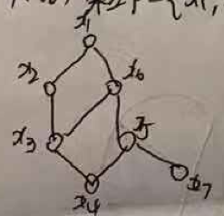
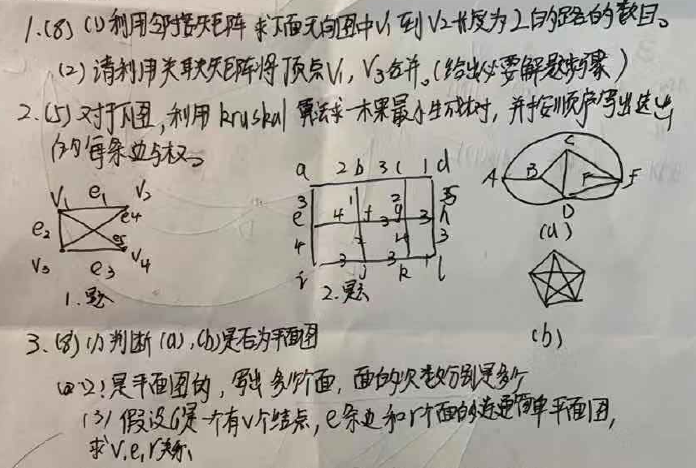

# 数理逻辑
### 1 命题逻辑推理理论
#### （19201）符号化下列命题，并进行推理
- A或B获诺贝尔奖
- 若A获奖，则《三体》中科学预言成立
- 若B实验结果正确，则量子计算机研制没有成功
- 若B实验结果不正确，则《三体》中科学预言不成立
- 量子计算机的研制获得了成功
问：谁获得了诺贝尔奖
### 画真值表
（19201）画出命题公式 $(P ↔ R) ∧ (¬Q → (P ∨ R))$ 的真值表
### 求主析取范式
（19201）求命题公式 $P ∨ (¬P → (Q ∨ (¬Q → R)))$ 的主析取范式 
### 求前束范式
（19201）求谓词公式 $(∃x)A(x) → (∀x)B(x)$ 的前束范式。
# 集合论
（19201）
1. 令$R=\{<1,2>,<3,4>,<2,2>\}$以及$S=\{<4,2>,<2,5>,<3,1>,<1,3>\}$,则$R$与$S$的符合关系$R \circ S$为
2. (8) 集合 $P = \{x_1, x_2, x_3, x_4, x_5, x_6, x_7\}$ 上的偏序关系如下图所示

(1) $P$ 的最大、最小、极大、极小元素。
(2) 写出子集 $\{x_5, x_6, x_7\}$ 的上界、下界，子集 $\{x_4, x_5, x_6, x_7\}$ 的上确界及下确界。

3. (7) $f$ 为 $\mathbb{Z} \times \mathbb{Z}$ 到 $\mathbb{Z}$ 的函数，$f(m,n) = |m| - |n|$，其中 $\mathbb{Z}$ 表示整数集。证明 $f$ 为满射。

4. (8) 集合 $T = \{1, 2, 3, 4\}$，$R = \{\langle 1,1 \rangle, \langle 1,4 \rangle, \langle 4,4 \rangle, \langle 2,2 \rangle, \langle 2,3 \rangle, \langle 3,3 \rangle\}$
(1) $R$ 是否为 $T$ 上的等价关系？为什么？
(2) 给出集合 $S$ 及$S$上等价关系 $R$，$R$能产生 $S$ 上的划分 $\{\{1,2\}, \{3\}, \{4,5\}\}$ 

# 代数系统
（19201）
1.  $<G, *>$ 和 $<H, Δ>$ 分别为 $m$ 阶和 $n$ 阶的群。证明: 若由 $<G, *>$ 到 $<H, Δ>$ 存在单一同态, 则 $m | n$。(4)
2.  证明: 循环群必是阿贝尔群。(4)
3.  证明: 有限群中必存在幂零元。(4)
4.  证明: 设 $<G, *>$ 是一个群, 对 $∀a,b,x,y ∈ G$, 若 $a * x * b = a * y * b$, 则$x = y$。(4)
5.  使用推理理论的直接证明法或间接证明法来证明 ?
6.  设 $f$ 是由群 $<G_1, ☆>$ 到群 $<G_2, *>$ 的同态映射, $e'$ 为 $<G_2, *>$ 的幺元, $Ker(f) = \{x | x ∈ G_1, f(x)=e'\}$, 证明: $<Ker(f), ☆>$ 是 $<G_1, ☆>$ 的子群。(4)
7.  设 $<G, *>$ 是一个群。定义 $G$上的一个二元运算 $Δ$ 为: $∀x,y ∈ G, x Δ y = x * a * y$ 其中,$a$ 是 $G$ 中的某个元素。证明: $<G, Δ>$ 也是一个群。(4)


# 图论
（19201）
1. 完全图K5的点连通度为
2. 7个节点的完全图K7的点着色数为
3. 
将图片内容转换为Markdown格式如下：

```markdown
1. (8)
(1) 利用邻接矩阵求平面无向图中从 $V_1$ 到 $V_2$ 长度为2的路径数目。
(2) 请利用关联矩阵将顶点 $V_1, V_3$ 合并。(给出必要解释步骤)

**图 1. 题**
一个包含4个顶点和5条边的无向图。
顶点: $V_1, V_2, V_3, V_4$
边:
$e_1 = (V_1, V_2)$
$e_2 = (V_1, V_3)$
$e_3 = (V_3, V_4)$
$e_4 = (V_2, V_4)$
$e_5 = (V_1, V_4)$

---

2. (5)
对于下图，利用 Kruskal 算法求最小生成树，并按顺序写出选出的每条边与权。

**图 2. 题**
一个网格图，其中网格线上的数字代表边权。
顶点可以表示为 $V_{row, col}$，其中 $row \in \{e, 3, 4, r\}$ 且 $col \in \{a, 2, b, 3, c, 1, d\}$。

**水平边及其权:**
**行 'e'**:
$(V_{e,a}, V_{e,2})$: 4
$(V_{e,2}, V_{e,b})$: 1
$(V_{e,b}, V_{e,3})$: 2
$(V_{e,3}, V_{e,c})$: 9
$(V_{e,c}, V_{e,1})$: 3
$(V_{e,1}, V_{e,d})$: 3
**行 '3'**:
$(V_{3,a}, V_{3,2})$: 7
$(V_{3,2}, V_{3,b})$: 4
$(V_{3,b}, V_{3,3})$: 3
$(V_{3,3}, V_{3,c})$: 3
$(V_{3,c}, V_{3,1})$: 3
$(V_{3,1}, V_{3,d})$: 1
**行 '4'**:
$(V_{4,a}, V_{4,2})$: 3
$(V_{4,2}, V_{4,b})$: 3
$(V_{4,b}, V_{4,3})$: 3
$(V_{4,3}, V_{4,c})$: 3
$(V_{4,c}, V_{4,1})$: 3
$(V_{4,1}, V_{4,d})$: 1

**垂直边及其权:**
**列 'a'**:
$(V_{e,a}, V_{3,a})$: 3
$(V_{3,a}, V_{4,a})$: 4
$(V_{4,a}, V_{r,a})$: 1
**列 '2'**:
$(V_{e,2}, V_{3,2})$: 7
$(V_{3,2}, V_{4,2})$: 3
$(V_{4,2}, V_{r,2})$: 3
**列 'b'**:
$(V_{e,b}, V_{3,b})$: 4
$(V_{3,b}, V_{4,b})$: 3
$(V_{4,b}, V_{r,b})$: 3
**列 '3'**:
$(V_{e,3}, V_{3,3})$: 9
$(V_{3,3}, V_{4,3})$: 3
$(V_{4,3}, V_{r,3})$: 3
**列 'c'**:
$(V_{e,c}, V_{3,c})$: 3
$(V_{3,c}, V_{4,c})$: 3
$(V_{4,c}, V_{r,c})$: 3
**列 '1'**:
$(V_{e,1}, V_{3,1})$: 3
$(V_{3,1}, V_{4,1})$: 3
$(V_{4,1}, V_{r,1})$: 3
**列 'd'**:
$(V_{e,d}, V_{3,d})$: 5
$(V_{3,d}, V_{4,d})$: 3
$(V_{4,d}, V_{r,d})$: 1

---

3. (8)
(1) 判断 (a), (b) 是否为平面图。

**图 (a)**
一个有5个顶点的图，形状如图片所示，顶点为 A, B, C, D, F。
边: $(A,B), (B,C), (C,F), (F,D), (D,B), (C,D), (A,F)$。

**图 (b)**
一个五角星图 (Pentagram)。

(2) 设 G 是平面图的，则有多少面，面的次数和是多少。
(此问题应为: 设 G 是平面图，则 G 有多少个面，且所有面的次数和是多少。)

(3) 假设是一个有 $V$ 个结点, $e$ 条边和 $f$ 个面的连通简单平面图, 求 $V, e, f$ 关系。
```