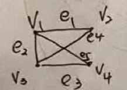
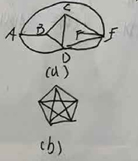

# 数理逻辑
### 1 命题逻辑推理理论
#### （19201）符号化下列命题，并进行推理
- A或B获诺贝尔奖
- 若A获奖，则《三体》中科学预言成立
- 若B实验结果正确，则量子计算机研制没有成功
- 若B实验结果不正确，则《三体》中科学预言不成立
- 量子计算机的研制获得了成功
问：谁获得了诺贝尔奖
### 画真值表
（19201）画出命题公式 $(P ↔ R) ∧ (¬Q → (P ∨ R))$ 的真值表
### 求主析取范式
（19201）求命题公式 $P ∨ (¬P → (Q ∨ (¬Q → R)))$ 的主析取范式 
### 求前束范式
（19201）求谓词公式 $(∃x)A(x) → (∀x)B(x)$ 的前束范式。

这份期中试卷为 **天津大学 2022～2023 学年第 1 学期期中考试《离散数学》（A卷）**。由于试卷第 4 页缺失，以下为你整理提取的第 1、2、3、5 页的全部题目内容：

---

## 一、简答题（本大题共 2 小题，每小题 5 分，共 10 分）

### 1. 变量分类与说明

将下面式子规范化并指出其中的自由变元和约束变元并说明理由。

$$\forall x ((A(x) \rightarrow B(y, x)) \wedge \exists z \, C(y, z)) \rightarrow D(x)$$

### 2. 关系概念辨析

简述相容的定义，相容关系与覆盖的关系，相容关系、等价关系的不同。

---

## 二、计算题（本大题共 6 小题，每小题 8 分，共 48 分）

### 1. 主析取范式

求 $\neg(\neg p \wedge q) \rightarrow r$ 的主析取范式。

### 2. 命题符号化与推理

符号化下列命题，并进行推理，事实情况如下所述：

* **a)** Alice 或 Bob 获得了 Turing 奖；
* **b)** 若 Alice 获得 Turing 奖，则 Church-Turing 命题不成立；
* **c)** 若 Bob 的证明正确，则量子计算机的研制没有获得成功；
* **d)** 若 Bob 的证明不正确，则 Church-Turing 命题成立；
* **e)** 量子计算机的研制获得了成功。

问：谁获得了 Turing 奖？

### 3. 前束范式

把下列各式化为前束范式：

* **(1)** $(\exists x)(\neg ((\exists y)P(x, y)) \rightarrow ((\exists z)Q(z) \rightarrow R(x)))$
* **(2)** $((\forall x)P(x) \vee (\exists y)Q(y)) \rightarrow (\forall x)R(x)$

### 4. 划分与等价关系

设 $A = \{1, 2, 3, 4\}$，$S = \{\{1\}, \{2, 3\}, \{4\}\}$ 为 $A$ 的一个划分，求由 $S$ 诱导的集合 $A$ 上的等价关系。

### 5. 关系矩阵与闭包

设集合 $A = \{a, b, c, d\}$ 上关系 $R = \{(a, b), (b, a), (b, c), (c, d)\}$

* **(1)** 写出 $R$ 的关系矩阵；
* **(2)** 用 Warshall 算法求 $R$ 的传递闭包。

### 6. 偏序集分析

设集合 $A = \{1, 2, 4, 6, 8, 12\}$，$R$ 为整除关系。

* **(1)** 计算 $\text{COV } A$；
* **(2)** 画出偏序集 $\langle A, R \rangle$ 的哈斯图；
* **(3)** 写出 $A$ 的子集 $B = \{4, 6, 8, 12\}$ 的上界、下界、最小上界、最大下界；
* **(4)** 写出 $A$ 的最大元、最小元、极大元、极小元。

---

## 三、证明题（本大题共 7 小题，每小题 6 分，共 42 分）

*(注：由于原卷第 4 页缺失，此处包含第 1, 2, 6, 7 小题)*

### 1. 逻辑蕴含证明

证明：$\neg(\neg p \rightarrow q)$ 逻辑蕴含 $\neg p$。

### 2. 逻辑蕴含推理证明

证明：$\neg(P \rightarrow Q) \rightarrow \neg(R \vee S), (Q \rightarrow P) \vee \neg R, R \Rightarrow P \leftrightarrow Q$。

### 6. 关系的复合与等价关系证明

设 $R$ 是一个二元关系，设 $S = \{(a, b) \mid \text{对于某个 } c, \text{有 } (a, c) \in R \text{ 且 } (c, b) \in R\}$。
证明：若 $R$ 是一个等价关系，则 $S$ 也是一个等价关系。

### 7. 模 $m$ 同余关系与商集细分证明

设 $R_j$ 表示 $I$ 上的模 $j$ 等价关系，$R_k$ 表示 $I$ 上的模 $k$ 等价关系，证明：$I/R_k$ 细分 $I/R_j$，当且仅当 $k$ 是 $j$ 的整数倍。

这份试卷是**天津大学 2022~2023 学年第 1 学期期末考试试卷《离散数学》（A卷）**。以下是为你完整提取的全部题目内容：

---

## （一）数理逻辑部分

### 1. （5分）

三位球迷预测下一届足球世界杯的冠军。

* **A球迷**：巴西和德国都不是冠军。
* **B球迷**：中国是冠军，并且德国不是冠军。
* **C球迷**：巴西是冠军，并且中国不是冠军。

预言家笑着说，三位球迷中的两位预测完全正确，而另一位球迷的预测完全错误。
请运用数理逻辑知识，判断该预言家认为哪个国家是世界杯冠军。

### 2. （8分）

小张接到了一个自称王警官的电话。根据通话内容，小张得到以下事实：

1. 王警官的真实身份是公安人员或电信诈骗分子。
2. 王警官是电信诈骗分子，当且仅当小张被要求提供银行卡信息。
3. 小张没有被要求提供银行卡信息。

根据上述事实，请使用推理理论，帮助小张判断王警官的真实身份。（要求写出推理过程）

### 3. （7分）

翻译下面的前提和结论为数理逻辑公式，并使用直接证法或间接证法，证明前提能够推出结论。

* **前提**：
1. 所有大学生都喜欢打篮球。
2. 张三是天津大学的学生。

* **结论**：若张三是天津人，则张三喜欢打篮球。

### 4. （5分）

设命题公式 $A$ 包含三个命题变元 $p, q, r$。在两个真值指派 $p=0, q=1, r=1$ 和 $p=1, q=0, r=0$ 下，公式 $A$ 的真值为 $1$；在其余的真值指派下，$A$ 的真值都是 $0$。请写出公式 $A$ 的具体形式。要求 $A$ 中仅含联结词 $\neg$ 和 $\rightarrow$。

---

## （二）集合论部分

### 1. （5分）

设 $A$ 和 $B$ 是两个集合，定义 $A + B = \{\langle x, 0 \rangle | x \in A\} \cup \{\langle y, 1 \rangle | y \in B\}$。
证明：$|A \cup B| \le |A + B|$，其中 $|A + B|$ 表示 $A + B$ 的基数。

### 2. （7分）

设 $R$ 是集合 $A$ 上的一个二元关系。证明：

1. $\text{rts}(R) = \text{tsr}(R)$。其中 $\text{rts}(R)$ 表示先求对称闭包、再求传递闭包、最后求自反闭包。
2. $\text{rts}(R)$ 是 $A$ 上的一个等价关系。

### 3. （8分）

设双集（应为：设集合）$H = \{1, 2, 3, 4\}$ 的幂集上的“子集”关系，且集合 $K = \{\{1, 2\}, \{1, 3\}, \{2, 3\}\}$。画出 $R$ 的哈斯图，并给出集合 $K$ 的极大元、最大元、上界、上确界。

### 4. （5分）

证明：若 $A \subseteq B$ 和 $C \subseteq D$，则 $A \times C \subseteq B \times D$。

---

## （三）代数系统部分

### 1. （6分）

证明：若 $\langle A, \Delta \rangle$ 与 $\langle B, * \rangle$ 同构，并且 $\langle B, * \rangle$ 与 $\langle C, \# \rangle$ 同构，则 $\langle A, \Delta \rangle$ 与 $\langle C, \# \rangle$ 同构。

### 2. （6分）

设 $\langle G, * \rangle$ 是一个有限群。证明：对于任何的 $G$ 中元素 $a, b$，都有 $a * b$ 和 $b * a$ 的阶相等。

### 3. （6分）

设 $\Delta$ 和 $*$ 是集合 $A$ 上的两个二元运算，且 $\Delta$ 和 $*$ 在 $A$ 上满足吸收律。
证明：$\Delta$ 和 $*$ 在 $A$ 上满足幂等律。

### 4. （7分）

设 $\langle G, * \rangle$ 是一个 $n$ 阶循环群。证明：若 $m$ 是 $n$ 的一个因子，则 $\langle G, * \rangle$ 至少有一个 $m$ 阶子群也是循环群。

---

## （四）图论部分

### 1. （6分）

设 $G$ 是一个平面图，其中它的结点数、边数、面数分别为 $v, e, r$，并且它的连通分支数为 $p$。证明：$v - e + r = p + 1$。

### 2. （5分）

证明：欧拉图不含有割边。

### 3. （7分）

如图所示的带权图，节点表示六座通信基站，节点之间的边表示修建光缆的带宽（单位:Gbps）。试给出一个设计方案，使得各基站之间能相互通信并且总带宽最大，并求出最大带宽。（要求写出具体步骤）

*(注：附图包含 6 个顶点 $V_1, V_2, V_3, V_4, V_5, V_6$，各边权值分别为：$(V_1, V_5)=1$, $(V_1, V_6)=6$, $(V_1, V_2)=7$, $(V_5, V_6)=6$, $(V_5, V_4)=2$, $(V_6, V_4)=4$, $(V_6, V_3)=3$, $(V_4, V_3)=2$, $(V_2, V_3)=7$)*

### 4. （7分）

设 $A, B, C, D, E$ 是 5 个命题公式，并且已知蕴含式 $A \Rightarrow B$，$A \Rightarrow C$，$A \Rightarrow D$，$B \Rightarrow A$，$B \Rightarrow D$，$C \Rightarrow B$，$D \Rightarrow E$。由 $\Rightarrow$ 的传递性，可以得到新的蕴含式（例如，由 $A \Rightarrow D$ 和 $D \Rightarrow E$，可以得到 $A \Rightarrow E$）。请给出所有新的蕴含式。注意，本题要求使用图的矩阵表示方法解答。

# 集合论
（19201）
1. 令$R=\{<1,2>,<3,4>,<2,2>\}$以及$S=\{<4,2>,<2,5>,<3,1>,<1,3>\}$,则$R$与$S$的符合关系$R \circ S$为
2. (8) 集合 $P = \{x_1, x_2, x_3, x_4, x_5, x_6, x_7\}$ 上的偏序关系如下图所示

(1) $P$ 的最大、最小、极大、极小元素。
(2) 写出子集 $\{x_5, x_6, x_7\}$ 的上界、下界，子集 $\{x_4, x_5, x_6, x_7\}$ 的上确界及下确界。

3. (7) $f$ 为 $\mathbb{Z} \times \mathbb{Z}$ 到 $\mathbb{Z}$ 的函数，$f(m,n) = |m| - |n|$，其中 $\mathbb{Z}$ 表示整数集。证明 $f$ 为满射。

4. (8) 集合 $T = \{1, 2, 3, 4\}$，$R = \{\langle 1,1 \rangle, \langle 1,4 \rangle, \langle 4,4 \rangle, \langle 2,2 \rangle, \langle 2,3 \rangle, \langle 3,3 \rangle\}$
(1) $R$ 是否为 $T$ 上的等价关系？为什么？
(2) 给出集合 $S$ 及$S$上等价关系 $R$，$R$能产生 $S$ 上的划分 $\{\{1,2\}, \{3\}, \{4,5\}\}$ 

# 代数系统
（19201）
1.  $<G, *>$ 和 $<H, Δ>$ 分别为 $m$ 阶和 $n$ 阶的群。证明: 若由 $<G, *>$ 到 $<H, Δ>$ 存在单一同态, 则 $m | n$。(4)
2.  证明: 循环群必是阿贝尔群。(4)
3.  证明: 有限群中必存在幂零元。(4)
4.  证明: 设 $<G, *>$ 是一个群, 对 $∀a,b,x,y ∈ G$, 若 $a * x * b = a * y * b$, 则$x = y$。(4)
5.  使用推理理论的直接证明法或间接证明法来证明 ?
6.  设 $f$ 是由群 $<G_1, ☆>$ 到群 $<G_2, *>$ 的同态映射, $e'$ 为 $<G_2, *>$ 的幺元, $Ker(f) = \{x | x ∈ G_1, f(x)=e'\}$, 证明: $<Ker(f), ☆>$ 是 $<G_1, ☆>$ 的子群。(4)
7.  设 $<G, *>$ 是一个群。定义 $G$上的一个二元运算 $Δ$ 为: $∀x,y ∈ G, x Δ y = x * a * y$ 其中,$a$ 是 $G$ 中的某个元素。证明: $<G, Δ>$ 也是一个群。(4)

# 图论
（19201）
1. 完全图K5的点连通度为
2. 7个节点的完全图K7的点着色数为
3. (8)
(1) 利用邻接矩阵求平面无向图中从 $V_1$ 到 $V_2$ 长度为2的路径数目。
(2) 请利用关联矩阵将顶点 $V_1, V_3$ 合并。(给出必要解释步骤)

4. (5)
对于下图，利用 Kruskal 算法求最小生成树，并按顺序写出选出的每条边与权。

5. (8)
(1) 判断 (a), (b) 是否为平面图。

(2) 是平面图的，则有多少面，面的次数分别是多少。
(3) 假设G是一个有 $V$ 个结点, $e$ 条边和 $r$ 个面的连通简单平面图, 求 $V, e, r$ 关系。