# 第七章 图论

## 7-1 图的基本概念

一个图由一些结点和连接结点的边组成，连线的长度及结点的

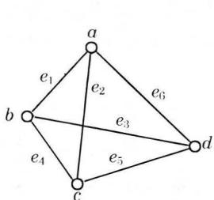  
(a)

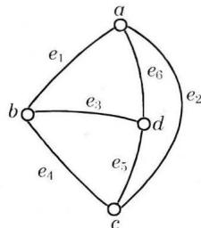  
(b)   
图7-1.1

位置是无关紧要的。如图7-1.1(a)和(b)表示了同一个图形。

### 定义7-1.1

一个图是一个三元组 $\langle V(G), E(G), \varphi_G \rangle$ ，其中 $V(G)$ 是一个非空的结点集合， $E(G)$ 是边集合， $\varphi_G$ 是从边集合 $E$ 到结点无序偶（有序偶）集合上的函数。

若把图中的边 $e_i$ 看作总是与两个结点关联，那么一个图亦可简记为 $G = \langle V, E \rangle$ ，其中 $V$ 是非空结点集， $E$ 是连接结点的边集。

若边 $e_i$ 与结点无序偶 $(v_j, v_k)$ 相关联，则称该边为无向边。

若边 $e_i^{\prime}$ 与结点有序偶 $\langle v_j,v_k\rangle$ 相关联，则称该边为有向边。

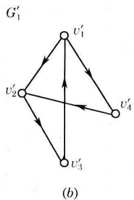

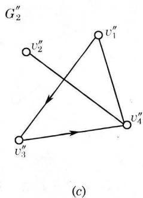  
图7-1.2

其中 $v_{j}$ 称为 $e_i^\prime$ 的起始结点； $v_{k}$ 称为 $e_i^{\prime}$ 的终止结点。

每一条边都是无向边的图称无向图，如图7-1.2(a)所示。

每一条边都是有向边的图称有向图，如图7-1.2(b)所示。

如果在图中一些边是有向边，另一些边是无向边，则称这个图是混合图，如图7-1.2(c)所示。这些图可分别表示为：

$$
\begin{array}{l} G _ {0} = \langle V, E \rangle = \langle \left\{v _ {1}, v _ {2}, v _ {3}, v _ {4}, v _ {5} \right\}, \left\{\left(v _ {1}, v _ {2}\right), \right. \\ \left(v _ {2}, v _ {3}\right), \left(v _ {3}, v _ {4}\right), \left(v _ {2}, v _ {4}\right) \} \rangle \\ \end{array}
$$

$$
\begin{array}{l} G _ {1} ^ {\prime} = \langle V ^ {\prime}, E ^ {\prime} \rangle = \langle \left\{v _ {1} ^ {\prime}, v _ {2} ^ {\prime}, v _ {3} ^ {\prime}, v _ {4} ^ {\prime} \right\}, \left\{\langle v _ {1} ^ {\prime}, v _ {2} ^ {\prime} \rangle , \langle v _ {2} ^ {\prime}, v _ {3} ^ {\prime} \rangle , \right. \\ \left\langle v _ {3} ^ {\prime}, v _ {1} ^ {\prime} \right\rangle , \left\langle v _ {1} ^ {\prime}, v _ {4} ^ {\prime} \right\rangle , \left\langle v _ {4} ^ {\prime}, v _ {2} ^ {\prime} \right\rangle \big) \big) \\ \end{array}
$$

$$
\begin{array}{l} G _ {2} ^ {\prime \prime} = \langle V ^ {\prime \prime}, E ^ {\prime \prime} \rangle = \langle \left\{v _ {1} ^ {\prime \prime}, v _ {2} ^ {\prime \prime}, v _ {3} ^ {\prime \prime}, v _ {4} ^ {\prime \prime} \right\}, \left\{\left(v _ {1} ^ {\prime \prime}, v _ {4} ^ {\prime \prime}\right), \left(v _ {2} ^ {\prime \prime}, v _ {4} ^ {\prime \prime}\right), \right. \\ \left. \left\langle v _ {1} ^ {\prime \prime}, v _ {3} ^ {\prime \prime} \right\rangle , \left\langle v _ {3} ^ {\prime \prime}, v _ {4} ^ {\prime \prime} \right\rangle \right\rangle \\ \end{array}
$$

今后我们只讨论有向图和无向图。

在一个图中，若两个结点由一条有向边或一条无向边关联，则这两个结点称为是邻接点。

在一个图中不与任何结点相邻接的结点，称为孤立结点，如图7-1.2(a)中的结点 $v_{5}$ 。仅由孤立结点组成的图称为零图，仅由一个孤立结点构成的图称为平凡图。

类似于邻接点的概念，关联于同一结点的两条边称为邻接边。关联于同一结点的一条边称为自回路或环。如图7-1.3中 $(c, c)$ 是环。环的方向是没有意义的，它既可作为有向边，也可作无向边。

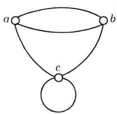  
图7-1.3

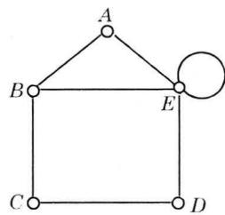  
图7-1.4

### 定义7-1.2

在图 $G = \langle V,E\rangle$ 中，与结点 $v(v\in V)$ 关联的边数，称作是该结点的度数，记作 $\deg (v)$ 。

例如在图7-1.4中，结点 $A$ 的度数为2，结点 $B$ 的度数为3，我们约定：每个环在其对应结点上度数增加2。故图7-1.4中结点 $E$ 的度数为5。

此外，我们记 $\Delta (G) = \max \{\deg v\mid v\in V(G)\}$ ， $\delta (G) =$ $\min \{\deg v|v\in V(G)\}$ ，分别称为 $G = \langle V,E\rangle$ 的最大度和最小度。如图7-1.4中 $\Delta (G) = 5,\delta (G) = 2$ 。

### 定理7-1.1

每个图中，结点度数的总和等于边数的两倍。

$$
\sum_ {v \in V} \deg (v) = 2 | E |
$$

证明 因为每条边必关联两个结点，而一条边给予关联的每个结点的度数为1。因此在一个图中，结点度数的总和等于边数的两倍。

### 定理7-1.2

在任何图中，度数为奇数的结点必定是偶数个。

证明 设 $V_{1}$ 和 $V_{2}$ 分别是 $G$ 中奇数度数和偶数度数的结点集，则由定理7-1.1，有

$$
\sum_ {v \in V _ {1}} \deg (v) + \sum_ {v \in V _ {2}} \deg (v) = \sum_ {v \in V} \deg (v) = 2 | E |
$$

由于 $\sum_{v\in V_2}\deg (v)$ 是偶数之和，必为偶数，而 $2|E|$ 是偶数，故得 $\sum_{v\in V_1}\deg (v)$ 是偶数，即 $|V_{1}|$ 是偶数。

### 定义7-1.3

在有向图中，射入一个结点的边数称为该结点的入度，由一个结点射出的边数称为该结点的出度。结点的出度与

入度之和就是该结点的度数。

### 定理7-1.3

在任何有向图中，所有结点的入度之和等于所有结点的出度之和。

证明因为每一条有向边必对应一个人度和一个出度，若一个结点具有一个人度或出度，则必关联一条有向边，所以，有向图中各结点入度之和等于边数，各结点出度之和也等于边数，因此，任何有向图中，入度之和等于出度之和。

在上面所讲图的概念中，一个结点的度数可能大于1，但是任何一对结点间常常不多于一条边。我们把连接于同一对结点间的多条边称为是平行的。

### 定义7-1.4

含有平行边的任何一个图称为多重图。

例如图7-1.5所示的均为多重图。在图 $7 - 1.5(a)$ 中结点 $a$ 和 $b$ 之间有两条平行边，结点 $b$ 和 $c$ 之间有三条平行边，在结点 $b$ 有两个平行的环。结点 $a$ 的度数为3，结点 $c$ 的度数为4，结点 $b$ 的度数为9。在图7-1.5(b)中，只有结点 $v_{1}$ 和 $v_{2}$ 之间有两条平行边。这是因为该有向图中， $\langle v_1,v_2\rangle$ 与 $\langle v_2,v_1\rangle$ 认为是不同的结点对。

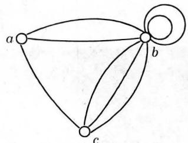  
(a)

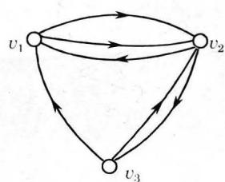  
(b)   
图7-1.5

今后我们把不含有平行边和环的图称作简单图。

### 定义7-1.5

简单图 $G = \langle V, E \rangle$ 中，若每一对结点间都有边相连，则称该图为完全图。

有 $n$ 个结点的无向完全图记作 $K_{n}$ 。

### 定理7-1.4

$n$ 个结点的无向完全图 $K_{n}$ 的边数为 $\frac{1}{2} n(n - 1)$ 。

证明 在 $K_{n}$ 中，任意两点间都有边相连， $n$ 个结点中任取两点的组合数为：

$$
C _ {n} ^ {2} = \frac {1}{2} n (n - 1)
$$

故 $K_{n}$ 的边数为

$$
| E | = \frac {1}{2} n (n - 1)
$$

如果在 $K_{n}$ 中，对每条边任意确定一个方向，就称该图为 $n$ 个结点的有向完全图。显然，它的边数也为 $\frac{1}{2} n(n - 1)$

给定任意一个含有 $n$ 个结点的图 $G$ ，总可以把它补成一个具有同样结点的完全图，方法是把那些没有联上的边添加上去。

### 定义7-1.6

给定一个图 $G$ ，由 $G$ 中所有结点和所有能使 $G$ 成为完全图的添加边组成的图，称为 $G$ 的相对于完全图的补图，或简称为 $G$ 的补图，记作 $\overline{G}$ 。

如图7-1.6中 $(a)$ 和 $(b)$ 互为补图。

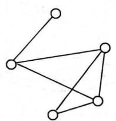  
(a)

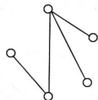  
(b)   
图7-1.6

### 定义7-1.7

设图 $G = \langle V,E\rangle$ ，如果有图 $G^{\prime} = \langle V^{\prime},E^{\prime}\rangle$ ，且

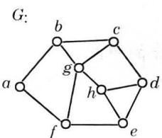  
(a)

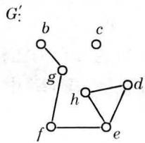  
(b)

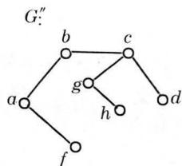  
(c)   
图7-1.7

$E \subseteq E, V' \subseteq V$ ，则称 $G'$ 为 $G$ 的子图。

例如，图7-1.7中 $(b)$ 和 $(c)$ 都是 $(a)$ 的子图。

如果 $G$ 的子图包含 $G$ 的所有结点，则称该子图为 $G$ 的生成子图。例如，图7-1.8中 $G^{\prime}$ 和 $G''$ 都是 $G$ 的生成子图。

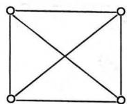  
G   
(a)

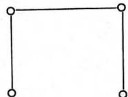  
G   
(b)

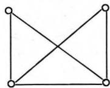  
G   
(c)   
图7-1.8

### 定义7-1.8

设 $G' = \langle V', E' \rangle$ 是图 $G = \langle V, E \rangle$ 的子图，若给定另外一个图 $G'' = \langle V'', E'' \rangle$ 使得 $E'' = E - E'$ ，且 $V''$ 中仅包含 $E''$ 的边所关联的结点。则称 $G''$ 是子图 $G'$ 的相对于图 $G$ 的补图。

例如，图7-1.7中，图 $(c)$ 是图 $(b)$ 相对于图 $(a)$ 的补图。而图 $(b)$ 不是图 $(c)$ 相对于图 $(a)$ 的补图，因为图 $(b)$ 中有结点 $c$ 。

在上面一些图的基本概念中，一个图由一个图形表示，由于图形的结点位置和连线长度都可任意选择，故一个图的图形表示并不是唯一的。下面我们讨论图的同构的概念。

### 定义7-1.9

设图 $G = \langle V, E \rangle$ 及图 $G' = \langle V', E' \rangle$ ，如果存在一一对应的映射 $g: v_i \to v_i'$ 且 $e = (v_i, v_j)$ （或 $\langle v_i, v_j \rangle$ ）是 $G$ 的一条边，当且仅当 $e' = (g(v_i), g(v_j))$ （或 $\langle g(v_i), g(v_j) \rangle$ ）是 $G'$ 的一条边，则称 $G$ 与 $G'$ 同构，记作 $G \simeq G'$ 。

从这个定义可以看到，若 $G$ 与 $G^{\prime}$ 同构，它的充要条件是：两个图的结点和边分别存在着一一对应，且保持关联关系，例如图7-1.9中， $(a)$ 与 $(b)$ 是同构的， $(c)$ 与 $(d)$ 也是同构的。

从图7-1.9的 $(c)$ 与 $(d)$ 中可以看到此两图在结点间存在着一一对应映射 $g: g(a) = u_3, g(b) = u_1, g(c) = u_4, g(d) = u_2$ ，且有： $\langle a, c \rangle, \langle a, b \rangle, \langle b, d \rangle, \langle c, d \rangle$ 分别与 $\langle u_3, u_4 \rangle, \langle u_3, u_1 \rangle,$

$\langle u_1, u_2 \rangle, \langle u_4, u_2 \rangle$ 一一对应。

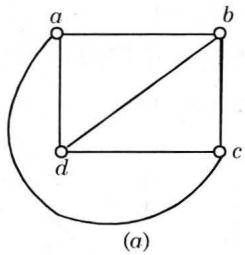

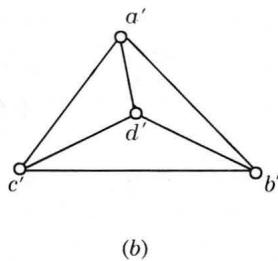

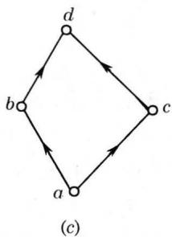

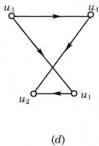  
图7-1.9

分析本例还可以知道，此两图的结点度数也分别对应相等，如表7-1.1所示。

表7-1.1  

|  |  |  |  |  |
| --- | --- | --- | --- | --- |
| a | b | c | d |  |
| 出度 | 2 | 1 | 1 | 0 |
| 入度 | 0 | 1 | 1 | 2 |

|  |  |  |  |  |
| --- | --- | --- | --- | --- |
| u1 | u2 | u3 | u4 |  |
| 出度 | 1 | 0 | 2 | 1 |
| 入度 | 1 | 2 | 0 | 1 |

综上所述，可以得到两图同构的一些必要条件：

（1）结点数目相同；  
（2）边数相等；  
（3）度数相同的结点数目相等。

需要指出的是这几个条件不是两个图同构的充分条件，例如图7-1.10中 $(a)$ 和 $(b)$ 满足上述三个条件，但此两个图并不同构。

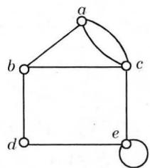  
(a)

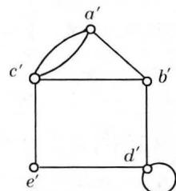  
(b)   
图7-1.10

### 7-1 习题

（1）证明：在任何有向完全图中，所有结点入度的平方之和等于所有结点的出度平方之和。  
（2）写出图7-1.11相对于完全图的补图。  
（3）证明：图7-1.12中两个图不同构。  
（4）证明：图7-1.13中两个图是同构的。

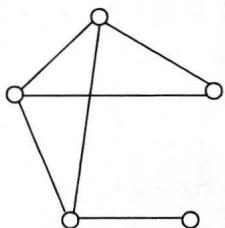  
图7-1.11

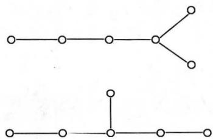  
图7-1.12

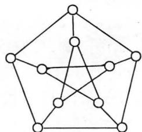  
(a)

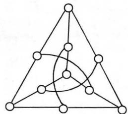  
(b)   
图7-1.13

（5）一个图如果同构于它的补图，则该图称为自补图。

a）试给出一个五个结点的自补图。  
b）是否有三个结点或六个结点的自补图。  
c）一个图是自补图，其对应的完全图的边数必为偶数。  
（6）证明：简单图的最大度小于结点数。

## 7-2 路与回路

在现实世界中，常常要考虑这样的问题：如何从一个图 $G$ 中的给定结点出发，沿着一些边连续移动而达到另一指定结点，这种依次由点和边组成的序列，就形成了路的概念。

### 定义7-2.1

给定图 $G = \langle V, E \rangle$ ，设 $v_0, v_1, \dots, v_n \in V, e_1, e_2, \dots, e_n \in E$ ，其中 $e_i$ 是关联于结点 $v_{i-1}, v_i$ 的边，交替序列 $v_0 e_1 v_1 e_2 \dots e_n v_n$ 称为联结 $v_0$ 到 $v_n$ 的路。

$v_{0}$ 和 $v_{n}$ 分别称作路的起点和终点，边的数目 $n$ 称作路的长度。当 $v_{0} = v_{n}$ 时，这条路称作回路。

若一条路中所有的边 $e_1, e_2, \dots, e_n$ 均不相同，称作迹。若一条路中所有的结点 $v_0, v_1, \dots, v_n$ 均不相同，则称作通路。闭的通路，即除 $v_0 = v_n$ 外，其余的结点均不相同的路，就称作圈。

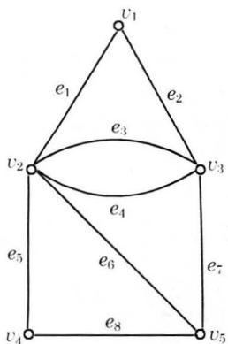  
图7-2.1

例如在图7-2.1中有：

路： $v_{1}e_{2}v_{3}e_{3}v_{2}e_{3}v_{3}e_{4}v_{2}e_{6}v_{5}e_{7}v_{3}$

迹： $v_{5}e_{8}v_{4}e_{5}v_{2}e_{6}v_{5}e_{7}v_{3}e_{4}v_{2}$

通路： $v_{4}e_{8}v_{5}e_{6}v_{2}e_{1}v_{1}e_{2}v_{3}$

圈： $v_{2}e_{1}v_{1}e_{2}v_{3}e_{7}v_{5}e_{6}v_{2}$

在简单图中一条路 $v_{0}e_{1}v_{1}e_{2}\dots e_{n}v_{n}$ ，由它的结点序列 $v_{0}v_{1}\dots v_{n}$ 确定，所以简单图的路，可由其结点序列表示。在有向图中，结点数大于1的一条路亦可由边序列 $e_1e_2\dots e_n$ 表示。

### 定理7-2.1

在一个具有 $n$ 个结点的

图中，如果从结点 $v_{j}$ 到结点 $v_{k}$ 存在一条路，则从结点 $v_{j}$ 到结点 $v_{k}$ 必存在一条不多于 $n - 1$ 条边的路。

证明 如果从结点 $v_{j}$ 到结点 $v_{k}$ 存在一条路，该路上的结点序列是 $v_{j} \cdots v_{i} \cdots v_{k}$ ，如果在这条路中有 $l$ 条边，则序列中必有 $l + 1$ 个结点，若 $l > n - 1$ ，则必有结点 $v_{s}$ ，它在序列中不止一次出现，即必有结点序列 $v_{j} \cdots v_{s} \cdots v_{s} \cdots v_{k}$ ，在路中去掉从 $v_{s}$ 到 $v_{s}$ 的这些边，仍是 $v_{j}$ 到 $v_{k}$ 的一条路，但此路比原来的路边数要少，如此重复进行下去，必可得到一条从 $v_{j}$ 到 $v_{k}$ 的不多于 $n - 1$ 条边的路。

推论 在一个具有 $n$ 个结点的图中，若从结点 $v_{j}$ 到 $v_{k}$ 存在一条路，则必存在一条从 $v_{j}$ 到 $v_{k}$ 而边数小于 $n$ 的通路。

### 定义7-2.2

在无向图 $G$ 中，结点 $u$ 和 $v$ 之间若存在一条路，则称结点 $u$ 和结点 $v$ 是连通的。

不难证明，结点之间连通性是结点集 $V$ 上的等价关系，因此对应这个等价关系，必可对结点集 $V$ 作出一个划分，把 $V$ 分成非空子集 $V_{1}, V_{2}, \dots, V_{m}$ ，使得两个结点 $v_{j}$ 和 $v_{k}$ 是连通的，当且仅当它们属于同一个 $V_{i}$ 。我们把子图 $G(V_{1}), G(V_{2}), \dots, G(V_{m})$ 称为图 $G$ 的连通分支（图），今后我们把图 $G$ 的连通分支数记作 $W(G)$ 。

### 定义7-2.3

若图 $G$ 只有一个连通分支，则称 $G$ 是连通图。

显然在连通图中，任意两个结点之间必是连通的。例如图7-2.2中 $(a)$ 是连通图， $(b)$ 是具有三个连通分支的非连通图。

对于连通图，常常由于删除了图中的点或边，而影响了图的连通性，所谓在图中删除结点 $v$ ，即是把 $v$ 以及与 $v$ 关联的边都删去，例如，在图7-2.3(a)中删除 $v_{1}$ ，即由图 $(a)$ 变为图 $(b)$ 。所谓在

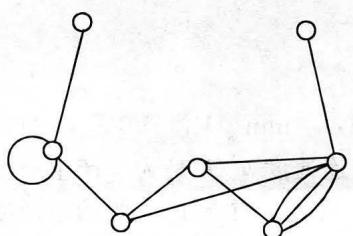  
(a)

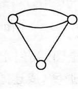  
0

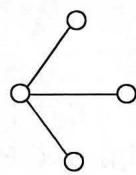  
(b)   
图7-2.2

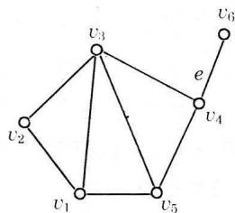  
(a)

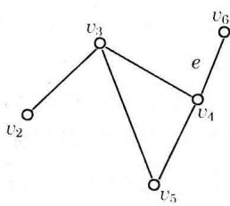  
(b)

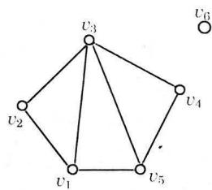  
(c)   
图7-2.3

图中删除某边，仅需把该边删去。例如，在图7-2.3(a)中删除边 $e$ ，即由图 $(a)$ 变为图 $(c)$ 。

### 定义7-2.4

设无向图 $G = \langle V, E \rangle$ 为连通图，若有点集 $V_1 \subset V$ ，使图 $G$ 删除了 $V_1$ 的所有结点后，所得的子图是不连通图，而删除了 $V_1$ 的任何真子集后，所得到的子图仍是连通图，则称 $V_1$ 是 $G$ 的一个点割集。若某一个结点构成一个点割集，则称该结点为割点。

如图7-2.4(a)中移去割点 $s$ 后，成为有两个连通分支的非连通图 $(b)$ 。

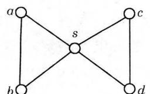  
(a)

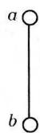

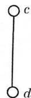  
(b)   
图7-2.4

若 $G$ 不是完全图，我们定义 $k(G) = \min \{|V_1| | V_1$ 是 $G$ 的点割集\}为 $G$ 的点连通度(或连通度)。连通度 $k(G)$ 是为了产生一个不连通图需要删去的点的最少数目。于是一个不连通图的连通度等于0，存在割点的连通图其连通度为1。完全图 $K_{p}$ 中，删去任何 $m$ 个 $(m < p - 1)$ 点后仍是连通图，但是删去了 $p - 1$ 个点后产生了

一个平凡图，故定义 $k(K_{p}) = p - 1$ 。

### 定义7-2.5

设无向图 $G = \langle V, E \rangle$ 为连通图，若有边集 $E_1 \subset E$ ，使图 $G$ 中删除了 $E_1$ 中的所有边后得到的子图是不连通图，而删除了 $E_1$ 的任一真子集后得到的子图是连通图，则称 $E_1$ 是 $G$ 的一个边割集。若某一个边构成一个边割集，则称该边为割边（或桥）。

$G$ 的割边也就是 $G$ 的一条边 $e$ 使 $W(G - e) > W(G)$ 。与点连通度相似，我们定义非平凡图 $G$ 的边连通度为： $\lambda (G) = \min \{|E_1|\mid$ $E_{1}$ 是 $G$ 的边割集}，边连通度 $\lambda (G)$ 是为了产生一个不连通图需要删去的边的最少数目。对平凡图 $G$ 可定义 $\lambda (G) = 0$ ，此外一个不连通图也有 $\lambda (G) = 0$ 。

### 定理7-2.2

对于任何一个图 $G$ ，有

$$
k (G) \leqslant \lambda (G) \leqslant \delta (G)
$$

证明 若 $G$ 不连通，则 $k(G) = \lambda (G) = 0$ ，故上式成立。

若 $G$ 连通，

1）证明 $\lambda (G)\leqslant \delta (G)$

如果 $G$ 是平凡图，则 $\lambda (G) = 0\leqslant \delta (G)$ ，若 $G$ 是非平凡图，则因每一结点的所有关联边必含一个边割集，故 $\lambda (G)\leqslant \delta (G)$ 。

2）再证 $k(G)\leqslant \lambda (G)$

(a) 设 $\lambda(G) = 1$ ，即 $G$ 有一割边，显然这时 $k(G) = 1$ ，上式成立。

（b）设 $\lambda (G)\geqslant 2$ ，则必可删去某 $\lambda (G)$ 条边，使 $G$ 不连通，而删去其中 $\lambda (G) - 1$ 条边，它仍是连通的，且有一条桥 $e = (u,v)$ 对 $\lambda (G) - 1$ 条边中的每一条边都选取一个不同于 $u,v$ 的端点，把这些端点删去则必至少删去 $\lambda (G) - 1$ 条边。若这样产生的图是不连通的，则 $k(G)\leqslant \lambda (G) - 1 <   \lambda (G)$ ，若这样产生的图是连通的，则 $e$ 仍是桥，此时再删去 $u$ 或 $v$ ，就必产生一个不连通图，故 $k(G)\leqslant \lambda (G)$

由1)和2)得 $k(G)\leqslant \lambda (G)\leqslant \delta (G)$

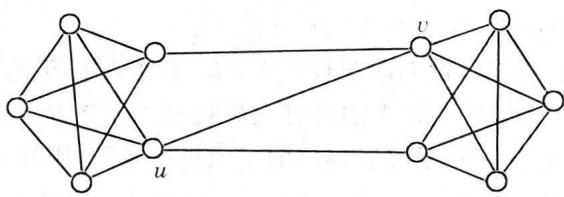  
图7-2.5

这个定理的证明可用图7-2.5来予以说明。这里： $k(G) = 2$ $\lambda (G) = 3$ ， $\delta (G) = 4$ 。

### 定理7-2.3

一个连通无向图 $G$ 中的结点 $\pmb{v}$ 是割点的充分必要条件是存在两个结点 $\pmb{u}$ 和 $\pmb{\varpi}$ ，使得结点 $\pmb{u}$ 和 $\pmb{\varpi}$ 的每一条路都通过 $\pmb{v}$ 。

证明 若结点 $v$ 是连通图 $G = \langle V, E \rangle$ 的一个割点，设删去 $v$ 得到子图 $G'$ ，则 $G'$ 至少包含两个连通分支。设其为 $G_1 = \langle V_1, E_1 \rangle$ ， $G_2 = \langle V_2, E_2 \rangle$ ，任取 $u \in V_1$ ， $w \in V_2$ ，因为 $G$ 是连通的，故在 $G$ 中必有一条连结 $u$ 和 $w$ 的路 $C$ ，但 $u$ 和 $w$ 在 $G'$ 中属于两个不同的连通分支，故 $u$ 和 $w$ 必不连通，因此 $C$ 必须通过 $v$ ，故 $u$ 和 $w$ 之间的任意一条路都通过 $v$ 。

反之，若连接图 $G$ 中某两个结点的每一条路都通过 $\mathcal{V}$ ，删去 $\mathcal{V}$ 得到子图 $G^{\prime}$ ，在 $G^{\prime}$ 中这两个结点必然不连通，故 $\mathcal{V}$ 是图 $G$ 的割点。

无向图的连通性，不能直接推广到有向图。在有向图 $G = \langle V, E \rangle$ 中，从结点 $u$ 到 $v$ 有一条路，称从 $u$ 可达 $v$ 。可达性是有向图结点集上的二元关系，它是自反和传递的，但一般来说它不是对称的，因为如果从 $u$ 到 $v$ 有一条路，不一定必有 $v$ 到 $u$ 的一条路，故可达性不是等价关系。

如果 $u$ 可达 $v$ ，它们之间可能不止一条路，在所有这些路中，最短路的长度称为结点 $u$ 和 $v$ 之间的距离（或短程线），记作 $d\langle u,v\rangle$ ，它满足下列性质：

$$
\begin{array}{l} d \langle u, v \rangle \geqslant 0 \\ d \langle u, u \rangle = 0 \\ \end{array}
$$

$$
d \langle u, v \rangle + d \langle v, w \rangle \geqslant d \langle u, w \rangle
$$

如果从 $u$ 到 $v$ 是不可达的，则通常写成 $d\langle u,v\rangle = \infty$ 。注意当 $u$ 可达 $v$ ，且 $v$ 也可达 $u$ 时， $d\langle u,v\rangle$ 不一定等于 $d\langle v,u\rangle$ 。有关距离的概念对无向图亦适用，今后我们把 $D = \max_{u,v\in V}d\langle u,v\rangle$ 称作图的直径。

### 定义7-2.6

在简单有向图 $G$ 中，任何一对结点间，至少有一个结点到另一个结点是可达的，则称这个图是单侧连通的。如果对于图 $G$ 中的任何一对结点两者之间是相互可达的，则称这个图是强连通的。如果在图 $G$ 中略去边的方向，将它看成无向图后，图是连通的，则称该图为弱连通的。

例如图7-2.6中分别给出了强连通图 $(a)$ ，单侧连通图 $(b)$ 弱连通图 $(c)$ 。

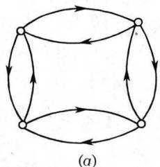

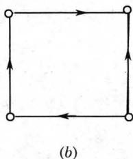

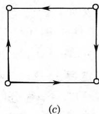  
图7-2.6

从上述定义可以看出，若图 $G$ 是强连通的，则必是单侧连通的；若图 $G$ 是单侧连通的，则必是弱连通的。这两个命题，其逆不真。

### 定理7-2.4

一个有向图是强连通的，当且仅当 $G$ 中有一个回路，它至少包含每个结点一次。

证明 充分性。

如果 $G$ 中有一个回路，它至少包含每个结点一次，则 $G$ 中任两个结点都是相互可达的，故 $G$ 是强连通图。

必要性。

如果有向图 $G$ 是强连通的，则任两个结点都是相互可达。故必可作一回路经过图中所有各点。若不然则必有一回路不包含某

一结点 $v$ ，并且 $\mathcal{V}$ 与回路上的各结点就不是相互可达，与强连通条件矛盾。

### 定义7-2.7

在简单有向图中，具有强连通性质的最大子图，称为强分图；具有单侧连通性质的最大子图，称为单侧分图；具有弱连通性质的最大子图，称为弱分图。

例如在图7-2.7(a)中，由 $\{v_{1}, v_{2}, v_{3}, v_{4}\}$ 或 $\{v_{5}\}$ 导出的子图都是强分图，由 $\{v_{1}, v_{2}, v_{3}, v_{4}, v_{5}\}$ 导出的子图是单侧分图也是弱分图。

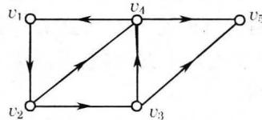  
(a)

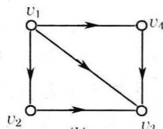  
(b)   
图7-2.7

又如在图7-2.7(b)中，强分图可由 $\{v_{1}\}$ ， $\{v_{2}\}$ ， $\{v_{3}\}$ ， $\{v_{4}\}$ 导出，单侧分图可由 $\{v_{1}, v_{2}, v_{3}\}$ ， $\{v_{1}, v_{3}, v_{4}\}$ 导出，弱分图可由 $\{v_{1}, v_{2}, v_{3}, v_{4}\}$ 导出。

### 定理7-2.5

在有向图 $G = \langle V, E \rangle$ 中，它的每一个结点位于且只位于一个强分图中。

证明1）假设 $v \in V$ ，令 $S$ 是 $G$ 中所有与 $v$ 相互可达的结点的集合，当然 $v$ 也在 $S$ 之中，而 $S$ 是 $G$ 的一个强分图，因此 $G$ 的每一结点必位于一个强分图中。

2）假设 $v$ 位于两个不同的强分图 $S_{1}$ 与 $S_{2}$ 之中，因为 $S_{1}$ 中每个结点与 $v$ 相互可达，而 $v$ 与 $S_{2}$ 中每个结点也相互可达，故 $S_{1}$ 中任何一结点与 $S_{2}$ 中任何一个结点通过 $v$ 都相互可达，这与题设 $S_{1}$ 为强分图矛盾。故 $G$ 的每一结点只能位于一个强分图之中。

□

### 7-2 习题

（1）在无向图 $G$ 中，从结点 $\pmb{u}$ 到结点 $\pmb{v}$ 有一条长度为偶数的通路，从结点 $\pmb{u}$ 到结点 $\pmb{v}$ 又有一条长度为奇数的通路，则在 $G$ 中必有一条长度为奇数的回路。

（2）若无向图 $G$ 中恰有两个奇数度的结点，则这两结点间必有一条路。

（3）若图 $G$ 是不连通的，则 $G$ 的补图 $\overline{G}$ 是连通的。

（4）当且仅当 $G$ 的一条边 $\mathcal{e}$ 不包含在 $G$ 的闭迹中时， $\mathcal{e}$ 才是 $G$ 的割边。

（5）分析图7-2.8，求：

a）从 $A$ 到 $F$ 的所有通路。

b）从 $A$ 到 $F$ 的所有迹。

c） $A$ 和 $F$ 之间的距离。

d) $k(G)$ ， $\lambda (G)$ 和 $\delta (G)$ 。

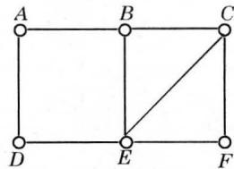  
图7-2.8

（6）令 $G$ 是一个至少有三个结点的连通图，下列命题是等价的。

a） $G$ 没有桥。

b） $G$ 的每二个结点在一条公共的闭迹上。

c） $G$ 的每一个结点和一条边在一条公共的闭迹上。

d） $G$ 的每二条边在一条公共的闭迹上。

e）对 $G$ 的每一对结点和每一条边，有一条联结这两个结点而且含有这条边的迹。

f）对 $G$ 的每一对结点和每一条边，有一条联结这两个结点而不含有这条边的通路。

g）对每三个结点，有一条联结任何两个结点而且含第三个结点的迹。

（7）在图7-2.9中给出了一个有向图，试求 $d\langle v_1,v_4\rangle ,d\langle v_2,v_5\rangle$ 及 $d\langle v_3,v_6\rangle$ 。此有向图对应的关系是否可传递的？如果不是可传递的，试求此图的传递闭包。

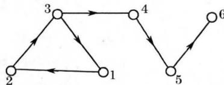  
图7-2.9

（8）试求图7-2.9中的有向图的强分图，单侧分图和弱分图。

（9）一个有向图 $D$ 是单侧连通的，当且仅当它有一条经过每一结点的路。

（10）试证明图的每一个结点和每一条边，都只包含于一个弱分图中。

## 7-3 图的矩阵表示

在第三章中，对于给定集合 $A$ 上的关系 $R$ ，可用一个有向图表示，这种图形表示了集合 $A$ 上元素之间的关系，关系图亦表示

了集合中元素间的邻接关系。对于关系图，可用一个矩阵表示，一个矩阵也必对应于一个标定结点序号的关系图。

### 定义7-3.1

设 $G = \langle V, E \rangle$ 是一个简单图，它有 $n$ 个结点 $V = \{v_{1}, v_{2}, \dots, v_{n}\}$ ，则 $n$ 阶方阵 $A(G) = (a_{ij})$ 称为 $G$ 的邻接矩阵。

其中 $a_{ij} = \left\{ \begin{array}{ll}1, & v_i,\mathrm{adj}v_j\\ 0, & v_i,\mathrm{adj}v_j \end{array} \right.$ 或 $i = j$

adj表示邻接，nadj表示不邻接。

例如图7-3.1，它的邻接矩阵为：

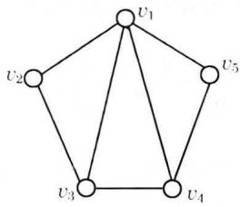  
图7-3.1

$$
A (G) = \left[ \begin{array}{l l l l l} 0 & 1 & 1 & 1 & 1 \\ 1 & 0 & 1 & 0 & 0 \\ 1 & 1 & 0 & 1 & 0 \\ 1 & 0 & 1 & 0 & 1 \\ 1 & 0 & 0 & 1 & 0 \end{array} \right]
$$

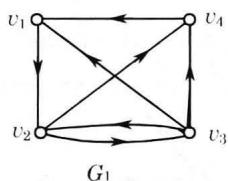

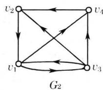  
图7-3.2

当给定的简单图是无向图时，邻接矩阵为对称的，当给定图是有向图时，邻接矩阵并不一定对称。图 $G$ 的邻接矩阵显然与 $n$ 个结点的标定次序 $\{v_{1}, v_{2}, \dots, v_{n}\}$ 有关。例如图7-3.2中，若将结点 $v_{1}$ 和 $v_{2}$ 的次序调换一下，那么新的邻接矩阵将是原邻接矩阵第一、二行对调，第一、二列对调而得到。

$$
A (G _ {1}) = \left[ \begin{array}{c c c c} 0 & 1 & 0 & 0 \\ 0 & 0 & 1 & 1 \\ 1 & 1 & 0 & 1 \\ 1 & 0 & 0 & 0 \end{array} \right], A (G _ {2}) = \left[ \begin{array}{c c c c} 0 & 0 & 1 & 1 \\ 1 & 0 & 0 & 0 \\ 1 & 1 & 0 & 1 \\ 0 & 1 & 0 & 0 \end{array} \right]
$$

一般地说，我们把一个 $n$ 阶方阵 $A$ 的某些列作一置换，再把相应的行作同样置换，得到一个新的 $n$ 阶方阵 $A'$ ，我们称 $A'$ 与 $A$ 置换等价。显然置换等价是 $n$ 阶布尔矩阵集合上的一个等价关系。有向图的结点，按不同次序所写出的邻接矩阵是彼此置换等价的，今后我们略去这种元素次序的任意性，可取图的任意一个邻接矩阵作为该图的矩阵表示。

从邻接矩阵 $A$ 中，我们看到，第 $i$ 行元素是由结点 $v_{i}$ 出发的边所决定，第 $i$ 行中值为1的元素数目等于 $v_{i}$ 的出度。同理，在第 $j$ 列中值为1的元素数目是 $v_{j}$ 的入度。

如果给定的一个图是零图，则其对应的矩阵中，所有元素都为零，即它是一个零矩阵，反之亦然。

从图 $G$ 的邻接矩阵中，我们还可以得到图的很多重要性质：

设有向图 $G$ 的结点集合 $V = \{v_{1}, v_{2}, \dots, v_{n}\}$ , 它的邻接矩阵为: $A(G) = (a_{ij})_{n \times n}$ , 现在我们想计算从结点 $v_{i}$ 到结点 $v_{j}$ 的长度为 2 的路的数目。注意到每条从 $v_{i}$ 到 $v_{j}$ 的长度为 2 的路, 中间必须经过一个结点 $v_{k}$ , 即 $v_{i} \rightarrow v_{k} \rightarrow v_{j} (1 \leqslant k \leqslant n)$ , 如果图 $G$ 中有路 $v_{i} v_{k} v_{j}$ 存在, 那么 $a_{ik} = a_{kj} = 1$ 即 $a_{ik} \cdot a_{kj} = 1$ , 反之如果图 $G$ 中不存在路 $v_{i} v_{k} v_{j}$ , 那么 $a_{ik} = 0$ 或 $a_{kj} = 0$ , 即 $a_{ik} \cdot a_{kj} = 0$ 。于是从结点 $v_{i}$ 到结点 $v_{j}$ 的长度为 2 的路的数目等于:

$$
a _ {i 1} \cdot a _ {1 j} + a _ {i 2} \cdot a _ {2 j} + \dots + a _ {i n} \cdot a _ {n j} = \sum_ {k = 1} ^ {n} a _ {i k} \cdot a _ {k j}
$$

按照矩阵的乘法规则，这恰好等于矩阵 $(A(G))^2$ 中第 $i$ 行，第 $j$ 列的元素。

$$
(a _ {i j} ^ {(2)}) _ {n \times n} = (A (G)) ^ {2} = \left[ \begin{array}{c c c c} a _ {1 1} & a _ {1 2} & \dots & a _ {1 n} \\ a _ {2 1} & a _ {2 2} & \dots & a _ {2 n} \\ \vdots & & & \\ a _ {n 1} & a _ {n 2} & \dots & a _ {n n} \end{array} \right] \cdot \left[ \begin{array}{c c c c} a _ {1 1} & a _ {1 2} & \dots & a _ {1 n} \\ a _ {2 1} & a _ {2 2} & \dots & a _ {2 n} \\ \vdots & & & \\ a _ {n 1} & a _ {n 2} & \dots & a _ {n n} \end{} \right]
$$

$a_{ij}^{(2)}$ 表示从 $v_{i}$ 到 $v_{j}$ 的长度为2的路的数目。

$a_{ii}^{(2)}$ 表示从 $v_{i}$ 到 $v_{i}$ 的长度为2的回路数目。

从 $v_{i}$ 到 $v_{j}$ 的长度为3的路，可以看作是由 $v_{i}$ 到 $v_{k}$ 的一条长度为1的路，再联结 $v_{k}$ 到 $v_{j}$ 的一条长度为2的路，故 $v_{i}$ 到 $v_{j}$ 的长

度为3的路的数目：

$$
a _ {i j} ^ {(3)} = \sum_ {k = 1} ^ {n} a _ {i k} \cdot a _ {k j} ^ {(2)}
$$

即 $(a_{ij}^{(3)})_{n\times n} = (A(G))^3 = (A(G))\bullet (A(G))^2$

一般地有

$$
(a _ {i j} ^ {(l)}) _ {n \times n} = (A (G)) ^ {l} = \left[ \begin{array}{c c c c} a _ {1 1} & a _ {1 2} & \dots & a _ {1 n} \\ a _ {2 1} & a _ {2 2} & \dots & a _ {2 n} \\ \vdots & & & \\ a _ {n 1} & a _ {n 2} & \dots & a _ {n n} \end{array} \right] \dots \left[ \begin{array}{c c c c} a _ {1 1} & a _ {1 2} & \dots & a _ {1 n} \\ a _ {2 1} & a _ {2 2} & \dots & a _ {2 n} \\ \vdots & & & \\ a _ {n 1} & a _ {n 2} & \dots & a _ {n n} \end{} \right]
$$

上述这个结论对无向图也成立。

### 定理7-3.1

设 $A(G)$ 是图 $G$ 的邻接矩阵，则 $(A(G))^l$ 中的 $i$ 行， $j$ 列元素 $a_{ij}^{(l)}$ 等于 $G$ 中联结 $v_{i}$ 与 $v_{j}$ 的长度为 $l$ 路的数目。

证明 对 $l$ 用数学归纳法。

当 $l = 2$ 时，由上可知显然成立。

设命题对 $l$ 成立，由

$$
(A (G)) ^ {l + 1} = A (G) \cdot (A (G)) ^ {l}
$$

故 $a_{ij}^{(l + 1)} = \sum_{k = 1}^{n}a_{ik}\cdot a_{kj}^{(l)}$

根据邻接矩阵定义 $a_{ik}$ 表示联结 $v_{i}$ 与 $v_{k}$ 的长度为1的路的数目， $a_{kj}^{(l)}$ 是联结 $v_{k}$ 与 $v_{j}$ 的长度为 $l$ 的路的数目，故上式右边的每一项表示由 $v_{i}$ 经过一条边到 $v_{k}$ ，再由 $v_{k}$ 经过一条长度为 $l$ 的路到 $v_{j}$ 的总长度为 $l + 1$ 的路的数目。对所有 $k$ 求和，即得 $a_{ij}^{(l + 1)}$ 是所有从 $v_{i}$ 到 $v_{j}$ 的长度为 $l + 1$ 的路的数目，故命题对 $l + 1$ 成立。

例1 给定一图 $G = \langle V, E \rangle$ 如图7-3.3所示。

$$
A = \left[ \begin{array}{l l l l l} 0 & 1 & 0 & 0 & 0 \\ 1 & 0 & 1 & 0 & 0 \\ 0 & 1 & 0 & 0 & 0 \\ 0 & 0 & 0 & 0 & 1 \\ 0 & 0 & 0 & 1 & 0 \end{array} \right], A ^ {2} = \left[ \begin{array}{l l l l l} 1 & 0 & 1 & 0 & 0 \\ 0 & 2 & 0 & 0 & 0 \\ 1 & 0 & 1 & 0 & 0 \\ 0 & 0 & 0 & 1 & 0 \\ 0 & 0 & 0 & 0 & 1 \end{array} \right]
$$

$$
A ^ {3} = \left[ \begin{array}{l l l l l} 0 & 2 & 0 & 0 & 0 \\ 2 & 0 & 2 & 0 & 0 \\ 0 & 2 & 0 & 0 & 0 \\ 0 & 0 & 0 & 0 & 1 \\ 0 & 0 & 0 & 1 & 0 \end{array} \right], A ^ {4} = \left[ \begin{array}{l l l l l} 2 & 0 & 2 & 0 & 0 \\ 0 & 4 & 0 & 0 & 0 \\ 2 & 0 & 2 & 0 & 0 \\ 0 & 0 & 0 & 1 & 0 \\ 0 & 0 & 0 & 0 & 1 \end{array} \right]
$$

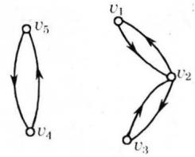  
图7-3.3

从上述矩阵中我们可以得到一些结论，如 $v_{1}$ 与 $v_{2}$ 之间有2条长度为3的路，结点 $v_{1}$ 与 $v_{3}$ 之间有一条长度为2的路，在结点 $v_{2}$ 有四条长度为4的回路，但没有长度为3的回路。

在许多实际问题中，常常要判断有向图的一个结点 $v_{i}$ 到另一结点 $v_{j}$ 是否存在路的问题。如果利用图 $G$ 的邻接矩阵 $A$ ，则可计算 $A,A^{2},\dots ,A^{n},\dots$ ，当发现其中某个 $A^l$ 的 $a_{ij}^{(l)}\geqslant 1$ ，就表明结点 $v_{i}$ 到 $v_{j}$ 可达。但这种计算比较繁琐且 $A^l$ 不知计算到何时为止，根据定理7-2.1的推论可知，如果有向图 $G$ 有 $_n$ 个结点

$$
V = \left\{v _ {1}, v _ {2}, \dots , v _ {n} \right\}
$$

$v_{i}$ 到 $v_{j}$ 有一条路，则必然有一条长度不超过 $n$ 的通路，因此只要考察 $a_{ij}^{(l)}$ 就可以了，其中 $1 \leqslant l \leqslant n$ 。对于有向图 $G$ 中任意两个结点之间的可达性，亦可用矩阵表达。

### 定义7-3.2

令 $G = \langle V, E \rangle$ 是一个简单有向图， $|V| = n$ ，假定 $G$ 的结点已编序，即 $V = \{v_{1}, v_{2}, \dots, v_{n}\}$ ，定义一个 $n \times n$ 矩阵 $P = (p_{ij})$ 。其中

$$
p _ {i j} = \left\{ \begin{array}{l l} 1, \text {从} v _ {i} \text {到} v _ {j} \text {至 少 存 在 一 条 路} \\ 0, \text {从} v _ {i} \text {到} v _ {j} \text {不 存 在 路} \end{array} \right.
$$

称矩阵 $P$ 是图 $G$ 的可达性矩阵。

可达性矩阵表明了图中任意两个结点间是否至少存在一条路

以及在任何结点上是否存在回路。

一般地讲，可由图 $G$ 的邻接矩阵 $A$ 得到可达性矩阵 $P$ ，即令 $B_{n} = A + A^{2} + \dots +A^{n}$ ，再从 $B_{n}$ 中将不为零的元素均改换为1，而为零的元素不变，这个改换的矩阵即为可达性矩阵 $P$ 。

#### 例题1

设图 $G$ 的邻接矩阵为 $A = \left[ \begin{array}{cccc}0 & 1 & 0 & 0\\ 0 & 0 & 1 & 1\\ 1 & 1 & 0 & 1\\ 1 & 0 & 0 & 0 \end{array} \right]$ ，求 $G$ 的可达性矩阵。

解 $A^2 = \left[ \begin{array}{llll}0 & 0 & 1 & 1\\ 2 & 1 & 0 & 1\\ 1 & 1 & 1 & 1\\ 0 & 1 & 0 & 0 \end{array} \right], A^3 = \left[ \begin{array}{llll}2 & 1 & 0 & 1\\ 1 & 2 & 1 & 1\\ 2 & 2 & 1 & 2\\ 0 & 0 & 1 & 1 \end{array} \right]$

$$
A ^ {4} = \left[ \begin{array}{l l l l} 1 & 2 & 1 & 1 \\ 2 & 2 & 2 & 3 \\ 3 & 3 & 2 & 3 \\ 2 & 1 & 0 & 1 \end{array} \right]
$$

故 $B_{4} = A + A^{2} + A^{3} + A^{4} = \left[ \begin{array}{cccc}3 & 4 & 2 & 3\\ 5 & 5 & 4 & 6\\ 7 & 7 & 4 & 7\\ 3 & 2 & 1 & 2 \end{array} \right]$

$$
P = \left[ \begin{array}{l l l l} 1 & 1 & 1 & 1 \\ 1 & 1 & 1 & 1 \\ 1 & 1 & 1 & 1 \\ 1 & 1 & 1 & 1 \end{array} \right]
$$

由此可知图 $G$ 中任两结点间均是可达的，并且任一结点均有回路，因而此图是个连通图。

上述计算可达性矩阵的方法还是比较复杂，因为可达性矩阵是一个元素为1或0的布尔矩阵，由于在每个 $A^l$ 矩阵中，对于两个结点间具有路的数目不感兴趣，它所关心的是该两结点间是否有路存在，因此我们可将矩阵 $A, A^2, \dots, A^n$ ，分别改为布尔矩阵 $A^{(1)}, A^{(2)}, \dots, A^{(n)}$ ，故 $P = A^{(1)} \lor A^{(2)} \lor \dots \lor A^{(n)}$ ，其中 $A^{(i)}$ 表示在布尔运算意义下 $A$ 的 $i$ 次方。

#### 例题2

设图 $G$ 如图7-3.4所示，求可达性矩阵 $P$ 。

解 $A = \left[ \begin{array}{cccccc}0 & 1 & 0 & 0 & 0\\ 0 & 0 & 0 & 1 & 0\\ 1 & 0 & 0 & 0 & 0\\ 0 & 0 & 0 & 0 & 1\\ 0 & 1 & 0 & 0 & 0 \end{array} \right]$

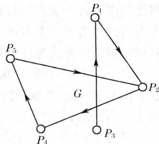  
图7-3.4

$$
\begin{array}{l} A ^ {(2)} = \left[ \begin{array}{l l l l l} 0 & 1 & 0 & 0 & 0 \\ 0 & 0 & 0 & 1 & 0 \\ 1 & 0 & 0 & 0 & 0 \\ 0 & 0 & 0 & 0 & 1 \\ 0 & 1 & 0 & 0 & 0 \end{array} \right] \left[ \begin{array}{l l l l l} 0 & 1 & 0 & 0 & 0 \\ 0 & 0 & 0 & 1 & 0 \\ 1 & 0 & 0 & 0 & 0 \\ 0 & 0 & 0 & 0 & 1 \\ 0 & 1 & 0 & 0 & 0 \end{array} \right] = \left[ \begin{array}{l l l l l} 0 & 0 & 0 & 1 & 0 \\ 0 & 0 & 0 & 0 & 1 \\ 0 & 1 & 0 & 0 & 0 \\ 0 & 1 & 0 & 0 & 0 \\ 0 & 0 & 0 & 0 & 1 \end{array} \right] \\ A ^ {(3)} = \left[ \begin{array}{l l l l l} 0 & 0 & 0 & 1 & 0 \\ 0 & 0 & 0 & 0 & 1 \\ 0 & 1 & 0 & 0 & 0 \\ 0 & 1 & 0 & 0 & 0 \\ 0 & 0 & 0 & 0 & 1 \end{array} \right] \left[ \begin{array}{l l l l l} 0 & 1 & 0 & 0 & 0 \\ 0 & 0 & 0 & 1 & 0 \\ 1 & 0 & 0 & 0 & 0 \\ 0 & 0 & 0 & 0 & 1 \\ 0 & 1 & 0 & 0 & 0 \end{array} \right] = \left[ \begin{array}{l l l l l} 0 & 0 & 0 & 0 & 1 \\ 0 & 1 & 0 & 0 & 0 \\ 0 & 0 & 0 & 1 & 0 \\ 0 & 0 & 0 & 1 & 0 \\ 0 & 0 & 0 & 0 & 1 \end{array} \right] \\ \end{array}
$$

同理可得：

$$
\begin{array}{l} A ^ {(4)} = \left[ \begin{array}{l l l l l} 0 & 1 & 0 & 0 & 0 \\ 0 & 0 & 0 & 1 & 0 \\ 0 & 0 & 0 & 0 & 1 \\ 0 & 0 & 0 & 0 & 1 \\ 0 & 1 & 0 & 0 & 0 \end{array} \right], A ^ {(5)} = \left[ \begin{array}{l l l l l} 0 & 0 & 0 & 1 & 0 \\ 0 & 0 & 0 & 0 & 1 \\ 0 & 1 & 0 & 0 & 0 \\ 0 & 1 & 0 & 0 & 0 \\ 0 & 0 & 0 & 1 & 0 \end{array} \right] \\ P = A \vee A ^ {(2)} \vee A ^ {(3)} \vee A ^ {(4)} \vee A ^ {(5)} = \left[ \begin{array}{l l l l l} 0 & 1 & 0 & 1 & 1 \\ 0 & 1 & 0 & 1 & 1 \\ 1 & 1 & 0 & 1 & 1 \\ 0 & 1 & 0 & 1 & 1 \\ 0 & 1 & 0 & 1 & 1 \end{array} \right] \\ \end{array}
$$

从本例的运算可以看到，如果把邻接矩阵看作是结点集 $V$ 上关系 $R$ 的关系矩阵，则可达性矩阵 $P$ 即为 $M_{R^{+}}$ ，因此可达性矩阵 $P$ 亦可用Warshall算法计算。

上述可达性矩阵等概念，可以很容易地推广到无向图中，只要

将无向图中每条无向边看成是具有相反方向的两条边，这样，一个无向图就可看成一个有向图。无向图的邻接矩阵是一个对称矩阵，其可达性矩阵称为连通矩阵，也是对称的。

对于一个无向图 $G$ ，除了可用邻接矩阵表示外，还对应着一个称为图 $G$ 的完全关联矩阵，假定图 $G$ 无自回路，如因某种运算得到了自回路，则将它删去。

### 定义7-3.3

给定无向图 $G$ ，令 $v_{1}, v_{2}, \dots, v_{p}$ 和 $e_{1}, e_{2}, \dots, e_{q}$ 分别记为 $M(G)$ 的结点和边，则矩阵 $M(G) = (m_{ij})$ ，其中

$$
m _ {i j} = \left\{ \begin{array}{l l} 1, \text {若} v _ {i} \text {关 联} e _ {j} \\ 0, \text {若} v _ {i} \text {不 关 联} e _ {j} \end{array} \right.
$$

称 $M(G)$ 为完全关联矩阵。

例如对于图7-3.5，可写出其关联矩阵：

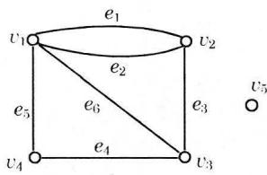  
图7-3.5

|  | e1 | e2 | e3 | e4 | e5 | e6 |
| --- | --- | --- | --- | --- | --- | --- |
| v1 | 1 | 1 | 0 | 0 | 1 | 1 |
| v2 | 1 | 1 | 1 | 0 | 0 | 0 |
| v3 | 0 | 0 | 1 | 1 | 0 | 1 |
| v4 | 0 | 0 | 0 | 1 | 1 | 0 |
| v5 | 0 | 0 | 0 | 0 | 0 | 0 |

从关联矩阵中可以看出图形的一些性质：

1）图中每一边关联两个结点，故 $M(G)$ 的每一列中只有两个1。  
2）每一行中元素的和数是对应结点的度数。  
3）一行中元素全为0，其对应的结点为孤立结点。  
4）两个平行边其对应的两列相同。  
5）同一个图当结点或边的编序不同时，其对应的 $M(G)$ 仅有行序，列序的差别。

当一个图是有向图时，亦可用结点和边的关联矩阵表示。

### 定义7-3.4

给定简单有向图

$$
G = \langle V, E \rangle , V = \left\{v _ {1}, v _ {2}, \dots , v _ {p} \right\}, E = \left\{e _ {1}, e _ {2}, \dots , e _ {q} \right\}
$$

$p \times q$ 阶矩阵 $M(G) = (m_{ij})$ ，其中

$$
m _ {i j} = \left\{ \begin{array}{l l} 1, \text {若 在} G \text {中} v _ {i} \text {是} e _ {j} \text {的 起 点} \\ - 1, \text {若 在} G \text {中} v _ {i} \text {是} e _ {j} \text {的 终 点} \\ 0, \text {若} v _ {i} \text {与} e _ {j} \text {不 关 联} \end{array} \right.
$$

称 $M(G)$ 为 $G$ 的完全关联矩阵。

例如由图7-3.6可写出其关联矩阵：

  
图7-3.6

|  | e1 | e2 | e3 | e4 | e5 | e6 | e7 |
| --- | --- | --- | --- | --- | --- | --- | --- |
| v1 | 1 | 0 | 0 | 0 | 1 | 1 | 1 |
| v2 | -1 | 1 | 0 | 0 | 0 | 0 | 0 |
| v3 | 0 | -1 | 1 | 0 | 0 | -1 | 0 |
| v4 | 0 | 0 | -1 | 1 | 0 | 0 | -1 |
| v5 | 0 | 0 | 0 | -1 | -1 | 0 | 0 |

有向图的完全关联矩阵也有类似于无向图的一些性质，读者可试予归纳。

对图 $G$ 的完全关联矩阵中两个行相加定义如下：若记 $\boldsymbol{v}_i$ 对应的行为 $\vec{v}_i$ ，将第 $i$ 行与第 $j$ 行相加，规定为：对有向图是指对应分量的普通加法运算，对无向图是指对应分量的模2加法运算，把这种运算记作 $\vec{v}_i\oplus \vec{v}_j = \vec{v}_{ij}$ 。施行这种运算，实际上就是相应于把 $G$ 的结点 $\boldsymbol{v}_i$ 与 $\boldsymbol{v}_j$ 合并。

设图 $G$ 的结点 $v_{i}$ 与 $v_{j}$ 合并得到图 $G^{\prime}$ ，那么 $M(G^{\prime})$ 是将 $M(G)$ 中 $\vec{v}_i$ 与 $\vec{v}_j$ 相加而得到。因为若有关项中第 $r$ 个对应分量有 $a_{ir} \oplus a_{jr} = \pm 1$ ，则说明 $v_{i}$ 和 $v_{j}$ 两者之中只有一个结点是边 $e_r$ 的端点，且将两个结点合并后的结点 $v_{i,j}$ 仍是 $e_r$ 的端点。

若 $a_{ir} \oplus a_{jr} = 0$ ，则有两种情况：

（1） $v_{i}, v_{j}$ 都不是 $e_{r}$ 的端点，那么 $v_{i,j}$ 也不是 $e_{r}$ 的端点。

（2） $v_{i}, v_{j}$ 都是 $e_{r}$ 的端点，那么合并后在 $G^{\prime}$ 中 $e_{r}$ 成为 $v_{i,j}$ 的自回路，按规定应删去。

此外，在 $M(G^{\prime})$ 中若有某些列，其元素全为零，说明由 $G$ 中的一些结点合并后，消失了一些对应边。

  
(a)

  
(b)   
图7-3.7

例1图 $7 - 3.7(a)$ 中使 $v_{4}$ 与 $v_{5}$ 合并得到图 $7 - 3.7(b)$ 其关联矩阵 $M(G^{\prime})$ 是由 $M(G)$ 中将第4行加到第5行而得到。

$M(G)$

|  | e1 | e2 | e3 | e4 | e5 | e6 | e7 |
| --- | --- | --- | --- | --- | --- | --- | --- |
| v1 | 0 | 0 | 0 | 0 | 0 | 1 | 1 |
| v2 | 0 | 0 | 0 | 1 | 1 | 1 | 0 |
| v3 | 0 | 1 | 1 | 1 | 0 | 0 | 0 |
| v4 | 1 | 1 | 0 | 0 | 0 | 0 | 0 |
| v5 | 1 | 0 | 1 | 0 | 1 | 0 | 1 |

$M(G^{\prime})$

|  | e1 | e2 | e3 | e4 | e5 | e6 | e7 |
| --- | --- | --- | --- | --- | --- | --- | --- |
| v1 | 0 | 0 | 0 | 0 | 0 | 1 | 1 |
| v2 | 0 | 0 | 0 | 1 | 1 | 1 | 0 |
| v3 | 0 | 1 | 1 | 1 | 0 | 0 | 0 |
| v4,5 | 0 | 1 | 1 | 0 | 1 | 0 | 1 |

例2 图 $7-3.8(a)$ 合并结点 $v_{2}$ 和 $v_{3}$ , 删去自回路得图 $7-3.8(b)$ 。其关联矩阵 $M(G')$ 是由 $M(G)$ 中将第2行加到第3行

  
(a)

  
(b)   
图7-3.8

而得到。

| M(G): | e1 | e2 | e3 | e4 | e5 | e6 | e7 | e8 | e9 |
| --- | --- | --- | --- | --- | --- | --- | --- | --- | --- |
| v1 | 1 | 1 | 0 | 0 | 0 | 0 | 0 | 0 |
| v2 | -1 | 0 | 1 | 0 | 0 | 0 | 1 | 0 |
| v3 | 0 | 0 | -1 | 1 | 0 | 0 | 0 | -1 |
| v4 | 0 | -1 | 0 | 0 | 0 | 1 | -1 | 1 |
| v5 | 0 | 0 | 0 | 0 | 1 | -1 | 0 | 0 |
| v6 | 0 | 0 | 0 | -1 | -1 | 0 | 0 | 0 |

|  | e1 | e2 | e3 | e4 | e5 | e6 | e7 | e8 | e9 |
| --- | --- | --- | --- | --- | --- | --- | --- | --- | --- |
| v1 | 1 | 1 | 0 | 0 | 0 | 0 | 0 | 0 | 0 |
| v2,3 | -1 | 0 | 0 | 1 | 0 | 0 | 1 | -1 | 1 |
| v4 | 0 | -1 | 0 | 0 | 0 | 1 | -1 | 1 | 0 |
| v5 | 0 | 0 | 0 | 0 | 1 | -1 | 0 | 0 | -1 |
| v6 | 0 | 0 | 0 | -1 | -1 | 0 | 0 | 0 | 0 |

下面应用这种运算，可求关联矩阵的秩。

### 定理7-3.2

如果一个连通图 $G$ 有 $r$ 个结点，则其完全关联矩阵 $M(G)$ 的秩为 $r - 1$ ，即 $\operatorname{rank} M(G) = r - 1$ 。

证明 这里对无向图进行证明。

（1）由于矩阵 $M(G)$ 的每一列恰有两个1，若把 $M(G)$ 的其余所有行加到最后一行上（模2加法），得到矩阵 $\overline{M} (G)$ ，它的最后一行全为零，因为 $\overline{M} (G)$ 的秩与 $M(G)$ 相同，故 $M(G)$ 的秩应小于行数，即 $\operatorname {rank}M(G)\leqslant r - 1$   
（2）设 $M(G)$ 的第一列对应边 $e$ ，且 $e$ 的端点为 $\boldsymbol{v}_i$ 和 $\boldsymbol{v}_j$ ，调整行序使第 $i$ 行成为第一行，这时 $M(G)$ 的首列仅在第一行和第 $j$ 行为1，其余各元素均为0，再把第一行加到第 $j$ 行上去，则得矩阵 $M^{\prime}(G)$ 。

$$
M ^ {\prime} (G) = \left[ \begin{array}{c c c c} 1 & \dots & \dots & \dots \\ \hline 0 & & & \\ \vdots & M ^ {\prime} (G _ {1}) & & \\ 0 & & & \end{array} \right]
$$

其中 $M^{\prime}(G_{1})$ 是 $M^{\prime}(G)$ 删去第一行和第一列所得的矩阵。

由于 $M^{\prime}(G_{1})$ 是 $G_{1}$ 的完全关联矩阵，而 $G_{1}$ 系将 $G$ 的两个结点 $v_{i}$ 和 $v_{j}$ 合并而得。由于 $G$ 是连通的，故 $G_{1}$ 也必为连通， $M^{\prime}(G_{1})$ 也具有连通图的完全关联矩阵的所有性质，故 $M^{\prime}(G_{1})$ 没有全零的行。如果 $M^{\prime}(G_{1})$ 的第一列全为零，则可将 $M^{\prime}(G_{1})$ 中的非零列与第一列对换，而不影响完全关联矩阵的秩数。因此，我们必可通过调整行的次序以及把一行加到另一行上这两种运算，使 $M^{\prime}(G_{1})$ 的第一列的首项元素为1，得到：

$$
M ^ {\prime \prime} (G) = \left[ \begin{array}{c c c c} 1 & \dots & \dots & \dots \\ \hline 0 & 1 & \dots & \dots \\ \hline & 0 & \\ \vdots & \vdots & M ^ {\prime} (G _ {2}) \\ 0 & 0 & \end{array} \right]
$$

继续进行上述两种运算，并不改变矩阵的秩，经过 $r - 1$ 次，最后将 $M(G)$ 变换成

$$
M ^ {(r - 1)} (G) := \left[ \begin{array}{c c c c c c c c} 1 & & & & & & \\ 0 & 1 & & & & & \\ 0 & 0 & 1 & & & & \\ \vdots & \vdots & \ddots & & & & \\ 0 & 0 & \dots & \dots & 1 & & \\ 0 & 0 & \dots & \dots & 0 & 0 & \dots & 0 \end{array} \right]
$$

显然 $M^{(r - 1)}(G)$ 有一个 $(r - 1)$ 阶子阵，其行列式的值不为零，故 $M^{(r - 1)}(G)$ 的秩至少为 $r - 1$

由（1）和（2）可知

$$
\operatorname {r a n k} M (G) = r - 1
$$

□

对于有向图的关联矩阵可以仿此证明。

例3 计算图7-3.7(a)中其对应的完全关联矩阵的秩数，以验证定理7-3.2。

设有完全关联矩阵 $M(G)$ ，以 $(k)$ 记第 $k$ 行，以 $\widehat{m}$ 记第 $m$ 列，以 $\widehat{k}\leftrightarrow \widehat{m}$ 表示第 $k$ 列与第 $m$ 列对调， $(k)\leftrightarrow (m)$ 表示第 $k$ 行与第 $m$ 行对调，图7-3.7(a)的完全关联矩阵为

|  | e1 | e2 | e3 | e4 | e5 | e6 | e7 |
| --- | --- | --- | --- | --- | --- | --- | --- |
| v1 | 0 | 0 | 0 | 0 | 0 | 1 | 1 |
| v2 | 0 | 0 | 0 | 1 | 1 | 1 | 0 |
| v3 | 0 | 1 | 1 | 1 | 0 | 0 | 0 |
| v4 | 1 | 1 | 0 | 0 | 0 | 0 | 0 |
| v5 | 1 | 0 | 1 | 0 | 1 | 0 | 1 |

$$
\begin{array}{l} \xrightarrow {(4) \leftrightarrow (1)} \left[ \begin{array}{c c c c c c c} 1 & 1 & 0 & 0 & 0 & 0 & 0 \\ 0 & 0 & 0 & 1 & 1 & 1 & 0 \\ 0 & 1 & 1 & 1 & 0 & 0 & 0 \\ 0 & 0 & 0 & 0 & 0 & 1 & 1 \\ 1 & 0 & 1 & 0 & 1 & 0 & 1 \end{array} \right] \xrightarrow {(1) \oplus (5)} \left[ \begin{array}{c c c c c c c} 1 & 1 & 0 & 0 & 0 & 0 & 0 \\ 0 & 0 & 0 & 1 & 1 & 1 & 0 \\ 0 & 1 & 1 & 1 & 0 & 0 & 0 \\ 0 & 0 & 0 & 0 & 0 & 1 & 2 \\ 0 & 1 & 1 & 0 & 1 & 0 & 1 \end{array} \right] \\ \xrightarrow {(2) \leftrightarrow (3)} \left[ \begin{array}{c c c c c c c} 1 & 1 & 0 & 0 & 0 & 0 & 0 \\ 0 & 1 & 1 & 1 & 0 & 0 & 0 \\ 0 & 0 & 0 & 1 & 1 & 1 & 0 \\ 0 & 0 & 0 & 0 & 0 & 1 & 1 \\ 0 & 1 & 1 & 0 & 1 & 0 & 1 \end{array} \right] \xrightarrow {(2) \oplus (5)} \left[ \begin{array}{c c c c c c c} 1 & 1 & 0 & 0 & 0 & 0 & 0 \\ 0 & 1 & 1 & 1 & 0 & 0 & 0 \\ 0 & 0 & 0 & 1 & 1 & 1 & 0 \\ 0 & 0 & 0 & 0 & 0 & 1 & 0 \\ 0 & 0 & 0 & 1 & 1 & 0 & 1 \end{array} \right] \\ \xrightarrow {\hat {3} \leftrightarrow \hat {4}} \left[ \begin{array}{l l l l l l l} 1 & 1 & 0 & 0 & 0 & 0 & 0 \\ 0 & 1 & 1 & 1 & 0 & 0 & 0 \\ 0 & 0 & 1 & 0 & 1 & 1 & 0 \\ 0 & 0 & 0 & 0 & 0 & 1 & 1 \\ 0 & 0 & 1 & 0 & 1 & 0 & 1 \end{array} \right] \xrightarrow {(3) \oplus (5)} \left[ \begin{array}{l l l l l l l} 1 & 1 & 0 & 0 & 0 & 0 & 0 \\ 0 & 1 & 1 & 1 & 0 & 0 & 0 \\ 0 & 0 & 1 & 0 & 1 & 1 & 0 \\ 0 & 0 & 0 & 0 & 0 & 1 & 1 \end{array} \right] \\ \end{array}
$$

$$
\xrightarrow {\hat {4} \leftrightarrow \hat {6}} \left[ \begin{array}{l l l l l l l} 1 & 1 & 0 & 0 & 0 & 0 & 0 \\ 0 & 1 & 1 & 0 & 0 & 1 & 0 \\ 0 & 0 & 1 & 1 & 1 & 0 & 0 \\ 0 & 0 & 0 & 1 & 0 & 0 & 1 \\ 0 & 0 & 0 & 1 & 0 & 0 & 1 \end{array} \right] \xrightarrow {(4) \oplus (5)} \left[ \begin{array}{l l l l l l l} 1 & 1 & 0 & 0 & 0 & 0 & 0 \\ 0 & 1 & 1 & 0 & 0 & 1 & 0 \\ 0 & 0 & 1 & 1 & 1 & 0 & 0 \\ 0 & 0 & 0 & 1 & 0 & 0 & 1 \end{array} \right]
$$

最后一个矩阵其秩为4，即 $\operatorname{rank} M(G) = 5 - 1 = 4$ 。

推论 设图 $G$ 有 $r$ 个结点， $w$ 个最大连通子图，则图 $G$ 完全关联矩阵的秩为 $r - w$ 。

### 7-3 习题

（1）求出图7-3.9中有向图的邻接矩阵 $A$ ，找出从 $\boldsymbol{v}_{1}$ 到 $v_{4}$ 长度为2和4的路，用计算 $A^2,A^3$ 和 $A^4$ 来验证这结论。  
（2）对于邻接矩阵 $A$ 的简单有向图 $G$ ，它的距离矩阵定义如下：

$d_{ij} = \infty$ ，如果 $d\langle v_i,v_j\rangle = \infty$

$d_{ii} = 0$ ，对所有的 $i = 1,2,\dots ,n$

$d_{ij} = k$ ，这里 $k$ 是使 $a_{ij}^{(k)}\neq 0$ 的最小正整数

确定由图7-3.9所示的有向图的距离矩阵，并指出 $d_{ij} = 1$ 是什么意义？

  
图7-3.9

（3）在图7-3.10中给出了一个有向图，试求该图的邻接矩阵，并求出可达性矩阵和距离矩阵。

  
图7-3.10

  
图7-3.11

（4）写出如图7-3.11所示的图 $G$ 的完全关联矩阵，并验证其秩是否如定理7-3.2所述。  
（5）证明定理7-3.2的推论。

## 7-4 欧拉图与汉密尔顿图

1736年瑞士数学家列昂哈德·欧拉(Leonhard Euler)发表了图论的第一篇论文“哥尼斯堡七桥问题”。这个问题是这样的：哥尼斯堡(Königsberg)城市有一条横贯全城的普雷格尔(Pregel)河，

城的各部分用七座桥联接，每逢假日，城中居民进行环城逛游，这样就产生了一个问题，能不能设计一次“遍游”，使得从某地出发对每座跨河桥只走一次，而在遍

  
图7-4.1

历了七桥之后却又能回到原地。在图7-4.1中画出了哥尼斯堡城

  
图7-4.2

图，城的四个陆地部分分别标以 $A,B,C,D$ 。将陆地设想为图的结点，而把桥画成相应的连接边，这样城图可简化成如图7-4.2所示，于是通过哥尼斯堡城中每座桥一次且仅一次的问题，等价于在图7-4.2

中从某一结点出发找一条通路，通过它的每条边一次且仅一次，并回到原结点。

欧拉在1736年的论文中提出了一条简单的准则，确定了哥尼斯堡七桥问题是不能解的。下面将讨论这个问题的证明。

### 定义7-4.1

给定无孤立结点图 $G$ ，若存在一条路，经过图中每边一次且仅一次，该条路称为欧拉路；若存在一条回路，经过图中每边一次且仅一次，该回路称为欧拉回路。

具有欧拉回路的图称作欧拉图。

### 定理7-4.1

无向图 $G$ 具有一条欧拉路，当且仅当 $G$ 是连通的，且有零个或两个奇数度结点。

证明 必要性。

设 $G$ 具有欧拉路，即有点边序列 $v_{0}e_{1}v_{1}e_{2}v_{2}\dots e_{i}v_{i}e_{i + 1}\dots e_{k}v_{k}$ ，其中结点可能重复出现，但边不重复，因为欧拉路经过所有图 $G$ 的结点，故图 $G$ 必是连通的。

对任意一个不是端点的结点 $v_{i}$ ，在欧拉路中每当 $v_{i}$ 出现一次，必关联两条边，故 $v_{i}$ 虽可重复出现，但 $\deg (v_i)$ 必是偶数。对于端点，若 $v_{0} = v_{k}$ ，则 $d(v_0)$ 为偶数，即 $G$ 中无奇数度结点，若端点 $v_{0}$ 与 $v_{k}$ 不同，则 $d(v_0)$ 为奇数， $d(v_{k})$ 为奇数， $G$ 中就有两个奇数度结点。

充分性。

若图 $G$ 连通，有零个或两个奇数度结点，我们构造一条欧拉路如下：

（1）若有两个奇数度结点，则从其中的一个结点开始构造一条迹，即从 $v_{0}$ 出发经关联边 $e_1$ “进入” $v_{1}$ ，若 $\deg (v_{1})$ 为偶数，则必可由 $v_{1}$ 再经关联边 $e_2$ 进入 $v_{2}$ ，如此进行下去，每边仅取一次。由于 $G$ 是连通的，故必可到达另一奇数度结点停下，得到一条迹 $L$ ： $v_{0}e_{1}v_{1}e_{2}\dots v_{i}e_{i + 1}\dots v_{k}$ 。若 $G$ 中没有奇数度结点，则从任一结点 $v_{0}$ 出发，用上述方法必可回到结点 $v_{0}$ ，得到上述一条闭迹 $L_{1}$ 。  
（2）若 $L_{1}$ 通过了 $G$ 的所有边，则 $L_{1}$ 就是欧拉路。  
（3）若 $G$ 中去掉 $L_{1}$ 后得到子图 $G^{\prime}$ ，则 $G^{\prime}$ 中每个结点度数为偶数，因为原来的图是连通的，故 $L_{1}$ 与 $G^{\prime}$ 至少有一个结点 $\boldsymbol{v}_{i}$ 重合，在 $G^{\prime}$ 中由 $\boldsymbol{v}_{i}$ 出发重复(1)的方法，得到闭迹 $L_{2}$ 。  
（4）当 $L_{1}$ 与 $L_{2}$ 组合在一起，如果恰是 $G$ ，则即得欧拉路，否则重复(3)可得到闭迹 $L_{3}$ ，以此类推直到得到一条经过图 $G$ 中所有边的欧拉路。

推论 无向图 $G$ 具有一条欧拉回路，当且仅当 $G$ 是连通的，并且所有结点度数全为偶数。

由于有了欧拉路和欧拉回路的判别准则，因此哥尼斯堡七桥问题立即有了确切的否定答案，因为从图7-4.2中可以看到 $\deg (A) = 5$ ， $\deg (B) = \deg (C) = \deg (D) = 3$ ，故欧拉回路必不存在。

与七桥问题类似的还有一笔画的判别问题，要判定一个图 $G$ 是否可一笔画出，有两种情况：一是从图 $G$ 中某一结点出发，经过图 $G$ 的每一边一次仅一次到达另一结点。另一种就是从 $G$ 的某个结点出发，经过 $G$ 的每一边一次仅一次再回到该结点。上述两种情况分别可以由欧拉路和欧拉回路的判定条件予以解决。如图7-4.3(a)中，因为 $\deg(v_2) = \deg(v_3) = 3$ ， $\deg(v_1) = \deg(v_4) = \deg(v_5) = 2$ ，故必有从 $v_2$ 到 $v_3$ 的一笔画。在图7-4.3(b)中所有结点度数均为偶数，所以可以从任一结点出发，一笔画回到原出发点。

  
图7-4.3

欧拉路和欧拉回路的概念，很易推广到有向图中去。

### 定义7-4.2

给定有向图 $G$ ，通过图中每边一次且仅一次的一条单向路(回路)，称作单向欧拉路(回路)。

### 定理7-4.2

有向图 $G$ 具有一条单向欧拉回路，当且仅当是连通的，且每个结点入度等于出度。一个有向图 $G$ 具有单向欧拉路，当且仅当它是连通的，而且除两个结点外，每个结点的入度等于出度，但这两个结点中，一个结点的入度比出度大1，另一个结点的入度比出度小1。

这个定理的证明，可以看作是无向图的欧拉路的推广，因为对

  
图7-4.4

于有向图的任意一个结点来说，如果入度与出度相等，则该点的总度数为偶数，若入度与出度之差为1时，其总度数为奇数，因此定理7-4.2的证明与定理7-4.1的证明类似。□

例1 计算机鼓轮的设计。设有旋转鼓轮其表面被等分成

$2^{4}$ 个部分，如图7-4.4所示。其中每一部分分别用绝缘体或导体组成，绝缘体部分给出信号0，导体部分给出信号1，在图7-4.4中阴影部分表示导体，空白部分表示绝缘体，根据鼓轮的位置，触点将得到信息1101，如果鼓轮沿顺时针方向旋转一个部分，触点将有信息1010。问鼓轮上16个部分怎样安排导体及绝缘体，才能使鼓轮每旋转一个部分，四个触点能得到一组不同的四位二进制数信息。

设有一个八个结点的有向图（图7-4.5），

  
图7-4.5

其结点分别记为三位二进制数 $\{000, 001, 010, 011, 100, 101, 110, 111\}$ ，设 $\alpha_{i} \in \{0, 1\}$ ，从结点 $\alpha_{1}\alpha_{2}\alpha_{3}$ 可引出两条有向边，其终点分别是 $\alpha_{2}\alpha_{3}0$ 以及 $\alpha_{2}\alpha_{3}1$ 。该两条边分别记为 $\alpha_{1}\alpha_{2}\alpha_{3}0$ 和 $\alpha_{1}\alpha_{2}\alpha_{3}1$ 。按照上述方法，对于八个结点的有向图共有16条边，在这种图的任一条路中，其邻接的边必是 $\alpha_{1}\alpha_{2}\alpha_{3}\alpha_{4}$ 和 $\alpha_{2}\alpha_{3}\alpha_{4}\alpha_{5}$ 的形式，即是第一条边标号的后三位数与第二条边标号的头三位数相同。因为图中16条边被记成不同的二进制数，可见前述鼓轮转动所得到16个不同位置触点上的二进制信息，即对应于图中的一条欧拉回路。在图7-4.5中，每个结点的入度等于2，出度等于2，故在图中必可找到一条欧拉回路如 $(e_0e_1e_2e_4e_9e_3e_6e_{13}e_{10}e_5e_{11}e_7e_{15}e_{14}e_{12}e_8)$ ，根据邻接边的标号记法，这16个二进制数可写成对应的二进制数序列0000100110101111。把这个序列排成环状，即与所求的鼓轮相对应，如图7-4.4所示。

上面的例子，我们可以把它推广到鼓轮具有 $n$ 个触点的情况。为此我们只要构造 $2^{n-1}$ 个结点的有向图，设每个结点标记为 $n-1$ 位二进制数，从结点 $\alpha_{1}\alpha_{2}\cdots\alpha_{n-1}$ 出发，有一条终点为 $\alpha_{2}\alpha_{3}\cdots\alpha_{n-1}0$ 的边，该边记为 $\alpha_{1}\alpha_{2}\cdots\alpha_{n-1}0$ ；还有一条边的终点为 $\alpha_{2}\alpha_{3}\cdots\alpha_{n-1}1$ 的边，该边记为 $\alpha_{1}\alpha_{2}\cdots\alpha_{n-1}1$ 。这样构造的有向图，其每一结点的出度和入度都是2，故必是欧拉图。由于邻接边的标记是第一条边的后 $n-1$ 位二进制数与第二条边的前 $n-1$ 位二进制数相同，为此就

有一种 $2^{n}$ 个二进制数的环形排列与所求的鼓轮相对应。

与欧拉回路非常类似的问题是汉密尔顿回路的问题。1859年，威廉·汉密尔顿爵士(Sir Willian Hamilton)在给他朋友的一封信中，首先谈到关于十二面体的一个数学游戏：能不能在图7-4.6中找到一条回路，使它含有这个图的所有结点？他把每

  
图7-4.6

个结点看成一个城市，联结两个结点的边看成是交通线，于是他的问

题就是能不能找到旅行路线，沿着交通线经过每个城市恰好一次，再回到原来的出发地？他把这个问题称为周游世界问题。

按图7-4.6中所给的编号，可以看出这样一条回路是存在的。

对于任何连通图也有类似的问题。

### 定义7-4.3

给定图 $G$ ，若存在一条路经过图中的每个结点恰好一次，这条路称作汉密尔顿路。若存在一条回路，经过图中的每个结点恰好一次，这条回路称作汉密尔顿回路。

具有汉密尔顿回路的图称作汉密尔顿图。

### 定理7-4.3

若图 $G = \langle V, E \rangle$ 具有汉密尔顿回路，则对于结点集 $V$ 的每个非空子集 $S$ 均有 $W(G - S) \leqslant |S|$ 成立。其中 $W(G - S)$ 是 $G - S$ 中连通分支数。

证明 设 $C$ 是 $G$ 的一条汉密尔顿回路，则对于 $V$ 的任何一个非空子集 $S$ 在 $C$ 中删去 $S$ 中任一结点 $a_{1}$ ，则 $C - a_{1}$ 是连通的非回路，若再删去 $S$ 中另一结点 $a_{2}$ ，则 $W(C - a_{1} - a_{2}) \leqslant 2$ ，由归纳法可得：

$$
W (C - S) \leqslant | S |
$$

同时 $C - S$ 是 $G - S$ 的一个生成子图，因而

$$
W (G - S) \leqslant W (C - S)
$$

所以

$$
W (G - S) \leqslant | S |
$$

□

利用定理7-4.3可以证明某些图是非汉密尔顿图。在图7-4.7中，若取 $S = \{v_{1}, v_{4}\}$ ，则 $G - S$ 中有三个分图，故 $G$ 不是汉密尔顿图。

需要指出，用定理7-4.3来证明某一特定图是非汉密尔顿图，

  
图7-4.7

  
图7-4.8

这个方法并不是总是有效的。例如，著名的彼得森(Petersen)图，如图7-4.8中所示，在图中删去任一个结点或任意两个结点，不能使它不连通；删去3个结点，最多只能得到有两个连通分支的子图；删去4个结点，只能得到最多三个连通分支的子图：删去5个或5个以上的结点，余下子图的结点数都不大于5，故必不能有5个以上的连通分支数。所以该图满足 $W(G - S)\leqslant |S|$ ，但是可以证明它是非汉密尔顿图（此证明留作习题）。

虽然汉密尔顿回路问题与欧拉回路问题在形式上极为相似，但对图 $G$ 是否存在汉密尔顿回路还无充要的判别准则。下面我们给出一个无向图具有汉密尔顿路的充分条件。

### 定理7-4.4

设 $G$ 具有 $n$ 个结点的简单图，如果 $G$ 中每一对结点度数之和大于等于 $n - 1$ ，则在 $G$ 中存在一条汉密尔顿路。

证明 我们首先证明 $G$ 是连通图。若 $G$ 有两个或更多个互不连通的分图，设一个分图中有 $n_1$ 个结点，任取一个结点 $v_1$ ，设另一个分图中有 $n_2$ 个结点，任取一个结点 $v_2$ ，因为 $d(v_1) \leqslant n_1 - 1$ ， $d(v_2) \leqslant n_2 - 1$ ，故 $d(v_1) + d(v_2) \leqslant n_1 + n_2 - 2 < n - 1$ ，这与题设矛盾，故 $G$ 必连通。

其次，我们从一条边出发构成一条路，证明它是汉密尔顿路。

设在 $G$ 中有 $p - 1$ 条边的路， $p < n$ ，它的结点序列为 $v_{1}, v_{2}, \dots, v_{p}$ 。如果有 $v_{1}$ 或 $v_{p}$ 邻接于不在这条路上的一个结点，我们立刻可扩展这条路，使它包含这一个结点，从而得到 $p$ 条边的路。否则， $v_{1}$ 和 $v_{p}$ 都只邻接于这条路上的结点，我们证明在这种情况下，存在一条回路包含结点 $v_{1}, v_{2}, \dots, v_{p}$ 。若 $v_{1}$ 邻接于 $v_{p}$ ，则 $v_{1}, v_{2}, \dots, v_{p}, v_{1}$ 即为所求的回路。假设与 $v_{1}$ 邻接的结点集是 $\overbrace{\{v_{l}, v_{m}, \cdots, v_{j}, \cdots, v_{t}\}}^{k}$ ，这里 $2 \leqslant l, m, \cdots, j, \cdots, t \leqslant p - 1$ ，如果 $v_{p}$ 是邻接于 $v_{l - 1}, v_{m - 1}, \cdots, v_{j - 1}, \cdots, v_{t - 1}$ 中之一，譬如说 $v_{j - 1}$ ，如图7-4.9(a)所示， $v_{1}v_{2}v_{3} \dots v_{j - 1}v_{p}v_{p - 1} \dots v_{j}v_{1}$ 是所求的包含结点 $v_{1}, v_{2}, \dots, v_{p}$ 的回路。

如果 $v_{p}$ 不邻接于 $v_{l - 1}, v_{m - 1}, \dots, v_{l - 1}$ 中任一个，则 $v_{p}$ 至多邻接于 $p - k - 1$ 个结点， $\deg(v_{p}) \leqslant p - k - 1$ ， $\deg(v_{1}) = k$ ，故 $\deg(v_{p}) + \deg(v_{1}) \leqslant p - k - 1 + k = p - 1 < n - 1$ ，即 $v_{1}$ 与 $v_{p}$ 度数之和至多为 $n - 2$ ，得到矛盾。

  
图7-4.9

至此，我们有包含所有结点 $v_{1}, v_{2}, \cdots, v_{p}$ 的一条回路，因为 $G$ 是连通的，所以在 $G$ 中必有一个不属于该回路的结点 $v_{x}$ 与 $v_{1}v_{2}\cdots v_{p}$ 中的某一个结点 $v_{k}$ 邻接，如图7-4.9(b)所示，于是就得到一条包含 $p$ 条边的路 $(v_{x}, v_{k}, v_{k+1}, \cdots, v_{j-1}, v_{p}, v_{p-1}, \cdots, v_{j}, v_{1}, v_{2}, \cdots, v_{k-1})$ 。如图7-4.9(c)所示，重复前述构造法，直到得到 $n-1$ 条边的路。

容易看出定理7-4.4的条件对于图中汉密尔顿路的存在性只

  
图7-4.10

是充分的，但并不是必要条件。设 $G$ 是 $n$ 边形，如图7-4.10，其中 $n = 6$ ，虽然任何两个结点度数之和是 $4 < 6 - 1$ ，但在 $G$ 中有一条汉密尔顿路。

#### 例题1

考虑在七天内安排七门课程的考试，使得同一位教师所任的两门课程考试不排在接连的两天中，

试证明如果没有教师担任多于四门课程，则符合上述要求的考试安排总是可

能的。

证明 设 $G$ 为具有七个结点的图，每个结点对应于一门课程考试，如果这两个结点对应的课程考试是由不同教师担任的，那么这两个结点之间有一条边，因为每个教师所任课程数不超过4，故每个结点的度数至少是3，任两个结点的度数之和至少是6，故 $G$ 总是包含一条汉密尔顿路，它对应于一个七门考试课目的一个适当的安排。

### 定理7-4.5

设 $G$ 是具有 $n$ 个结点的简单图，如果 $G$ 中每一对结点度数之和大于等于 $n$ ，则在 $G$ 中存在一条汉密尔顿回路。

证明 由定理7-4.4可知必有一条汉密尔顿路，设为 $v_{1}v_{2}\dots v_{n}$ ，如果 $v_{1}$ 与 $v_{n}$ 邻接，则定理得证。

如果 $v_{1}$ 与 $v_{n}$ 不邻接，假设 $v_{1}$ 邻接于 $\{v_{i_1}, v_{i_2}, \dots, v_{i_{kk}}\} 2 \leqslant i_j \leqslant n - 1$ ，可以证明 $v_{n}$ 必邻接于 $v_{i_{1}-1}, v_{i_{2}-1}, \dots, v_{i_{k}-1}$ 中之一。如果不邻接于 $v_{i_{1}-1}, v_{i_{2}-1}, \dots, v_{i_{k}-1}$ 中任一结点，则 $v_{n}$ 至多邻接于 $n - k - 1$ 个结点，因而

$$
d (v _ {n}) \leqslant n - k - 1 \text {, 而} d (v _ {1}) = k
$$

故 $d(v_{1}) + d(v_{n})\leqslant n - k - 1 + k = n - 1$ ，与题设矛盾，所以必有汉

  
图7-4.11

密尔顿回路 $v_{1}v_{2}\dots v_{j - 1}v_{n}v_{n - 1}\dots v_{j}v_{1}$ ，如图7-4.11所示。

### 定义7-4.4

给定图 $G = \langle V, E \rangle$ 有 $n$ 个结点，若将图 $G$ 中度数之和至少是 $n$ 的非邻接结点连接起来得图 $G'$ ，对图 $G'$ 重复上述步骤，直到不再有这样的结点对存在为止，所得到的图，称为是原图 $G$ 的闭包，记作 $C(G)$ 。

例如图7-4.12给出了对六个结点的一个图 $G$ ，构造它的闭包的过程。在这个例子中 $C(G)$ 是完全图。一般情况下， $C(G)$ 也可能不是完全图。

### 定理7-4.6

当且仅当一个简单图的闭包是汉密尔顿图时，

  
(a)

  
(b)

  
(c)

  
(d)   
图7-4.12

这个简单图是汉密尔顿图。

证明 略。

关于图中没有汉密尔顿路的判别尚没有确定的方法，下面介绍一个说明性的例子。

#### 例题2

指出图7-4.13(a)所示的图 $G$ 中没有汉密尔顿路。

  
(a)

  
(b)   
图7-4.13

解 用 $A$ 标记任意一个结点 $a$ , 所有与 $a$ 邻接的结点均标记 $B$ , 继续不断地用 $A$ 标记所有邻接于 $B$ 的结点, 用 $B$ 标记所有邻接于 $A$ 的结点, 直到所有结点标记完毕。这个有标记的图如图7-4.13(b)所示, 如果在图 $G$ 中有

  
图7-4.14

一条汉密尔顿路，那么它必交替通过结点 $A$ 和结点 $B$ ，然而本例中共有九个 $A$ 结点和七个 $B$ 结点，所以不可能存在一条汉密尔顿路。

注意：如果在标记过程中，遇到相邻结点出现相同标记时，可在此对应边上增加一

个结点，并标上相异标记。如图7-4.14所示。请读者考虑用这种方法能否判断汉密尔顿路的存在性。

### 7-4 习题

（1）判定图7-4.15的图形是否能一笔画。

  
(a)

  
(b)   
图7-4.15

（2）构造一个欧拉图，其结点数 $v$ 和边数 $e$ 满足下述条件：

a） $v, e$ 的奇偶性一样。  
b） $v, e$ 的奇偶性相反。

如果不可能，说明原因。

（3）确定 $n$ 取怎样的值，完全图 $K_{n}$ 有一条欧拉回路。  
（4）a）图7-4.16中的边能剖分为两条路(边不相重)，试给出这样的剖分。  
b）设 $G$ 是一个具有 $k$ 个奇数度结点 $(k > 0)$ 的连通图，证明在 $G$ 中的边能剖分为 $k / 2$ 条路（边不相重）。  
c）设 $G$ 是一个具有 $k$ 个奇数度结点的图，问最少加几条边到 $G$ 中，而使所得的图有一条欧拉回路，说明对于图7-4.16如何能做到这一点。

  
图7-4.16

d）在c)中如果只允许加平行于 $G$ 中已存在的边，问最少加几条边到 $G$ 中，使所得的图有一条欧拉回路，这事总能做到吗？叙述能做到这事的充分必要条件。  
（5）找一种9个 $a, 9$ 个 $b, 9$ 个 $c$ 的圆形排列，使由字母 $\{a, b, c\}$ 组成的长度为3的27个字的每个字仅出现一次。  
（6）a）画一个有一条欧拉回路和一条汉密尔顿回路的图。  
b）画一个有一条欧拉回路，但没有一条汉密尔顿回路的图。  
c）画一个没有一条欧拉回路，但有一条汉密尔顿回路的图。  
（7）判断图7-4.17所示的图中是否有汉密尔顿回路。

（8）设 $G$ 是一个具有 $n$ 个结点的简单无向图， $n \geqslant 3$ ，设 $G$ 的结点表示 $n$ 个人， $G$ 的边表示他们间的友好关系，若两个结点被一条边连结，当且仅当对应的人是朋友。

a）结点的度数能作怎样的解释。  
b） $G$ 是连通图能作怎样的解释。  
c）假定任意两人合起来认识所留下的 $n - 2$ 个人，证明 $n$ 个人能站成一排，使得中间每个人两

  
图7-4.17

旁站着自己的朋友，而两端的两个人，他们每个人旁边只站着他的一个朋友。

d）证明对于 $n\geqslant 4$ ，c)中条件保证 $n$ 个人能站成一圈，使每一个人的两旁站着自己的朋友。  
（9）证明如 $G$ 具有汉密尔顿路，则对于 $V$ 的每一个真子集 $S$ 有

$$
W (G - S) \leqslant | S | + 1
$$

（10）一个简单图是汉密尔顿图的充要条件是其闭包是汉密尔顿图。  
（11）设简单图 $G = \langle V,E\rangle$ 且 $|V| = v$ ， $|E| = e$ ，若有 $e\geqslant C_{v - 2}^2 +2$ ，则 $G$ 是汉密尔顿图。

## 7-5 平面图

在现实生活中，常常要画一些图形，希望边与边之间尽量减少相交的情况，例如印刷线路板上的布线，交通道的设计等。

### 定义7-5.1

设 $G = \langle V, E \rangle$ 是一个无向图，如果能够把 $G$ 的所有结点和边画在平面上，且使得任何两条边除了端点外没有其他的交点

  
(a)

  
(b)   
图7-5.1

他的交点，就称 $G$ 是一个平面图。

应该注意，有些图形从表面看有几条边是相交的，但是不能就此肯定它不是平面图，例如图 $7 - 5.1(a)$ ，表面看有几条边相交，但如把它画成图 $7 - 5.1(b)$ ，则可看出它是一个平面图。

有些图形不论怎样改画，除去结点外，总有边相交。如有三间房子 $A_{1}A_{2}A_{3}$ ，拟分别连接水、煤气和电三个接口，如图7-5.2(a)所示，这个图不论怎样，改画后至少有一条边与其他边相交，如图7-5.2(b)所示，故它是非平面图。

  
图7-5.2

### 定义7-5.2

设 $G$ 是一连通平面图，由图中的边所包围的区域，在区域内既不包含图的结点，也不包含图的边，这样的区域称为 $G$ 的一个面，包围该面的诸边所构成的回路称为这个面的边界。

例如图7-5.3，具有6个结点及9条边，它把平面划分为5个面。其中 $r_1, r_2, r_3, r_4$ 个面是由回路构成边界，如 $r_1$ 由回路BADB所围， $r_3$ 可看作从 $C$ 点开始围绕 $r_3$ 按反时针

  
图7-5.3

走，得到一个回路CDEFEC所围。另外还有一个面 $r_5$ 在图形之外，不受边界约束，称作无限面。如果我们把图形看作包含在比整个平面还大的一个矩形之内，那么在计算图形面的数目时，就不会遗漏无限面了。今后我们把面的边界的回路长度称作是该面的次

数，记为 $\deg (r)$ 。如图7-5.3中， $\deg (r_1) = 3$ ， $\deg (r_2) = 3$ $\deg (r_3) = 5$ ， $\deg (r_4) = 4$ ， $\deg (r_5) = 3$ 。

### 定理7-5.1

一个有限平面图，面的次数之和等于其边数的两倍。

证明 因为任何一条边，或者是两个面的公共边，或者在一个面中作为边界被重复计算两次，故面的次数之和等于其边数的两倍。

如图7-5.3中， $\sum_{i = 1}^{5}\deg (r_i) = 18$ ，正好是边数9的两倍。

在三维空间中，关于凸多面体有一个著名的欧拉定理，设凸多面体有 $v$ 个顶点， $e$ 条棱， $r$ 块面，则 $v - e + r = 2$ 。我们可以把这个定理推广到平面图上来。

### 定理7-5.2

（欧拉定理）设有一个连通的平面图 $G$ ，共有 $\mathcal{V}$ 个结点， $e$ 条边和 $r$ 个面，则欧拉公式

$$
v - e + r = 2
$$

成立。

证明（1）若 $G$ 为一个孤立结点，则 $v = 1, e = 0, r = 1$ ，故 $v - e + r = 2$ 成立。

（2）若 $G$ 为一条边，即 $v = 2, e = 1, r = 1$ ，则 $v - e + r = 2$ 成立。  
（3）设 $G$ 为 $k$ 条边时，欧拉公式成立。即 $v_{k} - e_{k} + r_{k} = 2$ 。下面考察 $G$ 为 $k + 1$ 条边时的情况。

  
(a)

  
(b)   
图7-5.4

因为在 $k$ 条边的连通图上增加一条边，使它仍为连通图，只有下述两种情况：

a）加上一个新结点 $Q_{2}$ ， $Q_{2}$ 与图上的一点 $Q_{1}$ 相连，如图7-5.4(a)所示，此时 $\boldsymbol{v}_{k}$ 和 $e_k$ 两者都增加1，而面数 $r_k$ 未变，故

$$
(v _ {k} + 1) - (e _ {k} + 1) + r _ {k} = v _ {k} - e _ {k} + r _ {k} = 2
$$

b）用一条边连接图上的两已知点 $Q_{1}$ 和 $Q_{2}$ ，如图7-5.4(b)所示，此时 $e_k$ 和 $r_k$ 都增加1而结点数 $\upsilon_{k}$ 未变，故

$$
v _ {k} - (e _ {k} + 1) + (r _ {k} + 1) = v _ {k} - e _ {k} + r _ {k} = 2
$$

### 定理7-5.3

设 $G$ 是一个有 $v$ 个结点， $e$ 条边的连通简单平面图，若 $v \geqslant 3$ ，则 $e \leqslant 3v - 6$ 。

证明 设连通平面图 $G$ 的面数为 $r$ , 当 $v = 3, e = 2$ 时上式显然成立, 除此以外, 若 $e \geqslant 3$ , 则每一面的次数不小于 3 , 由定理 7-5.1 各面次数之和为 $2e$ , 因此

$$
2 e \geqslant 3 r, \quad r \leqslant \frac {2}{3} e
$$

代入欧拉定理，得

$$
2 = v - e + r \leqslant v - e + \frac {2}{3} e
$$

$$
2 \leqslant v - \frac {e}{3}
$$

$$
6 \leqslant 3 v - e
$$

即 $e \leqslant 3v - 6$

应用本定理可以判定某些图是非平面图。

例1设图 $G$ 如图7-5.5所示，该图是 $K_{5}$ 图。因为有5个结点10条边，故 $3\times 5 - 6 < 10$ ，即 $3v - 6\geqslant e$ 对本图不成立，故 $K_{5}$ 是非平面图。

需要注意，定理7-5.3的条件并不充分，如图7-5.2中所示的图，常称作 $K_{3,3}$ 图，由于有6个结点9条边，故 $3 \times 6 - 6 \geqslant 9$ ，即满足 $3v - 6 \geqslant e$ ，但可以证明 $K_{3,3}$ 也是非平面图。

  
图7-5.5

例2 证明 $K_{3,3}$ 图不是平面图。

如果 $K_{3,3}$ 是平面图，因为在 $K_{3,3}$ 中任取3个结点，其中必有两

个结点不邻接，故每个面的次数都不小于4，由 $4r\leqslant 2e,r\leqslant \frac{e}{2}$ ，即 $v - e + \frac{e}{2}\geqslant v - e + r = 2,2v - 4\geqslant e$ 。在 $K_{3,3}$ 中有6个结点9条边，故 $2\times 6 - 4 <   9$ ，即 $K_{3,3}$ 不是平面图。

虽然欧拉公式有时能用来判定某一个图是非平面图，但是还没有简便的方法可以确定某个图是平面图。下面介绍库拉托夫斯基(Kuratowski)定理。

我们可以看到在给定图 $G$ 的边上，插入一个新的度数为2的结点，使一条边分成两条边，或者对于关联于一个度数为2的结点的两条边，去掉这个结点，使两条边化成一条边，这些都不会影响图的平面性，如图7-5.6(a)与(b)。

  
(a)

  
(b)   
图7-5.6

### 定义7-5.3

给定两个图 $G_{1}$ 和 $G_{2}$ , 如果它们是同构的, 或者通过反复插入或除去度数为 2 的结点后, 使 $G_{1}$ 与 $G_{2}$ 同构, 则称该两图是在 2 度结点内同构的。

### 定理7-5.4

（Kuratowski定理）一个图是平面图，当且仅当它不包含与 $K_{3,3}$ 或 $K_{5}$ 在2度结点内同构的子图。

  
(a)

  
(b)   
图7-5.7

证明 $K_{3,3}$ 和 $K_{5}$ （如图7-5.7）常称作库拉托夫斯基图，这个定理虽然很基本，但证明很长，故从略。

### 7-5 习题

（1）证明：若 $G$ 是每一个面至少由 $k(k \geqslant 3)$ 条边围成的连通平面图，则 $e \leqslant \frac{k(v - 2)}{k - 2}$ ，这里 $e, v$ 分别是图 $G$ 的边数和结点数。

（2）证明：小于30条边的平面简单图有一个结点度数小于等于4。  
（3）证明：在6个结点12条边的连通平面简单图中，每个面用3条边围成。  
（4）设 $G$ 是有11个或更多结点的图，证明 $G$ 或 $\overline{G}$ 是非平面图。  
（5）如果可能的话，画出图7-5.8各图的平面图象，否则说明它包含一个与 $K_{5}$ 或 $K_{3,3}$ 在2度结点内同构的子图。

  
(a)

  
(b)

  
(c)   
图7-5.8

（6）证明彼得森(Peterser)图是非平面图。（图7-4.8）

（7）证明：

a）对于 $K_{5}$ 的任意边 $e$ ， $K_{5} - e$ 是平面图。  
b）对于 $K_{3,3}$ 的任意边 $e$ ， $K_{3,3} - e$ 是平面图。

## 7-6 对偶图与着色

与平面图有密切关系的一个图论的应用是图形的着色问题，这个问题最早起源于地图的着色，一个地图中相邻国家着以不同颜色，那么最少需用多少种颜色？一百多年前，英国格色里(Guthrie)提出了用四种颜色即可对地图着色的猜想，1879年肯普(Kempe)给出了这个猜想的第一个证明，但到1890年希伍德(Hewood)发现肯普证明是错误的，但他指出肯普的方法，虽不能证明地图着色用四种颜色就够了，但可证明用五种颜色就够了，此

后四色猜想一直成为数学家感兴趣而未能解决的难题。直到1976年美国数学家阿佩尔和黑肯宣布：他们用电子计算机证明了四色猜想是成立的。所以从1976年以后就把四色猜想这个名词改成“四色定理”了。为了叙述图形着色的有关定理，下面先介绍对偶图的概念。

### 定义7-6.1

给定平面图 $G = \langle V, E \rangle$ ，它具有面 $F_{1}, F_{2}, \dots, F_{n}$ ，若有图 $G^{*} = \langle V^{*}, E^{*} \rangle$ 满足下述条件：

（1）对于图 $G$ 的任一个面 $F_{i}$ ，内部有且仅有一个结点 $v_{i}^{*}\in V^{*}$ 。  
（2）对于图 $G$ 的面 $F_{i}$ ， $F_{j}$ 的公共边界 $e_k$ ，存在且仅存在一条边 $e_k^* \in E^*$ ，使 $e_k^* = (v_i^*, v_j^*)$ ，且 $e_k^*$ 与 $e_k$ 相交。  
（3）当且仅当 $e_k$ 只有一个面 $F_i$ 的边界时， $v_i^*$ 存在一个环 $e_k^*$

  
图7-6.1

则称图 $G^{*}$ 是图 $G$ 的对偶图。例如，图7-6.1中， $G$ 的边和结点分别用实线和“·”表示。而它的对偶图 $G^{*}$ 的边和结点分别用虚线和“·”表示。

从对偶图的定义，容易看到如果 $G^{*}$ 是 $G$ 的对偶图，则 $G$ 也是 $G^{*}$ 的对偶图。一个连

通的平面图 $G$ 的对偶图也必是平面图。

### 定义7-6.2

如果图 $G$ 的对偶图 $G^{*}$ 同构于 $G$ ，则称 $G$ 是自

对偶图。

例如图7-6.2给出了一个自对偶图。

从对偶图的概念，我们可以看到，对于地图的着色问题，可以归纳为对于平面图的结点的着色问题，因此四色问题可以归结为要证明对于任何一个平面图，一定可以用四种颜色，对它的结

  
图7-6.2

点进行着色，使得邻接的结点都有不同的颜色。

图 $G$ 的正常着色(或简称着色)是指对它的每一个结点指定

一种颜色，使得没有两个邻接的结点有同一种颜色。如果图 $G$ 在着色时用了 $n$ 种颜色，我们称 $G$ 为 $n$ -色的。

对于图 $G$ 着色时，需要的最少颜色数称为 $G$ 的着色数，记作 $x(G)$ 。

虽然到现在还没有一个简单的方法，可以确定任一图 $G$ 是否是 $n-$ 色的。但我们可用韦尔奇·鲍威尔法（WelchPowell）对图 $G$ 进行着色，其方法是：

a）将图 $G$ 中的结点按照度数的递减次序进行排列。（这种排列可能并不是唯一的，因为有些点有相同度数。）  
b）用第一种颜色对第一点着色，并且按排列次序，对与前面着色点不邻接的每一点着上同样的颜色。  
c）用第二种颜色对尚未着色的点重复b)，用第三种颜色继续这种做法，直到所有的点全部着上色为止。

#### 例题1

用韦尔奇·鲍威尔法对图7-6.3着色。

解a）根据递减次序排列各点 $A_{5}, A_{3}, A_{7}, A_{1}, A_{2}, A_{4}, A_{6}, A_{8}$ 。

b）第一种颜色对 $A_{5}$ 着色，并对不相邻结点 $A_{1}$ 也着第一种色。

  
图7-6.3

c）对结点 $A_{3}$ 和它不邻接的 $A_{4}, A_{8}$ 着第二种颜色。  
d）对结点 $A_{7}$ 和它不邻接的 $A_{2}$ ， $A_{6}$ 着第三种颜色。

因此 $G$ 是三色的。注意 $G$ 不可能是二色的，因为 $A_{1}, A_{2}, A_{3}$ 相互邻接，故必须着三种颜色。所以 $x(G) = 3$ 。

### 定理7-6.1

对于 $n$ 个结点的完全图 $K_{n}$ ，有 $x(K_{n}) = n$ 。

证明 因为完全图的每一个结点与其他各个结点都邻接，故 $n$ 个结点的着色数不能少于 $n$ ，又 $n$ 个结点的着色数至多为 $n$ ，故 $x(K_{n}) = n$ 。

### 定理7-6.2

设 $G$ 为一个至少具有三个结点的连通平面图，则 $G$ 中必有一个结点 $u$ ，使得 $\deg(u) \leqslant 5$ 。

证明 设 $G = \langle V, E \rangle$ , $|V| = v$ , $|E| = e$ , 若 $G$ 的每一个结点

$u$ ，都有 $\deg (u)\geqslant 6$ ，但因

$$
\sum_ {i = 1} ^ {v} \deg (v _ {i}) = 2 e
$$

故 $2e \geq 6v$ ，所以 $e \geq 3v > 3v - 6$ ，与定理7-5.3矛盾。

*定义7-6.3 任意平面图 $G$ 最多是5-色的。

证明 给定平面图 $G = \langle V, E \rangle$ ，对结点数 $v$ 用归纳法证。

a）当 $v = 1,2,3,4,5$ 时显然成立。  
b）设 $v = k$ 时成立，现考察 $v = k + 1$ ，由定理7-6.2可知，必存在结点 $u$ ，使 $\deg (u)\leqslant 5$ ，在图 $G$ 中删去 $u$ ，得到 $G - \{u\}$ ，由归纳假设知此时定理成立。现将 $u$ 加入到 $G - \{u\}$ 中，若 $\deg (u) < 5$ ，则与 $u$ 邻接的结点数不超过4，故必可对 $u$ 正常着色，得到一个最多

  
图7-6.4

若 $\deg (u) = 5$ ，设与 $u$ 邻接的结点，按逆时针排列为 $v_{1}, v_{2}, v_{3}, v_{4}, v_{5}$ ，它们分别着不同的颜色 $C_{1}, C_{2}, C_{3}, C_{4}, C_{5}$ ，如图7-6.4所示。令 $H$ 为 $G - \{u\}$ 中所有着 $C_{1}$ 与 $C_{3}$ 色的结点集合， $F$ 为 $G - \{u\}$ 中着 $C_{2}$ 与 $C_{4}$ 色的所有结点的集合。

I：若 $v_{1}$ 与 $v_{3}$ 属于结点集 $H$ 所导出子图的两个不同的连通分支中，将 $v_{1}$ 所在分图中的 $C_1$ ， $C_3$ 两种颜色对调，并不影响图 $G - \{u\}$ 的正常着色，然后在 $\pmb{u}$ 上着 $C_1$ 色，即得图 $G$ 是五色的。  
II：若 $v_{1}$ 与 $v_{3}$ 属于结点集 $H$ 所导出子图的同一个连通分支中，那么从 $v_{1}$ 到 $v_{3}$ 必有一条路 $P, P$ 上的各个结点都是着 $C_{1}$ 或 $C_{3}$ 色。路 $P$ 与边 $(u, v_{1})$ ， $(u, v_{3})$ 一起构成了一条回路 $L$ ，它包围了 $v_{2}$ 或 $v_{4}$ ，但不能同时包围 $v_{2}$ 和 $v_{4}$ ，故 $v_{2}$ 和 $v_{4}$ 分别属于结点集 $F$ 所导出子图的两个不同连通分支中。因此在包含 $v_{2}$ 的连通分支中将 $C_{2}$ 和 $C_{4}$ 颜色对调并不会影响 $G - \{u\}$ 的正常着色，那样，点 $v_{2}$ 与 $v_{4}$ 都着了 $C_{4}$ 色，故对 $u$ 着 $C_{2}$ 色，即可得到五色图 $G$ 。

### 7-6 习题

（1）画出图7-6.5中各图的对偶图。

  
(a)

  
(b)

  
(c)

  
(d)   
图7-6.5

（2）求出上题中对各图的面着色的最少色数。  
（3）用韦尔奇·鲍威尔法对图7-6.6各图着色，求图的着色数 $n$ 。

  
(a)

  
(b)   
图7-6.6

（4）证明：若图 $G$ 是自对偶的，则 $e = 2v - 2$   
（5）假设图 $G$ 中各结点的度数最大为 $n$ ，证明： $x(G)\leqslant n + 1$ ，其中 $x(G)$ 是图 $G$ 的着色数。  
（6）证明：一个无向图能被两种颜色正常着色，当且仅当它不包含长度为奇数的回路。  
（7）a）一个完全图 $K_{6}$ 的边涂上红色或蓝色。证明：对于任何一种随意涂边的方法，总有一个完全图 $K_{3}$ 的所有边被涂上红色，或者一个 $K_{3}$ 的所有边被涂上蓝色。  
b）证明：六个人的人群中，或者有三个人相互认识或者有三个人彼此陌生。  
c）对于 $n$ 个结点的完全图 $K_{n}$ 的边，随意涂上红色或蓝色，证明：如果有

6条或更多条红色的边关联于一个结点，则存在着一个各边都是红色的 $K_{4}$ 或者一个蓝色的 $K_{3}$ 。如果有4条或更多条蓝色的边关联于一个结点，则存在一个红色的 $K_{4}$ 或者存在一个蓝色的 $K_{3}$ 。

## 7-7 树与生成树

树是图论中重要的概念之一，它在计算机科学中应用非常广泛，这里将介绍树的一些基本性质和应用。

### 定义7-7.1

一个连通且无回路的无向图称为树。树中度数为1的结点称为树叶，度数大于1的结点称为分枝点或内点。一个无回路的无向图称作森林，它的每个连通分图是树。

### 定理7-7.1

给定图 $T$ ，以下关于树的定义是等价的。

（1）无回路的连通图。  
（2）无回路且 $e = v - 1$ ，其中 $e$ 是边数， $v$ 是结点数。  
（3）连通且 $e = v - 1$   
（4）无回路，但增加一条新边，得到一个且仅有一个回路。  
（5）连通，但删去任一边后便不连通。  
（6）每一对结点之间有一条且仅有一条路。

证明 $(1)\Rightarrow (2)$

设在图 $T$ 中，当 $v = 2$ 时，连通无回路， $T$ 中边数 $e = 1$ ，因此 $e = v - 1$ 成立。

假设 $v = k - 1$ 时命题成立，当 $v = k$ 时，因为无回路且连通，故至少有一条边其一个端点 $u$ 的度数为1。设该边为 $(u, w)$ ，删去结点 $u$ ，便得到一个 $k - 1$ 个结点的连通无回路图 $T'$ ，由归纳假设，图 $T'$ 的边数 $e' = v' - 1 = (k - 1) - 1 = k - 2$ ，于是再将结点 $u$ 以及关联边 $(v, w)$ 加到图 $T'$ 中得到原图 $T$ ，此时 $T$ 的边数为 $e = e' + 1 = (k - 2) + 1 = k - 1$ ，结点数 $v = v' + 1 = (k - 1) + 1 = k$ ，故 $e = v - 1$ 成立。

$(2)\Rightarrow (3)$

若 $T$ 不连通，并且有 $k$ 个连通分枝 $T_{1},\dots ,T_{k}(k\geqslant 2)$ ，因为

每个分图是连通无回路，则我们可证：如 $T_{i}$ 有 $v_{i}$ 个结点， $v_{i} < v$ 时， $T_{i}$ 有 $v_{i} - 1$ 条边，而

$$
\begin{array}{l} v = v _ {1} + v _ {2} + \dots + v _ {k} \\ e = \left(v _ {1} - 1\right) + \left(v _ {2} - 1\right) + \dots + \left(v _ {k} - 1\right) = v - k \\ \end{array}
$$

但 $e = v - 1$ ，故 $k = 1$ ，这与假设 $G$ 是不连通即 $k\geqslant 2$ 相矛盾。

$(3)\Rightarrow (4)$

若 $T$ 连通且有 $v - 1$ 条边。

当 $v = 2$ 时， $e = v - 1 = 1$ ，故 $T$ 必无回路。如增加一边得到且仅得到一个回路。

设 $v = k - 1$ 时命题成立。

考察 $v = k$ 时的情况，因为 $T$ 是连通的， $e = v - 1$ 。故每个结点 $u$ 有 $\deg(u) \geqslant 1$ ，可以证明至少有一个结点 $u_0$ ，使 $\deg(u_0) = 1$ ，若不然，即所有结点 $u$ 有 $\deg(u) \geqslant 2$ ，则 $2e \geqslant 2v$ 即 $e \geqslant v$ ，与假设 $e = v - 1$ 矛盾。删去 $u_0$ 及其关联的边，而得到新图 $T'$ ，由归纳假设可知 $T'$ 无回路，在 $T''$ 中加入 $u_0$ 及其关联边又得到 $T$ ，故 $T$ 是无回路的，若在连通图 $T$ 中增加新的边 $(u_i, u_j)$ ，则该边与 $T$ 中 $u_i$ 到 $u_j$ 的一条路构成一个回路，则该回路必是唯一的，否则若删去此新边， $T$ 中必有回路，得出矛盾。

$(4)\Rightarrow (5)$ 。

若图 $T$ 不连通，则存在结点 $u_{i}$ 与 $u_{j}$ ，在 $u_{i}$ 与 $u_{j}$ 之间没有路，显然若加边 $\{u_i, u_j\}$ 不会产生回路，与假设矛盾。又由于 $T$ 无回路，故删去任一边，图就不连通。

$(5)\Rightarrow (6)$

由连通性可知，任两结点间有一条路，若存在两点，在它们之间有多于一条的路，则 $T$ 中必有回路，删去该回路上任一条边，图仍是连通的，与(5)矛盾。

$(6)\Rightarrow (1)$

任意两结点间有唯一一条路，则图 $T$ 必连通，若有回路则回路上任两点间有两条路，与(6)矛盾。

### 定理7-7.2

任一棵树中至少有两片树叶。

证明 设树 $T = \langle V, E \rangle$ , $|V| = v$ , 因为 $T$ 是连通图, 对于任意 $v_i \in T$ , 有 $\deg(v_i) \geqslant 1$ 且 $\sum \deg(v_i) = 2(|V|-1) = 2v - 2$ 。若 $T$ 中每个结点度数大于等于 2, 则 $\sum \deg(v_i) \geqslant 2v$ , 得出矛盾。若 $T$ 中只有一个结点度数为 1, 其他结点度数大于等于 2, 则

$$
\sum \deg (v _ {i}) \geqslant 2 (v - 1) + 1 = 2 v - 1
$$

得出矛盾。故 $T$ 中至少有两个结点度数为1。

有一些图，本身不是树，但它的子图却是树，一个图可能有许多子图是树，其中很重要的一类是生成树。

### 定义7-7.2

若图 $G$ 的生成子图是一棵树，则该树称为 $G$ 的

  
图7-7.1

生成树。

设图 $G$ 有一棵生成树 $T$ , 则 $T$ 中的边称作树枝。

图 $G$ 的不在生成树中的边称作弦。所有弦的集合称作生成树 $T$ 的补。在图7-7.1中，可以看到该图的生成树 $T$ 为粗

线所表达。其中 $e_1, e_7, e_5, e_8, e_3$ 都是 $T$ 的树枝， $e_2, e_4, e_6$ 是 $T$ 的弦， $\{e_2, e_4, e_6\}$ 是生成树 $T$ 的补。

### 定理7-7.3

连通图至少有一棵生成树。

证明 设连通图 $G$ 没有回路，则 $G$ 本身就是一棵生成树。若 $G$ 至少有一个回路，我们删去 $G$ 的回路上的一条边，得到图 $G_{1}$ ，它仍是连通的，并与 $G$ 有同样的结点集。若 $G_{1}$ 没有回路，则 $G_{1}$ 就是生成树。若 $G_{1}$ 仍有回路，再删去 $G_{1}$ 回路上的一条边，重复上述步骤，直至得到一个连通图 $H$ ，它没有回路。但与 $G$ 有同样的结点集，因此 $H$ 是 $G$ 的生成树。

由定理7-7.3的证明过程可以看出，一个连通图可以有许多生成树。因为在取定一个回路后，就可以从中去掉任一条边，去掉的边不一样，故可能得到不同的生成树。

例如在图7-7.2(a)中，相继删去边2，3和5，就得到生成树 $T_{1}$ ，如图7-7.2(b)所示；若相继删去边2，4和6，可得到生成树 $T_{2}$ ，如图7-7.2(c)所示。

  
(a)

  
(b)

  
(c)   
图7-7.2

假定 $G$ 是一个有 $n$ 个结点和 $m$ 条边的连通图，则 $G$ 的生成树正好有 $n - 1$ 条边。因此要确定 $G$ 的一棵生成树，必须删去 $G$ 的 $m - (n - 1) = m - n + 1$ 条边。数 $m - n + 1$ 称为连通图 $G$ 的秩。

### 定理7-7.4

一条回路和任何一棵生成树的补至少有一条公共边。

证明 若有一条回路和一棵生成树的补没有公共边，那么这回路包含在生成树中，然而这是不可能的，因为一棵生成树不能包含回路。

### 定理7-7.5

一个边割集和任何生成树至少有一条公共边。

证明 若有一个边割集和一棵生成树没有公共边，那么删去这个边割集后，所得子图必包含该生成树，这意味着删去边割集后仍是连通图，与边割集定义矛盾。

下面我们讨论带权的生成树。

设图 $G$ 中结点表示一些城市，各边表示城市间道路的连接情况，边的权表示道路的长度，如果我们要用通讯线路把这些城市联系起来，要求沿道路架设线路时，所用的线路最短，这就是要求一棵生成树，使该生成树是图 $G$ 的所有生成树中边权的和为最小。

现在讨论一般的带权图情况。

假定 $G$ 是具有 $n$ 个结点的连通图。对应于 $G$ 的每一条边 $e$ ，指定一个正数 $G(e)$ ，把 $C(e)$ 称为边 $e$ 的权，（可以是长度、运输量、费用等）。 $G$ 的生成树 $T$ 也有一个树权 $C(T)$ ，它是 $T$ 的所有边权

的和。

### 定义7-7.3

在图 $G$ 的所有生成树中，树权最小的那棵生成树，称作最小生成树。

### 定理7-7.6

(Kruskal）设图 $G$ 有 $_n$ 个结点，以下算法产生的是最小生成树。

a）选取最小权边 $e_1$ ，置边数 $i \gets 1$   
b） $i = n - 1$ 结束，否则转c）。  
c）设已选择边为 $e_1, e_2, \dots, e_i$ ，在 $G$ 中选取不同于 $e_1, e_2, \dots, e_i$ 的边 $e_{i+1}$ ，使 $\{e_1, e_2, \dots, e_i, e_{i+1}\}$ 中无回路且 $e_{i+1}$ 是满足此条件的最小边。  
d） $i\gets i + 1$ ，转b）。

证明 设 $T_{0}$ 为由上述算法构造的一个图，它的结点是图 $G$ 的 $n$ 个结点， $T_{0}$ 的边是 $e_{1}, e_{2}, \cdots, e_{n-1}$ 。根据构造， $T_{0}$ 没有回路，由定理7-7.1可知 $T_{0}$ 是一棵树，且为图 $G$ 的生成树。

下面证明 $T_{0}$ 是最小生成树。

设图 $G$ 的最小生成树是 $T$ ，若 $T$ 与 $T_{0}$ 相同，则 $T_{0}$ 是 $G$ 的最小生成树。若 $T$ 与 $T_{0}$ 不同，则在 $T_{0}$ 中至少有一条边 $e_{i + 1}$ ，使得 $e_{i + 1}$ 不是 $T$ 的边，但 $e_1,e_2,\dots ,e_i$ 是 $T$ 的边。因为 $T$ 是树，我们在 $T$ 中加上边 $e_{i + 1}$ ，必有一条回路 $\pmb{r}$ ，而 $T_{0}$ 是树，所以 $\pmb{r}$ 中必存在某条边 $f$ 不在 $T_{0}$ 中。对于树 $T$ ，若以边 $e_{i + 1}$ 置换 $f$ ，则得到新的一棵树 $T^{\prime}$ ，但树 $T^{\prime}$ 的权 $C(T^{\prime}) = C(T) + C(e_{i + 1}) - C(f)$ ，因为 $T$ 是最小生成树，故 $C(T)\leqslant C(T^{\prime})$ 即

$$
C (e _ {i + 1}) - C (f) \geqslant 0 \quad {\text {或}} \quad C (e _ {i + 1}) \geqslant C (f)
$$

因为 $e_1, e_2, \dots, e_{i+1}$ 是 $T'$ 的边，且在 $\{e_1, e_2, \dots, e_i, e_{i+1}\}$ 中没有回路，故 $C(e_{i+1}) > C(f)$ 不可能成立，因为否则在 $T_0$ 中，自 $e_1, e_2, \dots, e_i$ 之后将取 $f$ 而不能取 $e_{i+1}$ ，与题设矛盾。于是 $C(e_{i+1}) = C(f)$ ，因此 $T'$ 也是 $G$ 的一棵最小生成树，但是 $T'$ 与 $T_0$ 的公共边比 $T$ 与 $T_0$ 的公共边数多 1，用 $T'$ 置换 $T$ ，重复上面论证直至得到与 $T_0$ 有 $n-1$ 条公共边的最小生成树，这时我们断定 $T_0$ 是最小生成树。

例如图7-7.3中给出一个赋权连通图，粗线表示按上述算法得到的最小生成树。

以上算法中假设 $G$ 中边权全不相同，实际上，这种算法完全适用于任意边权的情况，若有两条边权数相同，我们可以让其中的一条的权改变一个很小的量，因为 $G$ 中边数有限，总可选择这个改变量而不影响最小生成树的最小性。

  
图7-7.3

  
图7-7.4

例如图7-7.4给出一个赋权连通图 $T_{0}$ ， $C(x_{1},x_{2}) = 1$ $C(x_{2},x_{3}) = 2$ ， $C(x_{3},x_{4}) = 2$ ， $C(x_{4},x_{5}) = 3$ ， $C(x_{1},x_{5}) = 2$ $C(x_{2},x_{5}) = 1$ ， $C(x_{1},x_{4}) = 3$ ， $C(x_{2},x_{4}) = 2$ ，最小生成树有边 $(x_{1},x_{2}),(x_{2},x_{5}),(x_{3},x_{4}),(x_{2},x_{4})$ ，以粗线表示。 $T_{0}$ 的权 $C(T_0) = 6$ 。

### 7-7 习题

（1）证明：当且仅当连通图的每条边均为割边时，该连通图才是一棵树。  
（2）一棵树有两个结点度数为2，一个结点度数为3，三个结点度数为4，问它有几个度数为1的结点。  
（3）一棵树有 $n_2$ 个结点度数为 $2, n_3$ 个结点度数为 $3\cdots, n_k$ 个结点度数为 $k$ ，问它有几个度数为1的结点。  
（4）设 $T_{1}$ 和 $T_{2}$ 是连通图 $G$ 的两棵生成树， $a$ 是在 $T_{1}$ 中但不在 $T_{2}$ 中的一条边，证明存在边 $b$ ，它在 $T_{2}$ 中但不在 $T_{1}$ 中，使得 $(T_{1} - \{a\}) \cup \{b\}$ 和 $(T_{2} - \{b\}) \cup \{a\}$ 都是 $G$ 的生成树。  
（5）设 $G = \langle V,E\rangle$ 为连通图，且 $e\in E$ 。证明：当且仅当 $e$ 是 $G$ 的割边时， $e$ 才在 $G$ 的每棵生成树中。  
（6）对于图7-7.5，利用Kruskal算法求一棵最小生成树。

  
(a)

  
(b)   
图7-7.5

## 7-8 根树及其应用

前面我们讨论的树，都是无向图中的树，下面我们简单地讨论有向图中的树。

### 定义7-8.1

如果一个有向图在不考虑边的方向时是一棵树，那么，这个有向图称为有向树。

例如图7-8.1所示为一棵有向树。

  
图7-8.1

  
图7-8.2

### 定义7-8.2

一棵有向树，如果恰有一个结点的入度为0，其余所有结点的入度都为1，则称为根树。入度为0的结点称为根，出度为0的结点称为叶，出度不为0的结点称为分枝点或内点。

例如图7-8.2表示一棵根树，其中 $v_{1}$ 为根， $v_{1}, v_{2}, v_{4}, v_{8}, v_{9}$ 为分枝点，其余结点为叶。

在根树中，任一结点 $v$ 的层次，就是从根到该结点的单向通路长度，例如图7-8.2中有三个结点层次为1，有五个结点层次为2，有三个结点层次为3。

从根树的结构中还可以看到，树中每一个结点都可看作是原来树中的某一棵子树的根，由此可知，根树亦可递归定义为：

### 定义7-8.3

根树包含一个或多个结点，这些结点中某一个称为根，其他所有结点被分成有限个子根树。

这个定义把 $n$ 个结点的根树用结点数少于 $n$ 的根树来定义，最后得到每一棵都是一个结点的根树，它们就是原来那棵树的叶。

对于一棵根树，可以有树根在下或树根在上的两种不同画法，如图7-8.3所示。

  
图7-8.3

图7-8.3(a)是根树的自然表示法，即树从它的根向上生长。图7-8.3(b)和图7-8.3(c)都是由树根向下生长，它们是同构图，其差别仅在每一层上的结点从左到右出现的次序不同，为此，今后要用明确的方式，指明根树中结点或边的次序，这种树称为有序树。

设 $a$ 是一棵根树的分枝点，假若从 $a$ 到 $b$ 有一条边，则结点 $b$ 称为 $a$ 的“儿子”，或称 $a$ 为 $b$ 的“父亲”。假若从 $a$ 到 $c$ 有一条单向通路，称 $a$ 为 $c$ 的“祖先”或 $c$ 是 $a$ 的“后裔”。同一个分枝点的“儿子”称为“兄弟”。

### 定义7-8.4

在根树中，若每一个结点的出度小于或等于 $m$ ，则称这棵树为 $m$ 叉树。如果每一个结点的出度恰好等于 $m$ 或

零，则称这棵树为完全 $m$ 叉树；若其所有树叶层次相同，称为正则 $m$ 叉树。当 $m = 2$ 时，称为二叉树。

  
图7-8.4

有很多实际问题可用二叉树或 $m$ 叉树表示。

例如 $M$ 和 $E$ 两人进行网球比赛，如果一人连胜两盘或共胜三盘就获胜，比赛结束。图7-8.4表示了比赛可能进行的各种情况，它有十片树叶，从根到树叶的每一条路对应比赛中可能发生的一种情况，即：MM，MEMM，MEMEM，MEMEE，MEE，EMM，EMEMM，EMEME，EMEE，EE。

我们要指出，任何一棵有序树都可以把它

改写为一棵对应的二叉树。如图7-8.5(a)中的 $m$ 叉树可用下述方法改写为二叉树。

  
图7-8.5

（I）除了最左边的分枝点外，删去所有从每一个结点长出的分枝。在同一层次中，兄弟结点之间用从左到右的有向边连接，如图7-8.5(b)所示。  
（II）选定二叉树的左儿子和右儿子如下：直接处于给定结点下面的结点，作为左儿子，对于同一水平线上与给定结点右邻的结点，作为右儿子，以此类推，如图7-8.5(c)所示。

用二叉树表示有序根树的方法，可以推广到有序森林上去，如图7-8.6所示。

  
(a)   
(b)

  
图7-8.6

在树的实际应用中，我们经常研究完全 $m$ 叉树。

### 定理7-8.1

设有完全 $m$ 叉树，其树叶数为 $t$ ，分枝点数为 $i$ 则 $(m - 1)i = t - 1$ 。

证明 若把 $m$ 叉树看作是每局有 $m$ 位选手参加比赛的单淘汰赛计划表，树叶数 $t$ 表示参加比赛的选手数，分枝点数 $i$ 表示比赛的局数，因为每局比赛将淘汰 $(m - 1)$ 位选手，故比赛结果共淘汰 $(m - 1)i$ 位选手，最后剩下一位冠军，因此 $(m - 1)i + 1 = t$ ，即 $(m - 1)i = t - 1$ 。

#### 例题1

设有28盏电灯，拟公用一个电源插座，问需用多少块具有四插座的接线板。

解 将四叉树的每个分枝点看作是具有四插座的接线板，树叶看作电灯，则有 $(4 - 1)i = 28 - 1, i = 9$ ，所以，需要九块具有四插座的接线板。

#### 例题2

假设有一台计算机，它有一条加法指令，可计算3个数的和，如果要计算9个数的和，至少要执行几次加法指令。

解 若把这9个数看作是完全三叉树的9片树叶，则有 $(3 - 1)i = 9 - 1$ $i = 4$ 。所以，需要执行4次加法指令。

在计算机的应用中，还常常要考虑二叉树的通路长度问题。

### 定义7-8.5

在根树中，一个结点的通路长度，就是从树根到此结点的通路中的边数。我们把分枝点的通路长度称为内部通路长度，树叶的通路长度称为外部通路长度。

### 定理7-8.2

若完全二叉树有 $n$ 个分枝点，且内部通路长度的总和为 $I$ ，外部通路长度的总和为 $E$ ，则

$$
E = I + 2 n
$$

证明 对分枝点数目 $n$ 进行归纳。

当 $n = 1$ 时， $E = 2$ ， $I = 0$ ，故 $E = I + 2n$ 成立。

假设 $n = k - 1$ 时成立，即 $E^{\prime} = I^{\prime} + 2(k - 1)$

当 $n = k$ 时，若删去一个分枝点 $\mathcal{V}$ ，该分枝点与根的通路长度为 $l$ ，且 $\mathcal{V}$ 的两个儿子是树叶，得到新树 $T^{\prime}$ 。将 $T^{\prime}$ 与原树比较，它减少了两片长度为 $l + 1$ 的树叶和一个长度为 $l$ 的分枝点，因为 $T^{\prime}$ 有 $(k - 1)$ 个分枝点，故 $E^{\prime} = I^{\prime} + 2(k - 1)$ 。但在原树中，有 $E = E^{\prime} + 2(l + 1) - l = E^{\prime} + l + 2,I = I^{\prime} + l$ ，代入上式得 $E - l - 2 = I - l+$ $2(k - 1)$ ，即 $E = I + 2k$ □

二叉树的一个重要应用就是最优树问题。

给定一组权 $w_{1}, w_{2}, \dots, w_{t}$ ，不妨设 $w_{1} \leqslant w_{2} \leqslant \dots \leqslant w_{t}$ 。设有一棵二叉树，共有 $t$ 片树叶，分别带权 $w_{1}, w_{2}, \dots, w_{t}$ ，该二叉树称为带权二叉树。

### 定义7-8.6

在带权二叉树中，若带权为 $w_{i}$ 的树叶，其通路长度为 $L(w_{i})$ ，我们把 $w(T) = \sum_{i=1}^{t} w_{i} L(w_{i})$ 称为该带权二叉树的

权。在所有带权 $w_{1}, w_{2}, \dots, w_{t}$ 的二叉树中， $w(T)$ 最小的那棵树，称为最优树。

假若给定了一组权 $w_{1}, w_{2}, \dots, w_{t}$ , 为了找最优树, 我们先证明下面定理:

### 定理7-8.3

设 $T$ 为带权 $\omega_{1} \leqslant \omega_{2} \leqslant \dots \leqslant \omega_{t}$ 的最优树，则

（1）带权 $w_{1}, w_{2}$ 的树叶 $v_{w_{1}}, v_{w_{2}}$ 是兄弟。  
（2）以树叶 $v_{w_1}$ ， $v_{w_2}$ 为儿子的分枝点，其通路长度最长。

证明 设在带权 $w_{1}, w_{2}, \cdots, w_{t}$ 的最优树中， $v$ 是通路长度最长的分枝点， $v$ 的儿子分别带权 $w_{x}$ 和 $w_{y}$ ，故有

$$
\begin{array}{l} L \left(w _ {x}\right) \geqslant L \left(w _ {1}\right) \\ L \left(w _ {y}\right) \geqslant L \left(w _ {2}\right) \\ \end{array}
$$

若 $L(w_{x}) > L(w_{1})$ ，将 $\boldsymbol{\mathfrak{w}}_x$ 与 $\boldsymbol{\mathfrak{w}}_1$ 对调，得到新树 $T^{\prime}$ ，则

$$
\begin{array}{l} w \left(T ^ {\prime}\right) - w (T) = \left(L \left(w _ {x}\right) \cdot w _ {1} + L \left(w _ {1}\right) \cdot w _ {x}\right) \\ - \left(L \left(w _ {x}\right) \cdot w _ {x} + L \left(w _ {1}\right) \cdot w _ {1}\right) \\ = L \left(w _ {x}\right) \left(w _ {1} - w _ {x}\right) + L \left(w _ {1}\right) \left(w _ {x} - w _ {1}\right) \\ = \left(w _ {x} - w _ {1}\right) \left(L \left(w _ {1}\right) - L \left(w _ {x}\right)\right) <   0 \\ \end{array}
$$

即 $w(T^{\prime}) < w(T)$ ，与 $T$ 是最优树的假定矛盾，故 $L(w_{x}) = L(w_{1})$ 。

同理可证 $L(w_{x}) = L(w_{2})$ 。因此

$$
L \left(w _ {1}\right) = L \left(w _ {2}\right) = L \left(w _ {x}\right) = L \left(w _ {y}\right)
$$

分别将 $w_{1}, w_{2}$ 与 $w_{x}, w_{y}$ 对调得到一棵最优树，其中带权 $w_{1}$ 和 $w_{2}$ 的树叶是兄弟。

### 定理7-8.4

设 $T$ 为带权 $\omega_{1}\leqslant \omega_{2}\leqslant \dots \leqslant \omega_{t}$ 的最优树，若将以带权 $\varpi_{1}$ 和 $\varpi_{2}$ 的树叶为儿子的分枝点改为带权 $\varpi_{1} + \varpi_{2}$ 的树叶，得到一棵新树 $T^{\prime}$ ，则 $T^{\prime}$ 也是最优树。

证明 根据题设，有

$$
w (T) = w \left(T ^ {\prime}\right) + w _ {1} + w _ {2}
$$

若 $T^{\prime}$ 不是最优树，则必有另一棵带权 $\omega_{1} + \omega_{2},\omega_{3},\dots ,\omega_{t}$ 的最优树 $T''$ 。对 $T''$ 中带权 $\omega_{1} + \omega_{2}$ 的树叶 $v_{w_1 + w_2}$ 生成两个儿子，得到新树 $\hat{T}$ ，则

$$
w (\hat {T}) = w (T ^ {\prime \prime}) + w _ {1} + w _ {2}
$$

因为 $T''$ 是带权 $\omega_{1} + \omega_{2},\omega_{3},\dots ,\omega_{t}$ 的最优树，故

$$
w \left(T ^ {\prime \prime}\right) \leqslant w \left(T ^ {\prime}\right)
$$

如果 $w(T^{\prime \prime}) <   w(T^{\prime})$ ，则 $w(\hat{T}) <   w(T)$ ，与 $T$ 是带权 $\omega_{1},\omega_{2}$ 1 $\dots ,\omega_{t}$ 最优树的假设矛盾，因此，

$$
w \left(T ^ {\prime \prime}\right) = w \left(T ^ {\prime}\right)
$$

$T^{\prime}$ 是带权 $w_{1} + w_{2},w_{3},\dots ,w_{t}$ 的最优树。

根据上述两条定理，要画一棵带有 $t$ 个权的最优树，可简化为画一棵带有 $t - 1$ 个权的最优树，而这又可简化为画一棵带有 $t - 2$ 个权的最优树，依此类推。具体做法是：首先找出两个最小的 $\omega$ 值，设为 $\omega_{1}$ 和 $\omega_{2}$ ，然后对 $t - 1$ 个权 $\omega_{1} + \omega_{2}, \omega_{3}, \dots, \omega_{t}$ 求作一棵最优树，并且将这棵最优树中的结点 $\boxed{w_{1} + w_{2}}$ 代之以依此类推。

#### 例题3

设有一组权2,3,5,7,11,13,17,19,23,29,31,37,41。求相应的最优树。

解 首先组合 $2 + 3$ ，并寻找 $5,5,7,11,\dots ,41$ 的最优树；然后组合 $5 + 5$ 依此类推。这个过程综合为：

| 2 | 3 | 5 | 7 | 11 | 13 | 17 | 19 | 23 | 29 | 31 | 37 | 41 |
| --- | --- | --- | --- | --- | --- | --- | --- | --- | --- | --- | --- | --- |
|  | 5 | 5 | 7 | 11 | 13 | 17 | 19 | 23 | 29 | 31 | 37 | 41 |
|  |  | 10 | 7 | 11 | 13 | 17 | 19 | 23 | 29 | 31 | 37 | 41 |
|  |  |  | 17 | 11 | 13 | 17 | 19 | 23 | 29 | 31 | 37 | 41 |
|  |  |  |  | 24 | 17 | 19 | 23 | 29 | 31 | 37 | 41 |  |
|  |  |  |  | 24 | 34 | 19 | 23 | 29 | 31 | 37 | 41 |  |
|  |  |  |  | 24 | 34 |  | 42 | 29 | 31 | 37 | 41 |  |
|  |  |  |  |  | 34 |  | 42 | 53 | 31 | 37 | 41 |  |
|  |  |  |  |  |  |  | 42 | 53 | 65 | 37 | 41 |  |
|  |  |  |  |  |  |  | 42 | 53 | 65 |  | 78 |  |
|  |  |  |  |  |  |  |  | 95 | 65 |  | 78 |  |
|  |  |  |  |  |  |  |  | 95 |  |  | 143 |  |
|  |  |  |  |  |  |  |  |  |  |  | 238 |  |

它对应的最优树如图7-8.7所示。

  
图7-8.7

二叉树的另一个应用，就是前缀码问题。

我们知道，在远距离通讯中，常常用0和1的字符串作为英文字母的传送信息，因为英文字母共有26个，故如用不等长的二进制序列表示26个英文字母时，由于长度为1的序列有2个，长度为2的二进制序列有 $2^{2}$ 个，长度为3的有 $2^{3}$ 个，依此类推，我们有

$$
\begin{array}{l} 2 + 2 ^ {2} + \dots + 2 ^ {i} \geqslant 2 6 \\ 2 ^ {i + 1} - 2 \geqslant 2 6, i \geqslant 4 \\ \end{array}
$$

因此，用长度不超过四的二进制序列就可表达26个不同英文字母。但是由于字母使用的频繁程度不同，为了减少信息量，人们希望用较短的序列去表示频繁使用的字母。当使用不同长度的序列表示字母时，我们要考虑的另一个问题是如何对接收到的字符串进行译码？

### 定义7-8.7

给定一个序列的集合，若没有一个序列是另一个序列的前缀，该序列集合称为前缀码。

例如 $\{000, 001, 01, 10, 11\}$ 是前缀码，而 $\{1, 0001, 000\}$ 就不是前缀码。

### 定理7-8.5

任意一棵二叉树的树叶可对应一个前缀码。

证明 给定一棵二叉树，从每一个分枝点引出两条边，对左侧边标以0，对右侧边标以1，则每片树叶将可标定一个0和1的序列，它是由树根到这片树叶的通路上各边标号所组成的序列，显然，没有一片树叶的标定序列是另一片树叶标定序列的前缀，因此，任何一棵二叉树的树叶可对应一个前缀码。

### 定理7-8.6

任何一个前缀码都对应一棵二叉树。

证明 设给定一个前缀码, $h$ 表示前缀码中最长序列的长度。我们画出一棵高度为 $h$ 的正则二叉树, 并给每一分枝点射出的两条边标以 0 和 1 , 这样, 每个结点可以标定一个二进制序列, 它是由树根到该结点通路上各边的标号所确定, 因此, 对于长度不超过 $h$ 的每一二进制序列必对应一个结点。对应于前缀码中的每一序列的结点, 给予一个标记, 并将标记结点的所有后裔和射出的边全部删去, 这样得到一棵二叉树, 再删去其中未加标记的树叶, 得到一棵新的二叉树, 它的树叶就对应给定的前缀码。

例如图7-8.8给出了与前缀码 $\{000, 001, 01, 1\}$ 对应的完全二叉树，其中图 $(a)$ 是高度为3的正则二叉树，对应前缀码中序

  
图7-8.8

列的结点用方框标记，图 $(b)$ 是经删剪后得到的对应二叉树。

通过前缀码和二叉树的对应关系，我们可知，如果给定前缀码对应的二叉树是完全二叉树，则此前缀码可进行译码。

例如图7-8.8(b)中所对应的前缀码 $\{000, 001, 01, 1\}$ ，可对任意二进制序列进行译码。设有二进制序列00010011011101001可译为 $000, 1, 001, 1, 01, 1, 1, 01, 001$ 。

如果被译的信息最后部分不能成为前缀码中的序列，可约定添加0或1，直至能够译出为止。

### 7-8 习题

（1）从简单有向图的邻接矩阵怎样去决定它是否为根树。如果是根树，怎样定出它的树根和树叶。  
（2）求出对应于图7-8.9所给出的树的二叉树。  
（3）证明：在完全二叉树中，边的总数等于 $2(n_{t} - 1)$ ，式中 $n_t$ 是树叶数。  
（4）在一棵 $t$ 叉树中，其外部通路长度与内部通路长度之间有什么关系。  
（5）给定权1，4，9，16，25，36，49，64，81，100。求：

a）构造一棵最优二叉树。  
b）构造一棵最优三叉树。  
c）说明如何构造一棵最优 $t$ 叉树。

（6）构造一个与英文字母 $b, d, g, o, y, e$ 对应的前缀码，并画出该前缀码对应的二叉树，再用此六个字母构成一个英文短语，写出此短语的编码信息。

（7）设 $A$ 是二进制序列的集合。我们将 $A$ 划分成两个子集 $A_0$ 和 $A_1$ ，这里 $A_0$ 是 $A$ 中第一个数字是 0 的序列的集合， $A_1$ 是 $A$ 中第一个数字是 1 的序列的集合。然后我们根据序列中的第二个数字将 $A_0$ 划分成两个子集，对 $A_1$ 也用同样方法加以划分。运用不断地将序列的集合划分成子集的方法来证明：如果 $A$ 是前缀码，则存在一棵二叉树，其中从每个分枝点射出的两条边分别标号 0 和 1，使得赋于树叶的 0 和 1 的序列是 $A$ 中的序列。

（8）给出公式 $(P\lor (\neg P\land Q))\land ((\neg P\lor Q)\land \neg R)$ 的根树表示。

  
图7-8.9
