# 第五篇 计算机科学中的应用

离散数学所涉及的各个课题，已在数据结构、形式语言与自动机理论、可计算理论、编码、容错诊断、人工智能、算法分析等各个领域得到广泛应用。本篇就形式语言与自动机，编码这两个专题作一个概要介绍。

# 第八章 形式语言与自动机

自动机的概念在1936年首先由图灵（A.M.Turing）提出，他设计的自动机称为图灵机。以后，丘奇（Church）提出了一个假设：图灵机的计算能力代表着可实现的计算装置的基本范围。可以证明，任何能在电子计算机上实现的计算都能用图灵机进行描述。

形式语言大约于1956年问世，N·乔姆斯基(Noam Chomsky)给出一种文法的数学模型。到了1959年，乔姆斯基又将文法分为四类，即0型（无限止）文法、1型（上下文有关）文法、2型（上下文无关）文法和3型（正则）文法。现在已可以证明，它们分别和图灵机、不确定的线性界限自动机、不确定的下推自动机和有限自动机等价。随着计算机高级语言的发展，人们发现ALGOL语言可由上下文无关语言定义。因此，形式语言与编译理论有着密切的联系。此外，形式语言作为一个广泛的数学模型，它描述了科学技术和各种工程中的变化过程。从此之后，研究工作相当活跃，形式语言和自动机理论相互渗透，紧密结合，使它成为计算机科学的一个重要分支。

这些理论在编译程序理论、人工智能、可计算性和时序电路设计等领域中有着广泛的应用。

本章主要介绍最简单的形式语言——正则语言以及有限自动机，给出化简有限自动机的方法。

# 8-1 串和语言

自然语言，例如英语，其任一单词和任一句子都是由26个英文字母和一些必要的符号连接而成，如：A language might be a given sequence of 0's and 1's.

字符串（串）就是“单词”，“句子”的抽象。

定义8-1.1 任意个符号组成的集合称为字母表。字母表中的元素称为字母。一般用大写英文字母表示字母表，用小写英文字母表示字母。字母表可以是无限集，这里只考虑有限集。

定义8-1.2 由字母表 $V$ 中有限个字母组成的序列称为字母表 $V$ 上的串（行）。常用小写希腊字母表示串，串 $\omega$ 中所含的字母个数称为串的长度，记作 $|\omega|$ 。

例如， $\omega = a_{1}a_{2}\dots a_{k},a_{i}\in V,1\leqslant i\leqslant k$ ，是 $V$ 上的串，且 $|\omega | = k$ 。

不含任何字母的串称为空串，记作 $\lambda$ ，它的长度 $|\lambda| = 0$ 。

例1大写英文字母表 $V_{1} = \{A,B,C,\dots ,Z\}$ ，小写英文字母表 $V_{2} = \{a,b,c,\dots ,z\}$ ，二进制字母表 $V_{3} = \{0,1\}$ 及符号集 $V_{4} =$ $\{\triangle ,\odot ,*,\dots ,\# \}$ 都是字母表。computer是 $V_{2}$ 上的串，长度是8。1100100010是 $V_{3}$ 上的串，长度是10。 $\lambda$ 是任一字母表上长度为0的唯一串。

给定字母表 $V$ ，我们曾将笛卡尔积 $\overbrace{V\times V\times\cdots\times V}^{k}$ 记为 $V^k$ 显然

$$
V ^ {k} = \left\{\langle v _ {1}, v _ {2}, \dots , v _ {k} \rangle \mid v _ {i} \in V, 1 \leqslant i \leqslant k \right\}
$$

令 $\omega = v_{1}v_{2}\dots v_{k},\omega$ 是 $V$ 上长度为 $k$ 的串，因此， $V^{k}$ 中每一元素与一个长度为 $k$ 的串一一对应，这样，就可用 $V^{k}$ 表示所有长度为 $k$ 的串组成的集合，即

$$
V ^ {k} = \{\omega | | \omega | = k \}
$$

特别地，把 $V^0$ 看作是只包含空串的集合，用大写希腊字母 $\Lambda$ 表示：

$$
\Lambda = V ^ {0} = \{\lambda \}
$$

集合 $V^{+} = \bigcup_{i = 1}^{\infty}V^{i} = \{\omega ||\omega |\geqslant 1\}$

是字母表 $V$ 上所有非空串的集合。集合

$$
V ^ {*} = \bigcup_ {i = 0} ^ {\infty} V ^ {i} = \{\omega | | \omega | \geqslant 0 \}
$$

是字母表 $V$ 上所有串的集合。

例题1（a）已知 $V = \{a\}$ ，求： $V^{+},V^{*}$

（b）已知 $W = \{0,1\}$ ，求： $W^0,W^1$ 和 $W^{2}$   
（c）求： $\varnothing^{*}$ 和 $\varnothing^{+}$

解 (a) $V = \{a\}, V^2 = \{aa\}, V^3 = \{aaa\}, \dots, V^n = \overbrace{aa \cdots a}^{n}$

$$
\begin{array}{l} V ^ {+} = \{a \} \bigcup \{a a \} \bigcup \{a a a \} \bigcup \dots \bigcup \overbrace {a a \cdots a} ^ {n} \bigcup \dots \\ = \{a ^ {n} | n \geqslant 1 \}, (\text {其 中} a ^ {n} = \overbrace {a a \cdots a} ^ {n}) \\ \end{array}
$$

$V^{*} = \Lambda \bigcup V^{+} = \{a^{n}\mid n\geqslant 0\}$ ，（其中 $a^0 = \lambda$

(b) $W^0 = \{\lambda \} = \Lambda$

$$
W ^ {1} = \{0, 1 \}
$$

$$
W ^ {2} = \{0 0, 0 1, 1 0, 1 1 \}
$$

(c) $\varnothing^{*}=\Lambda\bigcup\varnothing\bigcup\varnothing^{2}\bigcup\varnothing^{3}\bigcup\cdots=\Lambda$

$$
\varnothing^ {+} = \varnothing \bigcup \varnothing^ {2} \bigcup \varnothing^ {3} \bigcup \dots = \varnothing
$$

对于有限字母表 $V$ ，因为 $V^0, V^1, V^2, \dots, V^k$ 是有限集，而 $V^+$ 和 $V^*$ 都是可列个有限集的并，所以，它们是可列集。

$V^{*}$ 上有一个基本的二元运算——连接。

定义8-1.3 给定代数系统 $\langle V^{*},\circ \rangle$ ，其中。是 $V^{*}$ 上的一个二元运算。对于 $V^{*}$ 上的任意两个串 $\omega = u_{1}u_{2}\dots u_{m}$ 和 $\varphi = v_{1}v_{2}\dots v_{n}$ $\omega \circ \varphi$ 也是一个串，它前面是 $\omega$ 的符号串，紧接着是 $\varphi$ 的符号串，即

$$
\omega \circ \varphi = u _ {1} u _ {2} \dots u _ {m} v _ {1} v _ {2} \dots v _ {n}
$$

二元运算。称为串的连接运算。我们可以将 $\omega \circ \varphi$ 简写为 $\omega \varphi$ 。 $\omega$ 称为 $\omega \varphi$ 的前缀，当 $\varphi \neq \lambda$ 时， $\omega$ 称为真前缀。 $\varphi$ 称为 $\omega \varphi$ 的后缀，当 $\omega \neq \lambda$ 时， $\varphi$ 称为真后缀。

定理8-1.1 代数系统 $\langle V^{*},\circ \rangle$ 是一个独异点，且

$$
| \omega \varphi | = | \omega | + | \varphi |
$$

证明 a）对任意非空串 $\omega, \varphi \in V^{*}$ ，设

$$
\omega = u _ {1} u _ {2} \dots u _ {m}, \varphi = v _ {1} v _ {2} \dots v _ {n}
$$

那么 $\omega \circ \varphi = u_{1}u_{2}\dots u_{m}v_{1}v_{2}\dots v_{n}\in V^{*}$

即 $V^{*}$ 关于运算 $\circ$ 是封闭的，且 $|\omega \circ \varphi | = m + n = |\omega | + |\varphi |$ 。

如果 $\omega, \varphi$ 中有一个是空串 $\lambda$ ，例如设 $\omega = \lambda$ ，显然

$$
\omega \circ \varphi = \lambda \circ \varphi = \varphi \in V ^ {*}
$$

且 $|\omega \circ \varphi | = |\varphi | = |\omega | + |\varphi |$

当 $\varphi = \lambda$ 时，也有 $\omega \circ \varphi \in V^{*}$ ， $|\omega \circ \varphi | = |\omega | + |\varphi |$ 。

b）对任意的 $\omega, \varphi, \psi \in V^{*}$ ，显然， $\omega \circ (\varphi \circ \psi) = (\omega \circ \varphi) \circ \psi$ ，即 $V^{*}$ 关于运算 $\cdot$ 是可结合的。  
c）对于每一 $\omega \in V^{*}$ ，显然， $\omega \circ \lambda = \lambda \circ \omega = \omega$ ，因此，空串 $\lambda$ 是幺元。

所以，代数系数 $\langle V^{*},\circ \rangle$ 是一个独异点，此独异点是不可交换的。

例题2 给定代数系统 $\langle V^{*},\circ \rangle$ 和 $\langle N, + \rangle$ ，对于任一串 $\alpha \in V^{*}$ ，建立从 $V^{*}$ 到 $N$ 的映射 $f,f(\alpha) = |\alpha |$ 。证明： $f$ 是 $\langle V^{*},\circ \rangle$ 到 $\langle N, + \rangle$ 的一个满同态，且当 $|V| = 1$ 时， $f$ 是同构映射。

证明 对于 $V^{*}$ 中任意两个串 $\alpha$ 和 $\beta$ ，由定理8-1.1可知

$$
| \alpha \circ \beta | = | \alpha | + | \beta |
$$

所以 $f(\alpha \circ \beta) = |\alpha | + |\beta | = f(\alpha) + f(\beta)$

此外， $f(\lambda) = 0$ ，对于任一正整数 $n \in \mathbb{N}$ ，如果 $\alpha \in V$ ，则 $|aa \cdots a| = n$ ，所以， $f(aa \cdots a) = n, f$ 是 $\langle V^*, \circ \rangle$ 到 $\langle N, + \rangle$ 的一个满同态。

当 $|V| = 1$ 时，设 $V = \{a\}$ ， $f(a a\dots a) = n,f(\lambda) = 0,f$ 是一个双射，因此， $f$ 是一个同构映射。

连接运算。是可结合的，故而我们可用 $\omega^{k} = \overbrace{\omega\circ\omega\circ\cdots\circ\omega}^{k}$ 表示 $\omega$ 的 $k$ 次重复连接。当 $k = 0$ 时，定义 $\omega^0 = \lambda$

定义8-1.4 对于 $V^{*}$ 中任意一个串 $\omega = v_{1}v_{2}\dots v_{n}$ ，称串 $v_{n}\dots v_{2}v_{1}$ 为串 $\omega$ 的逆，记为 $\omega^{\prime}$ 。

求逆运算是一个一元运算，不难证明它有下面三条性质：

(1) $\lambda^{\prime} = \lambda$ 。  
(2) $(\omega^{\prime})^{\prime} = \omega_{\circ}$   
（3）当 $\omega = \varphi \circ \psi$ 时， $\omega^{\prime} = \psi^{\prime}\circ \psi^{\prime}$

一个串 $\omega$ ，当 $\omega -\omega^{\prime}$ 时，称为回文，例如英语中的deed，法语中的elle等都是回文。

定义8-1.5 设 $V$ 是一个有限字母表。 $V^{*}$ 的任意一个子集称为 $V$ 上的一个语言。

我们常用大写字母 $L$ 表示语言。字母表 $V$ 上所有语言组成的集合是 $V^{*}$ 的所有子集组成的集合，即幂集 $\mathcal{P}(V^{*})$ ，因此， $V$ 上的一个语言 $L$ 也是 $\mathcal{P}(V^{*})$ 的一个元素， $L \in \mathcal{P}(V^{*})$ 。因为 $V^{*}$ 是可数集，故 $K[V^{*}] = \aleph_{0}$ ，所以， $L$ 或是有限集或是可数集。当 $V \neq \emptyset$ 时， $K[\mathcal{P}(V^{*})] = 2^{\aleph_{0}} = \aleph_{1}$ ，故 $V$ 上所有语言组成的集合是不可数集。当 $V = \emptyset$ 时， $V$ 上的语言只有一个，即 $\Phi$ 。称为空语言。

例2 设 $V = \{a\}$ 是单字母表，那么，语言

$$
L = \left\{a ^ {k} \mid k \geqslant 0 \right\}
$$

包含所有由 $a$ 组成的串，即 $L = \{\lambda, a, aa, aaa, \dots\}$ 。

例3 设 $V = \{0,1\}$ ，那么，

$$
\begin{array}{l} L _ {1} = \{(0 1) ^ {n} | n \geqslant 0 \} = \{\lambda , 0 1, 0 1 0 1, 0 1 0 1 0 1, \dots \} \\ L _ {2} = \left\{0 ^ {n} 1 ^ {n} | n \geqslant 0 \right\} = \left\{\lambda , 0 1, 0 0 1 1, 0 0 0 1 1 1, \dots \right\} \\ L _ {3} = \{0 ^ {n} 1 0 ^ {n} | n \geqslant 0 \} = \{1, 0 1 0, 0 0 1 0 0, 0 0 0 1 0 0 0, \dots \} \\ \end{array}
$$

都是 $V$ 上的语言，它们都是可数集。

因为语言是集合，所以，集合上的运算，如并、交、补、差都可作为语言的基本运算。语言是由串组成的，串的连接运算亦可推广到语言上去。

定义8-1.6设 $L_{1}, L_{2}$ 是字母表 $V$ 上的两个语言。将 $L_{1}$ 中每一个串后面连接上 $L_{2}$ 中的一个串，所有这种串组成的集合，称为语言 $L_{1}$ 和 $L_{2}$ 经连接运算。而得到的语言，记为 $L_{1} \circ L_{2}$ ，或简写为 $L_{1}L_{2}$ ，即

$$
L _ {1} \circ L _ {2} = \left\{\omega \varphi | \omega \in L _ {1} \wedge \varphi \in L _ {2} \right\}
$$

例4设 $V = \{a,b\} ,L_{1} = \{\lambda ,a,ab\} ,L_{2} = \{a,bb\}$ ，那么，

$$
\begin{array}{l} L _ {1} \bigcup L _ {2} = \{\lambda , a, a b, b b \} \\ L _ {1} \bigcap L _ {2} = \{a \} \\ \end{array}
$$

$$
L _ {1} L _ {2} = \{a, b b, a a, a b b, a b a, a b b b \}
$$

$$
L _ {2} L _ {1} = \{a, a a, a a b, b b, b b a, b b a b \}
$$

注意，一般说来， $L_{1}L_{2}\neq L_{2}L_{1}$ ，即语言的连接运算是不可交换的。

定理8-1.2 设 $V$ 是任意非空有限字母表，代数系统 $\langle \mathcal{P}(V^{*}),\circ \rangle$ 是一个独异点。

证明 它的证明类似于定理8-1.1， $\langle \mathcal{P}(V^{\star}), \circ \rangle$ 的幺元是 $\Lambda = \{\lambda\}$ ，其余从略。

定理8-1.3 设 $A, B, C$ 和 $D$ 是 $V$ 上任意语言，那么有

(a) $A\Lambda = \Lambda A = A$ 。  
（b）如果 $A\subseteq B,C\subseteq D$ ，那么， $AC\subseteq BD$   
(c) $A(B \cup C) = AB \cup AC$ 。  
(d) $(B\bigcup C)A = BA\bigcup CA$   
(e) $A(B\cap C)\subseteq AB\cap AC_{\circ}$   
(f) $(B\bigcap C)A\subseteq BA\bigcap CA_{\circ}$

证明（b）设 $\psi \in AC$ ，则有 $\psi = \omega \varphi$ ，其中 $\omega \in A, \varphi \in C$ 。而 $A \subseteq B, C \subseteq D$ ，所以， $\omega \in B$ ， $\varphi \in D$ ，即 $\psi = \omega \varphi \in BD$ ，因此 $AC \subseteq BD$ 。

(c) 先证 $AB \cup AC \subseteq A(B \cup C)$ 。

因为 $A \subseteq A, B \subseteq B \cup C, C \subseteq B \cup C$ ，由（b）可知

$$
A B \subseteq A (B \cup C), A C \subseteq A (B \cup C)
$$

所以 $AB\bigcup AC\subseteq A(B\bigcup C)$

再证 $A(B\bigcup C)\subseteq AB\bigcup AC$

设 $\psi \in A(B\bigcup C)$ ，则有 $\psi = \omega \varphi$ ，其中 $\omega \in A,\varphi \in B\bigcup C$ ，当 $\varphi \in B$ 时，有 $\psi \in AB$ ；当 $\varphi \in C$ 时，有 $\psi \in AC$ ，所以

$$
A (B \bigcup C) \subseteq A B \bigcup A C
$$

由上可知 $A(B\bigcup C) = AB\bigcup AC$

(a)，(d)，(e)，(f)的证明留作练习。

我们约定 $A\varnothing = \varnothing A = \varnothing$

注意：空集 $\varnothing$ 和以空串 $\lambda$ 为唯一元素的集合 $\Lambda$ 不能混为一

谈，空集 $\varnothing$ 是一个不包含任意元素的集合，而 $\Lambda$ 是以空串 $\lambda$ 作为唯一元素的集合。

例5设 $A = \{a\} ,B = \{ba\} ,C = \{c,cb\}$ 是 $V = \{a,b,c\}$ 上的三个语言。那么， $A\bigcap B = \varnothing ,C(A\bigcap B) = C\varnothing = \varnothing$ ，而

$$
C A = \{c a, c b a \}, C B = \{c b a, c b b a \}
$$

所以 $CA\cap CB = \{cba\}$

因此 $C(A \cap B) \neq CA \cap CB$

与串的逆运算一样，我们也可定义语言的逆运算。

定义8-1.7 设 $L$ 是字母表 $V$ 上的一个语言， $L$ 中每一个串的逆组成的语言，称为语言 $L$ 的逆，记作 $L'$ ，即

$$
L ^ {\prime} = \{\varphi | \varphi \in L \}
$$

当 $L = L^{\prime}$ 时， $L$ 称为镜象语言。

显然，由回文组成的语言是镜象语言，但其逆不真。例如， $L = \{01, 10\}$ ， $L$ 是镜象语言，但 $L$ 中任一串都不是回文。

语言的连接运算是可结合的，我们可用 $L^{k} = \overbrace{L\circ L\circ\cdots\circ L}^{k}$ 表示语言 $L$ 的 $k$ 次重复连接。当 $k = 0$ 时， $L^0 = \Lambda$ 。

因为字母表 $V$ 上语言的连接运算是封闭的，所以 $L^{k}(k\geqslant 0)$ 仍是 $V$ 上的语言。

$$
L ^ {*} = \bigcup_ {k = 0} ^ {\infty} L ^ {k} = \Lambda \bigcup L \bigcup L ^ {2} \bigcup L ^ {3} \bigcup \dots
$$

称为 $L$ 的 $*[$ 注]闭包。

$$
L ^ {+} = \bigcup_ {k = 1} ^ {\infty} L ^ {k} = L \bigcup L ^ {2} \bigcup L ^ {3} \bigcup \dots
$$

称为 $L$ 的十闭包。

显然， $L^{*}$ 与 $L^{+}$ 有下列关系

$$
L ^ {*} = L ^ {+} \bigcup \Lambda
$$

定理8-1.4 设 $A$ 和 $B$ 是 $V$ 上的语言， $n \in N$ 。那么有

(a) $A^n \subseteq A^*, n \geqslant 0$ 。

(b) $A^n \subseteq A^+, n \geqslant 1$ 。  
(c) $A \subseteq AB^{*}$ 。  
(d) $A \subseteq B^{*} A$ 。   
(e) $(A\subseteq B)\Rightarrow (A^{*}\subseteq B^{*})$ 。  
(f) $(A\subseteq B)\Rightarrow (A^{+}\subseteq B^{+})$ 。  
(g) $AA^{*} = A^{*}A = A^{+}$   
(h) $\lambda \in A\Leftrightarrow A^{+} = A^{*}$   
(i) $(A^{*})^{*} = A^{*}A^{*} = A^{*}$   
(j) $(A^{*})^{+} = (A^{+})^{*} = A^{*}$ 。  
(k) $A^{*}A^{+} = A^{+}A^{*} = A^{+}$   
(1) $(A^{*}B^{*})^{*} = (A\bigcup B)^{*} = (A^{*}\bigcup B^{*})^{*}$

证明 (a)，(b)，(c)，(d)的证明都是显然的，从略。

（e）因为 $A \subseteq B$ ，所以 $A^2 \subseteq B^2, A^3 \subseteq B^3, \dots, A^n \subseteq B^n \dots$ ，可证 $\bigcup_{n=0}^{\infty} A^n \subseteq \bigcup_{n=0}^{\infty} B^n$ ，即 $A^* \subseteq B^*$ 。  
(f) 与 (e) 一样可证。  
（h）因为 $A^{*} = A^{+}\bigcup \{\lambda \}$ ，所以

$$
A ^ {*} = A ^ {+} \Leftrightarrow \lambda \in A ^ {+} \Leftrightarrow \lambda \in A ^ {n} \Leftrightarrow \lambda \in A
$$

其中 $n$ 是一个正整数。

(i) 证明: $(A^{*}B^{*})^{*} = (A\bigcup B)^{*}$ 。

$①$ 先证 $(A^{*}B^{*})^{*}\subseteq (A\bigcup B)^{*}$

$$
A \subseteq A \bigcup B, A ^ {*} \subseteq (A \bigcup B) ^ {*}
$$

同理 $B^{*}\subseteq (A\bigcup B)^{*},A^{*}B^{*}\subseteq (A\bigcup B)^{*}(A\bigcup B)^{*}$

由(i)可得 $A^{*}B^{*}\subseteq (A\bigcup B)^{*},(A^{*}B^{*})^{*}\subseteq ((A\bigcup B)^{*})^{*}$

又由(i)可知 $(\left(A\bigcup B\right)^{*})^{*} = \left(A\bigcup B\right)^{*}$

所以 $(A^{*}B^{*})^{*}\subseteq (A\subseteq B)^{*}$

② 再证 $(A \cup B)^{*} \subseteq (A^{*}B^{*})^{*}$ 。

由(a)可知 $A \subseteq A^{*}$ , 由(c)可知 $A^{*} \subseteq A^{*}B^{*}$ , 因而 $A \subseteq A^{*}B^{*}$ 同样有 $B \subseteq A^{*}B^{*}, A \cup B \subseteq A^{*}B^{*}$ 。由(e)可知

$$
(A \bigcup B) ^ {*} \subseteq (A ^ {*} B ^ {*}) ^ {*}
$$

其他证明留作习题。

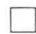

例题3 设 $V = \{a\}$ ，试找出 $V$ 上语言 $A$ ，使 $A^{+} \neq A^{*} - \{\lambda\}$ 。

解因为 $A^{*} = A^{+}\bigcup \{\lambda \}$ 。若 $A^{+}\neq A^{*} - \{\lambda \}$ ，就有 $\lambda \in A^{+}$ ，即 $\lambda \in A$ 。所以， $A = \{\lambda ,a\}$ 。此时

$$
A ^ {+} = \left\{a ^ {n} \mid n \geqslant 0 \right\}, A ^ {*} = \left\{a ^ {n} \mid n \geqslant 0 \right\}
$$

而 $A^{*} - \{\lambda \} = \{a^{n}|n\geqslant 1\} \neq A^{+}$

# 8-1 习题

（1）设 $V = \{a,b,c\}$ ，求 $V^2,V^3$   
（2）给出有限字母表 $V$ ，求 $\left|V^{k}\right|$ 。  
（3）设 $V$ 是有限字母表， $V| = n$ 。建立映射

其中

$$
f: V ^ {*} \rightarrow N
$$

$$
f (\lambda) = 0
$$

$$
f (\omega \circ \alpha) = n f (\omega) + h (\alpha) \left\{ \begin{array}{l} \omega \in V ^ {*} \\ \alpha \in V \\ h: V \to I _ {n} \text {是 一 个 双 射 函 数} \end{array} \right.
$$

证明： $f$ 是双射函数，由此可知 $V^{*}$ 是可列集。

（4）简化下列式子

a） $\varLambda\varnothing^{*}$   
b） $\varLambda^{*}\varnothing^{*}$   
c) $A^{*}\sqcup \varnothing^{*}$   
d） $(\emptyset \cup A)^{*}$   
e) $(\Lambda \cup A)^{*}$

（5）设 $V$ 是字母表， $L$ 是 $V$ 上的一个语言。定义 $V^{*}$ 上的一个关系 $\sim$ ： $\alpha \sim \beta$ 当且仅当对所有 $\omega, \varphi \in V^{*}$ ，有

$$
(\omega \alpha \varphi \in L) \Leftrightarrow (\omega \beta \varphi \in L)
$$

证明：～是一个等价关系。

（6）证明定理8-1.3中未证部分。  
（7）设 $A = \{\lambda ,0\} ,B = \{0,1\}$ 。列出下列集合的所有元素：

a) $A^2$ ；b） $B^{3}$ ；c）AB；d） $A^{+}$ ；e） $B^{*}$ 。

（8）设 $L$ 是字母表 $V$ 上的语言。证明：

a） $L^{m}L^{n} = L^{m + n}$ ，其中 $m,n\geqslant 0$   
b） $(L^{m})^{n} = L^{mn}$ ，其中 $m,n\geqslant 0$   
（9）证明：如果 $A \neq \emptyset, A^2 = A$ ，那么 $A^* = A$ 。反之成立吗？

（10）证明定理8-1.4中未证部分。  
（11）证明：如果 $L$ 是镜象语言，那么， $L^{\prime}$ 也是镜象语言。  
（12）给定语言 $L$ ，令 $\hat{L} = L\cap L^{\prime}$ 。如果 $L$ 是镜象语言， $\hat{L}$ 必是镜象语言吗？反之，如果 $\hat{L}$ 是镜象语言， $L$ 必是镜象语言吗？

# 8-2 形式文法

形式语言中任一句子类似于自然语言中的句子，可逐次应用文法规则构造而成。

例1 英语中句子

Jack and Jill ran up the hill.

它由两个短语组成

<主语>

<谓语>

Jack and Jill

ran up the hill

该句子是应用下列规则而构成的：

1.〈句子 $\rightarrow$ 〈主语〉〈谓语〉  
2.〈主语 $\rightarrow$ 〈名词短语〉  
3.〈名词短语 $\rightarrow$ 〈名词〉  
4.〈名词短语 $\rightarrow$ 〈名词〉〈连接词〉〈名词短语〉  
5.〈连接词 $\rightharpoonup$ and   
6.〈名词 $\rightarrow$ Jack   
7.〈名词〉 $\rightarrow$ Jill  
8.〈谓语〉→〈动词〉〈前置词短语〉  
9.〈动词 $\rightharpoonup$ ran   
10.〈前置词短语〉→〈前置词〉〈冠词〉〈名词〉  
11.〈前置词 $\rightharpoondown$ up   
12.〈冠词 $\rightarrow$ the   
13.〈名词 $\rightarrow$ hill

规则1到13构成了一个文法。我们给出的句子是此文法产生的句子之一。它的结构，可由一棵树来描述，如图8-2.1所示。

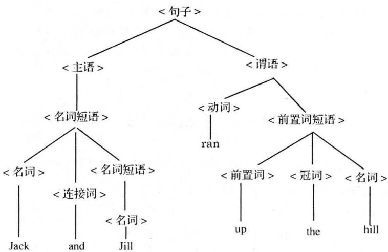  
图8-2.1

此文法也能产生：

Jill and Jack ran up the hill.

Jack and Jack and Jill ran up the hill.

Hill ran up the Jack.

等句子。其中有些句子在英语中是无意义的，但在形式文法中，我们并未要求保证只生成有意义的句子。

例2 考察ALGOL中的赋值语句 $x:= (1+(0+x))$ 组成此语句的字母表是 $\{x, 0, 1, +, : =, ()\}$ ，它的文法规则是

1.〈语句 $\rangle \rightarrow$ 〈左部〉〈表达式〉

$$
x: = (1 + (0 + x))
$$

2.〈左部〉→〈标识符〉：=  
3.〈标识符 $\rangle \rightarrow x$   
4.〈表达式 $\rightarrow$ 〈算术量〉  
5.〈算术量 $\rightarrow$ 项〉  
6.〈项 $\rangle \rightarrow$ （表达式）  
7.〈算术量 $\rangle \rightarrow$ 项 $\rightharpoonup$ （算术量）  
8. (项) $\rightarrow 1$

9.（项） $\rightarrow 0$   
10.〈项 $\rightarrow$ 〈标识符〉

如果引进一些记号， $S$ 表示<语句 $\rangle ,L$ 表示<左部 $\rangle ,E$ 表示<表达式 $\rangle ,I$ 表示<标识符 $\rangle ,A$ 表示<算术量 $\rangle ,T$ 表示<项 $\rangle$ ，那么，上述

十条规则可写成

1. $S \to LE$   
2. $L\to I: =$   
3. $I\to x$   
4. $E\to A$   
5. $A\to T$   
6. $T\rightarrow (E)$   
7. $A\to T + A$   
8. $T\to 1$   
9. $T\to 0$   
10. $T\to I$

规则1到10构成了一个文法。我们给出的赋值语句是此文法产生的句子之一。它的结构，可由一棵树来描述，如图8-2.2所示。

此文法还可产生其他赋值语句，例如 $x: = 1, x: = x, x: = (0 + (1 + (0 + (1 + x))))$ 等。

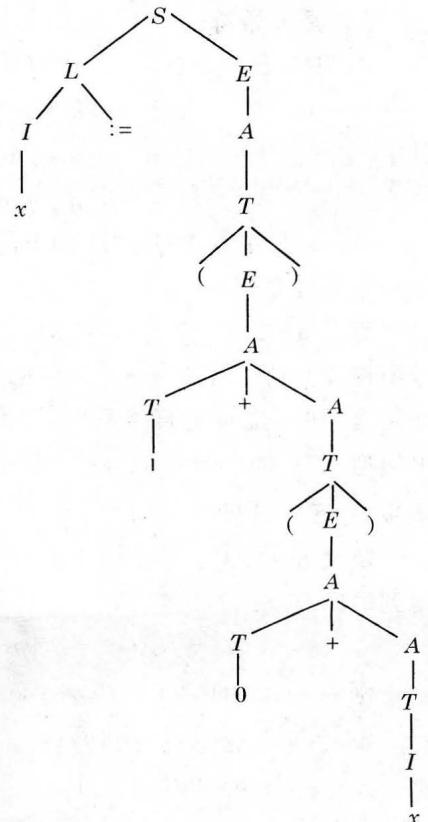  
图8-2.2

从上面例子可以看到，一个文法必须要有三个主要部分：

（1）字母表：表中的字母称为终结符，因为通过文法规则，最终得到的句子只能含有这些字母，这种字母表称为终结符集。  
（2）一个中间字母集，称为非终结符集。  
（3）文法规则或生成式集合。

定义8-2.1 一个形式文法是四有序组

$$
G = \left(V _ {N}, V _ {T}, P, \sigma\right)
$$

其中， $V_{N}$ 是非终结符集；

$V_{T}$ 是终结符集；

$P$ 是生成式集；

$\sigma$ 是开始符。

$V_{N}\cap V_{T} = \emptyset ,\sigma \in V_{N},P$ 中每一生成式形为

$$
\alpha \rightarrow \beta
$$

其中 $\alpha = \varphi A\psi$

$$
\beta = \varphi \omega \psi
$$

$\varphi, \psi, \omega$ 是字母表 $(V_{N} \cup V_{T})$ 上的一个串，它们也可能是空串。 $A$ 是一个非终结符。

定义8-2.2 令 $G = (V_{N}, V_{T}, P, \sigma)$ 。集合 $(V_{N} \cup V_{T})^{*}$ 中的符号串称为句型。如果 $\alpha \rightarrow \beta$ 是 $G$ 的一个生成式， $\omega = \varphi \alpha \psi$ 及 $\widetilde{\omega} = \varphi \beta \psi$ 是句型，称 $\widetilde{\omega}$ 是 $\omega$ 的直接派生，记作 $\omega \Rightarrow \widetilde{\omega}$ 。如果 $\omega_{1}, \omega_{2}, \dots, \omega_{n}$ 是一串句型，其中 $\omega_{1} \Rightarrow \omega_{2} \Rightarrow \omega_{3} \Rightarrow \dots \Rightarrow \omega_{n}$ ，称 $\omega_{n}$ 可由 $\omega_{1}$ 派生得到或称 $\omega_{n}$ 是 $\omega_{1}$ 的派生，记作 $\omega_{1} \Rightarrow \omega_{n}$ 。

定义8-2.3 文法 $G$ 生成的语言记作 $L(G)$ ，它是由 $\sigma$ 派生得到的所有终结符串集，即

$$
L (G) = \{\omega | \omega \in V _ {T} ^ {*}, \sigma \stackrel {*} {\Rightarrow} \omega \}
$$

例3 $G_{1} = (V_{N}, V_{T}, P, \sigma)$

$$
V _ {N} = \{\sigma \}, V _ {T} = \{0, 1 \}
$$

$$
P: \sigma \rightarrow 0 \sigma 1, \sigma \rightarrow 0 1
$$

那么 $L(G_{1}) = \{0^{n}1^{n}|n\geqslant 1\}$

例4 $G_{2} = (V_{N}, V_{T}, P, \sigma)$

$$
V _ {N} = \{\sigma , A \}, V _ {T} = \{0, 1 \}
$$

$$
P: \sigma \rightarrow 1, \sigma \rightarrow 1 A, A \rightarrow 0 \sigma
$$

那么 $L(G_{2}) = \{(10)^{n}1|n\geqslant 0\}$

例5 $G_{2} = (V_{N}, V_{T}, P, \sigma)$

$$
V _ {N} = \{\sigma , A \}, V _ {T} = \{0, 1 \}
$$

$$
P: \sigma \rightarrow 1, \sigma \rightarrow A 1, A \rightarrow \sigma 0
$$

那么

$$
L \left(G _ {3}\right) = \left\{1 (0 1) ^ {n} \mid n \geqslant 0 \right\} = \left\{\left(1 0\right) ^ {n} 1 \mid n \geqslant 0 \right\} = L \left(G _ {2}\right)
$$

例题1 已知 $G_{4} = (V_{N}, V_{T}, P, \sigma), V_{N} = \{\sigma, B, C\}, V_{T} = \{a, b, c\}$ $P$

(1) $\sigma \rightarrow a\sigma BC$ 。  
(2) $\sigma \rightarrow aBC$ 。  
(3) $CB \rightarrow BC$ 。  
(4) $aB \rightarrow ab$ 。  
（5） $bB\to bb_{\circ}$   
(6) $bC \rightarrow bc$ 。  
(7) $cC \rightarrow cC$ 。

求证

$$
\sigma \stackrel {*} {\Rightarrow} a ^ {n} b ^ {n} c ^ {n}
$$

证明

$$
\begin{array}{l} \sigma \stackrel {*} {\Rightarrow} a ^ {n - 1} \sigma (B C) ^ {n - 1} \\ \Rightarrow a ^ {n} (B C) ^ {n} \\ \stackrel {*} {=} a ^ {n} B ^ {n} C ^ {n} \\ \Rightarrow a ^ {n} b B ^ {n - 1} C ^ {n} \\ \Rightarrow a ^ {n} b ^ {n} C ^ {n} \\ \Rightarrow a ^ {n} b ^ {n} c C ^ {n - 1} \\ \Rightarrow a ^ {*} b ^ {n} c ^ {n} \\ \end{array}
$$

（用生成式（1））  
（用生成式（2））  
（用生成式（3））  
（用生成式（4））  
（用生成式（5））  
（用生成式（6））  
（用生成式（7））

例如 $n = 3$ 的派生过程是

$$
\begin{array}{l} \sigma \Rightarrow a \sigma B C \Rightarrow a ^ {2} \sigma B C B C \Rightarrow a ^ {3} B C B C B C \\ \Rightarrow a ^ {3} B B C C B C \Rightarrow a ^ {3} B B C B C C \Rightarrow a ^ {3} B B B C C C \\ \Rightarrow a ^ {3} b B B C C C \Rightarrow a ^ {3} b ^ {2} B C C C \Rightarrow a ^ {3} b ^ {3} C C C \\ \Rightarrow a ^ {3} b ^ {3} c C C \Rightarrow a ^ {3} b ^ {3} c ^ {2} C \Rightarrow a ^ {3} b ^ {3} c ^ {3} \\ \end{array}
$$

例题2 已知 $G_{5} = (V_{N}, V_{T}, P, \sigma), V_{N} = \{\sigma, A, B\}, V_{T} = \{0, 1\}$

P:

$$
\sigma \rightarrow 0 B,
$$

$$
A \rightarrow 1 A A
$$

$$
\sigma \rightarrow 1 A,
$$

$$
B \rightarrow 1
$$

$$
A \rightarrow 0,
$$

$$
B \rightarrow 1 \sigma
$$

$$
A \rightarrow 0 \sigma ,
$$

$$
B \rightarrow 0 B B
$$

求证 $L(G_{5})$ 是由相同个数的0和1所组成的 $V_{T}^{+}$ 中所有串的集合。

证明 令 $N_{0}(\omega)$ 表示串 $\omega$ 中0的个数， $N_{1}(\omega)$ 表示串 $\omega$ 中1的个数。我

们对 $V_{T}^{+}$ 中的 $\omega$ 长度作归纳证明。

(1) $\sigma^{\star} \omega$ ，当且仅当 $N_{0}(\omega) = N_{1}(\omega)$ 。  
(2) $A \stackrel{*}{\Rightarrow} \omega$ ，当且仅当 $N_{0}(\omega) = N_{1}(\omega) + 1$ 。  
（3） $B\Rightarrow \omega$ ，当且仅当 $N_{0}(\omega) + 1 = N_{1}(\omega)$

若 $|\omega| = 1$ ，因有 $A \Rightarrow 0, B \Rightarrow 1$ ，且从 $\sigma$ 不能派生出长度为 1 的终结符串，同样，从 $A$ 和 $B$ 不可能派生出除 0 和 1 之外长度为 1 的串来，所以归纳基成立。

设 $|\omega| \leqslant k - 1$ 时成立，当 $|\omega| = k$ 时。

（1）若 $\sigma \stackrel{*}{\Rightarrow}\omega$ ，则派生是以 $\sigma \Rightarrow 0B$ 或 $\sigma \Rightarrow 1A$ 开始，若 $\sigma \Rightarrow 0B$ ，则 $\omega = 0\omega_{1}$ $|\omega_1| = k - 1,B\stackrel {*}{\Rightarrow}\omega_1$ ，由归纳假设可知， $N_{0}(\omega_{1}) + 1 = N_{1}(\omega_{1})$ ，所以

$$
N _ {0} (\omega) = N _ {0} \left(\omega_ {1}\right) + 1 = N _ {1} \left(\omega_ {1}\right) = N _ {1} (\omega)
$$

若 $\sigma \Rightarrow 1A$ ，可以类似证明。

反之，若 $|\omega| = k$ 且 $N_{0}(\omega) = N_{1}(\omega)$ 。若 $\omega = 0\omega_{1}, |\omega_{1}| = k - 1, N_{0}(\omega_{1}) + 1 = N_{1}(\omega_{1})$ ，由归纳假设有 $B \stackrel{*}{\Rightarrow} \omega_{1}$ ，故我们有 $\sigma \Rightarrow 0B \stackrel{*}{\Rightarrow} 0\omega_{1} = \omega$ 。若 $\omega = 1\omega_{1}$ ，可以类似证明。

（2）若 $A \Rightarrow \omega$ ，则派生是以 $A \Rightarrow 0\sigma$ 或 $A \Rightarrow 1AA$ 开始。若 $A \Rightarrow 0\sigma$ ，则 $\omega = 0\omega_{1}$ ， $|\omega_{1}| = k - 1$ ，且 $\sigma \Rightarrow \omega_{1}$ ，由归纳假设可知， $N_{0}(\omega_{1}) = N_{1}(\omega_{1})$ ，所以 $N_{0}(\omega) = N_{0}(\omega_{1}) + 1 = N_{1}(\omega_{1}) + 1 = N_{1}(\omega) + 1$ 。若 $A \Rightarrow 1AA$ ，则 $\omega = 1\omega_{1}\omega_{2}$ ， $|\omega_{1}| < k - 1$ ， $|\omega_{2}| < k - 1$ ，且 $A \Rightarrow \omega_{1}, A^{*} \Rightarrow \omega_{2}$ ，由归纳假设可知

$$
N _ {0} \left(\omega_ {1}\right) = N _ {1} \left(\omega_ {1}\right) + 1, N _ {0} \left(\omega_ {2}\right) = N _ {1} \left(\omega_ {2}\right) + 1
$$

所以

$$
N _ {0} (\omega) = N _ {0} \left(\omega_ {1}\right) + N _ {0} \left(\omega_ {2}\right) = N _ {1} \left(\omega_ {1}\right) + 1 + N _ {1} \left(\omega_ {2}\right) + 1 = N _ {1} (\omega) + 1
$$

反之，若 $|\omega| = k$ ，且 $N_{0}(\omega) = N_{1}(\omega) + 1$ 。若 $\omega = 0\omega_{1}, |\omega_{1}| = k - 1, N_{0}(\omega_{1}) = N_{0}(\omega) - 1 = N_{1}(\omega) = N_{1}(\omega_{1})$ ，由归纳假设有 $\sigma \stackrel{*}{\Rightarrow}\omega_{1}$ ，故我们有 $A \Rightarrow 0\sigma \Rightarrow 0\omega_{1} = \omega$ 。

若 $\omega = 1\omega_{1}, N_{0}(\omega_{1}) = N_{0}(\omega) = N_{1}(\omega) + 1 = N_{1}(\omega_{1}) + 2$ ，必有 $\omega_{1} = \omega_{2}\omega_{3}$ ， $N_{0}(\omega_{2}) = N_{1}(\omega_{2}) + 1, N_{0}(\omega_{3}) = N_{1}(\omega_{3}) + 1, |\omega_{2}| < k - 1, |\omega_{3}| < k - 1$ ，由归纳假设有 $A \Rightarrow \omega_{2}, A \Rightarrow \omega_{3}$ ，故我们有 $A \Rightarrow 1AA \Rightarrow 1\omega_{2}A \Rightarrow 1\omega_{2}\omega_{3} = 1\omega_{1} = \omega$ 。

(3)的证明与(2)类似。

从上面的讨论可知，一个文法所产生的语言，主要由生成式来决定。

下面讨论文法的分类，形式文法可以分为四类：

（A）无限止文法（0型）

无限止文法是最普遍的一类文法，在它的生成式 $\varphi A\psi \rightarrow \varphi \omega \psi$ 中， $\omega$ 可以是 $\lambda$ ，因此，如果句型 $\beta$ 是由句型 $\alpha$ 应用 $\varphi A\psi \rightarrow \varphi \lambda \psi$ 生成式而得到的派生，那么， $|\alpha| > |\beta|$ ，这种规则称为缩减规则，只有0型文法能缩减。由0型文法产生的语言称为0型语言。

（B）上下文有关文法（1型）

此文法要求所有的生成式 $\varphi A\psi \rightarrow \varphi \omega \psi$ 中， $\omega \neq \lambda$ ，即要求所有生成式是非缩减的。因此，在1型文法中，如有

$$
\omega_ {1} \rightarrow \omega_ {2} \rightarrow \dots \rightarrow \omega_ {n}
$$

则 $|\omega_1| \leqslant |\omega_2| \leqslant \dots \leqslant |\omega_n|$

由此可知，如果 $G$ 是上下文有关文法， $\lambda \in L(G)$ 当且仅当 $G$ 包含 $\sigma \rightarrow \lambda$ 生成式。由1型文法产生的语言称为1型语言。

在例题1中，将生成式(3) $CB \rightarrow BC$ 改写为 $CB \rightarrow DB, DB \rightarrow DE, DE \rightarrow BE, BE \rightarrow BC$ ，那么，它就是1型文法。

（C）上下文无关文法（2型）

此文法要求所有的生成式 $\varphi A\psi \rightarrow \varphi \omega \psi$ 中， $\varphi = \psi = \lambda$ 且 $\omega \neq \lambda$ ，即它的生成式形为

$$
A \rightarrow \omega , (\omega \neq \lambda)
$$

在此文法中，所有生成式左端是一个非终结符。与上下文有关文法一样， $\lambda \in L(G)$ 当且仅当 $G$ 包含生成式 $\sigma \rightarrow \lambda$ 。由2型文法产生的语言称为2型语言。

上面例3和例题2中的文法都是2型文法。

（D）正则文法（3型）

正则文法是上下文无关文法的一种特殊情况，它要求所有生成式 $A \rightarrow \omega$ 中， $\omega$ 至多含有一个非终结符。

所有生成式形为

$$
A \rightarrow a B \quad {\text {或}} \quad A \rightarrow a
$$

其中 $A, B \in V_{N}, a \in V_{T}$ 的文法称为右线性文法。

所有生成式形为

$$
A \rightarrow B a \quad {\text {或}} \quad A \rightarrow a
$$

其中 $A, B \in V_{N}, a \in V_{T}$ 的文法称为左线性文法。

右线性文法，左线性文法都是正则文法。由正则文法产生的

语言称为正则语言。 $\lambda \in L(G)$ 当且仅当 $G$ 包含生成式 $\sigma \rightarrow \lambda$

上面例4的文法是右线性文法，例5的文法是左线性文法。

以上讨论的四类文法，它们相互之间的关系可如图8-2.3所示。

前面已经提到，可以用树将某些语言中句子的派生过程清楚地显示出来。

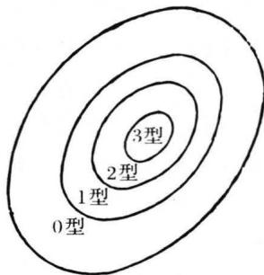  
图8-2.3

下面讨论上下文无关文法和正则文法的派生树。

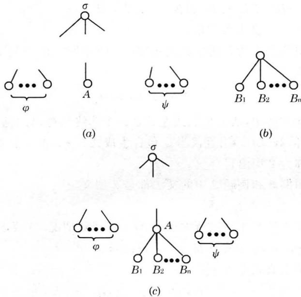  
图8-2.4

用开始符标识树根，派生过程中的非终结符标识树的分枝点，最后得到的终结符串中的字母标识树叶，这样得到的树称为派生树。派生树的构造是按照派生过程逐步得到，如果已有 $\sigma \Rightarrow \varphi A\psi$ ，其中 $\varphi ,\psi \in (V_{N}\bigcup V_{T})^{*}$ ，它的派生树如图8-2.4(a)所示。接着使用生成式 $A\rightarrow B_1B_2\dots B_n$ ，其中 $A\in V_N,B_i\in (V_N\bigcup V_T),(1\leqslant i\leqslant n)$ ，并用图8-2.4(b)所示的子树代替标识为 $A$ 的叶，得到新的派生树，如图8-2.4(c)所示。

按照这种方法构造下去，直到所有叶都是以终结符标识为止。

例题3给出上下文无关文法 $G = (V_{N},V_{T},P,\sigma)$ 其中 $V_{N} = \{\sigma ,T\}$

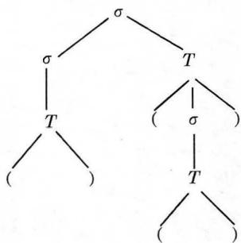  
图8-2.5

$V_{T} = \{(.,)\}$ ， $P:\sigma \rightarrow \sigma T$ ， $\sigma \rightarrow T$ ， $T\to (\sigma)$ $T\to ()$ 。

求：串（）（）的派生过程及派生树。

解 串（）（）的派生过程为：

$$
\begin{array}{l} \sigma \Rightarrow \sigma T \Rightarrow T T \Rightarrow (\quad) T \Rightarrow (\quad) (\sigma) \\ \Rightarrow (\quad) (T) \Rightarrow (\quad) ((\quad)) \\ \end{array}
$$

它所对应的派生树如图8-2.5所示。

串（）（）的派生过程不是唯一的，下面是它的另一派生过程：

$$
\begin{array}{l} \sigma \Rightarrow \sigma T \Rightarrow \sigma (\sigma) \Rightarrow \sigma (T) \Rightarrow \sigma (\text {(}) \\ \Rightarrow T ((  )  ) \Rightarrow (  )   ((  )) \\ \end{array}
$$

它对应的派生树与图8-2.5相同。

对于正则文法，派生树的形式更为简单。右线性文法所对应的派生树只能在右面衍生。左线性文法所对应的派生树只能在左面衍生。

例题4构造例4和例5中文法所对应的派生树。

解 例4和例5分别是右线性文法和左线性文法，它们对应的派生树分别如图8-2.6(a)和(b)所示。

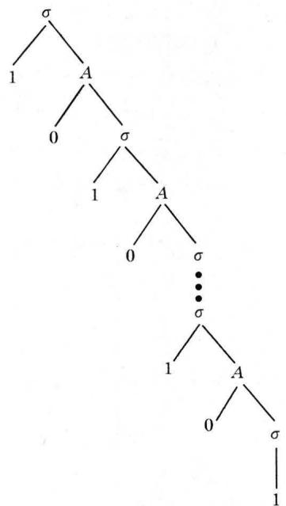  
(a)

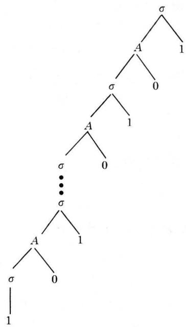  
(b)   
图8-2.6

# 8-2 习题

（1）给定文法 $G = (\{\sigma, A\}, \{0, 1\}, P, \sigma)$ ，其中

$$
P: \sigma \rightarrow 0 \sigma , \sigma \rightarrow 1 A, \sigma \rightarrow 0
$$

$$
A \rightarrow 0 A, A \rightarrow 1 \sigma , A \rightarrow 1
$$

描述 $L(G)$ ，写出00101的派生过程并画出派生树。

（2）考察下列文法

$$
G _ {1} = (\{\sigma \}, \{c \}, P _ {1}, \sigma)
$$

其中 $P_{1}\colon \sigma \to \lambda ,\sigma \to \sigma \sigma ,\sigma \to c$

$$
G _ {2} = (\{\sigma \}, \{c \}, P _ {2}, \sigma)
$$

其中 $P_{2}\colon \sigma \to \lambda ,\sigma \to \sigma c\sigma ,\sigma \to c$

a）描述 $L(G_{i})(i = 1,2)$   
b）对每一语言，给出一个长度为5的终结符串的派生，并构造派生树。  
（3）证明：串 $a^n b^n c^n, n \geqslant 1$ 是例题1中 $L(G_4)$ 中仅有的终结符串。由此可

知， $L(G_4) = \{a^n b^n c^n |n\geqslant 1\}$

（4） $a$ ）构造一个左线性文法 $G$ ，使 $L(G) = \{10^{n}|n\geqslant 0\}$   
b）构造一个右线性文法 $G$ ，使 $L(G) = \{ab^{m}|m\geqslant 0\} \cup \{c^{n}|n\geqslant 0\}$ 。  
（5）设 $G$ 为一文法，且它的所有生成式的形式都是 $A \to \varphi B$ 和 $A \to \varphi$ ，其中 $A, B \in V_{N}, \varphi \in V_{T}^{*}$ 。试证 $G$ 产生的语言 $L(G)$ 能由右线性文法产生。  
（6）给出一个正则文法，产生下列语言

$L = \{\omega |\omega \in \{0,1\} ^*$ 且 $\omega$ 不含有两个相邻的1}

（7）给出一个产生下列语言 $L = \{\omega \omega^{\prime}|\omega \in \{0,1\}^{*}\}$ 的上下文有关文法。  
（8）考察下列0型文法：

$$
G = (\{\sigma , A, B, C, D, E \}, \{0, 1 \}, P, \sigma)
$$

其中 $P: \sigma \rightarrow ABC$ $AB \rightarrow 0AD$ $AB \rightarrow 1AE$

$$
\begin{array}{l} A B \rightarrow \lambda \quad D 0 \rightarrow 0 D \quad D 1 \rightarrow 1 D \\ E 0 \rightarrow 0 E \quad E 1 \rightarrow 1 E \quad C \rightarrow \lambda \\ D C \rightarrow B O C \quad E C \rightarrow B 1 C \quad 0 B \rightarrow B 0 \\ 1 B \rightarrow B 1 \\ \end{array}
$$

描述 $L(G)$ ，并写出01100110的派生过程。

# 8-3 有限状态自动机

上面我们用文法表示了语言，从本节起将用另一种方法——识别器来描述语言，为此，现在我们先介绍有限状态自动机。

考察一台信号转换器，如图8-3.1所示。

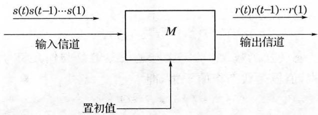  
图8-3.1

假设机器 $M$ 在时间 $t = t_0, t_1, t_2, \dots$ 工作，其中初始时间 $t_0$ 及时间间隔 $\Delta t_i = t_i - t_{i-1}$ 都是任意的。为了简化起见，常把它们表示为 $t = 0, 1, 2, \dots$ 。在 $t = 0$ 时，将已知的初始条件作为初值，在以后每

一瞬间 $t$ ，通过输入信道，机器 $M$ 收到一个输入信号 $s(t)$ ，它就产生一个输出信号 $r(t)$ ，通过输出信道输出。提供给机器的一串输入信号 $s(1)s(2)\dots s(t)$ 称为一个激励；所产生的输出符号串称为 $M$ 对于此激励的响应。

所有输入符号组成的集合称为输入符号集（输入字母表），记作 $S$ 。所有输出符号组成的集合称为输出符号集（输出字母表），记作 $R$ 。

现实世界中的机器都可认为由有限个部件组成，且每个部件都有有限个状态。假设机器 $M$ 由 $N$ 个部件组成， $q^{(i)}(t)$ 表示第 $i$ 个部件在瞬间 $t$ 的状态，那么，在时间 $t$ ， $M$ 的状态是一个 $N$ 有序组

$$
\langle q ^ {(1)} (t), q ^ {(2)} (t), \dots , q ^ {(N)} (t) \rangle
$$

故 $M$ 总状态的最大可能数是所有部件状态数的积。若每一部件的状态数不超过 $K$ ，则 $M$ 的状态数不超过 $K^{N}$ 。我们用 $q(t)$ 表示 $M$ 在时间 $t$ 的状态，即 $q(t) = \langle q^{(1)}(t),q^{(2)}(t),\dots ,q^{(N)}(t)\rangle$ ，所有不同的 $q(t)$ 组成的集合称为状态集，记作 $Q$ 。机器 $M$ 在 $t = 0$ 所处的状态称为初始状态（初态），记作 $q_{I}$ ，即 $q_{I} = q(0)$ 。

机器 $M$ 在接收到输入信号 $s(t)$ 时，它将产生一个输出 $r(t)$ ，同时，状态从 $q(t - 1)$ 转换到 $q(t)$ 。 $r(t)$ 和 $q(t)$ 不仅与 $s(t)$ 有关，而且与机器在前一瞬间的状态 $q(t - 1)$ 有关。因此，存在一个函数 $f$ ，用它来描述机器的状态：

$$
q (t) = f (q (t - 1), s (t)), t \geqslant 1
$$

它称为状态转换函数。它的定义域是状态集 $Q$ 与输入符号集 $S$ 的笛卡尔积，值域是状态集的子集，即

$$
f: Q \times S \rightarrow Q
$$

还存在一个函数 $g$ ，用它来描述机器的输出：

$$
r (t) = g (q (t - 1), s (t)), t \geqslant 1
$$

它称为输出函数。它的定义域也是 $Q \times S$ ，值域是输出字母表 $R$ ，即

$$
g: Q \times S \rightarrow R
$$

这类机器当它处于状态 $q(t - 1)$ 时且接收到输入信号 $s(t)$ ，状态就转向唯一确定的下一状态 $q(t)$ ，且产生一个确定的输出信号 $r(t)$ ，称这类机器是确定型的。

状态数是有限的机器称为有限状态机。它由下面四个部分组成。

（1）三个有限集 $S, R$ 和 $Q$ 。  
（2）状态转换函数 $f$ 。  
（3）输出函数 $g$ 。  
（4）初态 $q_{I}$

定义8-3.1 一台转换赋值有限状态机是一个六有序组

$$
M = (Q, S, R, f, g, q _ {I})
$$

其中， $Q$ 是状态的有限集合，

$S$ 是有限输入字母表，

$R$ 是有限输出字母表，

$f$ 是状态转换函数

$$
f: Q \times S \rightarrow Q
$$

$g$ 是输出函数

$$
g: Q \times S \rightarrow R
$$

$q_{I} \in Q$ 是初态。

这类自动机，又称米兰（Melay）机，它的输出符号不仅与机器所处的状态有关，而且与输入字母有关，即需考虑状态 $q(t)$ 是从哪一状态转换而来，因此就称为转换赋值有限状态机。

描述有限状态机有两种方法：状态表和状态图。

状态表可同时表示两个函数，表的左端从上到下标记所有状态，常把 $q_{I}$ 放在最上面，表的上方从左到右标记所有输入符号，因此，表的行数是 $|Q|$ ，表的列数是 $|S|$ 。相应于状态 $q$ 的行与相应于输入符号 $s$ 的列的交错处，写上下一状态 $q' = f(q, s)$ 和输出符号 $r = g(q, s)$ ，如图8-3.2(a)所示。

状态图是一个有向图，其中每一结点表示机器的一个状态，每一有向弧指出从一个状态到另一个状态的转换，此有向弧上加以

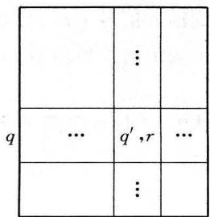  
(a)状态表

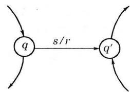  
(b)状态图  
图8-3.2

标记 $s / r$ ，其中 $r,s$ 分别表示相应的输出符号和输入符号，对于初态 $q_{I}$ ，用一个指向它的箭头来标明，如图8-3.2(b)所示。

在图8-3.2中都表示， $q^{\prime} = f(q,s),r = g(q,s)$ ，我们经常也将它们记为

$$
q \xrightarrow {s / r} q ^ {\prime}
$$

这样，对于激励 $s(1)s(2)\dots s(t)$ 产生响应 $r(1)r(2)\dots r(t)$ 和状态序列 $q(0)q(1)\dots q(t)$ ，可以记为

$$
\begin{array}{l} q (0) \xrightarrow {s (1) / r (1)} q (1) \xrightarrow {s (2) / r (2)} q (2) \rightarrow \dots \\ \rightarrow q (t - 1) \xrightarrow {s (t) / r (t)} q (t) \\ \end{array}
$$

如果令 $\omega = s(1)s(2)\dots s(t)$ 表示激励， $\varphi = r(1)r(2)\dots r(t)$ 表示响应，那么，机器的动作可以用更紧凑的记号表示为

$$
\begin{array}{l} q \stackrel {\omega / \varphi} {\Rightarrow} q ^ {\prime} \left\{ \begin{array}{l} q = q (0) \\ q ^ {\prime} = q (t) \end{array} \right. \end{array}
$$

下面考察几个例子。

例题1（模3计数器）设计一台有限状态机 $M_{1}$ ，它的输出是已经输入符号数的模3数。

解 由于输出是输入符号数的模3数，而与具体的输入符号无关，所以，可以认为输入字母集是单字母集，即 $S = \{a\}$ 。而输出字母集 $R$ 应包括三个元素0,1和2，即 $R = \{0,1,2\}$ 。要求机器的状态能“记住”已经输入符号数的模

3数，所以，状态集也应有三个状态，即 $Q = \{A,B,C\}$ ，设 $\pmb{t}$ 表示激励 $\omega$ 最末符号所对应的瞬间，状态 $q(t)$ 的解释为

$$
q (t) = \left\{ \begin{array}{l l} A, \text {当} | \omega | \bmod 3 = 0 \\ B, \text {当} | \omega | \bmod 3 = 1 \\ C, \text {当} | \omega | \bmod 3 = 2 \end{array} \right.
$$

它的状态转换函数应为

$$
f (A, a) = B, f (B, a) = C, f (C, a) = A
$$

它的输出函数应为

$g(A,a) = 1,g(B,a) = 2,g(C,a) = 0$ 因此 $M_{1} = (\{A,B,C\} ,\{a\} ,\{0,1,2\} ,f,g,A)$

它的状态图和状态表如图8-3.3所示。

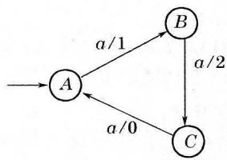  
(a)状态图

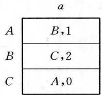  
(b)状态表  
图8-3.3

对于激励 $aaaa, M_1$ 的动作是

$$
A \xrightarrow {a / 1} B \xrightarrow {a / 2} C \xrightarrow {a / 0} A \xrightarrow {a / 1} B
$$

所以，它的响应是1201，状态序列是 $ABCAB$ 。

例题2（奇偶校验器）设计一台有限状态机 $M_2$ ，它的输入是 $\{0,1\}$ 上的符号串，要求输入串有奇数个1时输出1，输入串有偶数个1时输出0。

解 显然 $S = R = \{0,1\}$

给定输入串 $\omega$ ，令 $\omega = \omega_{1}s$ ，其中 $\omega_{1}\in \{0,1\}^{*},s\in \{0,1\}$ 。如果 $s = 0$ ，则 $\omega$ 中所含1个数的奇偶性与 $\omega_{1}$ 相同。如果 $s = 1$ ，则 $\omega$ 中所含1个数的奇偶性与 $\omega_{1}$ 相反。由此可知， $M_2$ 只需要两个状态，状态 $A$ 表示已输入的串中1的个数为偶数，状态 $B$ 表示已输入的串中1的个数为奇数，所以， $Q = \{A,B\}$ 。它的状态转换函数为

$$
f (A, 0) = A, f (A, 1) = B
$$

$$
f (B, 0) = B, f (B, 1) = A
$$

它的输出函数为

$$
g (A, 0) = 0, g (A, 1) = 1
$$

$$
g (B, 0) = 1, g (B, 1) = 0
$$

因此 $M_2 = (\{A,B\} ,\{0,1\} ,\{0,1\} ,f,g,A)$

它的状态图和状态表如图8-3.4所示。

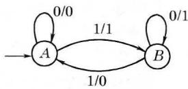  
(a)状态图

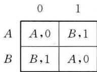  
(b)状态表  
图8-3.4

对于激励 $010011, M_{2}$ 的动作是

$$
A \xrightarrow {0 / 0} A \xrightarrow {1 / 1} B \xrightarrow {0 / 1} B \xrightarrow {0 / 1} B \xrightarrow {1 / 0} A \xrightarrow {1 / 1} B
$$

因此，响应是011101，状态序列是AABBAB。

例题3（二单位延迟器）设计一台有限状态机 $M_3$ ，它的输入字母表是 $\{0,1\}$ ，要求输出串是输入串延迟两个时间单位的重复，即

$$
r (t) = s (t - 2), t \geqslant 3
$$

解 显然 $S = R = \{0,1\}$ 。按照题意， $r(t)$ 只有当 $t \geq 3$ 时才由输入决定，不妨规定 $r(1) = r(2) = 0$ 。由于 $M_3$ 的状态依赖于最后两个输入符 $s(t - 2)s(t - 1)$ ，所以，它应有 $2^2 = 4$ 个状态，故可规定如下：

<table><tr><td>s(t-2)s(t-1)</td><td>M3的状态</td></tr><tr><td>0 0</td><td>A</td></tr><tr><td>1 0</td><td>B</td></tr><tr><td>1 1</td><td>C</td></tr><tr><td>0 1</td><td>D</td></tr></table>

所以 $Q = \{A,B,C,D\}$

它的状态转换函数是

$$
f (A, 0) = A, f (B, 0) = A, f (C, 0) = B, f (D, 0) = B
$$

$$
f (A, 1) = D, f (B, 1) = D, f (C, 1) = C, f (D, 1) = C
$$

它的输出函数是

$$
g (A, 0) = 0, g (B, 0) = 1, g (C, 0) = 1, g (D, 0) = 0
$$

$$
g (A, 1) = 0, g (B, 1) = 1, g (C, 1) = 1, g (D, 1) = 0
$$

因此 $M_{3} = (\{A,B,C,D\} ,\{0,1\} ,\{0,1\} ,f,g,A)$

它的状态图和状态表如图8-3.5所示。

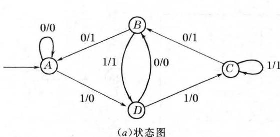

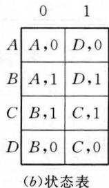  
图8-3.5

对于激励000110100， $M_3$ 的动作是

$$
\begin{array}{l} A \xrightarrow {0 / 0} A \xrightarrow {0 / 0} A \xrightarrow {0 / 0} A \xrightarrow {1 / 0} D \xrightarrow {1 / 0} C \\ \xrightarrow {0 / 1} B \xrightarrow {1 / 1} D \xrightarrow {0 / 0} B \xrightarrow {0 / 1} A \\ \end{array}
$$

因此，响应是000001101，状态序列是AAAAADCBDBA。

还有一类有限状态机，其输出只与到达状态有关，而与从哪个状态转换来的无关。如例题2的奇偶校验器，只要转向状态 $A$ ，输出就是0，只要转向状态 $B$ ，输出就是1。象这类有限状态机，称为状态赋值机，又称摩尔(Moore)机。

定义8-3.2 一台状态赋值有限状态机是六有序组

$$
M = (Q, S, R, f, h, q _ {I})
$$

其中： $Q$ 是状态的有限集合，

$S$ 是有限输入字母表，

$R$ 是有限输出字母表，

$f$ 是状态转换函数

$$
f: Q \times S \rightarrow Q
$$

$h$ 是输出函数

$$
h: Q \to R
$$

$q_{t} \in Q$ 是初态。

状态赋值机的状态表和状态图如图8-3.6所示。

状态表中，相应于状态 $q$ 的行与相应于输入字母 $s$ 的列的交错处，写上下一状态 $q^{\prime} = f(q,s)$ ，表的最右一列写上各状态的对

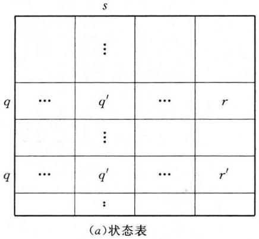

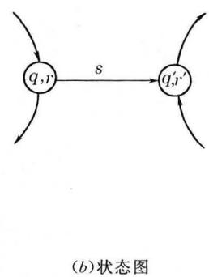  
图8-3.6

应输出。状态图中，每一结点，用一个状态和它相应的输出来标识，每一有向弧指出从一个状态到另一状态的转换，此有向弧上，加以标记如 $s$ 作为相应的输入符号。图8-3.6(a)和(b)都表示 $q^{\prime} = f(q,s),h(q) = r,h(q^{\prime}) = r^{\prime}$ 。用状态序列也可表示为

$$
\langle q, r \rangle \xrightarrow {s} \langle q ^ {\prime}, r ^ {\prime} \rangle
$$

例题4（模4往返计数器）设计一台有限状态机 $M_4$ ，它的输入字母表 $S = \{0,1\}$ ，要求输出

$$
r (t) = \left[ N _ {1} (\omega) - N _ {0} (\omega) \right] \bmod 4
$$

其中 $\omega = s(1)s(2)\dots s(t)$ 是输入串， $N_{0}(\omega)$ 是 $\omega$ 中0的个数， $N_{1}(\omega)$ 是 $\omega$ 中1的个数。

解 根据输出的要求，有 $R = \{0,1,2,3\}$ 。 $M_4$ 应有四个状态，状态 $A$ 表示 $r(t) = 0, B$ 表示 $r(t) = 1, C$ 表示 $r(t) = 2, D$ 表示 $r(t) = 3$ 。这是一台状态赋值机。它的状态转换函数为

$$
f (A, 0) = D, f (B, 0) = A, f (C, 0) = B, f (D, 0) = C
$$

$$
f (A, 1) = B, f (B, 1) = C, f (C, 1) = D, f (D, 1) = A
$$

它的输出函数是

$$
h (A) = 0, h (B) = 1, h (C) = 2, h (D) = 3
$$

因此 $M_4 = (\{A,B,C,D\} ,\{0,1\} ,\{0,1,2,3\} ,f,h,A)$

它的状态图和状态表如图8-3.7所示。

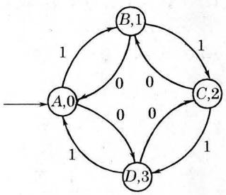  
(a)状态图

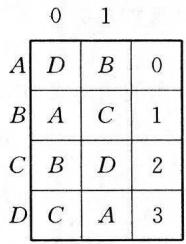  
(b)状态表  
图8-3.7

例题5（语言识别器）设计一台有限状态机 $M_5$ ，它接受一个二进制串，当且仅当此串由1开始，且其中恰含一个0，这种串可表示为 $11^{*}01^{*}$ 。

解 我们可用输出0，1表示输入串 $\omega$ 是否被 $M_{5}$ 接受，如果输入串 $\omega$ 使 $M_{5}$ 从初态最后转向一个状态，它的输出是1，则表示 $\omega$ 被 $M_{5}$ 接受；它的输出是0，则表示 $\omega$ 被 $M_{5}$ 拒绝。

下面考察 $M_5$ 至少需要多少个状态。

（1）初态 $A$ ，输出0：

$M_{5}$ 从状态 $A$ 出发。

（2）陷阱状态 $B$ ，输出0：

如果输入串的第一个字母是0，此串必被 $M_5$ 拒绝，此时 $M_5$ 进入状态 $B$ ， $M_5$ 一旦进入状态 $B$ ，无论输入什么字母，不再能转向其他状态。

（3）可能接受状态 $C$ ，输出0：

如果输入串的第一个字母是1， $M_5$ 进入状态 $C$ ，表示此输入串可能被接受。

(a) 继续输入 1 , 则 $M_{5}$ 仍处于状态 $C$ 。  
（b）继续输入0，则 $M_{5}$ 进入状态 $D$   
（4）接受状态 $D$ ，输出1：

$M_{5}$ 进入状态 $D$ ，表示此输入串被 $M_{5}$ 接受，输出1。

(a) 继续输入 $1, M_{5}$ 仍处于状态 $D$ 。  
（b）继续输入0，则输入串中已经有两个0，这种串必被 $M_5$ 拒绝，故 $M_5$ 再次进入陷阱状态 $B$ 。所以，

$$
M _ {5} = (\{A, B, C, D \}, \{0, 1 \}, \{0, 1 \}, f, h, A)
$$

其中状态转换函数 $f$ 是

$$
f (A, 0) = B, f (B, 0) = B, f (C, 0) = D, f (D, 0) = B
$$

$$
f (A, 1) = C, f (B, 1) = B, f (C, 1) = C, f (D, 1) = D
$$

它的输出函数 $h$ 是

$$
h (A) = 0, h (B) = 0, h (C) = 0, h (D) = 1
$$

它的状态图和状态表如图8-3.8所示。

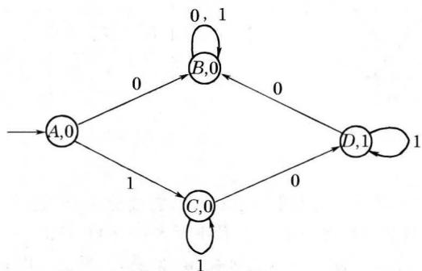  
图8-3.8

(a)状态图

(b)状态表  

<table><tr><td>0</td><td>1</td><td></td></tr><tr><td>B</td><td>C</td><td>0</td></tr><tr><td>B</td><td>B</td><td>0</td></tr><tr><td>D</td><td>C</td><td>0</td></tr><tr><td>B</td><td>D</td><td>1</td></tr></table>

# 8-3 习题

（1）构造有限状态机 $M = (Q,S,R,f,g,g_{I})$ ，其中 $S = R = \{0,1,2,3\}$ ，对于 $t > 2$ ，有 $r(t) = m(t) + n(t)$ ，这里

$$
m (t) = \left\{ \begin{array}{l l} 2, & \text {如 果} s (t - 1) \text {是} 0 \text {或} 2 \\ 0, & \text {其 他} \end{array} \right.
$$

$$
n (t) = \left\{ \begin{array}{l l} 1, & \text {如 果} s (t - 2) \text {是} 1 \text {或} 3 \\ 0, & \text {其 他} \end{array} \right.
$$

如果 $s(-1) = s(0) = 0$ ，确定 $r(1)$ 和 $r(2)$ 。

（2）设 $S = \{a,b,c\}$ ，对于 $S$ 中每一符号 $s$ 和 $S^{*}$ 中每一串 $\omega$ ，定义： $N_{s}(\omega) =$ $\omega$ 中 $s$ 出现的次数。给出转换赋值机 $M = (Q,S,R,f,g,q_{I})$ 的状态图，对于输入串 $\omega$ ，它的最终输出是

$$
r = \left(N _ {a} (\omega) + 2 N _ {b} (\omega) - 3 N _ {c} (\omega)\right) \mod 5
$$

求激励是abbcbaaabc的响应。

（3）已知有限状态机的状态图（图 $8-3.9\sim$ 图3-3.10），写出相应的状态表。

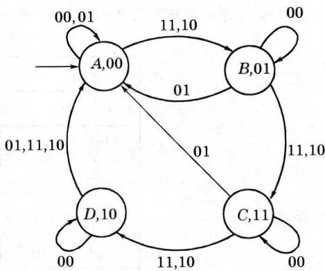

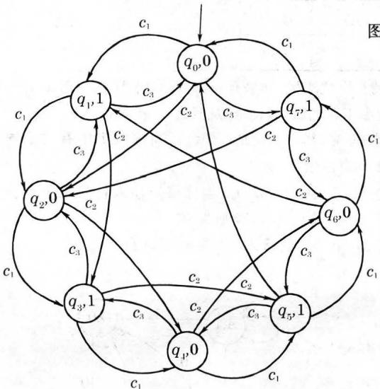  
图8-3.9  
图8-3.10

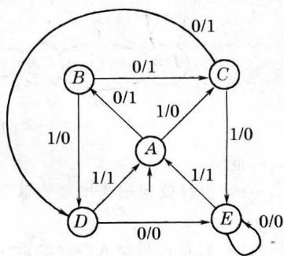  
图8-3.11

（4）给定下列有限状态机的状态表，画出相应的状态图。

a)

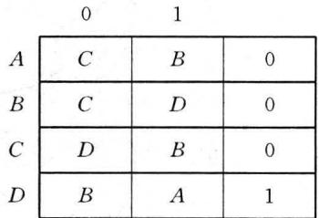

b)

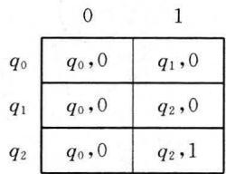

（5）设 $M$ 是 $n$ 个状态的有限状态机，如果有一个激励，将 $M$ 从状态 $q_{I}$ 转向状态 $q$ ，证明必存在一个长度小于 $n$ 的激励，使 $M$ 从状态 $q_{I}$ 转向状态 $q$ 。  
（6）设计一台有限状态机 $M$ ，其中 $S = R = \{0,1\}$ ，当输入串中有三个连续的0或1时，它输出1，其他均输出0。  
（7）设计一台有限状态机，其中 $S = \{a,b\}$ ，当且仅当输入符号串中包含两个连续的 $a$ 或两个连续的 $b$ 时，输出为1，否则为0。  
*（8）给定有限状态机 $M_{1}$ 和 $M_{2}$ 的状态图（图8-3.12）。

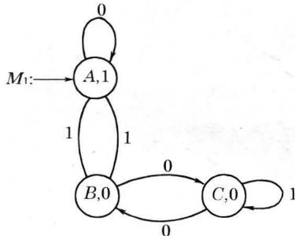

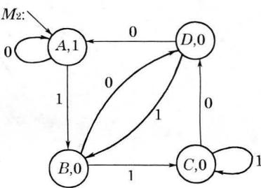  
图8-3.12

证明

a）当且仅当输入串是能被3整除的二进制数时，有限状态机 $M_{1}$ 输出为1，其他为0。  
b）当且仅当输入串是能被4整除的二进制数时，有限状态机 $M_2$ 输出为1，其他为0。

# 8-4 两类自动机的转换

在8-3节例题2中提到的奇偶校验器是一台转换赋值机，但

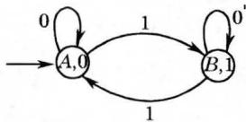  
图8-4.1

它有这样一个特点，只要转换到状态 $A$ ，输出就是0，只要转换到状态 $B$ ，输出就是1，它与图8-4.1所示的状态赋值机 $M_2^{\prime}$ 的功能相同。

下面讨论两类自动机的转换问题。

定义8-4.1 设 $M$ 是有限状态机，状态函数

$$
f: Q \times S \rightarrow Q
$$

如果 $f(q,s) = q^{\prime}$ ，称 $q^{\prime}$ 是状态 $q$ 的 $s$ -后继，记为

$$
q \stackrel {s} {\rightarrow} q ^ {\prime [ \text {注} ]}
$$

如果输入串 $\omega = s(1)s(2)\dots s(t)$ 将 $M$ 从状态 $q = q(0)$ 转向 $q^{\prime} = q(t)$ ，即

$$
q = q (0) \xrightarrow {s (1)} q (1) \xrightarrow {s (2)} q (2) \xrightarrow {s (3)} \dots \xrightarrow {s (t)} q (t) = q ^ {\prime}
$$

称状态 $q^{\prime}$ 是状态 $q$ 的 $\omega$ -后继，记为

$$
q \stackrel {\omega} {\Rightarrow} q ^ {\prime}
$$

并称 $q(0)q(1)q(2)\dots q(t)$ 是 $\omega$ 的可接受状态序列。

在上节例题2中，状态 $B$ 是状态 $A$ 的00100-后继，状态 $B$ 也是状态 $A$ 的010011-后继，可以分别记为

$$
\begin{array}{c c} 0 0 1 0 0 & 0 1 0 0 1 \\ A \Rightarrow B, & A \Rightarrow B \end{array}
$$

00100的可接受状态序列是 $AAABB$ , 010011的可接受状态序列是 $AABBAB$ 。

下面考察两类自动机对应于激励 $\omega = s(1)s(2)\dots s(t)$ 的可接受状态序列 $q_{1}q(1)q(2)\dots q(t)$ 和响应 $r(1)r(2)\dots r(t)$ 。

（A）可接受状态序列：

$$
\begin{array}{l} q (1) = f \left(q _ {I}, s (1)\right) = f _ {1} \left(q _ {I}, s (1)\right) \\ q (2) = f (q (1), s (2)) = f \left(f _ {1} \left(q _ {I}, s (1)\right), s (2)\right) \\ = f _ {2} \left(q _ {I}, s (1) s (2)\right) = f \left(q _ {I}, s (1) s (2)\right) \\ \end{array}
$$

$$
\begin{array}{l} q (3) = f (q (2), s (3)) = f \left(f _ {2} \left(q _ {1}, s (1) s (2)\right), s (3)\right) \\ = f _ {3} \left(q _ {I}, s (1) s (2) s (3)\right) = f \left(q _ {I}, s (1) s (2) s (3)\right) \\ \end{array}
$$

··

$$
\begin{array}{l} q (t) = f (q (t - 1), s (t)) \\ = f \left(f _ {t - 1} \left(q _ {I}, s (1) s (2) \dots s (t - 1)\right), s (t)\right) \\ = f _ {t} \left(q _ {I}, s (1) s (2) \dots s (t)\right) \\ = f \left(q _ {1}, s (1) s (2) \dots s (t)\right) \\ \end{array}
$$

在上述各式的最后一步删去了 $f$ 的下标，不会引起误解，这样，我们将状态函数 $f:Q\times S\to Q$ 推广为 $f:Q\times S^{+}\rightarrow Q$ ，且有 $f(q,\omega a) = f(f(q,\omega),a)$ ，其中 $\omega \in S^{+},a\in S$ 。

（B）响应：

（1）对于转换赋值机，有

$$
r (1) = g \left(q _ {I}, s (1)\right) = g _ {1} \left(q _ {I}, s (1)\right)
$$

$$
\begin{array}{l} r (2) = g (q (1), s (2)) = g \left(f \left(q _ {l}, s (1)\right), s (2)\right) \\ = g _ {2} \left(q _ {I}, s (1) s (2)\right) = g \left(q _ {I}, s (1) s (2)\right) \\ \end{array}
$$

$$
\begin{array}{l} r (3) = g (q (2), s (3)) = g \left(f \left(q _ {I}, s (1) s (2)\right), s (3)\right) \\ = g _ {3} \left(q _ {I}, s (1) s (2) s (3)\right) = g \left(q _ {I}, s (1) s (2) s (3)\right) \\ \end{array}
$$

··

$$
\begin{array}{l} r (t) = g (q (t - 1), s (t)) \\ = g \left(f \left(q _ {1}, s (1) s (2) \dots s (t - 1)\right), s (t)\right) \\ = g _ {t} \left(q _ {I}, s (1) s (2) \dots s (t)\right) = g \left(q _ {I}, s (1) s (2) \dots s (t)\right) \\ \end{array}
$$

（2）对于状态赋值机，我们有

$$
r (0) = h \left(q _ {I}\right)
$$

$$
\begin{array}{l} r (1) = h (q (1)) = h \left(f \left(q _ {I}, s (1)\right)\right) = h _ {1} \left(q _ {I}, s (1)\right) \\ = h \left(q _ {1}, s (1)\right) \\ \end{array}
$$

$$
\begin{array}{l} r (2) = h (q (2)) = h \left(f \left(q _ {I}, s (1) s (2)\right)\right) \\ = h _ {2} \left(q _ {I}, s (1) s (2)\right) = h \left(q _ {I}, s (1) s (2)\right) \\ \end{array}
$$

$$
\begin{array}{l} r (3) = h (q (3)) = h \left(f \left(q _ {I}, s (1) s (2) s (3)\right)\right) \\ = h _ {3} \left(q _ {I}, s (1) s (2) s (3)\right) = h \left(q _ {I}, s (1) s (2) s (3)\right) \\ \dots \\ \end{array}
$$

$$
\begin{array}{l} r (t) = h (q (t)) = h \left(f \left(q _ {I}, s (1) s (2) \dots s (t)\right)\right) \\ = h _ {t} \left(q _ {I}, s (1) s (2) \dots s (t)\right) = h \left(q _ {I}, s (1) s (2) \dots s (t)\right) \\ \end{array}
$$

因此，对于两类自动机，它的输出可统一记为

$$
r (t) = O \left(q _ {1}, s (1) s (2) \dots s (t)\right), (t \geqslant 1)
$$

我们约定，以后讨论的结果如果对两类自动机都适用时，输出函数就用 $O$ 来表示。这样，输出函数就推广为 $O:Q\times S^{+}\to R$ ，且有 $O(q_{I},\omega a) = O(f(q_{I},\omega),a)$ ，其中 $\omega \in S^{+},a\in S$ 。

由于状态赋值机有 $r(0) = h(q_{I})$ 的存在，所以，转换赋值机与状态赋值机有一个本质的区别：对于空串，前者无响应，后者有一个确定的响应 $h(q_{I})$ 。

定理8-4.1 对于有限状态机 $M$ ，我们有

$$
f (q, \omega \varphi) = f (f (q, \omega), \varphi)
$$

$$
O (q, \omega \varphi) = O (f (q, \omega), \varphi)
$$

其中， $q$ 是 $q_{I}$ 的 $\psi$ -后继， $\omega ,\varphi \in S^{+},\psi \in S^{*}$

证明 先证 $f(q_{I},\omega \varphi) = f(f(q_{I},\omega),\varphi)$

对 $|\varphi|$ 进行归纳证明。

当 $|\varphi| = 1$ 时， $\varphi$ 是一个输入字母 $a$ ，故有

$$
f (q _ {I}, \omega a) = f (f (q _ {I}, \omega), a)
$$

设 $|\varphi| = k$ 时，上式成立。

当 $|\varphi| = k + 1$ 时，此时，令 $\varphi = \varphi' a$ ，其中 $|\varphi'| = k$

$$
\begin{array}{l} f \left(q _ {I}, \omega \varphi\right) = f \left(q _ {I}, \omega \varphi^ {\prime} a\right) = f \left(f \left(q _ {I}, \omega \varphi^ {\prime}\right), a\right) \\ = f \left(f \left(f \left(q _ {I}, \omega\right), \varphi^ {\prime}\right), a\right) = f \left(f \left(q ^ {\prime}, \varphi^ {\prime}\right), a\right) \\ = f \left(q ^ {\prime}, \varphi^ {\prime} a\right) = f \left(q ^ {\prime}, \varphi\right) = f \left(f \left(q _ {I}, \omega\right), \varphi\right) \\ \end{array}
$$

所以，我们有 $f(q_{I},\omega \varphi) = f(f(q_{I},\omega),\varphi)$

设 $q$ 是 $q_{I}$ 的 $\psi$ -后继，即 $q = f(q_{I},\psi)$ ，此时

$$
\begin{array}{l} f (q, \omega \varphi) = f (f (q _ {I}, \psi), \omega \varphi) = f (q _ {I}, \psi \omega \varphi) \\ = f \left(f \left(q _ {I}, \psi \omega\right), \varphi\right) = f \left(f \left(f \left(q _ {I}, \psi\right), \omega\right), \varphi\right) \\ = f (f (q, \omega), \varphi) \\ \end{array}
$$

因此，我们有 $f(q,\omega \varphi) = f(f(q,\omega),\varphi)$

对于输出函数可以类似证明，留作习题。

定理8-4.1具有下列实际意义， $f(q,\omega \varphi)$ 是自动机 $M$ 处于状态 $q$ ，输入字符串 $\omega \varphi$ 后的状态，而 $f(f(q,\omega),\varphi)$ 是自动机 $M$ 处于状态 $q$ ，先输入字符串 $\omega$ ，它处于状态 $f(q,\omega)$ ，然后再输入字符串 $\varphi$ 后的状态，它们应该是一样的。对于输出函数也有类似的解释。

例如8-3节中奇偶校验器 $M_2$ ，输入00100， $M_2$ 处于状态 $B$ 如果先输入001， $M_2$ 处于状态 $B$ ，再输入 $00,M_{2}$ 仍处于状态 $B$ 。

定义8-4.2 给定状态赋值机 $M_{s}$ 和转换赋值机 $M_{t}$ ，如果对每一激励， $M_{s}$ 的响应恰等于 $M_{t}$ 的响应前面加一任意且确定的输

出符号，称 $M_{s}$ 和 $M_{t}$ 是相似的。

图8-4.2给出定义8-4.2的图解。对自动机 $M_{t}$ 和 $M_{s}$ 提供相同的激励 $\omega$ ，那么， $M_{t}$ 的响应是 $\varphi ,M_{s}$ 的响应是 $r_0\varphi$ ，这里 $r_0$ 是一

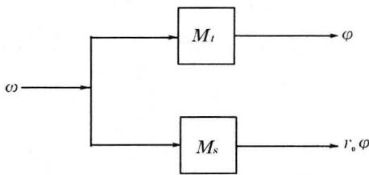  
图8-4.2

固定的输出字母，与激励 $\omega$ 无关。事实上 $r_0$ 就是状态赋值机 $M_{s}$ 对于空串 $\lambda$ 的响应，即对应初态 $q_{I}$ 的输出。

例如，图8-4.1的状态赋值机与图8-3.4的转换赋值机是相似的。

定理8-4.2 对于每一台状态赋值机 $M_{s}$ , 存在一台相似的转换赋值机 $M_{t}$ 。反之, 对于每一台转换赋值机 $M_{t}$ , 也存在一台相似的状态赋值机 $M_{s}$ 。

证明

（A）从 $M_{s}$ 构造相似的 $M_{t}$ 。

我们将 $M_{s}$ 的状态集 $Q$ ，输入字母表 $S$ ，输出字母表 $R$ ，初始状态 $q_{I}$ 和状态转换函数 $f$ 分别作为 $M_{t}$ 的状态集 $Q$ ，输入字母表 $S$ 输出字母表 $R$ ，初始状态 $q_{I}$ 和状态转换函数 $f$ 。定义 $M_{t}$ 的输出函数 $g$ ：当 $M_{s}$ 中状态 $q$ 有输出 $r$ 时，那么，在 $M_{t}$ 中所有转向 $q$ 的转换就赋值输出 $r$ 。具体构造如下：

如果 $M_{s} = (Q,S,R,f,h,q_{I})$

那么 $M_{t} = (Q,S,R,f,g,q_{I})$

其中 $g(q,s) = h(f(q,s)),q\in Q,s\in S$

显然，对于激励 $\omega, M_{t}$ 的响应是 $M_{s}$ 的响应中除去第一个字母所剩下的输出字符串，因此， $M_{t}$ 相似于 $M_{s}$ 。

（B）从 $M_{t}$ 构造相似的 $M_{s}$

它比较复杂，我们不能简单地将上面的构造过程逆转。因为 $M_{t}$ 中可能有一个状态 $q$ ，对于 $q$ 来说，存在多个输入转换，它们标以不同的输出符号。例如图8-3.5中状态 $A$ ，如果它是从 $A$ 自身转换来，输出就是0，从 $B$ 转换来，输出就是1。为了克服此困难，我们将 $M_{t}$ 中的状态和输出符号组成的序偶，作为 $M_{s}$ 的状态。我们规定若 $M_{t}$ 进入状态 $q$ 且产生输出符号 $r$ ，那么， $M_{s}$ 就进入状态 $\langle q,r\rangle$ 。对于状态 $\langle q,r\rangle$ ，它的输出是 $r$ 。具体构造如下：

如果 $M_{t} = (Q_{t},S,R,f_{t},g,q_{t})$

那么 $M_{s} = (Q_{s},S,R,f_{s},h,\langle q_{I},r_{0}\rangle)$

其中 $Q_{s} = Q_{t}\times R$

函数 $f_{s},h$ 定义如下：当 $M_{t}$ 有 $q^{\frac{s}{r}}q^{\prime}$ 那么， $M_{s}$ 有

$$
\langle \langle q, r ^ {\prime} \rangle , r ^ {\prime} \rangle \xrightarrow {s} \langle \langle q ^ {\prime}, r \rangle , r \rangle
$$

其中 $r^{\prime}\in R,r^{\prime}$ 取遍 $R$ 中所有字母。即

$$
f _ {s} \left(\left\langle q, r ^ {\prime} \right\rangle , s\right) = \left\langle q ^ {\prime}, r \right\rangle , r ^ {\prime} \in R
$$

$$
h \left(\langle q ^ {\prime}, r \rangle\right) = r
$$

对于所有 $\langle q_I, r \rangle$ 中可任取一个 $\langle q_I, r_0 \rangle$ 作为 $M_s$ 的初态。显然，对于激励 $\omega$ ，当 $M_t$ 的响应是 $\varphi$ 时， $M_s$ 的响应必是 $r_0 \varphi$ ，因此， $M_s$ 相似于 $M_t$ 。

显然，与图8-3.6所示的模4往返计数器 $M_4$ 相似的转换赋值机 $M_4'$ 如图8-4.3所示。

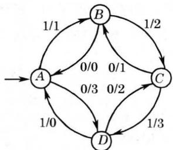  
图8-4.3

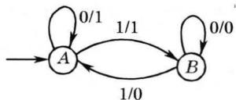  
图8-4.4

例题1 给定 $M_{t} = (\{A,B\}, \{0,1\}, \{0,1\}, f_{t}, g, A)$ ，构造一台与它相似的 $M_{s}$ 。 $M_{t}$ 的状态图如图8-4.4所示。

解 $M_{s} = (Q_{s},\{0,1\} ,\{0,1\} ,f_{s},h,\langle A,r_{0}\rangle)$

其中 $Q_{s} = Q_{t}\times R = \{\langle A,0\rangle ,\langle A,1\rangle ,\langle B,0\rangle ,\langle B,1\rangle \}$

表8-4.1给出由 $M_{t}$ 的转换所构造的相应的 $M_{s}$ 中的转换。

表8-4.1  

<table><tr><td></td><td>Mt</td><td>Ms</td></tr><tr><td rowspan="2">1</td><td rowspan="2">A0/1A</td><td>⟨{A,0},0⟩0⟨{A,1},1⟩</td></tr><tr><td>⟨{A,1},1⟩0⟨{A,1},1⟩</td></tr><tr><td rowspan="2">2</td><td rowspan="2">A1/1B</td><td>⟨{A,0},0⟩1⟨{B,1},1⟩</td></tr><tr><td>⟨{A,1},1⟩1⟨{B,1},1⟩</td></tr><tr><td rowspan="2">3</td><td rowspan="2">B0/0B</td><td>⟨{B,0},0⟩0⟨{B,0},0⟩</td></tr><tr><td>⟨{B,1},1⟩0⟨{B,0},0⟩</td></tr><tr><td rowspan="2">4</td><td rowspan="2">B1/0A</td><td>⟨{B,0},0⟩1⟨{A,0},0⟩</td></tr><tr><td>⟨{B,1},1⟩1⟨{A,0},0⟩</td></tr></table>

因此， $M_{s}$ 的状态函数 $f_{s}$ 定义为

$$
f _ {s} (\langle A, 0 \rangle , 0) = \langle A, 1 \rangle
$$

$$
f _ {s} (\langle A, 0 \rangle , 1) = \langle B, 1 \rangle
$$

$$
\begin{array}{l} f _ {s} (\langle A, 1 \rangle , 0) = \langle A, 1 \rangle \\ f _ {s} (\langle A, 1 \rangle , 1) = \langle B, 1 \rangle \\ f _ {s} (\langle B, 0 \rangle , 0) = \langle B, 0 \rangle \\ f _ {s} (\langle B, 0 \rangle , 1) = \langle A, 0 \rangle \\ f _ {s} (\langle B, 1 \rangle , 0) = \langle B, 0 \rangle \\ f _ {s} (\langle B, 1 \rangle , 1) = \langle A, 0 \rangle \\ \end{array}
$$

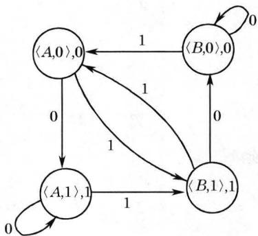  
图8-4.5

$M_{s}$ 的输出函数 $h$ 定义为

$$
\begin{array}{l} h (\langle A, 0 \rangle) = 0 \\ h (\langle A, 1 \rangle) = 1 \\ h (\langle B, 0 \rangle) = 0 \\ h (\langle B, 1 \rangle) = 1 \\ \end{array}
$$

$M_{s}$ 的状态图如图8-4.5所示。

状态 $\langle A,0\rangle$ 和 $\langle A,1\rangle$ 都可作为 $M_{s}$ 的初态。

对于激励101101， $M_{t}$ 的响应是100100。在 $M_{s}$ 中，如果以

$\langle A,0\rangle$ 作为初态，响应是0100100。如果以 $\langle A,1\rangle$ 作为初态，响应是1100100。

# 8-4 习题

（1）给定有限状态机 $M = (Q,S,R,f,h,A)$ ，它的状态图如图8-4.6所示。

a）求状态 $A$ 的01110的后继以及可接受状态序列。  
b）求状态 $E$ 的100101的后继以及可接受状态序列。  
c）验证

$$
f (f (A, 0 1 0), 1 1 0) = f (A, 0 1 0 1 1 0)
$$

$$
h (f (A, 0 1 0), 1 1 0) = h (A, 0 1 0 1 1 0)
$$

d）求 $M$ 对于激励010110的响应。

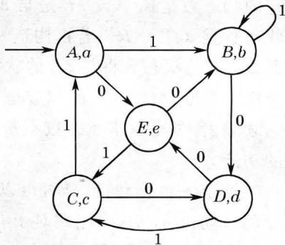  
图8-4.6

e）构造一台与 $M$ 相似的转换赋值机，并求它对于激励010110的响应。  
（2）完成定理8-4.1的证明。

（3）给定有限状态机 $M = (Q,S,R,f,g,q_{1})$ ，它的状态图如图8-4.7所示。

a）求状态 $q_{2}$ 的 $aabb$ 的后继以及可接受状态序列。  
b）求状态 $q_{3}$ 的 bbaaba 的后继以及可接受状态序列。  
c）验证

$$
\begin{array}{l} f \left(f \left(q _ {2}, a b a\right), a b a\right) = f \left(q _ {2}, a b a a b a\right) \\ g \left(f \left(q _ {2}, a b a\right), a b a\right) = g \left(q _ {2}, a b a a b a\right) \\ \end{array}
$$

d）求 $M$ 对于激励abaaba的响应。

e）构造一台与 $M$ 相似的状态赋值机，并求它对于激励abaaba的响应。

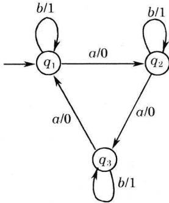  
图 8-4.7

（4）构造一台与图8-4.5相似的转换赋值机。

（5）设 $M_{s}$ 是与给定的转换赋值机 $M_{t}$ 相似的状态赋值机，对于同一激励， $M_{s}$ 的响应比 $M_{t}$ 的响应多一个首字母，请对 $M_{t}$ 稍作修改，使它们的响应相同。

# 8-5 有限状态机的简化

从上节中知道，给定一台转换赋值机

$$
M _ {t} = (Q, S, R, f, g, q _ {I})
$$

它的状态数是 $|Q|$ ，设 $M_{s}$ 是与 $M_{t}$ 相似的状态赋值机，那么， $M_{s}$ 的状态数是 $|Q| \times |R|$ ，若再构造一台与 $M_{s}$ 相似的转换赋值机 $M_{t'}$ ，那么， $M_{t'}$ 的状态数将与 $M_{s}$ 的状态数一样，为 $|Q| \times |R|$ 。显然，对于任一激励， $M_{t}$ 与 $M_{t'}$ 的响应是一样的，即它们的功能相同。这样继续下去，可得一串状态数不断递增的转换赋值机，它们具有相同的功能。

给定一台自动机，是否可以构造出一台功能相同但状态数最少的自动机呢？这个问题对于有限状态机可予以解决。

定义8-5.1 两台有限状态机 $M_{1} = \{Q_{1},S_{1},R_{1},f_{1},O_{1},q_{I}^{\prime}\}$ 和 $M_2 = \{Q_2,S_2,R_2,f_2,O_2,q_I^{\prime \prime}\}$ ，如果满足

（1） $S_{1} = S_{2},R_{1} = R_{2}$

（2）对于任一非空激励 $\omega$ ，有 $O_{1}(q_{I}^{\prime},\omega) = O_{2}(q_{I}^{\prime \prime},\omega)$

称 $M_{1}$ 与 $M_{2}$ 是等价的，记作 $M_{1} \sim M_{2}$ 。

可以验证有限状态机之间的关系～是有限状态机集合上的等价关系。

定义8-5.2 有限状态机 $M = (Q, S, R, f, O, q_{I})$ 的两个状态 $q_{a}$ 和 $q_{b}$ 称为是等价的，即当且仅当

$$
M _ {a} = (Q, S, R, f, O, q _ {a})
$$

和 $M_{b} = (Q,S,R,f,O,q_{b})$

是等价的，记为 $q_{a} \sim q_{b}$ 。

同理，可以验证，状态之间的关系～是状态集合上的等价关系。

例如图8-4.5的状态赋值机 $M_{s}$ 中，状态 $\langle A,0\rangle \sim \langle A,1\rangle$ $\langle B,0\rangle \sim \langle B,1\rangle$ 。

当 $M$ 是转换赋值机时， $q_{a} \sim q_{b}$ 表示对于任意激励 $\omega$ ，它们的响应是相同的。

当 $M$ 是状态赋值机时， $q_{a} \sim q_{b}$ 表示对于任意激励 $\omega$ ，它们的响应中除去第一个字母外，应该是相同的。

定理8-5.1 给定有限状态机 $M = (Q, S, R, f, O, q_{I})$ ，如果两个状态 $q_{a} \sim q_{b}$ ，那么，对于任意激励 $\omega$ ，有

$$
f \left(q _ {a}, \omega\right) \sim f \left(q _ {b}, \omega\right)
$$

即等价状态的 $\omega$ -后继也是等价的。

证明 因为 $q_{a} \sim q_{b}$ , 对于任意的 $\omega \varphi \in S^{*}$ , 有

$$
O \left(q _ {a}, \omega \varphi\right) = O \left(q _ {b}, \omega \varphi\right)
$$

由定理8-4.1可知

$$
O \left(q _ {a}, \omega \varphi\right) = O \left(f \left(q _ {a}, \omega\right), \varphi\right)
$$

$$
O \left(q _ {b}, \omega \varphi\right) = O \left(f \left(q _ {b}, \omega\right), \varphi\right)
$$

所以 $O(f(q_{a},\omega),\varphi) = O(f(q_{b},\omega),\varphi)$

因此 $f(q_{a},\omega)\sim f(q_{b},\omega)$

虽然输入字母表 $S$ 是有限集，但输入字符串集合是无限集，因此，由定义出发判别两个状态是否等价是不可行的。为了解决这

个问题，先讨论状态之间一个较弱的关系—— $k$ 等价。

定义8-5.3 给定有限状态机 $M = (Q, S, R, f, O, q_{I})$ ，如果对于任意激励 $\omega$ ，当 $|\omega| \leqslant k$ 时，有

$$
O \left(q _ {a}, \omega\right) = O \left(q _ {b}, \omega\right)
$$

称状态 $q_{a}$ 与 $q_{b}$ 是 $k$ 等价的，记作 $q_{a} \stackrel{k}{\sim} q_{b}$ 。

显然， $\sim^k$ 也是状态集 $Q$ 上一个等价关系。

我们已经知道，集合上的一个等价关系诱导该集合的一个划分。对于状态集 $Q$ 上的 $k$ 等价关系 $\sim$ ，诱导出划分为

$$
P _ {k} = \{[ q ] _ {k} | q \in Q \}
$$

其中 $[q]_k = \{q' \mid q' \in Q, q' \stackrel{k}{\sim} q\}$ 。 $Q$ 上的等价关系～，诱导出划分 $P$ 为

$$
P = \{\left[ q \right] \mid q \in Q \}
$$

其中 $[q] = \{q^{\prime} | q^{\prime} \in Q, q^{\prime} \sim q\}$ 。

由定义8-5.2和定义8-5.3可知，当 $q_{a} \sim q_{b}$ 时，必有 $q_{a} \stackrel{k}{\sim} q_{b}$ ，其中 $k$ 为任意正整数。当 $q_{a} \stackrel{k+1}{\sim} q_{b}$ 时，必有 $q_{a} \stackrel{k}{\sim} q_{b}$ 。因此，划分 $P_{k+1}$ 是划分 $P_{k}$ 的加细，划分 $P$ 是所有划分 $P_{k}$ 的加细。

定理8-5.2 如果对于某一正整数 $k, P_{k} = P_{k + 1}$ 当且仅当 $P_{k} = P$ 。

证明 a）用反证法。

若 $P_{k} = P$ ，而 $P_{k + 1}\neq P_k$ ，则 $P_{k + 1}$ 必是 $P_{k}$ 的真加细，又因 $P$ 是 $P_{k + 1}$ 的加细，所以， $P$ 是 $P_{k}$ 的真加细，与题设矛盾，因此 $P_{k + 1} = P_{k}$ 。

b）也用反证法。

设 $P_{k} = P_{k + 1}$ 而 $P_{k}\neq P$ ，则必有 $q_{a},q_{b}\in Q,q_{a}\stackrel {k}{\sim}q_{b}$ 而 $q_{a}\nsim q_{b}$ 。令 $j$ 是使 $q_{a}$ 与 $q_{b}$ 不是 $j$ 等价的最小正整数，显然 $j > k$ 。

当 $j = k + 1$ 时，那么 $q_{a} \stackrel{k+1}{\sim} q_{b}$ ，但 $q_{a} \stackrel{k}{\sim} q_{b}$ ，与 $P_{k} = P_{k+1}$ 矛盾。

当 $j > k + 1$ 时，因为 $q_{a} \neq q_{b}$ ，必存在一个长度为 $j$ 的字符串 $\omega$ 其中 $\omega = \varphi \psi, |\psi| = k + 1, |\varphi| = |\omega| - |\psi| = j - (k + 1) \geqslant 1$ ，即 $\varphi$ 非空，使得

$$
O \left(q _ {a}, \varphi \psi\right) \neq O \left(q _ {b}, \varphi \psi\right)
$$

即 $O(f(q_{a},\varphi),\psi)\neq O(f(q_{b},\varphi),\psi)$

令 $q_{a}^{\prime} = f(q_{a},\varphi),q_{b}^{\prime} = f(q_{b},\varphi)$ ，那么 $q_{a}^{\prime}\sim q_{b}^{\prime}$ 。但对于任意长度不超过 $k$ 的字符串 $\mu$ ，则

$$
| \varphi \mu | = | \varphi | + | \mu | \leqslant j - (k + 1) + k = j - 1
$$

因为 $j$ 是使 $q_{a}$ 与 $q_{b}$ 不是 $j$ 等价的最小正整数，所以 $q_{a} \stackrel{j-1}{\sim} q_{b}$ ，

$$
O \left(q _ {a}, \varphi \mu\right) = O \left(q _ {b}, \varphi \mu\right)
$$

即 $O(f(q_{a},\varphi),\mu) = O(f(q_{b},\varphi),\mu)$

$$
O \left(q _ {a} ^ {\prime}, \mu\right) = O \left(q _ {b} ^ {\prime}, \mu\right)
$$

因此， $q_{a}^{\prime}\stackrel {k}{\sim}q_{b}^{\prime}$ ，与 $P_{k} = P_{k + 1}$ 矛盾。

对状态集 $Q$ 构造等价划分 $P$ , 首先要构成 $P_{1}$ , 然后由 $P_{1}$ 构造 $P_{2}, P_{2}$ 构造 $P_{3}, \cdots$ , 直到 $P_{k} = P_{k+1}$ 为止。为了由 $P_{i}$ 构造 $P_{i+1}$ , 我们给出下列定理。

定理8-5.3 设 $q_{a}, q_{b} \in Q$ ，那么， $q_{a} \stackrel{k+1}{\sim} q_{b}$ 的充要条件是 $q_{a} \stackrel{k}{\sim} q_{b}$ ，且对所有输入字母 $s \in S$ ，有

$$
f (q _ {a}, s) \stackrel {k} {\sim} f (q _ {b}, s)
$$

证明 因为 $q_{a} \stackrel{k+1}{\sim} q_{b}$ 必有 $q_{a} \stackrel{k}{\sim} q_{b}$ 。此外，对所有长度不超过 $k+1$ 的字符串 $s \omega \in S^{*}$ ，其中 $s \in S, \omega \in S^{*}, |\omega| \leqslant k$ ，有

$$
O \left(q _ {a}, s \omega\right) = O \left(q _ {b}, s \omega\right)
$$

即 $O(f(q_a,s),\omega) = O(f(q_b,s),\omega)$

因此 $f(q_{a},s)\stackrel {k}{\sim}f(q_{b},s)$

充分性的证明留作习题。

例题1 给定有限状态机

$$
M = (\{A, B, C, D, E, F, G, H, J \}, \{0, 1 \}, \{0, 1 \}, f, g, q _ {l})
$$

表8-5.1  

<table><tr><td>0</td><td>1</td></tr><tr><td>B,0</td><td>C,0</td></tr><tr><td>C,1</td><td>D,1</td></tr><tr><td>D,0</td><td>E,0</td></tr><tr><td>C,1</td><td>B,1</td></tr><tr><td>F,1</td><td>E,1</td></tr><tr><td>G,0</td><td>C,0</td></tr><tr><td>F,1</td><td>G,1</td></tr><tr><td>J,1</td><td>B,0</td></tr><tr><td>H,1</td><td>D,0</td></tr></table>

它的状态表如表8-5.1所示。构造等价划分 $P$

解 从表8-5.1知道

$$
\begin{array}{l} g (A, 0) = g (C, 0) = g (F, 0) = 0 \\ g (A, 1) = g (C, 1) = g (F, 1) = 0 \\ A \stackrel {1} {\sim} C \stackrel {1} {\sim} F \\ \end{array}
$$

$$
g (B, 0) = g (D, 0) = g (E, 0) = g (G, 0) = 1
$$

$$
\begin{array}{l} g (B, 1) = g (D, 1) = g (E, 1) = g (G, 1) = 1 \\ B \stackrel {1} {\sim} D \stackrel {1} {\sim} E \stackrel {1} {\sim} G \\ \end{array}
$$

$$
\begin{array}{l} g (H, 0) = g (J, 0) = 1 \\ g (H, 1) = g (J, 1) = 0 \\ H \stackrel {1} {\sim} J \\ \end{array}
$$

$$
P _ {1} = \{\{A, C, F \}, \{B, D, E, G \}, \{H, J \} \}
$$

因为 $f(A,0) = B,f(C,0) = D,f(F_1,0) = G$ ，它们都在 $P_{1}$ 的同一等价类中，而 $f(A,1) = f(F,1) = C,f(C,1) = E$ ，状态 $A,F$ 的1-后继在 $P_{1}$ 的同一等价类中，而状态 $C$ 的1-后继在 $P_{1}$ 的另一等价类中，因此 $P_{1}$ 中的等价类 $\{A,C,F\}$ 应加细为 $\{A,F\}$ 和 $\{C\}$ 。

状态 $B, D, E, G$ 的0-后继都在 $P_{1}$ 的等价类 $\{A, C, F\}$ 中，1-后继都在 $P_{1}$ 的等价类 $\{B, D, E, G\}$ 中，所以，它们仍在 $P_{2}$ 的同一等价类中。

状态 $H, J$ 的0-后继都在 $P_{1}$ 的等价类 $\{H, J\}$ 中，1-后继都在 $P_{1}$ 的等价

类 $\{B, D, E, G\}$ 中，所以，不再需要加细。因此

$$
P _ {2} = \{\{A, F \}, \{C \}, \{B, D, E, G \}, \{H, J \} \}
$$

同理 $P_{3} = \{\{A,F\} ,\{C\} ,\{B,D\} ,\{E,G\} ,\{H,J\}\}$

$$
P _ {4} = \{\{A \}, \{F \}, \{C \}, \{B, D \}, \{E, G \}, \{H, J \} \}
$$

$$
P _ {5} = P _ {4}
$$

因此 $P = \{\{A\} ,\{F\} ,\{C\} ,\{B,D\} ,\{E,G\} ,\{H,J\}\}$

例题2 对于上例中状态 $A, F$ ，构造有不同响应的激励。

解 状态 $A$ 和 $F$ 在 $P_{4}$ 的不同等价类中，所以可设它们有不同响应的激励是 $s(1)s(2)s(3)s(4)$ 。

（1）状态 $A$ 和 $F$ 的 $s(1)$ -后继必在 $P_{3}$ 的不同等价类中，只能取 $s(1) = 0$ ，且 $A \xrightarrow{0/0} B, F \xrightarrow{0/0} G$ 。  
（2）状态 $B$ 和 $G$ 的 $s(2)$ -后继必须在 $P_{2}$ 的不同等价类中，只能取 $s(2) = 0$ ，且 $B\to C,G\to F_{\circ}$   
（3）状态 $C$ 和 $F$ 的 $s(3)$ -后继必须在 $P_{1}$ 的不同等价类中，只能取 $s(3) = 1$ ，且 $C\stackrel {1 / 0}{\to}F,E\stackrel {1 / 0}{\to}C.$   
（4）状态 $E$ 和 $C$ 必须对应不同的输出，因为 $g(E,0) = 1,g(C,0) = 0;$ $g(E,1) = 1,g(C,1) = 0$ ，可取 $s(4) = 0$ 或 $s(4) = 1$ 。

因而有不同响应的激励，即

$$
\omega_ {1} = 0 0 1 0 \quad \text {或} \quad \omega_ {2} = 0 0 1 1
$$

对于 $\omega_{1} = 0010$ ，有

$$
A \xrightarrow {0 / 0} B \xrightarrow {0 / 1} C \xrightarrow {1 / 0} E \xrightarrow {0 / 1} F
$$

$$
F \xrightarrow {0 / 0} G \xrightarrow {0 / 1} F \xrightarrow {1 / 0} C \xrightarrow {0 / 0} D
$$

所以，从状态 $A$ 出发，响应是0101，从状态 $F$ 出发，响应是0100。

对于 $\omega_{2} = 0011$ ，有

$$
A \xrightarrow {0 / 0} B \xrightarrow {0 / 1} C \xrightarrow {1 / 0} E \xrightarrow {1 / 1} E
$$

$$
F \xrightarrow {0 / 0} G \xrightarrow {0 / 1} F \xrightarrow {1 / 0} C \xrightarrow {1 / 0} E
$$

所以，从状态 $A$ 出发，响应是0101，从状态 $F$ 出发，响应是0100。由此可知，有不同响应的激励不是唯一的。

有了上面一些结果，就可以将一台有限自动机简化。

定义8-5.4 给定一台有限状态机 $M = (Q, S, R, f, O, q_{I})$ ，如果对于任意 $q_{a}, q_{b} \in Q$ ，当 $q_{a} \sim q_{b}$ 时，必有 $q_{a} = q_{b}$ ，就称 $M$ 是简化机。

在简化机 $M$ 中，不存在不同的等价状态，因此，简化机的 $P$ 划分中每一等价类只含一个状态。

给定一台有限状态机 $M$ ，希望构造一台等价的简化机 $M^{\prime}$ ，我们可以这样进行： $M^{\prime}$ 的状态对应机器 $M$ 的划分 $P$ 中一个等价类， $M^{\prime}$ 的初态对应机器 $M$ 的划分 $P$ 中含有 $M$ 初态的等价类。 $M^{\prime}$ 的输入字母表，输出字母表分别与 $M$ 的输入字母表，输出字母表相同。 $M^{\prime}$ 的状态表由下面两条规则得到：

（1）为了找 $M^{\prime}$ 中状态 $q^{\prime}$ 的 $s$ -后继，先在机器 $M$ 的划分 $P$ 中找出对应 $q^{\prime}$ 的等价类，在此等价类中任取一状态，求出此状态的 $s$ -后继，而包含此 $s$ -后继的等价类所对应的 $M^{\prime}$ 中的状态，就是 $q^{\prime}$ 的 $s$ -后继。  
（2）对于转换赋值机，状态 $q^{\prime}$ 的 $s$ 转换输出就是对应 $q^{\prime}$ 的等价类中任一状态的 $s$ 转换输出。

对于状态赋值机，状态 $q^{\prime}$ 的输出是对应 $q^{\prime}$ 的等价类中任一状态的输出。

例题3构造与例题1中的转换赋值机等价的简化机。

解（a） $P$ ： $\{A\} ,\{F\} ,\{C\} ,\{B,D\} ,\{E,G\} ,\{H,J\}$ 1 1 1 M'中的新名：U V W X Y Z

<table><tr><td>U</td><td>{A}</td></tr><tr><td>V</td><td>{F}</td></tr><tr><td>W</td><td>{C}</td></tr><tr><td>X</td><td>{B,D}</td></tr><tr><td>Y</td><td>{E,G}</td></tr><tr><td>Z</td><td>{H,J}</td></tr></table>

<table><tr><td>{B},0</td><td>{C},0</td></tr><tr><td>{G},0</td><td>{C},0</td></tr><tr><td>{D},0</td><td>{E},0</td></tr><tr><td>{C},0</td><td>{D,B},0</td></tr><tr><td>{F},1</td><td>{B,G},0</td></tr><tr><td>{J,H},1</td><td>{B,D},0</td></tr></table>

(c) $M^{\prime}$

<table><tr><td>X,0</td><td>W,0</td></tr><tr><td>Y,0</td><td>W,0</td></tr><tr><td>X,0</td><td>Y,0</td></tr><tr><td>W,1</td><td>X,1</td></tr><tr><td>V,1</td><td>Y,1</td></tr><tr><td>Z,1</td><td>X,0</td></tr></table>

# 8-5 习题

（1）完成定理8-5.3的证明。  
（2）证明：如果有限自动机 $M$ 有 $n$ 个状态，其中 $n \geqslant 2$ ，则存在一个整数 $k \leqslant n - 1$ ，使得 $P_{k} = P$ 。  
（3）设 $M$ 是有 $n$ 个状态的有限状态机， $q$ 是 $M$ 中一个状态。如有一个激励 $\omega$ ，使 $f(q_{I},\omega) = q$ ，则必有 $\omega^{\prime}\in S^{*},|\omega^{\prime}|\leqslant n - 1$ ，使 $f(q_{I},\omega^{\prime}) = q$ 。  
（4）试简化（如果有可能)转换赋值机 $M$ ，它的状态如表8-5.2所示。

表8-5.2  

<table><tr><td>s1,0</td><td>s7,0</td></tr><tr><td>s7,0</td><td>s0,1</td></tr><tr><td>s8,0</td><td>s7,1</td></tr><tr><td>s7,0</td><td>s5,1</td></tr><tr><td>s3,0</td><td>s2,0</td></tr><tr><td>s6,0</td><td>s7,0</td></tr><tr><td>s8,0</td><td>s5,1</td></tr><tr><td>s2,0</td><td>s7,1</td></tr><tr><td>s2,0</td><td>s0,1</td></tr></table>

（5）简化转换赋值机 $M$ ，它的状态表如表8-5.3所示。画出简化机的

表 8-5.3  

<table><tr><td>a</td><td>b</td><td>c</td><td>d</td></tr><tr><td>s4,1</td><td>s2,0</td><td>s1,1</td><td>s4,1</td></tr><tr><td>s2,0</td><td>s5,1</td><td>s4,1</td><td>s1,0</td></tr><tr><td>s1,1</td><td>s0,0</td><td>s3,1</td><td>s5,1</td></tr><tr><td>s6,0</td><td>s5,1</td><td>s4,1</td><td>s1,0</td></tr><tr><td>s2,0</td><td>s5,1</td><td>s3,1</td><td>s4,0</td></tr><tr><td>s2,1</td><td>s5,1</td><td>s3,0</td><td>s7,0</td></tr><tr><td>s3,1</td><td>s0,0</td><td>s1,1</td><td>s5,1</td></tr><tr><td>s1,1</td><td>s2,0</td><td>s4,1</td><td>s5,1</td></tr></table>

状态图，对于状态 $s_0, s_7$ ，求出有不同响应的激励。

（6）证明，如果 $P_{k}\neq P$ ，则 $|P|\geqslant k + 2$

# 8-6 有限状态机与正则语言

给定有限状态机 $M = (Q, S, R, f, O, q_{I})$ ，对于任一激励 $\omega \in S^{+}$ ，能产生一个响应 $r \in R^{+}$ ，因此， $M$ 就是一台将输入字符串 $\omega$ 转换为输出字符串 $r$ 的转换器。如果给定 $S$ 上一个语言 $L$ ，为了判别任一输入字符串 $\omega$ 是否在 $L$ 中，只要考察 $O(q_{I}, \omega)$ ，约定当 $\omega \in L$ 时， $O(q_{I}, \omega) = 1$ ，当 $\omega \notin L$ 时， $O(q_{I}, \omega) = 0$ 。由于 $O(q_{I}, \omega)$ 与 $q_{I}$ 的 $\omega$ -后继状态有关，因此可在状态集 $Q$ 中构造一个子集 $F$ ，使得当 $\omega \in L$ 时， $f(q_{I}, \omega) \in F$ ， $O(q_{I}, \omega) = 1$ ；当 $\omega \notin L$ 时， $f(q_{I}, \omega) \notin F$ 时， $O(q_{I}, \omega) = 0$ ；这样就可用 $q_{I}$ 的 $\omega$ -后继是否在 $F$ 中来判别 $\omega$ 是否在 $L$ 中，这个状态子集 $F$ 称为终态集，其中每一状态称为终态，在状态图中用双圈来表示。至此，有限状态机 $M$ 可看成一台语言 $L$ 的识别器。

例1 给定有限状态机 $M_{1}$ ，它的状态表如图8-6.1(a)所示，状态图如图8-6.1(b)所示，终态集 $F = \{S_0\}$ 。

显然，当 $\omega = (11)^{*}$ 时， $f(S_0,\omega) = S_0\in F$ ，反之亦然。故 $M_{1}$

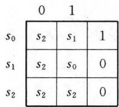  
(a) 状态表

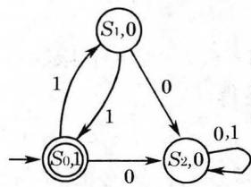  
(b）状态图   
图8-6.1

接受的语言为

$$
L _ {1} = \{(1 1) ^ {n} | n \geqslant 0 \}
$$

例2 给定有限状态机 $M_2$ ，它的状态表和状态图如图8-6.2所示，终态集 $F = \{S_1\}$ 。

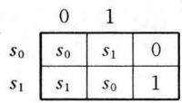  
(a) 状态表

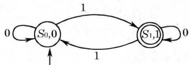  
(b) 状态图  
图8-6.2

显然，当 $\omega = (0^{*}10^{*}1)^{*}0^{*}10^{*}$ 时， $f(S_0,\omega) = S_1\in F$ ，因此 $M_2$ 接受的语言 $L_{2}$ 是由那些含有奇数个1的二进制串所组成。

在上述两例中，可以看到 $R, O$ 对判别 $\omega$ 是否属于 $L$ 无关紧要，但 $F$ 却起决定作用。

定义8-6.1 一个有限状态接收器是五有序组

$$
M = (Q, S, \delta , I, F)
$$

其中， $Q$ 是有限状态集，

$S$ 是有限输入字母集，

$I \subseteq Q$ 是初态集，

$F \subseteq Q$ 是终态集，

$\delta$ 是 $Q \times S \rightarrow Q$ 的关系，称为 $M$ 的转换关系，当 $q' \in \delta(q, s)$ 时，就有

$$
q \stackrel {s} {\rightarrow} q ^ {\prime}
$$

定义8-6.2 给定有限状态接收器 $M = (Q,S,\delta ,I,F)$ ，若存在 $q_{I}\in I$ ，使得

$$
\delta (q _ {I}, \omega) \cap F \neq \emptyset
$$

则称 $\omega$ 被 $M$ 接受。所有被 $M$ 接受的输入字符串所组成的集合称为 $M$ 可接受的语言，记为 $L(M)$ 。

例3 有限状态接收器 $M_{3}$ 的状态图如图8-6.3所示。

其中， $Q = \{A,B,C\}$

$$
I = \{A \}
$$

$$
. F = \{C \}
$$

$$
S = \{0, 1 \}
$$

$$
\delta (A, 0) = \{A, C \}, \delta (A, 1) = \{B \}
$$

$$
\delta (B, 0) = \{C \}, \delta (B, 1) = \varnothing , \delta (C, 0) = \varnothing
$$

$$
\delta (C, 1) = \{C \}
$$

$M_{3}$ 接受的语言是

$$
L \left(M _ {3}\right) = \left\{0 ^ {*} 0 1 ^ {*}, 0 ^ {*} 1 0 1 ^ {*} \right\}
$$

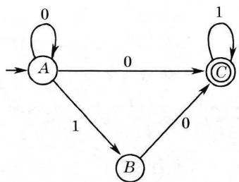  
图8-6.3

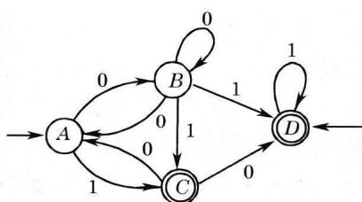  
图8-6.4

例4 有限状态接收器 $M_4$ 的状态图如图8-6.4所示。

其中， $Q = \{A,B,C,D\}$

$$
I = \{A, D \}
$$

$$
F = \{C, D \}
$$

$$
S = \{0, 1 \}
$$

$$
\delta (A, 0) = \{B \}, \delta (A, 1) = \{C \}, \delta (B, 0) = \{A, B \}
$$

$$
\delta (B, 1) = \{C, D \}, \delta (C, 0) = \{A, D \}, \delta (C, 1) = \varnothing
$$

$$
\delta (D, 0) = \emptyset , \delta (D, 1) = \{D \}
$$

显然 $L(M_4) = \{1, 1000^*1, 00^*11^*, 00^*101^*, \dots\}$

我们从例3和例4可以看到有限状态接收器和有限状态机有下面三点不同：

（1）有限状态机的初态只是一个状态 $q_{I}$ ，而有限状态接收器有一个非空初态集，其中每一状态都可作为初态。

（2）对于有限状态机我们主要考虑对于激励 $\omega$ 的响应，而有限状态接收器我们考虑的是对于激励 $\omega$ 的后继是否在终态集中，以便决定此激励是否被接受。

（3）有限状态机中 $f$ 是 $Q \times S \rightarrow Q$ 的一个状态转换函数，因此对于任一 $q \in Q, s \in S$ 都有唯一的 $q'$ ，使 $q \stackrel{s}{\rightarrow} q'$ ，这种转换称为是确定的转换。

有限状态接收器中， $\delta$ 是 $Q \times S \rightarrow Q$ 的一个状态转换关系，故可以有 $q \in Q, s \in S$ ，使得 $q \xrightarrow{s} q_1', q \xrightarrow{s} q_2', \dots, q \xrightarrow{s} q_k' (k \geqslant 1)$ ，此时 $\delta(q, s) = \{q_1', q_2', \dots, q_k'\}$ 。另外，还可能有 $q \in Q, s \in S$ ，使得 $q$ 的 $s$ -后继不存在，此时 $\delta(q, s) = \emptyset$ 。这些转换都称为不确定的转换。

如例3中有 $\delta (A,0) = \{A,C\} ,\delta (B,1) = \delta (C,0) = \emptyset$ 。例4中有 $\delta (B,0) = \{A,B\} ,\delta \{B,1\} = \{C,D\} ,\delta (C,0) = \{A,D\} ,\delta (C,1)$ $= \delta (D,0) = \varnothing$ 。

定义8-6.3 有限状态接收器 $M = (Q, S, \delta, I, F)$ ，如果 $\delta$ 是 $Q \times S \rightarrow Q$ 的一个函数且 $I$ 集合中只有一个状态，称 $M$ 是确定的有限状态接收器。否则，称 $M$ 是不确定的有限状态接收器。

例1和例2是确定的有限状态接收器，例3和例4是不确定的有限状态接收器。

确定的有限状态接收器是不确定的有限状态接收器的特殊情形。反之，我们有下列定理。

定理8-6.1 对每一台有限状态接收器 $M$ ，可以构造一台确

定的有限状态接收器 $M^{\prime}$ ，使 $L(M) = L(M^{\prime})$ 。

这个定理，我们不再证明[注]。

下面我们讨论3型文法产生的正则语言与由有限状态接收器所接受的语言之间的关系。

定理8-6.2 设 $G = (V_{N}, V_{T}, P, \sigma)$ 是一个3型文法，则存在一台有限状态接收器 $M = (Q, S, \delta, I, F)$ ，使得

$$
L (M) = L (G)
$$

证明 只对 $G$ 是右线性文法加以证明。当 $G$ 是左线性文法时，可以类似证明。

令 $M$ 的输入字母集 $S = V_{T}$ 。 $M$ 中的状态集 $Q = V_{N} \cup \{A\}$ 其中 $A \notin V_{N}, M$ 的初始状态集 $I = \{\sigma\}$ 。如果 $G$ 的生成式中含有 $\sigma \rightarrow \lambda$ ，则 $M$ 的终态集 $F = \{\sigma, A\}$ ，否则 $F = \{A\}$ 。我们这样来构造 $\delta$ ，如果在 $G$ 的生成式中含有 $B \rightarrow a$ ，那么，就有 $A \in \delta(B, a)$ 。如果在 $G$ 的生成式中含有 $B \rightarrow aC$ ，那么，就有 $C \in \delta(B, a)$ 。

对所有 $a \in V_T$ ，令 $\delta(A, a) = \emptyset$ 。这样构造出来的有限状态接收器 $M$ ，一般将是不确定的。下面我们证明

$$
L (M) = L (G)
$$

设 $\omega \in L(G), \omega = a_{1}a_{2}\dots a_{n}, (n\geqslant 1)$ ，那么，在 $L(G)$ 中有某个非终结符序列 $A_{1}, A_{2}, \dots, A_{n-1}$ ，使得 $\sigma \Rightarrow a_{1}A_{1} \Rightarrow a_{1}a_{2}A_{2} \Rightarrow \dots \Rightarrow a_{1}a_{2}\dots a_{n-1}A_{n-1} \Rightarrow a_{1}a_{2}\dots a_{n-1}a_{n}$ ，从 $\delta$ 的构造，可知

$$
A _ {1} \in \delta (\sigma , a _ {1}), A _ {2} \in \delta (A _ {1}, a _ {2}), \dots , A \in \delta (A _ {n - 1}, a _ {n})
$$

因为 $A \in F$ ，即 $\sigma$ 的 $\omega$ -后继在 $F$ 中，因此 $\omega \in L(M)$ 。

如果 $\omega = \lambda \in L(G)$ ，则在 $P$ 中，有生成式 $\sigma \rightarrow \lambda$ ，因此， $\sigma \in F$ ，即 $\sigma$ 的 $\lambda$ -后继也在 $F$ 中，因此 $\lambda \in L(M)$ 。

综上所述，有

$$
L (G) \subseteq L (M)
$$

设 $\omega = a_{1}a_{2}\dots a_{n}\in L(M)$ ， $n\geqslant 1$ ，即 $\sigma$ 的 $\omega$ -后继在 $F$ 中，于是，存在状态序列 $\sigma ,A_{1},A_{2},\dots ,A_{n - 1}$ ，使得 $A_{1}\in \delta (\sigma ,a_{1})$

$A_{2} \in \delta(A_{1}, a_{2}), \cdots, A_{n-1} \in \delta(A_{n-2}, a_{n-1}), A \in \delta(A_{n-1}, a_{n})$ 。所以， $P$ 中有生成式 $\sigma \rightarrow a_{1}A_{1}, A_{1} \rightarrow a_{2}A_{2}, \cdots, A_{n-1} \rightarrow a_{n}$ ，因此

$$
\begin{array}{l} \sigma \Rightarrow a _ {1} A _ {1} \Rightarrow a _ {1} a _ {2} A _ {2} \Rightarrow \dots \Rightarrow a _ {1} a _ {2} \dots a _ {n - 1} A _ {n - 1} \Rightarrow a _ {1} a _ {2} \dots a _ {n - 1} a _ {n} \\ \omega \in L (G) \\ \end{array}
$$

如果 $\omega = \lambda \in L(M)$ ，则 $\sigma \in F$ ，即 $P$ 中有生成式 $\sigma \rightarrow \lambda$ ，因此， $\sigma \Rightarrow \lambda, \lambda \in L(G)$ 。

综上所述，有

$$
L (M) \subseteq L (G)
$$

因此

$$
L (M) = L (G)
$$

#

例题1 给定正则文法 $G = (\{\sigma, B\}, \{0, 1\}, P, \sigma)$ ，其中 $P$ 含有：

$$
\sigma \rightarrow 0 B, B \rightarrow 0 B, B \rightarrow 1 \sigma , B \rightarrow 0
$$

试构造一台接受相同语言的有限状态接收器，并画出状态图。

解 令 $M = (Q, S, \delta, I, F)$ ，其中 $Q = \{\sigma, B, A\}, S = \{0, 1\}, I = \{\sigma\}, F = \{A\}, \delta$ 定义如下：

（1）因为 $\sigma \to 0B$ 是 $\sigma$ 在左边，0在右边的 $P$ 中的唯一生成式，故

$$
\delta (\sigma , 0) = \{B \}
$$

（2）因为 $P$ 中不包含 $\sigma$ 在左边，1在右边的生成式，故 $\delta (\sigma ,1) = \emptyset$   
（3）因为 $B \to 0B$ 和 $B \to 0$ 都在 $P$ 中，故 $\delta(B, 0) = \{B, A\}$ 。  
（4）因为 $B \to 1\sigma$ 是 $B$ 在左边，1在右边的 $P$ 中的唯一生成式，故

$$
\delta (B, 1) = \{\sigma \}
$$

（5） $\delta (A,0) = \delta (A,1) = \emptyset$

$M$ 的状态图如图8-6.5所示。

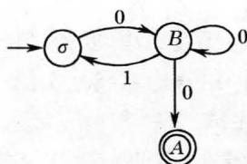  
图8-6.5

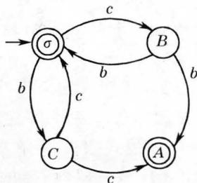  
图8-6.6

例题2 给定正则文法 $G = (\{\sigma, B, C\}, \{b, c\}, P, \sigma)$ ，其中 $P$ 含有：

$$
\sigma \rightarrow b C, \sigma \rightarrow c B, \sigma \rightarrow \lambda , B \rightarrow b \sigma , C \rightarrow c \sigma , B \rightarrow b, C \rightarrow
$$

试构造一台接受相同语言的有限状态接收器，并画出状态图。

解令 $M = (Q,S,\delta ,I,F)$ ，其中

$$
Q = \{\sigma , B, C, A \}, S = \{b, c \}, I = \{\sigma \}
$$

因为 $P$ 中含有生成式 $\sigma \rightarrow \lambda$ ，所以 $F = \{\sigma, A\}$ 。 $\delta$ 定义如下：

（1）因为 $P$ 中含有 $\sigma \rightarrow bC$ ，所以 $\delta (\sigma ,b) = \{C\}$   
（2）因为 $P$ 中含有 $\sigma \rightarrow cB$ ，所以 $\delta (\sigma ,c) = \{B\}$   
（3）因为 $P$ 中含有 $B \rightarrow b\sigma, B \rightarrow b$ ，所以 $\delta(B, b) = \{\sigma, A\}$ 。  
（4）因为 $P$ 中含有 $C \to c\sigma, C \to c$ ，所以 $\delta(C, c) = \{\sigma, A\}$ 。  
（5） $\delta (A,b) = \delta (A,c) = \emptyset$

$M$ 的状态图如图8-6.6所示。

定理8-6.3 设 $M = (Q, S, \delta, I, F)$ 是一台有限状态接收器，则存在一个3型文法 $G$ ，使 $L(G) = L(M)$ 。

证明 我们构造一个右线性文法 $G$ ，使 $L(G) = L(M)$ 。也可类似地构造一个左线性文法 $G$ ，使 $L(G) = L(M)$ 。

令 $G = (V_{N}, V_{T}, P, \sigma)$ ，这里 $V_{T}$ 是 $M$ 的输入字母集 $S$ 。

（1）当 $I$ 只包含一个状态时：将 $M$ 的初态作为 $G$ 的初始符 $\sigma, M$ 的状态集 $Q$ 作为 $G$ 的非终结符集 $V_{N}$ ，且 $P$ 是这样来构造：

a）若 $\delta (B,a) = \{C_1,C_2,\dots ,C_k\}$ ，则 $P$ 中含有生成式

$$
B \rightarrow a C _ {1}, B \rightarrow a C _ {2}, \dots , B \rightarrow a C _ {k}
$$

b）若 $C_t \in \delta(B, a)$ ，且 $C_t \in F$ ，则 $P$ 中含有生成式 $B \to a$ 。

c）如果 $I\cap F\neq \emptyset$ ，则 $P$ 中含有生成式 $\sigma \to \lambda$

（2）当 $I$ 包含多个状态时：我们增加一个不在 $Q$ 中的字符 $\sigma$ ，作为 $G$ 的初始符。 $P$ 的构造与上面类似，同时再增加下列生成式 $\sigma \rightarrow A$ ，这里 $A \in I$ 。

由上述方法构成的文法，还不是右线性文法，因为对任意初态 $A$ ，有生成式 $\sigma \rightarrow A$ 。为了构造生成相同语言的右线性文法，我们将形如 $\sigma \rightarrow A$ 生成式删去，并在剩下的生成式中，将所有出现初态 $A$ 的地方用 $\sigma$ 代替，这样所得的文法就是所需的右线性文法，这里 $V_{N} = (Q - I)\bigcup \{\sigma \}$

我们可以用与证明定理8-6.2一样的方法来证明它，留作习题。

例题3 给定有限状态接收器

$$
M = \left(\left\{S _ {0}, S _ {1} \right\}, \left\{a, b \right\}, \delta , \left\{S _ {0} \right\}, \left\{S _ {1} \right\}\right)
$$

其中， $\delta (S_0,a) = \{S_0\}$

$$
\begin{array}{l} \delta \left(S _ {0}, b\right) = \left\{S _ {1} \right\} \\ \delta \left(S _ {1}, a\right) = \left\{S _ {1} \right\} \\ \delta \left(S _ {1}, b\right) = \left\{S _ {0} \right\} \\ \end{array}
$$

试构造一个右线性文法 $G$ ，使 $L(G) = L(M)$ 。

解 令 $G = (V_{N}, V_{T}, P, \sigma)$ ，则 $V_{T} = \{a, b\}$ 。因为 $I$ 中只包含一个状态 $S_{0}$ ，所以，取 $S_{0}$ 作为 $\sigma$ 。

$V_{N} = \{S_{0}, S_{1}\}$ ，构造 $P$ ：

（1）因为 $\delta(S_0, a) = \{S_0\}$ ，所以 $P$ 中有生成式 $S_0 \rightarrow aS_0$ 。  
（2）因为 $\delta (S_0,b) = \{S_1\}$ 且 $S_{1}\in F$ ，所以， $P$ 中有生成式

$$
S _ {0} \rightarrow b S _ {1}, S _ {0} \rightarrow b
$$

（3）因为 $\delta (S_1,a) = \{S_1\}$ 且 $S_{1}\in F$ ，所以， $P$ 中有生成式

$$
S _ {1} \rightarrow a S _ {1}, \quad S _ {1} \rightarrow a
$$

（4）因为 $\delta(S_1, b) = \{S_0\}$ ，所以， $P$ 中有生成式 $S_1 \rightarrow bS_0$ 。

因此 $P: S_0 \rightarrow aS_0, S_0 \rightarrow bS_1, S_0 \rightarrow b$

$$
S _ {1} \rightarrow a S _ {1}, S _ {1} \rightarrow b S _ {0}, S _ {1} \rightarrow a
$$

例题4 给定有限状态接收器

$$
M = \left(\left\{S _ {0}, S _ {1}, S _ {2} \right\}, \left\{0, 1 \right\}, \delta , \left\{S _ {0}, S _ {1} \right\}, \left\{S _ {0} \right\}\right)
$$

其中， $\delta (S_0,0) = \{S_2\}$

$$
\begin{array}{l} \delta \left(S _ {0}, 1\right) = \left\{S _ {0}, S _ {1} \right\} \\ \delta \left(S _ {1}, 0\right) = \left\{S _ {2} \right\} \\ \delta \left(S _ {2}, 0\right) = \left\{S _ {0}, S _ {1} \right\} \\ \delta \left(S _ {2}, 1\right) = \left\{S _ {2} \right\} \\ \end{array}
$$

试构造一个右线性文法 $G$ ，使 $L(G) = L(M)$

解 令 $G = (V_{N}, V_{T}, P, \sigma)$ ，则 $V_{T} = \{0,1\}$ ；因为 $I$ 包含两个状态 $S_{0}$ 和 $S_{1}$ ，引进字符 $\sigma \notin Q$ 作为 $G$ 的初始符，生成式 $P$ 这样来构造：

（1）由 $\delta$ 可知， $P$ 中含有 $S_0\to 0S_2,S_0\to 1S_0,S_0\to 1,S_0\to 1S_1,S_1\to 0S_2,S_2$ $\rightarrow 0S_0,S_2\rightarrow 0,S_2\rightarrow 0S_1,S_2\rightarrow 1S_2$   
（2）因为 $S_0\in I,S_0\in F$ ，所以， $P$ 中含有 $\sigma \rightarrow \lambda$   
（3） $P$ 中还含有生成式 $\sigma \rightarrow S_0, \sigma \rightarrow S_1$   
（4）删去 $\sigma \rightarrow S_0, \sigma \rightarrow S_1$ ，将余下的生成式中出现 $S_0$ 和 $S_1$ 的地方换为 $\sigma$ 则可得 $P$ 为：

$$
\sigma \rightarrow 0 S _ {2}, \sigma \rightarrow 1 \sigma , \sigma \rightarrow 1, S _ {2} \rightarrow 0 \sigma , S _ {2} \rightarrow 0, S _ {2} \rightarrow 1 S _ {2}, \sigma \rightarrow \lambda
$$

# 8-6 习题

（1）给定有限状态接收器， $M = (Q,S,\delta ,I,F)$ 的状态图（图8-6.7～图8-6.9)，分别写出 $Q,S,\delta ,I,F$ ，说明它们是确定的还是不确定的。

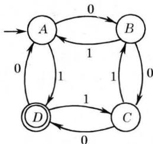  
图 8-6.7

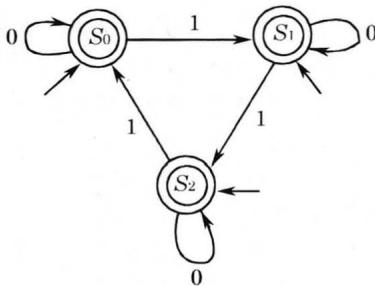  
图 8-6.8

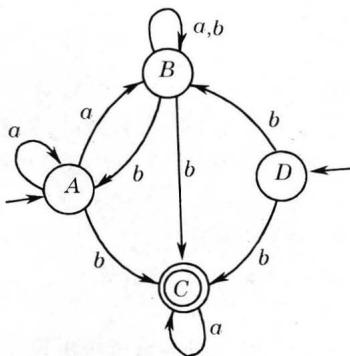  
图 8-6.9

（2）写出下列有限状态接收器接受的语言（见图 $8 - 6.10\sim$ 图8-6.11）。

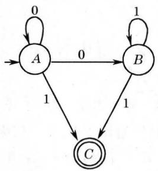

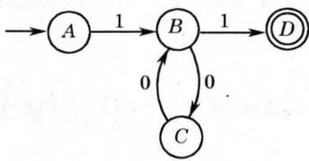  
图8-6.10  
图8-6.11

（3）完成定理8-6.3的证明。  
（4）对于图8-6.12所示的有限状态接收器 $M$ ，构造文法 $G$ ，使

$$
L (G) = L (M)
$$

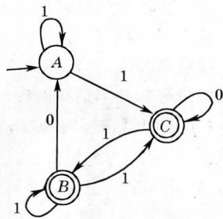  
图8-6.12

（5）给定正则文法 $G = (\{0,1\} ,\{\sigma ,A,B\} ,P,\sigma)$ ，其中

$$
P: \sigma \rightarrow 1 A, A \rightarrow 1 B, B \rightarrow 1 B, B \rightarrow 0 \sigma , B \rightarrow 0
$$

试描述 $L(G)$ 并给出接受该语言的有限状态接收器。

# 第九章 纠错码初步

纠错编码技术是50年代提出，60年代发展起来的。近来，由于数字通讯，特别是卫星通讯的发展，以及在数字计算机和数据处理等新兴科学技术中广泛应用，给纠错码开拓了新的发展前景。

本章主要讨论线性分组码，并给出构造能纠单错的群码的方法。

# 9-1 通讯模型和纠错的基本概念

人类社会中，为了加强交往，需要交换各种信息，于是产生了交换信息的各种方法，例如写一封信，通一次电话，发一份电报，通过广播等多种手段。上述这些通讯方法，除了写信外，其他三种通讯手段都要经过三个必要步骤：

（1）在发送端将所要传送的信息转换成电信号。  
（2）通过可靠的信道，传输电信号。  
（3）在接收端将接收到的电信号，还原成原来的信息。

电信号可分为模拟信号和数字信号两种。例如电话机话筒输出的电压，其幅值随说话人的语言连续变化，它与信息直接对应，且可取无限多个值，这种信号称为模拟信号。又如电报，是以四个数字代表一个汉字，且代表每个数字的脉冲信号，其高度只取两个值分别表示空号和传号（通常用0和1表示），这种信号不仅在取值上有限和离散，而且在时间上也是离散的，它称为离散信号或数字信号。这里，我们限于讨论数字信号。

在现代数字通讯系统和计算机中，信号都采用二进制，即用一个由“0”或“1”组成的符号串来表示传输的信息。例如，五位二进

制：00000，00001，00010，…，11111可表示32个不同的符号，因此，26个英文字母及六个附加的必要符号就可用它们来表示。例如，“北京”的拼音“BEIJING”，其电传码是：

$$
1 0 0 1 1 (\mathrm {B}), 1 0 0 0 0 (\mathrm {E}), 0 1 1 0 0 (\mathrm {I}), 1 1 0 1 0 (\mathrm {J}),
$$

$$
0 1 1 0 0 (I), 0 0 1 1 0 (N), 0 1 0 1 1 (G)
$$

“北京”的英语“PEKING”，其电传码为：

$$
0 1 1 0 1 (\mathrm {P}), 1 0 0 0 0 (\mathrm {E}), 1 1 1 1 0 (\mathrm {K}), 0 1 1 0 0 (\mathrm {I})
$$

$$
0 0 1 1 0 (N), 0 1 0 1 1 (G)
$$

表9-1.1给出了五单位电传码和 $3:4$ 等重码。

表9-1.1  

<table><tr><td>号 码</td><td>字母</td><td>5 单 位 码</td><td>3:4 码</td></tr><tr><td>-</td><td>A</td><td>11000</td><td>0011010</td></tr><tr><td>?</td><td>B</td><td>10011</td><td>0011001</td></tr><tr><td>;</td><td>C</td><td>01110</td><td>1001100</td></tr><tr><td>你是谁</td><td>D</td><td>10010</td><td>0011100</td></tr><tr><td>3</td><td>E</td><td>10000</td><td>0111000</td></tr><tr><td>%</td><td>F</td><td>10110</td><td>0010011</td></tr><tr><td>‰</td><td>G</td><td>01011</td><td>1100001</td></tr><tr><td></td><td>H</td><td>00101</td><td>1010010</td></tr><tr><td>8</td><td>I</td><td>01100</td><td>1110000</td></tr><tr><td>R</td><td>J</td><td>11010</td><td>0100011</td></tr><tr><td>(</td><td>K</td><td>11110</td><td>0001011</td></tr><tr><td>)</td><td>L</td><td>01001</td><td>1100010</td></tr><tr><td>·</td><td>M</td><td>00111</td><td>1010001</td></tr><tr><td>,</td><td>N</td><td>00110</td><td>1010100</td></tr><tr><td>9</td><td>O</td><td>00011</td><td>1000110</td></tr><tr><td>0</td><td>P</td><td>01101</td><td>1001010</td></tr><tr><td>1</td><td>Q</td><td>11101</td><td>0001101</td></tr><tr><td>4</td><td>R</td><td>01010</td><td>1100100</td></tr><tr><td>,</td><td>S</td><td>10100</td><td>0101010</td></tr><tr><td>5</td><td>T</td><td>00001</td><td>1000101</td></tr><tr><td>7</td><td>U</td><td>11100</td><td>0110010</td></tr><tr><td>=</td><td>V</td><td>01111</td><td>1001001</td></tr><tr><td>2</td><td>W</td><td>11001</td><td>0100101</td></tr><tr><td>/</td><td>X</td><td>10111</td><td>0010110</td></tr><tr><td>6</td><td>Y</td><td>10101</td><td>0010101</td></tr><tr><td>”</td><td>Z</td><td>10001</td><td>0110001</td></tr><tr><td colspan="2">回行&gt;</td><td>00010</td><td>1000011</td></tr><tr><td colspan="2">换行=</td><td>01000</td><td>1011000</td></tr><tr><td colspan="2">字母键</td><td>11111</td><td>0100110</td></tr><tr><td colspan="2">数学键</td><td>11011</td><td>0001110</td></tr><tr><td colspan="2">间 隔</td><td>00100</td><td>1101000</td></tr><tr><td colspan="2"></td><td>00000</td><td>0000111</td></tr><tr><td>RQ</td><td></td><td></td><td>0110100</td></tr><tr><td>α</td><td></td><td></td><td>0101001</td></tr><tr><td>β</td><td></td><td></td><td>0101100</td></tr></table>

下面讨论信息传输中纠错的概念。

一个典型的通讯系统模型如图9-1.1所示。

  
图9-1.1

此系统的第一单元是信源，它可以是人或机器（例如电子计算机）。信源的输出可以是一个连续波形，或者是离散的符号序列。信源编码器将信源的输出信号 $s$ 变换成二进制序列 $m$ ，它称为信息序列。信道编码器将信息序列 $m$ 变换成比 $m$ 更长的二进制序列 $c, c$ 称为码字。二进制码不能在实际信道上传输，调制器将二进制码 $c$ 的每位数字编码成持续时间为 $T$ 的正、负脉冲。调制器输出信号通过信道传输并被噪声干扰。解调器对每个持续时间为 $T$ 的接收信号进行判决，以确定发送的是1还是0。于是，解调器的输出是二进制序列 $r, r$ 称为接收序列。由于信道噪声的干扰，接收序列 $r$ 与码字 $c$ 可能不一致。例如，若发送的是 $c = 000110$ ，收到的是 $r = 100010$ ，那么，在第一位和第四位发生了错误。信道译码器就是要试图纠正 $r$ 中的传输错误，并产生真正发送的码字 $c$ 的估值 $c^{*}$ ，并将 $c^{*}$ 转换为 $m$ 的估值 $m^{*}$ 。而信源译码器将 $m^{*}$ 转换成真正信源输出 $s$ 的估值 $s^{*}$ ，并送至用户。如果信道无噪声干扰，则 $c^{*}$ ， $m^{*}, s^{*}$ 分别是 $c, m, s$ 的重现。如果噪声很大， $s^{*}$ 可能与真正信源输出 $s$ 差别十分大。

数字通信中一个重要的问题是设计信道的编码器—译码器

对，使得信道译码器的输出端能够可靠地重现信息序列 $m$ 。信道编码器通常是将信源编码器输出的二进制数据 $m$ 变换成一个更长的二进制码，使它具备对付噪声干扰的能力，上述设计方法的根据是1948年Shannon所提出的编码定理。该定理指出，在一定的条件下，只要码的长度充分大时，一定存在一种编码、译码方法，使得错误译码的概率充分小。

定义9-1.1任一由0，1字母组成的字符串称为字。一些字的集合称为码。码中的字称为码字，不在码中的字称为废码。码字中的每一个字母0或1称为码元。

例如，长度为2的字集 $S_{2} = \{00,01,10,11\}$ 有 $2^{2}$ 个不同的字，它们可用一个正方形表示，如图9-1.2(a)所示。其中，每一个字占据正方形的一个顶点，两个字之间如果只有一个字母不同，它们就在一条边的两端。两个字如果两个字母都不同，它们就在对角线的两端，反之亦然。由此可知，两个字中不同字母的个数恰等于从一个字出发沿着正方形边到另一个字所经过的最少边数。 $S_{2}$ 的任一非空子集都是一个码，故共有 $2^{4} - 1$ 个码。

又如长度为3的字集 $S_{3} = \{000, 001, 010, 011, 100, 101, 110, 111\}$ 有 $2^{3}$ 个不同的字，它们可用一个立方体表示出来，如图9-1.2(b)所示。每个字占据立方体的一个顶点，两个字之间如果

  
图 9-1.2

只有一个字母不同，它们就在一条棱的两端。两个字如果有两个字母不同，它们就在正方形的一条对角线的两端，如果三位都不同，它们就在正方体的对角线的两端，反之亦然。同样，两个字中不同字母的个数恰等于从一个字出发沿着立方体棱到另一个字所经过的最少棱数。 $V_{3}$ 的任一非空子集都是一个码，共有 $2^{8} - 1$ 个码。

一般，字长为 $n$ 的不同字共有 $2^{n}$ 个，它们分别是 $n$ 立方的顶点。两个字中不同字母的个数恰等于从一个字出发沿着 $n$ 立方棱

到另一个字所经过的最少棱数。

例1 考察2立方中的一个编码 $C_1 = \{00, 01, 10, 11\}$ ，如果在信息传送过程中，由于噪声的干扰，可能产生一位信息错误，那么，码字00在第一位出错就变成10，在第二位出错就变为01，它们仍是码字。一般地，码 $C_1$ 中任一码字一位出错后仍是码字。它们的关系如

  
图9-1.3

图9-1.3所示。由于一个码字出现单错后仍是码字，因此这种编码根本无法查错。

例2 考察2立方中的另一个编码 $C_2 = \{00,11\}$ ，码字00在第一位出错或码字11在第二位出错都变为10，码字00在第二位出错或码字11在第一位出错都变为01，而01，10是废码。所以，当接收到01或10时，就可知道传输中发生了单错，但不能判别是00出错还是11出错，因此，对于这种编码，虽然我们可以检查出单错，但不能纠错。

例3 考察3立方中的一个编码 $C_3 = \{001, 110\}$ ，码字001出现单错后将变为000，011，101。而110出现单错后将变为111，100，010。由于这两个码字出现单错后，废码是不同的，因此，从接收到的字就可以确定发送字。例如，接收到010，就可决定发送字是110。对于这种编码，我们不仅可以检查出单错，还可以纠单错。

现在来考察信息传送的出错概率。

设 $p$ 表示一个字母在信道中正确传送的概率，那么，由于噪声干扰，产生错误传送的概率是 $q = 1 - p$ 。假设各位字母的传送是相互独立的。那么，一个 $n$ 位的码字中出现 $r$ 个错误的概率是 $C_{n}^{r}p^{n - r}q^{r}$ 。其中

$$
C _ {n} ^ {r} = \frac {n !}{(n - r) ! r !}
$$

是从 $\pmb{n}$ 位中任取 $r$ 位的不同组合数。

# 9-1 习题

（1）构造出所有长度为2的二进制编码。找出能检查出单错的编码。是否存在能纠正单错的编码，为什么？

（2）写出下列单词的五单位电传码和 $3:4$ 码：

CHINA, SHANGHAI

（3）已知字母0，1正确传送的概率是0.98，试求：

a）CHINA的五单位电传码只在前三位出错的概率。

b）CHINA的五单位电传码中有一位出错的概率。

（4）一个字长十位的码字在传送过程中要求两位出错的概率不超过 $10^{-3}$ ，试求字母正确传送的概率。

# 9-2 线性分组码的纠错能力

在讨论线性码的纠错能力之前，先来看一个例子。

例1 对于长度为2的二进制编码 $C_1 = \{00, 01, 10, 11\}$ ，在上节已讨论过，它不能发现单错。将每一码字增加一位，使每一码字中所含1的个数为偶数，它们分别变成000，011，101，110，如果在传送过程中有码字发现单错，那么，它就变成含有奇数个1的废码。如011发生单错，就变成111，001或010。同样，如果在传送过程中一个码字出现三个错，那么，它也变成含有奇数个1的废码。因此，对于这种码，我们很易发现奇数个错误。但由于011在第二位出错，000在第三位出错，101在第一位出错都变成001，所以不能纠正单错。

类似地，若每一码字增加一位，使每一码字中所含1的个数为奇数，它们分别变成001，010，100，111，则也能发现奇数个错误，但不能纠正。

像这种增加奇偶校验位的码称为奇偶校验码。增加的位称为校验位，校验位是信息位的模2和，且每一码字都是等长的，这种码称为线性分组码。

为了进一步讨论编码的查错和纠错能力，下面再引进一些基本概念。

定义9-2.1 设 $S_{n}$ 是长度为 $n$ 的二进制串组成的集合， $S_{n} = \{x_{1}x_{2}x_{3}\dots x_{n}|x_{i}\in \{0,1\}, 1\leqslant i\leqslant n\}$ 。定义 $S_{n}$ 上的一个二元运算 $\oplus$ ，使得对任意 $X,Y\in S_{n}, X = x_{1}x_{2}\dots x_{n}, Y = y_{1}y_{2}\dots y_{n}$ 。

$X \oplus Y = z_{1}z_{2}\dots z_{n}$ , 其中 $z_{i} = x_{i} + y_{i}$ , 集合 $\{0,1\}$ 上运算 $+$ 是按位加, 如表 9-2.1 所示。

表9-2.1  

<table><tr><td>+</td><td>0</td><td>1</td></tr><tr><td>0</td><td>0</td><td>1</td></tr><tr><td>1</td><td>1</td><td>0</td></tr></table>

定理9-2.1 代数系统 $\langle S_n, \oplus \rangle$ 是群。

证明 由于 $\{0,1\}$ 上二元运算 $+$ 是封闭和可结合的，所以， $S_{n}$ 上二元运算 $\oplus$ 是封闭和可结合的。

00…0是幺元。 $S_{n}$ 中任一元素的逆元是自身。因此 $\langle S_n,\oplus \rangle$ 是群。

定义9-2.2 $S_{n}$ 的任一子集 $C$ ，如果 $\langle C, \oplus \rangle$ 是群，称码 $C$ 是群码。

定义9-2.3 对于 $S_{n}$ 中任两元素 $X = x_{1}x_{2}\dots x_{n},Y = y_{1}y_{2}\dots$ $y_{n},X$ 和 $Y$ 中对应位字母不同的个数，称为 $X$ 和 $Y$ 的海明(Hamming)距，记作 $H(X,Y)$ ，即

$$
H (X, Y) = \sum_ {i = 1} ^ {n} \left(x _ {i} + y _ {i}\right)
$$

例2设 $n = 3$ ，码 $\{000,111\}$ 对运算 $\oplus$ 构成群，它是群码，000与111三个字母都不同，它们的海明距是3。

例3设 $n = 4, X = 1001, Y = 0100, Z = 1000$ 。集合 $\{X, Y, Z\}$ 对运算 $\oplus$ 不构成群，因为在此集合中无幺元。 $H\{X, Y\} = 3$ ， $H(Y, Z) = 2$ ， $H(Z, X) = 1$ 。

定理9-2.2 设 $X, Y, Z \in S_{n}$ , 那么

a) $H(X,X) = 0$   
b) $H(X, Y) = H(Y, X)$ ;   
c) $H(X,Y) + H(Y,Z)\geqslant H(X,Z)$

证明 令 $X = x_{1}x_{2}\dots x_{n},Y = y_{1}y_{2}\dots y_{n},Z = z_{1}z_{2}\dots z_{n}$

a）因为 $x_{i} + x_{i} = 0$ ，所以

$$
H (X, X) = \sum_ {i = 1} ^ {n} \left(x _ {i} + x _ {i}\right) = 0
$$

b）因为 $x_{i} + y_{i} = y_{i} + x_{i}$ ，所以

$$
H (X, Y) = \sum_ {i = 1} ^ {n} \left(x _ {i} + y _ {i}\right) = \sum_ {i = 1} ^ {n} \left(y _ {i} + x _ {i}\right) = H (Y, X)
$$

c）因为 $(x_{i} + y_{i}) + (y_{i} + z_{i})\geqslant x_{i} + z_{i}^{[\text{注}]}$ ，所以

$$
\begin{array}{l} H (X, Y) + H (Y, Z) = \sum_ {i = 1} ^ {n} \left(x _ {i} + y _ {i}\right) + \sum_ {i = 1} ^ {n} \left(y _ {i} + z _ {i}\right) \\ = \sum_ {i = 1} ^ {n} \left(\left(x _ {i} + y _ {i}\right) + \left(y _ {i} + z _ {i}\right)\right) \\ \geqslant \sum_ {i = 1} ^ {n} \left(x _ {i} + z _ {i}\right) = H (X, Z) \\ \end{array}
$$

定义9-2.4 一个码 $C$ 中所有不同码字的海明距的极小值称为码 $C$ 的极小距，记作 $d_{\min}(C)$ 。

$$
d_{\min}(C) = \min_{\substack{X,Y\in C\\ X\neq Y}}H(X,Y)
$$

例2中的码的极小距是3，例3中的码的极小距是1。

下面两条定理，分别说明一个码的查错和纠错的能力。

定理9-2.3 一个码 $C$ 能查出不超过 $k$ 个错误的充要条件

是此码的极小距至少是 $k + 1$ 。

证明 充分性。

设码 $C$ 的极小距 $d_{\min}(C) \geqslant k + 1, X \in C$ 是任一码字，经过传送后，接收字为 $X'$ ，如果传送过程中，产生了错误且错误的位数 $\leqslant k$ ，那么 $0 < H(X, X') =$ 错误的位数 $\leqslant k, X' \neq X$ 。又 $C$ 中任一不同于 $X$ 的码字 $Y$ ，有 $H(X, Y) \geqslant d_{\min}(C) \geqslant k + 1 > H(X, X')$ ，所以， $X'$ 不能是码 $C$ 中不同于 $X$ 的码字，即 $X' \notin C, X'$ 是废码。因此，能查出不超过 $k$ 个错误。

必要性。

设码 $C$ 能查出不超过 $k$ 个错误，这表示与一个码字的海明距不超过 $k$ （且 $>0$ ）的所有字都是废码，故码 $C$ 中任两个码字的海明距至少是 $k + 1$ ，即

$$
d _ {\min } (C) \geqslant k + 1 。
$$

由上述定理可知例2中的码，极小距是3，所以能查出单错和两个错。例3中的码，极小距是1，所以不能查出单错。如码字1001在第四位出错，就成为另一码字1000，不是废码。

接着讨论纠错，为此先建立一条译码准则：

最小距离译码准则：给定码 $C$ ，设接收字为 $X^{\prime}$ ，在 $C$ 中找一个码字 $X$ ，使 $X^{\prime}$ 与 $X$ 的海明距是 $X^{\prime}$ 与 $C$ 中所有码字海明距的极小值，即

$$
H (X, X ^ {\prime}) = \min  _ {Y \in C} H (Y, X ^ {\prime})
$$

则我们将 $X^{\prime}$ 译为码字 $X$ 。

定理9-2.4 一个码能纠 $k$ 个错的充要条件是此码的极小距至少是 $2k + 1$ 。

证明 充分性。

设 $d_{\min}(C) \geqslant 2k + 1$ 。发送字是 $X$ ，接收字是 $X'$ ，且 $H(X, X') = k$ 。对 $C$ 中任一码字 $Y \neq X$ ，因为

$$
H (X, Y) \geqslant d _ {\min } (C) \geqslant 2 k + 1
$$

所以 $H(X^{\prime},Y)\geqslant H(X,Y) - H(X,X^{\prime})$

$$
\geqslant (2 k + 1) - k = k + 1
$$

根据最小距离译码准则， $X^{\prime}$ 只能译成 $X$ ，不能译成其他码字，所以能纠正 $k$ 个错。

必要性。

设码 $C$ 能纠正 $k$ 个错。用反证法：如果 $d_{\min}(C) \leqslant 2k$ ，那么，存在码字 $X, Y \in C, H(X, Y) \leqslant 2k$ 。由定理9-2.3可知， $H(X, Y) \geqslant k + 1, X$ 与 $Y$ 中至少有 $k + 1$ 位不同，设发送字 $X$ 经传送后，得接收字 $X'$ ，而 $X'$ 与 $X$ 中有 $k$ 位不同，且这 $k$ 位恰是 $X$ 与 $Y$ 不同位的一部分。又因为 $H(X, Y) \leqslant 2k$ ，故 $X'$ 与 $Y$ 的不同位数 $\leqslant k$ ，即 $H(X', Y) \leqslant k$ 。根据最小距离译码准则，如果 $H(X', Y) < k$ ，则 $X'$ 将被误译为 $Y$ 。如果 $H(X', Y) = k$ ，则 $X'$ 既可译为 $X$ ，又可译为 $Y$ 。因此，不能纠正 $k$ 个错，与假设矛盾。 $\square$

根据这条定理可以知道，例2中的码可以纠正单错。

例3 给定码 $C = \{000000, 001101, 010011, 011110, 100110, 101011, 110101, 111000\}$ , 那么 $d_{\min}(C) = 3$ , 可以纠单错。如接收字是 110001, 应译为 110101。设接收字 001001 是由发送字 000000 在第三和第六位出错而得到, 但按照最小距离译码准则将误译为 001101, 因此码 $C$ 不能纠两个错。

定理9-2.3和定理9-2.4有个简单的几何解释。以任一码字 $X$ 为球心，以 $k$ 为半径，作 $n$ 维空间中的球。当 $d_{\min}(C) \geqslant k + 1$ 时，说明 $C$ 中所有其他码字都落在这种球的外面，如图9-2.1(a)

  
图9-2.1

所示。设码字 $X$ 在传送过程中，产生的错误不超过 $k$ 个，它的接

收字 $X^{\prime}$ 必在此球内，所以，我们可以查出 $k$ 个或少于 $k$ 个错。此外，若接收字 $X^{\prime}$ 落在分别以 $X$ 和 $Y$ 为球心， $k$ 为半径的两个球的公共部分，如图9-2.1(b）所示。若 $H(X^{\prime}, Y) < H(X^{\prime}, X)$ ，根据最小距离译码准则， $X^{\prime}$ 将误译为 $Y$ ，因此，在这种情况下，码 $C$ 不能纠 $k$ 个错。

  
图9-2.2

如果 $d_{\min}(C) \geqslant 2k + 1$ ，那么，以

任意码字为球心，半径为 $k$ 的球都不相交，如图9-2.2所示，此时，如有传送错误 $\leqslant k$ 的接收字，它只能落在一个球内，根据最小距离译码准则，此接收字只能译为此球的球心码字，即它能纠 $k$ 个错。

# 9-2 习题

（1）给定码 $C = \{00000, 10001, 01100, 10101\}$ ，试求码 $C$ 中任两个码字的海明距和 $d_{\min}(C)$ 。  
（2）设 $X, Y, Z$ 是线性码 $C$ 中三个不同的码字，写出 $H(X, Y) + H(Y, Z) = H(X, Z)$ 的充要条件，并加以证明。  
（3）证明字长不超过 $2k$ 的码不能纠 $k$ 个错。字长不超过 $k$ 的码不能查 $k$ 个错。  
（4）给定线性码 $C$ ，如果 $d_{\mathrm{min}}(C)\geqslant k + k^{\prime} + 1(k^{\prime}\geqslant k)$ ，则码 $C$ 能查 $k^{\prime}$ 个错且能纠 $k$ 个错。请构造一个能纠单错且能查出两个错的线性码。

# 9-3 海明码

海明在1950年提出了一种能纠单错的线性分组码，称为海明码，这种编码很简单、直观、易于实现，目前在计算机系统中经常使用。在讨论如何构造海明码之前，先看一个例子。

例1 对于 $S_{4}$ 中每一字 $a_{1}a_{2}a_{3}a_{4}$ ，若增加三位校验位 $a_{5}, a_{6}, a_{7}$ ，使其成为字长为7的码字 $a_{1}a_{2}a_{3}a_{4}a_{5}a_{6}a_{7}$ ，其中校验位 $a_{5}, a_{6}, a_{7}$ 满足下列方程组

$$
a _ {1} + a _ {2} + a _ {3} + a _ {5} = 0 \tag {1}
$$

$$
a _ {1} + a _ {2} + a _ {4} + a _ {6} = 0 \tag {2}
$$

$$
a _ {1} + a _ {3} + a _ {4} + a _ {7} = 0 \tag {3}
$$

它等价于下列方程组

$$
a _ {5} = a _ {1} + a _ {2} + a _ {3}
$$

$$
a _ {6} = a _ {1} + a _ {2} + a _ {4}
$$

$$
a _ {7} = a _ {1} + a _ {3} + a _ {4}
$$

故当 $a_1, a_2, a_3, a_4$ 给定后，就可唯一确定校验位 $a_5, a_6, a_7$ 。这样，就构成了一个字长为 7 的码 $C$ ，如表 9-3.1 所示。

表 9-3.1  

<table><tr><td>\( a_1 \)</td><td>\( a_2 \)</td><td>\( a_3 \)</td><td>\( a_4 \)</td><td>\( a_5 \)</td><td>\( a_6 \)</td><td>\( a_7 \)</td></tr><tr><td>0</td><td>0</td><td>0</td><td>0</td><td>0</td><td>0</td><td>0</td></tr><tr><td>0</td><td>0</td><td>0</td><td>1</td><td>0</td><td>1</td><td>1</td></tr><tr><td>0</td><td>0</td><td>1</td><td>0</td><td>1</td><td>0</td><td>1</td></tr><tr><td>0</td><td>0</td><td>1</td><td>1</td><td>1</td><td>1</td><td>0</td></tr><tr><td>0</td><td>1</td><td>0</td><td>0</td><td>1</td><td>1</td><td>0</td></tr><tr><td>0</td><td>1</td><td>0</td><td>1</td><td>1</td><td>0</td><td>1</td></tr><tr><td>0</td><td>1</td><td>1</td><td>0</td><td>0</td><td>1</td><td>1</td></tr><tr><td>0</td><td>1</td><td>1</td><td>1</td><td>0</td><td>0</td><td>0</td></tr><tr><td>1</td><td>0</td><td>0</td><td>0</td><td>1</td><td>1</td><td>1</td></tr><tr><td>1</td><td>0</td><td>0</td><td>1</td><td>1</td><td>0</td><td>0</td></tr><tr><td>1</td><td>0</td><td>1</td><td>0</td><td>0</td><td>1</td><td>0</td></tr><tr><td>1</td><td>0</td><td>1</td><td>1</td><td>0</td><td>0</td><td>1</td></tr><tr><td>1</td><td>1</td><td>0</td><td>0</td><td>0</td><td>0</td><td>1</td></tr><tr><td>1</td><td>1</td><td>0</td><td>1</td><td>0</td><td>1</td><td>0</td></tr><tr><td>1</td><td>1</td><td>1</td><td>0</td><td>1</td><td>0</td><td>0</td></tr><tr><td>1</td><td>1</td><td>1</td><td>1</td><td>1</td><td>1</td><td>1</td></tr></table>

考察方程(1)到(3)。显然，对于 $C$ 中任一码字，如果在传送过程中，发生了单错，那么，这些方程中必有一个或几个不满足。为

了根据出错的方程决定码字的出错位。先建立三个谓词：

$$
P _ {1} \left(a _ {1}, a _ {2}, \dots , a _ {7}\right): a _ {1} + a _ {2} + a _ {3} + a _ {5} = 0
$$

$$
P _ {2} \left(a _ {1}, a _ {2}, \dots , a _ {7}\right): a _ {1} + a _ {2} + a _ {4} + a _ {6} = 0
$$

$$
P _ {3} \left(a _ {1}, a _ {2}, \dots , a _ {7}\right): a _ {1} + a _ {3} + a _ {4} + a _ {7} = 0
$$

对任一字 $a_1a_2a_3a_4a_5a_6a_7$ ，当右端方程满足时，则 $P_{i}$ 为真，否则为假。例如对于字0001101， $P_{1}(0,0,0,1,1,0,1)$ 为假， $P_{2}(0,0,0,1$ $1,0,1)$ 为假， $P_{3}(0,0,0,1,1,0,1)$ 为真。

令 $S_{i}$ 是 $P_{i}$ 中所出现的变元组成的集合，即 $S_{1} = \{a_{1}, a_{2}, a_{3}, a_{5}\}, S_{2} = \{a_{1}, a_{2}, a_{4}, a_{6}\}, S_{3} = \{a_{1}, a_{3}, a_{4}, a_{7}\}$ 。因为 $S_{i}$ 中任一元素是字 $a_{1}a_{2}a_{3}a_{4}a_{5}a_{6}a_{7}$ 中的一个字母，显然 $S_{i}$ 就是使 $P_{i}$ 为假的所有可能出错字母的集合。上述三个集合可组成七个互不相交的非空集合如下：

$$
\begin{array}{l} S _ {1} \cap S _ {2} \cap S _ {3} = \left\{a _ {1} \right\}, \quad S _ {1} \cap S _ {2} \cap \sim S _ {3} = \left\{a _ {2} \right\} \\ S _ {1} \cap \sim S _ {2} \cap S _ {3} = \left\{a _ {3} \right\}, \quad S _ {1} \cap \sim S _ {2} \cap \sim S _ {3} = \left\{a _ {5} \right\} \\ \sim S _ {1} \cap S _ {2} \cap S _ {3} = \left\{a _ {4} \right\}, \quad \sim S _ {1} \cap S _ {2} \cap \sim S _ {3} = \left\{a _ {6} \right\} \\ \sim S _ {1} \cap \sim S _ {2} \cap S _ {3} = \{a _ {7} \} \\ \end{array}
$$

从这七个集合，我们可决定出错位。例如 $\sim S_{1} \cap S_{2} \cap S_{3} = \{a_{4}\}$ ，即 $a_{4} \notin S_{1}, a_{4} \in S_{2}, a_{4} \in S_{3}$ ，所以，如果 $a_{4}$ 位出错，则 $P_{1}$ 为真，而 $P_{2}, P_{3}$ 为假，反之亦然，以此类推，我们就可得到译码表如表9-3.2所示。

表9-3.2  

<table><tr><td>P1</td><td>P2</td><td>P3</td><td>出错字母</td></tr><tr><td>T</td><td>T</td><td>T</td><td>无</td></tr><tr><td>T</td><td>T</td><td>F</td><td>a7</td></tr><tr><td>T</td><td>F</td><td>T</td><td>a6</td></tr><tr><td>T</td><td>F</td><td>F</td><td>a4</td></tr><tr><td>F</td><td>T</td><td>T</td><td>a5</td></tr><tr><td>F</td><td>T</td><td>F</td><td>a3</td></tr><tr><td>F</td><td>F</td><td>T</td><td>a2</td></tr><tr><td>F</td><td>F</td><td>F</td><td>a1</td></tr></table>

例如，接收字是1000011，代入方程(1)，（2）和(3)，可知方程(1)不满足，方程(2)和(3)满足， $P_{1}$ 为 $\pmb{F}$ ， $P_{2}$ 和 $P_{3}$ 为 $\pmb{T}$ ，由表9-3.2可知出错字母是 $a_5$ ，因此，发送字是1000111。又如接收字是0111111，代入方程(1)，(2)和(3)，可知这些方程都不满足， $P_{1}$ $P_{2},P_{3}$ 都为 $\pmb{F}$ ，由表9-2.3可知出错字母是 $a_1$ ，因此发送字是1111111。

例1所构造的单错可纠码，它由方程(1)，（2)和(3)决定。这三个方程的矩阵形式为

$$
\vec {X} \cdot H ^ {T} = 0
$$

其中， $\vec{X} = (a_{1}, a_{2}, \dots, a_{7})$ ，它是码字 $X = a_{1}a_{2}\dots a_{7}$ 所对应的向量。

$$
H = \left( \begin{array}{c c c c c c c} 1 & 1 & 1 & 0 & 1 & 0 & 0 \\ 1 & 1 & 0 & 1 & 0 & 1 & 0 \\ 1 & 0 & 1 & 1 & 0 & 0 & 1 \end{array} \right)
$$

$H^T$ 是 $H$ 的转置矩阵。

因此，一个线性分组码就由矩阵 $H$ 确定，而它的纠错能力可由 $H$ 的特性来决定。下面就来讨论矩阵 $H$ 的构造。

定义9-3.1 一个码字 $X$ 中所含1的个数，称为此码字的重量，记作 $W(X)$ 。

例如码字11010和01100的重量分别为3和2。又如码字 $000\dots 0$ 的重量是0，为了方便起见，将码字 $000\dots 0$ 记作 $\mathbf{0}$ 。

定理9-3.1 给定码 $C$ ，对于任两个码字 $X,Y\in C$ ，有

$$
H (X, Y) = H (X \oplus Y, 0) = W (X \oplus Y)
$$

证明 设 $X = x_{1}x_{2}\dots x_{n}, Y = y_{1}y_{2}\dots y_{n}, Z = X \oplus Y = z_{1}z_{2}\dots z_{n}, z_{i} = x_{i} + y_{i}(1 \leqslant i \leqslant n), H(X,Y) = \sum_{i=1}^{n}(x_{i} + y_{i}) = \sum_{i=1}^{n}z_{i} = \sum_{i=1}^{n}(z_{i} + 0) = H(X \oplus Y, \mathbf{0})$ ，因为 $\sum_{i=1}^{n}z_{i} = W(Z)$ ，所以 $H(X,Y) = H(X \oplus Y, \mathbf{0}) = W(X \oplus Y)$ 。

定理9-3.2群码 $C$ 中非零码字的最小重量等于此群码的最小距。即

$$
\min  _ {\substack {Z \in C \\ Z \neq \mathbf{0}}} W (Z) = d _ {\min } (C)
$$

证明 因为 $\langle C, \oplus \rangle$ 是群，幺元 $\mathbf{0} \in C$ 。

对于任一非零码字 $Z$

$$
\begin{array}{l} W (Z) = W (Z \oplus \mathbf {0}) = H (Z, \mathbf {0}) \\ \geqslant \min  _ {\substack {X, Y \in C \\ X \neq Y}} H (X, Y) = d _ {\min } (C) \\ \end{array}
$$

所以 $\min_{\substack{Z\in C\\ Z\neq \mathbf{0}}}W(Z)\geqslant d_{\min}(C)$

此外，对于 $C$ 中任两个不同码字 $X, Y$ ，由于 $\oplus$ 封闭性， $X \oplus Y \in C$ 且 $X \oplus Y \neq \emptyset$ ，有

$$
H(X,Y) = W(X\oplus Y)\geqslant \min_{\substack{Z\in C\\ Z\neq \mathbf{0}}}W(Z)
$$

所以 $d_{\min}(C) = \min_{\substack{X,Y\in C\\ X\neq Y}}H(X,Y)\geqslant \min_{\substack{Z\in C\\ Z\neq \emptyset}}W(Z)$

因此 $\min_{\substack{Z\in C\\ Z\neq \mathbf{0}}}W(Z) = d_{\min}(C)$

例2 a) $C_1 = \{0000, 1111\}$ 是群码，而

$$
\begin{array}{l} \min  _ { \begin{array}{l} Z \in c _ {1} \\ Z \neq \mathbf {0} \end{array} } W (Z) = W (1 1 1 1) = 4 = H (0 0 0 0, 1 1 1 1) \\ = d _ {\min } (C) \\ \end{array}
$$

b） $C_2 = \{001,010,100\}$ 不是群码，而

$$
\min  _ { \begin{array}{l} Z \in C _ {2} \\ Z \neq \mathbf {0} \end{array} } W (Z) = 1, d _ {\min } (C _ {2}) = 2
$$

所以 $\min_{\substack{Z\in C_2\\ Z\neq \mathbf{0}}}W(Z) <   d_{\min}(C_2)$

c） $C_3 = \{110,111\}$ 不是群码，而

$$
\min  _ { \begin{array}{l} Z \in C _ {3} \\ Z \neq \mathbf {0} \end{array} } W (Z) = 2, d _ {\min } (C _ {3}) = 1
$$

所以 $\min_{\substack{Z\in C_3\\ Z\neq \mathbf{0}}}W(Z) > d_{\min}(C_3)$

定理9-3.3 设 $H$ 是 $k$ 行 $n$ 列矩阵， $X = x_{1}x_{2}\dots x_{n}$ 是 $n$ 位二进制串，那么集合

$$
G = \{X | \vec {X} \cdot H ^ {T} = \mathbf {0} \}
$$

对于运算 $\oplus$ 构成群，即 $G$ 是群码。

证明 因为 $\langle S_n, \oplus \rangle$ 是有限群，设 $X, Y \in G$ ，那么， $\vec{X} \cdot H^T = 0$ ， $\vec{Y} \cdot H^T = 0$ ， $(\overline{X \oplus Y}) \cdot H^T = (\vec{X} \cdot H^T) \oplus (\vec{Y} \cdot H^T) = 0 \oplus 0 = 0$ 所以， $X \oplus Y \in G$ ，由定理5-4.7可知 $\langle G, \oplus \rangle$ 是子群，即 $G$ 是群码。

由本定理可知例1的码是群码。

定义9-3.2 群码 $G = \{X|\vec{X}\cdot H^T = 0\}$ 称为由 $H$ 生成的群码， $G$ 中每一码字，称为由 $H$ 生成的码字，矩阵 $H$ 称为一致校验矩阵。

矩阵 $H$ 的 $n$ 个列向量分别记为 $h_1, h_2, \dots, h_n$ ，其中 $h_i$ 是第 $i$ 个列向量，即

$$
H = \left(h _ {1} h _ {2} \dots h _ {n}\right)
$$

其中 $h_i = \begin{bmatrix} h_{1i}\\ h_{2i}\\ \vdots \\ h_{ki} \end{bmatrix}$

定义列向量 $h_i$ 与 $h_j$ 的和 $h_i \oplus h_j$ 为

$$
h _ {i} \oplus h _ {j} = \left( \begin{array}{c} h _ {1 i} + h _ {1 j} \\ h _ {2 i} + h _ {2 j} \\ \vdots \\ h _ {k i} + h _ {k j} \end{array} \right)
$$

定理9-3.4 一致校验矩阵 $H$ 生成一个重量为 $q$ 的码字的充要条件是在 $H$ 中存在 $q$ 个列向量，它们的和为0。

证明 充分性。

如果在 $H$ 中有 $q$ 个列向量 $h_{i_1}, h_{i_2}, \dots, h_{i_q}$ ，满足

$$
h _ {i _ {1}} \oplus h _ {i _ {2}} \oplus \dots \oplus h _ {i _ {q}} = 0
$$

构造一个字 $X = x_{1}x_{2}\dots x_{n}$ ，其中 $x_{i_1} = x_{i_2} = \dots = x_{i_q} = 1$ ，其他为0，显然，对此字 $X$

$$
\vec {X} \cdot H ^ {T} = \left(h _ {i _ {1}} \oplus h _ {i _ {2}} \oplus \dots \oplus h _ {i _ {q}}\right) ^ {T} = \mathbf {0}
$$

所以， $X$ 是由 $H$ 生成的重量为 $q$ 的码字。

必要性。

如果 $H$ 生成重量为 $q$ 的码字 $X$ ， $X = x_{1}x_{2}\dots x_{n}$ ，其中 $x_{i_1} = x_{i_2} = \dots = x_{i_q} = 1$ ，其余为0，那么，由 $X\cdot H^{T} = 0$ 得到

$$
h _ {i _ {1}} \oplus h _ {i _ {2}} \oplus h _ {i _ {3}} \oplus \dots \oplus h _ {i _ {q}} = 0
$$

因此， $q$ 个列向量 $h_{i_1}, h_{i_2}, \dots, h_{i_q}$ ，它们的和为0。

推论 由 $H$ 生成的群码中非零码字的最小重量等于矩阵 $H$ 中列向量和为0的最小向量数。

如果矩阵 $H$ 中列向量和为0的最小向量数是1，则在 $H$ 中恰存在一个列向量为零向量。

如果矩阵 $H$ 中列向量和为0的最小向量数是2，则在 $H$ 中恰存在两个相同的列向量。

例1中矩阵 $H$ 没有零向量且各个列向量互不相同，但它的第二、三、四列向量之和为0，所以，列向量和为0的最小向量数是3，由推论可知，此 $H$ 生成的群码的非零码字最小重量是3，因此，由定理9-3.2可知，此群码的最小距是3，再由定理9-2.4可知，此群码必可纠单错。

此外，线性分组码 $C$ 中每一码字 $X$ 形式为：

$$
X = \underbrace {x _ {1} x _ {2} \cdots x _ {m}} _ {\text {信 息 位}} \underbrace {x _ {m + 1} \cdots x _ {m + k}} _ {\text {校 验 位}}
$$

$k$ 位校验位与 $m$ 位信息位之间有如下关系：

$$
x _ {m + i} = q _ {i _ {1}} x _ {1} + q _ {i _ {2}} x _ {2} + \dots + q _ {i _ {m}} x _ {m}, (1 \leqslant i \leqslant k)
$$

其中 $q_{ij}\in \{0,1\} ,1\leqslant j\leqslant m$

令

$$
H = \left( \begin{array}{l l} \boxed {Q} & \boxed {I _ {k}} \\ \hline \end{array} \right) _ {k \times m}
$$

其中 $Q = \begin{bmatrix} q_{11} & \dots & q_{1m}\\ \vdots & & \vdots \\ q_{k1} & \dots & q_{km} \end{bmatrix}_{k\times m},I_k = \begin{bmatrix} 1 & 0\\ \ddots & \\ 0 & 1 \end{bmatrix}_{k\times k}$

那么，码 $C$ 中任一码字满足方程

$$
X \cdot H ^ {T} = 0
$$

记 $n = m + k$ ，这种码简称为 $(n,m)$ 码。

为了要使码 $C$ 能纠正单错，由定理9-2.4，定理9-3.3及定理9-3.4的推论可知，要求 $H$ 中的列向量均不相同且无零向量，即矩阵 $Q$ 的列向量不能为0且不能出现 $I_{k}$ 中的 $k$ 个列向量。因为 $Q$ 的每一列向量都是 $k$ 维的，可有 $2^{k}$ 个不同的列向量，因此，可从 $2^{k} - 1 - k$ 个列向量中任取 $m$ 个来组成 $Q$ 。

故必须满足 $m \leqslant 2^{k} - 1 - k$ 或 $2^{k} \geqslant (m + k) + 1 = n + 1$ 。

例3 $n = 7$ ，则 $2^{k}\geqslant 7 + 1 = 8$ ， $k\geqslant 3$ ，如取 $k = 3$ ，则 $m = n - k$ $= 4$ ，即每一码字中四位是信息位，三位是校验位，且一致校验矩阵为

$$
H = \left[ \begin{array}{c c c c} & 1 & 0 & 0 \\ Q _ {3 \times 4} & 0 & 1 & 0 \\ & 0 & 0 & 1 \end{array} \right]
$$

其中矩阵 $Q$ 有四个列向量，而 $2^{k} - 1 - k = 2^{3} - 1 - 3 = 4$ ，因此 $Q$ 的四个列向量是唯一决定的，它们只能是

$$
\left[ \begin{array}{l} 1 \\ 1 \\ 1 \end{array} \right], \left[ \begin{array}{l} 1 \\ 1 \\ 0 \end{array} \right], \left[ \begin{array}{l} 1 \\ 0 \\ 1 \end{array} \right], \left[ \begin{array}{l} 0 \\ 1 \\ 1 \end{array} \right]
$$

如果选取

$$
Q = \left( \begin{array}{c c c c} 1 & 1 & 1 & 0 \\ 1 & 1 & 0 & 1 \\ 1 & 0 & 1 & 1 \end{array} \right)
$$

此时 $H = \begin{bmatrix} 1 & 1 & 1 & 0 & 1 & 0 & 0\\ 1 & 1 & 0 & 1 & 0 & 1 & 0\\ 1 & 0 & 1 & 1 & 0 & 0 & 1 \end{bmatrix}$

就是例1中的矩阵。

此外，若将上述矩阵 $Q$ 中列向量作交换，则也不能构成新的码，因此，例1中的(7,4)码是唯一的。

如取 $k = 4$ ，则 $m = n - k = 3$

$$
H = \left[ Q _ {4 \times 3} \begin{array}{l l l l l} 1 & 0 & 0 & 0 \\ 0 & 1 & 0 & 0 \\ 0 & 0 & 1 & 0 \\ 0 & 0 & 0 & 1 \end{array} \right]
$$

矩阵 $Q$ 有三个列向量，而 $2^{4} - 1 - 4 = 11$ ，可有 $C_{11}^{3} = 165$ 种组成 $Q$ 的方法，即可有165个不同的(7,3)码。

例如，下面都是一致校验矩阵：

$$
\begin{array}{l} H _ {1} = \left[ \begin{array}{c c c c c c c} 1 & 0 & 0 & 1 & 0 & 0 & 0 \\ 1 & 1 & 0 & 0 & 1 & 0 & 0 \\ 0 & 1 & 1 & 0 & 0 & 1 & 0 \\ 0 & 0 & 1 & 0 & 0 & 0 & 1 \end{array} \right] \\ H _ {2} = \left[ \begin{array}{c c c c c c c} 1 & 0 & 1 & 1 & 0 & 0 & 0 \\ 1 & 1 & 0 & 0 & 1 & 0 & 0 \\ 0 & 1 & 0 & 0 & 0 & 1 & 0 \\ 0 & 0 & 1 & 0 & 0 & 0 & 1 \end{array} \right] \\ H _ {3} = \left( \begin{array}{c c c c c c c} 1 & 0 & 1 & 1 & 0 & 0 & 0 \\ 1 & 1 & 0 & 0 & 1 & 0 & 0 \\ 1 & 1 & 1 & 0 & 0 & 1 & 0 \\ 0 & 1 & 1 & 0 & 0 & 0 & 1 \end{array} \right) \\ \end{array}
$$

矩阵 $H_{1}$ 中第一列，第四列，第五列三个列向量之和为零向量，所以，它对应的码只能纠单错。同样，矩阵 $H_{2}, H_{3}$ 对应的码也只能纠单错。

例4 $n = 9,2^{k}\geqslant 9 + 1 = 10,k\geqslant 4$ 。如取 $k = 4$ ，则 $m = 9 - 4 =$ 5。一致校验矩阵 $H$ 中 $Q$ 有5个列向量，而 $2^{k} - 1 - k = 2^{4} - 1 - 4 =$ 11，构成 $Q$ 就可有 $C_{11}^{5} = 462$ 种组成 $Q$ 的方法，即可有462个不同的(9，5)码。

# 9-3 习题

（1）构造一个可纠单错的(9,5)码。  
（2）设 $C$ 是一个线性分组码，它同时具有偶数重量和奇数重量的码字。

证明：偶数重量码字的数目等于奇数重量码字的数目。

（3）考察一个(8，4)码 $C$ ，它的校验位 $a_5,a_6,a_7,a_8$ 满足下列方程

$$
\begin{array}{l} a _ {5} = a _ {1} + a _ {2} + a _ {4} \\ a _ {6} = a _ {1} + a _ {3} + a _ {4} \\ a _ {7} = a _ {1} + a _ {2} + a _ {3} \\ a _ {8} = a _ {2} + a _ {3} + a _ {4} \\ \end{array}
$$

其中 $a_1, a_2, a_3, a_4$ 为信息位。求出这个码的一致校验矩阵。

证明： $\min_{\substack{X\in C\\ X\neq \emptyset}}W(X) = 4$

（4）写出例3中一致校验矩阵 $H_{1}$ 的(7,3)码中所有码字，并求出此码中非零码字的最小重量。  
（5）求出海明码中校验位数不超过信息位数的最小信息位数。

# 9-4 查表译码法

在上节例1中给出了纠单错的方法，但这个方法比较繁琐，现介绍查表译码法。

给定海明码 $C$ ，它的每一码字，信息位长度为 $m$ ，校验位长度为 $k = n - m, \langle C, \oplus \rangle$ 是 $\langle S_n, \oplus \rangle$ 的子群。

设发送字是 $X$ ，且传送过程中在第 $i$ 位发生错误，接收字是 $X^{\prime}$ 。令 $e_i = \overbrace{0\cdots 010\cdots 0}^{\text{次}}$ ，其中1恰在第 $i$ 位，显然， $X^{\prime} = X\oplus e_{i},X =$ $X^{\prime}\oplus e_{i}$

$$
H \left(X, X ^ {\prime}\right) = W \left(X \oplus X ^ {\prime}\right) = W \left(e _ {i}\right) = 1
$$

根据最小距离译码准则接收字 $X^{\prime}$ 应被译为 $X$

因为海明码 $C$ 可纠单错， $\min_{\substack{X\in C\\ X\neq \mathbf{0}}}W(X)\geqslant 3$ ，即 $C$ 中除零码字 $\overbrace{(00\dots 0)}^{n}$ 外，不包含重量不超过2的字，所以 $e_i\notin C(1\leqslant i\leqslant n)$ 。在群 $\langle S_n,\oplus \rangle$ 中，确定 $C$ 关于 $e_i$ 的左陪集 $e_i\oplus C$ ，这种左陪集共有 $n$ 个。

由拉格朗日定理可知， $C$ 在 $S_{n}$ 中的左陪集应有 $\left|S_n\right| / \left|C\right| = 2^{n - m} = 2^k$ 个，因为 $2^{k}\geqslant n + 1$

当 $2^{k} = n + 1$ 时，

$$
\bigcup_ {i = 1} ^ {n} \left(e _ {i} \oplus C\right) \bigcup C = S _ {n}
$$

当 $2^{k} > n + 1$ 时，

$$
\bigcup_ {i = 1} ^ {n} \left(e _ {i} \oplus C\right) \bigcup C \subset S _ {n}
$$

所以还须继续构造陪集。

具体构造可以这样进行：

（1）将 $C$ 中所有码字组成第一行，零码字作为首项。  
（2）构造所有陪集 $e_1 \oplus C, e_2 \oplus C, \dots, e_n \oplus C$ 分别组成第二行，第三行，…，第 $n + 1$ 行，使得陪集 $e_i \oplus C$ 中元素 $e_i \oplus c_j (c_j \in C)$ ，与元素 $c_j$ 在同一列。  
（3）如果 $2^{k} = n + 1$ ，过程结束。如果 $2^{k} > n + 1$ ，则取一个不在 $C$ 且不在已有陪集中的字 $z$ ，构造陪集 $z \oplus C$ ，使元素 $z \oplus c_{j}$ 与元素 $c_{j}$ 在同一列，以此类推，直至 $2^{k}$ 个陪集构造完毕。如表9-4.1所示。其中 $p = 2^{k} - (n + 1)$ 。

表9-4.1  

<table><tr><td>C:</td><td>c1(零码字)</td><td>c2</td><td>c3</td><td>...</td><td>c2^m</td></tr><tr><td>e1⊕C:</td><td>e1⊕c</td><td>e1⊕c2</td><td>e1⊕c3</td><td>...</td><td>e1⊕c2^m</td></tr><tr><td>e2⊕C:</td><td>e2⊕c</td><td>e2⊕c2</td><td>e2⊕c3</td><td>...</td><td>e2⊕c2^m</td></tr><tr><td></td><td>...</td><td>...</td><td>...</td><td></td><td></td></tr><tr><td>e_n⊕C:</td><td>e_n⊕c_1</td><td>e_n⊕c_2</td><td>e_n⊕c_3</td><td>...</td><td>e_n⊕c2^m</td></tr><tr><td>z_1⊕C:</td><td>z_1⊕c_1</td><td>z_1⊕c_2</td><td>z_1⊕c_3</td><td>...</td><td>z_1⊕c2^m</td></tr><tr><td></td><td>...</td><td>...</td><td>...</td><td></td><td></td></tr><tr><td>z_p⊕C:</td><td>z_p⊕c_1</td><td>z_p⊕c_2</td><td>z_p⊕c_3</td><td>...</td><td>z_p⊕c2^m</td></tr></table>

利用上表，我们就可以进行译码。

设接收字为 $X^{\prime}$ ，它在 $i$ 行 $j$ 列，那么， $X^{\prime}$ 的发送字为 $c_{j}$ ，且 $i$ 行首项元素中字母1的所在位就是传送过程中的出错位，这种译码方法称为查表译码法。

例1 设 $m = 3, n = 6$ ，一致校验矩阵是

$$
H = \left[ \begin{array}{l l l l l l} 1 & 1 & 0 & 1 & 0 & 0 \\ 1 & 0 & 1 & 0 & 1 & 0 \\ 1 & 1 & 1 & 0 & 0 & 1 \end{array} \right]
$$

则它的校验位满足下列方程

$$
a _ {4} = a _ {1} + a _ {2}
$$

$$
a _ {5} = a _ {1} + a _ {3}
$$

$$
a _ {6} = a _ {1} + a _ {2} + a _ {3}
$$

因为 $H$ 中的列向量都不相同且无零向量 $h_1 \oplus h_2 \oplus h_5 = 0$ ，所以， $H$ 对应的线性分组码 $C$ 可以纠单错。

$$
C = \{0 0 0 0 0 0, 0 0 1 0 1 1, 0 1 0 1 0 1, 0 1 1 1 1 0,
$$

$$
1 0 0 1 1 1, 1 0 1 1 0 0, 1 1 0 0 1 0, 1 1 1 0 0 1 \}
$$

它的译码表如表9-4.2所示。

表9-4.2  

<table><tr><td>000000</td><td>001011</td><td>010101</td><td>011110</td><td>100111</td><td>101100</td><td>110010</td><td>111001</td></tr><tr><td>100000</td><td>101011</td><td>110101</td><td>111110</td><td>000111</td><td>001100</td><td>010010</td><td>011001</td></tr><tr><td>010000</td><td>011011</td><td>000101</td><td>001110</td><td>110111</td><td>111100</td><td>100010</td><td>101001</td></tr><tr><td>001000</td><td>000011</td><td>011101</td><td>010110</td><td>101111</td><td>100100</td><td>111010</td><td>110001</td></tr><tr><td>000100</td><td>001111</td><td>010001</td><td>011010</td><td>100011</td><td>101000</td><td>110110</td><td>111101</td></tr><tr><td>000010</td><td>001001</td><td>010111</td><td>011100</td><td>100101</td><td>101110</td><td>110000</td><td>111011</td></tr><tr><td>000001</td><td>001010</td><td>010100</td><td>011111</td><td>100110</td><td>101101</td><td>110011</td><td>111000</td></tr><tr><td>000110</td><td>001101</td><td>010011</td><td>011000</td><td>100001</td><td>101010</td><td>110100</td><td>111111</td></tr></table>

如果以表9-4.2中打方框的字为接收字，则它们对应的发送字和出错位可用表9-4.3所示。

表9-4.3  

<table><tr><td>接收字</td><td>接收字所在行,列</td><td>发送字</td><td>出错位</td></tr><tr><td>000110</td><td>[8,1]</td><td>000000</td><td>4,5</td></tr><tr><td>000011</td><td>[4,2]</td><td>001011</td><td>3</td></tr><tr><td>100110</td><td>[7,5]</td><td>100111</td><td>6</td></tr><tr><td>110010</td><td>[1,7]</td><td>110010</td><td>无</td></tr><tr><td>101001</td><td>[3,8]</td><td>111001</td><td>2</td></tr></table>

综上所述，当译码表为表9-4.2时，码 $C$ 不仅能纠单错且在第四、五位同时出错时也能纠正。

# 9-4 习题

（1）给定字长 $n$ 位的海明码 $C$ ，证明 $e_j \notin C \cup (e_1 \oplus C) \cup (e_2 \oplus C) \cup \dots \cup (e_{j-1} \oplus C)$ ，其中 $e_i = \overbrace{0 \cdots 010 \cdots 0}^{n}$ ，1恰在第 $i$ 位， $1 \leqslant i \leqslant n$ 。

（2）给定(7，4)码，它的一致校验矩阵是

$$
H = \left( \begin{array}{c c c c c c c} 1 & 1 & 1 & 0 & 1 & 0 & 0 \\ 1 & 1 & 0 & 1 & 0 & 1 & 0 \\ 1 & 0 & 1 & 1 & 0 & 0 & 1 \end{array} \right)
$$

构造译码表并求接收字1000111，0110010和1111111的发送字。

（3）给定码 $C = \{00000, 11111\}$ ，证明它是一个群码。并能纠两个传送错误。构造译码表，确定接收字为00101，01110，11011，01011和11111的发送字。  
（4）考察一个(8,4)码，它的校验位 $a_5,a_6,a_7,a_8$ 满足下列方程。

$$
\begin{array}{l} a _ {5} = a _ {1} + a _ {2} + a _ {3} + a _ {4} \\ a _ {6} = a _ {1} + a _ {2} \\ a _ {7} = a _ {2} + a _ {3} \\ a _ {8} = a _ {3} + a _ {4} \\ \end{array}
$$

构造译码表，并求接收字00011010，11110000，10000111的发送字。

# 符号表

# 数理逻辑

$\neg P$ $P$ 的否定

$P\wedge Q$ $P$ 与 $Q$ 的合取

$P\vee Q$ $P$ 与 $Q$ 的析取

$P\to Q$ 如 $P$ 则 $Q$

$P \neq Q$ $P$ 当且仅当 $Q$

$P \uparrow Q$ $P$ 与 $Q$ 的与非

$P\downarrow Q$ $P$ 与 $Q$ 的或非

$P\bar{\vee} Q$ $P$ 与 $Q$ 的不可兼析取

$P\stackrel {c}{\rightarrow}Q$ $P$ 与 $Q$ 的条件否定

真；重言式

$F$ 假；矛盾式

$P\Rightarrow Q$ $P$ 蕴含 $Q$

$P\Leftrightarrow Q$ $P$ 与 $Q$ 等价

$A^{*}$ （20 $A$ 的对偶式

V 全称量词

存在量词

wffA 合式公式 $A$

# 集合论

$a\in A$ （20 $a$ 属于 $A$

$a \notin A$ $a$ 不属于 $A$

$A\subseteq B$ （20 $A$ 包含于 $B$ 中

$A\subset B$ （20 $A$ 真包含于 $B$ 中

空集

E 全集

$\mathcal{P}(A)$ （20 $A$ 的幂集

$A\cap B$ （20 $A$ 与 $B$ 的交

$A\cup B$ （20 $A$ 与 $B$ 的并

$A - B$ $A$ 与 $B$ 的差

$\sim A$ （20 $A$ 的绝对补

$A\oplus B$ （20 $A$ 与 $B$ 的对称差

$|A|$ 有限集 $A$ 的元素个数

$\lfloor x\rfloor$ 小于或等于 $x$ 的最大整数

$A\times B$ 集合 $A$ 和 $B$ 的笛卡尔乘积

$\operatorname{dom} R(\operatorname{dom} f)$ 关系 $R$ 的前域（函数 $f$ 的定义域）

ran $R(\mathrm{ran}f)$ 关系 $R$ 的值域（函数 $f$ 的值域）

FLDR 关系 $R$ 的域

$I_{X}$ 集合 $X$ 上的恒等关系

$A\sim B$ 集合 $A$ 与集合 $B$ 等势

$R\circ S$ 关系 $R$ 和 $S$ 的复合

$A^n$ $n$ 个集合 $A$ 的笛卡尔积

$R^{(n)}$ 关系 $R$ 的 $n$ 次复合

$R^c$ 关系 $R$ 的逆关系

$r(R)$ 关系 $R$ 的自反闭包

$s(R)$ 关系 $R$ 的对称闭包

$R^{+},t(R)$ 关系 $R$ 的传递闭包

$R^{*},tr(R)$ 关系 $R$ 的自反传递闭包

$A / R$ 集合 $A$ 关于 $R$ 的商集

$C_r$ 最大相容类

$C_r(A)$ $A$ 的完全覆盖

偏序关系

$x\equiv y(\mathrm{mod}m)$ $x - y$ 被 $m$ 整除

LUBA $A$ 的最小上界

GLBA $A$ 的最大下界

$f^{-1}$ 函数 $f$ 的逆函数

$g\circ f$ 函数 $f$ 和 $g$ 的复合

$\psi_{A}$ 集体 $A$ 的特征函数

$\psi_{A}$ 模糊子集 $A$ 的隶属函数

$A^{+}$ 集合 $A$ 的后继集

$k[A],\overline{A}$ 集合 $A$ 的基

$\aleph_0$ 可数集的基

连续统的势

代数系统

I 整数集合

$I_{+}$ 正整数集合

$I_{E}$ 偶数集合

$N$ 自然数集合

Q 有理数集合

$R$ 实数集合

$C$ 复数集合

$N_{k}$ 集合 $\{0,1,2,\dots ,k - 1\}$

$Z_{m}$ $I$ 上模 $m$ 的同余类集合

$\operatorname {GCD}(x,y)$ $x,y$ 的最大公约数

$\operatorname {LCM}(x,y)$ $x,y$ 的最小公倍数

$+_{k}$ 模 $\pmb{k}$ 的加法运算

$x_{k}$ 模 $k$ 的乘法运算

$S_{n}$ $n$ 个元素的集合 $s$ 上所有置换构成的对称群

$\psi (\pi)$ 在置换 $\pi$ 作用下不变元的个数

$\eta (s)$ 使元素 $s$ 保持不变的置换个数

$aH$ $H$ 关于 $\alpha$ 的左陪集

Ha H关于a的右陪集

$\operatorname {Ker}(f)$ （20 $f$ 的同态核

$a <   b$ $a\leqslant b$ 且 $a\neq b$

$a\vee b$ （20 $a$ 与 $b$ 的最小上界

$a\wedge b$ （20 $a$ 与 $b$ 的最大下界

$\bar{a}$ $a$ 的补元素

# 图论

$V(G)$ 图 $G$ 的结点集合

$E(G)$ 图 $G$ 的边集合

$K_{ji}$ $n$ 个结点的完全图

$\deg (v)$ 结点 $\pmb{v}$ 的度数

$\Delta (G)$ $\max \{\deg v|v\in V(G)\}$ ，图 $G$ 的最大度

$\delta (G)$ $\min \{\deg v|v\in V(G)\}$ ，图 $G$ 的最小度

$W(G)$ 图 $G$ 的连通分支数

$k(G)$ $\min \{|V_1||V_1$ 是 $G$ 的点割集 $\}$ ， $G$ 的点连通度

$\lambda (G)$ $\min \{|E_1||E_1$ 是 $G$ 的边割集 $\}$ ， $G$ 的边连通度

$d\langle u,v\rangle$ 结点 $\pmb{u}$ 和 $\boldsymbol{\upsilon}$ 之间的距离

$D = \max_{u\cdot v\in V}d\langle u,v\rangle$ 图的直径

$\deg (r)$ 面的次数

$A^n$ 布尔矩阵 $A$ 的 $n$ 次积

$A^{(n)}$ 布尔矩阵 $A$ 的 $n$ 次布尔积

$M(G)$ 无向图 $G$ 的完全关联矩阵有向图 $G$ 的完全关联矩阵

$C(G)$ 图 $G$ 的闭包

$G^{*}$ 图 $G$ 的对偶图

$x(G)$ 图 $G$ 的着色数

$C(e)$ 边 $\pmb{e}$ 的权

$C(T)$ 树 $T$ 的所有权之和

# 自动机和编码

字母表

$\lambda$ 空串

$\varLambda$ （20 空串组成的集合

$V^{*}$ 字母表 $V$ 上所有串的集合

$V^{+}$ 字母表 $V$ 上所有非空串的集合

$\omega \circ \varphi$ 串 $\omega$ 与串 $\varphi$ 连接而成的串

$\omega^{\prime}$ 串 $\omega$ 的逆

$\varPhi$ 空语言

字母表 $V$ 上的一个语言

$L_{1} \circ L_{2}$ $L_{1}$ 中任一串与 $L_{2}$ 中任一串连接组成的语言

$L^{\prime}$ 语言 $L$ 中每一个串的逆组成的语言

$V_{N}$ 非终结符集

$V_{T}$ 终结符集

$P$ 生成式集

$\sigma$ 开始符

$\alpha \rightarrow \beta$ 生成式

$\omega \Rightarrow \hat{\omega}$ $\hat{\omega}$ 是 $\omega$ 的直接派生

$\omega \stackrel{*}{\Rightarrow} \hat{\omega}$ $\hat{\omega}$ 是 $\omega$ 的派生

Q 状态的有限集

$S$ 有限输入字母表

$R$ 有限输出字母表

$q_{1}$ 初态

$f:Q\times S\to Q$ 状态转换函数

$g:Q\times S\to R$ 转换赋值机的输出函数

$h:Q\to R$ 状态赋值机的输出函数

$O:Q\times S^{+}\rightarrow R$ 两类自动机通用的输出函数

$M_{1}\sim M_{2}$ 有限状态机 $M_{1}$ 与 $M_2$ 等价

$q_{a} \sim q_{b}$ 状态 $q_{a}$ 与 $q_{b}$ 等价

$q_{a}\stackrel {k}{\sim}q_{b}$ 状态 $q_{a}$ 与 $q_{b}k$ -等价

I 初态集

F 终态集

$\delta: Q \times S \to Q$ 转换关系

$H(X,Y)$ $X$ 与 $Y$ 的海明距

$d_{\min}(C)$ 码 $C$ 的极小距

$\vec{X}$ 码字 $X$ 对应的向量

$W(X)$ 码字 $X$ 的重量

# 附录 名词索引

# （英中对照）

# A

Abelian group 交换群、阿贝尔群

absolute complement of set 集合的绝对补

absorptivity 吸收性

absorption law 吸收律

additionalpremise 附加前提

addition identity 加法幺元

additive inverse 加法逆元

address code 地址码

algebraic structure 代数结构

algebraic system 代数系统

accepting state 可接受状态

ambiguity 歧义性

ancestor 祖先

antecedent 前件

antichain 反链

antisymmetric relation 反对称关系

avithmetic 算术量

assignment 指派

associative law 结合律

associativity 结合性

atom 原子

atomic statement 原子命题

automation 自动机

automorphism 自同构

# B

begin symbol

biconditional 双条件

bijection 双射

binary operation 二元运算

binary relation 二元关系

binary tree 二元树

block 块

Boolean algebra 布尔代数

Boolean conjunction 布尔合取

Boolean expression 布尔表达式

Boolean disjunction 布尔析取

Boolean function 布尔函数

Boolean lattice 布尔格

bounded lattice 有界格

bound occurrence 约束出现

bound variable 约束变量

branch node 分支点

bridge 桥

# C

cancellation law 消去律

cardinality 基数

Cartesian product 笛卡几乘积

chain 链

channel 信道

character 字符

characteristic function 特征函数

check 检验、校验

check code 检验码

check word 检验字

chord 弦

Church's thesis 丘奇假设

circuit 回路

closure 闭包

closed operation 闭运算

code 偏码、代码

code alphabet 代码字母表

code converter 代码转换器

code translator 译码器

code word 码字

codomain 共域

commutative law 交换律

commutative ring with unity 交换环

commutativity 交换性

comparable 可比的

compatibility relation 相容关系

complement 补、补元

complement of set 集合的补集

complemented lattice 有补格

complete cover 完全覆盖

complete graph 完全图

complex set 复数集合

composite relation

composition function 复合函数

composite statement 复合命题

concatenation 连接

conditional 条件

congruence class 同余类

congruence relation 同余关系

conjunction 合取

conjunction normal form 合取范式

connected component 连通分支

connective 联结词

consequent 后件

context-free grammar上下文无关文法

context-free language 上下文无关语言

context-sensitive grammar上下文有关文法

context-sensitive language 上下文有关语言

continuum hypothesis 连续统假设

contradiction 矛盾式

contrapositive 逆反式

converse 逆换式

converse of relation 逆关系

Coset 陪集

countable set 可数集

cover 盖住

covering 覆盖

cutpoint 割点

cutset 割集

cycle 圈

# D

decode 译码

degree of vertex 结点的度数

De Morgan's law 德·摩根律

derivation 派生

derivation tree 派生树

deterministic finite-state acceptor 确定的有限状态接受机

deterministic language 确定的语言

diameter 直径

difference of sets 集合的差

directed edge. 有向边

directed graph 有向图

directed tree 有向树

disjunction 析取

disjunction normal form 析取范式

distance 距离

distributive lattice

distributive law

distributivity 分配性

domain of function 函数的定义域

domain of relation

dual graph 对偶图

dual formula 对偶公式

# E

edge边

edge connected degree 边连通度

element of set 集合的元素

encode 编码

encoder 编码器

empty language 空语言

empty relation 空关系

empty string 空串

empty set 空集

endomorphism 自同态

endpoint 终点

epimorphism 满同态

equivalence class 等价类

equivalent formula 等价公式

equivalence of finite-state machines

# 有限状态机的等价

equivalence of states 状态的等价

equivalence relation 等价关系

equipotent 等势

error checking code 查错码

error correcting code 纠错码

Euleriancircuits 欧拉回路

Eulerian path 欧拉路

exclusive or 不可兼析取

existential generalization 存在推广

existential quantifier 存在量词

existential specification 存在指定

expression 表达式

# F

face 面

field 域

final state 终态

finiteBooleanalgebra 有限布尔代数

finite group 有限群

finite integral domain 有限整环

finite lattice 有限格

finite set 有限集

finite-state acceptor 有限状态接受器

finite-state generator 有限状态生成器

finite-state machine 有限状态机

five-colour theorem 五色定理

forest 森林

formal grammar 形式文法

formal language 形式语言

freeoccurrence 自由出现

free variable 自由变元

full tree 完全树

fuzzy set 模糊（子）集

# G

generator 生成元、生成器

graph of relation 关系图

greatest common divisor 最大公约数

greatest element 最大元

greatest lower bound 最大下界

group 群

groupoid 广群

# H

Hamiltonian circuit 汉密尔顿回路

Hamiltonian path 汉密尔顿路

Hamming distance 海明距

Hamming code 海明码

Hasse diagram 哈斯图

homomorphic image 同态象

homomorphic kernel 同态核

homomorphic mapping 同态映射

homomorphism 同态

homomorphism of lattice 格同态

# 1

identifier 标识符

identity幺元

identity function 恒等函数

idempotence 幂等性

idempotent law 等幂律

image 象

implication 蕴含式

imply 蕴含

incident 关联的

included 包含

incomparable 不可比

in-degree 人度

index set 指标集

indexed set 加标集

induction 归纳

inference 推理

infinite group 无限群

infinite set 无限集

initial state 初态

injection 人射

input alphabet 输入字母表

integral domain 整环

integer set 整数集合

internal node 内点

interpretation 赋值（解释）

intersection of set 集合的交

invariant 不变元

inverse 反换式

inverse function 逆函数

irreflexive relation 反自反关系

isolatedvertex 孤立结点

isomorphic mapping 同构映射

isomorphism 同构

isomorphism of lattice 格同构

# J

join operation 并运算

# K

kernel 核

# L

language recognition 语言识别

largest degree 最大度

lattice 格

leaf 树叶

least common multiple 最小公倍数

least element 最小元

least upper bound 最小上界

leftcomposable 左复合

left coset 左陪集

left identity 左幺元

left inverse 左逆元

left-linear grammar 左线性文法

left zero 左零元

length 长度

linear ordering 线性序

linear bounded automation 线性界限自动机

loop 环、自回路

lower bound 下界

# M

m-ary tree m叉树

mathematical induction 数学归纳法

maximal compatibility class 最大相容类

maximum element 极大元

maxterm 大项

meet operation 交运算

member 成员

minimum element 极小元

minimum spanning tree 最小生成树

minterm 小项

mirror-image language 镜象语言

mixed graph 混合图

modular lattice 模格

monoid 独异点

monomorphism 单一同态

multigraph 多重图

multiplicative identity 乘法幺元

multiplicative inverse 乘法逆元

# N

NAND 与非

natural number 自然数

negation 否定

node 结点

nondeterministic 不确定的

nonempty set 非空集

nonterminal symbol 非终极符

NOR 或非

n-place predicate n 元谓词

n-tuple n元组

null divisor 零因子

null graph 零图

# 0

object 客体

object language 目标语言

one-place predicate 一元谓词

one-to-one function 一对一函数

one-to-one mapping 一对一映射

one-to-one ontomapping 一对一到上映射

onto function 到上函数

onto mapping 到上映射

operation 运算

oerational code 操作码

optimal tree 最优树

order of group 群的阶

order-preserving 保序

ordered pair 序偶

out-degree 出度

output alphabet 输出字母表

output function 输出函数

# P

palindrome 回文

paradox

parallel connection 并联

parentheses 括弧

parity 奇偶性

parity checker 奇偶校验器

path 路

partial ordering relation 偏序关系

partition 划分

Peano axiom 皮亚诺公理

permutation 置换

permutation group 置换群

point connected degree 点连通度

poset 偏序集（缩写）

powerset 幂集

predicate calculus 谓词演算

prefix 前缀

prefix code 前缀码

prenex normal form 前束范式

prime 质数

principal conjunctive normal form 主合取范式

principal disjunctive normal form 主析取范式

principle of duality 对偶原理

principle of extensionality 外延性原理

principle of inclusion-exclusion包含排斥原理

production 生成元、生成式

proper prefix 真前缀

proper subset 真子集

proper suffix 真后缀

properly coloring 正常着色

# Q

quantifier 量词

quotient set 商集

# R

range of function 函数的值域

range of relation 关系的值域

rational set 有理数集

real number 实数

real set 实数集

recursive 递归

reduced machine 简化机

refinement 加细

reflexive closure 自反闭包

reflexive relation 自反关系

region 域

regular grammar 正则文法

regular language 正则语言

regular tree 正则树

relation 关系

relation matrix 关系矩阵

relative complement of set 集合的相对补

response 响应

reverse of language 语言的逆

reverse of string 串的逆

right coset 右陪集

right identity 右幺元

right inverse 右逆元

right-linear grammar 右线性文法

right zero 右零元

ring 环

ring with an identity 含幺环

root 根

rooted tree 根树

rotatingdrum 旋转鼓轮

# S

satisfiable 可满足的

scope 辖域

self-complementary graph 自补图

semigroup 半群

sentence 语句

sequence 序列

sequential 时序机

series connection 串联

similar machine 相似机

simple graph 简单图

sons 子辈

spanning subgraph 生成子图

state-assigned machine 状态赋值机

state diagram 状态图

state equivalence 状态等价

state table 状态表

statement 命题、语句

statement formula 命题公式

statement function 命题函数

statement variable 命题变元

stimulus 激励

string 串、行

strong component 强分支（图）

strongly connected 强连通

subgraph 子图

subgroup 子群

sublattice 子格

subset 子集

successor set 后继集

successor state 后继状态

suffix 后缀

surjection 满射

symbol string 符号串

symmetric closure 对称闭包

symmetric difference of sets 集合的对称差

symmetric group 对称群

symmetric relation 对称关系

syntax analysis

# T

tautologically imply 重言蕴含

tautology 重言式

term 项

terminal symbol 终极符

ternary operation 三元运算

trace迹

transiton-assigned machine 转换赋值机

transitive closure 传递闭包

transitive relation 传递关系

transitivity 传递性

trap state 陷阱状态

trivial graph 平凡图

trivial subgroup 平凡子群

triple 三元组

truth table 真值表

truth value 真值

Turing machine 图灵机

two-place predicate 二元谓词

type 0 grammar 0型文法

type 1 grammar 1型文法

type 2 grammar 2型文法

type 3 grammar 3型文法

type 0 language 0型语言

type 1 language 1型语言

type 2 language 2型语言

type 3 language 3型语言

U

unary operation 一元运算

undirected edge 无向边

undirected graph 无向图

unilaterally component 单侧分支（图）

unilateral connected 单侧连通

union of set 集合的并

universal generalization 全称推广

universal quantifier 全称量词

universal specification 全称指定

universal lower bound 全下界

universal set 全集

universal upper bound 全上界

universe of discourse 论域

unordered pair 无序偶

unsatisfiable 不可满足

upper bound 上界

V

valid 有效的

validargument有效论证

value 值

variable 变元

vertex 顶点

W

walk 通路

weak component 弱分支（图）

weakly connected 弱连通

weight 权、重量

weighted code 加权码

well-formed formula 合式公式

well ordered set 良序集

Z

zero 零元

