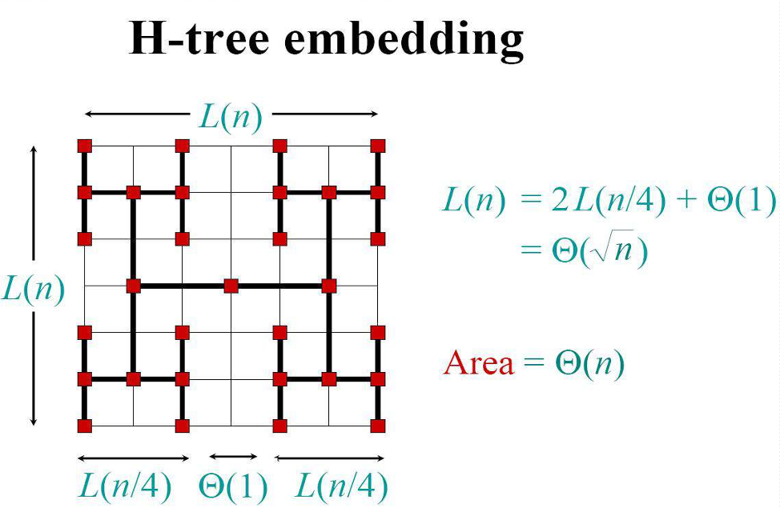

---
---
### **1.简单问题**

1.  **引入：找伪币问题**
    - **问题**：16枚硬币中有一枚较轻的伪币，用天平找出它。
    - **分治策略**：将硬币分为两组比较，每次排除一半硬币。
    - **复杂度**：仅需 $\log_2 n$ 次比较（e.g., 16枚需4次）。
2.  **计算**$a^n$
    - **直接法**：O(n) 次乘法。
    - **分治法**：
      - n 为偶数：$a^n = (a^{n/2})^2$
      - n 为奇数：$a^n = (a^{(n-1)/2})^2 \times a$
    - **复杂度**：$T(n) = T(n/2) + \Theta(1) = O(\log n)$。
3.  **Fibonacci 数列** - **直接法**：迭代计算 $F_n = F_{n-1} + F_{n-2}$，$O(n)$。- **矩阵分治法**：
    $\begin{bmatrix} F_{n+1} & F_n \\ F_n & F_{n-1} \end{bmatrix} = \begin{bmatrix} 1 & 1 \\ 1 & 0 \end{bmatrix}^n$ - **复杂度**：矩阵幂计算 $O(\log n)$。
4.  **金块问题（最大最小值）**
    - **直接法**：遍历比较，需 $2n-3$次比较。
    - **分治法**：
      - 将数组分为两半，递归求每部分最大/最小值。
      - 合并时比较两部分结果（2次比较）。
    - **递推式**：$c(n) = 2c(n/2) + 2$。
    - **复杂度**：$c(n) = \frac{3n}{2} - 2$（优于直接法25%）。
5.  **大整数乘法**
    - **直接法**：$O(n^2)$。
    - **分治法**：
      - 将 X, Y 分解：$X = 2^{n/2}A + B, Y = 2^{n/2}C + D$。
      - 优化计算：$XY = 2^n AC + 2^{n/2}((A-B)(D-C) + AC + BD) + BD$。
      - **仅需3次乘法**：$AC, BD, (A-B)(D-C)$。
    - **复杂度**：$T(n) = 3T(n/2) + O(n) = O(n^{\log_2 3}) \approx O(n^{1.59})$.
6.  **矩阵乘法** - **直接法**：三重循环，$O(n^3)$。- **Strassen算法**：
    [详解矩阵乘法中的Strassen算法 - 知乎](https://zhuanlan.zhihu.com/p/78657463)
    [Strassen矩阵乘法.\_哔哩哔哩\_bilibili](https://www.bilibili.com/video/BV1upGbz5EbW/?spm_id_from=333.337.search-card.all.click&vd_source=7675af15891f3aabbc21b6f21ceaaf33)
    > [!note] 🃏
    > _把计算矩阵转化为算一个4x4x4的三阶张量，三阶对应3个矩阵，4对应的是每个矩阵4个子块，一个分量元素对应的3个块相关就是1，不相关的就是0。这个张量的秩是\***\*7\*\***，所以C能用7个乘积式的线性组合表示。也就是复杂度可以被降到 _$O（n^{log_27}）$
        - **一些进展（稍微了解）**：Coppersmith-Winograd $O(n^{2.376})$ → 2023年清华团队 $O(n^{2.372}$)。

### **2.复杂问题**

7. **VLSI布线问题**
    - **目标**：在网格布局中连接电路元件。- **分治策略**：递归将芯片划分为子区域，独立布线后合并，现实中集成电路的簇也就是这么排的。
8. **残缺棋盘覆盖**

9. **归并排序（Merge Sort）** - **步骤**：- **分**：数组分为两半。- **治**：递归排序子数组。- **合**：合并有序子数组。
   $\boxed{
\begin{aligned}
&\text{\textbf{Algorithm MergeSort}(A, left, right)} \\
&\quad \text{\textbf{Input}: } \text{数组}A, \text{边界}left, right \\
&\quad \text{\textbf{Output}: } \text{有序数组}A \\
&\quad \text{\textbf{Procedure}:} \\
&\quad 1.\ \mathbf{if}\ left \geq right\ \mathbf{return} \textcolor{gray}{\text{// 递归基}}\\
&\quad 2.\ mid \leftarrow \left\lfloor \frac{left + right}{2} \right\rfloor \\
&\quad 3.\ \text{MergeSort}(A, left, mid) \quad \textcolor{gray}{\text{// 递归排序左半部分}} \\
&\quad 4.\ \text{MergeSort}(A, mid+1, right) \quad \textcolor{gray}{\text{// 递归排序右半部分}} \\
&\quad 5.\ \text{Merge}(A, left, mid, right) \quad \textcolor{gray}{\text{// 合并两个有序子数组}} \\
&\quad \mathbf{end\ procedure} \\
\\
&\text{\textbf{Algorithm Merge}(A, left, mid, right)} \\
&\quad 1.\ \text{初始化临时数组} \ temp \\
&\quad 2.\ i \leftarrow left,\ j \leftarrow mid+1,\ k \leftarrow 0 \\
&\quad 3.\ \mathbf{while}\ i \leq mid\ \mathbf{and}\ j \leq right \\
&\quad \quad \mathbf{if}\ A[i] \leq A[j] \\
&\quad \quad \quad temp[k] \leftarrow A[i] \\
&\quad \quad \quad i \leftarrow i + 1 \\
&\quad \quad \mathbf{else} \\
&\quad \quad \quad temp[k] \leftarrow A[j] \\
&\quad \quad \quad j \leftarrow j + 1 \\
&\quad \quad k \leftarrow k + 1 \\
&\quad 4.\ \text{将剩余元素加入} temp \\
&\quad 5.\ \text{将} temp \text{复制回} A[left..right] \\
&\quad \mathbf{end\ procedure}
\end{aligned}
}$ - **复杂度**：$T(n) = 2T(n/2) + O(n) = O(n \log n)$.
10. **快速排序（Quick Sort）** - **步骤**：- **分**：选基准（pivot），划分数组为左（≤基准）、右（≥基准）两段。- **治**：递归排序左右段。- **合**：无需合并（原地排序）。- **复杂度**：- **最坏**：$O(n^2)$（当划分极度不平衡）。- **平均**：$O(n \log n)$。
    $\boxed{
\begin{aligned}
&\text{\textbf{Algorithm QuickSort}(A, left, right)} \\
&\quad \text{\textbf{Input}: } \text{数组}A,\ 边界left,right \\
&\quad \text{\textbf{Output}: } \text{有序数组}A \\
&\quad \text{\textbf{Procedure}:} \\
&\quad 1.\ \mathbf{if}\ left \geq right\ \mathbf{return} \\
&\quad 2.\ pivot \leftarrow \text{\textbf{Partition}}(A, left, right) {\text{// 生成支点算法，当然是越接近中间越好}}\\
&\quad 3.\ \text{QuickSort}(A, left, pivot-1) \\
&\quad 4.\ \text{QuickSort}(A, pivot+1, right) \\
&\quad \mathbf{end\ procedure}
\end{aligned}
}$

<!-- Column 1 -->

$\boxed{
\begin{aligned}
&\text{\textbf{Algorithm NaiveSelect}(A, k)} \\
&\quad 1.\ \text{Sort } A \quad \textcolor{gray}{\text{// } O(n \log n)} \\
&\quad 2.\ \mathbf{return}\ A[k-1] \quad \textcolor{gray}{\text{// 0-based索引}} \\
\end{aligned}
}$

<!-- Column 2 -->

11. **选择问题（第k小元素）** - **直接法**：排序后取第k个，$O(n \log n)$。- **分治法（BFPRT）**：- 将数组分为5元组，求每组中位数。- 递归求中位数的中位数（pivot）。- 按pivot划分数组，递归在子集中查找。
    $\boxed{
\begin{aligned}
&\text{\textbf{Algorithm QuickSelect}(A, left, right, k)} \\
&\quad \text{\textbf{Input}: } \text{数组}A, \text{边界}left, right, \text{目标秩}k \\
&\quad \text{\textbf{Output}: } \text{第} k \text{小元素} \\
&\quad \text{\textbf{Procedure}:} \\
&\quad 1.\ \mathbf{if}\ left = right\ \mathbf{return}\ A[left] \\
&\quad 2.\ pivot\_index \leftarrow \text{Partition}(A, left, right) \\
&\quad 3.\ pivot\_rank \leftarrow pivot\_index - left + 1 \\
&\quad 4.\ \mathbf{match}\ pivot\_rank\ \text{与}\ k: \\
&\quad \quad \bullet\ \mathbf{if}\ k = pivot\_rank\ \mathbf{return}\ A[pivot\_index] \\
&\quad \quad \bullet\ \mathbf{elif}\ k < pivot\_rank \\
&\quad \quad \quad \mathbf{return}\ \text{QuickSelect}(A, left, pivot\_index-1, k) \\
&\quad \quad \bullet\ \mathbf{else} \\
&\quad \quad \quad \mathbf{return}\ \text{QuickSelect}(A, pivot\_index+1, right, k - pivot\_rank) \\
&\quad \mathbf{end\ procedure} \\
\\
&\text{\textbf{Algorithm Partition}(A, left, right)} \\
&\quad 1.\ \text{选择枢轴元素} \ pivot \leftarrow A[\text{随机索引}] \\
&\quad 2.\ i \leftarrow left - 1 \\
&\quad 3.\ \mathbf{for}\ j \leftarrow left\ \mathbf{to}\ right-1 \\
&\quad \quad \mathbf{if}\ A[j] \leq pivot \\
&\quad \quad \quad i \leftarrow i + 1 \\
&\quad \quad \quad \text{交换} A[i] \text{与} A[j] \\
&\quad 4.\ \text{交换} A[i+1] \text{与} A[right] \\
&\quad 5.\ \mathbf{return}\ i + 1 \quad \textcolor{gray}{\text{// 返回枢轴最终位置}} \\
&\quad \mathbf{end\ procedure}
\end{aligned}
}$
    **eg：输入数组**：_A_=[3,1,4,2,5], *k*=3
    **快速选择步骤**：1. 随机选择枢轴 2，分区后得 [1,2,3,4,5], *pivot*_*rank*=2 2. 因 *k*=3>*pivot*__rank_=2，递归处理右子数组 [3,4,5] 且 *k*=1 3. 在 [3,4,5] 中选择枢轴 4，分区后得 [3,4,5], *pivot*_*rank*=2 4. 因 *k*=1<*pivot*__rank_=2，递归处理左子数组 [3]。5. 返回最终结果 3 - **复杂度**：$T(n) = T(n/5) + T(3n/4) + O(n) = O(n)$.

12. **最近点对问题** - **暴力法**：$O(n^2)$。- **分治法**：1. 按x坐标中位数分割平面。2. 递归求左右子集的最小距离 d。3. 检查跨越分割线的点对（只需检查中间带状区域内的点）。4. 带状区域内点按y排序，每个点最多检查6个邻居。==（为什么？这涉及到一个证明问题，事实上只需要在本区块对面的区块的2d\*d的区域内查找就可以了）==
    $\boxed{
\begin{aligned}
&\text{\textbf{Algorithm ClosestPair}(Points)} \\
&\quad \text{\textbf{Input}: } \text{A set of } n \text{ points } P = \{p1, ..., pn\} \\
&\quad \text{\textbf{Output}: } \text{Minimum distance between any two points} \\
&\quad \text{\textbf{Procedure}:} \\
&\quad 1.\ \text{Sort } P \text{ by x-coordinate} \Rightarrow Px \\
&\quad 2.\ \text{Sort } P \text{ by y-coordinate} \Rightarrow Py  \quad //先将坐标有序化\\
&\quad 3.\ \mathbf{return}\ \text{RecursiveClosest}(Px, Py) \\
\\
&\text{\textbf{Algorithm RecursiveClosest}(Px, Py)} \\
&\quad 1.\ n \leftarrow \text{length of } Px \\
&\quad 2.\ \mathbf{if}\ n \leq 3\ \mathbf{return}\ \text{BruteForceDistance}(Px) \\
&\quad 3.\ mid \leftarrow n // 2 \\
&\quad 4.\ Qx \leftarrow Px[1..mid], Rx \leftarrow Px[mid+1..n] \\
&\quad 5.\ Qy, Ry \leftarrow \text{Split } Py \text{ according to } Qx, Rx \\
&\quad 6.\ dL \leftarrow \text{RecursiveClosest}(Qx, Qy) \\
&\quad 7.\ dR \leftarrow \text{RecursiveClosest}(Rx, Ry) \\
&\quad 8.\ d \leftarrow \min(dL, dR) \\
&\quad 9.\ S \leftarrow \text{Points within } d \text{ of vertical divider} \\
&\quad 10.\ \text{Sort } S \text{ by y-coordinate} \Rightarrow Sy \\
&\quad 11.\ \text{For each } pi \in Sy: \\
&\quad \quad \text{Check distance to next } 6 \text{ points in } Sy \\
&\quad 12.\ \mathbf{return}\ \min(d, \text{min cross-pair distance}) \\
\end{aligned}
}$ - **复杂度**：$T(n) = 2T(n/2) + O(n) = O(n \log n)$.
13. **循环赛日程安排**
    

- **问题**：为 $n=2^k$ 选手安排 $n-1$ 天赛程。
- **分治法**：- 递归生成 $n/2$ 选手的日程表。- 通过矩阵复制填充完整日程（左上→右下，左下→右上）。
  $\boxed{
\begin{aligned}
&\text{\textbf{Algorithm ScheduleTournament}(n)} \\
&\quad \text{\textbf{Input}: } \text{选手数量}n = 2^k \\
&\quad \text{\textbf{Output}: } n \times n \text{日程表}T \\
&\quad \text{\textbf{Procedure}:} \\
&\quad 1.\ \mathbf{if}\ n = 1 \\
&\quad \quad T[1][1] \leftarrow 1 \\
&\quad \quad \mathbf{return}\ T \\
&\quad 2.\ \text{递归生成子日程表} \Rightarrow T_{sub} = \text{ScheduleTournament}(n/2) \\
&\quad 3.\ \text{填充日程表:} \\
&\quad \quad \bullet\ \text{左上块} \leftarrow T_{sub} \\
&\quad \quad \bullet\ \text{右上块} \leftarrow T_{sub} + n/2 \\
&\quad \quad \bullet\ \text{左下块} \leftarrow T_{sub} + n/2 \\
&\quad \quad \bullet\ \text{右下块} \leftarrow T_{sub} \\
&\quad 4.\ \mathbf{return}\ T \\
&\quad \mathbf{end\ procedure}
\end{aligned}
}$
- **复杂度**：$T(n) = T(n/2) + O(n^2) = O(n^2).$

---
