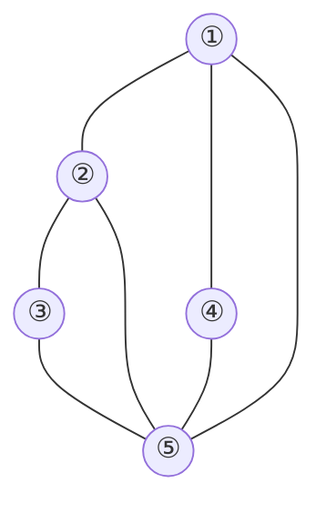

---
---

**问题定义**

最大团是图中顶点数最多的**完全子图**，即任意两顶点间均有边相连，且不被其他更大的完全子图包含。

**回溯法核心思想**

通过深度优先搜索遍历所有可能的顶点子集，利用剪枝条件减少无效搜索，快速找到最大团。

**解表示与状态空间树**

- **解表示**：使用固定长度元组 $X = x[1..n]$ ，其中 ( x[i] = 1 ) 表示顶点 i 被包含在团中，否则为0 。
- **状态空间树**：子集树，每个节点代表是否包含某顶点的选择。

**剪枝条件**

1. **完全子图检查**：若当前顶点 ( i ) 无法与已选顶点构成完全子图（存在未连接的顶点），则剪枝。
2. **剩余顶点数限制**：若当前团大小（$( \text{cn} )$）加上剩余顶点数（( n - i )）不超过当前最优解（( $\text{bestn}$)），则剪枝。

**算法步骤**

3. **初始化**：设置数组 ( x ) 记录当前团，( $\text{cn}$ ) 记录当前团大小，( $\text{bestn}$ ) 记录最大团大小，( $\text{bestx}$ ) 记录最大团顶点集合。
4. **递归搜索**：
   - **终止条件**：处理完所有顶点（( i > n )），若当前团更大则更新 ( $\text{bestn}$ ) 和 ( $\text{bestx}$)。
   - **选择顶点 ( i )**：检查 ( i ) 是否与已选顶点均相连。若满足，标记 ( x[i] = 1 )，递归处理 ( i+1 )，回溯后重置 ( x[i] )。
   - **不选顶点 ( i )**：若剩余顶点数允许可能超过当前最优解（$( \text{cn} + (n - i) > \text{bestn} )$），则递归处理 ( i+1 )。

**代码**

```c++
const int MAXN = 100;
int a[MAXN][MAXN];  // 图的邻接矩阵
int x[MAXN];         // 当前解
int bestx[MAXN];     // 最优解
int cn = 0;          // 当前团大小
int bestn = 0;       // 最大团大小
int n;               // 顶点数
void maxClique(int i) {
    if (i > n) {  // 到达叶子节点
        if (cn > bestn) {
            bestn = cn;
            for (int j = 1; j <= n; j++) {
                bestx[j] = x[j];
            }
        }
        return;
    }
    // 检查顶点i能否加入当前团
    bool canAdd = true;
    for (int j = 1; j < i; j++) {
        if (x[j] && !a[i][j]) {
            canAdd = false; break;
        }
    }
    // 选择顶点i
    if (canAdd) {
        x[i] = 1;
        cn++;
        maxClique(i + 1);
        x[i] = 0;  // 回溯
        cn--;
    }
    // 不选顶点i（限界剪枝）
    if (cn + n - i > bestn) {
        x[i] = 0;maxClique(i + 1);
    }
}
```

$$\boxed{
\begin{aligned}
&\text{\textbf{Algorithm MaxClique}(i)} \\
&\quad \text{\textbf{Input}: } \text{当前顶点编号 } i \\
&\quad \text{\textbf{Global}: } \\
&\quad \quad \bullet\ a[1..n][1..n] \quad \text{图的邻接矩阵} \\
&\quad \quad \bullet\ x[1..n], bestx[1..n] \quad \text{当前解和最优解} \\
&\quad \quad \bullet\ cn, bestn \quad \text{当前团大小和最大团大小} \\
&\quad \text{\textbf{Procedure}:} \\
&\quad 1.\ \mathbf{if}\ i > n: \quad \textcolor{gray}{// 到达叶子节点} \\
&\quad \quad \quad \mathbf{if}\ cn > bestn: \\
&\quad \quad \quad \quad bestn \leftarrow cn \\
&\quad \quad \quad \quad bestx[1..n] \leftarrow x[1..n] \\
&\quad \quad \quad \mathbf{return} \\
&\quad 2.\ \text{检查顶点 } i \text{ 能否加入当前团:} \\
&\quad \quad canAdd \leftarrow \text{true} \\
&\quad \quad \mathbf{for}\ j \leftarrow 1\ \mathbf{to}\ i-1: \\
&\quad \quad \quad \mathbf{if}\ x[j] = 1\ \wedge\ a[i][j] = 0: \\
&\quad \quad \quad \quad canAdd \leftarrow \text{false} \\
&\quad \quad \quad \quad \mathbf{break} \\
&\quad 3.\ \mathbf{if}\ canAdd: \quad \textcolor{gray}{// 选择顶点i} \\
&\quad \quad \quad x[i] \leftarrow 1 \\
&\quad \quad \quad cn \leftarrow cn + 1 \\
&\quad \quad \quad \text{MaxClique}(i + 1) \\
&\quad \quad \quad x[i] \leftarrow 0 \quad \textcolor{gray}{// 回溯} \\
&\quad \quad \quad cn \leftarrow cn - 1 \\
&\quad 4.\ \mathbf{if}\ cn + n - i > bestn: \quad \textcolor{gray}{// 限界剪枝} \\
&\quad \quad \quad x[i] \leftarrow 0 \\
&\quad \quad \quad \text{MaxClique}(i + 1) \\
&\quad \mathbf{end\ procedure}
\end{aligned}
}$$

**示例分析**



- **图中顶点 {1,2,5} 构成最大团**：回溯过程中，依次选择顶点1、2、5，验证连后更新最优解。
- **剪枝生效场景**：若当前团为 {1,2}，剩余顶点3与1不相连，则无法加入，剪去该分支。

**效率优化**

- **完全子图剪枝**：避免生成非完全子图的分支。
- **剩余顶点数剪枝**：提前终止无法超越当前最优解的分支，减少搜索空间。

**总结**

回溯法通过系统遍历子集树，结合剪枝策略高效求解最大团问题，时间复杂度为 ( $O(2^n)$)，但实际性能因剪枝大幅提升。
